# Multitask Learning

> Rich Caruana | School of Computer Science, Carnegie Mellon University

本文是多任务学习（MTL，Multitask Learning）的奠基性论文，详细阐述了多任务学习的原理、机制和应用。核心内容：

- 提出多任务学习是一种 **归纳迁移方法**，通过**并行学习多个相关任务来提高泛化性能**
- 证明反向传播网络中的多任务学习能够在无需监督信号的情况下发现任务相关性
- 展示多任务学习在真实世界问题中的广泛应用机会

关键发现：

- **多任务学习通过共享表示，使每个任务的学习能够 帮助其他任务学得 更好**
- **额外任务的训练信号作为归纳偏置，能够显著提升 主任务的泛化能力**
- 多任务学习不仅适用于神经网络，还可应用于 k 近邻、决策树等多种学习算法

---

## 摘要

多任务学习（MTL，Multitask Learning）是一种归纳迁移方法，通过利用 **相关任务训练信号中包含的领域信息** 作为 归纳偏置 来提高泛化性能。它通过并行学习多个任务**并使用共享表示**来实现这一点；**每个任务学到的内容可以帮助其他任务学得更好**。本文回顾了 MTL 的先前工作，提供了新的证据表明反向传播网络中的 MTL 能够在无需监督信号的情况下发现任务相关性，并给出了 k 近邻（k-NN，k-Nearest Neighbor）和核回归（KR，Kernel Regression）中 MTL 的新结果。我们在三个领域中演示了多任务学习。我们解释了多任务学习的工作原理，并展示了在真实领域中存在许多多任务学习的机会。我们提出了基于案例方法（如 k 近邻和核回归）的多任务学习算法和结果，并概述了决策树中多任务学习的算法。由于多任务学习有效、可应用于许多不同领域、并可与不同学习算法结合使用，我们推测它在实际问题中将有许多应用机会。

**关键词**：**inductive transfer**, parallel transfer, multitask learning, backpropagation, k-nearest neighbor, kernel regression, supervised learning, generalization

## 1. 引言

### 1.1 概述

多任务学习（MTL，Multitask Learning）是一种**归纳迁移机制**，其主要目标是提高泛化性能。**MTL 通过利用相关任务训练信号中包含的特定领域信息来提高泛化性能**。它通过并行训练多个任务并使用共享表示来实现这一点。实际上，**额外任务的训练信号充当了归纳偏置**。第 1.2 节论证了如果我们希望将从零开始的学习扩展到复杂的现实世界任务，归纳迁移是重要的。第 1.3 节介绍了我们所知的最简单的多任务归纳迁移方法，即**在反向传播网络中添加额外任务（即额外输出）**。**由于 MTL 网络使用在所有任务上并行训练的 共享隐藏层，每个任务学到的内容可以帮助其他任务学得更好**。第 1.4 节论证了当训练信号以这种方式使用时，将其视为归纳偏置是合理的。

第 2 节证明了 MTL 是有效的。我们在三个问题上比较了单任务学习（STL，Single Task Learning，一次只学习一个任务）和多任务学习在反向传播中的性能。其中一个问题是其他研究人员创建的真实世界问题，**他们在收集数据时没有考虑使用 MTL**。

第 3 节解释了反向传播网络中 MTL 的工作原理。第 3.1 节提出了**即使额外任务的训练信号与主任务不相关也能提高泛化性能的机制**。我们提出了一个经验测试来排除这些机制，从而确保 MTL 的收益来自额外任务中的信息。在第 3.2 节中，我们提出了解释 MTL 如何利用额外训练信号中的信息来提高泛化性能的机制。在第 3.3 节中，我们展示了反向传播网络中的 MTL 能够在没有明确的任务相关性训练信号的情况下确定任务之间的关系。

第 4 节可能是本文最重要的部分。它展示了在现实世界问题中存在许多 MTL（以及归纳迁移）的机会。乍一看，当今机器学习中的大多数问题看起来不像是多任务问题。我们相信，由于我们的训练方式，大多数当前的机器学习问题看起来是单任务的。许多——事实上，我们认为大多数——**现实世界问题是多任务问题，当我们将它们视为单任务问题时，性能正在被牺牲**。

第 1-4 节使用了我们所知的最简单的 MTL 算法，即**具有多个输出并共享单个全连接隐藏层**的反向传播网络。但 MTL 是一组思想、技术和算法的集合，而不是一种算法。在第 5 节中，我们提出了 k 近邻和决策树的 MTL 算法。**虽然这些算法看起来与反向传播网络中的 MTL 相当不同，但在机制和问题上存在强烈的重叠；所有 MTL 算法都 必须解决本质上相同 的一组问题，即使每种算法中的具体机制不同。**

归纳迁移并不新鲜，许多反向传播网络在 MTL 出现之前就使用了多个输出。相关工作在第 6 节中介绍。第 7 节讨论了 MTL 中出现的许多问题，并简要提及了未来工作。第 8 节是总结。

### 1.2 动机

机器学习的标准方法是一次学习一个问题。大型问题被分解为小的、合理独立的子问题，分别学习然后重新组合（例如，参见 Waibel 在连接主义胶水方面的出色工作 [62]）。本文认为，**有时这种方法适得其反，因为它忽略了现实世界问题中许多潜在的丰富信息源：来自同一领域的其他任务的训练信号中包含的信息**。

在单个、孤立、非常困难的任务上从零开始训练的人工神经网络（或决策树，或……）不太可能很好地学习它。例如，一个具有 1000x1000 像素输入视网膜的网络，考虑到可能可用的训练模式和训练时间，不太可能学习识别现实世界场景中的复杂对象。要求学习器同时学习许多事情是否会更好？是的。**如果任务可以共享它们学到的内容，学习器可能会发现一起学习它们比单独学习更容易**。因此，如果我们同时训练网络来识别对象轮廓、形状、边缘、区域、子区域、纹理、反射、高光、阴影、文本、方向、大小、距离等，它可能会更好地学习识别现实世界中的复杂对象。这种方法就是多任务学习。

### 1.3 反向传播网络中的 MTL

图 1 显示了四个独立的人工神经网络（ANN，Artificial Neural Networks）。每个网络都是相同输入的函数，并且有一个输出。反向传播通过单独训练每个网络应用于这些网络。**由于四个网络没有连接，一个网络学到的内容不可能帮助另一个网络**。我们将这种方法称为单任务学习（STL，Single Task Learning）。

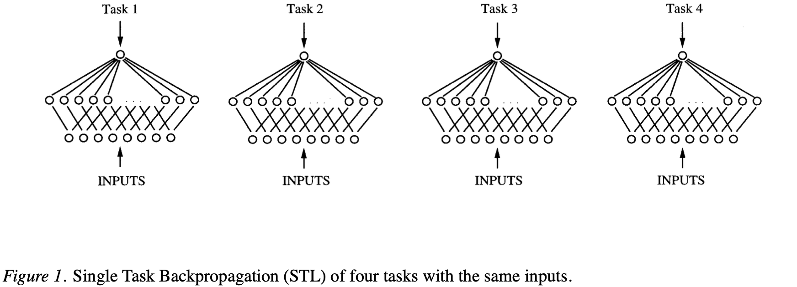

图 1：四个具有相同输入的任务的单任务反向传播 (STL)

图 2 显示了一个与图 1 中四个网络具有相同输入的单个网络，但具有四个输出，每个输出对应图 1 中网络正在训练的一个任务。注意这四个输出完全连接到一个它们共享的隐藏层。MTL 网络中的四个输出并行进行反向传播。由于四个输出共享一个公共隐藏层，一个任务在隐藏层中产生的内部表示可以被其他任务使用。**在任务并行训练时 共享不同任务学到的内容 是多任务学习的核心思想** [54,21,22,55,9,10,11,5,6,7,13]。

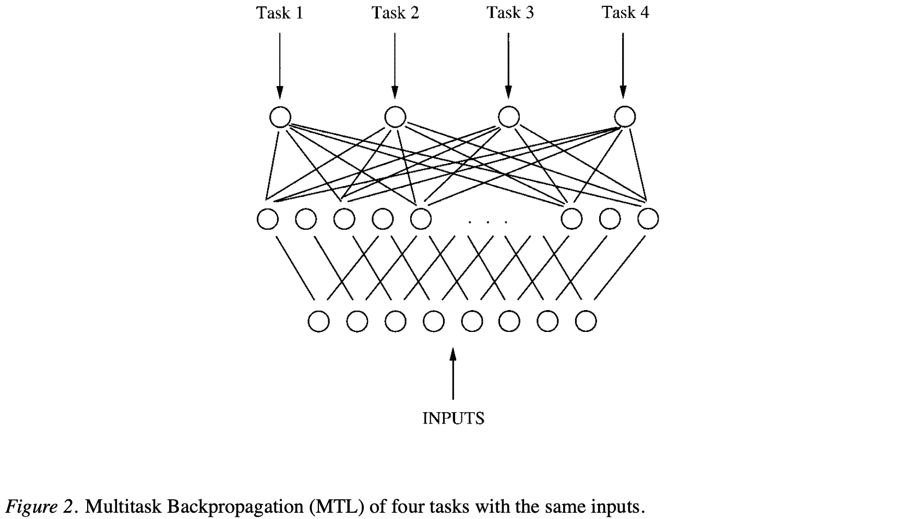

图 2：四个具有相同输入的任务的多任务反向传播 (MTL) 

**MTL 是一种 使用相关任务训练信号中包含的特定领域信息 的 归纳迁移方法**。它通过并行学习多个任务并**使用共享表示**来实现这一点。在反向传播中，MTL 允许为一个任务在隐藏层中开发的特征被其他任务使用。**它还允许开发支持多个任务的特征，这些特征在任何单独训练的 STL 网络中都不会被开发。**重要的是，MTL 还允许一些隐藏单元专门用于一个或几个任务；其他任务可以通过保持连接到它们的权重较小来忽略它们认为无用的隐藏单元。

### 1.4 训练信号作为归纳偏置

MTL 是实现任务间归纳迁移的一种方法。**归纳迁移的目标是 利用额外的信息源 来提高当前任务的学习性能**。归纳迁移可用于提高泛化精度、学习速度 和 学习模型的可理解性。在本文中，我们仅关注提高精度。我们**不关心学习的计算成本或所学内容的可理解性**。

**迁移提高泛化的一种方式是提供 比没有额外知识时更强的归纳偏置**。这可以**在固定训练集的情况下产生更好的泛化**，或者**减少达到某个固定性能水平所需的训练模式数量**。

**归纳偏置 是 任何导致归纳学习器 偏好某些假设 而非 其他假设 的东西**。**无偏学习是不可能的**；归纳学习器的大部分能力直接来自其归纳偏置的能力 [38]。**多任务学习使用相关任务的训练信号作为归纳偏置来提高泛化**。

人们通常不会认为训练信号是一种偏置；但当训练信号用于主任务以外的任务时，很容易看出，从主任务的角度来看，其他任务可能充当偏置。**这种多任务偏置 导致归纳学习器偏好解释多个任务的假设。为了使这种多任务偏置存在，归纳学习器必须被偏向于偏好在多个任务中具有实用性的假设。**

> [!NOTE]
>
> 这段是全文重点

## 2. MTL 是否有效？

在深入探讨多任务学习的工作原理和使用时机之前，我们首先证明它是有效的。我们这样做不仅是为了说服读者多任务学习是有价值的，而且因为这些例子将帮助读者建立对多任务学习工作原理和适用领域的直觉。

在本节中，我们介绍了 MTL 在反向传播网络中的三个应用。第一个使用 ALVINN 风格的**道路跟踪领域**的模拟数据。第二个使用机器人摄像头收集的真实数据。这个数据专门收集来演示 MTL。第三个领域将 MTL 应用于**医疗决策领域**。该领域的数据由其他研究人员收集，他们在收集数据时没有考虑使用 MTL。

### 2.1 1D-ALVINN

1D-ALVINN 使用了 Pomerleau 首先开发的**道路图像模拟器**，用于快速测试道路跟踪领域的学习想法 [43]。原始模拟器根据许多用户定义的参数（如道路宽度、车道数量、摄像头角度和视野）生成合成道路图像。我们修改了模拟器，生成由单个 32 像素水平扫描线组成的一维道路图像，而不是原始的 2-D 30x32 像素图像。我们这样做是为了加速学习，以便进行更彻底的实验——使用完整的 2-D 视网膜训练中等规模的网络在计算上过于昂贵，无法进行多次复制。尽管如此，1D-ALVINN 保留了原始 2-D 领域的大部分复杂性；失去的主要复杂性是**道路曲率**不再可见，较小的输入（960 像素 vs. 32 像素）使学习更容易。

1D-ALVINN 和 2D-ALVINN 的**主要任务都是预测转向方向**。对于我们的 MTL 实验，使用了八个额外任务：

- 道路是单车道还是双车道
- 道路左边缘的位置
- 道路中心的位置
- 道路旁边区域的强度
- 中心线的位置（仅限双车道）
- 道路右边缘的位置
- 路面的强度
- 中心线的强度（仅限双车道）

这些额外任务都可以从模拟器中的内部变量计算得出。我们修改了模拟器，使这些额外任务的训练信号与主要转向任务的训练信号一起添加到合成数据中。

表 1 显示了使用具有一个隐藏层的网络在 1D-ALVINN 上进行单任务和多任务学习十次运行的性能。MTL 网络有 32 个输入、16 个隐藏单元和 9 个输出。36 个 STL 网络有 32 个输入、2、4、8 或 16 个隐藏单元，每个网络有 1 个输出。注意 MTL 网络的大小没有经过优化。

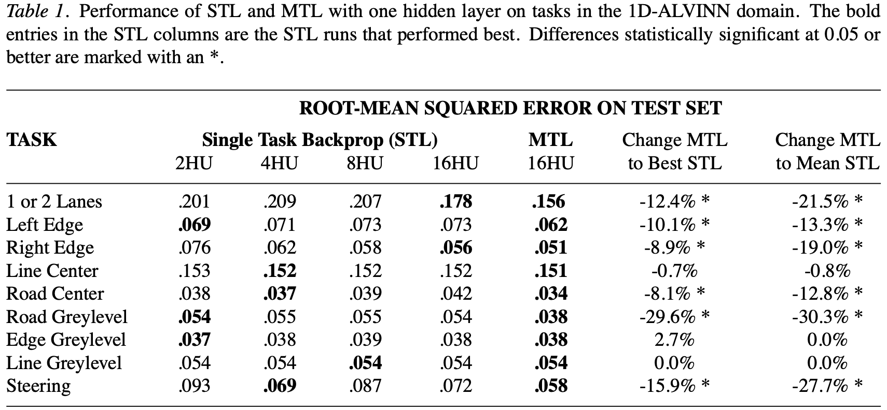

表 1：1D-ALVINN 领域中具有一个隐藏层的 STL 和 MTL 在任务上的性能

STL 和 MTL 标题下的条目是 使用 提前停止来停止训练时指定大小网络的泛化误差。加粗的 STL 条目是产生最佳性能的 STL 运行。最后两列比较了 STL 和 MTL。第一列是 MTL 相对于最佳 STL 运行的误差减少百分比。负百分比表示 MTL 表现更好。此测试偏向于 STL，因为它将未优化网络大小的 MTL 单次运行与使用不同随机种子并能够找到近似最优网络大小的多次独立 STL 运行进行比较。最后一列是 MTL 相对于平均 STL 性能的改进百分比。标有"*"的差异在 0.05 或更好水平上具有统计显著性。注意，在重要的转向任务上，MTL 优于 STL 15-30%。它在没有任何额外训练模式的情况下做到了这一点：STL 和 MTL 使用完全相同的训练模式。唯一的区别是 MTL 训练模式包含所有九个任务的训练信号，而 STL 训练模式一次只包含一个任务的训练信号。

### 2.2 1D-DOORS

1D-ALVINN 不是真实领域；数据是用模拟器生成的。为了在更现实的问题上测试 MTL，我们创建了一个在某些方面类似于 1D-ALVINN 的对象识别领域。在 1D-DOORS 中，主要任务是在使用机器人安装的彩色摄像头收集的门图像中定位门把手和识别门类型（单门或双门）。图 3 显示了数据库中的几个门图像。与 1D-ALVINN 类似，通过使用图像的水平条带简化了问题，一个用于绿色通道，一个用于蓝色通道。每个条带宽 30 像素（通过对原始 150 像素宽的图像应用高斯平滑实现），出现在图像中门把手所在的垂直高度。使用了十个任务。它们是：

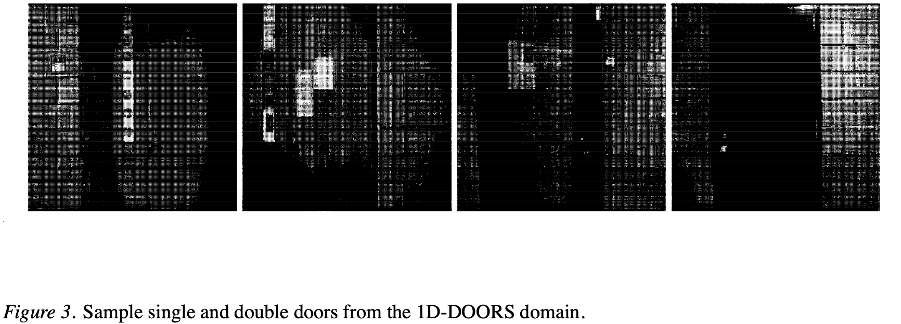

图 3：1D-DOORS 领域中的单门和双门示例

- 门把手的水平位置
- 门口中心的水平位置
- 左门框的水平位置
- 左门框的宽度
- 门左边缘的水平位置
- 单门还是双门
- 门口的宽度
- 右门框的水平位置
- 右门框的宽度
- 门右边缘的水平位置

由于这是一个真实领域，这些任务的训练信号必须手动获取。我们使用鼠标在训练集和测试集中的每个图像上点击相应的特征。由于需要手动处理每个图像以获取两个主要任务的训练信号，获取额外任务的训练信号并不太困难。

1D-DOORS 的难度使得无法进行与 1D-ALVINN 一样彻底的实验集；只能对我们认为最重要的两个任务进行比较：门把手位置和门类型。STL 在使用 6、24 和 96 个隐藏单元的网络上进行了测试。MTL 在具有 120 个隐藏单元的网络上进行了测试。十次试验的 STL 和 MTL 结果在表 2 中。

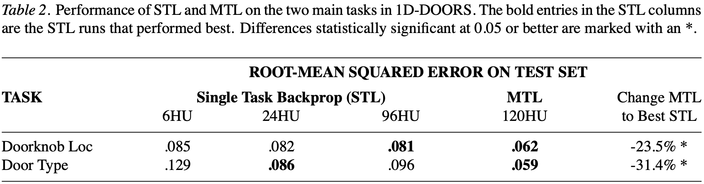

表 2：1D-DOORS 中两个主要任务上 STL 和 MTL 的性能

MTL 在这些任务上的泛化比 STL 好 20-30%，即使与三次不同 STL 运行中的最佳结果相比也是如此。同样注意，STL 和 MTL 使用的训练模式是相同的，只是 MTL 训练模式包含额外的训练信号。正是这些额外训练信号中包含的信息帮助隐藏层学习了更好的门识别领域内部表示，而这种更好的表示反过来又帮助网络更好地学习识别门类型和门把手的位置。

### 2.3 肺炎死亡率预测

我们在这里展示的第三个领域应用 MTL 于一个真实世界的问题，该问题由其他研究人员收集数据，他们在收集数据时没有考虑使用 MTL。目标是预测肺炎患者的死亡率。这是一个**困难的二元分类问题**，训练数据有 95 个样本，测试数据有 42 个样本，总共 137 个样本。每个样本有 57 个特征。这是一个医疗领域的数据集，来自 Cooper 等人 [16]。

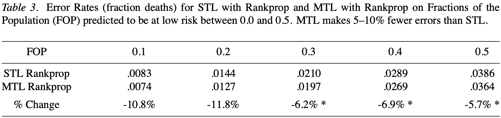

表 3：肺炎死亡率预测的 STL 和 MTL 性能

我们在这个领域测试了许多不同的网络架构和训练条件。表 3 显示了使用具有 50 个隐藏单元和一个输出单元的网络的结果。这个网络对于只有 95 个训练样本的问题来说相对较大。尽管如此，MTL 仍然显著优于 STL。在这个领域中，我们使用了**八个额外任务**。主要任务是预测肺炎患者的死亡率。八个额外任务是预测住院时间、是否需要机械通气、是否进行了有创检查、年龄、是否为急诊入院、动脉血氧分压、是否需要插管、以及白细胞计数。所有这些额外任务都可以从相同的数据集中计算得出。如图 4 所示。

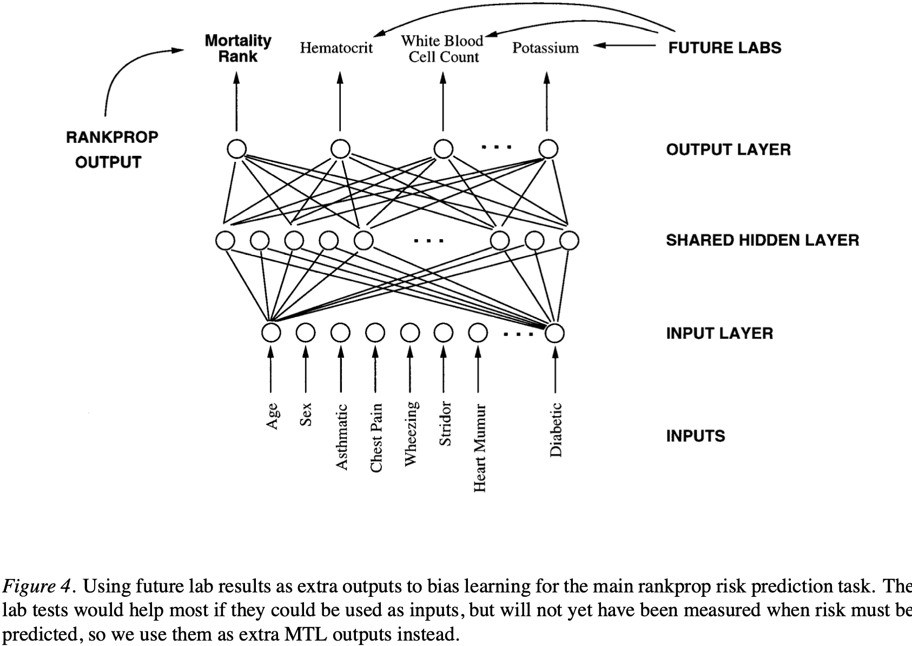

图 4：使用未来实验室结果作为额外输出来偏向主要 rankprop 风险预测任务的学习

表 3 显示了使用相同网络架构和训练条件的 STL 和 MTL 结果，但网络配置有所不同。STL 使用一个具有 50 个隐藏单元和一个输出的网络。MTL 使用一个具有 50 个隐藏单元和九个输出的网络。两个网络都使用相同的 95 个训练样本。MTL 在这个困难的医疗问题上显著优于 STL。

## 3. MTL 如何工作？

本节解释反向传播网络中 MTL 的工作原理。我们首先描述可能的机制，然后设计实验来测试这些机制。我们表明，**MTL 提高泛化性能的主要机制是通过 任务相关性**。我们还表明，MTL 能够在没有明确监督信号的情况下发现任务之间的关系。

### 3.1 可能的机制

有许多可能的机制可以解释为什么 MTL 可能比 STL 表现更好。在本节中，我们描述其中的一些机制，并提出实验来测试它们。

#### 3.1.1 隐式数据增强

MTL 可能表现更好的一个原因是**隐式数据增强**。通过添加额外任务，我们为网络提供了**更多关于域中底层函数的信息**。额外任务的训练信号提供了关于哪些特征是重要的以及它们如何相关的额外信息。**这有效地增加了 可用于学习域中 底层函数 的训练数据量。这类似于数据增强，但不是修改输入模式，而是添加额外的输出模式。**

#### 3.1.2 注意力聚焦

MTL 可能表现更好的另一个原因是注意力聚焦。如果**任务共享许多共同特征**，那么额外任务的训练信号可以帮助网络**关注这些共享特征**。这可以防止网络将注意力分散到所有特征上，包括那些对主要任务不重要的特征。

#### 3.1.3 正则化

MTL 可能表现更好的第三个原因是正则化。**额外任务可以充当正则化器，防止网络过拟合训练数据**。**这是因为额外任务的训练信号对网络参数施加了额外的约束。这些约束可以防止网络变得过于复杂，从而提高泛化性能。**

#### 3.1.4 任务特定表示

MTL 允许网络学习一些**专门用于单个任务的特征**，同时也学习一些**在多个任务之间共享的特征**。这种 灵活性 使网络能够**在需要时利用任务特定的信息，同时在可能时利用共享信息**。

### 3.2 实验测试

为了测试上述机制，我们设计了一系列实验。我们首先测试隐式数据增强是否是主要机制。我们通过比较 MTL 与使用相同数量但不同训练模式的 STL 来做到这一点。如果 MTL 仍然优于 STL，那么隐式数据增强就不是主要机制。

我们发现，即使在没有额外训练模式的情况下，MTL 仍然优于 STL。这表明隐式数据增强不是主要机制。相反，**主要机制是额外任务训练信号中包含的信息。**

### 3.3 任务相关性发现

反向传播网络中的 MTL 有一个令人惊讶的特性：它能够在没有明确监督信号的情况下发现任务之间的关系。这意味着 MTL 网络能够自动确定哪些任务是相关的，哪些任务是不相关的，并相应地调整其学习策略。

我们通过分析 MTL 网络的隐藏层来证明这一点。我们发现，**相关任务的隐藏单元往往会聚集在一起，而不相关任务的隐藏单元往往会分离。**这表明 MTL 网络**正在学习任务之间的底层结构**，并利用这种结构来提高泛化性能。如图 5 所示。

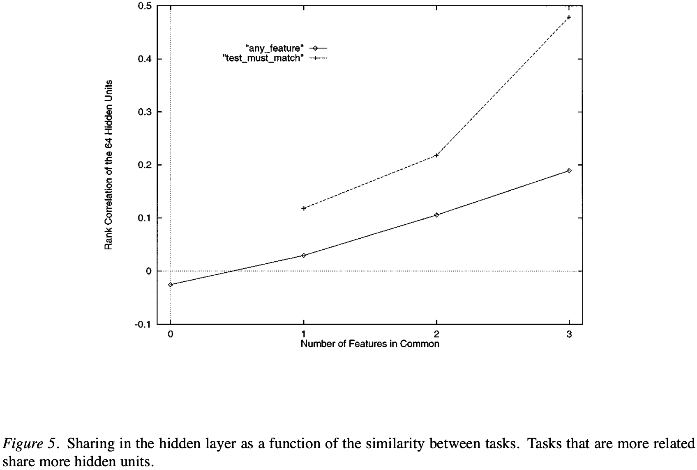

图 5：隐藏层中的共享作为任务之间相似性的函数

这种能力是 MTL 的一个关键优势，因为它意味着用户不需要明确指定哪些任务是相关的。MTL 网络能够自动发现这些关系，并相应地调整其学习策略。

> [!NOTE]
>
> TODO：没看懂这个图5意思

## 4. MTL 的机会

第 4 节可能是本文最重要的部分。它展示了在现实世界问题中存在许多 MTL（以及归纳迁移）的机会。乍一看，当今机器学习中的大多数问题看起来不像是多任务问题。我们相信，由于我们的训练方式，大多数当前的机器学习问题看起来是单任务的。许多——事实上，我们认为大多数——**现实世界问题是多任务问题，当我们将它们视为单任务问题时，性能正在被牺牲。**

### 4.1 使用未来预测现在

通常有价值的特征在必须做出预测时才变得可用。这些特征不能用作输入，因为它们在运行时将不可用。然而，如果学习是离线完成的，它们可以为训练集收集并用作额外的 MTL 任务。学习器对这些**额外任务的预测在系统使用时可能会被忽略**；它们的**主要功能是在训练期间为学习器提供额外信息**。

学习未来的一个应用是医疗风险预测，例如第 2.3 节中的肺炎风险问题。在该问题中，我们使用了训练集中可用的实验室测试——**但这些测试在为患者做出预测时将不可用——作为额外的输出任务**。这些未来测量中包含的有价值的信息**有助于偏向网络**，使其隐藏层表示**更好地支持从运行时可用的特征进行风险预测**。

**未来的测量在许多离线学习问题中都是可用的**。一个非常不同的例子是，机器人或自动驾驶车辆如果经过物体附近，可以更准确地测量物体的大小、位置和身份。例如，当车辆经过道路条纹时可以可靠地检测到它们，但在车辆前方远处检测它们超出了当前的技术水平。由于驾驶将未来的道路带到汽车附近，条纹可以在经过时准确测量并添加到训练集中。它们不能用作输入，因为在自主驾驶时它们将无法及时可用。然而，作为 MTL 输出，它们提供了额外信息，有助于学习，而无需在运行时可用。

### 4.2 多种表示和度量

有时在单个误差度量或单个输出表示中捕获所有重要内容是很困难的。当替代度量或输出表示捕获问题的不同但有用的方面时，可以使用 MTL 来从中受益。

使用不同度量的 MTL 的一个例子再次是第 2.3 节中的肺炎领域。在那里，我们使用了专门为该领域设计的 rankprop 误差度量（Caruana、Baluja 和 Mitchell，1996）。Rankprop 在该问题上比使用传统 SSE 的反向传播高出10%–40%。然而，rankprop 在风险如此低以至于几乎所有患者都存活的情况下可能难以学习排序。Rankprop 在这些低风险患者上仍然优于 SSE，但这是它在学习稳定排名方面最困难的地方。有趣的是，SSE 在高纯度区域（如大多数病例风险较低的区域）表现最好。假设我们向使用 rankprop 学习预测风险的网络添加一个额外的 SSE 输出？

向 rankprop MTL 网络添加额外的 SSE 输出具有预期的效果。它降低了低风险 FOP 处 rankprop 输出的误差，同时略微增加了较高风险 FOP 处的误差。表 4 显示了添加额外 SSE 输出前后的 rankprop 结果。请注意，额外的 SSE 输出在预测患者风险时完全被忽略。添加它仅仅是因为它在训练期间为网络提供了有用的偏差。

表 4：向使用 rankprop 的 MTL 添加额外的 SSE 任务可改善 SSE 表现良好（FOP 接近 0.0 或 1.0）的区域的 MTL 性能，但会损害 SSE 表现不佳（FOP 接近 0.5）的区域的 MTL 性能。

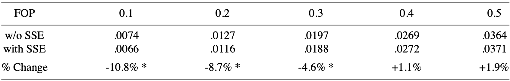

类似地，最佳输出编码并不总是显而易见的。主任务的替代编码可以用作额外输出，就像上面使用替代误差度量一样。例如，分布式输出表示通常有助于问题的某些部分学得更好，因为这些部分具有单独的误差梯度。但如果预测要求分布式表示中的所有输出同时正确，非分布式表示可能更准确。MTL 是合并这些冲突需求并同时使用两种输出表示来获得两者好处的一种方法。

### 4.3 时间序列预测

这类应用是使用未来预测现在的一个子类，其中**未来任务与当前任务相同，只是它们发生在稍后的时间**。这是一个足够大的子类，值得特别关注。

使用 MTL 进行时间序列预测的最简单方法是使用具有多个输出的单个网络，每个输出对应于不同时间的同一任务。图 2 显示了一个具有四个输出的 MTL 网络。如果输出 k 指的是时间序列任务在时间 $T_k$ 的预测，则**该网络在四个不同时间对同一任务进行预测**。通常，用于**预测的输出将是中间的**（时间上），这样就**有比它训练的网络更早和更晚的任务**。或者，当输入特征在时间上"滑动"穿过输入时，可以收集一系列预测的输出并将它们组合起来。

我们在一个机器人领域的时间序列数据上测试了 MTL，目标是从当前感知状态和计划动作预测未来的感知状态。例如，我们有兴趣根据当前的声纳和相机读数预测 N 米后将感知到的声纳读数和相机图像，其中 N 在 1 到 8 米之间。随着机器人的移动，它收集感知数据流。（严格来说，只有当机器人以恒定速度移动时，这些感知数据才是时间序列。我们使用航位推测来确定机器人行驶的距离，因此我们的数据可以被描述为空间序列。）

我们使用了一个具有四组输出的反向传播网络。每组预测将在未来距离感知到的声纳和相机图像。输出集 1 是 1 米的预测，集 2 是 2 米的预测，集 3 是 4 米的预测，集 4 是 8 米的预测。该网络在每个预测距离上的性能与单独学习每个距离的 STL 网络进行了比较，如表 5 所示。每个条目是所有感知预测的 SSE 平均值。误差随距离增加，除了 1 米外，MTL 在所有距离上都优于 STL。

表 5：机器人感知预测任务上的 STL 和 MTL。任务是预测机器人在 1、2、4 和 8 米后将感知到的内容。**更困难的 4 米和 8 米预测任务从 MTL 中获益最多，而较容易的 1 米任务可能受到 MTL 的损害。**

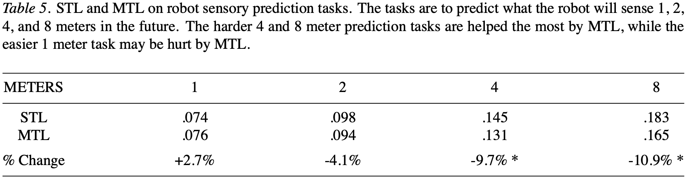

在 1 米处的精度损失不具有统计显著性，但 MTL 改进作为距离的函数存在一个有趣的趋势：MTL 似乎对更困难的长期预测任务帮助更大。我们推测这可能并不罕见。也就是说，**MTL 可能对更困难的任务帮助最大，可能以牺牲较容易的任务为代价，因为更困难的任务有更大的改进空间，而较容易的任务有更多可失去的**。如果可能，应该对 STL 效果最好的任务使用 STL，对 MTL 效果最好的任务使用 MTL。**但将最适合 STL 训练的任务包含在 MTL 网络中以帮助 MTL 任务是很重要的**。

为什么 MTL 对时间序列数据提供好处？一种解释是，不同时间尺度（或不同距离尺度）的预测通常部分依赖于不同的过程。在学习具有短时间尺度的任务时，学习器可能难以识别较长的过程，反之亦然。在单个网络上训练两种尺度可以提高短期和长期过程都被学习并组合以进行预测的机会。

### 4.4 使用非操作特征

有些特征在运行时使用是不切实际的，因为它们计算成本太高，或者因为它们需要的人工专业知识将不存在或太慢。然而，训练集通常很小，我们通常有奢侈花更多时间来准备它们。如果可以为训练集计算非操作特征值，这些特征可以作为额外的 MTL 输出使用。

一个很好的例子是场景分析，通常需要人工专业知识来标记重要特征。通常，当学习系统使用时，人类将不在循环中。这是否意味着人类标记的特征不能用于学习？不。如果标签可以为训练集获取，它们可以作为学习器的额外任务；作为额外任务，当系统使用时它们将不需要。一个很好的例子是 1D-DOORS 领域，我们使用鼠标定义从机器人安装的相机收集的门道图像中的特征。人类必须处理每个图像以捕获两个主要任务（门把手位置和门口中心）的训练信号，因此同时收集额外特征很容易。使用额外特征作为额外任务显著提高了两个主要任务的性能。

### 4.5 使用额外任务聚焦注意力

学习器通常学习使用输入中大型、无处不在的模式，而忽略有用的小型或不太常见的输入。MTL 可以用来强制学习器关注它原本会忽略的输入模式。这是通过强迫它学习内部表示来支持那些关键依赖于它可能原本会忽略的输入模式的任务来实现的。一个很好的例子是第 2.1 节中的道路跟踪领域。在这里，STL 网络在学习转向时通常会忽略车道标记，因为车道标记通常是图像的一小部分，并不总是存在，并且经常改变外观（例如，单中心线与双中心线，实线与虚线）。

**如果学习 转向 的网络还需要学习 识别道路条纹 作为额外输出任务，网络将学习关注条纹出现的图像部分**。在条纹任务可学习的范围内，网络将开发内部表示来支持它们。由于网络也在使用相同的隐藏层学习转向，转向任务可以使用条纹隐藏表示中对转向有用的部分。

### 4.6 顺序迁移

有时我们已经拥有来自先前学习的相关任务的领域理论。然而，用于训练这些模型的**数据可能不再可用**。**MTL 能否在没有训练数据的情况下从先前学习的模型中受益**？可以。可以**使用模型生成合成数据，并将合成数据中的训练信号用作额外的 MTL 任务**。这种顺序迁移方法巧妙地避开了灾难性干扰问题（在学习新任务时忘记旧任务），即使在其他顺序迁移方法使用的评估领域理论的分析方法不可用的情况下也适用。例如，EBNN（Thrun 和 Mitchell，1994；Thrun，1996）要求领域理论是可微的，但 MTL 的顺序迁移方法不需要。当先前学习的模型准确时，这种方法最有效。**如果先前的模型较差，它们可能成为归纳偏置的不良来源**。一些顺序迁移机制具有明确的机制，当先前学习对于手头任务似乎不准确时**减少迁移**（Thrun 和 Mitchell，1995；Thrun，1996）。

从先前模型合成数据时出现的一个问题是**使用什么分布进行采样**。一种方法是使用当前任务的训练模式的分布。将当前训练模式通过先前学习的模型，并**在学习新的主任务时将这些模型的预测用作额外的 MTL 输出**。这种采样可能并不总是令人满意的。如果模型很复杂（表明需要大样本或精心构建的样本来高保真地表示它们），但新的训练数据样本很小，则在比当前样本**更多的点上采样先前模型**是有益的。关于合成数据采样的详细讨论，请参见（Craven 和 Shavlik，1994）。

### 4.7 多任务自然出现

**通常世界给我们一组相关任务来学习**。将这些任务分离为独立问题并单独训练的传统方法适得其反；相关任务如果一起训练可以相互受益。反向传播网络中多任务迁移的**早期、几乎是偶然的使用是 NETtalk**（Sejnowski 和 Rosenberg，1986）。NETtalk 学习音素和重音，为语音合成器提供发音输入的单词。NETtalk 使用一个具有许多输出的网络，部分原因是目标是控制需要同时需要音素和重音的合成器。尽管他们从未分析过多任务迁移对 NETtalk 的贡献，但有证据表明 NETtalk 使用单独的网络更难学习（Dietterich、Hild 和 Bakiri，1990，1995）。

多任务自然出现的另一个例子是 Mitchell 的日历学徒系统（CAP）（Dent 等人，1992；Mitchell 等人，1994）。在 CAP 中，目标是学习预测其计划的会议的位置、时间、星期几和持续时间。这些任务是**相同数据的函数**，可以共享许多共同特征。使用 MTL 决策树（见第 5.2 节）在这个领域上的早期结果表明，一起训练这四个任务比单独训练它们产生更好的性能，正如 CAP 系统中所做的那样。

### 4.8 量化平滑

通常世界给我们量化信息。例如，训练信号可能来自人类对几个分类变量之一的评估（例如，差、中、好），或者它可能来自量化某些底层更平滑函数的自然过程（例如，有限精度进行的物理测量，或患者结果如存活或死亡）。**虽然量化有时使问题更容易学习，但通常使学习更困难。**

如果有可用的额外训练信号比主任务量化程度更低，或者量化方式不同，这些信号可能作为额外任务有用。为量化程度较低的额外任务学习的内容有时更容易学习，因为它具有更大的平滑性。不那么平滑但来自不同量化过程的额外任务有时也有帮助，因为与主任务一起，可能能够更好地插值两个任务的粗略量化。实际上，每个任务都可以用来填补另一个任务中由量化创建的一些空白。

量化平滑的一个例子出现在肺炎领域。在该领域中，主任务——死亡概率——是高度随机量化的：患者要么存活，要么死亡。但数据库中的一个额外特征是住院时间。如果住院时间与风险和疾病严重程度相关，那么住院时间的额外任务显然可以帮助网络**更好地插值存活或死亡粗略量化值之间的风险**。在这种情况下，住院时间与风险之间的关系可能很复杂。例如，**风险非常高的患者可能住院时间很短，因为他们活不长**。虽然量化任务与某些相关、量化程度较低的任务之间的复杂关系可能使从量化程度较低的任务中受益变得更加困难，但通常会带来一些好处。

### 4.9 某些特征作为输出更好

许多 MTL 有用的领域是某些特征用作输入不切实际的领域。MTL 提供了一种从这些特征中受益的方法（而不仅仅是忽略它们），将它们用作额外任务。是否可能某些特征作为输出比作为输入更有用？令人惊讶的是，是的。可以构造一些问题，其中某些特征作为输出比作为输入更有用。

考虑以下函数：

$F_1(A,B) = \text{SIGMOID}(A+B)$

$\text{SIGMOID}(x) = 1/(1 + e^{-x})$

考虑图 6a 中所示的反向传播网络，具有 20 个输入、16 个隐藏单元和一个输出，训练学习 $F_1(A,B)$。$F_1(A,B)$ 的数据通过从区间 $[-5,5]$ 均匀随机采样 A 和 B 的值生成。网络输入是 A 和 B 的 10 位二进制代码。前 10 个输入接收 A 的编码，后 10 个输入接收 B 的编码。目标输出是一元实数（未编码）值 $F_1(A,B)$。

表 6 显示了使用反向传播和提前停止的 50 次试验中 Net 1a 的平均性能。对于每次试验，我们生成新的随机训练、停止和测试集。训练集包含 50 个模式——足以获得良好性能，但不会太多以至于没有改进空间。停止和测试集各包含 1000 个案例，以最小化采样误差的影响。

现在考虑相关函数：

$F_2(A,B) = \text{SIGMOID}(A-B)$

假设除了 A 和 B 的 10 位二进制编码外，网络还获得未编码值 $F_2(A,B)$ 作为额外输入特征。这个额外输入是否会帮助它更好地学习 $F_1(A,B)$？可能不会。对于随机 A 和 B，$A+B$ 和 $A-B$ 不相关。（我们训练集的相关系数绝对值通常小于 0.01。）这损害了反向传播学习使用 $F_2(A,B)$ 预测 $F_1(A,B)$ 的能力。图 6b 中的网络有 21 个输入——20 个用于 A 和 B 的二进制编码，一个额外输入用于 $F_2(A,B)$。表 6 第 2 行显示了具有额外输入的 STL 在相同训练、停止和测试集上的性能。性能没有显著差异——当用作额外输入时，特征 $F_2(A,B)$ 中包含的额外信息不会帮助反向传播学习 $F_1(A,B)$。

如果将 $F_2(A,B)$ 用作额外输入不帮助反向传播学习 $F_1(A,B)$，我们应该忽略 $F_2(A,B)$ 吗？不。$F_1(A,B)$ 和 $F_2(A,B)$ 密切相关。它们都需要计算相同的子特征 A 和 B。如果 $F_2(A,B)$ 不是用作额外输入，而是用作必须学习的额外输出，它将偏向共享隐藏层更好地学习 A 和 B，这将帮助网络更好地学习预测 $F_1(A,B)$。

图 6c 显示了一个具有 20 个输入（用于 A 和 B）和 2 个输出的网络，一个用于 $F_1(A,B)$，一个用于 $F_2(A,B)$。该网络的性能仅在 $F_1(A,B)$ 的输出上进行评估，但对两个输出都进行反向传播。表 6 第 3 行显示了 MTL 网络在 $F_1(A,B)$ 上的平均性能。将 $F_2(A,B)$ 用作额外输出改善了 $F_1(A,B)$ 的性能。将额外特征用作额外输出比用作额外输入更好。

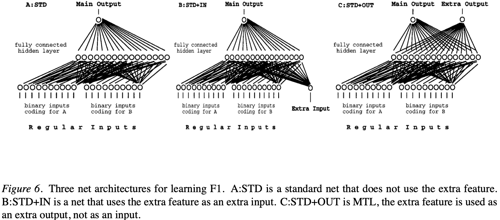

图 6：用于学习 $F_1$ 的三种网络架构。A:STD 是不使用额外特征的标准网络。B:STD+IN 是将额外特征用作额外输入的网络。C:STD+OUT 是 MTL，额外特征用作额外输出，而不是输入。

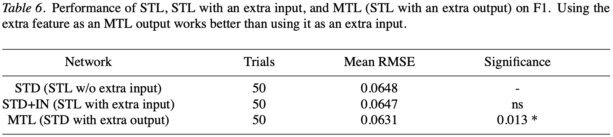

表 6：STL、具有额外输入的 STL 和 MTL（具有额外输出的 STL）在 $F_1$ 上的性能。将额外特征用作 MTL 输出比用作额外输入效果更好。

$F_1(A,B)$ 和 $F_2(A,B)$ 是精心设计的。我们设计了不太刻意的函数来演示类似的效果，并在现实世界问题中看到了这种行为的证据（Caruana 和 de Sa，1997）。一个特别有趣的问题类别是某些特征作为输出比作为输入更有用，那就是当特征中存在噪声时；额外输出中的噪声通常比额外输入中的噪声危害更小。

## 5. MTL 仅适用于反向传播网络吗？

在反向传播网络的 MTL 中，用于**多任务迁移的表示是所有任务共享的隐藏层**。**许多学习方法没有自然地在任务之间共享的表示**。MTL 能否用于这些方法？可以。本节提出了 k 近邻和核回归等基于案例方法的 MTL 算法和结果，并概述了决策树归纳中 MTL 的算法。

### 5.1 KNN 和核回归中的 MTL

k 近邻（KNN，k-Nearest Neighbor）和核回归（也称为局部加权平均（LCWA，Locally Weighted Averaging））使用属性上定义的距离度量来查找与新案例接近的训练案例：

$$
\text{Distance(case)} = \sqrt{\sum_{i=1}^{N} \text{weight}_i * (\Delta \text{attribute}_i)^2}
$$

KNN 和 LCWA 之间的主要区别在于用于预测的核。KNN 使用对 K 个最近邻均匀且对更远案例降至 0 的核，而 LCWA 使用随距离增加而平滑（通常快速）下降的核。

KNN 和 LCWA 的性能取决于距离度量的质量。寻找好的属性权重可以被描述为一个优化问题，使用交叉验证来判断不同权重集的性能。我们使用梯度下降和留一交叉验证，这对于像 KNN 和 LCWA 这样的基于案例方法特别有效。

寻找好的属性权重对于 KNN 和 LCWA 的良好性能至关重要。MTL 可用于找到更好的权重。基本方法是找到不仅在主任务上产生良好性能，而且在领域中一组相关任务上也产生良好性能的属性权重。

$$
\text{EvalMetric} = \text{PerfMainTask} + \sum_{i=1}^{N} \lambda_i * \text{PerfExtraTask}_i
$$

$\lambda_i = 0$ 导致学习忽略额外任务，$\lambda_i \approx 1$ 导致学习在额外任务上给予与主任务相同的权重，$\lambda_i \gg 1$ 导致学习在额外任务上比主任务更关注性能。

我们将 MTL LCWA 应用于第 2.3 节的肺炎领域。如前所述，主要任务是预测至少风险的人口比例，额外任务是预测训练集上可用但未来患者将不可用的实验室测试结果。

图 7 显示了 FOP 0.3 处的错误率作为 λ 的函数（为简单起见，我们在此处给出每个 $\lambda_i$ 取相同值的结果）。$\lambda = 0$ 是 STL；所有额外任务都被忽略。$\lambda = 1.0$ 是 MTL，给予每个额外任务和主任务相同的权重；特征权重试图在所有任务上都表现良好。请注意，当学习对主任务和额外任务给予相当的注意力时，错误率最低。其他 FOP 也获得了类似的图表。表 7 总结了使用 STL（$\lambda = 0$）和 MTL（$\lambda = 1.0$）的 LCWA 在五个 FOP 上的性能。与反向传播一样，MTL 在风险预测上比 STL 好 5-10%。

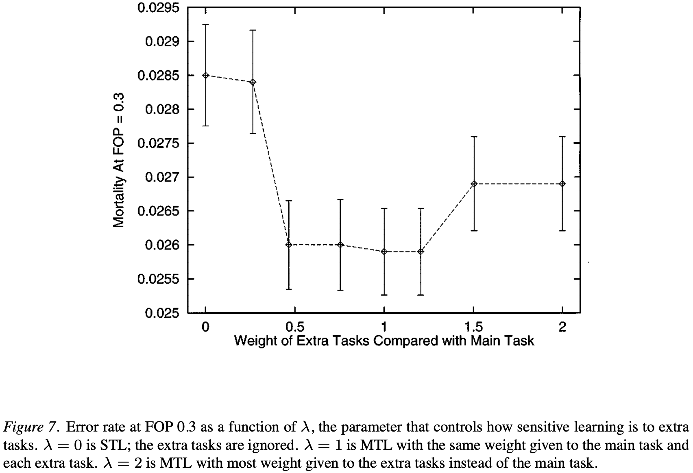

图 7：FOP 0.3 处的错误率作为 λ 的函数。λ = 0 是 STL；λ = 1 是 MTL，主任务和每个额外任务给予相同的权重；λ = 2 是 MTL，大多数权重给予额外任务而不是主任务

图 8 显示了 STL（$\lambda = 0$）和 MTL（$\lambda = 1.0$）的性能作为训练集大小的函数。误差棒是估计的标准误差。对于所有训练集大小，MTL 的错误率都低于 STL。对于较小的训练集大小，MTL 产生的性能与 STL 在多 25% 到 75% 数据时相当。

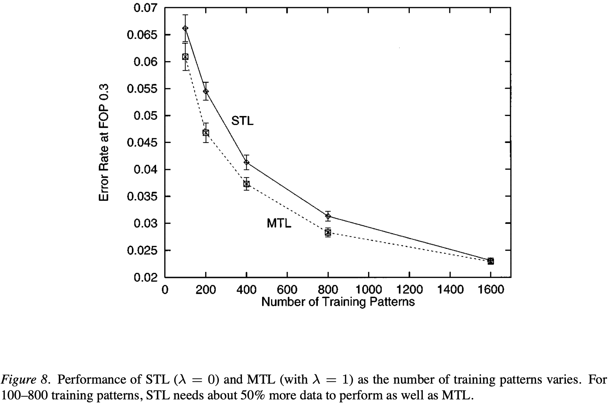

图 8：STL（λ = 0）和 MTL（λ = 1）的性能作为训练集大小的函数。对于所有训练集大小，MTL 的错误率都低于 STL。对于较小的训练集大小，MTL 产生的性能与 STL 在多 25% 到 75% 数据时相当

表 7：使用 1000 个案例的训练集在肺炎问题上 STL LCWA 和 MTL LCWA（$\lambda = 1$）的错误率。

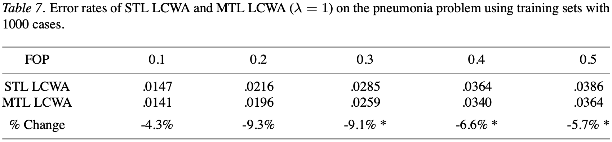

### 5.2 MTL 决策树归纳

传统决策树是单任务的：叶子节点仅表示一个任务的类别（或类别概率）。多任务决策树是可能的，其中每个叶子节点表示多个任务的类别，但为什么要使用它们？就像在 KNN/LCWA 中找到好的特征权重很重要一样，在自顶向下决策树归纳（TDIDT，Top-Down Induction of Decision Trees）中找到好的分裂点很重要。在 STL TDIDT 中，可用于判断分裂点的唯一信息是它们在单个任务上分离类别的效果。在 MTL TDIDT 中，可以通过它们在多个任务上的表现来评估分裂点。如果任务相关，偏好对多个任务有用的分裂点将提高所选分裂点的质量。

TDIDT 中的基本递归步骤（Quinlan 1986, 1992）是确定在增长决策树的当前节点添加什么分裂点。通常使用信息增益度量来完成，该度量衡量可用分裂点改善类别纯度的程度。MTL TDIDT 中的基本方法是计算每个分裂点对每个任务的信息增益，组合增益，并选择具有最佳综合性能的分裂点。与 MTL KNN/LCWA 中一样，引入了 λ 参数来控制对额外任务的强调程度。以这种方式对额外任务进行加权比（Caruana 1993）中提出的更简单方法（通过平均组合任务增益）产生更好的性能；递归分裂算法通常在树底部数据变得稀疏时遭受损失，因此早期分裂点对主任务性能敏感很重要。有关如何在 MTL TDIDT 中有效学习 λ 参数的更多详细信息，请参见（Caruana 1997）。有关我们所知的 MTL 在决策树中潜在益处的最早讨论，请参见（Dietterich, Hild & Bakiri 1990, 1995）。

## 6. 相关工作

训练具有多个输出的神经网络是很常见的。通常这些输出编码单个任务。例如，在分类任务中，通常每个类别使用一个输出（参见（Le Cun et al. 1989））。但**使用一个网络处理几个强相关任务也不是新的**。经典的 NETtalk（Sejnowski & Rosenberg 1986）应用程序使用一个网络学习 音素 及其 重音。使用一个网络对 NETtalk 是自然的，因为**目标是学习控制需要同时需要音素和重音命令的合成器**。NETtalk 是 MTL 的一个早期例子。但 NETtalk 的构建者**将多个输出视为单个问题的编码**，而不是受益于一起训练的独立任务。**如果分别绘制音素和重音任务的 NETtalk 学习曲线，会发现 重音任务 在 音素任务 达到峰值性能之前很久就开始过拟合了**。通过在每个输出上单独进行 **早停**，或者平衡不同输出的 **学习率** 使它们都 **在大约相同时间达到峰值性能**，可以在 NETtalk 中轻松获得更好的性能。

（Dietterich, Hild & Bakiri 1990, 1995）对 NETtalk 和 ID3 在 NETtalk **文本到语音领域**进行了彻底比较。他们考虑的一个解释是为什么反向传播在这个问题上优于 ID3，即反向传播受益于在不同输出之间共享隐藏单元，而 ID3 没有这样做。他们得出结论，尽管隐藏单元共享（即 MTL）确实有帮助，但它不是两种学习方法之间的最大差异，并且建议在 ID3 中添加共享可能不值得。

在相关任务之间转移学习到的结构并不是新的。关于在神经网络之间顺序转移学习结构的早期工作（Pratt et al. 1991; Pratt 1992; Sharkey & Sharkey 1992）清楚地证明了**一个任务学到的东西可以作为其他任务的偏置**。不幸的是，这项工作未能在泛化性能上找到改进；**重点是加速学习**。最近，Mitchell 和 Thrun 设计了一种称为基于解释的神经网络（EBNN）的串行转移方法（Thrun & Mitchell 1994; Thrun 1995, 1996），基于切线传播（Simard et al. 1992），在学习任务序列上产生了改进的泛化。（O'Sullivan & Thrun 1996）为 KNN 设计了一种串行转移机制，将先前学习的任务聚类为相关任务集。当新任务的训练模式数量太小而无法支持准确学习时，使用为集群中与新任务最相似的先前任务学习的 KNN 属性权重。这两种方法都不同于 MTL，其中目标是通过并行学习所有可用的额外任务来为一个任务学习更好的模型。O'Sullivan 目前正在探索一个结合串行转移和 MTL 的论文。

**一些归纳迁移的方法同时具有并行和串行组件**。（Breiman & Friedman 1995）提出了一种称为 Curds & Whey 的方法，利用不同预测任务之间的相关性。不同任务的模型分别训练（即通过 STL），但**在做出最终预测之前 组合来自分别学习的模型 的预测**。这种共享模型预测而不是模型学习到的内部结构的方式与 MTL 有很大不同；组合这两种方法很直接，并且可能在某些领域有优势。Omohundro 提出了"家庭发现"的算法，目标是学习一个参数化的随机模型族（Omohundro 1996）。通过交错学习从函数族中抽取的不同函数，算法学习函数族的结构并可以做出更好的预测。

（Hinton 1986）建议，如果网络学会更好地表示领域的基本规律性，人工神经网络中的泛化将会改善。Suddarth 和 Abu-Mostafa 是最早认识到这可以通过在网络输出处提供额外信息来实现的人之一。（Suddarth & Kergosien 1990; Suddarth & Holden 1991）**使用额外输出向网络注入关于它们应该学习什么的规则提示**。这是 MTL，其中额外任务经过精心设计以强制网络学习特定的内部表示。第 2.1 节 1D-ALVINN 领域中的中心线额外任务就是**规则注入提示**的例子。（Abu-Mostafa 1990, 1993, 1995）通过主任务输出反向传播的误差信号中的额外项向反向传播网络提供提示。额外误差项约束学到的内容满足主任务的期望属性，例如单调性（Sill & Abu-Mostafa 1997）、对称性或关于某些输入集的传递性。MTL 不使用主任务输出上的额外误差项，可以轻松地与 Abu-Mostafa 的提示结合使用。

MTL 在某些方面与聚类和无监督学习相似。例如，对 COBWEB（Fisher 1987）的概率信息度量中的索引进行小的更改，会产生适合在多任务决策树中判断分裂的度量。COBWEB 将所有特征都视为要预测的任务，而 MTL 决策树允许用户指定哪些信号是输入，哪些是训练信号。这不仅使得在不承诺额外训练信息在运行时可用的情况下更容易创建额外任务，而且在某些特征无法合理预测的领域中使学习更简单。

（Martin 1994, Martin & Billman 1994）探索了如何扩展 COBWEB 等概念形成系统以获取重叠的概念描述。他们的 OLOC 系统是一个增量概念学习器，学习重叠的概率描述以提高预测准确性。de Sa 的最小化分歧算法（MDA）（de Sa 1994）是一种在精神上类似于 MTL 的无监督学习方法。在 MDA 中，多个无监督学习任务并行训练，并通过来自其他无监督任务的监督信号相互偏置。

已经有人尝试开发人工神经网络中并行转移的理论（Abu-Mostafa 1993; Baxter 1994, 1995, 1996）。不幸的是，目前开发的理论很难用于得出关于 MTL 实际使用的结论。当前理论的局限性包括：

- 它产生太松的最坏情况界限，无法确保额外任务会有帮助。例如，可以创建增加任务数量而不是帮助性能的合成问题。这些问题的结果与理论一致，但只是因为界限足够松以允许它。
- 它缺乏明确定义的任务相关性概念，并对隐藏层中的共享做出通常不满足的假设。例如，我们通常发现最佳性能需要随着任务数量的增加而增加共享隐藏层中的单元数量。这与理论中假设隐藏层大小随着任务数量增加而保持不变相冲突。
- 它无法解释在实践中至关重要的搜索过程行为。例如，如果没有正确执行早停，MTL 通常会损害性能而不是帮助它。当前理论无法解释像这样重要的现象。

开发一个与实践中观察到的更一致的 MTL 理论可能很困难。也许阻碍更好 MTL 理论的最大障碍是定义任务相关性的困难。人工神经网络中 MTL 的改进理论还需要解决关于神经网络有效容量的开放问题，并考虑训练过程（如反向传播）的重要行为，例如它们对局部最小值的敏感性、共享压力等。

（Munro & Parmanto 1997）使用额外任务来提高委员会机器的泛化性能，该委员会机器组合多个学习专家的预测。由于委员会机器在不同委员会成员的误差不相关时工作得更好，他们对每个委员会成员使用不同的额外任务来偏置它如何学习主任务。每个委员会成员以略微不同的方式学习主任务，整个委员会的性能得到提高。使用额外任务训练的委员会机器可以被视为具有比这里提出的简单的完全连接 MTL 架构更复杂的架构的 MTL。委员会 MTL 架构的一个有趣特征是使用了主任务的多个副本，这提高了主任务的性能。有时使用更简单的完全连接 MTL 网络也会观察到这种效果（Caruana 1993）。（Dietterich & Bakiri 1995）研究了一种更复杂的方法来从主任务的多个副本中受益，使用多位纠错码作为输出表示。

**MTL 的一个应用是获取在运行时将缺失但在训练集中可用的特征，并将它们用作输出而不是输入**。有其他方法可以处理缺失值。一种方法是将每个缺失特征视为单独的学习问题，并使用缺失值的预测作为输入。（我们在肺炎问题上尝试过这个，没有达到与 MTL 相当的性能，但在某些领域这很有效。）处理缺失数据的其他方法包括在学习的概率模型中对缺失值进行边缘化（Little & Rubin 1987; Tresp, Ahmad & Neuneier 1994），以及使用 EM 从当前数据密度估计中迭代地重新估计缺失值（Ghahramani & Jordan 1994, 1997）。在这方面特别令人感兴趣的是关于学习贝叶斯网络的工作（Cooper & Herskovits 1992; Spirtes, Glymour, & Scheines 1993; Jordan & Jacobs, 1994）。因为贝叶斯网络具有合理的统计语义（这使得处理缺失值更容易）并且通常比使用 STL 学习的模型更全面，贝叶斯网络也能够从像 MTL 使用的额外任务中受益。目前尚不清楚贝叶斯网络是否代表了一种与 MTL 竞争的方法，主要问题是许多贝叶斯网络模型固有的额外复杂性可能会增加实现良好性能所需的训练样本数量。

## 7. 讨论和未来工作

### 7.1 多任务预测

MTL 在一个学习器上并行训练许多任务，但这并**不意味着应该使用一个学习到的模型对多个任务进行预测**。在单个学习器上训练多个任务的原因是一个任务可以从其他任务的训练信号中包含的信息中受益，而不是减少必须学习的模型数量。在所有任务的中等性能和任何单个任务的最佳性能之间可以进行权衡的地方，通常最好一次优化一个任务的性能，并允许额外任务的性能下降。MTL KNN/LCWA 和 MTL TDIDT 中的任务权重使这种权衡显式化；学习器甚至可以忽略一些任务以在主任务上实现更好的性能。

需要多个任务预测的地方（如 CAP，第 4.7 节），为每个所需任务训练单独的 MTL 模型可能很重要。然而，对于反向传播 MTL，使用平等对待所有任务并在共享隐藏层中具有足够容量以允许隐藏层的某些部分专门用于单个任务的架构，通常可以在一次训练运行中学习所有任务的模型。如果使用早停，重要的是对每个任务单独应用它；并非所有任务都以相同的速率训练或过拟合。最简单的方法是在每个任务性能最佳时拍摄网络快照，而不是试图在其他任务仍在训练时停止某些任务的训练。如果某些任务比其他任务训练得快得多，降低已经达到最佳性能的任务的学习率是防止它们过拟合以至于拖累其他较慢任务过拟合的一种方法。

### 7.2 反向传播 MTL 中的学习率

通常在所有任务以相似速率学习并在大约相同时间达到最佳性能时，反向传播 MTL 中可以获得更好的性能。如果主任务在额外任务之前训练很长时间，它就无法从额外任务尚未学到的东西中受益。如果主任务在额外任务之后训练很长时间，它就无法塑造额外任务学到的东西。此外，如果额外任务开始过拟合，由于隐藏层表示的重叠，它们可能会导致主任务也过拟合。

控制不同任务学习速率的最简单方法是调整每个输出任务的学习率。一种方法是使用所有任务相等的学习率训练网络，然后第二次训练，降低学习最快任务的学习率。这个过程的几次迭代通常足以使大多数任务在大约相同时间达到峰值性能。然后使用每个任务的早停来选择每个任务的最佳停止点。我们目前正在测试一种自动化这种学习率调整的算法。它不是在训练期间对每个任务使用恒定的学习率，而是根据该任务的进展在训练期间自适应地调整每个任务的学习率。提前计划的任务学习率降低，直到较慢的任务赶上。此方法仍然需要至少一次先前的训练运行来估计每个任务在开始过拟合之前会达到多远。

### 7.3 并行转移与串行转移

MTL 是并行转移。串行转移（Pratt & Mostow 1991; Pratt 1992; Sharkey & Sharkey 1992; Thrun & Mitchell 1994; Thrun 1995）似乎更容易，情况可能并非如此。并行转移的优点是：

- 所有任务正在学习的所有细节对所有任务都可用，因为所有任务都在同时学习。
- 在许多应用中，额外任务可以及时获得以便与主任务并行学习。并行转移不需要定义训练序列——任务训练的顺序在串行转移中通常会产生影响。
- 任务通常相互受益，这是线性序列无法捕捉的。例如，如果任务 1 在任务 2 之前学习，任务 2 就不能帮助任务 1。这不仅降低了任务 1 的性能，还可能降低任务 1 帮助任务 2 的能力。

当任务自然地串行出现时，使用并行转移进行串行转移是很简单的。如果可以存储训练数据，使用任何已可用的任务执行 MTL，在出现新任务时重新学习。如果无法存储训练数据，可以从先前学习的模型生成合成数据（参见第 4.6 节）。有趣的是，虽然使用并行转移进行串行转移很容易，但使用串行转移进行并行转移则不那么容易。请注意，可以将串行和并行转移结合起来；O'Sullivan 目前正在探索一个在卡内基梅隆大学结合 MTL 和 EBNN 用于机器人终身学习的论文。

### 7.4 计算成本

多任务学习的主要目标是提高泛化。但 MTL 对训练时间有什么影响？在反向传播网络中，MTL 网络通常比 STL 网络大，因此每次反向传播需要更多的计算。**如果所有任务最终都需要学习，训练 MTL 网络通常比训练各个 STL 网络需要更少的计算**。**如果大多数额外任务只是为了帮助一个或几个主任务而训练的，那么 MTL 网络将需要更多的计算**。然而，我们通常发现使用 MTL 训练的任务比单独训练的相同任务需要更少的训练轮次，这部分补偿了每个 MTL 轮次的额外计算成本。

在 k 近邻、核回归和决策树中，MTL 增加的训练成本很少。唯一的额外成本是评估多个任务而不是仅仅一个任务性能所需的计算。这个小的常数因子很容易被其他更昂贵的步骤所主导，例如计算案例之间的距离、查找最近邻、查找决策树中连续属性分裂的最佳阈值等。使用 MTL 与这些算法的主要额外成本是交叉验证控制主任务和额外任务相对权重的 λ 参数。

### 7.5 架构

第 2 节中提出的 MTL 反向传播应用使用由所有任务平等共享的单个完全连接隐藏层。有时，更复杂的网络架构效果更好。例如，有时有一个**小的私有隐藏层用于主任务**，以及一个更大的隐藏层由主任务和额外任务共享是有益的。但太多的私有隐藏层（例如，每个任务一个私有隐藏层）会减少共享和 MTL 的益处。我们目前没有原则性的方法来确定什么架构对每个问题最好。幸运的是，简单的架构通常效果很好，即使不是最优的。（Ghosn & Bengio 1997）实验了几种不同的反向传播网络中 MTL 架构。

正则化方法（如权重衰减）可以与 MTL 一起使用。通过减少模型中有效自由参数的数量，正则化促进共享。然而，过强的共享偏置会损害性能。如果任务比它们的相似之处更不同（通常情况），重要的是**允许任务学习相当独立的模型，仅在存在共同隐藏结构的地方重叠**。这就是为什么当共享隐藏层的大小远小于在分别训练时为任务提供良好性能的 STL 隐藏层大小之和时，MTL 性能通常会下降的一个原因。

### 7.6 什么是相关任务？

归纳迁移中最重要的开放问题之一是更好地表征什么是相关任务，无论是形式上的还是启发式的。缺乏任务相关性的充分定义是阻碍归纳迁移更有用理论发展的障碍之一。相关性理论的一些特征已经很清楚了。例如，如果两个任务是输入的相同函数，但任务信号添加了独立的噪声过程，显然这两个任务是相关的。另一个例子，如果两个任务是预测同一个体健康的不同方面，这些任务比预测不同个体健康的不同方面的两个任务更相关。最后，仅仅因为两个任务在一起训练时互相帮助并不一定意味着它们相关：有时通过反向传播网络上的额外输出注入噪声通过在隐藏层充当正则化器来提高其他输出的泛化，但这并不意味着噪声任务与其他任务相关。

我们可能永远不会有允许我们可靠预测哪些任务在用于归纳转移时会帮助或伤害彼此的相关性理论。因此，我们现在将部分精力集中在有效确定哪些任务彼此有益相关的方法上。特别令人感兴趣的是最近关于特征选择的工作，该工作表明如果忽略 UCI 存储库中一些大问题上多达一半的可用输入特征（即不作为输入使用），泛化性能有时会提高（Koller & Sahami, 1996; Liu & Setiono 1996）。测试这些问题以查看一些"被忽略"的特征是否可能被很好地用作额外输出（如第 4.9 节所做的那样）将是有趣的。

### 7.7 归纳迁移何时有害

MTL 并不总是提高性能。在肺炎领域，当向 rankprop 网络添加额外的 SSE 输出时，高风险案例的性能下降（参见第 4.2 节）。这与我们关于此问题中主任务和额外任务相对优势和劣势的模型一致。MTL 是归纳偏置的来源。一些归纳偏置有帮助。一些归纳偏置有害。这取决于问题。目前，最安全的方法是将 MTL 视为必须在每个问题上测试的工具。幸运的是，在我们尝试过 MTL 的大多数问题上，它都有帮助。使用交叉验证自动调整 MTL 偏置的算法（如 TDIDT 和 KNN 中使用的算法）是使 MTL 在实践中实用的重要步骤。

### 7.8 MTL 在复杂性中蓬勃发展

也许我们从将 MTL 应用于现实问题中学到的最重要的教训是，**MTL 从业者必须在问题和数据被清理之前参与进来**。MTL 从通常会被工程化掉的额外信息中受益，因为传统的 STL 技术无法使用它。MTL 的机会通常随着与原始数据或数据收集过程的距离增加而减少。MTL 提供了使用信息的新方法，这些方法从传统的 STL 观点来看可能不明显。

## 8. 总结

获取特定领域的归纳偏置受到通常的知识获取瓶颈的限制。多任务学习允许通过从同一领域抽取的相关额外任务的训练信号获取归纳偏置。本文证明了使用额外任务的益处可能是巨大的。通过仔细的实验，我们能够证明多任务学习的益处是**由于额外任务训练信号中包含的额外信息**，而不是由于反向传播网络的某些其他属性（可能以其他方式实现）。我们还能够阐明一些解释多任务学习如何提高泛化的机制。

本文中的大部分工作使用反向传播网络中的多任务学习。然而，我们已经开发了 k 近邻和决策树中多任务学习的算法。能够将多任务学习与人工神经网络、决策树和 k 近邻这样不同的归纳方法一起使用，说明了**基本思想的普遍性**。也许更重要的是，我们已经能够识别出在现实世界领域中经常出现的许多情况，在这些情况下多任务学习应该是适用的。这是令人惊讶的——当今机器学习中使用的标准测试问题很少是多任务问题。我们推测，随着机器学习应用于未清理的现实世界问题，多任务学习的机会将会增加。

## 致谢

我们感谢 Greg Cooper、Michael Fine 和 Pitt/CMU 成本效益医疗保健小组的其他成员对 **Medis 肺炎数据库**的帮助；感谢 Dean Pomerleau 提供道路跟踪模拟器的使用；感谢 NASA Ames Research Center 的 Andrew Ng 和 Sebastian Thrun 对本文早期草稿的评论；感谢 Yaser Abu-Mostafa、Tom Dietterich、Tom Mitchell 和 Sebastian Thrun 的有益讨论。本工作得到 ARPA 拨款 F33615-93-1-1330、NSF 拨款 BES-9315428、健康和公共服务部医疗保健融资管理局拨款 90-00-2905 的支持。

---

## 参考文献

[1] Abu-Mostafa, Y. S. (1990). "Learning from Hints in Neural Networks," Journal of Complexity, 6(2), pp. 192–198.

[2] Abu-Mostafa, Y. S. (1993). "Hints and the VC Dimension," Neural Computation, 5(2).

[3] Abu-Mostafa, Y. S. (1995). "Hints," Neural Computation, 7, pp. 639-671.

[4] Baluja, S. & Pomerleau, D. A. (1995). "Using the Representation in a Neural Network's Hidden Layer for Task-Specific Focus of Attention," Proceedings of the International Joint Conference on Artificial Intelligence 1995, IJCAI-95, Montreal, Canada, pp. 133-139.

[5] Baxter, J. (1994). "Learning Internal Representations," Ph.D. Thesis, The Flinders University of South Australia.

[6] Baxter, J. (1995). "Learning Internal Representations," Proceedings of the 8th ACM Conference on Computational Learning Theory, (COLT-95), Santa Cruz, CA.

[7] Baxter, J. (1996). "A Bayesian/Information Theoretic Model of Bias Learning," Proceedings of the 9th International Conference on Computational Learning Theory, (COLT-96), Desenzano del Garda, Italy.

[8] Breiman, L. & Friedman, J. H. (1995). "Predicting Multivariate Responses in Multiple Linear Regression," ftp://ftp.stat.berkeley.edu/pub/users/breiman/curds-whey-all.ps.Z.

[9] Caruana, R. (1993). "Multitask Learning: A Knowledge-Based Source of Inductive Bias," Proceedings of the 10th International Conference on Machine Learning, ML-93, University of Massachusetts, Amherst, pp. 41-48.

[10] Caruana, R. (1994). "Multitask Connectionist Learning," Proceedings of the 1993 Connectionist Models Summer School, pp. 372-379.

[11] Caruana, R. (1995). "Learning Many Related Tasks at the Same Time with Backpropagation," Advances in Neural Information Processing Systems 7 (Proceedings of NIPS-94), pp. 656-664.

[12] Caruana, R., Baluja, S., & Mitchell, T. (1996). "Using the Future to 'Sort Out' the Present: Rankprop and Multitask Learning for Medical Risk Prediction," Advances in Neural Information Processing Systems 8 (Proceedings of NIPS-95), pp. 959-965.

[13] Caruana, R. & de Sa, V. R. (1997). "Promoting Poor Features to Supervisors: Some Inputs Work Better as Outputs," to appear in Advances in Neural Information Processing Systems 9 (Proceedings of NIPS-96).

[14] Caruana, R. (1997). "Multitask Learning," Ph.D. Thesis, School of Computer Science, Carnegie Mellon University.

[15] Cooper, G. F. & Herskovits, E. (1992). "A Bayesian Method for the Induction of Probabilistic Networks from Data," Machine Learning, 9, pp. 309-347.

[16] Cooper, G. F., Aliferis, C. F., Ambrosino, R., Aronis, J., Buchanan, B. G., Caruana, R., Fine, M. J., Glymour, C., Gordon, G., Hanusa, B. H., Janosky, J. E., Meek, C., Mitchell, T., Richardson, T., and Spirtes, P. (1997). "An Evaluation of Machine Learning Methods for Predicting Pneumonia Mortality," Artificial Intelligence in Medicine 9, pp. 107-138.

[17] Craven, M. & Shavlik, J. (1994). "Using Sampling and Queries to Extract Rules from Trained Neural Networks," Proceedings of the 11th International Conference on Machine Learning, ML-94, Rutgers University, New Jersey, pp. 37-45.

[18] Davis, I. & Stentz, A. (1995). "Sensor Fusion for Autonomous Outdoor Navigation Using Neural Networks," Proceedings of IEEE's Intelligent Robots and Systems Conference.

[19] Dent, L., Boticario, J., McDermott, J., Mitchell, T., & Zabowski, D. (1992). "A Personal Learning Apprentice," Proceedings of 1992 National Conference on Artificial Intelligence.

[20] de Sa, V. R. (1994). "Learning Classification with Unlabelled Data," Advances in Neural Information Processing Systems 6, (Proceedings of NIPS-93), pp. 112-119.

[21] Dietterich, T. G., Hild, H., & Bakiri, G. (1990). "A Comparative Study of ID3 and Backpropagation for English Text-to-speech Mapping," Proceedings of the Seventh International Conference on Artificial Intelligence, pp. 24-31.

[22] Dietterich, T. G., Hild, H., & Bakiri, G. (1995). "A Comparison of ID3 and Backpropagation for English Text-to-speech Mapping," Machine Learning, 18(1), pp. 51-80.

[23] Dietterich, T. G. & Bakiri, G. (1995). "Solving Multiclass Learning Problems via Error-Correcting Output Codes," Journal of Artificial Intelligence Research, 2, pp. 263-286.

[24] Fine, M. J., Singer, D., Hanusa, B. H., Lave, J., & Kapoor, W. (1993). "Validation of a Pneumonia Prognostic Index Using the MedisGroups Comparative Hospital Database," American Journal of Medicine.

[25] Fisher, D. H. (1987). "Conceptual Clustering, Learning from Examples, and Inference," Proceedings of the 4th International Workshop on Machine Learning.

[26] Ghahramani, Z. & Jordan, M. I. (1994). "Supervised Learning from Incomplete Data Using an EM Approach," Advances in Neural Information Processing Systems 6, (Proceedings of NIPS-93,) pp. 120-127.

[27] Ghahramani, Z. & Jordan, M. I. (1997). "Mixture Models for Learning from Incomplete Data," Computational Learning Theory and Natural Learning Systems, Vol. IV, R. Greiner, T. Petsche and S.J. Hanson (eds.), Cambridge, MA, MIT Press, pp. 67-85.

[28] Ghosn, J. & Bengio, Y. (1997). "Multi-Task Learning for Stock Selection," to appear in Advances in Neural Information Processing Systems 9, (Proceedings of NIPS-96).

[29] Hinton, G. E. (1986). "Learning Distributed Representations of Concepts," Proceedings of the 8th International Conference of the Cognitive Science Society, pp. 1-12.

[30] Holmstrom, L. & Koistinen, P. (1992). "Using Additive Noise in Back-propagation Training," IEEE Transactions on Neural Networks, 3(1), pp. 24-38.

[31] Jordan, M. & Jacobs, R. (1994). "Hierarchical Mixtures of Experts and the EM Algorithm," Neural Computation, 6, pp. 181-214.

[32] Koller, D. & Sahami, M. (1996). "Toward Optimal Feature Selection," Proceedings of the 13th International Conference on Machine Learning, ICML-96, Bari, Italy, pp. 284-292.

[33] Le Cun, Y., Boser, B., Denker, J. S., Henderson, D., Howard, R. E., Hubbard, W., & Jackal, L. D. (1989). "Backpropagation Applied to Handwritten Zip-Code Recognition," Neural Computation, 1, pp. 541-551.

[34] Little, R. J. A. & Rubin, D. B. (1987). Statistical Analysis with Missing Data, Wiley, New York.

[35] Liu, H. & Setiono, R. (1996). "A Probabilistic Approach to Feature Selection—A Filter Solution," Proceedings of the 13th International Conference on Machine Learning, ICML-96, Bari, Italy, pp. 319-327.

[36] Martin, J. D. (1994). "Goal-directed Clustering," Proceedings of the 1994 AAAI Spring Symposium on Goal-directed Learning.

[37] Martin, J. D. & Billman, D. O. (1994). "Acquiring and Combining Overlapping Concepts," Machine Learning, 16, pp. 1-37.

[38] Mitchell, T. (1980). "The Need for Biases in Learning Generalizations," Rutgers University: CBM-TR-117.

[39] Mitchell, T., Caruana, R., Freitag, D., McDermott, J., & Zabowski, D. (1994). "Experience with a Learning Personal Assistant," Communications of the ACM: Special Issue on Agents, 37(7), pp. 80-91.

[40] Munro, P. W. & Parmanto, B. (1997). "Competition Among Networks Improves Committee Performance," to appear in Advances in Neural Information Processing Systems 9 (Proceedings of NIPS-96).

[41] Omohundro, S. M. (1996). "Family Discovery," Advances in Neural Information Processing Systems 8, (Proceedings of NIPS-95), pp. 402-408.

[42] O'Sullivan, J. & Thrun, S. (1996). "Discovering Structure in Multiple Learning Tasks: The TC Algorithm," Proceedings of the 13th International Conference on Machine Learning, ICML-96, Bari, Italy, pp. 489-497.

[43] Pomerleau, D. A. (1992). "Neural Network Perception for Mobile Robot Guidance," Carnegie Mellon University: CMU-CS-92-115.

[44] Pratt, L. Y., Mostow, J., & Kamm, C. A. (1991). "Direct Transfer of Learned Information Among Neural Networks," Proceedings of AAAI-91.

[45] Pratt, L. Y. (1992). "Non-literal Transfer Among Neural Network Learners," Colorado School of Mines: MCS92-04.

[46] Quinlan, J. R. (1986). "Induction of Decision Trees," Machine Learning, 1, pp. 81-106.

[47] Quinlan, J. R. (1992). C4.5: Programs for Machine Learning, Morgan Kaufman Publishers.

[48] Rumelhart, D. E., Hinton, G. E., & Williams, R. J. (1986). "Learning Representations by Back-propagating Errors," Nature, 323, pp. 533-536.

[49] Sejnowski, T. J. & Rosenberg, C. R. (1986). "NETtalk: A Parallel Network that Learns to Read Aloud," John Hopkins: JHU/EECS-86/01.

[50] Sharkey, N. E. & Sharkey, A. J. C. (1992). "Adaptive Generalisation and the Transfer of Knowledge," University of Exeter: R257.

[51] Sill, J. & Abu-Mostafa, Y. (1997). "Monotonicity Hints," to appear in Neural Information Processing Systems 9 (Proceedings of NIPS-96).

[52] Simard, P., Victorri, B., LeCun, Y., & Denker, J. (1992). "Tangent Prop—A Formalism for Specifying Selected Invariances in an Adaptive Neural Network," Advances in Neural Information Processing Systems 4 (Proceedings of NIPS-91), pp. 895-903.

[53] Spirtes, P., Glymour, C., & Scheines, R. (1993). Causation, Prediction, and Search, Springer-Verlag, New York.

[54] Suddarth, S. C. & Kergosien, Y. L. (1990). "Rule-injection Hints as a Means of Improving Network Performance and Learning Time," Proceedings of the 1990 EURASIP Workshop on Neural Networks, pp. 120-129.

[55] Suddarth, S. C. & Holden, A. D. C. (1991). "Symbolic-neural Systems and the Use of Hints for Developing Complex Systems," International Journal of Man-Machine Studies, 35(3), pp. 291-311.

[56] Thrun, S. & Mitchell, T. (1994). "Learning One More Thing," Carnegie Mellon University: CS-94-184.

[57] Thrun, S. (1995). "Lifelong Learning: A Case Study," Carnegie Mellon University: CS-95-208.

[58] Thrun, S. (1996a). "Is Learning the N-th Thing Any Easier Than Learning the First?," Advances in Neural Information Processing Systems 8 (Proceedings of NIPS-95), pp. 640-646.

[59] Thrun, S. (1996b). Explanation-Based Neural Network Learning: A Lifelong Learning Approach, Kluwer Academic Publisher.

[60] Tresp, V., Ahmad, S., & Neuneier, R. (1994). "Training Neural Networks with Deficient Data," Advances in Neural Information Processing Systems 6 (Proceedings of NIPS-93), pp. 128-135.

[61] Valdes-Perez, R., & Simon, H. (1994). "A Powerful Heuristic for the Discovery of Complex Patterned Behavior," Proceedings of the 11th International Conference on Machine Learning, ML-94, Rutgers University, New Jersey, pp. 326-334.

[62] Waibel, A., Sawai, H., & Shikano, K. (1989). "Modularity and Scaling in Large Phonemic Neural Networks," IEEE Transactions on Acoustics, Speech and Signal Processing, 37(12), pp. 1888-1898.
