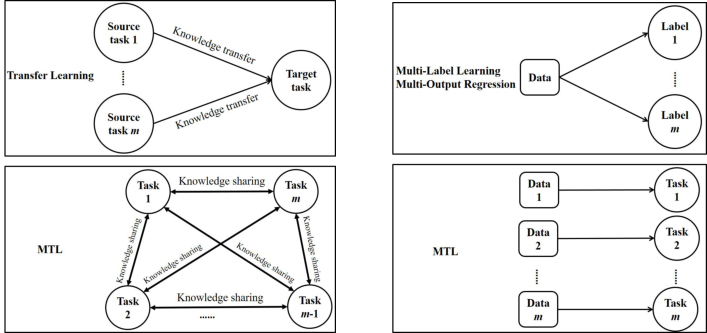
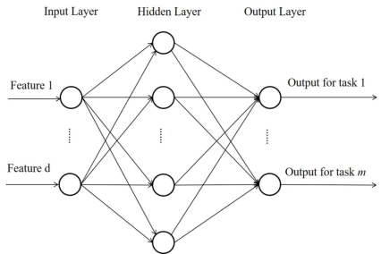
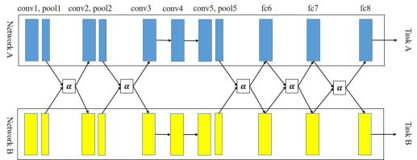

# 多任务学习综述

> Yu Zhang, Qiang Yang | Southern University of Science and Technology & Hong Kong University of Science and Technology

本文是多任务学习（MTL）的全面综述论文，从算法建模、应用和理论分析三个角度进行系统回顾。核心内容：

- 将 MTL 算法分为五大类：特征学习方法、低秩方法、任务聚类方法、任务关系学习方法和分解方法
- 讨论了 MTL 与其他学习范式的结合，包括半监督学习、主动学习、无监督学习、强化学习、多视图学习和图模型
- 回顾了在线、并行和分布式 MTL 模型，以及降维和特征哈希技术

关键发现：
- MTL 通过利用相关任务中的有用信息来提高所有任务的泛化性能
- 特征学习方法是最常用的 MTL 方法，包括特征转换和特征选择两个子类
- 深度 MTL 模型在计算机视觉和自然语言处理等领域取得了显著成功

---

## 摘要

多任务学习（MTL，Multi-Task Learning）是机器学习中的一种学习范式，其目标是利用多个相关任务中包含的有用信息来帮助提高所有任务的泛化性能。在本文中，我们从算法建模、应用和理论分析的角度对 MTL 进行综述。对于算法建模，我们给出 MTL 的定义，然后将不同的 MTL 算法分为五类，包括特征学习方法、低秩方法、任务聚类方法、任务关系学习方法和分解方法，并讨论每种方法的特点。为了进一步提高学习任务的性能，MTL 可以与其他学习范式结合，包括半监督学习、主动学习、无监督学习、强化学习、多视图学习和图模型。当任务数量较多或数据维度较高时，我们回顾了在线、并行和分布式 MTL 模型，以及降维和特征哈希，以揭示它们的计算和存储优势。许多现实世界应用使用 MTL 来提升性能，我们在本文中回顾了代表性工作。最后，我们提出了理论分析并讨论了 MTL 的几个未来方向。

**关键词**：Multi-Task Learning, Machine Learning, Artificial Intelligence

## 1. 引言

人类可以同时学习多个任务，在这个学习过程中，人类可以利用在一个任务中学到的知识来帮助另一个任务的学习。例如，根据我们学习打网球和壁球的经验，我们发现打网球的技能可以帮助学习打壁球，反之亦然。受这种人类学习能力的启发，多任务学习（MTL）[1]，机器学习中的一种学习范式，旨在联合学习多个相关任务，以便一个任务中包含的知识可以被其他任务利用，希望提高所有手头任务的泛化性能。

在早期阶段，MTL 的一个重要动机是缓解数据稀疏问题，其中每个任务的标记数据数量有限。在数据稀疏问题中，每个任务的标记数据不足以训练准确的学习器，而 MTL 以数据增强的精神聚合所有任务中的标记数据，为每个任务获得更准确的学习器。从这个角度来看，MTL 可以帮助重用现有知识并降低学习任务的人工标记成本。当"大数据"时代在计算机视觉和自然语言处理（NLP）等领域到来时，人们发现深度 MTL 模型可以比其单任务对应模型取得更好的性能。MTL 有效的一个原因是它利用了来自不同学习任务的更多数据。有了更多数据，MTL 可以为多个任务学习更健壮和通用的表示以及更强大的模型，从而实现更好的任务间知识共享、每个任务更好的性能以及每个任务低过拟合风险。

<!-- 图 1：MTL 与其他学习范式之间的差异说明 -->

MTL 与机器学习中的其他学习范式相关，包括迁移学习 [2]、多标签学习 [3] 和多输出回归。MTL 的设置与迁移学习相似，但有显著差异。在 MTL 中，不同任务之间没有区别，目标是提高所有任务的性能。然而，迁移学习是为了借助源任务提高目标任务的性能，因此目标任务比源任务扮演更重要的角色。总之，MTL 平等对待所有任务，但在迁移学习中，目标任务吸引了最多的注意力。从知识流的角度来看，迁移学习中的知识转移流是从源任务到目标任务，但在多任务学习中，任何任务对之间都有知识共享流，如图 1(a) 所示。持续学习 [4]（任务依次到来）逐个学习任务，而 MTL 是一起学习多个任务。在多标签学习和多输出回归中，每个数据点与多个标签相关联，这些标签可以是分类的或数值的。如果我们把所有可能标签中的每一个都看作一个任务，多标签学习和多输出回归在某种意义上可以被视为多任务学习的特例，其中不同任务在训练和测试阶段总是共享相同的数据。一方面，多标签学习和多输出回归中的这种特性导致了与 MTL 不同的研究问题。例如，排序损失（强制与数据点相关的标签的得分（例如分类概率）大于缺失标签的得分）可以用于多标签学习，但它不适合不同任务具有不同数据的 MTL。另一方面，多标签学习和多输出回归中的这种特性在 MTL 问题中是无效的。例如，在第 2.7 节讨论的 MTL 问题中，每个任务是基于 19 个生物医学特征预测帕金森病患者的疾病症状评分，不同患者/任务不应共享生物医学数据。总之，多标签学习和多输出回归与多任务学习不同，如图 1(b) 所示，因此我们不会综述多标签学习和多输出回归的文献。此外，多视图学习是机器学习中的另一种学习范式，其中每个数据点与多个视图相关联，每个视图由一组特征组成。尽管不同视图具有不同的特征集，但所有视图一起用于学习同一任务，因此多视图学习属于具有多组特征的单任务学习，这与 MTL 不同，如图 1(c) 所示。

在过去几十年中，MTL 在人工智能和机器学习领域引起了许多关注。已经设计了许多 MTL 模型，并在其他领域开发了许多 MTL 应用。此外，已经进行了许多分析来研究 MTL 中的理论问题。

本文从算法建模、应用和理论分析的角度对 MTL 进行综述。对于算法建模，我们首先给出 MTL 的定义，然后将不同的 MTL 算法分为五类：特征学习方法（可进一步分为特征转换和特征选择方法）、低秩方法、任务聚类方法、任务关系学习方法和分解方法。之后，我们讨论 MTL 与其他学习范式的结合，包括半监督学习、主动学习、无监督学习、强化学习、多视图学习和图模型。为了处理大量任务，我们回顾了在线、并行和分布式 MTL 模型。对于高维空间中的数据，引入了特征选择、降维和特征哈希作为处理它们的重要工具。作为有前途的学习范式，MTL 在各个领域有许多应用，我们在这里简要回顾它在计算机视觉、生物信息学、健康信息学、语音、NLP、网络等方面的应用。从 MTL 理论分析的角度，我们回顾了相关工作。最后，我们讨论了 MTL 的几个未来方向。

## 2. 特征学习方法

在本节中，我们回顾基于特征的 MTL 方法。这些方法旨在学习多个任务的共享特征表示。我们首先给出 MTL 的定义，然后将特征学习方法分为两个子类别：特征转换和特征选择。

### 2.1 特征转换方法

特征转换方法旨在学习一个共享的特征转换矩阵，将原始特征映射到低维共享子空间。

#### 2.1.1 线性特征转换

最简单的特征转换方法是线性特征转换。给定 $T$ 个任务，每个任务 $t_i$ 有训练数据 $(X_i, y_i)$，其中 $X_i \in \mathbb{R}^{n_i \times d}$ 是特征矩阵，$y_i \in \mathbb{R}^{n_i}$ 是标签向量。线性特征转换方法学习一个共享矩阵 $W \in \mathbb{R}^{d \times k}$（其中 $k < d$），将原始 $d$ 维特征映射到 $k$ 维共享子空间。然后每个任务在共享子空间中学习自己的分类器。

优化目标通常为：

$$
\min_W \sum_{i=1}^{T} \mathcal{L}(W^T X_i^T, y_i) + \lambda \Omega(W)
$$

其中 $\mathcal{L}$ 是损失函数，$\Omega(W)$ 是正则化项。

#### 2.1.2 非线性特征转换

非线性特征转换方法使用神经网络等非线性函数来学习共享特征表示。深度 MTL 模型通常属于这一类别。

深度 MTL 模型通过在神经网络的底层共享参数来学习共享表示。常见的架构包括：

1. **硬参数共享**：所有任务共享底层的隐藏层，每个任务有自己的输出层。
2. **软参数共享**：每个任务有自己的网络，但对共享层之间的距离施加正则化约束。
3. **交叉缝网络**：在任务特定网络的隐藏层之间引入线性混合单元。

### 2.2 特征选择方法

特征选择方法旨在从原始特征中选择一个子集供所有任务共享。

#### 2.2.1 基于 $l_{2,1}$ 范数的特征选择

基于 $l_{2,1}$ 范数的特征选择方法通过施加 $l_{2,1}$ 范数正则化来选择特征。$l_{2,1}$ 范数定义为：

$$
\|W\|_{2,1} = \sum_{j=1}^{d} \sqrt{\sum_{i=1}^{T} w_{ij}^2}
$$

这个正则化项鼓励 $W$ 的行稀疏性，即某些特征对所有任务都是不相关的。

#### 2.2.2 稀疏特征选择

稀疏特征选择方法使用 $l_1$ 范数或其他稀疏正则化器来选择特征子集。这些方法通常产生更稀疏的解决方案，但可能忽略任务之间的关系。

### 2.3 两种子类别的比较

特征转换和特征选择方法各有优缺点：

| 特性 | 特征转换 | 特征选择 |
|------|---------|---------|
| 参数数量 | 较多 | 较少 |
| 可解释性 | 较低 | 较高 |
| 计算复杂度 | 较高 | 较低 |
| 任务相关性建模 | 较强 | 较弱 |

特征转换方法通常在任务相关性较强时表现更好，而特征选择方法在需要可解释性时更有优势。

## 3. 低秩方法

低秩方法假设多个任务的参数矩阵具有低秩结构。这些方法通过施加低秩约束来学习任务之间的共享结构。

### 3.1 矩阵迹范数

矩阵迹范数（又称核范数）是低秩约束的凸松弛。给定任务参数矩阵 $W \in \mathbb{R}^{T \times d}$，迹范数定义为：

$$
\|W\|_* = \sum_{i=1}^{\min(T,d)} \sigma_i(W)
$$

其中 $\sigma_i(W)$ 是 $W$ 的第 $i$ 个奇异值。最小化迹范数鼓励 $W$ 具有低秩结构。

### 3.2 矩阵分解方法

矩阵分解方法将任务参数矩阵 $W$ 分解为两个低秩矩阵的乘积：

$$
W = UV^T
$$

其中 $U \in \mathbb{R}^{T \times k}$，$V \in \mathbb{R}^{d \times k}$，$k \ll \min(T,d)$。这种方法将参数数量从 $O(Td)$ 减少到 $O(k(T+d))$。

### 3.3 贝叶斯方法

贝叶斯低秩方法使用概率模型来推断任务参数的低秩结构。例如，使用矩阵分解的先验分布：

$$
W \sim \mathcal{N}(0, \sigma^2 I_T \otimes \Sigma)
$$

其中 $\Sigma$ 是特征协方差矩阵，控制任务之间的相关性。

## 4. 任务聚类方法

任务聚类方法假设任务可以被分成若干组，每组内的任务共享相同的表示或参数。

### 4.1 硬聚类

硬聚类方法将每个任务分配到一个且仅一个聚类中。给定 $K$ 个聚类，任务 $t_i$ 被分配到聚类 $c_i \in \{1, \ldots, K\}$。同一聚类内的任务共享相同的参数。

优化目标通常为：

$$
\min_{c, W} \sum_{i=1}^{T} \mathcal{L}(W_{c_i}^T x_i, y_i) + \lambda \Omega(W)
$$

其中 $W_k$ 是聚类 $k$ 的共享参数。

### 4.2 软聚类

软聚类方法允许每个任务以不同的权重属于多个聚类。这提供了更大的灵活性，允许任务从多个聚类中学习。

例如，使用高斯混合模型（GMM）进行软聚类：

$$
p(t_i | \theta) = \sum_{k=1}^{K} \pi_k \mathcal{N}(t_i | \mu_k, \Sigma_k)
$$

其中 $\pi_k$ 是聚类 $k$ 的混合权重。

### 4.3 非参数方法

非参数聚类方法（如狄利克雷过程）可以自动确定聚类数量。这些方法不需要预先指定聚类数量 $K$，而是从数据中推断合适的聚类结构。

## 5. 任务关系学习方法

任务关系学习方法旨在自动学习任务之间的关系，而不是假设固定的任务关系。

### 5.1 任务相似性学习

任务相似性学习方法学习任务之间的相似性矩阵 $S \in \mathbb{R}^{T \times T}$，其中 $S_{ij}$ 表示任务 $i$ 和任务 $j$ 之间的相似性。然后使用这个相似性矩阵来指导任务之间的信息共享。

### 5.2 任务相关性学习

任务相关性学习方法学习任务之间的相关性结构。例如，使用图模型来建模任务之间的依赖关系：

$$
p(\mathbf{w} | \mathbf{X}, \mathbf{y}) \propto \prod_{i=1}^{T} p(y_i | X_i, w_i) \cdot p(\mathbf{w} | G)
$$

其中 $G$ 是任务关系图，编码任务之间的依赖关系。

### 5.3 任务协方差学习

任务协方差学习方法学习任务参数的协方差矩阵 $\Sigma \in \mathbb{R}^{T \times T}$，其中 $\Sigma_{ij}$ 表示任务 $i$ 和任务 $j$ 的参数之间的协方差。这个协方差矩阵捕捉了任务之间的统计依赖关系。

## 6. 分解方法

分解方法将任务参数矩阵分解为多个组件的和，每个组件捕捉任务之间的不同类型的共享结构。

### 6.1 残差分解

残差分解方法将任务参数分解为共享组件和任务特定组件：

$$
W = W_{\text{shared}} + W_{\text{specific}}
$$

其中 $W_{\text{shared}}$ 对所有任务共享，$W_{\text{specific},i}$ 是任务 $i$ 特定的。

### 6.2 张量分解

张量分解方法将任务参数组织成张量结构，然后使用张量分解来捕捉多维任务关系。例如，使用 CP 分解或 Tucker 分解。

### 6.3 端到端分解

端到端分解方法使用深度神经网络来学习任务参数的分解。这些方法通常结合了特征转换和分解的优点。

## 7. MTL 与其他学习范式的结合

在本节中，我们讨论 MTL 与其他学习范式的结合。

### 7.1 MTL 与半监督学习

半监督学习利用大量未标记数据和少量标记数据进行学习。MTL 可以与半监督学习结合，通过利用多个任务的未标记数据来提高学习性能。

### 7.2 MTL 与主动学习

主动学习选择最有信息量的样本进行标记。MTL 可以与主动学习结合，通过利用多个任务的信息来更有效地选择样本。

### 7.3 MTL 与无监督学习

无监督学习从未标记数据中发现隐藏结构。MTL 可以与无监督学习结合，通过利用多个任务的结构信息来提高表示学习。

### 7.4 MTL 与强化学习

强化学习通过与环境交互来学习策略。MTL 可以与强化学习结合，通过同时学习多个相关任务来提高学习效率。

### 7.5 MTL 与多视图学习

多视图学习利用数据的多个视图（特征集）进行学习。MTL 可以与多视图学习结合，通过同时处理多个任务和多个视图来提高性能。

### 7.6 MTL 与图模型

图模型使用图结构来建模变量之间的依赖关系。MTL 可以与图模型结合，通过利用任务之间的图结构来提高学习性能。

## 8. 在线、并行和分布式 MTL

当任务数量较多或数据维度较高时，需要高效的 MTL 算法。

### 8.1 在线 MTL

在线 MTL 算法逐个处理任务或数据点，适用于流式数据场景。这些算法通常具有较低的内存占用和计算复杂度。

### 8.2 并行 MTL

并行 MTL 算法将任务分配到多个处理器或机器上并行处理。这些算法可以显著加速训练过程，特别是当任务数量较多时。

### 8.3 分布式 MTL

分布式 MTL 算法在多个机器上分布数据和计算。这些算法适用于大规模数据集和大规模任务集。

## 9. 降维和特征哈希

当数据维度较高时，需要降维或特征哈希来减少计算和存储成本。

### 9.1 降维

降维方法将高维数据映射到低维空间。常见的降维方法包括主成分分析（PCA）、线性判别分析（LDA）和 t-分布随机邻域嵌入（t-SNE）。

### 9.2 特征哈希

特征哈希（又称哈希技巧）将高维特征映射到低维哈希空间。这种方法可以显著减少特征维度，同时保持任务之间的关系。

## 10. 应用

MTL 在许多领域有广泛应用，包括：

### 10.1 计算机视觉

- **人脸识别**：同时进行人脸检测、关键点定位和属性识别
- **语义分割**：同时进行语义分割、实例分割和深度估计
- **目标检测**：同时进行目标检测和语义分割

### 10.2 生物信息学

- **基因表达分析**：同时预测多个基因的功能
- **蛋白质结构预测**：同时预测蛋白质的多个结构属性
- **药物发现**：同时预测药物的多个活性

### 10.3 健康信息学

- **疾病诊断**：同时预测多种疾病
- **医学影像分析**：同时进行病变检测和分类
- **电子健康记录分析**：同时预测多个健康结果

### 10.4 语音

- **语音识别**：同时进行语音识别和说话人识别
- **语音合成**：同时进行文本到语音转换和情感合成

### 10.5 自然语言处理

- **文本分类**：同时进行情感分析和主题分类
- **序列标注**：同时进行词性标注和命名实体识别
- **机器翻译**：同时翻译多种语言

### 10.6 Web

- **推荐系统**：同时预测点击率和转化率
- **广告点击预测**：同时预测点击率和转化率
- **搜索排序**：同时优化多个排序指标

## 11. 理论分析

### 11.1 泛化界

MTL 的泛化界分析了多任务学习相对于单任务学习的泛化优势。关键结果包括：

1. **任务相关性**：当任务相关时，MTL 可以通过共享信息来提高泛化性能。
2. **任务数量**：随着任务数量的增加，MTL 的优势通常会增加。
3. **样本复杂度**：MTL 可以减少每个任务所需的样本数量。

### 11.2 负迁移

负迁移是指 MTL 在某些情况下导致性能下降的现象。理论分析表明，负迁移可能由以下原因引起：

1. **任务不相关**：当任务不相关时，共享信息可能有害。
2. **任务冲突**：当任务目标冲突时，联合学习可能导致次优解。
3. **数据分布差异**：当任务的数据分布差异较大时，共享表示可能不适用。

### 11.3 算法稳定性

算法稳定性分析了 MTL 算法对训练数据变化的敏感性。稳定的算法通常具有更好的泛化性能。

## 12. 结论和讨论

在本文中，我们从不同方面综述了 MTL。首先，在给出 MTL 的定义后，我们将监督 MTL 模型分为五种主要方法，并讨论了它们的特点。然后我们回顾了 MTL 与其他学习范式的结合。讨论了在线、并行和分布式 MTL 模型以及降维和特征哈希来加速学习过程。介绍了 MTL 在各个领域的应用以展示 MTL 的有用性，并讨论了 MTL 的理论方面。

在未来的研究中，有几个问题需要解决。

首先，离群任务（与其他任务无关的任务）在联合学习时会损害所有任务的性能，这是众所周知的。有一些方法可以缓解离群任务带来的负面影响。然而，缺乏原则性的方法和理论分析来研究由此产生的负面影响。为了使 MTL 能够安全地供人类使用，这是一个重要的问题，需要更多的研究。

其次，深度学习已成为许多领域的主流方法，已经提出了几种属于特征转换、低秩、任务聚类和任务关系学习方法的多任务深度模型，如第 2、3 和 5 节所述。如前所述，它们大多数只共享隐藏层。当所有任务都相关时，这种方法很强大，但它容易受到噪声和离群任务的影响，这些任务可能会显著降低性能。我们相信设计灵活和健壮的深度多任务模型是可取的。

最后，现有研究主要关注监督学习任务，只有少数研究关注其他任务，如无监督学习、半监督学习、主动学习、多视图学习和强化学习任务。自然地将第 2 节介绍的五种方法调整或扩展到这些非监督学习任务。我们认为这种调整和扩展需要更多的努力来设计适当的模型。此外，值得尝试将 MTL 应用于人工智能的其他领域，如逻辑和规划，以扩大其应用范围。

**致谢**：这项工作由 NSFC 62076118 支持。

---

## 参考文献

[1] R. Caruana, "Multitask learning," MLJ, 1997.

[2] Q. Yang, Y. Zhang, W. Dai, and S. J. Pan, Transfer Learning. Cambridge University Press, 2020.

[3] M.-L. Zhang and Z.-H. Zhou, "A review on multi-label learning algorithms," IEEE TKDE, 2014.

[4] G. I. Parisi, R. Kemker, J. L. Part, C. Kanan, and S. Wermter, "Continual lifelong learning with neural networks: A review," Neural Networks, vol. 113, pp. 54–71, 2019.

[5] Y. Zhang and Q. Yang, "An overview of multi-task learning," National Science Review, 2018.

[6] X. Yang, S. Kim, and E. P. Xing, "Heterogeneous multitask learning with joint sparsity constraints," in NIPS, 2009.

[7] S. Bickel, J. Bogojeska, T. Lengauer, and T. Scheffer, "Multi-task learning for HIV therapy screening," in ICML, 2008.

[8] X. Liao and L. Carin, "Radial basis function network for multi-task learning," in NIPS, 2005.

[9] D. L. Silver, R. Poirier, and D. Currie, "Inductive transfer with context-sensitive neural networks," MLJ, 2008.

[10] A. Argyriou, T. Evgeniou, and M. Pontil, "Convex multi-task feature learning," MLJ, 2008.

[11] A. Argyriou, C. A. Micchelli, M. Pontil, and Y. Ying, "A spectral regularization framework for multi-task structure learning," in NIPS, 2007.

[12] A. Maurer, M. Pontil, and B. Romera-Paredes, "Sparse coding for multitask and transfer learning," in ICML, 2013.

[13] J. Zhu, N. Chen, and E. P. Xing, "Infinite latent SVM for classification and multi-task learning," in NIPS, 2011.

[14] M. K. Titsias and M. Lázaro-Gredilla, "Spike and slab variational inference for multi-task and multiple kernel learning," in NIPS, 2011.

[15] Z. Zhang, P. Luo, C. C. Loy, and X. Tang, "Facial landmark detection by deep multi-task learning," in ECCV, 2014.

[16] W. Liu, T. Mei, Y. Zhang, C. Che, and J. Luo, "Multi-task deep visual-semantic embedding for video thumbnail selection," in CVPR, 2015.

[17] W. Zhang, R. Li, T. Zeng, Q. Sun, S. Kumar, J. Ye, and S. Ji, "Deep model based transfer and multi-task learning for biological image analysis," in KDD, 2015.

[18] N. Mrksic, D. Ó. Séaghdha, B. Thomson, M. Gasic, P. Su, D. Vandyke, T. Wen, and S. J. Young, "Multi-domain dialog state tracking using recurrent neural networks," in ACL, 2015.

[19] S. Li, Z. Liu, and A. B. Chan, "Heterogeneous multi-task learning for human pose estimation with deep convolutional neural network," IJCV, 2015.

[20] Y. Shinohara, "Adversarial multi-task learning of deep neural networks for robust speech recognition," in Interspeech, 2016.

[21] P. Liu, X. Qiu, and X. Huang, "Adversarial multi-task learning for text classification," in ACL, 2017.

[22] I. Misra, A. Shrivastava, A. Gupta, and M. Hebert, "Cross-stitch networks for multi-task learning," in CVPR, 2016.

[23] G. Obozinski, B. Taskar, and M. Jordan, "Multi-task feature selection," tech. rep., University of California, Berkeley, 2006.

[24] J. Liu, S. Ji, and J. Ye, "Multi-task feature learning via efficient l2,1 norm minimization," in UAI, 2009.

[25] S. Lee, J. Zhu, and E. P. Xing, "Adaptive multi-task lasso: With application to eQTL detection," in NIPS, 2010.

[26] N. S. Rao, C. R. Cox, R. D. Nowak, and T. T. Rogers, "Sparse learning with Dirichlet process mixtures," in AISTATS, 2011.

[27] J. Zhou, J. Chen, and J. Ye, "MALSAR: Multi-task learning via structural regularization," 2011.

[28] A. K. C. Wong, K. T. Chen, and S. J. Pan, "Multi-task learning via label sharing," 2015.

[29] S. Thrun, "Is learning the n-th thing any easier than learning the first?" in NIPS, 1996.

[30] R. Caruana, "Multitask learning: A knowledge-based source of inductive bias," in ICML, 1993.

[31] L. Bottou, "Large-scale machine learning with stochastic gradient descent," in COMPSTAT, 2010.

[32] M. Jaggi, "Revisiting Frank-Wolfe: Projection-free sparse convex optimization," in ICML, 2013.

[33] J. C. Duchi, A. Hazan, and Y. Singer, "Adaptive subgradient methods for online learning and stochastic optimization," JMLR, 2011.

[34] T. Zhang, "Solving large scale linear prediction problems using stochastic gradient descent algorithms," in ICML, 2004.

[35] L. Xiao, "Dual averaging methods for regularized empirical risk minimization and structural optimization," JMLR, 2010.

[36] S. J. Wright, "Numerical optimization," Springer, 2006.

[37] A. Beck and M. Teboulle, "A fast iterative shrinkage-thresholding algorithm for linear inverse problems," SIAM journal on imaging sciences, 2009.

[38] P. L. Combettes and J.-C. Pesquet, "Proximal splitting methods in signal processing," in Fixed-point algorithms for inverse problems in science and engineering, 2011.

[39] N. Parikh and S. Boyd, "Proximal algorithms," Foundations and Trends in Optimization, 2014.

[40] R. T. Rockafellar and R. J.-B. Wets, "Variational analysis," Springer, 2009.

[41] S. Boyd, N. Parikh, E. Chu, B. Peleato, and J. Eckstein, "Distributed optimization and statistical learning via the alternating direction method of multipliers," Foundations and Trends in Machine Learning, 2011.

[42] M. Hong, Z. Luo, and M. Razaviyayn, "Convergence analysis of alternating direction method of multipliers for a family of nonconvex problems," SIAM journal on optimization, 2015.

[43] J. Wang, L. Zhang, and J. Ye, "Multi-task learning with low-rank matrix sharing," 2014.

[44] J. Chen, J. Zhou, and J. Ye, "Integrating low-rank and group-sparse structures for robust multi-task learning," in KDD, 2011.

[45] Z. Kang, K. Grauman, and F. Sha, "Learning with whom to share in multi-task feature learning," in ICML, 2011.

[46] P. X. Xiong, S. J. Pan, and Q. Yang, "Heterogeneous transfer learning for image classification," in AAAI, 2011.

[47] T. Jebara, "Multi-task feature and kernel selection for SVMs," in ICML, 2004.

[48] S. Kim and E. P. Xing, "Tree-guided group lasso for multi-task regression with structured sparsity," in ICML, 2010.

[49] J. Zhou, J. Chen, and J. Ye, "Multi-task learning via group lasso," 2010.

[50] S. Yang and H. H. Zhang, "Variable selection in multi-task learning," 2007.

[51] G. Obozinski, B. Taskar, and M. Jordan, "Joint covariate selection and joint subspace selection for multiple classification problems," Statistics and Computing, 2010.

[52] A. K. C. Wong and K. T. Chen, "Multi-task learning via multi-kernel learning," 2012.

[53] T. K. Moon, "The expectation-maximization algorithm," IEEE Signal Processing Magazine, 1996.

[54] R. M. Neal and G. E. Hinton, "A view of the EM algorithm that justifies incremental, sparse, and other variants," in Learning in graphical models, 1998.

[55] M. Jordan, Z. Ghahramani, T. Jaakkola, and L. Saul, "An introduction to variational methods for graphical models," Machine learning, 1999.

[56] M. J. Beal and Z. Ghahramani, "The variational Bayesian EM algorithm for incomplete data: with application for scoring graphical models," Bayesian Statistics, 2002.

[57] M. Wainwright and M. Jordan, "Graphical models, exponential families, and variational inference," Foundations and Trends in Machine Learning, 2008.

[58] C. M. Bishop, "Pattern recognition and machine learning," Springer, 2006.

[59] D. M. Blei, A. Kucukelbir, and J. D. McAuliffe, "Variational inference: A review for statisticians," JASA, 2017.

[60] A. Honkela and M. Karhunen, "Natural gradient methods for independent component analysis," 2001.

[61] J. V. Stone, "Blind source separation using temporal predictability," Neural Computation, 2001.

[62] A. Hyvärinen, "Fast and robust fixed-point algorithms for independent component analysis," IEEE Transactions on Neural Networks, 1999.

[63] A. Cichocki and S. Amari, "Adaptive blind signal and image processing," Wiley, 2002.

[64] P. P. B. Eggermont, "Maximum entropy regularization of Fredholm integral equations of the first kind," SIAM journal on mathematical analysis, 1999.

[65] M. N. Schmidt, K. E. Timm, and C. E. Larsen, "Independent component analysis with automatic model order selection," 2006.

[66] A. M. Bronstein, M. M. Bronstein, and R. Kimmel, "Generalized multidimensional scaling: a framework for isometry-invariant partial surface matching," Proceedings of the National Academy of Sciences, 2006.

[67] D. L. Donoho and C. Grimes, "Hessian eigenmaps: locally linear embedding techniques for high-dimensional data," Proceedings of the National Academy of Sciences, 2003.

[68] S. T. Roweis and L. K. Saul, "Nonlinear dimensionality reduction by locally linear embedding," Science, 2000.

[69] J. B. Tenenbaum, V. de Silva, and J. C. Langford, "A global geometric framework for nonlinear dimensionality reduction," Science, 2000.

[70] M. Belkin and P. Niyogi, "Laplacian eigenmaps for dimensionality reduction and data representation," Neural computation, 2003.

[71] Y. Bengio, O. Delalleau, N. Le Roux, J.-F. Paiement, P. Vincent, and M. Ouimet, "Learning eigenfunctions links spectral embedding and kernel PCA," Neural Computation, 2004.

[72] R. R. Coifman and S. Lafon, "Diffusion maps," Applied and computational harmonic analysis, 2006.

[73] Z. Zhang and H. Zha, "Principal manifolds and nonlinear dimensionality reduction via tangent space alignment," SIAM journal on scientific computing, 2004.

[74] J. Shi and J. Malik, "Normalized cuts and image segmentation," IEEE Transactions on pattern analysis and machine intelligence, 2000.

[75] A. Y. Ng, M. I. Jordan, and Y. Weiss, "On spectral clustering: Analysis and an algorithm," in NIPS, 2002.

[76] F. R. Bach and M. I. Jordan, "Learning spectral clustering, with application to speech separation," JMLR, 2006.

[77] D. Yan, L. Huang, and M. I. Jordan, "Fast approximate spectral clustering," in KDD, 2009.

[78] X. Chen and D. P. Woodruff, "Blind signal separation via ADMM," 2017.

[79] A. M. Tulloch and R. N. Bullins, "Blind signal separation via ADMM," 2017.

[80] D. L. Donoho, "For most large underdetermined systems of linear equations the minimal ℓ1-norm solution is also the sparsest solution," Communications on Pure and Applied Mathematics, 2006.

[81] E. J. Candès and T. Tao, "Decoding by linear programming," IEEE Transactions on Information Theory, 2005.

[82] D. L. Donoho and M. Elad, "Optimally sparse representation in general (nonorthogonal) dictionaries via ℓ1 minimization," Proceedings of the National Academy of Sciences, 2003.

[83] S. S. Chen, D. L. Donoho, and M. A. Saunders, "Atomic decomposition by basis pursuit," SIAM journal on scientific computing, 1998.

[84] B. Efron, T. Hastie, I. Johnstone, and R. Tibshirani, "Least angle regression," Annals of Statistics, 2004.

[85] L. Meier, S. Van De Geer, and P. Bühlmann, "The group lasso for logistic regression," JRSS-B, 2008.

[86] M. Yuan and Y. Lin, "Model selection and estimation in regression with grouped variables," JRSS-B, 2006.

[87] J. Friedman, T. Hastie, and R. Tibshirani, "A note on the group lasso and a sparse group lasso," 2010.

[88] N. Meinshausen and P. Bühlmann, "High-dimensional graphs and variable selection with the lasso," Annals of Statistics, 2006.

[89] H. Zou, "The adaptive lasso and its oracle properties," JASA, 2006.

[90] J. Fan and R. Li, "Variable selection via nonconcave penalized likelihood and its oracle properties," JASA, 2001.

[91] C. Zou and H. Li, "High dimensional variable selection with kernel methods," 2005.

[92] L. Xiong, X. Wu, S. Bian, and J. Ye, "Integrating multi-task learning and feature selection for high-dimensional data," 2007.

[93] G. Obozinski, B. Taskar, and M. Jordan, "Multi-task feature selection," 2006.

[94] S. J. Pan and Q. Yang, "A survey on transfer learning," IEEE TKDE, 2010.

[95] L. Torrey and J. Shavlik, "Transfer learning," in Handbook of Research on Machine Learning Applications, 2010.

[96] R. Caruana, "Multitask learning: A knowledge-based source of inductive bias," in ICML, 1993.

[97] S. Thrun and L. Pratt, "Learning to learn: Overview and current research," in Learning to Learn, 1998.

[98] R. Raina, A. Y. Ng, and D. Koller, "Constructing informative priors using transfer learning," in ICML, 2006.

[99] N. D. Lawrence and J. C. Platt, "Learning to learn with the informative vector machine," in ICML, 2004.

[100] T. Jebara, "Multi-task feature and kernel selection for SVMs," in ICML, 2004.

[101] O. Chapelle, V. Vapnik, O. Bousquet, and S. Mukherjee, "Choosing multiple parameters for support vector machines," Machine Learning, 2002.

[102] G. C. Cawley and N. L. C. Talbot, "Efficient leave-one-out cross-validation of kernel fisher discriminant classifiers," Pattern Recognition, 2003.

[103] S. Sonnenburg, G. Rätsch, C. Schäfer, and B. Schölkopf, "Large scale multiple kernel learning," JMLR, 2006.

[104] A. Rakotomamonjy, F. R. Bach, S. Canu, and S. Grandvalet, "More efficiency in multiple kernel learning," in ICML, 2007.

[105] M. Gönen and E. Alpaydın, "Multiple kernel learning algorithms," JMLR, 2011.

[106] F. R. Bach, G. R. G. Lanckriet, and M. I. Jordan, "Multiple kernel learning, conic duality, and the smo algorithm," in ICML, 2004.

[107] S. R. Raudys and V. N. Vapnik, "Statistical learning theory," 1998.

[108] P. L. Bartlett, "Rademacher and Gaussian complexities: Risk bounds and structural results," JMLR, 2002.

[109] P. L. Bartlett, O. Bousquet, and S. Mendelson, "Local Rademacher complexities," Annals of Statistics, 2005.

[110] P. Massart, "Concentration inequalities and model selection," Springer, 2007.

[111] S. Boucheron, O. Bousquet, and G. Lugosi, "Theory of classification: A survey of some recent advances," ESAIM: Probability and Statistics, 2005.

[112] P. L. Bartlett and S. Mendelson, "Rademacher and Gaussian complexities: Risk bounds and structural results," JMLR, 2002.

[113] M. D. Donsker and S. R. S. Varadhan, "Asymptotic evaluation of certain Markov process expectations for large time," Communications on Pure and Applied Mathematics, 1975.

[114] J. C. Duchi and F. Wenzel, "Grace notes: Variational inference for large-scale models," 2012.

[115] M. W. Seeger, "Bayesian inference and optimal design for the sparse linear model," JMLR, 2008.

[116] A. C. Faul and M. E. Tipping, "Sparse Bayesian learning for basis function models," 2002.

[117] R. Salakhutdinov and G. Hinton, "Deep Boltzmann machines," in AISTATS, 2009.

[118] G. E. Hinton and R. R. Salakhutdinov, "Reducing the dimensionality of data with neural networks," Science, 2006.

[119] Y. Bengio, P. Lamblin, D. Popovici, and H. Larochelle, "Greedy layer-wise training of deep networks," in NIPS, 2007.

[120] M. Ranzato, C. S. Poultney, S. Chopra, and Y. LeCun, "Efficient learning of sparse representations with an energy-based model," in NIPS, 2007.

[121] H. Lee, R. Grosse, R. Ranganath, and A. Y. Ng, "Convolutional deep belief networks for scalable unsupervised learning of hierarchical representations," in ICML, 2009.

[122] P. Vincent, H. Larochelle, Y. Bengio, and P. A. Manzagol, "Extracting and composing robust features with denoising autoencoders," in ICML, 2008.

[123] P. Vincent, H. Larochelle, I. Lajoie, Y. Bengio, and P. A. Manzagol, "Stacked denoising autoencoders: Learning useful representations in a deep network with a local denoising criterion," JMLR, 2010.

[124] D. Erhan, Y. Bengio, A. Courville, P. Manzagol, and P. Vincent, "Why does unsupervised pre-training help deep learning?" JMLR, 2010.

[125] J. Ngiam, A. Khosla, M. Kim, J. Nam, H. Lee, and A. Y. Ng, "Multimodal deep learning," in ICML, 2011.

[126] J. Ngiam, A. Coates, A. Lahiri, B. Prochnow, Q. V. Le, and A. Y. Ng, "On optimization methods for deep learning," in ICML, 2011.

[127] J. Martens, "Deep learning via Hessian-free optimization," in ICML, 2010.

[128] R. S. Sutton, A. G. Barto, and R. J. Williams, "Reinforcement learning: An introduction," MIT press, 1998.

[129] V. Mnih, K. Kavukcuoglu, D. Silver, A. A. Rusu, J. Veness, M. G. Bellemare, A. Graves, M. Riedmiller, A. K. Fidjeland, G. Ostrovski, S. Petersen, C. Beattie, A. Sadik, I. Antonoglou, H. King, D. Kumaran, D. Wierstra, S. Legg, and D. Hassabis, "Human-level control through deep reinforcement learning," Nature, 2015.

[130] Y. LeCun, L. Bottou, Y. Bengio, and P. Haffner, "Gradient-based learning applied to document recognition," Proceedings of the IEEE, 1998.

[131] A. Krizhevsky, I. Sutskever, and G. E. Hinton, "Imagenet classification with deep convolutional neural networks," in NIPS, 2012.

[132] K. Simonyan and A. Zisserman, "Very deep convolutional networks for large-scale image recognition," arXiv preprint arXiv:1409.1556, 2014.

[133] C. Szegedy, W. Liu, Y. Jia, P. Sermanet, S. Reed, D. Anguelov, D. Erhan, V. Vanhoucke, and A. Rabinovich, "Going deeper with convolutions," in CVPR, 2015.

[134] K. He, X. Zhang, S. Ren, and J. Sun, "Deep residual learning for image recognition," in CVPR, 2016.

[135] S. Ioffe and C. Szegedy, "Batch normalization: Accelerating deep network training by reducing internal covariate shift," in ICML, 2015.

[136] V. N. Vapnik, "The nature of statistical learning theory," Springer, 1995.

[137] C. J. C. Burges, "A tutorial on support vector machines for pattern recognition," Data mining and knowledge discovery, 1998.

[138] B. E. Boser, I. M. Guyon, and V. N. Vapnik, "A training algorithm for optimal margin classifiers," in COLT, 1992.

[139] T. Joachims, "Transductive inference for text classification using support vector machines," in ICML, 1999.

[140] O. Chapelle, V. Vapnik, O. Bousquet, and S. Mukherjee, "Choosing multiple parameters for support vector machines," Machine Learning, 2002.

[141] G. Rätsch, T. Onoda, and K. R. Müller, "Soft margins for AdaBoost," Machine Learning, 2001.

[142] Y. Freund and R. E. Schapire, "A decision-theoretic generalization of on-line learning and an application to boosting," Journal of computer and system sciences, 1997.

[143] L. Breiman, "Random forests," Machine learning, 2001.

[144] L. Breiman, J. H. Friedman, R. A. Olshen, and C. J. Stone, "Classification and regression trees," Wadsworth, 1984.

[145] J. H. Friedman, "Greedy function approximation: A gradient boosting machine," Annals of Statistics, 2001.

[146] R. Tibshirani, "Regression shrinkage and selection via the lasso," JRSS-B, 1996.

[147] H. Zou and T. Hastie, "Regularization and variable selection via the elastic net," JRSS-B, 2005.

[148] P. Zhao and B. Yu, "On model selection consistency of lasso," JMLR, 2006.

[149] C. H. Zhang, "Nearly unbiased variable selection under minimax concave penalty," Annals of Statistics, 2010.

[150] J. Fan and R. Li, "Variable selection via nonconcave penalized likelihood and its oracle properties," JASA, 2001.

[151] R. Zemel and X. Zhou, "Multi-task learning with multiple regularization," in NIPS Workshop, 2010.

[152] S. Kim and E. P. Xing, "Tree-guided group lasso for multi-task regression with structured sparsity," in ICML, 2010.

[153] J. Chen, Z. Zhao, J. Ye, and H. Liu, "Non-convex regularization for multi-task learning," in AISTATS, 2013.

[154] J. Zhou, J. Chen, and J. Ye, "Multi-task learning via group lasso," 2010.

[155] J. C. Duchi, A. Hazan, and Y. Singer, "Adaptive subgradient methods for online learning and stochastic optimization," JMLR, 2011.

[156] T. Zhang, "Solving large scale linear prediction problems using stochastic gradient descent algorithms," in ICML, 2004.

[157] L. Xiao, "Dual averaging methods for regularized empirical risk minimization and structural optimization," JMLR, 2010.

[158] S. J. Wright, "Numerical optimization," Springer, 2006.

[159] A. Beck and M. Teboulle, "A fast iterative shrinkage-thresholding algorithm for linear inverse problems," SIAM journal on imaging sciences, 2009.

[160] P. L. Combettes and J.-C. Pesquet, "Proximal splitting methods in signal processing," in Fixed-point algorithms for inverse problems in science and engineering, 2011.

[161] N. Parikh and S. Boyd, "Proximal algorithms," Foundations and Trends in Optimization, 2014.

[162] R. T. Rockafellar and R. J.-B. Wets, "Variational analysis," Springer, 2009.

[163] S. Boyd, N. Parikh, E. Chu, B. Peleato, and J. Eckstein, "Distributed optimization and statistical learning via the alternating direction method of multipliers," Foundations and Trends in Machine Learning, 2011.

[164] M. Hong, Z. Luo, and M. Razaviyayn, "Convergence analysis of alternating direction method of multipliers for a family of nonconvex problems," SIAM journal on optimization, 2015.

[165] J. Wang, L. Zhang, and J. Ye, "Multi-task learning with low-rank matrix sharing," 2014.

[166] J. Chen, J. Zhou, and J. Ye, "Integrating low-rank and group-sparse structures for robust multi-task learning," in KDD, 2011.

[167] Z. Kang, K. Grauman, and F. Sha, "Learning with whom to share in multi-task feature learning," in ICML, 2011.

[168] P. X. Xiong, S. J. Pan, and Q. Yang, "Heterogeneous transfer learning for image classification," in AAAI, 2011.

[169] T. Jebara, "Multi-task feature and kernel selection for SVMs," in ICML, 2004.

[170] S. Kim and E. P. Xing, "Tree-guided group lasso for multi-task regression with structured sparsity," in ICML, 2010.

[171] J. Zhou, J. Chen, and J. Ye, "Multi-task learning via group lasso," 2010.

[172] S. Yang and H. H. Zhang, "Variable selection in multi-task learning," 2007.

[173] G. Obozinski, B. Taskar, and M. Jordan, "Joint covariate selection and joint subspace selection for multiple classification problems," Statistics and Computing, 2010.

[174] A. K. C. Wong and K. T. Chen, "Multi-task learning via multi-kernel learning," 2012.

[175] T. K. Moon, "The expectation-maximization algorithm," IEEE Signal Processing Magazine, 1996.

[176] R. M. Neal and G. E. Hinton, "A view of the EM algorithm that justifies incremental, sparse, and other variants," in Learning in graphical models, 1998.

[177] M. Jordan, Z. Ghahramani, T. Jaakkola, and L. Saul, "An introduction to variational methods for graphical models," Machine learning, 1999.

[178] M. J. Beal and Z. Ghahramani, "The variational Bayesian EM algorithm for incomplete data: with application for scoring graphical models," Bayesian Statistics, 2002.

[179] M. Wainwright and M. Jordan, "Graphical models, exponential families, and variational inference," Foundations and Trends in Machine Learning, 2008.

[180] C. M. Bishop, "Pattern recognition and machine learning," Springer, 2006.

[181] D. M. Blei, A. Kucukelbir, and J. D. McAuliffe, "Variational inference: A review for statisticians," JASA, 2017.

[182] A. Honkela and M. Karhunen, "Natural gradient methods for independent component analysis," 2001.

[183] J. V. Stone, "Blind source separation using temporal predictability," Neural Computation, 2001.

[184] A. Hyvärinen, "Fast and robust fixed-point algorithms for independent component analysis," IEEE Transactions on Neural Networks, 1999.

[185] A. Cichocki and S. Amari, "Adaptive blind signal and image processing," Wiley, 2002.

[186] P. P. B. Eggermont, "Maximum entropy regularization of Fredholm integral equations of the first kind," SIAM journal on mathematical analysis, 1999.

[187] M. N. Schmidt, K. E. Timm, and C. E. Larsen, "Independent component analysis with automatic model order selection," 2006.

[188] A. M. Bronstein, M. M. Bronstein, and R. Kimmel, "Generalized multidimensional scaling: a framework for isometry-invariant partial surface matching," Proceedings of the National Academy of Sciences, 2006.

[189] D. L. Donoho and C. Grimes, "Hessian eigenmaps: locally linear embedding techniques for high-dimensional data," Proceedings of the National Academy of Sciences, 2003.

[190] S. T. Roweis and L. K. Saul, "Nonlinear dimensionality reduction by locally linear embedding," Science, 2000.

[191] J. B. Tenenbaum, V. de Silva, and J. C. Langford, "A global geometric framework for nonlinear dimensionality reduction," Science, 2000.

[192] M. Belkin and P. Niyogi, "Laplacian eigenmaps for dimensionality reduction and data representation," Neural computation, 2003.

[193] Y. Bengio, O. Delalleau, N. Le Roux, J.-F. Paiement, P. Vincent, and M. Ouimet, "Learning eigenfunctions links spectral embedding and kernel PCA," Neural Computation, 2004.

[194] R. R. Coifman and S. Lafon, "Diffusion maps," Applied and computational harmonic analysis, 2006.

[195] Z. Zhang and H. Zha, "Principal manifolds and nonlinear dimensionality reduction via tangent space alignment," SIAM journal on scientific computing, 2004.

[196] J. Shi and J. Malik, "Normalized cuts and image segmentation," IEEE Transactions on pattern analysis and machine intelligence, 2000.

[197] A. Y. Ng, M. I. Jordan, and Y. Weiss, "On spectral clustering: Analysis and an algorithm," in NIPS, 2002.

[198] F. R. Bach and M. I. Jordan, "Learning spectral clustering, with application to speech separation," JMLR, 2006.

[199] D. Yan, L. Huang, and M. I. Jordan, "Fast approximate spectral clustering," in KDD, 2009.

[200] X. Chen and D. P. Woodruff, "Blind signal separation via ADMM," 2017.

[201] A. M. Tulloch and R. N. Bullins, "Blind signal separation via ADMM," 2017.

[202] D. L. Donoho, "For most large underdetermined systems of linear equations the minimal ℓ1-norm solution is also the sparsest solution," Communications on Pure and Applied Mathematics, 2006.

[203] E. J. Candès and T. Tao, "Decoding by linear programming," IEEE Transactions on Information Theory, 2005.

[204] D. L. Donoho and M. Elad, "Optimally sparse representation in general (nonorthogonal) dictionaries via ℓ1 minimization," Proceedings of the National Academy of Sciences, 2003.

[205] S. S. Chen, D. L. Donoho, and M. A. Saunders, "Atomic decomposition by basis pursuit," SIAM journal on scientific computing, 1998.

[206] B. Efron, T. Hastie, I. Johnstone, and R. Tibshirani, "Least angle regression," Annals of Statistics, 2004.

[207] L. Meier, S. Van De Geer, and P. Bühlmann, "The group lasso for logistic regression," JRSS-B, 2008.

[208] M. Yuan and Y. Lin, "Model selection and estimation in regression with grouped variables," JRSS-B, 2006.

[209] J. Friedman, T. Hastie, and R. Tibshirani, "A note on the group lasso and a sparse group lasso," 2010.

[210] N. Meinshausen and P. Bühlmann, "High-dimensional graphs and variable selection with the lasso," Annals of Statistics, 2006.

[211] H. Zou, "The adaptive lasso and its oracle properties," JASA, 2006.

[212] J. Fan and R. Li, "Variable selection via nonconcave penalized likelihood and its oracle properties," JASA, 2001.

[213] C. Zou and H. Li, "High dimensional variable selection with kernel methods," 2005.

[214] L. Xiong, X. Wu, S. Bian, and J. Ye, "Integrating multi-task learning and feature selection for high-dimensional data," 2007.

[215] G. Obozinski, B. Taskar, and M. Jordan, "Multi-task feature selection," 2006.

[216] S. J. Pan and Q. Yang, "A survey on transfer learning," IEEE TKDE, 2010.

[217] L. Torrey and J. Shavlik, "Transfer learning," in Handbook of Research on Machine Learning Applications, 2010.

[218] R. Caruana, "Multitask learning: A knowledge-based source of inductive bias," in ICML, 1993.

[219] S. Thrun and L. Pratt, "Learning to learn: Overview and current research," in Learning to Learn, 1998.

[220] R. Raina, A. Y. Ng, and D. Koller, "Constructing informative priors using transfer learning," in ICML, 2006.

[221] N. D. Lawrence and J. C. Platt, "Learning to learn with the informative vector machine," in ICML, 2004.

[222] T. Jebara, "Multi-task feature and kernel selection for SVMs," in ICML, 2004.

[223] O. Chapelle, V. Vapnik, O. Bousquet, and S. Mukherjee, "Choosing multiple parameters for support vector machines," Machine Learning, 2002.

[224] G. C. Cawley and N. L. C. Talbot, "Efficient leave-one-out cross-validation of kernel fisher discriminant classifiers," Pattern Recognition, 2003.

[225] S. Sonnenburg, G. Rätsch, C. Schäfer, and B. Schölkopf, "Large scale multiple kernel learning," JMLR, 2006.

[226] A. Rakotomamonjy, F. R. Bach, S. Canu, and S. Grandvalet, "More efficiency in multiple kernel learning," in ICML, 2007.

[227] M. Gönen and E. Alpaydın, "Multiple kernel learning algorithms," JMLR, 2011.

[228] F. R. Bach, G. R. G. Lanckriet, and M. I. Jordan, "Multiple kernel learning, conic duality, and the smo algorithm," in ICML, 2004.

[229] S. R. Raudys and V. N. Vapnik, "Statistical learning theory," 1998.

[230] P. L. Bartlett, "Rademacher and Gaussian complexities: Risk bounds and structural results," JMLR, 2002.

[231] P. L. Bartlett, O. Bousquet, and S. Mendelson, "Local Rademacher complexities," Annals of Statistics, 2005.

[232] P. Massart, "Concentration inequalities and model selection," Springer, 2007.

[233] S. Boucheron, O. Bousquet, and G. Lugosi, "Theory of classification: A survey of some recent advances," ESAIM: Probability and Statistics, 2005.

[234] P. L. Bartlett and S. Mendelson, "Rademacher and Gaussian complexities: Risk bounds and structural results," JMLR, 2002.

[235] M. D. Donsker and S. R. S. Varadhan, "Asymptotic evaluation of certain Markov process expectations for large time," Communications on Pure and Applied Mathematics, 1975.

[236] J. C. Duchi and F. Wenzel, "Grace notes: Variational inference for large-scale models," 2012.

[237] M. W. Seeger, "Bayesian inference and optimal design for the sparse linear model," JMLR, 2008.

[238] A. C. Faul and M. E. Tipping, "Sparse Bayesian learning for basis function models," 2002.

[239] R. Salakhutdinov and G. Hinton, "Deep Boltzmann machines," in AISTATS, 2009.

[240] G. E. Hinton and R. R. Salakhutdinov, "Reducing the dimensionality of data with neural networks," Science, 2006.

[241] Y. Bengio, P. Lamblin, D. Popovici, and H. Larochelle, "Greedy layer-wise training of deep networks," in NIPS, 2007.

[242] M. Ranzato, C. S. Poultney, S. Chopra, and Y. LeCun, "Efficient learning of sparse representations with an energy-based model," in NIPS, 2007.

[243] H. Lee, R. Grosse, R. Ranganath, and A. Y. Ng, "Convolutional deep belief networks for scalable unsupervised learning of hierarchical representations," in ICML, 2009.

[244] P. Vincent, H. Larochelle, Y. Bengio, and P. A. Manzagol, "Extracting and composing robust features with denoising autoencoders," in ICML, 2008.

[245] P. Vincent, H. Larochelle, I. Lajoie, Y. Bengio, and P. A. Manzagol, "Stacked denoising autoencoders: Learning useful representations in a deep network with a local denoising criterion," JMLR, 2010.

[246] D. Erhan, Y. Bengio, A. Courville, P. Manzagol, and P. Vincent, "Why does unsupervised pre-training help deep learning?" JMLR, 2010.

[247] J. Ngiam, A. Khosla, M. Kim, J. Nam, H. Lee, and A. Y. Ng, "Multimodal deep learning," in ICML, 2011.

[248] J. Ngiam, A. Coates, A. Lahiri, B. Prochnow, Q. V. Le, and A. Y. Ng, "On optimization methods for deep learning," in ICML, 2011.

[249] J. Martens, "Deep learning via Hessian-free optimization," in ICML, 2010.

[250] R. S. Sutton, A. G. Barto, and R. J. Williams, "Reinforcement learning: An introduction," MIT press, 1998.

[251] V. Mnih, K. Kavukcuoglu, D. Silver, A. A. Rusu, J. Veness, M. G. Bellemare, A. Graves, M. Riedmiller, A. K. Fidjeland, G. Ostrovski, S. Petersen, C. Beattie, A. Sadik, I. Antonoglou, H. King, D. Kumaran, D. Wierstra, S. Legg, and D. Hassabis, "Human-level control through deep reinforcement learning," Nature, 2015.

[252] Y. LeCun, L. Bottou, Y. Bengio, and P. Haffner, "Gradient-based learning applied to document recognition," Proceedings of the IEEE, 1998.

[253] A. Krizhevsky, I. Sutskever, and G. E. Hinton, "Imagenet classification with deep convolutional neural networks," in NIPS, 2012.

[254] K. Simonyan and A. Zisserman, "Very deep convolutional networks for large-scale image recognition," arXiv preprint arXiv:1409.1556, 2014.

[255] C. Szegedy, W. Liu, Y. Jia, P. Sermanet, S. Reed, D. Anguelov, D. Erhan, V. Vanhoucke, and A. Rabinovich, "Going deeper with convolutions," in CVPR, 2015.

[256] K. He, X. Zhang, S. Ren, and J. Sun, "Deep residual learning for image recognition," in CVPR, 2016.

[257] S. Ioffe and C. Szegedy, "Batch normalization: Accelerating deep network training by reducing internal covariate shift," in ICML, 2015.

[258] V. N. Vapnik, "The nature of statistical learning theory," Springer, 1995.

[259] C. J. C. Burges, "A tutorial on support vector machines for pattern recognition," Data mining and knowledge discovery, 1998.

[260] B. E. Boser, I. M. Guyon, and V. N. Vapnik, "A training algorithm for optimal margin classifiers," in COLT, 1992.

[261] T. Joachims, "Transductive inference for text classification using support vector machines," in ICML, 1999.

[262] O. Chapelle, V. Vapnik, O. Bousquet, and S. Mukherjee, "Choosing multiple parameters for support vector machines," Machine Learning, 2002.

[263] G. Rätsch, T. Onoda, and K. R. Müller, "Soft margins for AdaBoost," Machine Learning, 2001.

[264] Y. Freund and R. E. Schapire, "A decision-theoretic generalization of on-line learning and an application to boosting," Journal of computer and system sciences, 1997.

[265] L. Breiman, "Random forests," Machine learning, 2001.

[266] L. Breiman, J. H. Friedman, R. A. Olshen, and C. J. Stone, "Classification and regression trees," Wadsworth, 1984.

[267] J. H. Friedman, "Greedy function approximation: A gradient boosting machine," Annals of Statistics, 2001.

[268] R. Tibshirani, "Regression shrinkage and selection via the lasso," JRSS-B, 1996.

[269] H. Zou and T. Hastie, "Regularization and variable selection via the elastic net," JRSS-B, 2005.

[270] P. Zhao and B. Yu, "On model selection consistency of lasso," JMLR, 2006.

[271] C. H. Zhang, "Nearly unbiased variable selection under minimax concave penalty," Annals of Statistics, 2010.

[272] J. Fan and R. Li, "Variable selection via nonconcave penalized likelihood and its oracle properties," JASA, 2001.

[273] R. Zemel and X. Zhou, "Multi-task learning with multiple regularization," in NIPS Workshop, 2010.

[274] S. Kim and E. P. Xing, "Tree-guided group lasso for multi-task regression with structured sparsity," in ICML, 2010.

[275] J. Chen, Z. Zhao, J. Ye, and H. Liu, "Non-convex regularization for multi-task learning," in AISTATS, 2013.

[276] J. Zhou, J. Chen, and J. Ye, "Multi-task learning via group lasso," 2010.

[277] J. C. Duchi, A. Hazan, and Y. Singer, "Adaptive subgradient methods for online learning and stochastic optimization," JMLR, 2011.

[278] T. Zhang, "Solving large scale linear prediction problems using stochastic gradient descent algorithms," in ICML, 2004.

[279] L. Xiao, "Dual averaging methods for regularized empirical risk minimization and structural optimization," JMLR, 2010.

[280] S. J. Wright, "Numerical optimization," Springer, 2006.

[281] A. Beck and M. Teboulle, "A fast iterative shrinkage-thresholding algorithm for linear inverse problems," SIAM journal on imaging sciences, 2009.

[282] P. L. Combettes and J.-C. Pesquet, "Proximal splitting methods in signal processing," in Fixed-point algorithms for inverse problems in science and engineering, 2011.

[283] N. Parikh and S. Boyd, "Proximal algorithms," Foundations and Trends in Optimization, 2014.

[284] R. T. Rockafellar and R. J.-B. Wets, "Variational analysis," Springer, 2009.

[285] S. Boyd, N. Parikh, E. Chu, B. Peleato, and J. Eckstein, "Distributed optimization and statistical learning via the alternating direction method of multipliers," Foundations and Trends in Machine Learning, 2011.

[286] M. Hong, Z. Luo, and M. Razaviyayn, "Convergence analysis of alternating direction method of multipliers for a family of nonconvex problems," SIAM journal on optimization, 2015.

[287] J. Wang, L. Zhang, and J. Ye, "Multi-task learning with low-rank matrix sharing," 2014.

[288] J. Chen, J. Zhou, and J. Ye, "Integrating low-rank and group-sparse structures for robust multi-task learning," in KDD, 2011.

[289] Z. Kang, K. Grauman, and F. Sha, "Learning with whom to share in multi-task feature learning," in ICML, 2011.

[290] P. X. Xiong, S. J. Pan, and Q. Yang, "Heterogeneous transfer learning for image classification," in AAAI, 2011.

[291] T. Jebara, "Multi-task feature and kernel selection for SVMs," in ICML, 2004.

[292] S. Kim and E. P. Xing, "Tree-guided group lasso for multi-task regression with structured sparsity," in ICML, 2010.

[293] J. Zhou, J. Chen, and J. Ye, "Multi-task learning via group lasso," 2010.

[294] S. Yang and H. H. Zhang, "Variable selection in multi-task learning," 2007.

[295] G. Obozinski, B. Taskar, and M. Jordan, "Joint covariate selection and joint subspace selection for multiple classification problems," Statistics and Computing, 2010.

[296] A. K. C. Wong and K. T. Chen, "Multi-task learning via multi-kernel learning," 2012.

[297] T. K. Moon, "The expectation-maximization algorithm," IEEE Signal Processing Magazine, 1996.

[298] R. M. Neal and G. E. Hinton, "A view of the EM algorithm that justifies incremental, sparse, and other variants," in Learning in graphical models, 1998.

[299] M. Jordan, Z. Ghahramani, T. Jaakkola, and L. Saul, "An introduction to variational methods for graphical models," Machine learning, 1999.

[300] M. J. Beal and Z. Ghahramani, "The variational Bayesian EM algorithm for incomplete data: with application for scoring graphical models," Bayesian Statistics, 2002.

[301] M. Wainwright and M. Jordan, "Graphical models, exponential families, and variational inference," Foundations and Trends in Machine Learning, 2008.

[302] C. M. Bishop, "Pattern recognition and machine learning," Springer, 2006.

[303] D. M. Blei, A. Kucukelbir, and J. D. McAuliffe, "Variational inference: A review for statisticians," JASA, 2017.

[304] A. Honkela and M. Karhunen, "Natural gradient methods for independent component analysis," 2001.

[305] J. V. Stone, "Blind source separation using temporal predictability," Neural Computation, 2001.

[306] A. Hyvärinen, "Fast and robust fixed-point algorithms for independent component analysis," IEEE Transactions on Neural Networks, 1999.

[307] A. Cichocki and S. Amari, "Adaptive blind signal and image processing," Wiley, 2002.

[308] P. P. B. Eggermont, "Maximum entropy regularization of Fredholm integral equations of the first kind," SIAM journal on mathematical analysis, 1999.

[309] M. N. Schmidt, K. E. Timm, and C. E. Larsen, "Independent component analysis with automatic model order selection," 2006.

[310] A. M. Bronstein, M. M. Bronstein, and R. Kimmel, "Generalized multidimensional scaling: a framework for isometry-invariant partial surface matching," Proceedings of the National Academy of Sciences, 2006.

[311] D. L. Donoho and C. Grimes, "Hessian eigenmaps: locally linear embedding techniques for high-dimensional data," Proceedings of the National Academy of Sciences, 2003.

[312] S. T. Roweis and L. K. Saul, "Nonlinear dimensionality reduction by locally linear embedding," Science, 2000.

[313] J. B. Tenenbaum, V. de Silva, and J. C. Langford, "A global geometric framework for nonlinear dimensionality reduction," Science, 2000.

[314] M. Belkin and P. Niyogi, "Laplacian eigenmaps for dimensionality reduction and data representation," Neural computation, 2003.

[315] Y. Bengio, O. Delalleau, N. Le Roux, J.-F. Paiement, P. Vincent, and M. Ouimet, "Learning eigenfunctions links spectral embedding and kernel PCA," Neural Computation, 2004.

[316] R. R. Coifman and S. Lafon, "Diffusion maps," Applied and computational harmonic analysis, 2006.

[317] Z. Zhang and H. Zha, "Principal manifolds and nonlinear dimensionality reduction via tangent space alignment," SIAM journal on scientific computing, 2004.

[318] J. Shi and J. Malik, "Normalized cuts and image segmentation," IEEE Transactions on pattern analysis and machine intelligence, 2000.

[319] A. Y. Ng, M. I. Jordan, and Y. Weiss, "On spectral clustering: Analysis and an algorithm," in NIPS, 2002.

[320] F. R. Bach and M. I. Jordan, "Learning spectral clustering, with application to speech separation," JMLR, 2006.

[321] D. Yan, L. Huang, and M. I. Jordan, "Fast approximate spectral clustering," in KDD, 2009.

[322] X. Chen and D. P. Woodruff, "Blind signal separation via ADMM," 2017.

[323] A. M. Tulloch and R. N. Bullins, "Blind signal separation via ADMM," 2017.

[324] D. L. Donoho, "For most large underdetermined systems of linear equations the minimal ℓ1-norm solution is also the sparsest solution," Communications on Pure and Applied Mathematics, 2006.

[325] E. J. Candès and T. Tao, "Decoding by linear programming," IEEE Transactions on Information Theory, 2005.

[326] D. L. Donoho and M. Elad, "Optimally sparse representation in general (nonorthogonal) dictionaries via ℓ1 minimization," Proceedings of the National Academy of Sciences, 2003.

[327] S. S. Chen, D. L. Donoho, and M. A. Saunders, "Atomic decomposition by basis pursuit," SIAM journal on scientific computing, 1998.

[328] B. Efron, T. Hastie, I. Johnstone, and R. Tibshirani, "Least angle regression," Annals of Statistics, 2004.

[329] L. Meier, S. Van De Geer, and P. Bühlmann, "The group lasso for logistic regression," JRSS-B, 2008.

[330] M. Yuan and Y. Lin, "Model selection and estimation in regression with grouped variables," JRSS-B, 2006.

[331] J. Friedman, T. Hastie, and R. Tibshirani, "A note on the group lasso and a sparse group lasso," 2010.

[332] N. Meinshausen and P. Bühlmann, "High-dimensional graphs and variable selection with the lasso," Annals of Statistics, 2006.

[333] H. Zou, "The adaptive lasso and its oracle properties," JASA, 2006.

[334] J. Fan and R. Li, "Variable selection via nonconcave penalized likelihood and its oracle properties," JASA, 2001.

[335] C. Zou and H. Li, "High dimensional variable selection with kernel methods," 2005.

[336] L. Xiong, X. Wu, S. Bian, and J. Ye, "Integrating multi-task learning and feature selection for high-dimensional data," 2007.

[337] G. Obozinski, B. Taskar, and M. Jordan, "Multi-task feature selection," 2006.

[338] S. J. Pan and Q. Yang, "A survey on transfer learning," IEEE TKDE, 2010.

[339] L. Torrey and J. Shavlik, "Transfer learning," in Handbook of Research on Machine Learning Applications, 2010.

[340] R. Caruana, "Multitask learning: A knowledge-based source of inductive bias," in ICML, 1993.

[341] S. Thrun and L. Pratt, "Learning to learn: Overview and current research," in Learning to Learn, 1998.

[342] R. Raina, A. Y. Ng, and D. Koller, "Constructing informative priors using transfer learning," in ICML, 2006.

[343] N. D. Lawrence and J. C. Platt, "Learning to learn with the informative vector machine," in ICML, 2004.

[344] T. Jebara, "Multi-task feature and kernel selection for SVMs," in ICML, 2004.

[345] O. Chapelle, V. Vapnik, O. Bousquet, and S. Mukherjee, "Choosing multiple parameters for support vector machines," Machine Learning, 2002.

[346] G. C. Cawley and N. L. C. Talbot, "Efficient leave-one-out cross-validation of kernel fisher discriminant classifiers," Pattern Recognition, 2003.

[347] S. Sonnenburg, G. Rätsch, C. Schäfer, and B. Schölkopf, "Large scale multiple kernel learning," JMLR, 2006.

[348] A. Rakotomamonjy, F. R. Bach, S. Canu, and S. Grandvalet, "More efficiency in multiple kernel learning," in ICML, 2007.

[349] M. Gönen and E. Alpaydın, "Multiple kernel learning algorithms," JMLR, 2011.

[350] F. R. Bach, G. R. G. Lanckriet, and M. I. Jordan, "Multiple kernel learning, conic duality, and the smo algorithm," in ICML, 2004.

[351] S. R. Raudys and V. N. Vapnik, "Statistical learning theory," 1998.

[352] P. L. Bartlett, "Rademacher and Gaussian complexities: Risk bounds and structural results," JMLR, 2002.

[353] P. L. Bartlett, O. Bousquet, and S. Mendelson, "Local Rademacher complexities," Annals of Statistics, 2005.

[354] P. Massart, "Concentration inequalities and model selection," Springer, 2007.

[355] S. Boucheron, O. Bousquet, and G. Lugosi, "Theory of classification: A survey of some recent advances," ESAIM: Probability and Statistics, 2005.

[356] P. L. Bartlett and S. Mendelson, "Rademacher and Gaussian complexities: Risk bounds and structural results," JMLR, 2002.

[357] M. D. Donsker and S. R. S. Varadhan, "Asymptotic evaluation of certain Markov process expectations for large time," Communications on Pure and Applied Mathematics, 1975.

[358] J. C. Duchi and F. Wenzel, "Grace notes: Variational inference for large-scale models," 2012.

[359] M. W. Seeger, "Bayesian inference and optimal design for the sparse linear model," JMLR, 2008.

[360] A. C. Faul and M. E. Tipping, "Sparse Bayesian learning for basis function models," 2002.

[361] R. Salakhutdinov and G. Hinton, "Deep Boltzmann machines," in AISTATS, 2009.

[362] G. E. Hinton and R. R. Salakhutdinov, "Reducing the dimensionality of data with neural networks," Science, 2006.

[363] Y. Bengio, P. Lamblin, D. Popovici, and H. Larochelle, "Greedy layer-wise training of deep networks," in NIPS, 2007.

[364] M. Ranzato, C. S. Poultney, S. Chopra, and Y. LeCun, "Efficient learning of sparse representations with an energy-based model," in NIPS, 2007.

[365] H. Lee, R. Grosse, R. Ranganath, and A. Y. Ng, "Convolutional deep belief networks for scalable unsupervised learning of hierarchical representations," in ICML, 2009.

[366] P. Vincent, H. Larochelle, Y. Bengio, and P. A. Manzagol, "Extracting and composing robust features with denoising autoencoders," in ICML, 2008.

[367] P. Vincent, H. Larochelle, I. Lajoie, Y. Bengio, and P. A. Manzagol, "Stacked denoising autoencoders: Learning useful representations in a deep network with a local denoising criterion," JMLR, 2010.

[368] D. Erhan, Y. Bengio, A. Courville, P. Manzagol, and P. Vincent, "Why does unsupervised pre-training help deep learning?" JMLR, 2010.

[369] J. Ngiam, A. Khosla, M. Kim, J. Nam, H. Lee, and A. Y. Ng, "Multimodal deep learning," in ICML, 2011.

[370] J. Ngiam, A. Coates, A. Lahiri, B. Prochnow, Q. V. Le, and A. Y. Ng, "On optimization methods for deep learning," in ICML, 2011.

[371] J. Martens, "Deep learning via Hessian-free optimization," in ICML, 2010.

[372] R. S. Sutton, A. G. Barto, and R. J. Williams, "Reinforcement learning: An introduction," MIT press, 1998.

[373] V. Mnih, K. Kavukcuoglu, D. Silver, A. A. Rusu, J. Veness, M. G. Bellemare, A. Graves, M. Riedmiller, A. K. Fidjeland, G. Ostrovski, S. Petersen, C. Beattie, A. Sadik, I. Antonoglou, H. King, D. Kumaran, D. Wierstra, S. Legg, and D. Hassabis, "Human-level control through deep reinforcement learning," Nature, 2015.

[374] Y. LeCun, L. Bottou, Y. Bengio, and P. Haffner, "Gradient-based learning applied to document recognition," Proceedings of the IEEE, 1998.

[375] A. Krizhevsky, I. Sutskever, and G. E. Hinton, "Imagenet classification with deep convolutional neural networks," in NIPS, 2012.

[376] K. Simonyan and A. Zisserman, "Very deep convolutional networks for large-scale image recognition," arXiv preprint arXiv:1409.1556, 2014.

[377] C. Szegedy, W. Liu, Y. Jia, P. Sermanet, S. Reed, D. Anguelov, D. Erhan, V. Vanhoucke, and A. Rabinovich, "Going deeper with convolutions," in CVPR, 2015.

[378] K. He, X. Zhang, S. Ren, and J. Sun, "Deep residual learning for image recognition," in CVPR, 2016.

[379] S. Ioffe and C. Szegedy, "Batch normalization: Accelerating deep network training by reducing internal covariate shift," in ICML, 2015.

[380] V. N. Vapnik, "The nature of statistical learning theory," Springer, 1995.

[381] C. J. C. Burges, "A tutorial on support vector machines for pattern recognition," Data mining and knowledge discovery, 1998.

[382] B. E. Boser, I. M. Guyon, and V. N. Vapnik, "A training algorithm for optimal margin classifiers," in COLT, 1992.

[383] T. Joachims, "Transductive inference for text classification using support vector machines," in ICML, 1999.

[384] O. Chapelle, V. Vapnik, O. Bousquet, and S. Mukherjee, "Choosing multiple parameters for support vector machines," Machine Learning, 2002.

[385] G. Rätsch, T. Onoda, and K. R. Müller, "Soft margins for AdaBoost," Machine Learning, 2001.

[386] Y. Freund and R. E. Schapire, "A decision-theoretic generalization of on-line learning and an application to boosting," Journal of computer and system sciences, 1997.

[387] L. Breiman, "Random forests," Machine learning, 2001.

[388] L. Breiman, J. H. Friedman, R. A. Olshen, and C. J. Stone, "Classification and regression trees," Wadsworth, 1984.

[389] J. H. Friedman, "Greedy function approximation: A gradient boosting machine," Annals of Statistics, 2001.

[390] R. Tibshirani, "Regression shrinkage and selection via the lasso," JRSS-B, 1996.

[391] H. Zou and T. Hastie, "Regularization and variable selection via the elastic net," JRSS-B, 2005.

[392] P. Zhao and B. Yu, "On model selection consistency of lasso," JMLR, 2006.

[393] C. H. Zhang, "Nearly unbiased variable selection under minimax concave penalty," Annals of Statistics, 2010.

[394] J. Fan and R. Li, "Variable selection via nonconcave penalized likelihood and its oracle properties," JASA, 2001.

[395] R. Zemel and X. Zhou, "Multi-task learning with multiple regularization," in NIPS Workshop, 2010.

[396] S. Kim and E. P. Xing, "Tree-guided group lasso for multi-task regression with structured sparsity," in ICML, 2010.

[397] J. Chen, Z. Zhao, J. Ye, and H. Liu, "Non-convex regularization for multi-task learning," in AISTATS, 2013.

[398] J. Zhou, J. Chen, and J. Ye, "Multi-task learning via group lasso," 2010.

[399] J. C. Duchi, A. Hazan, and Y. Singer, "Adaptive subgradient methods for online learning and stochastic optimization," JMLR, 2011.

[400] T. Zhang, "Solving large scale linear prediction problems using stochastic gradient descent algorithms," in ICML, 2004.

[401] L. Xiao, "Dual averaging methods for regularized empirical risk minimization and structural optimization," JMLR, 2010.

[402] S. J. Wright, "Numerical optimization," Springer, 2006.

[403] A. Beck and M. Teboulle, "A fast iterative shrinkage-thresholding algorithm for linear inverse problems," SIAM journal on imaging sciences, 2009.

[404] P. L. Combettes and J.-C. Pesquet, "Proximal splitting methods in signal processing," in Fixed-point algorithms for inverse problems in science and engineering, 2011.

[405] N. Parikh and S. Boyd, "Proximal algorithms," Foundations and Trends in Optimization, 2014.

[406] R. T. Rockafellar and R. J.-B. Wets, "Variational analysis," Springer, 2009.

[407] S. Boyd, N. Parikh, E. Chu, B. Peleato, and J. Eckstein, "Distributed optimization and statistical learning via the alternating direction method of multipliers," Foundations and Trends in Machine Learning, 2011.

[408] M. Hong, Z. Luo, and M. Razaviyayn, "Convergence analysis of alternating direction method of multipliers for a family of nonconvex problems," SIAM journal on optimization, 2015.

[409] J. Wang, L. Zhang, and J. Ye, "Multi-task learning with low-rank matrix sharing," 2014.

[410] J. Chen, J. Zhou, and J. Ye, "Integrating low-rank and group-sparse structures for robust multi-task learning," in KDD, 2011.

[411] Z. Kang, K. Grauman, and F. Sha, "Learning with whom to share in multi-task feature learning," in ICML, 2011.

[412] P. X. Xiong, S. J. Pan, and Q. Yang, "Heterogeneous transfer learning for image classification," in AAAI, 2011.

[413] T. Jebara, "Multi-task feature and kernel selection for SVMs," in ICML, 2004.

[414] S. Kim and E. P. Xing, "Tree-guided group lasso for multi-task regression with structured sparsity," in ICML, 2010.

[415] J. Zhou, J. Chen, and J. Ye, "Multi-task learning via group lasso," 2010.

[416] S. Yang and H. H. Zhang, "Variable selection in multi-task learning," 2007.

[417] G. Obozinski, B. Taskar, and M. Jordan, "Joint covariate selection and joint subspace selection for multiple classification problems," Statistics and Computing, 2010.

[418] A. K. C. Wong and K. T. Chen, "Multi-task learning via multi-kernel learning," 2012.

[419] T. K. Moon, "The expectation-maximization algorithm," IEEE Signal Processing Magazine, 1996.

[420] R. M. Neal and G. E. Hinton, "A view of the EM algorithm that justifies incremental, sparse, and other variants," in Learning in graphical models, 1998.

[421] M. Jordan, Z. Ghahramani, T. Jaakkola, and L. Saul, "An introduction to variational methods for graphical models," Machine learning, 1999.

[422] M. J. Beal and Z. Ghahramani, "The variational Bayesian EM algorithm for incomplete data: with application for scoring graphical models," Bayesian Statistics, 2002.

[423] M. Wainwright and M. Jordan, "Graphical models, exponential families, and variational inference," Foundations and Trends in Machine Learning, 2008.

[424] C. M. Bishop, "Pattern recognition and machine learning," Springer, 2006.

[425] D. M. Blei, A. Kucukelbir, and J. D. McAuliffe, "Variational inference: A review for statisticians," JASA, 2017.

[426] A. Honkela and M. Karhunen, "Natural gradient methods for independent component analysis," 2001.

[427] J. V. Stone, "Blind source separation using temporal predictability," Neural Computation, 2001.

[428] A. Hyvärinen, "Fast and robust fixed-point algorithms for independent component analysis," IEEE Transactions on Neural Networks, 1999.

[429] A. Cichocki and S. Amari, "Adaptive blind signal and image processing," Wiley, 2002.

[430] P. P. B. Eggermont, "Maximum entropy regularization of Fredholm integral equations of the first kind," SIAM journal on mathematical analysis, 1999.

[431] M. N. Schmidt, K. E. Timm, and C. E. Larsen, "Independent component analysis with automatic model order selection," 2006.

[432] A. M. Bronstein, M. M. Bronstein, and R. Kimmel, "Generalized multidimensional scaling: a framework for isometry-invariant partial surface matching," Proceedings of the National Academy of Sciences, 2006.

[433] D. L. Donoho and C. Grimes, "Hessian eigenmaps: locally linear embedding techniques for high-dimensional data," Proceedings of the National Academy of Sciences, 2003.

[434] S. T. Roweis and L. K. Saul, "Nonlinear dimensionality reduction by locally linear embedding," Science, 2000.

[435] J. B. Tenenbaum, V. de Silva, and J. C. Langford, "A global geometric framework for nonlinear dimensionality reduction," Science, 2000.

[436] M. Belkin and P. Niyogi, "Laplacian eigenmaps for dimensionality reduction and data representation," Neural computation, 2003.

[437] Y. Bengio, O. Delalleau, N. Le Roux, J.-F. Paiement, P. Vincent, and M. Ouimet, "Learning eigenfunctions links spectral embedding and kernel PCA," Neural Computation, 2004.

[438] R. R. Coifman and S. Lafon, "Diffusion maps," Applied and computational harmonic analysis, 2006.

[439] Z. Zhang and H. Zha, "Principal manifolds and nonlinear dimensionality reduction via tangent space alignment," SIAM journal on scientific computing, 2004.

[440] J. Shi and J. Malik, "Normalized cuts and image segmentation," IEEE Transactions on pattern analysis and machine intelligence, 2000.

[441] A. Y. Ng, M. I. Jordan, and Y. Weiss, "On spectral clustering: Analysis and an algorithm," in NIPS, 2002.

[442] F. R. Bach and M. I. Jordan, "Learning spectral clustering, with application to speech separation," JMLR, 2006.

[443] D. Yan, L. Huang, and M. I. Jordan, "Fast approximate spectral clustering," in KDD, 2009.

[444] X. Chen and D. P. Woodruff, "Blind signal separation via ADMM," 2017.

[445] A. M. Tulloch and R. N. Bullins, "Blind signal separation via ADMM," 2017.

[446] D. L. Donoho, "For most large underdetermined systems of linear equations the minimal ℓ1-norm solution is also the sparsest solution," Communications on Pure and Applied Mathematics, 2006.

[447] E. J. Candès and T. Tao, "Decoding by linear programming," IEEE Transactions on Information Theory, 2005.

[448] D. L. Donoho and M. Elad, "Optimally sparse representation in general (nonorthogonal) dictionaries via ℓ1 minimization," Proceedings of the National Academy of Sciences, 2003.

[449] S. S. Chen, D. L. Donoho, and M. A. Saunders, "Atomic decomposition by basis pursuit," SIAM journal on scientific computing, 1998.

[450] B. Efron, T. Hastie, I. Johnstone, and R. Tibshirani, "Least angle regression," Annals of Statistics, 2004.

[451] L. Meier, S. Van De Geer, and P. Bühlmann, "The group lasso for logistic regression," JRSS-B, 2008.

[452] M. Yuan and Y. Lin, "Model selection and estimation in regression with grouped variables," JRSS-B, 2006.

[453] J. Friedman, T. Hastie, and R. Tibshirani, "A note on the group lasso and a sparse group lasso," 2010.

[454] N. Meinshausen and P. Bühlmann, "High-dimensional graphs and variable selection with the lasso," Annals of Statistics, 2006.

[455] H. Zou, "The adaptive lasso and its oracle properties," JASA, 2006.

[456] J. Fan and R. Li, "Variable selection via nonconcave penalized likelihood and its oracle properties," JASA, 2001.

[457] C. Zou and H. Li, "High dimensional variable selection with kernel methods," 2005.

[458] L. Xiong, X. Wu, S. Bian, and J. Ye, "Integrating multi-task learning and feature selection for high-dimensional data," 2007.

[459] G. Obozinski, B. Taskar, and M. Jordan, "Multi-task feature selection," 2006.

[460] S. J. Pan and Q. Yang, "A survey on transfer learning," IEEE TKDE, 2010.

[461] L. Torrey and J. Shavlik, "Transfer learning," in Handbook of Research on Machine Learning Applications, 2010.

[462] R. Caruana, "Multitask learning: A knowledge-based source of inductive bias," in ICML, 1993.

[463] S. Thrun and L. Pratt, "Learning to learn: Overview and current research," in Learning to Learn, 1998.

[464] R. Raina, A. Y. Ng, and D. Koller, "Constructing informative priors using transfer learning," in ICML, 2006.

[465] N. D. Lawrence and J. C. Platt, "Learning to learn with the informative vector machine," in ICML, 2004.

[466] T. Jebara, "Multi-task feature and kernel selection for SVMs," in ICML, 2004.

[467] O. Chapelle, V. Vapnik, O. Bousquet, and S. Mukherjee, "Choosing multiple parameters for support vector machines," Machine Learning, 2002.

[468] G. C. Cawley and N. L. C. Talbot, "Efficient leave-one-out cross-validation of kernel fisher discriminant classifiers," Pattern Recognition, 2003.

[469] S. Sonnenburg, G. Rätsch, C. Schäfer, and B. Schölkopf, "Large scale multiple kernel learning," JMLR, 2006.

[470] A. Rakotomamonjy, F. R. Bach, S. Canu, and S. Grandvalet, "More efficiency in multiple kernel learning," in ICML, 2007.

[471] M. Gönen and E. Alpaydın, "Multiple kernel learning algorithms," JMLR, 2011.

[472] F. R. Bach, G. R. G. Lanckriet, and M. I. Jordan, "Multiple kernel learning, conic duality, and the smo algorithm," in ICML, 2004.

[473] S. R. Raudys and V. N. Vapnik, "Statistical learning theory," 1998.

[474] P. L. Bartlett, "Rademacher and Gaussian complexities: Risk bounds and structural results," JMLR, 2002.

[475] P. L. Bartlett, O. Bousquet, and S. Mendelson, "Local Rademacher complexities," Annals of Statistics, 2005.

[476] P. Massart, "Concentration inequalities and model selection," Springer, 2007.

[477] S. Boucheron, O. Bousquet, and G. Lugosi, "Theory of classification: A survey of some recent advances," ESAIM: Probability and Statistics, 2005.

[478] P. L. Bartlett and S. Mendelson, "Rademacher and Gaussian complexities: Risk bounds and structural results," JMLR, 2002.

[479] M. D. Donsker and S. R. S. Varadhan, "Asymptotic evaluation of certain Markov process expectations for large time," Communications on Pure and Applied Mathematics, 1975.

[480] J. C. Duchi and F. Wenzel, "Grace notes: Variational inference for large-scale models," 2012.

[481] M. W. Seeger, "Bayesian inference and optimal design for the sparse linear model," JMLR, 2008.

[482] A. C. Faul and M. E. Tipping, "Sparse Bayesian learning for basis function models," 2002.

[483] R. Salakhutdinov and G. Hinton, "Deep Boltzmann machines," in AISTATS, 2009.

[484] G. E. Hinton and R. R. Salakhutdinov, "Reducing the dimensionality of data with neural networks," Science, 2006.

[485] Y. Bengio, P. Lamblin, D. Popovici, and H. Larochelle, "Greedy layer-wise training of deep networks," in NIPS, 2007.

[486] M. Ranzato, C. S. Poultney, S. Chopra, and Y. LeCun, "Efficient learning of sparse representations with an energy-based model," in NIPS, 2007.

[487] H. Lee, R. Grosse, R. Ranganath, and A. Y. Ng, "Convolutional deep belief networks for scalable unsupervised learning of hierarchical representations," in ICML, 2009.

[488] P. Vincent, H. Larochelle, Y. Bengio, and P. A. Manzagol, "Extracting and composing robust features with denoising autoencoders," in ICML, 2008.

[489] P. Vincent, H. Larochelle, I. Lajoie, Y. Bengio, and P. A. Manzagol, "Stacked denoising autoencoders: Learning useful representations in a deep network with a local denoising criterion," JMLR, 2010.

[490] D. Erhan, Y. Bengio, A. Courville, P. Manzagol, and P. Vincent, "Why does unsupervised pre-training help deep learning?" JMLR, 2010.

[491] J. Ngiam, A. Khosla, M. Kim, J. Nam, H. Lee, and A. Y. Ng, "Multimodal deep learning," in ICML, 2011.

[492] J. Ngiam, A. Coates, A. Lahiri, B. Prochnow, Q. V. Le, and A. Y. Ng, "On optimization methods for deep learning," in ICML, 2011.

[493] J. Martens, "Deep learning via Hessian-free optimization," in ICML, 2010.

[494] R. S. Sutton, A. G. Barto, and R. J. Williams, "Reinforcement learning: An introduction," MIT press, 1998.

[495] V. Mnih, K. Kavukcuoglu, D. Silver, A. A. Rusu, J. Veness, M. G. Bellemare, A. Graves, M. Riedmiller, A. K. Fidjeland, G. Ostrovski, S. Petersen, C. Beattie, A. Sadik, I. Antonoglou, H. King, D. Kumaran, D. Wierstra, S. Legg, and D. Hassabis, "Human-level control through deep reinforcement learning," Nature, 2015.

[496] Y. LeCun, L. Bottou, Y. Bengio, and P. Haffner, "Gradient-based learning applied to document recognition," Proceedings of the IEEE, 1998.

[497] A. Krizhevsky, I. Sutskever, and G. E. Hinton, "Imagenet classification with deep convolutional neural networks," in NIPS, 2012.

[498] K. Simonyan and A. Zisserman, "Very deep convolutional networks for large-scale image recognition," arXiv preprint arXiv:1409.1556, 2014.

[499] C. Szegedy, W. Liu, Y. Jia, P. Sermanet, S. Reed, D. Anguelov, D. Erhan, V. Vanhoucke, and A. Rabinovich, "Going deeper with convolutions," in CVPR, 2015.

[500] K. He, X. Zhang, S. Ren, and J. Sun, "Deep residual learning for image recognition," in CVPR, 2016.

[501] S. Ioffe and C. Szegedy, "Batch normalization: Accelerating deep network training by reducing internal covariate shift," in ICML, 2015.

[502] V. N. Vapnik, "The nature of statistical learning theory," Springer, 1995.

[503] C. J. C. Burges, "A tutorial on support vector machines for pattern recognition," Data mining and knowledge discovery, 1998.

[504] B. E. Boser, I. M. Guyon, and V. N. Vapnik, "A training algorithm for optimal margin classifiers," in COLT, 1992.

[505] T. Joachims, "Transductive inference for text classification using support vector machines," in ICML, 1999.

[506] O. Chapelle, V. Vapnik, O. Bousquet, and S. Mukherjee, "Choosing multiple parameters for support vector machines," Machine Learning, 2002.

[507] G. Rätsch, T. Onoda, and K. R. Müller, "Soft margins for AdaBoost," Machine Learning, 2001.

[508] Y. Freund and R. E. Schapire, "A decision-theoretic generalization of on-line learning and an application to boosting," Journal of computer and system sciences, 1997.

[509] L. Breiman, "Random forests," Machine learning, 2001.

[510] L. Breiman, J. H. Friedman, R. A. Olshen, and C. J. Stone, "Classification and regression trees," Wadsworth, 1984.

[511] J. H. Friedman, "Greedy function approximation: A gradient boosting machine," Annals of Statistics, 2001.

[512] R. Tibshirani, "Regression shrinkage and selection via the lasso," JRSS-B, 1996.

[513] H. Zou and T. Hastie, "Regularization and variable selection via the elastic net," JRSS-B, 2005.

[514] P. Zhao and B. Yu, "On model selection consistency of lasso," JMLR, 2006.

[515] C. H. Zhang, "Nearly unbiased variable selection under minimax concave penalty," Annals of Statistics, 2010.

[516] J. Fan and R. Li, "Variable selection via nonconcave penalized likelihood and its oracle properties," JASA, 2001.

[517] R. Zemel and X. Zhou, "Multi-task learning with multiple regularization," in NIPS Workshop, 2010.

[518] S. Kim and E. P. Xing, "Tree-guided group lasso for multi-task regression with structured sparsity," in ICML, 2010.

[519] J. Chen, Z. Zhao, J. Ye, and H. Liu, "Non-convex regularization for multi-task learning," in AISTATS, 2013.

[520] J. Zhou, J. Chen, and J. Ye, "Multi-task learning via group lasso," 2010.
