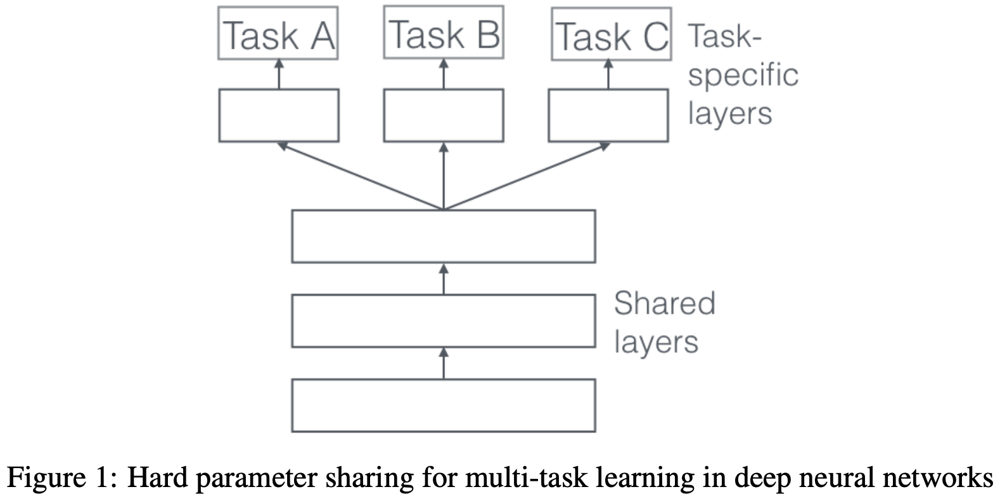
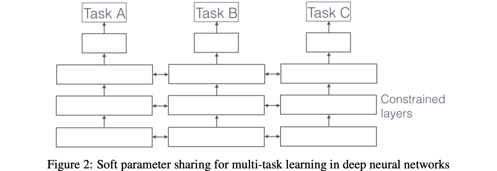
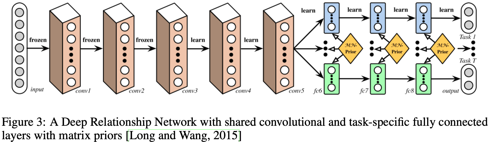
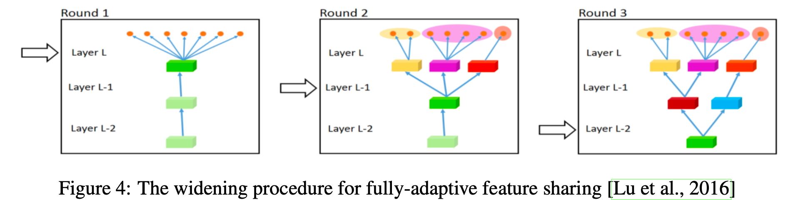
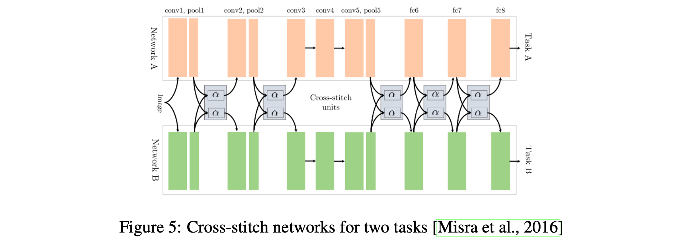
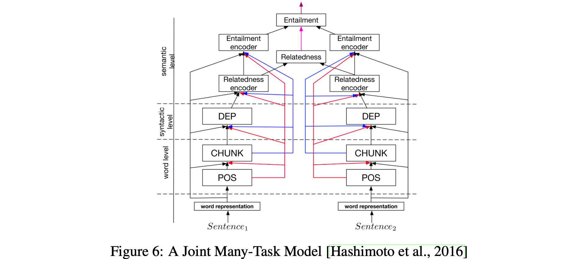
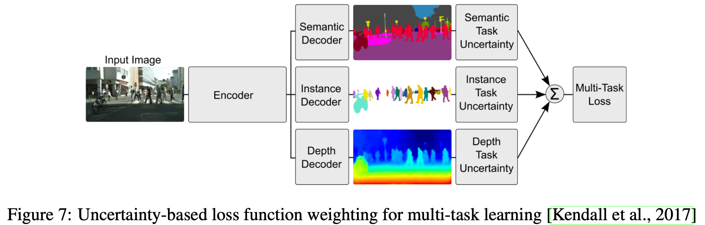
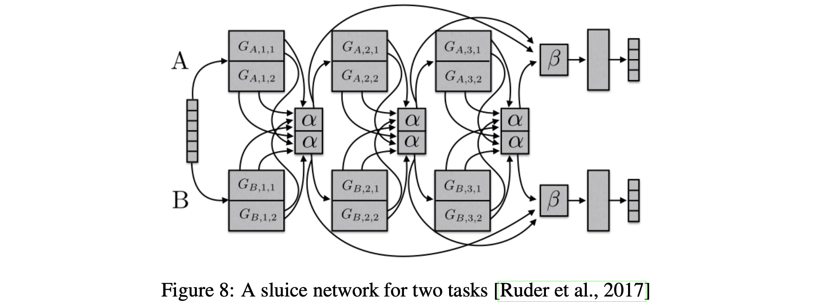

# 深度神经网络中的多任务学习综述

> Sebastian Ruder | arXiv:1706.05098

本文对深度神经网络中的多任务学习进行了综述。核心内容：

- 介绍了深度学习中最常用的 **两种多任务学习方法**（ **硬参数共享** 和 **软参数共享**）
- 阐述了多任务学习在实践中有效的**五种机制**
- 讨论了辅助任务的类型 以及 选择合适辅助任务的指南

关键发现：

- **硬参数共享虽然仍是主流**，但学习共享什么的最新进展是有希望的
- 我们对任务相似性、关系和层次结构的理解仍然有限
- 允许模型学习与每个任务共享什么可以暂时规避理论的缺乏

---

## 摘要

多任务学习（MTL，Multi-Task Learning）在机器学习的许多应用中取得了成功，从 自然语言处理和语音识别 到 计算机视觉 和 药物发现。本文旨在对多任务学习进行概述，特别是在深度神经网络中的应用。它介绍了深度学习中最常用的两种多任务学习方法，概述了相关文献，并讨论了最近的进展。特别是，它旨在帮助机器学习从业者应用多任务学习，阐明**多任务学习的工作原理**，并提供选择 **合适辅助任务**的指南。

## 1. 引言

在机器学习（ML，Machine Learning）中，我们通常关注优化某个特定指标，无论是某个基准测试的得分还是业务KPI。为此，我们通常训练单个模型或模型集成来执行我们期望的任务。然后我们对这些模型进行微调和调整，直到其性能不再提升。虽然我们通常可以通过专注于单一任务来实现可接受的性能，但我们**忽略了可能帮助我们在所关注指标上表现更好的信息**。**具体来说，这些信息来自相关任务的训练信号。通过在相关任务之间 共享表示，我们可以使模型在原始任务上更好地泛化。这种方法被称为多任务学习（MTL）。**

多任务学习已成功应用于机器学习的所有应用领域，从自然语言处理[17]和语音识别[20]到计算机视觉[25]和药物发现[42]。多任务学习有多种形式：联合学习、学会学习以及使用辅助任务学习只是其中一些名称。通常，只要你发现自己**在优化多个损失函数**，你实际上就在进行多任务学习（与单任务学习相对）。在这些场景中，**从多任务学习的角度明确思考你在尝试做什么并从中获得见解会有所帮助**。

**即使你只优化一个损失函数（这是典型情况），很可能存在一个辅助任务可以帮助你改进主要任务**。[12]简洁地总结了多任务学习的目标："**多任务学习通过利用 相关任务 训练信号中包含的领域特定信息 来提高泛化能力**"。

在本文中，我将尝试概述多任务学习的当前状态，特别是 **深度神经网络中的多任务学习**。我将首先在第2节从不同角度阐述多任务学习的动机。然后在第3节介绍深度学习中最常用的两种多任务学习方法。随后，在第4节，我将描述共同说明多任务学习在实践中为何有效的机制。在查看更高级的基于神经网络的多任务学习方法之前，我将在第5节通过讨论多任务学习文献提供一些背景。然后在第6节介绍一些最近提出的更强大的深度神经网络多任务学习方法。最后，我将讨论常用的**辅助任务类型**，并讨论 **什么使得辅助任务对多任务学习有益**。

## 2. 动机

我们可以从不同角度阐述多任务学习的动机：

**生物学角度**：我们可以将多任务学习视为 **受人类学习启发**。在学习新任务时，我们经常应用通过学习相关任务获得的知识。例如，婴儿首先学会识别面孔，然后可以将这些知识应用于识别其他物体。

**教学角度**：我们通常先学习能够为我们掌握更复杂技术提供 **必要技能 **的任务。这在学习武术中的正确倒地方式（如柔道）以及学习编程方面都是如此。

**流行文化角度**：我们也可以考虑《龙威小子》（1984年）。在电影中，宫城老师教给空手道小子看似无关的任务，如打磨地板和给汽车打蜡。事后看来，这些任务确实为他提供了学习空手道的宝贵技能。

**机器学习角度**：最后，我们可以从机器学习的角度阐述多任务学习：我们可以**将多任务学习视为 归纳迁移 的一种形式**。归纳迁移可以通过引入归纳偏置来帮助改进模型，这使得模型偏好某些假设而非其他假设。**例如，归纳偏置的常见形式是 $L_1$ 正则化，它导致偏好稀疏解**。**在多任务学习的情况下，归纳偏置由 辅助任务 提供，这使得模型偏好 能够解释多个任务的假设**。正如我们即将看到的，这通常会导致泛化更好的解。

## 3. 深度学习的两种多任务学习方法

到目前为止，我们一直关注多任务学习的理论动机。为了使多任务学习的思想更加具体，我们现在来看看在深度神经网络中进行多任务学习的两种最常用方法。在深度学习的背景下，多任务学习通常通过隐藏层的 硬参数共享 或 软参数共享 来完成。

### 3.1 硬参数共享

硬参数共享是神经网络中最常用的多任务学习方法，可以追溯到[11]。**它通常通过在所有任务之间共享隐藏层，同时保留几个任务特定的输出层来实现。** 如图1所示。

 图1：深度神经网络中多任务学习的硬参数共享

**硬参数共享大大降低了过拟合的风险**。事实上，[7]表明，共享参数过拟合的风险比任务特定参数（即输出层）过拟合的风险小一个数量级 $N$ （其中 $N$ 是任务数量）。这在直觉上是有意义的：我们同时学习的任务越多，模型就必须找到一个**捕捉所有任务的表示**，我们过拟合原始任务的机会就越少。

### 3.2 软参数共享

另一方面，在软参数共享中，每个任务都有自己的模型和自己的参数。然后对模型参数之间的距离进行正则化，以鼓励参数相似。例如，[21]使用L2距离进行正则化，而[50]使用迹范数。如图2所示。

图2：深度神经网络中多任务学习的软参数共享

深度神经网络中软参数共享所使用的约束受到为其他模型开发的多任务学习正则化技术的极大启发，我们很快将讨论这些技术。

## 4. 为什么多任务学习有效？

虽然通过多任务学习获得的归纳偏置在直觉上似乎合理，但为了更好地理解多任务学习，我们需要研究其底层机制。这些机制大多数最初由[12]提出。对于所有示例，我们**假设我们有两个相关任务 $A$ 和 $B$ ，它们依赖于一个共同的隐藏层表示 $F$ 。**

### 4.1 隐式数据增强

**多任务学习有效地增加了我们用于训练模型的 样本大小**。由于所有任务都至少有一定的噪声，当在某个任务 $A$ 上训练模型时，我们的目标是学习任务 $A$ 的良好表示，理想情况下忽略数据相关的噪声并很好地泛化。**由于不同任务具有不同的噪声模式，同时学习两个任务的模型能够学习更通用的表示。**只学习任务 $A$ 有过拟合任务 $A$ 的风险，而联合学习 $A$ 和 $B$ 使模型能够通过 **平均噪声模式** 获得更好的表示 $F$ 。

### 4.2 注意力聚焦

如果一个任务非常嘈杂或数据有限且高维，模型可能难以区分相关和不相关特征。多任务学习可以帮助模型将其注意力集中在那些真正重要的特征上，因为其他任务将为这些特征的相关性或不相关性提供额外证据。

### 4.3 窃听

某些特征 $G$ 对于某个任务 $B$ 来说很容易学习，而对于另一个任务 $A$ 来说却很难学习。这可能是因为 $A$ 与特征的交互更复杂，或者因为其他特征阻碍了模型学习 $G$ 的能力。通过多任务学习，我们可以允许模型窃听，即通过任务 $B$ 学习 $G$ 。最简单的方法是通过提示[1]，即直接训练模型预测最重要的特征。

### 4.4 表示偏置

**多任务学习使模型偏向于其他任务也偏好的表示。**这也将帮助模型在未来泛化到新任务，因为一个对足够多训练任务表现良好的假设空间在学习新任务时也会表现良好，只要它们来自同一环境[8]。

### 4.5 正则化

最后，多任务学习通过**引入归纳偏置充当正则化器**。因此，它降低了过拟合的风险以及模型的Rademacher复杂度，即其拟合随机噪声的能力。

## 5. 非神经网络模型中的多任务学习

为了更好地理解深度神经网络中的多任务学习，我们现在来看看线性模型、核方法和贝叶斯算法的现有文献。特别是，我们将讨论两个在多任务学习历史中一直很普遍的主要思想：**通过范数正则化强制任务间的稀疏性**；以及**建模任务之间的关系**。注意，文献中的许多多任务学习方法处理的是 **同质环境**：它们**假设所有任务都与单个输出相关联**，例如多类MNIST数据集通常被建模为10个二分类任务。更近的方法处理更现实的 **异质环境**，其中每个任务对应于一组唯一的输出。

### 5.1 块稀疏正则化

**符号**：为了更好地联系以下方法，让我们首先介绍一些符号。我们有 $T$ 个任务。对于每个任务 $t$ ，我们有一个模型 $m_t$ ，其参数 $a_t$ 的维度为 $d$ 。我们可以将参数写为列向量 $a_t$ 。我们将这些列向量 $a_1, \ldots, a_T$ 逐列堆叠形成矩阵 $A \in \mathbb{R}^{d \times T}$ 。然后 $A$ 的第 $i$ 行包含对应于每个任务模型第 $i$ 个特征的参数 $a_{i,\cdot}$ ，而 $A$ 的第 $j$ 列包含对应于第 $j$ 个模型的参数 $a_{\cdot,j}$ 。

许多现有方法对模型参数进行一些稀疏性假设。[4]假设所有模型共享一小部分特征。就任务参数矩阵 $A$ 而言，这意味着除了少数几行外，所有行都是0，这对应于**所有任务只使用少数几个特征**。为了强制执行这一点，他们将 $L_1$ 范数推广到多任务学习设置。回想一下， **$L_1$ 范数是对参数之和的约束，它强制除少数几个参数外的所有参数恰好为0**。它也被称为lasso（最小绝对收缩和选择算子）。

在单任务设置中， $L_1$ 范数是基于相应任务 $t$ 的参数向量 $a_t$ 计算的，对于多任务学习，我们对其任务参数矩阵 $A$ 进行计算。为此，我们首先对包含每个任务第 $i$ 个特征对应参数的每一行 $a_i$ 计算 $L_q$ 范数，得到向量 $b = [\|a_1\|_q \ldots \|a_d\|_q] \in \mathbb{R}^d$ 。然后我们计算这个向量的 $L_1$ 范数，这强制 $b$ 的除少数几个条目外的所有条目（即 $A$ 中的行）为0。

如我们所见，根据我们希望对每行施加什么约束，我们可以使用不同的 $L_q$ 。通常，我们将这些混合范数约束称为 $L_1/L_q$ 范数。它们也被称为 **块稀疏正则化**，因为它们导致 $A$ 的整行被设置为0。[55]使用 $L_1/L_\infty$ 正则化，而[4]**使用混合 $L_1/L_2$ 范数。后者也被称为group lasso，最早由[51]提出**。

[4]还表明，通过惩罚 $A$ 的迹范数，非凸 group lasso 的优化问题可以变为凸问题，这强制 $A$ 为低秩，从而约束列参数向量 $\mathbf{a}_{\cdot,1}, \ldots, \mathbf{a}_{\cdot,t}$ 位于低维子空间中。[38]进一步建立了使用 group lasso 进行多任务学习的上界。

尽管这种块稀疏正则化在直觉上似乎合理，但它非常依赖于特征在任务间共享的程度。[41]表明，如果特征重叠不多， $L_1/L_q$ 正则化实际上可能比**逐元素 $L_1$ 正则化**更差。

因此，[29]通过提出一种结合 块稀疏 和 逐元素稀疏 正则化的方法来改进 块稀疏模型。他们将任务参数矩阵 $A$ 分解为两个矩阵 $B$ 和S，其中 $A = B + S$ 。然后使用 $L_1/L_\infty$ 正则化强制 $B$ 为块稀疏，而使用lasso使S为逐元素稀疏。最近，[36]提出了group稀疏正则化的分布式版本。

### 5.2 学习任务关系

虽然group稀疏约束强制模型只考虑少数几个特征，但这些特征主要在所有任务之间共享。因此，**所有先前的方法都假设多任务学习中使用的任务密切相关**。然而，**每个任务可能与所有可用任务都不密切相关**。在这些情况下，**与不相关任务共享信息实际上可能损害性能，这种现象被称为 负迁移**。

因此，我们希望利用先验知识，表明某些任务相关而其他任务不相关。在这种情况下，强制任务聚类的约束可能更合适。[22]建议通过惩罚任务列向量 $\mathbf{a}_{\cdot,1}, \ldots, \mathbf{a}_{\cdot,t}$ 的范数及其方差来施加聚类约束。他们将此约束应用于核方法，但它同样适用于线性模型。

[23]为SVM提出了类似的约束。他们的约束受贝叶斯方法启发，旨在**使所有模型接近某个均值模型**。在SVM中，损失因此在为每个SVM获得大间隔 和 接近均值模型之间进行权衡。

[28]在聚类数 $C$ 预先已知的假设下，使聚类正则化的基本假设更加明确。他们然后将惩罚分解为三个独立的范数：

- **全局惩罚**：衡量列参数向量平均有多大： $\Omega_{\text{mean}}(A) = \|\bar{a}\|^2$
- **簇间方差**：衡量聚类彼此接近的程度： $\Omega_{\text{between}}(A) = \sum_{c=1}^{C} T_c \|\bar{a}_c - \bar{a}\|^2$ ，其中 $T_c$ 是第 $c$ 个聚类中的任务数， $\bar{a}_c$ 是第 $c$ 个聚类中任务参数向量的均值向量
- **簇内方差**：衡量每个聚类的紧凑程度： $\Omega_{\text{within}} = \sum_{c=1}^{C} \sum_{t \in J(c)} \|a_{\cdot,t} - \bar{a}_c\|$ ，其中 $J(c)$ 是第 $c$ 个聚类中的任务集

最终约束是三个范数的加权和： $\Omega(A) = \lambda_1 \Omega_{\text{mean}}(A) + \lambda_2 \Omega_{\text{between}}(A) + \lambda_3 \Omega_{\text{within}}(A)$

由于此约束假设聚类是预先已知的，他们引入了上述**惩罚的凸松弛**，允许同时学习聚类。

在另一种情况下，任务可能不是以聚类形式出现，而是具有固有结构。[32]将group lasso扩展到处理树结构的任务，而[16]将其应用于具有图结构的任务。

虽然前述建模任务关系的方法使用范数正则化，但其他方法则不使用正则化：[47]是第一个提出使用k近邻进行任务聚类算法的人，而[3]从多个相关任务学习共同结构，并应用于半监督学习。

许多其他关于学习多任务学习任务关系的工作使用贝叶斯方法：[27]通过在模型参数上放置先验来鼓励任务间参数相似，提出了用于多任务学习的贝叶斯神经网络。[34]通过推断共享协方差矩阵的参数，将高斯过程（GP，Gaussian Process）扩展到多任务学习。由于这在计算上非常昂贵，他们采用稀疏近似方案，贪婪地选择最有信息量的示例。[52]也使用GP进行多任务学习，假设所有模型都从共同的先验中采样。

**[6]在每个任务特定层上放置高斯作为先验分布。**为了鼓励不同任务之间的相似性，他们建议使均值依赖于任务，并使用混合分布引入任务聚类。重要的是，他们需要预先指定定义聚类和混合数的任务特征。

在此基础上，[48]从狄利克雷过程绘制分布，使模型能够学习任务之间的相似性以及聚类数。然后他们在同一聚类中的所有任务之间共享相同的模型。[19]提出了一个层次贝叶斯模型，学习latent任务层次结构，而[56]使用基于GP的正则化进行多任务学习，并扩展了先前基于GP的方法，使其在更大设置中更具计算可行性。

其他方法专注于在线多任务学习设置：[14]将一些现有方法（如[22]的方法）适应于在线设置。他们还提出了正则化感知器的多任务学习扩展，将任务相关性编码在矩阵中。他们使用不同形式的正则化来偏置此任务相关性矩阵，例如任务特征向量的接近程度或跨越子空间的维度。重要的是，与一些早期方法类似，他们需要预先提供构成此矩阵的任务特征。[45]然后通过学习任务关系矩阵扩展了先前的方法。

[30]假设任务形成不相交的组，并且每个组内的任务位于低维子空间中。在每个组内，任务共享相同的特征表示，其参数与组分配矩阵一起使用交替最小化方案联合学习。然而，组之间的完全不相交可能不是理想的方式，因为任务可能仍然共享一些对预测有帮助的特征。

[33]则允许来自不同组的两个任务重叠，假设存在少量latent基础任务。然后他们将每个实际任务 $t$ 的参数向量 $a_t$ 建模为这些latent任务的线性组合： $a_t = Ls_t$ ，其中 $L \in \mathbb{R}^{k \times d}$ 是包含 $k$ 个latent任务参数向量的矩阵， $s_t \in \mathbb{R}^k$ 是包含线性组合系数的向量。此外，他们约束线性组合在latent任务中是稀疏的；两个任务之间稀疏模式的重叠然后控制这些任务之间的共享量。

最后，[18]学习一小部分共享假设，然后将每个任务映射到单个假设。

## 6. 深度学习的多任务学习最新工作

虽然许多最近的深度学习方法已经使用了多任务学习——无论是显式还是隐式地——作为其模型的一部分（著名的例子将在下一节中介绍），但它们都采用了我们之前介绍的两种方法，即 硬参数共享 和 软参数共享。相比之下，只有少数论文研究了开发深度神经网络中更好的多任务学习机制。

### 6.1 深度关系网络

在计算机视觉的多任务学习中，方法通常**共享卷积层**，**同时学习任务特定的全连接层**。[37]通过提出深度关系网络改进了这些模型。除了共享层和任务特定层的结构外，他们还在全连接层上放置矩阵先验，这允许模型学习任务之间的关系，类似于我们之前看过的一些贝叶斯模型。然而，这种方法仍然依赖于预定义的共享结构，这对于研究充分的计算机视觉问题可能足够，但对于新任务可能容易出错。如图3所示。

图3：具有共享卷积层和任务特定全连接层的深度关系网络

### 6.2 全自适应特征共享

从另一个极端开始，[39]提出了一种自下而上的方法，从一个薄网络开始，在训练期间使用促进相似任务分组的标准贪心地动态扩展它。动态创建分支的扩展过程可以看出来，如图4所示。然而，贪心方法可能无法发现全局最优的模型，而将每个分支分配给恰好一个任务不允许模型学习任务之间更复杂的交互。

图4：全自适应特征共享的扩展过程

### 6.3 十字绣网络

[40]从两个独立的模型架构开始，就像软参数共享一样。然后他们使用他们所谓的十字绣单元，**允许模型通过学习前一层输出的线性组合来确定任务特定网络如何利用其他任务的知识**。他们的架构可以看到，如图5所示，其中他们只在池化层和全连接层之后放置十字绣单元。

图5：两个任务的十字绣网络

### 6.4 低监督

相比之下，在自然语言处理（NLP，Natural Language Processing）中，最近的工作专注于为多任务学习寻找更好的任务层次结构：[46]表明，**低级任务**（即通常用于预处理的NLP任务，如词性标注和命名实体识别）在用作辅助任务时应在 **较低层进行监督**。

### 6.5 联合多任务模型

基于这一发现，[26]预定义了一个包含多个NLP任务的层次结构，作为多任务学习的联合模型，如图6所示。

图6：联合多任务模型

### 6.6 使用不确定性加权损失

与其学习共享结构，[31]采取了一种正交方法，考虑每个任务的不确定性。然后他们通过基于任务相关不确定性最大化高斯似然来推导多任务损失函数，调整每个任务在代价函数中的相对权重。他们用于逐像素深度回归、语义和实例分割的架构可以看到，如图7所示。

图7：基于不确定性的多任务学习损失函数加权

### 6.7 张量分解用于多任务学习

最近的工作试图将现有的多任务学习方法推广到深度学习：[49]使用张量分解推广了先前讨论的一些矩阵分解方法，将模型参数分割为每层的共享参数和任务特定参数。

### 6.8 水闸网络

最后，我们提出了水闸网络[44]，一个概括了基于深度学习的多任务学习方法（如硬参数共享和十字绣网络）、块稀疏正则化方法以及创建任务层次结构的最新NLP方法的模型。该模型允许学习哪些层和子空间应该共享，以及网络在哪一层学习了输入序列的最佳表示，如图8所示。

图8：两个任务的水闸网络

### 6.9 我应该在我的模型中共享什么？

在调查了这些最近的方法之后，让我们现在简要总结并得出关于在我们的深度多任务学习模型中应该共享什么的结论。多任务学习历史上的大多数方法都**集中在任务从同一分布中抽取的场景**[7]。虽然这种场景有利于共享，但并非总是如此。为了开发鲁棒的多任务学习模型，我们因此**必须能够处理不相关或仅松散相关的任务**。

虽然早期的深度学习多任务学习工作预先指定每个任务对共享哪些层，但这种策略不可扩展，并且严重偏置多任务学习架构。硬参数共享——最初由[11]提出的技术——20年后仍然是标准。**虽然在许多场景中有用，但如果任务不密切相关或需要在不同级别进行推理，硬参数共享会很快失效。**因此，最近的方法着眼于学习共享什么，通常优于硬参数共享。此外，赋予我们的模型学习任务层次结构的能力是有帮助的，特别是在需要不同粒度的情况下。

正如最初提到的，一旦我们优化多个损失函数，我们就在进行多任务学习。因此，与其将我们的模型约束为将所有任务的知识压缩到相同的参数空间中，不如利用我们讨论过的多任务学习进展，使我们的模型能够学习任务之间应该如何交互。

## 7. 辅助任务

多任务学习在我们需要同时获得多个任务预测的情况下是自然的。这种场景在金融或经济预测中很常见，我们可能想要预测许多可能相关的指标，或者在生物信息学中，我们可能想要同时预测多种疾病的症状。在药物发现等场景中，应该预测数十或数百种活性化合物，**多任务学习准确性随着任务数量的增加而持续提高**。

然而，在大多数情况下，我们只关心一个任务上的性能。因此，在本节中，我们将讨论如何找到合适的辅助任务，以便仍然获得多任务学习的好处。

### 7.1 相关任务

**使用相关任务作为多任务学习的辅助任务是经典选择**。为了了解什么是相关任务，我们将介绍一些著名的例子。[12]使用预测道路不同特征的任务作为预测自动驾驶汽车转向方向的辅助任务；[54]使用头部姿势估计和面部属性推断作为面部标志检测的辅助任务；[35]联合学习查询分类和网络搜索；[25] **联合预测图像中物体的类别和坐标**；最后，[5]联合预测语音合成的音素持续时间和频率轮廓。

### 7.2 对抗性任务

**通常，相关任务的标注数据不可用**。但在某些情况下，我们可以访问与我们想要实现的目标相反的任务。这些数据可以使用对抗性损失来利用，该损失不寻求最小化**而是使用梯度反转层最大化训练误差**。这种设置最近在域适应方面取得了成功[24]。在这种情况下，对抗性任务是预测输入的域；通过反转对抗性任务的梯度，对抗性任务损失被最大化，这对主要任务有益，因为它强制模型学习无法区分域的表示。

### 7.3 提示

如前所述，多任务学习可用于学习仅使用原始任务可能不容易学习的特征。**实现此目标的一种有效方法是使用提示，即预测特征作为辅助任务**。自然语言处理中此策略的最近示例包括[53]，他们预测输入句子是否包含正面或负面情感词作为情感分析的辅助任务，以及[15]，他们预测句子中是否存在名称作为名称错误检测的辅助任务。

### 7.4 聚焦注意力

类似地，辅助任务可用于将注意力集中在网络通常可能忽略的图像部分。例如，对于学习转向[12]，单任务模型可能通常忽略**车道标记**，因为它们只占图像的一小部分，并且并非总是存在。然而，**预测车道标记作为辅助任务强制模型学习表示它们**；这些知识也可以用于主要任务。类似地，对于面部识别，可以学习预测面部标志的位置作为辅助任务，因为这些通常具有区分性。

### 7.5 量化平滑

对于许多任务，训练目标是量化的，即虽然连续尺度可能更合理，但标签作为离散集合可用。这在许多需要人工评估数据收集的场景中都是如此，例如预测疾病风险（例如低/中/高）或情感分析（正面/中性/负面）。在这些情况下，使用量化较少的辅助任务可能有所帮助，因为由于其目标更平滑，它们可能更容易学习。

### 7.6 预测输入

在某些场景中，使用某些特征作为输入是不切实际的，因为它们对于预测所需目标没有帮助。然而，它们仍然可能能够指导任务的学习。在这些情况下，特征可以用作输出而不是输入。[13]提出了几个适用此方法的问题。

### 7.7 使用未来预测现在

在许多情况下，某些特征只有在应该进行预测后才可用。例如，对于自动驾驶汽车，一旦汽车经过障碍物和车道标记，就可以进行更准确的测量。[12]还给出了肺炎预测的例子，之后将可以获得额外医疗试验的结果。对于这些示例，额外数据不能用作特征，因为在运行时它将不可用作输入。然而，它可以用作辅助任务，**在训练期间向模型传授额外知识**。

### 7.8 表示学习

多任务学习中辅助任务的目标是使模型能够学习对主要任务共享或有帮助的表示。到目前为止讨论的所有辅助任务都是隐式地做到这一点的：它们与主要任务密切相关，因此学习它们可能使模型学习有益的表示。更显式的建模是可能的，例如通过使用已知能够使模型学习可迁移表示的任务。[15]和[43]使用的语言建模目标就起到了这个作用。类似地，自编码器目标也可以用作辅助任务。

### 7.9 什么辅助任务是有帮助的？

在本节中，我们讨论了不同的辅助任务，这些任务可用于利用多任务学习，即使我们只关心一个任务。然而，我们仍然不知道在实践中什么辅助任务会有用。找到辅助任务主要**基于辅助任务应该以某种方式与主要任务相关** 并且 应该 **有助于预测主要任务**的假设。然而，我们仍然没有一个很好的概念来判断两个任务何时应该被认为是相似或相关的。[12]定义两个任务相似，如果它们使用相同的特征来做决策。[8]从理论上认为相关任务共享共同的最优假设类，即具有相同的归纳偏置。[9]提出两个任务是 $F$ 相关的，如果两个任务的数据都可以使用一组变换 $F$ 从固定概率分布生成。虽然这允许推理不同传感器为同一分类问题收集数据的任务（例如，使用不同角度和光照条件的摄像头进行物体识别），但它不适用于不处理同一问题的任务。[48]最终认为两个任务相似，如果它们的分类边界（即参数向量）接近。

尽管在理解任务相关性方面有这些早期的理论进展，但我们在实现这一目标方面进展甚微。任务相似性不是二元的，而是存在于一个连续谱上。允许我们的模型学习与每个任务共享什么可能使我们暂时规避理论的缺乏，甚至更好地**利用仅松散相关的任务**。然而，我们还需要开发一个更原则性的任务相似性概念，关于多任务学习，以便知道我们应该优先考虑哪些任务。

最近的工作[2]发现，具有紧凑且均匀标签分布的辅助任务更适合NLP中的序列标注问题，我们在实验中已经证实了这一点[44]。此外，对于快速达到平台期的主要任务与非平台期的辅助任务，更有可能获得收益[10]。然而，这些实验迄今范围有限，最近的发现只是为深入理解神经网络中的多任务学习提供了最初线索。

## 8. 结论

在这篇综述中，我回顾了多任务学习文献的历史以及深度学习多任务学习的最新工作。虽然多任务学习越来越频繁地被使用，但20年前的硬参数共享范式仍然在基于神经网络的多任务学习中普遍存在。然而，学习共享什么的最新进展是有希望的。同时，我们对任务的理解——它们的相似性、关系、层次结构和对多任务学习的好处——仍然有限，我们需要更彻底地研究它们，以更好地理解深度神经网络多任务学习的泛化能力。

---

## 参考文献

[1] Abu-Mostafa, Y. S. (1990). Learning from hints in neural networks. Journal of Complexity, 6(2), 192–198.

[2] Alonso, H. M., & Plank, B. (2017). When is multi-task learning effective? Semantic sequence labelling under domain shift for TED talks. arXiv preprint arXiv:1704.02934.

[3] Ando, R. K., & Tong, Q. (2005). A framework for learning predictive structures from multiple tasks and unlabeled data. JMLR, 6, 1817–1853.

[4] Argyriou, A., & Pontil, M. (2007). Multi-task feature learning. In Advances in Neural Information Processing Systems.

[5] Arık, S. Ö., et al. (2017). Deep voice: Real-time neural text-to-speech. arXiv preprint arXiv:1702.07825.

[6] Bakker, B., & Heskes, T. (2003). Task clustering and gating for Bayesian multi-task learning. JMLR, 4, 83–99.

[7] Baxter, J. (1997). A Bayesian/information theoretic model of learning to learn via multiple task sampling. Machine Learning, 28(1), 7–39.

[8] Baxter, J. (2000). A model of inductive bias learning. JMLR, 1, 321–354.

[9] Ben-David, S., & Schuller, R. (2003). Exploiting task relatedness for multiple task learning. In Learning Theory and Kernel Machines.

[10] Bingel, J., & Søgaard, A. (2017). Identifying beneficial task relations for multi-task learning in deep neural networks. arXiv preprint arXiv:1702.08303.

[11] Caruana, R. (1993). Multitask learning: A knowledge-based source of inductive bias. In Proceedings of the 10th International Conference on Machine Learning.

[12] Caruana, R. (1998). **Multitask learning.** In Learning to Learn (pp. 95–133). Springer.

[13] Caruana, R., & de Sa, V. R. (1997). Promoting poor features to supervise: Weakly supervised learning by feature augmentation. Technical report, Carnegie Mellon University.

[14] Cavallanti, G., Cesa-Bianchi, N., & Gentile, C. (2010). Linear algorithms for online multitask classification. JMLR, 11, 2901–2947.

[15] Cheng, J., et al. (2015). Effective learning of loudness with domain adaptation. In Proceedings of the International Conference on Acoustics, Speech and Signal Processing.

[16] Chen, X., et al. (2010). Graph-structured multi-task regression and an efficient optimization method for fast facial landmark detection. In IEEE International Conference on Automatic Face & Gesture Recognition.

[17] Collobert, R., & Weston, J. (2008). A unified architecture for natural language processing: Deep neural networks with multitask learning. In Proceedings of the 25th International Conference on Machine Learning.

[18] Crammer, K., & Mansour, Y. (2012). Learning multiple tasks using shared hypotheses. JMLR, 13, 143–167.

[19] Daumé III, H. (2009). Bayesian multitask learning with latent hierarchies. In Proceedings of the 25th Conference on Uncertainty in Artificial Intelligence.

[20] Deng, L., et al. (2013). Recent advances in deep learning for speech research at Microsoft. In Proceedings of the IEEE International Conference on Acoustics, Speech and Signal Processing.

[21] Duong, L., et al. (2015). Low resource dependency parsing: Cross-lingual parameter sharing in a neural network parser. In Proceedings of the 53rd Annual Meeting of the Association for Computational Linguistics.

[22] Evgeniou, A., Micchelli, C. A., & Pontil, M. (2005). Learning multiple tasks with kernel methods. JMLR, 6, 615–637.

[23] Evgeniou, A., & Pontil, M. (2004). Regularized multi-task learning. In Proceedings of the 10th ACM SIGKDD International Conference on Knowledge Discovery and Data Mining.

[24] Ganin, Y., & Lempitsky, V. (2015). Unsupervised domain adaptation by backpropagation. In Proceedings of the 32nd International Conference on Machine Learning.

[25] Girshick, R. (2015). Fast R-CNN. In Proceedings of the IEEE International Conference on Computer Vision.

[26] Hashimoto, T., et al. (2016). A joint many-task model: Growing a neural network for multiple NLP tasks. arXiv preprint arXiv:1611.04051.

[27] Heskes, T. (2000). Empirical Bayes for learning to learn. In Proceedings of the 17th International Conference on Machine Learning.

[28] Jacob, L., Obozinski, G., & Vert, J. P. (2009). Task clustering with a graph-lasso for multi-task learning. JMLR, 10, 2127–2154.

[29] Jalali, A., et al. (2010). A dirty model for multi-task learning. In Advances in Neural Information Processing Systems.

[30] Kang, Z., Graumann, J., & Mandt, S. (2011). Multi-task learning with task clustering. arXiv preprint arXiv:1106.4763.

[31] Kendall, A., Gal, Y., & Cipolla, R. (2017). Multi-task learning using uncertainty to weigh losses for scene geometry and semantics. arXiv preprint arXiv:1705.07115.

[32] Kim, S., & Xing, E. P. (2010). Tree-guided group lasso for multi-task regression with structured sparsity. In Proceedings of the 27th International Conference on Machine Learning.

[33] Kumar, A., & Daumé III, H. (2012). Learning task grouping and overlap in multi-task learning. In Proceedings of the 29th International Conference on Machine Learning.

[34] Lawrence, N. D., & Platt, J. C. (2004). Learning to learn with the informative vector machine. In Proceedings of the 21st International Conference on Machine Learning.

[35] Liu, S., et al. (2015). Joint query classification and retrieval using multi-task learning. In Proceedings of the 38th International ACM SIGIR Conference on Research and Development in Information Retrieval.

[36] Liu, S., et al. (2016). Distributed group sparse coding for multi-task learning. arXiv preprint arXiv:1608.04681.

[37] Long, M., & Wang, J. (2015). Learning multiple tasks with deep relation networks. arXiv preprint arXiv:1506.06190.

[38] Lounici, K., et al. (2009). Multi-task feature learning with group lasso. In Advances in Neural Information Processing Systems.

[39] Lu, Y., et al. (2016). Fully adaptive feature sharing in multi-task networks. arXiv preprint arXiv:1611.05377.

[40] Misra, I., et al. (2016). Cross-stitch networks for multi-task learning. In Proceedings of the IEEE Conference on Computer Vision and Pattern Recognition.

[41] Negahban, S., & Wainwright, M. J. (2008). Joint support recovery under high-dimensional scaling. In Advances in Neural Information Processing Systems.

[42] Ramsundar, N., et al. (2015). Massively multitask networks for drug discovery. arXiv preprint arXiv:1502.02072.

[43] Rei, M. (2017). Semi-supervised multitask learning for sequence labeling. arXiv preprint arXiv:1704.07156.

[44] Ruder, S., et al. (2017). Sluice networks: Learning what to share between loosely related tasks. arXiv preprint arXiv:1705.08142.

[45] Saha, A., Rai, P., & Daumé III, H. (2011). Online multi-task learning with poor supervision. arXiv preprint arXiv:1107.1348.

[46] Søgaard, A., & Goldberg, Y. (2016). Deep multi-task learning with low level tasks supervised at lower layers. In Proceedings of the 54th Annual Meeting of the Association for Computational Linguistics.

[47] Thrun, S., & O'Sullivan, J. (1996). Discovering structure in multiple learning tasks. In Proceedings of the 13th International Conference on Machine Learning.

[48] Xue, Y., et al. (2007). Multi-task learning for classification with Dirichlet process priors. JMLR, 8, 35–63.

[49] Yang, Y., & Hospedales, T. (2017a). Trace norm regularised deep multi-task learning. arXiv preprint arXiv:1608.05061.

[50] Yang, Y., & Hospedales, T. (2017b). On the effects of multi-task learning in deep neural networks. arXiv preprint arXiv:1704.08514.

[51] Yuan, M., & Lin, Y. (2006). Model selection and estimation in regression with grouped variables. J. R. Statist. Soc. B, 68(1), 49–67.

[52] Yu, K., et al. (2005). Learning local tasks with global information. In Proceedings of the 22nd International Conference on Machine Learning.

[53] Yu, J., & Jiang, J. (2016). Learning sentence embeddings with auxiliary tasks for cross-domain sentiment classification. In Proceedings of the 2016 Conference on Empirical Methods in Natural Language Processing.

[54] Zhang, Y., et al. (2014). Detecting faces using implicit face shape and conditional random forests. In Proceedings of the Asian Conference on Computer Vision.

[55] Zhang, Y., & Huang, H. (2008). A multi-task learning formulation for predicting clinical outcomes. In Advances in Neural Information Processing Systems.

[56] Zhang, Y., & Yeung, D. Y. (2010). Multitask learning via regularization and completion. JMLR, 11, 1713–1734.

