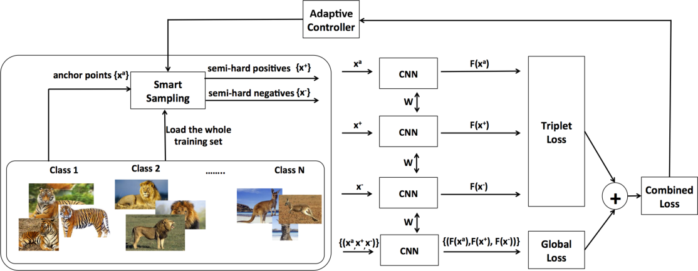
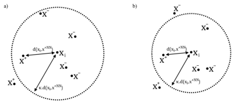
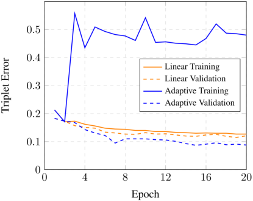
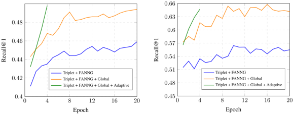
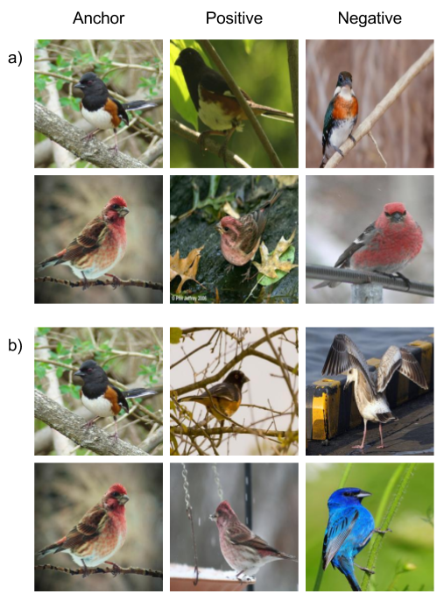
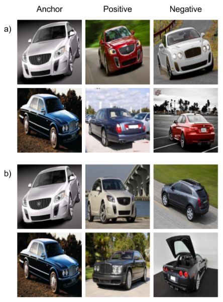
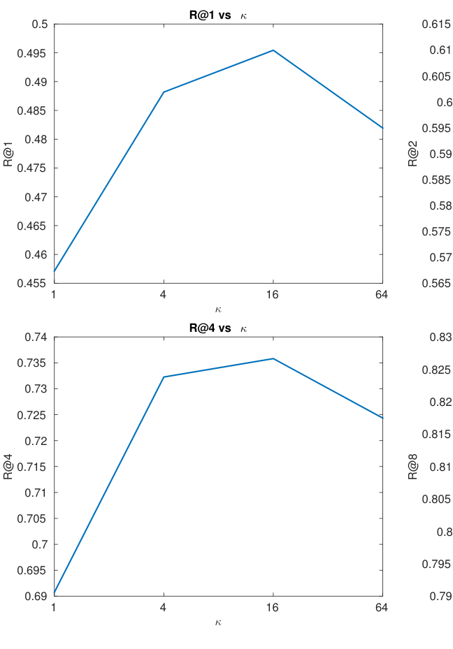
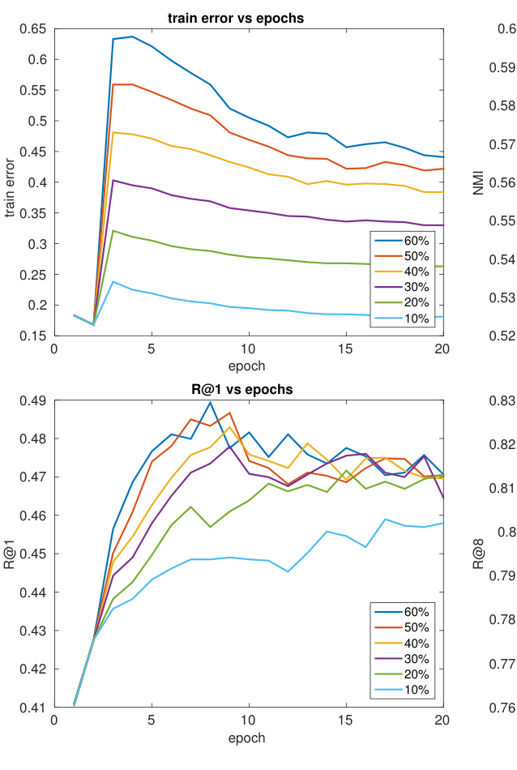
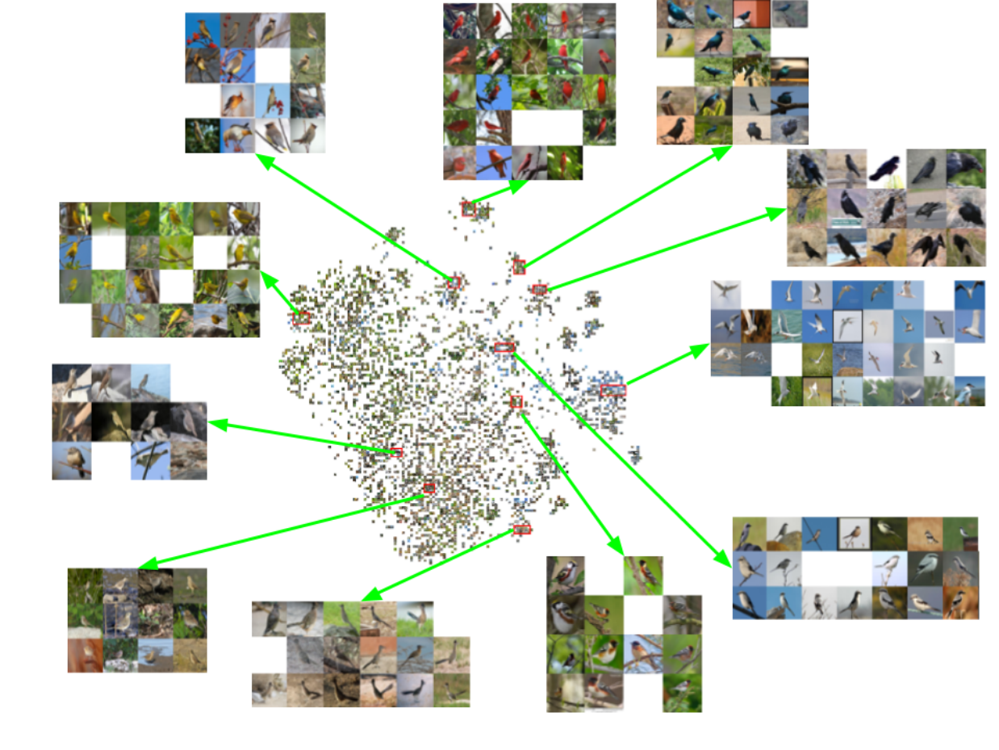
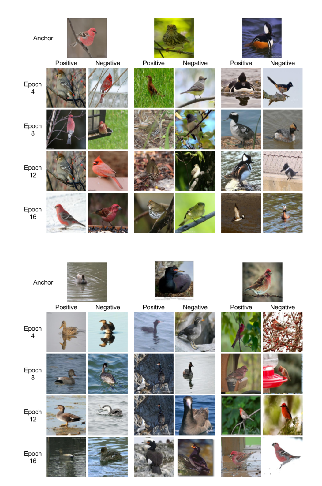

# Smart Mining for Deep Metric Learning——深度度量学习的智能挖掘

> Ben Harwood\*, Vijay Kumar B G\*, Gustavo Carneiro, Ian Reid, Tom Drummond | 1阿德莱德大学，2莫纳什大学

本文提出了一种新颖的深度度量学习方法，结合三元组模型与嵌入空间的全局结构，通过基于FANNG的智能挖掘（smart mining）过程高效选择有效训练样本，并引入自适应控制器自动调整挖掘超参数以加速收敛。实验表明，该方法在CUB-200-2011和Cars196数据集上取得了当时最优的嵌入结果。

- 提出智能挖掘策略，利用FANNG近似最近邻搜索在整个训练集中高效挖掘难负例和难正例
- 将三元组损失与全局损失相结合，利用嵌入空间中匹配与非匹配距离分布的一阶和二阶统计量
- 设计自适应线性控制器，根据训练误差自动调节缩放参数 $\kappa$ ，实现快速收敛
- 在CUB-200-2011和Cars196上仅需4个epoch即达到收敛，显著优于现有方法

---

## 摘要

为解决深度度量学习问题并生成特征嵌入，当前方法通常使用三元组模型来最小化同类样本之间的相对距离，同时最大化不同类样本之间的相对距离。尽管取得了成功，但训练样本中绝大多数产生的梯度幅度接近于零，这会损害三元组模型的训练收敛性。这一问题推动了探索嵌入全局结构的方法以及挖掘难负例/难正例的方法的发展。此类挖掘方法的有效性通常伴随着难以处理的计算开销。在本文中，我们提出了一种新的深度度量学习方法，结合了三元组模型与嵌入空间的全局结构。我们依靠一种智能挖掘过程，以较低的计算成本产生有效的训练样本。此外，我们提出了一个自适应控制器，可自动调整智能挖掘超参数并加速训练过程的收敛。我们通过实验表明，所提出的方法能够比其它竞争的挖掘方法更快、更准确地训练三元组ConvNet。此外，我们展示了该方法在CUB-200-2011和Cars196数据集上取得了当时最优的嵌入结果。

## 1 引言

用于估计有效特征嵌入的深度度量学习模型的发展 [2, 4, 10, 12, 17, 18, 19, 15, 24, 27, 29, 28, 13, 6] 是许多近期计算机视觉方法的核心 [3, 16, 21, 26, 30]。这类模型的主要优势在于其自动学习度量空间的能力，在该空间中，相似类别的样本倾向于彼此接近，而不同类别的样本则更可能彼此远离。这种方法的主要应用场景涉及类别数量极大（超过 $10^5$ 个类别）且每个类别样本数较少（在 $[10^1, 10^2]$ 范围内）的情况，此时传统分类器的实现变得具有挑战性 [21, 15]。

可以说，能够估计特征嵌入的最为广泛探索的深度学习模型基于三元组网络 [7, 26]，它是孪生网络 [1] 的扩展。三元组网络由三个相同的卷积神经网络（ConvNet）组成，使用三元组样本进行训练：一个锚点样本（anchor），一个与锚点同类的正样本（positive），以及一个不同类的负样本（negative）。训练过程基于一个损失函数，该函数惩罚锚点与正样本之间较大的相对距离，以及锚点与负样本之间较小的相对距离。因此，该训练过程依赖于包含难正例（锚点与正样本相距较远）和难负例（锚点与负样本相距较近）的三元组。换句话说，这些难样本将形成能够产生足够大梯度幅度的三元组。假设训练集有 $N$ 个样本，则三元组的集合具有复杂度 $O(N^3)$ ，这意味着即使对于中等规模的数据集（例如 $N = 10^5$ ），其构造也是不可行的。这一问题导致了重要性采样技术 [16, 18, 26] 的实施，该技术对三元组集合进行随机欠采样。在此，它们的成功依赖于使用足够的样本来保证一定比例的难正例和难负例可用于训练^1。鉴于寻找难正例和难负样本所涉及的高复杂度，另一种训练过程被开发出来，以保证获得具有大梯度幅度的训练样本：即引入考虑嵌入空间全局结构的损失函数 [10, 15, 24]。

在本文中，我们提出了一种新颖的深度度量学习方法，结合了全局损失 [10] 和三元组损失 [7, 26]，并使用从一种具有低计算复杂度的智能采样方法 [5] 中获取的训练样本来计算，该方法能够找到产生大梯度幅度的有效训练样本（见图1）。本质上，我们的智能采样方法规避了上述重要性采样问题，使我们的模型能够利用更有效的难负例和难正例进行鲁棒训练，而无需对训练集进行随机欠采样。此外，我们提出了一种新颖的自适应控制器，通过监控训练性能、估计其自身内部参数然后自动调整智能采样超参数来加速学习。我们通过实验表明，所提出的方法能够比其它竞争的挖掘方法更快、更准确地训练三元组ConvNet。此外，我们展示了该方法在CUB-200-2011和Cars196数据集上取得了当时最优的嵌入结果。

^1我们尚未发现有正式的研究描述用于训练的数量与硬正/负例比例之间的关系。

## 2 相关工作

在本节中，我们回顾近期关于选择难正例和难负例以训练三元组和孪生网络的方法、探索嵌入空间全局结构的方法，以及构成本文提出方法基础的近似最近邻搜索。正如 Shrivastava 等人 [17] 所指出的，难负例和难正例挖掘是对自举问题 [22] 的重新标记，其核心思想是先用包含似乎很好分离的正负例的三元组开始嵌入模型的训练，然后随着训练的进行逐步引入更具挑战性的正负样本。这种方法的一个主要问题是如何引入此类具有挑战性的样本——特别是：1）如何有效且高效地对训练集进行采样以选择有效的训练样本，特别是考虑到包含 $N$ 个样本的训练集存在 $N^3$ 个三元组；2）什么是有挑战性的正负样本的定义。

Wang 等人 [26] 描述了一种基于样本相关性手动标注来构建三元组的方法。利用这种相关性，其思路是使用重要性采样构建三元组，但这种方法受限于需要这些手动标注。近期提出的方法依赖于图像标签，例如逐步引入最难的可能的正负样本的孪生网络 [18]。这是通过随机抽样训练集中锚点和正样本对，然后根据两个样本在嵌入空间中的距离按降序对这些对进行排序来实现的。类似的方法也应用于锚点和负样本对，但排序是按升序进行。然后，训练对由两个列表中的顶部对组成。我们使用这种采样方案作为难挖掘的基线。Han 等人 [4] 引入了一种高效的水库采样方法来选择正负样本，但他们并未应用任何类型的重要性采样来选择具有挑战性的样本。在 FaceNet 中，Schroff 等人 [16] 引入了一种三元组训练方法，其中锚点和正样本对是随机选择的，而锚点和负样本对则使用一种选择"半难"负例的准则从训练集的一个子集（即常规深度学习模型训练中的 mini-batch）中选择：锚点和负样本对被选中，如果它们距离较近，但至少要比锚点-正样本对的距离更远。这种半难负例采样通过避免在训练集中的离群点上过拟合，提高了训练的鲁棒性。Song 等人 [21] 能够高效计算训练集子集（即 mini-batch）的完整成对距离矩阵，从而设计了一种新的损失函数，该函数集成所有正负样本以形成提升结构嵌入。然而，与我们的工作不同的是，提升结构嵌入仅适用于 mini-batch 而非整个训练集。

上述三元组模型训练中存在的问题促使了探索嵌入空间全局结构的方法的发展。Kumar 等人 [10] 提出了一种全局损失函数，使用一阶和二阶统计量来允许三元组网络的鲁棒训练，该方法提高了训练的鲁棒性，但仍依赖于正负样本的随机采样。Ustinova 和 Lempitsky [24] 提出了一种损失函数，最小化负例相似度分布与正例相似度累积密度函数乘积的积分。类似地，Song 等人 [15] 引入了一种优化全局聚类质量指标（NMI）的损失函数。如 Kumar 等人 [10] 所示，局部和全局损失的组合似乎能产生最有效的嵌入空间，因此我们认为上述最后两种方法 [24, 15] 仍有改进空间，但这种改进依赖于更有效的难负例和难正例采样方法。

在寻求更有效的寻找难三元组的方法时，我们观察到难负例挖掘（以及在较小程度上的难正例挖掘）可以被视为一个经过充分研究的近似最近邻（ANN）搜索问题的实例。特别是，在挖掘负例时，我们主要关心的是避免穷举搜索整个训练集的计算成本。幸运的是，ANN 搜索方法能够以最近邻召回率的小幅下降换取计算效率的大幅提升。在难负例挖掘的背景下，当前嵌入中的一小部分最近邻可以保证包含来自至少两个不同类别的样本（由于每个类别训练的样本很少）。FANNG（快速近似最近邻图）[5] 是一种基于图的索引，可以快速且以非常高的召回率找到这些邻域。此外，FANNG 是在完整的嵌入空间中构建的，这使得三元组选择可以重用 ANN 搜索期间已经计算出的精确距离。FANNG 在高召回率下提供了当时最优的性能，同时仅为索引质量添加了一个调优参数，为 ANN 搜索质量添加了另一个调优参数。

## 3 提出方法

我们首先描述三元组网络 [26, 7, 16, 27] 的架构及其训练中使用的损失函数。然后，我们描述训练过程中应用的采样方法。

假设训练集表示为 $T = \{(x_i, y_i)\}^N_{i=1}$ ，其中 $x_i \in \mathbb{R}^{n \times n}$ ， $y_i \in \{1, ..., C\}$ 。特征嵌入记为 $f(x, \theta_f)$ ，其中 $f: \mathbb{R}^n \times \mathbb{R}^k \to \mathbb{R}^m$ ， $\theta_f \in \mathbb{R}^k$ 表示网络参数（权重矩阵、偏置向量和归一化参数）。三元组网络包含三个相同的深层卷积神经网络（ConvNet），包含 $L$ 层，每层定义为：

$$
f(x, \theta_f) = f_{\text{out}} \circ r_L \circ h_L \circ f_L \circ ... \circ r_1 \circ h_1 \circ f_1(x), \qquad (1)
$$

其中 $\theta_f$ 定义如上， $f_l(.)$ 表示线性变换， $h_l(.)$ 表示归一化函数， $r_l(.)$ 表示非线性激活函数（例如 ReLU [14]）。同样在 (1) 中，注意 $f_l = [f_{l,1}, ..., f_{l,n_l}]$ 表示一个由 $n_l$ 个预激活函数组成的数组。

### 3.1 三元组网络

三元组网络 [26, 7, 16, 27] 的输入由一个锚点 $x_i$ （来自类别 $y_i$ ）、另一个来自相同类别的点 $x^+_i = x_j$ （其中 $i \neq j$ 且 $y_i = y_j$ ）以及一个来自不同类别的点 $x^-_i = x_k$ （其中 $k \neq i$ 且 $y_i \neq y_k$ ）组成。每个三元组的损失函数定义为：

$$
J_t(x_i, x^+_i, x^-_i, \theta_f) = \max\left(0, 1 - \frac{\|f^{(1)}(x_i, \theta_f) - f^{(3)}(x^-_i, \theta_f)\|_2}{\|f^{(1)}(x_i, \theta_f) - f^{(2)}(x^+_i, \theta_f)\|_2 + m}\right), \qquad (2)
$$

其中 $m$ 是边距， $x^+_i$ 和 $x_i$ 属于同一类别， $x^-_i$ 和 $x_i$ 来自不同类别，而 $f^{(1)}(.)$ 、 $f^{(2)}(.)$ 和 $f^{(3)}(.)$ 被约束为同一个由 $\theta_f$ 参数化的网络。

三元组网络的训练可以通过引入一种探索嵌入全局结构的损失 [10] 而变得更加鲁棒。特别地，(2) 中的三元组损失可以扩展为一个全局损失，该损失假设锚点与正样本之间以及锚点与负样本之间的距离分布服从高斯分布。该全局损失旨在：1）最小化两个分布的方差，2）最小化锚点与正样本之间距离的均值，以及 3）最大化锚点与负样本之间距离的均值，如下所示：

$$
J_g(\{x_i\}^N_{i=1}, \{x^+_i\}^N_{i=1}, \{x^-_i\}^N_{i=1}, \theta_f) = (\sigma^2_+ + \sigma^2_-) + \lambda \max\left(0, \mu_+ - \mu_- + t\right), \qquad (3)
$$

其中 $\mu_+ = \sum^N_{i=1} d^+_i / N$ ， $\mu_- = \sum^N_{i=1} d^-_i / N$ ， $\sigma^2_+ = \sum^N_{i=1}(d^+_i - \mu_+)^2 / N$ ， $\sigma^2_- = \sum^N_{i=1}(d^-_i - \mu_-)^2 / N$ ，这里 $\mu_+$ 和 $\sigma^2_+$ 表示匹配对距离分布的均值和方差， $\mu_-$ 和 $\sigma^2_-$ 表示非匹配对距离分布的均值和方差， $d^+_i = \frac{\|f^{(1)}(x_i, \theta_f) - f^{(2)}(x^+_i, \theta_f)\|^2_2}{4}$ ， $d^-_i = \frac{\|f^{(1)}(x_i, \theta_f) - f^{(3)}(x^-_i, \theta_f)\|^2_2}{4}$ ， $\lambda$ 是平衡各项重要性的项， $t$ 是匹配与非匹配距离分布均值之间的边距， $N$ 是训练集的大小。注意在 (3) 中，我们假设一个三元组网络（即 $f^{(1)}(.)$ 、 $f^{(2)}(.)$ 和 $f^{(3)}(.)$ 是同一个网络），其中第 $i$ 个三元组的匹配和非匹配对的平方欧氏距离被限制为 $0 \leq d^+_i, d^-_i \leq 1$ （因为除以了 4），并且归一化层强制嵌入的范数为 1。

### 3.2 智能挖掘

如第 2 节所述，半难挖掘已被证明是训练三元组网络 [16] 的一种有效方法，其主要目标是找到能够持续推进网络训练的三元组集合。朴素地，这可以通过选择对三元组约束违反最大的三元组来实现。例如，给定一个锚点 $x_i$ ，最难的最近正例定义为：

$$
x^+_i = \arg\max_{(x_j, y_j) \in T, x_j \neq x_i, y_j = y_i} \|f^{(1)}(x_i, \theta_f) - f^{(2)}(x_j, \theta_f)\|^2_2, \qquad (4)
$$

最难的最近负例定义为：

$$
x^-_i = \arg\min_{(x_j, y_j) \in T, x_j \neq x_i, y_j \neq y_i} \|f^{(1)}(x_i, \theta_f) - f^{(3)}(x_j, \theta_f)\|^2_2. \qquad (5)
$$

为了避免在整个训练集上进行代价高昂的 $\arg\max$ ，半难挖掘通常改为在每个 mini-batch 中使用的随机样本子集上进行 [18, 16]。这种方法还有一个额外的优点，即避免重复尝试从可能永远不会逐 epoch 改进的最难三元组中学习。

我们定义了一种新颖的离线挖掘策略，该策略首先找到一组近似最近邻 $S \subset T$ 。然后，对于以 $x_i$ 为锚点的所有三元组，使用邻居集 $S_i$ 来确定合适的正负样本。为了避免挖掘嵌入中结构不良的区域，我们将负样本的选择限制为只包含那些至少存在一个比该负样本更接近锚点的正样本的负样本。然后选择正样本以保证损失函数 (2) 产生非零响应。

更正式地，我们将智能负例定义为任何满足以下条件的负样本 $x^-_i \in S_i$ ：

$$
\|f^{(1)}(x_i, \theta_f) - f^{(3)}(x^-_i, \theta_f)\|^2_2 > \kappa \cdot \|f^{(1)}(x_i, \theta_f) - f^{(2)}(x^{+NN}_i, \theta_f)\|^2_2, \qquad (6)
$$

其中 $\kappa$ 是一个全局调优变量， $x^{+NN}_i$ 是离 $x_i$ 最近的正样本（注意这不是用于构成三元组的那个正样本）。排除边界、锚点、正样本和负样本之间的关系可见图 2。

图 2. 锚点 $x_i$ 邻居的简化二维投影，此处 $S_i$ 包含两个正样本和四个负样本。距离 $d(x, y)$ 为平方欧氏距离。a) 当前的 $\kappa$ 和类别 $y_i$ 的聚类指定了一个包含所有负样本的排除边界，因此目前没有负样本被视为适合训练。b) 在随后的一个 epoch 中，更小的 $\kappa$ 和更紧密的类别聚类使得一个负样本位于排除边界之外。该负样本以及位于排除边界更外侧的正样本被用来构成一个保证违反三元组约束的三元组。

在由锚点 $x_i$ 与最近正样本 $x^{+NN}_i$ 之间的距离定义的区域之外进行挖掘，将负样本的选择与类别 $y_i$ 在当前嵌入空间中的聚类紧密程度联系起来。此外，全局参数 $\kappa$ 为这些以每个锚点为中心的超球形排除边界的半径提供了一个可调的缩放因子。实验发现，以较大的 $\kappa$ 值开始训练，然后在整个训练过程中逐渐放松这一约束，可以获得最佳结果。这使得之前被排除的负样本可以在后续 epoch 中被选用于训练，这要么是因为正邻居形成了更紧密的邻域，要么是因为全局排除值已被充分降低。实现这种挖掘方案的实际细节在下面讨论。

#### 3.2.1 使用 FANNG 实现智能挖掘

在每个训练 epoch 开始时，我们对训练集 $T$ 执行一次完整的前向传播，以生成当前的特征嵌入 $f(x, \theta_f)$ 。然后，使用遍历-添加算法（[5] 中的算法 4）构建 FANNG [5] 中使用的索引图， $T$ 中每个元素的嵌入形成图中的一个顶点。在每个顶点处，一个出边列表以近似低维流形局部表面结构的方式连接到未被遮挡的邻居。实验结果表明，这些边列表的阶数保持较低（15-30 条边之间），并且与数据集的大小以及嵌入空间的外在维度无关。新形成的可遍历图使得能够以计算高效的方式收集近似最近邻集合 $S$ 。

如 [5] 所述，可以重复应用遍历-添加算法，直到达到指定的百分比成功率。一旦达到我们的目标构建百分比 98%，我们的方法就与 FANNG 的原始构建过程有所不同。我们不是应用回溯搜索（[5] 中的算法 3）来进一步优化图，而是使用相同的回溯搜索算法立即生成近似最近邻集合 $S$ 。由于图顶点提供了训练样本的完整索引，我们可以通过将顶点 $f(x_i, \theta_f)$ 作为查询向量和搜索起点传递给回溯搜索算法来计算每个邻居列表 $S_i$ 。由于这些邻居列表的收集不修改索引图，因此可以并行执行搜索。每个查询返回预先指定数量的最近邻，按与查询顶点距离的升序排列，以及距离本身。邻居列表的大小被选择为保证正样本和负样本都能在列表中出现。

#### 3.2.2 三元组构建

一旦计算出 $S$ ，类别标签信息 $y$ 被用于将邻居分割成多个列表。我们在每个邻居列表 $S_i$ 上进行一次迭代遍历，同时维护来自类别 $y_i$ 的样本计数和所有来自该类之外的样本计数。一旦找到第一个正样本，就计算排除边界。然后，任何满足 (6) 的后续负样本被添加到有效负例列表中。每个后续正样本与当前有效负例的数量一起被添加到有效正例列表中。利用这些信息，我们可以确保正样本不会与一个距离锚点更远的后续负样本配对到同一个三元组中。最后，为了在当前 epoch 中构建每个被挖掘的三元组，我们从与该三元组锚点关联的有效负例列表中取出第一个未使用的负例，以及第一个对于所选负例也有效的正例。在极少数情况下，如果没有有效的负例，则使用随机三元组。如果与所选负例关联的没有有效的正样本，则从集合 $T \setminus N_i$ 中均匀选择一个正样本。算法 1 以伪代码形式展示了这一三元组选择过程。需要注意的是，虽然每个负例在给定的 epoch 中对于给定的锚点最多使用一次，但正样本可以以相同的锚点多次使用。然而，独特的负例将始终确保没有三元组是重复的。通常，我们的方法会在较难的选项之前选择较软（softer）的负样本和正样本。

---

**算法 1：三元组选择**

**输入：** 训练样本 $X$ ，最近邻居 $S$ ，类别标签 $y$ ，缩放参数 $\kappa$
**输出：** 挖掘得到的三元组 $T$

1 **对于** 每个排序后的邻居列表 $s_i$ **执行**
2 &emsp; $neg \gets$ 空列表（负例）
3 &emsp; $pos \gets$ 空列表（正例/有效负例范围）
4 &emsp; **对于** 样本 $x_i$ 的每个邻居 $s_i[j]$ **执行**
5 &emsp;&emsp; **如果** $isEmpty(pos)$ **则**
6 &emsp;&emsp;&emsp; **如果** $class(s_i[j]) \neq y_i$ **则**
7 &emsp;&emsp;&emsp;&emsp; **继续**
8 &emsp;&emsp;&emsp; $bound \gets \kappa \cdot distance(x_i, s_i[j])$
9 &emsp;&emsp;&emsp; $pos.add(s_i[j], \emptyset)$
10 &emsp;&emsp;&emsp; **继续**
11 &emsp;&emsp; **如果** $distance(x_i, s_i[j]) < bound$ **则**
12 &emsp;&emsp;&emsp; **继续**
13 &emsp;&emsp; **如果** $class(s_i[j]) \neq y_i$ **则**
14 &emsp;&emsp;&emsp; $neg.add(s_i[j])$
15 &emsp;&emsp; **如果** $class(s_i[j]) = y_i$ **则**
16 &emsp;&emsp;&emsp; $pos.add(s_i[j], clone(neg))$
17 &emsp; **对于** 以 $x_i$ 为锚点的每个三元组 $t[j]$ **执行**
18 &emsp;&emsp; **如果** $isEmpty(neg)$ **则**
19 &emsp;&emsp;&emsp; $t[j] \gets$ 随机三元组
20 &emsp;&emsp;&emsp; **继续**
21 &emsp;&emsp; $t[j] \gets x_i, neg[0],$ 随机正样本 $\notin pos$
22 &emsp;&emsp; **对于** 每个正样本 $pos[k]$ **执行**
23 &emsp;&emsp;&emsp; **如果** $neg[0] \notin validRange(pos[k])$ **则**
24 &emsp;&emsp;&emsp;&emsp; **继续**
25 &emsp;&emsp;&emsp; $t[j] \gets x_i, neg[0], pos[k]$
26 &emsp;&emsp;&emsp; **跳出**
27 &emsp;&emsp; $neg.remove(neg[0])$
28 **返回** $T$

---

#### 3.2.3 运行时复杂度

一个选择 $O(N)$ 个三元组的朴素难挖掘算法，在任意给定的 epoch 上最坏情况复杂度为 $O(N^3)$ 。假设样本在 $C$ 个类别之间均匀分布，则复杂度可以表示为 $O\left(N \cdot \frac{N}{C} \cdot \left(N - \frac{N}{C}\right)\right)$ 。当 $C \to N$ 时，此复杂度降低到最佳情况 $O(N^2)$ 。

智能挖掘算法需要构建最近邻索引。由于需要对所有 $N^2$ 个成对距离进行排序，穷举索引构建的复杂度为 $O(N^3)$ 。然而，通过构建索引的近似，我们可以保证最坏情况复杂度为 $O(N^2)$ 。使用该索引为每个锚点找到直到最近正样本的负样本，可以在最坏情况复杂度 $O(N^2)$ 下完成，且与类别分布无关。鉴于 $O(N^2)$ 是上述朴素难挖掘方法的最佳情况复杂度，我们可以得出结论，我们的方法在计算上更高效。

对于半难挖掘，如 [16]，通过将三元组选择限制在每个 mini-batch 内的暴力搜索来降低算法复杂度。给定一个具有 $M$ 个 mini-batch 的 epoch，每个锚点的 $\arg\max$ 导致总复杂度为 $O\left(M \left(\frac{N}{M}\right)^2\right)$ ，或简单地 $O\left(\frac{N^2}{M}\right)$ 。为了比较，我们注意到较大的 mini-batch（即较小的 $M$ ）倾向于减少训练误差 [18]，直到性能开始受到朴素使用 $\arg\max$ 的限制。即使如此，当 $M \to 1$ 时，半难挖掘复杂度趋近于 $O(N^2)$ ，并且每个 mini-batch 中的可用信息也趋近于朴素挖掘和智能挖掘。

#### 3.2.4 自动参数选择

到目前为止，运行我们的挖掘方案需要手动调节超参数 $\kappa$ 。我们提出一种更鲁棒的解决方案，该方案闭环控制三元组挖掘和训练损失。在每个 epoch 开始时，我们希望估计什么样的 $\kappa$ 值能为当前网络产生合适难度的三元组。一个这样的目标可以是确保训练集的误差与验证集的当前误差一致。我们使用一个简单的线性模型来估计 $\kappa$ ：

$$
\kappa = \alpha e + \beta, \qquad (7)
$$

该模型从最近的训练误差向量 $e$ 及其关联的 $\kappa$ 中求解内部参数 $\alpha$ 和 $\beta$ 的最小二乘解。一旦我们计算出内部参数，就可以通过提供当前的目标误差 $e_t$ 来获得估计值：

$$
\kappa = \alpha e_t + \beta. \qquad (8)
$$

该模型在第三个训练 epoch 开始时初始化，并给出内部参数的初始估计。在每个后续 epoch 的三元组挖掘开始时，使用前一个 epoch 的训练结果来更新模型。每个 batch 中仅包含 2% 的挖掘三元组就足以控制训练损失。

随着训练的进行和嵌入的改善，训练误差和验证误差预计都会下降。将训练误差设为目标过低将导致下一个 epoch 的大部分时间花费在不会对训练产生显著影响的三元组上。因此，相反地，我们可以有意地分离训练误差和验证误差，使训练误差保持较高水平，而验证误差继续下降。为了实现这一点，我们用代表目标训练误差的常数值替换当前验证误差的使用。实验结果表明，50% 到 75% 之间的目标训练误差能够在更少的 epoch 内产生更准确的嵌入。为了保持较高的训练误差，最好使用 50% 到 100% 的挖掘三元组构成的 batch。

手动调节与自适应参数选择的训练性能对比见图 3。训练误差指示了每个 batch 中产生非零梯度的比例，从而能继续塑造嵌入空间。验证误差通过使用一组保留的、不用于训练的样本评估嵌入来产生，并被用作嵌入当前质量的逆向度量。由于自适应方法能够选择更难的三元组，同时避免难度过大可能破坏嵌入结构的三元组，我们可以看到它能产生更高质量的嵌入。此外，自适应验证曲线更陡峭的下降表明这些结果可以在使用更少训练 epoch 的情况下达到。在实践中，当使用 GPU 加速代码时，我们的三元组选择占总 epoch 运行时间的不到 1%（大部分成本在于所选三元组的前向和反向传播）。因此，能够在相对较少的 epoch 内收敛的同时产生高质量的嵌入，将大大减少整体训练时间。

## 4 实验

在实验中，我们遵循先前论文 [20, 21, 15] 使用的协议，使用 CUB-200-2011 [25] 和 Cars196 [9] 数据集中的未见类别来评估聚类质量和 $k$ 最近邻检索 [8]。我们将提出的结合三元组和全局损失、使用 FANNG [5] 并带有和不带有自动超参数选择（即自适应控制器）的方法，与以下当时最优的深度度量学习方法进行比较：(1) 使用半难负例挖掘的三元组学习 [16]（带和不带 FANNG [5]），(2) 提升结构嵌入 [21]，(3) N-pairs 度量损失 [20]，(4) 聚类 [15]，以及 (5) 三元组结合全局损失 [10]。对于上述方法 (1)、(2)、(3) 和 (4)，我们报告 Song 等人论文 [15] 中的结果。对于其余方法（即我们提出的方法和 (5)），我们在所有数据集上使用 [21] 中描述的相同训练集和测试集划分。具体而言，CUB200-2011 [25] 包含 200 个鸟类物种的 11,788 张图像，我们取前 100 个物种用于训练，剩余的 100 个物种用于测试。Cars196 [9] 包含来自 196 种汽车型号的 16,185 张图像，我们取前 98 个类别用于训练，剩余的 98 个用于测试。在我们所有的实验中，我们使用预训练的 GoogLeNet [23] 权重初始化网络，并随机初始化最后的全连接层，与 [21] 类似。我们设置嵌入大小为 64 [21]，随机初始化的全连接层的学习率乘以 10 以实现更快的收敛，与 [21] 类似。

对于使用三元组结合全局损失 [10] 的实验以及我们提出的方法，我们让训练过程最多运行 20 个 epoch 或直到收敛（如果所需的 epoch 更少）。在前两个 epoch 期间，三元组挖掘被完全禁用，以允许 batch 仅由随机三元组组成。与 [16, 10] 类似，我们将三元组和全局损失的边距分别设置为 0.2 和 0.01。我们以 0.1 的初始学习率开始实验，并在每 3 个 epoch 后将其逐渐减少 2 倍。我们在所有实验中使用 0.0005 的权重衰减。

### 4.1 定量结果

在这里，我们基于归一化互信息（NMI）[11] 分数报告定量结果，该分数由两个聚类分配之间的互信息与熵的乘积之比定义——这衡量了两个聚类分配之间的标签一致性（忽略排列）。我们还使用 Recall@K 指标 [15] 报告了 $k$ 最近邻性能。

表 1 和表 2 展示了使用上述定义的 NMI 和 $k$ 最近邻性能（Recall@K 指标）的结果，将我们的方法与 CUB-200-2011 [25] 和 Cars196 [9] 数据集上的当时最优方法进行比较。从这些表格中，我们首先可以看到，Triplet + FANNG 在所有指标上显著优于 Semi-hard [16] 的结果，表明使用 FANNG 的智能挖掘过程比更常用的训练集随机欠采样更为有效。与 Triplet + Global 和 Triplet + FANNG 相比，Triplet + FANNG + Global 的组合在所有指标上均有提升，展示了智能挖掘过程和使用全局损失的重要性。最终的模型 Triplet + FANNG + Global + Adaptive 在所有指标上显示出具有竞争力的结果，同时具有更快的收敛速度（见图 4）。例如，对于 CUB-200-2011 数据集 [25]，Triplet + FANNG + Global + Adaptive 仅需 4 个 epoch 即可收敛，而 Triplet + FANNG + Global 需要 20 个 epoch 才能收敛。类似地，对于 Cars196 [9]，Triplet + FANNG + Global + Adaptive 仅需 4 个 epoch 即可收敛，而 Triplet + FANNG + Global 需要 20 个 epoch 才能收敛。加速的收敛速率仅在挖掘三元组的难度针对每个单独的 epoch 被设定在适当水平时才能实现。

**表 1. CUB-200-2011 [25] 上的聚类和召回性能。我们的方案已高亮显示。**

| 方法 | NMI | R@1 | R@2 | R@4 | R@8 |
|---|---|---|---|---|---|
| Semi-hard [16] | 55.38 | 42.59 | 55.03 | 66.44 | 77.23 |
| Lifted Structure [21] | 56.50 | 43.57 | 56.55 | 68.59 | 79.63 |
| N-pairs [20] | 57.24 | 45.37 | 58.41 | 69.51 | 79.49 |
| Triplet + Global [10] | 58.61 | 49.04 | 60.97 | 72.33 | 81.85 |
| Clustering [15] | 59.23 | 48.18 | 61.44 | 71.83 | 81.92 |
| Triplet + FANNG | 58.10 | 45.90 | 57.65 | 69.63 | 79.83 |
| **Triplet + FANNG + Global** | **60.09** | **49.44** | **61.60** | **73.09** | **82.85** |
| **Triplet + FANNG + Global + Adaptive** | **59.90** | **49.78** | **62.34** | **74.05** | **83.31** |

**表 2. Cars196 [9] 上的聚类和召回性能。我们的方案已高亮显示。**

| 方法 | NMI | R@1 | R@2 | R@4 | R@8 |
|---|---|---|---|---|---|
| Semi-hard [16] | 53.35 | 51.54 | 63.78 | 73.52 | 82.41 |
| Lifted Structure [21] | 56.88 | 52.98 | 65.70 | 76.01 | 84.27 |
| N-pairs [20] | 57.79 | 53.90 | 66.76 | 77.75 | 86.35 |
| Triplet + Global [10] | 58.20 | 61.41 | 72.51 | 81.75 | 88.39 |
| Clustering [15] | 59.04 | 58.11 | 70.64 | 80.27 | 87.81 |
| Triplet + FANNG | 58.24 | 56.11 | 68.34 | 77.99 | 85.92 |
| **Triplet + FANNG + Global** | **59.70** | **64.20** | **75.22** | **83.24** | **88.94** |
| **Triplet + FANNG + Global + Adaptive** | **59.50** | **64.65** | **76.20** | **84.23** | **90.19** |

### 4.2 定性结果

图 5 和图 6 展示了用于视觉检查的三元组。每个图的第一列包含从训练集中随机选择的锚点。然后，每一行包含构成每个三元组的正样本和负样本图像。对于每个被挖掘的三元组，可以保证负样本与锚点的距离在被挖掘的嵌入中比正样本更短。根据我们的智能挖掘算法，每个被挖掘的正样本是可能的最接近锚点的正样本，同时仍然保持距离关系。当将挖掘的三元组与随机生成的三元组进行比较时，可以清楚地看到这些特性。挖掘的三元组的锚点与负样本似乎有更强的相似性，而随机三元组的锚点在外观上更接近正样本。虽然挖掘的正样本与锚点不相似，但在许多情况下，它们似乎与锚点共享更多的特征，超过了随机正样本与同一锚点共享的特征。通过更频繁地呈现困难（但并非不可能）的三元组，我们的挖掘三元组使得嵌入的学习更加快速。

## 5 结论

从表 1-2 的结果中，我们看到 Triplet + FANNG + Global + Adaptive 在聚类和召回性能方面显著优于当前的当时最优方法 [10, 15]。此外，值得注意的是，Triplet + FANNG 在聚类和召回性能方面明显优于其对应的 Semi-hard [16]，从而突显了智能挖掘过程的重要性。比较 Triple + FANNG + Global 和 Triple + FANNG，我们可以得出结论，全局损失确实是提高嵌入的聚类和召回性能的重要组成部分。最后，Triplet + FANNG + Global + Adaptive 和 Triplet + FANNG + Global 显示出几乎同样强劲的结果，但前者的训练过程显著更快。

在本文中，我们提出了一种新颖的基于三元组的深度度量学习方法，该方法将全局结构损失与三元组损失相结合。我们依靠智能挖掘过程来训练我们的方法，这允许以较低的计算成本有效选择训练样本。此外，我们还将这种智能挖掘扩展为一个自适应控制器，在训练过程中自动选择其超参数。通过搜索整个训练集，我们付出了较高的前期成本，但充分利用了额外可用的信息，最终在不影响嵌入质量的前提下提高了训练过程的收敛速度。使用 CUB-200-2011 [25] 和 Cars196 [9]，我们展示了所提出的方法能够比其它竞争的挖掘方法更快、更准确地训练三元组 ConvNet。我们的方法在这两个数据集上创造了新的深度度量学习当时最优结果。

## 致谢

本研究得到了澳大利亚研究理事会（Australian Research Council）通过机器人视觉卓越中心（Centre of Excellence in Robotic Vision，CE140100016）以及授予 IDR 的 Laureate Fellowship（FL130100102）的资助。我们要感谢 Guosheng Lin 和 Chunhua Shen 富有洞察力的讨论。

## 参考文献

[1] J. Bromley, J. W. Bentz, L. Bottou, I. Guyon, Y. LeCun, C. Moore, E. Säckinger, and R. Shah. Signature verification using a siamese time delay neural network. *International Journal of Pattern Recognition and Artificial Intelligence*, 7(04):669–688, 1993.

[2] A. Dosovitskiy, J. T. Springenberg, M. Riedmiller, and T. Brox. Discriminative unsupervised feature learning with convolutional neural networks. In *Advances in Neural Information Processing Systems*, pages 766–774, 2014.

[3] M. Guillaumin, J. Verbeek, and C. Schmid. Multiple instance metric learning from automatically labeled bags of faces. In *Computer Vision – ECCV 2010*, pages 634–647. Springer, 2010.

[4] X. Han, T. Leung, Y. Jia, R. Sukthankar, and A. C. Berg. Matchnet: Unifying feature and metric learning for patch-based matching. In *Proceedings of the IEEE Conference on Computer Vision and Pattern Recognition*, pages 3279–3286, 2015.

[5] B. Harwood and T. Drummond. Fanng: Fast approximate nearest neighbour graphs. In *Proceedings of the IEEE Conference on Computer Vision and Pattern Recognition*, pages 5713–5722, 2016.

[6] A. Hermans, L. Beyer, and B. Leibe. In defense of the triplet loss for person re-identification. *CoRR*, http://arxiv.org/abs/1703.07737, 2017.

[7] E. Hoffer and N. Ailon. Deep metric learning using triplet network. *arXiv preprint arXiv:1412.6622*, 2014.

[8] H. Jegou, M. Douze, and C. Schmid. Product quantization for nearest neighbor search. *IEEE Transactions on Pattern Analysis and Machine Intelligence*, 33(1):117–128, 2011.

[9] J. Krause, M. Stark, J. Deng, and L. Fei-Fei. 3d object representations for fine-grained categorization. In *Proceedings of the IEEE International Conference on Computer Vision Workshops*, pages 554–561, 2013.

[10] B. Kumar, G. Carneiro, and I. Reid. Learning local image descriptors with deep siamese and triplet convolutional networks by minimising global loss functions. *Proceedings of the IEEE Conference on Computer Vision and Pattern Recognition*, 2016.

[11] C. D. Manning, P. Raghavan, H. Schütze, et al. *Introduction to Information Retrieval*, volume 1. Cambridge University Press Cambridge, 2008.

[12] J. Masci, D. Migliore, M. M. Bronstein, and J. Schmidhuber. Descriptor learning for omnidirectional image matching. In *Registration and Recognition in Images and Videos*, pages 49–62. Springer, 2014.

[13] Y. Movshovitz-Attias, A. Toshev, T. K. Leung, S. Ioffe, and S. Singh. No fuss distance metric learning using proxies. *CoRR*, http://arxiv.org/abs/1703.07464, 2017.

[14] V. Nair and G. E. Hinton. Rectified linear units improve restricted boltzmann machines. In *Proceedings of the 27th International Conference on Machine Learning (ICML)*, pages 807–814, 2010.

[15] H. Oh Song, S. Jegelka, V. Rathod, and K. Murphy. Deep metric learning via facility location. In *The IEEE Conference on Computer Vision and Pattern Recognition (CVPR)*, July 2017.

[16] F. Schroff, D. Kalenichenko, and J. Philbin. Facenet: A unified embedding for face recognition and clustering. In *Proceedings of the IEEE Conference on Computer Vision and Pattern Recognition*, pages 815–823, 2015.

[17] A. Shrivastava, A. Gupta, and R. Girshick. Training region-based object detectors with online hard example mining. *Proceedings of the IEEE Conference on Computer Vision and Pattern Recognition*, 2016.

[18] E. Simo-Serra, E. Trulls, L. Ferraz, I. Kokkinos, P. Fua, and F. Moreno-Noguer. Discriminative learning of deep convolutional feature point descriptors. In *Proceedings of the IEEE International Conference on Computer Vision*, pages 118–126, 2015.

[19] K. Simonyan, A. Vedaldi, and A. Zisserman. Learning local feature descriptors using convex optimisation. *IEEE Transactions on Pattern Analysis and Machine Intelligence*, 2014.

[20] K. Sohn. Improved deep metric learning with multi-class n-pair loss objective. In *Advances in Neural Information Processing Systems*, pages 1849–1857, 2016.

[21] H. O. Song, Y. Xiang, S. Jegelka, and S. Savarese. Deep metric learning via lifted structured feature embedding. *Proceedings of the IEEE Conference on Computer Vision and Pattern Recognition*, 2016.

[22] K.-K. Sung. Learning and example selection for object and pattern detection. 1996.

[23] C. Szegedy, W. Liu, Y. Jia, P. Sermanet, S. Reed, D. Anguelov, D. Erhan, V. Vanhoucke, and A. Rabinovich. Going deeper with convolutions. In *The IEEE Conference on Computer Vision and Pattern Recognition (CVPR)*, June 2015.

[24] E. Ustinova and V. Lempitsky. Learning deep embeddings with histogram loss. In *Advances in Neural Information Processing Systems*, pages 4170–4178, 2016.

[25] C. Wah, S. Branson, P. Welinder, P. Perona, and S. Belongie. The caltech-ucsd birds-200-2011 dataset. 2011.

[26] J. Wang, Y. Song, T. Leung, C. Rosenberg, J. Wang, J. Philbin, B. Chen, and Y. Wu. Learning fine-grained image similarity with deep ranking. In *Proceedings of the IEEE Conference on Computer Vision and Pattern Recognition*, pages 1386–1393, 2014.

[27] P. Wohlhart and V. Lepetit. Learning descriptors for object recognition and 3d pose estimation. In *Proc. IEEE Conference on Computer Vision and Pattern Recognition (CVPR)*, 2015.

[28] Y. Yuan, K. Yang, and C. Zhang. Hard-aware deeply cascaded embedding. *CoRR*, http://arxiv.org/abs/1611.05720, 2016.

[29] S. Zagoruyko and N. Komodakis. Learning to compare image patches via convolutional neural networks. In *Conference on Computer Vision and Pattern Recognition (CVPR)*, 2015.

[30] B. Zhuang, G. Lin, C. Shen, and I. Reid. Fast training of triplet-based deep binary embedding networks. *Proceedings of the IEEE Conference on Computer Vision and Pattern Recognition*, 2016.

## 6 参数对嵌入的影响

在本节中，我们评估所提出的智能挖掘方法在不同参数设置下的性能。注意，在我们所有的实验中（包括论文中的实验），我们使用预训练的 GoogLeNet 权重 [23] 初始化网络，并随机初始化最后的全连接层，与 [21] 类似。随机初始化的全连接层的学习率乘以 10 以实现更快的收敛，与 [21] 类似。

### 6.1 缩放参数 $\kappa$ 对嵌入的影响

我们将智能三元组定义为满足公式 6 的那些三元组，其中 $\kappa$ 是一个全局缩放因子，它决定以锚点为中心的超球形排除边界的半径。在本小节中，我们展示 $\kappa$ 对特征嵌入的影响。为此，我们在 CUB-200-2011 数据集上对 $\kappa \in \{1, 4, 16, 64\}$ 的不同初始值进行实验。我们使用 Triplet + FANNG + Global 作为损失函数，并报告第 20 个 epoch 结束时在 1、2、4 和 8 处的召回值。图 7 显示，对于较小的 $\kappa$ 值，性能会下降。这是由于挖掘算法生成的难三元组所致。对于较大的 $\kappa$ 值，近似最近邻搜索返回的智能三元组较少，因此改为使用随机三元组。在后一种情况下，方法的行为趋向于类似于 Triplet + Global。

### 6.2 用于训练的挖掘三元组百分比的影响

图 8 显示了在 CUB-200-2011 数据集上改变用于训练的挖掘三元组百分比的影响。我们训练 Triplet + FANNG + Adaptive 网络 20 个 epoch，目标训练误差为 0.5，挖掘三元组的百分比从 10% 到 60% 以 10% 的增量变化。在这些实验中，全局损失被禁用，因此训练误差仅由三元组损失产生。在较低百分比下，没有足够的挖掘三元组来适当控制训练误差和加速训练。从 40% 的挖掘三元组开始及更高，有足够的挖掘三元组来控制训练误差，因此性能开始在此水平上饱和。因此，我们发现 50% 到 100% 之间的挖掘三元组比例是足够的。

## 7 使用 t-SNE 可视化嵌入

图 9 展示了通过将 CUB-200-2011 测试图像特征映射到二维空间获得的 Barnes-Hut t-SNE 可视化。尽管训练和测试类别之间没有重叠，但来自测试类别的图像聚类良好。

## 8 使用 FANNG 的挖掘三元组样本

图 10 中的图像是在 CUB-200-2011 数据集上训练 Triplet + FANNG + Adaptive 时，从随机选择的锚点中生成的三元组。与第 6.2 节的实验类似，我们只关注由三元组挖掘产生的学习结果，因此全局损失被禁用。在第 4、8、12 和 16 个 epoch 时，记录了为每个选定锚点形成的第一个三元组。从第 4 个 epoch 的图像开始，视觉检查显示挖掘的负样本与锚点图像共享明显的视觉特征，因此它们已经比随机负样本难得多。在第 4 个 epoch 之后，随着嵌入的优化，挖掘的负样本继续变得更加困难。特别是，第 16 个 epoch 时的许多负样本图像很容易被误认为与锚点图像来自同一类别。正样本的外观在很大程度上受到负样本的约束，因为我们的方法总是选择最软（softest）但仍比所选负样本更硬（harder）的正样本。这种选择过程可以从每个正-负样本对共享许多独特的视觉特征的方式中看出，使得它们与锚点的距离大致相同。然而，在某些情况下，负样本和正样本可能处于与锚点截然不同的方向，因此在嵌入的不同区域视觉判断相似难度要困难得多。

---

*图 1.* 我们提出的深度度量学习模型，结合了三元组和全局损失，并使用能够快速搜索整个训练集以选择有效训练样本的智能采样过程。智能采样的超参数由所提出的自适应控制器自动估计，以加速训练过程。

*图 2.* 锚点 $x_i$ 邻居的简化二维投影。a) 所有负样本均被排除。b) 更小的 $\kappa$ 和更紧的聚类得到可用的负样本。

*图 3.* 使用手动调节和自适应选择 $\kappa$ 的训练性能比较。在 CUB-200-2011 [25] 上训练前 20 个 epoch 的训练和验证误差。

*图 4.* 使用 Recall@1 在 CUB-200-2011 数据集（左）和 Cars196（右）上不同方法的收敛速度比较。

*图 5.* a) 使用 FANNG [5] 从 CUB-200-2011 [25] 训练集中挖掘的三元组。b) 使用相同锚点构建的随机三元组。

*图 6.* a) 使用 FANNG [5] 从 Cars196 [9] 训练集中挖掘的三元组。b) 使用相同锚点构建的随机三元组。

*图 7.* R@1 vs $\kappa$ （左上），R@2 vs $\kappa$ （右上），R@4 vs $\kappa$ （左下），R@8 vs $\kappa$ （右下）

*图 8.* 训练误差 vs epoch（左上），NMI vs epoch（右上），R@1 vs epoch（左下），R@8 vs epoch（右下）

*图 9.* CUB-200-2011 测试图像的 Barnes-Hut t-SNE 可视化

*图 10.* 在第 4、8、12 和 16 个训练 epoch 时，6 个特定锚点的挖掘三元组。
