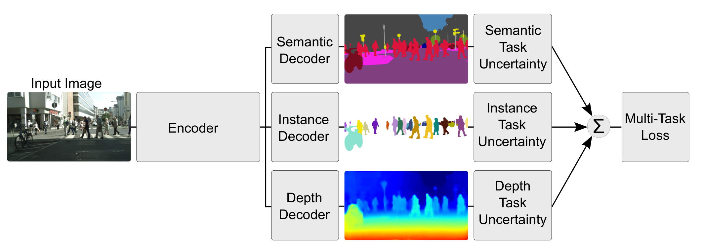
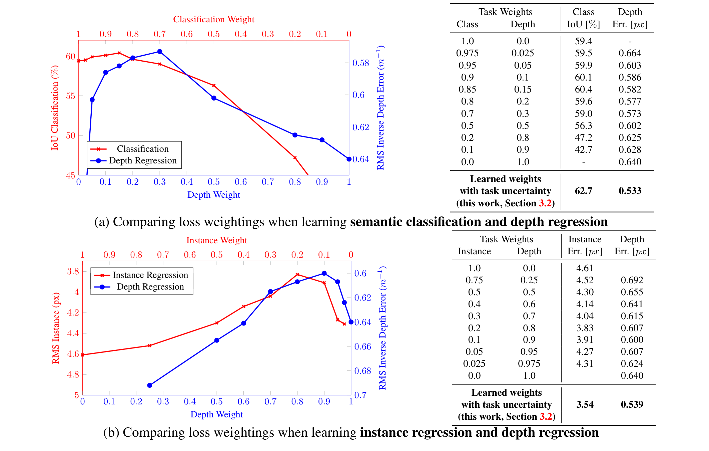
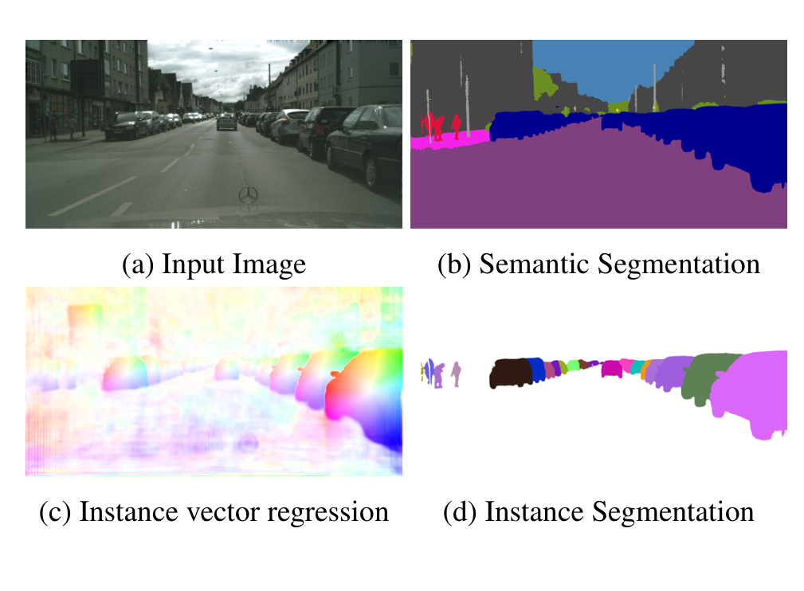
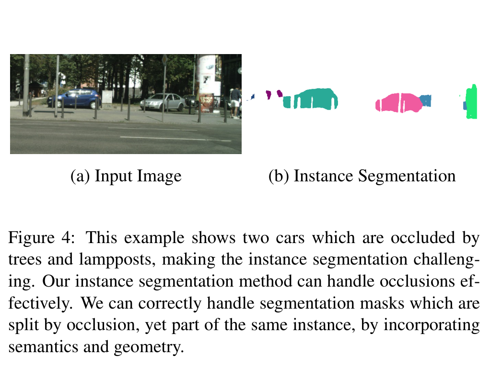
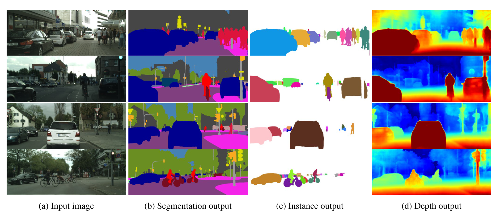
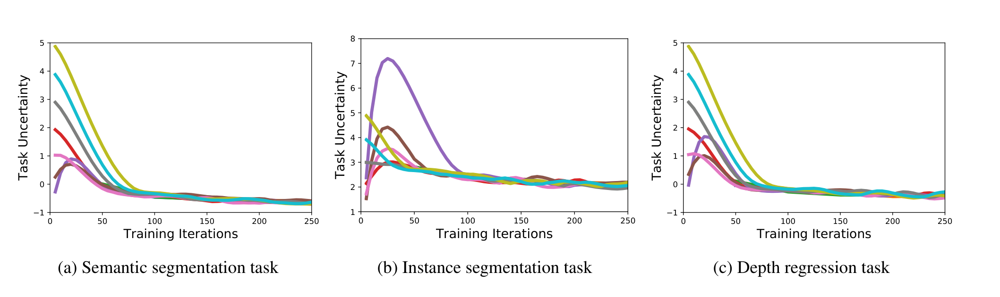
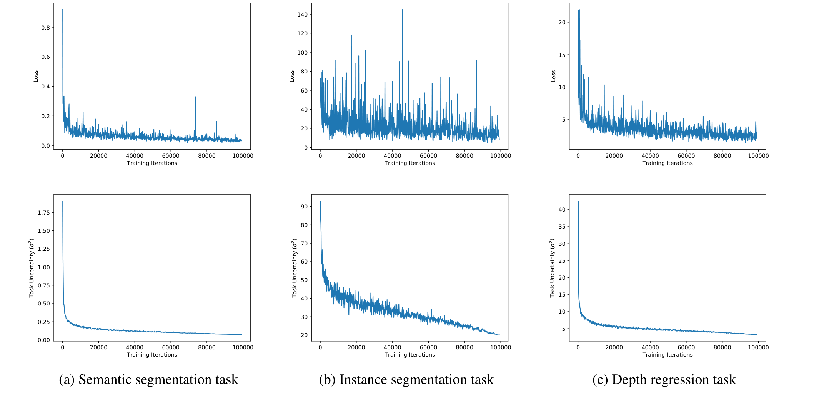
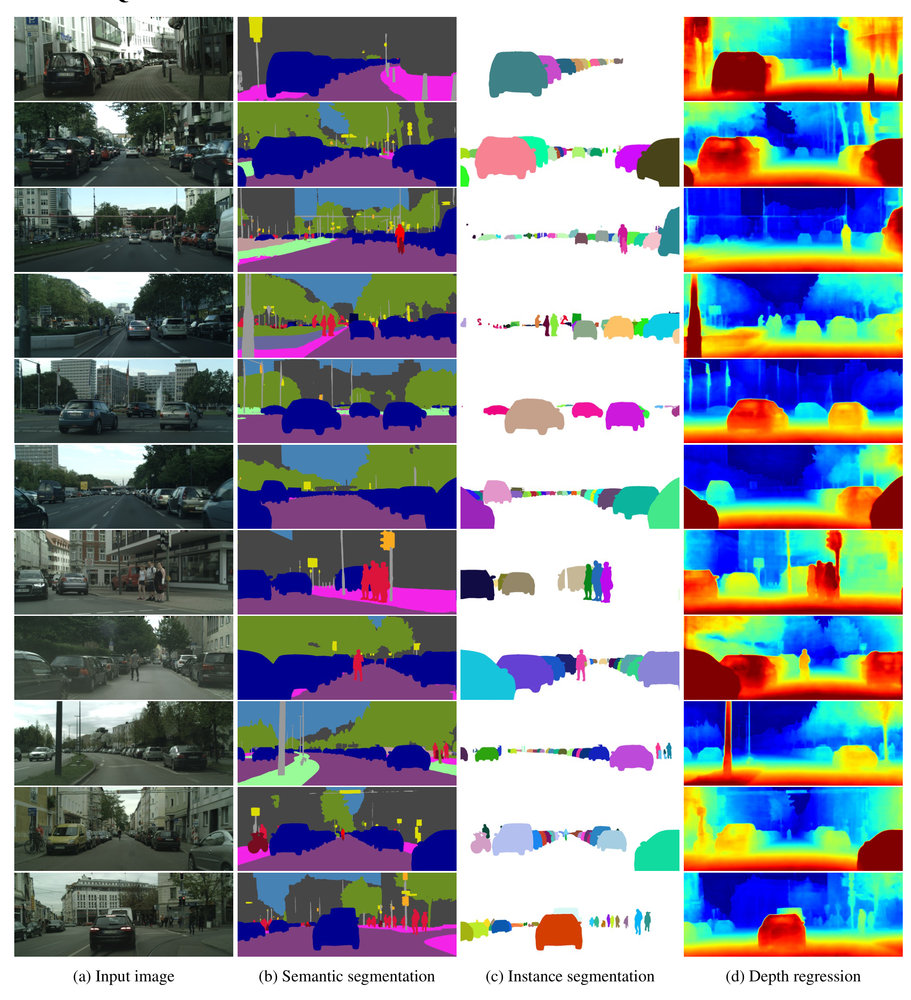
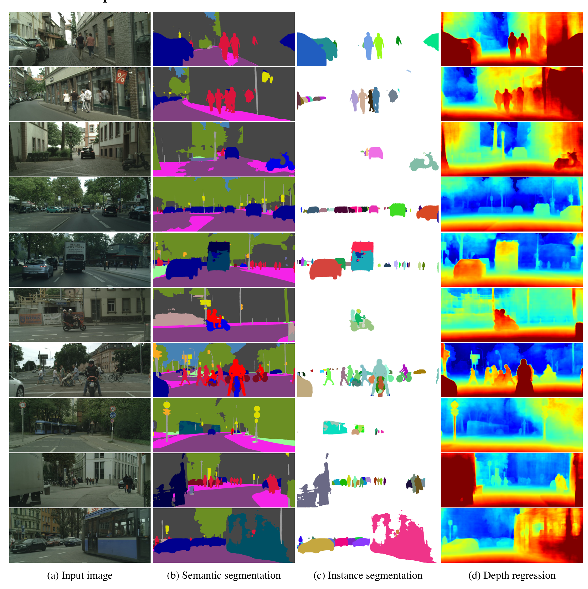

# 使用不确定性加权损失的多任务学习：场景几何与语义（Multi-Task Learning Using Uncertainty to Weigh Losses for Scene Geometry and Semantics）

> Alex Kendall | University of Cambridge | agk34@cam.ac.uk
>
> Yarin Gal | University of Oxford | yarin@cs.ox.ac.uk
>
> Roberto Cipolla | University of Cambridge | rc10001@cam.ac.uk

本文提出一种**基于同方差（任务）不确定性（homoscedastic uncertainty）来加权多任务损失**的原则性方法：不再手工调损失权重，而是让模型把每个任务的观测噪声当作可学习的权重，在同一模型里同时学习**逐像素深度回归、语义分割与实例分割**三个任务。核心发现是——**多任务权重可以自动学到且能超越每个任务单独训练的模型，在 CityScapes 上把语义 IoU 从 59.4% 提升到 63.4%，最终的损失权重比约为 43 : 1 : 0.16（语义 : 深度 : 实例）**。

核心内容：

- 痛点：多任务系统的性能强烈依赖各任务损失之间的相对权重；手工调权困难且昂贵，均匀权重则效果很差，网格搜索逼近最优权重大规模模型上不可行
- 方案：把回归任务建模为高斯似然、把分类任务建模为带缩放系数 $\sigma^2$ 的 softmax 似然，从最大似然中推导出**自动学习损失权重**的多任务损失
- 技术细节：模型由共享的 DeepLabV3/ResNet101 编码器 + 各任务解码器组成；实例分割用"逐像素回归指向实例质心的向量 + OPTICS 聚类"实现
- 有效性：不确定性权重方法在 Tiny CityScapes 上全面优于单任务模型、均匀加权与"近似最优"手工权重
- 结论：任务不确定性捕获任务间的相对置信度，随训练动态变化，且对初始化鲁棒

关键发现：

- 语义分割 IoU 从单项训练的 59.4% 提升到三任务联合的 **63.4%**；实例误差从 4.61px 降到 3.50px；深度的 RMS 逆深度误差从 0.640 降到 **0.522**
- 全尺寸 CityScapes 基准上，**首个用单模型同时完成语义分割 + 实例分割 + 单目深度/视差三个任务的方案**，语义 IoU class 78.5、实例 AP 21.6、视差平均误差 2.92px
- 训练结束时学到权重比 43 : 1 : 0.16（语义 : 深度 : 实例），远非均匀，验证了"损失必须加权"的核心论断
- 局限/展望：最优加权位置（编码器在哪一层分裂成各任务解码器）、共享表示的网络深度、以及任务间可互补关系的量化仍未解答

---

## 摘要

许多深度学习应用都从**多任务学习**中受益，即在多个回归与分类目标上联合优化。在本文中我们观察到，这类系统的性能**强烈依赖于各任务损失之间的相对权重**。手工调节这些权重是一个困难且昂贵的过程，使得多任务学习在实践中难以推广。我们提出一种**有原则的多任务深度学习方法**，该方法通过考虑每个任务的**同方差不确定性（homoscedastic uncertainty）**来加权多个损失函数。这使我们能够在分类和回归设定下，同时学习具有**不同单位或量纲**的各种量。我们展示我们的模型从单目输入图像学习**逐像素深度回归、语义分割和实例分割**。也许令人惊讶的是，我们证明该模型**能自动学习多任务权重，并超越分别针对每个任务单独训练的模型**。

## 1 引言

多任务学习旨在通过从**共享表示（shared representation）**中学习多个目标来提高学习效率与预测精度 [7]。多任务学习在许多机器学习应用中普遍存在——从计算机视觉 [27] 到自然语言处理 [11]，再到语音识别 [23]。

我们在计算机视觉的**视觉场景理解**设定下探索多任务学习。场景理解算法必须同时理解场景的**几何**与**语义**。这构成了一个有趣的多任务学习问题，因为场景理解涉及**联合学习各种单位与量纲不同的回归任务和分类任务**。在**不允许长时间计算运行**的系统中（例如机器人系统），视觉场景理解的多任务学习至关重要。把所有任务合并到单一模型中可减少计算量，使这些系统能够实时运行。

以往同时学习多个任务的方法使用**朴素的损失加权求和**，其中损失权重是均匀的或手工调节的 [38, 27, 15]。然而，我们证明性能**高度依赖于各任务损失之间权重的恰当选择**。搜索最优权重是**代价极其昂贵**且难以通过手工调节解决的。我们观察到每个任务的最优权重依赖于**测量量纲**（例如米、厘米或毫米），并最终取决于**任务的噪声幅度**。

在这项工作中，我们提出一种**有原则的方式**，利用**同方差不确定性**组合多个损失函数，以同时学习多个目标。我们将同方差不确定性**解释为任务相关的权重**，并展示如何推导一个有原则的多任务损失函数，使其能够学习平衡各种回归与分类损失。我们的方法能够**最优地学习这些权重**，从而在性能上优于各任务分开训练的模型。

具体而言，我们用三个任务来演示我们的方法。首先，我们学习在**像素级对对象分类**，即语义分割 [32, 3, 42, 8, 45]。其次，我们的模型执行**实例分割**，这是更困难的任务：为图像中每个单独的对象分割出**独立的掩码**（例如为路上的每一辆单独的车分割一个独立、精确的掩码）[37, 18, 14, 4]。这比语义分割更难，因为它不仅需要估计每个像素的类别，还需要估计该像素属于**哪个对象**。它也比如下的**目标检测**更复杂，后者通常仅预测对象的边界框 [17]。最后，我们的模型预测**逐像素的度量深度（metric depth）**。基于识别的深度估计已通过有监督 [15] 和无监督 [16] 深度学习中的密集预测网络得到验证。然而，以通用性良好的方式估计深度**非常困难**。我们证明通过利用语义标签和多任务深度学习，**可以改进我们对几何和深度的估计**。

在现有文献中，通常会使用**单独**的深度学习模型分别学习深度回归、语义分割和实例分割，以构建完整的场景理解系统。

给定一张单目输入图像，**我们的系统是第一个同时产出语义分割、密集的度量深度估计和实例级分割**的系统（图 1）。虽然其他视觉模型已经展示了多任务学习，我们展示的是如何学习将**语义与几何结合**。将这些任务合并到单一模型中，在保证模型在各任务输出之间**保持一致**的同时降低计算量。最后，我们证明使用带有共享表示的多任务学习能改善各种指标上的性能，使模型更有效。

总而言之，本文的关键贡献是：

1. 一种**新颖且有原则的多任务损失**，利用同方差任务不确定性同时学习各种数量与单位不同的分类和回归损失；
2. 一个**统一的语义分割、实例分割与深度回归架构**；
3. **证明多任务深度学习中损失加权的重要性**，以及如何获得优于等价独立训练模型的性能。

## 2 相关工作

与为每个任务单独训练一个模型相比，多任务学习旨在**提高每个任务的学习效率与预测精度** [40, 5]。它可以看作一种**归纳知识迁移**（inductive knowledge transfer）的方法，通过共享互补任务之间的域信息来改善泛化。它利用**共享表示**学习多个任务——从一个任务中学到的东西可以**帮助学习其他任务**[7]。

**微调（Fine-tuning）**[1, 36] 是多任务学习的一个基本例子，我们可以通过把不同的学习任务视为预训练步骤来利用它们。其他模型在各项训练任务之间**交替学习**，例如在自然语言处理中 [11]。多任务学习也可用于**数据流**设定 [40]，或用于在强化学习中**防止遗忘**先前学过的任务 [26]。它还可以用于通过**自编码器**从各种数据源学习无监督特征 [35]。

在计算机视觉中有许多多任务学习方法的例子。许多方法聚焦于语义任务，如分类与语义分割 [30] 或分类与检测 [38]。**MultiNet**[39] 提出了一个用于检测、分类和语义分割的架构。**CrossStitch 网络**[34] 探索了组合多任务神经网络激活的方法。Uhrig 等人 [41] 在分类设定下学习语义与实例分割。多任务深度学习也曾被用于**几何与回归任务**。[15] 展示了如何学习语义分割、深度和表面法向量。**PoseNet**[25] 是一个学习相机位置与朝向的模型。**UberNet**[27] 在单一架构下学习若干不同的回归与分类任务。在这项工作中，我们是**第一个提出**联合学习深度回归、语义与实例分割方法的人。与 [15] 的模型一样，我们的模型同时学习语义与几何表示，这对场景理解很重要。然而，**我们的模型学习更难的任务——实例分割**，它需要同时了解语义与几何。这是因为实例分割要求模型确定每个对象中每个像素的**类别与空间关系**。

更重要的，所有以前同时学习多个任务的方法都使用**朴素的损失加权求和**，其中损失权重是均匀的或粗糙地手工调节的。在这项工作中，我们提出一种有原则的方式，利用**同方差任务不确定性**组合多个损失函数，以同时学习多个目标。我们阐明了在深度学习中**恰当加权每个任务对取得良好性能的重要性**，并证明我们的方法能**最优地学习这些权重**。

## 3 带同方差不确定性的多任务学习

多任务学习关注**针对多个目标优化模型**的问题。它在许多深度学习问题中普遍存在。组合多个目标损失的朴素方法是简单地对每个单独任务的损失进行**带权线性求和**：

$$
L_{total} = \sum_{i} w_i L_i \qquad (1)
$$

这是以往工作 [39, 38, 30, 41] 使用的主要方法，例如用于密集预测任务 [27]、用于场景理解任务 [15] 以及用于相机位姿的旋转（四元数）和平移（米）回归 [25]。然而，这种方法存在若干问题。即，**模型性能对权重 $w_i$ 的选择极其敏感**，如图 2 所示。这些权重超参数**调节代价昂贵**，每次尝试常常需要数天时间。因此，期望找到一种**更方便的方法**，能够学习最优权重并平衡任务。

更具体地说，让我们考虑一个学习从输入图像预测**逐像素深度与语义类别**的网络。图 2 中每幅图的两个边界对应**在单一任务上训练的模型**，曲线展示了各任务**不同权重 $w_i$** 下的性能。我们观察到在某个最优权重下，联合网络优于在每项任务上分别训练的独立网络（模型在单一任务上的性能可见于图的两端： $w=0$ 与 $w=1$ ）。而在最优点附近的值，网络在其中一个任务上的表现会变差。然而，**搜索这些最优权重是昂贵的**，并且对于任务众多的大型模型越来越困难。图 2 还展示了两个回归任务——实例分割与深度回归——的类似结果。我们接下来展示如何利用**概率建模**的思想学习最优任务权重。

### 3.1 同方差不确定性作为任务相关不确定性

在贝叶斯建模中，我们可以建模两种主要类型的不确定性 [24]。

- **认知不确定性（Epistemic uncertainty）**是**模型的不确定性**，它刻画我们的模型因**缺乏训练数据**而不知道的东西。它可以通过**增加训练数据**来消除。
- **随机不确定性（Aleatoric uncertainty）**刻画我们**面对数据无法解释的信息**时的不确定性。随机不确定性可以通过**以更高的精度观测所有解释变量**来消除。

随机不确定性又可细分为两个子类别。

- **数据相关的**或**异方差（Heteroscedastic）不确定性**是**依赖输入数据**的随机不确定性，并作为**模型输出**被预测。
- **任务相关的**或**同方差（Homoscedastic）不确定性**是**不依赖输入数据**的随机不确定性。它不是模型输出，而是一个**对所有输入数据保持不变、在不同任务之间变化**的量。因此它可以被称为**任务相关不确定性**。

在多任务设定中，我们证明**任务不确定性捕获任务之间的相对置信度**，反映回归或分类任务固有的不确定性。它还将依赖于任务的**表示或度量单位**。我们提出可以将同方差不确定性作为**多任务学习问题中加权损失的基础**。

### 3.2 多任务似然

在本节中，我们基于**带同方差不确定性的高斯似然最大化**推导一个多任务损失函数。设 $f^{\mathbf{W}}(x)$ 为带权重 $\mathbf{W}$ 的神经网络在输入 $x$ 上的输出。我们定义如下概率模型。对于回归任务，我们将似然定义为**均值为模型输出的高斯分布**：

$$
p(y \mid f^{\mathbf{W}}(x)) = \mathcal{N}(f^{\mathbf{W}}(x), \sigma^2) \qquad (2)
$$

其中 $\sigma$ 为观测噪声标量。对于分类，我们通常通过 softmax 函数压缩模型输出，并从所得概率向量中采样：

$$
p(y \mid f^{\mathbf{W}}(x)) = \text{Softmax}(f^{\mathbf{W}}(x)) \qquad (3)
$$

在有多个模型输出的情况下，给定一些充分统计量，我们通常把似然定义为**在输出上分解（factorise）**。我们把 $f^{\mathbf{W}}(x)$ 定义为我们的充分统计量，得到如下多任务似然：

$$
p(y_1, ..., y_K \mid f^{\mathbf{W}}(x)) = p(y_1 \mid f^{\mathbf{W}}(x)) \cdot ... \cdot p(y_K \mid f^{\mathbf{W}}(x)) \qquad (4)
$$

其中模型输出 $y_1, ..., y_K$ （如语义分割、深度回归等）。

在最大似然推断中，我们最大化模型的**对数似然**。在回归中，例如，对数似然可以写成

$$
\log p(y \mid f^{\mathbf{W}}(x)) \propto -\frac{1}{2\sigma^2} \lVert y - f^{\mathbf{W}}(x) \rVert^2 - \log \sigma \qquad (5)
$$

其中高斯似然（或类似的拉普拉斯似然）的 $\sigma$ 是模型的观测噪声参数——刻画我们在输出中包含了多少噪声。然后我们**关于模型参数 $\mathbf{W}$ 和观测噪声参数 $\sigma$ 最大化对数似然**。

现在假设我们的模型输出由两个向量 $y_1$ 和 $y_2$ 组成，每个都服从高斯分布：

$$
p(y_1, y_2 \mid f^{\mathbf{W}}(x)) = p(y_1 \mid f^{\mathbf{W}}(x)) \cdot p(y_2 \mid f^{\mathbf{W}}(x)) = \mathcal{N}(y_1; f^{\mathbf{W}}(x), \sigma_1^2) \cdot \mathcal{N}(y_2; f^{\mathbf{W}}(x), \sigma_2^2) \qquad (6)
$$

这导出我们多输出模型的最小化目标 $L(W, \sigma_1, \sigma_2)$ （即我们的损失）：

$$
\begin{aligned}
&= -\log p(y_1, y_2 \mid f^{\mathbf{W}}(x)) \\
&\propto \frac{1}{2\sigma_1^2} \lVert y_1 - f^{\mathbf{W}}(x) \rVert^2 + \frac{1}{2\sigma_2^2} \lVert y_2 - f^{\mathbf{W}}(x) \rVert^2 + \log \sigma_1 \sigma_2 \\
&= \frac{1}{2\sigma_1^2} L_1(W) + \frac{1}{2\sigma_2^2} L_2(W) + \log \sigma_1 \sigma_2
\end{aligned} \qquad (7)
$$

其中我们把 $L_1(W) = \lVert y_1 - f^{\mathbf{W}}(x) \rVert^2$ 写成第一个输出变量的损失， $L_2(W)$ 类似。

我们把**关于 $\sigma_1$ 和 $\sigma_2$ 最小化这最后一个目标**解释为**基于数据自适应地学习损失 $L_1(W)$ 和 $L_2(W)$ 的相对权重**。当 $\sigma_1$ （变量 $y_1$ 的噪声参数）增大时， $L_1(W)$ 的权重减小。另一方面，当噪声减小时，相应目标的权重增大。目标中最后一项**阻止噪声无限增大**（即防止实际地忽略数据），它充当噪声项的正则项。

这个构造可以**轻而易举地扩展到多个回归输出**。然而，扩展到分类似然更有意思。我们调整分类似然，以将**缩放后的模型输出**经过 softmax 函数压缩：

$$
p(y \mid f^{\mathbf{W}}(x), \sigma) = \text{Softmax}\left( \frac{1}{\sigma^2} f^{\mathbf{W}}(x) \right) \qquad (8)
$$

其中 $\sigma$ 为正标量。这可以解释为**玻尔兹曼分布（Boltzmann distribution，也称吉布斯分布 Gibbs distribution）**，其中输入被 $\sigma^2$ 缩放（常称为温度）。这个标量要么固定、要么可学习，参数的幅度决定了离散分布多么"均匀"（平坦）。这与其不确定性相关，用熵来衡量。该输出的对数似然随后可以写成

$$
\log p(y = c \mid f^{\mathbf{W}}(x), \sigma) = \frac{1}{\sigma^2} f_c^{\mathbf{W}}(x) - \log \sum_{c'} \exp\left( \frac{1}{\sigma^2} f_{c'}^{\mathbf{W}}(x) \right) \qquad (9)
$$

其中 $f_c^{\mathbf{W}}(x)$ 是向量 $f^{\mathbf{W}}(x)$ 的第 $c$ 个元素。

接下来，假设一个模型的多个输出由一个**连续输出 $y_1$** 和一个**离散输出 $y_2$** 组成，分别以高斯似然和 softmax 似然建模。和之前一样，联合损失 $L(W, \sigma_1, \sigma_2)$ 如下：

$$
\begin{aligned}
&= -\log p(y_1, y_2 = c \mid f^{\mathbf{W}}(x)) \\
&= -\log \mathcal{N}(y_1; f^{\mathbf{W}}(x), \sigma_1^2) \cdot \text{Softmax}(y_2 = c; f^{\mathbf{W}}(x), \sigma_2^2) \\
&= \frac{1}{2\sigma_1^2} \lVert y_1 - f^{\mathbf{W}}(x) \rVert^2 + \log \sigma_1 - \log p(y_2 = c \mid f^{\mathbf{W}}(x), \sigma_2^2) \\
&= \frac{1}{2\sigma_1^2} L_1(W) + \frac{1}{\sigma_2^2} L_2(W) + \log \sigma_1 + \log \frac{\sum_{c'} \exp\left( \frac{1}{\sigma_2^2} f_{c'}^{\mathbf{W}}(x) \right)}{\left( \sum_{c'} \exp\left( f_{c'}^{\mathbf{W}}(x) \right) \right)^{\frac{1}{\sigma_2^2}}} \\
&\approx \frac{1}{2\sigma_1^2} L_1(W) + \frac{1}{\sigma_2^2} L_2(W) + \log \sigma_1 + \log \sigma_2
\end{aligned} \qquad (10)
$$

其中同样地把 $L_1(W) = \lVert y_1 - f^{\mathbf{W}}(x) \rVert^2$ 写成 $y_1$ 的欧氏损失，把 $L_2(W) = -\log \text{Softmax}(y_2, f^{\mathbf{W}}(x))$ 写成 $y_2$ 的交叉熵损失（ $f^{\mathbf{W}}(x)$ 不缩放），并关于 $W$ 以及 $\sigma_1$ 、 $\sigma_2$ 优化。在最后一个转换中，我们引入了明确的简化假设

$$
\frac{1}{\sigma_2^2} \sum_{c'} \exp\left( \frac{1}{\sigma_2^2} f_{c'}^{\mathbf{W}}(x) \right) \approx \left( \sum_{c'} \exp\left( f_{c'}^{\mathbf{W}}(x) \right) \right)^{\frac{1}{\sigma_2^2}}
$$

当 $\sigma_2 \to 1$ 时该式变为等式。这既**简化了优化目标**，也在经验上**改善了结果**。

这最后一个目标可以看作**学习每个输出损失之间的相对权重**。较大的尺度值 $\sigma^2$ 会降低 $L_2(W)$ 的贡献，而较小的尺度 $\sigma^2$ 会增加其贡献。该尺度由等式最后一项**调节**——当 $\sigma^2$ 设置过大时目标受到惩罚。

这个构造可以**轻而易举地扩展到离散与连续损失函数的任意组合**，使我们能用有原则且有充分依据的方式学习每个损失的相对权重。这个损失**光滑可微**，且**形式良好**，任务权重不会收敛到零。与此相反，用式 (1) 的简单线性求和直接学习权重会导致权重**快速收敛到零**。在接下来的章节中，我们介绍我们的实验模型并给出实验结果。

在实践中，我们训练网络预测**对数方差** $s := \log \sigma^2$ 。这是因为它在数值上**比回归方差 $\sigma^2$ 更稳定**，因为损失避免了任何**除零**。指数映射还允许我们回归**无约束的标量值**，其中 $\exp(-s)$ 被映射回正域，给出有效的方差值。

## 4 场景理解模型

为了理解语义与几何，我们首先提出一个能在**像素级**学习回归与分类输出的架构。我们的架构是一个**深度卷积编码器-解码器网络**[3]。我们的模型由若干**卷积编码器**组成，它们产生**共享表示**，之后是相应数量的**任务专用卷积解码器**。高层总结见图 1。

编码器的目的是利用多个相关任务的域知识，学习一个**深层映射**以产生**丰富、有上下文感知的特征**。我们的编码器基于 **DeepLabV3**[10]，这是一个状态-of-the-art 的语义分割框架。我们使用 **ResNet101**[20] 作为基础特征编码器，其后是**空洞空间金字塔池化（ASPP，Atrous Spatial Pyramid Pooling）**模块 [10] 以增强上下文感知。我们在此编码器中应用**空洞卷积（dilated convolutions）**，使得所得特征图相对输入图像尺寸**下采样 8 倍**。

我们随后将网络分成每个任务的**独立解码器**（各自独立权重）。解码器的目的是学习从共享特征到输出的映射。每个解码器由一个**输出 256 维特征的 $3 \times 3$ 卷积层**，后接一个**回归任务输出的 $1 \times 1$ 卷积层**组成。更多架构细节见附录 A。

**语义分割。**我们使用**交叉熵损失**来学习像素级类别概率，在每个 mini-batch 中**对有语义标签的像素求平均损失**。

**实例分割。**定义像素属于哪个实例的一个直观方法是**与实例质心（centroid）相关联**。我们使用一种回归方法来做实例分割 [29]。该方法受 [28] 启发，后者利用**对象部件的 Hough 投票**识别实例。在这项工作中，我们用深度学习**利用单个像素的投票来扩展这个想法**。我们为每个像素坐标 $c_n$ 学习一个实例向量 $\hat{x}_n$ ，它指向该像素实例 $i_n$ 的质心，使得 $i_n = \hat{x}_n + c_n$ 。我们用 **L1 损失**训练这个回归，使用真实标签 $x_n$ ，对 mini-batch 中所有带标签的像素 $N_I$ 求平均：

$$
L_{Instance} = \frac{1}{|N_I|} \sum_{N_I} \lVert x_n - \hat{x}_n \rVert_1
$$

图 3 详细说明了我们用于实例分割的表示。图 3(a) 显示输入图像以及**属于实例类的像素掩码**（测试时由预测的语义分割推断）。图 3(b) 和图 3(c) 分别显示 $x$ 与 $y$ 坐标的**真实与预测实例向量**。然后我们用 **OPTICS**[2] 聚类这些投票，得到图 3(d) 中预测的实例分割输出。

实例分割算法最难处理的情况之一是**实例掩码因遮挡而被分裂**。图 4 表明，我们的方法通过**让像素以几何方式投票给其实例质心**，能够处理这些情况。依赖分水岭（watershed）方法 [4] 或**实例边缘识别**方法的方法在这些场景中都会失败。

为获得每个实例的分割，我们现在需要估计**实例中心** $\hat{i}_n$ 。我们提出**把估计的实例向量 $\hat{x}_n$ 视为 Hough 参数空间中的投票**，并使用聚类算法来识别这些实例中心。**OPTICS**[2] 是一种高效的基于密度的聚类算法。它能从给定样本集中识别**数量未知的、密度与尺度各异的多尺度聚类**。我们选择 OPTICS 有两个原因。关键的是，它**不像 k-means**[33] 等算法那样假设已知聚类数量。其次，它**不像离散分箱方法**[12] 那样假设标准化的实例大小或密度。使用 OPTICS，我们将点 $c_n + \hat{x}_n$ 聚类为若干估计的实例 $\hat{i}$ 。然后我们可以把每个像素 $p_n$ 分配给**离其估计实例向量 $c_n + \hat{x}_n$ 最近的实例**。

**深度回归。**我们用有监督标签，用 **L1 损失函数**进行**逐像素度量逆深度**训练：

$$
L_{Depth} = \frac{1}{|N_D|} \sum_{N_D} \lvert d_n - \hat{d}_n \rvert
$$

1. 我们的架构估计**逆深度 $\hat{d}_n$**，因为它能表示**无限远处的点**（如天空）。我们可以从 **RGBD 传感器或双目（stereo）图像**获得逆深度标签 $d_n$ 。**没有逆深度标签的像素在损失中被忽略**。

## 5 实验

我们在 **CityScapes**[13] 上证明我们方法的有效性，这是一个大型的**道路场景理解**数据集。它包含来自**基线为 22cm 的车规级双目相机**的双目图像，标注了 20 个类别的实例与语义分割。还提供了**深度图像**，使用 **SGM**[22] 标注，我们将其视为**伪真实标签（pseudo ground truth）**。此外，我们给标注为天空的像素分配**零逆深度**。该数据集在晴朗天气下从多个城市采集，包含 **2,975 张训练图像和 500 张验证图像**，分辨率为 $2048 \times 1024$ 。其中 **1,525 张图像被留出**，用于在线评估服务器上的测试。

更多训练细节与优化超参数见附录 A。

### 5.1 模型分析

在表 1 中，我们比较了单个模型与多任务学习模型，后者使用**朴素的加权损失**或我们本文提出的**任务不确定性加权**。

**表 1：** 使用我们的多任务损失联合学习语义分割、实例分割与深度时的定量改进。实验在 Tiny CityScapes 数据集（下采样到 $128 \times 256$ 分辨率）上进行，结果来自验证集。我们观察到，使用我们的多任务损失训练时，性能相比单任务模型和加权损失都有提升。此外，我们观察到用我们的多任务损失同时训练**全部三个任务**（ $3 \times \checkmark$ ）相比**只训练任意一对任务**（记为 $2 \times \checkmark$ ）有提升。这表明我们的损失函数能在任务之间自动学到比基线更好的加权。

| 任务权重 | 分割 | 实例 | 逆深度 | 语义 IoU [%] | 实例平均误差 [px] | 深度平均误差 [px] |
| --- | --- | --- | --- | --- | --- | --- |
| 仅分割（Segmentation only） | 1 | 0 | 0 | 59.4% | - | - |
| 仅实例（Instance only） | 0 | 1 | 0 | - | 4.61 | - |
| 仅深度（Depth only） | 0 | 0 | 1 | - | - | 0.640 |
| 损失均匀求和（Unweighted sum of losses） | 0.333 | 0.333 | 0.333 | 50.1% | 3.79 | 0.592 |
| 近似最优权重（Approx. optimal weights） | 0.89 | 0.01 | 0.1 | 62.8% | 3.61 | 0.549 |
| 2 任务不确定性加权 | $\checkmark$ | $\checkmark$ | | 61.0% | 3.42 | - |
| 2 任务不确定性加权 | $\checkmark$ | | $\checkmark$ | 62.7% | - | 0.533 |
| 2 任务不确定性加权 | | $\checkmark$ | $\checkmark$ | - | 3.54 | 0.539 |
| 3 任务不确定性加权 | $\checkmark$ | $\checkmark$ | $\checkmark$ | 63.4% | 3.50 | 0.522 |

为降低计算负担，我们在 $128 \times 256$ 像素的缩小分辨率下训练每个模型，共 **50,000 次迭代**。当把数据下采样 4 倍时，我们也需要相应缩放**视差（disparity）标签**。表 1 清楚地说明了多任务学习的好处，它取得了**显著优于单项任务模型的性能**。例如，使用我们的方法我们把分类结果从 **59.4% 提升到 63.4%**。

我们还与若干**朴素的多任务损失**比较。我们比较了**等权重每个任务**以及**使用近似最优权重**。使用均匀加权导致性能较差，在某些情况下甚至**没有超过单任务模型的结果**。随着任务数量的增加，获取近似最优权重**变得困难**，因为它需要对参数进行**昂贵的网格搜索**。然而，即使这些权重与我们的方法相比表现也更差。图 2 表明，使用任务不确定性权重甚至能比**通过细粒度网格搜索找到的最优权重**表现更好。我们认为这有两个原因。第一，**网格搜索的精度受限于搜索分辨率**。第二，使用同方差噪声项优化任务权重允许权重在训练过程中**保持动态**。总体而言，我们观察到**训练期间不确定性项会下降**，这改善了优化过程。

在附录 B 中我们发现，我们的任务不确定性损失**对参数的初始化选择鲁棒**。这些参数在几百次训练迭代内**快速收敛到相似的极小值**。我们还发现最终任务加权在训练进程中**不断变化**。对我们最终模型（见表 2），在训练结束时，语义分割、深度回归与实例分割的损失分别按 **43 : 1 : 0.16** 的比值加权。

最后，我们使用**全尺寸 CityScapes 数据集**对我们的模型做基准测试。在表 2 中，我们在三个任务上与若干其他 state-of-the-art 方法比较。

**表 2：** CityScapes 基准 [13]。我们展示使用 1024 × 2048 像素全分辨率测试数据集的结果。完整的排行榜请见 www.cityscapes-dataset.com/benchmarks。视差（逆深度）指标是对照 CityScapes 深度图计算的，这些图为稀疏图，使用 SGM 双目 [21] 计算。注意，这些比较并不完全公平，因为许多方法使用了不同训练数据集的集成。我们的方法是**第一个用单模型解决全部三个任务**的方法。

| 方法 | 语义分割 | | | | 实例分割 | | | | 单目视差估计 | | |
| --- | IoU class | iIoU class | IoU cat | iIoU cat | AP | AP 50% | AP 100m | AP 50m | 平均误差 [px] | RMS 误差 [px] |
| 同时进行语义分割、实例分割和深度回归的方法（本文工作） | | | | | | | | | | |
| Multi-Task Learning | 78.5 | 57.4 | 89.9 | 77.7 | 21.6 | 39.0 | 35.0 | 37.0 | 2.92 | 5.88 |
| 语义分割与实例分割方法 | | | | | | | | | | |
| Uhrig et al. [41] | 64.3 | 41.6 | 85.9 | 73.9 | 8.9 | 21.1 | 15.3 | 16.7 | - | - |
| 仅实例分割方法 | | | | | | | | | | |
| Mask R-CNN [19] | - | - | - | - | 26.2 | 49.9 | 37.6 | 40.1 | - | - |
| Deep Watershed [4] | - | - | - | - | 19.4 | 35.3 | 31.4 | 36.8 | - | - |
| R-CNN + MCG [13] | - | - | - | - | 4.6 | 12.9 | 7.7 | 10.3 | - | - |
| 仅语义分割方法 | | | | | | | | | | |
| DeepLab V3 [10] | 81.3 | 60.9 | 91.6 | 81.7 | - | - | - | - | - | - |
| PSPNet [44] | 81.2 | 59.6 | 91.2 | 79.2 | - | - | - | - | - | - |
| Adelaide [31] | 71.6 | 51.7 | 87.3 | 74.1 | - | - | - | - | - | - |

我们的方法是用单模型完成全部三个任务的**第一款模型**。我们与其他方法相比**表现有利**，超越了那些使用**可比的训练数据与推理工具**的许多方法。图 5 展示我们模型的一些定性示例。

## 6 结论

我们证明了**正确加权损失项对多任务学习问题至关重要**。我们证明了**同方差（任务）不确定性**是加权损失的有效方式。我们推导了一个**有原则的损失函数**，它能**自动从数据中学习相对权重**，且对权重初始化鲁棒。我们展示它能为语义分割、实例分割与逐像素深度回归统一的架构**改善场景理解任务的性能**。与分别针对每项任务训练的独立模型相比，我们证明**建模任务相关的同方差不确定性**能改善模型的表示及每个任务的性能。

还有许多有趣的问题没有答案。首先，我们的结果表明通常**不存在对所有任务都最优的单一权重**。那么，什么才是最优加权？在没有单一更高级目标的情况下，**多任务学习是否是一个不适定（ill-posed）的优化问题**？

第二个有趣的问题是，**将共享编码器网络分裂为各任务解码器的最佳位置在哪里**？共享多任务表示的最佳网络深度是多少？

最后，为什么**语义与深度任务**的结果在表 1 中**优于语义与实例任务**？显然本文探索的三个任务是**互补的**，对学习场景的丰富表示很有用。能够**量化任务之间的关系**以及它们对多任务表示学习的用处将会很有价值。

## 参考文献

[1] P. Agrawal, J. Carreira, and J. Malik. Learning to see by moving. In Proceedings of the IEEE International Conference on Computer Vision, pages 37–45, 2015. 2

[2] M. Ankerst, M. M. Breunig, H.-P. Kriegel, and J. Sander. Optics: ordering points to identify the clustering structure. In ACM Sigmod Record, volume 28, pages 49–60. ACM, 1999. 6

[3] V. Badrinarayanan, A. Kendall, and R. Cipolla. Segnet: A deep convolutional encoder-decoder architecture for scene segmentation. IEEE Transactions on Pattern Analysis and Machine Intelligence, 2017. 1, 5

[4] M. Bai and R. Urtasun. Deep watershed transform for instance segmentation. arXiv preprint arXiv:1611.08303, 2016. 1, 6, 8

[5] J. Baxter et al. A model of inductive bias learning. J. Artif. Intell. Res.(JAIR), 12(149-198):3, 2000. 2

[6] S. R. Bul`o, L. Porzi, and P. Kontschieder. In-place activated batchnorm for memory-optimized training of dnns. arXiv preprint arXiv:1712.02616, 2017.

[7] R. Caruana. Multitask learning. In Learning to learn, pages 95–133. Springer, 1998. 1, 2

[8] L.-C. Chen, G. Papandreou, I. Kokkinos, K. Murphy, and A. L. Yuille. Semantic image segmentation with deep convolutional nets and fully connected crfs. In ICLR, 2015. 1

[9] L.-C. Chen, G. Papandreou, I. Kokkinos, K. Murphy, and A. L. Yuille. Deeplab: Semantic image segmentation with deep convolutional nets, atrous convolution, and fully connected crfs. arXiv preprint arXiv:1606.00915, 2016.

[10] L.-C. Chen, G. Papandreou, F. Schroff, and H. Adam. Rethinking atrous convolution for semantic image segmentation. arXiv preprint arXiv:1706.05587, 2017. 5, 8, 11

[11] R. Collobert and J. Weston. A unified architecture for natural language processing: Deep neural networks with multitask learning. In Proceedings of the 25th international conference on Machine learning, pages 160–167. ACM, 2008. 1, 2

[12] D. Comaniciu and P. Meer. Mean shift: A robust approach toward feature space analysis. IEEE Transactions on pattern analysis and machine intelligence, 24(5):603–619, 2002. 6

[13] M. Cordts, M. Omran, S. Ramos, T. Rehfeld, M. Enzweiler, R. Benenson, U. Franke, S. Roth, and B. Schiele. The cityscapes dataset for semantic urban scene understanding. In In Proc. IEEE Conf. on Computer Vision and Pattern Recognition, 2016. 6, 8

[14] J. Dai, K. He, and J. Sun. Instance-aware semantic segmentation via multi-task network cascades. In In Proc. IEEE Conf. on Computer Vision and Pattern Recognition, 2016. 1

[15] D. Eigen and R. Fergus. Predicting depth, surface normals and semantic labels with a common multi-scale convolutional architecture. In Proceedings of the IEEE International Conference on Computer Vision, pages 2650–2658, 2015. 1, 2, 3

[16] R. Garg and I. Reid. Unsupervised cnn for single view depth estimation: Geometry to the rescue. Computer Vision–ECCV 2016, pages 740–756, 2016. 1

[17] R. Girshick, J. Donahue, T. Darrell, and J. Malik. Rich feature hierarchies for accurate object detection and semantic segmentation. In In Proc. IEEE Conf. on Computer Vision and Pattern Recognition, pages 580–587, 2014. 1

[18] B. Hariharan, P. Arbel´aez, R. Girshick, and J. Malik. Hypercolumns for object segmentation and fine-grained localization. In In Proc. IEEE Conf. on Computer Vision and Pattern Recognition, pages 447–456. IEEE, 2014. 1

[19] K. He, G. Gkioxari, P. Doll´ar, and R. Girshick. Mask r-cnn. arXiv preprint arXiv:1703.06870, 2017. 8

[20] K. He, X. Zhang, S. Ren, and J. Sun. Deep residual learning for image recognition. In In Proc. IEEE Conf. on Computer Vision and Pattern Recognition, 2016. 5, 11

[21] H. Hirschmuller. Accurate and efficient stereo processing by semi-global matching and mutual information. In In Proc. IEEE Conf. on Computer Vision and Pattern Recognition, volume 2, pages 807–814. IEEE, 2005. 8

[22] H. Hirschmuller. Stereo processing by semiglobal matching and mutual information. IEEE Transactions on pattern analysis and machine intelligence, 30(2):328–341, 2008. 6

[23] J.-T. Huang, J. Li, D. Yu, L. Deng, and Y. Gong. Cross-language knowledge transfer using multilingual deep neural network with shared hidden layers. In Acoustics, Speech and Signal Processing (ICASSP), 2013 IEEE International Conference on, pages 7304–7308. IEEE, 2013. 1

[24] A. Kendall and Y. Gal. What uncertainties do we need in bayesian deep learning for computer vision? arXiv preprint arXiv:1703.04977, 2017. 4

[25] A. Kendall, M. Grimes, and R. Cipolla. Convolutional networks for real-time 6-dof camera relocalization. In Proceedings of the International Conference on Computer Vision (ICCV), 2015. 2, 3

[26] J. Kirkpatrick, R. Pascanu, N. Rabinowitz, J. Veness, G. Desjardins, A. A. Rusu, K. Milan, J. Quan, T. Ramalho, A. Grabska-Barwinska, et al. Overcoming catastrophic forgetting in neural networks. Proceedings of the National Academy of Sciences, page 201611835, 2017. 2

[27] I. Kokkinos. Ubernet: Training auniversal'convolutional neural network for low-, mid-, and high-level vision using diverse datasets and limited memory. arXiv preprint arXiv:1609.02132, 2016. 1, 2, 3

[28] B. Leibe, A. Leonardis, and B. Schiele. Robust object detection with interleaved categorization and segmentation. International Journal of Computer Vision (IJCV), 77(1-3):259–289, 2008. 6

[29] X. Liang, Y. Wei, X. Shen, J. Yang, L. Lin, and S. Yan. Proposal-free network for instance-level object segmentation. arXiv preprint arXiv:1509.02636, 2015. 6

[30] Y. Liao, S. Kodagoda, Y. Wang, L. Shi, and Y. Liu. Understand scene categories by objects: A semantic regularized scene classifier using convolutional neural networks. In 2016 IEEE International Conference on Robotics and Automation (ICRA), pages 2318–2325. IEEE, 2016. 2, 3

[31] G. Lin, C. Shen, I. Reid, et al. Efficient piecewise training of deep structured models for semantic segmentation. arXiv preprint arXiv:1504.01013, 2015. 8

[32] J. Long, E. Shelhamer, and T. Darrell. Fully convolutional networks for semantic segmentation. In Proc. IEEE Conf. on Computer Vision and Pattern Recognition, 2015. 1

[33] J. MacQueen et al. Some methods for classification and analysis of multivariate observations. In Proceedings of the fifth Berkeley symposium on mathematical statistics and probability, volume 1, pages 281–297. Oakland, CA, USA., 1967. 6

[34] I. Misra, A. Shrivastava, A. Gupta, and M. Hebert. Cross-stitch networks for multi-task learning. In Proceedings of the IEEE Conference on Computer Vision and Pattern Recognition, pages 3994–4003, 2016. 2

[35] J. Ngiam, A. Khosla, M. Kim, J. Nam, H. Lee, and A. Y. Ng. Multimodal deep learning. In Proceedings of the 28th international conference on machine learning (ICML-11), pages 689–696, 2011. 2

[36] M. Oquab, L. Bottou, I. Laptev, and J. Sivic. Learning and transferring mid-level image representations using convolutional neural networks. In In Proc. IEEE Conf. on Computer Vision and Pattern Recognition, pages 1717–1724. IEEE, 2014. 2

[37] P. O. Pinheiro, R. Collobert, and P. Dollar. Learning to segment object candidates. In Advances in Neural Information Processing Systems, pages 1990–1998, 2015. 1

[38] P. Sermanet, D. Eigen, X. Zhang, M. Mathieu, R. Fergus, and Y. LeCun. Overfeat: Integrated recognition, localization and detection using convolutional networks. International Conference on Learning Representations (ICLR), 2014. 1, 2, 3

[39] M. Teichmann, M. Weber, M. Zoellner, R. Cipolla, and R. Urtasun. Multinet: Real-time joint semantic reasoning for autonomous driving. arXiv preprint arXiv:1612.07695, 2016. 2, 3

[40] S. Thrun. Is learning the n-th thing any easier than learning the first? In Advances in neural information processing systems, pages 640–646. MORGAN KAUFMANN PUBLISHERS, 1996. 2

[41] J. Uhrig, M. Cordts, U. Franke, and T. Brox. Pixel-level encoding and depth layering for instance-level semantic labeling. arXiv preprint arXiv:1604.05096, 2016. 2, 3, 8

[42] F. Yu and V. Koltun. Multi-scale context aggregation by dilated convolutions. In ICLR, 2016. 1

[43] S. Zagoruyko and N. Komodakis. Wide residual networks. In E. R. H. Richard C. Wilson and W. A. P. Smith, editors, Proceedings of the British Machine Vision Conference (BMVC), pages 87.1–87.12. BMVA Press, September 2016.

[44] H. Zhao, J. Shi, X. Qi, X. Wang, and J. Jia. Pyramid scene parsing network. arXiv preprint arXiv:1612.01105, 2016. 8

[45] S. Zheng, S. Jayasumana, B. Romera-Paredes, V. Vineet, Z. Su, D. Du, C. Huang, and P. Torr. Conditional random fields as recurrent neural networks. In International Conference on Computer Vision (ICCV), 2015. 1

## 附录

### A 模型架构细节

我们将模型基于最近提出的 **DeepLabV3**[10] 分割架构。我们用 **ResNet101**[20] 作为基础特征编码器，采用空洞卷积，得到相对原始输入图像**下采样 8 倍**的特征图。然后我们附加空洞（atrous）卷积的 **ASPP 模块**[10]。该模块旨在增强网络的上下文推理。我们使用由**四个并行卷积层**组成的 ASPP 模块，输出通道为 256，膨胀率（dilation rates）为 **(1, 12, 24, 36)**，核大小为 **(12, 32, 32, 32)**。此外，我们对编码特征施加**全局平均池化**，并用 **$1 \times 1$ 核**将其卷积到 256 维。我们对每个层施加**批量归一化**，并将所得 1280 维特征**拼接**在一起。这就产生了任务之间的**共享表示**。

然后我们把网络**分开**，将这种表示解码成给定的任务输出。对每个任务，我们构造一个**两层解码器**。首先，我们施加一个**输出 256 维特征**的 $1 \times 1$ 卷积，随后是**批量归一化**和**非线性激活**。最后，我们把该输出卷积到给定任务所需的维度。对于分类，这等于**语义类别的数量**；否则输出为 **1 或 2 通道**，分别对应深度或实例分割。最后，我们施加**双线性上采样**，把输出缩放到与输入相同的分辨率。

模型的大部分参数与深度集中在**特征编码**中，每个任务解码器**几乎没有灵活性**。这说明了多任务学习的吸引力：**大部分计算可以在各任务之间共享**，以学习更好的共享表示。

#### A.1 优化

对所有实验，我们使用初始学习率 $2.5 \times 10^{-3}$ ，并采用**多项式学习率衰减** $(1 - \frac{iter}{max\_iter})^{0.9}$ 。我们使用**随机梯度下降（SGD）**训练，采用**Nesterov 动量**、动量 0.9、权重衰减 $10^{-4}$ 。本文所有实验均使用 **PyTorch** 进行。

对于 **Tiny CityScapes 验证数据集**上的实验（使用下采样至 $128 \times 256$ 的分辨率），我们在**单块 NVIDIA 1080Ti GPU**上训练 **50,000 次迭代**，使用 $256 \times 256$ 裁剪、**batch size 8**。我们对数据施加**随机水平翻转**。

对于**全尺度 CityScapes 基准实验**，我们训练 **100,000 次迭代**，batch size 为 16。在训练期间对数据施加**随机水平翻转**（概率 0.5）和**随机缩放**（从 0.7 - 2.0 中选择），然后进行 $512 \times 512$ 裁剪。训练数据**均匀采样**，并在每个 epoch **随机打乱**。在配备**四块 NVIDIA 1080Ti GPU**的单台计算机上训练需要**五天**。

### B 进一步分析

任务不确定性损失**对初始化任务不确定性所用的值鲁棒**。我们加权多任务损失的方法的一个吸引人的性质是，它**对同方差噪声参数的初始化选择鲁棒**。图 6 表明，对从 -2.0 到 5.0 的一系列 $\log \sigma^2$ 初始选择，同方差噪声和任务损失都能**收敛到相同的极小值**。此外，同方差噪声项仅需 **100 次迭代**便收敛，而网络需要 **30,000+ 次迭代**训练。因此我们的模型**对加权项初始值的选择鲁棒**。

图 7 展示了在全尺寸 CityScapes 数据集上训练最终模型期间，每个任务的损失与不确定性估计。

在训练进行到 500 次迭代时，模型估计语义分割、实例分割与深度回归的任务方差分别为 0.60、62.5 和 13.5。由于损失是按**不确定性估计的倒数**加权的，这导致语义、实例与深度之间的任务加权比约为 **23 : 0.22 : 1**。在训练结束时，三个任务的不确定性估计为 0.075、3.25 和 20.4，产生任务间的有效加权 **43 : 0.16 : 1**。这展示了任务不确定性估计如何随时间演变，以及网络学到的近似最终加权。我们观察到它们**远非均匀**，而这正是以往文献中常常假设的。

有趣的是，我们观察到这种损失允许网络**动态调节加权**。通常，随着训练的进行，同方差噪声项的幅值**下降**。这是合理的，因为在训练中模型对某个任务越来越有效，因此误差与不确定性都会下降。这有一个**副作用：增加了有效学习率**——因为整体不确定性下降，每个任务损失的权重增大。在我们的实验中，我们通过用**幂律退火学习率**来补偿这一点。

最后，评论一下模型的**失效模式**。该模型表现出与 state-of-the-art 单任务模型**相似的失效模式**。例如，对**训练分布之外的对象**、**遮挡**或**视觉上具有挑战性的情况**的失效。然而，我们还观察到我们的多任务模型倾向于在**三种模态中以类似方式失效**，即一个任务中的错误像素预测往往与另一个模态中的错误**高度相关**。一些示例见图 8。

### C 更多定性结果

### D 失效示例

