# Conditional Noise-Contrastive Estimation of Unnormalised Models（非归一化模型的条件噪声对比估计）

> Ciwan Ceylan¹, Michael U. Gutmann² | ¹UMIC，RWTH 亚琛工业大学（项目期间隶属于 KTH 皇家理工学院与爱丁堡大学）；²爱丁堡大学信息学院。arXiv:1806.03664v1 [stat.ML] 10 Jun 2018。Proceedings of the 35th International Conference on Machine Learning, Stockholm, Sweden, PMLR 80, 2018

本文提出条件噪声对比估计（CNCE，conditional noise-contrastive estimation）——一种让噪声分布**基于观测数据半自动生成**的非归一化模型估计方法，把无监督密度估计问题转化为监督分类问题。核心发现是——**在数据落在低维流形上的情况下，CNCE 的估计误差比 NCE 低约一个数量级，且理论上证明了 score matching（得分匹配）是 CNCE 的一个极限情形**。

核心内容：

- 问题：Gibbs 分布、马尔可夫随机场、深度无监督网络等非归一化模型的配分函数无法解析计算，极大似然估计不可行；NCE 需要用户手工挑选辅助噪声分布，噪声与数据差异过大时分类问题太简单、学不到东西
- 方案：CNCE 让噪声从条件噪声分布 $p_c(\mathbf{y}|\mathbf{x})$ 中采样，噪声样本与数据样本配对，在数据流形附近自动产生具有对比性的噪声
- 技术：损失函数以两类样本的对数似然构建；非参数估计定理证明最优 $G^*$ 唯一且 $f^* = \log p_d$ 差一常数；对称条件噪声下密度项对消，无需解析表达式
- 验证：高斯、ICA、环模型三种合成数据上验证一致性并与 NCE 对比；再用四层全连接神经网络对自然图像做无监督深度学习

关键发现：

- **环模型（数据位于低维流形）上，CNCE 估计误差比 NCE 低约一个数量级**——NCE 噪声大多落在环内数据概率低处，对比度不足
- 噪声尺度 $\varepsilon \to 0$ 时，CNCE 的损失函数精确收敛到得分匹配的损失
- ICA 模型上 MLE 在 100 次模拟中 13 次陷入局部极小（CNCE 仅 7 次）
- 真实数据上：第一层学到 Gabor 特征，第二层按频率、方向、位置池化；第四层学到角点检测器等新颖池化模式
- 局限性：经验比较结果依赖所选模型与噪声分布；得分匹配的混合式用法是未来方向

---

## 摘要

许多参数统计模型没有归一化，只定义到无法计算的配分函数为止，这使得参数估计变得困难。非归一化模型的例子有 Gibbs 分布、马尔可夫随机场，以及无监督深度学习中的神经网络模型。先前的工作提出了称为噪声对比估计（NCE，noise-contrastive estimation）的估计原理，通过让模型学习区分数据与辅助噪声来估计非归一化模型。一个悬而未决的问题是如何最好地选择辅助噪声分布。我们在此提出一种解决该问题的新方法。所提方法与 NCE 共享将密度估计表述为监督学习问题的想法，但与 NCE 相反，所提方法在生成噪声样本时利用了观测到的数据。因此噪声可以以半自动的方式生成。我们首先给出新方法的基础理论，证明得分匹配（score matching）作为极限情形出现，在连续值和离散值的合成数据上验证该方法，并表明当数据位于低维流形上时，相比 NCE 可以预期有更好的性能。然后，我们通过在无监督深度学习中估计一个四层神经图像模型来展示其适用性。

## 1. 引言

我们考虑从观测数据 $X = \{\mathbf{x}_1, \ldots, \mathbf{x}_N\}$ 估计非归一化统计模型 $\varphi(\mathbf{u};\theta): X \mapsto \mathbb{R}_+$ 的参数 $\theta \in \mathbb{R}^M$ 的问题，其中 $\mathbf{x}_i \in X$ 是从未知数据分布 $p_d$ 独立采样的。非归一化模型输出非负数，但积分或求和不等于 1，即它们是在配分函数 $Z(\theta) = \int \varphi(\mathbf{u};\theta)\,d\mathbf{u}$ 意义下定义的统计模型。非归一化模型被广泛应用，例如用于图像建模（[17, 9]）、自然语言建模（[18, 24]）或记忆（[11]）。如果配分函数 $Z(\theta)$ 可以解析地求出闭式解，非归一化模型 $\varphi(\mathbf{u};\theta)$ 就很容易转换成（归一化的）统计模型 $p(\mathbf{u};\theta) = \varphi(\mathbf{u};\theta)/Z(\theta)$，并通过最大化似然来估计。然而对大多数非归一化模型而言，定义配分函数的积分解析地不可解，且计算近似代价高昂。

文献中已提出若干估计非归一化模型的方法，包括 Monte Carlo 极大似然（[2]）、对比散度（contrastive divergence，[10]）、得分匹配（[12]）以及噪声对比估计（[7, 8]）及其推广（[20, 4]）。噪声对比估计（NCE，noise-contrastive estimation）的基本思想是把密度估计问题表述为一个分类问题：训练模型区分观测数据与某些参考（噪声）数据。NCE 被用于多个应用领域（[18, 1, 21]），类似的"通过比较来学习"的思想也被用于生成式隐变量模型（generative latent variable models）的学习（[6, 3]）。

在 NCE 中，辅助噪声分布的选择留给用户。虽然简单分布（如均匀分布或高斯分布）已被成功使用（[8, 18]），但 NCE 的估计性能取决于所选的分布，并且发现更量身定制的分布通常会产生更好的结果，见例如 [16]。直觉上，NCE 中的噪声样本应当与观测数据相似，这样分类问题才不会太容易。为了减轻用户生成此类噪声的负担，我们在此提出条件噪声对比估计，它基于观测数据半自动地生成噪声。

本文其余部分结构如下。在第 2 节中，我们提出条件噪声对比估计（CNCE，conditional noise-contrastive estimation）的理论，建立基本性质，并证明一个极限情形给出得分匹配。在第 3 节中，我们在合成数据上验证理论，并比较 CNCE 与 NCE 的估计性能。在第 4 节中，我们把 CNCE 应用于真实数据，通过估计自然图像的四层神经网络模型展示它可以处理复杂模型，第 5 节总结全文。

## 2. 条件噪声对比估计

条件噪声对比估计（CNCE）通过训练模型区分数据与噪声样本，把无监督估计问题转化为监督学习问题。这与 NCE 采用的高层方法相同，但与 NCE 相反，CNCE 的新颖之处在于借助观测数据样本生成噪声样本。因此，与 NCE 不同，CNCE 不假设噪声样本独立于数据样本生成，而是假设它们从条件噪声分布 $p_c$ 中抽取。生成的噪声样本与数据样本配对，每个观测数据点 $\mathbf{x}_i$ 对应 $\kappa$ 个噪声样本 $\mathbf{y}_{ij} \in Y$，$j = 1, \ldots, \kappa$。因此，共生成 $N \cdot \kappa$ 个噪声样本 $\mathbf{y}_{ij} \sim p_c(\mathbf{y}_{ij}|\mathbf{x}_i)$。我们用 $Y$ 表示所有噪声样本的集合。在下面的讨论中，我们假设 $X = Y$，但这个假设可以放宽为 $X \subseteq Y$（见补充材料 A）。无论如何，我们用 $U$ 表示 $X$ 和 $Y$ 的并集。

我们类比 NCE 损失函数的推导来推导 CNCE 的损失函数。我们把所有数据与噪声样本对分成两个大小相等的类别 $C_\alpha$ 和 $C_\beta$。类别 $C_\alpha$ 由元组 $(\mathbf{u}_1, \mathbf{u}_2)$ 构成，其中 $\mathbf{u}_1 \in X$ 且 $\mathbf{u}_2 \in Y$；而类别 $C_\beta$ 由元组 $(\mathbf{u}_1, \mathbf{u}_2)$ 构成，其中 $\mathbf{u}_1 \in Y$ 且 $\mathbf{u}_2 \in X$。因此，类别 $C_\alpha$ 和 $C_\beta$ 的概率分布为

$$
p_\alpha(\mathbf{u}_1, \mathbf{u}_2) = p_d(\mathbf{u}_1) p_c(\mathbf{u}_2|\mathbf{u}_1), \qquad (1)
$$

$$
p_\beta(\mathbf{u}_1, \mathbf{u}_2) = p_d(\mathbf{u}_2) p_c(\mathbf{u}_1|\mathbf{u}_2), \qquad (2)
$$

其中 $p_d$ 表示 $\mathbf{x}_i$ 的分布。类别条件分布可由贝叶斯法则得到，

$$
p_{C_\alpha|\mathbf{u}}(\mathbf{u}_1, \mathbf{u}_2) = \frac{p_\alpha(\mathbf{u}_1, \mathbf{u}_2)}{p_\alpha(\mathbf{u}_1, \mathbf{u}_2) + p_\beta(\mathbf{u}_1, \mathbf{u}_2)} \qquad (3)
$$

$$
= \frac{1}{1 + \frac{p_d(\mathbf{u}_2)p_c(\mathbf{u}_1|\mathbf{u}_2)}{p_d(\mathbf{u}_1)p_c(\mathbf{u}_2|\mathbf{u}_1)}}, \qquad (4)
$$

$$
p_{C_\beta|\mathbf{u}}(\mathbf{u}_1, \mathbf{u}_2) = \frac{1}{1 + \frac{p_d(\mathbf{u}_1)p_c(\mathbf{u}_2|\mathbf{u}_1)}{p_d(\mathbf{u}_2)p_c(\mathbf{u}_1|\mathbf{u}_2)}}. \qquad (5)
$$

先验类别概率互相抵消，因为每个类别中的样本数相同。

把 $p_d(\cdot)$ 替换为模型 $\varphi(\cdot;\theta)/Z(\theta)$，配分函数互相抵消，得到类别条件分布的下列参数化版本

$$
p_{C_\alpha|\mathbf{u}}(\mathbf{u}_1, \mathbf{u}_2;\theta) = \frac{1}{1 + \frac{\varphi(\mathbf{u}_2;\theta)p_c(\mathbf{u}_1|\mathbf{u}_2)}{\varphi(\mathbf{u}_1;\theta)p_c(\mathbf{u}_2|\mathbf{u}_1)}}, \qquad (6)
$$

$$
p_{C_\beta|\mathbf{u}}(\mathbf{u}_1, \mathbf{u}_2;\theta) = \frac{1}{1 + \frac{\varphi(\mathbf{u}_1;\theta)p_c(\mathbf{u}_2|\mathbf{u}_1)}{\varphi(\mathbf{u}_2;\theta)p_c(\mathbf{u}_1|\mathbf{u}_2)}}. \qquad (7)
$$

现在，与 NCE 中相同的方式（[8]），把 CNCE 损失函数构造为类别条件概率的负对数似然，

$$
\mathcal{J}_N(\theta) = \frac{2}{\kappa N} \sum_{j=1}^{\kappa} \sum_{i=1}^{N} \log\left[1 + \exp(-G(\mathbf{x}_i, \mathbf{y}_{ij};\theta))\right], \qquad (8)
$$

$$
G(\mathbf{u}_1, \mathbf{u}_2;\theta) = \log \frac{\varphi(\mathbf{u}_1;\theta)p_c(\mathbf{u}_2|\mathbf{u}_1)}{\varphi(\mathbf{u}_2;\theta)p_c(\mathbf{u}_1|\mathbf{u}_2)}. \qquad (9)
$$

CNCE 损失函数 $\mathcal{J}_N$ 是 $\mathcal{J}(\theta) = 2\mathbb{E}_{xy}\log(1 + \exp(-G(\mathbf{x}, \mathbf{y};\theta)))$ 的样本版本，后者通过把 $N$ 和 $\kappa$ 都取 $\infty$ 极限得到。为了进一步发展理论，把 $\mathcal{J}(\theta)$ 写成 $G$ 的泛函是有帮助的，即

$$
\tilde{\mathcal{J}}[G] = 2\mathbb{E}_{xy}\log\left(1 + \exp(-G(\mathbf{x}, \mathbf{y}))\right). \qquad (10)
$$

然后我们得到如下定理：

**定理（非参数估计）。** 设 $G: U \times U \mapsto \mathbb{R}$ 是如下形式的函数

$$
G(\mathbf{u}_1, \mathbf{u}_2) = f(\mathbf{u}_1) - f(\mathbf{u}_2) + \log \frac{p_c(\mathbf{u}_2|\mathbf{u}_1)}{p_c(\mathbf{u}_1|\mathbf{u}_2)}, \qquad (11)
$$

其中 $f$ 是从 $U$ 到 $\mathbb{R}$ 的函数。在假设 $X = Y$ 下，$\tilde{\mathcal{J}}$ 在

$$
G^*(\mathbf{u}_1, \mathbf{u}_2) = \log \frac{p_d(\mathbf{u}_1)p_c(\mathbf{u}_2|\mathbf{u}_1)}{p_d(\mathbf{u}_2)p_c(\mathbf{u}_1|\mathbf{u}_2)} \qquad (12)
$$

处取得唯一最小值，其中 $(\mathbf{u}_1, \mathbf{u}_2) \in X \times X$ 且 $p_d(\mathbf{u}_1) > 0$、$p_c(\mathbf{u}_1|\mathbf{u}_2) > 0$。

更一般版本的证明见补充材料 A。定理表明，在 $N$ 和 $\kappa$ 很大的极限下，最优函数 $f$ 等于 $\log p_d$ 加上一个常数。对于足够灵活、使得对某个 $\theta^*$ 有 $G(\mathbf{u}_1, \mathbf{u}_2;\theta^*) = G^*(\mathbf{u}_1, \mathbf{u}_2)$ 的参数化，该定理结合 (9) 中 $G(\mathbf{u}_1, \mathbf{u}_2;\theta)$ 的定义意味着 $\varphi(\mathbf{u};\theta^*) \propto p_d(\mathbf{u})$。这里出现比例符号是因为 CNCE 不估计归一化常数。

虽然上述定理讨论的是非参数估计，因此没有考虑 $G$ 如何参数化，但它构成了 CNCE 一致性证明的基础。标准做法是找出使 $\mathcal{J}_N(\theta)$ 依概率一致收敛到 $\mathcal{J}(\theta)$ 的条件，然后援引例如 [22] 的定理 5.7。用 Kullback-Leibler 散度代替 $\mathcal{J}$ 的类似方法可以用来证明极大似然估计的一致性。一致收敛的条件通常相当技术性，我们在此不再深究，而是在第 3 节中为一致性提供经验证据。

通用的 CNCE 算法通常分两步：先从条件噪声分布 $p_c$ 中采样得到噪声样本，然后在参数 $\theta$ 上最小化损失函数 $\mathcal{J}_N$。用户通过 $\kappa$ 决定精度与计算开销之间的权衡，并且还需要提供 $p_c$。

与选择 NCE 中的噪声分布相比，选择 $p_c$ 有两个优势。第一，可以利用观测数据样本来采样噪声，这意味着相比 NCE 更容易实现与 $p_d$ 的相似性。事实上，本文的所有模拟都使用了下面给出的简单高斯分布。第二，如果已知 $p_c$ 是对称的，即 $p_c(\mathbf{u}_1|\mathbf{u}_2) = p_c(\mathbf{u}_2|\mathbf{u}_1)$，则无需对其求值，因为密度在式 (9) 中互相抵消。

当 $\mathbf{x}$ 和 $\mathbf{y} \in \mathbb{R}^D$ 时，$p_c$ 的一个简单对称选择是

$$
p_c(\mathbf{y}|\mathbf{x};\varepsilon) = \mathcal{N}(\mathbf{y}; \mathbf{x}, \varepsilon^2 \mathbf{1}), \quad \mathbf{y}_{ij} = \mathbf{x}_i + \varepsilon \boldsymbol{\xi}_{ij}. \qquad (13)
$$

这里 $\mathbf{1}$ 是单位矩阵，$\boldsymbol{\xi}_{ij} \in \mathbb{R}^D$ 是多元标准正态随机变量，$\varepsilon \in [0, \infty)$ 是对应每个维度标准差的标量参数，因此它控制 $Y$ 与 $X$ 之间的相似度。这里假设数据已被标准化（[19] 第 4 章），使得数据在每个维度上的经验方差为 1。否则，每个维度应当使用不同的 $\varepsilon$ 值。

CNCE 也适用于离散随机变量，例如对以 $\mathbf{x}$ 为条件的 $\mathbf{y}$ 使用多元伯努利（multinoulli）分布，也适用于非负数据（见补充材料 C）。

在我们的模拟中，我们用简单的启发式方法调整 $\varepsilon$，使损失函数的梯度不会太小。这通常发生在 $\varepsilon$ 过大（噪声和数据容易区分）时，但也发生在 $\varepsilon$ 过小时。可以验证，当 $\varepsilon = 0$ 时，损失函数达到值 $2\log(2)$，与模型和 $\theta$ 无关。简言之，启发式算法从一个小的 $\varepsilon$ 开始，逐步递增，直到损失函数的值充分远离 $2\log(2)$。

虽然小的 $\varepsilon$ 会使梯度的绝对值很小，但下面的定理表明此时损失函数仍然有意义，并且 CNCE 对应于得分匹配（[12]）。

**定理（与得分匹配的联系）。** 假设 $\varphi(\mathbf{u};\theta)$ 是非归一化概率密度，且 $f_\theta(\mathbf{u}) = \log\varphi(\mathbf{u};\theta)$ 二次可微。如果 $\mathbf{y} = \mathbf{x} + \varepsilon\boldsymbol{\xi}$，其中 $\boldsymbol{\xi}$ 是均值零、方差一的不相关随机变量向量，独立于 $\mathbf{x}$ 且具有对称密度，那么

$$
\mathcal{J}(\theta) = \frac{\varepsilon^2}{2}\mathbb{E}_x\left[\sum_i \frac{\partial^2 f_\theta(\mathbf{x})}{\partial x_i^2} + \frac{1}{2}\|\nabla_{\mathbf{x}}f_\theta(\mathbf{x})\|_2^2\right] + 2\log(2) + O(\varepsilon^3). \qquad (14)
$$

方括号中的项正是得分匹配（[12]）中最小化的损失函数。该定理在补充材料 B 中证明。注意 (13) 中的 $p_c$ 满足定理中的条件。

该定理可以这样理解：得分匹配在于找到使模型概率密度的斜率与数据概率密度的斜率相匹配的参数值。对于对称的条件噪声分布 $p_c$，式 (9) 中的非线性 $G$ 等于 $G(\mathbf{u}_1, \mathbf{u}_2;\theta) = \log\varphi(\mathbf{u}_1;\theta) - \log\varphi(\mathbf{u}_2;\theta) = f_\theta(\mathbf{u}_1) - f_\theta(\mathbf{u}_2)$。由 (12) 可知，在 $\mathcal{J}(\theta)$ 的最优点，$G(\mathbf{u}_1, \mathbf{u}_2;\theta)$ 匹配 $\log p_d(\mathbf{u}_1) - \log p_d(\mathbf{u}_2)$。在最小化过程中，自变量 $\mathbf{u}_1$ 和 $\mathbf{u}_2$ 所取的值由条件噪声分布决定。对于小的 $\varepsilon$，自变量总是彼此接近，因此 $G(\mathbf{u}_1, \mathbf{u}_2;\theta)$ 近似正比于 $f_\theta(\mathbf{u}) = \log\varphi(\mathbf{u};\theta)$ 沿随机方向的方向导数。这意味着对于小的 $\varepsilon$，当模型概率密度的斜率与数据概率密度的斜率匹配时（如同得分匹配），$\mathcal{J}(\theta)$ 被最小化。

## 3. 理论的经验验证

这里我们在合成数据上验证一致性并比较 CNCE 与 NCE。下面给出的模型对 CNCE 和 NCE 都以非归一化形式使用。对于 MLE（极大似然估计，maximum likelihood estimation）的结果，模型先被归一化。非负数据和离散数据的额外结果见补充材料 C。

### 3.1. 模型

高斯模型是五维的未归一化多元高斯模型，均值为零，参数化为精度矩阵 $\boldsymbol{\Lambda}$。由于精度矩阵是对称的，高斯模型有 15 个参数，

$$
\log\varphi(\mathbf{u};\boldsymbol{\Lambda}) = -\frac{1}{2}\mathbf{u}^{\mathsf{T}}\boldsymbol{\Lambda}\mathbf{u}, \quad \mathbf{u} \in \mathbb{R}^5. \qquad (15)
$$

估计误差用真实参数与估计参数之间的欧氏距离来衡量。

ICA（独立成分分析，independent component analysis）模型常用于信号处理中的盲源分离（[13]）。假设源与数据维度数目相同，$D = 4$，且源服从拉普拉斯分布，则非归一化 ICA 模型为

$$
\log\varphi(\mathbf{u};\mathbf{B}) = -\sqrt{2}\sum_{j=1}^{D}|\mathbf{b}_j \cdot \mathbf{u}|, \quad \mathbf{u} \in \mathbb{R}^4. \qquad (16)
$$

该模型由解混矩阵 $\mathbf{B}$ 参数化，有 $D^2 = 16$ 个自由参数。（归一化的）ICA 模型可以用 MLE 估计（[13] 4.4.1 节）。估计误差按与 [8] 相同的方式，在考虑 ICA 模型的符号和顺序歧义（[13] 2.2 节）后，用真实与估计参数向量之间的欧氏距离计算。

高斯模型和 ICA 模型此前都被用于验证 NCE 的一致性，高斯噪声分布取得了良好的估计性能（[8]）。为了研究 CNCE 自适应噪声的潜在优势，我们使用了下面更具挑战性的"环模型"，其中数据位于较低维的流形上。

环模型给出如下：

$$
\log\varphi(\mathbf{u};\mu_r, \gamma_r) = -\frac{\gamma_r}{2}(\|\mathbf{u}\|_2 - \mu_r)^2, \quad \mathbf{u} \in \mathbb{R}^5. \qquad (17)
$$

该模型在极坐标下最容易理解：角度分量均匀分布，径向方向是均值为 $\mu_r$、精度为 $\gamma_r$ 的高斯分布。均值假定已知，任务是估计精度参数 $\gamma_r$。图 1 显示了二维环模型的（归一化）概率密度，以及按式 (13) 生成的 NCE 噪声和 CNCE 噪声。如同 NCE 中常做的那样，选择高斯噪声以匹配数据分布的均值和协方差。由于数据的流形结构，NCE 噪声集中在数据分布取小值的区域，这与 CNCE 噪声形成对比——后者很好地覆盖了数据流形。

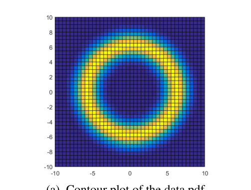

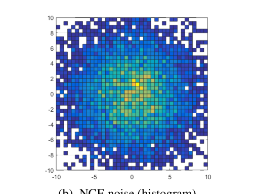

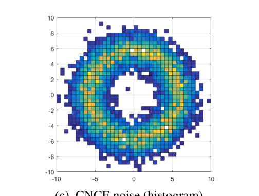

**图 1：** 二维环模型分布及相应的 NCE 与 CNCE 噪声的可视化。(a) 数据概率密度等高线图；(b) NCE 噪声（直方图）；(c) CNCE 噪声（直方图）。

### 3.2. 结果

图 2a 和 2b 显示了估计误差随数据点数量 $N$ 的变化。对于高斯模型和 ICA 模型，随着样本量的增加，CNCE 误差在对数-对数域中线性下降，这表明二次均值收敛，因而具有一致性。此外，随着每个数据点的噪声数 $\kappa$ 的增大，误差似乎趋近于 MLE 误差。

ICA 模型的 MLE 有一小部分估计（100 次中的 13 次）容易陷入局部极小。因此，图 2b 中 MLE 的 0.9 分位数显示出对应这种局部极小的高且相对恒定的误差。虽然 CNCE 也出现这种情况，但在图 2b 中并不明显，因为它发生得更少（7/100 次模拟）。

如图 2c 所示，在给定相同噪声和数据样本数的情况下，对于高斯模型，NCE 的性能优于 CNCE。对于 ICA 模型，在数据样本足够多时两者大体相当，见图 2d。鉴于 NCE 的噪声分布已经很好地覆盖了数据分布，NCE 在这些模型上的优势可能并不令人意外。此外，图 2e 和 2f 显示，随着噪声与数据样本比率的增加，NCE 与 CNCE 之间的差异减小。

图 3 显示了使用 $\kappa = 10$ 的环模型的结果。CNCE 与 NCE 相比取得了约低一个数量级的估计误差。参照图 1，可以这样理解相对于 NCE 的巨大改进：对于 NCE 使用的噪声分布，大多数噪声样本最终落在环内数据样本概率较低的地方，因此它们对学习没有用处（分类问题太容易，噪声没有提供足够的对比度）。另一方面，CNCE 在数据流形上（或附近）自动生成具有适当对比度的噪声，这促进了学习。

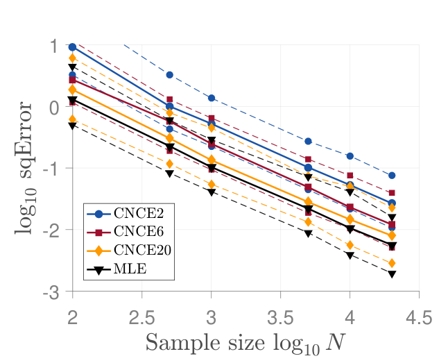

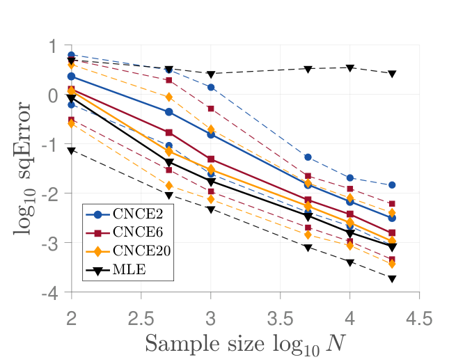

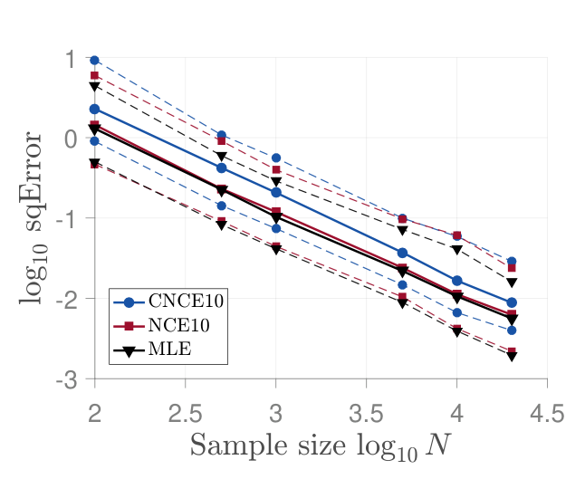

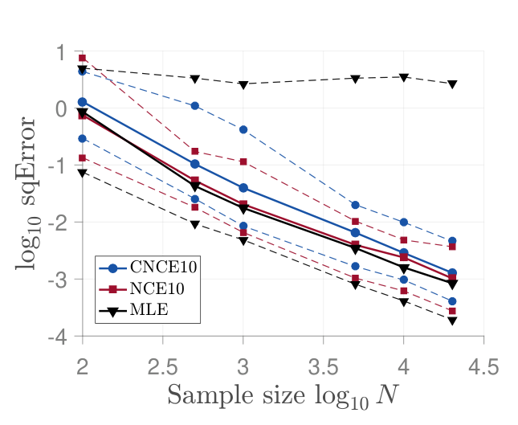

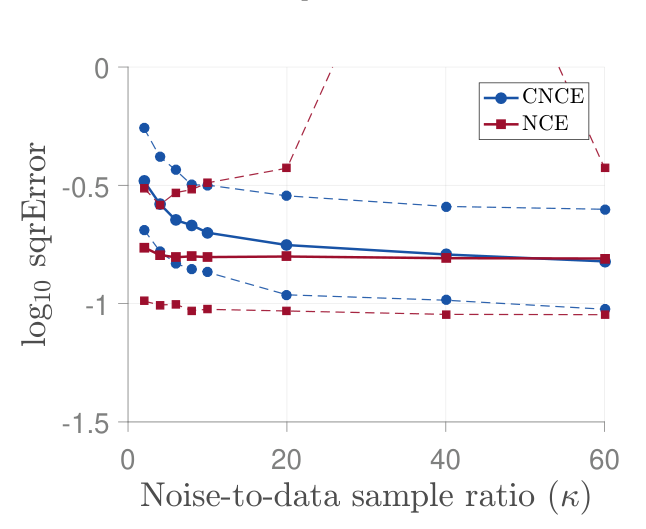

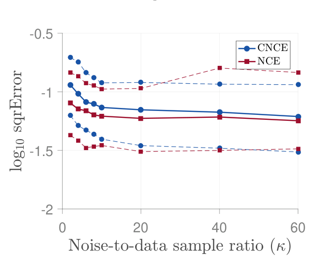

**图 2：** (a-b) CNCE 一致性结果。(c-d) 固定噪声-数据比 $\kappa$ 时与 NCE 的比较。(e-f) 固定样本量 $N$ 时的比较。实线显示 100 次不同模拟的中位数结果，虚线为 0.1 和 0.9 分位数。在 100 次模拟中的每一次中，都使用一组新的随机数据生成参数。

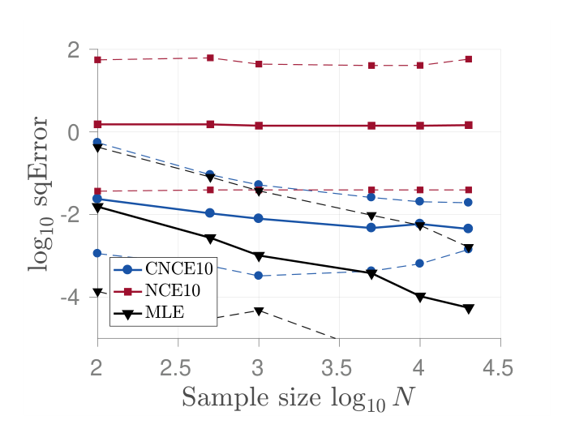

**图 3：** 5 维环模型，与 NCE 的比较（$\kappa = 10$）。

## 4. 神经图像模型

为了表明 CNCE 可以用来估计复杂的非归一化模型，我们将其用于无监督深度学习，从自然图像估计一个四层前馈神经网络模型。该模型扩展了此前用 NCE 估计的自然图像两层和三层模型（[8, 9]）。我们这里关注学习到的特征。在补充材料 D 中，我们给出了与 NCE 的定性比较。

数据 $X$ 是大小为 $32 \times 32$ 像素的图像块，以与 [9] 相同的方式从 11 幅描绘野生动物场景的不同单色图像（[23]）中采样。图 4a 显示了提取的图像块示例。采样的图像块被向量化，并减去总体均值和局部均值（直流分量）。所得数据随后被白化，并通过主成分分析（PCA，principal component analysis，[19] 第 12.2 章）将维数降低到 $D = 600$，保留了 98% 的方差。我们用 $\mathbf{u}^{(1)}$ 表示预处理后的数据（随机向量）。

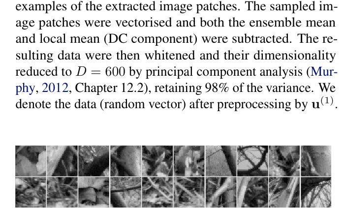

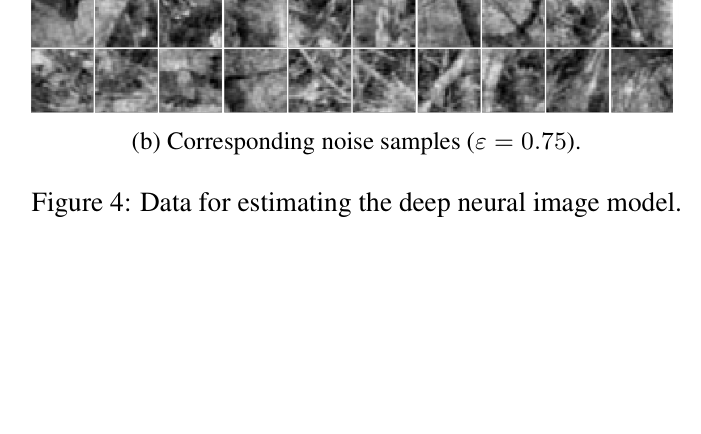

**图 4：** 用于估计深度神经图像模型的数据。(a) $32 \times 32$ 自然图像块示例；(b) 相应的噪声样本（$\varepsilon = 0.75$）。

### 4.1. 模型设定

下面定义的非归一化图像模型 $\varphi$ 由一个模拟自然图像数据非高斯性的"结构化"部分 $\tilde{\varphi}$ 和一个负责协方差结构的高斯部分组成。在 PCA 空间中，模型为

$$
\log\varphi(\mathbf{u}^{(1)};\theta) = \log\tilde{\varphi}(\mathbf{u}^{(1)};\theta) - \frac{1}{2}\mathbf{u}^{(1)} \cdot \mathbf{u}^{(1)}, \qquad (18)
$$

其中 $\cdot$ 表示两个向量之间的内积。这对应于一个定义在前 $D$ 个主成分方向张成的子空间中的图像模型。

(18) 中的高斯项倾向于掩盖我们主要感兴趣的非高斯结构。为了更好地了解自然图像的非高斯性质，我们把条件噪声分布定义为

$$
\log p_c(\mathbf{u}_2|\mathbf{u}_1) = \log\tilde{p}_c(\mathbf{u}_2|\mathbf{u}_1) - \frac{1}{2}\mathbf{u}_2 \cdot \mathbf{u}_2 + \text{const}, \qquad (19)
$$

其中 $\tilde{p}_c$ 是 (13) 中的高斯噪声分布。通过这一选择，模型和噪声的两个高斯项在非线性函数 $G(\mathbf{u}_1, \mathbf{u}_2;\theta)$ 中抵消，因此

$$
G(\mathbf{u}_1, \mathbf{u}_2;\theta) = \log \frac{\tilde{\varphi}(\mathbf{u}_1;\theta)\tilde{p}_c(\mathbf{u}_2|\mathbf{u}_1)}{\tilde{\varphi}(\mathbf{u}_2;\theta)\tilde{p}_c(\mathbf{u}_1|\mathbf{u}_2)}. \qquad (20)
$$

由于这种抵消，式 (18) 中的 $\tilde{\varphi}$ 被视为有效模型，$\tilde{p}_c$ 被视为有效条件噪声分布。从 $\tilde{p}_c$ 采样的噪声块示例见图 4b。

接下来，我们通过一个四层深、全连接的前馈神经网络定义（有效）模型 $\tilde{\varphi}$。总体思路是我们在特征提取层和池化层之间迭代（[9]）。与许多图像模型不同，我们这里不通过使用卷积网络来施加平移不变性；我们也不固定池化层，而是从数据中学习它们。每层的输入和输出维度见补充材料 D。

预处理后的图像块 $\mathbf{u}^{(1)}$ 首先经过一个增益控制阶段，在该阶段中对它们进行中心化和重新缩放，以消除光照条件的一些影响（[8]），

$$
\tilde{\mathbf{u}}(\mathbf{u}) = \sqrt{D - 1}\frac{\mathbf{u} - \langle\mathbf{u}\rangle}{\|\mathbf{u} - \langle\mathbf{u}\rangle\|_2}, \qquad \langle\mathbf{u}\rangle = \frac{1}{D}\sum_{k=1}^{D}u_k. \qquad (21)
$$

然后它们经过一个特征提取层和一个池化层，

$$
z_j^{(1)} = \mathbf{w}_j^{(1)} \cdot \tilde{\mathbf{u}}(\mathbf{u}^{(1)}), \qquad (22)
$$

$$
z_j^{(2)} = \log\left(\mathbf{q}_j^{(2)} \cdot (\mathbf{z}^{(1)})^2 + 1\right). \qquad (23)
$$

特征 $\mathbf{w}_j^{(1)}$ 和池化权重 $\mathbf{q}_j^{(2)}$ 都是自由参数；因此我们学习哪些第一层输出应该被池化到一起。池化权重被限制为非负，我们通过把它们写成 $\mathbf{q}_j^{(2)} = (\mathbf{w}_j^{(2)})^2$（逐元素平方）来强制这一限制。对数非线性抵消了平方，从而得到对最大操作的近似（[9]）。

然后我们重复增益控制、特征提取和池化这个处理块：第二层的输出 $z_j^{(2)}$ 与图像块一样经过相同的增益控制阶段，即与先前工作（[9]）一致的白化、降维和重新缩放，随后是特征提取和池化，

$$
z_j^{(3)} = \mathbf{w}_j^{(3)} \cdot \tilde{\mathbf{u}}^{(3)}, \quad z_j^{(4)} = \mathbf{q}_j^{(4)} \cdot \mathbf{z}^{(3)}. \qquad (24)
$$

池化权重 $\mathbf{q}_j^{(4)}$ 被限制为非负，与第二层的方式相同。这里我们使用比式 (23) 更简单的池化模型。如果 $\mathbf{q}_j^{(4)}$ 对同时活跃的单元进行池化，池化层的输出 $z_j^{(4)}$ 就很大，这与检测符号一致性（sign congruency）有关（[5]）。

非归一化模型 $\tilde{\varphi}$ 随后由每层单元的总激活给出，这意味着整体群体活动指示了一个输入有多大的可能性。沿用 [8, 9]，我们使用

$$
\log\tilde{\varphi}^{(L)}(\mathbf{u}^{(1)};\theta) = \sum_{j=1}^{K^{(L)}} f_{th}\left(z_j^{(L)} + b_j^{(L)}\right) \qquad (25)
$$

其中对 $L = 2, 3, 4$，$f_{th}$ 是光滑整流线性单元¹，$b_j^{(L)}$ 是从数据中学习的阈值参数。阈值化使只有强烈激活的单元才贡献到 $\log\tilde{\varphi}^{(L)}(\mathbf{u}^{(1)};\theta)$，这与稀疏编码有关（[8]）。在 $L = 1$ 的情况下，输出 $z_j^{(1)}$ 在阈值化之前经过了额外的非线性 $\log((\cdot)^2 + 1)$。这对应于用固定为整体相当于单位矩阵的第二层权重来计算第二层的输出。

我们逐层分层地学习权重，例如在学习了第一层权重之后，保持它们固定并学习第二层权重向量 $\mathbf{w}_j^{(2)}$，依此类推。

¹$f_{th}(u) = 0.25\log(\cosh(2u)) + 0.5u + 0.17$

### 4.2. 估计结果

学习到的特征，即第一层神经元的感受野（RF，receptive fields），可以可视化为图像。学习到的第二层权重向量是稀疏的，非零权重指示了池化发生在哪些第一层单元上。在图 5 中，我们可视化随机选择的第二层单元及其池化在一起的第一层单元。第一层学习了 Gabor 特征（[15] 第 3 章），第二层倾向于按频率、方向和位置池化这些特征，这与先前的自然图像模型一致（[15]）。

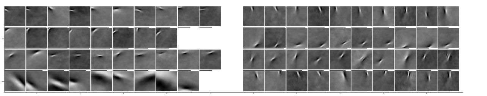

**图 5：** 神经图像模型前两层的学习特征与池化。显示了第二层 8 个单元的结果（每行显示两个单元）。每个图标可视化了第一层的一个特征，每个图标下方的细条表示 $q_{jk}^{(2)}/\max_k q_{jk}^{(2)}$。每个单元最多显示 10 个感受野，或足够占第二层权重向量之和 90% 的数量。

为了可视化第三层上学到的权重，我们沿用 [9] 的方法，将它们可视化为空间-方向感受野。也就是说，我们用不同位置、方向和频率的 Gabor 刺激探测学习到的神经网络，并将第三层单元的响应可视化为极坐标图。极坐标图以探测位置为中心，最大半径是 Gabor 刺激包络（因而也是空间频率）的指示器（较大的圆对应较低的空间频率）。我们像第二层一样可视化第四层的池化，即在空间-方向感受野下方用条表示池化强度。

图 6 显示了学习到的第三层和第四层单元示例，以及为所示第四层单元引发强烈响应的自然图像输入。学习到的第三层单元检测较长的直线或弯曲轮廓，这与先前的发现大体一致（[9]）。图中顶部的第四层单元（单元 4）学会了把具有相同空间方向偏好但调谐到不同空间频率的第三层单元池化到一起。这与先前的建模结果（[14]）一致，在那里类似池化出现在假设更受限的模型中。图中底部显示的第四层单元（单元 19）调谐到围绕西南角弯曲的垂直和水平低频结构，这对应于一个低频角点检测器。全部学习单元以相同方式显示在补充材料 D 中。总体而言，结果表明 CNCE 既产生与先前工作一致的结果，又在新研究的第四层上发现了新颖且直觉上合理的池化模式。

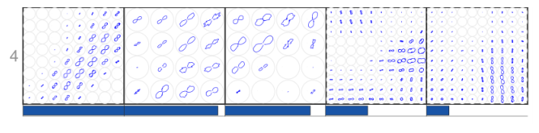

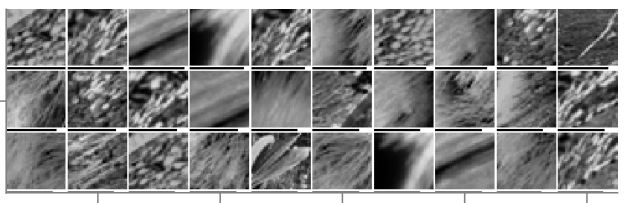

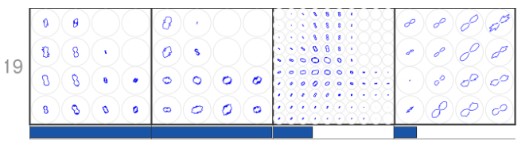

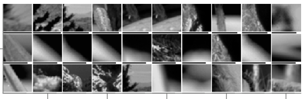

**图 6：** 学习到的第三层和第四层特征示例。图标显示空间-方向感受野，条显示池化强度，与第二层的可视化方式相同。(a) 单元 4：池化与空间-方向感受野；(b) 单元 4：最大响应输入；(c) 单元 19：池化与空间-方向感受野；(d) 单元 19：最大响应输入。

## 5. 结论

在本文中，我们解决了归一化常数（配分函数）无法计算的非归一化模型的密度估计问题。我们提出了一种遵循噪声对比估计和"通过比较学习"原理的新方法。与噪声对比估计（NCE）相反，在所提出的条件噪声对比估计（CNCE）中，对比噪声被允许依赖于数据。

允许噪声分布依赖数据的主要优势在于，可以利用数据中的信息，用相当简单的条件噪声分布（例如高斯分布）就产生适用于各种不同数据和模型类型的噪声样本。第二个优势是，对于对称的条件噪声分布，不需要条件噪声的闭式表达式，这既支持更广泛分布的选择，又有计算上的好处。如果对归一化常数的值不感兴趣，所提方法的第三个优势是难以处理的配分函数会抵消掉。与噪声对比估计不同，因此永远不需要为模型的缩放引入额外的参数。

我们提供了理论和经验论据表明 CNCE 提供了一致估计量，并证明得分匹配作为极限情形出现。由于得分匹配做出了更严格的假设但不依赖采样，这一结果能否用于设计例如混合方法（部分模型自动用更合适的方法估计）仍是一个开放问题。

我们进一步发现 NCE 和 CNCE 的相对性能与模型有关，但在数据位于低维流形这一重要情况下 CNCE 具有优势。

经验比较（因而也包括这里进行的比较）的一个固有局限是结果依赖于所使用的模型和噪声分布。然而，考虑到 CNCE 的自适应性质，简单的高斯条件噪声分布很可能会广泛有用，正如我们在神经图像模型的无监督深度学习上的结果所例证的那样。

所提方法还允许迭代地调整条件噪声分布，使分类任务逐次更具挑战性，正如 NCE 的一些模拟中所做的那样（[7]），以及生成式隐变量模型学习中的普遍做法（[6, 3]）。这是 CNCE 未来工作一个有趣的方向。

## 致谢

MUG 感谢日本 ATR 和 RIKEN AIP 的 Jun-ichiro Hirayama 进行的有益讨论。我们感谢匿名审稿人的深刻评论。

## 参考文献

[1] Chen, X., Liu, X., Gales, M. J. F., and Woodland, P. C. Recurrent neural network language model training with noise contrastive estimation for speech recognition. In 2015 IEEE International Conference on Acoustics, Speech and Signal Processing, pp. 5411–5415, 2015.

[2] Geyer, C. J. On the convergence of Monte Carlo maximum likelihood calculations. Journal of the Royal Statistical Society. Series B (Methodological), 56(1):261–274, 1994.

[3] Goodfellow, I., Pouget-Abadie, J., Mirza, M., Xu, B., Warde-Farley, D., Ozair, S., Courville, A., and Bengio, Y. Generative adversarial nets. In Advances in Neural Information Processing Systems 27, pp. 2672–2680, 2014.

[4] Gutmann, M. and Hirayama, J. Bregman divergence as general framework to estimate unnormalized statistical models. In Conference on Uncertainty in Artificial Intelligence, 2011.

[5] Gutmann, M. and Hyvärinen, A. Learning features by contrasting natural images with noise. In Proceedings of the International Conference on Artificial Neural Networks, 2009.

[6] Gutmann, M., Dutta, R., Kaski, S., and Corander, J. Likelihood-free inference via classification. arXiv preprint arXiv:1407.4981, 2014.

[7] Gutmann, M. U. and Hyvärinen, A. Noise-contrastive estimation: A new estimation principle for unnormalized statistical models. In International Conference on Artificial Intelligence and Statistics, 2010.

[8] Gutmann, M. U. and Hyvärinen, A. Noise-contrastive estimation of unnormalized statistical models, with applications to natural image statistics. Journal of Machine Learning Research, 13:307–361, 2012.

[9] Gutmann, M. U. and Hyvärinen, A. A three-layer model of natural image statistics. Journal of Physiology-Paris, 107(5):369–398, 2013.

[10] Hinton, G. E. Training products of experts by minimizing contrastive divergence. Neural computation, 14(8):1771–1800, 2002.

[11] Hopfield, J. J. Neural networks and physical systems with emergent collective computational abilities. Proceedings of the National Academy of Sciences, 79(8):2554–2558, 1982.

[12] Hyvärinen, A. Estimation of non-normalized statistical models using score matching. Journal of Machine Learning Research, 6:695–709, 2005.

[13] Hyvärinen, A. and Oja, E. Independent component analysis: algorithms and applications. Neural networks, 13(4):411–430, 2000.

[14] Hyvärinen, A., Gutmann, M., and Hoyer, P. O. Statistical model of natural stimuli predicts edge-like pooling of spatial frequency channels in v2. BMC Neuroscience, 6(1):12, 2005.

[15] Hyvärinen, A., Hurri, J., and Hoyer, P. O. Natural Image Statistics. Springer, 2009.

[16] Ji, S., Vishwanathan, S., Satish, N., Anderson, M., and Dubey, P. Blackout: Speeding up recurrent neural network language models with very large vocabularies. In International Conference on Learning Representations, 2016.

[17] Köster, U. and Hyvärinen, A. A two-layer model of natural stimuli estimated with score matching. Neural Computation, 22(9):2308–2333, 2010.

[18] Mnih, A. and Teh, Y. W. A fast and simple algorithm for training neural probabilistic language models. In International Conference on Machine Learning, 2012.

[19] Murphy, K. P. Machine Learning: A Probabilistic Perspective. MIT Press, 2012.

[20] Pihlaja, M., Gutmann, M., and Hyvärinen, A. A family of computationally efficient and simple estimators for unnormalized statistical models. In Conference on Uncertainty in Artificial Intelligence, 2010.

[21] Tschiatschek, S., Djolonga, J., and Krause, A. Learning probabilistic submodular diversity models via noise contrastive estimation. In International Conference on Artificial Intelligence and Statistics, 2016.

[22] van der Vaart, A. Asymptotic Statistics. Cambridge University Press, 1998.

[23] van Hateren, J. H. and van der Schaaf, A. Independent component filters of natural images compared with simple cells in primary visual cortex. Proceedings of the Royal Society of London B: Biological Sciences, 265(1394):359–366, 1998.

[24] Zoph, B., Vaswani, A., May, J., and Knight, K. Simple, fast noise-contrastive estimation for large RNN vocabularies. In Proceedings of the 2016 Conference of the North American Chapter of the Association for Computational Linguistics: Human Language Technologies, 2016.

---

# 补充材料（Supplementary Material for Conditional Noise-Contrastive Estimation of Unnormalised Models）

## A 非参数估计定理的证明

我们在这里证明非参数估计的一致性定理。此外，还给出并证明了把条件 $X = Y$ 放宽为 $X \subseteq Y$ 的定理推广。对于这个推广的定理，需要以下定义：

$$
p_d^{ext}(\mathbf{u}) =
\begin{cases}
p_d(\mathbf{u}) & \text{if } \mathbf{u} \in X \\
0 & \text{if } \mathbf{u} \in Y \setminus X.
\end{cases} \qquad (1)
$$

为了简化证明中的记号，引入以下定义：

$$
r(\mathbf{u}_1, \mathbf{u}_2) = \frac{p_c(\mathbf{u}_2|\mathbf{u}_1)}{p_c(\mathbf{u}_1|\mathbf{u}_2)} = \frac{1}{r(\mathbf{u}_2, \mathbf{u}_1)}, \qquad (2)
$$

以及

$$
\Omega = \{(\mathbf{u}_1, \mathbf{u}_2) \in X \times X \mid p_d(\mathbf{u}_1) > 0 \wedge p_c(\mathbf{u}_1|\mathbf{u}_2) > 0\}. \qquad (3)
$$

此外，证明中将使用以下泰勒展开：

$$
\log(1 + \exp(-(G + \varepsilon q))) = \log(1 + \exp(-G)) - \varepsilon q\frac{\exp(-G)}{1 + \exp(-G)} + \frac{\varepsilon^2 q^2}{2}\frac{\exp(-G)}{(1 + \exp(-G))^2} + O(\varepsilon^3). \qquad (4)
$$

利用这些新定义，推广的定理表述为：

**定理（非参数估计，推广版）。** 设 $G: U \times U \mapsto \mathbb{R}$ 是如下形式的函数

$$
G(\mathbf{u}_1, \mathbf{u}_2) = f(\mathbf{u}_1) - f(\mathbf{u}_2) + \log r(\mathbf{u}_1, \mathbf{u}_2), \qquad (5)
$$

其中 $f$ 是从 $U$ 到 $\mathbb{R}$ 的函数。在假设 $X \subseteq Y$ 下，$\tilde{\mathcal{J}}$ 在

$$
G^*(\mathbf{u}_1, \mathbf{u}_2) = \log \frac{p_d^{ext}(\mathbf{u}_1)p_c(\mathbf{u}_2|\mathbf{u}_1)}{p_d^{ext}(\mathbf{u}_2)p_c(\mathbf{u}_1|\mathbf{u}_2)} \qquad (6)
$$

处取得唯一最小值，其中 $(\mathbf{u}_1, \mathbf{u}_2) \in \Omega$。

首先给出主文中定理的证明，然后给出证明推广定理所需的附加步骤。

**非参数估计定理的证明。** 证明分为两部分。首先，通过证明 $\tilde{\mathcal{J}}$ 关于 $G$ 的泰勒展开的线性项在 $G^*$ 处为零，来证明 $G^*$ 是 $\tilde{\mathcal{J}}$ 的临界点。在第二部分中，通过证明泰勒展开的二次部分在集合 $\Omega$ 上严格为正，证明 $G^*$ 是最小值且是唯一的极值。

泛函 $\tilde{\mathcal{J}}[G]$ 表示为积分

$$
\tilde{\mathcal{J}}[G] = \mathbb{E}_{xy}\log\left(1 + \exp(-G(\mathbf{x}, \mathbf{y}))\right) \qquad (7)
$$

$$
= \int_{X \times Y} \log\left(1 + \exp(-G(\mathbf{x}, \mathbf{y}))\right) p_d(\mathbf{x})p_c(\mathbf{x}|\mathbf{y})\,d\mathbf{x}d\mathbf{y}. \qquad (8)
$$

插入式 (5)，得到泛函

$$
\tilde{\mathcal{J}}_f[f] = \mathbb{E}_{xy}\log\left(1 + \exp(f(\mathbf{y}) - f(\mathbf{x}) + \log r(\mathbf{x}, \mathbf{y}))\right) \qquad (9)
$$

$$
= \int_{X \times Y} \log\left(1 + \exp(f(\mathbf{y}) - f(\mathbf{x}) + \log r(\mathbf{x}, \mathbf{y}))\right) p_d(\mathbf{x})p_c(\mathbf{x}|\mathbf{y})\,d\mathbf{x}d\mathbf{y}. \qquad (10)
$$

现在考虑 $f$ 的任意扰动 $\psi: U \mapsto \mathbb{R}$，

$$
\tilde{\mathcal{J}}_f[f + \varepsilon\psi] = \mathbb{E}_{xy}\log\left(1 + \exp\left[f(\mathbf{y}) + \varepsilon\psi(\mathbf{y}) - f(\mathbf{x}) - \varepsilon\psi(\mathbf{x}) + \log r(\mathbf{x}, \mathbf{y})\right]\right) \qquad (11)
$$

$$
= \int_{X \times Y} \log\left(1 + \exp\left[-(G(\mathbf{x}, \mathbf{y}) + \varepsilon(\psi(\mathbf{x}) - \psi(\mathbf{y})))\right]\right) p_d(\mathbf{x})p_c(\mathbf{x}|\mathbf{y})\,d\mathbf{x}d\mathbf{y}. \qquad (12)
$$

$\tilde{\mathcal{J}}_f[f]$ 的扰动对应于 $\tilde{\mathcal{J}}[G]$ 的如下扰动：

$$
\tilde{\mathcal{J}}[G + \varepsilon(\psi(\mathbf{x}) - \psi(\mathbf{y}))] = \mathbb{E}_{xy}\log\left(1 + \exp[-(G(\mathbf{x}, \mathbf{y}) + \varepsilon(\psi(\mathbf{x}) - \psi(\mathbf{y})))]\right). \qquad (13)
$$

使用式 (4) 的泰勒展开得到

$$
\tilde{\mathcal{J}}[G + \varepsilon(\psi(\mathbf{x}) - \psi(\mathbf{y}))] = \mathbb{E}_{xy}\log(1 + \exp(-G(\mathbf{x}, \mathbf{y}))) - \varepsilon\mathbb{E}_{xy}(\psi(\mathbf{x}) - \psi(\mathbf{y}))\frac{\exp(-G(\mathbf{x}, \mathbf{y}))}{1 + \exp(-G(\mathbf{x}, \mathbf{y}))}
$$

$$
+ \frac{\varepsilon^2}{2}\mathbb{E}_{xy}(\psi(\mathbf{x}) - \psi(\mathbf{y}))^2\frac{\exp(-G(\mathbf{x}, \mathbf{y}))}{(1 + \exp(-G(\mathbf{x}, \mathbf{y})))^2} + O(\varepsilon^3). \qquad (14)
$$

令一阶项等于 0，可以找到最优 $G$ 的必要条件：

$$
0 = \mathbb{E}_{xy}(\psi(\mathbf{x}) - \psi(\mathbf{y}))\frac{\exp(-G(\mathbf{x}, \mathbf{y}))}{1 + \exp(-G(\mathbf{x}, \mathbf{y}))} \qquad (15)
$$

$$
= \int_{X \times Y} \psi(\mathbf{x})\frac{\exp(-G(\mathbf{x}, \mathbf{y}))}{1 + \exp(-G(\mathbf{x}, \mathbf{y}))}p_d(\mathbf{x})p_c(\mathbf{y}|\mathbf{x})\,d\mathbf{x}d\mathbf{y} - \int_{X \times Y} \psi(\mathbf{y})\frac{\exp(-G(\mathbf{x}, \mathbf{y}))}{1 + \exp(-G(\mathbf{x}, \mathbf{y}))}p_d(\mathbf{x})p_c(\mathbf{y}|\mathbf{x})\,d\mathbf{x}d\mathbf{y}. \qquad (16)
$$

现在我们做变量替换。对于式 (16) 中的第一项，我们对 $\mathbf{x}$ 写 $u$，对 $\mathbf{y}$ 写 $v$；对于第二项，我们使用变换

$$
T_2: \begin{pmatrix} u \\ v \end{pmatrix} = \begin{pmatrix} 0 & 1 \\ 1 & 0 \end{pmatrix}\begin{pmatrix} x \\ y \end{pmatrix} \qquad (17)
$$

$$
\det\begin{pmatrix} 0 & 1 \\ 1 & 0 \end{pmatrix} = -1 \qquad (18)
$$

$$
T_2(X \times Y) = Y \times X. \qquad (19)
$$

在得到的方程中，两项的积分在不同域上进行：

$$
0 = \int_{X \times Y} \psi(u)\frac{\exp(-G(u, v))}{1 + \exp(-G(u, v))}p_d(u)p_c(v|u)\,dudv - \int_{Y \times X} \psi(u)\frac{\exp(-G(v, u))}{1 + \exp(-G(v, u))}p_d(v)p_c(u|v)\,dudv. \qquad (20)
$$

对于第一个定理，我们假设 $Y = X$，因此

$$
0 = \int_{X \times X} \psi(u)\frac{\exp(-G(u, v))}{1 + \exp(-G(u, v))}p_d(u)p_c(v|u)\,dudv - \int_{X \times X} \psi(u)\frac{\exp(-G(v, u))}{1 + \exp(-G(v, u))}p_d(v)p_c(u|v)\,dudv \qquad (21)
$$

$$
= \int_{X \times X} \psi(u)\left[\frac{\exp(-G(u, v))p_d(u)p_c(v|u)}{1 + \exp(-G(u, v))} - \frac{\exp(-G(v, u))p_d(v)p_c(u|v)}{1 + \exp(-G(v, u))}\right]dudv. \qquad (22)
$$

由于式 (22) 应对 $X \times X$ 上的任意 $\psi$ 成立，括号中的因子必须等于 0。通过插入假定的 $G$ 形式（见式 (5)）可以展开该因子：

$$
\frac{\exp(-G(u, v))p_d(u)p_c(v|u)}{1 + \exp(-G(u, v))} = \frac{\exp(-G(v, u))p_d(v)p_c(u|v)}{1 + \exp(-G(v, u))} \qquad (23)
$$

$$
\frac{p_d(u)p_c(v|u)}{\exp(G(u, v)) + 1} = \frac{p_d(v)p_c(u|v)}{\exp(G(v, u)) + 1} \qquad (24)
$$

$$
\frac{p_d(u)p_c(v|u)}{\exp(f(u) - f(v))r(u, v) + 1} = \frac{p_d(v)p_c(u|v)}{\exp(f(v) - f(u))r(v, u) + 1} \qquad (25)
$$

$$
\frac{\exp(f(v))p_d(u)p_c(v|u)}{\exp(f(u))r(u, v) + \exp(f(v))} = \frac{\exp(f(u))p_d(v)p_c(u|v)}{\exp(f(v))r(v, u) + \exp(f(u))}. \qquad (26)
$$

利用式 (2) 中的 $r(v, u) = 1/r(u, v)$，可以从右端的分母中提出一个因子：

$$
\frac{\exp(f(v))p_d(u)p_c(v|u)}{\exp(f(u))r(u, v) + \exp(f(v))} = \frac{1}{r(v, u)}\frac{\exp(f(u))p_d(v)p_c(u|v)}{\exp(f(v)) + \exp(f(u))r(u, v)} \qquad (27)
$$

$$
\exp(f(v))p_d(u)p_c(v|u) = \frac{1}{r(v, u)}\exp(f(u))p_d(v)p_c(u|v) \qquad (28)
$$

$$
\exp(f(v))p_d(u)p_c(v|u) = \frac{p_c(v|u)}{p_c(u|v)}\exp(f(u))p_d(v)p_c(u|v). \qquad (29)
$$

现在只在 $\Omega$ 集合上考虑——在该集合上上述方程两边不平凡地为零：

$$
\exp(f(v))p_d(u) = \exp(f(u))p_d(v) \qquad (30)
$$

$$
\frac{p_d(u)}{\exp(f(u))} = \frac{p_d(v)}{\exp(f(v))} = Z \qquad (31)
$$

$$
f^*(u) = \log p_d(u) - \log Z \qquad (32)
$$

$$
G^*(\mathbf{u}_1, \mathbf{u}_2) = \log p_d(\mathbf{u}_1) - \log p_d(\mathbf{u}_2) + \log r(\mathbf{u}_1, \mathbf{u}_2). \qquad (33)
$$

现在证明的第一部分已经完成，因为式 (33) 中的 $G^*$ 是 $\tilde{\mathcal{J}}$ 的临界点。

证明 $G^*$ 最小化 $\tilde{\mathcal{J}}$ 且是唯一极值点是直接的。通过考虑式 (14) 中泰勒展开的二阶项，

$$
\mathbb{E}_{xy}(\psi(\mathbf{x}) - \psi(\mathbf{y}))^2\frac{\exp(-G(\mathbf{x}, \mathbf{y}))}{(1 + \exp(-G(\mathbf{x}, \mathbf{y})))^2}, \qquad (34)
$$

我们观察到它对所有非常数扰动 $\psi$ 都是正的。由于 $f$ 的常数扰动不会改变 $G$，可以得出结论：式 (33) 描述了一个最小值，且是集合 $\Omega$ 上唯一的极值点。∎

**非参数估计（推广版）定理的证明。** 我们可以沿用前面的证明直到式 (20)，恰好在变量替换之后。现在我们观察到

$$
X \times Y = (X \cap Y) \times (X \cap Y) \cup (X \setminus Y) \times (X \cap Y) \cup (X \cap Y) \times (Y \setminus X) \cup (X \setminus Y) \times (Y \setminus X) \qquad (35)
$$

假设 $X \subseteq Y$ 意味着 $(X \setminus Y) = \emptyset$ 且 $(X \cap Y) = X$。因此，

$$
X \times Y = \left((X \cap Y) \times (X \cap Y)\right) \cup \left((X \cap Y) \times (Y \setminus X)\right) \qquad (36)
$$

$$
= \left(X \times X\right) \cup \left(X \times (Y \setminus X)\right), \qquad (37)
$$

类似地

$$
Y \times X = \left(X \times X\right) \cup \left((Y \setminus X) \times X\right). \qquad (38)
$$

现在可以重新计算式 (20)：

$$
0 = \int_{X \times X} \psi(u)\frac{\exp(-G(u, v))}{1 + \exp(-G(u, v))}p_d(u)p_c(v|u)\,dudv + \int_{X \times (Y \setminus X)} \psi(u)\frac{\exp(-G(u, v))}{1 + \exp(-G(u, v))}p_d(u)p_c(v|u)\,dudv
$$

$$
- \int_{X \times X} \psi(u)\frac{\exp(-G(v, u))}{1 + \exp(-G(v, u))}p_d(v)p_c(u|v)\,dudv - \int_{(Y \setminus X) \times X} \psi(u)\frac{\exp(-G(v, u))}{1 + \exp(-G(v, u))}p_d(v)p_c(u|v)\,dudv \qquad (39)
$$

$$
0 = \int_{X \times X} \psi(u)\left[\frac{\exp(-G(u, v))p_d(u)p_c(v|u)}{1 + \exp(-G(u, v))} - \frac{\exp(-G(v, u))p_d(v)p_c(u|v)}{1 + \exp(-G(v, u))}\right]dudv
$$

$$
+ \int_{X \times (Y \setminus X)} \psi(u)\frac{\exp(-G(u, v))}{1 + \exp(-G(u, v))}p_d(u)p_c(v|u)\,dudv - \int_{(Y \setminus X) \times X} \psi(u)\frac{\exp(-G(v, u))}{1 + \exp(-G(v, u))}p_d(v)p_c(u|v)\,dudv \qquad (40)
$$

沿用前面的证明，

$$
G(u_1, u_2) = \log p_d(u_1) - \log p_d(u_2) + \log r(u_1, u_2) \qquad (41)
$$

将使式 (40) 的第一项为 0。通过用式 (1) 中扩展的数据分布 $p_d^{ext}$ 代替 $p_d$，我们找到

$$
G^*(\mathbf{u}_1, \mathbf{u}_2) = \log p_d^{ext}(\mathbf{u}_1) - \log p_d^{ext}(\mathbf{u}_2) + \log r(\mathbf{u}_1, \mathbf{u}_2). \qquad (42)
$$

由于 $G^*$ 在 $X \times (Y \setminus X)$ 上变得任意大，式 (40) 的第二项和第三项为 0。同样，在集合 $\Omega$ 上，二阶项对所有非常数扰动 $\psi$ 都是正的。∎

## B 与得分匹配联系的证明

**与得分匹配联系的证明。** 这里我们假设 $\mathbf{y} = \mathbf{x} + \varepsilon\boldsymbol{\xi}$，其中 $\boldsymbol{\xi}$ 是均值零、方差一的不相关随机变量向量，独立于 $\mathbf{x}$ 且具有对称密度。

由于 $\boldsymbol{\xi}$ 具有对称密度，$p_c$ 是对称的，并在 $G(\mathbf{u}_1, \mathbf{u}_2;\theta)$ 的定义中抵消：

$$
G(\mathbf{u}_1, \mathbf{u}_2;\theta) = \log\frac{\varphi(\mathbf{u}_1;\theta)p_c(\mathbf{u}_2|\mathbf{u}_1)}{\varphi(\mathbf{u}_2;\theta)p_c(\mathbf{u}_1|\mathbf{u}_2)} = \log\varphi(\mathbf{u}_1;\theta) - \log\varphi(\mathbf{u}_2;\theta). \qquad (43)
$$

因此损失函数为

$$
\mathcal{J}(\theta) = 2\mathbb{E}_{xy}\log\left[1 + \exp(-G(\mathbf{x}, \mathbf{y};\theta))\right] \qquad (44)
$$

$$
= 2\mathbb{E}_{xy}\log\left[1 + \exp\left(-\log\varphi(\mathbf{x};\theta) + \log\varphi(\mathbf{y};\theta)\right)\right] \qquad (45)
$$

$$
= 2\mathbb{E}_{x\xi}\log\left[1 + \exp\left(-\log\varphi(\mathbf{x};\theta) + \log\varphi(\mathbf{x} + \varepsilon\boldsymbol{\xi};\theta)\right)\right]. \qquad (46)
$$

把对数非归一化模型 $\log\varphi(\cdot;\theta)$ 记为 $f_\theta(\cdot)$，使得

$$
\mathcal{J}(\theta) = 2\mathbb{E}_{x\xi}\log\left[1 + \exp\left(-f_\theta(\mathbf{x}) + f_\theta(\mathbf{x} + \varepsilon\boldsymbol{\xi})\right)\right]. \qquad (47)
$$

根据假设 $\varepsilon$ 很小，因此对任意固定的 $\boldsymbol{\xi}$ 值，

$$
f_\theta(\mathbf{x} + \varepsilon\boldsymbol{\xi}) = f_\theta(\mathbf{x}) + \varepsilon\nabla_{\mathbf{x}}f_\theta(\mathbf{x})^{\mathsf{T}}\boldsymbol{\xi} + \frac{\varepsilon^2}{2}\boldsymbol{\xi}^{\mathsf{T}}H_\theta(\mathbf{x})\boldsymbol{\xi} + O(\varepsilon^3) \qquad (48)
$$

其中 $H_\theta(\mathbf{x})$ 是元素为 $\partial_{x_i x_j}f_\theta(\mathbf{x})$ 的 Hessian 矩阵。因此我们得到

$$
\mathcal{J}(\theta) = 2\mathbb{E}_{x\xi}\log\left(1 + \exp\left(\varepsilon\nabla_{\mathbf{x}}f_\theta(\mathbf{x})^{\mathsf{T}}\boldsymbol{\xi} + \frac{\varepsilon^2}{2}\boldsymbol{\xi}^{\mathsf{T}}H_\theta(\mathbf{x})\boldsymbol{\xi} + O(\varepsilon^3)\right)\right). \qquad (49)
$$

函数 $\log(1 + \exp(v))$ 在 $v = 0$ 附近的泰勒展开为

$$
\log(1 + \exp(v)) = \log(2) + \frac{1}{2}v + \frac{1}{8}v^2 + O(v^3), \qquad (50)
$$

因此

$$
\mathcal{J}(\theta) = 2\mathbb{E}_{x\xi}\left[\log(2) + \frac{1}{2}\varepsilon\nabla_{\mathbf{x}}f_\theta(\mathbf{x})^{\mathsf{T}}\boldsymbol{\xi} + \frac{\varepsilon^2}{4}\boldsymbol{\xi}^{\mathsf{T}}H_\theta(\mathbf{x})\boldsymbol{\xi} + O(\varepsilon^3)\right] + 2\mathbb{E}_{x\xi}\left[\frac{1}{8}\left(\varepsilon\nabla_{\mathbf{x}}f_\theta(\mathbf{x})^{\mathsf{T}}\boldsymbol{\xi} + \frac{\varepsilon^2}{2}\boldsymbol{\xi}^{\mathsf{T}}H_\theta(\mathbf{x})\boldsymbol{\xi} + O(\varepsilon^3)\right)^2\right]. \qquad (51)
$$

对项 $\left(\varepsilon\nabla_{\mathbf{x}}f_\theta(\mathbf{x})^{\mathsf{T}}\boldsymbol{\xi} + \frac{\varepsilon^2}{2}\boldsymbol{\xi}^{\mathsf{T}}H_\theta(\mathbf{x})\boldsymbol{\xi} + O(\varepsilon^3)\right)^2$ 求平方，给出 $\varepsilon^2(\nabla_{\mathbf{x}}f_\theta(\mathbf{x})^{\mathsf{T}}\boldsymbol{\xi})^2 + O(\varepsilon^3)$，因此

$$
\mathcal{J}(\theta) = 2\mathbb{E}_{x\xi}\left[\log(2) + \frac{1}{2}\varepsilon\nabla_{\mathbf{x}}f_\theta(\mathbf{x})^{\mathsf{T}}\boldsymbol{\xi} + \frac{\varepsilon^2}{4}\boldsymbol{\xi}^{\mathsf{T}}H_\theta(\mathbf{x})\boldsymbol{\xi} + \frac{1}{8}\varepsilon^2(\nabla_{\mathbf{x}}f_\theta(\mathbf{x})^{\mathsf{T}}\boldsymbol{\xi})^2\right] + O(\varepsilon^3). \qquad (52)
$$

根据假设，$\mathbf{x}$ 和 $\boldsymbol{\xi}$ 独立，且 $\mathbb{E}_\xi\boldsymbol{\xi} = 0$，因此我们有

$$
\mathcal{J}(\theta) = 2\mathbb{E}_x\mathbb{E}_\xi\left[\log(2) + \frac{\varepsilon^2}{4}\boldsymbol{\xi}^{\mathsf{T}}H_\theta(\mathbf{x})\boldsymbol{\xi} + \frac{1}{8}\varepsilon^2(\nabla_{\mathbf{x}}f_\theta(\mathbf{x})^{\mathsf{T}}\boldsymbol{\xi})^2\right] + O(\varepsilon^3). \qquad (53)
$$

此外，$\mathbb{E}_\xi\boldsymbol{\xi}\boldsymbol{\xi}^{\mathsf{T}}$ 等于单位矩阵 $\mathbf{1}$，我们有

$$
\mathbb{E}_\xi\boldsymbol{\xi}^{\mathsf{T}}H_\theta(\mathbf{x})\boldsymbol{\xi} = \mathbb{E}_\xi\,\text{tr}\left[H_\theta(\mathbf{x})\boldsymbol{\xi}\boldsymbol{\xi}^{\mathsf{T}}\right] \qquad (54)
$$

$$
= \text{tr}\left[H_\theta(\mathbf{x})\mathbb{E}_\xi\boldsymbol{\xi}\boldsymbol{\xi}^{\mathsf{T}}\right] \qquad (55)
$$

$$
= \text{tr}\,H_\theta(\mathbf{x}). \qquad (56)
$$

类似地，我们得到

$$
\mathbb{E}_\xi(\nabla_{\mathbf{x}}f_\theta(\mathbf{x})^{\mathsf{T}}\boldsymbol{\xi})^2 = \mathbb{E}_\xi\boldsymbol{\xi}^{\mathsf{T}}\nabla_{\mathbf{x}}f_\theta(\mathbf{x})\nabla_{\mathbf{x}}f_\theta(\mathbf{x})^{\mathsf{T}}\boldsymbol{\xi} \qquad (57)
$$

$$
= \mathbb{E}_\xi\,\text{tr}\left[\nabla_{\mathbf{x}}f_\theta(\mathbf{x})\nabla_{\mathbf{x}}f_\theta(\mathbf{x})^{\mathsf{T}}\boldsymbol{\xi}\boldsymbol{\xi}^{\mathsf{T}}\right] \qquad (58)
$$

$$
= \text{tr}\left[\nabla_{\mathbf{x}}f_\theta(\mathbf{x})\nabla_{\mathbf{x}}f_\theta(\mathbf{x})^{\mathsf{T}}\mathbb{E}_\xi\boldsymbol{\xi}\boldsymbol{\xi}^{\mathsf{T}}\right] \qquad (59)
$$

$$
= \text{tr}\left[\nabla_{\mathbf{x}}f_\theta(\mathbf{x})\nabla_{\mathbf{x}}f_\theta(\mathbf{x})^{\mathsf{T}}\right] \qquad (60)
$$

$$
= \|\nabla_{\mathbf{x}}f_\theta(\mathbf{x})\|_2^2. \qquad (61)
$$

把这两个恒等式代入 (53)，可以把 $\mathcal{J}(\theta)$ 写成

$$
\mathcal{J}(\theta) = \frac{\varepsilon^2}{2}\mathbb{E}_x\left[\text{tr}\,H_\theta(\mathbf{x}) + \frac{1}{2}\|\nabla_{\mathbf{x}}f_\theta(\mathbf{x})\|_2^2\right] + 2\log(2) + O(\varepsilon^3). \qquad (62)
$$

由于 $\text{tr}\,H_\theta(\mathbf{x})$ 等于 $f_\theta(\mathbf{x}) = \log\varphi(\mathbf{x};\theta)$ 的二阶导数之和，

$$
\text{tr}\,H_\theta(\mathbf{x}) = \sum_i \frac{\partial^2 f_\theta(\mathbf{x})}{\partial x_i^2}, \qquad (63)
$$

方括号中的项就是得分匹配中最小化的损失函数，这完成了证明。∎

## C 非负与离散数据上的经验验证

CNCE 还在正数数据的重尾分布（对数正态分布）和离散分布（Bernoulli 分布）上进行了验证。

对数正态分布是一元连续重尾分布，它的样本在对数域中是正态分布的。因此，它只定义在正实轴 $X = \mathbb{R}_+$ 上。出于这个原因，对数正态分布适合说明这样一个事实：只要主文中定义的条件噪声分布 $p_c$ 在 $Y = \mathbb{R}$ 中生成噪声样本，CNCE 就只需要 $X \subseteq Y$。我们使用下面定义在整个实轴上的非归一化对数正态模型

$$
\log\varphi(u;\theta, C) =
\begin{cases}
-\frac{\theta}{2}(\log u)^2 - \log u & \text{if } u > 0 \\
C & \text{if } u \leq 0
\end{cases} \qquad (64)
$$

其中 $\theta, C \in \mathbb{R}$。在正半轴上，该模型正比于一个对数域均值为零、精度为 $\theta$ 的对数正态分布。在负半轴上，模型取常数值 $C$。理论上，$C$ 的最优值将是 $-\infty$。由于这在实践中永远无法达到，我们只测量 $\theta$ 的估计误差，即真实参数与估计参数之间的绝对误差。

Bernoulli 模型为取值于 $X = \{0, 1\}$ 的二元随机变量定义了一个简单的概率质量函数。在归一化版本中，Bernoulli 模型只有一个自由参数。这里使用具有两个自由参数 $\theta_1, \theta_2 \in \mathbb{R}_+$ 的非归一化版本：

$$
\log\varphi(u;\theta_1, \theta_2) =
\begin{cases}
\log\theta_1 & \text{if } u = 0 \\
\log\theta_2 & \text{if } u = 1.
\end{cases} \qquad (65)
$$

使用两个自由参数意味着存在无穷多个等价的模型参数集，它们与 $(\theta_1, \theta_2)$ 只差一个缩放因子。因此，为了衡量 Bernoulli 模型参数估计（即 $\hat{\theta} = (\hat{\theta}_1, \hat{\theta}_2)$）的误差，我们在计算估计误差之前先对参数进行归一化：$\|(\hat{\theta}_1 + \hat{\theta}_2)^{-1}\hat{\theta} - \theta^*\|_2$，其中 $\theta^* = (\theta_1^*, \theta_2^*)$ 表示真实参数值（它们满足 $\theta_2^* = 1 - \theta_1^*$）。

对于 Bernoulli 模型，使用了式 (66) 定义的离散条件噪声分布。同样，$\varepsilon$ 控制数据与噪声之间的相似度，但附加了约束 $\varepsilon \in [0, 1]$。

$$
p_c^{Ber}(y|x;\varepsilon) =
\begin{cases}
1 - \varepsilon & \text{if } y = x \\
\varepsilon & \text{if } y \neq x,
\end{cases} \qquad (66)
$$

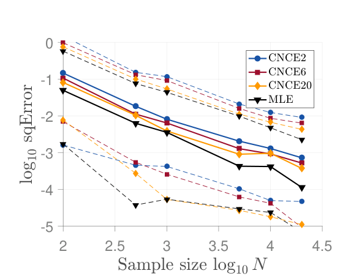

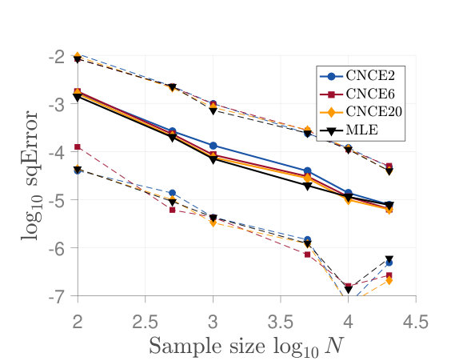

**补充图 1：** CNCE 一致性的经验验证。x 轴为 $\log_{10}$ 域的样本量，y 轴为 $\log_{10}$ 域的平方估计误差。实线表示 100 次不同模拟的中位数结果，虚线为 0.1 和 0.9 分位数。在 100 次模拟中的每一次中，都使用一组新的随机参数来生成数据。不同颜色和标记的线对应 CNCE 的不同 $\kappa$ 值，黑线对应 MLE 结果。

## D 补充特征可视化

### D.1 神经网络层大小

四层的尺寸见表 1。注意，作为第二层和第三层之间增益控制的一部分，数据的维数通过 PCA 降低了四维。

| 层 | 输入 $D^{(L)}$ | 输出 $K^{(L)}$ |
| --- | --- | --- |
| 1 | 600 | 600 |
| 2 | 600 | 200 |
| 中间增益控制 | | |
| 3 | 196 | 60 |
| 4 | 60 | 30 |

**表 1：** 神经网络的输入和输出维度。

### D.2 CNCE 与 NCE 第一层特征比较

除了主文第 3 节中给出的 CNCE 与 NCE 之间的定量比较之外，评估两种方法之间的定性差异也是可取的。为此，我们比较了训练不同阶段的易解释的第一层特征，目的是确定学习特征之间的定性差异，以及哪一种方法的学习更快。

补充图 2 显示了共同的初始化，补充图 3 至 13 显示了前十一次元迭代结束时的一百个第一层特征。每次元迭代由十个梯度步组成，之后生成新的噪声样本。两种方法似乎学习了相似的特征；对于这个模型，虽然鉴于比较的定性性质我们不想声称有更高的性能，但 CNCE 确实似乎比 NCE 学习得稍快一些。

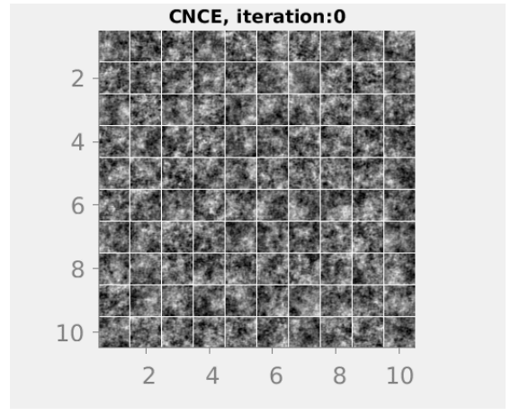

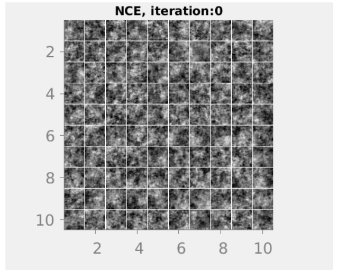

**补充图 2：** 用于 CNCE 与 NCE 定性比较的 100 个第一层特征的共同初始化。(a) CNCE；(b) NCE。

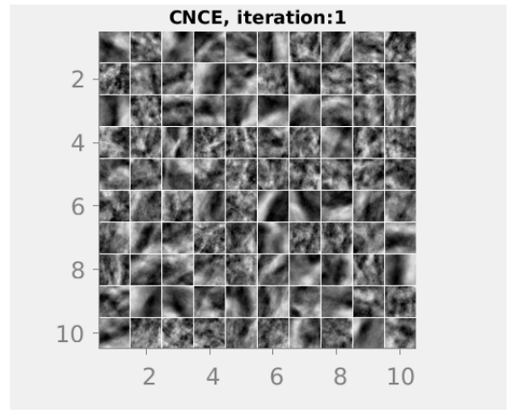

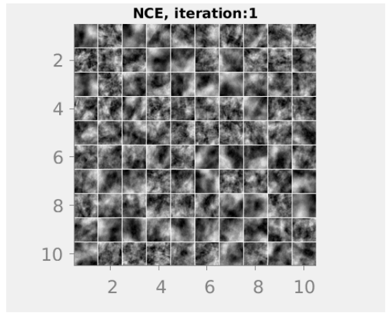

**补充图 3：** 1 次元迭代后第一层特征的样本。(a) CNCE；(b) NCE。

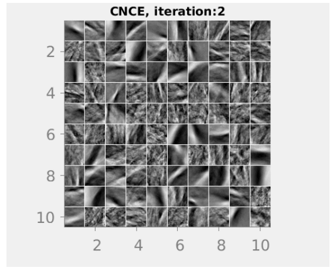

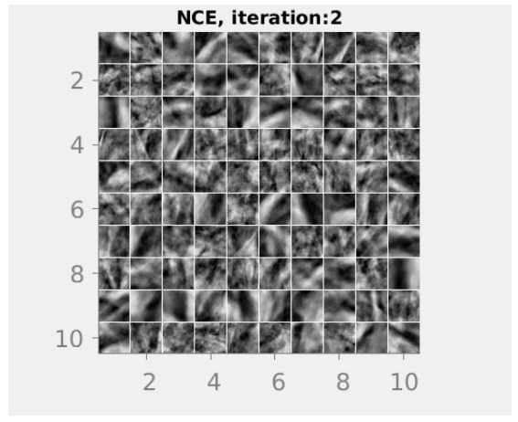

**补充图 4：** 2 次元迭代后第一层特征的样本。(a) CNCE；(b) NCE。

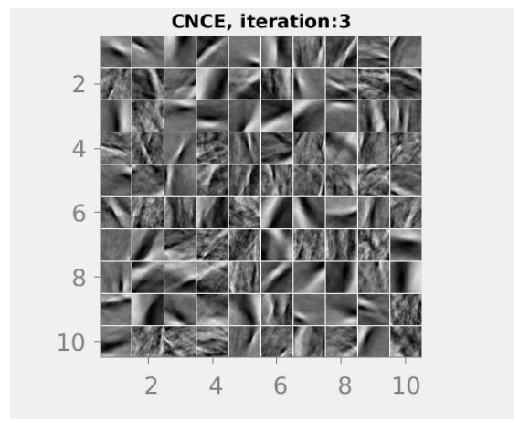

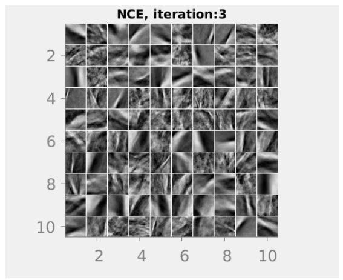

**补充图 5：** 3 次元迭代后第一层特征的样本。(a) CNCE；(b) NCE。

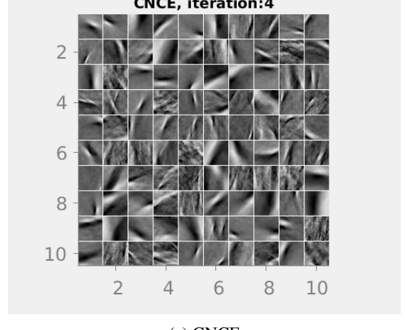

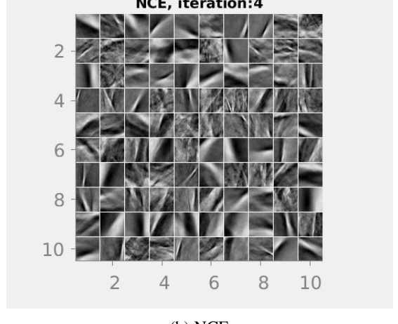

**补充图 6：** 4 次元迭代后第一层特征的样本。(a) CNCE；(b) NCE。

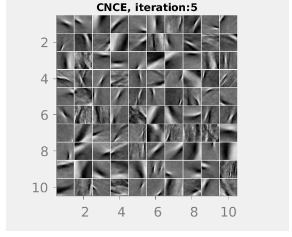

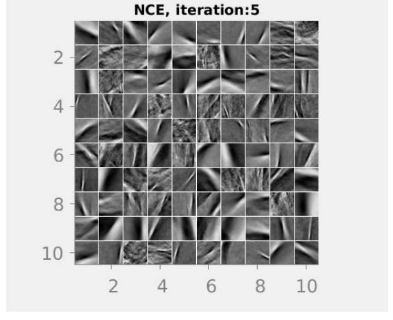

**补充图 7：** 5 次元迭代后第一层特征的样本。(a) CNCE；(b) NCE。

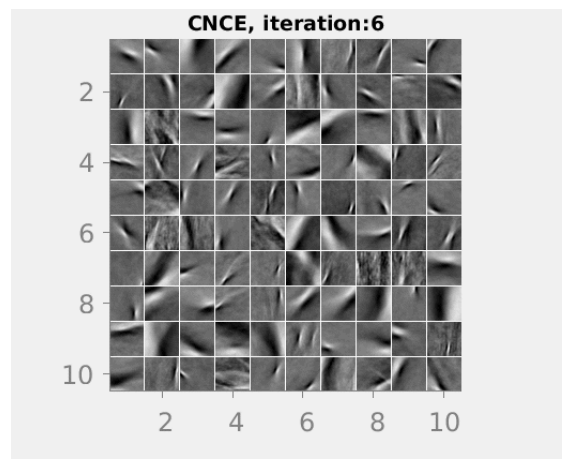

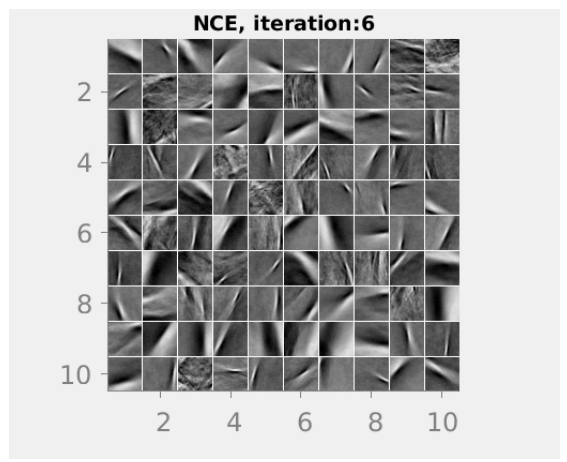

**补充图 8：** 6 次元迭代后第一层特征的样本。(a) CNCE；(b) NCE。

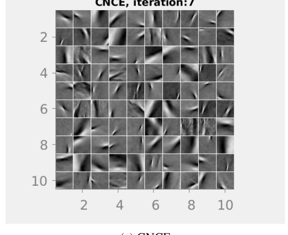

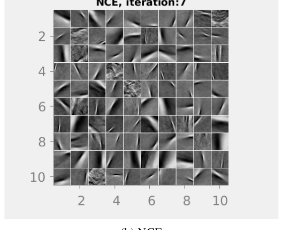

**补充图 9：** 7 次元迭代后第一层特征的样本。(a) CNCE；(b) NCE。

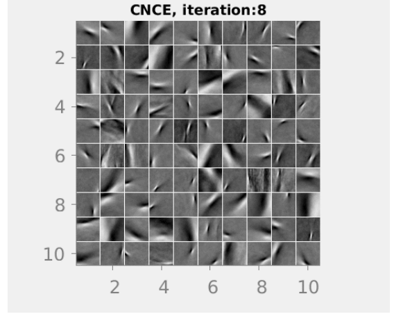

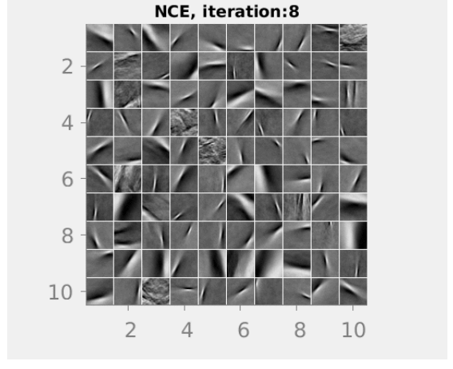

**补充图 10：** 8 次元迭代后第一层特征的样本。(a) CNCE；(b) NCE。

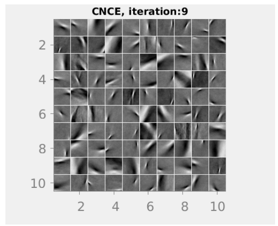

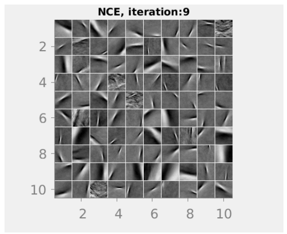

**补充图 11：** 9 次元迭代后第一层特征的样本。(a) CNCE；(b) NCE。

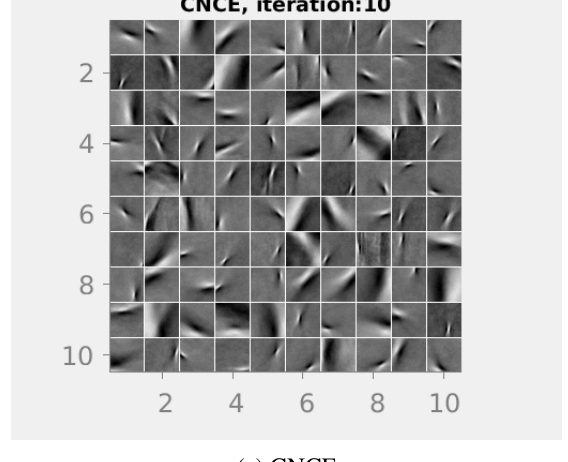

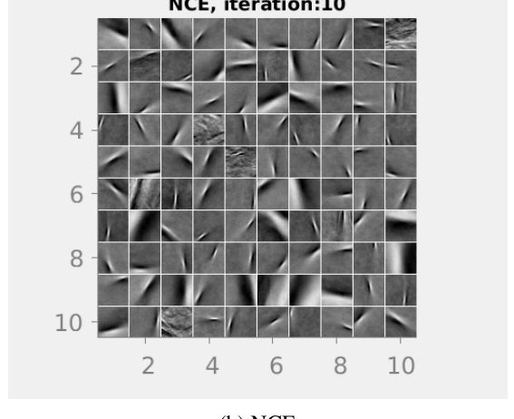

**补充图 12：** 10 次元迭代后第一层特征的样本。(a) CNCE；(b) NCE。

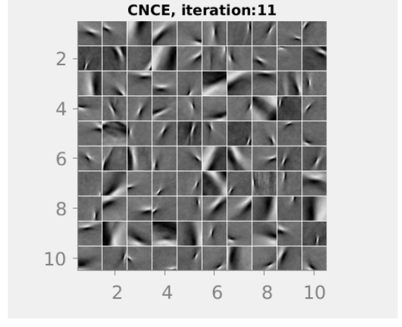

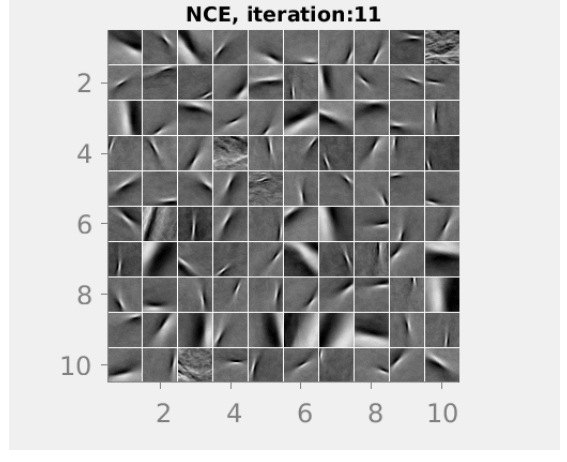

**补充图 13：** 11 次元迭代后第一层特征的样本。(a) CNCE；(b) NCE。

### D.3 第三层特征

所有 60 个第三层空间-方向感受野和最大响应图像块显示在补充图 14 至 17 中。

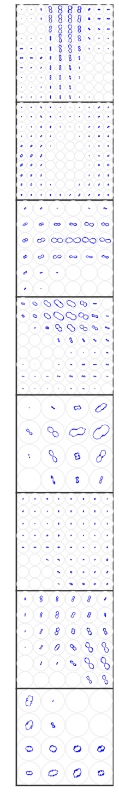

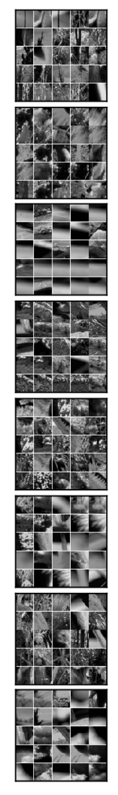

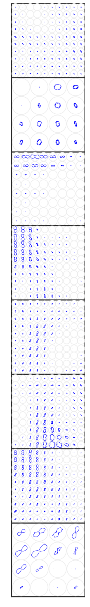

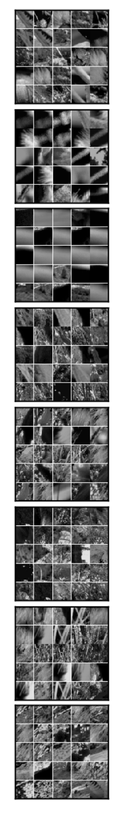

**补充图 14：** 每行成对的一个感受野和一个图标代表一个第三层单元。(a) 和 (b) 显示单元 1 至 8，(c) 和 (d) 显示 9 至 16。

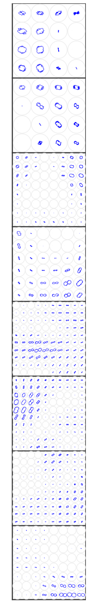

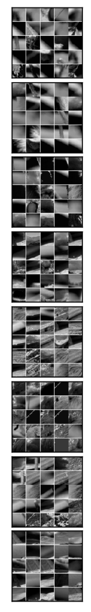

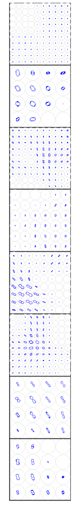


**补充图 15：** 每行成对的一个感受野和一个图标代表一个第三层单元。(a) 和 (b) 显示单元 17 至 24，(c) 和 (d) 显示 25 至 32。


**补充图 16：** 每行成对的一个感受野和一个图标代表一个第三层单元。(a) 和 (b) 显示单元 33 至 40，(c) 和 (d) 显示 41 至 48。


**补充图 17：** 每行成对的一个感受野和一个图标代表一个第三层单元。(a) 和 (b) 显示单元 49 至 56，(c) 和 (d) 显示 57 至 60。

### D.4 第四层特征

所有 30 个第四层单元都以与主文中相同的方式显示在补充图 18 至 47 中。


**补充图 18：** 第四层单元 1 的估计结果。(a) 显示第三层单元的学习池化，(b) 显示对一批 10000 个输入产生最大响应的 30 个图像块。对于空间-方向感受野，每个图标下方的条表示第四层权重的相对大小，即 $q_{1,k}^{(4)}/\max_k q_{1,k}^{(4)}$。显示的感受野占权重向量之和的 90%。每个图像块下方的细条表示相对于最大响应图像块的响应强度。


**补充图 19：** 第四层单元 2，如图 18 所示可视化。


**补充图 20：** 第四层单元 3，如图 18 所示可视化。


**补充图 21：** 第四层单元 4，如图 18 所示可视化。


**补充图 22：** 第四层单元 5，如图 18 所示可视化。


**补充图 23：** 第四层单元 6，如图 18 所示可视化。


**补充图 24：** 第四层单元 7，如图 18 所示可视化。


**补充图 25：** 第四层单元 8，如图 18 所示可视化。


**补充图 26：** 第四层单元 9，如图 18 所示可视化。


**补充图 27：** 第四层单元 10，如图 18 所示可视化。


**补充图 28：** 第四层单元 11，如图 18 所示可视化。


**补充图 29：** 第四层单元 12，如图 18 所示可视化。


**补充图 30：** 第四层单元 13，如图 18 所示可视化。


**补充图 31：** 第四层单元 14，如图 18 所示可视化。


**补充图 32：** 第四层单元 15，如图 18 所示可视化。


**补充图 33：** 第四层单元 16，如图 18 所示可视化。


**补充图 34：** 第四层单元 17，如图 18 所示可视化。


**补充图 35：** 第四层单元 18，如图 18 所示可视化。


**补充图 36：** 第四层单元 19，如图 18 所示可视化。


**补充图 37：** 第四层单元 20，如图 18 所示可视化。


**补充图 38：** 第四层单元 21，如图 18 所示可视化。


**补充图 39：** 第四层单元 22，如图 18 所示可视化。


**补充图 40：** 第四层单元 23，如图 18 所示可视化。


**补充图 41：** 第四层单元 24，如图 18 所示可视化。


**补充图 42：** 第四层单元 25，如图 18 所示可视化。


**补充图 43：** 第四层单元 26，如图 18 所示可视化。


**补充图 44：** 第四层单元 27，如图 18 所示可视化。


**补充图 45：** 第四层单元 28，如图 18 所示可视化。


**补充图 46：** 第四层单元 29，如图 18 所示可视化。


**补充图 47：** 第四层单元 30，如图 18 所示可视化。
