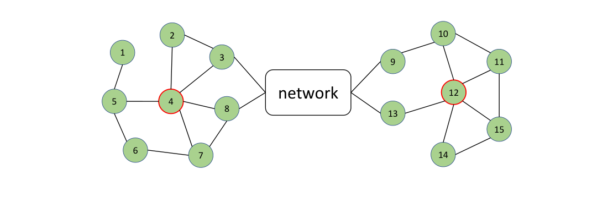
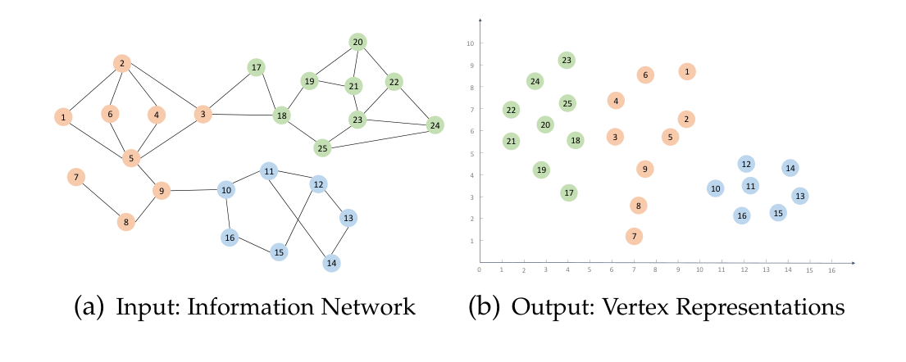
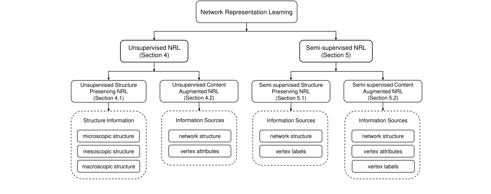
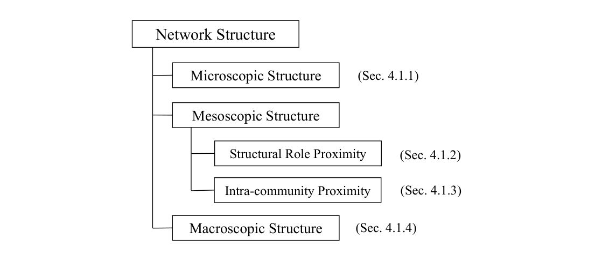
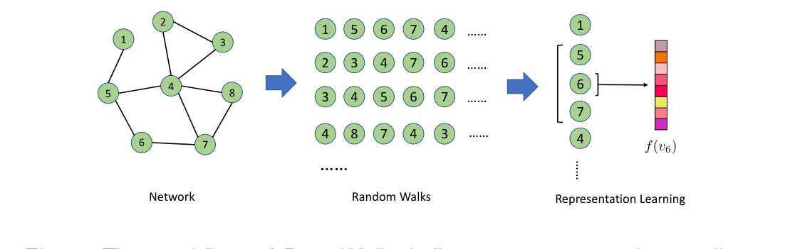
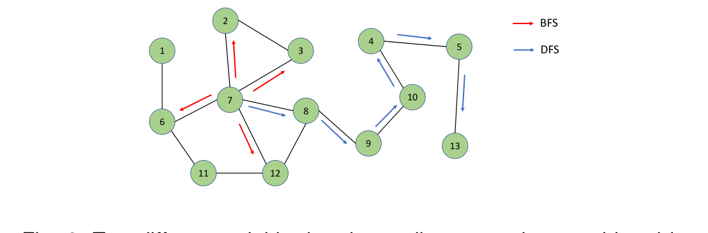

# 网络表示学习综述

> Daokun Zhang, Jie Yin, Xingquan Zhu（IEEE 高级会员）, Chengqi Zhang（IEEE 高级会员）| 悉尼科技大学、悉尼大学、佛罗里达大西洋大学本文是网络表示学习（NRL，Network Representation Learning）领域最全面的综述之一，系统回顾了 2018 年前该领域在数据挖掘与机器学习方向的代表性工作。核心内容是——**首次提出"两类 × 两子类 + 五类方法学"的多维分类体系，把 30 多个算法按"用没用标签""是否融合内容"和"矩阵分解/随机游走/边建模/深度学习/混合"三条轴线一次性理清**。

核心内容：

- 提出新分类法：无监督（仅网络结构或结构+内容）与半监督（结构或结构+内容+标签）两大设置
- 按信息源与算法设计，将现有 NRL 工作划分为矩阵分解、随机游走、边建模、深度学习、混合五大方法学类别
- 覆盖 4.1 微观/介观/宏观三类网络结构保持方法，以及 TADW、HSCA、pRBM 等内容增强方法
- 系统总结评估协议：公开基准数据集、评估方法、开源算法、七算法实测对比与复杂度分析
- 提出任务依赖性、理论、动态性、可扩展性、异构性与语义、鲁棒性六大未来研究方向关键发现：

- 结构保持算法中，5% 训练率时 node2vec 分类整体最佳；50% 时 M-NMF 的 Micro-F1 最优、DeepWalk 的 Macro-F1 最优
- 属性化网络（Citeseer/Cora/Facebook）上内容增强 NRL 显著优于仅结构保持算法，证明顶点属性对学习信息更丰富的表示贡献巨大
- UPP-SNE 用非线性映射构建表示，5% 训练率下最优；而 TADW 在 50% 训练率下整体分类性能最佳
- HSCA 的同质性保持目标在 Facebook 上需降权，说明同质性较弱网络上正则项权重必须重新调节

---

## 摘要

随着信息技术的广泛使用，信息网络正日益盛行，用以刻画各学科领域的复杂关系，如社交网络、引文网络、电信网络和生物网络等。对这些网络进行分析能揭示社会生活的不同侧面，例如社会结构、信息传播和通信模式。然而在现实中，信息网络的规模往往使得网络分析任务在计算上代价高昂甚至难以求解。网络表示学习（NRL，Network Representation Learning）最近被提出作为一种新的学习范式，通过保持网络拓扑结构、顶点内容及其他辅助信息，将网络顶点嵌入到低维向量空间中。这使得原始网络在新的向量空间中易于处理，便于进一步分析。在本文综述中，我们对数据挖掘与机器学习领域当前的网络表示学习文献进行了全面回顾。我们根据底层学习机制、需要保持的网络信息以及算法设计与方法学，提出了新的分类体系来对最先进的网络表示学习技术进行分类和总结。我们总结了用于验证网络表示学习的评估协议，包括已发布的基准数据集、评估方法和开源算法。我们还进行了实证研究，在常见数据集上比较代表性算法的性能，并分析其计算复杂度。最后，我们提出了有前景的研究方向以促进未来的研究。

**关键词**：Information networks, graph mining, network representation learning, network embedding

## 1. 引言

信息网络正以社交网络、引文网络、电信网络和生物网络等形式，在大量真实世界应用中变得无处不在。这些网络的规模从数百个顶点到数百万甚至数十亿个顶点不等 [1]。分析信息网络在众多学科中的各种新兴应用中起着至关重要的作用。例如，在社交网络中，将用户划分为有意义的社交群体对许多重要任务很有用，如用户搜索、定向广告和推荐；在通信网络中，检测社区结构有助于更好地理解谣言传播过程；在生物网络中，推断蛋白质之间的相互作用有助于为疾病开发新的治疗方法。然而，对这些网络的高效分析在很大程度上依赖于网络的表示方式。通常，使用离散的邻接矩阵来表示网络，这只能捕获顶点之间的邻居关系。实际上，这种简单的表示无法体现更复杂、更高阶的结构关系，例如路径、频繁子结构等。因此，这种传统常规做法往往使许多网络分析任务在大规模网络上计算代价高昂且难以求解。以社区检测为例，大多数现有算法都涉及对矩阵 [2] 进行谱分解，其时间复杂度至少与顶点数成二次方关系。这种计算开销使得算法很难扩展到拥有数百万顶点的大规模网络。

最近，网络表示学习（NRL）引起了大量研究兴趣。NRL 旨在学习网络顶点的 latent、低维表示，同时保持网络拓扑结构、顶点内容和其他辅助信息。学习到新的顶点表示后，网络分析任务就可以通过将传统的基于向量的机器学习算法应用到新的表示空间，轻松而高效地完成。这避免了为直接在原始网络上运行的复杂算法推导的必要性。

与网络表示学习相关的早期工作可以追溯到 21 世纪初，当时研究者们将图嵌入算法作为降维技术的一部分提出。给定一组 i.i.d.（independent and identically distributed，独立同分布）数据点作为输入，图嵌入算法首先计算两两数据点之间的相似度来构建亲和图，例如 k 近邻图，然后将亲和图嵌入到维数低得多的新空间中。其思想是找到隐藏在由所构建图反映的高维数据几何中的低维流形结构，使得相连的顶点在新嵌入空间中彼此保持更近。Isomap [3]、局部线性嵌入（LLE，Locally Linear Embedding）[4] 和拉普拉斯特征映射（Laplacian Eigenmap）[5] 就是基于这一原理的算法示例。然而，图嵌入算法主要针对 i.i.d. 数据为降维目的而设计。这些算法大多数通常至少具有与顶点数成二次方的时间复杂度，因此应用于大规模网络时，可扩展性是一个主要问题。

自 2008 年以来，大量研究工作已转向开发直接针对复杂信息网络设计的、高效且可扩展的表示学习技术。许多 NRL 算法，例如 [6]、[7]、[8]、[9]，已被提出来嵌入现有网络，并在各种应用上表现出良好的性能。这些算法将网络嵌入到一个 latent、低维空间中，在保持结构邻近和属性亲和的同时，原始网络的顶点可以被表示为低维向量。由此产生的紧凑、低维向量表示可以作为特征应用到任何基于向量的机器学习算法上。这为一系列网络分析任务在新向量空间中轻松高效地解决铺平了道路，例如节点分类 [10]、[11]、链路预测 [12]、[13]、聚类 [2]、推荐 [14]、[15]、相似性搜索 [16] 和可视化 [17]。使用向量表示来表征复杂网络现在已逐步推广到许多其他领域，例如城市计算中的兴趣点推荐 [15]，以及知识工程与数据库系统中的知识图谱搜索 [18]。

### 1.1 挑战

尽管潜力巨大，网络表示学习本质上仍然很困难，并面临若干关键挑战，我们总结如下。

**结构保持（Structure-preserving）**：为了学习信息丰富的顶点表示，网络表示学习应保持网络结构，使得在原始结构空间中相似/接近的顶点，在校学习到的向量空间中也应被表示为相似。然而，正如 [19]、[20] 所述，顶点之间的结构级相似性不仅体现在局部邻域结构上，还体现在更全局的社区结构上。因此，在网络表示学习中，局部和全局结构应同时被保持。

**内容保持（Content-preserving）**：除了结构信息，许多网络的顶点还附带丰富的属性内容。顶点属性不仅对网络的形成产生巨大影响，还为衡量顶点之间的属性级相似性提供了直接证据。因此，如果恰当地引入属性内容，它可以补偿网络结构，从而生成信息更丰富的顶点表示。然而，由于这两种信息源的异构性，如何有效利用顶点属性使其补偿而不是损害网络结构，仍是一个开放的研究问题。

**数据稀疏（Data sparsity）**：对于许多真实世界的信息网络，由于隐私或法律限制，数据稀疏问题同时存在于网络结构和顶点内容中。在结构层面，有时只能观察到非常有限的链路，使得难以发现那些未被显式连接的顶点之间的结构级相关性。在顶点内容层面，许多顶点属性值通常是缺失的，这增加了衡量内容级顶点相似度的难度。因此，网络表示学习要克服数据稀疏问题颇具挑战性。

**可扩展性（Scalability）**：真实世界的网络，尤其是社交网络，由数百万或数十亿个顶点组成。网络的大规模不仅对传统网络分析任务构成挑战，也对新生的网络表示学习任务构成挑战。如果不加以特别关注，在有限计算资源下学习大规模网络的顶点表示可能需要数月时间，这在实践中是不可行的，尤其是在涉及大量调参试验的情况下。因此，有必要设计能够高效学习顶点表示、同时保证大规模网络有效性（effectiveness）的 NRL 算法。

### 1.2 我们的贡献

本综述对最先进的网络表示学习技术进行了全面的、最新的回顾，重点关注顶点表示的学习。它不仅涵盖早期关于保持网络结构的工作，还涵盖最近涌现的、将顶点内容和/或顶点标签作为辅助信息纳入网络嵌入学习过程的新研究。通过这样做，我们希望为研究社区提供一个有用的指南，以更好地理解（1）网络表示学习方法的新分类体系，（2）不同类型网络嵌入方法的特性、独特之处及其定位，以及（3）刺激该领域研究的资源和未来挑战。特别是，本综述有四大贡献：

- **我们提出新的分类体系**，根据底层学习机制、需要保持的网络信息以及算法设计和方法学，对现有的网络表示学习技术进行分类。因此，本综述为更好地理解现有工作提供了新的视角。
- **我们提供了对最先进的网络表示学习算法详细而深入的研究。** 与现有的图嵌入综述相比，我们不仅回顾了更全面的网络表示学习研究工作，还提供了多方面的算法视角来理解不同算法的优缺点。
- **我们总结了用于验证网络表示学习技术的评估协议**，包括已发布的基准数据集、评估方法和开源算法。我们还进行了实证研究来比较代表性算法的性能，并进行了详细的计算复杂度分析。
- **为促进未来研究，我们提出了六个有前景的网络表示学习未来研究方向**，并总结了当前研究工作的局限性，为每个方向提出了新的研究思路。

### 1.3 相关综述及其差异

近期文献中存在一些与图嵌入和表示学习相关的综述。第一个是 [21]，它回顾了网络表示学习的几种代表性方法，并探讨了表示学习概念及其与相关领域（如降维、深度学习和网络科学）联系的一些关键概念。[22] 从方法论的角度对代表性网络嵌入算法进行分类。[23] 在编码器-解码器框架内回顾了几种嵌入单个顶点以及子图的表示学习方法，尤其是受深度学习启发的方法。然而，这些综述回顾的大多数嵌入算法主要保持网络结构。最近，[24]、[25] 扩展到覆盖利用其他辅助信息（如顶点属性和/或顶点标签）来引导表示学习的工作。

总之，现有综述存在以下局限性。首先，它们通常只关注单一的单一分类体系来对现有工作进行分类。它们都没有提供多方面的视角来分析最先进的网络表示学习技术并比较其优缺点。其次，现有综述没有对算法复杂度和优化方法进行深入分析，也没有提供实证结果来比较不同算法的性能。第三，缺乏对可用资源（如公开可用的数据集和开源算法）的总结，以促进未来研究。在这项工作中，我们提供了最全面的综述来弥合这一差距。我们相信本综述将帮助研究者和实践者深入理解不同方法，并提供丰富资源以促进该领域的未来研究。

### 1.4 本综述的组织结构

本综述的其余部分组织如下。第 2 节提供理解问题和接下来讨论的模型所需的预备知识和定义。第 3 节提出新的分类体系来对现有的网络表示学习技术进行分类。第 4 节和第 5 节分别回顾两大类别中的代表性算法。第 6 节讨论了网络表示学习的一系列成功应用。在第 7 节，我们总结用于验证网络表示学习的评估协议，并比较算法性能和复杂度。我们在第 8 节讨论潜在的研究方向，并在第 9 节对综述进行总结。

## 2. 记法与定义

在本节中，作为预备知识，我们首先定义接下来讨论模型时使用的重要术语，然后给出网络表示学习问题的形式化定义。为便于表述，我们首先定义贯穿本综述使用的一系列常见记法，如表 1 所示。

| 符号 | 含义 |
|------|------|
| $G$ | 给定的信息网络 |
| $V$ | 给定信息网络中的顶点集合 |
| $E$ | 给定信息网络中的边集合 |
| $\|V\|$ | 顶点数量 |
| $\|E\|$ | 边数量 |
| $m$ | 顶点属性数量 |
| $d$ | 学习到的顶点表示的维度 |
| $X \in \mathbb{R}^{\|V\| \times m}$ | 顶点属性矩阵 |
| $Y$ | 顶点标签集合 |
| $\|Y\|$ | 顶点标签数量 |
| $Y \in \mathbb{R}^{\|V\| \times \|Y\|}$ | 顶点标签矩阵 |

表 1：常用记法汇总

**定义 1（信息网络，Information Network）** 信息网络定义为 $G = (V, E, X, Y)$ ，其中 $V$ 表示顶点集合， $|V|$ 表示网络 $G$ 中的顶点数量。 $E \subseteq (V \times V)$ 表示连接顶点的边集合。 $X \in \mathbb{R}^{|V| \times m}$ 是顶点属性矩阵，其中 $m$ 是属性数量，元素 $X_{ij}$ 是第 $i$ 个顶点在第 $j$ 个属性上的取值。 $Y \in \mathbb{R}^{|V| \times |Y|}$ 是顶点标签矩阵，其中 $Y$ 是标签集合。如果第 $i$ 个顶点具有第 $k$ 个标签，则元素 $Y_{ik} = 1$ ；否则 $Y_{ik} = -1$ 。由于隐私问题或信息获取困难，顶点属性矩阵 $X$ 通常稀疏，顶点标签矩阵 $Y$ 通常是不可观测的或部分可观测的。对于每个 $(v_i, v_j) \in E$ ，如果信息网络 $G$ 是无向的，则我们有 $(v_j, v_i) \in E$ ；如果 $G$ 是有向的，则 $(v_j, v_i)$ 未必属于 $E$ 。1每条边 $(v_i, v_j) \in E$ 还关联一个权重 $w_{ij}$ ，如果信息网络是二元的（无权的），则该权重等于 1。

直观地说，信息网络的产生并非无根据，而是由某些 latent 机制引导或支配的。虽然这些 latent 机制几乎无法知晓，但它们可以通过信息网络中广泛存在的某些网络属性反映出来。因此，常见的网络属性对于学习能够准确解读信息网络的信息丰富顶点表示至关重要。下面，我们介绍几种常见的网络属性。

**定义 2（一阶邻近，First-order Proximity）** 一阶邻近是两个相连顶点之间的局部两两邻近性 [1]。对于每个顶点对 $(v_i, v_j)$ ，如果 $(v_i, v_j) \in E$ ，则 $v_i$ 和 $v_j$ 之间的一阶邻近为 $w_{ij}$ ；否则， $v_i$ 和 $v_j$ 之间的一阶邻近为 0。一阶邻近捕获了顶点之间的直接邻居关系。

**定义 3（二阶邻近与高阶邻近，Second-order Proximity and High-order Proximity）** 二阶邻近捕获每对顶点之间的 2 步关系 [1]。对于每个顶点对 $(v_i, v_j)$ ，二阶邻近由两个顶点共享的公共邻居数量决定，这也可以等价地由从 $v_i$ 到 $v_j$ 的 2 步转移概率来衡量。与二阶邻近相比，高阶邻近 [26] 捕获更全局的结构，它探索每对顶点之间的 $k$ 步（ $k \geq 3$ ）关系。对于每个顶点对 $(v_i, v_j)$ ，高阶邻近由从顶点 $v_i$ 到顶点 $v_j$ 的 $k$ 步（ $k \geq 3$ ）转移概率来衡量，这也可以通过从 $v_i$ 到 $v_j$ 的 $k$ 步（ $k \geq 3$ ）路径数量来反映。二阶邻近和高阶邻近捕获了一对未直接相连但具有相似结构上下文的顶点之间的相似性。

1除非另有明确说明，本综述讨论的网络默认为无向网络。

图 1：结构角色邻近的一个示例性说明。顶点 4 和顶点 12 具有相似的结构角色，但彼此相距很远。

**定义 4（结构角色邻近，Structural Role Proximity）** 结构角色邻近刻画了在其邻域中扮演相似角色的顶点之间的相似性，例如链的端点、星形的中心以及两个社区之间的桥梁。在通信和交通网络中，顶点的结构角色对刻画它们的属性很重要。与捕获网络中彼此接近顶点之间相似性的一阶、二阶和高阶邻近不同，结构角色邻近试图发现相距较远但共享等价结构角色的顶点之间的相似性。如图 1 所示，顶点 4 和顶点 12 彼此相距很远，但它们扮演相同的结构角色——星形的中心。因此，它们具有很高的结构角色邻近性。

**定义 5（社区内邻近，Intra-community Proximity）** 社区内邻近是同一社区内顶点之间的两两邻近性。许多网络具有社区结构，其中同一社区内的顶点-顶点连接是密集的，而与社区外部顶点的连接是稀疏的 [27]。作为一种聚类结构，社区保持了其内部顶点共同的某些属性。例如，在社交网络中，社区可能代表按兴趣或背景划分的社交群体；在引文网络中，社区可能代表同一主题的相关论文。社区内邻近通过保持同一社区内顶点共享的共同属性来捕获这种聚类结构 [28]。

**顶点属性（Vertex attribute）**：除了网络结构，顶点属性可以提供直接证据来衡量顶点之间的内容级相似性。如 [7]、[20]、[29] 所示，顶点属性和网络结构可以互相帮助过滤噪声信息，并通过互补共同学习信息丰富的顶点表示。

**顶点标签（Vertex label）**：顶点标签提供了关于每个网络顶点到某些类或组的语义分类的直接信息。顶点标签受到网络结构和顶点属性的强烈影响，并与它们固有地相关 [30]。虽然顶点标签通常是部分观测的，但当与网络结构和顶点属性结合时，它们鼓励网络结构和顶点属性一致的标注，并帮助学习信息丰富且具有判别性的顶点表示。

**定义 6（网络表示学习，NRL）** 给定信息网络 $G = (V, E, X, Y)$ ，通过整合 $E$ 中的网络结构、 $X$ 中的顶点属性以及 $Y$ 中的顶点标签（如果可用），网络表示学习任务是学习一个映射函数 $f: v \longmapsto r_v \in \mathbb{R}^d$ ，其中 $r_v$ 是顶点 $v$ 的学习到的向量表示， $d$ 是学习到的表示的维度。变换 $f$ 保持原始网络信息，使得原始网络中相似的两个顶点在校学习的向量空间中也应被表示为相似。

学习到的顶点表示应满足以下条件：（1）**低维**，即 $d \ll |V|$ ，换言之，学习到的顶点表示的维度应远小于原始邻接矩阵表示的维度，以保证内存效率和后续网络分析任务的可扩展性；（2）**信息丰富**，即学习到的顶点表示应保持由网络结构、顶点属性和顶点标签（如果可用）反映的顶点邻近性；（3）**连续**，即学习到的顶点表示应具有连续的实数值，以支持后续网络分析任务，如顶点分类、顶点聚类或异常检测，并具有平滑的决策边界以保证这些任务的鲁棒性。

图 2：网络表示学习的概念视图。(a) 中的顶点使用其 ID 索引，并根据其社区信息进行颜色编码。(b) 中的网络表示学习将所有顶点变换到二维向量空间，使得具有结构邻近性的顶点在新嵌入空间中彼此接近。

图 2 使用一个玩具网络演示了网络表示学习的概念视图。在这种情况下，只考虑网络结构来学习顶点表示。给定图 2(a) 所示的信息网络，NRL 的目标是将所有网络顶点嵌入到低维空间，如图 2(b) 所示。在嵌入空间中，具有结构邻近性的顶点被表示为彼此接近。例如，由于顶点 7 和顶点 8 直接相连，一阶邻近强制它们在嵌入空间中彼此接近。虽然顶点 2 和顶点 5 没有直接相连，但它们也被嵌入得彼此靠近，因为它们具有很高的二阶邻近性，这由这两个顶点共享的 4 个公共邻居反映。顶点 20 和顶点 25 没有直接相连，也没有共享公共的直接邻居。然而，它们通过许多 $k$ 步（ $k \geq 3$ ）路径相连，这证明它们具有高阶邻近性。因此，顶点 20 和顶点 25 也具有接近的嵌入。与其他顶点不同，顶点 10–16 在原始网络中明显属于同一社区。这种社区内邻近性保证了这些顶点的像（images）也在嵌入空间中表现出清晰的聚类结构。

## 3. 分类体系

在本节中，我们提出一个新的分类体系来对文献中现有的网络表示学习技术进行分类，如图 3 所示。分类体系的第一层基于学习时是否提供顶点标签。据此，我们将网络表示学习分为两组：无监督网络表示学习和半监督网络表示学习。

图 3：用于总结网络表示学习技术的分类体系。根据学习时顶点标签是否可用，我们将网络表示学习分为两组：无监督网络表示学习和半监督网络表示学习。对每一组，我们根据表示学习是仅基于网络拓扑结构，还是由节点内容信息增强，进一步将方法分为两个子组。

**无监督网络表示学习。** 在这种设置下，没有为学习顶点表示提供标记顶点。因此，网络表示学习被视为一种独立于后续学习的通用任务，顶点表示以无监督的方式学习。

大多数现有的 NRL 算法属于这一类别。在新的嵌入空间学习到顶点表示后，它们被作为特征提供给任何基于向量的算法以用于各种学习任务。无监督 NRL 算法可以根据可用于学习的网络信息类型进一步分为两个子组：只保持网络结构的无监督结构保持方法，以及结合顶点属性和网络结构来学习联合顶点嵌入的无监督内容增强方法。

**半监督网络表示学习。** 在这种情况下，存在一些标记顶点用于表示学习。由于顶点标签在确定每个顶点的分类方面起着至关重要的作用，并与网络结构和顶点属性有很强的相关性，因此提出半监督网络表示学习是为了利用网络中可用的顶点标签来寻求更有效的联合向量表示。

在这种设置下，网络表示学习与监督学习任务（如顶点分类）耦合。通常制定一个统一的目标函数来同时优化顶点表示的学习和网络顶点的分类。因此，学习到的顶点表示相对于不同类别既可以是信息丰富的，又可以是具有判别性的。半监督 NRL 算法也可以分为两个子组：半监督结构保持方法和半监督内容增强方法。

表 2 根据所有 NRL 算法进行表示学习所使用的信息源对它们进行了总结。一般来说，有三种主要类型的信息源：网络结构、顶点属性和顶点标签。大多数无监督 NRL 算法专注于保持网络结构来学习顶点表示，只有少数算法（例如 TADW [7]、HSCA [8]）尝试利用顶点属性。相比之下，在半监督学习设置下，一半的算法打算将顶点属性与网络结构和顶点标签结合起来学习顶点表示。在这两种设置下，大多数算法专注于保持微观结构，而很少有算法（例如 M-NMF [28]、DP [41]、HARP [42]）试图利用介观和宏观结构。

| 类别 | 算法 | 网络结构（微观） | 网络结构（结构角色邻近） | 网络结构（社区内邻近） | 网络结构（宏观） | 顶点属性 | 顶点标签 |
|------|------|:---:|:---:|:---:|:---:|:---:|:---:|
| 无监督 | Social Dim. [31], [32], [33] | | | ✓ | | | |
| 无监督 | DeepWalk [6] | ✓ | | | | | |
| 无监督 | LINE [1] | ✓ | | | | | |
| 无监督 | GraRep [26] | ✓ | | | | | |
| 无监督 | DNGR [9] | ✓ | | | | | |
| 无监督 | SDNE [19] | ✓ | | | | | |
| 无监督 | node2vec [34] | ✓ | | | | | |
| 无监督 | HOPE [35] | ✓ | | | | | |
| 无监督 | APP [36] | ✓ | | | | | |
| 无监督 | M-NMF [28] | ✓ | | ✓ | | | |
| 无监督 | GraphGAN [37] | ✓ | | | | | |
| 无监督 | struct2vec [38] | | ✓ | | | | |
| 无监督 | GraphWave [39] | | ✓ | | | | |
| 无监督 | SNS [40] | ✓ | ✓ | | | | |
| 无监督 | DP [41] | ✓ | | | ✓ | | |
| 无监督 | HARP [42] | ✓ | | | ✓ | | |
| 无监督 | TADW [7] | ✓ | | | | ✓ | |
| 无监督 | HSCA [8] | ✓ | | | | ✓ | |
| 无监督 | pRBM [29] | ✓ | | | | ✓ | |
| 无监督 | UPP-SNE [43] | ✓ | | | | ✓ | |
| 无监督 | PPNE [44] | ✓ | | | | ✓ | |
| 半监督 | DDRW [45] | ✓ | | | | | ✓ |
| 半监督 | MMDW [46] | ✓ | | | | | ✓ |
| 半监督 | TLINE [47] | ✓ | | | | | ✓ |
| 半监督 | GENE [48] | ✓ | | | | | ✓ |
| 半监督 | SemiNE [49] | ✓ | | | | | ✓ |
| 半监督 | TriDNR [50] | ✓ | | | | ✓ | ✓ |
| 半监督 | LDE [51] | ✓ | | | | ✓ | ✓ |
| 半监督 | DMF [8] | ✓ | | | | ✓ | ✓ |
| 半监督 | Planetoid [52] | ✓ | | | | ✓ | ✓ |
| 半监督 | LANE [30] | ✓ | | | | ✓ | ✓ |

表 2：根据表示学习所使用的信息源对 NRL 算法进行的总结

从算法角度，上述两种不同设置下的网络表示学习方法可以总结为五类。

**1) 基于矩阵分解的方法。** 基于矩阵分解的方法以矩阵的形式表示网络顶点之间的连接，并使用矩阵分解获得嵌入。构造不同类型的矩阵来保持网络结构，例如 $k$ 步转移概率矩阵、模块度矩阵或顶点-上下文矩阵 [7]。通过假设这种高维顶点表示只受少量 latent 因子的影响，使用矩阵分解将高维顶点表示嵌入到一个保持结构的 latent、低维空间中。根据目标函数的不同，不同的算法采用不同的分解策略。例如，在模块度最大化方法 [31] 中，对模块度矩阵执行特征分解，以学习指示社区的顶点表示 [53]；在 TADW 算法 [7] 中，在顶点-上下文矩阵上执行归纳矩阵分解 [54]，以在学习顶点表示的同时保持顶点文本特征和网络结构。虽然基于矩阵分解的方法已被证明在学习信息丰富的顶点表示方面有效，但可扩展性是主要瓶颈，因为对具有数百万行和列的矩阵执行分解既内存密集又计算昂贵，有时甚至不可行。

**2) 基于随机游走的方法。** 为了可扩展的顶点表示学习，利用随机游走来捕获顶点之间的结构关系。通过执行截断的随机游走，信息网络被转换为一系列顶点序列，其中顶点-上下文对的出现频率衡量它们之间的结构距离。借鉴词表示学习的思想 [55]、[56]，然后通过使用每个顶点预测其上下文来学习顶点表示。DeepWalk [6] 是使用随机游走学习顶点表示的开创性工作。node2vec [34] 进一步利用有偏随机游走策略来捕获更灵活的上下文结构。

作为仅保持结构版本的扩展，像 DDRW [45]、GENE [48] 和 SemiNE [49] 这样的算法将顶点标签与网络结构结合以增强表示学习，PPNE [44] 引入顶点属性，而 TriDNR [50] 使用顶点标签和属性两者来增强模型。由于这些模型可以以在线方式训练，它们具有很大的扩展潜力。

**3) 基于边建模的方法。** 与使用矩阵或随机游走捕获网络结构的方法不同，基于边建模的方法直接从顶点-顶点连接学习顶点表示。为了捕获一阶和二阶邻近，LINE [1] 分别在相连顶点上建模一个联合概率分布和一个条件概率分布。为了学习链接文档的表示，LDE [51] 通过最大化相连文档之间的条件概率来建模文档-文档关系。pRBM [29] 通过使相连顶点的隐藏 RBM 表示彼此相似，将 RBM [57] 模型适配到链接数据。GraphGAN [37] 采用生成对抗网络（GAN，Generative Adversarial Nets）[58] 来精确建模顶点连通概率。与基于矩阵分解和随机游走的方法相比，基于边建模的方法更高效。然而，由于这些方法只考虑可观测的顶点连接信息，它们无法捕获全局网络结构。

**4) 基于深度学习的方法。** 为了提取复杂的结构特征并学习深度、高度非线性的顶点表示，深度学习技术 [59]、[60] 也被应用于网络表示学习。例如，DNGR [9] 将堆叠去噪自编码器（SDAE，Stacked Denoising Autoencoders）[60] 应用于高维矩阵表示，以学习深度低维顶点表示。SDNE [19] 使用半监督深度自编码器模型 [59] 来建模网络结构中的非线性。基于深度学习的方法能够捕获网络中的非线性，但其计算时间成本通常很高。传统的深度学习架构是为 1D、2D 或 3D 欧几里得结构化数据设计的，但需要在像图这样的非欧几里得结构化数据上开发高效的解决方案。

**5) 混合方法。** 一些其他方法使用上述方法的混合来学习顶点表示。例如，DP [41] 用度惩罚原则增强谱嵌入 [5] 和 DeepWalk [6]，以保持宏观的无标度属性。HARP [42] 利用基于随机游走的方法（DeepWalk [6] 和 node2vec [34]）和基于边建模的方法（LINE [1]），从小的采样网络到原始网络学习顶点表示。

我们在表 3 中总结了所有五类网络表示学习技术，并比较了它们的优缺点。

| 方法学 | 算法 | 优点 | 缺点 |
|--------|------|------|------|
| 矩阵分解 | Social Dim. [31], [32], GraRep [26], HOPE [35], GraphWave [39], M-NMF [28], TADW [7], HSCA [20], MMDW [46], DMF [8], LANE [30] | 捕获全局结构 | 时间和内存成本高 |
| 随机游走 | DeepWalk [6], node2vec [34], APP [36], DDRW [45], GENE [48], TriDNR [50], UPP-SNE [43], struct2vec [38], SNS [40], PPNE [44], SemiNE [49] | 相对高效 | 只能捕获局部结构 |
| 边建模 | LINE [1], TLINE [47], LDE [51], pRBM [29], GraphGAN [37] | 高效 | 只能捕获局部结构 |
| 深度学习 | DNGR [9], SDNE [19] | 捕获非线性 | 时间成本高 |
| 混合 | DP [41], HARP [42], Planetoid [52] | 捕获全局结构 | |

表 3：从方法学角度对 NRL 算法的分类

## 4. 无监督网络表示学习

在本节中，我们回顾无监督网络表示学习方法，按照图 3 概述的结构分为两小节。之后，我们总结这些方法的关键特征，并比较两类方法之间的差异。

### 4.1 无监督结构保持网络表示学习

结构保持网络表示学习指的是这样一类方法：它们旨在保持网络结构，即在原始网络空间中彼此接近的顶点，在新的嵌入空间中应被表示为相似的。在这一类别中，研究工作集中在设计各种模型，尽可能多地捕获原始网络传达的结构信息。

图 4：网络结构的分类。

我们将用于学习顶点表示的网络结构总结为三种类型：（i）微观结构，包括局部邻近性，即一阶、二阶和高阶邻近；（ii）介观结构，捕获结构角色邻近和社区内邻近；（iii）宏观结构，捕获全局网络属性，如无标度属性或小世界属性。以下各小节根据我们对网络结构的分类进行组织，如图 4 所示。

#### 4.1.1 微观结构保持的 NRL

这一类的 NRL 算法旨在保持其邻域中直接或间接相连顶点之间的局部结构信息，包括一阶、二阶和高阶邻近。一阶邻近捕获同配性（homophily），即直接相连的顶点往往彼此相似，而二阶和高阶邻近捕获共享公共邻居的顶点之间的相似性。大多数保持结构的 NRL 算法都属于这一类。

图 5：DeepWalk 的工作流程。它首先从给定网络生成随机游走序列，然后应用 Skip-Gram 模型学习顶点表示。

**DeepWalk。** DeepWalk [6] 将利用句子中词上下文学习词的 latent 表示的 Skip-Gram 模型 [55]、[56] 的思想，通过将自然语言句子与短随机游走序列进行类比，推广到网络中 latent 顶点表示的学习。DeepWalk 的工作流程见图 5。给定长度为 $L$ 的随机游走序列 $\{v_1, v_2, \cdots, v_L\}$ ，沿用 Skip-Gram，DeepWalk 通过学习用顶点 $v_i$ 预测其上下文顶点来学习 $v_i$ 的表示，这通过以下优化问题实现：

$$
\min_f -\log Pr(\{v_{i-t}, \cdots, v_{i+t}\} \setminus v_i | f(v_i)) \qquad (1)
$$

其中 $\{v_{i-t}, \cdots, v_{i+t}\} \setminus v_i$ 是顶点 $v_i$ 在 $t$ 窗口大小内的上下文顶点。作条件独立性假设，概率 $Pr(\{v_{i-t}, \cdots, v_{i+t}\} \setminus v_i|f(v_i))$ 近似为：

$$
Pr(\{v_{i-t}, \cdots, v_{i+t}\} \setminus v_i|f(v_i)) = \prod_{j=i-t, j \neq i}^{i+t} Pr(v_j|f(v_i)) \qquad (2)
$$

依据 DeepWalk 的学习架构，在随机游走序列中拥有相似上下文顶点的顶点，在新的嵌入空间中也应被表示得彼此接近。考虑到随机游走序列中的上下文顶点描述了邻域结构，DeepWalk 实际上使共享相似邻居（直接或间接）的顶点在嵌入空间中表示得彼此接近，因此二阶和高阶邻近被保持。

**大规模信息网络嵌入（LINE，Large-scale Information Network Embedding）。** 与利用随机游走捕获网络结构不同，LINE [1] 通过显式建模一阶和二阶邻近来学习顶点表示。为了保持一阶邻近，LINE 最小化以下目标函数：

$$
O_1 = d(\hat{p}_1(\cdot, \cdot), p_1(\cdot, \cdot)) \qquad (3)
$$

对于每个满足 $(v_i, v_j) \in E$ 的顶点对 $v_i$ 和 $v_j$ ， $p_1(\cdot, \cdot)$ 是由它们的 latent 嵌入 $r_{v_i}$ 和 $r_{v_j}$ 建模的联合分布。 $\hat{p}_1(v_i, v_j)$ 是它们之间的经验分布。 $d(\cdot, \cdot)$ 是两个分布之间的距离。

为了保持二阶邻近，LINE 最小化以下目标函数：

$$
O_2 = \sum_{v_i \in V} \lambda_i d(\hat{p}_2(\cdot|v_i), p_2(\cdot|v_i)) \qquad (4)
$$

其中 $p_2(\cdot|v_i)$ 是由顶点嵌入为每个 $v_i \in V$ 建模的上下文条件分布， $\hat{p}_2(\cdot|v_i)$ 是经验条件分布， $\lambda_i$ 是顶点 $v_i$ 的声望（prestige）。这里，顶点上下文由其邻居决定，即对于每个 $v_j$ ，当且仅当 $(v_i, v_j) \in E$ 时， $v_j$ 是 $v_i$ 的上下文。

通过最小化这两个目标函数，LINE 学习两种分别保持一阶和二阶邻近的顶点表示，并将它们的拼接（concatenation）作为最终的顶点表示。

**GraRep。** 沿用 DeepWalk [6] 的思想，GraRep [26] 扩展 skip-gram 模型以捕获高阶邻近，即共享公共 $k$ 步邻居（ $k \geq 1$ ）的顶点应具有相似的 latent 表示。具体来说，对于每个顶点，GraRep 将其 $k$ 步邻居（ $k \geq 1$ ）定义为上下文顶点，并且对于每个 $1 \leq k \leq K$ ，为了学习 $k$ 步顶点表示，GraRep 采用 skip-gram 的矩阵分解版本：

$$
[U^k, \Sigma^k, V^k] = SVD(X^k) \qquad (5)
$$

其中 $X^k$ 是对数 $k$ 步转移概率矩阵。顶点 $v_i$ 的 $k$ 步表示被构造成矩阵 $U^k_d (\Sigma^k_d)^{\frac{1}{2}}$ 的第 $i$ 行，其中 $U^k_d$ 是 $U^k$ 的前 $d$ 列， $\Sigma^k_d$ 是由前 $d$ 个奇异值组成的对角矩阵。学习到 $k$ 步顶点表示后，GraRep 将它们拼接在一起作为最终的顶点表示。

**图表示深度神经网络（DNGR，Deep Neural Networks for Graph Representations）。** 为了克服截断随机游走在利用顶点上下文信息方面的弱点，即难以捕获序列边界处顶点的正确上下文信息，以及难以确定游走长度和游走次数，DNGR [9] 利用随机冲浪（random surfing）模型来捕获每对顶点之间的上下文相关性，并将其保持为 $|V|$ 维顶点表示 $X$ 。为了提取复杂特征并建模非线性，DNGR 将堆叠去噪自编码器（SDAE）[60] 应用于高维顶点表示 $X$ ，以学习深度低维顶点表示。

**结构深度网络嵌入（SDNE，Structural Deep Network Embedding）。** SDNE [19] 是一种基于深度学习的方法，使用半监督深度自编码器模型捕获网络结构中的非线性。在无监督组件中，SDNE 通过重构 $|V|$ 维顶点邻接矩阵表示来学习保持二阶邻近的顶点表示，这试图最小化：

$$
L_{2nd} = \sum_{i=1}^{|V|} \left\Vert (r^{(0)}_{v_i} - \hat{r}^{(0)}_{v_i}) \odot b_i \right\Vert_2^2 \qquad (6)
$$

其中 $r^{(0)}_{v_i} = S_{i:}$ 是输入表示， $\hat{r}^{(0)}_{v_i}$ 是重构表示。 $b_i$ 是用于对 $S$ 的非零元素施加更多重构误差惩罚的权重向量。

图 6：node2vec 考虑的两种不同邻域采样策略：BFS 和 DFS。

在监督组件中，SDNE 通过在嵌入空间中对相连顶点距离进行惩罚来引入一阶邻近。这个目标函数的损失函数定义为：

$$
L_{1st} = \sum_{i,j=1}^{|V|} S_{ij} \left\Vert r^{(K)}_{v_i} - r^{(K)}_{v_j} \right\Vert_2^2 \qquad (7)
$$

其中 $r^{(K)}_{v_i}$ 是顶点 $v_i$ 的第 $K$ 层表示， $K$ 是隐藏层数。

总之，SDNE 最小化联合目标函数：

$$
L = L_{2nd} + \alpha L_{1st} + \nu L_{reg} \qquad (8)
$$

其中 $L_{reg}$ 是防止过拟合的正则化项。求解 (8) 的最小化后，对于顶点 $v_i$ ，第 $K$ 层表示 $r^{(K)}_{v_i}$ 被作为其表示 $r_{v_i}$ 。

**node2vec。** 与为每个顶点刚性定义邻域（上下文）的策略不同，node2vec [34] 设计了一种灵活的邻域采样策略，即有偏随机游走，它在两种极端的采样策略，即广度优先采样（BFS，Breadth-first Sampling）和深度优先采样（DFS，Depth-first Sampling）之间平滑插值，如图 6 所示。node2vec 中利用的有偏随机游走可以更好地保持二阶和高阶邻近。沿用 skip-gram 架构，给定由有偏随机游走生成的邻居顶点集合 $N(v_i)$ ，node2vec 通过优化在顶点 $v_i$ 表示 $f(v_i)$ 条件下邻居顶点 $N(v_i)$ 的出现概率来学习顶点表示 $f(v_i)$ ：

$$
\max_f \sum_{v_i \in V} \log Pr(N(v_i)|f(v_i)) \qquad (9)
$$

**高阶邻近保持嵌入（HOPE，High-order Proximity Preserved Embedding）。** HOPE [35] 学习捕获有向网络非对称高阶邻近的顶点表示。在无向网络中，传递性是对称的，但在有向网络中是不对称的。例如，在有向网络中，如果存在从顶点 $v_i$ 到顶点 $v_j$ 以及从顶点 $v_j$ 到顶点 $v_k$ 的有向链路，则更可能存在从 $v_i$ 到 $v_k$ 的有向链路，但不存在从 $v_k$ 到 $v_i$ 的有向链路。

为了保持非对称传递性，HOPE 学习两个顶点嵌入向量 $U^s, U^t \in \mathbb{R}^{|V| \times d}$ ，分别称为源（source）和目标（target）嵌入向量。在从四种邻近度量（即 Katz 指数 [61]、根 PageRank（Rooted PageRank）[62]、公共邻居（Common Neighbors）和 Adamic-Adar）构造高阶邻近矩阵 $S$ 之后，HOPE 通过求解以下矩阵分解问题学习顶点嵌入：

$$
\min_{U^s, U^t} \left\Vert S - U^s \cdot U^{tT} \right\Vert_F^2 \qquad (10)
$$

**非对称邻近保持图嵌入（APP，Asymmetric Proximity Preserving graph embedding）。** APP [36] 是另一种设计用于捕获非对称邻近的 NRL 算法，它使用蒙特卡罗方法近似非对称的根 PageRank 邻近 [62]。与 HOPE 类似，APP 为每个顶点 $v_i$ 有两个表示，一个作为源角色 $r^s_{v_i}$ ，另一个作为目标角色 $r^t_{v_i}$ 。对于每条从 $v_i$ 开始并以 $v_j$ 结束的采样路径，通过最大化目标顶点 $v_j$ 在源顶点 $v_i$ 条件下的出现概率来学习表示：

$$
Pr(v_j|v_i) = \frac{\exp(r^s_{v_i} \cdot r^t_{v_j})}{\sum_{v \in V} \exp(r^s_{v_i} \cdot r^t_v)} \qquad (11)
$$

**GraphGAN。** GraphGAN [37] 通过对抗学习框架建模连通行为来学习顶点表示。受生成对抗网络（GAN）[58] 的启发，GraphGAN 通过两个组件工作：（i）生成器 $G(v|v_c)$ ，它拟合与 $v_c$ 相连的顶点在 $V$ 上的分布，并生成可能相连的顶点，以及（ii）判别器 $D(v, v_c)$ ，它为顶点对 $(v, v_c)$ 输出一个连接概率，以区分由 $G(v|v_c)$ 生成的顶点对与真实顶点对。 $G(v|v_c)$ 和 $D(v, v_c)$ 以这样一种方式竞争： $G(v|v_c)$ 试图尽可能拟合真实的连接分布并生成虚假的相连顶点对来欺骗 $D(v, v_c)$ ，而 $D(v, v_c)$ 试图提高其判别能力以区分 $G(v|v_c)$ 生成的顶点对与真实顶点对。这种竞争通过以下极小极大博弈实现：

$$
\min_{\theta_G} \max_{\theta_D} \sum_{v_c \in V} \left[ \mathbb{E}_{v \sim Pr_{true}(\cdot|v_c)} [\log D(v, v_c; \theta_D)] + \mathbb{E}_{v \sim G(\cdot|v_c; \theta_G)} [\log(1 - D(v, v_c; \theta_D))] \right] \qquad (12)
$$

这里， $G(v|v_c; \theta_G)$ 和 $D(v, v_c; \theta_D)$ 定义如下：

$$
G(v|v_c; \theta_G) = \frac{\exp(g_v \cdot g_{v_c})}{\sum_{v \neq v_c} \exp(g_v \cdot g_{v_c})}, \quad D(v, v_c; \theta_D) = \frac{1}{1 + \exp(d_v \cdot d_{v_c})} \qquad (13)
$$

其中 $g_v \in \mathbb{R}^k$ 和 $d_v \in \mathbb{R}^k$ 分别是生成器和判别器的表示向量， $\theta_D = \{d_v\}$ ， $\theta_G = \{g_v\}$ 。求解式 (12) 中的极小极大博弈后， $g_v$ 作为最终的顶点表示。

**总结：** 微观结构保持 NRL 算法保持的邻近性总结在表 4 中。这一类别中的大多数算法保持二阶和高阶邻近，而只有 LINE [1]、SDNE [19] 和 GraphGAN [37] 考虑一阶邻近。从方法学角度看，DeepWalk [6]、node2vec [34] 和 APP [36] 使用随机游走捕获顶点邻域结构。GraRep [26] 和 HOPE [35] 通过对 $|V| \times |V|$ 规模的矩阵执行分解实现，这使得它们难以扩展。LINE [1] 和 GraphGAN [37] 直接建模连通行为，而基于深度学习的方法（DNGR [9] 和 SDNE [19]）学习非线性顶点表示。

| 算法 | 一阶邻近 | 二阶邻近 | 高阶邻近 |
|------|:---:|:---:|:---:|
| DeepWalk [6] | | ✓ | ✓ |
| LINE [1] | ✓ | ✓ | |
| GraRep [26] | | ✓ | ✓ |
| DNGR [9] | | ✓ | ✓ |
| SDNE [19] | ✓ | ✓ | |
| node2vec [34] | | ✓ | ✓ |
| HOPE [35] | | ✓ | ✓ |
| APP [36] | | ✓ | ✓ |
| GraphGAN [37] | ✓ | | |

表 4：微观结构保持 NRL 算法汇总

#### 4.1.2 结构角色邻近保持的 NRL

除了局部连接模式，顶点通常在介观层面共享相似的结构角色，例如星形的中心或团的成员。结构角色邻近保持 NRL 旨在将彼此相距较远但共享相似结构角色的顶点嵌入到彼此接近。这不仅促进了下游结构角色依赖的任务，还增强了微观结构保持 NRL。

**struct2vec。** struct2vec [38] 首先将顶点结构角色相似性编码到多层图中，其中每一层的边权重由相应尺度上的结构角色差异决定。然后在多层图上执行 DeepWalk [6] 来学习顶点表示，使得多层图中彼此接近（具有高结构角色相似性）的顶点被嵌入到新表示空间中位置接近。

对于每个顶点对 $(v_i, v_j)$ ，考虑由它们在 $k$ 步内的邻居形成的 $k$ 跳邻域，它们在尺度 $k$ 上的结构距离 $D_k(v_i, v_j)$ 定义为：

$$
D_k(v_i, v_j) = D_{k-1}(v_i, v_j) + g(s(R_k(v_i)), s(R_k(v_j))) \qquad (14)
$$

其中 $R_k(v_i)$ 是 $v_i$ 的 $k$ 跳邻域中的顶点集合， $s(R_k(v_i))$ 是 $R_k(v_i)$ 中顶点的有序度序列， $g(s(R_k(v_i)), s(R_k(v_j)))$ 是有序度序列 $s(R_k(v_i))$ 和 $s(R_k(v_j))$ 之间的距离。当 $k = 0$ 时， $D_0(v_i, v_j)$ 是顶点 $v_i$ 和 $v_j$ 之间的度差。

**GraphWave。** 通过利用谱图小波扩散模式，GraphWave [39] 将顶点邻域结构嵌入到低维空间并保持结构角色邻近。其假设是，如果网络中相距较远的两个顶点共享相似的结构角色，那么从它们出发的图小波将在它们的邻居间相似地扩散。

对于顶点 $v_k$ ，其谱图小波系数 $\Psi_k$ 定义为：

$$
\Psi_k = U Diag(g_s(\lambda_1), \cdots, g_s(\lambda_{|V|})) U^T \delta_k \qquad (15)
$$

其中 $U$ 是图拉普拉斯矩阵 $L$ 的特征向量矩阵， $\lambda_1, \cdots, \lambda_{|V|}$ 是特征值， $g_s(\lambda) = \exp(-\lambda s)$ 是热核， $\delta_k$ 是 $k$ 的 one-hot 向量。通过将 $\Psi_k$ 视为概率分布， $\Psi_k$ 中的谱小波分布模式被编码到其经验特征函数中：

$$
\phi_k(t) = \frac{1}{|V|} \sum_{m=1}^{|V|} e^{it\Psi_{km}} \qquad (16)
$$

然后， $v_k$ 的低维表示通过在 $d$ 个均匀分隔的点 $t_1, t_2, \cdots, t_d$ 上对 $\phi_k(t)$ 的 2 维参数函数进行采样获得：

$$
f(v_k) = [Re(\phi_k(t_1)), \cdots, Re(\phi_k(t_d)), Im(\phi_k(t_1)), \cdots, Im(\phi_k(t_d))] \qquad (17)
$$

**结构和邻近相似性保持网络嵌入（SNS，Structural and Neighborhood Similarity preserving network embedding）。** SNS [40] 用结构角色邻近增强基于随机游走的方法。为了保持顶点结构角色，SNS 将每个顶点表示为一个 Graphlet 度向量，其中每个元素是给定顶点被相应 graphlet 轨道（orbit）触及的次数。Graphlet 度向量用于衡量顶点结构角色相似性。

给定顶点 $v_i$ ，SNS 使用其上下文顶点 $C(v_i)$ 和结构相似顶点 $S(v_i)$ 预测其存在，这通过最大化以下概率实现：

$$
Pr(v_i|C(v_i), S(v_i)) = \frac{\exp(r^{\prime}_{v_i} \cdot h_{v_i})}{\sum_{u \in V} \exp(r^{\prime}_u \cdot h_{v_i})} \qquad (18)
$$

其中 $r^{\prime}_{v_i}$ 是 $v_i$ 的输出表示， $h_{v_i}$ 是用于预测 $v_i$ 的隐藏层表示，它由 $C(v_i)$ 和 $S(v_i)$ 中每个 $u$ 的输入表示 $r_u$ 聚合而来。

**总结：** struct2vec [38] 和 GraphWave [39] 利用结构角色邻近学习便于特定结构角色依赖任务的顶点表示，例如交通网络中的顶点分类，而 SNS [40] 用结构角色邻近增强基于随机游走的微观结构保持 NRL 算法。在技术上，struct2vec 和 SNS 使用随机游走，而 GraphWave 采用矩阵分解。

#### 4.1.3 社区内邻近保持的 NRL

真实世界网络表现出的另一个有趣特征是社区结构，其中同一社区内的顶点彼此密集连接，而与来自其他社区的顶点稀疏连接。例如，在社交网络中，来自同一兴趣组或隶属关系的人往往形成社区。在引文网络中，研究主题相似的论文往往频繁互相引用。社区内保持 NRL 旨在利用刻画关键顶点属性的社区结构来学习信息丰富的顶点表示。

**学习 latent 社会维度（Learning Latent Social Dimensions）。** 基于社会维度的 NRL 算法试图通过社会行为者（actors）对若干社会维度的成员或隶属关系来构建其嵌入。为了推断这些 latent 社会维度，考虑了社交网络中的"社区"现象，即共享相似属性的社会行为者往往形成组内连接更密集的群体。因此，问题归结为一项经典的网络分析任务——社区检测，其旨在发现组内连接比组间连接更密集的一组社区。采用三种聚类技术，包括模块度最大化 [31]、谱聚类 [32] 和边聚类 [33] 来发现 latent 社会维度。每个社会维度描述一个顶点属于某个可能隶属关系的可能性。这些方法保持全局社区结构，但忽略了局部结构属性，例如一阶和二阶邻近。

**模块化非负矩阵分解（M-NMF，Modularized Nonnegative Matrix Factorization）。** M-NMF [28] 用更广泛的社区结构增强二阶和高阶邻近，使用以下目标函数学习更信息丰富的顶点嵌入 $U \in \mathbb{R}^{|V| \times d}$ ：

$$
\min_{M,U,H,C} \left\Vert S - MU^T \right\Vert_F^2 + \alpha \left\Vert H - UC^T \right\Vert_F^2 - \beta tr(H^T B H) \quad \text{s.t. } M \geq 0, U \geq 0, H \geq 0, C \geq 0, tr(H^T H) = |V| \qquad (19)
$$

其中顶点嵌入 $U$ 通过最小化 $\left\Vert S - MU^T \right\Vert_F^2$ 学习， $S \in \mathbb{R}^{|V| \times |V|}$ 是顶点两两邻近矩阵，当作为表示时捕获二阶和高阶邻近。指示社区的顶点嵌入 $H$ 通过最大化 $tr(H^T B H)$ 学习，这本质上是模块度最大化的目标函数，其中 $B$ 是模块度矩阵。对 $\left\Vert H - UC^T \right\Vert_F^2$ 的最小化通过引入社区表示矩阵 $C$ 使这两个嵌入彼此一致。

**总结：** 学习 latent 社会维度的算法 [31]、[32]、[33] 只考虑社区结构学习顶点表示，而 M-NMF [28] 将微观结构（二阶和高阶邻近）与社区内邻近整合。这些方法主要依赖矩阵分解来检测社区结构，这使得它们难以扩展。

#### 4.1.4 宏观结构保持的 NRL

宏观结构保持方法旨在从宏观视角保持某些全局网络属性。目前只有很少的近期研究为此目的开发。

**度惩罚原则（DP，Degree penalty principle）。** 许多真实世界网络表现出宏观的无标度属性，它描述了顶点度遵循长尾分布的现象，即大多数顶点连接稀疏，只有少数顶点具有密集的边。为了捕获无标度属性，[41] 提出了度惩罚原则（DP）：惩罚高顶点之间的邻近性。这个原则随后与两个 NRL 算法（即谱嵌入 [5] 和 DeepWalk [6]）结合，学习保持无标度属性的顶点表示。

**网络的层次表示学习（HARP，Hierarchical Representation Learning for Networks）。** 为了捕获网络中的全局模式，HARP [42] 采样小网络来近似全局结构。从采样网络学习到的顶点表示被作为推断原始网络顶点表示的初始化。通过这种方式，全局结构在最终表示中被保持。为了获得平滑的解，通过合并边和顶点从原始网络连续采样一系列更小的网络，并且顶点表示从最小的网络到原始网络层次化地推断回来。在 HARP 中，使用 DeepWalk [6] 和 LINE [1] 学习顶点表示。

**总结：** DP [41] 和 HARP [42] 都是通过适配现有 NRL 算法来捕获宏观结构实现的。前者试图保持无标度属性，而后者使学习到的顶点表示尊重全局网络结构。

### 4.2 无监督内容增强网络表示学习

除了网络结构，真实世界的网络通常附带丰富的内容作为顶点属性，例如网页网络中的网页、引文网络中的论文以及社交网络中的用户元数据。顶点属性提供了直接证据来衡量顶点之间的内容级相似性。因此，如果顶点属性信息被恰当地纳入学习过程，网络表示学习可以得到显著改善。最近，已经提出了几种内容增强 NRL 算法，将网络结构和顶点属性结合起来以加强网络表示学习。

#### 4.2.1 文本关联 DeepWalk（TADW，Text-Associated DeepWalk）

TADW [7] 首先证明了 DeepWalk [6] 与以下矩阵分解之间的等价性：

$$
\min_{W,H} \left\Vert M - W^T H \right\Vert_F^2 + \frac{\lambda}{2} (\left\Vert W \right\Vert_F^2 + \left\Vert H \right\Vert_F^2) \qquad (20)
$$

其中 $W$ 和 $H$ 是学习到的 latent 嵌入， $M$ 是承载 $k$ 步内每个顶点对之间转移概率的顶点-上下文矩阵。然后，通过归纳矩阵分解 [54] 引入文本特征：

$$
\min_{W,H} \left\Vert M - W^T H T \right\Vert_F^2 + \frac{\lambda}{2} (\left\Vert W \right\Vert_F^2 + \left\Vert H \right\Vert_F^2) \qquad (21)
$$

其中 $T$ 是顶点文本特征矩阵。求解 (21) 后，最终顶点表示由 $W$ 和 $HT$ 的拼接形成。

#### 4.2.2 同配性、结构、内容增强网络表示学习（HSCA，Homophily, Structure, and Content Augmented Network Representation Learning）

尽管能够整合文本特征，TADW [7] 只考虑网络顶点的结构上下文，即二阶和高阶邻近，但忽略了其学习框架中重要的同配性属性（一阶邻近）。HSCA [20] 被提出用于同时整合同配性、结构上下文和顶点内容来学习有效的网络表示。

对于 TADW，第 $i$ 个顶点 $v_i$ 的学习到的表示为 $\left[ W^T_{:i}, (H^T T_{:i})^T \right]^T$ ，其中 $W_{:i}$ 和 $T_{:i}$ 分别是 $W$ 和 $T$ 的第 $i$ 列。为了强制一阶邻近，HSCA 引入一个正则化项，在嵌入空间中强制直接相连节点之间的同配性，其形式化为：

$$
R(W, H) = \frac{1}{4} \sum_{i,j=1}^{|V|} S_{ij} \left\Vert \binom{W_{:i}}{H^T_{:i}} - \binom{W_{:j}}{H^T_{:j}} \right\Vert_2^2 \qquad (22)
$$

其中 $S$ 是邻接矩阵。HSCA 的目标函数是：

$$
\min_{W,H} \left\Vert M - W^T H T \right\Vert_F^2 + \frac{\lambda}{2} (\left\Vert W \right\Vert_F^2 + \left\Vert H \right\Vert_F^2) + \mu R(W, H) \qquad (23)
$$

其中 $\lambda$ 和 $\mu$ 是权衡参数。求解上述优化问题后， $W$ 和 $HT$ 的拼接被作为最终的顶点表示。

#### 4.2.3 成对受限玻尔兹曼机（pRBM，Paired Restricted Boltzmann Machine）

通过利用受限玻尔兹曼机（RBM，Restricted Boltzmann Machine）[57] 的优势，[29] 设计了一种名为成对 RBM（pRBM）的新模型，通过结合顶点属性和链路信息学习顶点表示。pRBM 考虑顶点关联二元属性的网络。对于每条边 $(v_i, v_j) \in E$ ， $v_i$ 和 $v_j$ 的属性分别为 $v^{(i)}$ 和 $v^{(j)} \in \{0, 1\}^m$ ，它们的隐藏表示为 $h^{(i)}$ 和 $h^{(j)} \in \{0, 1\}^d$ 。顶点隐藏表示通过最大化定义在 $v^{(i)}$ 、 $v^{(j)}$ 、 $h^{(i)}$ 和 $h^{(j)}$ 上的 pRBM 联合概率来学习：

$$
Pr(v^{(i)}, v^{(j)}, h^{(i)}, h^{(j)}, w_{ij}; \theta) = \exp(-E(v^{(i)}, v^{(j)}, h^{(i)}, h^{(j)}, w_{ij})) / Z \qquad (24)
$$

其中 $\theta = \{W \in \mathbb{R}^{d \times m}, b \in \mathbb{R}^{d \times 1}, c \in \mathbb{R}^{m \times 1}, M \in \mathbb{R}^{d \times d}\}$ 是参数集， $Z$ 是归一化项。为了建模联合概率，能量函数定义为：

$$
E(v^{(i)}, v^{(j)}, h^{(i)}, h^{(j)}, w_{ij}) = -w_{ij}(h^{(i)})^T M h^{(j)} - (h^{(i)})^T W v^{(i)} - c^T v^{(i)} - b^T h^{(i)} - (h^{(j)})^T W v^{(j)} - c^T v^{(i)} - b^T h^{(j)} \qquad (25)
$$

其中 $w_{ij}(h^{(i)})^T M h^{(j)}$ 强制 $v_i$ 和 $v_j$ 的 latent 表示接近， $w_{ij}$ 是边 $(v_i, v_j)$ 的权重。

#### 4.2.4 用户画像保持社交网络嵌入（UPP-SNE，User Profile Preserving Social Network Embedding）

UPP-SNE [43] 利用用户画像特征来增强社交网络中用户的嵌入学习。与文本内容特征相比，用户画像有两个独特的属性：（1）用户画像是含噪声、稀疏且不完整的；（2）用户画像特征的不同维度是主题不一致的。为了过滤噪声并从用户画像中提取有用信息，UPP-SNE 通过对用户画像特征执行非线性映射来构建用户表示，该映射由网络结构引导。UPP-SNE 使用近似核映射 [63] 从用户画像特征构建用户嵌入：

$$
f(v_i) = \phi(x_i) = \frac{1}{\sqrt{d}} \left[ \cos(\mu^T_1 x_i), \cdots, \cos(\mu^T_d x_i), \sin(\mu^T_1 x_i), \cdots, \sin(\mu^T_d x_i) \right]^T \qquad (26)
$$

其中 $x_i$ 是顶点 $v_i$ 的用户画像特征向量， $\mu_i$ 是相应的系数向量。

为了监督非线性映射的学习并使用户画像与网络结构互补，使用 DeepWalk [6] 的目标函数：

$$
\min_f -\log Pr(\{v_{i-t}, \cdots, v_{i+t}\} \setminus v_i | f(v_i)) \qquad (27)
$$

其中 $\{v_{i-t}, \cdots, v_{i+t}\} \setminus v_i$ 是给定随机游走序列中顶点 $v_i$ 在 $t$ 窗口大小内的上下文顶点。

#### 4.2.5 属性保持网络嵌入（PPNE，Property Preserving Network Embedding）

为了学习内容增强的顶点表示，PPNE [44] 联合优化两个目标函数：（i）结构驱动的目标函数和（ii）属性驱动的目标函数。沿用 DeepWalk，结构驱动的目标函数旨在使共享相似上下文顶点的顶点被表示得彼此接近。对于给定的随机游走序列 $S$ ，结构驱动的目标函数形式化为：

$$
\min D_T = \prod_{v \in S} \prod_{u \in context(v)} Pr(u|v) \qquad (28)
$$

属性驱动的目标函数旨在使由式 (28) 学习的顶点表示尊重顶点属性相似性。属性驱动目标函数的一种实现是：

$$
\min D_N = \sum_{v \in S} \sum_{u \in pos(v) \cup neg(v)} P(v, u) d(v, u) \qquad (29)
$$

其中 $P(u, v)$ 是 $u$ 和 $v$ 之间的属性相似性， $d(u, v)$ 是 $u$ 和 $v$ 在嵌入空间中的距离， $pos(v)$ 和 $neg(v)$ 分别是根据 $P(u, v)$ 与 $v$ 最相似和最不相似的前 $k$ 个顶点集合。

**总结：** 上述无监督内容增强 NRL 算法以三种方式整合顶点内容特征。第一种方式由 TADW [7] 和 HSCA [20] 使用，通过归纳矩阵分解 [54] 将网络结构与顶点内容特征耦合。这个过程可以被视为受网络结构约束的顶点属性上的线性变换。第二种方式是执行非线性映射来构建尊重网络结构的新顶点嵌入。例如，pRBM [29] 和 UPP-SNE [43] 分别使用 RBM [57] 和近似核映射 [63] 来实现这一目标。第三种方式由 PPNE [44] 使用，即向保持结构的优化目标函数添加属性保持约束。

## 5. 半监督网络表示学习

附加在顶点上的标签信息直接指示顶点的组或类隶属关系。这些标签与网络结构和顶点属性有很强的相关性（尽管并不总是一致），并且总是有助于学习信息丰富且具有判别性的网络表示。半监督 NRL 算法沿着这条线发展，利用网络中可用的顶点标签来寻求更有效的顶点表示。

### 5.1 半监督结构保持 NRL

第一组半监督 NRL 算法旨在同时优化保持网络结构的表示学习和判别性学习。因此，从顶点标签派生出的信息可以帮助提高学习到的顶点表示的代表性和判别能力。

#### 5.1.1 判别式深度随机游走（DDRW，Discriminative Deep Random Walk）

受判别式表示学习 [64]、[65] 的启发，DDRW [45] 提出通过联合优化 DeepWalk [6] 的目标函数以及以下 L2 损失支持向量分类目标函数来学习判别式网络表示：

$$
L_c = C \sum_{i=1}^{|V|} (\sigma(1 - Y_{ik} \beta^T r_{v_i}))^2 + \frac{1}{2} \beta^T \beta \qquad (30)
$$

其中如果 $x > 0$ 则 $\sigma(x) = x$ ，否则 $\sigma(x) = 0$ 。

DDRW 的联合目标函数因此定义为：

$$
L = \eta L_{DW} + L_c \qquad (31)
$$

其中 $L_{DW}$ 是 DeepWalk 的目标函数。目标函数 (31) 旨在为第 $k$ 类学习用于二分类的判别式顶点表示。DDRW 通过使用一对一外的策略 [66] 推广到处理多类分类。

#### 5.1.2 最大间隔 DeepWalk（MMDW，Max-Margin DeepWalk）

类似地，MMDW [46] 将矩阵分解版本 DeepWalk [7] 的目标函数与以下多类支持向量机目标函数耦合，训练集为 $\{(r_{v_1}, Y_{1:}), \cdots, (r_{v_T}, Y_{T:})\}$ ：

$$
\min_{W, \xi} L_{SVM} = \min_{W, \xi} \frac{1}{2} \left\Vert W \right\Vert_2^2 + C \sum_{i=1}^{T} \xi_i, \quad \text{s.t. } w^T_{l_i} r_{v_i} - w^T_j r_{v_i} \geq e^j_i - \xi_i, \forall i, j \qquad (32)
$$

其中 $l_i = k$ 满足 $Y_{ik} = 1$ ， $e^j_i = 1$ 当 $Y_{ij} = -1$ 时， $e^j_i = 0$ 当 $Y_{ij} = 1$ 时。

MMDW 的联合目标函数是：

$$
\min_{U,H,W,\xi} L = \min_{U,H,W,\xi} L_{DW} + \frac{1}{2} \left\Vert W \right\Vert_2^2 + C \sum_{i=1}^{T} \xi_i, \quad \text{s.t. } w^T_{l_i} r_{v_i} - w^T_j r_{v_i} \geq e^j_i - \xi_i, \forall i, j \qquad (33)
$$

其中 $L_{DW}$ 是矩阵分解版本 DeepWalk 的目标函数。

#### 5.1.3 转导 LINE（TLINE，Transductive LINE）

沿着类似的思路，TLINE [47] 被提出作为 LINE [1] 的半监督扩展，它同时学习 LINE 的顶点表示和一个 SVM 分类器。给定标记和未标记顶点集合 $\{v_1, v_2, \cdots, v_L\}$ 和 $\{v_{L+1}, \cdots, v_{|V|}\}$ ，TLINE 通过在 $\{v_1, v_2, \cdots, v_L\}$ 上优化以下目标函数训练多类 SVM 分类器：

$$
O_{svm} = \sum_{i=1}^{L} \sum_{k=1}^{K} \max(0, 1 - Y_{ik} w^{kT} r_{v_i}) + \lambda \left\Vert w^k \right\Vert_2^2 \qquad (34)
$$

基于保持一阶和二阶邻近的 LINE 公式，TLINE 优化两个目标函数：

$$
O_{TLINE}^{(1st)} = O_{line1} + \beta O_{svm} \qquad (35)
$$

$$
O_{TLINE}^{(2nd)} = O_{line2} + \beta O_{svm} \qquad (36)
$$

继承 LINE 处理大规模网络的能力，据称 TLINE 能够以低时间和内存成本学习大规模网络的判别式顶点表示。

#### 5.1.4 组增强网络嵌入（GENE，Group Enhanced Network Embedding）

GENE [48] 以概率方式将组（标签）信息与网络结构整合。GENE 假设，如果顶点共享相似的邻居或加入相似的组，它们应被嵌入到低维空间中彼此接近。受 DeepWalk [6] 和文档建模 [67]、[68] 的启发，GENE 学习组标签通知的顶点表示的机制通过最大化以下对数概率实现：

$$
L = \sum_{g_i \in Y} \left[ \alpha \sum_{W \in W_{g_i}} \sum_{v_j \in W} \log Pr(v_j|v_{j-t}, \cdots, v_{j+t}, g_i) + \beta \sum_{\hat{v}_j \in \hat{W}_{g_i}} \log Pr(\hat{v}_j|g_i) \right] \qquad (37)
$$

其中 $Y$ 是不同组的集合， $W_{g_i}$ 是标记为 $g_i$ 的随机游走序列集合， $\hat{W}_{g_i}$ 是从组 $g_i$ 随机采样的顶点集合。

#### 5.1.5 半监督网络嵌入（SemiNE，Semi-supervised Network Embedding）

SemiNE [49] 分两个阶段学习半监督顶点表示。在第一阶段，SemiNE 利用 DeepWalk [6] 框架以无监督方式学习顶点表示。它指出，DeepWalk 在使用上下文顶点 $v_{i+j}$ 预测中心顶点 $v_i$ 时，不考虑上下文顶点的顺序信息，即上下文顶点与中心顶点之间的距离。因此，SemiNE 通过使用 $j$ 相关参数建模概率 $Pr(v_{i+j}|v_i)$ ，将顺序信息编码到 DeepWalk 中：

$$
Pr(v_{i+j}|v_i) = \frac{\exp(\Phi(v_i) \cdot \Psi_j(v_{i+j}))}{\sum_{u \in V} \exp(\Phi(v_i) \cdot \Psi_j(u))} \qquad (38)
$$

其中 $\Phi(\cdot)$ 是顶点表示， $\Psi_j(\cdot)$ 是用于计算 $Pr(v_{i+j}|v_i)$ 的参数。

在第二阶段，SemiNE 学习一个神经网络，调整学习到的无监督顶点表示以拟合顶点标签。

### 5.2 半监督内容增强 NRL

最近，更多的研究工作转向开发标签和内容增强的 NRL 算法，研究使用顶点内容和标签来辅助网络表示学习。随着内容信息的加入，学习到的顶点表示预计将更具信息性，而考虑到标签信息，学习到的顶点表示可以高度定制以服务于底层的分类任务。

#### 5.2.1 三方深度网络表示（TriDNR，Tri-Party Deep Network Representation）

使用耦合的神经网络框架，TriDNR [50] 从三个信息源学习顶点表示：网络结构、顶点内容和顶点标签。为了捕获顶点内容和标签信息，TriDNR 适配 Paragraph Vector 模型 [67] 来描述顶点-词相关性和标签-词对应关系，通过最大化以下目标函数：

$$
L_{PV} = \sum_{i \in L} \log Pr(w_{-b} : w_b|c_i) + \sum_{i=1}^{|V|} \log Pr(w_{-b} : w_b|v_i) \qquad (39)
$$

其中 $\{w_{-b} : w_b\}$ 是长度为 $2b$ 的上下文窗口内的词序列， $c_i$ 是顶点 $v_i$ 的类标签， $L$ 是标记顶点的索引集合。

TriDNR 然后通过将 Paragraph Vector 目标函数与 DeepWalk 目标函数耦合实现：

$$
\max (1 - \alpha) L_{DW} + \alpha L_{PV} \qquad (40)
$$

其中 $L_{DW}$ 是 DeepWalk 最大化目标函数， $\alpha$ 是权衡参数。

#### 5.2.2 链接文档嵌入（LDE，Linked Document Embedding）

LDE [51] 被提出用于学习链接文档的表示，这些文档实际上是引文网络或网页网络的顶点。与 TriDNR [50] 类似，LDE 通过建模三种关系学习顶点表示，即词-词-文档关系、文档-文档关系和文档-标签关系。LDE 通过求解以下优化问题实现：

$$
\min_{W, D, Y} -\frac{1}{|P|} \sum_{(w_i, w_j, d_k) \in P} \log Pr(w_j|w_i, d_k) - \frac{1}{|E|} \sum_i \sum_{j: (v_i, v_j) \in E} \log Pr(d_j|d_i) - \frac{1}{|Y|} \sum_{i: y_i \in Y} \log Pr(y_i|d_i) + \gamma(\left\Vert W \right\Vert_F^2 + \left\Vert D \right\Vert_F^2 + \left\Vert Y \right\Vert_F^2) \qquad (41)
$$

这里，概率 $Pr(w_j|w_i, d_k)$ 用于建模词-词-文档关系，即意味着在文档 $d_k$ 中，词 $w_j$ 是 $w_i$ 的相邻词的概率。为了捕获词-词-文档关系，提取三元组 $(w_i, w_j, d_k)$ ，其中词-邻居对 $(w_i, w_j)$ 出现在文档 $d_k$ 中。三元组 $(w_i, w_j, d_k)$ 的集合记为 $P$ 。文档-文档关系由链接文档对 $(d_i, d_j)$ 之间的条件概率 $Pr(d_j|d_i)$ 捕获。文档-标签关系也通过建模 $Pr(y_i|d_i)$ 考虑，即类标签 $y_i$ 在文档 $d_i$ 条件下出现的概率。在 (41) 中， $W$ 、 $D$ 和 $Y$ 分别是词、文档和标签的嵌入矩阵。

#### 5.2.3 判别式矩阵分解（DMF，Discriminative Matrix Factorization）

为了赋予顶点表示判别能力，DMF [8] 在 TADW (21) 的目标函数上强制对标记顶点训练的线性分类器的经验损失最小化：

$$
\min_{W,H,\eta} \frac{1}{2} \sum_{i,j=1}^{|V|} (M_{ij} - w^T_i H t_j)^2 + \frac{\mu}{2} \sum_{n \in L} (Y_{n1} - \eta^T x_n)^2 + \frac{\lambda_1}{2} (\left\Vert H \right\Vert_F^2 + \left\Vert \eta \right\Vert_2^2) + \frac{\lambda_2}{2} \left\Vert W \right\Vert_F^2 \qquad (42)
$$

其中 $w_i$ 是顶点表示矩阵 $W$ 的第 $i$ 列， $t_j$ 是顶点文本特征矩阵 $T$ 的第 $j$ 列， $L$ 是标记顶点的索引集合。DMF 考虑二分类，即 $Y = \{+1, -1\}$ 。因此， $Y_{n1}$ 用于表示顶点 $v_n$ 的类标签。

DMF 从 $W$ 而不是 $W$ 和 $HT$ 构造顶点表示。这是基于经验发现，即 $W$ 包含足够的信息用于顶点表示。在 (42) 的目标函数中， $x_n$ 被设置为 $[w^T_n, 1]^T$ ，这在线性分类器中将截距项 $b$ 并入 $\eta$ 。优化问题 (42) 通过交替优化 $W$ 、 $H$ 和 $\eta$ 求解。一旦求解了优化问题，判别性和信息丰富的顶点表示以及线性分类器被一起学习，并协同工作以对网络中的未标记顶点进行分类。

#### 5.2.4 Planetoid

Planetoid（Predictive Labels And Neighbors with Embeddings Transductively Or Inductively from Data，从数据中转导或归纳学习嵌入来预测标签与邻居）[52] 利用网络嵌入与顶点属性一起进行半监督学习。Planetoid 通过最小化预测结构上下文的损失来学习顶点嵌入，其形式化为：

$$
L_u = -\mathbb{E}_{(i,c,\gamma)} \log \sigma(\gamma w^T_c e_i) \qquad (43)
$$

其中 $(i, c)$ 是顶点上下文对 $(v_i, v_c)$ 的索引， $e_i$ 是顶点 $v_i$ 的嵌入， $w_c$ 是上下文顶点 $v_c$ 的参数向量， $\gamma \in \{+1, -1\}$ 指示采样的顶点上下文对 $(i, c)$ 是正样本还是负样本。三元组 $(i, c, \gamma)$ 根据网络结构和顶点标签两者采样。

Planetoid 然后通过深度神经网络将学习到的顶点表示 $e$ 和顶点属性 $x$ 映射到隐藏层空间，并将这两个隐藏层表示拼接在一起预测顶点标签，通过最小化以下分类损失：

$$
L_s = -\frac{1}{L} \sum_{i=1}^{L} \log p(y_i|x_i, e_i) \qquad (44)
$$

为了将网络结构、顶点属性和顶点标签整合在一起，Planetoid 联合最小化两个目标函数 (43) 和 (44)，使用深度神经网络学习顶点嵌入 $e$ 。

#### 5.2.5 标签通知属性网络嵌入（LANE，Label informed Attribute Network Embedding）

LANE [30] 通过将网络结构邻近、属性亲和和标签邻近嵌入到统一的 latent 表示中来学习顶点表示。学习到的表示预计捕获网络结构和顶点属性信息，以及标签信息（如果提供）。LANE 中的嵌入学习分两个阶段进行。在第一阶段，网络结构中的顶点邻近和属性信息被映射到 latent 表示 $U^{(G)}$ 和 $U^{(A)}$ ，然后通过最大化它们的相关性将 $U^{(A)}$ 并入 $U^{(G)}$ 。在第二阶段，LANE 利用联合邻近（由 $U^{(G)}$ 决定）来平滑标签信息，并将它们统一嵌入到另一个 latent 表示 $U^{(Y)}$ 中，然后将 $U^{(A)}$ 、 $U^{(G)}$ 和 $U^{(Y)}$ 嵌入到一个统一的嵌入表示 $H$ 中。

### 5.3 总结

我们现在在表 5 中按它们的优缺点总结和比较半监督 NRL 算法使用的判别性学习策略。实现判别性学习使用三种策略。第一种策略（即 DDRW [45]、MMDW [46]、TLINE [47]、DMF [8]、SemiNE [49]）是在顶点表示上强制分类损失最小化，即将顶点表示拟合到分类器。这提供了一种直接的方法，在新的嵌入空间中将不同类别的顶点彼此分离。第二种策略（由 GENE [48]、TriDNR [50]、LDE [51] 和 Planetoid [52] 使用）通过建模顶点标签关系实现，使得具有相同标签的顶点具有相似的向量表示。第三种策略由 LANE [30] 使用，即将顶点和标签联合嵌入到一个公共空间。

| 判别学习策略 | 算法 | 损失函数 | 优点 | 缺点 |
|------------|------|---------|------|------|
| 拟合分类器 | DDRW [45] | 铰链损失 | a) 直接优化分类损失；b) 在稀疏标记场景下表现更好 | 易于过拟合 |
| 拟合分类器 | MMDW [46] | 铰链损失 | | 易于过拟合 |
| 拟合分类器 | TLINE [47] | 铰链损失 | | 易于过拟合 |
| 拟合分类器 | DMF [8] | 平方损失 | | 易于过拟合 |
| 拟合分类器 | SemiNE [49] | 逻辑损失 | | 易于过拟合 |
| 建模顶点标签关系 | GENE [48] | 似然损失 | a) 更好地捕获类内邻近；b) 可推广到其他任务 | 需要更多标记数据 |
| 建模顶点标签关系 | TriDNR [50] | 似然损失 | | 需要更多标记数据 |
| 建模顶点标签关系 | LDE [51] | 似然损失 | | 需要更多标记数据 |
| 建模顶点标签关系 | Planetoid [52] | 似然损失 | | 需要更多标记数据 |
| 联合顶点标签嵌入 | LANE [30] | 相关性损失 | | |

表 5：半监督 NRL 算法汇总

将顶点表示拟合到分类器可以利用顶点标签中的判别能力。使用这种策略的算法只需要少量标记顶点（例如 10%）就能在性能上显著超过其无监督对应算法。因此，它们在稀疏标记场景下对判别性学习更有效。然而，将顶点表示拟合到分类器更容易过拟合。通常引入正则化和 DropOut [69] 来克服这个问题。相比之下，建模顶点标签关系和联合顶点嵌入需要更多顶点标签使顶点表示更具判别性，但它们可以更好地捕获类内邻近性，即属于同一类的顶点在新嵌入空间中保持彼此更近。这使得它们在顶点聚类或可视化等任务上具有泛化优势。

## 6. 应用

一旦通过网络表示学习技术学习到新的顶点表示，传统的基于向量的算法就可以用来解决重要的分析任务，如顶点分类、链路预测、聚类、可视化和推荐。学习到的表示的有效性也可以通过评估它们在这些任务上的性能来验证。

### 6.1 顶点分类

顶点分类是网络分析研究中最重要的任务之一。通常在网络中，顶点关联着描述实体某些方面的语义标签，如信仰、兴趣或隶属关系。在引文网络中，出版物可以被标注为主题或研究领域，而社交网络中实体的标签可能指示个人的兴趣或政治信仰。通常，由于标注成本高昂，网络顶点是部分或稀疏标注的，因此网络中很大一部分顶点的标签是未知的。顶点分类问题旨在给定部分标注的网络 [10]、[11] 预测未标注顶点的标签。由于顶点并不是独立的，而是通过链路以网络形式相互连接，顶点分类应该利用这些依赖关系来联合分类顶点的标签。其中，集体分类（collective classification）提出构造一组新的顶点特征来总结邻域中的标签依赖关系，这已被证明在分类许多真实世界网络时最有效 [70]、[71]。

网络表示学习遵循同样的原理，即基于网络结构自动学习顶点特征。现有研究在两种设置下评估了学习到的顶点表示的判别能力：无监督设置（例如 [1]、[6]、[7]、[20]、[34]），其中顶点表示被分别学习，然后在新的嵌入上应用 SVM 或逻辑回归等判别分类器；以及半监督设置（例如 [8]、[30]、[45]、[46]、[47]），其中表示学习和判别学习被同时处理，使得从标记顶点推断出的判别能力可以直接惠及信息丰富顶点表示的学习。这些研究已证明，更好的顶点表示可以带来更高的分类准确率。

### 6.2 链路预测

网络表示学习的另一个重要应用是链路预测 [13]、[72]，其目的是基于当前观察到的链路及其属性，推断实体对之间新关系或新兴互动的存在。为解决该问题而开发的方法可以揭示网络中隐含或缺失的交互、识别虚假链路，以及理解网络演化机制。链路预测技术被广泛应用于社交网络，以预测人与人之间的未知连接，可用于推荐好友或识别可疑关系。大多数当前的社交网络系统都在使用链路预测，以高准确率自动推荐朋友。在生物网络中，已开发链路预测方法来预测蛋白质之间先前未知的交互，从而显著降低实验方法的成本。读者可以参考综述论文 [12]、[73] 了解该领域的最新进展。

好的网络表示应该能够捕获网络顶点之间显式和隐式的连接，从而使其能够应用于链路预测。[19] 和 [35] 基于在社交网络上学到的顶点表示预测缺失链路。[34] 也将网络表示学习应用于合作网络和蛋白质-蛋白质相互作用网络。它们证明，在这些网络上，使用学习到的表示预测的链路比传统基于相似性的链路预测方法取得更好的性能。

### 6.3 聚类

网络聚类指的是将网络顶点划分为一组聚类的任务，使得顶点在同一聚类内彼此密集连接，但与来自其他聚类的顶点连接很少 [74]。这种聚类结构或社区广泛出现在从生物信息学、计算机科学、物理学、社会学等各个领域的网络系统中，并具有重要含义。例如，在生物学网络中，聚类可能对应一组具有相同功能的蛋白质；在网页网络中，聚类可能是主题相似或内容相关的页面；在社交网络中，聚类可能指示具有相似兴趣或隶属关系的人群。

研究者们基于各种相似性度量或顶点间连接强度，提出了大量网络聚类算法。最小最大割和归一化割方法 [75]、[76] 寻求递归地将图划分为两个聚类，以最大化聚类内连接数量并最小化聚类间连接数量。基于模块度的方法（例如 [77]、[78]）旨在最大化聚类的模块度，即聚类内边的比例减去假设边随机分布时的期望比例。具有高模块度的网络划分将具有密集的聚类内连接，但稀疏的聚类间连接。一些其他方法（例如 [79]）试图识别具有相似结构角色的节点，如桥梁和离群点。

最近的 NRL 方法（例如 GraRep [26]、DNGR [9]、M-NMF [28] 和 pRBM [29]）使用聚类性能来评估在不同网络上学到的网络表示的质量。直观地说，更好的表示会带来更好的聚类性能。这些工作遵循常见方法：首先应用无监督 NRL 算法学习顶点表示，然后对学习到的表示执行 k-means 聚类以对顶点进行聚类。特别是，pRBM [29] 表明 NRL 方法优于使用原始特征而不学习表示进行聚类的基线。这表明有效的表示学习可以提高聚类性能。

### 6.4 可视化

可视化技术在管理、探索和分析复杂网络数据方面发挥着关键作用。[80] 从信息可视化角度综述了一系列用于可视化图的方法。这项工作比较了用于可视化图的各种传统布局，如基于树、3D 和双曲的方法，并表明经典可视化技术被证明对小或中等规模的网络有效；然而，它们应用到大规模网络时面临巨大挑战。很少有系统可以声称有效处理数千个顶点，尽管这种数量级的网络经常出现在各种应用中。因此，可视化过程的第一步通常是减小要显示的网络规模。一种常见方法本质上是为网络找到极低维的表示，该表示在低维空间中保持固有结构，即让相似顶点保持接近、不相似顶点相距很远 [17]。

网络表示学习具有相同的目标，即将大规模网络嵌入到低维度的新 latent 空间中。在新的向量空间中获得嵌入后，可以应用 t 分布随机邻域嵌入（t-SNE，t-distributed stochastic neighbor embedding）[81] 等流行方法在 2D 或 3D 空间中可视化网络。LINE [1] 以学习到的顶点表示作为输入，使用 t-SNE 包在作者被映射到 2D 空间后可视化 DBLP 合著网络，并表明 LINE 能够将同一领域的作者聚类到同一社区。HSCA [20] 通过可视化引文网络展示了内容增强 NRL 算法的优势。半监督算法（例如 TLINE [47]、TriDNR [50] 和 DMF [8]）证明，在正确引入顶点标签后，可视化结果具有更好的聚类结构。

### 6.5 推荐

除了结构、内容和顶点标签信息，许多社交网络还包括地理和时空信息，用户可以在线与朋友分享他们的体验，用于兴趣点（POI，point of interest）推荐，例如交通、餐厅和旅游景点等。这种基于位置的社交网络（LBSN，location-based social networks）的示例包括 Foursquare、Yelp、Facebook Places 等。对于这些类型的社交网络，POI 推荐旨在根据用户自身的上下文（如用户的地理位置和兴趣）推荐用户感兴趣的对象。传统上，这通过使用协同过滤等方法来解决，利用用户活动与地理距离之间的时空相关性 [82]。然而，由于每个用户的签到记录非常稀疏，找到相似用户或计算用户与位置之间的转移概率是一个重大挑战。

最近，时空嵌入 [14]、[15]、[83] 的出现，用于学习低维稠密向量来表示用户、位置和兴趣点等。因此，每个用户、位置和 POI 都可以分别表示为低维向量，用于相似性搜索和许多其他分析。这种时空感知嵌入的一个固有优势是它缓解了数据稀疏问题，因为学习到的低维向量通常比原始表示稠密得多。因此，它使 top-k POI 搜索等查询任务比传统方法准确得多。

### 6.6 知识图谱

知识图谱代表了数据库系统中一种新的数据结构，它编码了数十亿实体及其丰富关系的结构化信息。一个知识图谱通常包含一组丰富的异构对象和不同类型的实体关系。这些网络化实体形成一个巨型图，现在正驱动许多商业搜索引擎在线查找相似对象。传统上，知识图谱搜索通过数据库驱动的方法进行，以探索实体之间的模式映射，包括实体关系。网络表示学习的最新进展激发了知识库的结构化嵌入 [84]。这种嵌入方法为知识图谱实体学习低维向量表示，使得诸如 top-k 搜索之类的通用数据库查询可以通过比较查询对象与数据库中对象的向量表示来执行。

除了使用向量表示来表示知识图谱实体，研究者们还提出使用这种表示来进一步增强和补全知识图谱本身。例如，知识图谱补全旨在发现实体之间的完整关系，最近一项工作 [85] 提出使用图上下文来发现实体之间的缺失链路。这与社交网络中的链路预测类似，但实体通常是异构的，并且一对实体也可能具有不同类型的关系。

## 7. 评估协议

在本节中，我们讨论用于验证网络表示学习有效性的评估协议。这包括常用基准数据集和评估方法的总结，以及算法性能和复杂度的比较。

### 7.1 基准数据集

基准数据集对于研究社区评估新开发的 NRL 算法与现有基线方法相比的性能发挥着重要作用。一些网络数据集已公开可用，以促进 NRL 算法在不同任务上的评估。我们在表 6 中总结了大多数已发表的网络表示学习论文使用的网络数据集列表。

表 6 总结了公开可用的基准数据集的主要特征，包括网络类型（有向或无向、二元或加权）、顶点数量 $|V|$ 、边数量 $|E|$ 、标签数量 $|Y|$ 、网络是否多标签，以及网络顶点是否附带属性。在表 6 中，根据信息网络的属性，我们将基准数据集分为八种不同类型：

**社交网络（Social Network）。** BlogCatalog、Flickr 和 YouTube 数据集由相应在线社交网络平台的用户形成。对于这三个数据集，顶点标签由用户兴趣组定义，但用户属性不可用。Facebook 网络是 10 个 Facebook 自我中心网络（ego-network）的组合，其中每个顶点包含用户画像属性。Amherst、Hamilton、Mich 和 Rochester [86] 数据集是由相应美国大学的用户形成的 Facebook 网络，其中每个用户有六个用户画像特征。通常，用户画像特征是含噪声、不完整且长尾分布的。

**语言网络（Language Network）。** 语言网络 Wikipedia [1] 是一个由全部英语维基百科页面集合构建的词共现网络。该网络上没有类标签。从该网络学习到的词嵌入通过词类比和文档分类来评估。

**引文网络（Citation Network）。** 引文网络是由作者-作者引用关系或论文-论文引用关系形成的有向信息网络。它们从不同的学术论文数据库收集，如 DBLP 和 Citeseer。在常用引文网络中，DBLP (AuthorCitation) [1] 是作者之间的加权引文网络，边权重定义为一位作者撰写并被另一位作者引用的论文数量，而 DBLP (PaperCitation) [1]、Cora、Citeseer、PubMed 和 Citeseer-M10 是二元的论文引文网络，它们还附带顶点文本属性作为论文的内容。与社交网络中的用户画像特征相比，这里的顶点文本特征更以主题为中心、信息更丰富，并且可以更好地补充网络结构以学习有效的顶点表示。

**合作网络（Collaboration Network）。** 合作网络 Arxiv GR-QC [88] 描述了广义相对论与量子宇宙学研究领域中论文的合著关系。在这个网络中，顶点表示作者，边指示作者之间的合著关系。由于顶点没有类别信息，该网络用于链路预测任务，以评估学习到的顶点表示的质量。

**网页网络（Webpage Network）。** 网页网络（Wikipedia、WebKB 和 Political Blog [89]）由真实世界的网页及其之间的超链接组成，其中顶点表示一个网页，边指示一个网页到另一个网页存在超链接。网页文本内容通常被收集为顶点特征。

**生物网络（Biological Network）。** 作为一个典型的生物网络，蛋白质-蛋白质相互作用网络 [90] 是智人 PPI 网络的子图。这里的顶点表示一个蛋白质，边指示蛋白质之间存在相互作用。顶点的标签从标志性基因集（hallmark gene sets）[91] 获得，表示生物状态。

**通信网络（Communication Network）。** Enron 电子邮件网络由 Enron 员工之间的电子邮件通信形成，顶点是员工，边表示员工之间沟通的电子邮件。员工根据其职能被标记为 7 种角色（例如 CEO、总裁和经理）。

**交通网络（Traffic Network）。** [39] 中使用的欧洲航空网络由在欧洲机场之间运营航班的 6 家航空公司构建：4 家商业航空公司（法国航空、易捷航空、汉莎航空和瑞安航空）和 2 家货运航空公司（TAP 葡萄牙航空和欧洲航空运输）。对于每个航空网络，顶点是机场，边表示机场之间的直达航班。总共有 45 个机场根据其结构角色被标记为枢纽机场、区域枢纽、商业枢纽和焦点城市。

| 类别 | 数据集 | 类型 | $\|V\|$ | $\|E\|$ | $\|Y\|$ | 多标签 | 顶点属性 |
|------|--------|------|:---:|:---:|:---:|:---:|:---:|
| 社交网络 | BlogCatalog\^a | 无向，二元 | 10,312 | 333,983 | 39 | 是 | 否 |
| 社交网络 | Flickr\^b | 无向，二元 | 80,513 | 5,899,882 | 195 | 是 | 否 |
| 社交网络 | YouTube\^b | 无向，二元 | 1,138,499 | 2,990,443 | 47 | 是 | 否 |
| 社交网络 | Facebook\^c | 无向，二元 | 4,039 | 88,234 | 4 | 否 | 是 |
| 社交网络 | Amherst\^d [86] | 无向，二元 | 2,021 | 81,492 | 15 | 否 | 是 |
| 社交网络 | Hamilton\^d [86] | 无向，二元 | 2,118 | 87,486 | 15 | 否 | 是 |
| 社交网络 | Mich\^d [86] | 无向，二元 | 2,933 | 54,903 | 13 | 否 | 是 |
| 社交网络 | Rochester\^d [86] | 无向，二元 | 4,145 | 145,305 | 19 | 否 | 是 |
| 语言网络 | Wikipedia [1] | 无向，加权 | 1,985,098 | 1,000,924,086 | N/A | N/A | 否 |
| 引文网络 | DBLP (PaperCitation) [1], [87] | 有向，二元 | 781,109 | 4,191,677 | 7 | 否 | 是 |
| 引文网络 | DBLP (AuthorCitation) [1], [87] | 有向，加权 | 524,061 | 20,580,238 | 7 | 否 | 否 |
| 引文网络 | Cora\^e | 有向，二元 | 2,708 | 5,429 | 7 | 否 | 是 |
| 引文网络 | Citeseer\^e | 有向，二元 | 3,312 | 4,732 | 6 | 否 | 是 |
| 引文网络 | PubMed\^e | 有向，二元 | 19,717 | 44,338 | 3 | 否 | 是 |
| 引文网络 | Citeseer-M10\^f | 有向，二元 | 10,310 | 77,218 | 10 | 否 | 是 |
| 合作网络 | Arxiv GR-QC [88] | 无向，二元 | 5,242 | 28,980 | N/A | N/A | 否 |
| 网页网络 | Wikipedia\^e | 有向，二元 | 2,405 | 17,981 | 20 | 否 | 是 |
| 网页网络 | WebKB\^e | 有向，二元 | 877 | 1,608 | 5 | 否 | 是 |
| 网页网络 | Political Blog [89] | 有向，二元 | 1,222 | 16,715 | 2 | 否 | 否 |
| 生物网络 | Protein-Protein Interaction [90] | 无向，二元 | 4,777 | 184,812 | 40 | 是 | 否 |
| 通信网络 | Enron Email Network\^g | 无向，二元 | 36,692 | 183,831 | 7 | 否 | 否 |
| 交通网络 | European Airline Networks\^h | 无向，二元 | N/A | N/A | 4 | 否 | 否 |

表 6：用于评估网络表示学习的基准数据集汇总

\^a http://www.public.asu.edu/~ltang9/
\^b http://socialnetworks.mpi-sws.org/data-imc2007.html
\^c https://snap.stanford.edu/data/egonets-Facebook.html
\^d https://escience.rpi.edu/data/DA/fb100/
\^e https://linqs.soe.ucsc.edu/data
\^f http://citeseerx.ist.psu.edu/
\^g https://snap.stanford.edu/data/email-Enron.html
\^h http://complex.unizar.es/~atnmultiplex/

### 7.2 评估方法

由于缺乏真实值（ground truth），直接比较不同 NRL 算法学习到的顶点表示的质量是困难的。相反，为了评估 NRL 算法在学习到的顶点表示上的有效性，通常使用几种网络分析任务进行比较研究。

**网络重构（Network Reconstruction）。** 网络重构的目标是通过基于顶点表示之间的内积或相似性预测顶点之间的链路，从学习到的顶点表示重构原始网络。原始网络中的已知链路作为评估重构性能的真实值。precision@k 和 MAP [19] 通常用作评估指标。这种评估方法可以检查学习到的顶点表示是否很好地保持了网络结构并支持网络形成。

**顶点分类（Vertex Classification）。** 作为 NRL 的评估方法，顶点分类通过将学习到的顶点表示作为特征在标记顶点上训练分类器进行。未标记顶点上的分类性能用于评估学习到的顶点表示的质量。根据底层网络特征，通常进行不同的顶点分类设置，包括二分类、多类分类和多标签分类。对于二分类，使用 F1 分数作为评估标准。对于多类和多标签分类，采用 Micro-F1 和 Macro-F1 作为评估标准。

**顶点聚类（Vertex Clustering）。** 为了验证 NRL 算法的有效性，还通过将 k-means 聚类算法应用于学习到的顶点表示进行顶点聚类。网络中的社区作为真实值来评估聚类结果的质量，用准确率和 NMI（normalized mutual information，归一化互信息）[92] 衡量。假设是，如果学习到的顶点表示确实信息丰富，那么对学习到的顶点表示的顶点聚类应该能够发现社区结构。也就是说，好的顶点表示预计会产生好的聚类结果。

**链路预测（Link Prediction）。** 链路预测可以用来评估学习到的顶点表示是否信息丰富，以支持网络演化机制。为了在网络上进行链路预测，首先移除一部分边，从剩余网络学习顶点表示。最后，用学习到的顶点表示预测被移除的边。链路预测的性能用 AUC 和 precision@k 衡量。

**可视化（Visualization）。** 可视化提供了一种直观的方式来目视评估学习到的顶点表示的质量。通常，应用 t 分布随机邻域嵌入（t-SNE）[81] 将学习到的顶点表示向量投影到 2D 空间，其中顶点 2D 映射的分布可以轻松可视化。如果顶点表示质量良好，那么在 2D 空间中，同一类或社区内的顶点应被嵌入得彼此接近，而不同类或社区的顶点的 2D 映射应彼此相距很远。

在表 7 中，我们总结了用于评估现有 NRL 算法学习到的顶点表示质量的信息网络类型和网络分析任务。我们还为各自 NRL 算法的代码提供超链接（如果可用），以帮助感兴趣的读者进一步研究这些算法或运行实验进行比较。总的来说，社交网络和引文网络经常用作基准数据集，顶点分类在无监督和半监督设置中都是最常用的评估方法。

| 类别 | 算法 | 网络类型 | 评估方法 | 代码链接 |
|------|------|---------|---------|---------|
| | Social Dim. [31], [32], [33] | 社交网络 | 顶点分类 | |
| 无监督 | DeepWalk [6] | 社交网络 | 顶点分类 | https://github.com/phanein/deepwalk |
| 无监督 | LINE [1] | 引文网络、语言网络、社交网络 | 顶点分类、可视化 | https://github.com/tangjianpku/LINE |
| 无监督 | GraRep [26] | 引文网络、语言网络、社交网络 | 顶点分类、顶点聚类、可视化 | https://github.com/ShelsonCao/GraRep |
| 无监督 | DNGR [9] | 语言网络 | 顶点聚类、可视化 | https://github.com/ShelsonCao/DNGR |
| 无监督 | SDNE [19] | 合作网络、语言网络、社交网络 | 网络重构、顶点分类、链路预测、可视化 | https://github.com/suanrong/SDNE |
| 无监督 | node2vec [34] | 生物网络、语言网络、社交网络 | 顶点分类、链路预测 | https://github.com/aditya-grover/node2vec |
| 无监督 | HOPE [35] | 社交网络、引文网络 | 网络重构、链路预测 | |
| 无监督 | APP [36] | 社交网络、引文网络、合作网络 | 链路预测 | |
| 无监督 | GraphGAN [37] | 引文网络、语言网络、社交网络 | 顶点分类、链路预测 | |
| 无监督 | M-NMF [28] | 社交网络、网页网络 | 顶点分类、顶点聚类 | http://git.thumedia.org/embedding/M-NMF |
| 无监督 | struct2vec [38] | 交通网络 | 顶点分类 | |
| 无监督 | GraphWave [39] | 交通网络、通信网络 | 顶点聚类、可视化 | http://snap.stanford.edu/graphwave |
| 无监督 | SNS [40] | 社交网络、语言网络、生物网络 | 顶点分类 | |
| 无监督 | DP [41] | 社交网络、引文网络、合作网络 | 网络重构、链路预测、顶点分类 | |
| 无监督 | HARP [42] | 社交网络、合作网络、引文网络 | 顶点分类、可视化 | |
| 无监督 | TADW [7] | 引文网络、网页网络 | 顶点分类 | https://github.com/thunlp/tadw |
| 无监督 | HSCA [20] | 引文网络、网页网络 | 顶点分类、可视化 | https://github.com/daokunzhang/HSCA |
| 无监督 | pRBM [29] | 社交网络 | 顶点聚类 | |
| 无监督 | UPP-SNE [43] | 社交网络 | 顶点分类、顶点聚类 | |
| 无监督 | PPNE [44] | 社交网络、引文网络、网页网络 | 顶点分类、链路预测 | |
| 半监督 | DDRW [45] | 社交网络 | 顶点分类 | |
| 半监督 | MMDW [46] | 引文网络、网页网络 | 顶点分类、可视化 | https://github.com/thunlp/MMDW |
| 半监督 | TLINE [47] | 引文网络、合作网络 | 顶点分类、可视化 | |
| 半监督 | GENE [48] | 社交网络 | 顶点分类 | |
| 半监督 | SemiNE [49] | 社交网络 | 网络重构、顶点分类、链路预测 | |
| 半监督 | TriDNR [50] | 引文网络 | 顶点分类、可视化 | https://github.com/shiruipan/TriDNR |
| 半监督 | LDE [51] | 社交网络、引文网络 | 顶点分类 | |
| 半监督 | DMF [8] | 引文网络 | 顶点分类、可视化 | https://github.com/daokunzhang/DMF CC |
| 半监督 | Planetoid [52] | 引文网络 | 顶点分类、可视化 | https://github.com/kimiyoung/planetoid |
| 半监督 | LANE [30] | 社交网络 | 顶点分类 | |

表 7：关于评估方法学的 NRL 算法汇总

### 7.3 实证结果

我们从文献中观察到，实证评估通常在不同设置下、对不同数据集进行。关于确定最佳算法及其适用场景的实证结果缺乏一致性。因此，我们进行基准实验，在同一组数据集上公平比较几种代表性 NRL 算法的性能。需要注意的是，由于半监督 NRL 算法是任务相关的：目标任务可能是二分类、多类或多标签分类，或者因为它们使用不同的分类策略，因此很难在同一设置下评估网络嵌入的有效性。因此，我们的实证研究重点是比较七种无监督 NRL 算法（DeepWalk [6]、LINE [1]、node2vec [34]、M-NMF [28]、TADW [7]、HSCA [20]、UPP-SNE [43]）在顶点分类和顶点聚类上的表现，这是文献中最常用的两种评估方法。

我们的实证研究基于七个基准数据集：Amherst、Hamilton、Mich、Rochester、Citeseer、Cora 和 Facebook。遵循 [28]，对于 Amherst、Hamilton、Mich 和 Rochester，只使用网络结构，属性"year"用作类标签，这是社区结构的良好指标。对于 Citeseer 和 Cora，研究领域用作类标签。Facebook 数据集的类标签由属性"education type"给出。

#### 7.3.1 实验设置对于基于随机游走的方法 DeepWalk、node2vec 和 UPP-SNE，我们统一将游走次数、游走长度和窗口大小分别设置为 10、80、10。对于 UPP-SNE，我们使用通过随机梯度下降优化的实现。node2vec 的参数 $p$ 和 $q$ 按默认设置设为 1。对于 M-NMF，我们将 $\alpha$ 和 $\beta$ 设为 1。对于所有算法，学习到的顶点表示的维度设置为 256。对于 LINE，我们分别用一阶邻近保持版本和二阶邻近保持版本学习 128 维顶点表示，并将它们拼接在一起获得 256 维顶点表示。上述算法的其他参数都设置为默认值。

以学习到的顶点表示作为输入，我们进行顶点分类和顶点聚类实验来评估学习到的顶点表示的质量。对于顶点分类，我们随机选择 5% 和 50% 的样本训练 SVM 分类器（使用 LIBLINEAR 实现 [66]），并在剩余样本上测试。我们重复这个过程 10 次，报告平均的 Micro-F1 和 Macro-F1 值。我们采用 k-means 进行顶点聚类。为了减少随机初始化引起的方差，我们重复聚类过程 20 次，报告平均的 Accuracy 和 NMI 值。

#### 7.3.2 性能比较表 8 和 9 比较了不同算法在顶点分类和顶点聚类上的性能。对于每个数据集，所有基线中表现最佳的方法加粗显示。对于属性化网络（Citeseer、Cora 和 Facebook），下划线结果表示仅结构保持 NRL 算法（DeepWalk、LINE、node2vec 和 M-NMF）中的最佳表现者。

| 方法 | 指标 | Amherst | Hamilton | Mich | Rochester | Citeseer | Cora | Facebook | Amherst(50%) | Hamilton(50%) | Mich(50%) | Rochester(50%) | Citeseer(50%) | Cora(50%) | Facebook(50%) |
|------|------|:---:|:---:|:---:|:---:|:---:|:---:|:---:|:---:|:---:|:---:|:---:|:---:|:---:|:---:|
| DeepWalk | Micro-F1 | 0.7168 | 0.7127 | 0.3933 | 0.6795 | 0.5061 | 0.7333 | 0.6839 | 0.8106 | 0.8188 | 0.4829 | 0.7822 | 0.5927 | 0.8292 | 0.6782 |
| LINE | Micro-F1 | 0.7351 | 0.7367 | 0.4101 | 0.7163 | 0.3842 | 0.5625 | 0.6832 | 0.8240 | 0.8415 | 0.5046 | 0.8067 | 0.5353 | 0.7572 | 0.6848 |
| node2vec | Micro-F1 | 0.7528 | 0.7622 | 0.4163 | 0.7018 | 0.5135 | 0.7395 | 0.6911 | 0.8063 | 0.8239 | 0.4900 | 0.7625 | 0.5936 | 0.8126 | 0.6944 |
| M-NMF | Micro-F1 | 0.7325 | 0.7471 | 0.3865 | 0.7047 | 0.4070 | 0.5704 | 0.6875 | 0.8280 | 0.8476 | 0.4827 | 0.8076 | 0.5979 | 0.7635 | 0.6849 |
| TADW | Micro-F1 | | | | | 0.6206 | 0.7257 | 0.7260 | | | | | 0.7379 | 0.8648 | 0.8748 |
| HSCA | Micro-F1 | | | | | 0.6309 | 0.7737 | 0.6827 | | | | | 0.7396 | 0.8693 | 0.6955 |
| UPP-SNE | Micro-F1 | | | | | 0.6579 | 0.7745 | 0.8467 | | | | | 0.7105 | 0.8429 | 0.8711 |
| DeepWalk | Macro-F1 | 0.3372 | 0.2829 | 0.1726 | 0.1925 | 0.4487 | 0.7103 | 0.2431 | 0.4628 | 0.3838 | 0.2249 | 0.2549 | 0.5281 | 0.8203 | 0.2529 |
| LINE | Macro-F1 | 0.3420 | 0.2912 | 0.1823 | 0.2043 | 0.3456 | 0.5321 | 0.2350 | 0.4107 | 0.3487 | 0.2395 | 0.2540 | 0.4851 | 0.7504 | 0.2460 |
| node2vec | Macro-F1 | 0.3158 | 0.2912 | 0.1825 | 0.1893 | 0.4577 | 0.7193 | 0.2231 | 0.3568 | 0.3211 | 0.2214 | 0.2207 | 0.5370 | 0.8035 | 0.2207 |
| M-NMF | Macro-F1 | 0.3206 | 0.2951 | 0.1774 | 0.2050 | 0.3665 | 0.5377 | 0.2183 | 0.3895 | 0.3684 | 0.2341 | 0.2540 | 0.5494 | 0.7554 | 0.2362 |
| TADW | Macro-F1 | | | | | 0.5614 | 0.7031 | 0.2926 | | | | | 0.6920 | 0.8527 | 0.4425 |
| HSCA | Macro-F1 | | | | | 0.5712 | 0.7544 | 0.2219 | | | | | 0.6909 | 0.8571 | 0.2459 |
| UPP-SNE | Macro-F1 | | | | | 0.5847 | 0.7451 | 0.4177 | | | | | 0.6509 | 0.8277 | 0.4355 |

表 8：七个数据集上的顶点分类结果（左：训练率 5%；右：训练率 50%）

表 8 显示，在仅结构保持 NRL 算法中，当训练率为 5% 时，node2vec 整体获得最佳分类性能，当训练率为 50% 时，M-NMF 在 Micro-F1 方面表现最佳，而 DeepWalk 是 Macro-F1 的赢家。在这里，M-NMF 相对 DeepWalk、LINE 和 node2vec 没有表现出显著优势。这可能是由于 M-NMF 的参数 $\alpha$ 和 $\beta$ 没有被最优地调参；必须仔细选择它们的值，以便在不同组件之间取得良好的平衡。在属性化网络（Citeseer、Cora 和 Facebook）上，内容增强 NRL 的表现远好于仅结构保持 NRL 算法。这证明了顶点属性可以极大地促进学习更信息丰富的顶点表示。当训练率为 5% 时，UPP-SNE 是最佳表现者。这表明 UPP-SNE 的非线性映射提供了一种比线性映射更好的方法，从顶点属性构建顶点表示，正如 TADW 和 HSCA 所做的那样。当训练率为 50% 时，TADW 获得最佳整体分类性能，尽管在某些情况下它略逊于 HSCA。在引文网络（Citeseer 和 Cora）上，HSCA 的表现优于 TADW，而它在 Facebook 上的表现不如 TADW。这可能是由于 Facebook 社交网络的同配性属性弱于引文网络。同配性保持目标函数应被赋予更小的权重，以使 HSCA 在 Facebook 上获得令人满意的性能。

| 方法 | 指标 | Amherst | Hamilton | Mich | Rochester | Citeseer | Cora | Facebook |
|------|------|:---:|:---:|:---:|:---:|:---:|:---:|:---:|
| DeepWalk | Accuracy | 0.6257 | 0.6273 | 0.3944 | 0.5593 | 0.3365 | 0.5062 | 0.6953 |
| LINE | Accuracy | 0.6908 | 0.6718 | 0.4127 | 0.6070 | 0.2806 | 0.3905 | 0.6952 |
| node2vec | Accuracy | 0.6662 | 0.6328 | 0.4114 | 0.5777 | 0.4574 | 0.6216 | 0.6952 |
| M-NMF | Accuracy | 0.6545 | 0.6374 | 0.3279 | 0.5071 | 0.2379 | 0.3640 | 0.6952 |
| TADW | Accuracy | | | | | 0.2778 | 0.4731 | 0.6953 |
| HSCA | Accuracy | | | | | 0.2794 | 0.4594 | 0.6957 |
| UPP-SNE | Accuracy | | | | | 0.5748 | 0.6832 | 0.8328 |
| DeepWalk | NMI | 0.4873 | 0.4390 | 0.1897 | 0.3468 | 0.0896 | 0.3308 | 0.0142 |
| LINE | NMI | 0.5030 | 0.4529 | 0.1858 | 0.3547 | 0.0511 | 0.1639 | 0.0113 |
| node2vec | NMI | 0.4742 | 0.4144 | 0.1824 | 0.3193 | 0.2027 | 0.4333 | 0.0162 |
| M-NMF | NMI | 0.4696 | 0.4330 | 0.1304 | 0.2971 | 0.0464 | 0.1201 | 0.0176 |
| TADW | NMI | | | | | 0.0845 | 0.3001 | 0.0651 |
| HSCA | NMI | | | | | 0.0902 | 0.3148 | 0.0151 |
| UPP-SNE | NMI | | | | | 0.3005 | 0.4911 | 0.2095 |

表 9：七个数据集上的顶点聚类结果

表 9 显示 LINE 在 Amherst、Hamilton、Mich 和 Rochester 上取得最佳聚类性能。由于 LINE 的顶点表示同时捕获一阶和二阶邻近，它可以更好地保持社区结构，带来良好的聚类性能。在 Citeseer、Cora 和 Facebook 上，内容增强 NRL 算法 UPP-SNE 表现最佳。由于 UPP-SNE 通过非线性映射从顶点属性构建顶点表示，良好保持的内容信息促成了最佳聚类性能。在 Citeseer 和 Cora 上，node2vec 的表现远好于其他仅结构保持 NRL 算法，包括其等价版本 DeepWalk。对于每个顶点上下文对 $(v_i, v_j)$ ，DeepWalk 和 node2vec 使用两种不同策略来近似概率 $Pr(v_j|v_i)$ ：层次 softmax [93]、[94] 和负采样 [95]。node2vec 相对 DeepWalk 更好的聚类性能证明了负采样相对于层次 softmax 的优势，这与 [67] 中报告的词嵌入结果一致。

### 7.4 复杂度分析

为了更好地理解现有的 NRL 算法，我们在表 10 中提供了对其时间复杂度和底层优化方法的详细分析。引入一个新符号 $I$ 表示迭代次数，我们使用 $nnz(\cdot)$ 表示矩阵非零元素的个数。

| 类别 | 算法 | 复杂度 | 优化方法 |
|------|------|--------|---------|
| 无监督 | Social Dim. [31], [32], [33] | $O(d\|V\|^2)$ | 特征分解 |
| 无监督 | GraRep [26] | $O(\|V\|\|E\| + d\|V\|^2)$ | |
| 无监督 | HOPE [35] | $O(d^2 I\|E\|)$ | |
| 无监督 | GraphWave [39] | $O(\|E\|)$ | |
| 无监督 | DeepWalk [6] | $O(d\|V\| \log \|V\|)$ | 随机梯度下降 |
| 无监督 | LINE [1] | $O(d\|E\|)$ | 随机梯度下降 |
| 无监督 | SDNE [19] | $O(dI\|V\|^2)$ | |
| 无监督 | node2vec [34] | $O(d\|V\|)$ | |
| 无监督 | APP [36] | $O(d\|V\|)$ | |
| 无监督 | GraphGAN [37] | $O(\|V\| \log \|V\|)$ | |
| 无监督 | struct2vec [38] | $O(\|V\|^3)$ | |
| 无监督 | SNS [40] | $O(d\|V\|)$ | |
| 无监督 | pRBM [29] | $O(dmI\|V\|)$ | |
| 无监督 | PPNE [44] | $O(d\|V\|)$ | |
| 无监督 | M-NMF [28] | $O(dI\|V\|^2)$ | 交替优化 |
| 无监督 | TADW [7] | $O(\|V\|\|E\| + dI\|E\| + dmI\|V\| + d^2 I\|V\|)$ | |
| 无监督 | HSCA [8] | $O(\|V\|\|E\| + dI\|E\| + dmI\|V\| + d^2 I\|V\|)$ | |
| 无监督 | UPP-SNE [43] | $O(I\|E\| \cdot nnz(X))$ | 梯度下降 |
| 半监督 | DDRW [45] | $O(d\|V\| \log \|V\|)$ | 随机梯度下降 |
| 半监督 | TLINE [47] | $O(d\|E\|)$ | |
| 半监督 | SemiNE [49] | $O(d\|V\|)$ | |
| 半监督 | TriDNR [50] | $O(d \cdot nnz(X) \log m + d\|V\| \log \|V\|)$ | |
| 半监督 | LDE [51] | $O(dI \cdot nnz(X) + dI\|E\| + dI\|Y\|\|V\|)$ | |
| 半监督 | DMF [8] | $O(\|V\|\|E\| + dI\|E\| + dmI\|V\| + d^2 I\|V\|)$ | 交替优化 |
| 半监督 | LANE [30] | $O(m\|V\|^2 + dI\|V\|^2)$ | |

表 10：复杂度分析

简而言之，有四类解决方案用于优化现有 NRL 算法的目标函数：（1）特征分解（eigen decomposition），涉及寻找矩阵的前 $d$ 个特征向量；（2）交替优化（alternative optimization），交替优化一个变量而其余变量固定；（3）梯度下降（gradient descent），在每次迭代更新所有参数以优化整体目标函数；以及（4）随机梯度下降（stochastic gradient descent），以在线模式随机优化部分目标函数。

无监督和半监督 NRL 算法都主要采用随机梯度下降来解决它们的优化问题。这些算法的时间复杂度通常与顶点/边的数量成线性关系，这使它们能够扩展到大规模网络。相比之下，其他优化策略通常涉及更高的时间复杂度，与顶点数成二次关系，甚至更高，达到顶点数量乘以边数量的规模。相应的 NRL 算法通常对 $|V| \times |V|$ 的保持结构矩阵执行分解，这相当耗时。已做出努力来降低矩阵分解的复杂度。例如，TADW [7]、DMF [8] 和 HSCA [20] 利用原始顶点-上下文矩阵的稀疏性。HOPE [35] 和 GraphWave [39] 采用先进技术 [96] [97] 执行矩阵特征分解。

## 8. 未来研究方向

在本节中，我们总结了六个潜在的研究方向和未来挑战，以刺激网络表示学习的研究。

**任务依赖性（Task-dependence）：** 到目前为止，大多数现有的 NRL 算法是任务无关的，而特定任务的 NRL 算法主要关注半监督设置下的顶点分类。直到最近，少数研究才开始为链路预测 [35]、社区检测 [98]、[99]、[100]、[101]、类不平衡学习 [102]、主动学习 [103] 和信息检索 [104] 设计特定任务的 NRL 算法。使用网络表示学习作为解决目标任务的中间层的优势在于，新表示中保持的最佳信息可以进一步惠及后续任务。因此，一个理想的特定任务 NRL 算法必须保持对特定任务至关重要的信息，以优化其性能。

**理论（Theory）：** 尽管现有 NRL 算法的有效性已通过实验被经验证明，但其底层工作机制尚未被充分理解。关于算法属性以及导致良好实证结果的因素，缺乏理论分析。为了更好地理解 DeepWalk [6]、LINE [1] 和 node2vec [34]，[105] 发现了它们与图拉普拉斯矩阵的理论联系。然而，关于网络表示学习的深入理论分析是必要的，因为它提供了对算法的深入理解，并有助于解释实证结果。

**动态性（Dynamics）：** 目前关于网络表示学习的研究主要关注静态网络。然而，在现实场景中，网络并不总是静态的。底层网络结构可能随时间演化，即新的顶点/边出现，而一些旧的顶点/边消失。顶点/边也可能用一些随时间变化的信息来描述。动态网络具有独特的特征，使静态网络嵌入无法工作：（i）顶点内容特征可能随时间漂移；（ii）新顶点/边的加入要求学习或更新顶点表示要高效；（iii）网络大小不是固定的。动态网络嵌入的工作相当有限；大多数现有方法（例如 [106]、[107]、[108]）假设节点集是固定的，只处理由边的删除/添加引起的动态性。然而，一个更具挑战性的问题是预测新加入顶点的表示，这被称为"out-of-sample"问题。像 [52]、[109]、[110] 这样的少数尝试利用归纳学习来解决这个问题。它们从某个快照的网络学习显式映射函数，并利用该函数根据新样本顶点的可用信息（如属性或邻域结构）推断其表示。然而，它们没有考虑如何增量更新现有的映射函数。如何设计在复杂动态领域中的有效且高效的表示学习算法仍需进一步探索。

**可扩展性（Scalability）：** 可扩展性是推动网络表示学习研究的另一个驱动因素。几种 NRL 算法已经尝试以相对于顶点/边数量的线性时间复杂度扩展到大规模网络。然而，可扩展性仍然是一个主要挑战。我们对复杂度的分析发现，采用随机梯度下降优化的随机游走和边建模方法比通过特征分解和交替优化求解的矩阵分解方法高效得多。矩阵分解方法在整合顶点属性和发现社区结构方面显示出巨大潜力，但它们的可扩展性需要提高，以处理拥有数百万或数十亿顶点的网络。基于深度学习的方法可以捕获网络中的非线性，但它们的计算成本通常很高。传统的深度学习架构利用 GPU 加速欧几里得结构化数据的训练 [111]。然而，网络没有这样的结构，因此需要新的解决方案来提高可扩展性 [112]。

**异构性和语义（Heterogeneity and semantics）：** 异构信息网络（HIN，heterogeneous information network）的表示学习是一个有前景的研究方向。大量现有工作关注同构网络嵌入，其中所有顶点都是相同类型的，边表示单一关系。然而，研究具有不同类型顶点和边的异构信息网络的需求日益增长，如 DBLP、DBpedia 和 Flickr。一个 HIN 由不同类型的实体组成，如文本、图像或视频，实体之间的相互依赖关系非常复杂。这使得衡量顶点之间的丰富语义和邻近性以及寻求一个共同而连贯的嵌入空间非常困难。最近 [16]、[113]、[114]、[115]、[116]、[117]、[118]、[119]、[120]、[121] 的研究调查了使用各种描述符（例如元路径或元结构）来捕获 HIN 中相距较远顶点的语义邻近性，用于表示学习。然而，这条线的研究仍处于早期阶段。进一步的研究需要调查捕获跨模态数据之间邻近性的更好方法，以及它们与网络结构的相互作用。

另一个有趣的方向是研究符号网络中的边语义，其中顶点同时具有正和负关系。符号网络在社交网络中无处不在，例如 Epinions 和 Slashdot，它们允许用户与其他用户形成正面或负面的友谊/信任连接。负链路的存在使得传统的基于同配性的网络表示学习算法无法直接应用。一些研究 [122]、[123]、[124] 通过直接建模链路的极性来处理符号网络表示学习。如何为符号网络嵌入完全编码网络结构和顶点属性仍然是一个开放问题。

**鲁棒性（Robustness）：** 真实世界的网络通常是含噪声和不确定的，这使得传统的 NRL 算法无法产生稳定和鲁棒的表示。ANE（Adversarial Network Embedding，对抗网络嵌入）[125] 和 ARGA（Adversarially Regularized Graph Autoencoder，对抗正则化图自编码器）[126] 通过强制执行对抗学习正则化器 [58] 学习鲁棒的顶点表示。为了处理边存在的不确定性，URGE（Uncertain Graph Embedding，不确定图嵌入）[127] 将边存在概率编码到顶点表示学习过程中。投入更多研究工作来增强网络表示学习的鲁棒性非常重要。

## 9. 结论

本综述对数据挖掘与机器学习领域最先进的网络表示学习算法进行了全面回顾。我们提出一个分类体系，将现有技术总结为两种设置：无监督设置和半监督设置。根据它们使用的信息源和采用的方法学，我们进一步将每种设置下的不同方法分类为子组，回顾每个子组中的代表性算法，并比较它们的优缺点。我们总结了用于验证现有 NRL 算法的评估协议，比较了它们的实证性能和复杂度，并指出了一些新兴的研究方向和有前景的扩展。我们的分类和分析不仅帮助研究者全面理解该领域的现有方法，还为推进网络表示学习研究提供了丰富的资源。

## 致谢

这项工作得到了美国国家科学基金会（NSF）通过拨款 IIS-1763452 的支持，以及澳大利亚研究委员会（ARC）通过拨款 LP160100630 和 DP180100966 的支持。Daokun Zhang 得到了中国国家留学基金委员会（CSC）编号 201506300082 的支持，以及澳大利亚 CSIRO Data61 研究生奖学金的资助。

## 参考文献

[1] J. Tang, M. Qu, M. Wang, M. Zhang, J. Yan, and Q. Mei, "LINE: Large-scale information network embedding," in Proceedings of the 24th International Conference on World Wide Web, 2015, pp. 1067–1077.

[2] F. D. Malliaros and M. Vazirgiannis, "Clustering and community detection in directed networks: A survey," Physics Reports, vol. 533, no. 4, pp. 95–142, 2013.

[3] J. B. Tenenbaum, V. De Silva, and J. C. Langford, "A global geometric framework for nonlinear dimensionality reduction," Science, vol. 290, no. 5500, pp. 2319–2323, 2000.

[4] S. T. Roweis and L. K. Saul, "Nonlinear dimensionality reduction by locally linear embedding," Science, vol. 290, no. 5500, pp. 2323–2326, 2000.

[5] M. Belkin and P. Niyogi, "Laplacian eigenmaps and spectral techniques for embedding and clustering," in Advances in Neural Information Processing Systems, 2002, pp. 585–591.

[6] B. Perozzi, R. Al-Rfou, and S. Skiena, "DeepWalk: Online learning of social representations," in Proceedings of the 20th ACM SIGKDD International Conference on Knowledge Discovery and Data Mining, 2014, pp. 701–710.

[7] C. Yang, Z. Liu, D. Zhao, M. Sun, and E. Y. Chang, "Network representation learning with rich text information," in Proceedings of the 24th International Joint Conference on Artificial Intelligence, 2015, pp. 2111–2117.

[8] D. Zhang, J. Yin, X. Zhu, and C. Zhang, "Collective classification via discriminative matrix factorization on sparsely labeled networks," in Proceedings of the 25th ACM International Conference on Information and Knowledge Management, 2016, pp. 1563–1572.

[9] S. Cao, W. Lu, and Q. Xu, "Deep neural networks for learning graph representations," in Proceedings of the 30th AAAI Conference on Artificial Intelligence, 2016, pp. 1145–1152.

[10] S. Zhu, K. Yu, Y. Chi, and Y. Gong, "Combining content and link for classification using matrix factorization," in Proceedings of the 30th Annual International ACM SIGIR Conference on Research and Development in Information Retrieval, 2007, pp. 487–494.

[11] S. Bhagat, G. Cormode, and S. Muthukrishnan, "Node classification in social networks," Social Network Data Analytics, pp. 115–148, 2011.

[12] L. Lü and T. Zhou, "Link prediction in complex networks: A survey," Physica A: Statistical Mechanics and its Applications, vol. 390, no. 6, pp. 1150–1170, 2011.

[13] S. Gao, L. Denoyer, and P. Gallinari, "Temporal link prediction by integrating content and structure information," in Proceedings of the 20th ACM International Conference on Information and Knowledge Management, 2011, pp. 1169–1174.

[14] C. Zhang, K. Zhang, Q. Yuan, H. Peng, Y. Zheng, T. Hanratty, S. Wang, and J. Han, "Regions, periods, activities: Uncovering urban dynamics via cross-modal representation learning," in Proceedings of the 26th International Conference on World Wide Web, 2017, pp. 361–370.

[15] M. Xie, H. Yin, H. Wang, F. Xu, W. Chen, and S. Wang, "Learning graph-based POI embedding for location-based recommendation," in Proceedings of the 25th ACM International Conference on Information and Knowledge Management, 2016, pp. 15–24.

[16] Z. Liu, V. W. Zheng, Z. Zhao, F. Zhu, K. C.-C. Chang, M. Wu, and J. Ying, "Distance-aware DAG embedding for proximity search on heterogeneous graphs," in Proceedings of the 32nd AAAI Conference on Artificial Intelligence, 2018, pp. 2355–2362.

[17] J. Tang, J. Liu, and Q. Mei, "Visualizing large-scale and high-dimensional data," in Proceedings of the 25th International Conference on World Wide Web, 2016, pp. 287–297.

[18] Y. Lin, Z. Liu, M. Sun, Y. Liu, and X. Zhu, "Learning entity and relation embeddings for knowledge graph completion," in Proceedings of the 29th AAAI Conference on Artificial Intelligence, 2015, pp. 2181–2187.

[19] D. Wang, P. Cui, and W. Zhu, "Structural deep network embedding," in Proceedings of the 22nd ACM SIGKDD International Conference on Knowledge Discovery and Data Mining, 2016, pp. 1225–1234.

[20] D. Zhang, J. Yin, X. Zhu, and C. Zhang, "Homophily, structure, and content augmented network representation learning," in Proceedings of the 16th IEEE International Conference on Data Mining, 2016, pp. 609–618.

[21] L. G. Moyano, "Learning network representations," The European Physical Journal Special Topics, vol. 226, no. 3, pp. 499–518, 2017.

[22] P. Goyal and E. Ferrara, "Graph embedding techniques, applications, and performance: A survey," Knowledge Based Systems, vol. 151, pp. 78–94, 2018.

[23] W. L. Hamilton, R. Ying, and J. Leskovec, "Representation learning on graphs: Methods and applications," IEEE Data Engineering Bulletin, vol. 40, no. 3, pp. 52–74, 2017.

[24] P. Cui, X. Wang, J. Pei, and W. Zhu, "A survey on network embedding," IEEE Transactions on Knowledge and Data Engineering, 2018.

[25] H. Cai, V. W. Zheng, and K. C.-C. Chang, "A comprehensive survey of graph embedding: Problems, techniques and applications," IEEE Transactions on Knowledge and Data Engineering, 2018.

[26] S. Cao, W. Lu, and Q. Xu, "GraRep: Learning graph representations with global structural information," in Proceedings of the 24th ACM International Conference on Information and Knowledge Management, 2015, pp. 891–900.

[27] M. Girvan and M. E. Newman, "Community structure in social and biological networks," Proceedings of the National Academy of Sciences, vol. 99, no. 12, pp. 7821–7826, 2002.

[28] X. Wang, P. Cui, J. Wang, J. Pei, W. Zhu, and S. Yang, "Community preserving network embedding," in Proceedings of the 31st AAAI Conference on Artificial Intelligence, 2017, pp. 203–209.

[29] S. Wang, J. Tang, F. Morstatter, and H. Liu, "Paired restricted Boltzmann machine for linked data," in Proceedings of the 25th ACM International Conference on Information and Knowledge Management, 2016, pp. 1753–1762.

[30] X. Huang, J. Li, and X. Hu, "Label informed attributed network embedding," in Proceedings of the 10th ACM International Conference on Web Search and Data Mining, 2017, pp. 731–739.

[31] L. Tang and H. Liu, "Relational learning via latent social dimensions," in Proceedings of the 15th ACM SIGKDD International Conference on Knowledge Discovery and Data Mining, 2009, pp. 817–826.

[32] ——, "Leveraging social media networks for classification," Data Mining and Knowledge Discovery, vol. 23, no. 3, pp. 447–478, 2011.

[33] ——, "Scalable learning of collective behavior based on sparse social dimensions," in Proceedings of the 18th ACM International Conference on Information and Knowledge Management, 2009, pp. 1107–1116.

[34] A. Grover and J. Leskovec, "node2vec: Scalable feature learning for networks," in Proceedings of the 22nd ACM SIGKDD International Conference on Knowledge Discovery and Data Mining, 2016, pp. 855–864.

[35] M. Ou, P. Cui, J. Pei, Z. Zhang, and W. Zhu, "Asymmetric transitivity preserving graph embedding," in Proceedings of the 22nd ACM SIGKDD International Conference on Knowledge Discovery and Data Mining, 2016, pp. 1105–1114.

[36] C. Zhou, Y. Liu, X. Liu, Z. Liu, and J. Gao, "Scalable graph embedding for asymmetric proximity," in Proceedings of the 31st AAAI Conference on Artificial Intelligence, 2017, pp. 2942–2948.

[37] H. Wang, J. Wang, J. Wang, M. Zhao, W. Zhang, F. Zhang, X. Xie, and M. Guo, "GraphGAN: Graph representation learning with generative adversarial nets," in Proceedings of the 32nd AAAI Conference on Artificial Intelligence, 2018, pp. 2508–2515.

[38] L. F. Ribeiro, P. H. Saverese, and D. R. Figueiredo, "struc2vec: Learning node representations from structural identity," in Proceedings of the 23rd ACM SIGKDD International Conference on Knowledge Discovery and Data Mining, 2017, pp. 385–394.

[39] C. Donnat, M. Zitnik, D. Hallac, and J. Leskovec, "Spectral graph wavelets for structural role similarity in networks," arXiv preprint arXiv:1710.10321, 2017.

[40] T. Lyu, Y. Zhang, and Y. Zhang, "Enhancing the network embedding quality with structural similarity," in Proceedings of the 2017 ACM on Conference on Information and Knowledge Management, 2017, pp. 147–156.

[41] R. Feng, Y. Yang, W. Hu, F. Wu, and Y. Zhuang, "Representation learning for scale-free networks," in Proceedings of the 32nd AAAI Conference on Artificial Intelligence, 2018, pp. 282–289.

[42] H. Chen, B. Perozzi, Y. Hu, and S. Skiena, "HARP: Hierarchical representation learning for networks," in Proceedings of the 32nd AAAI Conference on Artificial Intelligence, 2018, pp. 2127–2134.

[43] D. Zhang, J. Yin, X. Zhu, and C. Zhang, "User profile preserving social network embedding," in Proceedings of the 26th International Joint Conference on Artificial Intelligence, 2017, pp. 3378–3384.

[44] C. Li, S. Wang, D. Yang, Z. Li, Y. Yang, X. Zhang, and J. Zhou, "PPNE: Property preserving network embedding," in International Conference on Database Systems for Advanced Applications, 2017, pp. 163–179.

[45] J. Li, J. Zhu, and B. Zhang, "Discriminative deep random walk for network classification," in Proceedings of the 54th Annual Meeting of the Association for Computational Linguistics, vol. 1, 2016, pp. 1004–1013.

[46] C. Tu, W. Zhang, Z. Liu, and M. Sun, "Max-Margin DeepWalk: discriminative learning of network representation," in Proceedings of the 25th International Joint Conference on Artificial Intelligence, 2016, pp. 3889–3895.

[47] X. Zhang, W. Chen, and H. Yan, "TLINE: scalable transductive network embedding," in Information Retrieval Technology, 2016, pp. 98–110.

[48] J. Chen, Q. Zhang, and X. Huang, "Incorporate group information to enhance network embedding," in Proceedings of the 25th ACM International Conference on Information and Knowledge Management, 2016, pp. 1901–1904.

[49] C. Li, Z. Li, S. Wang, Y. Yang, X. Zhang, and J. Zhou, "Semi-supervised network embedding," in International Conference on Database Systems for Advanced Applications, 2017, pp. 131–147.

[50] S. Pan, J. Wu, X. Zhu, C. Zhang, and Y. Wang, "Tri-party deep network representation," in Proceedings of the 25th International Joint Conference on Artificial Intelligence, 2016, pp. 1895–1901.

[51] S. Wang, J. Tang, C. Aggarwal, and H. Liu, "Linked document embedding for classification," in Proceedings of the 25th ACM International Conference on Information and Knowledge Management, 2016, pp. 115–124.

[52] Z. Yang, W. W. Cohen, and R. Salakhutdinov, "Revisiting semi-supervised learning with graph embeddings," in Proceedings of the 33rd International Conference on International Conference on Machine Learning (ICML), 2016, pp. 40–48.

[53] M. E. Newman, "Finding community structure in networks using the eigenvectors of matrices," Physical review E, vol. 74, no. 3, p. 036104, 2006.

[54] N. Natarajan and I. S. Dhillon, "Inductive matrix completion for predicting gene–disease associations," Bioinformatics, vol. 30, no. 12, pp. i60–i68, 2014.

[55] T. Mikolov, K. Chen, G. Corrado, and J. Dean, "Efficient estimation of word representations in vector space," arXiv preprint arXiv:1301.3781, 2013.

[56] T. Mikolov, I. Sutskever, K. Chen, G. S. Corrado, and J. Dean, "Distributed representations of words and phrases and their compositionality," in Advances in Neural Information Processing Systems, 2013, pp. 3111–3119.

[57] G. E. Hinton and R. R. Salakhutdinov, "Reducing the dimensionality of data with neural networks," Science, vol. 313, no. 5786, pp. 504–507, 2006.

[58] I. Goodfellow, J. Pouget-Abadie, M. Mirza, B. Xu, D. Warde-Farley, S. Ozair, A. Courville, and Y. Bengio, "Generative adversarial nets," in Advances in Neural Information Processing Systems, 2014, pp. 2672–2680.

[59] R. Salakhutdinov and G. Hinton, "Semantic hashing," International Journal of Approximate Reasoning, vol. 50, no. 7, pp. 969–978, 2009.

[60] P. Vincent, H. Larochelle, I. Lajoie, Y. Bengio, and P.-A. Manzagol, "Stacked denoising autoencoders: Learning useful representations in a deep network with a local denoising criterion," Journal of Machine Learning Research, vol. 11, no. Dec, pp. 3371–3408, 2010.

[61] L. Katz, "A new status index derived from sociometric analysis," Psychometrika, vol. 18, no. 1, pp. 39–43, 1953.

[62] H. H. Song, T. W. Cho, V. Dave, Y. Zhang, and L. Qiu, "Scalable proximity estimation and link prediction in online social networks," in Proceedings of the 9th ACM SIGCOMM Conference on Internet Measurement Conference, 2009, pp. 322–335.

[63] A. Rahimi and B. Recht, "Random features for large-scale kernel machines," in Advances in neural information processing systems, 2008, pp. 1177–1184.

[64] J. Zhu, A. Ahmed, and E. P. Xing, "MedLDA: Maximum margin supervised topic models," Journal of Machine Learning Research, vol. 13, no. Aug, pp. 2237–2278, 2012.

[65] J. Mairal, J. Ponce, G. Sapiro, A. Zisserman, and F. R. Bach, "Supervised dictionary learning," in Advances in Neural Information Processing Systems, 2009, pp. 1033–1040.

[66] R.-E. Fan, K.-W. Chang, C.-J. Hsieh, X.-R. Wang, and C.-J. Lin, "LIBLINEAR: A library for large linear classification," Journal of Machine Learning Research, vol. 9, no. Aug, pp. 1871–1874, 2008.

[67] Q. Le and T. Mikolov, "Distributed representations of sentences and documents," in Proceedings of the 31st International Conference on Machine Learning, 2014, pp. 1188–1196.

[68] N. Djuric, H. Wu, V. Radosavljevic, M. Grbovic, and N. Bhamidipati, "Hierarchical neural language models for joint representation of streaming documents and their content," in Proceedings of the 24th International Conference on World Wide Web, 2015, pp. 248–255.

[69] G. E. Hinton, N. Srivastava, A. Krizhevsky, I. Sutskever, and R. R. Salakhutdinov, "Improving neural networks by preventing co-adaptation of feature detectors," arXiv preprint arXiv:1207.0580, 2012.

[70] P. Sen, G. Namata, M. Bilgic, L. Getoor, B. Galligher, and T. Eliassi-Rad, "Collective classification in network data," AI Magazine, vol. 29, no. 3, p. 93, 2008.

[71] P. Kazienko and T. Kajdanowicz, "Label-dependent node classification in the network," Neurocomputing, vol. 75, no. 1, pp. 199–209, 2012.

[72] D. Liben-Nowell and J. Kleinberg, "The link-prediction problem for social networks," Journal of the American Society for Information Science and Technology, vol. 58, no. 7, pp. 1019–1031, 2007.

[73] V. Martinez, F. Berzal, and J.-C. Cubero, "A survey of link prediction in complex networks," ACM Computing Surveys, vol. 49, no. 4, p. 69, 2017.

[74] S. Fortunato, "Community detection in graphs," Physics Reports, vol. 486, no. 3–5, pp. 75–174, 2010.

[75] C. H. Q. Ding, X. He, H. Zha, M. Gu, and H. D. Simon, "A min-max cut algorithm for graph partitioning and data clustering," in Proceedings of the 2001 IEEE International Conference on Data Mining, 2001, pp. 107–114.

[76] J. Shi and J. Malik, "Normalized cuts and image segmentation," IEEE Transactions on Pattern Analysis and Machine Intelligence, vol. 22, no. 8, pp. 888–905, 2000.

[77] N. M. E. J. and M. Girvan, "Finding and evaluating community structure in networks," Physics Review, vol. 69, no. 026113, 2004.

[78] M. E. Newman, "Modularity and community structure in networks," Proceedings of the National Academy of Sciences, vol. 103, no. 23, pp. 8577–8582, 2006.

[79] X. Xu, N. Yuruk, Z. Feng, and T. A. J. Schweiger, "SCAN: A structural clustering algorithm for networks," in Proceedings of the 22nd ACM SIGKDD International Conference on Knowledge Discovery and Data Mining, 2007, pp. 824–833.

[80] I. Herman, G. Melançon, and M. S. Marshall, "Graph visualization and navigation in information visualization: A survey," IEEE Transactions on Visualization and Computer Graphics, vol. 6, no. 1, pp. 24–43, 2000.

[81] L. v. d. Maaten and G. Hinton, "Visualizing data using t-SNE," Journal of Machine Learning Research, vol. 9, no. Nov, pp. 2579–2605, 2008.

[82] Y. Zheng, L. Zhang, X. Xie, and W.-Y. Ma, "Mining interesting locations and travel sequences from GPS trajectories," in Proceedings of the World Wide Web International Conference, 2009, pp. 791–800.

[83] P. Wang, J. Zhang, G. Liu, Y. Fu, and C. Aggarwal, "Ensemble-spotting: Prioritizing vibrant communities via POI embedding with multi-view spatial graphs," in Proceedings of the 2018 SIAM International Conference on Data Mining, 2018, pp. 351–359.

[84] A. Bordes, J. Weston, R. Collobert, Y. Bengio et al., "Learning structured embeddings of knowledge bases," in Proceedings of the 25th AAAI Conference on Artificial Intelligence, 2011, pp. 301–306.

[85] J. Feng, M. Huang, Y. Yang et al., "GAKE: Graph aware knowledge embedding," in Proceedings of the 26th International Conference on Computational Linguistics (COLING), 2016, pp. 641–651.

[86] A. L. Traud, P. J. Mucha, and M. A. Porter, "Social structure of facebook networks," Physica A: Statistical Mechanics and its Applications, vol. 391, no. 16, pp. 4165–4180, 2012.

[87] J. Tang, J. Zhang, L. Yao, J. Li, L. Zhang, and Z. Su, "Arnetminer: extraction and mining of academic social networks," in Proceedings of the 14th ACM SIGKDD International Conference on Knowledge Discovery and Data Mining, 2008, pp. 990–998.

[88] J. Leskovec, J. Kleinberg, and C. Faloutsos, "Graph evolution: densification and shrinking diameters," ACM Transactions on Knowledge Discovery from Data (TKDD), vol. 1, no. 1, p. 2, 2007.

[89] L. A. Adamic and N. Glance, "The political blogosphere and the 2004 US election: divided they blog," in Proceedings of the 3rd International Workshop on Link Discovery, 2005, pp. 36–43.

[90] B.-J. Breitkreutz, C. Stark, T. Reguly, L. Boucher, A. Breitkreutz, M. Livstone, R. Oughtred, D. H. Lackner, J. Bähler, V. Wood et al., "The BioGRID interaction database: 2008 update," Nucleic Acids Research, vol. 36, pp. D637–D640, 2008.

[91] A. Liberzon, A. Subramanian, R. Pinchback, H. Thorvaldsdóttir, P. Tamayo, and J. P. Mesirov, "Molecular signatures database (MSigDB) 3.0," Bioinformatics, vol. 27, no. 12, pp. 1739–1740, 2011.

[92] A. Strehl and J. Ghosh, "Cluster ensembles – a knowledge reuse framework for combining multiple partitions," Journal of Machine Learning Research, vol. 3, pp. 583–617, 2003.

[93] A. Mnih and G. E. Hinton, "A scalable hierarchical distributed language model," in Advances in Neural Information Processing Systems, 2009, pp. 1081–1088.

[94] F. Morin and Y. Bengio, "Hierarchical probabilistic neural network language model," in Proceedings of the 10th International Workshop on Artificial Intelligence and Statistics, vol. 5, 2005, pp. 246–252.

[95] M. U. Gutmann and A. Hyvärinen, "Noise-contrastive estimation of unnormalized statistical models, with applications to natural image statistics," Journal of Machine Learning Research, vol. 13, no. Feb, pp. 307–361, 2012.

[96] M. Hochstenbach, "A Jacobi–Davidson type method for the generalized singular value problem," Linear Algebra and its Applications, vol. 431, no. 3-4, pp. 471–487, 2009.

[97] D. I. Shuman, P. Vandergheynst, and P. Frossard, "Chebyshev polynomial approximation for distributed signal processing," in Distributed Computing in Sensor Systems and Workshops (DCOSS), 2011 International Conference on, 2011, pp. 1–8.

[98] S. Cavallari, V. W. Zheng, H. Cai, K. C.-C. Chang, and E. Cambria, "Learning community embedding with community detection and node embedding on graphs," in Proceedings of the 2017 ACM on Conference on Information and Knowledge Management, 2017, pp. 377–386.

[99] L. Yang, X. Cao, and Y. Guo, "Multi-facet network embedding: Beyond the general solution of detection and representation," in Proceedings of the 32nd AAAI Conference on Artificial Intelligence, 2018, pp. 499–506.

[100] Y. Zhang, T. Lyu, and Y. Zhang, "COSINE: Community-preserving social network embedding from information diffusion cascades," in Proceedings of the 32nd AAAI Conference on Artificial Intelligence, 2018, pp. 2620–2627.

[101] C. Wang, S. Pan, G. Long, X. Zhu, and J. Jiang, "MGAE: Marginalized graph autoencoder for graph clustering," in Proceedings of the 2017 ACM on Conference on Information and Knowledge Management, 2017, pp. 889–898.

[102] Z. Wang, X. Ye, C. Wang, Y. Wu, C. Wang, and K. Liang, "RSDNE: Exploring relaxed similarity and dissimilarity from completely-imbalanced labels for network embedding," in Proceedings of the 32nd AAAI Conference on Artificial Intelligence, 2018, pp. 475–482.

[103] X. Huang, Q. Song, J. Li, and X. Hu, "Exploring expert cognition for attributed network embedding," in Proceedings of the 10th ACM International Conference on Web Search and Data Mining, 2018.

[104] V. Misra and S. Bhatia, "Bernoulli embeddings for graphs," in Proceedings of the 32nd AAAI Conference on Artificial Intelligence, 2018, pp. 3812–3819.

[105] J. Qiu, Y. Dong, H. Ma, J. Li, K. Wang, and J. Tang, "Network embedding as matrix factorization: unifying DeepWalk, LINE, PTE, and node2vec," in Proceedings of the 10th ACM International Conference on Web Search and Data Mining, 2018.

[106] D. Yang, S. Wang, C. Li, X. Zhang, and Z. Li, "From properties to links: Deep network embedding on incomplete graphs," in Proceedings of the 2017 ACM on Conference on Information and Knowledge Management, 2017, pp. 367–376.

[107] J. Li, H. Dani, X. Hu, J. Tang, Y. Chang, and H. Liu, "Attributed network embedding for learning in a dynamic environment," in Proceedings of the 2017 ACM on Conference on Information and Knowledge Management, 2017, pp. 387–396.

[108] L. Zhou, Y. Yang, X. Ren, F. Wu, and Y. Zhuang, "Dynamic network embedding by modeling triadic closure process," in Proceedings of the 32nd AAAI Conference on Artificial Intelligence, 2018, pp. 571–578.

[109] W. Hamilton, Z. Ying, and J. Leskovec, "Inductive representation learning on large graphs," pp. 1025–1035, 2017.

[110] J. Ma, P. Cui, and W. Zhu, "DepthLGP: Learning embeddings of out-of-sample nodes in dynamic networks," in Proceedings of the 32nd AAAI Conference on Artificial Intelligence, pp. 370–377.

[111] R. A. Rossi, R. Zhou, and N. K. Ahmed, "Deep feature learning for graphs," arXiv preprint arXiv:1704.08829, 2017.

[112] M. M. Bronstein, J. Bruna, Y. LeCun, A. Szlam, and P. Vandergheynst, "Geometric deep learning: going beyond euclidean data," IEEE Signal Processing Magazine, vol. 34, no. 4, pp. 18–42, 2017.

[113] S. Chang, W. Han, J. Tang, G.-J. Qi, C. C. Aggarwal, and T. S. Huang, "Heterogeneous network embedding via deep architectures," in Proceedings of the 21th ACM SIGKDD International Conference on Knowledge Discovery and Data Mining, 2015, pp. 119–128.

[114] Z. Huang and N. Mamoulis, "Heterogeneous information network embedding for meta path based proximity," in arXiv:1701.05291, 2017.

[115] Y. Dong, N. V. Chawla, and A. Swami, "metapath2vec: Scalable representation learning for heterogeneous networks," in Proceedings of the 23th ACM SIGKDD International Conference on Knowledge Discovery and Data Mining, 2017, pp. 135–144.

[116] K. Tu, P. Cui, X. Wang, F. Wang, and W. Zhu, "Structural deep embedding for hyper-networks," in Proceedings of the 32nd AAAI Conference on Artificial Intelligence, 2018, pp. 426–433.

[117] Y. Ma, Z. Ren, Z. Jiang, J. Tang, and D. Yin, "Multi-dimensional network embedding with hierarchical structure," in Proceedings of the 10th ACM International Conference on Web Search and Data Mining, 2018.

[118] Y. Zhang, Y. Xiong, X. Kong, and Y. Zhu, "Learning node embeddings in interaction graphs," in Proceedings of the 2017 ACM on Conference on Information and Knowledge Management, 2017, pp. 397–406.

[119] M. Qu, J. Tang, J. Shang, X. Ren, M. Zhang, and J. Han, "An attention-based collaboration framework for multi-view network representation learning," in Proceedings of the 2017 ACM on Conference on Information and Knowledge Management, 2017, pp. 1767–1776.

[120] T.-y. Fu, W.-C. Lee, and Z. Lei, "HIN2Vec: Explore meta-paths in heterogeneous information networks for representation learning," in Proceedings of the 2017 ACM on Conference on Information and Knowledge Management, 2017, pp. 1797–1806.

[121] Y. Chen and C. Wang, "HINE: Heterogeneous information network embedding," in International Conference on Database Systems for Advanced Applications, 2017, pp. 180–195.

[122] S. Wang, J. Tang, C. Aggarwal, Y. Chang, and H. Liu, "Signed network embedding in social media," in Proceedings of the 2017 SIAM International Conference on Data Mining, 2017, pp. 327–335.

[123] S. Wang, C. Aggarwal, J. Tang, and H. Liu, "Attributed signed network embedding," in Proceedings of the 2017 ACM on Conference on Information and Knowledge Management, 2017, pp. 137–146.

[124] H. Wang, F. Zhang, M. Hou, X. Xie, M. Guo, and Q. Liu, "SHINE: Signed heterogeneous information network embedding for sentiment link prediction," in Proceedings of the 10th ACM International Conference on Web Search and Data Mining, 2018.

[125] Q. Dai, Q. Li, J. Tang, and D. Wang, "Adversarial network embedding," in Proceedings of the 32nd AAAI Conference on Artificial Intelligence, pp. 2167–2174.

[126] S. Pan, R. Hu, G. Long, J. Jiang, L. Yao, and C. Zhang, "Adversarially regularized graph autoencoder," Proceedings of the 26th International Joint Conference on Artificial Intelligence, 2018.

[127] J. Hu, R. Cheng, Z. Huang, Y. Fang, and S. Luo, "On embedding uncertain graphs," in Proceedings of the 2017 ACM on Conference on Information and Knowledge Management, 2017, pp. 157–166.