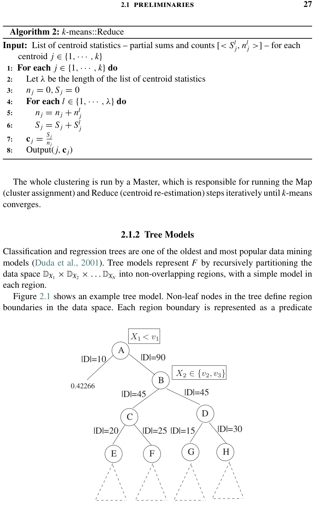

# Scaling Up Machine Learning: Parallel and Distributed Approaches

> Ron Bekkerman, Mikhail Bilenko, John Langford (编辑) | LinkedIn, Microsoft Research, Yahoo! Research

本书汇集了在并行和分布式计算平台上扩展机器学习和数据挖掘方法的代表性方案。并行化学习算法的需求高度任务特定：在某些场景中，驱动因素是大规模数据集，在其他场景中则是模型复杂度或实时性能要求。为大规模机器学习做出任务适当的算法和平台选择，需要理解可用选项的收益、权衡和约束。

本书涵盖的解决方案覆盖了从 FPGA 和 GPU 到多核系统和商品化集群的一系列并行化平台；包括 CUDA、MPI、MapReduce 和 DryadLINQ 在内的并发编程框架；以及各种学习设定：监督学习、无监督学习、半监督学习和在线学习。对提升树、支持向量机、谱聚类、信念传播及其他流行学习算法的并行化进行了广泛覆盖，并深入探讨了多个应用，使本书对研究人员、学生和实践者同样有用。

---

## 摘要

## 目录

前言 xv
1 扩展机器学习：引言 1
  1.1 机器学习基础 2
  1.2 扩展机器学习的原因 3
  1.3 并行和分布式计算的关键概念 6
  1.4 平台选择与权衡 7
  1.5 关于性能的思考 9
  1.6 本书的组织结构 10
  1.7 文献注释 17
  参考文献 19

第一部分 扩展机器学习的框架
2 MapReduce及其在决策树集成大规模并行学习中的应用 23
  2.1 预备知识 24
  2.2 PLANET示例 30
  2.3 技术细节 33
  2.4 学习集成模型 38
  2.5 工程问题 39
  2.6 实验 41
  2.7 相关工作 44
  2.8 结论 46
  致谢 47
  参考文献 47

3 使用DryadLINQ的大规模机器学习 49
4 IBM并行机器学习工具箱 69
5 用于机器学习算法的均匀细粒度数据并行计算 89

第二部分 监督和无监督学习算法
6 PSVM：使用不完全Cholesky分解的并行支持向量机 109
7 使用硬件加速器的大规模SVM并行化 127
8 使用提升决策树的大规模学习排序 148
9 Transform回归算法 170
10 因子图中的并行信念传播 190
11 潜在变量模型的分布式Gibbs采样 217
12 使用MapReduce和MPI的大规模谱聚类 240
13 并行化信息论聚类方法 262

第三部分 替代学习设定
14 并行在线学习 283
15 基于图的并行半监督学习 307
16 通过协同矩阵分解的分布式迁移学习 331
17 并行大规模特征选择 352

第四部分 应用
18 使用GPU的大规模视觉学习 373
19 基于FPGA的大规模卷积网络 399
20 多核系统上的树结构数据挖掘 420
21 自动语音识别的可扩展并行化 446

---

# 前言

本书试图汇集并行和分布式机器学习领域的最新研究。我们相信并行化为将机器学习扩展到大规模数据集和复杂方法提供了关键途径。尽管大规模机器学习在工业和学术界日益流行，但一直没有一本涵盖近期提出的各种方法的单一资源。我们尽力将最具代表性的当代研究汇编成一卷。虽然每章贡献都聚焦于不同的方法和问题，但结合其参考文献，它们提供了对该领域的全面视角。

我们相信本书将对广大研究人员、实践者以及任何希望把握机器学习未来的人有用。为帮助初学者平滑入门，前五章提供了关于机器学习算法和并行计算平台的入门材料。尽管本书某些部分技术性较强，但读者只需具备机器学习和并行/分布式计算的基本知识，以及大学水平的数学基础。我们希望熟悉分类器概念并有线程、MPI或MapReduce使用经验的工科本科生能够理解本书大部分内容。我们也希望资深专家会发现本书充满新颖有趣的想法，以激发该领域的未来研究。

我们衷心感谢所有章节作者为准备本书贡献所投入的大量时间、才华和创造力。我们感谢剑桥大学出版社的编辑们：Heather Bergman（发起本项目）和Lauren Cowles（全程与我们合作，指导本书完成）。我们感谢为章节作者提供详细、周到反馈的审稿人，这些反馈对本书的成型至关重要：David Andrzejewski、Yoav Artzi、Arthur Asuncion、Hongjie Bai、Sugato Basu、Andrew Bender、Mark Chapman、Wen-Yen Chen、Sulabh Choudhury、Adam Coates、Kamalika Das、Kevin Duh、Igor Durdanovic、Clément Farabet、Dennis Fetterly、Eric Garcia、Joseph Gonzalez、Isaac Greenbaum、Caden Howell、Ferris Jumah、Andrey Kolobov、Jeremy Kubica、Bo Li、Luke McDowell、W. P. McNeill、Frank McSherry、Chris Meek、Xu Miao、Steena Monteiro、Miguel Osorio、Sindhu Vijaya Raghavan、Paul Rodrigues、Martin Scholz、Suhail Shergill、Sameer Singh、Tom Sommerville、Amarnag Subramanya、Narayanan Sundaram、Krysta Svore、Shirish Tatikonda、Amund Tveit、Jean Wu、Evan Xiang、Elad Yom-Tov和Bin Zhang。

Ron Bekkerman 感谢 Martin Scholz 自项目初期以来的个人参与。Ron 深切感谢他的母亲 Faina、妻子 Anna 和女儿 Naomi，感谢她们在他所有事业中给予的无尽爱与支持。

---

## 第1章 扩展机器学习：引言

> Ron Bekkerman, Mikhail Bilenko, John Langford

大规模数据集的分布式和并行处理已在专门的、高预算的领域（如金融和石油工业应用）中使用了数十年。近年来，并行计算平台在可用性、成本效益和多样性方面取得了巨大进步，其在广泛的数据分析和机器学习任务中的流行度也在增长。

当前对扩展机器学习应用兴趣的上升，部分可归因于硬件架构和编程框架的演进，这些框架使得利用许多学习算法中可实现的并行类型变得容易。许多平台便于实现对数据实例或其特征的并发处理。这使得许多将输入视为无序样本批次并聚合每个样本上的独立计算的学习算法的并行化相当直接。

对大规模机器学习的关注增加也归因于许多现代应用中超大数据集的普及。这些数据集通常存储在分布式存储平台上，推动了可以适当分布的机器学习算法的发展。最后，基于高维复杂特征表示执行实时推理的传感设备的普及，推动了在以学习为中心的应用中利用并行性的额外需求。这一趋势的例子包括语音识别和视觉目标检测在自主机器人和移动设备中的普及。

分布式平台选择的丰富性为实现机器学习算法以获取效率提升或处理超大数据集的能力提供了多种选择。这些选择包括可定制集成电路（例如现场可编程门阵列——FPGA）、定制处理单元（例如通用图形处理单元——GPU）、多处理器和多核并行、通过快速本地网络连接的高性能计算（HPC）集群，以及可从商业云计算提供商处租赁的数据中心级虚拟集群。除了多种平台选择外，还存在各种可在其中实现算法的编程框架。对于分布式架构（如商品化PC集群），框架选择尤为多样。

并行和分布式计算平台及框架的广泛范围为机器学习科学家和工程师带来了机遇和挑战。充分利用可用的硬件资源需要调整某些算法并重新设计其他算法，以实现其并发执行。对于任何预测模型和学习算法，必须考虑其结构、数据流和底层任务分解，以确定特定基础设施选择的适用性。

构成本卷的各章形成了一组代表性的最先进解决方案，覆盖了现代并行计算平台和框架空间中的各种机器学习算法、任务和应用。虽然涵盖每种平台的每种现有方法不可行，但我们相信所呈现的技术集合涵盖了最常用的方法，包括流行的"顶级方法"（例如提升决策树和支持向量机）和常见的"基线方法"（例如k-means聚类）。

由于大多数章节聚焦于单一平台和/或框架选择，本引言为读者提供了统一的背景：机器学习基础知识和并行分布式计算基本概念的简要概述、需要扩展学习的典型任务和应用场景总结，以及关于评估算法性能和平台权衡的思考。随后是各章概览和文献注释。

### 1.1 机器学习基础

机器学习专注于构建从数据中进行预测的算法。机器学习任务旨在识别（学习）一个函数 $f: X \to Y$ ，将输入域 $X$ （数据）映射到输出域 $Y$ （可能的预测）。函数 $f$ 从某个函数类中选择，每个学习算法家族对应不同的函数类。 $X$ 和 $Y$ 的元素分别是数据对象和预测的特定于应用的表示。

两个经典的机器学习设定是监督学习和无监督学习。监督学习算法利用训练数据构建预测函数 $f$ ，随后应用于测试实例。通常，训练数据以带标签示例 $(x, y) \in X \times Y$ 的形式提供，其中 $x$ 是数据实例， $y$ 是 $x$ 对应的真实预测。

监督学习的最终目标是识别一个在测试数据上产生准确预测的函数 $f$ 。更正式地说，目标是最小化预测误差（损失）函数 $l: Y \times Y \to \mathbb{R}$ ，该函数量化任何 $f(x)$ 与 $y$ 之间的差异——即 $x$ 的预测输出与其真实标签之间的差异。然而，损失不能在测试实例及其标签上直接最小化，因为它们在训练时通常不可用。相反，监督学习算法旨在构建能很好地泛化到未见数据的预测函数，而不是仅在给定训练集上表现最优（即过拟合训练数据）。

最常见的监督学习设定是归纳学习，其中假设每个训练和测试示例 $(x, y)$ 是从某个未知的 $X \times Y$ 上的联合概率分布 $P$ 中采样的。目标是找到最小化期望损失 $\mathbb{E}_{(x,y) \sim P} l(f(x), y)$ 的 $f$ 。由于联合分布 $P$ 未知，期望损失无法以封闭形式最小化；因此，学习算法基于训练示例对其进行近似。额外的监督学习设定包括半监督学习（其中输入数据包含有标签和无标签实例）、迁移学习和在线学习（见第1.6.3节）。

两个经典的监督学习任务是分类和回归。在分类中，输出域是一个有限的离散类别集 $Y = \{c_1, ..., c_k\}$ ，而在回归中，输出域是实数集 $Y = \mathbb{R}$ 。更复杂的输出域在先进学习框架中探索，如结构化学习（Bakir等人，2007）[1]。

最简单的分类场景是二分类，其中有两个类别。考虑一个小例子。假设任务是学习一个预测传入电子邮件是否为垃圾邮件的函数。表示文本消息的常见方式是作为大型稀疏向量，其中每个条目对应一个词汇表中的单词，非零条目表示消息中出现的单词。标签可以表示为 1 表示垃圾邮件， $-1$ 表示非垃圾邮件。使用这种表示，通常学习一个权重向量 $w$ ，优化 $f(x) = \text{sign}(\sum_i w_i x_i)$ 以预测标签。

无监督学习最突出的例子是数据聚类。在聚类中，目标是构建一个将无标签数据集划分为 $k = |Y|$ 个簇的函数 $f$ ，其中 $Y$ 是簇索引的集合。分配到同一簇的数据实例应该比分配到任何其他簇的数据实例更相似。定义数据实例之间相似性的方法有很多；例如，对于向量数据，通常使用（反）欧氏距离和余弦相似度。聚类质量通常根据带有现有类标签的数据集来衡量，这些标签在聚类过程中被隐藏：如果 $f$ 将同一类的实例分配到不同的簇，或将不同类的实例分配到同一簇，质量度量会对其进行惩罚。

我们注意到，监督和无监督学习设定都区分学习和推理任务，其中学习指识别预测函数 $f$ 的过程，而推理指在数据实例 $x$ 上计算 $f(x)$ 。对于许多学习算法，推理是学习过程的一个组成部分，因为在训练数据上某些临时候选 $f'$ 的预测被用于搜索最优 $f$ 。根据应用领域，可能需要对学习算法或推理算法进行扩展，本书中的章节提供了加速两者的众多示例。

### 1.2 扩展机器学习的原因

存在许多情况，实践者会发现机器学习任务的规模对于单机处理来说令人望而却步，并考虑采用并行化。这些情况的特点如下：

1. **大量数据实例**：在许多领域，潜在训练示例的数量极大，使得单机处理不可行。
2. **高输入维度**：在某些应用中，数据实例由大量特征表示。机器学习算法可以跨特征集划分计算，从而允许扩展到长数据表示。
3. **模型和算法复杂度**：许多高精度学习算法要么依赖于复杂的非线性模型，要么使用计算成本高昂的子程序。在这两种情况下，将计算分布到多个处理单元可以是支持大规模数据集学习的关键因素。
4. **推理时间约束**：涉及感知的应用，如机器人导航或语音识别，需要实时做出预测。这种场景下推理速度的严格限制促使推理算法的并行化。
5. **预测级联**：需要顺序、相互依赖的预测的应用具有高度复杂的联合输出空间，并行化可以显著加速此类场景中的推理。
6. **模型选择和参数扫描**：学习算法的超参数调优和统计显著性评估需要多次执行学习和推理。幸运的是，这些过程属于所谓的"易并行"应用类别，天然适合并发执行。

以下各节更详细地讨论每种场景。

#### 1.2.1 大量数据实例

每天聚合数十亿事件的数据集在许多领域已变得普遍，例如互联网和金融，每个事件都是学习算法的潜在输入。此外，越来越多的设备包含连续记录观测数据的传感器，这些观测数据可以作为训练数据。每个数据实例平均可能有数千个非零特征，导致每天产生 $10^{12}$ 量级的实例-特征对。即使每个特征只需要1字节存储，随时间积累的数据集也容易达到数百太字节。

有效处理此类数据集的首选方式是结合机器集群的分布式存储和带宽。最近出现了一些计算框架以简化大量数据的使用，如 MapReduce 和 DryadLINQ，在本书的若干章节中使用。这些框架将通过简单、天然可并行的语言原语进行编程的能力与使用高容量存储和执行平台的能力相结合。

#### 1.2.2 高输入维度

涉及自然语言、图像或视频的机器学习和数据挖掘任务可以轻松达到 $10^6$ 或更高的输入维度，远超此前认为常见的 $10$ - $1000$ 特征的舒适规模。尽管这些领域中某些数据是稀疏的，但情况并非总是如此；稀疏性在许多算法的参数空间中也会丢失。因此，跨特征并行化计算可以是扩展计算到更丰富表示的有吸引力的途径，或者只是为了加速自然迭代特征的算法，如决策树。

#### 1.2.3 模型和算法复杂度

某些领域的数据相对于基本特征（例如像素或单词）具有固有的非线性结构。采用高度非线性表示的模型，如决策树集成或多层（深度）网络，可以在此类应用中显著优于更简单的算法。尽管在这些领域中，特征工程可以利用计算成本低廉的线性模型实现高精度，但越来越多的人对尽可能自动地从基础表示中学习感兴趣。尝试这一点的算法的共同特征是其巨大的计算复杂度。即使训练数据可以轻松放入一台机器，学习过程对于合理开发周期而言也可能太慢。对于一些学习算法来说也是如此，其计算复杂度在训练示例数量上是超线性的。

对于这类问题，并行多节点或多核实现似乎是可行的，并已成功应用，允许在更大数据集上使用复杂算法和模型。此外，像 GPU 这样的协处理器也已成功应用于原始输入空间的快速变换。

#### 1.2.4 推理时间约束

减少测试时间的主要手段是通过易并行复制。这种方法适用于吞吐量是主要关注点的场景——需要进行的评估数量非常大。考虑例如在垃圾邮件过滤器中每天评估 $10^{10}$ 封电子邮件，这不要求实时输出结果，但绝不能出现积压。

推理延迟通常比吞吐量更严格。在任何系统等待预测的情况下都会出现延迟问题，整体应用性能随延迟增加而迅速下降。例如，这发生在基于多个传感器做出路径规划决策的自动驾驶汽车，或旨在通过使用即时个性化选择推荐故事来改善用户体验的在线新闻提供商。

吞吐量和延迟的约束并不完全兼容——例如，数据流水线以吞吐量换取延迟。然而，对于这两者，利用高度并行化的硬件架构如 GPU 或 FPGA 已被证明是有效的。

#### 1.2.5 预测级联

许多现实世界问题，如目标跟踪、语音识别和机器翻译，需要执行一系列相互依赖的预测，形成预测级联。如果将级联视为单个推理任务，它具有很大的联合输出空间，通常由于计算复杂度的增加而导致非常高的计算成本。预测任务之间的相互依赖通常通过各任务的阶段式并行化以及自适应任务管理来解决，如第21章对语音识别的方法所示。

#### 1.2.6 模型选择和参数扫描

开发、调优和评估学习算法的实践依赖于易并行的工作流：它不需要任务之间的相互通信，在相同数据集上独立执行。这种性质的两种特定过程是参数扫描和统计显著性检验。在参数扫描中，学习算法在相同数据集上以不同设置多次运行，随后在验证集上进行评估。在统计显著性检验过程（如交叉验证或自助法）中，训练和测试在不同数据集子集上重复进行，结果被聚合用于后续统计显著性度量。并行平台对这些任务的有用性是显而易见的，因为它们可以轻松并发执行，而无需并行化实际的学习和推理算法。

### 1.3 并行和分布式计算的关键概念

通过采用并行和分布式系统在机器学习应用中获得的性能提升，由原本串行执行的任务的并发执行驱动。这种并发性在两个主要方向上实现：数据并行和任务并行。数据并行指同时处理多个输入，而任务并行在算法执行可以划分为若干段时实现，其中一些段是独立的，因此可以并发执行。

#### 1.3.1 数据并行

数据并行指在多个输入上同时执行相同的计算。这对于许多接受输入数据作为来自底层分布的独立样本批次的机器学习应用和算法是天然适合的。通过实例-特征矩阵表示这些样本自然建议了实现数据并行的两个正交方向。一个是将矩阵按行划分为实例子集，然后独立处理（例如，在计算逻辑回归的权重更新时）。另一个是将其按列拆分，适用于可以跨特征解耦计算的算法（例如，在决策树构建中识别分裂特征时）。

数据并行最基本的例子出现在易并行算法中，其中计算被拆分为不需要相互通信的并发子任务，这些子任务在独立的数据子集上运行。数据并行的一个相关简单实现出现在主-从通信模型中：主进程将数据分布到从进程，从进程执行相同的计算（例如，见第8章和第16章）。

数据并行的不太明显的例子出现在实例或特征不独立，但存在可以在图中表示的明确定义的关系结构的算法中。如果计算可以基于这种结构跨实例划分，那么就可以实现数据并行。然后，在不同分区上的并发执行与跨分区的信息交换交替进行；第10章和第15章提出的方法依赖于这种算法模式。

前述示例说明了通过算法设计可以在实例或特征子集上实现的粗粒度数据并行。相比之下，细粒度数据并行指利用允许在硬件中并行化向量和矩阵计算的现代处理器架构的能力。诸如 BLAS 和 LAPACK [1] 的标准库提供了抽象化基本向量和矩阵操作执行的例程。可以表示为这些操作的级联的学习算法然后可以通过进行相应 API 调用来利用硬件支持的并行性，极大地简化算法的实现。

[1] http://www.netlib.org/blas/ 和 http://www.netlib.org/lapack/

#### 1.3.2 任务并行

与通过同时在多个输入上执行相同计算来定义的数据并行不同，任务并行指将整个算法分割为若干部分，其中一些部分可以并发执行。数值计算的细粒度任务并行可以由许多现代架构自动执行（例如通过流水线），但也可以在某些平台上半手动实现，如 GPU，可能带来非常显著的效率提升，但需要深入的平台专业知识。粗粒度任务并行需要算法实现中每个任务的显式封装以及调度服务，这通常由编程框架提供。

算法到任务的划分可以用有向无环图表示，节点对应单个任务，边表示任务间依赖关系。任务之间的数据流自然地沿图的边缘发生。这种平台的一个突出例子是 MapReduce，一种由 Dean 和 Ghemawat（2004）[2] 引入的分布式计算编程模型，本书若干章节依赖于此；更多细节见第2章。额外的跨任务通信可以通过平台的点对点和广播消息传递来支持。由 Gropp 等人（1994）[3] 引入的消息传递接口（MPI）是在许多平台和编程语言中广泛支持的此类消息传递协议的例子。本书若干章节依赖于它；更多细节见第4章第4.4节。除了广泛可用性，MPI的流行归因于其灵活性：它支持点对点和集合通信，具有同步和异步机制。

对于许多算法，扩展可以通过数据和任务并行性的混合最有效地实现。混合并行性的能力在大多数现代平台中实现：例如，它既体现在第3章描述的高度分布式的 DryadLINQ 框架中，也体现在第18章和第19章描述的 GPU 和定制硬件上实现的计算机视觉算法中。

### 1.4 平台选择与权衡

让我们简要总结一下表征并行和分布式平台的关键维度。Flynn（1972）[4] 提出的并行架构经典分类法通过算法执行并发性（单指令 vs 多指令）和输入处理（单数据流 vs 多数据流）来区分它们。进一步的区分可以基于共享内存的配置和处理单元的组织方式进行。现代并行架构通常基于混合拓扑，其中处理单元分层组织，具有多层共享内存。例如，GPU 通常有数十个多处理器，每个多处理器有多个以"块"组织的流处理器。单个块可以访问相对较小的本地共享内存和更大的全局共享内存（具有更高延迟）。

与并行架构不同，分布式计算平台通常在处理单元之间有更大的（物理）距离，导致更高的延迟和更低的带宽。此外，单个处理单元可能是异构的，它们之间的直接通信可能通过共享内存或通过消息传递受到限制或不存在，极端情况是所有数据流限于任务边界，如 MapReduce 的情况。

现在可用于机器学习应用的并行和分布式平台及框架的整体多样性可能令人难以招架。然而，以下观察捕捉了平台之间的关键区分方面：

- **并行粒度**：采用硬件特定解决方案——GPU 和 FPGA——允许非常细粒度的数据和任务并行，其中基本数值任务（向量、矩阵和张量上的操作）可以分布在多个处理单元上，通过流水线实现非常高的吞吐量。然而，使用这种能力需要将整个算法重新定义为这些基本任务的数据流，并消除瓶颈。向上移动到通用 CPU 中的跨核和跨处理器并行，将算法定义为精细调优阶段序列的约束放松了，并行不再限于基本数值操作。对于集群和数据中心级解决方案，由于通信成本增加，定义更粗粒度任务变得必要。

- **算法定制程度**：根据平台选择，为启用并发所需的算法重新设计的复杂度可以从简单使用第三方解决方案自动并行化现有命令式或声明式实现，到必须完全重新创建算法，甚至直接在硬件中实现。通常，在硬件特定平台（如 GPU）上实现学习算法需要大量专业知识、硬件感知的任务配置，以及避免某些常见软件模式（如分支）。相比之下，更高级别的并行和分布式系统允许使用多种常见编程语言，通过启用并行的 API 进行扩展。

- **混合编程范式的能力**：声明式编程语言在大规模数据操作中越来越流行，从函数式编程到 SQL 等各种前身中借鉴，通过主要将算法表示为逻辑和数据流的混合来使并行编程更容易。此类语言通常与经典命令式编程混合以提供最大表达能力。这一趋势的例子包括 Microsoft 的 DryadLINQ、Google 的 Sawzall 和 Pregel，以及 Apache Pig 和 Hive。即使在声明式语言不足以表达学习算法的应用中，它们也常用于计算基本的一阶和二阶统计量，为许多学习任务产生高预测性的特征。

- **数据集横向扩展**：处理太大而无法放入内存的数据集的应用通常依赖于分布式文件系统或共享内存集群。与分布式数据集存储紧密耦合的并行计算框架允许在调度期间优化任务分配以最大化本地数据流。相比之下，硬件特定并行中的调度与用于超大数据集的存储解决方案解耦，因此需要设计手动解决方案以最大化吞吐量。

- **离线 vs 在线执行**：分布式平台通常假设其用户对故障和延迟的容忍度高于硬件特定解决方案。例如，通过 MapReduce 实现并提交到虚拟集群的算法通常不保证完成时间。相比之下，基于 GPU 的算法可以假设专用平台，这对于实时应用可能更可取。

最后，我们注意到多个并行化级别的混合有一个增长趋势：例如，现在可以从商业云计算提供商处租用包含带有 GPU 的多核节点的集群。给定手头的特定应用，平台和编程框架的选择应以上述标准为指导，以确定适当的解决方案。

### 1.5 关于性能的思考

术语"性能"对于并行学习算法是高度模糊的，因为它既包括预测准确性又包括计算速度，每个都可以通过多种度量来衡量。本书各章节所解决的学习问题的多样性使得所提出的方法在预测性能方面通常是不可比较的：这些算法旨在在不同设定中优化不同的目标。即使在解决相同问题的情况下，如二分类或聚类，应用领域和评估方法的差异通常也导致准确性结果的不可比性。因此，无法在本书各章之间提供有意义的相对准确性定量总结，尽管在每个情况下都应理解作者努力创造了有效的算法。

算法复杂度的经典分析基于 O-表示法（或其同类）来界定和量化计算成本。这种方法在许多机器学习算法中遇到困难，因为它们通常包含基于优化的终止条件，对此没有形式化分析。例如，典型的早期停止算法可能在验证集上测量的预测误差开始上升时终止——这很难分析，因为核心算法在设计中无法访问该验证集。

尽管如此，学习算法中的单个子程序通常确实具有清晰的计算复杂度。在检查算法并考虑其在给定领域的应用时，我们建议提出以下问题：

1. **算法或其子程序的计算复杂度是多少？** 是线性的（即 $O(\text{input size})$ ）吗？还是超线性的？通常， $O(\text{input size})$ 量级的算法与 $O(\text{input size}^\alpha)$ （ $\alpha \ge 2$ ）量级的算法存在质的区别。出于所有实际目的，三次及更高复杂度的算法不适用于现代规模的现实世界任务。

2. **算法的带宽需求是多少？** 这对于分布在整个计算机集群上的任何算法尤其重要，但也与使用共享内存或磁盘资源的并行算法相关。这个问题有两种形式：使用的总带宽是多少？任何节点的最大带宽是多少？形式为 $O(\text{input size})$ 、 $O(\text{instances})$ 和 $O(\text{parameters})$ 的答案都可根据数据组织方式和算法进程自然产生。这些答案可能对运行时间产生非常实质性的影响，因为输入数据集可能是 $10^{14}$ 字节大小，但只有 $10^{10}$ 个示例和 $10^8$ 个参数。

用于分析并行算法计算性能的关键度量是加速比、效率和可扩展性：

- **加速比**是串行算法与其并行对应物的求解时间之比。
- **效率**衡量加速比与处理器数量之比。
- **可扩展性**跟踪效率随处理器数量增加的变化。

由于前面解释的原因，这些度量对于机器学习算法可能难以分析评估，通常应与准确性比较一起考虑。然而，这些度量在实证研究中高度信息丰富。从实践角度来看，考虑到用于并行和串行实现的硬件差异，将这些度量视为成本（硬件和实现）的函数对于公平比较是重要的。

不同算法计算成本的实证评估应理想地通过在同一数据集上比较它们来进行。与预测性能一样，对于后续章节中呈现的工作，由于不同方法在任务、应用领域、底层框架和实现上的巨大差异，可能无法做到这一点。然而，可以考虑不同章节中呈现的方法的一般特征吞吐量，定义为 $\frac{\text{running time}}{\text{input size}}$ 。基于各章报告的结果，设计良好的并行化方法能够在不同平台和任务上获得高效率。

### 1.6 本书的组织结构

本书各章涵盖了一系列计算平台、学习算法、预测问题和应用领域，描述了扩展机器学习的各种并行化技术。本书分为四个部分。第一部分聚焦于四个不同的编程框架，在这些框架之上已成功实现了多种学习算法。第二部分聚焦于单个学习算法，描述了几种高性能监督和无监督方法的并行化版本。第三部分致力于不同于经典监督与无监督二分法的任务设定，如在线学习、半监督学习、迁移学习和特征选择。最后，第四部分描述了扩展学习已取得高度成功的几个应用场景：计算机视觉、语音识别和频繁模式挖掘。表1.1包含了各章、所考虑的预测任务以及每章的具体算法和应用的概览。

**表1.1 各章概览**

| 章节 | 平台 | 框架 | 学习设定 | 算法/应用 |
|------|------|------|----------|-----------|
| 2 | 集群 | MapReduce | 聚类, 分类 | k-Means, 决策树集成 |
| 3 | 集群 | DryadLINQ | 多种 | k-Means, 决策树, SVD |
| 4 | 集群 | MPI | 多种 | 核k-means, 决策树, 频繁模式挖掘 |
| 5 | GPU | CUDA | 聚类, 回归 | k-Means, 回归k-means |
| 6 | 集群 | MPI | 分类 | SVM (IPM) |
| 7 | 集群, 多核, FPGA | TCP, UDP, 线程, HDL | 分类, 回归 | SVM (SMO) |
| 8 | 集群 | MPI | 排序 | LambdaMART, 网页搜索 |
| 9 | 集群 | MPI | 回归, 分类 | Transform回归 |
| 10 | 集群 | MPI | 推理 | 环状信念传播 |
| 11 | 集群 | MPI | 推理 | MCMC |
| 12 | 集群 | MapReduce, MPI | 聚类 | 谱聚类 |
| 13 | 集群 | MPI | 聚类 | 信息论聚类 |
| 14 | 集群 | TCP, 线程 | 分类, 回归 | 在线学习 |
| 15 | 集群, 多核 | TCP, 线程 | 半监督学习 (SSL) | 基于图的SSL |
| 16 | 集群 | MPI | 迁移学习 | 协同过滤 |
| 17 | 集群 | MapReduce | 分类 | 特征选择 |
| 18 | GPU | CUDA | 分类 | 目标检测, 特征提取 |
| 19 | FPGA | HDL | 分类 | 目标检测, 特征提取 |
| 20 | 多核 | 线程, 任务队列 | 模式挖掘 | 频繁子树挖掘 |
| 21 | 多核, GPU | CUDA, 任务队列 | 推理 | 语音识别 |

#### 1.6.1 第一部分：扩展机器学习的框架

本书的前四章描述了非常适合并行化学习算法的编程框架，每章以具体算法的深入示例进行说明。特别是，k-means聚类在每章中的实现是一个共享示例，说明了各框架的相似性、差异性和能力。

**第2章**是本书的第一篇贡献章，简要介绍了 MapReduce（一个越来越流行的分布式计算框架），并讨论了使用它扩展学习算法的利弊。本章重点利用 MapReduce 并行化决策树集成的训练，这是一类包含如提升和装袋等流行方法的算法。所提出的方法 PLANET，通过并发扩展每棵树中的多个节点，利用树自然诱导的数据划分，并在适当的时候在并行和本地执行之间进行调节，来分布树构建过程。PLANET 在一个 200 节点的 MapReduce 集群上，对于在单机上处理不可行的数据集，实现了两个数量级的加速比。

**第3章**介绍 DryadLINQ，一种声明式数据并行编程语言，将程序编译为可靠的分布式计算，由 Dryad 集群运行时执行。DryadLINQ 为程序员提供数据的高级抽象，作为 .NET 中的类型化集合，并启用许多有用的软件工程工具，如类型安全、与开发环境的集成以及与标准库的互操作性，所有这些帮助程序员在执行前正确编写程序。同时，该语言与底层 Dryad 执行引擎良好匹配，能够在大规模机器集群上可靠且可扩展地执行计算。几个示例表明 DryadLINQ 中相对简单的程序可以产生非常高效的分布式计算；例如，k-means 的一个版本仅用十几行代码实现。其他几个机器学习示例引起了人们对编程便利性的关注，并展示了在多吉字节数据集上的强大性能。

**第4章**描述了 IBM 并行机器学习工具箱（PML），它提供了一个通用的基于 MPI 的并行化基础，非常适合机器学习算法。给定手头的算法，PML 将其表示为遵循交换律和结合律的代数规则的算子序列。直观地说，这些算子对应于训练实例可交换且可以任意划分的算法步骤，使得它们的处理易于并行化。PML 提供的功能对于需要多次遍历数据的算法特别有益——大多数机器学习算法正是如此。本章描述了许多流行学习算法如何表示为结合-交换级联，并深入介绍了它们在 PML 中的实现细节。本书第二部分的第9章讨论了在 PML 中实现的 transform 回归。

**第5章**提供了 CUDA 在 GPU 上编程的温和介绍，并通过描述 k-means 和回归 k-means 的实现来说明其在机器学习应用中的使用。本章提供了关于重新设计学习算法以适应 CPU/GPU 计算模型的重要见解，详细讨论了 GPU 中的均匀细粒度数据/任务并行性：向量和矩阵上的并行执行，输入通过流水线进一步提高效率。实验表明，与 CPU 上高度优化的多线程 k-means 和回归 k-means 实现相比，实现了两个数量级的加速比。

#### 1.6.2 第二部分：监督和无监督学习算法

本书的第二部分致力于现代机器学习中涵盖关键方法的流行监督和无监督机器学习算法的并行化。前两章描述了并行化支持向量机（SVM）训练的不同方法：一种展示了如何使用消息传递有效分布内点法（IPM），另一种专注于定制硬件设计用于序列最小优化（SMO）算法，实现了显著的加速。下一章涵盖了提升决策树的变体：首先，基于 MPI 的排序提升并行化，其次，transform 回归提供了传统提升的若干增强，显著减少了迭代次数。接下来的两章致力于图模型：一章描述了因子图中的信念传播（BP）并行化，这是无数图模型算法的主力；另一章关于无监督主题模型中分布式马尔可夫链蒙特卡洛（MCMC）推理，这是近年来备受关注的领域。本部分以聚类两章结束，描述了两种非常不同方法的快速实现：谱聚类和信息论共聚类。

**第6章**是两个并行SVM章节中的第一个，提出了一种两阶段方法，其中第一阶段通过并行化的不完全Cholesky分解（ICF）计算核矩阵近似。在第二阶段，内点法（IPM）通过底层计算的非平凡重排并行应用于分解后的矩阵。该方法通过将输入数据划分到集群节点上来实现可扩展性，分解一次构建一行。该方法在 500 节点集群上相对于最先进的基线 LibSVM 实现了两个数量级的加速比，其基于 MPI 的实现已开源发布。

**第7章**也考虑了并行化 SVM，聚焦于作为底层优化方法的流行 SMO 算法。本章的独特之处在于它提供了高级/低级混合并行化。在高级别，实例分布在节点上，SMO 在每个节点上执行。为确保优化朝着全局最优进行，所有局部最优工作集在每次 SMO 迭代中合并到全局最优工作集中。在低级别，专用硬件（FPGA）用于加速核心核计算。集群实现使用自定义编写的基于 TCP/UDP 多播的通信接口，并在 48 个双核节点的集群上实现了两个数量级的加速比。超线性加速比值得注意，说明线性增加内存与高效通信可以显著减轻计算瓶颈。该方法的实现已开源发布。

**第8章**涵盖 LambdaMART，一种用于学习排序的提升决策树算法，这是许多信息检索应用的核心行业定义任务。作者开发了几种分布式 LambdaMART 变体，其中一种跨节点划分特征（而不是实例）并使用主-从结构执行算法。该方法在 32 节点的基于 MPI 的实现上实现了一个数量级的加速比，并产生与串行实现完全等价的学习模型。本章还描述了逼近串行实现的实例分布式方法实验。

**第9章**描述 Transform 回归，一种强大的分类和回归算法，受梯度提升启发，但在几个方面有所偏离，导致了显著的加速。值得注意的是，transform 回归使用先前树的预测作为后续迭代中的特征，并在树叶子中采用线性回归。该算法使用第4章中描述的 PML 框架高效并行化，并显示在少于 10 次迭代中获得高精度模型，从而将集成中的树数量减少两个数量级，这一增益直接转化为推理时相应的加速。

**第10章**聚焦于概率图模型中使用环状信念传播（BP）的近似推理，这是一种广泛应用的传递消息技术。本章提供了几种 BP 并行化技术的比较分析，并探讨了消息调度在高效并行推理中的作用。本章的高潮是 Splash 算法，它沿着生成树顺序传播消息，产生了一个可证明最优的并行 BP 算法。结果表明，动态调度和过度分区的组合对于高性能并行推理至关重要。共享和分布式内存环境中的实验结果表明，Splash 算法显著优于替代方法，例如，在 40 节点分布式内存集群上实现了 23 倍加速比，而次优方法为 14 倍。

**第11章**致力于统计潜在变量模型中学习的并行化，如主题模型，这些模型在识别大型数据集合中的底层结构方面越来越流行。本章重点分布在潜在狄利克雷分配（LDA）和层次狄利克雷过程（HDP）这两种流行主题模型以及一般的贝叶斯网络（以隐马尔可夫模型（HMM）为例）的背景下分布折叠吉布斯采样（一种马尔可夫链蒙特卡洛（MCMC）技术）。通过分布数据实例和跨节点交换统计量来实现扩展到大规模数据集，考虑了同步和异步变体。基于 MPI 的在 1024 个处理器上的实现显示几乎三个数量级的加速比，且与基线实现相比准确性没有损失，表明该方法成功地将主题模型扩展到多吉字节文本集合。核心算法是开源的。

**第12章**是专门讨论聚类方法并行化的两章中的第一章。它提出了一种由三个阶段组成的并行谱聚类技术：亲和矩阵的稀疏化、随后的特征分解，以及通过使用投影实例的 k-means 获得最终聚类。结果表明，稀疏化对于使后续模块能够在大规模数据集上运行至关重要，尽管它是最昂贵的步骤，但可以使用 MapReduce 分布。后续步骤，特征分解和 k-means，使用 MPI 并行化。本章提供了详细的复杂度分析以及在文本和图像数据集上的广泛实验结果，显示在多达 256 台机器的集群上接近线性的整体加速比。有趣的是，结果表明矩阵稀疏化具有提高聚类准确性的好处。

**第13章**提出了共聚类的并行化方案，即同时构建数据实例的聚类及其特征的聚类。所提出的算法优化信息论目标，并使用一个基本的顺序子例程来"洗牌"两个簇的数据。洗牌在划分为配对的簇集上并行进行。有两个结果值得关注：在 400 核 MPI 集群上实现两个数量级的加速比，以及有证据表明顺序共聚类在揭示数据底层结构方面明显优于一个易并行的类似 k-means 的共聚类算法，后者优化相同的目标。

#### 1.6.3 第三部分：替代学习设定

本书的这一部分超越了传统的监督和无监督学习公式，前三章聚焦于并行化在线学习、半监督学习和迁移学习。第四章提出了一种基于 MapReduce 的扩展特征选择方法，特征选择是机器学习实践的一个组成部分，众所周知可以提高计算效率和预测准确性。

**第14章**聚焦于在线学习设定，其中训练实例以流的形式一个接一个地到达，学习一次在一个示例上进行。理论结果表明，延迟更新可能导致额外误差，因此算法专注于在分布式环境中最小化延迟以实现高质量解。为此，特征被跨核和节点分区（"分片"），并测试了各种延迟容忍学习算法。实证结果表明，多核和多节点并行化版本在九台机器的集群上产生 6 倍的加速比，有时甚至提高了预测性能。核心算法是开源的。

**第15章**考虑半监督学习，其中训练集包含大量无标签数据和有标签示例。特别地，作者聚焦于基于图的半监督分类，其中数据实例由图的节点表示，连接相似实例的边连接它们。本章描述了 measure propagation，一种性能最好的半监督分类算法，并开发了若干加速其并行化的有效启发式方法。这些启发式方法重新排序图节点以最大化消息传递的局部性，因此适用于广泛的消息传递算法家族。本章解决了多核和分布式设定，在一个包含 1.2 亿图节点实例的数据集上，在语音识别流程的关键任务中，于 1000 核分布式计算机上获得了 85% 的效率。

**第16章**处理迁移学习：一种设定，其中两个或多个学习任务相继或同时解决，利用跨任务的学习。通常假设任务的输入具有共享支撑集的不同分布。本章介绍 DisCo，一个分布式迁移学习框架，其中每个任务在其自己的节点上与其他任务并发学习，知识转移通过跨任务共享的数据实例进行。本章表明，在推荐系统和文本分类领域，所描述的并行化方法相对于集中式实现实现了一个数量级的加速比，知识转移提高了任务的准确性，超过了单独获得的准确性。

**第17章**致力于分布式特征选择。特征选择任务的动机在于，许多学习算法的预测准确性可以通过提取所有特征的一个子集来提高，该子集提供数据的代表性表示并排除噪声。减少特征数量自然也降低了学习和推理的计算成本。本章聚焦于专用于逻辑回归的通过单特征优化的前向特征选择（SFO）。从空特征集开始，该方法迭代地选择改善预测性能的特征，直到没有进一步增益，丢弃剩余特征。描述了一种基于数据实例在节点上分区的 MapReduce 实现。在实验中，该算法在 20 节点集群上实现了约 16 倍的加速比。

#### 1.6.4 第四部分：应用

本书的最后一部分展示了不同领域中的几个学习应用，其中扩展对于计算效率和准确性提高都至关重要。前两章聚焦于基于硬件的方法，用于加速经典计算机视觉应用中的推理：目标检测和识别。在机器人技术和监控系统等领域，模型训练离线进行，可以依赖大量计算资源，而高效推理是实现实时性能的关键。下一章聚焦于频繁子树模式挖掘，这是一种无监督学习任务，在数据天然由树表示的许多应用中很重要。本书的最后一章描述了深度瓶颈分析和模式驱动设计的一个典型案例，这些技术导致高度优化的语音识别流程的关键推理加速。

**第18章**描述了两种基于使用 GPU 进行高效特征处理和归纳来改进视觉任务性能的方法。上半章表明，结合针对 GPU 优化的高级特征、训练集的合成扩展以及分布在集群上的提升训练，在目标检测任务上产生了显著的准确性提升。基于 GPU 的检测器相对其 CPU 实现还享有 100 倍加速比。在下半章，本章描述了如何在 GPU 上高效训练深度信念网络（DBN）以学习高质量特征表示，避免了传统上在计算机视觉中归纳信息性特征所需的大量人工工程。

**第19章**展示了如何在 FPGA 或 ASIC（专用集成电路）上实现的定制硬件可以有效部署在视觉任务中常用的用于特征选择的大规模并行滤波器组。测试了卷积神经网络，其使用数据流模型的实现实现了高效的并行性。与标准计算机视觉基准上的 CPU 和 GPU 实现的比较表明，定制硬件在功耗方面产生了 100 倍的整体效率提升。

**第20章**考虑频繁子树挖掘问题，这是从生物信息学到浏览行为日志挖掘等多个领域中的重要任务。在树实例可能结构任意复杂且大规模的情况下，检测频繁出现的子树的计算具有挑战性。本章展示了如何高效地在多核系统上并行化频繁子树挖掘，提供了包括内存利用和负载平衡在内的各种设计方面的见解。本章的方法基于自适应并行化：利用多级任务粒度最大化并发性。多分辨率任务并行性导致系统资源的高利用率，如标准网络日志、XML 和自然语言处理（NLP）基准数据集上的接近线性加速比所示。

**第21章**聚焦于自动语音识别（ASR）推理过程的并行化。在 ASR 中，获得推理效率具有挑战性，因为高度优化的现代 ASR 模型涉及不规则的图结构，导致高度并行实现中的负载平衡问题。本章描述了仔细的瓶颈分析如何帮助利用最丰富的并发来源，在 GPU 和多核系统上实现高效的 ASR 实现。这里提出的整体应用架构有效利用单指令多数据（SIMD）操作以提高执行效率，利用硬件支持的原子指令以提高同步效率。与优化的单线程实现相比，这些技术提供了一个数量级的加速比，实现了超过实时三倍的识别速度，使得可以在越来越多的使用场景中部署新颖的基于 ASR 的应用。

### 1.7 文献注释

本书的目标是呈现一组实用的现代平台和算法，这些平台和算法在大规模环境中部署的学习应用中有效。这个集合绝不是一个详尽的选集：鉴于该领域正在进行的研究的广度，编纂一个是不可能的。然而，每章的参考文献为所描述的方法以及替代方法提供了相关文献的全面概述。本节的剩余部分调查更广泛的背景参考文献，以及软件包和额外近期工作的指引。

许多现代机器学习技术依赖于将训练目标表述为优化问题，从而能够使用先前开发的大量数学规划算法。分布式和并行优化算法数十年来一直是一个富有成果的研究领域，产生了一些理论和实践进展。Censor 和 Zenios (1997) [5] 是该领域的经典参考文献，涵盖了线性和二次规划的几类算法的并行化，这些是现代许多机器学习技术的核心。

从九十年代初开始，算法的并行化以扩展到大规模数据集一直是数据挖掘社区中的一个活跃研究方向。Freitas 和 Lavington (1998) [6] 的专著从以数据库为中心的视角描述了早期关于并行数据挖掘的工作。Provost 和 Kolluri (1999) [7] 的综述提供了扩展归纳学习算法方法的结构化概述，将其分为包括并行化和数据分区在内的几个组。随后两个编辑文集（Zaki 和 Ho, 2000 [8]; Kargupta 和 Chan, 2000 [9]）代表了早期并行挖掘算法研究，包括描述用于并发挖掘分区数据集合的几个原型框架的章节。

在统计机器学习社区中，扩展基于核的方法（其中支持向量机是最突出的例子）由于大多数训练方法的超线性计算复杂度而成为重要的研究兴趣主题。由 Bottou 等人（2007）[10] 编辑的卷册呈现了该领域全面的现代解决方案集，主要关注算法方面，但也包括两种并行方法，其中一种在本书第7章中进行了扩展。

在分布式数据挖掘社区中研究的一个并行化框架是对等（P2P）网络，这是一种由高度非平稳节点（节点经常离线）组成的去中心化系统，其中通信通常是异步的且具有高延迟。这些问题被存储和计算资源的极高可扩展性潜力所平衡。为 P2P 环境设计机器学习方法是一个正在进行的工作主题（Datta 等人，2009 [11]; Bhaduri 等人，2008 [12]; Luo 等人，2007 [13]）。

两本最近出版的教科书（Lin 和 Dyer, 2010 [14]; Rajaraman 和 Ullman, 2010 [15]）可能对主要对通过 MapReduce 实现的算法感兴趣的本书读者有用。Lin 和 Dyer (2010) [14] 提供了对 MapReduce 的温和介绍，包含大量聚焦于文本处理应用的示例，而 Rajaraman 和 Ullman (2010) [15] 描述了大规模数据集上的广泛挖掘任务，深入覆盖了 MapReduce 和并行聚类。

第1章和第3章中呈现的 MapReduce 和 DryadLINQ 是也来越流行的分布式平台家族的代表性样本，它们结合了三层：一个有利于并行化的编程语言、一个任务执行引擎和一个分布式文件系统。Hadoop [2] 是这个家族中的一个突出、广泛使用的开源成员，可通过流行命令式语言（如 Java 或 Python）的 API 编程，也可通过具有强烈函数式和声明式风格的专业语言（如 Apache Pig 和 Hive [3]）编程。另一个相关的工具集，如 Aster Data [4] 或 Greenplum [5]，为分布式数据库提供了 MapReduce API。最后，MADlib [6] 在分布式数据库之上提供了学习工具库，而 Apache Mahout [7] 是一个正在为 Hadoop 开发的机器学习算法库。在本书中，PML（在第4章中呈现）是一个基于特别适合学习算法的通用并行化原语库的现成机器学习工具箱的例子。

自启动本项目以来，已经发表了一些其他可能有兴趣的并行学习算法。第11章的读者可能对一个新的集群并行潜在狄利克雷分配算法感兴趣（Smola 和 Narayanamurthy, 2010 [16]）。第8章的读者可能对类似算法感兴趣，该算法可以与 Hadoop 文件系统互操作（Ye 等人，2009 [17]）。

### 参考文献

[1] Bakir, G., Hofmann, T., Schölkopf, B., Smola, A., Taskar, B., and Vishwanathan, S. V. N. (eds). 2007. *Predicting Structured Data*. Cambridge, MA: MIT Press.

[2] Dean, Jeffrey, and Ghemawat, Sanjay. 2004. MapReduce: Simplified Data Processing on Large Clusters. *In: Sixth Symposium on Operating System Design and Implementation (OSDI-2004)*.

[3] Gropp, W., Lusk, E., and Skjellum, A. 1994. *Using MPI: Portable Parallel Programming with the Message-Passing Interface*. MIT Press.

[4] Flynn, M. J. 1972. Some Computer Organizations and Their Effectiveness. *IEEE Transactions on Computers*, 21(9), 948–960.

[5] Censor, Y., and Zenios, S. A. 1997. *Parallel Optimization: Theory, Algorithms, and Applications*. Oxford University Press.

[6] Freitas, A. A., and Lavington, S. H. 1998. *Mining Very Large Databases with Parallel Processing*. Kluwer.

[7] Provost, F., and Kolluri, V. 1999. A survey of methods for scaling up inductive algorithms. *Data Mining and Knowledge Discovery*, 3(2), 131–169.

[8] Zaki, M. J., and Ho, C.-T. (eds). 2000. *Large-scale Parallel Data Mining*. New York: Springer.

[9] Kargupta, H., and Chan, P. (eds). 2000. *Advances in Distributed and Parallel Knowledge Discovery*. Cambridge, MA: AAAI/MIT Press.

[10] Bottou, L., Chapelle, O., DeCoste, D., and Weston, J. (eds). 2007. *Large-Scale Kernel Machines*. MIT Press.

[11] Datta, S., Giannella, C. R., and Kargupta, H. 2009. Approximate Distributed K-Means Clustering over a Peer-to-Peer Network. *IEEE Transactions on Knowledge and Data Engineering*, 21, 1372–1388.

[12] Bhaduri, K., Wolff, R., Giannella, C., and Kargupta, H. 2008. Distributed Decision-Tree Induction in Peer-to-Peer Systems. *Statistical Analysis and Data Mining*, 1, 85–103.

[13] Luo, P., Xiong, H., Lu, K., and Shi, Z. 2007. Distributed classification in peer-to-peer networks. *Pages 968–976 of: Proceedings of the 13th ACM SIGKDD International Conference on Knowledge Discovery and Data Mining*.

[14] Lin, J., and Dyer, C. 2010. *Data-Intensive Text Processing with MapReduce*. Morgan & Claypool.

[15] Rajaraman, A., and Ullman, J. D. 2010. *Mining of Massive Datasets*. http://infolab.stanford.edu/~ullman/mmds.html

[16] Smola, A. J., and Narayanamurthy, S. 2010. An Architecture for Parallel Topic Models. *Proceedings of the VLDB Endowment*, 3(1), 703–710.

[17] Ye, J., Chow, J.-H., Chen, J., and Zheng, Z. 2009. Stochastic Gradient Boosted Distributed Decision Trees. *In: CIKM '09 Proceeding of the 18th ACM Conference on Information and Knowledge Management*.

---

# 第一部分 扩展机器学习的框架

---

## 第2章 MapReduce及其在决策树集成大规模并行学习中的应用

> Biswanath Panda, Joshua S. Herbach, Sugato Basu, and Roberto J. Bayardo | Google Research

在本章中，我们探讨如何利用 MapReduce 分布式计算框架（Dean 和 Ghemawat, 2004）[2] 来并行化广泛关注的机器学习方法，特别聚焦于学习分类或回归树的集成模型。构建可用于生产环境的分布式学习算法实现可能是一项复杂任务。随着支持 MapReduce 的计算基础设施的广泛和增长可用性，人们自然要问：这样的基础设施是否可用于并行化常见的数据挖掘任务，如树学习？对于许多数据挖掘应用，MapReduce 可能提供可扩展性以及在生产环境中易于部署（原因将在后面解释）。

我们首先给出 MapReduce 的概述，并概述其在一个经典聚类算法 k-means 中的应用。随后，我们聚焦于 PLANET：一个用于在大规模数据集上学习树模型的可扩展分布式框架。PLANET 将树学习定义为一系列分布式计算，并使用 MapReduce 模型实现每个计算。我们展示该框架如何支持分类和回归树的可扩展构建，以及这些模型的集成。我们讨论了使用 MapReduce 计算集群进行树学习的益处和挑战，并通过将其应用于计算广告领域的现实学习任务来展示该方法的可扩展性。

MapReduce 是一个简单的分布式计算模型，它抽象了在商品化机器集群上并行化数据管理操作中的许多困难。通过使用 MapReduce，可以减轻（如果不是消除的话）许多复杂性，如数据分区、跨多台机器调度任务、处理机器故障以及执行机器间通信。这些特性促使许多公司在其计算集群上运行 MapReduce 框架以进行数据分析和其它数据管理任务。MapReduce 在某种意义上已成为行业标准。例如，有像 Hadoop 这样的开源实现，可以在内部或云计算服务（如 Amazon EC2 [1]）上运行。诸如 Cloudera [2] 之类的初创公司提供软件和服务来简化 Hadoop 部署，而包括 Google、IBM 和 Yahoo! 在内的公司已经授予若干大学访问 MapReduce 集群的机会，以推进并行计算研究 [3]。

尽管 MapReduce 日益流行，但其在标准数据挖掘和机器学习任务中的应用仍需更好研究。在本章中，我们聚焦于一个这样的任务：树学习。我们相信，能够利用 MapReduce 集群的树学习器可以有效解决在构建大规模数据集上的树模型时出现的许多可扩展性问题。我们选择聚焦于树模型，主要是因为它们的流行性。树模型在许多应用中使用，因为它们是可解释的、可以建模复杂交互，并且可以轻松处理数值和类别特征。最近的研究表明，树模型与集成技术结合时，在广泛领域提供优秀的预测性能（Caruana 等人，2008 [18]; Caruana 和 Niculescu-Mizil, 2006 [19]）。提升树的有效性也已由其他研究者独立验证；例如，Gao 等人（2009）[20] 提出了一种使用提升树的模型插值和集成算法，在网页搜索排序中表现良好，即使测试数据与训练数据相当不同。

本章描述了我们开发和部署一个名为 PLANET（Parallel Learner for Assembling Numerous Ensemble Trees，组装大量集成树的并行学习器）的基于 MapReduce 的树学习器的经验。PLANET 的开发是由赞助搜索广告中的一个实际应用驱动的，其中处理大量点击流以开发能够预测用户点击赞助搜索广告后体验质量的模型（Sculley 等人，2009）[21]。我们展示了 PLANET 如何有效扩展到大规模数据集，描述了突出 PLANET 性能特征的实验，并展示了我们在系统内实现的各种优化的益处。我们表明，尽管 MapReduce 不是万灵药，但它仍然提供了可扩展树学习可以基于的强大基础。

### 2.1 预备知识

首先定义我们在本章剩余部分将使用的符号和术语。令 $X = \{X_1, X_2, \ldots X_N\}$ 是一个特征集，其域分别为 $D_{X_1}, D_{X_2}, \ldots D_{X_N}$ 。令 $Y$ 为类标签，其域为 $D_Y$ 。考虑一个从未知分布中采样的数据集 $D = \{(x_i, y_i) \mid x_i \in D_{X_1} \times D_{X_2} \times \ldots D_{X_N}, y_i \in D_Y\}$ ，其中第 $i$ 个数据向量 $x_i$ 与其关联的类标签 $y_i$ 。给定数据集 $D$ ，监督学习的目标是学习一个函数（或模型） $F: D_{X_1} \times D_{X_2} \times \ldots D_{X_N} \to D_Y$ ，该函数在与 $D$ 相同分布中抽取的未见数据上最小化 $Y$ 的预测值与真实值之间的差异。如果 $D_Y$ 是连续的，学习问题是回归问题；如果 $D_Y$ 是分类的，则是分类问题。相比之下，在无监督学习（例如聚类）中，目标是学习一个函数 $F: D_{X_1} \times D_{X_2} \times \ldots D_{X_N} \times D_Y$ ，使其最佳逼近 $D$ 中 $X$ 和 $Y$ 的联合分布。为简化符号，我们将 $Y$ 既用于表示监督方法中的类标签，也用于表示聚类中的簇标签。

令 $L$ 是一个量化函数 $F(x_i)$ 的值（预测标签）与实际类标签 $y_i$ 之间不一致的函数，例如实际标签与预测标签之间的平方差，称为平方损失。一个在训练集 $D$ 上最小化净损失 $\sum_{(x_i,y_i) \in D} L(F(x_i), y_i)$ 的模型在应用于未见数据时可能泛化不佳（Vapnik, 1995）[22]。泛化通过控制模型复杂度来实现，例如剪枝和集成学习（Breiman, 2001）[23]。学习模型可以通过衡量其在保留数据集上的净损失来评估。

#### 2.1.1 MapReduce

MapReduce（Dean 和 Ghemawat, 2004）[2] 提供了一个在大规模数据集（在我们的案例中是训练数据集 $D$ ）上执行两阶段分布式计算的框架。在 Map 阶段，系统将 $D$ 划分为一组不相交的单元，分配给称为 mapper 的工作进程。每个 mapper（与其他 mapper 并行）扫描其分配的数据，并对每条记录应用用户指定的 map 函数。map 函数的输出是一组键-值对，由 Shuffle 阶段收集，Shuffle 阶段按键对它们进行分组。主进程将 shuffle 的输出重新分配给一系列称为 reducer 的工作进程，它们执行 Reduce 阶段。每个 reducer 对某个键的所有值应用用户指定的 reduce 函数，并输出 reduce 函数的值。所有 reducer 的最终值的集合是 MapReduce 的最终输出。

**MapReduce示例：词直方图**

通过以下简单示例演示 MapReduce 如何工作。给定一个文本文档集合，我们希望计算该集合中的词直方图，即每个词在所有文档中出现的次数。在 Map 阶段，整个文档集被划分为子集，每个子集分配给一个单独的 mapper。每个 mapper 遍历分配给它的文档子集，并输出一系列 $\langle word_i, count_i \rangle$ 值作为键-值对，其中 $count_i$ 是 $word_i$ 在 mapper 看到的文档中出现的次数。每个 reducer 获取与特定键（此处为一个词）关联的值，并对每个键聚合值（此处为词计数）。reducer 阶段的输出给出了整个文档集合中每个词的计数，即所需的词直方图。

**MapReduce示例：k-means聚类**

MapReduce 可用于高效解决大规模监督和无监督学习问题。在本章剩余部分，我们聚焦于使用 MapReduce 学习用于分类和回归的决策树集成。在本节中，我们简要描述如何使用 MapReduce 进行 k-means 聚类，以展示其在无监督学习中的效率。

k-means 聚类算法（MacQueen, 1967）[24] 是一种广泛使用的聚类方法，应用点的迭代重定位来找到数据集的局部最优划分。在 k-means 中，最小化每个数据点与其被分配的簇的代表点（质心）之间的总距离。k-means 的每次迭代有两个步骤。在簇分配步骤中，k-means 将每个点分配到一个簇，使得在所有当前簇质心中，该点与该簇的质心最近。在簇重估计步骤中，k-means 基于前一步中点对簇的重新分配来重新估计新的簇质心。簇重新分配和质心重估计步骤迭代进行，直到达到指定的收敛标准，例如当点与质心之间的总距离在一次迭代到另一次迭代中没有显著变化时。

在 k-means 的 MapReduce 实现中，Map 阶段中的每个 mapper 被分配一个点子集。对于这些点，mapper 执行簇分配步骤——它为每个点 $x_i$ 计算 $y_i$ ，最近的质心的索引，并计算相关的簇聚合统计量： $S_j$ ，由 mapper 看到的所有分配给第 $j$ 个簇的点的和；以及 $n_j$ ，由 mapper 看到的分配给第 $j$ 个簇的点数。在 Map 阶段结束时，输出簇索引和相应的簇聚合统计量（和与计数）。Map 算法如算法1所示。

**算法1：k-means::Map**

输入：训练数据 $x \in D$ ，簇数量 $k$ ，距离度量 $d$

1: 如果是第一次 Map 迭代则
2:   随机初始化 $k$ 个簇质心 $C$
3: 否则
4:   从之前的 Reduce 步骤获取 $k$ 个簇质心 $C$
5: 设置 $S_j = 0$ 和 $n_j = 0$ 对于 $j = \{1, \cdots, k\}$
6: 对于每个 $x_i \in D$ 执行
7:   $y_i = \arg\min_j d(x_i, c_j)$
8:   $S_{y_i} = S_{y_i} + x_i$
9:   $n_{y_i} = n_{y_i} + 1$
10: 对于每个 $j \in \{1, \cdots, k\}$ 执行
11:   输出 $(j, \langle S_j, n_j \rangle)$

Reducer 执行质心重估计步骤——它通过合并簇统计量来组合给定 clusterid 键的值。对于每个簇 $j$ ，reducer 获取一个簇统计量列表 $[\langle S_j^l, n_j^l \rangle]$ ，其中 $l$ 是列表上的索引——该列表中第 $l$ 个部分和 $S_j^l$ 表示由某个 mapper 看到的簇 $j$ 中某些点的和，而列表中第 $l$ 个数 $n_j^l$ 是该集合中点数的计数。Reducer 计算 $S_j^l$ 的平均值以得到簇 $j$ 的更新后的质心 $c_j$ 。Reduce 算法如算法2所示。

**算法2：k-means::Reduce**

输入：每个质心 $j \in \{1, \cdots, k\}$ 的质心统计量列表——部分和与计数 $[\langle S_j^l, n_j^l \rangle]$

1: 对于每个 $j \in \{1, \cdots, k\}$ 执行
2:   令 $\lambda$ 为质心统计量列表的长度
3:   $n_j = 0, S_j = 0$
4:   对于每个 $l \in \{1, \cdots, \lambda\}$ 执行
5:     $n_j = n_j + n_j^l$
6:     $S_j = S_j + S_j^l$
7:   $c_j = \frac{S_j}{n_j}$
8:   输出 $(j, c_j)$

整个聚类由 Master 运行，它负责迭代地运行 Map（簇分配）和 Reduce（质心重估计）步骤，直到 k-means 收敛。

#### 2.1.2 树模型

分类和回归树是最古老、最流行的数据挖掘模型之一（Duda 等人，2001）[25]。树模型通过递归划分数据空间 $D_{X_1} \times D_{X_2} \times \ldots D_{X_N}$ 为非重叠区域来表示 $F$ ，每个区域有一个简单模型。

图2.1 显示了一个示例树模型。树中的非叶节点定义数据空间中的区域边界。每个区域边界表示为 $X$ 中某个特征上的谓词。如果特征是数值的，谓词的形式为 $X < v$ , $v \in D_X$ （例如，图2.1中的节点 A）。类别特征具有形式为 $X \in \{v_1, v_2, \ldots v_k\}$ , $v_1 \in D_X, v_2 \in D_X, \ldots v_k \in D_X$ 的谓词（例如，图2.1中的节点 B）。从根到树中叶节点的路径定义一个区域。叶节点（例如，图2.1中 A 的左子节点）包含一个区域预测，大多数情况下是一个常数值或某个简单函数。要对未知的 $x$ 进行预测，遍历树以找到包含 $x$ 的区域。包含 $x$ 的路径是从根到树中叶节点的路径，沿该路径在评估 $x$ 时所有非叶谓词均为真。该叶节点给出的预测用作 $F(x)$ 的值。

在我们的示例树模型中，非叶节点处的谓词评估只有两种结果，产生二叉分裂。尽管树模型可以有非二叉分裂，但为简单起见，我们在本章剩余部分仅关注二叉分裂。我们所有的技术经过简单修改也适用于具有非二叉分裂的树算法。

树模型之所以流行，是因为它们是可解释的、能够建模复杂的分类和回归任务，并且处理数值和类别域。Caruana 和 Niculescu-Mizil（2006）[19] 表明，树模型与集成学习方法（如装袋（Breiman, 1996）[26]、提升（Freund 和 Schapire, 1996）[27] 和森林（Breiman, 2001）[23]）结合时，在预测准确性方面优于许多其他流行学习方法。对树模型和不同集成方法的深入讨论超出了本章的范围——参见 Rokach 和 Maimon (2008) [28] 的全面综述。

#### 2.1.3 学习树模型

先前关于学习树模型的工作是广泛的。对于给定的训练数据集 $D$ ，找到最优树已知是 NP-Hard 的；因此大多数算法使用贪婪的自顶向下方法构建树（算法3）（Duda 等人，2001）[25]。在树的根部，检查整个训练数据集 $D$ 以找到根的最佳分裂谓词。然后沿分裂谓词划分数据集，并在分区上递归重复该过程以构建子节点。

**算法3：InMemoryBuildNode**

输入：节点 $n$ ，数据 $D$

1: $(n \to \text{split}, D_L, D_R) = \text{FindBestSplit}(D)$
2: 如果 $\text{StoppingCriteria}(D_L)$ 则
3:   $n \to \text{left prediction} = \text{FindPrediction}(D_L)$
4: 否则
5:   $\text{InMemoryBuildNode}(n \to \text{left}, D_L)$
6: 如果 $\text{StoppingCriteria}(D_R)$ 则
7:   $n \to \text{right prediction} = \text{FindPrediction}(D_R)$
8: 否则
9:   $\text{InMemoryBuildNode}(n \to \text{right}, D_R)$

为节点找到最佳分裂谓词（算法3的第3行）是贪婪学习算法中最关键的步骤，也是树学习中许多研究的主题。根据特定的学习问题，已经提出了许多技术来找到节点处的正确分裂。主要思想是减少节点中的不纯度（ $I$ ）。松散地说，节点的不纯度是输入到该节点的训练记录 $D$ 的 $Y$ 值差异性的度量。一般策略是选择一个最大化 $I(D) - (I(D_L) + I(D_R))$ 的谓词，其中 $D_L$ 和 $D_R$ 是在所选谓词上划分 $D$ 后获得的数据集。在每一步，算法贪婪地划分数据空间以逐步减少区域不纯度。该过程持续直到输入到节点 $D$ 中的所有 $Y$ 值都相同，此时算法隔离了一个纯区域（第3行和第7行）。某些算法不继续分裂直到区域完全纯净，而是在 $D$ 中的记录数低于预定义阈值时停止。

流行的不纯度度量来自诸如熵、Gini 指数和方差（Rokach 和 Maimon, 2008）[28] 等度量。PLANET 使用基于方差（Var）的不纯度度量来评估分裂质量。节点 $Y$ 值的方差越高，节点的不纯度越大。关于分裂标准的更多细节在第2.1.4节讨论。尽管在本章剩余部分我们具体聚焦于方差作为分裂标准，但只要分裂度量可以在训练数据的子集上计算并随后聚合，PLANET 就可以轻松扩展以支持它。

**可扩展性挑战**

我们描述的贪婪树归纳算法简单且在实践中效果良好。然而，它不能很好地扩展到大规模训练数据集。FindBestSplit 需要全面扫描节点的输入数据，这在树的较高层级可能很大。无法放入主内存的大输入由于从辅助存储扫描数据的成本而成为瓶颈。即使在树的较低层级，节点的输入数据集 $D$ 通常远小于 $\mathcal{D}$ ，将 $D$ 加载到内存仍然需要多次从辅助存储读写 $D$ 的分区。

先前的工作研究了从太大而无法完全放入主内存的数据集构建树模型的问题。一些已知算法是基于磁盘的方法，使用巧妙的技术优化树构建期间对辅助存储的读写次数（例如，Mehta, Agrawal 和 Rissanen, 1996 [29]）。其他算法使用专门的并行架构并行扫描训练数据（例如，Bradford, Fortes 和 Bradford, 1999 [30]）。我们将这些方法以及它们与 PLANET 的比较的详细讨论推迟到第2.7节。正如我们在第2.7节中所示，PLANET 中使用的一些想法在过去已经被提出过；然而，我们不知道有任何尝试使用 MapReduce 框架在商品化硬件上构建大规模并行树模型。

为防止过拟合而对学习到的树进行后剪枝也是一个充分研究的问题。然而，对于集成模型（第2.4节），后剪枝并不总是需要的。由于 PLANET 主要用于构建集成模型，我们在本章中不讨论后剪枝。

#### 2.1.4 回归树

回归树是输出特征 $Y$ 为连续的树模型的特殊情况（Breiman, 2001）[23]。在本章中我们主要关注回归树，因为我们大多数用例需要连续输出的预测。注意，任何回归树学习器也通过将二分类（0-1）任务建模为逻辑回归实例来支持它们。算法3中回归树学习的核心操作实现如下。

**FindBestSplit( $D$ )**：在回归树中， $D$ 使用导致方差最大程度降低的谓词进行分裂。令 $\text{Var}(D)$ 是在 $D$ 中所有记录上衡量的类标签 $Y$ 的方差。每一步树学习算法选择一个最大化下式的分裂：

$$
|D| \times \text{Var}(D) - (|D_L| \times \text{Var}(D_L) + |D_R| \times \text{Var}(D_R)), \qquad (2.1)
$$

其中 $D_L \subset D$ 和 $D_R \subset D$ 是通过谓词分裂 $D$ 后左右子树中的训练记录。

回归树使用以下策略确定将评估其分裂质量的谓词集合：

- 对于数值域，分裂谓词形式为 $X_i < v$ ，其中 $v \in D_{X_i}$ 。为找到最佳分裂， $D$ 沿 $X_i$ 排序，在排序列表中每对相邻的 $X_i$ 值之间考虑一个分裂点。
- 对于类别域，分裂谓词形式为 $X_i \in \{v_1, v_2, \ldots v_k\}$ ，其中 $\{v_1, v_2, \ldots v_k\} \in \mathcal{P}(D_{X_i})$ ，即 $D_{X_i}$ 的幂集。Breiman 等人（1984）[31] 提出了一种无需评估 $D_{X_i}$ 所有可能子集即可找到类别特征最佳分裂谓词的算法。该算法基于观察：最优分裂谓词是按照平均 $Y$ 值排序的 $X_i$ 值列表中的一个子序列。

**StoppingCriteria( $D$ )**：如果 $D$ 中的记录数低于阈值，则不展开树中的节点。或者，用户也可以指定树应构建的最大深度。

**FindPrediction( $D$ )**：叶节点的预测简单地为 $D$ 中所有 $Y$ 值的平均值。

### 2.2 PLANET示例

PLANET 框架将构建树模型的过程分解为一组 MapReduce 任务。不同任务之间存在依赖关系，PLANET 使用巧妙的调度方法高效执行和管理它们。在深入框架的技术细节之前，我们首先以一个详细示例开始，说明 PLANET 中的树归纳是如何进行的。

该示例介绍了 PLANET 中的不同组件，描述了它们的作用，并提供了整个系统的高级概述。为保持示例简单，我们只讨论单棵树的构建。该方法自然扩展到树的集成，正如我们在第2.4节中讨论的那样。

**示例设置**：假设我们有一个包含 100 条记录的训练数据集 $D^*$ 。进一步假设树归纳在节点训练记录数低于 10 时停止。设在具有足够内存的机器上运行算法3将学到的模型是图2.1中的树。本例的目标是展示当内存约束限制算法3在大小为 25 条记录或更少的输入上运行时，PLANET 如何构建图2.1中的树。

#### 2.2.1 组件

PLANET 的核心是 Controller，一个发起、调度和控制整个树归纳过程的单台机器。Controller 可以访问一个计算集群，在该集群上调度 MapReduce 作业。为控制和协调树的构建，Controller 维护以下内容：

- **ModelFile ( $M$ )**：Controller 使用一组 MapReduce 作业构建树，每个作业建立树的不同部分。在任何时候，模型文件包含迄今为止构建的整个树。
- 给定 ModelFile ( $M$ )，Controller 确定可以计算分裂谓词的节点。在图2.1的示例中，如果 $M$ 有节点 A 和 B，那么 Controller 可以计算 C 和 D 的分裂。此信息存储在两个队列中：
  - **MapReduceQueue (MRQ)**：此队列包含 $D$ 太大而无法放入内存的节点（即在我们的示例中 $> 25$ ）。
  - **InMemoryQueue (IMQ)**：此队列包含 $D$ 可以放入内存的节点（即 $\le 25$ 在我们的示例中）。

随着树归纳的进行，Controller 从 MRQ 和 IMQ 中出队节点，并调度 MapReduce 作业以在这些节点处寻找分裂谓词。一旦 MapReduce 作业完成，Controller 用节点及其分裂谓词更新 $M$ ，然后用可以计算分裂谓词的新节点更新 MRQ 和 IMQ。

每个 MapReduce 作业将一组节点 ( $N$ )、训练数据集 ( $D^*$ ) 和模型的当前状态 ( $M$ ) 作为输入。Controller 调度两种类型的 MapReduce 作业：

- MRQ 中的节点使用 **MR ExpandNodes** 处理，对于给定的节点集 $N$ ，该作业为 $N$ 中的每个节点计算一组候选的良好分裂谓词。
- IMQ 中的节点使用 **MR InMemory** 处理。回忆 IMQ 中的节点具有足够小以放入内存的输入数据集 $D$ 。因此，给定节点集 $N$ ，MR InMemory 使用算法3完成 $N$ 中节点的树归纳。

我们将 MapReduce 作业的细节推迟到第2.3节。在本节剩余部分，我们串联上述组件并逐步讲解示例。

#### 2.2.2 逐步讲解

当树归纳开始时， $M$ 、MRQ 和 IMQ 都为空。Controller 唯一可以扩展的节点是根节点（A）。找到 A 的分裂需要扫描整个包含 100（ $\ge 25$ ）条记录的训练数据集。由于该集合太大而无法放入内存，A 被推入 MRQ，IMQ 保持为空。

初始化后，Controller 将 A 从 MRQ 出队并调度作业 MR ExpandNodes( $\{A\}$ , $M$ , $D^*$ )。该作业为节点 A 计算一组良好分裂以及关于每个分裂的一些额外信息。具体来说，对于每个分裂，我们计算 (1) 分裂质量（即不纯度减少量），(2) 左右分支中的预测，以及 (3) 左右分支中的训练记录数。

由 MR ExpandNodes 计算的分裂信息被发送回 Controller，Controller 为节点 A 选择最佳分裂。在本示例中，最佳分裂在左分支中有 10 条记录，在右分支中有 90 条记录。所选节点 A 的分裂信息随后被添加到 ModelFile。Controller 接下来使用可以计算分裂谓词的新节点更新队列。A 的左分支有 10 条记录，这符合停止标准，因此没有为该分支添加新节点。对于有 90 条记录（ $\ge 25$ ）的右分支，节点 B 可以扩展并被推入 MRQ。

树归纳继续进行，将节点 B 出队并调度 MR ExpandNodes( $\{B\}$ , $M$ , $D^*$ )。注意，对于扩展节点 B，我们只需要进入 A 右子树的记录，但为最小化簿记，PLANET 将整个训练数据集传递给 MapReduce。正如我们在第2.3.3节中所述，MR ExpandNodes 使用 ModelFile 的当前状态来确定将输入到 B 的 $D^*$ 的子集。

一旦 Controller 收到节点 B 的 MapReduce 结果并用 B 的分裂更新了 $M$ ，它就可以扩展 C 和 D。这两个节点都有 45 条记录作为输入，因此都被推入 MRQ。Controller 现在可以调度一个单独的 MR ExpandNodes( $\{C, D\}$ , $M$ , $D^*$ ) 作业来找到 C 和 D 的最佳分裂。注意，通过在一个步骤中扩展 C 和 D，PLANET 以广度优先扩展树，而不是内存中算法3使用的深度优先过程。

一旦 Controller 获得了 C 和 D 的分裂，它就可以调度作业来扩展节点 E、F、G 和 H。其中，H 使用 30 条记录，仍然无法放入内存，因此被添加到 MRQ。E、F、G 的输入集足够小以放入内存，因此这些节点处的树归纳可以内存中完成。Controller 将这些节点推入 IMQ。

Controller 接下来同时调度两个 MapReduce 作业。MR InMemory( $\{E,F,G\}$ , $M$ , $D^*$ ) 完成节点 E、F 和 G 处的树归纳，因为这些节点的输入数据集很小。MR ExpandNodes( $\{H\}$ , $M$ , $D^*$ ) 计算 H 的良好分裂。一旦 InMemory 作业返回，以 E、F 和 G 为根的子树的树归纳就完成了。Controller 用节点 H 的子节点更新 MRQ 和 IMQ，并继续树归纳。PLANET 积极尝试最大化可以并行计算分裂谓词的节点数量，并同时调度多个 MapReduce 作业。

### 参考文献

[18] Caruana, R., Karampatziakis, N., and Yessenalina, A. 2008. An empirical evaluation of supervised learning in high dimensions. *In: ICML '08*.

[19] Caruana, R., and Niculescu-Mizil, A. 2006. An empirical comparison of supervised learning algorithms. *In: ICML '06*.

[20] Gao, J., Wu, Q., Burges, C., Svore, K., Su, Y., and Xu, J. 2009. Model interpolation and ensemble using boosted trees. *In: NIPS Workshop on Learning to Rank*.

[21] Sculley, D., Malkin, R. G., Basu, S., and Bayardo, R. J. 2009. Predicting bounce rates in sponsored search advertisements. *In: KDD '09*.

[22] Vapnik, V. 1995. *The Nature of Statistical Learning Theory*. Springer.

[23] Breiman, L. 2001. Random forests. *Machine Learning*, 45(1), 5–32.

[24] MacQueen, J. 1967. Some methods for classification and analysis of multivariate observations. *In: Proceedings of the Fifth Berkeley Symposium on Mathematical Statistics and Probability*.

[25] Duda, R. O., Hart, P. E., and Stork, D. G. 2001. *Pattern Classification* (2nd ed.). Wiley.

[26] Breiman, L. 1996. Bagging predictors. *Machine Learning*, 24(2), 123–140.

[27] Freund, Y., and Schapire, R. E. 1996. Experiments with a new boosting algorithm. *In: ICML '96*.

[28] Rokach, L., and Maimon, O. 2008. *Data Mining with Decision Trees: Theory and Applications*. World Scientific Publishing.

[29] Mehta, M., Agrawal, R., and Rissanen, J. 1996. SLIQ: A fast scalable classifier for data mining. *In: EDBT '96*.

[30] Bradford, J., Fortes, J., and Bradford, R. 1999. Parallel and serial algorithm performance in data mining. *In: Proceedings of the 1999 International Conference on Parallel Processing*.

[31] Breiman, L., Friedman, J., Olshen, R., and Stone, C. 1984. *Classification and Regression Trees*. Wadsworth and Brooks.

---

*注：以上为本书前两章（共50页）的完整翻译。由于篇幅限制，其余章节（第3-21章）请参考原始英文书籍。*
