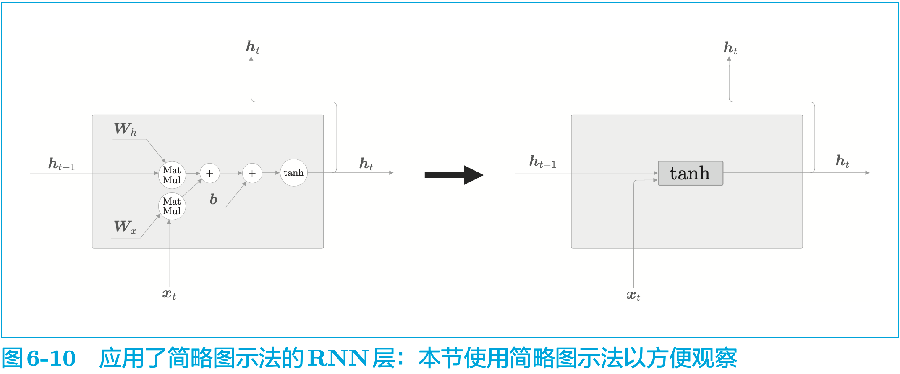

# 0-LSTM

乘法节点

分支节点

Repeat节点

sum节点

MatMul节点

## CBOW

## Skip-Gram

## Transformer

Encoder部分：输出[batch_size, seq_len, emb_size]

Decoder部分：不仅看来自Decoder部分的隐藏状态，还直接看Encoder部分的原始输出

## Elman RNN

Seq2Seq: Sequence to Sequence Learning with Neural Networks

$\boldsymbol{h}_{t} = \tanh(\boldsymbol{h}_{t-1}\boldsymbol{W}_h + \boldsymbol{x}_t\boldsymbol{W}_x + \boldsymbol{b})$

如图 6-10 所示，这里将 $\tanh(\boldsymbol{h}_{t-1}\boldsymbol{W}_h + \boldsymbol{x}_t\boldsymbol{W}_x + \boldsymbol{b})$ 这个计算表示为一个长方形节点 $\tanh$（$\boldsymbol{h}_{t-1}$ 和 $\boldsymbol{x}_t$ 是行向量），这个长方形节点中包含了矩阵乘积、偏置的和以及基于 $\tanh$ 函数的变换。

## LSTM

如图 6-11 所示，LSTM 与 RNN 的接口的不同之处在于，LSTM 还有路径 $\boldsymbol{c}$。这个 $\boldsymbol{c}$ 称为记忆单元（或者简称为 单元），相当于 **LSTM 专用的记忆部门**。 记忆单元的特点是，仅在 LSTM 层内部接收和传递数据。也就是说，记忆单元在 LSTM 层内部结束工作，不向其他层输出。而 LSTM 的隐藏状态 $\boldsymbol{h}$ 和 RNN 层相同，会被（向上）输出到其他层。

从接收 LSTM 的输出的一侧来看，LSTM 的输出仅有隐藏状态向量 $\boldsymbol{h}$。记忆单元 $\boldsymbol{c}$ 对外部不可见，我们甚至不用考虑它的存在。

如图 6-12 所示，当前的记忆单元 $\boldsymbol{c}_t$ 是基于 3 个输入 $\boldsymbol{c}_{t-1}$、$\boldsymbol{h}_{t-1}$ 和 $\boldsymbol{x}_t$，经过 ``某种计算''（后述）算出来的。这里的重点是隐藏状态 $\boldsymbol{h}_t$ 要使用更新后的 $\boldsymbol{c}_t$ 来计算。另外，这个计算是 \[ \boldsymbol{h}_t = \tanh(\boldsymbol{c}_t) \] 表示对 $\boldsymbol{c}_t$ 的各个元素应用 $\tanh$ 函数。

如图 6-14 所示，门的开合程度由 $0.0 \sim 1.0$ 的实数表示（$1.0$ 为全开），通过这个数值控制流出的水量。这里的重点是，门的开合程度也是（自动）从数据中学到的。 有专门的权重参数用于控制门的开合程度，这些权重参数通过学习被更新。另外，$\mathrm{sigmoid}$ 函数用于求门的开合程度（$\mathrm{sigmoid}$ 函数的输出范围在 $0.0 \sim 1.0$）。

## GRU（Gated Recurrent Unit）

C.2 GRU 的计算图

现在，我们看一下 GRU 内部进行的计算。这里用数学式表示 GRU 中进行的计算，并给出与之对应的计算图。另外，计算图使用在第 6 章的 LSTM 的计算图中使用的 $\sigma$ 和 $\tanh$ 等简化版节点。

如图 C-1 所示，相对于 LSTM 使用 **隐藏状态** 和 **记忆单元** 两条线，GRU 只使用 **隐藏状态**。顺便说一下，这和第 5 章讨论的“简单 RNN”的接口相同。

LSTM 的记忆单元是私有存储，对其他层不可见。LSTM 将必要信息记录在 记忆单元 中，并基于记忆单元的信息计算隐藏状态。与此相对，GRU 中不需要记忆单元这样的额外存储。

$$
\begin{align}
\boldsymbol{z} &= \sigma\big(\boldsymbol{x}_t \boldsymbol{W}_x^{(\mathrm{z})} + \boldsymbol{h}_{t-1} \boldsymbol{W}_h^{(\mathrm{z})} + \boldsymbol{b}^{(\mathrm{z})}\big) \tag{C.1} \\
\boldsymbol{r} &= \sigma\big(\boldsymbol{x}_t \boldsymbol{W}_x^{(\mathrm{r})} + \boldsymbol{h}_{t-1} \boldsymbol{W}_h^{(\mathrm{r})} + \boldsymbol{b}^{(\mathrm{r})}\big) \tag{C.2} \\
\tilde{\boldsymbol{h}} &= \tanh\big(\boldsymbol{x}_t \boldsymbol{W}_x + (\boldsymbol{r} \odot \boldsymbol{h}_{t-1})\boldsymbol{W}_h + \boldsymbol{b}\big) \tag{C.3} \\
\boldsymbol{h}_t &= (1-\boldsymbol{z}) \odot \boldsymbol{h}_{t-1} + \boldsymbol{z} \odot \tilde{\boldsymbol{h}} \tag{C.4}
\end{align}
$$

符号说明：
- $\odot$：**哈达玛积（逐元素相乘）**
- $\sigma$：sigmoid 激活函数
- $\boldsymbol{z}$：更新门
- $\boldsymbol{r}$：重置门
- $\tilde{\boldsymbol{h}}$：候选隐藏状态
- $\boldsymbol{h}_t$：时刻 $t$ 最终隐藏状态

GRU中进行的计算由上述4个式子表示（这里$\boldsymbol{x}_t$和$\boldsymbol{h}_{t-1}$都是行向量）， 对应的计算图如图 C‑2 所示。

如图 C‑2 所示，GRU 没有记忆单元，只有一个隐藏状态 $\boldsymbol{h}$ 在时间方向上传播。这里使用 $\boldsymbol{r}$ 和 $\boldsymbol{z}$ 共两个门（LSTM 使用 3 个门），$\boldsymbol{r}$ 称为 reset 门，$\boldsymbol{z}$ 称为 update 门。

 $\boldsymbol{r}$（reset 门）决定在多大程度上“忽略”过去的隐藏状态。根据式 (C.3)，如果 $\boldsymbol{r}$ 是 0，则新的隐藏状态 $\tilde{\boldsymbol{h}}$ 仅取决于输入 $\boldsymbol{x}_t$。也就是说，此时过去的隐藏状态将完全被忽略。 

而 update 门是更新隐藏状态的门，它扮演了 LSTM 的 forget 门和 input 门两个角色。式 (C.4) 的 $(1-\boldsymbol{z}) \odot \boldsymbol{h}_{t-1}$ 部分充当 forget 门的功能。根据这个计算，从过去的隐藏状态中删除应该被遗忘的信息。$\boldsymbol{z} \odot \tilde{\boldsymbol{h}}$ 的部分充当 input 门的功能，对新增的信息进行加权。

综上，GRU 是简化了 LSTM 的架构，与 LSTM 相比，可以减少计算成本和参数。这里，我们不进行 GRU 层的实现，它的代码在 $\texttt{common/time\_layers.py}$ 中，感兴趣的读者可以参考一下。 

那么，我们应该使用 LSTM 和 GRU 中的哪一个呢？由文献\,[32]和文献\,[33]可知，根据不同的任务和超参数设置，结论可能不同。在最近的研究中，LSTM（以及 LSTM 的变体）被大量使用，而 GRU 的人气也在稳步上升。因为 GRU 的超参数少、计算量小，所以特别适合用于数据集较小、设计模型需要反复实验的场景。

