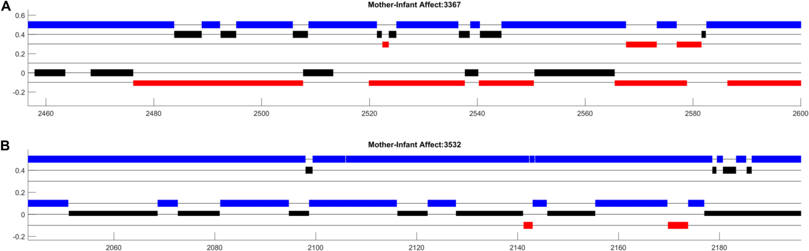
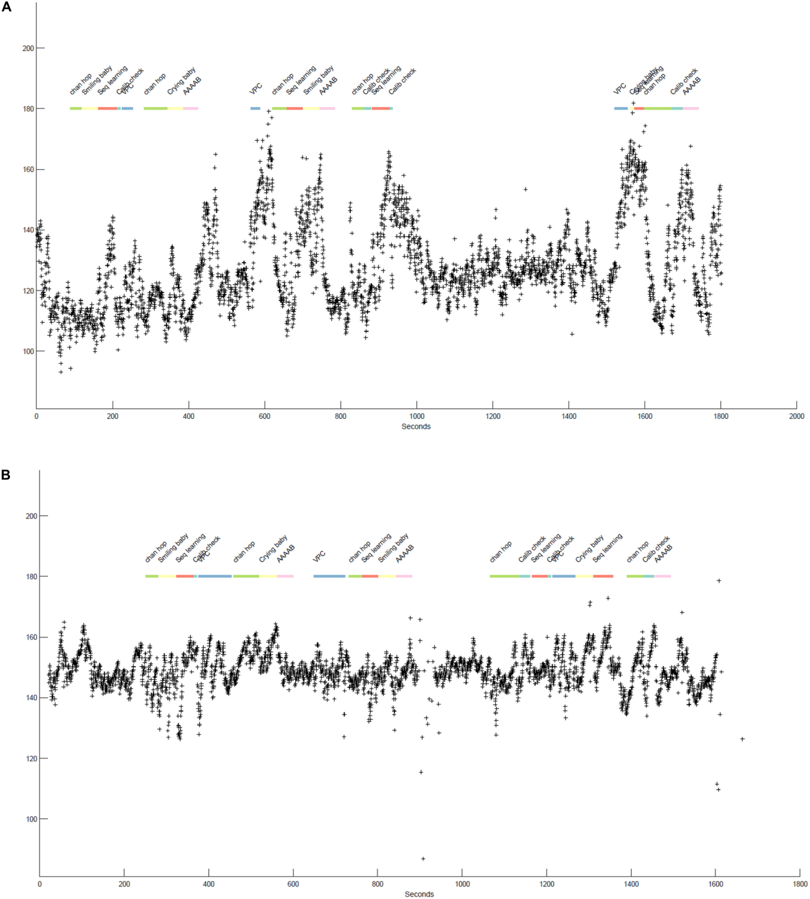
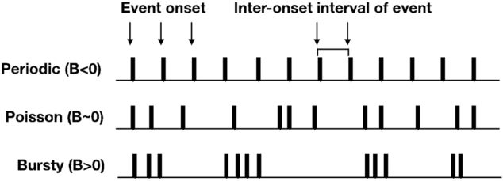
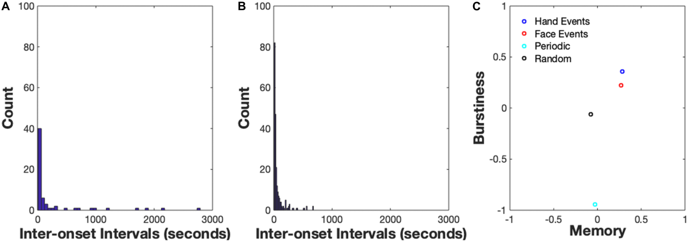
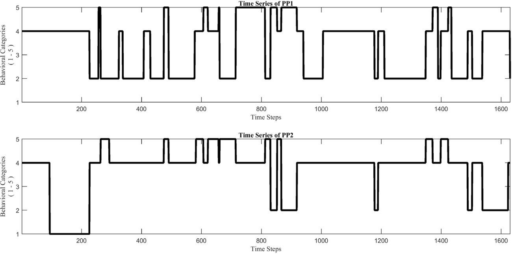
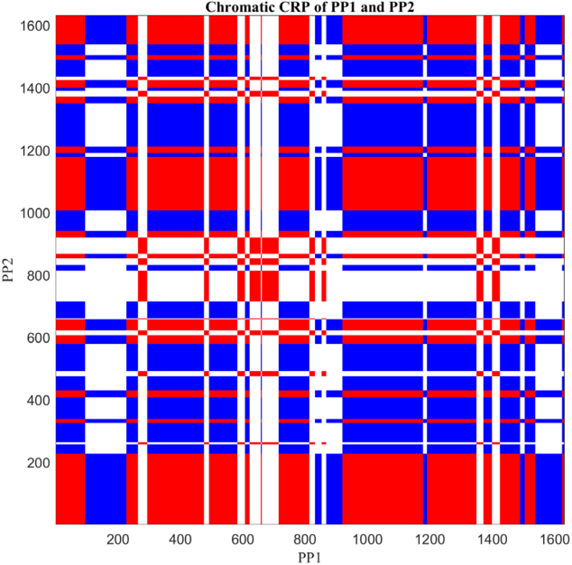
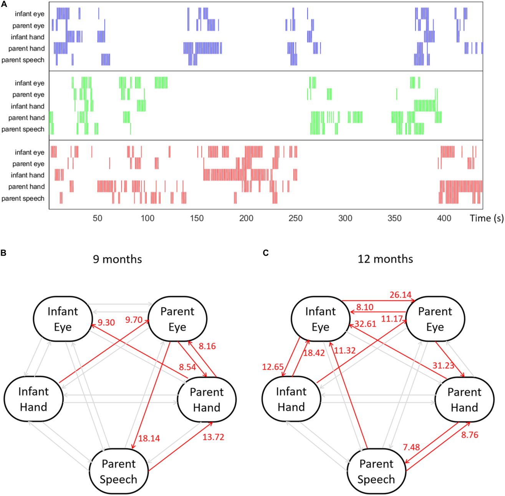

# 在时间中发现结构：行为时间序列的可视化与分析（Finding Structure in Time: Visualizing and Analyzing Behavioral Time Series）

> Tian Linger Xu¹\*†, Kaya de Barbaro²†, Drew H. Abney³, Ralf F. A. Cox⁴
>
> ¹ 印第安纳大学（Indiana University）心理与脑科学系，美国布鲁明顿
>
> ² 德克萨斯大学奥斯汀分校（The University of Texas at Austin）心理系，美国奥斯汀
>
> ³ 辛辛那提大学（University of Cincinnati）心理系，认知、行动与知觉中心，美国辛辛那提
>
> ⁴ 格罗宁根大学（University of Groningen）心理系，荷兰格罗宁根
>
> Frontiers in Psychology, 2020, 11:1457（2020 年 7 月 24 日发表，doi: 10.3389/fpsyg.2020.01457）
>
> †共同第一作者（贡献相同）

本文为心理学家提供一套分析高密度多模态行为数据的方法学教程，核心思路是——**用五个带示例数据和 Matlab 代码的模块，覆盖"可视化 → 突发性（Burstiness）→ 色度/各向异性交叉递归量化分析（CRQA）→ Granger 因果"四种互补技术，从分布规律到非线性结构到方向性影响，层层深入地揭示行为时间序列中的时间结构**。

核心内容：

- 三大挑战：多模态（多通道行为相互影响）、多时间尺度（从 <1 秒的微行为到数年的友谊）、非线性（变化速率本身随时间变化，平稳性假设不成立）
- 模块 1：编程基础——事件数据/时间序列/二值脉冲序列（spike train）三种格式及相互转换
- 模块 2：可视化——多参与者事件图、心率与事件同步图、可穿戴传感器三通道图，"人在回路"发现理论未预设的结构
- 模块 3：突发性分析——$B = (\sigma_\tau - \mu_\tau)/(\sigma_\tau + \mu_\tau)$ ，−1 < B < 0 周期、B ∼ 0 随机、0 < B < 1 突发
- 模块 4：色度与各向异性 CRQA——LAM/TT/Max_L/Ent_L 四个度量分别量化水平与垂直方向模式
- 模块 5：Granger 因果——基于 GLM 的二值脉冲序列点过程框架，AIC 选模型、似然比检验显著性、FDR 多重检验校正

关键发现：

- 示例一：3 月龄母婴互动可视化揭示婴儿负性情感表达的巨大个体差异（<10 秒 vs 近 10 倍）
- 示例二：Hand 事件 $B = 0.36$ 、Face 事件 $B = 0.22$——手部活动比面部活动更成簇、时间尺度更快
- 示例三：CRQA 示例中 UDI 复发率 0.54 > DDI 0.46——不平等二元互动是主导吸引子态
- 示例四：GC 显示父母手动动作显著 Granger-导致婴儿注视行为，且 9→12 月龄间影响增强

---

## 摘要

行为的时间结构包含关于其动态组织、起源和发展的丰富信息。如今，传感和数据存储的进步使研究者能够在实验室内外以精细的时间尺度收集多维度的行为数据，从而促成了大规模多模态行为语料库的构建。然而，伴随这些新机遇的是新挑战。理论对于这些展开中的互动的确切性质往往规定不足，而心理学家在量化行为时间序列中的结构和模式方面，可用的即用型方法和训练都很有限。在本文中，我们将介绍四种技术来解读和分析高密度多模态行为数据，即：（1）可视化原始时间序列，（2）描述时间事件的整体分布结构（突发性计算），（3）用色度与各向异性交叉递归量化分析（CRQA，Cross-Recurrence Quantification Analysis）刻画多时间尺度上的非线性动力学，（4）用 Granger 因果（Granger Causality）量化一组相互依赖的多模态行为变量之间的方向性关系。每种技术都在一个模块中介绍，包含概念背景、来自实证研究的示例数据以及即用型 Matlab 脚本。代码模块展示了每种技术的应用，并配有详细文档，使更高级的用户可以将其适配到自己的数据集。此外，为了使我们的模块对编程初学者更易用，我们提供了一个"编程基础"模块，介绍在 Matlab 中处理行为时间序列数据的常用函数。这些材料共同为一系列分析方法提供了实用介绍，心理学家可以用它们在高密度行为数据中发现时间结构。

**关键词**：时间序列分析、数据可视化、突发性、交叉递归量化分析、Granger 因果、高密度行为数据

## 引言

我们的标题灵感来自 Jeffrey L. Elman 一篇极具影响力的论文，该论文强调了刻画行为时间结构对于理解人类认知的重要性（Elman, 1990）[42]。我们认为这对于研究人类发展更为成立。所有形式的行为都组织为实时事件的级联（Spivey and Dale, 2006; Adolph et al., 2018）[104, 5]。婴儿行为及其与世界互动的微动力学塑造了他们的跨领域纵向轨迹，从运动和语言发展到社会情感发展和精神病理学（Thelen, 2000; Adolph and Berger, 2006; Masten and Cicchetti, 2010; Landa et al., 2013; Blair et al., 2015; West and Iverson, 2017）[110, 3, 86, 78, 15, 118]。通过研究行为随时间展开的过程，我们能够揭示关于其动态组织、起源和发展的丰富信息（Bakeman and Quera, 2011）[10]。

在过去二十年中，传感和移动计算的技术进步为研究者提供了在实验室内外以精细时间尺度收集行为数据的新方法（de Barbaro, 2019）[31]。这促成了大规模多模态行为语料库的构建（Yang and Hsu, 2010; Franchak and Adolph, 2014; Smith et al., 2015; Matthis et al., 2018）[126, 46, 103, 87]。利用这些海量新数据集来刻画人类行为的复杂过程，为所有领域的心理学家带来了突出的机遇，也带来了挑战。

对这些丰富的行为数据语料库的分析面临三个主要挑战。第一个挑战是我们的世界是深刻多模态的（Smith and Gasser, 2005; Kolodny and Edelman, 2015）[102, 77]。行为由多个时间锁定的感觉-运动系统组织而成，这些系统同时相互影响（Garrod and Pickering, 2009; Louwerse et al., 2012; Fusaroli and Tylén, 2016）[53, 81, 51]。在日常社交互动中，人们通过注视、言语、面部表情、手势甚至身体动作进行交流（Vinciarelli et al., 2009; Knapp et al., 2013; de Barbaro et al., 2016b）[115, 76, 36]。在互动的每一个时刻，对话者相互响应对方的多模态行为信号，做出调整，并实时影响对方。这对研究个体内部和个体之间活动复杂结构的研究者提出了一个重大挑战。具体来说，当多个变量相互依赖时，应该如何量化系统内从一个行为变量到另一个的方向性影响？

第二，行为在许多不同且相互关联的时间尺度上发生和展开（Ballard et al., 1997; Wijnants et al., 2012a; Abney et al., 2014; Fusaroli et al., 2015; Darst et al., 2016; Den Hartigh et al., 2016）[11, 120, 2, 50, 29, 41]。面部表情、注视转移和大笑爆发发生在短时间尺度上，通常持续不到一秒（Kendon, 1970; Hayhoe and Ballard, 2005; de Barbaro et al., 2011; Knapp et al., 2013）[72, 66, 32, 76]。在更长的时间尺度上，这些微行为组织成更长的互动片段。例如，对话发生在分钟或小时的时间尺度上，为语言发展做出贡献（Cox and van Dijk, 2013）[27]，而友谊可以持续数年或数十年（Demir, 2015）[40]。不同时间尺度上的行为具有各自的涌现性质，并具有层级关系。例如，读睡前故事由一系列活动组成，包括选书、读书、以晚安吻结束故事，通过一套复杂的具身发声和注意交换来协调（Sénéchal et al., 1995; Rossmanith et al., 2014; Flack et al., 2018）[98, 96, 44]；行走从成千上万步和数百次失败尝试中涌现（Adolph et al., 2011; Adolph and Tamis-Lemonda, 2014）[4, 6]；安全（或不安全）的关系由跨越数天、数月甚至数年的无数次互动、游戏活动和对话形成（Granic and Patterson, 2006）[62]。为了充分描述和建模人类行为的多尺度性质，我们需要能够识别或整合跨这些时间尺度的活动变化的层级方法，例如，刻画第一年内联合活动期间互动模式如何变化（de Barbaro et al., 2013; Rossmanith et al., 2014）[35, 96]，或面部活动的微动力学如何组织成笑与哭（Messinger et al., 2012）[90]。

最后一个挑战是行为时间序列的变化通常是非线性的（Carello and Moreno, 2005; Dale and Kello, 2018）[20, 28]。我们知道行为会随时间变化，但我们常常忽略这些变化的速率也可能随时间变化这一事实。传统统计方法假设收集到的行为数据的变化在时间上是平稳的。然而，这一假设在各种复杂环境中并不成立，因此结果在平均化过程中丢失。例如，Tamis-LeMonda et al. (2017) [109] 记录了父母在 45 分钟亲子自然游戏环节中产生的言语，并计算了词型-词例比（word-type over word-token ratio）作为言语复杂度的度量。词型词例比既在整个游戏过程中计算，也在从开始到结束的每一分钟内计算。结果显示，在游戏过程中，原始言语数量和词型词例比都出现了大幅的时间波动。父母的言语不是均匀的；相反，言语的结构和复杂度取决于实时的游戏内容。因此，假设行为变化和互动变化是平稳的聚合性方法，很可能错过动态活动的真实复杂性。随着越来越多的研究致力于在更自然的实验设置中发现重要问题，我们需要能够揭示人类行为跨时间尺度非线性变化的方法。

总的来说，可以说现代行为科学面临着"维度灾难"（Bellman, 1961）[13]：在相对无约束的环境中收集的多模态、高密度时间数据集导致了分析过载。这些海量数据尚未被真正充分利用（Aslin, 2012; Yu et al., 2012）[8, 128]。关键的是，几乎没有特定领域的分析工具能够利用这些新兴数据集来刻画人类活动的高密度多模态动力学。事实上，这些系统的复杂性意味着没有任何单一工具能够量化复杂行为并发现有趣模式（Gnisci et al., 2008）[55]。在本文中，我们为读者提供四种分析技术的实用介绍，用于刻画高密度行为数据的时间结构。每种技术都在一个模块中介绍，附带示例数据和 Github 上的代码，https://github.com/findstructureintime/Time-Series-Analysis（Xu et al., 2020）[124]，以及正文中的概念材料，包括对技术的解释及其在代码模块中提供的展示示例数据上的应用。

这些模块所涵盖的技术可以用来刻画行为数据时间结构的不同方面。第一个模块提供了一个逐步的"编程基础"教程，向用户介绍常见的行为时间序列数据以及导入和操作这些数据所需的脚本。目标是给新手用户提供开始处理行为时间序列数据并理解后续模块所必需的基础。它还提供了在常见数据格式之间转换数据的脚本，以便于修改模块材料以适应用户数据。第二个模块专注于原始行为数据的可视化。可视化使研究者能够观察复杂多模态数据在多个时间尺度上的丰富动力学，使活动的结构在理论上未预先规定的情况下变得明显。因此，可视化可以作为"人在回路"（human-in-the-loop）分析的一部分，建议最合适的变量或分析（Card et al., 1999; Shneiderman, 2002）[19, 99]。第三个模块介绍了一种描述时间事件分布结构的方法：突发性计算。这是一种量化事件发生的时间规律性的方法（Goh and Barabási, 2008）[56]。第四个模块解释了色度和各向异性交叉递归量化分析，可用于刻画多个时间尺度上的耦合非线性动力学。这些技术可以揭示不同类型的递归行为模式，并可以量化两个时间变量之间耦合强度的不对称性。最后一个模块介绍 Granger 因果，作为量化多个行为时间序列之间方向性关系的新方法。多通道行为往往是相互依赖的。这种技术提供了一种在考虑系统中所有变量的同时，研究从一个行为时间序列到另一个的独特影响的方法。

总之，本文介绍的技术涵盖了处理时间序列数据的心理学家的广泛分析需求：从可视化到计算分析；从量化分布规律到发现底层非线性结构和同步模式；从描述单个行为时间序列内的模式到计算多模态行为时间序列之间的定量方向性关系。我们的目标是让初学者和经验丰富的程序员都能选择性地从提供的材料中受益。新手程序员如果仔细完成模块 1 和 2 中的材料，然后再尝试运行或修改后面的模块，将获益最多。更有经验的程序员可以更有选择性地专注于他们最感兴趣的模块，修改脚本以满足自己的分析目标。

所有相关脚本都可以使用 Windows、macOS 和 Linux 操作系统上的 Matlab 2018a 及更高版本运行和编辑。虽然 Matlab 需要付费订阅，但许多机构提供免费访问该软件。不熟悉 Matlab 的读者建议参考 Mathworks 网站，那里有完整的免费校园许可证列表。或者，读者可以使用开源 GNU Octave（5.2.0 或更高版本，可在 GNU/Linux、macOS、BSD 和 Windows 上运行）来运行和修改脚本。

## 模块 1：时间序列编程基础

为了使我们的模块对新手程序员可及，第一个模块提供了一个教程，向新手程序员介绍行为科学研究中常见的的主要时间数据类型，以及处理多模态时间行为数据有用的基本语法。该模块还引导用户完成时间序列数据的导入、操作和简单绘图。目标是给几乎没有编程背景的用户提供相关的编程经验，以开始处理自己的时间数据集。虽然编程专业知识是一个永远没有真正"完成"的持续学习实践，但这些脚本可以作为一个起点，让缺乏经验的读者建立理解和修改后续模块中的脚本所需的技能和信心，以适配他们自己的数据和研究问题。

此外，该模块提供了将发展科学研究中常用的标注软件（如 Elan、The Observer 或 Mangold Interact）（Noldus, 1991; Wittenburg et al., 2006; Mangold, 2017）[92, 122, 84] 的输出转换为与所有后续模块兼容的数据格式的脚本。因此，这些脚本进一步使新手程序员能够将后续模块应用到自己的数据上。

### 方法

发展科学研究中最常见的时间数据类型是事件数据和时间序列数据。事件数据是指每个感兴趣的事件由起始时间戳、结束时间戳和第三个表示行为代码的值（即注视或操作某个目标对象）指示的数据。事件数据通常用于表示离散行为，包括例如婴儿注视序列或二元互动状态序列。事件数据还可以包括间隔不规则的数据，如生态瞬时评估的列表，配以其完成的时间。在发展科学领域内，事件数据通常由对音频或视频记录的人工标注（即标记）生成。相比之下，时间序列数据是以指定采样率在等间隔时间上采样的数据点，例如 10 Hz 意味着每 100 ms 采样 10 个数据点。常见行为时间序列数据的例子包括：两个互动者之间互相注视（mutual gaze）的逐帧存在与否、在 10 分钟游戏环节中每秒记录的正性或负性情感状态，或每 5 秒间隔内观察到的婴儿第一人称视角中照料者面部是否存在。

二值脉冲序列（binary spike train）数据是时间序列数据的一种特定类型，其中 '1' 表示感兴趣事件的发生（onset），'0' 表示未发生的时刻（也称为"点过程数据"）。这种类型的时间序列数据用于计算发生间间隔（inter-onset interval），即连续事件发生之间的持续时间，或构建事件发生可能性的似然模型。

注意，任何事件序列数据都可以转换为时间序列。此外，时间序列数据可以转换为事件数据，尽管对于连续时间序列，这可能需要设置阈值将数据"解析"为不同的事件。最后，事件数据可以通过在二值脉冲序列时间序列中仅包含事件的发生时刻来转换为二值脉冲序列。这是至关重要的，因为有些分析需要一种数据格式而不是另一种。具体来说，事件数据输入用于模块 1 和 2（可视化），时间序列数据输入用于模块 1、2（可视化）和 4（递归量化分析），二值脉冲序列输入用于模块 3（突发性分析）和 5（Granger 因果）。

### 示例数据与脚本

该模块包括七个脚本以及 readme.md 中的逐步教程说明。

#### 数据

为了向读者介绍时间序列和事件数据类型，该模块包括来自一项联合活动发展研究的简单示例数据，该研究检查了母亲和婴儿对三个可用对象的注视和触碰行为的逐帧标注（de Barbaro et al., 2016b）[36]。此外，它还包括几个从标注软件 Mangold（Mangold, 2017）[84] 导出的示例文件，将用于练习数据导入和数据格式转换。这些文件包含多个维度的数据，包括母亲和婴儿的情感事件。用户还将在模块 2 中使用该示例数据集创建可视化。

#### 脚本

第一个脚本（programmingBasics.m）提供数据文件导入和数据操作的基础，包括访问和向数据数组添加值，以及计算行为时间数据的基本特征。另外两个脚本提供了绘制和修改简单事件和时间序列数据的基础（timeseriesBasics.m 和 eventDataBasics.m）。这些脚本允许用户用简单的图查看行为数据，并提供颜色和线条规范的常见修改以及坐标轴和标题的修饰语法。它们还向用户介绍总结和组合数据流的技术，以及循环遍历数组的 "for 循环"。所有三个脚本都设计为一次运行一行，脚本材料旨在展示各种类型的操作及其输出，详见 readme.md 文件和脚本中的内联文档。此外，前两个脚本包含带答案的练习问题，以挑战用户开始独立修改脚本。

第四个脚本引导用户完成从常见标注软件导入和转换事件编码数据的过程。标注软件的输出通常包含数字和文本数据，使用常见的文件读取函数难以导入。annotationImport.m 脚本提供了将标注软件输出转换为干净的事件数据格式的代码，该格式可以在 Matlab 中轻松操作和访问，并将在模块 2 中使用。

第五和第六个脚本 convertEvents2Timeseries.m 和 convertTimeSeries2Events.m，提供了将导入的事件数据序列转换为时间序列格式以及将时间序列数据转换为事件格式时间数据的代码。最后，convertEvents2Binaryspikes.m 脚本可用于将 annotationImport.m 函数导出的事件数据转换为二值脉冲序列数据。因此，这些脚本使研究者能够更容易地转换自己的输入数据，以供后续模块以及其他潜在应用使用。

## 模块 2：了解你的数据：高密度多模态互动的可视化

该模块介绍可视化行为数据流的更复杂技术。随着视频和传感技术的进步，研究者越来越有可能使用高密度多维数据来洞察行为的实时过程（de Barbaro, 2019）[31]。例如，对理解早期情绪调节感兴趣的研究者可以标注——或潜在地自动检测标记——母亲和孩子情感、注视和触碰模式的逐帧变化，以检查母亲用来调节儿童痛苦的实时策略及其对后续安抚的影响（例如，见 Ye et al., 2012; Kim and Clements, 2015; de Barbaro et al., n.d.）[127, 74, 37]。这些标注可以进一步与心率或脑电信号同步（de Barbaro et al., 2017; Wass et al., 2019）[34, 116]，以检查并发的生理调节，或评估生理上的个体差异是否可能调节母亲调节努力的影响。

数据可视化可以突出参与者和参与者之间这种复杂行为过程的结构，为研究者提供整个分析过程中的关键洞察（Gnisci et al., 2008）[55]。在分析的早期阶段，原始或最小处理数据的可视化可以提供对底层模式和规律性的洞察。关键的是，高密度多模态数据集的新颖性意味着社会科学家在这些数据如此高的粒度水平上词汇和洞察力有限。在这种情况下，使用预先规定的度量总结数据可能具有误导性，并且有可能忽略数据中最相关或最有趣的特征。通过提供对原始数据的检查途径，可视化可以突出可能未被现有理论规定的时间或多模态结构（Yu et al., 2012）[128]。

在分析的后期阶段，数据可视化可以确保感兴趣现象操作化的有效性和质量，并帮助解释观察到的结果。例如，处理高密度数据集的一种有用方法是识别数据流中出现的重复"事件"（de Barbaro et al., 2013; Granic and Hollenstein, 2016）[35, 61]。此类事件可以帮助将展开的互动解析为可管理且相关的行为实例。如果事件是从原始数据中导出的，在原始数据的时间线中标记它们的位置可以帮助确保事件边界的有效和有意义的定义。此外，对原始数据与越来越多处理过的数据进行迭代可视化，可以指示事件相对于其他数据流的密度和时间顺序，帮助指导相关分析技术的选择。

### 方法

创建直观且有意义的可视化涉及许多方法学考虑。收集到的时间数据可能包括多个通道，每个通道代表行为的不同维度或模态，每个可能具有不同的性质。例如，研究者可能想将代表二元行为（如联合注视的存在与否）的多个时间数据通道，与具有许多不同互斥类别的数据（如定性不同的情绪或二元状态），或连续数据（如生理信号），或从更负面到更正面排序的情感水平结合起来。颜色、位置和线条样式可以用来表示这些不同类型的活动，以最直观地突出多模态行为的结构。例如，定性不同的活动可能用不同的颜色更好地表示，而连续情感可能最好通过时间序列来表示。或者，连续情感数据的结构可能通过将连续情感数据解析为"正面"、"负面"和"中性"类别来最好地揭示。最终，这些决定是通过理论、直觉和简单试错的混合做出的。

总的来说，高密度多模态数据的可视化通常需要数据收集或标注软件自带的现成可视化工具所不具备的灵活性。脚本化可视化提供了对这些决定的无限控制，最终允许对数据结构的可定制探索。因此，当前模块展示了三组用于可视化发展科学家收集的复杂多模态数据的脚本。数据集涵盖多参与者事件数据、与事件数据同步的生理数据，以及来自可穿戴传感器的多个同步生理活动通道。最后，该模块中的脚本允许对多个研究参与者进行批处理，便于参与者内部和参与者之间的比较。我们建议从 6-10 个研究参与者的可视化开始，以了解数据的结构和变异性，如果饱和度不明显再增加人数。

### 示例数据与脚本

该模块建立在模块 1 中提供的基本数据操作和绘图技术之上，为读者提供可视化更复杂的多模态和多参与者行为数据的经验。可视化模块包括来自三个不同数据集的示例数据、三个主要脚本（包括演示脚本 demo_visualizations）以及一个提供运行每个脚本说明的 readme.md 文件。演示脚本可用于创建许多引人入胜的高密度多模态行为数据图。

#### 数据

为了给用户提供绘制各种不同类型数据流的经验，提供了三个示例数据集：（1）有抑郁史的母亲样本中的母婴情感逐帧数据（Lusby et al., 2014; Goodman et al., 2017）[82, 57]，（2）在包含在显示器上呈现的注意力和学习任务的实验室环节中收集的婴儿心率数据（de Barbaro et al., 2016a, 2017）[33, 34]，以及（3）模块作者佩戴腕戴式生理传感器的试点数据，传感器收集她在系里做研讨会那天的的心率、皮肤电活动和运动。要在自己的数据上使用这些脚本，用户需要使用模块 1 中的 annotationImport.m 和 convertEvents2Timeseries.m 脚本将数据格式化为时间序列和/或事件。

#### 脚本

该模块中的三个脚本为用户提供了多模态数据集的实用可视化技术。multiParticipantEventPlotting.m 脚本将母亲和婴儿情感的三个维度绘制到一张图中，通过直观的颜色和垂直位置区分正面、中性和负面情感。plotTimeseriesWithEvents.m 脚本将同步的时间序列（婴儿心率）和事件数据（任务）组合到一张图中，以提供对婴儿活动与生理变化之间潜在关系的洞察。最后，plotSensorData.m 脚本将三种不同类型的可穿戴生理数据绘制在一张图的三个子图中，以指示这些度量之间的时间关系。该脚本处理 Unix 时间戳，这是传感器平台常用的一种特殊时间格式。

### 结果

为了提供可视化所能提供的洞察类型的例子，我们将逐一讲解由脚本 multiParticipantEventPlotting.m（图 1）和 plotTimeseriesWithEvents.m（图 2）生成的图。

图 1 显示了来自两个母婴二元组（dyad）的约 150 秒动态情感数据，他们在 3 月龄时参与了面对面的自由游戏环节。虽然该图像的颜色和位置参数可以任意改变，但以直观的方式设置这些参数可以极大地促进图的解读（Tufte, 2001）[112]。在这个例子中，y 轴上较高的位置对应更正面的情感，红色表示痛苦，且颜色在母亲和婴儿的情感状态之间保持一致。此外，简单的黑色线条（"kebab lines"）帮助观察者定位可能存在数据的位置。最后，设置条形的宽度和高度，使母亲和婴儿情感的每个维度"接触"，突出了母亲和婴儿情感之间的潜在相依性（contingency）。

**图 1：** 两个母婴二元组在 3 月龄时参与面对面自由游戏环节的情感数据。x 轴显示时间（秒），y 轴区分情感的不同维度。母亲的情感在上方三行（A）表示，婴儿的情感在下方三行（B）表示。对于母亲和婴儿，三行中最高的（蓝色）代表正面情感，中间行（黑色）代表中性情感，底部行（红色）代表负面情感。

以这种方式组织，图突出了互动的显著方面，可以在系统分析中进一步检查。首先，在两个二元组中，我们都观察到母亲和婴儿在整个环节中在不同的情感状态之间循环。此外，母亲和婴儿之间似乎存在许多相依性情感转变的实例。注意，例如，二元组 3532 中母亲显示的每次情感转变（图 1B）似乎都以婴儿情感的转变（图 1A）为前提。也许最引人注目的是，我们观察到两个婴儿之间负面情感表达的强烈差异，一个婴儿表现出不到 10 秒的负面情感，而另一个表现出近 10 倍的时间。对额外参与者的可视化（未显示）表明，婴儿负面情感表达在 10-20% 的母婴互动中水平很高。这使我们考虑到，母亲在相依性地回应婴儿方面面临的挑战存在巨大差异，这可能调节相依性情感回应与婴儿情感纵向发展之间的关系。这也使我们想知道母亲活动模式是否促成了婴儿情感的这种差异，因为照料者敏感性通常与婴儿负面情感表达相关。我们正在正在进行的研究中探索这些问题（de Barbaro et al., 2020）[38]。

图 2 显示了两个 12 月龄婴儿在实验室环节中参与不同任务时约 25-30 分钟的心率数据。这些图共同突出了婴儿心率反应性的个体差异以及任务相关心率变化的存在。心率反应性的差异在每个婴儿内部跨任务保持稳定，即图 2A 持续显示对任务的强烈反应，心率增加范围从 20 到 80，而图 2B 显示任务相关的心率增加温和得多，心率通常从任务开始增加 20-30 次搏动。

两个婴儿都没有显示出明显的环节级效应，即心率增加通常随后回到某种"基线"。然而，在任务之间存在间隙的地方（例如图 2A 的 1,000 到 1,600 秒之间），两个婴儿的心率都显著更低且更稳定，再次表明任务本身对婴儿来说是唤起性的或潜在有压力的。最后，两个婴儿在任务开始时的低心率区间（涵盖 "chan hop" 和 "smiling baby" 任务）表明该环节的这一段可能作为有效基线。我们在多篇手稿中跟进这些生成的洞察。例如，我们检查了视觉配对比较（VPC，习惯化）任务中心率反应性的个体差异及其与该任务表现的关系（de Barbaro et al., 2016a）[33]。我们还检查了环节中心率的变化如何与眼动仪测量的注视时长所评估的注意力变化相关（未在此处绘制；见 de Barbaro et al., 2017）[34]。

**图 2：** (A, B) 展示了两个婴儿在实验室环节中参与各种任务的逐搏心率数据（用 + 符号表示）。x 轴显示时间（秒），y 轴以等效每分钟搏动数指定心率值。顶部的彩色线条代表婴儿参与的具体任务，用颜色和标签区分。每个段的边界指示每个任务的开始和停止时间。

### 讨论

正如 Bakeman and Quera (2011) [10] 所指出的，序列分析不是"现成的"。没有任何单一分析工具能够刻画社交互动的密集、多通道行为动力学。相反，研究者应该预期一个迭代过程，以收敛到能够捕获其数据时间结构的分析工具（de Barbaro et al., 2013）[35]。高密度行为数据的可视化在这个过程中被证明是至关重要的。特别是，以直观方式可视化的数据可以突出活动时间结构的显著方面，从而指导相关分析技术的选择。

## 模块 3：用突发性分析挖掘发展数据的时间结构

在本节中，我们将介绍发展科学家如何将简单的分布分析应用于时间序列数据，以估计事件级数据集的时间结构的方法学进展。突发性分析对于有兴趣研究行为时间模式的心理学家是有用的。例如，使用简单度量量化和/或分类行为时间模式的能力，可以导致生成和检验关于特定行为如何随时间展开的假设。这种分析首先在统计物理学中引入（Goh and Barabási, 2008）[56]，在突发性维度上刻画人类行为的脉冲序列，从周期性（ $-1 < B < 0$ ），到随机（ $B \sim 0$ ），到理论上最大的突发性（ $0 < B < 1$ ）（见图 3）。

**图 3：** 近似周期、Poisson 和突发时间结构的脉冲序列玩具示例。

### 方法

如上所述，该分析要求用户具有 0 和 1 的二值脉冲序列，其中 '1' 表示感兴趣事件的发生，'0' 表示未发生发生的时刻。发生间间隔从二值脉冲序列计算，然后发生间间隔分布被提交给突发性估计。一个简单的方程在假设无限时间序列的情况下提供了突发性估计：

$$
B = \frac{\sigma_\tau - \mu_\tau}{\sigma_\tau + \mu_\tau}
$$

其中 $\sigma_\tau$ 是发生间间隔分布的标准差， $\mu_\tau$ 是发生间间隔分布的均值。突发性分析的一个最新补充包括一个更新的方程，该方程考虑了分布中发生间间隔的数量，因此对使用有限时间序列的经验工作更相关（Kim and Jo, 2016）[73]。当发生间间隔分布包含超过 100 个间隔时，两个方程的估计收敛。

### 示例数据与脚本

突发性模块包含两个数据样本、两个脚本（包括一个量化和可视化不同数据流突发性的演示文件）以及一个提供运行脚本逐步说明的 readme.md 文件。

#### 数据

示例数据来自发展研究中的一个随机选择的被试，该研究以 1/5 Hz 的采样率在婴儿的自然环境中收集自我中心视图（见 Jayaraman et al., 2015, 2017; Fausey et al., 2016; Jayaraman and Smith, 2019）[68, 69, 43, 70]。人工编码者对每一帧视野中是否存在手或面部进行编码。示例数据包括两个脉冲序列，一个用于手进入视野的时刻，一个用于面部进入视野的时刻。要在自己的数据上使用该脚本，用户需要将数据格式化为二值脉冲序列，他们可以使用模块 1 中的 convertEvents2Binaryspikes.m 脚本来完成。此外，用户应注意用于收集和处理数据的采样率，因为这将约束对发生间间隔幅度的解释。

#### 脚本

演示脚本 demo_bursty.m 计算两个示例脉冲序列的突发性。它还生成一个周期性脉冲序列和一个由 Poisson 过程生成的随机脉冲序列，并计算这些数据流的突发性，以为示例数据的突发性值提供比较。最后，它生成一个图（图 4），提供每个脉冲序列突发性的视觉比较以及示例数据流发生间间隔的分布。更多细节在脚本内联文档中提供。

### 结果

demo_bursty 脚本的结果如图 4 所示。前两个图像显示两个示例数据流的发生间间隔（IOI）分布。周期性信号的 IOI 分布（ $B < 0$ ）会在一个特定时间尺度上显示高计数的 IOI，例如大量长度为 10 秒的 IOI。相比之下，突发信号的 IOI 分布（ $B > 0$ ）通常是右偏的，表明短 IOI 频率高，较长 IOI 数量较少（但非零）。突发性估计值 $B$ 沿图中最右侧图像的 y 轴标示。x 轴是事件序列记忆的度量，通常用滞后 1 自相关系数估计。由于该模块的入门性质，我们在此不详细讨论记忆的概念，全面解释请见 Goh and Barabási (2008) [56]。注意，经验脉冲序列的突发性值都是正的，意味着它们都处于"突发"状态，而不是"随机"或"周期"状态：Face 脉冲序列 $B = 0.22$ ，Hand 脉冲序列 $B = 0.36$ 。这两个突发性估计表明，与面部活动片段相比，手部活动片段在时间上更成簇，并且有不发生手部活动的更长时间段。观察到手部事件比面部事件更突发也表明，与面部事件进出婴儿视野相比，手动活动片段可能以更快的时间尺度发生。此外，观察到手部事件和面部事件都不是以周期或随机时间结构组织的，表明作用于这两个信息源的是一组更复杂的约束，如社交互动、玩具游戏等。最后，随机分布事件的突发性估计约为 0，周期分布生成的事件的突发性略小于 $-1$ ，正如对这些分布的预期。

**图 4：** (A) 手部事件的发生间间隔分布，(B) 面部事件的发生间间隔分布。对于周期性信号的 IOI 分布（B < 0），用户会观察到一个特定时间尺度上 IOI 的高计数，例如大量长度为 10 秒的 IOI。对于突发信号的 IOI 分布（B > 0），通常是右偏的，表明短 IOI 频率高，较长 IOI 数量较少（但非零）。(C) 突发性-记忆图。x 轴是事件序列记忆的度量，通常用滞后 1 自相关系数估计。

### 讨论

突发性分析使研究者能够为感兴趣事件的时间结构提供一个简单的指标。将突发性分析应用于广泛行为事件序列的一个关键限制是 $B$ 估计值在不同数据集之间的相对幅度。这一限制表明，用户在直接比较跨数据集的 $B$ 估计值时应谨慎。最近将突发性分析应用于多模态人类互动的研究（Abney et al., 2018）[1] 中使用的一种策略是生成自举置信区间，以确定周期、随机和突发时间结构的分类边界。例如，Poisson 过程由指数分布的事件间间隔分布生成。因此，研究者可以通过首先模拟一个与经验数据集具有相似性质（例如事件间间隔分布的平均大小）但来自指数分布的事件间间隔分布样本，然后估计突发性分析会归类为 Poisson（ $B \sim 0$ ）的置信区间的下限和上限，来生成置信区间。生成突发性分析会归类为 'Poisson' 的上下界自举置信区间，可以让研究者随后对具有已知突发性值的经验脉冲序列进行分类。虽然这种策略允许研究者将行为事件分类为直观的时间结构类别，但该策略的主要限制是分类不允许研究者对 $B$ 估计值的幅度和认知机制做出假设、检验假设和拒绝假设。尽管用户应考虑这些重要限制，突发性分析提供了一个简单的度量，可以告知研究者感兴趣行为的时间结构。

## 模块 4：二元互动的交叉递归量化分析

本节介绍的技术是递归量化分析（RQA，Recurrence Quantification Analysis）（Marwan et al., 2007）[85] 的变体，RQA 是一种源自自然科学的强大非线性时间序列技术，在过去二十年中在社会科学中获得了普及。RQA 可以应用于连续和名义测量水平的数据，以及单一数据流和一对数据流。后一种版本的技术称为交叉递归量化分析（CRQA）（Shockley et al., 2002）[100]。在本模块中，我们将重点关注名义数据流的两个最新进展，即色度 CRQA 和各向异性 CRQA（Cox et al., 2016）[26]，它们特别适用于分析二元互动中的分化和不对称性。这一选择基于两个观察：第一，心理学中的许多数据集来自对音频或视频记录的标注、对跨兴趣区域（ROI，Region of Interest）注视的手动或自动登记，或产生行为类别（即名义事件或时间序列数据）的独特行为的有序序列的类似程序。第二，许多研究问题涉及社交互动，其中一些人（通常是二元组）参与某种形式的人际行为，例如两个孩子在任务上合作（Guevara et al., 2017）[63] 或母婴喂养互动（van Dijk et al., 2018）[114]。CRQA 使研究者能够研究此类二元组中的调谐（attunement）和协调。二元互动通常由互动伙伴的几种类型的匹配和不匹配（即集体）行为的递归模式组成。这些模式可以有各种持续时间，并且可能在互动的不同片段之间潜在耦合。也就是说，互动伙伴可能（几乎）立即影响对方的行为，但这种影响也可能延迟或长或短的时间。此外，二元调谐有时是短暂的，仅由单一行为类别组成，但它也可能是由几个不同类别组成的较长行为序列。CRQA 检测此类行为模式并量化其动态特征和时间关联。此外，人们可能希望分别跟踪二元组不同类型集体行为，并权衡每个互动伙伴对递归模式的相对贡献。色度和各向异性 CRQA 促进了这一点。它可以揭示大多数其他时间序列方法无法获得的数据流中跨不同时间尺度的的时间结构。有几篇好的文本解释了连续和名义时间序列的 CRQA，强调概念问题和应用（Webber and Zbilut, 2005; Marwan et al., 2007; Wijnants et al., 2012b）[117, 85, 121]。在以下小节中，我们将介绍色度和各向异性 CRQA 的技术基础，详述我们代码模块中的关键脚本，并用一个例子解释色度和各向异性 CRQA 的派生度量和特征。

### 方法

CRQA 的核心特征是交叉递归图（CRP，Cross-Recurrence Plot；图 5），它基于"递归"可视化互动的时间组织。什么算作递归由研究者预先定义，在其最一般的形式中，它可以是两个互动伙伴个体行为的任何匹配对（例如，共享注视、双方举起，以及互补的"匹配"，如说-听、给-收）。对于名义数据，通过在两个数据流的整个长度（ $N$ ）上跟踪此类行为匹配，可以很容易地构建 CRP。通过将一个数据流沿水平轴放置，另一个沿垂直轴放置，行为匹配的出现被绘制在具有 $N$ 行和 $N$ 列的二维 CRP 中。CRP 中的每个点代表水平呈现的互动伙伴的行为状态被垂直呈现的伙伴以特定方式匹配的实例。当需要同时跟踪几种不同类型的行为匹配（即定性不同的行为类别组合）时，这可以在 CRP 中用颜色编码表示。这在图 5 中表示，其中你可以看到两种颜色，代表两种类型的行为匹配（白色区域是剩余的非匹配状态）。这个版本的方法称为色度 CRQA（见 Cox et al., 2016）[26]。

CRP 中点的分布捕获了互动动力学，可以派生几个度量来量化这一点。最简单的度量是递归率（RR，Recurrence Rate），即行为匹配的比例。RR 提供了两个互动伙伴之间跨多个时间尺度的协调的粗略度量。注意，图 5 中的单个点不再可见，因为它们往往构成更小和更大的矩形模式。这在来自二元互动的名义数据的 CRP 中相当常见，反映了互动的持续性以及测量的粗粒度性质（Cox et al., 2016; Xu and Yu, 2016）[26, 125]。矩形模式表示一个互动伙伴的一段行为类别使用期，伴随着另一个互动伙伴的某段匹配行为类别使用期。模式越不对称，一个互动伙伴执行匹配行为相比另一个越短暂。因此，CRP 中的整体不对称性（或更确切地说：各向异性）与动力学中的不对称性相关，并提供关于互动伙伴之间相对贡献和支配地位差异的信息。

**图 5：** 两个名义时间序列（example_data.mat），每个反映了二元互动中一个孩子的合作行为流，对每个孩子使用相同的五个特定行为类别（1-5）编码。

鉴于 CRP 的矩形结构和可能的各向异性，有意义的是分别量化行为模式的水平和垂直范围，并分析两个方向之间的差异。这个版本的方法称为各向异性 CRQA（Cox et al., 2016）[26]。CRQA 模块中的 CRQA 度量量化模式的比例、它们的平均和最大长度以及它们的熵，针对两个方向。具体而言，度量为：（1）LAM（Laminarity，层流性），即在垂直和水平方向上构成模式匹配的比例，（2）TT（Trapping Time，俘获时间），即垂直和水平模式的平均长度，（3）Max_L，即最长垂直和水平模式的长度，以及（4）Ent_L，即垂直和水平长度分布的 Shannon 熵。注意，这些度量中的每一个都可以针对每种类型的行为匹配（即 CRP 中的颜色）单独计算。鉴于该模块的入门性质，我们在本模块中涵盖的四个度量是 CRQA 度量的一个子集。选择这个度量子集是因为它们属于各学科研究最广泛使用的 CRQA 度量（Fusaroli et al., 2014）[49]。它们与发展研究中经常收集的二元互动名义数据流的分析特别相关（如 Cox et al., 2016 [26] 中所论证的）。关于额外的度量和计算它们的软件，请参见（Webber and Zbilut, 2005; Marwan et al., 2007; Coco and Dale, 2014; Hasselman, 2018）[117, 85, 24, 64]。

### 示例数据与脚本

CRQA 模块包含一个 readme.md 文件、一个示例数据集和六个 MATLAB 脚本，包括演示函数 demo_CRQA.m。这些材料将使几乎没有编程经验的用户能够绘制数据并执行简单的色度和各向异性 CRQA。

#### 数据

示例数据集 example_data.mat 由两个名义时间序列 PP1 和 PP2 组成，长度相等（1,630 个时间步），每个包含 1 到 5 的整数值。时间序列来自一项二元互动研究，其中两个孩子的合作行为以 1 Hz 从视频编码，对每个孩子使用相同的五个特定行为类别（更多细节见 Guevara et al., 2017）[63]。要在自己的数据上使用该脚本，用户需要将数据格式化为时间序列，他们可以使用模块 1 中的 convertEvents2timeseries.m 脚本来完成。

#### 脚本

函数 demo_CRQA.m 加载示例数据并运行模块的整套函数。文件夹 lib 中的函数 tt.m 是 crp 工具箱的一部分（可在 http://www.recurrence-plot.tk 获取），计算 CRP 中垂直和水平线结构长度的分布。基于这两个分布，计算方向特定的 CRQA 度量（LAM、TT、Max_L 和 Ent_L）。CRQA 模块可以直接在示例数据集上执行，但通过对脚本进行少量修改，也可以在用户自己的名义数据集上执行。

函数 PlotTS.m 可视化两个时间序列。它打开一个图形窗口，显示两个图，每个图显示一个互动伙伴的行为流（图 5）。函数 CatCRMatrix.m 创建两个时间序列的交叉递归矩阵 rec。在该分析中区分两种类型的行为匹配：'分布式二元互动'（DDI，distributed dyadic interaction）和'不平等二元互动'（UDI，unequal dyadic interaction）。在 DDI 中，两个孩子都积极参与任务并为解决方案做出贡献，而在 UDI 中，只有一个孩子为解决方案做出贡献，另一个孩子没有（更多细节见 Guevara et al., 2017）[63]。个体行为的所有其他组合被视为非匹配，并标记为'无二元互动'（NDI，no dyadic interaction）。矩阵 rec 中的不同值对应不同类型的行为匹配，DDI 为 +1，UDI 为 $-1$ ，而 NDI 获得值 0。函数 PlotCRP.m 基于矩阵 rec 绘制色度 CRP（见图 6）。函数 CRQA_out.m 使用矩阵 rec 执行色度和各向异性 CRQA。色度 CRQA 计算两种类型行为匹配的递归率（RR）。该函数提供 RR 作为 CRP 中总点数比例（即标准递归率）以及行为匹配总数的比例（即相对递归率）。这些值写入 Workspace 中的矩阵 Chromatic_CRQA（表 1）。各向异性 CRQA 量化垂直和水平模式。如前所述，定量分析目前将忽略不同类型的行为匹配，将其视为等同。方向特定的 CRQA 度量写入 Workspace 中的矩阵 Anisotropic_CRQA（表 2）。Anisotropic_CRQA 中的上一行给出垂直线结构的值，下一行给出水平线结构的值。

**图 6：** 应用色度 CRQA 得到的图 5 所示名义时间序列的交叉递归图。三种颜色代表二元组的三种不同类型的合作状态。（详见正文）。

### 结果

图 6 显示了色度 CRQA 对名义数据的典型彩色棋盘模式。该 CRP 中有三种颜色，代表二元组的三种不同类型的状态，基于 rec 中的数值：红色表示 DDI（值 $+1$ ），蓝色表示 UDI（值 $-1$ ），白色表示 NDI（值 0）。总体而言，CRP 很好地展示了合作互动的丰富协调结构，跨越所有可能的时间尺度，以预定义的行为匹配表示。Chromatic_CRQA 中的值显示了 DDI 和 UDI 递归率的差异。具体来说，UDI 的递归率略高于 DDI。这意味着 UDI 是主导吸引子状态，表明在这种特定互动中，不平等二元互动比分布式二元互动更突出。Anisotropic_CRQA 中的值（表 2）量化了图中显示的垂直和水平线结构的模式。值得注意的是，我们看到水平和垂直模式的一些 CRQA 度量之间存在小差异，反映了 CRP 中的小各向异性。LAM 在两个方向上均等于 1，这意味着所有递归点都是水平模式（以及垂直模式，长度至少 2）的一部分。一般来说，这意味着合作行为相当模式化。TT 在垂直方向上略高于水平方向。Max_L 则相反。这在图 5 中也有所体现。最后，两个方向的 Ent_L 没有差异。总体而言，这些结果表明该互动动力学中的不对称性，暗示两个合作孩子之间行为支配地位的细微差异。这些结果在 Guevara et al. (2017) [63] 中进一步研究。

| 匹配类型 | RR | rRR |
| --- | --- | --- |
| DDI（红） | 0.31 | 0.46 |
| UDI（蓝） | 0.36 | 0.54 |

**表 1：** 色度 CRQA 后两种类型行为匹配的标准递归率（RR）和相对递归率（rRR）。

| 模式 | LAM | TT | Max_L | Ent_L |
| --- | --- | --- | --- | --- |
| 垂直 | 1.00 | 104 | 453 | 3.05 |
| 水平 | 1.00 | 98 | 482 | 3.05 |

**表 2：** 各向异性 CRQA 后水平和垂直模式的 CRQA 度量。

### 讨论

虽然示例数据中的不对称性相对较小，但文献中还有色度和各向异性 CRQA 的解释力和预测力的其他例子（例如，De Jonge-Hoekstra et al., 2016; Guevara et al., 2017; López-Pérez et al., 2017; Nonaka and Goldfield, 2018; Menninga et al., 2019; Gampe et al., 2020）[39, 63, 80, 93, 89, 52]。为简单起见，模块材料不允许用户评估不同类型行为匹配（即 CRP 中显示的不同颜色）的定量递归度量。对名义数据的色度 CRQA 可以产生大量度量。也就是说，对于分析中包含的每种行为匹配，都有一组额外的度量。当像各向异性 CRQA 那样量化 CRP 中两个方向的线结构时，这甚至变得几乎两倍大。然而，各向异性 CRQA 度量的相对差异可以量化二元动力学中的相关不对称性以及两个互动伙伴之间耦合强度的差异（例如，见 Cox et al., 2016）[26]，因此为高密度行为分析工具箱提供了有价值的补充。

## 模块 5：用 Granger 因果发现多模态行为变量之间的方向性影响

在本节中，我们将介绍 Granger 因果（GC，Granger Causality），一种量化一组相互依赖的行为变量之间方向性影响的方法。Wiener–Granger 因果是基于计算从一个时间序列到另一个时间序列的改进预测的统计因果概念（Granger, 1969; Bressler and Seth, 2011）[59, 16]。考虑一个婴儿-父母玩具游戏互动作为具体例子。在这种互动中，来自婴儿和父母的多个行为线索同时相互影响。GC 可以用来检查这种多模态互动中从一个特定行为到另一个行为的方向性影响。例如，用 GC 我们可以计算父母谈论一个玩具是否实时增加了孩子看向同一玩具的可能性，超出了该社交互动中观察到的所有其他行为变量。

GC 最初在经济计量学理论背景下发展，在神经科学领域作为一种非侵入性技术推断不同神经活动来源之间关系而获得普及（Roebroeck et al., 2005; Vakorin et al., 2007; Chang et al., 2008; David et al., 2008; Nedungadi et al., 2009）[95, 113, 22, 30, 91]。最近，GC 也被用于行为研究。例如，它已被用于检查绒猴婴儿与父母之间发声轮流（vocal turn-taking）的早期发展（Takahashi et al., 2016）[108]，量化联合音乐表演中的领导者和跟随者动力学（Chang et al., 2017）[21]，以及检查婴儿-父母互动中协调行为的发展（Xu et al., 2017）[123]。在以下小节中，我们解释该技术的概念基础，然后用婴儿-父母互动研究的经验示例演示如何计算和解释结果。

### 方法

Wiener (1956) [119] 提供了 Granger 因果的概念基础，即这样的思想：如果通过纳入 X 中包含的信息可以改进对 Y 的预测，就可以说变量 X 导致了 Y。Granger (1969) [59] 基于多变量自回归（MVAR，Multivariate Autoregressive）模型，在时间序列信号领域形式化了这一因果概念。MVAR 的基本思想很简单：过去可以预测未来。例如，复杂系统 H 在时间 $T + 1$ 的行为可以由其在 $T - p$ 到 $T$ 的过去观察行为或值来建模。Granger 因果可以在该示例中描述如下。假设 X 和 Y 是该系统 H 中的两个相互依赖的过程，我们想预测 Y 的未来。首先，我们使用系统 H 中从时间 $T - p$ 到 $T$ 的所有可用信息（包括其自身的过去值（即其历史）和 X 的历史）来预测 Y 在时间 $T+1$ 的值，即 $Y_{T+1}$ 。接下来，我们计算 $Y_{T+1}$ 的第二个预测，这次使用系统 H 中从时间 $T - p$ 到 $T$ 的所有可用信息（包括其自身的历史），但这次排除 X 的过去值。如果 $Y_{T+1}$ 在包含 X 过去值的模型中被更好地预测，这意味着 X 的过去值包含独特的信息，有助于在超出所有其他变量（包括 Y 本身）历史所含信息的情况下预测 Y。在这种情况下，X 被称为 Granger-导致 Y。

目前，GC 可以应用于连续值或二值脉冲序列（见图 3）的时间序列，如模块 1 和 2 中介绍的。二值脉冲序列用于指示在采样期间是否观察到给定活动，如神经元放电或孩子咿呀学语。Barnett 和 Seth 开发的 MVGC Matlab 工具箱被广泛用于计算连续值时间序列之间的 GC。Barnett and Seth (2014) [12] 提供了一个全面的教程，涵盖 GC 计算过程的数学基础以及 MVGC 工具箱的使用。出于这个原因，本模块专注于基于 Kim et al. (2011) [75] 开发的框架和工具箱，在离散二值脉冲序列数据中计算 GC。

对于离散二值脉冲序列或点过程，事件发生的似然由广义线性模型（GLM，Generalized Linear Model）建模：该时间变量对集合中每个个体元素历史的依赖性的线性组合。GLM 框架允许研究者使用似然比检验统计量计算 GC 关系的统计显著性。这些拟合优度统计量可以通过在 GLM 框架中比较排除触发变量 X 的估计模型与估计的完整模型之间的偏差来计算。此外，多重假设检验误差度量，即错误发现率（FDR，False Discovery Rate）（Benjamini and Hochberg, 1995; Storey, 2002）[14, 106]，可用于在假设检验数量以及因此被拒绝的原假设数量很大时评估 FDR 的预期比例。

### 示例数据与脚本

第五个代码模块包含计算 GC 及其显著性所涉及的所有 Matlab 函数、两个示例数据文件、一个演示文件 demo_granger_causality.m（演示使用所提供数据计算 GC 的所有步骤）以及一个提供如何使用脚本的详细说明的 readme.md 文件。

#### 数据

我们的示例数据集包括从婴儿-父母玩具游戏实验中收集的多模态行为流。婴儿和父母二元组在婴儿 9 个月和 12 个月大时参加了玩具游戏实验。在每次访问中，二元组被指示像在家玩耍一样玩三个单色玩具。两名参与者都佩戴头戴式眼动仪来记录他们的眼动（Franchak et al., 2011）[47] 以及他们游戏片段的第一人称视角。一个额外的俯视摄像机从上方捕捉他们的手动活动。父母的言语也被记录。实验后，眼动数据、视频记录和言语记录被同步和校准。训练有素的编码者提供逐帧标注，指示父母和婴儿对三个对象中每一个的注视和手动接触的所有实例（Slone et al., 2018）[101]。所有行为流使用三个 ROI：三个玩具。此外，我们转录了父母的言语数据，识别了所有对象名称被提及的实例，并将这些命名事件也用 ROI 值标记。总之，我们收集了五个行为时间序列：婴儿注视、婴儿手动活动、父母注视、父母手动活动和父母言语。

为了将我们的行为数据流转换为多变量脉冲序列数据，所有数据流根据每个对象（即 ROI）分为三组。接下来，在每个 333 ms 间隔，我们对行为流重新采样，以查看每个行为在该间隔内是否存在。例如，如果婴儿在给定的样本单元内看向红色对象，该段被标记为 1；如果没有，标记为 0。重新采样后，行为流被转换为脉冲序列。图 7A 显示了来自我们示例数据集的一部分可视化原始行为流。数据文件 gcause_sample_data1.mat 包含婴儿 9 个月时从示例二元组收集的行为流；文件 gcause_sample_data2.mat 包含婴儿 12 个月时从同一二元组收集的行为流。要在自己的数据上使用该脚本，用户需要将数据格式化为二值脉冲序列，他们可以使用模块 1 中的 convertEvents2Binaryspikes.m 脚本来完成。

#### 脚本

演示脚本 demo_granger_causality.m 加载其中一个示例数据集，在图中可视化行为时间序列（例子见图 7A），执行 GC 计算，并以易于解释的格式显示结果。计算 GC 和进行显著性检验的关键函数是 calculate_granger_causality()，位于 lib/ 文件夹中。该函数接收两个输入参数：data_matrix 和 glm_time_range。第一个参数 data_matrix 包含将用于执行 GC 计算的时间序列数据。第二个参数 glm_time_range 是将用于 GC 计算中预测模型拟合的历史窗口的长度。

在计算中，函数 calculate_granger_causality() 将首先生成 data_matrix 中包含的每个时间序列的一组似然估计模型，通过遍历从 1 到 glm_time_range 的历史窗口时长。最佳估计将使用 Akaike 信息准则（AIC，Akaike's Information Criterion）（Akaike, 1974; Burnham and Anderson, 1998）[7, 17] 从这组候选模型中选择。接下来，该函数将计算每对变量之间的 GC。例如，为了计算婴儿看红色对象在多大程度上独特地提高了父母也看红色对象的发生，该函数构建两个模型：（1）完整模型：父母注视行为的似然基于我们系统中所有五个变量的近期历史建模；（2）部分模型：该函数从模型中排除婴儿注视变量，仅基于其他四个变量计算父母注视行为的估计。

结果在输出 results_gcause_mat 中返回。幅度表示 GC 影响的强度：值越高表示影响越强。第二个返回值 results_gcause_fdr 包含每个方向性 GC 影响的显著性检验结果。显著性检验可以产生三种输出：1、 $-1$ 或 0。输出 1 表示指示变量对之间存在显著正的 GC 方向性影响； $-1$ 表示存在显著负的 GC 影响；0 值表示影响不显著。最后，函数 prettyprint_gcause_result() 将以易读格式在控制台中打印出每对变量之间量化的方向性链接。

### 结果

图 7B,C 显示了示例二元组在 9 个月和 12 个月时五个行为变量之间的 Granger 因果结果。使用五个行为时间序列，我们计算了每对变量之间二十种不同类型的方向性链接。图 7B 显示了一个可视化图，说明示例二元组婴儿 9 个月大时五个行为变量之间计算出的 Granger 因果链接；图 7C 显示了同一二元组 12 个月时的计算结果。在图中，红色链接表示显著正链接，每个链接箭头附近的数字代表 G-cause 值。在这个例子中，在两个年龄段，该二元组都显示出从父母手动动作到婴儿注视行为的显著正链接。这意味着父母持有某个对象的发生显著增加了婴儿注视同一对象的可能性，即父母的手动动作 Granger-导致了婴儿-父母互动中婴儿的注视行为（婴儿 9 个月和 12 个月时）。注意，从父母到孩子的影响在这个发展时期增加。我们还可以看到婴儿模态之间的影响在 9 到 12 个月之间也增加。因此，使用 GC 技术，我们观察到了父母和孩子多模态（注视、手和父母言语）活动之间方向性影响的发展变化。

**图 7：** (A) 从婴儿-父母互动研究中收集的示例多模态时间数据集，包含五个行为变量：婴儿注视行为、婴儿手动动作、父母注视行为、父母手动动作和带对象名称的父母言语事件。颜色表示每个行为的目标对象。(B, C) 示例二元组在 9 个月和 12 个月时五个行为时间序列之间计算的 Granger 因果结果。

### 讨论

Granger 因果适应随机过程并且只对收集的数据做一般假设，这一事实意味着它特别适合收集多个相互影响的维度行为的行为科学家。然而，我们注意到该技术的一些限制。首先，它目前缺乏对不同长度的试次（trial）收集的行为数据的灵活性。其次，触发变量必须在行为数据编码中发生在效应变量之前，才能在 GC 计算过程中作为预测因子。缺乏精确时间准确性的数据记录或编码方法可能因此掩盖 "granger-causes"。最后，虽然行为及其相互影响可能是非线性的，但当前的建模过程基于线性假设：所有因果影响在整个时间内保持方向不变（Granger, 1988; Sugihara et al., 2012; Maziarz, 2015）[60, 107, 88]。解决这些限制将增强 GC 对复杂行为数据的应用。

## 总体讨论

从 Lashley (1951) [79] 到 Elman (1990) [42] 和 Kolodny and Edelman (2015) [77]，理解人类行为的时间结构已被认为是心理学中最基本的问题之一。最近，技术的进步使我们能够在自然场景中收集高密度行为流的大数据集（de Barbaro, 2019）[31]。这使研究者能够以精细的时间尺度捕捉行为的时间动力学。此外，它为现代心理学家创造了新的分析挑战。为了应对这些挑战，我们提供了一系列互补分析技术的介绍和脚本。

对于新手程序员，我们提供了时间序列分析所需基本函数的指南（模块 1）。模块 2 中介绍的数据可视化技术允许用户创建原始和处理过的行为数据流的灵活和可定制的图，以提供对参与者内部和参与者之间行为结构和变异性的洞察。在第三个模块中，我们介绍突发性计算，以描述整体分布结构并量化时间事件的发生规律性。在第四个模块中，我们解释色度和各向异性交叉递归量化分析，它们量化多个时间尺度上的非线性动力学。这些方法可以跟踪二元互动中不同类型的递归行为模式，并可以量化互动伙伴之间支配地位的不对称性。最后，我们介绍 Granger 因果技术（模块 5）来量化系统内多个相互依赖的行为变量之间的方向性关系。每个模块都包括发展心理学家收集的示例数据，模块 1 中提供的脚本允许用户导入和格式化自己的数据以供后续模块使用。有经验的程序员可以按需修改脚本。

要完整介绍与多模态高密度数据相关的所有技术是不可能的。许多其他技术捕获序列数据中的时间依赖，包括但不限于基于马尔可夫链的图建模（Pentland and Liu, 1999）[94]、分形（Scafetta and Grigolini, 2002; Chen et al., 2010; Wijnants et al., 2012a）[97, 23, 120] 和多重分形分析（Ihlen, 2012; Kelty-Stephen et al., 2013）[67, 71]、动态场建模（Thelen et al., 2001; Cox and Smitsman, 2019）[111, 25]，以及动态因果建模（Stephen and Mirman, 2010）[105]。此类形式化建模方法对活动的结构和机制持有假设。这里介绍的方法主要是描述性的，最多对输入数据的结构做最小的假设，因此自然地适应随机过程。

技术和新颖的计算方法正在改变心理学领域的格局。尽管大量努力致力于开放科学和数据共享（MacWhinney, 2014; Gilmore et al., 2016; Foster and Deardorff, 2017; Frank et al., 2017）[83, 54, 45, 48]，研究者往往忽视"方法共享"。正如 Caiafa and Pestilli (2017) [18] 所指出的，在这个新的数据密集时代，实际上每个实验都是三个关键维度的汇聚：数据、分析和计算。OpenNeuro（Gorgolewski et al., 2017）[58] 和 brainlife（Hayashi et al., 2017; Avesani et al., 2019）[65, 9] 等平台已经在神经科学中成功实现了共享数据、分析方法和计算资源的愿景。随着心理学家开始应对研究行为的新大数据技术，类似的平台可以联合具有不同专业知识的研究者，以加强科学交流和发现，同时降低进行新颖和跨学科研究的成本。通过共享真实数据和用于分析高密度多模态活动的各种技术的详细代码，我们向明天的新行为科学迈出了第一步。

## 数据可用性声明

本文中使用的示例数据集提供于：https://github.com/findstructureintime/Time-Series-Analysis。

## 伦理声明

涉及人类参与者的研究经印第安纳大学人类被试办公室的机构审查委员会（IRB，Institutional Review Board）审查并批准。参与本研究的书面知情同意由参与者的法定监护人/近亲属提供。

## 作者贡献

TX、KB、DA 和 RC 对本文的构思做出了贡献。TX 和 KB 作为共同第一作者对稿件主体做出了同等贡献。KB 撰写了模块 1 和 2 的文本和脚本。DA 撰写了模块 3 的文本和脚本。RC 撰写了模块 4 的文本和脚本。TX 撰写了模块 5 的文本和脚本。所有作者都对文章做出了贡献并批准了提交的版本。

## 资助

这项工作得到了美国国立卫生研究院对 TX 的资助 T32HD007475 和对 KB 的 NIMH K01 奖（1K01MH111957-01A1）的支持。

## 致谢

我们感谢 Linda B. Smith、Chen Yu 和 Michael H. Goldstein 对发展科学中行为分析主题的见解和评论。

## 参考文献

[1] Abney, D. H., Dale, R., Louwerse, M. M., and Kello, C. T. (2018). The bursts and lulls of multimodal interaction: temporal distributions of behavior reveal differences between verbal and non-verbal communication. Cogn. Sci. 42, 1297–1316. doi: 10.1111/cogs.12612

[2] Abney, D. H., Paxton, A., Dale, R., and Kello, C. T. (2014). Complexity matching in dyadic conversation. J. Exp. Psychol. Gen. 143, 2304–2315. doi: 10.1037/xge0000021

[3] Adolph, K. E., and Berger, S. E. (2006). "Motor development," in Handbook of Child Psychology: Cognition, Perception, and Language, Vol. 2, eds L. S. Liben, U. Mueller, and R. M. Lerner (New York, NY: John Wiley & Sons), 161–213. doi: 10.1002/9780470147658.chpsy0204

[4] Adolph, K. E., Cole, W. G., Komati, M., Garciaguirre, J. S., Badaly, D., Lingeman, J. M., et al. (2012). How do you learn to walk? Thousands of steps and dozens of falls per day. Psychol. Sci. 23, 1387–1394. doi: 10.1177/0956797612446346

[5] Adolph, K. E., Hoch, J. E., and Cole, W. G. (2018). Development (of walking): 15 suggestions. Trends Cogn. Sci. 22, 1–13.

[6] Adolph, K. E., and Tamis-Lemonda, C. S. (2014). The costs and benefits of development: the transition from crawling to walking. Child Dev. Perspect. 8, 187–192. doi: 10.1111/cdep.12085

[7] Akaike, H. (1974). "A new look at the statistical model identification," in IEEE Transactions on Automatic Control (New Jersey, NJ: IEEE), 19, 716–723. doi: 10.1109/TAC.1974.1100705

[8] Aslin, R. N. (2012). Infant eyes: a window on cognitive development. Infancy 17, 126–140. doi: 10.1111/j.1532-7078.2011.00097.x

[9] Avesani, P., Caiafa, C., McPherson, B., Saykin, A., Hayashi, S., Herschel, R. A., et al. (2019). The open diffusion data derivatives, brain data upcycling via integrated publishing of derivatives and reproducible open cloud services. Sci. Data 6:69. doi: 10.1038/s41597-019-0073-y

[10] Bakeman, R., and Quera, V. (2011). Sequential Analysis and Observational Methods for the Behavioral Sciences. Cambridge: Cambridge University Press. doi: 10.1017/CBO9781139017343

[11] Ballard, D. H., Hayhoe, M. M., Pook, P. K., and Rao, R. P. (1997). Deictic codes for the embodiment of cognition. Behav. Brain Sci. 20, 723–742; discussion 743–767. doi: 10.1017/S0140525X97001611

[12] Barnett, L., and Seth, A. K. (2014). The MVGC multivariate granger causality toolbox: a new approach to granger-causal inference. J. Neurosci. Methods 223, 50–68. doi: 10.1016/j.jneumeth.2013.10.018

[13] Bellman, R. E. (1961). Adaptive control processes: a guided tour. Princet. Univ. Press 28, 1–19.

[14] Benjamini, Y., and Hochberg, Y. (1995). Controlling the false discovery rate: a practical and powerful approach to multiple testing. J. R. Stat. Soc. B 57, 289–300. doi: 10.2307/2346101

[15] Blair, B. L., Perry, N. B., O'Brien, M., Calkins, S. D., Keane, S. P., and Shanahan, L. (2015). Identifying developmental cascades among differentiated dimensions of social competence and emotion regulation. Dev. Psychol. 51, 1062–1073. doi: 10.1037/a0039472.Identifying

[16] Bressler, S. L., and Seth, A. K. (2011). Wiener-granger causality: a well established methodology. NeuroImage 58, 323–329. doi: 10.1016/j.neuroimage.2010.02.059

[17] Burnham, K. P., and Anderson, D. R. (1998). "Practical use of the information-theoretic approach," in Model Selection and Inference (New York, NY: Springer), 75–117.

[18] Caiafa, C. F., and Pestilli, F. (2017). Multidimensional encoding of brain connectomes. Sci. Rep. 7, 1–13. doi: 10.1038/s41598-017-09250-w

[19] Card, S., Mackinlay, J., and Shneiderman, B. (1999). Readings in Information Visualization: Using Vision to Think. Burlington, MA: Morgan Kaufmann, 712. doi: 10.1002/wics.89

[20] Carello, C., and Moreno, M. A. (2005). "Why nonlinear methods?," in Tutorials in Contemporary Nonlinear Methods for the Behavioral Sciences, eds M. A. Riley and G. C. Van Orden (Arlington, VA: National Science Foundation), 1–25.

[21] Chang, A., Livingstone, S. R., Bosnyak, D. J., and Trainor, L. J. (2017). Body sway reflects leadership in joint music performance. Proc. Natl. Acad. Sci. U.S.A. 114, E4134–E4141. doi: 10.1073/pnas.1617657114

[22] Chang, C., Thomason, M. E., and Glover, G. H. (2008). Mapping and correction of vascular hemodynamic latency in the BOLD signal. NeuroImage 43, 90–102. doi: 10.1016/j.neuroimage.2008.06.030

[23] Chen, Y., Jiang, J., Peng, W., and Lee, S. (2010). "An efficient algorithm for mining time interval-based patterns in large database," in Proceedings of the 19th ACM International Conference on Information and Knowledge CIKM 2010, Toronto, ON, 49–58. doi: 10.1145/1871437.1871448

[24] Coco, M. I., and Dale, R. (2014). Cross-recurrence quantification analysis of categorical and continuous time series: an R package. Front. Psychol. 5:510. doi: 10.3389/fpsyg.2014.00510

[25] Cox, R. F. A., and Smitsman, A. W. (2019). Action-selection perseveration in young children: advances of a dynamic model. Dev. Psychobiol. 61, 43–55. doi: 10.1002/dev.21776

[26] Cox, R. F. A., van der Steen, S., Guevara, M., de Jonge-Hoekstra, L., and van Dijk, M. (2016). "Chromatic and anisotropic cross-recurrence quantification analysis of interpersonal behavior," in Proceedings of the 6th International Symposium on Recurrence Plots: Recurrence Plots and Their Quantifications: Expanding Horizons, eds N. M. C. Webber and C. Ioana (Grenoble: Springer), 17–19. doi: 10.1007/978-3-319-29922-8_11

[27] Cox, R. F. A., and van Dijk, M. (2013). Microdevelopment in parent-child conversations: from global changes to flexibility. Ecol. Psychol. 25, 304–315. doi: 10.1080/10407413.2013.810095

[28] Dale, R., and Kello, C. T. (2018). "How do humans make sense?" multiscale dynamics and emergent meaning. New Ideas Psychol. 50, 61–72. doi: 10.1016/j.newideapsych.2017.09.002

[29] Darst, R. K., Granell, C., Arenas, A., Gómez, S., Saramäki, J., and Fortunato, S. (2016). Detection of timescales in evolving complex systems. Sci. Rep. 6:39713. doi: 10.1038/srep39713

[30] David, O., Guillemain, I., Saillet, S., Reyt, S., Deransart, C., Segebarth, C., et al. (2008). Identifying neural drivers with functional MRI: an electrophysiological validation. PLoS Biol. 6:e315. doi: 10.1371/journal.pbio.0060315

[31] de Barbaro, K. (2019). Automated sensing of daily activity: a new lens into development. Dev. Psychobiol. 61, 444–464. doi: 10.1002/dev.21831

[32] de Barbaro, K., Chiba, A., and Deák, G. O. (2011). Micro-analysis of infant looking in a naturalistic social setting: Insights from biologically based models of attention. Dev. Sci. 14, 1150–1160. doi: 10.1111/j.1467-7687.2011.01066.x

[33] de Barbaro, K., Clackson, K., and Wass, S. (2016a). Stress reactivity speeds basic encoding processes in infants. Dev. Psychobiol. 58, 546–555. doi: 10.1002/dev.21399

[34] de Barbaro, K., Clackson, K., and Wass, S. V. (2017). Infant attention is dynamically modulated with changing arousal levels. Child Dev. 88, 629–639. doi: 10.1111/cdev.12689

[35] de Barbaro, K., Johnson, C. M., Forster, D., and Deák, G. O. (2013). Methodological considerations for investigating the microdynamics of social interaction development. IEEE Trans. Auton. Ment. Dev. 5, 258–270. doi: 10.1109/tamd.2013.2276611

[36] de Barbaro, K., Johnson, C. M., Forster, D., and Deák, G. O. (2016b). Sensorimotor decoupling contributes to triadic attention: a longitudinal investigation of mother-infant-object interactions. Child Dev. 87, 494–512. doi: 10.1111/cdev.12464

[37] de Barbaro, K., Khante, P., Maier, M., and Goodman, S. (n.d.). Mama Tried: Contingent Responding to Distress Does Not Increase Rates of Real-Time Soothing in Infants High in Negative Emotionality.

[38] de Barbaro, K., Khante, P., Maier, M., and Goodman, S. (2020). "Mama tried: contingent responding to distress does not increase rates of real-time soothing in infants high in negative emotionality," in Paper Presentation Accepted at Society for Ambulatory Assessment, Glasgow.

[39] De Jonge-Hoekstra, L., Van der Steen, S., Van Geert, P., and Cox, R. F. A. (2016). Asymmetric dynamic attunement of speech and gestures in the construction of children's understanding. Front. Psychol. 7:473. doi: 10.3389/fpsyg.2016.00473

[40] Demir, M. (2015). Friendship and Happiness: Across the Life-Span and Cultures. Dordrecht: Springer.

[41] Den Hartigh, R. J. R., Van Geert, P. L. C., Van Yperen, N. W., Cox, R. F. A., and Gernigon, C. (2016). Psychological momentum during and across sports matches: evidence for interconnected time scales. J. Sport Exerc. Psychol. 38, 82–92. doi: 10.1123/jsep.2015-0162

[42] Elman, J. (1990). Finding structure in time. Cogn. Sci. 14, 179–211. doi: 10.1207/s15516709cog1402_1

[43] Fausey, C. M., Jayaraman, S., and Smith, L. B. (2016). From faces to hands: changing visual input in the first two years. Cognition 152, 101–107. doi: 10.1016/j.cognition.2016.03.005

[44] Flack, Z. M., Field, A. P., and Horst, J. S. (2018). The effects of shared storybook reading on word learning: a meta-analysis. Dev. Psychol. 54, 1334–1346. doi: 10.1037/dev0000512

[45] Foster, E. D., and Deardorff, A. (2017). Open science framework (OSF). J. Med. Libr. Assoc. 105, 203–206. doi: 10.5195/jmla.2017.88

[46] Franchak, J. M., and Adolph, K. E. (2014). Affordances as probabilistic functions: implications for development, perception, and decisions for action. Ecol. Psychol. 26, 109–124. doi: 10.1038/nrm2621

[47] Franchak, J. M., Kretch, K. S., Soska, K. C., and Adolph, K. E. (2011). Head-mounted eye-tracking: a new method to describe infant looking. Child Dev. 82, 1738–1750. doi: 10.1111/j.1467-8624.2011.01670.x

[48] Frank, M. C., Braginsky, M., Yurovsky, D., and Marchman, V. A. (2017). Wordbank: an open repository for developmental vocabulary data. J. Child Lang. 44, 677–694. doi: 10.1017/S0305000916000209

[49] Fusaroli, R., Konvalinka, I., and Wallot, S. (2014). "Analyzing social interactions: the promises and challenges of using cross recurrence quantification analysis," in Translational Recurrences: Proceedings in Mathematics & Statistics, Vol. 103, eds N. Marwan, M. Riley, A. Giuliani, and C. Webber Jr. (Cham: Springer), 137–155. doi: 10.1007/978-3-319-09531-8

[50] Fusaroli, R., Perlman, M., Mislove, A., Paxton, A., Matlock, T., and Dale, R. (2015). Timescales of massive human entrainment. PLoS One 10:e0122742. doi: 10.1371/journal.pone.0122742

[51] Fusaroli, R., and Tylén, K. (2016). Investigating conversational dynamics: interactive alignment, interpersonal synergy, and collective task performance. Cogn. Sci. 40, 145–171. doi: 10.1111/cogs.12251

[52] Gampe, A., Hartmann, L., and Daum, M. (2020). Dynamic interaction patterns of monolingual and bilingual infants with their parents. J. Child Lang. 47, 45–63. doi: 10.1017/S0305000919000631

[53] Garrod, S., and Pickering, M. J. (2009). Joint action, interactive alignment, and dialog. Top. Cogn. Sci. 1, 292–304. doi: 10.1111/j.1756-8765.2009.01020.x

[54] Gilmore, R. O., Adolph, K. E., and Millman, D. S. (2016). "Curating identifiable data for sharing: the databrary project," in Proceedings of the New York Scientific Data Summit, NYSDS 2016, New York, NY, 1–6. doi: 10.1109/NYSDS.2016.7747817

[55] Gnisci, A., Bakeman, R., and Quera, V. (2008). Blending qualitative and quantitative analyses in observing interaction: misunderstandings, applications and proposals. Int. J. Mult. Res. Approaches 2, 15–30. doi: 10.5172/mra.455.2.1.15

[56] Goh, K. I., and Barabási, A. L. (2008). Burstiness and memory in complex systems. EPL 81:48002. doi: 10.1209/0295-5075/81/48002

[57] Goodman, S. H., Bakeman, R., McCallum, M., Rouse, M. H., and Thompson, S. F. (2017). Extending models of sensitive parenting of infants to women at risk for perinatal depression. Parenting 17, 30–50. doi: 10.1080/15295192.2017.1262181

[58] Gorgolewski, K., Esteban, O., Schaefer, G., Wandell, B., and Poldrack, R. (2017). "OpenNeuro—a free online platform for sharing and analysis of neuroimaging data," in Proceedings of the 23rd Annual Meeting of Organization for Human Brain Mapping, Vancouver, BC.

[59] Granger, C. W. J. (1969). Investigating causal relations by econometric models and cross-spectral methods. Econometrica 37, 424–438. doi: 10.2307/1912791

[60] Granger, C. W. J. (1988). Causality, cointegration, and control. J. Econ. Dyn. Control 12, 551–559. doi: 10.1016/0165-1889(88)90055-3

[61] Granic, I., and Hollenstein, T. (2016). "A survey of dynamic systems methods for developmental psychopathology," in Developmental Psychopathology, ed. D. Cicchetti (Hoboken, NJ: John Wiley & Sons Inc), 1–43. doi: 10.1002/9780470939383.ch22

[62] Granic, I., and Patterson, G. R. (2006). Toward a comprehensive model of antisocial development: a dynamic systems approach. Psychol. Rev. 113, 101–131. doi: 10.1037/0033-295X.113.1.101

[63] Guevara, M., Cox, R. F. A., van Dijk, M., and van Geert, P. (2017). Attractor dynamics of dyadic interaction: a recurrence based analysis. Nonlinear Dynamics Psychol. Life Sci. 21, 289–317.

[64] Hasselman, F. (2018). casnet: A Toolbox for Studying Complex Adaptive Systems and NETworks. R Package Version 0.1.3. Available online at: https://fredhasselman.com/casnet (accessed May 20, 2020).

[65] Hayashi, S., Avesani, P., and Pestilli, F. (2017). Open Diffusion Data Derivatives. brainlife.io. doi: 10.25663/BL.P.3

[66] Hayhoe, M. M., and Ballard, D. H. (2005). Eye movements in natural behavior. Trends Cogn. Sci. 9, 188–194. doi: 10.1016/j.tics.2005.02.009

[67] Ihlen, E. A. F. (2012). Introduction to multifractal detrended fluctuation analysis in Matlab. Front. Physiol. 3:141. doi: 10.3389/fphys.2012.00141

[68] Jayaraman, S., Fausey, C. M., and Smith, L. B. (2015). The faces in infant-perspective scenes change over the first year of life. PLoS One 10:e0123780. doi: 10.1371/journal.pone.0123780

[69] Jayaraman, S., Fausey, C. M., and Smith, L. B. (2017). Why are faces denser in the visual experiences of younger than older infants? Dev. Psychol. 53, 38–49. doi: 10.1037/dev0000230

[70] Jayaraman, S., and Smith, L. B. (2019). Faces in early visual environments are persistent not just frequent. Vision Res. 157, 213–221. doi: 10.1016/j.visres.2018.05.005

[71] Kelty-Stephen, D. G., Palatinus, K., Saltzman, E., and Dixon, J. A. (2013). A tutorial on multifractality, cascades, and interactivity for empirical time series in ecological science. Ecol. Psychol. 25, 1–62. doi: 10.1080/10407413.2013.753804

[72] Kendon, A. (1970). Movement coordination in social interaction: some examples described. Acta Psychol. 32, 101–125. doi: 10.1016/0001-6918(70)90094-6

[73] Kim, E. K., and Jo, H. H. (2016). Measuring burstiness for finite event sequences. Phys. Rev. E 94:032311. doi: 10.1103/PhysRevE.94.032311

[74] Kim, J. C., and Clements, M. A. (2015). "Formant-based feature extraction for emotion classification from speech," in Proceedings of the 38th International Conference on Telecommunications and Signal Processing, TSP 2015, (Prague: IEEE), 477–481. doi: 10.1109/TSP.2015.7296308

[75] Kim, S., Putrino, D., Ghosh, S., and Brown, E. N. (2011). A granger causality measure for point process models of ensemble neural spiking activity. PLoS Comput. Biol. 7:e1001110. doi: 10.1371/journal.pcbi.1001110

[76] Knapp, M. L., Hall, J. A., and Horgan, T. G. (2013). Nonverbal Communication in Human Interaction. Boston, MA: Cengage.

[77] Kolodny, O., and Edelman, S. (2015). The problem of multimodal concurrent serial order in behavior. Neurosci. Biobehav. Rev. 56, 252–265. doi: 10.1016/j.neubiorev.2015.07.009

[78] Landa, R. J., Gross, A. L., Stuart, E. A., and Faherty, A. (2013). Developmental trajectories in children with and without autism spectrum disorders: the first 3 years. Child Dev. 84, 429–442. doi: 10.1111/j.1467-8624.2012.01870.x

[79] Lashley, K. S. (1951). "The problem of serial order in behavior," in Cerebral Mechanisms in Behavior, ed. A. Jeffress. New York, NY: Wiley, 112–146.

[80] López-Pérez, D., Leonardi, G., Niedzwiecka, A., Radkowska, A., Raczaszek-Leonardi, J., and Tomalski, P. (2017). Combining recurrence analysis and automatic movement extraction from video recordings to study behavioral coupling in face-to-face parent-child interactions. Front. Psychol. 8:2228. doi: 10.3389/fpsyg.2017.02228

[81] Louwerse, M. M., Dale, R., Bard, E. G., and Jeuniaux, P. (2012). Behavior matching in multimodal communication is synchronized. Cogn. Sci. 36, 1404–1426. doi: 10.1111/j.1551-6709.2012.01269.x

[82] Lusby, C. M., Goodman, S. H., Bell, M. A., and Newport, D. J. (2014). Electroencephalogram patterns in infants of depressed mothers. Dev. Psychobiol. 56, 459–473. doi: 10.1002/dev.21112

[83] MacWhinney, B. (2014). The CHILDES Project: Tools for Analyzing Talk, Volume II: The database. London: Psychology Press.

[84] Mangold (2017). INTERACT User Guide. Arnstorf, Germany: Mangold International GmbH.

[85] Marwan, N., Carmen Romano, M., Thiel, M., and Kurths, J. (2007). Recurrence plots for the analysis of complex systems. Phys. Rep. 438, 237–329. doi: 10.1016/j.physrep.2006.11.001

[86] Masten, A. S., and Cicchetti, D. (2010). Developmental cascades. Dev. Psychopathol. 22, 491–495. doi: 10.1017/S0954579410000222

[87] Matthis, J. S., Yates, J. L., and Hayhoe, M. M. (2018). Gaze and the control of foot placement when walking in natural terrain. Curr. Biol. 28, 1224–1233.e5. doi: 10.1016/j.cub.2018.03.008

[88] Maziarz, M. (2015). A review of the granger-causality fallacy. J. Philos. Econ. VIII, 86–105.

[89] Menninga, A., Van Dijk, M., Cox, R. F. A., Steenbeek, H., and Van Geert, P. (2019). Co-adaptation processes of syntactic complexity in real-time kindergarten teacher-student interactions. Nonlinear Dynamics Psychol. Life Sci. 23, 229–260.

[90] Messinger, D. S., Mattson, W. I., Mahoor, M. H., and Cohn, J. F. (2012). The eyes have it: making positive expressions more positive and negative expressions more negative. Emotion 12, 430–436. doi: 10.1037/a0026498

[91] Nedungadi, A. G., Rangarajan, G., Jain, N., and Ding, M. (2009). Analyzing multiple spike trains with nonparametric granger causality. J. Comput. Neurosci. 27, 55–64. doi: 10.1007/s10827-008-0126-2

[92] Noldus, L. P. J. J. (1991). The observer: a software system for collection and analysis of observational data. Behav. Res. Methods Instrum. Comput. 23, 415–429. doi: 10.3758/bf03203406

[93] Nonaka, T., and Goldfield, E. C. (2018). Mother-infant interaction in the emergence of a tool-using skill at mealtime: a process of affordance selection. Ecol. Psychol. 30, 278–298. doi: 10.1080/10407413.2018.1438199

[94] Pentland, A., and Liu, A. (1999). Modeling and prediction of human behavior. Neural Comput. 11, 229–242. doi: 10.1162/089976699300016890

[95] Roebroeck, A., Formisano, E., and Goebel, R. (2005). Mapping directed influence over the brain using Granger causality and fMRI. NeuroImage 25, 230–242. doi: 10.1016/j.neuroimage.2004.11.017

[96] Rossmanith, N., Costall, A., Reichelt, A. F., López, B., and Reddy, V. (2014). Jointly structuring triadic spaces of meaning and action: book sharing from 3 months on. Front. Psychol. 5:1390. doi: 10.3389/fpsyg.2014.01390

[97] Scafetta, N., and Grigolini, P. (2002). Scaling detection in time series: diffusion entropy analysis. Phys. Rev. E Stat. Nonlin. Soft. Matter. Phys. 66:036130. doi: 10.1103/PhysRevE.66.036130

[98] Sénéchal, M., Cornell, E. H., and Broda, L. S. (1995). Age-related differences in the organization of parent-infant interactions during picture-book reading. Early Childh. Res. Q. 10, 317–337. doi: 10.1016/0885-2006(95)90010-1

[99] Shneiderman, B. (2002). Inventing discovery tools: combining information visualization with data mining. Inform. Vis. 1, 5–12. doi: 10.1057/palgrave/ivs/9500006

[100] Shockley, K., Butwill, M., Zbilut, J. P., and Webber, C. L. Jr. (2002). Cross recurrence quantification of coupled oscillators. Phys. Lett. Sec. A Gen. Atom. Solid State Phys. 305, 59–69. doi: 10.1016/S0375-9601(02)01411-1

[101] Slone, L. K., Abney, D. H., Borjon, J. I., Chen, C. H., Franchak, J. M., Pearcy, D., et al. (2018). Gaze in action: head-mounted eye tracking of children's dynamic visual attention during naturalistic behavior. J. Vis. Exp. 2018, 1–9. doi: 10.3791/58496

[102] Smith, L. B., and Gasser, M. (2005). The development of embodied cognition: six lessons from babies. Artif. Life 11, 13–29. doi: 10.1162/1064546053278973

[103] Smith, L. B., Yu, C., Yoshida, H., and Fausey, C. M. (2015). Contributions of head-mounted cameras to studying the visual environments of infants and young children. J. Cogn. Dev. 16, 407–419. doi: 10.1080/15248372.2014.933430

[104] Spivey, M. J., and Dale, R. (2006). Continuous dynamics in real-time cognition. Curr. Dir. Psychol. Sci. 15, 207–211. doi: 10.1111/j.1467-8721.2006.00437.x

[105] Stephen, D. G., and Mirman, D. (2010). Interactions dominate the dynamics of visual cognition. Cognition 115, 154–165. doi: 10.1016/j.cognition.2009.12.010

[106] Storey, J. D. (2002). A direct approach to false discovery rates. J. R. Stat. Soc. Ser. B Methodol. 64, 479–498. doi: 10.1111/1467-9868.00346

[107] Sugihara, G., May, R., Ye, H., Hsieh, C., Deyle, E., Fogarty, M., et al. (2012). Detecting causality in complex ecosystems. Science 338, 496–500. doi: 10.1126/science.1227079

[108] Takahashi, D. Y., Fenley, A. R., and Ghazanfar, A. A. (2016). Early development of turn-taking with parents shapes vocal acoustics in infant marmoset monkeys. Philos. Trans. R. Soc. B Biol. Sci. 371:20150370. doi: 10.1098/rstb.2015.0370

[109] Tamis-LeMonda, C. S., Kuchirko, Y., Luo, R., Escobar, K., and Bornstein, M. H. (2017). Power in methods: language to infants in structured and naturalistic contexts. Dev. Sci. 20, 1–14. doi: 10.1111/desc.12456

[110] Thelen, E. (2000). Grounded in the world: developmental origins of the embodied mind. Infancy 1, 3–28. doi: 10.1207/S15327078IN0101_02

[111] Thelen, E., Schöner, G., Scheier, C., and Smith, L. B. (2001). The dynamics of embodiment: a field theory of infant perseverative reaching. Behav. Brain Sci. 24, 1–86.

[112] Tufte, E. R. (2001). The Visual Display of Quantitative Information, Vol. 2. Cheshire, CT: Graphics Press.

[113] Vakorin, V. A., Krakovska, O. O., Borowsky, R., and Sarty, G. E. (2007). Inferring neural activity from BOLD signals through nonlinear optimization. NeuroImage 38, 248–260. doi: 10.1016/j.neuroimage.2007.06.033

[114] van Dijk, M., van Voorthuizen, B., and Cox, R. F. A. (2018). Synchronization of mother-infant feeding behavior. Infant Behav. Dev. 52, 97–103. doi: 10.1016/j.infbeh.2018.06.001

[115] Vinciarelli, A., Pantic, M., and Bourlard, H. (2009). Social signal processing: survey of an emerging domain. Image Vis. Comput. 27, 1743–1759. doi: 10.1016/j.imavis.2008.11.007

[116] Wass, S. V., Whitehorn, M., Marriott Haresign, I., Phillips, E., and Leong, V. (2019). Interpersonal neural entrainment during early social interaction. Trends Cogn. Sci. 24, 329–342. doi: 10.1016/j.tics.2020.01.006

[117] Webber, C. L. Jr., and Zbilut, J. P. (2005). "Recurrence quantification analysis of nonlinear dynamical systems," in Tutorials in Contemporary Nonlinear Methods for the Behavioral Sciences, eds M. A. Riley and G. Van Orden (Alexandria, VA: National Science Foundation), 26–94.

[118] West, K. L., and Iverson, J. M. (2017). Language learning is hands-on: exploring links between infants' object manipulation and verbal input. Cogn. Dev. 43, 190–200. doi: 10.1016/j.cogdev.2017.05.004

[119] Wiener, N. (1956). "The theory of prediction," in Modern Mathematics for Engineers, Vol. 1, ed. E. F. Beckenbach (New York, NY: McGraw-Hill), 165–190.

[120] Wijnants, M. L., Cox, R. F. A., Hasselman, F., Bosman, A. M. T., and Van Orden, G. (2012a). A trade-off study revealing nested timescales of constraint. Front. Physiol. 3:116. doi: 10.3389/fphys.2012.00116

[121] Wijnants, M. L., Hasselman, F., Cox, R. F. A., Bosman, A. M. T., and van Orden, G. (2012b). An interaction-dominant perspective on reading fluency and dyslexia. Ann. Dyslexia 62, 100–119. doi: 10.1007/s11881-012-0067-3

[122] Wittenburg, P., Brugman, H., Russel, A., Klassmann, A., and Sloetjes, H. (2006). "ELAN: a professional framework for multimodality research," in Proceedings of the 5th International Conference on Language Resources and Evaluation, LREC 2006, Genoa, 1556–1559.

[123] Xu, T. L., Abney, D. H., and Yu, C. (2017). "Discovering multicausality in the development of coordinated behavior granger causality for point process data," in Proceedings of the 39th Annual Meeting of the Cognitive Science Society, Austin, TX.

[124] Xu, T. L., de Barbaro, K., Abney, D. H., and Cox, R. (2020). Code Modules for Finding Structure in Time: Visualizing and Analyzing Behavioral Time Series (Version v1.0.0). Genève: Zenodo.

[125] Xu, T. L., and Yu, C. (2016). "Quantifying joint activities using cross-recurrence block representation," in Proceedings of the 38th Annual Conference of the Cognitive Science Society, Austin, TX.

[126] Yang, C. C., and Hsu, Y. L. (2010). A review of accelerometry-based wearable motion detectors for physical activity monitoring. Sensors 10, 7772–7788. doi: 10.3390/s100807772

[127] Ye, Z., Li, Y., Fathi, A., Han, Y., Rozga, A., Abowd, G. D., et al. (2012). "Detecting eye contact using wearable eye-tracking glasses," in Proceedings of the 2012 ACM Conference on Ubiquitous Computing, Pittsburgh, PA, 699–704. doi: 10.1145/2370216.2370368

[128] Yu, C., Yurovsky, D., and Xu, T. L. (2012). Visual data mining: an exploratory approach to analyzing temporal patterns of eye movements. Infancy 17, 33–60. doi: 10.1111/j.1532-7078.2011.00095.x

**利益冲突**：作者声明该研究是在没有任何可能被解释为潜在利益冲突的商业或财务关系的情况下进行的。

**版权**：© 2020 Xu, de Barbaro, Abney and Cox。这是一篇根据知识共享署名许可（CC BY）条款分发的开放获取文章。只要注明原作者和版权所有者，并按照公认的学术惯例引用本期刊的原始出版物，就允许在其他论坛使用、分发或复制。不允许不符合这些条款的使用、分发或复制。
