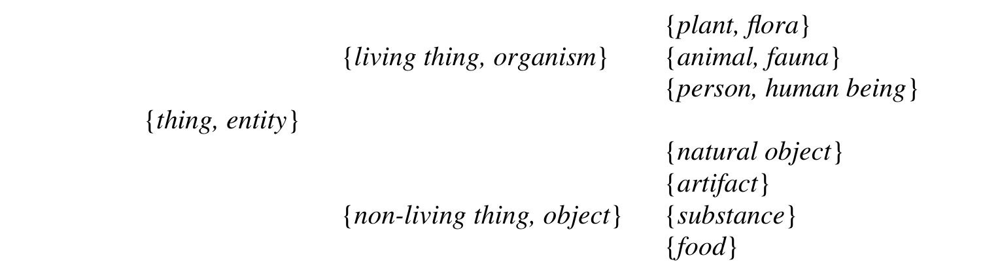
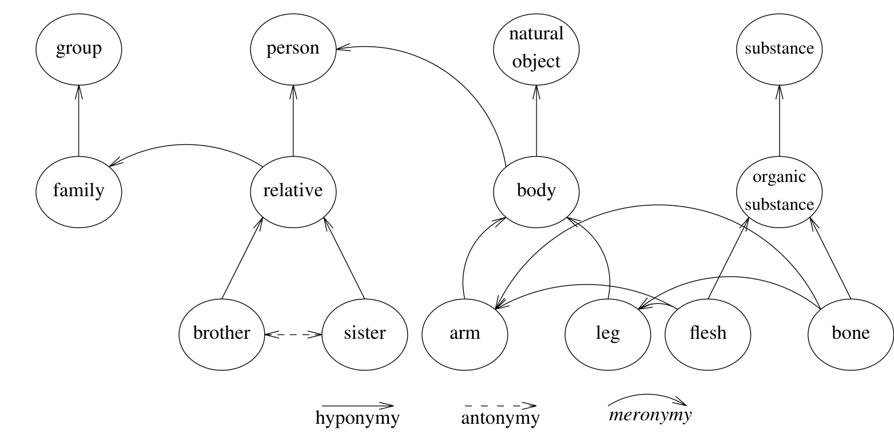
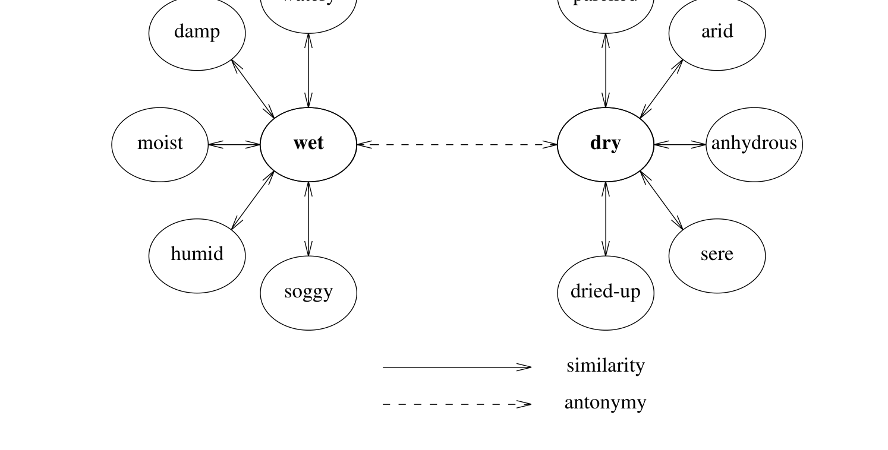
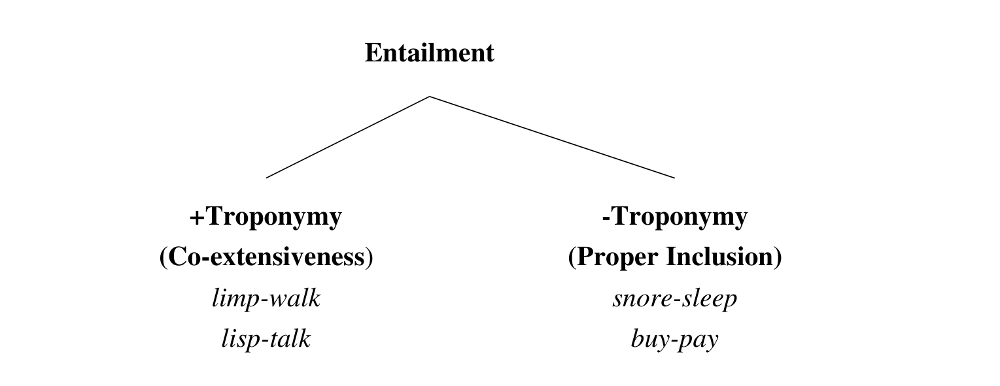
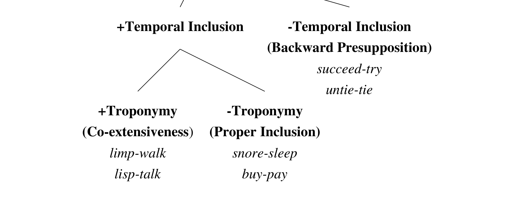
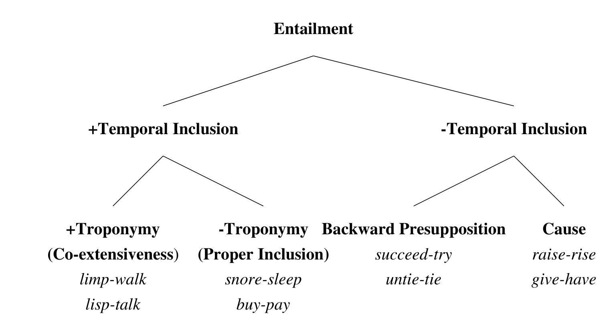

# WordNet 导论：一个在线词汇数据库（Introduction to WordNet: An On-line Lexical Database）

> George A. Miller, Richard Beckwith, Christiane Fellbaum, Derek Gross, Katherine Miller
>
> 普林斯顿大学（Princeton University）
>
> 1993 年 8 月修订版（本文及四篇配套论文详细报告了 WordNet 截至 1990 年的状态）

WordNet 是一个在线词汇参考系统，其设计灵感来自当代人类词汇记忆的心理语言学理论，核心思路是——**英语名词、动词和形容词被组织为同义词集（synset，每个代表一个底层词汇概念），不同的语义与词汇关系把同义词集连接起来：名词按上下位层级（继承体系）组织、形容词按反义二元对立簇组织、动词按蕴含（entailment）与方式关系（troponymy）组织**。

核心内容：

- 动机：按字母排列的词典把拼写相近的词放在一起，却把意义相近的词散落各处；计算机不仅是"快速翻页机"，应支持按概念而非按拼写检索
- 词汇矩阵：词形（word form）与词义（word meaning）构成 many:many 映射——一列多条目即多义（polysemy），一行多条目即同义（synonymy）；词义用同义词集（synset）表示，必要时附简短注释（gloss）
- 语义关系 vs 词汇关系：同义/反义是词形间的词汇关系，上下位（hyponymy/hypernymy）、部分-整体（meronymy/holonymy）、蕴含、因果关系是词义间的语义关系，用指针（@→、∼→、!→、#→、&→ 等）编码
- 规模：约 95,600 个词形（51,500 简单词 + 44,100 搭配）、70,100 个词义，分词/动/形/副四个句法类别；名词 25 个语义域文件（unique beginners）、动词 15 个、形容词分描述性与关系性两类

关键发现：

- 名词层级很浅：Shetland pony 到 entity 共 11 层，其中多为技术层次；基本层级（basic level）承载大多数区分特征
- 反义是词间关系而非概念间关系：rise/fall 与 ascend/descend 是反义对，但 rise/descend 不是——形态学（un-/in- 前缀）生成的反义词不能编码为 synset 间指针
- 动词有 4 种蕴含变体：+时间包含 +方式（troponymy，如 limp-walk）、+时间包含 −方式（如 snore-sleep）、−时间包含·后向预设（如 succeed-try）、−时间包含·因果（如 raise-rise）
- 熟悉度用多义度（polysemy count）而非词频索引——[54] 表明多义度与词频一样能预测词汇通达时间

---

# 第一部分 WordNet 导论：一个在线词汇数据库

George A. Miller, Richard Beckwith, Christiane Fellbaum, Derek Gross, and Katherine Miller

（1993 年 8 月修订）

## 引言

WordNet 是一个在线词汇参考系统，其设计灵感来自当代人类词汇记忆的心理语言学理论。英语名词、动词和形容词被组织为同义词集，每个同义词集代表一个底层词汇概念。不同的关系连接同义词集。

组织词汇信息的标准字母序程序把拼写相同的词放在一起，却把意义相似或相关的词随意散落在列表中。遗憾的是，没有明显的替代方案，词典编纂者没有其他简单的方法来跟踪已做的工作，读者也没有其他方法来找到他们要找的词。但对这种方案的一个常见反对意见是，在字母列表中找东西可能冗长而耗时。许多想查阅词典的人决定不去费这个事，因为查找信息会打断他们的工作，打断他们的思路。

然而，在计算机时代，对这个抱怨有了答案。诉诸在线词典——计算机可以读取的词汇数据库——的一个显而易见的原因是，计算机搜索这种字母列表比人快得多。一旦目标词被选中或键入键盘，词典条目就可以立即提供。此外，由于词典是从计算机读取的磁带上印刷的，把这些磁带转换成适当类型的词汇数据库是一件相对简单的事情。把传统词典放到网上，似乎是新旧之间简单而自然的结合。

然而，一旦计算机被征召为词典用户服务，很快就会发现，把这些强大的机器只当作快速翻页器来使用是极其低效的。挑战在于思考还能用它们做什么。WordNet 就是传统词典编纂信息与现代高速计算更有效结合的一个提案。

本文，以及随附的四篇论文，是对截至 1990 年 WordNet 状态的详细报告。为了减少不必要的重复，这些论文被写成需要连续阅读。

## 心理词汇学（Psycholexicology）

Murray 的《牛津英语词典》（1928）[80] 是"按历史原则"编纂的，没有人怀疑 OED 在解决词的使用或义项优先顺序问题上的价值。然而，通过聚焦于历史的（历时的）证据，OED 与其他标准词典一样，忽视了关于词汇知识共时组织的问题。

现在可以设想弥补这一疏漏的方法。20 世纪见证了心理语言学的出现，这是一个关注语言能力认知基础的跨学科研究领域。语言学家和心理语言学家都相当深入地探索了决定语言知识（一般）和词汇知识（特别）的当代（共时）结构的因素——Miller and Johnson-Laird (1976) 提出，关注语言词汇成分的研究应称为心理词汇学。

随着近几十年语言理论的演变，语言学家对词汇表必须包含的信息越来越明确，以便音系、句法和词汇成分在日常语言消息的产生和理解中协同工作，这些提案已被纳入心理语言学者的工作。从世纪之交的词联想研究开始，一直延续到过去二十年复杂精巧的实验任务，心理语言学家发现了心理词典的许多共时性质，可以在词典编纂中加以利用。

1985 年，普林斯顿大学的一群心理学家和语言学家着手沿着这些研究所建议的路线开发一个词汇数据库（[72]）。最初的想法是提供一种辅助，用于概念性地搜索词典，而不仅仅是按字母搜索——它要与传统类型的在线词典紧密结合使用。然而，随着工作的进展，它要求对其原则和目标做出更宏大的表述。WordNet 就是结果。

由于 WordNet 实例化了基于心理语言学研究结果的假设，可以说 WordNet 是一部基于心理语言学原则的词典。

如何为这个项目利用主要的心理语言学理论并不总是显而易见的。不幸的是，大多数对心理词汇学有意义的研究都处理相对较小的英语词汇样本，往往以牺牲其他词类为代价集中于名词。常常是，一个有趣的假设被提出，用五十或一百个词来例证，而扩展到词汇表的其余部分则留给读者作为练习。开发 WordNet 的一个动机就是把这样的假设暴露给整个常用词汇的范围。WordNet 目前包含约 95,600 个不同的词形（51,500 个简单词和 44,100 个搭配），组织成约 70,100 个词义，或同义词集，只有最稳健的假设才存活下来。

WordNet 与标准词典最明显的区别是，WordNet 把词汇表分为五个类别：名词、动词、形容词、副词和功能词。实际上，WordNet 只包含名词、动词、形容词和副词。¹ 相对较小的英语功能词集合被省略，其假设是（得到失语症患者言语观察的支持：Garrett, 1982 [40]）它们很可能作为语言句法成分的一部分被单独存储。句法类别在主观组织上不同的认识首先来自词联想研究。例如，[34] [34] 请英语母语者给出他们想到的第一个词，以响应从不同句法类别抽取的高度熟悉的词。众数响应类别与探测词的类别相同：名词探测 79% 的时间引出名词响应，形容词 65% 引出形容词，动词 43% 引出动词。由于语法正确的言语要求说话者知道（至少隐式地）不同词的句法特权，这些信息容易获得并不奇怪。然而，它是如何习得的更是个谜：在连贯话语中相邻的词很少来自同一句法类别，所以 Fillenbaum 和 Jones 的数据不能解释为邻近联想。

把这种句法分类强加给 WordNet 的代价是传统词典所避免的一定程度的冗余——像 back 这样的词，例如，出现在不止一个类别中。但好处是，这些句法类别的语义组织的基本差异可以被清楚地看到并系统地利用。从本文之后的论文中将会清楚，名词在词汇记忆中组织为话题层级，动词由各种蕴含关系组织，形容词和副词组织为 N 维超空间。每一种词汇结构都反映了对经验进行范畴化的不同方式；试图把单一组织原则强加给所有句法类别，会严重歪曲词汇知识的心理复杂性。

然而，WordNet 最雄心勃勃的特征是，它试图按词义而不是按词形组织词汇信息。在这方面，WordNet 更像一部同义词词典（thesaurus）而不是词典，事实上，Laurence Urdang 修订的 Rodale《同义词查找器》（1978）[95] 和 Robert L. Chapman 修订的《Roget 国际同义词词典》（1977）[86] 在拼装 WordNet 的过程中都是有用的工具。但这两部优秀著作都不太适合印刷形式。字母序同义词词典的问题是冗余条目：如果词 Wx 和词 Wy 是同义词，这对词应该输入两次，一次按 Wx 字母排序，再次按 Wy 字母排序。话题式同义词词典的问题是需要两次查找，首先在字母列表上，然后再在同义词词典本身中，使用户的搜索时间加倍。这些当然正是计算机可以快速高效执行的机械琐事。

然而，WordNet 不仅仅是一个在线同义词词典。为了理解 WordNet 中还尝试了什么，有必要了解它的基本设计（[76]）。

## 词汇矩阵

词汇语义学始于这样一种认识：词是词汇化概念与起句法作用的话语之间的常规关联。这个"词"的定义至少提出三类研究问题。第一，什么样的话语进入这些词汇关联？第二，词所能表达的词汇化概念的性质和组织是什么？第三，不同的词扮演什么样的句法角色？虽然只考虑一个问题时不可能忽视任何一个问题，但这里的重点将放在第二类问题上，即处理英语词汇表语义结构的问题。

由于"词"一词通常既指话语又指其关联的概念，对这种词汇关联的讨论容易产生术语混乱。因此，为了减少歧义，这里将使用"词形"（word form）指物理话语或书写，"词义"（word meaning）指一个词形可用于表达的词汇化概念。那么，词汇语义学的出发点可以说是词形与词义之间的映射（[73]）。一个保守的初始假设是，不同句法类别的词可能有不同类型的映射。

表 1 只是为了让词汇矩阵的概念具体化。词形被想象为列的标题；词义为行的标题。矩阵单元格中的条目意味着该列中的词形可以在适当的上下文中用于表达该行中的词义。因此，条目 E1,1 意味着词形 F1 可用于表达词义 M1。如果同一列有两个条目，则该词形是多义的；如果同一行有两个条目，则这两个词形是同义的（相对于某个上下文）。

| 词义 \ 词形 | F1 | F2 | F3 | … | Fn |
| --- | --- | --- | --- | --- | --- |
| M1 | E1,1 | E1,2 | | | |
| M2 | | E2,2 | | | |
| M3 | | | E3,3 | | |
| ⋮ | | | | ⋱ | |
| Mm | | | | | Em,n |

**表 1：** 词汇矩阵概念的图示：F1 和 F2 是同义词；F2 是多义的。

词形与词义之间的映射是 many:many 的——有些词形有几种不同的意义，有些意义可以用几种不同的词形来表达。词典编纂的两个难题，多义和同义，可以看作这种映射的互补方面。也就是说，多义和同义是在获得心理词典信息的过程中出现的问题：识别一个词形的听者或读者必须应对它的多义；希望表达一个意义的说话者或作者必须在同义词之间做出决定。

作为一个附带评论，应该指出，心理语言学家经常用方框箭头图来表示他们关于语言处理的假设。在这种记法中，词汇矩阵可以用两个方框来表示，它们之间有双向箭头。一个方框标为"词义"，另一个标为"词形"；箭头表示语言使用者可以从一个意义开始寻找表达它的适当词形，或者可以从一个词形开始检索适当的意义。这种方框箭头表示清楚地表明了意义:意义关系（在词义方框中）和词:词关系（在词形方框中）之间的区别。在最初的构想中，WordNet 只关注词汇化概念之间的语义关系模式；也就是说，它应该是词义方框的理论。然而，随着工作的进展，越来越清楚的是，词形方框中的词汇关系不容忽视。目前，WordNet 区分语义关系和词汇关系；重点仍然是意义之间的语义关系，但词之间的关系也包括在内。

虽然方框箭头表示尊重了这两种关系的区别，但它的缺点是忽略了意义与词形之间 many:many 映射的复杂细节，这不仅掩盖了多义和同义的互反性，也模糊了 WordNet 中用来表示意义的主要装置。出于这个原因，对 WordNet 的描述是用词汇矩阵而不是方框箭头图来介绍的。

词义在 WordNet 中如何表示？为了模拟词汇矩阵，必须有某种方法在计算机中表示词形和词义。书写形式可以为词形提供相当令人满意的解决方案，但词义应该如何表示对任何词汇语义学理论都提出了一个关键问题。在缺乏适当的心理学理论的情况下，词典编纂者开发的方法可以提供一种临时解决方案：定义在模拟中可以扮演意义在语言使用者头脑中所扮演的相同角色。

词汇化概念如何在词汇语义学理论中由定义来表示，取决于该理论是构造性的（constructive）还是仅仅是区分性的（differential）。在构造性理论中，表示应包含足够的信息来支持（由人或机器）对概念的准确构造。构造性理论的要求不容易满足，而且有理由相信，大多数标准词典中的定义不满足这些要求（[45, 77]）。另一方面，在区分性理论中，意义可以用任何使理论家能够区分它们的符号来表示。区分性理论的要求较为温和，但足以构建所需的映射。如果阅读定义的人已经获得了概念，只需要识别它，那么一个同义词（或近义词）往往就足够了。换句话说，表 1 中的词义 M1 可以简单地通过列出可用于表达它的词形来表示：{F1, F2, ...}。（在这里和后面，花括号 '{' 和 '}' 包围着作为词汇化概念识别定义的同义词集合。）例如，知道 board 既可以表示一块木材也可以表示为某种目的聚集的一群人的人，只要借助 plank 或 committee 就能选出预期的义项。同义词集 {board, plank} 和 {board, committee} 可以作为 board 这两个意义的无歧义指称。这些同义词集（synset）并不解释这些概念是什么；它们仅仅表示这些概念存在。假定懂英语的人已经获得了这些概念，并期望他们能从 synset 中列出的词认出这些概念。

因此，出于理论目的，词汇矩阵可以用书面词与 synset 之间的映射来表示。由于英语同义词丰富，synset 往往足以满足区分目的。然而，有时没有适当的同义词可用，在这种情况下，多义可以通过一个简短的注释（gloss）来解决，例如 {board, (a person's meals, provided regularly for money)} 可以用来区分 board 的这一义项与其他义项；它可以被看作单成员的 synset。注释不打算供不熟悉概念的人用来构造新的词汇概念，它与同义词的区别在于它不用于访问存储在心理词典中的信息。如果它能使 WordNet 的用户（假定懂英语）区分这一义项与可能混淆的其他义项，它就完成了它的目的。

同义当然是一种词形之间的词汇关系，但由于它在 WordNet 中被赋予核心角色，在记法上做了区分：由同义关系关联的词用花括号 '{' 和 '}' 括起来，而其他词汇关系将用方括号 '[' 和 ']' 括起来。语义关系用指针表示。

WordNet 由语义关系组织。由于语义关系是意义之间的关系，而意义可以用 synset 表示，所以很自然地把语义关系看作 synset 之间的指针。语义关系的特点是它们是互反的：如果意义 {x, x', ...} 和意义 {y, y', ...} 之间存在语义关系 R，那么 {y, y', ...} 和 {x, x', ...} 之间也存在关系 R'。就本文讨论而言，语义关系的名称将扮演双重角色：如果意义 {x, x', ...} 和 {y, y', ...} 之间的关系称为 R，那么 R 也将用于指称属于那些 synset 的个别词形之间的关系。为意义之间的关系和词形之间的关系引入单独的术语在逻辑上可能更整洁，但引入这么多新术语可能会导致更大的混乱。

下面的例子说明（但不穷尽）用于创建 WordNet 的关系类型。

## 同义（Synonymy）

从已经说过的内容来看，很明显 WordNet 最重要的关系是意义的相似性，因为判断词形之间该关系的能力是在词汇矩阵中表示意义的前提。根据一种定义（通常归于莱布尼茨），如果用一个表达式替换另一个表达式永远不会改变包含该替换的句子的真值，那么两个表达式是同义的。按这个定义，真正的同义词即使存在也很罕见。这个定义的弱化版本将使同义相对于语境：如果两个表达式在语境 C 中相互替换不改变真值，则它们在语言语境 C 中是同义的。例如，在木工语境中，用 plank 替换 board 很少改变真值，尽管 board 有其他语境，在那里这种替换完全不合适。

注意，用可替换性来定义同义使得有必要把 WordNet 划分为名词、动词、形容词和副词。也就是说，如果概念用 synset 表示，如果同义词必须是可互换的，那么不同句法类别的词不可能是同义词（不能构成 synset），因为它们不可互换。名词表达名词性概念，动词表达动词性概念，修饰语提供修饰那些概念的方式。换句话说，用 synset 表示词义与心理语言学证据一致，即名词、动词和修饰语在语义记忆中是独立组织的。可以提出有利于进一步划分的论证：同一句法类别中的一些词（特别是动词）表达非常相似的概念，却不能在不使句子不合语法的情况下互换。

用真值定义同义似乎使同义成为离散的事情：两个词要么是同义词，要么不是。但正如一些哲学家所论证的，以及大多数心理学家不考虑替代方案就接受的，同义最好被看作一个连续体的一端，意义的相似性沿此连续体可以分级。很可能是，语义相似的词比语义不相似的词可以在更多的语境中互换。但这里的重点是，词汇语义学理论不依赖真值函项的意义概念；语义相似性就足够了。方便的是假设该关系是对称的：如果 x 与 y 相似，那么 y 与 x 同样相似。

语义相似性的可分级性无处不在，但它对于理解形容词和副词意义的组织最为重要。

## 反义（Antonymy）

另一个熟悉的关系是反义，事实证明它出奇地难以定义。词 x 的反义词有时是非 x，但并不总是。例如，rich 和 poor 是反义词，但说某人 not rich 并不意味着他一定是 poor；许多人认为自己既不富也不穷。反义，看似简单的对称关系，实际上相当复杂，然而英语使用者识别反义词时几乎没有困难。

反义是词形之间的词汇关系，而不是词义之间的语义关系。例如，意义 {rise, ascend} 和 {fall, descend} 可能是概念上的对立，但它们不是反义词；[rise/fall] 是反义词，[ascend/descend] 也是，但当被问及 rise 和 descend，或 ascend 和 fall 是否是反义词时，大多数人会犹豫并露出思考的表情。这些事实使人明显需要区分词形之间的语义关系和词义之间的语义关系。反义为 WordNet 中的形容词和副词提供了一个核心组织原则，而反义是词之间的语义关系这一事实所引起的复杂性，最好在那个语境中讨论。

## 上下位关系（Hyponymy）

与同义和反义——它们是词形之间的词汇关系——不同，上下位关系（hyponymy/hypernymy）是词义之间的语义关系：例如，{maple} 是 {tree} 的下位词（hyponym），{tree} 是 {plant} 的下位词。人们在上位/下位关系（各种叫法：subordination/superordination、subset/superset 或 ISA 关系）上投入了大量关注。如果英语母语者接受从 An x is a (kind of) y 这样的框架构造的句子，则由 synset {x, x', ...} 表示的概念被称为由 synset {y, y', ...} 表示的概念的下位词。该关系可以通过在 {x, x', ...} 中包含一个指向其上位的指针，并在 {y, y', ...} 中包含指向其下位词的指针来表示。

上位关系是传递的和不对称的（[69]，第 1 卷），并且由于通常只有一个上位，它产生一个层级语义结构，其中下位词位于其上位词之下。这种层级表示广泛用于信息检索系统的构建，在那里它们被称为继承系统（[98]）：下位词继承更一般概念的所有特征，并添加至少一个将其与上位词及该上位词的任何其他下位词区分开来的特征。例如，maple 继承了其上位 tree 的特征，但通过其木材的硬度、叶子的形状、树液用于糖浆等与其他树区分开来。这种约定为 WordNet 中的名词提供了核心组织原则。

## 部分-整体关系（Meronymy）

同义、反义和上位关系是熟悉的关系。它们在整个词汇表中广泛适用，人们不需要语言学方面的专门训练就能理解它们。另一个具有这些优势的关系——一种语义关系——是部分-整体（或 HASA）关系，词汇语义学家称之为部分-整体关系（meronymy/holonymy）。如果英语母语者接受从 A y has an x (as a part) 或 An x is a part of y 这样的框架构造的句子，则由 synset {x, x', ...} 表示的概念是由 synset {y, y', ...} 表示的概念的部分词（meronym）。部分关系是传递的（有保留）和不对称的（[24]），可以用来构建部分层级（有一些保留，因为一个部分词可以有许多整体词）。将假定整体的部分的概念可以是整体的概念的一部分，尽管人们认识到这一假设的含义值得比这里得到的更多的讨论。

这些和其他类似的关系服务于组织心理词典。它们可以在 WordNet 中用括号分组或从一个 synset 到另一个 synset 的指针（带标签的弧）来表示。这些关系表示形成复杂网络的关联；知道一个词在这个网络中的位置是知道该词意义的重要组成部分。然而，抽象地讨论这些关系是无益的，因为它们在组织与不同句法类别相关的词汇知识中扮演不同的角色。

## 形态关系

一类重要的词汇关系是词形之间的形态关系。最初，兴趣仅限于语义关系；没有计划把形态关系纳入 WordNet。然而，随着工作的进展，越来越明显的是，如果 WordNet 要对任何人有任何实际用途，它就必须处理屈折形态。例如，如果有人把计算机光标放在词 trees 上并点击请求信息，WordNet 不应该回答该词不在数据库中。需要一个程序去掉复数后缀，然后查找 tree，它肯定在数据库中。这种需要导致了处理屈折形态程序的发展。

虽然英语的屈折形态相对简单，但编写计算机程序来处理它被证明是比预期更复杂的任务。动词当然是主要问题，因为有四种形式以及许多不规则动词。但软件已经编写完成，目前作为词汇数据库和用户之间接口的一部分提供。在这个开发过程中，很明显处理派生形态的程序将大大增强 WordNet 的价值，但那个更雄心勃勃的项目尚未着手。

本导论之后的三篇论文对屈折形态产生的词汇关系谈得很少，因为那些关系被纳入 WordNet 的接口中，而不是中央数据库中。

¹本文集中没有包括对副词的讨论。

---

# 第二部分 WordNet 中的名词：一个词汇继承系统

George A. Miller

（1993 年 8 月修订）

常见名词的定义通常给出一个上位词加上区分特征；这些信息为在 WordNet 中组织名词文件提供了基础。上位关系（上下位关系）产生一种层级语义组织，通过在近义词集（synset）之间使用带标签的指针，在名词文件中复制了这种组织。层级的深度有限，很少超过十几层。区分特征的输入方式使其创建一个词汇继承系统，一个每个词继承其所有上位词区分特征的系统。讨论了三种类型的区分特征：属性（修饰）、部分（部分关系）和功能（述谓），但目前在名词文件中只实现了部分关系。名词之间也发现反义，但它不是名词的基本组织原则。覆盖范围被划分为二十五个话题文件，每个文件处理一个不同的原始语义成分。

在撰写本文时，WordNet 包含约 57,000 个名词词形，组织成约 48,800 个词义（synset）。这些数字是近似的，因为 WordNet 持续增长——在线数据库的一个优势。这些名词中许多当然是复合词；少数是为了分类方便而发明的人工搭配。没有尝试纳入专有名词；另一方面，由于许多普通名词曾经是名字，也没有认真尝试排除它们。在覆盖范围方面，WordNet 的目标与一部好的标准手持大学级词典差别不大。WordNet 追求创新的地方在于这些信息的组织。

如果有人问如何使用传统词典，习惯上会解释压缩在词汇条目中的不同种类的信息：拼写、发音、屈折和派生形式、词源、词性、不同义项的定义和示例用法、同义词和反义词、特殊用法说明、偶尔的线条画或图版——一部好的词典是一个非凡的信息库。但如果有人问如何改进词典，就有必要考虑没有包括什么。而当改进旨在反映心理语言学原则时，如 WordNet 的情况，焦点关注就变成定义中没有包括什么。

例子提供了描述这些遗漏的最简单方式。取名词 tree 的一个意义，即与作为植物的树有关的意义。传统词典用这样的注释定义 tree 的这个意义：a plant that is large, woody, perennial, and has a distinct trunk。当然，实际的措辞通常更妥帖——例如 a large, woody, perennial plant with a distinct trunk——但底层逻辑是相同的：上位词加区分特征。要点是，名词的原型定义由其直接上位词（在这个例子中是 plant）组成，后跟一个描述该实例如何区别于所有其他实例的关系从句。

这个定义缺少什么？任何受过教育而期待词典中出现这种东西的人不会觉得缺少任何东西。但这个定义严重不完整。例如，它没有说树有根，或者它们由具有纤维素壁的细胞组成，甚至没有说它们是活有机体。当然，如果你查找上位词 plant，你可能会找到那种信息——除非你犯了一个错误，选择了 plant 的定义，说它是制造某种产品的地方。毕竟，tree 的定义中没有任何内容规定 plant 的哪个义项是适当的上位词。该规定的省略是基于这样的假设：读者不是白痴、火星人或计算机。但注意到以下一点是有启发性的：即使聪明的读者可以自己补充它，关于上位词的重要信息仍然从定义中缺失。

第二，tree 的这个定义不包含关于并列词（coordinate terms）的信息。其他种类植物的存在是一个合理的推测，但在找到它们方面没有提供帮助。对并列词好奇的读者别无选择，只能从头到尾扫描词典，沿途记录每个定义中含有上位词 plant 的出现。即使这种英勇的策略也可能失败，如果词典编纂者不期望其工作被如此使用，在选择上位词时没有保持严格的一致。tree 在这方面可能是一个不公平的例子，因为树和灌木之间的区别如此不清晰——同一植物在一个地方长成大树，在不太有利的气候中可能只不过是一株灌木。植物学家很少使用外行的词 tree——许多树是裸子植物，许多其他树是被子植物。然而，即使对于表现良好的定义，传统词典也把发现并列词留给读者作为具有挑战性的练习。

第三，类似的挑战面对有兴趣了解不同种类树的读者。除了在词典中查找 pine 或 maple 或 oak 这样熟悉的树，读者可能想知道哪些树是落叶的，哪些是硬木的，或者有多少种不同的针叶树。词典包含许多这样的信息，但只有最坚定的读者才会尝试把它挖出来。原型定义指向上方，指向一个上位词，而不是侧向指向并列词或向下指向下位词。

第四，每个人都知道许多词典编纂者不会包含在 tree 定义中的关于树的知识。例如，树有树皮和细枝，它们从种子生长，成年树比人高得多，它们通过光合作用制造自己的食物，它们提供荫凉和防风，它们在森林中野生生长，它们的木材用于建筑和燃料，等等。一个对树完全无知的人，如果只能获得定义 tree 所需的信息，将无法构造出关于它们的准确概念。词典定义划出了一些重要的区别，用来提醒读者某件假定已经熟悉的事情；它不打算作为一般知识的目录。百科全书和词典各有其位置。

注意，缺失的信息大部分是结构性的，而不是事实性的。也就是说，词典编纂者努力覆盖关于每个词义的所有事实信息，但传统词典组织成离散的、字母化的条目以及最小化冗余的经济压力，使得重新组装这些散落的信息成为一项艰巨的工作。

## 词汇继承系统

人们经常观察到，词典编纂者陷入了词的网中。有时它被表述为一个谜题：既然词是用来定义词的，词典编纂如何逃脱循环？每部词典可能都包含几个空洞的循环，即词 Wa 被用来定义词 Wb，而 Wb 也被用来定义 Wa；在这种情况下，大概词典编纂者无意中忽略了需要用别的东西来定义这两个同义词中的一个或另一个的必要性。循环是例外，不是规则。

词典编纂者试图强加给名词语义记忆的基本设计不是圆圈，而是一棵树（tree 在图形表示的意义上）。树图的定义性质是它们从单一茎干分枝而不形成循环环。词汇树可以通过追踪上位词的踪迹来重建：例如，oak @→ tree @→ plant @→ organism，其中 '@→' 是可读作 'is a' 或 'is a kind of' 的传递、不对称语义关系。（按约定，'@→' 被称为指向上方。）这种设计创建了一系列层次，一个层级，从较低层次的许多具体词到顶部的少数一般词。层级为名词提供了概念骨架；关于个别名词的信息像圣诞树上的装饰品一样挂在这个结构上。

上面用 '@→' 表示的语义关系被称为 ISA 关系，或 hypernymic 或上位关系（因为它指向一个 hypernym 或上位词）；它从具体到一般，因此是一种泛化。每当名词 Wh @→ 名词 Ws 成立时，总有一个逆关系，Ws ∼→ Wh。也就是说，如果 Ws 是 Wh 的上位词，那么 Wh 是 Ws 的下位词或 hyponym。逆语义关系 '∼→' 从一般到具体（从上位词到下位词），因此是一种特化。

由于名词通常只有一个上位词，词典把上位词包括在定义中；由于名词可以有许多下位词，英语词典不列出它们（法语词典 Le Grand Robert 是一个例外）。尽管特化关系在标准英语词典中没有明确表示，但它是泛化关系的逻辑衍生物。在 WordNet 中，词典编纂者用词汇概念或义项之间的带标签指针明确编码泛化关系 '@→'。当词典编纂者的文件自动转换为词汇数据库时，这个过程的一个步骤是插入特化关系 '∼→' 的逆指针。因此，词汇数据库是一个可以向上或向下以同样速度搜索的层级。

这种层级被计算机程序员广泛用于组织大型数据库（[98]）。它们的好处是，数据库中许多条目共有的信息不必随每个条目存储。换句话说，数据库专家和词典编纂者出于同样的原因求助于层级结构：节省空间。计算机科学家称这种层级为"继承系统"，因为他们把具体条目看作从其一般上位词继承信息。也就是说，上位词的所有性质都被假定为下位词的性质；不是在两个条目中冗余地列出这些性质，而是只在上位词中列出它们，从下位词到上位词的指针被理解为意味着"要获得额外性质，请看这里"。

继承对名字最容易理解。如果你听说你的朋友养了一只叫 Rex 的柯利牧羊犬，你不需要问 Rex 是否是动物，Rex 是否有毛发、四条腿和尾巴，或者 Rex 是否具有已知柯利牧羊犬特征的其他任何性质。这样的问题会明显奇怪。既然你被告知 Rex 是柯利牧羊犬，你就应该理解 Rex 继承了定义柯利牧羊犬的所有性质。而且，隐含地，柯利牧羊犬继承了狗的性质，狗又继承了犬科的性质，等等。

显然，继承系统隐含在名词的原型词典定义中。词典编纂者不把 tree 和 plant 共有的信息与两个条目一起存储；词典编纂者只把冗余信息与 plant 一起存储，然后以读者知道在哪里找到它的方式写 tree 的定义。然而，使用印刷词典时，用户必须反复查找条目才能找到计算机可以即时检索和显示的信息。

WordNet 是一个词汇继承系统；已经做出了系统的努力把下位词与它们的上位词（反之亦然）连接起来。在 WordNet 数据库中，tree 的条目包含一个引用，或指针 '@→'，指向 plant 的条目；指针用任意符号 '@' 标记为"上位"。因此，tree 的 synset 看起来像这样：

{ tree, plant,@ conifer,∼ alder,∼ ... }

其中 '...' 填充了更多指向下位词的指针。在数据库中，指向上位词 plant 的指针 '@' 将通过 plant 的 synset 中指向 tree 的逆指针 '∼' 来反映；该指针用任意符号 '∼' 标记为"下位词"：

{ plant, flora, organism,@ tree,∼ ... }

{tree} 当然不是 {plant, flora} 唯一的下位词；这里省略了其他下位词，以免模糊 '@' 和 '∼' 的互反性。计算机被编程使用这些带标签的指针来构建用户请求的任何信息；任意符号 '@' 和 '∼' 在显示请求的信息时被抑制。（不需要在 tree 或 plant 上使用特殊标签来区分所指的义项，因为表示活植物的名词都在一个文件中，而表示图形树或制造工厂的名词在别处，如下文将解释的。）

至少附带地应该指出，WordNet 假设同义和上下位之间总是可以划出区别。当然，在实践中，这种区别并不总是清楚的，但在传统词典中这不会造成问题。例如，传统词典可以在其 board 的条目中包含这样的信息：这个词可以用于指冲浪板或滑板。也就是说，除了 board 的一般意义之外，还有 board 的具体意义，它们是一般意义的下位词。然而，如果在 WordNet 中以这种方式输入信息，那么请求关于 board 的上位词信息会引出两次相同的路径，唯一的区别是一条路径以 {surf board, board} @→ board 开头。因此，在 WordNet 中，已努力避免一个词是它自己的下位词的条目。例如，cat 在 WordNet 中被输入为 big cat 和 house cat 的上位词，尽管对大多数人来说 cat 的首要意义——首先想到的意义——是 {house cat, tabby, pussy, pussy cat, domesticated cat}。WordNet 不明确说明 cat 经常用于指宠物猫，而是依赖一般的语言知识：只要语境保证不会产生混淆，上位词可以替换更具体的词。

把词汇知识视为继承系统会带来什么好处？在本文的引言中，描述了传统定义中缺失信息的四个例子。这四个中，前三个可以通过明智地使用带标签的指针来修复；使用计算机，从上位词移到下位词与从下位词移到上位词一样容易。第四个遗漏——一个词的定义中没有给出的关于指称物的所有相关一般知识——在 WordNet 中仍未纠正；必须在某处划定词汇概念和一般知识之间的界线，WordNet 的设计基于这样的假设：标准词典编纂的界线可能是最明确的。

## 心理语言学假设

既然 WordNet 应该按照支配人类词汇记忆的原则来组织，把名词组织为继承系统的决定反映了关于心理词典的心理语言学判断。什么样的证据为这种决定提供基础？

把名词隔离成单独的词汇子系统从命名性失语症（anomic aphasia）患者的临床观察中得到一些支持。在影响语言交流能力的左半球中风后，大多数患者留下命名能力的缺陷（[13]）。在命名性失语症中，存在命名对象的具体无能。例如，当面对一个苹果时，患者可能无法说出 "apple"，尽管他们会拒绝 shoe 或 banana 这样的建议，并会在提供 apple 时认出它是正确的。他们在命名图画对象、根据定义提供名字或在自发言语中使用名词方面也有类似的困难。日常使用中频繁出现的名词往往比罕见使用的名词更容易通达，但严重命名障碍的患者看起来完全像是一个名词语义记忆与词汇表其余部分断开的人。然而，临床症状的特点是个体间差异很大，所以不应给这些观察赋予太大的权重。

名词知识层级组织的心理语言学证据来自人们处理回指名名词和比较结构的容易程度。(1) 上位名词可以作为回指词，指回它们的下位词。例如，在 He owned a rifle, but the gun had not been fired 这样的结构中，立即理解 gun 是一个回指名词，以 rifle 为其先行词。此外，(2) 上位词和它们的下位词不能相互比较（[8]）。例如，A rifle is safer than a gun 和 A gun is safer than a rifle 都被立即识别为语义异常。这样的判断要求用层级语义关系来解释。

然而，更切题的问题是：是否有心理语言学证据表明人们对名词的词汇记忆形成继承系统？第一个明确做出这种主张的人似乎是 Quillian (1967, 1968) [83, 84]。Quillian 提案的实验检验在 [22] [22] 的一篇开创性论文中报告，他们假设反应时间可以用来指示分隔两个意义的层级层数。他们观察到，例如，对 "A canary can sing" 回答 True 比对 "A canary can fly" 花的时间少，而对 "A canary has skin" 回答 True 需要更多时间。在这个例子中，假定 can sing 存储为 canary 的特征，can fly 存储为 bird 的特征，has skin 存储为 animal 的特征。如果所有三个特征都直接存储为 canary 的特征，它们都可以以相同的速度被检索。反应时间不相等，因为从上位概念检索 can fly 和 has skin 需要额外的时间。Collins 和 Quillian 从这些观察中得出结论：一般信息不是冗余存储的，而是在需要时检索的。（在 WordNet 中，层级是：canary @→ finch @→ passerine @→ bird @→ vertebrate @→ animal，但这些中间层次不影响 Collins 和 Quillian 正在做出的论证。）

大多数心理语言学家同意英语普通名词在语义记忆中层级组织，但一般信息是继承的还是冗余存储的仍然没有定论（[94]）。[22] [22] 实验的发表激发了大量研究，在此过程中提出了许多问题。例如，根据 Quillian 的理论，robin 和 ostrich 与上位词 bird 共享同一种语义链接，然而 "A robin is a bird" 比 "An ostrich is a bird" 更快得到确认（[102]）。或者，can move 和 has ears 都是人们与 animal 关联的性质，然而 "An animal can move" 比 "An animal has ears" 更快得到确认（[23]）。从这些和类似的结果中，许多心理语言学家得出结论：Quillian 是错的，名词的语义记忆不是作为继承系统组织的。

另一个结论——WordNet 所基于的结论——是继承假设是正确的，但反应时间没有测量 Collins 和 Quillian 以及其他实验者所假定的东西。也许反应时间指示的是语用距离而不是语义距离——词的使用差异，而不是词的意义差异（[75]）。

## 语义成分

理解层级原则的一种方式是假设所有名词都包含在单一层级中。如果是这样，最顶层或最一般的层次在语义上将是空的。原则上，可以把某个模糊抽象（如 {entity}）放在顶部；把 {object, thing} 和 {idea} 作为它的直接下位词，然后继续向下到更具体的意义，从而把所有名词拉入单一层级记忆结构。然而，在实践中，这些抽象的一般概念携带很少的语义信息；人们甚至能否就表达它们的适当词汇达成一致都是可疑的。

另一种方案是用一组语义原语来划分名词——选择（相对较小的）一组一般概念，并把每个概念视为独立层级的唯一始源词（unique beginner）。这些多重层级对应于相对不同的语义场，每个都有自己的词汇。也就是说，由于表征唯一始源词的特征被其所有下位词继承，唯一始源词可以被视为其层级结构化语义场中所有词的原始语义成分。划分名词也有实际优势：它减小了词典编纂者必须处理的文件大小，并使不同文件的编写和编辑可以分配给不同的词典编纂者。

| 唯一始源词（synset） |
| --- |
| {act, action, activity} |
| {natural object} |
| {animal, fauna} |
| {natural phenomenon} |
| {artifact} |
| {person, human being} |
| {attribute, property} |
| {plant, flora} |
| {body, corpus} |
| {possession} |
| {cognition, knowledge} |
| {process} |
| {communication} |
| {quantity, amount} |
| {event, happening} |
| {relation} |
| {feeling, emotion} |
| {shape} |
| {food} |
| {state, condition} |
| {group, collection} |
| {substance} |
| {location, place} |
| {time} |
| {motive} |

**表 1：** WordNet 名词的 25 个唯一始源词列表。

问题当然是决定这些原始语义成分应该是什么。不同的工作者做出不同的选择；一个重要标准是，它们总体上应该为每个英语名词提供一个位置。WordNet 采用了表 1 中列出的二十五个唯一始源词的集合。这些层级在大小上差异很大，并且不相互排斥——需要一些交叉引用——但总体上它们覆盖了不同的概念和词汇域。它们是在考虑了可能出现的形容词-名词组合后被选定的（该分析由 Philip N. Johnson-Laird 进行）。理由将在下面讨论。

然而，一旦原始语义成分被选定，就观察到它们之间的一些自然分组。例如，其中七个成分涉及有生命或无生命的事物；它们可以按图 1 所示层级排列。相应地，创建了一个小的 'Tops' 文件以把这些语义关系纳入系统。然而，WordNet 名词的绝大部分包含在二十五个成分文件中。

**图 1：** 表示不同种类有形事物的七个唯一始源词之间上下位关系的图示。

有趣的是，这些文件相当浅。当然，原则上继承系统的层数没有限制。然而，词汇继承系统很少超过十层深，最深的例子通常包含不属于日常词汇的技术层次。例如，Shetland pony 是 pony、horse、equid、odd-toed ungulate、herbivore、mammal、vertebrate 和 animal；追踪到 Tops 文件又增加 organism 和 entity：共十一层，其中大多数是技术性的。有些层级比其他层级更深：人造物有时深达六七层（roadster @→ car @→ motor vehicle @→ wheeled vehicle @→ vehicle @→ conveyance @→ artifact），而人的层级大约三四层（最深之一是 televangelist @→ evangelist @→ preacher @→ clergyman @→ spiritual leader @→ person）。主张冗余存储这些概念相关信息的人指出，在冗余系统中更一般的信息会被一遍又一遍地重复，所以每个额外的层次都会给词汇记忆带来越来越重的负担——这可能是层数有限的一个原因。

## 区分特征

这些名词概念层级据说有一个层次，在中间某处，大多数区分特征附着在那里。它被称为基本层级（basic level），该层级的名词概念被称为基本层级范畴或一般概念（[5, 6]）。[87, 88] [87, 88] 扩展了这种概括：对于基本层级的概念，人们可以列出许多区分特征。在基本层级之上，描述简短而一般。在基本层级之下，几乎不会为区分基本概念的特征添加什么。这些观察主要针对具体的、有形对象的名字，但一些心理语言学家论证说，基本或主要层级应该是每个词汇层级的特征（[49]）。

虽然名词层级的整体结构由上下位关系生成，但细节由区分一个概念与另一个概念的特征给出。例如，canary 是一种 small、colorful、会 sing、会 fly 的鸟，所以不仅 canary 必须被输入为 bird 的下位词，small 大小和 bright color 的属性也必须包括在内，还有 singing 和 flying 的活动。此外，canary 必须从 bird 继承它有 beak 和带羽毛的 wings 的事实。为了使所有这些信息在 canary 被激活时可用，必须能够把 canary 与至少三种不同类型的区分特征恰当地关联起来（[74]）：

(1) 属性（Attributes）：small, yellow
(2) 部分（Parts）：beak, wings
(3) 功能（Functions）：sing, fly

每种类型的区分特征必须被区别对待。

注意，属性由形容词给出，部分由名词给出，功能由动词给出。如果 canary 与这些特征中每一个的关联都要在 WordNet 中用带标签的指针来表示，那么就需要从名词到形容词以及从名词到动词的指针。在撰写本文时，已经在 WordNet 中为包括此类指针留出了空间，但这种可能性尚未被词典编纂者编码；只有指向部分的指针（从名词到名词）已被实现。

当 WordNet 最初被构想时，并不打算包括关于区分特征的信息。当时假设 WordNet 将与某部在线词典紧密结合使用，词汇概念的区分特征可以从那个来源获得。随着 WordNet 覆盖范围的增加，越来越明显的是，词的替代义项不能总是通过使用同义词来识别。因此，在相当晚的阶段，决定以传统词典的方式包括区分特征，即在含有多义词的 synset 中包括简短的解释性注释。这些注释用括号与 synset 的其余部分分开。例如，WordNet 中的 {artifact} 层级包含高度多义名词 case 的八个不同义项：

{ carton, case0, box,@ (a box made of cardboard; opens by flaps on the top) }
{ case1, bag,@ (a portable bag for carrying small objects) }
{ case2, pillowcase, pillowslip, slip2, bed linen,@ (a removable and washable cover for a pillow) }
{ bag1, case3, grip, suitcase, traveling bag,@ (a portable rectangular traveling bag for carrying clothes) }
{ cabinet, case4, console, cupboard,@ (a cupboard with doors and shelves) }
{ case5, container,@ (a small portable metal container) }
{ shell, shell plating, case6, casing1, outside surface,@ (the outer covering or housing of something) }
{ casing, case7, framework,@ (the enclosing frame around a door or window opening) }

括号注释用于保持几个义项不同，但上位概念（用 '@' 指示）与定义注释的中心词（head word）之间某种冗余是明显的。随着更多区分特征由指针指示，这些注释应该变得更加冗余。系统的一个可想象测试是编写一个计算机程序，从指针提供的信息合成注释。

然而，目前对于许多词，属性和功能特征不可用，而在它们可用的地方，是以定义注释的形式，而不是指向适当形容词或动词的带标签指针。但部分-整体关系在 WordNet 中可用；对这些区分特征的经验应该为未来跨词类指针的实现提供基础。

## 属性与修饰

属性的值由形容词表达。例如，size 和 color 是 canary 的属性：canary 的大小可以用形容词 small 表达，canary 的通常颜色可以用形容词 yellow 表达。然而，没有与同义或上下位可比的语义关系可以发挥这种功能。相反，形容词被称为修饰名词，或名词被称为属性的论元：Size(canary) = small。

虽然这种可能性尚未在 WordNet 中实现，但 canary 是 small 的事实可以用带标签的指针表示，方式与 canary 是 bird 的事实的表示大致相同。形式上，区别在于没有从小返回到 canary 的返回指针。也就是说，虽然当被问及 canary 的特征时人们会列出 small，但当被要求列出 small things 时，他们不太可能把 canaries、pygmies、ponies 和 closets 归在一起。从 canary 到 small 的指针相对于 canary 的直接上位词来解释，即 small for a bird，但当 small 单独被访问时，那个锚定到中心名词的锚点丢失了。

形容词概念的语义结构由 Gross and Miller（本卷）讨论。这里只需指出，与名词相关的属性反映在通常可以修饰它的形容词中。例如，canary 可以 hungry 或 satiated，因为饥饿是动物的特征而 canary 是动物，但 stingy canary 或 generous canary 只能被隐喻地解释，因为慷慨不是一般动物或特别是 canary 的特征。Keil (1979, 1983) [62, 63] 论证说，儿童通过观察每个层次上可以述谓什么和不可以述谓什么来学习名词概念的层级结构。例如，有生命和无生命名词之间的重要语义区别来自这样的事实：形容词 dead 和 alive 可以对一类名词述谓，但不能对另一类述谓。虽然形容词的这种选择限制没有在 WordNet 中显式表示，但它们确实促成了把名词划分为上面列出的二十五个语义成分。

## 部分与部分关系

名词之间的部分-整体关系通常被认为是一种语义关系，称为部分关系（meronymy，来自希腊语 meros，部分；[24]），可与同义、反义和上下位相比。该关系有一个逆关系：如果 Wm 是 Wh 的部分词，那么 Wh 被称为 Wm 的整体词（holonym）。

部分词是下位词可以继承的区分特征。因此，部分关系和上下位关系以复杂的方式交织在一起。例如，如果 beak 和 wing 是 bird 的部分词，如果 canary 是 bird 的下位词，那么通过继承，beak 和 wing 也必须是 canary 的部分词。虽然以这种方式剖析时这些连接可能显得复杂，但它们在语言理解中迅速展开。例如，大多数人甚至没有注意到建立以下句子之间联系所需的推理：It was a canary. The beak was injured. 当然，在 canary 继承 beak 足够多次之后，canary 有 beak 的事实可能会与其他 canary 的特征一起被冗余存储，但这种可能性并不意味着人们词汇知识的一般结构不是层级组织的。

部分关系与上下位关系之间的联系因这样的事实而进一步复杂化：部分是下位词同时也是部分词。例如，{beak, bill, neb} 是 {mouth, muzzle} 的下位词，而后者又是 {face, countenance} 的部分词和 {orifice, opening} 的下位词。在上下位和部分关系之间建立正确关系的一个常见问题来自把特征附着得太高的普遍倾向。例如，如果 wheel 被称为 vehicle 的部分词，那么 sled 将继承它不应该有的轮子。实际上，在 WordNet 中为概念 {wheeled vehicle} 创建了一个特殊的 synset。

有人说区分特征主要在基本概念层次引入名词层级；有人声称部分关系对定义基本词项特别重要（[99]）。然而，对这些主张的检验主要涉及表示物理对象的词，而物理对象是部分词最常出现的地方。在 WordNet 中，部分关系主要见于 {body, corpus}、{artifact} 和 {quantity, amount} 层级中。对于像身体和人造物这样的具体对象，部分词确实有助于定义基本层级。然而，对于表示数量的词项，没有这样的层次是明显的，在那里小的度量单位在层级的每一层都是较大单位的部分。由于属性和功能尚未编码，还没有尝试看看是否可以为更抽象的层级定义基本层级。

"part of" 关系经常与 "kind of" 关系相比较：两者都是不对称的、（有保留地）传递的，并且可以层级地关联词项（Miller and Johnson-Laird, 1976）。也就是说，部分可以有部分：finger 是 hand 的一部分，hand 是 arm 的一部分，arm 是 body 的一部分：词 finger 是词 hand 的部分词，hand 是 arm 的部分词，arm 是 body 的部分词。但 "part of" 结构并不总是部分关系的可靠检验。部分关系的一个基本问题是，人们会为各种部分-整体关系接受检验框架 "Wm is a part of Wh"。

在许多情况下，传递性似乎是有限的。例如，[69] [69] 注意到 handle 是 door 的部分词，door 是 house 的部分词，然而说 "The house has a handle" 或 "The handle is a part of the house" 听起来奇怪。[103] [103] 把这种传递性的失败视为两种情况涉及不同的部分-整体关系的指示。例如，"The branch is a part of the tree" 和 "The tree is a part of a forest" 不蕴含 "The branch is a part of the forest"，因为 branch/tree 关系与 tree/forest 关系不相同。对于 Lyons 的例子，他们遵循 [24] [24] 建议，"part of" 有时在 "attached to"（附着于）更合适的地方使用："part of" 应该是传递的，而 "attached to" 显然不是。"The house has a door handle" 是可以接受的，因为它否定了 "The house has a handle" 中隐含的推论——handle 附着于 house。

这些观察提出了有多少种不同的 "part of" 关系的问题。[103] [103] 区分了六种部分词：成分-对象（branch/tree）、成员-集合（tree/forest）、部分-质量（slice/cake）、材料-对象（aluminum/airplane）、特征-活动（paying/shopping）和地点-区域（Princeton/New Jersey）。[17] [17] 增加了第七种：阶段-过程（adolescence/growing up）。部分关系显然是一种复杂的语义关系——或一组关系。WordNet 中只编码了这些类型部分关系中的三种：

Wm #p→ Wh 表示 Wm 是 Wh 的成分部分；
Wm #m→ Wh 表示 Wm 是 Wh 的成员；以及
Wm #s→ Wh 表示 Wm 是构成 Wh 的材料。

在这三种中，'is a component of' 关系 '#p' 是最常见的。

材料-对象关系证明了对象构成的民间理论的局限。借助现代科学，现在可以把"材料"分析为越来越小的成分。在某一点上，这种分析失去了与被分析对象的所有联系。例如，由于所有具体对象都由原子组成，把 atoms 作为部分不会把一类具体对象与任何其他类区分开来。Atom 将是每个表示具体对象的词的部分词。这里出了问题。对于常识目的，对象的分解终止于部分不再用于区分该对象与可能与之混淆的其他对象的点。知道在哪里停止需要常识性的对比知识。

这个问题当然也出现在原子以外的许多部分上。一些成分可以作为许多不同事物的部分：想想所有有齿轮（gears）的不同对象。有时一个对象可以同时是两种事物——例如，钢琴既是一种乐器也是一种家具——这导致有时被称为缠绕层级（tangled hierarchy）的东西（[29]）。当语义关系是上下位时，缠绕层级很少见。另一方面，在部分层级中，这很常见；例如，point 是 arrow、awl、dagger、fishhook、harpoon、icepick、knife、needle、pencil、pin、sword、tine 的部分词；handle 有更多种类的整体词。由于所涉及的点（point）和把手（handle）从一个整体词到下一个如此不同，这种情况造成的混淆如此之少是值得注意的。

## 功能与述谓

"功能"一词在心理学和语言学中已经服务于许多目的，所以任何使用它的人都有义务解释他们在这一语境中赋予它的意义。名词概念的功能特征旨在描述该概念的实例通常做什么，或通常对它们做什么。这种用法在某些情况下比其他情况更自然。例如，说铅笔的功能是 write 或刀的功能是 cut 似乎很自然，但说 canary 的功能是 fly 或 sing 似乎有点勉强。这里真正意图的是名词概念由动词或动词短语描述的所有特征。名词概念可以在其所在句子中与之共现的动词的论元中扮演各种语义角色：工具（knife-cut）、材料（wool-knit）、产品（hole-dig; picture-paint）、容器（box-hold）等。

对于这种类型的区分特征，似乎没有明显的术语。它们类似于 [42] [42] 称之为 'affordances'（可供性）的功能效用或行动可能性。[39] [39] 借用 Jean Piaget 的一个术语，谈到 'operativity'（操作性）；操作性概念通过互动和操作获得，而形象性概念通过视觉获得，无需互动。缺乏更好的术语，function 将充当这个角色，尽管不应忽视这样的可能性：更精确的分析可能会区分几种不同类型的功能特征。

对功能特征的需要在试图刻画像 {ornament, decoration} 这样的概念时最为明显。装饰品可以是任何大小、形状或成分；部分和属性无法捕获其意义。但装饰品的功能是明确的：它使别的东西显得更有吸引力。至少自 [28] [28] 描述功能固着（functional fixedness）以来，心理学家已经意识到，事物通常被用于的用途是人对该事物概念的核心部分。例如，把某物称为 box，暗示它应该作为容器发挥作用，这阻碍了把它用于其他任何用途的想法。

也有语言学的理由假定事物的功能是其意义的特征。考虑定义形容词 good 的问题。A good pencil 是写得容易的铅笔，A good knife 是切得好的刀，A good paint job 是覆盖完全的油漆工作，A good light 是照亮明亮的灯，等等。随着中心名词的变化，good 呈现出一系列意义：写得容易、切得好、覆盖完全、照亮明亮，等等。无法想象所有这些不同的意义都列在 good 的词典条目中。这个问题应该如何处理？

一种解决方案是（把 good 的一个义项）定义为 'performs well the function that its head noun is intended to perform'（[59]）。A good pencil 是很好地执行铅笔预期功能的一支；A good knife 是很好地执行刀预期功能的一把；等等。这个解决方案把负担放在中心名词上。如果一个对象有正常的功能，表示它的名词必须包含该功能是什么的信息。那么当名词被 good 修饰时，名词意义的功能特征被标记为 '+'；当它被 bad 修饰时，功能特征被标记为 '-'。如果一个对象没有正常功能，那么说它是好是坏是不合适的：a good electron 在语义上是异常的。如果某物有几种功能，说它是好是坏的说话者可能被误解。

这种表述的一个令人惊讶的结果是，不是 X 的对象如果很好地执行 X 通常执行的功能，就可以被称为 a good X。例如，把一个盒子称为椅子并不能使它成为椅子，然而坐在盒子上的人可以说 "This box is a good chair"，从而表明盒子很好地执行了椅子预期执行的功能。如果椅子通常服务的功能没有作为 chair 意义的一部分被包括，这样的句子将是不可理解的。

就本文的词汇语义学方法而言，功能信息应该通过指向动词概念的指针来包括，就像属性通过指向形容词概念的指针来包括一样。然而，在许多情况下，没有单个动词表达该功能。而在有单个动词的情况下，它可能是循环的。例如，如果名词 hammer 由指向动词 hammer 的指针定义，两个概念都留待定义。更合适的是，名词 hammer 应该指向动词 pound，因为它通常扮演工具的角色并用于捶打；动词 hammer 是其上位词 hit 与用于执行它的工具的融合。像 hammer、wallpaper 或 box 这样的名词的语义角色无论在句子中出现在哪里，往往都是相同的，独立于它们的语法角色。也就是说，在 John hit the mugger with a hammer 和 The hammer hit him on the head 中，hammer 的语义角色都是工具。类似地，wool 在以下每个句子中都是语义材料：She knitted the wool into a scarf、She knitted a scarf out of the wool 和 This wool knits well。这种独立于句法映射到同一语义角色的一致性并不是所有名词概念的特征：apple 或 cat 的功能是什么？

虽然从名词到动词的功能指针尚未在 WordNet 中实现，但上下位层级本身强烈反映了功能。例如，像 weapon 这样的词要求功能定义，然而 weapon 的下位词——gun、sword、club 等——是具有熟悉结构的特定种类的事物（[101]）。实际上，名词层级中的许多缠绕源于结构和功能的竞争需求。特别是在人造物中，有些事物是为某种目的而创造的；它们既由结构定义也由用途定义，因此获得双重的上位词。例如，{ribbon, band} 在结构上是一条布条，但在功能上是装饰物；{balance wheel} 在结构上是轮子，但在功能上是调节器；{cairn} 是一堆石头，功能是标记；等等。从这些名词概念到动词概念 {adorn}、{regulate}、{mark} 等的功能指针可以消除许多这些缠绕。目前哪种表示（如果不是两者）具有更大的心理语言学有效性还不明显。

细节显然很复杂，很难觉得对名词概念这些功能属性的令人满意的理解已经实现。如果对 WordNet 持续发展的支持能够到来，添加从名词到表达其功能的动词的指针的练习应该会带来对该问题更深入的洞察。

## 反义

两个词是反义词的最强心理语言学指示是，在词联想测试中，每个词都是对另一个最常见的响应。例如，如果请人们说出他们听到 "victory" 时想到的第一个词（探测词本身除外），大多数人会回答 "defeat"；当他们听到 "defeat" 时，大多数人会回答 "victory"。这种对立在死形容词性名词中最常见：happiness 和 unhappiness 是名词反义词，因为它们派生于反义形容词 happy 和 unhappy。

语义对立不是名词之间的基本组织关系，但它确实存在，因此值得在 WordNet 中有自己的表示。例如，man 和 woman 的 synset 将包含：

{ [man, woman,!], person,@ ... (a male person) }
{ [woman, man,!], person,@ ... (a female person) }

其中反义的对称关系用 '!' 指针表示，方括号表示反义是词之间的词汇关系，而不是概念之间的语义关系。这种特殊的对立在亲属词项中回响，被 husband/wife、father/mother、son/daughter、uncle/aunt、brother/sister、nephew/niece 继承，甚至更远：king/queen、duke/duchess、actor/actress 等。

当所有三种语义关系——上下位、部分关系和反义——都被包括时，结果是一个高度互联的名词网络。名词网络一个片段的图形表示如图 2 所示。有足够的结构把每个词汇概念保持在相对其他概念的适当位置，又有足够的灵活性让网络随学习而增长和变化。

**图 2：** 三种语义关系在一组示例性词汇概念之间的网络表示。

---

# 第三部分 WordNet 中的形容词

Christiane Fellbaum, Derek Gross, and Katherine Miller

（1993 年 8 月修订）

WordNet 把形容词分为两大类：描述性（descriptive）和关系性（relational）。描述性形容词把（通常是）双极属性的值赋予它们的中心名词，因此按二元对立（反义）和意义相似性（同义）来组织。没有直接反义词的描述性形容词，由于与有直接反义词的形容词的语义相似性，被称为具有间接反义词。WordNet 包含表达属性值的描述性形容词与词化该属性的名词之间的指针。指称修饰性（reference-modifying）形容词具有区别于其他描述性形容词的特殊句法性质。关系性形容词被假定为修饰名词的文体变体，因此交叉引用到名词文件。颜色形容词被视为一个特例。

所有语言都提供某种修饰或细化名词意义的手段，尽管它们在修饰可以采取的句法形式上有所不同。英语句法允许各种方式来表达名词的限定。例如，如果 chair 单独不足以选出说话者心中的特定椅子，可以用 large 和 comfortable 这样的形容词产生更具体的指称。属于其他句法类别的词可以充当形容词，如动词的现在分词和过去分词（the creaking chair; the overstuffed chair）和名词（armchair, barber chair）。短语性修饰语有介词短语（chair by the window, chair with green upholstery）和名词短语（my grandfather's chair）。整个从句可以修饰名词，如 The chair that you bought at the auction。介词短语和从句性名词修饰语跟在名词之后；属格名词短语和单词修饰语在名词之前。

名词修饰主要与句法类别"形容词"相关联。形容词的唯一功能是修饰名词，而修饰不是名词、动词和介词短语的主要功能。形容词具有其他修饰语不共享的特定语义性质；其中一些在下面讨论。形容词的词汇组织是它们独有的，不同于其他主要句法类别（名词和动词）的组织。

WordNet 中的形容词 synset 主要包含形容词，尽管一些经常充当修饰语的名词和介词短语也被输入。目前的讨论将限于形容词。

WordNet 目前包含约 19,500 个形容词词形，组织成约 10,000 个词义（synset）。

WordNet 包含描述性形容词（如 big、interesting、possible）和关系性形容词（如 presidential 和 nuclear）。相对较少的形容词，包括 former 和 alleged，构成指称修饰性形容词的封闭类。这些类别中的每一个都由其形容词特定的语义和句法性质区分。

## 描述性形容词

描述性形容词是提到形容词时人们通常想到的。描述性形容词是把属性的值赋予名词的形容词。也就是说，x is Adj 预设存在一个属性 A 使得 A(x) = Adj。说 The package is heavy 预设存在属性 WEIGHT 使得 WEIGHT(package) = heavy。类似地，low 和 high 是属性 HEIGHT 的值。WordNet 包含描述性形容词与指称适当属性的名词 synset 之间的指针。

描述性形容词的语义组织与名词的完全不同。没有像生成名词层级的上下位关系那样的东西可用于形容词：说一个形容词 "is a kind of" 另一个形容词是什么意思并不清楚。形容词的语义组织更自然地被认为是一个 N 维的抽象超空间，而不是层级树。

**反义**：描述性形容词之间的基本语义关系是反义。反义的重要性首先从词联想测试获得的结果中变得明显：当探测是一个熟悉的形容词时，成年说话者通常给出的响应是它的反义词。例如，对探测 good，常见的响应是 bad；对 bad，响应是 good。这种联想的相互性是形容词数据的一个显著特征（[25, 26]）。它似乎是这些词对在同一短语和句子中一起使用的结果而被习得的（[18, 56, 57]）。

反义在描述性形容词组织中的重要性是可以理解的，当认识到这些形容词的功能是表达属性的值，而几乎所有属性都是双极的时候。反义形容词表达属性的对立值。例如，heavy 的反义词是 light，它表达 WEIGHT 属性相反极端的值。在 WordNet 中，这种二元对立由互反的带标签指针表示：heavy !→ light 和 light !→ heavy。

这种解释提出了两个密切相关的问题，可以用来组织下面的讨论。

(1) 当两个形容词意义非常相似时，为什么它们没有相同的反义词？例如，为什么意义非常相似的 heavy 和 weighty 有不同的反义词，分别是 light 和 weightless？

(2) 如果反义如此重要，为什么许多描述性形容词似乎没有反义词？例如，继续 WEIGHT，ponderous 的反义词是什么？对 light 是 ponderous 的反义词的建议，必须回答：light（在适当的意义上）的反义词是 heavy。在其余形容词的主观组织中，是否涉及某种不同的语义关系（反义以外）？

第一个问题给 WordNet 造成了严重的问题，WordNet 最初被构想为使用 synset 之间的带标签指针来表示词汇概念之间的语义关系。但通过 synset {heavy, weighty, ponderous} 和 {light, weightless, airy} 之间的带标签指针来引入反义是不合适的。懂英语的人判断 heavy/light 是反义词，也许 weighty/weightless 也是，但当被问及 heavy/weightless 或 ponderous/airy 是否是反义词时，他们会停顿并感到困惑。概念是对立的，但词形不是熟悉的反义对。

这里的问题是，词形之间的反义关系与词义之间的概念对立不同。除了一小撮常用的形容词（大多是盎格鲁-撒克逊词），大多数描述性形容词的反义词由一条改变意义极性的形态规则形成，即添加否定前缀（通常是盎格鲁-撒克逊的 un- 或拉丁的 in- 及其变体 il-、im-、ir-）。形态规则适用于词形，而不是词义；它们通常当然有语义反射，而在反义的情况下，语义反射如此显著，以至于把注意力从底层的形态过程转移开。但反义词的形态学起源的重要结果是，词形反义不是意义之间的关系——这排除了用 synset 之间的指针简单表示反义。

如果熟悉的反义语义关系只在像 heavy/light 和 weighty/weightless 这样的选定词对之间成立，那么第二个问题就出现了：对 ponderous、massive 和 airy 这些似乎没有适当反义词的形容词该怎么办？简单的答案似乎是引入一个相似性指针，用它来指示缺乏反义词的形容词与确实有反义词的形容词意义相似。

[44] [44] 提出，形容词 synset 应被视为通过语义相似性与一个焦点形容词（focal adjective）关联的形容词簇，该焦点形容词把该簇与属性相反极端的对立簇联系起来。因此，ponderous 与 heavy 相似，heavy 是 light 的反义词，所以 ponderous/light 的概念对立由 heavy 中介。Gross、Fischer 和 Miller 区分直接反义词（如 heavy/light，它们是概念对立也是词汇配对）和间接反义词（如 heavy/weightless，它们是概念对立但不是词汇配对）。在这种表述下，所有描述性形容词都有反义词；缺乏直接反义词的有间接反义词，即是有直接反义词的形容词的同义词。

在 WordNet 中，直接反义词由反义指针 '!→' 表示；间接反义词通过相似性继承，相似性由相似性指针 '&→' 表示。由此产生的配置在图 1 中对直接反义词 wet/dry 周围的形容词簇进行了说明。例如，moist 没有直接反义词，但它的间接反义词可以通过路径 moist &→ wet !→ dry 找到。

这种策略对英语形容词的大部分是成功的，但特定形容词提出了一些有趣的问题。在少数即使以 un- 形式也没有令人满意的反义词的形容词中，有一些最强和最生动的。Angry 是一个例子。属性 ANGER 从没有愤怒到极度狂怒是可分级的，但与大多数属性不同，它似乎不是双极的。许多词与 angry 意义相似：enraged、irate、wrathful、incensed、furious。但它们中也没有一个有直接反义词。当遇到没有直接反义词的形容词时，通常的策略是寻找一个相关的反义对，并把无对立的形容词编码为与该对中一个或另一个成员意义相似。在 angry 的情况下，最好的相关对似乎是 pleased/displeased，但编码 angry &→ displeased 似乎错过了 angry 的基本意义。（amicable/hostile 甚至更糟。）为了处理这种情况，创建了一个以 angry/not angry 为首的特殊簇，把 calm 和 placid（表示没有情绪扰动）编码为与合成形容词 not angry 意义相似。这种例外的意义不明显，但认识到存在例外是不可避免的。

**图 1：** 双极形容词结构。

反义簇的构建在稍后更详细地讨论。我们相信，这里提出的模型——把形容词分为两大类型，描述性（进入基于反义的簇）和关系性（类似于用作修饰语的名词）——涵盖了大多数英语形容词。我们不声称完全覆盖。

**分级（Gradation）**：大多数关于反义的讨论区分矛盾词（contradictory）和相反词（contrary）。这个术语起源于逻辑学，两个命题如果其中一个的真蕴含另一个的假，就被称为矛盾的，如果只有一个命题可以为真但两者都可以为假，则被称为相反的。因此，alive 和 dead 被称为矛盾词，因为 Kennedy is dead 的真蕴含 Kennedy is alive 的假，反之亦然。而 fat 和 thin 被称为相反词，因为 Kennedy is fat 和 Kennedy is thin 不能都为真，尽管如果 Kennedy 体重中等两者都可以为假。然而，Lyons (1977, 第 1 卷) [69] 指出，这个相反词的定义不限于对立面，可以应用得如此广泛以至于几乎毫无意义：例如，Kennedy is a tree 和 Kennedy is a dog 不能都为真，但两者都可以为假，所以 dog 和 tree 必须是相反词。Lyons 论证说，可分极性（gradability），而不是真值函项，提供了对这些差异的更好解释。相反词是可分级形容词，矛盾词不是。

因此，分级也必须被考虑为组织形容词词汇记忆的一种语义关系（[10]）。对于一些属性，分级可以由有序的形容词串表达，所有这些形容词都指向 WordNet 中相同的属性名词。表 1 说明了 SIZE、WHITENESS、AGE、VIRTUE、VALUE 和 WARMTH 的词化分级。（最难找到词项的是每个属性的中性中间——极端被广泛词化。）

| SIZE | WHITENESS | AGE | VIRTUE | VALUE | WARMTH |
| --- | --- | --- | --- | --- | --- |
| astronomical | snowy | ancient | saintly | superb | torrid |
| huge | white | old | good | great | hot |
| large | ash-gray | middle-aged | worthy | good | warm |
| standard | gray | mature | ordinary | mediocre | tepid |
| small | charcoal | adolescent | unworthy | bad | cool |
| tiny | black | young | evil | awful | cold |
| infinitesimal | pitch-black | infantile | fiendish | atrocious | frigid |

**表 1：** 一些分级形容词的例子。

但表 1 中的分级是例外，不是规则；英语中词化的分级出奇地少。大多数分级以其他方式完成。可分级形容词可以定义为值可以被 very、decidedly、intensely、rather、quite、somewhat、pretty、extremely 等程度副词相乘的形容词（[21]）。而大多数分级由比较级和最高级的形态规则完成，如果 less 和 least 用于补充 more 和 most，还可以扩展。用 synset 之间的带标签指针来表示有序关系并不难，但据估计，在 2,500 多个形容词簇中不超过 2% 可以这样组织。由于概念上重要的分级关系在形容词组织中不扮演核心角色，它没有被编码到 WordNet 中。

**标记性（Markedness）**：大多数属性有方向。把它们看作超空间中的维度是很自然的，每个维度的一端锚定在空间的原点。原点是预期的或默认值；偏离它值得评论，被称为属性的标记值（marked value）。

反义词 long/short 说明了这种被称为标记性的普遍语言现象。在一篇关于德语形容词的重要论文中，[9] [9] 注意到只有未标记的空间形容词可以带度量短语。例如，The road is ten miles long 是可接受的；度量短语 ten miles 描述道路的 LENGTH。但当使用反义词时，如 *The road is ten miles short，结果不可接受（除非道路距离某个目标还短）。因此，主要成员 long 是未标记词项；次要成员 short 是标记的，除特殊情况外不带度量短语。注意，未标记成员 long 把它的名字借给了属性 LENGTH。

度量短语对许多属性不合适，但标记性是几乎所有直接反义词的普遍现象。在几乎所有情况下，一对反义词中的一个成员是主要的：更惯用、更频繁使用、更不显著，或形态上与属性名相关。主要词项是属性的默认值，在没有相反信息的情况下会被假定的值。标记性没有在 WordNet 中编码；假定对中的标记成员是显而易见的，因此不需要显式指示。然而，命名属性的名词——例如 LENGTH——和表达该属性值的所有形容词（在这种情况下，long、short、lengthy 等）在 WordNet 中由指针链接。在少数情况下（例如 wet/dry、easy/difficult），哪个词应被视为主要是有争议的，但对于绝大多数对来说，标记在形态上是显式的，以否定前缀的形式：un+pleasant、in+decent、im+patient、il+legal、ir+resolute，例如。

**多义与选择偏好**：[58] [58] 发现，像 old、right 和 short 这样的多义形容词的不同义项与特定名词（或多义名词的特定义项）一起出现。例如，old 表示 "not young" 的义项经常修饰像 man 这样的名词，而 old 表示 "not new" 被发现经常修饰像 house 这样的名词。Justeson 和 Katz 注意到名词语境因此经常用来消解多义形容词的歧义。

[79] [79] 提出的另一种观点认为形容词是单义的，但它们有不同的外延；Murphy 和 Andrew 断言说话者结合形容词所修饰名词的意义来计算适当的意义。Murphy 和 Andrew 进一步论证反对反义是两个词形之间关系的主张，其依据是说话者为像 fresh 这样的形容词生成不同的反义词，取决于它修饰 shirt 还是 bread。WordNet 采取的立场是，这些事实指向像 fresh 这样的形容词的多义性；[58] [58] 也采纳了这一观点，他们指出不同的反义词可以用来消解多义形容词的歧义。

形容词对它们修饰的名词是有选择性的。一般规则是，如果名词所指称的指称物没有形容词表达其值的属性，那么该形容词-名词组合需要比喻或习语解释。例如，building 或 person 可以是 tall 的，因为建筑物和人有 HEIGHT 作为属性，但 streets 和 stories 没有 HEIGHT，所以 tall street 或 tall story 不允许字面解读。当名词缺乏相关属性时，反义关系也不成立。比较 short story 与 tall story，或 short order 与 tall order。因此，说形容词在应用广度上差异很大，实际上是对名词语义学的评论。表达评价的形容词（good/bad, desirable/undesirable）可以修饰几乎任何名词；表达活动（active/passive, fast/slow）或效力（strong/weak, brave/cowardly）的形容词也有广泛的应用范围（参见 [81]）。其他形容词在中心名词的范围上受到严格限制（mown/unmown; dehiscent/indehiscent）。

形容词的语义贡献是次要的，并且依赖于它们所修饰的中心名词。[89] [89] 似乎是第一个明确指出的语言学家：许多形容词在修饰不同名词时呈现不同的意义。因此，tall 对 building 表示一个高度范围，对 tree 是另一个，对人又是另一个。似乎每个名词 building、tree 和 person 的意义的一部分是属性 HEIGHT 的预期值范围。Tall 相对于中心名词所指种类对象的预期高度来解释：a tall person 是相对于人来说很高的人。

因此，除了包含其属性的简单列表之外，名词概念通常被假定包含关于那些属性预期值的信息：例如，虽然 buildings 和 persons 都有 HEIGHT 属性，但建筑物的预期高度远大于人的预期高度。形容词只是修改那些高于或低于默认值的值。像 tall building 这样的形容词-名词组合的外延不可能是两个独立集合——tall things 的集合和 buildings 的集合——的交集，因为那样所有建筑物都会被包括。

形容词信息如何调制名词信息不是要在词汇表示层面解决的问题。我们假设形容词和名词之间的互动不是预先存储的，而是由某种在线解释过程按需计算的。正如 Miller 和 Johnson-Laird 所建议的，"名词信息必须优先；形容词信息然后在名词信息允许的范围内被评估"（Miller and Johnson-Laird, 1976, p. 358）。WordNet 的名词类已经以使形容词选择偏好的陈述尽可能简单的方式组织（Miller，本卷），但在撰写本文时这些关系尚未在 WordNet 中编码。

**句法**：像 big 和 heavy 这样的描述性形容词在句法上最自由：它们可以作定语（前名词位置）或表语（在 be、become、remain、stay 和少数其他系动词之后）使用。一些识别性形容词，如 best 和 left，大多作定语出现：The best essay vs. *The essay is best（但在语境中，像 The essay by Mary was best 这样的句子是可以接受的）。指称修饰性和关系性形容词（下文讨论）也限于定语使用。

## 指称修饰性形容词

[11] [11] 是第一个注意到指称修饰性（reference-modifying）和指称物修饰性（referent-modifying）形容词之间区别的人。他指出，在 the former president 这样的短语中，former 的是指称物的总统身份，而不是指称物本人：这个人作为总统才是 former 的。只有对人作为总统的指称被 former 限定。像 former、present、alleged 和 likely 这样的形容词所修饰的名词通常表示一种功能或社会关系。在短语 my old friend 中，形容词可以被解释为指称修饰性的，限定说话者和名词指称物（可能年轻）之间的友谊。在同一个形容词的指称物修饰性解释下，朋友是 old（年老）的，但友谊不必是。注意，这个形容词的两个义项有不同的反义词：指称修饰性义项与（指称修饰性）形容词 recent 或 new 相对，而指称物修饰性形容词以 young 为反义词。指称修饰性形容词是一个封闭类，包含几十个形容词。许多指名词的时间状态（former、present、last、past、late、recent、occasional）；其他的有认识论色彩（potential、reputed、alleged）；还有的是强化性的（mere、sheer、virtual、actual）。这些形容词表达似乎没有被词化的属性的不同值，如 "degree of certainty"。只有一些形容词有名物化形式（likelihood、possibility 和其他少数）。

指称修饰性形容词经常像副词一样发挥作用：My former teacher 意思是他 formerly 是我的老师；the alleged killer 陈述她 allegedly 是凶手或她 allegedly 杀过人；而 a light eater 是 eats lightly 的人。

指称修饰性形容词只能作定语，不能作表语；比较 The alleged burglar 与 *The burglar is alleged。而 old 在 My friend is old 中的表语用法消解了该形容词的歧义，排除了长久的解读，有利于年老的解释。在当前版本的 WordNet 中，大多数指称修饰性形容词被标记为只出现在前名词位置。

一些指称修饰性形容词在拥有直接反义词方面类似于描述性形容词：the possible/impossible task; the past/present director。那些没有直接反义词的通常有间接反义词。

## 颜色形容词

一大类被深入研究的形容词的组织方式不同，值得特别评论。

英语颜色词在几个方面是例外的。它们既可以是名词也可以是形容词，但它们不是名物化形容词：它们可以分级、名物化，并与其他描述性形容词连接。但为其他描述性形容词观察到的直接和间接反义模式不适用于颜色形容词。

只有一个颜色属性清楚地由直接反义词描述：LIGHTNESS，其极值由 light/dark 表达。色觉研究者可以提供 red 和 green 之间以及 yellow 和 blue 之间对立的证据，但这些在外行言语中不被视为直接反义词。颜色词的组织由颜色知觉的维度给出：亮度、色相和饱和度，它们定义了众所周知的色立体。然而，在 WordNet 中，对立 colored/colorless（交叉引用到 chromatic/achromatic）被用来引入颜色的名称。色相被编码为与 colored 相似，从白色到黑色的灰度阴影被编码为与 grey 相似，grey 与 white 和 black 处于三方簇中，提供了分级连续体。

有理由怀疑工业化国家语言中可用的精致颜色术语是技术进步的结果，而不是自然的语言发展。关于颜色术语演变的推测（[7]）表明它始于单一的传统属性 LIGHTNESS。仍然有人说着只有两个颜色词来表达该属性值的异国语言，并且已经表明这种词汇限制不是知觉缺陷的结果（[47, 48]）。随着技术的发展使颜色的操纵和控制成为可能，对更大术语精确性的需求增长，语言中出现更多的颜色词。它们总是沿着由先天颜色知觉机制决定的路线添加，而不是沿着既定的语言修饰模式。

## 关系性形容词

另一种形容词构成了庞大而开放的关系性形容词类。这些也只能出现在定语位置，尽管对某些形容词，这种约束有些放松。关系性形容词，首先由 [66] [66] 详细讨论，意义类似于 "of, relating/pertaining to, or associated with" 某个名词，它们扮演的角色类似于修饰名词。例如，fraternal，如 fraternal twins，与 brother 相关，而 dental，如 dental hygiene，与 tooth 相关。一些中心名词既可以由关系性形容词修饰，也可以由其派生的名词修饰：atomic bomb 和 atom bomb 都是可接受的。

一些名词产生两个同形的形容词；一个是限于表语使用的关系性形容词，另一个是描述性的。例如，musical 在 musical instrument 和 musical child 中有不同的意义：第一个名词短语不是指一个 musical 的乐器，而是用于音乐的乐器。类似地，criminal law 中的形容词与 criminal behavior 中的不同；这反映在这样的事实中：第二个形容词（而不是第一个）是指称物修饰性的，可以作表语使用。

关系性形容词与描述性形容词在修饰同一中心名词时组合不佳，当两个形容词由连词连接时：nervous and life-threatening disease 和 musical but not extraordinary talent 听起来明显奇怪。（像 life-threatening nervous disease 这样的连接是好的，表明关系性形容词的行为像修饰名词。）另一方面，关系性形容词可以很容易地与修饰名词连接：atom and nuclear bombs、the Korean and Vietnam war。

关系性形容词最常派生自希腊语或拉丁语名词，较少派生自相应的盎格鲁-撒克逊名词。英语词汇表经常有几个（同义的）形容词派生自不同语言的名词，表达相同的概念：希腊语基础的 rhinal 和盎格鲁-撒克逊的 nasal 都与 nose 相关；对应 word 的关系性形容词是 verbal（来自拉丁语）和 lexical（来自希腊语）。在许多情况下，这些同义词各自挑选自己的中心名词，在给定语境中不可替换；比较 nasal/*rhinal passage 和 rhinal/*nasal surgery。

相反，一个关系性形容词有时指向几个名词：chemical 有对应两个名词 chemical（如 chemical fertilizer）和 chemistry（如 chemical engineer）的义项。

一些同形的关系性形容词有共同的起源，但它们的意思随时间漂移分开；因此它们指向两个不同的名词 synset：clerical 的一个义项指向 clergy（clerical leader）；另一个义项与 clerk 链接（clerical work）。

一些关系性形容词不指向形态上相关的英语名词；它们派生的拉丁语或希腊语名词没有确切的英语对应。例如，fictile 与 pottery 相关，来自拉丁词 fictilis，意思是用黏土制成或塑造的；没有对应的英语名词表达这个概念。像 rural 这样的形容词连接到几个相关的概念（country，与 city 相对，以及 farming）。在这种情况下，形容词的几个义项被输入并带有指向不同名词的指针。

WordNet 也有一些通过某个前缀从其他关系性形容词派生的形容词；这些形容词，包括 interstellar、extramural 和 premedical，不指向任何名词，而是链接到未加前缀的形容词（分别是 stellar、mural 和 medical），它们从中派生。

**语义**：关系性形容词与描述性形容词的不同之处在于它们不关联属性：没有 criminality 或 musicality 的标度，criminal law 和 musical training 中的形容词在标度上表达一个值。形容词和相关名词指称相同的概念，但它们在形式上（形态上）不同。

关系性形容词不指其中心名词的性质。这可以从没有相应的名物化中看出：nervous 在 the nervous person 中的描述性用法允许 the person's nervousness 这样的结构，但它在 the nervous disorder 中的关系性用法不允许。关系性形容词，像名词而不像描述性形容词，不可分级：*the extremely atomic bomb，像 *the extremely atom bomb 或 *the very baseball game，是不可接受的。关系性形容词没有直接反义词；虽然它们经常可以与 non- 组合，但这些形式表达的与其说是属性的相反值，不如说是 "everything else"；这些形容词有分类功能。在少数情况下，关系性形容词基于它们的前缀进入对立：extracellular vs. intracellular。更常见的是，关系性形容词与特定中心名词组合进入 N 向对立（例如，civil 在与 law(yer) 组合时与 criminal 对立，mechanical、electrical 等在与 engineer(ing) 组合时）。

由于关系性形容词没有反义词，它们不能被纳入表征描述性形容词的簇。而且因为它们的句法和语义性质是形容词性质和用作名词修饰语的名词性质的混合，WordNet 不是试图把它们整合到任一结构中，而是维护一个单独的关系性形容词文件，带指向相应名词的指针。

目前，WordNet 中包含约 1,700 个关系性形容词 synset，包含 3,000 多个个别词位。每个 synset 由一个或多个关系性形容词组成，后跟一个指向适当名词的指针。例如，条目 {stellar, astral, sidereal, noun.object:star} 表示 stellar、astral、sidereal 与名词 star 相关。

**句法**：中心名词与形容词派生自的名词之间的语义关系可能因中心名词的不同而不同。例如，musical evening 意思是 "an evening with music"，而 musical instrument 是 "an instrument for (producing) music"。[3] [3] 观察到，当中心名词是动词性派生词时，只要中心名词表示状态而不是动作，表语化往往是可能的。例如，economic restructuring 指动作，表语化是可能的：The restructuring was economic。相比之下，economic slump 是一种状态，句子 *the slump is economic 是坏的。

[3] [3] 进一步观察到，如果有紧密、明显的语法关系，形容词不能作表语使用；然而，当形容词与其中心名词之间的关系不那么明显时，表语化是可能的。因此，在名词短语 presidential election 中，president 是 elect 的宾语；这里，形容词和中心名词之间的语法关系是透明的，表语化不可能：*the election is presidential。类似地，Pope 在短语 papal visit 中显然是主语，表语化是坏的（*The visit was papal）。然而，如果关系是基础名词是中心名词的附加语，表语化更可能被接受。Manual labor 是 "labor WITH/BY hand"，短语 "This labor is (mostly) manual" 是好的。一些关系性形容词随与特定中心名词的语义关系不同而不同的句法行为目前无法在 WordNet 中解释。关系性形容词没有提供句法代码。

当名词和形容词基础名词之间的关系是 "like" 时，表语化也是可能的：Nixonian politics 是让人想起前总统的政治；a presidential speech 是像总统的演讲。两者都允许表语化：These politics are truly Nixonian; His speech was rather presidential。可以说，presidential 的意义在 presidential speech 和 presidential election 中并不相同（后者形容词不能作表语使用）。在 WordNet 中，这样的区分通常没有做，因为关系性形容词与其不同中心名词之间的语义关系太多，无法把形容词分类为不同的义项。

几乎所有关系性形容词都可以在对比语境中作表语使用：These weapons are not chemical or biological, but nuclear; They hired a criminal not a corporate lawyer。然而，这些情况可能涉及中心名词的省略。

## 编码

图 1 中说明的描述性形容词的语义组织通过把它们组织成双极簇来编码。有超过 2,500 个这样的簇，每对反义词一个；它们可以比作名词和动词的主题文件。每个双极簇独立存在，编码限于簇内关系。

定义属性 WETNESS 或 MOISTNESS 的 wet/dry 簇说明了所用的基本编码装置，并显示了可以在簇内表示的意义种类和范围。

[{ [WET1, DRY1,!] bedewed,& boggy,& clammy,& damp,& drenched,& drizzling,& hydrated,& muggy,& perspiring,& saturated2,& showery,& tacky,& tearful,& watery2,& WET2,& }
{ bedewed, dewy, wet1,& }
{ boggy, marshy, miry, mucky, muddy, quaggy, swampy, wet1,& }
{ clammy, dank, humid1, wet1,& }
{ damp, moist, wet1,& }
{ drenched, saturated1, soaked, soaking, soppy, soused, wet1,& }
{ drizzling, drizzly, misting, misty, wet1,& }
{ hydrated, hydrous, wet1,& ((chem) combined with water molecules) }
{ muggy, humid2, steamy, sticky1, sultry, wet1,& }
{ perspiring, sweaty, wet1,& }
{ saturated2, sodden, soggy, waterlogged, wet1,& }
{ showery, rainy, wet1,& }
{ sticky2, tacky, undried, wet1,& ("wet varnish") }
{ tearful, teary, watery1, wet1,& }
{ watery2, wet1,& (filled with water; "watery soil") }
-
{ [DRY1, WET1,!] anhydrous,& arid,& dehydrated,& dried,& dried-up1,& dried-up2,& DRY2,& rainless,& thirsty,& }
{ anhydrous, dry1,& ((chem) with all water removed) }
{ arid, waterless, dry1,& }
{ dehydrated, desiccated, parched, dry1,& }
{ dried, dry1,& ("the ink is dry") }
{ dried-up1, dry1,& ("a dry water hole") }
{ dried-up2, sere, shriveled, withered, wizened, dry1,& (used of vegetation) }
{ rainless, dry1,& }
{ thirsty, dry1,& }]

簇的每一半由所谓的头部 synset（head synset）领头。每个头部 synset 中的前两项是定义所表示属性的反义对；中心词（head words）通过大写来编码。这些中心词后面跟着 &-指针，每个指向半簇中的一个 synset，每个都有回到中心词的互反指针。某些词项后面的数字区分不同的子义项或不同的出现特权——例如，一个 synset 中水坑的 dried-up1 和另一个 synset 中秋叶或果实的 dried-up2。此外，这些情况中的每一个都包含括号信息，旨在帮助区分这些特定义项或指示可接受的语境。

如前所述，许多形容词在它们可以占据的句法位置上受到限制，这种限制通常在 WordNet 中编码。因为它是词形限制，它针对个别形容词而不是 synset 编码。考虑 awake/asleep 簇，两者都限于表语位置。虽然这些是簇的中心词，但该限制不适用于簇中的所有同义词。因此，如此受限的个别词都用 (p) 编码。

[{ [AWAKE(p), ASLEEP,!] ALERT,& astir(p),& AWARE(p),& CONSCIOUS,& insomniac,& unsleeping,& }
{ astir(p), out_of_bed(p), up(p), awake,& }
{ insomniac, sleepless, wakeful, awake,& }
{ unsleeping, wide-awake, awake,& }
-
{ [ASLEEP(p), AWAKE,!] at_rest(p),& benumbed,& DEAD,& dormant,& drowsing,& drowsy,& unconscious,& UNAWARE,& UNCONSCIOUS,& }
{ at_rest(p), resting, asleep,& }
{ benumbed, insensible, numb, unfeeling, asleep,& ("my foot is asleep") }
{ dormant, inactive, hibernating, torpid, asleep,& }
{ drowsing, dozing, napping, asleep,& }
{ drowsy, nodding, sleepy, slumberous, slumbrous, somnolent, asleep,& }
{ unconscious, asleep,& }]

对于限于前名词（定语）位置的形容词，代码是 (a)：例如，{putative(a), reputed(a), supposed(a),} 如 the putative father 而非 the father is putative，以及 {bare(a), mere(a),} 如 the bare minimum 而非 the minimum is bare。如前所述，former 只在前名词位置使用，它的几个同义词也是如此，{preceding(a), previous(a), prior(a),}。然而，当 previous 作表语使用时，意义变为 {premature, too soon(p),}，如 our condemnation of him was a bit previous。

最后，对于少数只能紧跟在名词之后出现的形容词，代码是 (ip)，表示 "immediately postnominal"：galore 如 gore galore，elect 如 president elect，以及 aforethought 如 malice aforethought。在许多情况下，形容词构成了基本上凝固结构的一部分。

除了小写的簇内指针，许多头部 synset 包含指向其他相关簇的指针。在这个 AWAKE/ASLEEP 簇中，大写的指针 ALERT,& 指向 ALERT/UNALERT 簇的中心词。这些大写指针计划用作相关簇的 "see also" 交叉引用，尽管目前的系统软件还不能利用它们，严格限于簇内编码。

受限的簇内编码在密切相关属性由不止一对反义词表达时导致一个问题。在这种情况下，完全相同的一组 synset 可以与两个不同的反义对相关，其中一些目前在不同的簇中。考虑 large/small 和 big/little。Big/little 和 large/small 作为反义词同样显著：许多 synset 既可以编码为与 big 相似，也可以与 large 相似。因此，创建了一个以两对为中心的单一簇，从而避免不必要的冗余。此外，一个特定的 synset 可以用两个指针编码，一个指向自己的簇头，另一个指向外部簇的头。

关于 large/small 和 big/little 的最后一点：虽然 large 显然与 little 对立，但 large 和 little 这一对根本不被接受为反义词。绝大多数联想数据和共现数据表明 big 和 little 被视为一对，large 和 small 也是。这两对构成反义是词之间语义关系而非词汇化概念之间语义关系的主要证明。

---

# 第四部分 英语动词作为一个语义网络

Christiane Fellbaum

本文描述 WordNet 中英语动词的语义网络。用于构建名词和形容词网络的语义关系不能不加修改地应用，而必须加以适配，以适合动词的语义，动词与其他词汇类别有本质区别。本文讨论了这些关系的性质，以及它们在动词不同语义组中的分布，这决定了某些特有的词化模式。此外，区分了词汇蕴含的四种变体，它们以系统的方式与语义关系互动。最后，概述了不同动词组的词汇性质。

动词可以说是一种语言中最重要的词汇和句法类别。所有英语句子必须至少包含一个动词，但正如带 "dummy" 主语的合语法句子如 It is snowing 所显示的，它们不必包含（指称性的）名词。许多语言学家论证了一种句子意义模型，其中动词占据核心位置，作为句子的中心组织者（[16, 35] 等）。动词为其句子提供关系和语义框架。它的谓词-论元结构（或子范畴化框架）规定了它可以出现的句子的可能句法结构。名词论元与主题角色或格的链接，如 INSTRUMENT，决定了句子所指事件或状态的不同意义，选择限制规定了可以充实框架的名词类的语义性质。这种句法和语义信息通常被认为是动词词汇条目的一部分，也就是说，是存储在说话者心理词典中的关于动词信息的一部分。由于这种信息的复杂性，动词可能是最难研究的词汇类别。

## 多义

尽管合语法的英语句子需要动词而不一定需要名词，语言的动词远比名词少。例如，Collins 英语词典列出 43,636 个不同的名词和 14,190 个不同的动词。动词比名词更多义：Collins 中的名词平均有 1.74 个义项，而动词平均有 2.11 个义项。²

动词的更高多义性表明动词意义比名词意义更灵活。动词可以根据与之共现的名词论元种类改变其意义，而名词的意义在不同动词存在时往往更稳定。[41] [41] 证明了他们所谓的动词高可变性（high mutability）。他们向被试呈现包含违反动词选择限制的名词的动词句子。当被要求释义句子时，被试给动词赋予新的解释，但不修改名词的字面意义。Gentner 和 France 得出结论，动词意义更容易改变，因为它们比名词的意义更不凝聚——这种灵活性使动词的语义分析成为更具挑战性的任务。

最常用的动词（have、be、run、make、set、go、take 等）也是最多义的，它们的意义往往严重依赖与之共现的名词。例如，词典区分 have 在 I have a Mercedes 和 I have a headache 等句子中的义项。然而，这种差异与其说归因于 have 的多义，不如说归因于其宾语的具体的或抽象的性质。

对于像 beat 这样的多义动词，意义差异较少由动词语义论元决定，而更多由 beat 大多数义项共享的一两个共同核心成分的不同细化决定。beat 的不同义项出现在非常不同的语义域中：{beat, strike, hit} 是接触动词；{beat, flatten} 是变化动词；{beat, throb, pulse} 是运动动词；{beat, defeat} 是竞争动词；{beat, flog, punish} 和 {beat, circumvent (the system)} 是社会互动领域的动词；{beat, shape, do metalwork} 是创造动词；{beat, baffle} 是认知动词；{beat, stir, whisk} 属于烹饪动词领域；{beat, mark} 是一种为指示音乐中节拍而进行的运动。虽然这些动词中的大多数似乎共享 CONTACT 或 IMPACT 的语义成分，但差异说明了这些核心意义可以多么灵活。

为了减少 WordNet 中的歧义，动词 synset 可以包含指向名词 synset 的交叉引用指针，这些名词 synset 包含动词所选择的名词。例如，动词 throw 的一个义项（throw on a wheel）总是选择名词 pottery 或其下位词作为其宾语；该选择限制可以用带标签的指针表示。然而，目前这种可能性尚未在 WordNet 中实现。

## WordNet 中动词的组织

目前，WordNet 包含超过 21,000 个动词词形（其中超过 13,000 个是唯一字符串）和约 8,400 个词义（synset）。包括像 look up 和 fall back 这样的短语动词。

动词主要按语义标准分为 15 个文件。除一个外，所有这些文件都对应语言学家所说的语义域：身体护理和功能动词、变化、认知、交流、竞争、消费、接触、创造、情感、运动、知觉、拥有、社会互动和天气动词。这些文件中的几乎所有动词都表示事件或动作。另一个文件包含指状态的动词，如 suffice、belong 和 resemble，它们无法整合到其他文件中。后一组动词不构成语义域，除了它们指状态之外不共享任何语义性质。这个文件，其组织类似于 WordNet 中的形容词，由小的语义簇组成。把动词分为 14 个对应不同语义域（每个包含事件和动作动词）的文件，以及一个包含语义多样的状态动词的文件，反映了 [53] [53] 和 [27] [27] 分析中发现的主要概念范畴 EVENT 和 STATE 之间的划分。文件之间的边界不是刚性的，选择特定的分类主要是因为它使我们能够把握动词的组织；它没有进一步的理论或心理含义。

许多文件的名称来源于最顶层的动词，或 "unique beginners"（唯一始源词），它们领衔这些语义连贯的词汇组。这些顶层动词类似于 Miller and Johnson-Laird (1976) 的"核心成分"。它们是未经细化的概念，构成语义场的动词通过语义关系从中派生。

## 同义

词汇中很少有真正同义的动词，如 shut 和 close——数量取决于采用多宽松的同义定义。最好的例子可能是既由盎格鲁-撒克逊词又由希腊-拉丁词表示的动词概念：begin-commence、end-terminate、rise-ascend、blink-nictate、behead-decapitate、spit-expectorate。一般来说，希腊-拉丁动词用于更正式或技术性的言语语域：buy vs. purchase、sweat vs. perspire，或 shave vs. epilate。Cruse (1986:268) [24] 指出，这种同义对中往往只有一个成员在给定语境中得体：Where have you hidden Dad's slippers? 比 Where have you concealed Dad's slippers? 听起来更自然。而微妙的意义差异可以出现在不同的选择限制中。例如，rise 和 fall 可以选择像 the temperature 这样的抽象实体作为论元，但它们的近义词 ascend 或 descend 不能。因为许多表面同义的动词表现出这样的差异，WordNet 中的动词 synset 经常包含迂回表达（periphrastic expression），而不是词化同义词。

这些迂回表达把一个同义动词分解为整个动词短语，因此通过显示已融合在动词中的成分，往往反映了动词词化的方式。例如，像 hammer 这样的名词性动词以括号注释 hit with a hammer 列出；融合动词表示名词的功能。迂回表达指示基本动作和执行动作的名词角色（材料和工具）。死形容词性动词的同义表达通常具有 make 或 become + 某形容词的形式：{whiten, become white}、{enrich, make rich} 等。因此它们反映了这些动词大部分是变化动词的事实。许多动词的同义表达表明它们是更基本动词的方式细化：{swim, travel through water}、{mumble, talk indistinctly}、{saute, fry briefly} 等。

表示动词的意义对任何词汇语义学理论都是困难的，但对 WordNet 尤其如此，WordNet 与先前方法的不同之处在于避免语义分解而支持关系分析。

## 分解式 vs. 关系式语义分析

大多数动词语义方法都是某种形式的分解尝试。语义分解的早期支持者（[61, 60, 46, 65, 51, 91, 78] 等），无论在生成框架还是解释框架中，都论证了存在有限的通用语义-概念成分集（或原语、或基本谓词，或在名词的情况下是标记），所有词汇项都可以被穷尽地分解为这些成分。在文献中讨论的例子中，大多数是英语动词。动词分解最著名的例子可能是 [71] [71] 把 kill 分析为 CAUSE TO BECOME NOT ALIVE，这个分析被大量讨论和批评（[37, 93] 等）。

虽然语义分解被一些人判断为不充分的语义表示理论（[19] 等），但更近的方法采取了类似的语义分析路径。[53] [53] 和 [96] [96] 都提出了用 EVENT、STATE、ACTION、PATH、MANNER、PLACE 等概念范畴分析动词。例如，Talmy 把动词 roll 分析为 MOVE 和 MANNER 的词化融合。两种分析都共享有限库存的假设，包括不仅由动词表达，还由名词和 NEG 等算子表达的成分或范畴。

关系式语义分析与语义分解的主要区别在于，把词汇项而不是假设的不可约意义原子作为最小的分析单位。因此，关系式分析的优势在于，其单位可以被认为是说话者心理词典中的条目。然而，WordNet 采用的关系式分析共享分解的某些方面。虽然 WordNet 不显式承认概念成分，但一些成分反映在连接动词的语义关系的性质中。例如，生成语义学的重要子谓词之一 CAUSE 在 WordNet 中具有语义关系的地位——一种连接 teach-learn 和 show-see 等动词对的关系。这种关系也系统地区分某些动词类（包括 break、rot 和 move）的使役（及物）和反使役（不及物）义项。

像 NEG 和 PATH 这样的成分在 WordNet 中不扮演显式角色。但 NEG 显然隐含在 live 和 die、succeed 和 fail 等矛盾动词以及 like 和 dislike 等可分极词之间的对立关系中。而语义 PATH 成分显然是连接 {move, travel} 和 soar 等动词概念的方式关系的一部分。其他特征，如 Talmy 的 MANNER，也是 WordNet 方式关系（troponymy）语义的一部分，方式关系把 eat 和 communicate 等基本动词连接到表示基本动词特定细化的其他动词，如 gobble 和 telex。

语义分解的支持者还论证了许多词化动词中存在子谓词，对应抽象的动词概念。一些抽象的语义谓词如 MOVE 或 GO 被论证为来自各种不同语义场的大多数动词的基本成分（[46, 51, 52]）。Gruber 的处所假说（Location Hypothesis）论证所有事件和状态都可以分析为或多或少的抽象空间位置和运动。类似地，[27] [27] 除状态动词外把所有英语动词分析为变化动词，并假定 CHANGE 这一语义子谓词是其意义的一部分。因此，Gruber 把给予动词分析为被给予对象经历的抽象运动；Dowty 把给予看作拥有的变化。动词语义的这种分解在抽象层面是可以辩护的，但不确定它们是否反映了人们对动词的记忆结构化的方式；没有证据表明说话者把给予动词与（抽象）运动或位置变化的概念存储在一起。Pinker (1989:101) [82] 声称英语使用者把动词分解为 CAUSE、GO、BE 和 PATH 等语义子谓词，这使他们能够预测动词特有的句法行为。这种分析很可能是说话者语言能力的一部分，但没有迹象表明它服务于组织心理词典。而且没有证据表明具有复杂构成的动词需要更长的时间来使用或理解。

词汇分解的子谓词在 WordNet 中被赋予与其他动词相同的地位。因为像 {move, go} 和 change 这样的动词指非常基本的概念，它们构成根动词，或最顶层的"唯一始源词"，领衔两个语义场。构成这些场的动词通过语义关系与根动词链接。换句话说，WordNet 不是通过语义成分 CHANGE 的存在来刻画变化动词，而是通过与动词 change 的语义关系。这种区别可能看起来微妙；它取决于 WordNet 中编码的语义关系的表述。

成分分析可以看作蕴含关系，因为作为另一个动词 V2 成分的动词 V1 必须被 V1 蕴含。这个思想构成了 [14] [14] 意义公设（meaning postulates）理论的基础。意义公设不是试图把词穷尽地分解为成分，而是基于句子中词语义构成，陈述句子之间的推理规则。一个众所周知的例子是句子 John is a bachelor 与句子 John is a male / John is an adult / John is unmarried 之间的关系。这些蕴含关系反映了 bachelor 的词汇构成包括 MALE、ADULT 和 UNMARRIED 成分的事实。bachelor 的意义可以用它在分类层级中的位置来表达，也就是说，bachelor 是一种 man，man 是一种 person。因此，可以说 bachelor 继承其所有上位词的语义成分，如 HUMAN。因此，句子 John is a bachelor 也蕴含句子 John is human。（[60] [60] 通过假设关于语义成分共现的词汇冗余规则表达了类似的思想。）Carnap 的意义公设也预测 kill 和 die 等动词之间的蕴含关系。这里的蕴含反映了 die 和 kill（被分解为 CAUSE TO DIE）共享语义成分 DIE 的事实。

虽然 WordNet 避免语义分解而支持关系分析，但 WordNet 中动词之间的语义关系都与蕴含互动。

## 词汇蕴含

词汇继承的原则可以说构成名词之间语义关系的基础，双极对立服务于组织形容词。类似地，组织动词的不同关系可以归结为一个总体原则，词汇蕴含（lexical entailment）。

在逻辑中，蕴含，或严格蕴含，是为命题正确定义的；命题 P 蕴含命题 Q 当且仅当没有可设想的事态能使 P 为真而 Q 为假。蕴含是一种语义关系，因为它涉及对 P 和 Q 所表示事态的指称。这里的术语将被推广，指两个动词 V1 和 V2 之间的关系，当句子 Someone V1 逻辑蕴含句子 Someone V2 时成立；蕴含的这种用法可以称为词汇蕴含。因此，例如，snore 词汇蕴含 sleep，因为句子 He is snoring 蕴含 He is sleeping；如果第一个句子成立，第二个句子必然成立。

词汇蕴含是单向关系：如果动词 V1 蕴含另一个动词 V2，那么 V2 蕴含 V1 不可能成立。例外是，两个动词可以说是相互蕴含的，它们也必须同义，也就是说，它们必须有相同的意义。例如，可以说 The Germans beat the Argentinians 蕴含 The Germans defeated the Argentinians，也可以说 The Germans defeated the Argentinians 蕴含 The Germans beat the Argentinians。然而，我们发现这样的陈述相当不自然。否定反转蕴含的方向：not sleeping 蕴含 not snoring，但 not snoring 不蕴含 not sleeping。蕴含的逆是矛盾：如果句子 He is snoring 蕴含 He is sleeping，那么 He is snoring 也与句子 He is not sleeping 矛盾（[64]）。

动词之间的蕴含关系类似于名词之间的部分关系，但部分关系更适合名词而不是动词。首先，为了使基于公式 An x is a part of a y 的句子被接受，x 和 y 都必须是名词。也许使用动词的名物化动名词形式会把它们转换为名词，作为名词 HASA 关系应该适用。例如，[85] [85] 请被试判断 Is thinking a part of planning? vs. Is planning a part of thinking? 这样的问题时获得了一致的结果。但这种句法类别的改变不能克服名词和动词之间基本的意义差异。[33] [33] 论证说，首先，动词不能像名词那样被拆开，因为动词的部分不类似于名词的部分。大多数名词和名词部分都有不同的、有界的指称物。另一方面，动词的指称物没有表征对象、群体或物质的独特部分。成分分析表明，动词不能被分解为仅由动词指称的指称物。第二，动词部分之间的关系不同于名词部分之间的关系。任何关于动词之间部分关系的可接受陈述总是涉及两个动词所指活动之间的时间关系。一个活动或事件只有在它是另一个活动或事件时间实现的一部分或阶段时，才是另一个的一部分。

确实，一些活动可以分解为顺序排列的子活动。这些大部分是复杂的活动，据说在心理上被表示为脚本（scripts）（[92]）。它们往往没有在英语中词化：eat at a restaurant、clean an engine、get a medical check-up 等。对这些动词短语可能进行的词化子活动分析，对英语中大多数简单动词不可用。然而，人们也会接受涉及 drive-ride 和 snore-sleep 等动词对的部分-整体陈述。原因在于动词之间成立的蕴含种类。

考虑动词 ride 和 drive 之间的关系。虽然两个活动都不是对方的离散部分，但两者是相连的：当你 drive 一辆车时，你必然也 ride 在其中。这两个动词所指活动之间的关系不同于 get a medical check-up 这样的活动与其时间上顺序的子活动（如 visit (the doctor) 和 undress）之间的关系。Riding 和 driving 同时进行。然而大多数人接受 Riding is a part of driving 并拒绝 Driving is a part of riding，即使两个活动都不能被视为另一个的子活动。

还要考虑动词 snore、dream 和 sleep 所指活动之间的关系。Snoring 或 dreaming 可以是 sleeping 的一部分，在这个意义上两个活动至少部分时间上共延：你花在打鼾或做梦上的时间是你花在睡觉上的时间的真部分。而且确实，当你停止睡觉时，你也必然停止打鼾或做梦。

drive 和 ride 以及 snore 和 sleep 这类对之间的差异归因于每对成员之间的时间关系。活动可以是同时的（如 drive 和 ride），或一个可以包含另一个（如 snore 和 sleep）。对于两对来说，从事一项活动必然需要从事另一项活动。因此，每对中的第一个活动蕴含第二个。

我们迄今考虑的词汇蕴含所包含的两种语义关系共享时间包含（temporal inclusion）的特征。也就是说，由蕴含关联的动词集合的共同点是，一个成员在时间上包含另一个。如果存在一段时间，两个动词所指的活动共现，但没有 V2 出现而 V1 不出现的时间，则动词 V1 被称为包含动词 V2。如果存在 V1 出现但 V2 不出现的时间，V1 被称为真包含 V2。

时间包含可以向任一方向。像 buy 和 pay 这样的动词对不同于 snore 和 sleep 这样的对，因为 snore 蕴含 sleep 并被它真包含，而 buy 蕴含 pay 但真包含它。也就是说，蕴含动词或被蕴含动词都可能真包含另一个。在 snore-sleep 的情况下，被蕴含动词 sleep 真包含蕴含动词 snore，而在 buy-pay 对中，蕴含动词 buy 真包含被蕴含动词 pay。

我们迄今的分析产生一个简单的概括：如果 V1 蕴含 V2，并且它们之间存在时间包含关系，那么人们将接受关联 V2 和 V1 的部分-整体陈述。

## 动词之间的上下位关系

用于检验名词之间上下位的句子框架 An x is a y 不适合动词，因为它要求 x 和 y 是名词：to amble is a kind of to walk 不是得体的句子。即使这个公式以动名词形式用于动词，名词和动词之间也有明显的区别。虽然人们对 A horse is an animal 或 A spade is a garden tool 这样的陈述相当自在，但他们可能拒绝 Ambling is walking 或 Mumbling is talking 这样的陈述，其中上位词没有伴随某种限定。两个动词之间的语义区别不同于在上下位关系中区分两个名词的特征。

对"动词下位词"及其上位词的考察表明，词化涉及跨不同语义场的许多种语义细化。例如，[96] [96] 对运动动词的分析把它们视为 move 与 MANNER 和 CAUSE 等语义成分的融合，分别以 slide 和 pull 为例。这些成分可以添加 SPEED（编码在 run、stroll 中）或位移的 CONVEYANCE（bus、truck、bike）。类似地，英语表示不同种类击打的动词表达施事使用的 DEGREE OF FORCE（chop、slam、whack、swat、rap、tap、peck 等）。一些动词指动作或状态的不同 INTENSITY 程度（drowse、doze、sleep）。

由于目标是研究动词之间的关系，而不是构成它们的构件之间的关系，区分"动词下位词"与其上位词的许多不同种类的细化被合并为一种方式关系，[33] 称之为 troponymy（方式关系，来自希腊语 tropos，方式或样式）。两个动词之间的 troponymy 关系可以用公式 To V1 is to V2 in some particular manner 表达。这里对"方式"的解释比 Talmy 工作中的更宽松，例如，troponym 可以沿许多语义维度与其上位词相关。特定种类方式的子集往往聚集在给定语义场内。例如，在竞争动词中，许多 troponym 是基本动词 fight 与表示战斗场合或形式的名词的融合：battle、war、tourney、joust、duel、feud 等。交流动词的 troponym 经常编码说话者交流的 INTENTION 或动机，如 examine、confess 或 preach，或交流的 MEDIUM：fax、e-mail、phone、telex。

## Troponymy 与蕴含

Troponymy 是一种特定的蕴含，因为更一般动词 V2 的每个 troponym V1 也蕴含 V2。考虑 limp-walk 对。这对中的动词由 troponymy 关联：to limp 也是以某种方式 to walk；limp 是 walk 的 troponym。动词也处于蕴含关系中：陈述 He is limping 蕴含 He is walking，而 walking 可以说是 limping 的一部分。与 snore 和 sleep、buy 和 pay 所指的活动不同，troponym 及其更一般的上位词所指的活动总是时间共延的，因为一个人在跛行的每一刻都必须也在行走。因此，troponymy 代表蕴含的特例：总是时间共延并由蕴含关联的对。

与 limp-walk 这样的对相比，像 snore 这样的动词蕴含 sleep 并被 sleep 包含，但不是 sleep 的 troponym；get a medical check-up 蕴含并包含 visit the doctor，但不是 visit the doctor 的 troponym；buy 蕴含 pay，但不是 pay 的 troponym。这些对中的动词只由蕴含和真时间包含关联。这里的重要概括是，由蕴含和真时间包含关联的动词不能由 troponymy 关联。两个动词要由 troponymy 关联，它们所指的活动必须时间共延。一个人可以在打鼾之前或之后睡觉，buying 包括 paying 以外的活动，visiting the doctor 与 getting a medical check-up 在时间上不共延，所以这些对都不是由 troponymy 关联的。

迄今区分的两类词汇蕴含在图 1 中图示关联。

**图 1：** 带时间包含的两种蕴含。

## 动词分类法

在尝试使用 troponymy 关系构建动词分类法时，变得明显的是，动词不能轻易安排成名词所映射的那种树结构。首先，在单一语义场内，经常不是所有动词都可以分组在单一唯一始源词之下；一些语义场必须由几棵独立的树表示。例如，运动动词有两个顶层节点，{move, make a movement} 和 {move, travel}。拥有动词可以追溯到三个动词 {give, transfer}、{take, receive} 和 {have, hold}；它们的大部分 troponym 编码社会将拥有转移仪式化的方式：bequeath、donate、inherit、usurp、own、stock 等。包含身体护理和功能动词的语义场由若干独立的层级组成，它们形成一个连贯的语义场，因为大多数动词（wash、comb、shampoo、make up; ache、atrophy）选择相同种类的名词论元（身体部位）。交流动词由动词 communicate 领头，但立即分为言语和非言语（手势）交流动词；前者进一步分为表示口语与书面语交流的动作。

动词层级往往比名词层级有更浅、更灌木状的结构；在少数情况下层级层数超过四。此外，几乎每个动词分类法都显示可以称为隆起的现象，即一个层次比其他层次词化丰富得多。把这个层次称为 L0，它上面的层次 L+1，它下面的 L-1。L0 与名词层级中被称为基本层级的东西之间可以画出某些平行（[88]）。不仅层级中的大多数动词聚集在 L0，这些动词与其上位词之间的 troponymy 关系在语义上比与其他层次上动词之间的关系更丰富。例如，考虑由 L+1 动词 walk 产生的分类法：walk 的上位词，在 L+2 层，是 {move, travel}；walk 在 L0 层的 troponym 是 march、strut、traipse、amble、mosey、slouch 等。虽然关联 L+1 与 L+2 的陈述——To walk is to move in some manner——完全可接受，但关联 L0 与 L+1 的陈述——To march/strut/traipse/amble ... is to walk in some manner——似乎更得体；这些动词以不同的方式细化行走的概念，但行走的特征仍然清楚地存在。另一方面，Walk 与其上位词 move 在语义上似乎更遥远。

思考动词分类法的另一种方式——反映 L+1 和 L0 两个层次显著性的方式——是径向结构或簇，以未细化的 L+1 动词如 walk、talk、hit 和 fight 在中心，它们的 troponym march、strut；lisp、babble；tap、slam；battle、joust 等聚集在周围。

在大多数层级中，L-1，即词化最丰富层次之下的层次，成员很少。它们大部分往往没有独立词化，而是由其上位动词和名词或名词短语复合而成。例子有 goose-step，walk 层级中 march 的 troponym；以及 spoonfeed、forcefeed、bottle-feed、breastfeed，消费动词中 ingest 层级 {feed, cause to eat} 的 troponym。

随着一个人在动词层级中下降，给定层次的动词可以作为潜在论元接受的名词种类减少。这似乎是动词细化和意义特异性增加的函数。因此，walk 可以带指人或动物的主语；然而，walk 的大多数 troponym 限于人类主语。而 goose-stepping 通常（但不必然）由士兵进行；这个动词很少以儿童或老人为论元。另一方面，{move, travel} 不仅可以带人和动物主语，还可以带车辆或被外力移动的对象。类似地，figures 或 pictures 可以 communicate 和 talk；它们甚至可以 deceive 或 lie，但它们不能 fib 或 perjure themselves，因为只有人类说话者可以。一则新闻可能 hit、touch 甚至 grab 你，但它不能 punch、stroke 或 collar 你；只有人可以是这些动词的施事。

## 动词之间的对立关系

有证据表明对立关系不仅在心理上对形容词显著，对动词也是如此。例如，在教授外语的过程中，作者体验到，当学生只得到反义或对立动词对的一个成员时，他们会坚持要求被告知另一个成员；他们认为一起学习语义上对立的词更容易。[30] [30]，在涉及动词之间不同语义关系的类比任务中，要求被试生成与给定对的关系匹配刺激的动词；他们发现被试在完成涉及对立关系的类比时最成功。此外，基于对立关系的类比需要最少的时间来完成。在构建动词数据库时发现，在同义和 troponymy 之后，对立是最常编码的语义关系。

动词之间对立关系的语义是复杂的。与形容词的情况一样，动词之间的大部分对立基于对立对中一个成员的形态标记性，如 tie/untie 和 appear/disappear 这样的对。

与语义相似的形容词对 weighty/weightless 和 heavy/light 一样，有像 fall/rise 和 ascend/descend 这样的对，它们意义似乎相同，但以成员挑选直接反义词的方式区分：rise/descend 和 ascend/fall 是概念对立的，但不是直接反义词。

许多用 -en 或 -ify 等后缀构成的死形容词性动词从它们的根形容词继承对立关系：lengthen/shorten、strengthen/weaken、prettify/uglify，例如。这些大部分是变化动词，将分解为 BECOME + 形容词或 MAKE + 形容词。与相应形容词的情况一样，这些是直接反义词。这些动词的同义词，当存在时，通常是拉丁或希腊来源，在潜在论元范围上往往更受限，也就是说，它们通常保留给更专门的用途。因此，fortify 是 strengthen 的同义词，但它与 weaken 的对立关系是概念性的：fortify/weaken 是间接反义词。简而言之，死形容词性动词可以用 Gross 和 Miller（本卷）为形容词描述的相同配置来表示。

与形容词的情况一样，各种否定形态标记附着在动词上形成各自的相对成员。例子有 tie/untie、approve/disapprove 和 bone/debone。这些形态对立的语义不是简单否定。To untie 是一种撤销（undoing），这个动词的意义是反转一个动作；它不是 to not tie 的意思。像 approve/disapprove 这样的动词对是可分极的：两个词化词项是（在本例中，认可）标度上的点。可分极动词，像可分极形容词一样，可以被程度副词修饰，如 quite、rather 等。也许说明否定形态不是简单否定的最引人注目的例子是 bone/debone 这样的对，尽管否定前缀的存在诱导了词汇对立，但根本没有语义对立——两个动词都指去除动物骨头的相同活动（[50]）。在一些对中，标记成员不能简单地从形态标记推断，因为对立来自前缀本身：emigrate/immigrate、exhale/inhale、predate/postdate。

其他成员似乎是直接反义词的对是 rise/fall 和 walk/run。这些对的成员彼此关联，而不是与各自对立面的同义词且表达与该对立面相同概念的动词关联。这些对说明了一种相当系统地在共 troponym（同一上位动词的 troponym）之间发现的对立关系。例如，运动动词 rise 和 fall 都把上位词 move 与表示运动方向的语义成分融合；它们构成对立对，因为运动方向，向上或向下，是对立的。类似地，walk 和 run（{move, travel} 的两个共 troponym）之间的对立归因于区分每个 troponym 与其上位词的对立方式（分别是慢或快）。而 nibble 和 gorge（eat 的共 troponym）的对立源于所吃数量的对立。类似地，breastfeed 和 bottlefeed 是对立的，因为它们指喂养婴儿的两种相反方式。

还有其他对说明了动词对立的多样性和复杂性。一些对，称为逆反词（converses），是不与任何共同上位词或蕴含动词关联的对立：give/take、buy/sell、lend/borrow、teach/learn 等。它们的共同点是出现在同一语义场内：它们指相同的活动，但从不同参与者的视角。这一事实会使人们推测，它们强烈的词汇关联可能归因于它们在用法中的频繁共现。

大多数反义动词是状态或状态变化动词，可以用属性来表达。状态动词之间有许多对立关系：live/die、exclude/include、differ/equal、wake/sleep。变化动词之间对立关系也很频繁。几乎没有其他关系（同义以外）把这些动词联系在一起。因此，词汇表这个郊区的组织是平的而不是层级的——没有上位词（除了泛化的 change 和 be 或 have），几乎没有 troponym。因此，变化动词和状态动词具有类似于形容词的结构，只有同义和对立关系。

## 对立与蕴含

许多处于对立关系的动词对也共享一个被蕴含的动词。例如，hit 和 miss 都蕴含 aim，因为一个人必须瞄准才能击中或打偏。与前面讨论的蕴含类型不同，这些动词不由时间包含关联。hit（或 miss）和 aim 所指的活动以顺序发生：要击中或打偏，必须首先瞄准；瞄准是击中和打偏两者的前提。这里蕴含动词和被蕴含动词之间的关系是后向预设（backward presupposition），被蕴含动词所指的活动在时间上总是先于蕴含动词所指的活动。其他例子有 fail 和 succeed，两者都蕴含 try；win 和 lose，两者都蕴含 play 或 gamble。

经由后向预设的蕴含也在某些由结果或目的关系关联的动词对之间成立，如 fatten-feed。

由另一个动词 V2 经由后向预设蕴含的动词 V1 不能说成 V2 的一部分。动词之间的部分-整体陈述只有在这些动词之间存在时间包含关系时才可能。

我们迄今考虑过的由蕴含关联的动词集合可以基于时间包含穷尽地分类为两个互斥的类别（见图 2）。

**图 2：** 三种蕴含。

像 fail 和 succeed 这样的对立动词往往是矛盾词，并且像矛盾形容词一样，不容忍程度副词。一些对立关系以系统的方式与蕴含关系互动。[24] [24] 区分了 damage 和 repair、remove 和 replace 等动词对之间的一种对立关系。Cruse 说，这些对中的一个成员构成"复原性"（restitutive）动词。这种对立也总是包含蕴含，因为复原性动词总是预设可以称为"解构性"的动词。许多反转性 un- 或 de- 动词也预设它们未加前缀的对立成员：要 untie 或 unscrew 某物，必须有人先 tie 或 screw 它。同样，这些伴随的蕴含关系没有在 WordNet 中标记；只输入更显著的对立关系。

## 因果关系

使役关系挑出两个动词概念，一个是使役性的（如 give），另一个可以称为"结果性的"（如 have）。与 WordNet 中编码的其他关系不同，使役动词的主语通常具有不同于结果动词主语的指称物；结果动词的主语必须使役动词的宾语，因此使役动词必然是及物的。对中的使役成员可能有自己的词化形式，不同于结果成员，如 show 和 see 对；有时，这种对的成员只在其共同词干上有一个小变化，如 fell-fall 和 raise-rise 的情况。虽然许多语言有表达使役的手段，但并非所有语言都独立词化使役成员；使役通常由为此功能保留的语素标记。英语没有很多词化的使役-结果对，如 show-see；它有一种分析性的或迂回的使役，用 cause to/make/let/have/get to 构成，被生产性地使用。

经常有人指出，迂回使役在语义上不等价于词化使役（[37, 93] 等），而是指比直接的、词化的形式更间接的使役。Kill 和 cause to die 通常不能互换使用来指同一动作，所以严格来说不是同一概念的同义表达。例如，[20] [20] 注意到，你可以通过让他和一个病态杀人犯开车穿越全国来 cause someone to die，但你的动作不能恰当地被称为 killing。对于 WordNet 的目的，这种语用考虑被忽视了。

WordNet 只承认词化的使役-结果对。这种对成员的同义词继承 Cause 关系，表明这种关系在整个概念之间成立，而不仅仅在个别词形之间：例如，同义词 {teach, instruct, educate} 都是概念 {learn, acquire knowledge} 的使役。然而，与蕴含不同，使役关系不被这些概念中每一个的 troponym 继承：spoonfeed、indoctrinate 和 tutor 不必然导致学生 cram、stuff 或 memorize。

使役动词有 cause to be/become/happen/have 或 cause to do 的意义。也就是说，它们把及物动词关联到状态或动作。例如，give 和 teach 通过使役关系与状态动词 have 和 know 关联；raise 和 feed 与 rise 和 eat 所指的事件或动作关联。在两种情况下，使役可以看作一种变化。许多动词显然具有这种使役变化的语义，但它们没有词化的结果动词。心理动词（psych verbs）的 amuse 和 annoy 子组都指导致体验者产生情绪，但只有一个这样的使役概念 {frighten, scare} 有词化的结果动词 {fear, dread}。

英语中有许多动词既有使役用法又有反使役用法。它们大多数聚集在包含变化动词的文件中，许多动词在及物使役形式和不及物反使役（或非宾格，或起始）形式之间交替。这里，使役和反使役动词的表层形式是相同的。例子有动词 whiten、grow、break 和 shrink。大多数反使役动词暗示有生命的施事或无生命的原因（The glass door broke - The storm/The children broke the glass door）。少数动词只与无生命原因兼容：Johnnie's teeth rotted - All that candy rotted Johnnie's teeth 是可接受的，但 His mother rotted Johnnie's teeth 不是。

使役关系也系统地出现在运动动词中：bounce、roll、blow 等在使役和反使役用法之间交替（She blew a soap bubble in his face vs. The soap bubble blew in his face）。虽然这些动词的使役变体通常要求无生命宾语，但一些非宾格动词如 run、jump、gallop、walk、race（选择有生命的施事）也可以有使役解读，如 He raced the horse past the barn 和 The father walked his son to school 等句子。（对这些动词的概念分析见 [67] [67] 和 Pinker, 1989 [82]。）

## 使役与蕴含

[15] [15] 注意到使役是一种特定的蕴含：如果 V1 必然导致 V2，那么 V1 也蕴含 V2。他引用了 expel 和 leave、bequeath 和 own 等动词对之间的蕴含关系，其中蕴含动词表示被蕴含动词所指状态或活动的使役。与 fail/succeed 和 try 等动词之间的后向预设关系一样，bequeath 和 own 等动词之间的蕴含以没有时间包含为特征。

使役关系是单向的：虽然把某物给予某人导致接受者拥有它，但某人拥有某物并不蕴含他被给予了它。类似地，feeding somebody 导致那个人 eat，但某人的 eating 不蕴含有人 feeds 进食者。除非当 eat 的主语不是潜在独立的施事时，如婴儿或被关养的动物，那么 eating 确实蕴含 feeding 的使役行为。因此，在这种情况下，蕴含的方向可能反转，取决于动词语义主语的语义特征。但因为蕴含取决于主语的具体特征，它不再能被称为词汇的，也就是说，它不再仅仅是两个动词之间的关系。

我们现在已经区分了四种不同的词汇蕴含，它们以系统的方式与我们在 WordNet 中编码的语义关系互动。这四种蕴含在图 3 中关联。

**图 3：** 动词之间的四种蕴含关系。

## 句法性质与语义关系

近年来，词汇表获得了语言学家越来越多的关注。特别是动词成为追求词汇知识理论的大量研究的主题。Levin (1985, 1989) [67, 68] 等人的工作聚焦于动词作为与名词论元组合形成句子的词汇项的性质。这项研究基于动词和动词类的独特句法行为源于其语义成分的假设，分析了动词语义构成对其论元带取性质约束的影响。[82] [82] 对参与句法交替的动词进行了细粒度的语义分析，声称儿童能辨别细微差异，使他们能够区分具有某些句法性质的基于语义的动词类。[43] [43] 断言儿童利用动词的句法-语义规律性，基于其句法性质推断其意义。

WordNet 被设计为模拟词汇记忆，而不是表示词汇知识，所以它排除了说话者关于动词语义和句法性质的大部分知识。没有证据表明动词（或任何其他词汇类别）的句法行为服务于组织词汇记忆。但有一大批研究（在 Levin, 1989 [68] 中引用）显示了动词语义构成与其句法之间不可否认的相关性，以及对儿童词汇知识获得的可能启示（[82, 43]）。

因此，为了至少覆盖动词最重要的句法方面，WordNet 为每个动词 synset 包括一个或多个句子框架，通过指示动词可以出现的句子种类来规定 synset 中动词的子范畴化特征。这些信息使人们能够快速在动词中搜索 Levin 等人研究的语义-句法规律。人们可以要么搜索共享一个或多个共同句子框架的所有 synset 并比较它们的语义性质；要么可以从若干语义相似的动词 synset 开始，看看它们是否表现出相同的句法性质。对共 troponym 句法性质的探索偶尔为区分 troponym 的语义子组提供基础。

作为一个具体案例，考虑像 fabricate 和 compose 这样的动词，它们是创造动词类的成员。许多创造动词参与一种句法交替，[68] [68] 称之为材料/产品交替（Material/Product alternation），以下例子说明：

She wove a rug from the black sheep's wool
She wove the black sheep's wool into a rug
They molded a head from the clay
They molded the clay into a head

一些动词，如 fabricate 和 compose，也共享创造动词类的成员资格，却不参与这种句法交替，尽管它们与 weave 和 mold 等动词语义相似：

The reporter fabricated a story out of the girl's account
*The reporter fabricated the girl's account into a story
She composed a quartet out of the old folk song
*She composed the old folk song into a quartet

在讨论这些动词时，[31] [31] 指出数据表明需要对创造动词进行细粒度子分类，把指心理创造行为的动词类（如 fabricate 和 compose）与指从原材料创造的动词（如 weave 和 mold）区分开来。这样的区分将解释大多数情况下动词之间的系统差异。因此，[68] [68] 按两个类之一的成员资格区分这些动词：BUILD 类（包括 bake 等动词）和 CREATE 类（由 compose 和 fabricate 等动词构成）。然而，英语没有词化的通用动词表示 create from raw material 和 create mentally 的概念，这将使得可以通过不同的上位词（其 troponym 在句法上不同）来捕获这种概括。但观察可以用方式关系的差异来表述，方式关系一方面把 mold 等动词、另一方面把 compose 等动词链接到它们的共同上位词 create。这个例子展示了表面相似动词之间的句法差异如何可以用 WordNet 中词义的特定表示方式来表述。

用语义关系看待动词也可以为理解动词的句法行为提供线索。[32] [32] 研究了一类参与以下及物-不及物交替的英语动词：

Mary ate a bag of pretzels
Mary ate

先前对这些动词的分析用话语控制（[36]）或体（aspect）（[78]）解释了交替。然而，对动词 eat 的 troponym 的分析表明它们分为两个句法类：必须总是及物使用的和总是不及物的。第一类包括动词 gobble、guzzle、gulp 和 devour；第二类包括 dine、graze、nosh 和 snack 等动词。Fellbaum 和 Kegl 认为这种句法差异不仅仅是单一动词特有的及物性交替，而是有语义动机的。他们表明英语有两个动词 eat，每个动词在网络中占据不同的位置，也就是说，每个动词是不同分类法的一部分。不及物 eat 有 eat a meal 的意义。在这个动词的一些 troponym 中，如名词性动词 dine、breakfast、picnic 和 feast，动词 eat 已经与名词 meal 的下位词融合。这些动词是不及物的，因为它们都是动词 eat 表示 eat a meal 意义的词化。这个动词的其他不及物 troponym 是 munch、nosh 和 graze。虽然这些动词不是 eat 和名词的融合，但它们在语义上相关，指吃非正式种类的餐食。相比之下，及物动词 eat 有 ingest in some manner 的意义，它的 troponym 都指特定的进食方式：gobble、gulp、devour 等。³ 因此，每种情况下 troponym 的语义都提供了按两个不同层级的分类，匹配两个动词组之间的句法区别。

## 总结

不同语义组的动词有不同的结构。一些部分可以通过 troponymy 关系纳入分类框架；这对创造、交流、竞争、接触、运动和消费动词通常是成立的。troponymy 关系涵盖了许多不同的方式关系，其中一种或多种往往聚集在特定语义域中。在一些语义域中，可以辨别出不同的词化模式；通常一个基础动词与来自相应语义域的名词融合。在这种往往比名词层级平坦得多的动词层级中，可以区分出一个比其他层次词化更丰富的层次。状态动词和变化动词表现出完全不同的结构：它们往往按对立和同义关系组织，可以映射到表征形容词的双极簇中。

## 对特定动词簇的评论

本节列出几个动词文件的特定性质。

1. **身体功能与护理动词**。这个相对较小的文件约有 275 个 synset，包含许多指不受作为其主语的论元控制的动作或事件的动词（sweat、shiver、faint、burp、ache、tire、sleep、freeze 等）。因此这些动词，大部分是不及物的，被称为非宾格（unaccusative），即它们的主语被认为在底层是宾语。一些动词，如 snort 和 wink，有一个指非自愿动作的基本意义，当动作是预期的并由施事控制时，获得交流的意义。许多指 grooming 活动的身体动词，如 wash 和 dress，在不及物形式中有反身解读，而当动作是对施事以外的人或施事的特定身体部位进行时是及物的。

2. **变化动词**。变化动词构成 WordNet 中最大的动词文件之一（约 750 个 synset），部分原因是变化的概念足够灵活，可以容纳语义描述使它们不适合任何其他语义连贯组的动词。[27] [27] 把所有动词分析为最终可组合为状态谓词，通过体连接词和 DO 等算子产生其他动词类。除状态动词外，Dowty 还给所有动词赋予算子 BECOME 作为其词汇构成的一部分。他的分析表明所有（非状态）动词都可以分类为变化动词，要么是不及物的（状态谓词加算子 BECOME）要么是及物的（加上额外的算子 DO）。像 Dowty 这样的分析基于动词的分解，而不是 WordNet 所进行的那种关系分析，但它表明，给定 CHANGE 的抽象概念，所有动词都可以从它派生。在 WordNet 中，这个概念被分解为几个上位变化动词：{change, alter, vary, modify}、{change1, change state}、{change2, change by reversal, turn, revert}、{change integrity}、{change shape} 和 {change3, adjust, conform, adapt}。变化文件中的大多数动词通过 troponymy 从这些动词派生。因此，WordNet 不是通过语义成分 CHANGE 的存在，而是通过与这些更具体变化概念之一的语义关系来刻画变化动词。

变化文件如此之大，部分也归因于英语有生产性的形态规则，通过 -ify 和 -ize 等词缀从形容词或名词派生变化动词。派生动词，如 humidify 和 magnetize，通常指一个状态或属性，通常有由除否定前缀外相同的动词表达的相反状态或属性值（dehumidify 和 demagnetize）。许多变化动词也通过 -en 后缀从形容词派生；它们往往有一个从基础形容词反义词派生的反义动词：weaken-strengthen、shorten-lengthen 等。

3. **交流动词**。交流动词，包含超过 710 个 synset，包括言语和非言语交流（手势）动词；前者进一步分为说话动词和书写动词。大多数涉及语言的交流动词，如 petition 和 hail，可以分类为言语行为动词（speech act verbs）的 troponym（[2]）。言语交流动词在英语中被丰富词化。它们按说话方式（lisp、stammer、babble）或说话者的意图（beg、order、thank）细化。交流动词文件也富含名词性动词（mandate、appeal、quiz 等）。许多词化子领域显示了社会重视交流的地方：政治（veto、inaugurate）、法律（libel、plead、pardon）、宗教（preach、proselytize、catechize）、教育（teach、examine）、电信（从表示交流媒介的名词派生的名词性动词，如 fax、telex 和 e-mail），仅举几例。这个文件还包含指动物叫声的动词（neigh、moo 等）和有非生命来源、缺乏交流功能的噪音产生和发声动词（creak、screech）。

4. **竞争动词**。这些动词，分为 200 多个 synset，覆盖体育、游戏和战争等语义领域。在这个文件中，L-1 层对许多层级相对词化良好，因为有许多动词指特定于游戏或运动的动作，并且是更一般意义动词的 troponym。我们发现许多复合 troponym（face-off、run-off、counterstrike）和名词性动词（referee、handicap、arm、team、campaign、chicken-fight、duel）。许多动词可以相互使用，即它们可以带复数主语，以及指两个对立方的表层或隐含的 "each other"（fight、race 等）。

5. **消费动词**。消费文件除摄入动词外，还包括使用、利用、花费和分享动词，组织成约 130 个 synset。许多动词是句法非宾格的——也就是说，它们要么严格不及物，要么只选择同源宾语或其下位词。例如，drink 在不及物使用时，带同源名词 drink（通常带修饰语）或其下位词之一（water、beer 等）作为宾语。上面描述的像 eat 这样的及物和不及物动词的分析（[32]）表明及物性模式如何可以用于梳理出动词的语义子组。消费动词文件包含其他像 eat 这样的非宾格动词，可以以类似方式分析。

6. **接触动词**。这个文件是最大的动词文件，包含超过 820 个 synset。因为其大多数动词是非常少的基础动词的 troponym，最大的树结构在这个文件中。核心动词概念是 {fasten, attach}、cover、cut 和 touch。许多 troponym 通过编码动作的力、强度或迭代的方式关系派生。例如，rub 的 troponym 表示不同的力度（scrub、wipe、fray、chafe、scour、abrade 等）。有许多持有动词（grasp、squeeze、grab、pinch、grip 等）和触摸动词（paw、finger、stroke、hit、jab、poke）。一些基础动词要求工具或材料；[15] [15] 和 [53] [53] 分别称这些为 "entailed" 或 "open" 论元。这些论元经常在 troponym 中与表征动作的基础动词一起融合。cut 的 troponym 编码工具（knife、saw）或结果形状（cube、slice）；cover 的 troponym 表达对象被覆盖的材料（paint、tar、feather）；enclose 的 troponym 编码容器（box、bag、crate、shroud）。移除动词指被移除的材料（skin、bark、fleece）或产生的空空间（furrow、hole、groove）。身体部位名词性动词指示身体部位通常用于什么样的接触动作：shoulder（support, carry）；elbow（push）；finger、thumb（touch, manipulate）等。

7. **认知动词**。这个文件包含表示各种认知动作和状态的动词，如推理、判断、学习、记忆、理解和下结论。这个文件的组织关系是 troponymy。一些 troponym 表达推理的种类（deduce、induce）或确定性的程度（infer、guess、assume、suppose）。认知动词在很大程度上与交流动词重叠；一个动词既可以指推理和判断等心理活动，也可以指表达自己推理和判断的动作。

8. **创造动词**。创造动词，组织成约 250 个 synset，分为几个语义和句法上有动机的子组，但其指创造方式的上位词没有词化：通过心理行为创造（invent、conceive 等）；通过艺术手段创造（engrave、illuminate、print）；从原材料创造（weave、sew、bake）。这些动词中有许多可以及物出现（直接宾语指创造物）或不及物出现（动词不再必然有创造意义，只指某种材料的操纵（比较 He sewed 和 He sewed a shirt），不暗示完成创造）。创造动词的其他 troponym 有 lithograph、fresco 和 silkscreen 等名词性动词，其中被创造的对象与动词融合。

9. **运动动词**。运动动词，分为 500 多个 synset，来自两个根：{move, make a movement} 和 {move, travel}。第一个意义，以 shake 和 twist 为例，是 Miller and Johnson-Laird (1976, p. 529) 所说的 "motion-in-place"（原地运动）和 Pinker 所说的 "contained" 运动（1989）[82]；第二个是 locomotion 的概念，如 run 和 crawl。move 的两个意义也都可以有及物使役意义（不过对其所有 troponym 并非如此）。Troponym 编码 locomotion 的速度（gallop、race）、运输的媒介（canoe、taxi）以及旅行发生的介质（fly、swim），以及其他细化。

10. **情感或心理动词**。这些动词分为两个语法上不同的类：主语是有生命的体验者（Experiencer）、宾语（如果有）是来源（Source）的（fear、miss、adore、love、despise）；以及宾语是有生命的体验者、主语是来源的（amuse、charm、encourage、anger）。在两种情况下，来源可以是有生命的或无生命的。如果来源是有生命的，它可能要么有意引起情绪，即它可能是施事（Agent），要么是情绪的无意来源。这种区别由 The teacher frightened the children 的歧义显示。无生命当然总是无意的来源：The skeleton/The cry of the owl scared the children。大多数动词按 [55] [55] 为名词给出的分析结构化，其中假设五种基本情绪（happiness、sadness、fear、anger、disgust）及其下位词；这些名词中的大多数有对应的动词。除了由 troponymy 链接，一些情绪进入对立关系（love-hate、hope-despair）。

11. **状态动词**。状态动词（约 200 个 synset）大部分是存在和拥有动词。许多状态动词也有非状态意义，已放入其他文件。例如，surround、cross 和 reach 等动词既有指空间关系的状态意义，也有表示运动动词的非状态意义。许多动词有 be ADJECTIVE 的意义：equal、suffice、necessitate，仅举几例。像形容词一样，它们通常有相反词（differ、lack、obviate）和同义词（match、cover、require），但除了 be 或 {have, feature, have as a feature} 之外很少有上位词。因此，状态动词文件由小的、语义上独立的簇组成，类似于形容词文件。

12. **知觉动词**。这个约 200 个 synset 文件中的顶层节点是指通过五种感官知觉的动词。它们的 troponym 编码不同的细化。例如，基础动词 see 的 troponym 融合知觉者的意图（watch、spy、survey）、环境（witness、discover）和方式（gaze、stare、ogle、glance）。例如，嗅觉动词以体验者（snuff、sniff、whiff）或知觉来源（reek、stink）为主语；smell 和 scent 可以在任一框架中使用。表示皮肤刺激的使役和知觉的动词特别丰富地被词化：ache、hurt、prickle、sting、prick、tingle、tickle、scratch、itch、bite 等。

13. **拥有动词**。拥有动词，组织成近 300 个 synset，大部分派生自三个基本概念：{have, hold, own}、{give, transfer} 和 {take, receive}，它们表示拥有的变化及其之前或结果状态。这些动词的 troponym 指我们社会中拥有转移发生的方式：通过合法或非法手段，如继承（bequeath、will、inherit）vs. 盗窃（rob、plagiarize、loot）；通过正式或非正式的礼物（bestow、confer、grant vs. beg、bribe、extort）；以及通过各种商业交易（peddle、scalp、auction、retail），仅举一些可能的细化。

14. **社会互动动词**。这个文件包含远超 400 个 synset，有来自社会生活不同领域的动词：法律、政治、经济、教育、家庭、宗教等。许多有专门的意义，限于特定的社会生活领域，它们往往是单义的（impeach、court-martial、moonlight、franchise、gerrymander、excommunicate，仅举几例）。经常，这些动词是名词性动词，融合一个基本动词——通常是交流或认知动词——和上述领域之一的名词，例如 petition、quarrel、charm 或 veto。

15. **天气动词**。天气动词构成最小的动词文件（66 个 synset），但它们在语义和句法上是独特的。它们包括大多是 rain 和 thunder 这样的动词，都是不及物的（除了 It is raining cats and dogs 这样的习语表达）。它们不选择任何论元；它们的主语是语义空洞的虚词 it。这些动词中有许多派生自它们同形的名词（rain、thunder、snow、hail 等）。

## 结论

对英语动词的关系分析揭示了动词与名词和形容词不同的引人注目的方式。动词之间的关系不同于其他词类词之间的关系；一般来说，它们的语义要复杂得多。已经讨论了不同关系在不同语义域中的主导地位以及不同的词化模式。

²我们感谢 Richard Beckwith 计算这些数字。

³Kenneth Hale（个人交流）告诉我们，具有这种语义区别的两个 eat 动词在跨语言中存在。

MDEOF

---

# 第五部分 WordNet 词汇数据库与搜索软件的设计与实现†

Richard Beckwith, George A. Miller, and Randee Tengi

词典编纂者必须关注其工作的呈现方式以及内容，当呈现从印刷页面转移到计算机显示器时，这种关注更加突出。印刷词典经过多年的出版已经变得相对标准化（[100]）；对电子词典的期望还没有定论。实际上，计算机技术本身也在迅速发展；使用这种新技术呈现词汇信息的方式有无限多种，许多可能替代方案的优缺点仍然是实验和辩论的问题。鉴于这种程度的不确定性，呈现方式必须是电子词典编纂者的核心关切。

WordNet 是进入这种新媒介的一次开创性探索。相当大的注意力被投入到使它有用和方便，但这里描述的解决方案不太可能是这些问题的最终答案。希望读者不仅能注意到这项工作的缺点，还能受到启发对它进行改进。

对 WordNet 的第一印象很可能是它是一个在线同义词词典。确实，同义词集是基本构件，仅有这些同义词集，系统就具有同义词词典的全部能力。当在同义词集上添加简短的注释时，它类似于一部补充了同义词交叉引用的在线词典（[12]）。但 WordNet 包含的信息远不止这些。为了模拟英语母语者的词汇知识，WordNet 被赋予了关于词形与同义词集之间关系的详细信息。如何向用户呈现这种关系结构提出了超出传统词典编纂经验的问题。

在开发这个在线词汇数据库时，把工作分为两个相互依赖的任务是方便的，它们与传统词典编写和印刷的任务有模糊的相似性。一个任务是编写包含基本词汇数据的源文件——这些文件的内容是 WordNet 的词汇实质。第二个任务是创建一组计算机程序，接受源文件并完成最终为用户生成显示的所有工作。

WordNet 系统自然分为四个部分：WordNet 词典编纂者的源文件；把这些文件转换为 WordNet 词汇数据库的软件；WordNet 词汇数据库；以及用于访问数据库的软件工具套件。WordNet 系统在 Sun-4 工作站网络上开发。软件程序和工具使用 C 编程语言、Unix 实用程序和 shell 脚本编写。迄今为止，WordNet 已被移植到以下计算机系统：Sun-3；DECstation；NeXT；IBM PC 及 PC 兼容机；Macintosh。

本文的其余部分讨论 WordNet 设计和实现的一般特征。《WordNet 参考手册》是一组手册页，详细描述 WordNet 系统的各个方面，特别是用户接口和文件格式。两者一起提供了对 WordNet 系统相当全面的视图。

## 熟悉度索引

关于心理词典最著名和最重要的心理语言学事实之一是，一些词比其他词熟悉得多。词的熟悉度已知影响广泛的表现变量：阅读速度、理解速度、回忆的容易程度、使用的概率。这些影响无处不在，以至于希望研究任何其他东西的实验者都必须煞费苦心地平衡他们使用的词的熟悉度。在一个本应反映心理语言学原则的词汇数据库中忽视这个变量是不可想象的。

为了把熟悉度的差异纳入 WordNet，一个带句法标记的熟悉度索引与每个词形相关联。这个索引并不反映熟悉度差异的所有后果——一些理论家会要求与每个关系相关联的强度索引——但所有后果的准确信息不容易获得。目前的索引是第一步。

使用频率通常被假定为熟悉度的最佳指标。扮演重要句法角色的封闭类词当然是最常用的，但即使在开放词类中，出现频率也有很大差异，被假定与——或解释——熟悉度的大差异相关。然而，技术文献中现成的频率数据对于一个像 WordNet 这样广泛的数据库是不够的。[97] [97] 发表了基于约 5,000,000 个连续文本词的计数的数据，但他们只报告了 30,000 个最频繁的词的结果。此外，他们把"词"定义为连续空格之间的任何字母串，所以他们对同形异义词的计数不可信；例如，无法判断 lead 作为名词出现了多少次、作为动词出现了多少次。[38] [38] 给词标记句法类别，但他们只报告 1,014,000 个连续文本词的结果——或 50,400 个词类型，包括许多专有名词——这不足以产生不常用词的可靠计数。（舒适的说话速度约为每分钟 120 词，所以 1,000,000 词对应 140 小时，或约两周的正常语言接触。）

幸运的是，有一个熟悉的替代指标可用。至少从 [104] [104] 以来就知道，出现频率与多义度相关。也就是说，平均而言，词使用得越频繁，它在词典中就会有越多不同的意义。心理语言学中一个有趣的发现（[54]）是，多义度似乎与频率一样能预测词汇通达时间。实际上，如果通过选择频率相等的词来控制频率的影响，多义度仍然是词汇决策时间的重要预测因子。

因此，WordNet 不是使用出现频率作为熟悉度的索引，而是使用多义度。这个度量可以从在线词典中确定。如果给不出现词典中的词分配索引值 0，并根据词的义项数量分配 1 或更多的值，那么每个句法类别的每个词都可以有一个索引值。因此，与 WordNet 中每个词形相关联的是一个整数，表示（Collins 英语词典的）该词形作为名词、动词、形容词或副词使用时义项数量的计数。

熟悉度索引如何使用的一个简单例子如表 1 所示。如果说请求 bronco 的上位词，WordNet 可以用表 1 中所示的上位词序列响应。现在，如果所有熟悉度索引（多义度计数）为 0 或 1 的词项（主要是技术词）被省略，bronco 的上位词就只包括：bronco @→ pony @→ horse @→ animal @→ organism @→ entity。这个缩短的链条更接近外行人的预期。因此，熟悉度索引在提出措辞改变建议时应该是有用的。用户可以通过检查 WordNet 层级中的多义度来搜索更熟悉的词。

| 词 | 多义度 |
| --- | --- |
| bronco | 1 |
| @→ mustang | 1 |
| @→ pony | 5 |
| @→ horse | 14 |
| @→ equine | 0 |
| @→ odd-toed ungulate | 0 |
| @→ placental mammal | 0 |
| @→ mammal | 1 |
| @→ vertebrate | 1 |
| @→ chordate | 1 |
| @→ animal | 4 |
| @→ organism | 2 |
| @→ entity | 3 |

**表 1：** bronco 的上位词及其索引值。

如果熟悉度索引可以分配给词义-词对而不是词形，WordNet 将是人类语义记忆的更好模拟。例如，名词 tie 以 {tie, necktie} 的意义使用的频率远高于 {tie, tie beam} 的意义，但两者目前被分配相同的索引 13。

## 词典编纂者的源文件

WordNet 的源文件由词典编纂者编写。它们是词汇语义学详细关系分析的产物：各种词汇和语义关系被用来表示词汇知识的组织。源文件中区分了两种构件：词形和词义。词形用其熟悉的拼写表示；词义用同义词集——在某种句法中可以互换的同义词形列表——表示。识别了两种关系：词汇的和语义的。词汇关系在词形之间成立；语义关系在词义之间成立。

WordNet 把名词、动词、形容词和副词组织为同义词集（synset），进一步按句法类别和其他组织标准安排为一组词典编纂者的源文件。副词维护在一个文件中，而名词和动词按语义场分组。形容词分为两个文件：一个用于描述性形容词，一个用于关系性形容词。

附录 A 列出了词典编纂者源文件的名称。

每个源文件包含一个词类的 synset 列表。每个 synset 由同义词形、关系指针和其他信息组成。这些指针表示的关系包括（但不限于）：上位/下位、反义、蕴含和部分/整体关系。多义词形是出现在不止一个 synset 中的那些，因此表示不止一个概念。词典编纂者经常在 synset 中输入文本注释，通常是为了提供对同义词形及其用法所指语义的一些洞察。如果存在，文本注释被包括在数据库中，并可以由检索软件显示。注释可以在 synset 之外输入，把评论文本括在括号中，不纳入数据库。

描述性形容词被组织为代表某个属性从一个极端到另一个极端的值的簇。因此，每个形容词簇有两（偶尔三）部分，每部分由一个称为头部 synset 的反义词形对领头。大多数头部 synset 后面跟着一个或多个卫星 synset，每个代表与头部 synset 所代表概念意义相似的概念。思考簇组织的一种方式是把车轮可视化，每个头部 synset 是轮毂，其卫星 synset 是辐条。两个或更多车轮通过反义逻辑连接，可以看作车轮之间的车轴。

Grinder 实用程序编译词典编纂者的文件。它验证文件的语法，解析关系指针，然后生成与检索软件和其他研究工具一起使用的 WordNet 数据库。

## 词形

在 WordNet 中，词形表示为个别词的正字法表示，或用下划线字符连接的个别词串。如此连接的词串被称为搭配（collocation），表示单一概念，如名词搭配 fountain_pen。

在词典编纂者的文件中，词形可以用额外的信息扩充，这些信息是正确处理和解释数据所必需的。如果同一个词形在词典编纂者文件中出现不止一次，则添加整数义项号以消解歧义。对于用法限于相对于其所修饰名词的特定句法位置的任何形容词词形，添加一个括在括号中的句法标记。WordNet 中每个词形由其正字法表示、句法类别、语义场和义项号来识别。这些数据一起构成唯一识别数据库中每个词形的"键"。

## 关系指针

关系指针表示 synset 中词形与其他 synset 之间的关系，是词汇的或语义的。词汇关系存在于关系性形容词与它们所关联的名词之间，以及副词与它们派生的形容词之间。形容词与它们表达其值的名词之间的语义关系编码为属性。名词属性与表达其值的形容词之间的语义关系也被编码。目前这些是唯一跨越句法类别的指针。反义词也是词汇相关的。词形的同义通过包含在同一 synset 中而隐含。表 2 按句法类别总结了关系指针。

部分关系通过在部分关系指针后附加以下字符之一来进一步规定：p 表示某物的一部分；s 表示某物的物质；m 表示某组的成员。整体关系以相同方式规定，每个指针表示与相应部分关系相反的语义关系。

许多指针是反射性的，意味着如果一个 synset 包含指向另一个 synset 的指针，另一个 synset 应包含指向原始 synset 的相应反射指针。Grinder 自动为表 3 所列类型的缺失反射指针生成关系。

关系指针可以由词典编纂者以两种方式之一输入。如果指针表示 synset 之间的关系——语义关系——它在 synset 中词形列表之后输入。上位关系总是把一个 synset 关联到另一个，是语义关系的一个例子。词典编纂者也可以把词形和指针列表括在方括号（[...]）内来定义词形之间的词汇关系。关系性形容词以这种方式输入，显示形容词与它所关涉的名词之间的词汇关系。

| 关系 | 名词 | 动词 | 形容词 | 副词 |
| --- | --- | --- | --- | --- |
| 反义（Antonym） | ! | ! | ! | ! |
| 下位（Hyponym） | ∼ | | | |
| 上位（Hypernym） | @ | @ | | |
| 部分（Meronym） | # | | | |
| 整体（Holonym） | % | | | |
| 方式（Troponym） | | ∼ | | |
| 蕴含（Entailment） | | * | | |
| 原因（Cause） | | > | | |
| 相似（Similar） | | | & | |
| 关系性形容词（Relational Adj.） | | | \ | |
| 属性（Attribute） | | | = | = |
| 派生自（Derived from） | | | | \ |
| 参见（Also See） | | | ^ | ^ |

**表 2：** WordNet 关系指针。

| 指针 | 反射 |
| --- | --- |
| 反义（Antonym） | 反义（Antonym） |
| 下位（Hyponym） | 上位（Hypernym） |
| 上位（Hypernym） | 下位（Hyponym） |
| 整体（Holonym） | 部分（Meronym） |
| 部分（Meronym） | 整体（Holonym） |
| 相似于（Similar to） | 相似于（Similar to） |
| 属性（Attribute） | 属性（Attribute） |

**表 3：** 反射指针。

## 动词句子框架

每个动词 synset 包含一个动词框架列表，说明 synset 中动词可以使用的简单句子类型。动词框架列表可以用上面描述的方括号语法限制到词形。动词句子框架列表见附录 B。

## Synset 语法

源文件中符合以下语法规则的字符串被视为 synset。注意这是对一般 synset 语法的简要描述，不是源文件格式的正式描述。正式规范见《WordNet 参考手册》的手册页 wninput(5)。

[1] 每个 synset 以左花括号（{）开始。
[2] 每个 synset 以右花括号（}）终止。
[3] 每个 synset 包含一个或多个词形的列表，每个后面跟逗号。
[4] 为了编码语义关系，词形列表后面跟关系指针列表，使用以下语法：词形（可选地前置 "filename:" 以表示不同词典编纂者文件中的词形），后跟逗号，后跟关系指针符号。
[5] 对于动词 synset，"frames:" 后跟适用动词框架的逗号分隔列表。动词框架跟在所有关系指针之后。
[6] 为了编码词汇关系，词形后跟方括号（[...]）内来自 [4] 和/或 [5] 的元素列表。
[7] 为了编码形容词簇，簇的每个部分（头部 synset，可选地后跟卫星 synset）与其他部分由只包含连字符的行分隔。每个整个簇括在方括号中。

## 归档系统

词典编纂者的源文件维护在基于 Unix 修订控制系统（RCS，Revision Control System）的归档系统中，用于管理文本文件的多个修订。建立归档系统有几个原因——允许重建 WordNet 数据库的任何版本，保留对词典编纂者文件所有更改的历史，防止人们对同一文件做出冲突的更改，并确保始终可以产生 WordNet 数据库的最新版本。归档系统中的程序是 Unix shell 脚本，以维持对词典编纂者源文件的所需控制并为词典编纂者提供用户友好接口的方式包裹 RCS 命令。

reserve 命令从归档中提取给定文件的最新修订，并在用户处理该文件期间锁定它。review 命令仅为检查目的从归档中提取给定文件的最新修订，因此文件不被锁定。为了阻止更改，review 文件没有写权限，因为任何此类更改都不能纳入归档。restore 命令验证保留文件的完整性并将其返回归档系统。release 命令用于打破用 reserve 命令放在文件上的锁。这通常在词典编纂者决定更改不应返回归档时使用。whose 命令用于查明文件当前是否被保留，如果是，被谁保留。

## Grinder 实用程序

Grinder 是一个多用途实用程序，主要目的是把词典编纂者的文件编译成便于机器检索 WordNet 信息的数据库格式。Grinder 有几个控制其在一组输入文件上操作的选项。要构建完整的 WordNet 数据库，必须同时处理所有词典编纂者的文件。Grinder 也用作验证工具，以确保词典编纂者的文件在用 restore 命令返回归档系统时的语法完整性。

### 实现

Grinder 是一个用 C 编码的多遍编译器。第一遍使用由 yacc 和 lex 编写的解析器，验证输入文件的语法符合输入语法和词汇项的规范，并构建解析后的 synset 的内部表示。额外的遍只引用词典数据的这种内部表示。第一遍试图找到尽可能多的句法和结构错误。句法错误是输入文件不符合输入语法规范的错误，结构错误指由于某种原因无法解析的关系指针。通常这些错误发生是因为词典编纂者犯了排版错误，如构建指向不存在文件的指针，或在指称歧义词形时没有指定义项号。第一遍无法确定指向未一起处理的文件的指针中的结构错误。当用作验证工具时，如来自 restore 命令，只运行第一遍。

在第二遍中，Grinder 解析所有语义和词汇指针。为此，依次检查每个 synset 中指定的指针，找到每个指针的目标（要么是 synset，要么是 synset 中的词形）。然后通过向内部数据结构添加记录目标"位置"的条目来解析源指针。在反射指针的情况下，然后在目标指针的 synset 中搜索相应的反射指针。如果找到，表示反射指针的数据结构被修改以记录其目标（原始源指针）的"位置"。如果没有找到反射指针，Grinder 自动创建一个具有所有相关信息的。

随后对词形列表的一遍为在线词典中找到的每个词形分配多义度索引值，或义项计数。词形所在的每个句法类别有单独的义项计数。Grinder 的最后一遍生成 WordNet 数据库。

### 内部表示

词典数据的内部表示是相互关联的链表网络。在解析词典编纂者的文件时创建词形的哈希表。小写字符串用作键；原始正字法词形（如果不是小写）作为数据结构的一部分保留，以纳入数据库文件。当解析器处理输入文件时，它调用为 synset 中词形、指针和动词框架创建数据结构的函数。一旦整个 synset 被解析，就为它创建一个数据结构，包括指向表示词形、指针和动词框架的各种结构的指针。输入文件中的所有 synset 维护为单一链表。Grinder 的不同遍要么通过 synset 链表要么通过词形哈希表访问结构。为解析指针和生成数据库索引文件的目的，维护指定每个词形的 synset 列表。

## WordNet 数据库

对于每个句法类别，两个文件代表 WordNet 数据库——index.pos 和 data.pos，其中 pos 是 noun、verb、adj 或 adv（实际文件名在 Sun-4 以外的平台上可能不同）。数据库是 ASCII 格式，人和机器都可读，并且容易为那些想在自己的应用程序中使用它的人访问。每个索引文件是 WordNet 中对应句法类别所有词形的字母化列表。每个数据文件包含从词典编纂者文件收集的对应句法类别的所有词典数据，关系指针解析为数据文件中的地址。

索引文件和数据文件是相互关联的。索引文件中每个条目的一部分是一个或多个字节偏移的列表，每个指示数据文件中一个 synset 的起始地址。检索 synset 或其他信息的第一步通常是在一个或多个索引文件中搜索词形，以获得包含该词形的 synset 的所有数据文件地址。每个地址是 synset 信息开始的（在对应索引文件句法类别的数据文件中的）字节偏移。与单个 synset 相关的信息按下面数据文件部分所述编码。

数据库结构的一个缺点是，虽然所有文件都是 ASCII 的，因此可编辑，并且在理论上可扩展，但在实践中这几乎不可能。Grinder 的主要功能之一是计算数据文件中 synset 的地址。编辑任何数据库文件（很可能）会创建不正确的字节偏移，从而破坏许多搜索策略。目前，构建 WordNet 数据库需要使用 Grinder 并同时处理所有词典编纂者的源文件。

下面索引文件和数据文件的描述是简短的，旨在只提供对数据库结构、语法和组织的一瞥。更详细的描述可以在《WordNet 参考手册》中的手册页 wndb(5) 中找到。

### 索引文件

索引文件中的词形是小写的，无论它们在词典编纂者的文件中如何输入。文件按 ASCII 字符集排序序列排序，可以用二分搜索快速搜索。

每个索引文件以几行包含版权声明、版本号和许可协议的行开始，后面跟数据行。每行数据包含以下信息：来自在线词典的义项计数；所有包含该词的 synset 中使用的关系指针类型列表（这由检索软件用来向用户指示哪些搜索适用）；索引列表，是到相应数据文件的字节偏移，词形在 synset 中的每个出现一个。每个数据行以行结束字符终止。

### 数据文件

数据文件包含与词典编纂者文件中定义的 synset 对应的信息，指针解析为 data.pos 文件中的字节偏移。

每个数据文件以几行包含版权声明、版本号和许可协议的行开始。后面跟所有指定给 Grinder 的输入文件的名称列表（按命令行给出的顺序），后面跟数据行。每行数据包含词典编纂者为 synset 输入的信息的编码，以及 Grinder 提供的对检索软件和其他程序有用的额外信息。每个数据行以行结束字符终止。在数据文件中，synset 中的词形匹配词典编纂者文件中输入的正字法表示。

每行上的第一块信息是 synset 的字节偏移或地址。这有点冗余，因为几乎任何从数据文件读取 synset 的计算机程序都知道它读取的字节偏移；然而，当使用像 grep 这样的 UNIX 实用程序跟踪 synset 和指针而不使用复杂软件时，这些信息是有用的。如果用户的应用程序需要，它还为 synset 提供唯一的"键"。后面跟一个整数，对应 synset 来源文件在文件名列表中的位置。检索软件可以用它来标注 synset 的显示来源文件名，有助于区分义项。后面跟词形、关系指针和动词框架的列表。可选的文本注释是数据行的最后一个成分。

关系指针由几块信息表示。指针的符号在前，后跟目标 synset 的地址及其句法类别（对于跨越到不同句法类别的指针是必要的），后跟一个区分词汇和语义指针的字段。如果表示的是词汇指针，这个字段指示源和目标 synset 中指针关涉哪些词形。对于语义指针，这个字段为 0。

## 检索词汇信息

为了使用户能够访问数据库中的信息，需要一个接口。接口使最终用户能够检索词汇数据并通过基于窗口的工具或命令行显示。在考虑接口的作用时，重要的是认识印刷词典和词汇数据库之间的区别。WordNet 的接口软件实时创建其对用户请求的响应。与印刷词典的在线版本（信息以固定格式存储并按需显示）不同，WordNet 的信息存储在对普通读者毫无意义的格式中。接口为用户提供了各种检索和显示词汇信息的方式。可以创建不同的接口来服务不同用户的目的，但它们都将利用相同的底层词汇数据库，并可能使用连接到数据库文件的相同软件函数。

WordNet 的用户接口可以采取多种形式。标准接口是 X Windows 应用程序，已被移植到几个计算机平台。也编写了 Microsoft Windows 和 Macintosh 接口。替代的命令行接口允许用户检索相同的数据，输出与基于窗口的接口完全相同，尽管检索标准的规范更繁琐，整体效果不那么引人注目。然而，命令行接口是有用的，因为一些用户无法访问窗口环境。shell 脚本和其他程序也可以围绕命令行接口编写。

无论请求的搜索类型如何，搜索过程是相同的。第一步是检索位于适当索引文件中的索引条目。这将包含词出现的 synset 在数据文件中的地址列表。然后为请求的信息搜索数据文件中的每个 synset，检索并格式化输出。搜索因这样的事实而复杂：包含搜索词的每个 synset 还包含指向数据文件中可能需要检索和显示的其他 synset 的指针，取决于搜索类型。例如，上位路径中的每个 synset 指向层级中的下一个 synset。如果用户请求上位词上的递归搜索，递归检索过程会重复，直到遇到不包含进一步指针的 synset。

WordNet 的用户接口和其他软件工具依赖于一个接口到数据库文件的函数库。提供了一组相当全面的函数：它们执行搜索和检索、形态学和各种其他实用函数。附录 C 包含这些函数的简要描述。库的结构化、灵活设计为 WordNet 数据库提供了一个简单的编程接口。包括低级、复杂和实用函数。用户接口软件依赖更复杂的函数执行实际的数据检索和搜索结果格式化以供用户显示。低级函数提供对索引和数据文件中词汇数据的基本访问，同时使程序员免于打开文件、读取文件和解析数据行的细节。这些函数在可以由应用程序根据需要解释和使用的数据结构中返回请求的信息。实用函数允许对搜索字符串的简单操作。

基本搜索函数 findtheinfo() 接收词形、句法类别和搜索类型作为其输入参数；findtheinfo() 调用低级函数在索引文件中找到相应的条目，并为每个义项调用适当的函数跟踪与搜索类型对应的指针。大多数跟踪由函数 traceptrs() 完成，但对于不符合标准层级搜索的搜索类型存在专门的函数。当从数据库检索 synset 时，它按搜索类型的要求格式化到大型输出缓冲区。结果缓冲区，包含搜索词所有义项的所有格式化 synset，返回给调用者。调用函数只需打印从 findtheinfo() 返回的缓冲区。

这种一般的搜索和检索算法以几种不同的方式用于实现 WordNet 的用户接口。搜索类型因句法类别而异，但对应表 2 中列出的关系指针。层级搜索可以对除反义和 "also see" 外的所有关系指针执行。此外，对 findtheinfo() 的调用可以检索多义信息、动词句子框架或名词并列词（与搜索字符串具有相同上位词的那些）。

搜索函数不执行形态操作；因此对 findtheinfo() 的调用在调用搜索函数之前，从调用 morphstr() 把搜索字符串转换为一个或多个基本形式的循环内进行。

## X Windows 接口

这里试图让读者了解 WordNet 数据库 X Windows 接口的外观和感觉。Microsoft Windows 和 Macintosh 接口非常相似。命令行接口提供相同的功能，但用户必须在命令行上指定搜索字符串和搜索类型以及其他选项。命令行接口允许用单个命令对搜索字符串进行多次搜索，但必须为每个搜索词构建单独的命令行。

命令 xwn 在后台运行 xwordnet 程序，释放启动它的窗口以用于其他任务。xwordnet 窗口提供对 WordNet 数据库的完整访问。标准 X Windows 鼠标函数用于打开和关闭 xwordnet 窗口、移动窗口和更改其大小。通过在窗口顶部放置光标并按下中鼠标按钮，可以获得关于 xwordnet 一般操作的帮助。

### 搜索数据库

xwordnet 窗口的顶部为输入搜索字符串提供了一个缓冲区，以及对应句法类别和选项的按钮。在此区域下方，状态行指示正在下方大缓冲区中显示的搜索类型。

要搜索 WordNet 数据库，用户把光标移到 "Enter Search Word:" 下方的大水平框中，输入搜索字符串，后跟回车。可以输入单个词、带连字符的词或搭配。高亮按钮指示 WordNet 数据库中包含搜索字符串的每个句法类别。如果搜索字符串没有完全按输入出现（除了大小写，被忽略），则对搜索字符串应用形态过程，尝试自动生成 WordNet 中存在的形式。关于这个过程的讨论见 Morphy 一节。

在任何高亮词性按钮上按住任何鼠标按钮会显示该句法类别特定搜索的下拉菜单。搜索字符串可用的所有搜索都被高亮。用户通过用鼠标向下滚动直到所需搜索类型处于反显状态，然后释放鼠标按钮来选择搜索。然后执行检索，格式化的结果显示在下部窗口中。状态行显示所选的搜索类型。

虽然大多数搜索返回非常快，但 WordNet 层级可能相当深和广，一些检索可能需要很长时间。当搜索运行时，当鼠标在窗口上部（输出缓冲区上方）时，鼠标指针显示为表盘，消息 Searching... 显示在输出缓冲区中。

默认情况下，显示 WordNet 中匹配所选搜索的所有义项。可以通过在 "Sense Number:" 框中输入逗号分隔的义项号列表把搜索限制到一个或多个特定义项。这些数字只用于一次搜索，搜索完成后框被清除。

### 选项

Options 菜单显示不直接与 WordNet 搜索相关联的选项列表。Help、Textual Gloss 和 Log 选项是切换。Help 和 Log 初始为 Off，Textual Gloss 初始为 On。通过高亮选项并释放鼠标按钮来切换选项。以下选项可用：

[1] Help 选项用于显示有助于理解搜索结果的信息。帮助信息在搜索结果之前显示在输出缓冲区中。
[2] 许多 WordNet synset 有文本注释，通常提供 synset 所代表内容的解释。Textual Gloss 选项控制这种显示。
[3] 除了在输出缓冲区中查看，搜索结果还可以追加到文件。当 Log 选项为 On 时，搜索结果追加到选项显示时命名的文件。默认情况下，这个文件是 wnoutput.log。如果设置了 WNLOG 环境变量，文件名是该变量的值加上 .log。
[4] Display license 允许用户查看 WordNet 版权声明、版本号和许可证。
[5] 选择 Quit 退出 xwordnet。

### 输出

WordNet 搜索的输出旨在自我解释，前提是用户知道请求的搜索类型。视觉线索，如缩进表示检索层级中的层次，被用来帮助用户解释格式化的搜索结果。不幸的是，形容词结构的复杂性使得检索形容词 synset 的输出不那么直接。为了澄清形容词信息的显示，通常只由头部 synset 表示的直接反义词总是一起显示。这允许用户区分头部 synset 和卫星 synset，以及头部 synset 的不同义项。

搜索的输出显示在状态行下方的大缓冲区中。水平和垂直滚动条都用于查看超出窗口边界的数据。输出由序数义项号（仅指示义项列表中的位置）组成，后跟搜索字符串所在的 synset 行，后跟搜索结果。每行搜索输出前有一个标记和包含请求信息的 synset。如果搜索遍历树的多个层次，那么连续的行按其在层级中的层次缩进空格。如果搜索不适用于搜索字符串的所有义项，搜索结果以如下字符串开头：

2 of 5 senses of table

当选择 "Sample sentences for verb _____" 时，对 synset 中所有词都可接受的动词框架以字符串 "*>" 开头。如果框架只对搜索字符串可接受，它以字符串 "=>" 开头。

当打印形容词时，它的直接反义词（如果有）也在括号中打印。由于形容词可以在头部 synset、卫星 synset 或两者中，词出现的任何头部 synset 首先打印，后面跟词出现的所有卫星 synset，并指示形容词是哪个头部 synset 的卫星。当搜索字符串在头部 synset 中时，头部 synset 的所有卫星也显示。形容词相对于名词的位置可能限于前名词、后名词或表语位置。在存在的地方，这些限制在括号中注明。

当副词从形容词派生时，它所基于的具体形容词义项与相关形容词 synset 一起打印。如果指示的形容词 synset 是卫星 synset，那么相关的头部 synset 打印在卫星 synset 之后。

## Morphy

许多词典把信息挂在无屈折的中心词上，没有词的屈折（或许多派生）形式的单独列表。在印刷词典中，这种做法几乎不造成麻烦；除少数高度不规则的例外，形态相关的词在拼写上通常与参考形式足够相似，眼睛在粗体字的辅助下很快能认出它们。另一方面，在电子词典中，当请求屈折形式时，响应很可能是令人沮丧的宣布该词不在数据库中；用户需要知道他们想查找的每个词的参考形式。在 WordNet 中，通常只表示词的基本形式。为了免除用户剥离词缀的麻烦，并协助创建使用 WordNet 自动处理自然语言文本的程序，WordNet 软件套件包括给 WordNet 一些关于英语形态学智能的函数。目前不对副词执行形态过程。

WordNet 的形态处理函数 Morphy 处理广泛的形态转换。Morphy 使用两种过程尝试把词形转换为 WordNet 数据库中找到的形式。有基于句法类别的屈折结尾列表，可以脱离个别词以试图找到 WordNet 中词的形式。还有每个句法类别的例外列表，在其中可以进行屈折形式的搜索。Morphy 试图以智能方式使用这两种过程把传入的词形转换为 WordNet 中找到的形式。Morphy 首先检查例外，然后使用脱离规则。

Morphy 函数是 WordNet 库的一部分，由检索软件和各种应用程序使用。主接口函数接收一个字符串（词形或搭配）和一个句法类别。由于一些词，如 axes，可以有不止一个基本形式（axe 和 axis），Morphy 被设置为以下列方式工作。Morphy 第一次用特定字符串调用时，返回一个基本形式。对于同一字符串的每个后续查找，Morphy 返回替代的基本形式。每当 Morphy 无法执行转换时，返回 NULL。

### 例外列表

每个句法类别有一个例外列表（副词除外）。例外列表包含不规则因此不能以算法方式处理的词的形态转换。例外列表的每行包含词的屈折形式，后跟词的一个或多个基本形式。列表按字母顺序保存，二分搜索用于在这些列表中查找词。

### 单个词

一般来说，单个词相对容易处理。Morphy 首先在例外列表中查找词形。如果找到，则返回第一个基本形式。对同一词形的后续查找返回替代的基本形式（如果存在）。当词没有更多基本形式时返回 NULL。

如果词没有在与句法类别对应的例外列表中找到，则应用寻找匹配后缀的算法过程。如果找到匹配后缀，则在必要时应用相应的结尾，并查阅 WordNet 以查看结果词是否在 WordNet 中。每个句法类别的后缀和结尾列表见表 4。

| 名词 后缀 | 名词 结尾 | 动词 后缀 | 动词 结尾 | 形容词 后缀 | 形容词 结尾 |
| --- | --- | --- | --- | --- | --- |
| s | s | s | | er | |
| ses | s | ies | y | est | e |
| xes | x | es | e | er | e |
| zes | z | es | | est | |
| ches | ch | ed | e | | |
| shes | sh | ed | | | |
| | | ing | e | | |
| | | ing | | | |

**表 4：** Morphy 后缀与结尾。

### 搭配

与单个词相反，搭配转换到 WordNet 中存在的基本形式可能相当具有挑战性。一般来说，WordNet 中只存储词的基本形式，即使那些构成 attorney general 等搭配的词。那么转换搭配 attorneys general 就只是找到构成搭配的个别词的基本形式的问题。这对名词通常是可行的，因此不合规的名词，如 customs duty，目前被输入名词例外列表（对每个词的转换得到基本形式 custom duty，它不在 WordNet 中）。

带介词的动词搭配，如 stand in line，更困难。与单个词一样，首先搜索例外列表。如果没有找到搭配，Morphy 中的特殊代码确定动词搭配中是否有介词。如果有，应用以下过程试图找到基本形式。假定搭配中的第一个词是动词，最后一个词是名词。然后算法用动词和名词的基本形式构建搜索字符串，把搭配的其余部分（通常只是介词，但可能涉及更多词）留在中间。例如，传入 standing in lines，数据库搜索将用 stand in line 执行，它在 WordNet 中找到，因此从 Morphy 返回。如果动词搭配不包含介词，那么找到搭配中每个词的基本形式，并在 WordNet 中搜索结果字符串。

### 连字符

连字符在搜索 WordNet 时也带来特殊困难。一个词是带连字符的、闭合的还是几个词的搭配，以及各种形式中哪些输入到 WordNet，往往是主观决定。当 Morphy 把字符串分解为"词"时，它寻找空格和连字符作为分隔符。

## 未来工作

由于许多名词搭配包含介词，如 line of products，应该为名词编写类似于动词使用的算法。在目前的方案中，如果 Morphy 传入 lines of products，搜索字符串变成 line of product，它不在 WordNet 中。Morphy 还应该能够双向工作——当传入基本形式时，应该可以获得词的屈折形式。

† 本文是 CSL 报告 #43 中 "Implementing a Lexical Network" 的修订版，由 Randee Tengi 编写。UNIX 是 UNIX System Laboratories, Inc. 的注册商标。Sun、Sun 3 和 Sun 4 是 Sun Microsystems, Inc. 的商标。Macintosh 是 Macintosh Laboratory, Inc. 授权给 Apple Computer, Inc. 的商标。NeXT 是 NeXT 的商标。Microsoft Windows 是 Microsoft Corporation 的商标。IBM 是 International Business Machines Corporation 的注册商标。X Windows 是 Massachusetts Institute of Technology 的商标。DECstation 是 Digital Equipment Corporation 的商标。

MDEOF

---

# 附录 A：词典编纂者的文件

| 文件名 | 内容 |
| --- | --- |
| noun.Tops | 名词的唯一始源词 |
| noun.act | 表示行为或动作的名词 |
| noun.animal | 表示动物的名词 |
| noun.artifact | 表示人造对象的名词 |
| noun.attribute | 表示人和对象属性的名词 |
| noun.body | 表示身体部位的名词 |
| noun.cognition | 表示认知过程和内容的名词 |
| noun.communication | 表示交流过程和内容的名词 |
| noun.event | 表示自然事件的名词 |
| noun.feeling | 表示感受和情绪的名词 |
| noun.food | 表示食物和饮料的名词 |
| noun.group | 表示人或对象分组的名词 |
| noun.location | 表示空间位置的名词 |
| noun.motive | 表示目标的名词 |
| noun.object | 表示自然对象（非人造）的名词 |
| noun.person | 表示人的名词 |
| noun.phenomenon | 表示自然现象的名词 |
| noun.plant | 表示植物的名词 |
| noun.possession | 表示拥有和拥有转移的名词 |
| noun.process | 表示自然过程的名词 |
| noun.quantity | 表示数量和度量单位的名词 |
| noun.relation | 表示人、事物或观念之间关系的名词 |
| noun.shape | 表示二维和三维形状的名词 |
| noun.state | 表示稳定事态的名词 |
| noun.substance | 表示物质的名词 |
| noun.time | 表示时间和时间关系的名词 |
| verb.body | 梳洗、穿衣和身体护理动词 |
| verb.change | 大小、温度、强度等变化动词 |
| verb.cognition | 思考、判断、分析、怀疑等动词 |
| verb.communication | 讲述、询问、命令、歌唱等动词 |
| verb.competition | 战斗、体育活动等动词 |
| verb.consumption | 饮食动词 |
| verb.contact | 触摸、击打、捆绑、挖掘等动词 |
| verb.creation | 缝纫、烘焙、绘画、表演等动词 |
| verb.emotion | 感受动词 |
| verb.motion | 行走、飞行、游泳等动词 |
| verb.perception | 看、听、感觉等动词 |
| verb.possession | 买卖、拥有和转移动词 |
| verb.social | 政治和社会活动与事件动词 |
| verb.stative | 存在、拥有、空间关系动词 |
| verb.weather | 下雨、下雪、解冻、打雷等动词 |
| adj.all | 所有形容词簇 |
| adj.pert | 关系性形容词（pertainyms） |
| adv.all | 所有副词 |

# 附录 B：动词句子框架

1. Something ----s
2. Somebody ----s
3. It is ----ing
4. Something is ----ing PP
5. Something ----s something Adjective/Noun
6. Something ----s Adjective/Noun
7. Somebody ----s Adjective
8. Somebody ----s something
9. Somebody ----s somebody
10. Something ----s somebody
11. Something ----s something
12. Something ----s to somebody
13. Somebody ----s on something
14. Somebody ----s somebody something
15. Somebody ----s something to somebody
16. Somebody ----s something from somebody
17. Somebody ----s somebody with something
18. Somebody ----s somebody of something
19. Somebody ----s something on somebody
20. Somebody ----s somebody PP
21. Somebody ----s something PP
22. Somebody ----s PP
23. Somebody's (body part) ----s
24. Somebody ----s somebody to INFINITIVE
25. Somebody ----s somebody INFINITIVE
26. Somebody ----s that CLAUSE
27. Somebody ----s to somebody
28. Somebody ----s to INFINITIVE
29. Somebody ----s whether INFINITIVE
30. Somebody ----s somebody into V-ing something
31. Somebody ----s something with something
32. Somebody ----s INFINITIVE
33. Somebody ----s VERB-ing
34. It ----s that CLAUSE
35. Something ----s INFINITIVE

# 附录 C：库函数

| 函数名 | 输入参数 | 执行的处理 | 返回的信息 |
| --- | --- | --- | --- |
| findtheinfo / findtheinfo_ds | word, syntactic category, search type, sense number | 在缓冲区或数据结构中搜索数据库 | 格式化的搜索结果 |
| traceptrs / traceptrs_ds | synset structure, pointer type, syntactic category, depth | 跟踪指针层级，把格式化的 synset 放入输出缓冲区或数据结构 | 无或数据结构 |
| tracecoords | 见 traceptrs | 跟踪并列词 | 无 |
| traceinherit | 见 traceptrs | 跟踪部分词 | 无 |
| traceadjant | synset structure | 跟踪形容词反义词 | 无 |
| is_defined | word, syntactic category | 查找词的所有可能搜索 | 每个可能搜索类型设一位的位掩码 |
| index_lookup / getindex | word, syntactic category | 在索引文件中查找词 | 索引条目的数据结构 |
| read_synset | syntactic category, offset, word | 从数据文件读取 synset | synset 的数据结构 |
| free_syns | synset list pointer | 释放 findtheinfo_ds 的 synset | 无 |
| morphstr / morphword | word, syntactic category | 对搭配或单个词进行形态学处理 | 词的基本形式，若无则 NULL |
| wninit | 无 | 初始化库函数 | 无 |
| bin_search | word, file descriptor | 二分搜索算法 | 文件中包含词的行，若未找到则 NULL |
| cntwords | collocation, char | 计算字符串中由 char 分隔的词数 | 搭配中词的整数数量 |
| strtolower | string | 把字符串转换为小写 | 小写字符串 |
| strsubst | string, 'from' char, 'to' char | 把字符串中所有 'from' 的出现替换为 'to' | 修改后的字符串 |
| getptrtype | pointer name | 把字符串转换为指针类型 | 整数指针类型 |
| getpos | string | 把字符串转换为句法类别 | 整数句法类别 |
| getsstype | string | 把字符串转换为 synset 类型 | 整数 synset 类型 |

---

# 参考文献

[1] Aronoff, M. 1976. Word Formation in Generative Grammar. Cambridge, Mass.: MIT Press.

[2] Austin, J. L. 1962. How to Do Things with Words. Oxford: Clarendon Press.

[3] Bartning, Inge. 1980. Syntaxe et sémantique des pseudo-adjectifs français. Stockholm: Almqvist and Wiksell.

[4] Beckwith, R., Fellbaum, C., Gross, D., and Miller, G. A. (in press). 'WordNet: A Lexical Database Organized on Psycholinguistic Principles' in Zernik, U. (ed.). Using On-line Resources to Build a Lexicon. Hillsdale, N.J.: Erlbaum.

[5] Berlin, B., Breedlove, D., and Raven, P. H. 1966. 'Folk Taxonomies and Biological Classification.' Science 154: 273-275.

[6] Berlin, B., Breedlove, D., and Raven, P. H. 1973. 'General Principles of Classification and Nomenclature in Folk Biology.' American Anthropologist 75: 214-242.

[7] Berlin, B., and Kay, P. 1969. Basic Color Terms: Their Universality and Evolution. Berkeley and Los Angeles: University of California Press.

[8] Bever, T. G., and Rosenbaum, P. S. 1970. 'Some Lexical Structures and Their Empirical Validity' in Jacobs, R. A., and Rosenbaum, P. S. (eds.). Readings in English Transformational Grammar. Waltham, Mass.: Ginn.

[9] Bierwisch, M. 1967. 'Some Semantic Universals of German Adjectives.' Foundations of Language 3: 1-36.

[10] Bierwisch, M. 1989. 'The Semantics of Gradation' in Bierwisch, M., and Lang, E. (eds.). Dimensional Adjectives: Grammatical Structure and Conceptual Interpretation. Berlin: Springer-Verlag.

[11] Bolinger, Dwight. 1967. Adjectives in English: attribution and predication. Lingua: 18.1-34.

[12] Calzolari, N. 1988. 'The Dictionary and the Thesaurus Can Be Combined' in Evens, M. (ed.), Relational Models of the Lexicon: Representing Knowledge in Semantic Networks. Cambridge: Cambridge University Press.

[13] Caramazza, A., and Berndt, R. S. 1978. 'Semantic and Syntactic Processes in Aphasia: A Review of the Literature.' Psychological Bulletin 85: 898-918.

[14] Carnap, R. 1947. Meaning and Necessity. Chicago: University of Chicago Press.

[15] Carter, R. 1976. 'Some Constraints on Possible Words.' Semantikos 1: 27-66.

[16] Chafe, W. 1970. Meaning and the Structure of Language. Chicago: University of Chicago Press.

[17] Chaffin, R., Hermann, D. J., and Winston, M. 1988. 'An Empirical Taxonomy of Part-Whole Relations: Effects of Part-Whole Relation Type on Relation Identification.' Language and Cognitive Processes 3: 17-48.

[18] Charles, W. G., and Miller, G. A. 1989. 'Contexts of Antonymous Adjectives.' Applied Psycholinguistics 10: 357-375.

[19] Chomsky, N. 1972. Studies on Semantics in Generative Grammar. The Hague: Mouton.

[20] Chomsky, N. 1977. 'Deep Structure, Surface Structure, and Semantic Interpretation' in Steinberg, D., and Jakobovits, L. (eds). Semantics: An Interdisciplinary Reader. Cambridge: Cambridge University Press.

[21] Cliff, N. 1959. 'Adverbs as Multipliers.' Psychological Review 66: 27-44.

[22] Collins, A. M., and Quillian, M. R. 1969. 'Retrieval Time From Semantic Memory.' Journal of Verbal Behavior and Verbal Learning 8: 240-247.

[23] Conrad, C. 1972. 'Cognitive Economy in Semantic Memory.' Journal of Experimental Psychology 55: 75-84.

[24] Cruse, D. A. 1986. Lexical Semantics. New York: Cambridge University Press.

[25] Deese, J. 1964. 'The Associative Structure of Some English Adjectives.' Journal of Verbal Learning and Verbal Behavior 3: 347-357.

[26] Deese, J. 1965. The Structure of Associations in Language and Thought. Baltimore: Johns Hopkins Press.

[27] Dowty, D. 1979. Word Meaning and Montague Grammar. Dordrecht: Reidel.

[28] Dunker, K. 1945. 'On Problem Solving.' Psychological Monographs, 58: Whole No. 270.

[29] Fahlman, S. E. 1979. NETL: A System for Representing and Using Real-World Knowledge. Cambridge, Mass.: MIT Press.

[30] Fellbaum, C., and Chaffin, R. 1990. '...the Organization of Verbs in the Mental Lexicon.' In Proceedings of the 12th Annual Conference of the Cognitive Science Society. Hillsdale, NJ: Erlbaum.

[31] Fellbaum, C., and Kegl, J. 1988. 'Taxonomic Hierarchies in the Verb Lexicon.' Presented at the EURALEX Third International Congress, Budapest, Hungary.

[32] Fellbaum, C., and Kegl, J. 1989. 'Taxonomic Structures and Cross-Category Linking in the Lexicon' in de Jong, K., and No, Y. (eds.). Proceedings of the Sixth Eastern State Conference on Linguistics. Columbus, Ohio: Ohio State University

[33] Fellbaum, C., and Miller, G. A. (in press). 'Folk Psychology or Semantic Entailment? A Reply to Rips and Conrad.' Psychological Review.

[34] Fillenbaum, S., and Jones, L. V. 1965. 'Grammatical Contingencies in Word Association.' Journal of Verbal Learning and Verbal Behavior 4: 248-255.

[35] Fillmore, C. J. 1968. 'The Case for Case' in Bach, E., and Harms, R. (eds.). Universals in Linguistic Theory. New York: Holt, Reinhart, and Winston.

[36] Fillmore, C. J. 1986. 'Pragmatically Controlled Zero Anaphora' in Proceedings of the Twelfth Annual Meeting of the Berkeley Linguistics Society.

[37] Fodor, J. 1970. 'Three Reasons for Not Deriving "Kill" From "Cause To Die."' Linguistic Inquiry 1: 429-438.

[38] Francis, W. N., and Kučera, H. 1982. Frequency Analysis of English Usage: Lexicon and Grammar. Boston: Houghton Mifflin.

[39] Gardner, H. 1973. 'The Contribution of Operativity to Naming Capacity in Aphasic Patients.' Neuropsychologia 11: 213-220.

[40] Garrett, M. F. 1982. 'Production of Speech: Observations from Normal and Pathological Language Use' in A. Ellis (ed.). Normality and Pathology in Cognitive Functions. London: Academic Press.

[41] Gentner, D., and France, I. 1988. 'The Verb Mutability Effect: Studies of the Combinatorial Semantics of Nouns and Verbs' in Small, S., Cottrell, G., and Tanenhaus, M. (eds.). Lexical Ambiguity Resolution. Los Altos, Calif.: Morgan Kaufmann.

[42] Gibson, J. J. 1979. The Ecological Approach to Visual Perception. Boston: Houghton Mifflin.

[43] Gleitman, L. 1990. 'The Structural Sources of Verb Meanings.' Language Acquisition 1: 1-55.

[44] Gross, D., Fischer, U., and Miller, G. A. 1989. 'The Organization of Adjectival Meanings.' Journal of Memory and Language 28: 92-106.

[45] Gross, D., Kegl, J., Gildea, P., and Miller, G. A. 1989. A Coded Corpus and Commentary on Children's Dictionary Strategies. Princeton, N.J.: Cognitive Science Laboratory Report 39.

[46] Gruber, J. 1976. Lexical Structures in Syntax and Semantics. New York: North-Holland.

[47] Heider, E. R. 1972. 'Universals in Color Naming and Memory.' Journal of Experimental Psychology 93: 10-20.

[48] Heider, E. R., and Olivier, D. C. 1972. 'The Structure of Color Space in Naming and Memory for Two Languages.' Cognitive Psychology 3: 337-354.

[49] Hoffmann, J., and Ziessler, C. 1983. 'Objektidentifikation in künstlichen Begriffshierarchien.' Zeitschrift für Psychologie 191: 135-167.

[50] Horn, L. 1989. 'Morphology, Pragmatics, and the un- Verb' in Powers, J., and de Jong, K. (eds.). Proceedings of the Fifth Eastern State Conference on Linguistics. Columbus, Ohio: Ohio State University.

[51] Jackendoff, R. S. 1972. Semantic Interpretation in Generative Grammar. Cambridge, Mass.: MIT Press.

[52] Jackendoff, R. S. 1976. 'Toward an Explanatory Semantic Representation.' Linguistic Inquiry 7: 89-150.

[53] Jackendoff, R. S. 1983. Semantics and Cognition. Cambridge, Mass.: MIT Press.

[54] Jastrezembski, J. E. 1981. 'Multiple Meanings, Number of Related Meanings, Frequency of Occurrence, and the Lexicon.' Cognitive Psychology 13: 278-305.

[55] Johnson-Laird, P. N., and Oatley, K. 1989. 'The Language of Emotion: An Analysis of a Semantic Field.' Cognition and Emotion 3: 81-123.

[56] Justeson, John S., and Katz, Slava M. 1991a. Co-occurrences of Antonymous Adjectives and Their Contexts. Computational Linguistics: 17.1-19.

[57] Justeson, John S., and Katz, Slava M. 1991b. Redefining Antonymy: The Textual Structure of a Semantic Relation. Proceedings of the Seventh Annual Conference of the UW Centre for the New OED, 138-154. Waterloo, Canada.

[58] Justeson, John S., and Katz, Slava M. 1993. Principled Disambiguation: Discriminating Adjective Senses with Modified Nouns. Ms., IBM T. Watson Research Center, Yorktown Heights, NY.

[59] Katz, J. J. 1964. 'Semantic Theory and the Meaning of "Good."' Journal of Philosophy 61: 739-766.

[60] Katz, J. J. 1972. Semantic Theory. New York: Harper and Row.

[61] Katz, J. J., and Fodor, J. 1963. 'The Structure of a Semantic Theory.' Language 39: 170-210.

[62] Keil, F. C. 1979. Semantic and Conceptual Development: An Ontological Perspective. Cambridge, Mass.: Harvard University Press.

[63] Keil, F. C. 1983. 'On the Emergence of Semantic and Conceptual Distinctions.' Journal of Experimental Psychology: General 112: 357-385.

[64] Kempson, R. 1977. Semantic Theory. Cambridge: Cambridge University Press.

[65] Lakoff, G. 1970. Irregularity in Syntax. New York: Holt, Reinhart, and Winston.

[66] Levi, J. N. 1978. The Syntax and Semantics of Complex Nominals. New York: Academic Press.

[67] Levin, B. 1985. 'Introduction' in Levin, B. (ed.). Lexical Semantics in Review. Cambridge, Mass.: Center for Cognitive Science, MIT.

[68] Levin, B. 1989. 'Towards a Lexical Organization of English Verbs.' Ms., Evanston: Northwestern University.

[69] Lyons, J. 1977. Semantics. 2 vols. New York: Cambridge University Press.

[70] Marchand, H. 1969. The Categories and Types of Present-Day English Word-Formation, 2nd ed. Munich: C. H. Beck.

[71] McCawley, J. D. 1968. 'Lexical Insertion in a Transformational Grammar Without Deep Structure' in Darden, B. J., Bailey, C-J. N., and Davison, A. (eds.). Papers from the fourth regional meeting, Chicago Linguistic Society. Chicago, Ill.: Department of Linguistics, University of Chicago. Pp. 71-80.

[72] Miller, G. A. 1985. 'Wordnet: A Dictionary Browser' in Information in Data, Proceedings of the First Conference of the UW Centre for the New Oxford Dictionary. Waterloo, Canada: University of Waterloo.

[73] Miller, G. A. 1986. 'Dictionaries in the Mind.' Language and Cognitive Processes 1: 171-185.

[74] Miller, G. A. (in press). 'Lexical Echoes of Perceptual Structure' in The Perception of Structure, in honor of W. R. Garner. Washington, DC: American Psychological Association.

[75] Miller, G. A., and Charles, W. (in press). 'Contextual Correlates of Semantic Similarity.' Language and Cognitive Processes.

[76] Miller, G. A., and Fellbaum, C. (submitted). 'Semantic Networks of English.' Cognition.

[77] Miller, G. A., and Gildea, P. M. 1987. 'How Children Learn Words.' Scientific American 257: No. 3: 94-99.

[78] Mittwoch, A. 1982. 'On the Difference Between Eating and Eating Something: Activities vs. Accomplishments.' Linguistic Inquiry 13: 113-122.

[79] Murphy, Gregory L., and Andrew, Jane M. (1993). The Conceptual Basis of Antonymy and Synonymy in Adjectives. Journal of Memory and Language: 32.301-319.

[80] A New Dictionary Compiled on Historical Principles. 1928. Oxford: Oxford University Press. (OED.)

[81] Osgood, C. E., Suci, G. J., and Tannenbaum, P. H. 1957. The Measurement of Meaning. Urbana, Ill.: University of Illinois Press.

[82] Pinker, S. 1989. Learnability and Cognition: The Acquisition of Argument Structure. Cambridge, Mass.: MIT Press.

[83] Quillian, M. R. 1967. 'Word Concepts: A Theory and Simulation of Some Basic Semantic Capabilities.' Behavioral Science 12: 410-430.

[84] Quillian, M. R. 1968. 'Semantic Memory.' In Minsky, M. (ed.). Semantic Information Processing. Cambridge, Mass.: MIT Press.

[85] Rips, L., and Conrad, F. 1989. 'Folk Psychology of Mental Activities.' Psychological Review 96: 187-207.

[86] Roget's International Thesaurus, 4th ed. 1977. New York: Harper and Row.

[87] Rosch, E. 1975. 'Cognitive Representations of Semantic Categories.' Journal of Experimental Psychology, 104: 192-233.

[88] Rosch, E., Mervis, C. B., Gray, W., Johnson, D., and Boyes-Braem, P. 1976. 'Basic Objects in Natural Categories.' Cognitive Psychology 8: 382-439.

[89] Sapir, E. 1944. 'Grading: A Study in Semantics.' Philosophy of Science 11: 83-116.

[90] Schachter, P. 1985. 'Parts-of-Speech Systems.' In Shopen, T., (ed.). Language Typology and Syntactic Description, vol. 1. Cambridge: Cambridge University Press.

[91] Schank, R. C. 1972. 'Conceptual Dependency: A Theory of Natural Language Understanding.' Cognitive Psychology 3: 552-631.

[92] Schank, R. C., and Abelson, R. 1977. Scripts, Goals, Plans, and Understanding. Hillsdale, NJ: Erlbaum.

[93] Shibatani, M. 1972. 'Three Reasons for Not Deriving "Kill" From "Cause to Die" in Japanese' in Kimball, J. (ed.). Syntax and Semantics, vol. 1. New York: Academic Press.

[94] Smith, E. E. 1978. 'Theories of Semantic Memory.' In Estes, W. K. (ed.). Handbook of Learning and Cognitive Processes, vol. 5. Hillsdale, NJ: Erlbaum.

[95] The Synonym Finder. 1978. Emmaus, Pa.: Rodale Press.

[96] Talmy, L. 1985. 'Lexicalization Patterns: Semantic Structure in Lexical Forms' in Shopen, T. (ed.). Language Typology and Syntactic Description, vol. 3. Cambridge: Cambridge University Press.

[97] Thorndike, E. L., and Lorge, I. 1944. The Teacher's Word Book of 30,000 Words. New York: Bureau of Publications, Columbia University.

[98] Touretzky, D. S. 1986. The Mathematics of Inheritance Systems. Los Altos, Calif.: Morgan Kaufmann.

[99] Tversky, B., and Hemenway, K. 1984. 'Objects, Parts, and Categories.' Journal of Experimental Psychology: General 113: 169-193.

[100] Vizetelly, F. H. 1915. The Development of the Dictionary of the English Language. New York: Funk and Wagnalls.

[101] Wierzbicka, A. 1984. 'Apples are Not a "Kind of Fruit."' American Ethnologist 11: 313-328.

[102] Wilkins, A. J. 1971. 'Conjoint Frequency, Category Size, and Categorization Time.' Journal of Verbal Learning and Verbal Behavior 10: 382-385.

[103] Winston, M. E., Chaffin, R., and Hermann, D. J. 1987. 'A Taxonomy of Part-Whole Relations.' Cognitive Science 11: 417-444.

[104] Zipf, G. K. 1945. 'The Meaning-Frequency Relationship of Words.' Journal of General Psychology 33: 251-256.
