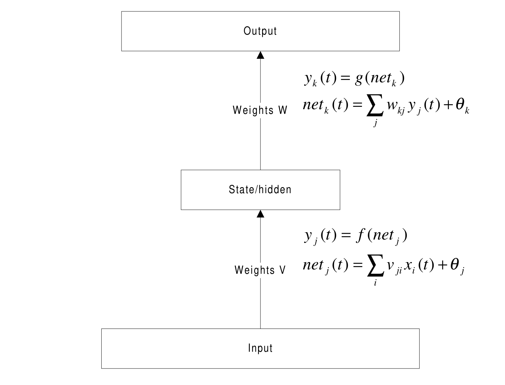
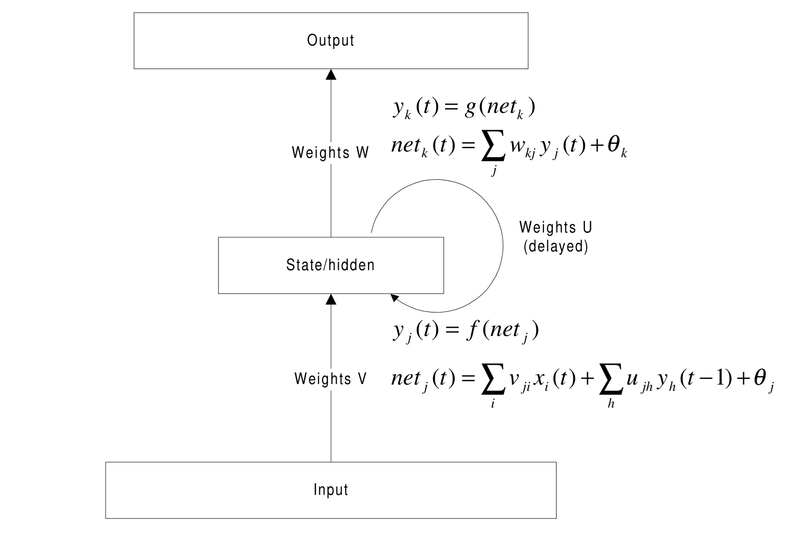
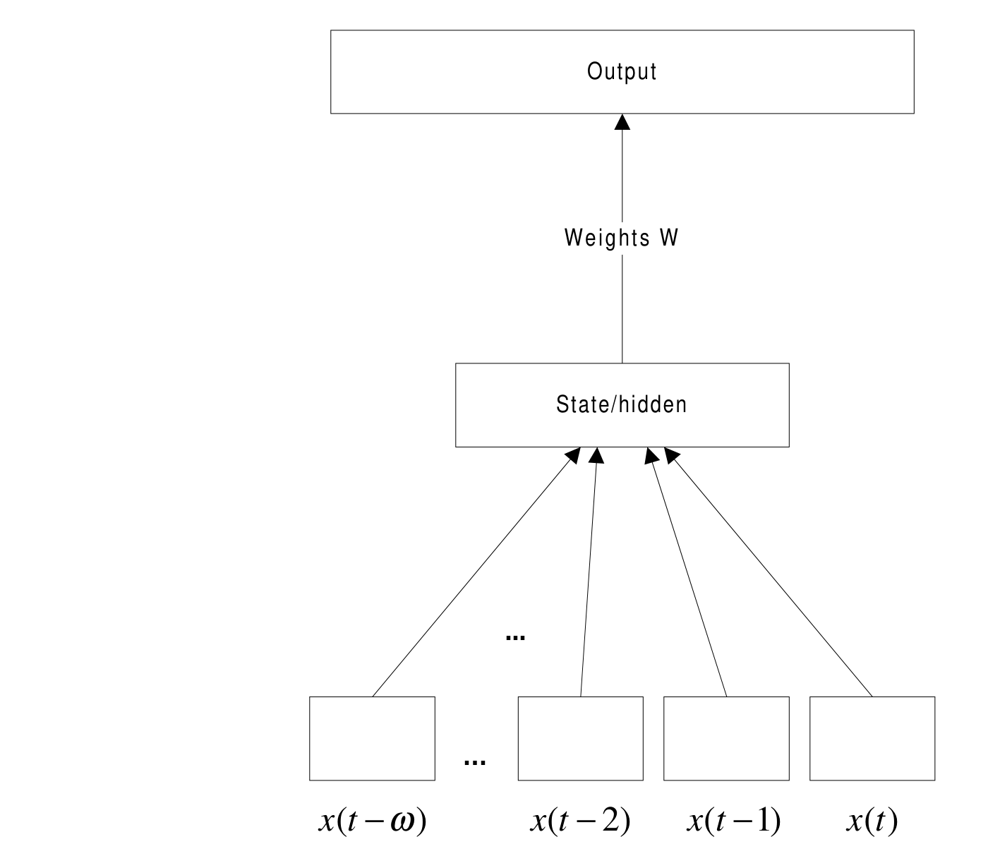
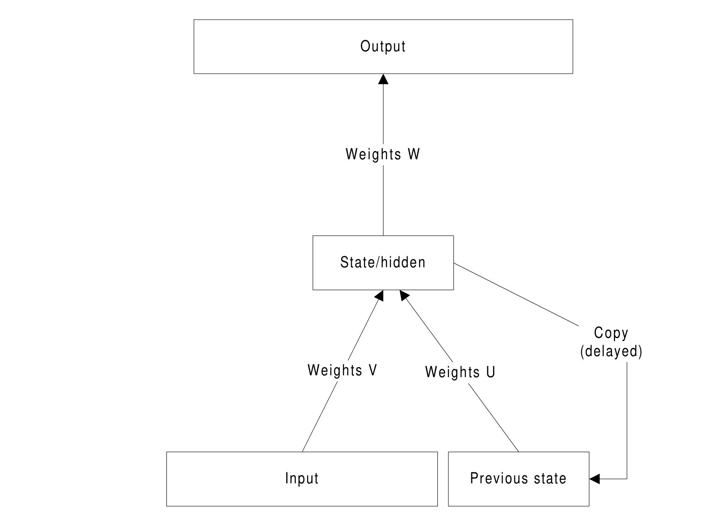
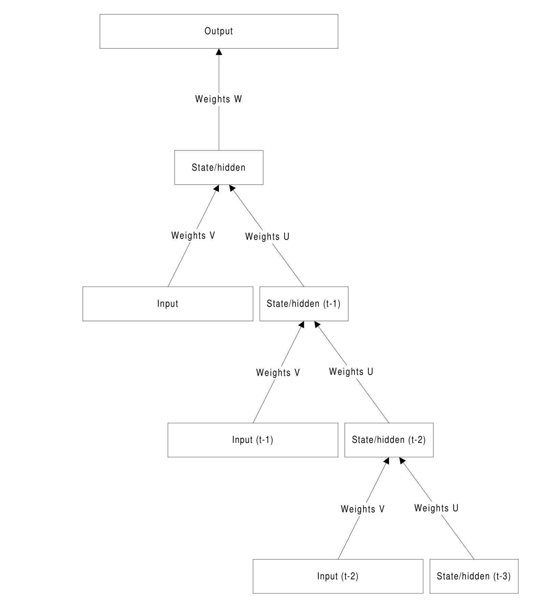

# 循环神经网络与反向传播指南（A Guide to Recurrent Neural Networks and Backpropagation）

> Mikael Bodén | mikael.boden@ide.hh.se
>
> 哈尔姆斯塔德大学（Halmstad University）信息科学、计算机与电气工程学院
>
> 2001 年 11 月 13 日

本文是循环神经网络的入门指南，核心思路是——**前馈网络只能近似空间有限函数，而循环网络通过内部状态空间 $s(t) = F(s(t-1), x(t))$ 保留"已处理内容的痕迹"，能够表示和学习跨任意（潜在无限）时间间隔的时序依赖；BPTT 通过把循环权重在时间上"展开" τ 步再折叠更新，实现循环网络的反向传播训练**。

核心内容：

- 表达能力：离散时间循环网络（权重至少为有理数）可表示任意图灵机；若用实数权重甚至可获超图灵机能力
- 前馈与循环的定义：前馈 $net_j(t) = \sum_i x_i(t)v_{ji} + \theta_j$ ；简单循环网络 $net_j(t) = \sum_i x_i(t)v_{ji} + \sum_h y_h(t-1)u_{jh} + \theta_j$ （权重 U 反馈上一时刻状态）
- 反向传播原理：对每个可修改权重求代价函数（默认 SSE）的梯度；误差 δ = −∂C/∂net 沿链式法则回传，更新规则 Δw = −η ∂C/∂w
- 概率视角的代价函数：高斯输出（线性 g(net)=net）、二项输出（交叉熵 + logistic）、1-of-n 分类（softmax）——三者都得到同样简洁的更新规则 Δw = η Σ(d−y)·输入
- 时序记忆三种方案：抽头延迟线（tapped delay line，把时间变空间）、截断 BPTT（Elman 原版）、完整 BPTT（展开 τ 步）

关键发现：

- 抽头延迟线的缺点：窗口大小需人工指定、不同时间步用独立权重损害泛化、权重大需要更多样本
- BPTT 的实际限制：τ 过大因"梯度消失效应"而无效；歧义 delta 导致的不稳定可能破坏收敛（但某些任务上有相反证据）
- logistic 导数可写为 $g'(y) = y(1-y)$ ；凡是从指数族概率分布中选取概率函数，都会得到 Δw = η Σ(d−y)y 形式的更新
- 状态空间的分析工具：层次聚类分析（HCA）、特征值/特征向量刻画（如主成分分析 PCA）

---

## 摘要

本文为循环神经网络周围的一些概念提供指导。与前馈网络相反，循环网络可以对过去的输入敏感并适应它们。本文描述了前馈网络的反向传播学习，使其适应我们（概率性的）建模需求，并扩展到覆盖循环网络。这篇简短论文的目的是为应用和理解循环神经网络奠定基础。

## 1. 引言

众所周知，传统的的前馈神经网络在给定（可能非常大的）隐藏节点集的情况下，可以用来逼近任何空间有限函数。也就是说，对于具有固定输入空间的函数，总有办法将这些函数编码为神经网络。对于两层网络，映射由两个步骤组成：

$$
y(t) = G(F(x(t))). \qquad (1)
$$

如果函数的充分样本可用，我们可以使用反向传播等自动学习技术来找到网络的权重（ $G$ 和 $F$ ）。

循环神经网络与前馈架构在根本上是不同的，因为它们不仅操作输入空间，还操作内部状态空间——网络已经处理过的内容的痕迹。这等价于一个迭代函数系统（IFS，Iterated Function System；IFS 的一般介绍见 (Barnsley, 1993) [1]；神经网络视角见 (Kolen, 1994) [12]）或一个动力系统（DS，Dynamical System；动力系统的一般介绍见如 (Devaney, 1989) [7]；神经网络视角见 (Tino et al., 1998; Casey, 1996) [20, 5]）。状态空间使得可以在未指定（且潜在无限）的间隔上表示（和学习）时间/序列扩展的依赖：

$$
y(t) = G(s(t)) \qquad (2)
$$

$$
s(t) = F(s(t-1), x(t)). \qquad (3)
$$

¹本文档主要是在作者任职于舍夫德大学（University of Skövde）计算机科学系期间撰写的。

为了限制本文的范围并简化数学问题，我们将假设网络在离散时间步中运行（完全可以使用连续时间代替）。事实证明，如果我们进一步假设权重至少是有理数并使用连续输出函数，网络能够表示任何图灵机（同样假设任何数量的隐藏节点都可用）。这很重要，因为那样我们就知道所有可以被计算的东西，都可以被离散时间循环神经网络同样好地处理¹。甚至有人提出，如果使用实数权重（神经网络完全模拟化），我们就能获得超图灵机能力（Siegelmann, 1999）[19]。

¹我故意避免使用"被计算"一词。

## 2. 一些基本定义

为了简化符号，我们将方程限制为两层网络，即除输入层外有两层节点的网络（给我们留下一个"隐藏"或"状态"层，以及一个"输出"层）。每层都有自己的索引变量： $k$ 用于输出节点， $j$ （和 $h$ ）用于隐藏节点， $i$ 用于输入节点。在前馈网络中，输入向量 $x$ 通过一个权重层 $V$ 传播：

$$
y_j(t) = f(net_j(t)) \qquad (4)
$$

$$
net_j(t) = \sum_i x_i(t) v_{ji} + \theta_j \qquad (5)
$$

其中 $n$ 是输入数量， $\theta_j$ 是偏置， $f$ 是输出函数（任何可微类型）。网络如图 1 所示。

在简单循环网络中，输入向量类似地通过一个权重层传播，但还通过一个额外的循环权重层 $U$ 与前一个状态激活相结合：

$$
y_j(t) = f(net_j(t)) \qquad (6)
$$

$$
net_j(t) = \sum_i x_i(t) v_{ji} + \sum_h y_h(t-1) u_{jh} + \theta_j \qquad (7)
$$

其中 $m$ 是"状态"节点的数量。

网络的输出在两种情况下都由状态和一组输出权重 $W$ 决定：

$$
y_k(t) = g(net_k(t)) \qquad (8)
$$

$$
net_k(t) = \sum_j y_j(t) w_{kj} + \theta_k \qquad (9)
$$

其中 $g$ 是输出函数（可能与 $f$ 相同）。

**图 1：** 前馈网络。

**图 2：** 简单循环网络。

## 3. 反向传播的原理

当期望的输出模式存在，且用于计算实际输出模式的每个函数都是可微的时候，任何网络结构都可以用反向传播训练。与传统的梯度下降（或上升）一样，反向传播的工作原理是：对每个可修改的权重，计算代价（或误差）函数相对于该权重的梯度，然后相应地调整它。

最常用的代价函数是平方误差和（SSE，Summed Squared Error）。训练集中的每个模式或呈现（presentation） $p$ ，在全部输出单元 $k$ 上，都会累加到代价中：

$$
C = \frac{1}{2} \sum_p \sum_k (d_{pk} - y_{pk})^2 \qquad (10)
$$

其中 $d$ 是期望输出， $n$ 是可用训练样本的总数， $m$ 是输出节点的总数。

根据梯度下降，网络中的每个权重变化应与代价相对于我们想要修改的特定权重的负梯度成比例：

$$
\Delta w = -\eta \frac{\partial C}{\partial w} \qquad (11)
$$

其中 $\eta$ 是学习率。

权重变化最好（使用链式法则）通过区分误差分量 $\delta = -\partial C/\partial net$ 和 $\partial net/\partial w$ 来理解。因此，输出节点的误差为

$$
\delta_{pk} = -\frac{\partial C}{\partial y_{pk}} \frac{\partial y_{pk}}{\partial net_{pk}} = (d_{pk} - y_{pk}) g'(y_{pk}) \qquad (12)
$$

隐藏节点的误差为

$$
\delta_{pj} = -\left( \sum_k \frac{\partial C}{\partial y_{pk}} \frac{\partial y_{pk}}{\partial net_{pk}} \frac{\partial net_{pk}}{\partial y_{pj}} \right) \frac{\partial y_{pj}}{\partial net_{pj}} = \sum_k \delta_{pk} w_{kj} f'(y_{pj}). \qquad (13)
$$

对于一阶多项式， $\partial net/\partial w$ 等于输入激活。那么权重变化就简单地为

$$
\Delta w_{kj} = \eta \sum_p \delta_{pk} y_{pj} \qquad (14)
$$

对于输出权重，以及

$$
\Delta v_{ji} = \eta \sum_p \delta_{pj} x_{pi} \qquad (15)
$$

对于输入权重。加上时间下标，循环权重可以按以下方式修改：

$$
\Delta u_{jh} = \eta \sum_p \delta_{pj}(t) y_{ph}(t-1). \qquad (16)
$$

输出函数的一个常见选择是 logistic 函数：

$$
g(net) = \frac{1}{1 + e^{-net}}. \qquad (17)
$$

logistic 函数的导数可以写成：

$$
g'(y) = y(1 - y). \qquad (18)
$$

出于显而易见的原因，当每个目标等于网络的实际输出时，大多数代价函数为 0。然而，在训练期间引导权重变化，存在比 SSE 更合适的代价函数（Rumelhart et al., 1995）[16]。下面列出的这些代价函数的共同假设是，实际输出与期望输出之间的关系是概率性的（网络仍然是确定性的），并且具有已知的误差分布。这反过来将网络输出激活的解释置于坚实的理论基础之上。

如果网络的输出是（由训练集给出的）高斯分布的均值，我们可以改为最小化

$$
C = -\sum_p \sum_k \frac{(y_{pk} - d_{pk})^2}{2\sigma^2} \qquad (19)
$$

其中 $\sigma$ 假设是固定的。这个代价函数实际上与 SSE 非常相似。

使用高斯分布（输出没有显式界限）时，输出节点的输出函数的一个自然选择是

$$
g(net) = net. \qquad (20)
$$

那么权重变化就简单地变为

$$
\Delta w_{kj} = \eta \sum_p (d_{pk} - y_{pk}) y_{pj}. \qquad (21)
$$

如果假设二项分布（每个输出值是期望输出为 1 或 0 的概率，例如特征检测），一个合适的代价函数是所谓的交叉熵：

$$
C = \sum_p \sum_k d_{pk} \ln y_{pk} + (1 - d_{pk}) \ln(1 - y_{pk}). \qquad (22)
$$

如果输出分布在 0 到 1 的范围内（如此处），logistic 输出函数是有用的（见方程 17）。输出权重变化同样是

$$
\Delta w_{kj} = \eta \sum_p (d_{pk} - y_{pk}) y_{pj}. \qquad (23)
$$

如果问题是 "1-of-n" 分类，多项分布是合适的。一个合适的代价函数是

$$
C = \sum_p \sum_k d_{pk} \ln \frac{e^{net_k}}{\sum_q e^{net_q}} \qquad (24)
$$

其中 $q$ 又是所有输出节点的另一个索引。如果选择了正确的输出函数，即所谓的 softmax 函数：

$$
g(net_k) = \frac{e^{net_k}}{\sum_q e^{net_q}}, \qquad (25)
$$

那么现在熟悉的更新规则自动随之而来：

$$
\Delta w_{kj} = \eta \sum_p (d_{pk} - y_{pk}) y_{pj}. \qquad (26)
$$

如 (Rumelhart et al., 1995) [16] 所示，每当我们从概率分布的指数族中选取概率函数时，都会出现这个结果。

## 4. 抽头延迟线记忆

将时间或序列信息纳入训练情境的最简单方法，也许是将时间域变成空间域并使用前馈架构。通过根据一个固定且预先确定的"窗口"大小扩展输入空间，把过去的信息插进来： $X = x(t), x(t-1), x(t-2), \ldots, x(t-\omega)$ （见图 3）。这通常被称为抽头延迟线（tapped delay line），因为输入被放入一个延迟缓冲区，并随着时间推移离散地移位。

**图 3：** "抽头延迟线"前馈网络。

也可以通过手动扩展这种方法：选择过去的某些间隔，在这些间隔上使用平均值或其他预处理特征作为输入，这可能反映信号的衰减。

这种方法的经典例子是 NETtalk 系统（Sejnowski and Rosenberg, 1987）[18]，它通过示例学习发音在输入端以文本形式显示的英语单词。网络一次接受七个字母，其中只有中间的一个被发音。

缺点包括：用户必须选择对网络有用的最大时间步数。此外，使用独立权重来处理相同分量但在不同时间步，损害了泛化能力。另外，大量的权重需要更大的样本集以避免过度特化。

## 5. 简单循环网络

严格的前馈架构不维持短期记忆。任何记忆效应都归因于过去的输入被重新呈现给网络的方式（如抽头延迟线）。

**图 4：** 简单循环网络。

简单循环网络（SRN，Simple Recurrent Network；(Elman, 1990) [8]）具有体现短期记忆的激活反馈。状态层不仅用网络的外部输入更新，还用前一次前向传播的激活更新。反馈由一组权重修改，以通过学习（例如反向传播）实现自动适应。

### 5.1 SRN 中的学习：时间反向传播

在 Jeff Elman（Elman, 1990）[8] 提出的原始实验中，使用了所谓的截断反向传播。这基本上意味着 $y_j(t-1)$ 被简单地视为一个额外的输入。状态层的任何误差 $\delta_j(t)$ 都被用于修改来自这个额外输入槽的权重（见图 4）。

误差可以进一步反向传播。这被称为时间反向传播（BPTT，Backpropagation Through Time；(Rumelhart et al., 1986) [17]），是迄今为止我们所看到的简单扩展。BPTT 的基本原理是"展开"。所有循环权重都可以在空间上复制任意数量的时间步，这里称为 $\tau$ 。因此，每个沿循环连接发送激活（直接或间接）的节点也有（至少） $\tau$ 个副本（见图 5）。

**图 5：** 为 BPTT 展开网络的效果（ $\tau = 3$ ）。

根据方程 13，误差按以下方式反向传播：

$$
\delta_{pj}(t-1) = \sum_h \delta_{ph}(t) u_{hj} f'(y_{pj}(t-1)) \qquad (27)
$$

其中 $h$ 是接收激活节点的索引， $j$ 是发送节点（回溯一个时间步）的索引。这使我们能够计算在时间 $t$ 评估的、基于任意数量先前呈现计算的节点输出（在状态层或输入层）的误差。

然而，重要的是要注意，在误差 delta 计算完毕后，权重被折叠回去，累加成每个权重的一个大的变化。显然，我们选择的 $\tau$ 越大，内存需求越大（过去的误差和激活都需要存储起来）。

在实践中，由于"梯度消失效应"（见如 (Bengio et al., 1994) [2]），大的 $\tau$ 是相当无用的。每层误差都反向传播，误差变得越来越小，直到完全消失。也有人指出，由可能歧义的 delta 引起的不稳定性（例如 (Pollack, 1991) [13]）可能破坏收敛。对于某些学习任务，有人提出了相反的结果（Bodén et al., 1999）[4]。

## 6. 讨论

已经讨论过的架构和学习规则有许多变体（例如所谓的 Jordan 网络（Jordan, 1986）[11]，以及全循环网络、实时循环学习（Williams and Zipser, 1989）[21] 等）。然而，循环网络共享这样的性质：能够在内部使用和创建反映时间（甚至结构）依赖的状态。对于较简单的任务（例如学习由小型有限状态机生成的语法），状态空间的组织直接反映了训练数据的组成部分（例如 (Elman, 1990; Cleeremans et al., 1989) [8, 6]）。

在大多数情况下，状态空间是实值的。这意味着组成部分之外的微妙之处，例如统计规律性，可能影响状态空间的组织（例如 (Elman, 1993; Rohde and Plaut, 1999) [9, 15]）。对于更困难的任务（例如需要更长的记忆痕迹且上下文依赖明显），高度非线性的连续空间提供了新颖的动力学类型（例如 (Rodriguez et al., 1999; Bodén and Wiles, 2000) [14, 3]）。

这些是引人入胜的研究课题，但超出了这篇入门论文的范围。对学到的内部表示和过程/动力学的分析，对于理解这些网络处理什么以及如何处理至关重要。分析方法包括层次聚类分析（HCA，Hierarchical Cluster Analysis），以及特征值和特征向量刻画（主成分分析（PCA，Principal Components Analysis）是其中之一）。

## 参考文献

[1] Barnsley, M. (1993). Fractals Everywhere. Academic Press, Boston, 2nd edition.

[2] Bengio, Y., Simard, P., and Frasconi, P. (1994). Learning long-term dependencies with gradient descent is difficult. IEEE Transactions on Neural Networks, 5(2):157–166.

[3] Bodén, M. and Wiles, J. (2000). Context-free and context-sensitive dynamics in recurrent neural networks. Connection Science, 12(3).

[4] Bodén, M., Wiles, J., Tonkes, B., and Blair, A. (1999). Learning to predict a context-free language: Analysis of dynamics in recurrent hidden units. In Proceedings of the International Conference on Artificial Neural Networks, pages 359–364, Edinburgh. IEE.

[5] Casey, M. (1996). The dynamics of discrete-time computation, with application to recurrent neural networks and finite state machine extraction. Neural Computation, 8(6):1135–1178.

[6] Cleeremans, A., Servan-Schreiber, D., and McClelland, J. L. (1989). Finite state automata and simple recurrent networks. Neural Computation, 1(3):372–381.

[7] Devaney, R. L. (1989). An Introduction to Chaotic Dynamical Systems. Addison-Wesley.

[8] Elman, J. L. (1990). Finding structure in time. Cognitive Science, 14:179–211.

[9] Elman, J. L. (1993). Learning and development in neural networks: The importance of starting small. Cognition, 48:71–99.

[10] Giles, C. L., Miller, C. B., Chen, D., Chen, H. H., Sun, G. Z., and Lee, Y. C. (1992). Learning and extracted finite state automata with second-order recurrent neural networks. Neural Computation, 4(3):393–405.

[11] Jordan, M. I. (1986). Attractor dynamics and parallelism in a connectionist sequential machine. In Proceedings of the Eighth Conference of the Cognitive Science Society.

[12] Kolen, J. F. (1994). Fool's gold: Extracting finite state machines from recurrent network dynamics. In Cowan, J. D., Tesauro, G., and Alspector, J., editors, Advances in Neural Information Processing Systems, volume 6, pages 501–508. Morgan Kaufmann Publishers, Inc.

[13] Pollack, J. B. (1991). The induction of dynamical recognizers. Machine Learning, 7:227.

[14] Rodriguez, P., Wiles, J., and Elman, J. L. (1999). A recurrent neural network that learns to count. Connection Science, 11(1):5–40.

[15] Rohde, D. L. T. and Plaut, D. C. (1999). Language acquisition in the absence of explicit negative evidence: How important is starting small? Cognition, 72:67–109.

[16] Rumelhart, D. E., Durbin, R., Golden, R., and Chauvin, Y. (1995). Backpropagation: The basic theory. In Chauvin, Y. and Rumelhart, D. E., editors, Backpropagation: Theory, architectures, and applications, pages 1–34. Lawrence Erlbaum, Hillsdale, New Jersey.

[17] Rumelhart, D. E., Hinton, G. E., and Williams, R. J. (1986). Learning internal representations by back-propagating errors. Nature, 323:533–536.

[18] Sejnowski, T. and Rosenberg, C. (1987). Parallel networks that learn to pronounce English text. Complex Systems, 1:145–168.

[19] Siegelmann, H. T. (1999). Neural Networks and Analog Computation: Beyond the Turing Limit. Birkhäuser.

[20] Tino, P., Horne, B. G., Giles, C. L., and Collingwood, P. C. (1998). Finite state machines and recurrent neural networks – automata and dynamical systems approaches. In Dayhoff, J. and Omidvar, O., editors, Neural Networks and Pattern Recognition, pages 171–220. Academic Press.

[21] Williams, R. J. and Zipser, D. (1989). A learning algorithm for continually running fully recurrent neural networks. Neural Computation, 1(2):270–280.
