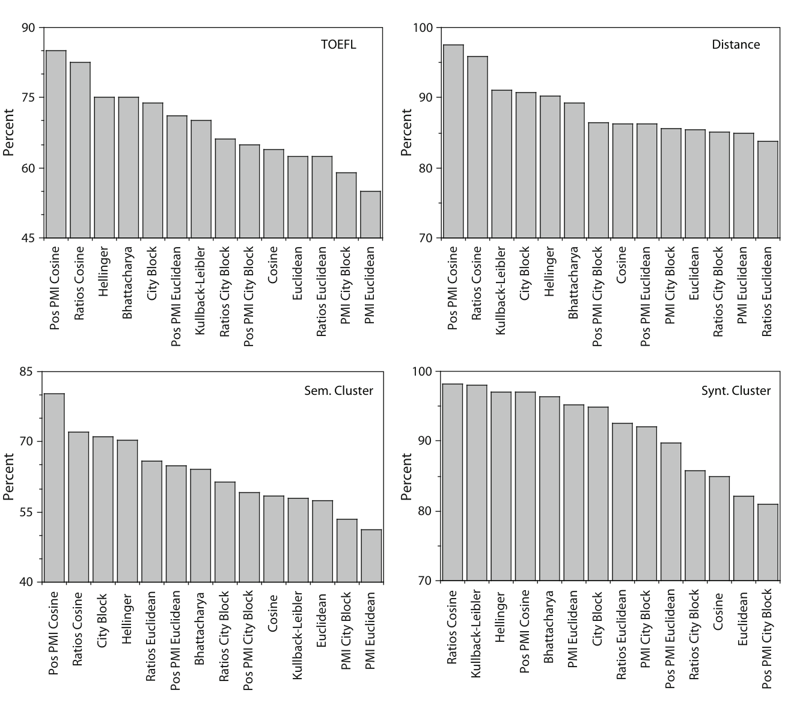
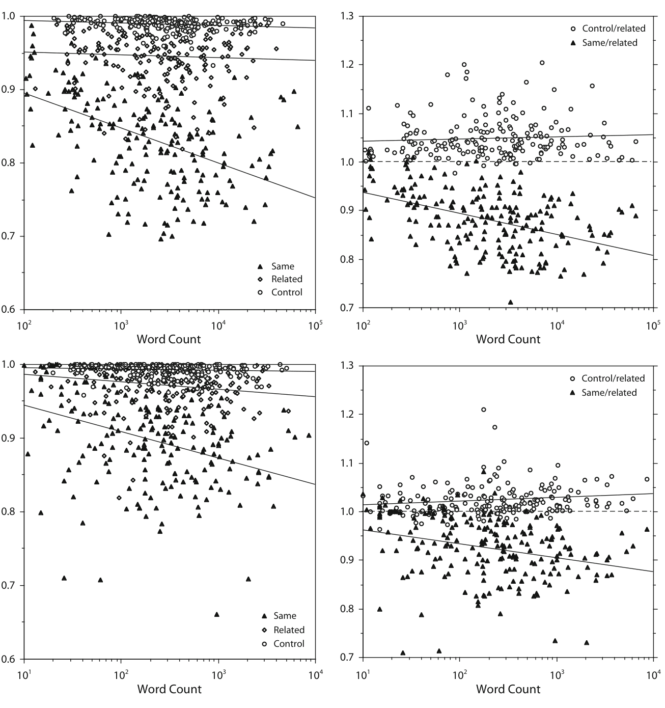
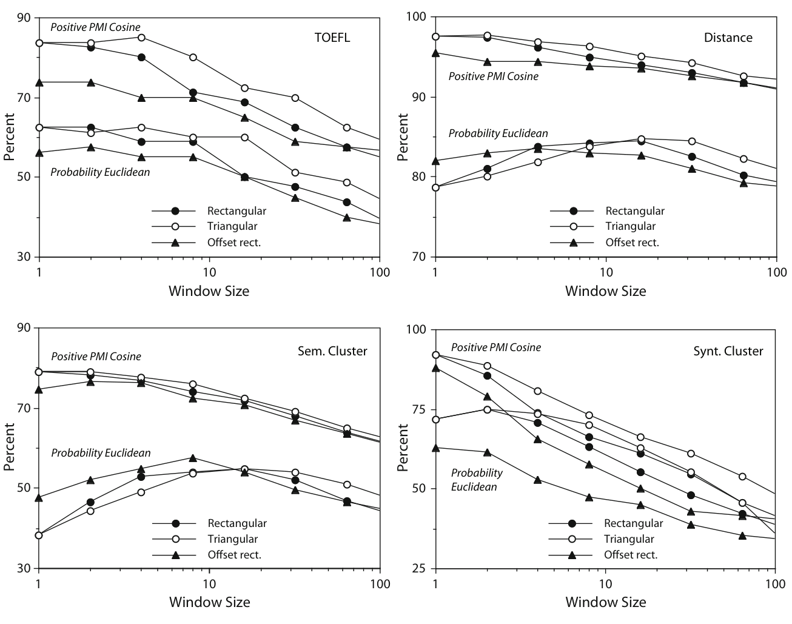
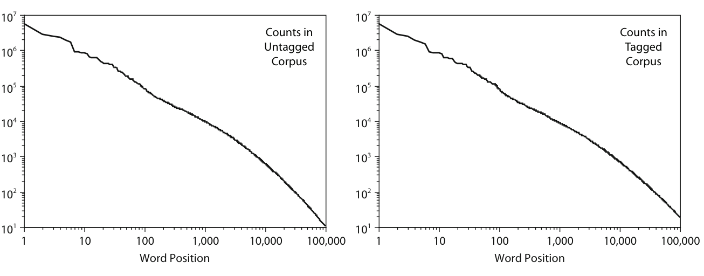
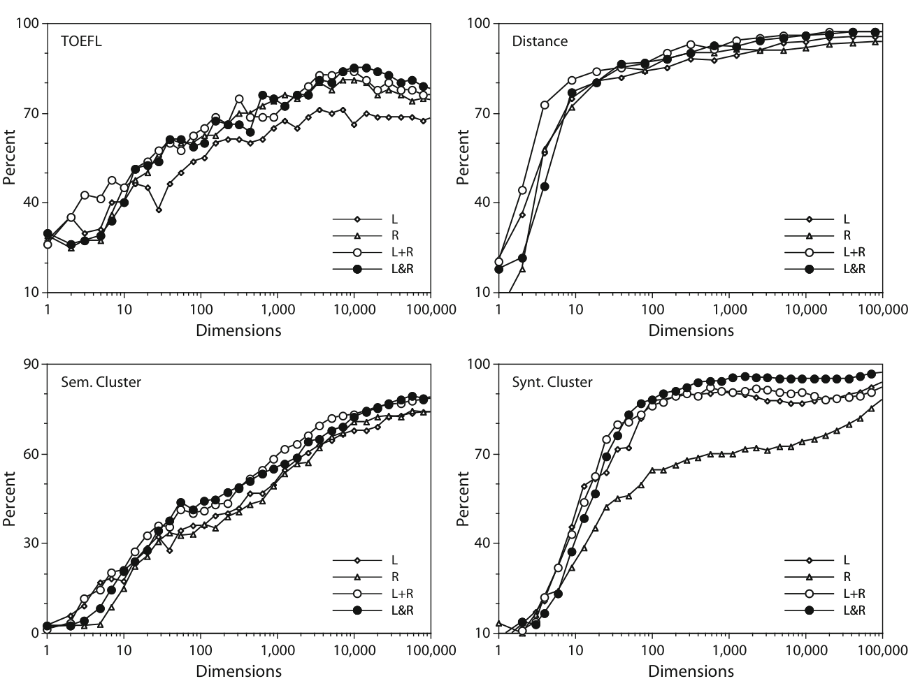
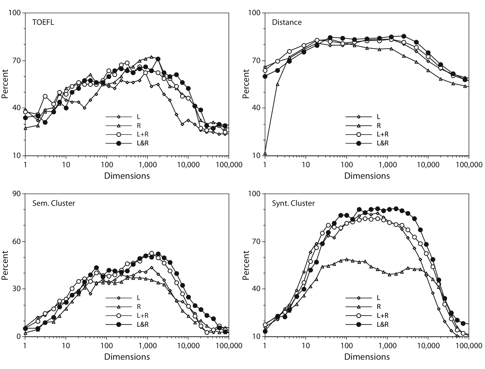
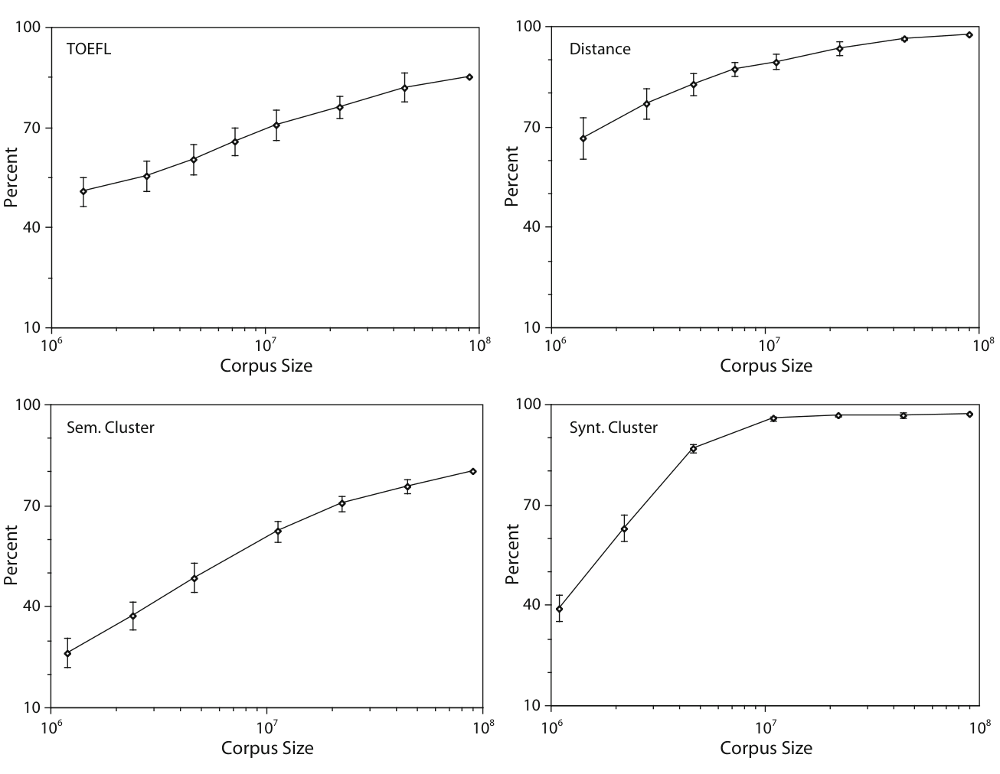
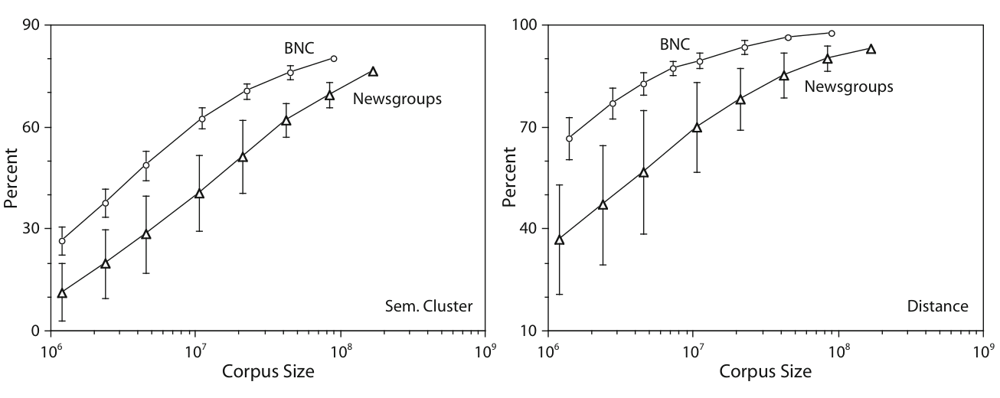
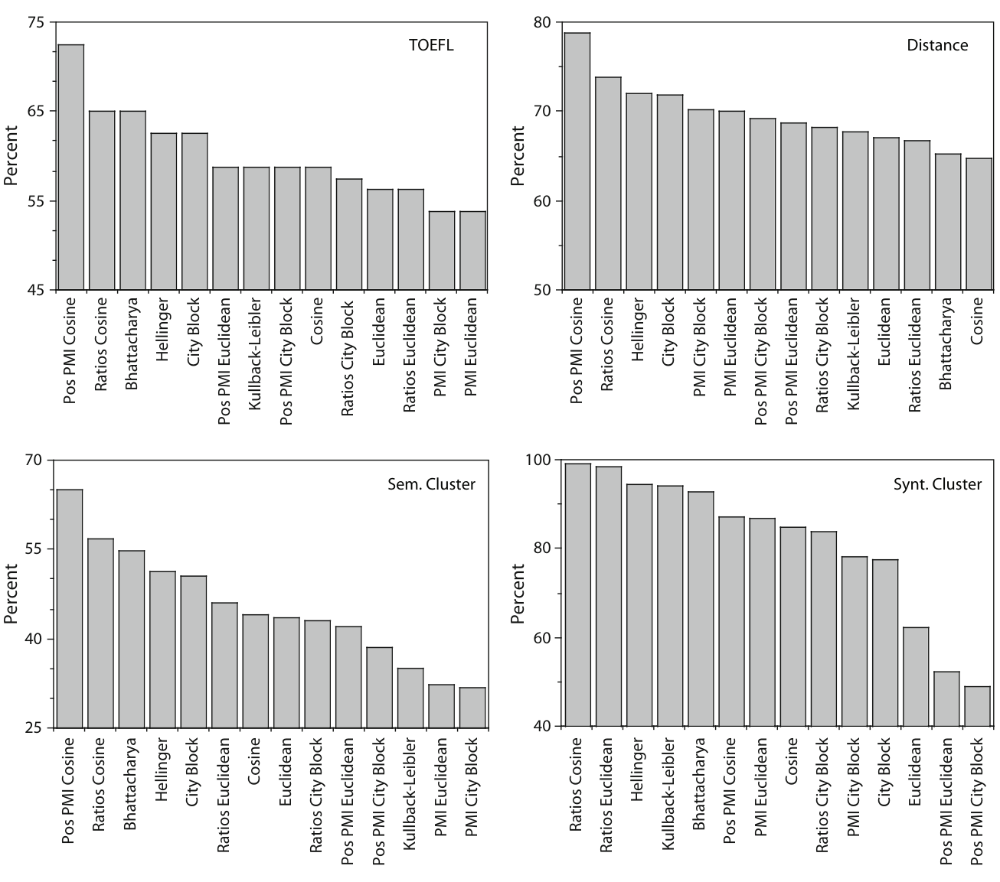
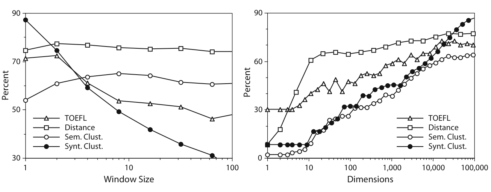

# 从词共现统计中提取语义表示：一项计算研究（Extracting semantic representations from word co-occurrence statistics: A computational study）

> John A. Bullinaria | 英国伯明翰大学（University of Birmingham）
>
> Joseph P. Levy | 英国伦敦罗汉普顿大学（Roehampton University）
>
> Behavior Research Methods, 2007, 39(3), 510-526

本文对从词共现统计构建语义向量的计算方案做了迄今最系统的探索，核心发现是——**正逐点互信息（Positive PMI）分量 + 余弦距离 + 最小上下文窗口这一极其简单的方法，在四个心理语言任务上表现惊人地好且稳健，TOEFL 同义词判断达 85%**。

核心内容：

- 问题：词共现统计可作语义表示基础，但分量类型（概率/PMI/比值）、距离度量（欧氏/城市街区/余弦/Hellinger/Bhattacharya/KL）与窗口设计的选择空间巨大
- 方法：在约 9000 万词的 BNC 语料上构建向量，用 4 个任务（TOEFL 同义词判断、距离比较、语义分类、句法分类）系统评估所有组合
- 结论：Positive PMI + Cosine 全面最佳；窗口越小越好；封闭类词提供有用信息；低频词分量大多有用；无需降维
- 扩展：检验语料库大小（4480 万→460 万词）与质量（BNC vs 新闻组）的影响，以及 Grolier 小语料上的表现

关键发现：

- TOEFL 达 **85.0%**，超过此前最好结果（75.0% Hellinger、73.8% Turney、64.4% LSA、考生平均 64.5%）
- 新闻组语料在所有规模上性能大幅下降且方差增大——语料质量与数量同样重要
- 460 万词 Grolier 语料上 TOEFL 72.5%，远超同规模 BNC 子集的 60.4% ± 4.4%
- 停用词表（stop list）反而有害：仅前 150 个高频封闭类词维度就贡献约 65% 的 TOEFL 分数；降维并非必需

---

## 摘要

至少词义的某些方面可以从词共现模式中归纳出来的想法正变得越来越流行。然而，关于所涉及的确切计算以及区分各种可能性的适当测试，人们的分歧更大。如果要可靠地评估和比较使用这些方法的心理模型，理解相关设计选择和参数值的影响非常重要。在本文中，我们对从词共现统计中构建和验证词义表示的主要计算可能性进行了系统探索。我们发现，一旦确定了最佳程序，一种非常简单的方法在一系列心理相关的评估指标上表现出惊人的成功和稳健性。

## 引言

文献中有令人信服的提示（例如 [26, 32, 39]）表明，可以从自然语言流的接触中学习心理相关且合理的词义表示。这些主张与人类学习词汇语义以及计算机学习此类表示但用于人类心理表现模型（例如 [31]）都直接相关。最强的说法或许是，人类婴儿可以通过构建和操作他们所遇到的话语/文本流的词共现统计来获得词义表示。基本思想很简单：含义相似的词倾向于出现在相似的上下文中，因此词共现统计可以为语义表示提供自然的基础。显式模拟确实表明，以这种方式形成的向量空间表示可以在各种表现标准上表现得非常好，例如，使用简单的向量空间距离度量来执行英语作为外语测试（TOEFL，Test of English as a Foreign Language）中所用的多项选择同义词判断 [26, 28]。

显然，仅靠共现统计不足以构建完整可靠的词汇表示 [16]。例如，没有额外的计算装置，它们永远无法处理同音异义词和同形异义词——形式相同但含义不同的词（例如 [43]）。它们也无法解释人类从词典或教学中学到词义的能力。然而，人们可以看到统计表示如何为语义表示的学习形成一个计算高效的基石。完整的学习过程可能采取以下形式：

1. 随着遇到更多训练数据（即自然语言使用），迭代更新词共现统计。
2. 将该信息处理成适当的语义表示，可能采用某种形式的降维或其他形式的数据压缩。
3. 使用监督学习技术精炼这些表示，例如，通过分离同音异义词，或插入词典学到的词。

如果我们能表明这样的计算程序可以从自然语言输入创建有用的词汇语义表示，那么就可以合理地认为进化赋予了人类利用这些统计的能力。这当然仍然留给我们准确描述人类系统如何工作的任务，但理解原则上如何最好地计算此类表示是必要的第一步。此外，尽管这不是本文的主要焦点，理解和遵循这些人类程序也可能是构建人工语言处理系统的良好策略。

文献中有许多技术可以用于实现阶段 3，例如学习向量量化（LVQ，Learning Vector Quantization）主题的各种变体，其中由无监督聚类或学习方法生成的表示通过监督学习进行调整 [25]。执行阶段 1 的共现计数的程序也很直接，但人类不太可能先收集词计数然后稍后处理。更可能的是三个阶段共存，使得表示的获得以所观察到的渐进在线方式自动发生。然而，出于本文的目的，我们将假设如果我们能独立地为三个阶段提出合适的公式，那么就可以使用现有的连接主义技术将它们组合成一个一致且连贯的在线整体（例如 [4, 19]），并且生物合理性带来的任何约束将同时得到解决。因此，剩下的任务就是指定阶段 2。

我们面临的第一个主要问题是，可以从原始共现计数中提取出许多不同类型的统计来构建词义的向量空间表示，而哪一种最好一点都不明显。这引出了第二个主要问题，即不清楚应该如何衡量各种可能表示的质量。当然可以在各种类人语言任务上尝试它们，例如同义词判断，但那样一来如何将我们基于计算机的表示的使用映射到人类使用它们的方式（例如 [5]）就不明显了。而且对于构建有用的基于计算机的表示来说，我们是否想以同样的方式使用它们也不明显。我们自己最初的调查 [28, 29, 39] 表明，产生最佳表现水平的计算细节关键取决于特定类人任务的细节以及我们实现它的确切方式。这显然使得可靠地识别整个方法的优缺点变得困难。幸运的是，这里呈现的更完整分析表明，一旦我们确定整体最佳方法，结果就会好得一致得多。

在本文的其余部分，我们将呈现对构建词共现方法进行词义表示的主要可能性的系统探索。我们首先简要概述该领域的先前工作，然后概述此处要考虑的计算技术和测试范围。然后，我们通过总结和讨论我们使用来自英国国家语料库（BNC，British National Corpus）文本部分导出的语义向量获得的关键结果，来探索各种细节的重要性，该语料库包含来自各种代表性来源的约 9000 万词 [1]。然后针对语料库大小和质量测试这些结果的稳健性。最后我们以一些更一般的讨论和结论结束。

## 词共现统计的先前工作

受语言学直觉的启发（例如 [41, 15]），该领域的工作在计算语言学、信息检索和语言心理学的组成部分学科中开展。我们现在简要概述一些过去的工作，强调词汇层面的心理相关结果，而不是句子或文档等更高组织层面。

Schütze 及其同事的工作（例如 [42]）展示了相对较小语料库中字母 4-gram 的共现统计如何能够以语义相关的方式检查词汇表示之间的距离，并证明了简单共现测量中存在惊人的大量信息。这个"词空间"（Word Space）模型使用奇异值分解（SVD，Singular Value Decomposition）从共现统计中提取统计上最重要的维度，这是此后在下面描述的 LSA 工作中使用的著名统计技术。

[14] 使用共现统计作为归纳句法类别的基础。他们使用 4000 万词 USENET 新闻组语料库中的两词窗口，考察了 1,000 个最频繁目标词与 150 个最频繁上下文词的共现。所得向量产生了聚类分析树状图，反映了非常接近标准语言分类法的句法类别层次结构，包括一直到短语的结构。他们还发现他们的一些聚类表现出语义规律性。英语语料库中最常见的 150 个词大多是封闭类词或语法功能词。使用此类封闭类词共现模式来归纳语义相似度度量将在下面进一步考察。这项工作由 [40] 使用儿童导向言语的 CHILDES 语料库继续。最近，[37] 考察了基于共现的线索和音系线索在从 CHILDES 语料库归纳句法类别中的不同贡献。

[32] 开发了一个他们称为 HAL（hyperspace approximation to language，语言高维空间近似）的相关框架。使用在 1.6 亿词 USENET 新闻组文本语料库中获得的带权 10 词窗口的共现向量之间的欧几里得距离，他们能够预测词汇决策任务中一个词对另一个词的启动程度。他们的工作表明，来自容易获得的文本源的简单共现模式如何能够产生在词汇语义层面模拟心理任务的统计，而无需很大程度的预处理或降维等操作。该小组继续在几项进一步研究中使用他们的方法（例如 [2, 8]）。

McDonald 和 Lowe 也报告了使用共现统计作为语义相关度度量的情况（例如 [30, 34]）。[35] 描述了一种基于共现统计的"上下文相似度"度量。[31] 描述了使用共现统计来建模中介启动。使用 10 词窗口，他们使用方差分析（ANOVA，Analysis of Variance）来选择上下文词维度，以判断共现模式在不同子语料库之间的一致性程度。使用相当保守的标准，该方法产生了 536 个上下文词。他们排除了 571 个词的"停用词表"（stop list），包括封闭类词和其他在信息检索文献中通常被视为无信息的高频词。

我们自己的小组也报告了使用类似简单共现统计的方法学结果。我们开发了评估方法，并用它们探索了基于向量的语义表示使用方法背后的参数空间 [28, 29, 39]。我们发现窗口形状和大小的选择、上下文词的数量以及"停用词表"可以对结果产生巨大影响，并且使用简单的信息论距离度量通常比传统的欧几里得和余弦度量效果更好。本文的主要目标之一是更系统、更全面地探索能够影响这些方法性能的设计选择范围。

Landauer 和 Dumais 采用了一种略有不同的方法，源自信息检索 [27]，他们称之为潜在语义分析（LSA，Latent Semantic Analysis），强调降维作为揭示词义底层成分的方法的重要性。[26] 是该领域的一篇重要论文，因为它展示了简单的词共现数据如何足以模拟儿童词汇量的增长，从而为词共现的心理效用提出了强有力的主张。使用来自 Grolier 学术美国百科全书的 30,473 篇面向儿童设计的文章，他们使用对应于每篇文章长度或其前 2,000 个字符的窗口测量上下文统计。然后他们对数据使用基于熵的变换，并使用奇异值分解（SVD）提取 300 个最重要的维度，该过程与标准主成分分析（PCA，Principal Component Analysis）相关，允许从非方阵中提取最重要的底层维度。除了提供进一步的证据表明词共现数据包含可以提取的语义信息外，他们还展示了从现实语言输入进行归纳学习如何能够解释与儿童词汇获得中表现增长相呼应的表现增长。

[26] 通过将其框架用于英语作为外语测试（TOEFL）的同义词部分来证明其实用性。该测试在下面有完整描述，但本质上，对于 80 个目标词中的每一个，必须从四个其他词中选择含义最接近的词。他们的程序使用在其导出的共现向量与目标词的共现向量之间选择最大余弦（即最小角距离）词的策略，得分约为 64%。他们指出，该分数与非英语国家申请美国大学学生的平均分数相当，并且高到足以允许进入许多美国大学。他们继续表明，其模型的学习速率反映了儿童词汇获得的模式，并展示了儿童如何能够从当前上下文和过去词共现的知识中归纳出以前未见过的词的大致含义。他们的工作是使用共现统计对观察数据进行数值拟合的详细认知模型的重要例子。

LSA 背后的计算方法在过去十年中被应用、发展和进一步扩展。这包括使用 LSA 建模隐喻理解 [23, 24]；从儿童语料库的 LSA 分析构建的儿童语义记忆模型 [13]；应用于学生论文评分 [36]；在推理上应用不同知识来源 [45]；对 LSA 距离度量的数学改进 [22]；LSA 底层统计方法的潜在改进 [20]；以及许多其他研究。

上述简短而有选择性的回顾展示了使用共现统计的模型可以应用的各种心理领域。该方法为发展心理学（例如 [26, 22, 37]）、心理语言学（例如 [31, 32]）、神经心理学（例如 [11]）提供了洞见，还有可能对心理学有潜在意义的技术应用，如信息检索 [12] 和词义消歧/同义识别（例如 [7, 43, 44]）。所有这些领域的模型都依赖于从语言输入归纳语言一般性的经验主义视角。我们在本文中报告的结果具有重要意义，因为它们展示了这些统计方法在设计和参数空间中的各种最优性，从而加强了基于该方法模型的理论基础。比较不同方法和参数产生的语义表示的需要已在 [21] 中更一般地讨论过。这里我们感兴趣的不是不同语义空间之间相似度的度量，而是每个可能的基于语料库的向量空间作为语义表示表现如何的度量。

我们必须注意，关于使用词共现统计作为人类表示意义的基础仍然存在一些争议。[17] 攻击 HAL 和 LSA 没有解决 [18] 的符号接地问题。他们的替代方案是一种具身方法，其中含义取决于身体动作和环境中对象的可供性。任何纯符号方法（包括基于词共现的理论）都被判定为不充分，因为它们从不接触现实世界，只依赖符号表示之间的内部关系。他们拒绝 [26] 为该问题提供的解决方案，即在感知事件与词或其他感知事件之间编码共现，因为这尚未在 HAL 或 LSA 等方法中实现。[6] 在他对 [17] 的回复中，支持将含义表示为从词共现导出的高维向量的模型，因为它们明确且透明。他论证说，[17] 的实验数据显示 LSA 的一种实现无法解释灵活判断（例如用树叶填充毛衣作为枕头替代品的合理性，对比用水填充毛衣），这些是不公平的测试，因为 LSA 向量不是从相关的"经验"导出的。[6] 还指出 HAL 和 LSA 纯粹是表示模型，不描述利用从累积共现模式导出的知识所需的处理机制。

[16] 也正确地声称共现模式本身无法解释"真实世界语义"的所有方面。他们认为，如果不使用世界知识方面和可以改变词或短语含义的上下文使用灵活性，共现就无法捕获语言的微妙用法，例如律师比袋鼠更像鲨鱼，或者以色列部长的名字听起来像犹太人的可能性比巴勒斯坦人的可能性更大。如果不用可能让它有机会获得此类信息的适当语言材料训练模型，我们想对共现统计能多好地捕获此类含义保留判断，但我们同意仅靠词共现不太可能足以捕获语义的所有方面。我们只是声称，它们能捕获的东西多得惊人，它们是归纳词角色的良好候选来源，因为我们可以证明大量语义信息存在并且可以用简单的计算方法提取，而且它们为更完整的表示提供了坚实的基础。

## 计算词共现向量

生成原始词共现计数只是遍历一个大的口语或书面语料库，并计数每个上下文词 $c$ 在每个目标词 $t$ 周围大小为 $W$ 的窗口内出现的次数 $n(c,t)$ 。我们将假设语料库以其原始状态使用，没有预处理，从而给出可达到性能水平的保守估计。人类很可能在体验词流时使用简单的变换，如词干化或词元化 [33, p. 132]，从而形成比我们基本计数方法更好的表示。例如，他们可能通过利用告诉我们 "walk" 和 "walked" 形态相关从而语义相关的语法知识来提高表现。我们这里的目标是进行计算实验，以期得出从给定语料库提取最佳可能词汇语义信息的一些通用指导方针。这将为心理上更合理的模型和理论提供基础，同时在我们理解计算可能性范围之前避免需要对那些系统的细节做出具体主张和假设。

自然地，词义将与语料库大小无关，因此计数被归一化，为每个词 $t$ 给出基本语义向量，即条件概率向量

$$
p(c|t) = \frac{p(c, t)}{p(t)} = \frac{n(c, t)}{\sum_{c'} n(c', t)},
$$

它满足概率的所有常规性质（即所有分量为正且和为 1）。语料库中各个词的频率是

$$
f(t) = \frac{1}{W} \sum_c n(c, t), \qquad f(c) = \frac{1}{W} \sum_t n(c, t)
$$

——即总和的共现计数除以每个词被计数的次数（窗口大小 $W$ ）；各个词的概率是

$$
p(t) = \frac{1}{NW} \sum_c n(c, t), \qquad p(c) = \frac{1}{NW} \sum_t n(c, t),
$$

——即词频率除以 $N$ ，语料库中的总词数。

显然，我们目标词周围的窗口可以用许多方式定义（例如 [32]）。我们可以只用目标词左侧（即之前）的窗口，或只用右侧（即之后），或者我们可以有一个对称窗口，把左侧和右侧的计数相加，或者我们可以有分别保留左侧和右侧计数的向量。我们可以有所有词位置被平等计数的平坦窗口，或最近上下文词比更远的词计数更多的窗口——例如，以三角或高斯方式。人们可以轻易想出这个主题的进一步变体。这些变体的影响是我们稍后将探索的实现细节之一。

为了判断这些基本共现向量对表示语义有多有用，我们需要定义一些独立的经验测试来衡量它们的质量。这有两个方面：

1. 从统计数据获取的角度来看，向量有多可靠？例如，不同的表示将在多大程度上从语料库的不同子集产生。这可以仅使用训练数据——即仅使用语料库本身的信息——来测试。
2. "语义向量"在多大程度上提供了我们对语义表示所期望的东西？为了测试这一点，我们需要与我们所知道的好语义表示应该能够做什么的外部度量进行比较，例如，基于人类在合适任务上的表现。

对这些点的系统探索将为我们提供线索，说明进一步处理可能是适当的，以及整个方法有多可行。它还将提供一些关于适当实现细节的有用指导方针，然后可以为具体模型和理论的发展提供信息。

## 验证语义表示

显然，有无数的经验测试可以用来估计我们表示语义有效性的程度。在本文中，我们将呈现四个测试的结果，这些测试旨在探测从语料库导出的向量的不同方面：

**TOEFL（英语作为外语测试）**。这是一个被广泛研究的性能度量，基于美国大学使用的真实 TOEFL 测试中的词 [26]。它由 80 道多项选择判断组成，判断目标词与四个其他词之间最接近的含义（例如，以下哪个词与 enormously 含义最接近：appropriately、uniquely、tremendously 或 decidedly）。该测试由 Tom Landauer 提供，我们转换了几个词的拼写以匹配我们的英式英语语料库。它的实现方式是计算我们语义空间中目标词与四个选择词中每一个之间的距离，并计数正确词最接近目标词的数量。

**距离比较**。这与 TOEFL 测试类似，涉及多项选择相似度判断，但与其测试词之间的细微区别（其中许多在语料库中出现得非常少），它旨在使用语料库中分布良好的词测试语义空间的大尺度结构。它涉及 200 个目标词，比较在一个语义相关词和从 200 对中随机选择的十个其他词之间（例如，典型的相关词是 brother 和 sister、black 和 white、lettuce 和 cabbage、bind 和 tie、competence 和 ability）。性能是比相关词离目标词更远的对照词的百分比。

**语义分类**。该测试旨在探索语义类别在向量空间中表示的程度。它测量各个词向量离自己语义类别中心的距离比离其他类别中心之一的距离更近的频率 [39]。基于人类类别规范 [3]，从 53 个语义类别（例如金属、水果、武器、运动、颜色）中每个取 10 个词，并计算 530 个词中离自己类别中心比离另一个中心更近的百分比。

**句法分类**。该测试考察句法信息是否可以在与语义相同的向量空间中表示，还是需要单独的向量空间。测量词向量离自己句法类别中心的距离比离其他类别中心更近的程度 [29]。为 12 个常见词类中的每一个取 100 个词，并计算 1200 个词中离自己类别中心比离另一个更近的百分比。

立即清楚的是，这些测试中的每一个都依赖于在语义向量空间上定义某种形式的距离度量。同样有许多可能性。三个熟悉且常用的几何度量是

欧几里得

$$
d(t_1, t_2) = \left[ \sum_c \left| p(c|t_1) - p(c|t_2) \right|^2 \right]^{1/2},
$$

城市街区

$$
d(t_1, t_2) = \sum_c \left| p(c|t_1) - p(c|t_2) \right|,
$$

和余弦

$$
d(t_1, t_2) = 1 - \frac{\sum_c p(c|t_1) \, p(c|t_2)}{\sqrt{\sum_c p(c|t_1)^2 \sum_c p(c|t_2)^2}}.
$$

欧几里得和城市街区是著名的 Minkowski 度量。余弦是一减去两个向量之间夹角的余弦，度量向量方向的相似度，而不是向量空间中的位置 [26]。鉴于向量是概率，信息论度量如

Hellinger

$$
d(t_1, t_2) = \left[ \sum_c \left( \sqrt{p(c|t_1)} - \sqrt{p(c|t_2)} \right)^2 \right]^{1/2},
$$

Bhattacharya

$$
d(t_1, t_2) = -\log \sum_c \sqrt{p(c|t_1) \, p(c|t_2)},
$$

和 Kullback-Leibler

$$
d(t_1, t_2) = \sum_c p(c|t_1) \log \frac{p(c|t_1)}{p(c|t_2)}
$$

可能更合适 [46]。Hellinger 和 Kullback-Leibler 度量已在先前研究中被证明效果良好 [28, 39]。

对于我们的语义向量，我们还应该考虑原始概率 $p(c|t)$ 之外的许多自然替代方案。也许最广泛考虑的是逐点互信息（PMI，Pointwise Mutual Information）（例如 [10, 33]），它比较每个词 $t$ 的实际条件概率 $p(c|t)$ 与平均或期望概率 $p(c)$ ；即

$$
i(c, t) = \log \frac{p(c|t)}{p(c)} = \log \frac{p(c, t)}{p(t) \, p(c)}.
$$

负值表示少于期望数量的共现，这可以出于许多原因产生，包括被表示词在语料库中的覆盖不足。因此，一个可能有用的变体是把所有负分量设为零，只使用正逐点互信息（Positive PMI）。这个主题有许多其他变体，如各种比值比（odds ratio）（例如 [30]）和 LSA 中使用的基于熵的归一化 [26]。这里我们将只考虑其中最简单的——即简单的概率比向量

$$
r(c, t) = \frac{p(c|t)}{p(c)} = \frac{p(c, t)}{p(t) \, p(c)},
$$

或只是没有对数的 PMI（我们简称为比值（Ratios））。我们仍然需要计算这些新向量 $i(c,t)$ 和 $r(c,t)$ 之间的距离，但它们不再是概率，所以使用信息论度量意义不大，我们将自己限制在与它们一起使用几何度量。

BNC 语料库包含表示句法类等的标记，这些在大多数书面和口语上下文中自然不存在，所以对于我们语义任务的实验，这些被移除。此外，所有标点都被移除，留下仅由长的有序词列表组成的语料库。因此我们的结果是保守的，不依赖任何其他机制如句子理解。对于句法聚类任务，句法标记被保留以生成句法类别中心。在两种情况下，随后直接通过清理后的语料库一次性生成所有必要的计数。

我们已经注意到许多需要系统探索的因素。首先，我们有窗口形状和大小、我们开始时的向量类型、以及我们与它们一起使用的距离度量。然后我们可以从上述方程中看到，一些比其他更依赖低频上下文词，而且鉴于统计可靠性依赖于相当高的词计数，我们可以通过移除对应于最低频上下文词的分量来获得更好的结果。我们需要探索如何最好地做到这一点。然后我们需要确定语料库大小的影响，这自然会影响各种向量分量的可靠性。所有这些因素都可能是相关的，也取决于我们用向量执行的任务类型。显然我们不能在这里呈现所有结果，但我们有可能呈现一个选择，公平地描绘哪些方面最重要，以及它们之间的主要交互。

我们将首先查看我们的四个测试任务在每种分量类型和距离度量下能获得的最佳性能。这指向整体上哪个最好，然后我们可以集中于此来呈现我们对其他因素的探索。然后我们考虑语义向量的统计可靠性，以及任务性能如何依赖于窗口形状、大小和类型，以及使用了多少向量分量。最后我们研究改变语料库大小和质量的影响，并查看当更小语料库可用时任务性能如何变化。

## 变化分量类型与距离度量

上述讨论的各种因素都相互作用，并且都取决于所使用的性能度量。我们已经对各个参数配置进行了相当详尽的搜索，并将首先绘制使用完整 BNC 文本语料库在每种向量分量类型和距离度量下在每个任务上找到的总体最佳性能。然后我们将更详细地查看为给出那些最佳性能水平而优化的各种因素和参数。图 1 显示了按性能排序的最佳性能直方图。每种距离度量的默认分量类型是概率 $p(c|t)$ ，我们还考虑 PMI、正 PMI 和比值分量与几何距离度量一起使用。对于三个语义任务，我们看到有一个明确的最佳方法：正 PMI 分量与余弦距离度量。这对句法聚类也很有效，使其成为整体最佳方法。比值分量与余弦距离也相当好。其他方法在性能上变化更大。

这里的正 PMI 结果与我们自己和其他人先前工作的结果相比非常好。对于 TOEFL 任务，我们获得 85.0% 的分数。例如，这对比我们先前使用原始概率分量和 Hellinger 距离度量的最佳结果 75.0% [28]，[44] 的 73.8%（使用通过搜索引擎查询整个 WWW 计算出的概率分量上的 PMI 距离度量），LSA 使用小得多的语料库和 SVD 降维的 64.4% [26]，以及非英语国家申请美国大学学生的平均分数 64.5% [26]。也许令人惊讶的是，如此简单的算法在 TOEFL 以及其他三个任务上表现得这么好。这展示了词共现的互信息统计中有多少可用信息。

鉴于存在如此明确的最佳方法——我们稍后将看到对于更小的语料库大小它甚至更明确——在我们的各种参数选择影响的讨论中，集中使用正 PMI 分量与余弦距离度量是有意义的。

**图 1：** 每种向量类型和距离度量在四个任务上获得的最佳性能。

## 统计可靠性

在了解了我们可以期望从语料库中获得的最佳语义向量的概念后，我们现在看看这些向量的一些性质。从纯统计角度考虑这些向量的可靠性是合适的起点。显然，使用真实文本的小随机样本会给任何概率估计引入误差，而且由于儿童接触的是相当小的数据集，如果这种技术要解释第一语言获得的经验主义机制，这可能是有问题的。我们可以通过比较从语料库两个不同半部分生成的向量来估计可能的统计变化。

图 2 的上方图比较了从完整 BNC 语料库两半获得的正 PMI 向量，使用由目标词两侧各一个词组成的共现窗口。使用的词集与上面讨论的距离比较任务相同。在左侧，我们绘制了每个目标词从两个不同子语料库生成的向量之间的余弦距离，并将这些与每个目标词的向量与语义相关词和不相关对照词的向量之间的距离进行比较。横轴显示目标词在语料库中的词数（即频率）。正如人们所希望的，目标词和对照词之间的距离大于语义相关词之间的距离，后者又大于相同词之间的距离。右侧图中显示的距离比值图中差异甚至更清晰。大于 1 的对照/相关比值对应于成功的语义相关区分和我们语义任务上的良好性能。小于 1 的相同/相关比值表明向量的良好统计可靠性。

从统计角度看，人们会期望向量质量在语料库大小较大和词频较高时更好。我们可以在图 2 中清楚地看到这两个效应。上方图对应于完整 BNC 语料库的两个 4480 万词半部分。下方两个图对应于两个 460 万词子语料库，它们对应于 [26] 研究中的语料库大小。在左侧，三个类别的最佳拟合线显示清晰的词数效应，较高频率和较大语料库有较小的相关和相同词距离。在右侧，模式在比值图中更清晰，我们可以看到如果词频或语料库大小变得太小，语义向量质量如何受损。

我们可以得出结论，我们的向量确实显示出合理的统计可靠性，并表现出语义相关性、词频和语料库大小的预期效应。还看来性能随着语料库大小向典型人类经验大小减少而优雅地退化，但我们需要稍后更详细地看这一点。

**图 2：** 相同词、语义相关词和不相关对照词从两个语料库获得的正 PMI 向量之间的余弦距离（左图），以及各个词这些距离的比值（右图）。使用了两种语料库大小：4480 万词（上图）和 460 万词（下图）。

## 变化上下文窗口

图 2 中的图基于最简单的可能共现计数，即目标词两侧各一个词的窗口。最明显的变化是将此窗口扩展到每侧 $W$ 个词（矩形窗口）。也很自然地认为上下文词越接近目标词越重要，在这种情况下我们可以给它们一个随与目标词距离线性下降的权重（三角窗口）。类似的高斯加权窗口也很自然，尽管我们这里不会看它。另一种可能性是目标词最近的词可能更偏句法而非语义相关，因此我们最好将它们从窗口中排除（偏移矩形窗口）。

图 3 显示了我们的四个测试任务上的性能如何依赖于窗口大小和形状。使用正 PMI 余弦，大小为一的对称矩形窗口在每种情况下产生最高分数，除了 TOEFL 任务，其中大小为四的三角窗口稍好。三角窗口有一个普遍趋势，其产生的图本质上等价于更小尺寸的矩形窗口。对于表现最好的正 PMI 余弦情况，出现了一个相当清晰的图景：窗口大小为 1 时性能最佳，而偏移矩形窗口根本不是一个好主意。对于不太成功的向量和距离类型，模式远不那么清晰。概率欧几里得情况在图 3 中说明了这一点。有时偏移矩形窗口最好（对于语义聚类），有时远差于其他（TOEFL 和句法聚类），并且每个任务的最佳窗口大小不同。

性能随窗口大小的变化可以理解为权衡的结果：较大窗口带来增加的上下文信息、更高的词数和更好的统计可靠性，但与之相对的是无关和误导性上下文信息被纳入计数的可能性增加。因此，权衡和最佳窗口类型与大小取决于所使用的向量分量类型和距离度量，这一点并不令人惊讶，我们稍后将看到它还受到所用向量分量数量和语料库大小的影响。有趣的是，这里使用正 PMI 余弦，我们在所有任务上使用最小窗口大小达到最佳性能水平，而在先前使用效果较差的向量类型和距离度量的工作中 [29, 39]，我们得出结论，最小窗口只适用于句法任务，更大的窗口大小对语义任务更好，对所有此类任务没有明确的最佳窗口大小。这显示了像这样完整的系统研究的重要性，并可能对在心理或神经模型中实现此类算法的理论有启示，在那里似乎只需要最小的缓冲大小或工作记忆存储就能提取有用信息。

**图 3：** 两种代表性向量类型和距离度量下，四个任务的性能随窗口大小和形状的变化。

## 向量分量的数量

一个合理大小的语料库，如 8970 万词的 BNC 语料库，将包含大约 600,000 个不同的词类型，每个词类型都会为我们的每个向量产生一个分量。如果我们按语料库中出现频率对词排序，我们得到图 4 中熟悉的 Zipf 定律图，其中每个词频率的对数几乎随其在频率排序词列表中的位置的对数线性下降。这反映了自然语言的一个共同特征，即非常高频的词非常少而非常低频的词非常多。我们语义向量分量的概率的良好估计将要求目标词和上下文词都有相当高的频率。就像我们之前看到低频目标词有不太可靠的向量一样，对应于低频上下文词的分量也可能不可靠，如果我们使用对所有分量平等对待的距离度量（如欧几里得），这可能导致糟糕的性能。测试这一点的直接方法是按上下文词频率对向量分量排序，并看看我们通过移除最低频分量来减少向量维度时性能如何变化。虽然这将移除最不可靠的分量，但它也意味着概率将不再和为 1，我们可能正在从距离度量中移除有用信息。这是一个明显需要经验调查的权衡。

图 5 显示了窗口大小为 1 时，我们的四个任务性能如何依赖于正 PMI 余弦使用的分量数量。它还显示了将左右上下文词分开处理以给出四种不同矩形窗口类型的效果：目标词左侧一个词的窗口（L）、右侧一个词的窗口（R）、左侧一个词和右侧一个词的窗口（L+R）、以及包含分开的左右窗口分量的双长度向量（L&R）。这里的普遍趋势是我们使用的分量越多越好，L&R 风格向量效果最好（尽管对于语义任务，仅比 L+R 稍好）。对于包含一些相当低频词的 TOEFL 任务，我们确实发现在大约 10,000 个分量之后性能略有下降，但对于其他任务，我们在 100,000 个分量处仍看到改进。然而，这样的模式并不普遍。对于效率较低的分量类型和/或距离度量，如果我们使用太多低频分量，性能可能急剧下降。例如，图 6 清楚地为欧几里得距离度量与正 PMI 分量显示了这一点。这更像 [26] 工作中发现的向量维度依赖，尽管这里的峰值在原始共现数据的约 1,000 维左右，而不是使用 SVD 导出的 300 维。

还有其他一些合理尝试通过减少向量分量数量来提高性能的方法，我们已在其他地方更详细地看过其中一些 [28]。首先，信息检索文献中的常见做法是排除封闭类词和其他被认为无信息词的"停用词表"，不作为上下文维度考虑 [33]。我们发现这种做法实际上导致性能显著下降，因此应该避免。封闭类词或语法词的效用可以通过查看对应于英语中最高频词的前 150 个左右维度的分数来估计，因为这些大多是通过使用停用词表会被排除的。我们可以在图 5 中看到，仅这些词就能达到约 65% 的 TOEFL 分数。

另一个想法是按上下文词分量在语料库中所有目标词上的方差来排序和截断 [32]，而不是按频率。我们发现这种方差与词频之间存在很强的相关性，这种方法给出的结果与频率排序非常相似，因此不妨使用频率排序并避免计算方差的必要。

我们这里的结果对神经和心理模型构建有明显的启示。正 PMI 余弦等方法自动很好地利用了对应于低频上下文词的统计上不太可靠的维度，从而避免了任何降维或对原始向量空间的其他操作的需要。然而，如果存在实现层面的原因（例如与神经或认知复杂性相关）要使用其他方法，其中低频上下文词可能产生不利影响，那么显然需要通过纳入额外机制来解决这些影响。

**图 4：** BNC 语料库无标记和带标记版本中，词频率对数对频率排序词列表中词位置对数的 Zipf 定律图。

**图 5：** 四种不同矩形窗口类型下，四个任务的性能随频率排序向量维度数量的变化，使用正 PMI 分量和余弦距离度量。

**图 6：** 四种不同矩形窗口类型下，四个任务的性能随频率排序向量维度数量的变化，使用正 PMI 分量和欧几里得距离度量。

## 对语料库大小的依赖

显然，训练语料库越大，它就越可能有代表性，因此低频词和分量的统计就越可靠。我们已经在图 2 中明确看到了这一点。我们还知道，我们的完整语料库大小超过大多数儿童将经历的，因此如果学习词汇语义信息需要这么大的语料库，仅这个简单方法将不足以解释人类表现。幸运的是，通过将 BNC 语料库切成不同大小的不相交子集并重复上述实验，直接探索语料库大小的影响是容易的。

图 7 显示了随着我们减少语料库大小，四个任务的最佳性能水平如何下降。注意对数刻度，即使对于大约 9000 万词的语料库，TOEFL 和语义聚类结果仍然随语料库大小增加而明显改进。距离和句法聚类任务在 9000 万词时接近天花板表现。人类儿童能经历 1000 万词就很幸运了，当语料库大小减少这么多时，所有语义任务的性能都显著恶化。使用 BNC 语料库的 460 万词，TOEFL 任务上的性能是 60.4% ± 4.4%，而 [26] 研究使用该大小的不同语料库获得 64.4%。

我们已经看到，使用正 PMI 余弦方法，性能随语料库增大而提高，并且语义聚类和句法聚类似乎对语料库大小特别敏感。这展示了像我们这样的调查如何能够约束神经和认知模型构建，因为我们可能发现性能在现实水平的学习材料下不切实际地低。这可能表明需要纳入更强大的统计归纳技术，如 LSA 中使用的降维 [26]。

**图 7：** 正 PMI 分量和余弦距离度量下，每个任务的最佳性能随语料库大小的变化。误差棒显示完整 BNC 语料库不同子语料库之间的变化。

## 语料库质量

另一个肯定会影响涌现语义表示质量的因素是它们所源自的语料库的质量。我们已经在图 7 中看到 BNC 语料库不同子部分结果的巨大方差。其中一些方差归因于图 2 中明显的统计变化，但很多归因于质量问题。例如，BNC 语料库旨在代表一系列不同来源 [1]，这为整体语料库产生了好的向量，但也导致一些子部分具有异常的词频分布，另一些具有大量非标准英语（例如把 "picture windows" 写成 "pitcher winders"），这两者都将从那些部分产生糟糕的向量。我们需要更仔细地研究差质量语料库的影响，并测试数量增加可以用来补偿质量差的直觉。

"差质量英语"的现成来源由基于互联网的新闻组提供，因此我们从 1997 年特定一天此类消息的随机选择创建了一个 1.68 亿词语料库。我们通过下载原始文件、移除重复消息、文件头、非文本段和标点来做到这一点，留下与我们去除标记的 BNC 语料库相同格式的简单词列表。然后我们可以重复在 BNC 语料库上进行的实验。缺少标记排除了使用句法聚类测试，而且太多 TOEFL 词的使用不足，无法为该测试给出可靠的结果。图 8 显示了各种大小新闻组语料库上语义聚类和距离比较测试的结果，与相应的 BNC 子集比较。在所有语料库大小上，我们看到新闻组语料库的性能大幅下降和变异性增加，并且实现可比较性能水平所需的数量增加是相当大的。

这种对语料库质量的依赖自然将对建模人类表现产生巨大影响。仅仅匹配人类和模型之间经历的语言数量显然是不够的，还必须匹配质量。

**图 8：** 正 PMI 分量和余弦距离度量下，每个任务的最佳性能随语料库大小和质量的变化。误差棒显示不同子语料库之间的变化。

## 更小语料库的结果

在小型语料库上发现的性能下降和变异性增加引导我们考虑上述观察到的一般趋势是否仍然适用于更小的语料库。[26] 使用了源自 Grolier 学术美国百科全书电子版的 460 万词语料库。这很可能是比用于图 7 的类似大小的 BNC 随机子部分更有代表性的语料库，因此应该具有上述意义上的更好"质量"。因此我们使用该语料库重复前面呈现的主要语义任务实验。缺少标记排除了将其用于句法任务，但该情况在 BNC 子语料库之间的变化相对较小，因此该任务改用相同大小的典型 BNC 子集。

图 9 显示了每种向量类型和距离度量最佳性能的直方图，以与图 1 比较。我们确实看到排序的变化，但对于语义任务，正 PMI 余弦仍然明显是表现最好的，比值余弦仍然是第二好的。对于句法聚类，比值余弦再次是最好的方法。与图 7 比较表明，Grolier 语料库确实给我们比类似大小的 BNC 子语料库好得多的性能：72.5%，对比 60.4% ± 4.4% 和 [26] 研究中获得的 64.4%。这证实了语料库质量和计算方法如何影响结果，而且令人欣慰的是，心理上更现实的语料库显示出更好的性能。

在图 10 中，我们总结了正 PMI 余弦情况窗口大小和向量维度的主要效应，以与图 3 和图 5 中的结果比较。对于句法聚类，性能随窗口大小急剧下降，如同完整 BNC 语料库那样，但对于语义任务，依赖性更多变。对于距离比较任务，依赖性仍然相当平坦，但在窗口大小为二处有一个更清晰的峰值。对于语义聚类，依赖性也相当平坦，峰值已移到大约窗口大小八处。对于 TOEFL 任务，窗口大小二现在最好，较大窗口有相当急剧的下降。至于向量分量数量，我们在这里得到与较大 BNC 语料库发现的相似模式，一般趋势是更多分量更好，除了 TOEFL 任务的非常大分量数量。

这些结果表明，虽然我们的一些最优细节（如向量类型和距离度量）在不同条件下是稳健的，但其他（如窗口大小）确实随语料库大小、语料库质量和任务性质等因素变化。虽然主要变化从理论观点看是可以理解的（例如，对于更小的语料库，更大的窗口提供更大的词计数，从而减少向量分量的统计不可靠性），它们对构建人类表现模型有明显的启示。

**图 9：** 较小的 460 万词 Grolier 语料库上，每种向量类型和距离度量在四个任务上的最佳性能。

**图 10：** 较小的 460 万词 Grolier 语料库上，正 PMI 分量和余弦距离度量下，四个任务对窗口大小和频率排序向量维度数量的依赖。

## 讨论与结论

我们在本文中报告的计算实验进一步证实了，使用直接的距离度量可以从简单的共现统计中提取关于词汇语义的有用信息。技术启示是明确的，并且已在其他地方展示，即有大量信息可以获取，而且它可能对许多应用有用，如词义消歧和信息检索。然而，我们这里的重点一直是在心理理论化中使用这样的底层框架。在这方面，先前研究也展示了众多潜在应用。尽管如此，我们要论证的是，在任何特定方法论变得受青睐或流行之前退后一步，充分探索可用的参数空间是有用的。我们在这里呈现了对相关参数和设计细节比先前研究中明显的更详细和系统的探索。

我们的实验已经证明，一种基于向量的简单方法——其分量是目标词与小型上下文窗口内词之间的正逐点互信息（PMI），距离使用标准余弦计算——在我们的三个基准语义任务和一个句法任务上非常有效。小型窗口被发现最有效，封闭类词确实提供有用信息，低频词对大多数任务确实增加有用信息，语料库大小和质量是重要因素。我们还注意到，对于我们表现最好的共现统计，降维并非产生优异结果所必需的。一个主要例子是我们对 TOEFL 任务的分析，其中，对于 9000 万词语料库，我们达到 85% 的最佳性能，并准确展示了当我们把参数从我们找到的最佳值移开时性能如何下降（但仍然有用）。一旦我们确定我们找到的最佳方法，即正 PMI 分量和余弦距离，最佳参数值在不同任务和语料库之间相当稳健，但对于其他方法，结果似乎变化大得多。

我们将实验限制在最简单的操作上，宁愿在承诺更复杂假设之前理解这些。这意味着这项工作完全是方法论性的，本身不需要与已经开发的心理现象模型得出的结论相矛盾，如 [26] 的儿童从学校文本输入获得词义的模型。相反，我们主张充分理解参数和设计的变化如何影响方法的成功是重要的，这样特定模型的细节才能被充分证明。例如，窗口大小可能反映工作记忆组件的约束，语料库大小和质量可能约束训练模型的现实来源语料库必须有多现实，才能准确反映真实的人类经验。对于心理学和认知科学中的模型和理论构建，关于最佳参数值的知识无疑是有用的，但不必完全约束。重要的是，我们理解由我们对神经或认知系统的知识所约束的参数——如语言经验的性质、工作记忆容量或共现或两两距离计算底层的学习算法——如何可能影响词汇信息归纳的效率。

我们希望，现在从共现模式提取语义信息的最简单形式已经被系统研究，方法论可以扩展到包括来自进一步知识来源的约束。很可能，如果共现模式被用作归纳词汇语义约束的信息来源，那么句法和形态学知识也被使用。这意味着我们在这里概述的计算实验可以扩展到探索词元化或词干化的效果（将词的形式简化为基本形式，使得 walk、walking、walks 和 walked 都将被计为 walk 的实例），或者从解析句子中归纳出的词性可以用来分别计数一个词的不同句法用法（例如 bank 作为名词或动词）。来自感知的额外信息也可以被包括，要么作为词共现的对象 [26]，要么作为一个完全独立的信息来源，与简单的词汇共现相结合，以便更灵活地学习并可能为从简单共现归纳的表示提供接地。线索组合被认为对于解决看起来比意义学习更简单的问题是必要的，例如词切分的学习 [9]，而且似乎很可能需要多个信息来源来学习意义。

扩展共现模式可能解释的范围的最后一个建议，是利用并非所有学习都是无监督的这一事实。人类做的不仅仅是处理词共现流——他们也被教授词义，使用词典，并从许多其他信息来源学习。神经网络文献中的学习算法往往要么是监督的要么是无监督的，但这些方法可以结合 [38]。例如，无监督的自组织映射（SOM，Self-Organizing Map）可以使用监督的学习向量量化（LVQ）方法精炼 [25]。以同样的方式，我们可以用任意数量的监督技术精炼我们上面描述的基本语料库导出表示。一种简单的方法可以是定义一个同义词集合 $S \supseteq \{s_i\}$ 的成员之间的总距离度量 $D$ ，其向量分量为 $v(s_i, c)$ ：

$$
D = \sum_{s_i \in S} \sum_{s_j \in S} \sum_c \left[ v(s_i, c) - v(s_j, c) \right]^2,
$$

然后使用标准的梯度下降程序 [4] 来减少该距离——即使用 $\Delta v(s_i, c) = -h \, \partial D / \partial v(s_i, c)$ 更新向量，其中 $h$ 为合适的步长。类似的方法可以用来最小化任何定义良好的性能误差度量。确保该度量具有足够的代表性，且步长不会过于破坏性，将不容易，实际上，可能需要相当复杂的变体，但这是该领域未来肯定值得追求的一个方面。

## 作者注

我们感谢 Malti Patel 的早期合作，Will Lowe 关于语料库分析的众多有益讨论，Tom Landauer 安排 TOEFL 材料的访问，Macquarie 大学和伯明翰大学的访问职位，以及在此项目工作中雇佣过我们的大学：爱丁堡大学、伦敦大学 Birkbeck 学院、雷丁大学、格林威治大学、伯明翰大学和罗汉普顿大学。关于本文的通信应寄给 J. A. Bullinaria, School of Computer Science, University of Birmingham, Birmingham B15 2TT, England（e-mail: j.a.bullinaria@cs.bham.ac.uk）。

## 参考文献

[1] Aston, G., & Burnard, L. (1998). The BNC handbook: Exploring the British National Corpus with SARA Edinburgh: Edinburgh University Press.

[2] Audet, C., & Burgess, C. (1999). Using a high-dimensional memory model to evaluate the properties of abstract and concrete words. Proceedings of the Twenty-First Annual Conference of the Cognitive Science Society (pp. 37-42). Mahwah, NJ: Erlbaum.

[3] Battig, W. F., & Montague, W. E. (1969). Category norms for verbal items in 56 categories: A replication and extension of the Connecticut category norms. Journal of Experimental Psychology, 80(3, Pt. 2), 1-46.

[4] Bishop, C. M. (1995). Neural networks for pattern recognition. Oxford: Oxford University Press.

[5] Bullinaria, J. A., & Huckle, C. C. (1997). Modelling lexical decision using corpus derived semantic representations in a connectionist network. In J. A. Bullinaria, D. W. Glasspool, & G. Houghton (Eds.), Fourth Neural Computation and Psychology Workshop: Connectionist representations (pp. 213-226). London: Springer.

[6] Burgess, C. (2000). Theory and operational definitions in computational memory models: A response to Glenberg and Robertson. Journal of Memory & Language, 43, 402-408.

[7] Burgess, C. (2001). Representing and resolving semantic ambiguity: A contribution from high-dimensional memory modeling. In D. S. Gorfein (Ed.), On the consequences of meaning selection: Perspectives on resolving lexical ambiguity. Washington, DC: American Psychological Association.

[8] Burgess, C., & Conley, P. (1999). Representing proper names and objects in a common semantic space: A computational model. Brain & Cognition, 40, 67-70.

[9] Christiansen, M. H., Allen, J., & Seidenberg, M. S. (1998). Learning to segment speech using multiple cues: A connectionist model. Language & Cognitive Processes, 13, 221-268.

[10] Church, K. W., & Hanks, P. (1990). Word association norms, mutual information and lexicography. Computational Linguistics, 16, 22-29.

[11] Conley, P., Burgess, C., & Glosser, G. (2001). Age and Alzheimer's: A computational model of changes in representation. Brain & Cognition, 46, 86-90.

[12] Deerwester, S., Dumais, S. T., Furnas, G. W., Landauer, T. K., & Harshman, R. (1990). Indexing by Latent Semantic Analysis. Journal of the American Society for Information Science, 41(6), 391-407.

[13] Denhière, G., & Lemaire, B. (2004). A computational model of children's semantic memory. In Proceedings Twenty-Sixth Annual Meeting of the Cognitive Science Society (pp. 297-302). Mahwah, NJ: Erlbaum.

[14] Finch, S. P., & Chater, N. (1992). Bootstrapping syntactic categories. In Proceedings of the Fourteenth Annual Conference of the Cognitive Science Society of America (pp. 820-825). Hillsdale, NJ: Erlbaum.

[15] Firth, J. R. (1957) A synopsis of linguistic theory 1930–1955. In Studies in linguistic analysis (pp. 1-32). Oxford: Philological Society. [Reprinted in F. R. Palmer (Ed.) (1968). Selected papers of J. R. Firth 1952–1959. London: Longman.]

[16] French, R. M., & Labiouse, C. (2002). Four problems with extracting human semantics from large text corpora. Proceedings of the Twenty-Fourth Annual Conference of the Cognitive Science Society (pp. 316-322). Mahwah, NJ: Erlbaum.

[17] Glenberg, A. M., & Robertson, D. A. (2000). Symbol grounding and meaning: A comparison of high-dimensional and embodied theories of meaning, Journal of Memory & Language, 43, 379-401.

[18] Harnad, S. (1990). The symbol grounding problem. Physica D, 42, 335-346.

[19] Haykin, S. (1999). Neural networks: A comprehensive foundation (2nd ed.). Upper Saddle River, NJ: Prentice Hall.

[20] Hofmann, T. (2001). Unsupervised learning by probabilistic latent semantic analysis. Machine Learning Journal, 42, 177-196

[21] Hu, X., Cai, Z., Franceschetti, D., Graesser, A. C., & Ventura, M. (2005). Similarity between semantic spaces. In Proceedings of the Twenty-Seventh Annual Conference of the Cognitive Science Society (pp. 995-1000). Mahwah, NJ: Erlbaum.

[22] Hu, X., Cai, Z., Franceschetti, D., Penumatsa, P., Graesser, A. C., Louwerse, M. M., McNamara, D. S., & TRG (2003). LSA: The first dimension and dimensional weighting. In Proceedings of the Twenty-Fifth Annual Conference of the Cognitive Science Society (pp. 1-6). Mahwah, NJ: Erlbaum.

[23] Kintsch, W. (2000). Metaphor comprehension: A computational theory. Psychonomic Bulletin & Review, 7, 257-266.

[24] Kintsch, W., & Bowles, A. R. (2002). Metaphor comprehension: What makes a metaphor difficult to understand? Metaphor & Symbol, 17, 249-262.

[25] Kohonen, T. (1997). Self-organizing maps (2nd ed.). Berlin: Springer.

[26] Landauer, T. K., & Dumais, S. T. (1997). A solution to Plato's problem: The latent semantic analysis theory of acquisition, induction and representation of knowledge. Psychological Review, 104, 211-240.

[27] Letsche, T. A., & Berry, M. W. (1997). Large-scale information retrieval with Latent Semantic Indexing. Information Sciences—Applications, 100, 105-137.

[28] Levy, J. P., & Bullinaria, J. A. (2001). Learning lexical properties from word usage patterns: Which context words should be used? In R. F. French & J. P. Sougne (Eds.), Connectionist models of learning, development and evolution: Proceedings of the Sixth Neural Computation and Psychology Workshop (pp. 273-282). London: Springer.

[29] Levy, J. P., Bullinaria, J. A., & Patel, M. (1998). Explorations in the derivation of semantic representations from word co-occurrence statistics. South Pacific Journal of Psychology, 10, 99-111.

[30] Lowe, W. (2001). Towards a theory of semantic space. In Proceedings of the Twenty-Third Annual Conference of the Cognitive Science Society (pp. 576-581). Mahwah, NJ: Erlbaum.

[31] Lowe, W., & McDonald, S. (2000). The direct route: Mediated priming in semantic space. Proceedings of the Twenty-Second Annual Conference of the Cognitive Science Society (pp. 806-811). Mahwah, NJ: Erlbaum.

[32] Lund, K., & Burgess, C. (1996). Producing high-dimensional semantic spaces from lexical co-occurrence. Behavior Research Methods, Instruments, & Computers, 28, 203-208.

[33] Manning, C. D., & Schütze, H. (1999). Foundations of statistical natural language processing. Cambridge, MA: MIT Press.

[34] McDonald, S., & Lowe, W. (1998). Modelling functional priming and the associative boost. In Proceedings of the Twentieth Annual Conference of the Cognitive Science Society (pp. 675-680). Mahwah, NJ: Erlbaum.

[35] McDonald, S. A., & Shillcock, R. C. (2001). Rethinking the word frequency effect: The neglected role of distributional information in lexical processing. Language & Speech, 44, 295-323.

[36] Miller, T. (2003). Essay assessment with latent semantic analysis. Journal of Educational Computing Research, 28, 2003.

[37] Monaghan, P., Chater, N., & Christiansen, M. H. (2005). The differential role of phonological and distributional cues in grammatical categorization, Cognition, 96, 143-182.

[38] O'Reilly, R. C. (1998). Six principles for biologically-based computational models of cortical cognition. Trends in Cognitive Sciences, 2, 455-462.

[39] Patel, M., Bullinaria, J. A., & Levy, J. P. (1997). Extracting semantic representations from large text corpora. In J. A. Bullinaria, D. W. Glasspool, & G. Houghton (Eds.), Fourth Neural Computation and Psychology Workshop: Connectionist Representations (pp. 199-212). London: Springer.

[40] Redington, M., Chater, N., & Finch, S. (1998). Distributional information: A powerful cue for acquiring syntactic categories, Cognitive Science, 22, 425-469.

[41] Saussure, F. de (1916). Cours de linguistique générale. Paris: Payot.

[42] Schütze, H. (1993). Word space. In S. J. Hanson, J. D. Cowan, & C. L. Giles (Eds.), Advances in neural information processing systems (Vol. 5, pp. 895-902). San Mateo, CA: Morgan Kauffmann.

[43] Schütze, H. (1998). Automatic word sense discrimination, Computational Linguistics, 24, 97-123.

[44] Turney, P. D. (2001). Mining the Web for synonyms: PMI-IR versus LSA on TOEFL. In L. De Raedt & P. A. Flach (Eds.), Proceedings of the Twelfth European Conference on Machine Learning (ECML-2001) (pp. 491-502). Berlin: Springer.

[45] Wolfe, M. B. W., & Goldman, S. R. (2003). Use of Latent Semantic Analysis for predicting psychological phenomena: Two issues and proposed solutions. Behavior Research Methods, Instruments, & Computers, 35, 22-31.

[46] Zhu, H. (1997). Bayesian geometric theory of learning algorithms. In Proceedings of the International Conference on Neural Networks (ICNN '97), 2, 1041-1044.

（手稿收到于 2006 年 1 月 6 日；修订稿于 2006 年 5 月 22 日接受发表。）
