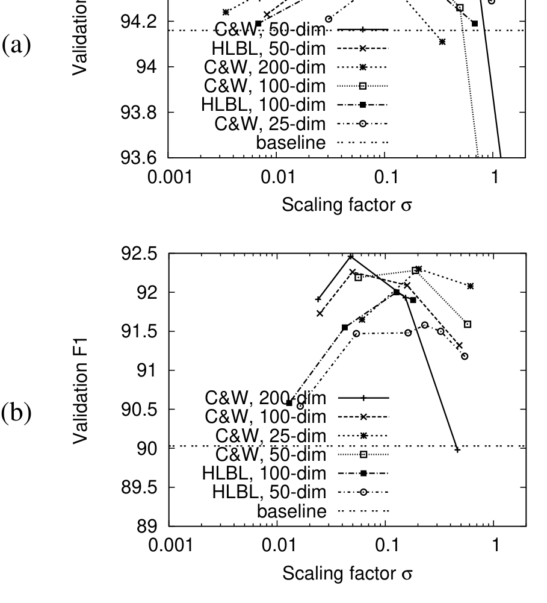
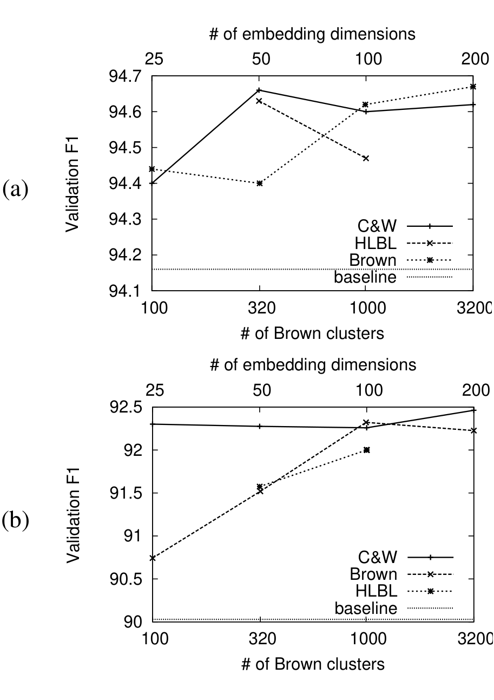
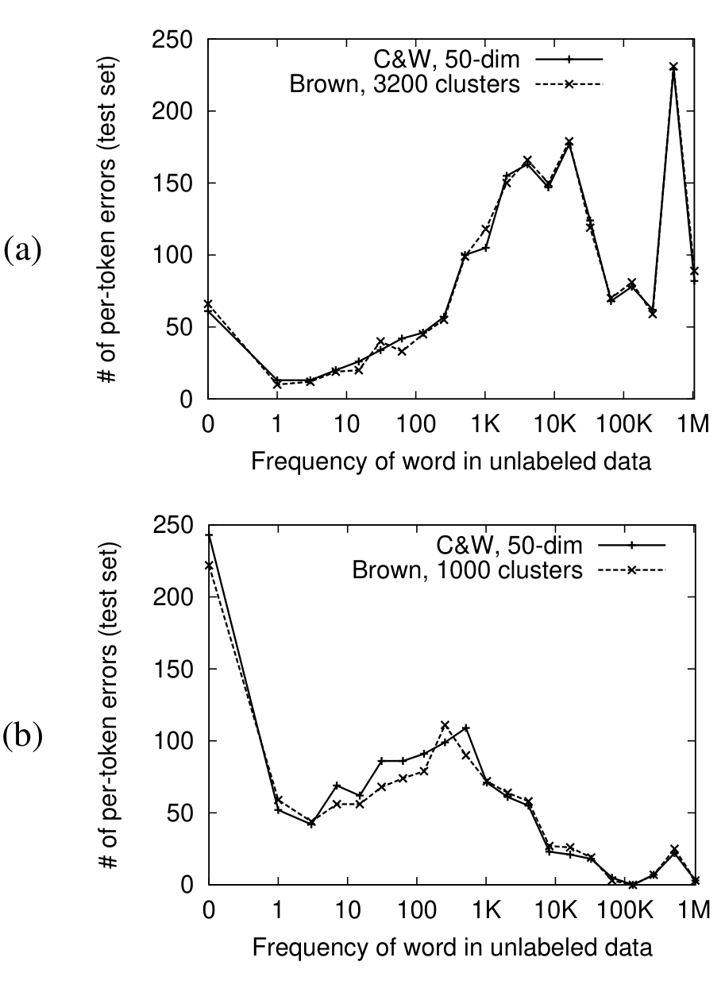

# 词表示：一种简单通用的半监督学习方法（Word representations: A simple and general method for semi-supervised learning）

> Joseph Turian | 蒙特利尔大学（Université de Montréal）计算机科学与运筹学系（DIRO） | lastname@iro.umontreal.ca
>
> Lev Ratinov | 伊利诺伊大学厄巴纳-香槟分校（University of Illinois at Urbana-Champaign）计算机科学系 | ratinov2@uiuc.edu
>
> Yoshua Bengio | 蒙特利尔大学计算机科学与运筹学系 | bengioy@iro.umontreal.ca
>
> ACL 2010（第 48 届年会），第 384–394 页，瑞典乌普萨拉，2010 年 7 月 11–16 日

本文首次在受控条件下系统比较了三种无监督词表示（Brown 聚类、Collobert & Weston 嵌入、HLBL 嵌入）作为额外词特征对现有监督 NLP 系统的提升，核心发现是——**三种表示都能提升近最先进的 NER 与 chunking 基线的准确率，组合使用还能进一步提升；只需把嵌入缩放到标准差 0.1 即可开箱即用、无需调参**。

核心内容：

- 方法：在 RCV1 无标注语料（6300 万词，清洗后 3700 万词）上诱导词表示，作为一元特征接入现有线性 CRF chunker 与感知机 NER 系统
- 清洗预处理：只保留 ≥90% 字符为小写 a-z 的句子（丢弃过半句子），清洗后 Brown 聚类和嵌入均更优
- 训练改进：C&W 嵌入训练 50 轮（此前仅 20 轮）、初始化范围改为 [-0.01, +0.01]，修正了此前工作中关于 C&W 嵌入的负面结论
- 缩放公式： $E \leftarrow \sigma \cdot E / stddev(E)$ ，所有曲线形状与最优点一致，最优缩放使嵌入标准差为 0.1

关键发现：

- NER：Brown+Gaz 组合 test F1 **89.41**，全部组合（Brown+C&W+HLBL+Gaz）达 **90.04**、域外 MUC7 达 82.50，均超 Suzuki & Isozaki [42] 的 89.36
- chunking：Brown+C&W 组合 test F1 **94.35**（基线 93.79），超过 Ando & Zhang [1] 的 94.39 之外的所有单表示方法
- Brown 聚类对罕见词表示更好：NER 错误大多集中在罕见词，而嵌入因训练更新少（每轮约 143 次）而接近初始值
- 容量假设被推翻：NER 上 25 维 C&W 嵌入几乎与 200 维一样好；嵌入最优容量依赖任务，更多 Brown 聚类数总更好

---

## 摘要

如果我们拿一个现有的监督 NLP 系统，一种简单通用的提高准确率的方法是使用无监督词表示作为额外的词特征。我们在 NER 和 chunking 两个任务上评估了 Brown 聚类、Collobert and Weston [10] 嵌入以及 HLBL [30] 嵌入。我们使用近最先进的监督基线，发现三种词表示中的每一种都提高了这些基线的准确率。通过组合不同的词表示，我们发现了进一步的提升。你可以在这里下载我们的词特征（可用于现有 NLP 系统的开箱即用）以及我们的代码：http://metaoptimize.com/projects/wordreprs/

## 1. 引言

通过使用未标注数据来减少标注训练数据中的数据稀疏性，半监督方法提高了泛化准确率。诸如 [1, 42, 43] 之类的半监督模型取得了最先进的准确率。然而，这些方法规定了特定的模型选择和训练方案。要让一个现有的监督 NLP 系统适配这些半监督技术，可能是棘手且耗时的。最好是使用一种简单而通用的方法，将现有的监督 NLP 系统改造为半监督的。

一种越来越流行的方法是使用无监督方法来诱导词特征——或者下载已经被诱导好的词特征——将这些词特征接入现有系统，并观察准确率的显著提高。但哪些词特征对哪些任务好？我们应该偏好某些词特征吗？我们可以组合它们吗？

词表示是与每个词相关联的数学对象，通常是一个向量。每个维度的值对应于一个特征，甚至可能有语义或语法解释，所以我们称其为词特征。传统上，监督的词汇化 NLP 方法把一个词转换为符号 ID，然后用 one-hot 表示将其转换为特征向量：特征向量的长度与词表大小相同，只有一个维度为 1。然而，词的 one-hot 表示受到数据稀疏性的困扰：即对于在标注训练数据中罕见的词，它们对应的模型参数将被估计得很差。此外，在测试时，模型无法处理没有出现在标注训练数据中的词。one-hot 词表示的这些局限性促使研究者研究在大规模未标注语料库上诱导词表示的无监督方法。

词特征可以手工设计，但我们的目标是学习它们。诱导无监督词表示的一种常见方法是使用聚类，也许是分层聚类。这种技术被许多研究者使用（[28, 23, 19, 33, 17]）。这导致在更小的词表上的 one-hot 表示。另一方面，神经语言模型（[3, 39, 29, 10]）使用无监督方法诱导稠密的实值低维词嵌入。（关于神经语言模型的更完整参考文献列表，见 [2]。）

无监督词表示已经在先前的 NLP 工作中使用，并在各种任务上展示了泛化准确率的提高。但不同的词表示从未在受控方式下被系统比较过。在这项工作中，我们比较了诱导词表示的不同技术，在命名实体识别（NER）和 chunking 任务上评估它们。我们撤回了 [44] 中发表的关于 Collobert and Weston [10] 嵌入的先前负面结果，因为我们做出了第 7.1 节中描述的训练改进。

## 2. 分布表示

分布词表示基于一个大小为 $W \times C$ 的共现矩阵 $F$ ，其中 $W$ 是词表大小，每一行 $F_w$ 是词 $w$ 的初始表示，每一列 $F_c$ 是某种上下文。[37, 45] 描述了构建 $F$ 时的一些可能设计决策，包括上下文类型的选择（左窗口？右窗口？窗口大小？）和频率计数的类型（原始？二元？tf-idf？）。 $F_w$ 的维度是 $W$ ，这可能太大而无法在监督模型中使用 $F_w$ 作为词 $w$ 的特征。可以使用某个函数 $g$ 将 $F$ 映射到大小为 $W \times d$ 的矩阵 $f$ ，其中 $d \ll C$ ， $f = g(F)$ 。 $f_w$ 以 $d$ 个维度表示词 $w$ 。 $g$ 的选择是另一个设计决策，尽管可能不如最初构建 $F$ 所用的统计重要。

自组织语义映射（[34]）是一种分布技术，将词映射到两个维度，使句法和语义相关的词彼此靠近（[16, 15]）。LSA（[12, 21]）、LSI 和 LDA（[7]）在 $F$ 上诱导分布表示，其中每列是一个文档上下文。在讨论的大多数其他方法中，列表示词上下文。在 LSA 中， $g$ 计算 $F$ 的 SVD。语言高维空间（HAL，Hyperspace Analogue to Language）是另一个早期的诱导词表示的分布方法（[26, 25]）。他们在 1.6 亿词 token 的语料库上计算 $F$ ，词表大小 $W$ 为 70K 词类型。上下文（列）有 $2 \cdot W$ 种类型：如果词 $c$ 出现在词 $w$ 左侧 10 的窗口内，则第一个 $W$ 被计数；如果出现在右侧，则第二个 $W$ 被计数。 $f$ 通过取 $F$ （共 140K 列）中方差最高的 200 列来选取。ICA 是另一种将 $F$ 变换为 $f$ 的技术（[48, 47, 49]）。ICA 很昂贵，这些工作中使用的最大词表大小只有 10K。据我们所知，ICA 方法从未在词表 $W$ 为 100K 或更大的情况下使用过。

显式存储共现矩阵 $F$ 可能内存密集，将 $F$ 变换为 $f$ 可能耗时。最好是 $F$ 永远不被显式计算， $f$ 增量式构建。[50] 描述了一种在 2.7 亿词 token、315K 词类型的词表上诱导 LSA 和 LDA 主题模型的增量方法。这在规模上与我们的实验相似。

增量构建 $f$ 的另一种方法是使用随机投影：线性映射 $g$ 是用先验选择的随机矩阵乘以 $F$ 。这种随机索引（random indexing）方法受 Johnson-Lindenstrauss 引理启发，该引理指出，对于随机矩阵的某些选择，如果 $d$ 足够大，则 $F$ 中词之间的原始距离将在 $f$ 中得到保持（[36]）。[18] 使用这种技术产生文档的 100 维表示。[35] 是第一个使用窄上下文随机索引的作者。[37] 做了一系列实验，探索在使用随机索引之前构建 $F$ 所涉及的不同设计决策。然而，与上述所有引用工作一样，[37] 只使用分布表示来改进用于一次性分类任务（如 IR、WSD、语义知识测试和文本分类）的现有系统。

对于结构化预测任务（如解析和 MT）和序列标注任务（如 chunking 和 NER），诱导分布词表示的适当设置尚不清楚。先前的研究使用聚类表示（第 3 节）和分布式表示（第 4 节）在这些任务上取得了多次成功，因此我们在工作中专注于这些表示。

## 3. 基于聚类的词表示

另一种类型的词表示是在词上诱导聚类。聚类方法和分布方法可能重叠。例如，[32] 从一个共现矩阵开始，并将该矩阵变换为一个聚类。

### 3.1 Brown 聚类

Brown 算法是一种分层聚类算法，它聚类词以最大化二元组（bigram）的互信息（[8]）。所以它是一个基于类的二元组语言模型。它的运行时间是 $O(V \cdot K^2)$ ，其中 $V$ 是词表大小， $K$ 是聚类数。聚类的分层性质意味着我们可以在层次结构的几个级别上选择词类，这可以弥补少量词的糟糕聚类。Brown 聚类的一个缺点是它完全基于二元组统计，不考虑更宽上下文中的词用法。

Brown 聚类已在各种 NLP 应用中成功使用：NER（[28, 23, 33]）、PCFG 解析（[9]）、依存解析（[19, 43]）和语义依存解析（[52]）。[27] 提出了基于词二元组和三元组统计诱导分层聚类的算法。[46] 提出了 Brown 聚类算法的扩展，学习词和短语的分层聚类，并将其应用于 POS 标注。

### 3.2 基于聚类的词表示的其他工作

[24] 提出了一种 K-means 式的非分层短语聚类算法，使用 MapReduce。HMM 可以用来诱导软聚类，具体来说是可能聚类（隐藏状态）上的多项分布。[22] 使用 HMM-LDA 模型改进 POS 标注和中文分词。[17] 诱导一个全连接 HMM，它在可能的词表词上发射多项分布。他们使用 Viterbi 算法执行硬聚类。（或者，他们可以保留软聚类，特定词 token 的表示是状态上的后验概率分布。）然而，[17] 中使用其 HMM 词聚类作为额外特征的 CRF chunker 取得的 F1 低于基线 CRF chunker（[40]）。[14] 使用 HMM 给词分配 POS 标签，从而提高了基于 PCFG 的希伯来语解析器的准确率。[11] 使用隐变量语言模型改进语义角色标注。

## 4. 分布式表示

词表示的另一种方法是学习分布式表示（不要与分布表示混淆）。分布式表示是稠密、低维和实值的。分布式词表示被称为词嵌入。嵌入的每个维度代表词的一个潜在（latent）特征，有望捕获有用的句法和语义属性。分布式表示是紧凑的，因为它可以在维度数量上表示指数数量的聚类。

词嵌入通常使用神经语言模型诱导，这些模型使用神经网络作为底层预测模型（[2]）。历史上，神经语言模型的训练和测试一直很慢，每次模型计算的规模随词表大小增长（[3, 4]）。然而，近年来提出了许多方法来消除对词表大小的线性依赖（[31, 10, 30]），并允许扩展到非常大的训练语料库。

### 4.1 Collobert and Weston（C&W）嵌入

Collobert and Weston（C&W）[10] 提出了一个可以在数十亿词上训练的神经语言模型，因为损失的梯度是在可能输出的小样本上随机计算的，精神上类似于 [6]。[10] 的这个神经模型在 [5] 中被精炼并以更大的深度呈现。

该模型是判别式的和非概率的。对于每次训练更新，我们从语料库中读取一个 n-gram $x = (w_1, \ldots, w_n)$ 。模型拼接这 $n$ 个词学到的嵌入，给出 $e(w_1) \oplus \ldots \oplus e(w_n)$ ，其中 $e$ 是查找表， $\oplus$ 是拼接。我们还创建一个损坏的或噪声 n-gram $\tilde{x} = (w_1, \ldots, w_{n-q}, \tilde{w}_n)$ ，其中 $\tilde{w}_n \neq w_n$ 从词表中均匀选取。¹ 为方便起见，我们把 $e(x)$ 写作 $e(w_1) \oplus \ldots \oplus e(w_n)$ 。我们通过将 $e(x)$ 传递到一个单隐藏层神经网络来预测 $x$ 的分数 $s(x)$ 。训练准则是语料库中存在的 n-gram（如 $x$ ）的分数必须比损坏的 n-gram（如 $\tilde{x}$ ）至少高某个间隔（margin）。具体地： $L(x) = \max(0, 1 - s(x) + s(\tilde{x}))$ 。我们在语料库的 n-gram 上随机最小化该损失，同时对神经网络参数和嵌入查找表进行梯度下降。

我们实现了 C&W 的方法，有以下差异：

- 我们没有在英文 Wikipedia 上取得像作者在 [5] 中报告的那样低的 log-rank，尽管最初尝试了相同的实验条件。
- 我们损坏每个 n-gram 的最后一个词。
- 我们为嵌入和神经网络权重使用单独的学习率。我们发现嵌入的学习率通常应比神经网络权重高 1000–32000 倍。否则，无监督训练准则下降得很慢。
- 尽管他们的采样技术使训练很快，但当词表很大时测试仍然昂贵。我们不是像他们那样在验证数据上使用 log-rank 交叉验证，而是使用权重更新前训练样例上训练损失的移动平均。

### 4.2 HLBL 嵌入

对数双线性模型（[29]）是一个概率且线性的神经模型。给定一个 n-gram，模型拼接前 $n - 1$ 个词的嵌入，并学习一个线性模型来预测最后一个词的嵌入。预测嵌入与当前实际嵌入之间的相似度通过指数化和归一化转化为概率。[30] 通过使用层次结构指数级过滤掉执行的计算数量，加快了训练和测试期间的模型评估。这种分层评估技术最早由 [31] 提出。该模型与该优化结合，被称为分层对数双线性（HLBL，hierarchical log-bilinear）模型。

¹在 [10] 中，n-gram 中的中间词被损坏。在 [5] 中，n-gram 中的最后一个词被损坏。

## 5. 监督评估任务

我们评估这样一个假设：人们可以拿一个现有的、近最先进的监督 NLP 系统，通过将词表示作为词特征纳入来提高其准确率。这种将监督方法转变为半监督方法的技术是通用的、与任务无关的。然而，我们希望弄清楚某些词表示是否对某些任务更可取。[24] 发现对 NER 好的表示对搜索查询分类差，反之亦然。我们将聚类和分布式表示应用于 NER 和 chunking，这使我们能够将我们的半监督模型与 [1] 和 [42] 的模型进行比较。

### 5.1 Chunking

Chunking 是一个句法序列标注任务。我们遵循 CoNLL-2000 共享任务（[38]）的条件。

[40] 的线性 CRF chunker 是一个标准的近最先进基线 chunker。事实上，许多现成的 CRF 实现现在复现了 [40]，包括其特征集的选择：

- Taku Kudo 的 CRF++（http://crfpp.sourceforge.net/）
- Léon Bottou 的 crfsgd（http://leon.bottou.org/projects/sgd）
- Naoaki Okazaki 的 CRFsuite（http://www.chokkan.org/software/crfsuite/）

我们使用 CRFsuite，因为它使修改特征生成代码变得简单，因此人们可以轻松添加新特征。我们使用 SGD 优化，并启用负状态特征和负转移特征。（"feature.possible transitions=1, feature.possible states=1"）

表 1 显示了基线 chunker 中的特征。如你所见，Brown 和嵌入特征是一元（unigram）特征，不像词特征和标签特征那样参与组合。当在复合特征中使用词表示时，[19] 在依存解析上看到了进一步的准确率改进。

数据来自 Penn Treebank，是 1989 年华尔街日报的新闻专线。在 8936 个训练句子中，我们使用 1000 个随机采样的句子（23615 个词）作为开发集。我们在 7936 个训练划分句子上训练模型，并在开发集上评估它们的 F1。在选择了最大化开发 F1 的超参数后，我们使用这些超参数在完整的 8936 句子训练集上重新训练模型，并在测试集上评估。一个超参数是 l2 正则化 sigma，对大多数模型而言，最优值为 2 或 3.2。词嵌入还需要一个缩放超参数，如第 7.2 节所述。

| 特征类型 | 模板 |
| --- | --- |
| 词特征 | $w_i$ ， $i \in \{-2, -1, 0, +1, +2\}$ ； $w_i \land w_{i+1}$ ， $i \in \{-1, 0\}$ |
| 标签特征 | $t_i$ ， $i \in \{-2, -1, 0, +1, +2\}$ ； $t_i \land t_{i+1}$ ， $i \in \{-2, -1, 0, +1\}$ ； $t_i \land t_{i+1} \land t_{i+2}$ ， $i \in \{-2, -1, 0\}$ |
| 嵌入特征 [如适用] | $e_i[d]$ ， $i \in \{-2, -1, 0, +1, +2\}$ ，其中 $d$ 遍历嵌入 $e_i$ 的维度 |
| Brown 特征 [如适用] | substr($b_i$, 0, p)， $i \in \{-2, -1, 0, +1, +2\}$ ，其中 substr 取 Brown 聚类 $b_i$ 的 p 长度前缀 |

**表 1：CRF chunker 中使用的特征模板。**

### 5.2 命名实体识别

NER 通常被视为序列预测问题。遵循 [33]，我们使用正则化平均感知机模型。[33] 描述了不同的序列编码如 BILOU 和 BIO，并表明 BILOU 编码优于 BIO，贪婪推理与 Viterbi 相比有竞争力且显著更快。相应地，我们使用贪婪推理和 BILOU 文本块表示。我们使用 [33] 公开可用的实现（见本文末尾的 URL）。在我们的基线实验中，我们移除地名词典（gazetteers）和非局部特征（[20]）。然而，我们也运行包含这些特征的实验，以了解它们提供的信息是否大部分与词表示的信息重叠。

在训练集上的每个 epoch 之后，我们测量模型在开发集上的准确率。当开发集上的准确率连续 10 个 epoch 没有提高时停止训练，一般总共约 50–80 个 epoch。在开发集上表现最好的 epoch 被选为最终模型。

我们使用来自 [51] 的以下基线特征集：

- 前两个预测 $y_{i-1}$ 和 $y_{i-2}$
- 当前词 $x_i$
- $x_i$ 的词类型信息：全大写、首字母大写、全数字、字母数字等
- $x_i$ 的前缀和后缀，如果词包含连字符，则连字符之间的 token
- 窗口 $c = (x_{i-2}, x_{i-1}, x_i, x_{i+1}, x_{i+2})$ 中的 token
- 窗口 $c$ 中的大小写模式
- $c$ 与 $y_{i-1}$ 的组合

词表示特征（如果存在）以与表 1 相同的方式使用。

当使用词汇特征时，我们规范化日期和数字。例如，1980 变成 \*DDDD\*，212-325-4751 变成 \*DDD\*-\*DDD\*-\*DDDD\*。这允许对年份、电话号码等有一定程度的抽象。这种去词汇化（delexicalization）与使用词表示分开执行。也就是说，如果我们为 12/3/2008 诱导了嵌入，我们将使用 12/3/2008 的嵌入，以及上面列出的基线特征中的 \*DD\*/\*D\*/\*DDDD\*。

与我们的 chunking 实验不同，在开发集上选择最佳模型后，我们也在测试集上使用该模型。（在 chunking 中，在开发集上找到最佳超参数后，我们会合并开发集和训练集，在这个合并集上训练模型，然后在测试集上评估。）

NER 的标准评估基准是取自路透社新闻专线的 CoNLL03 共享任务数据集。训练集包含 204K 词（14K 句子，946 文档），测试集包含 46K 词（3.5K 句子，231 文档），开发集包含 51K 词（3.3K 句子，216 文档）。

我们还在域外（OOD）数据集 MUC7 正式运行（59K 词）上进行了评估。MUC7 的标注标准与 CoNLL03 数据不同。它有几个不出现在 CoNLL03 中的 NE 类型：money、dates 和 numeric quantities。CoNLL03 有 MISC，MUC7 中没有。为了在 MUC7 上评估，我们在评估前执行以下后处理步骤：

1. 在金标准 MUC7 数据中，丢弃（标记为 'O'）所有类型为 NUMBER/MONEY/DATE 的 NE。
2. 在 MUC7 数据上的预测模型输出中，丢弃（标记为 'O'）所有类型为 MISC 的 NE。

这些后处理步骤将对所有 NER 模型全面产生不利影响，但仍然允许我们以受控的方式比较不同的模型。

## 6. 未标注数据

未标注数据用于诱导词表示。我们使用 RCV1 语料库，它包含路透社一年的英文新闻专线，从 1996 年 8 月到 1997 年 8 月，约 6300 万词、330 万句子。我们保留语料库中的大小写。相比之下，[10] 将词小写化并对数字去词汇化。

我们使用 [23, p. 51] 提出的预处理技术，后来被 [19] 使用：移除所有少于 90% 字符为小写 a-z 的句子。我们假设空白不计入，尽管 Liang 的论文中没有明确说明。我们把这个预处理步骤称为清洗（cleaning）。

在 [44] 中，我们发现所有词表示在清洗后的未标注数据上诱导时，在监督任务上表现更好，嵌入和 Brown 聚类都是如此。尽管清洗过程非常激进、丢弃了超过一半的句子，情况依然如此。根据 [5] 中提出的证据和论证，Collobert and Weston [10] 嵌入的非凸优化过程可能受到噪声和关于罕见词的统计稀疏性问题的不利影响，尤其是在训练开始时。出于这个原因，我们假设先在最高频词上学习表示、然后逐渐增加词表——一种课程（curriculum）训练策略（[13, 5, 41]）——会比清洗提供更好的结果。

清洗后，有 3700 万词（原始的 58%）在 130 万句子中（原始的 41%）。清洗后的 RCV1 语料库有 269K 词类型。这是词表大小，即诱导了多少词表示。注意，清洗仅应用于未标注数据，不应用于监督任务中使用的标注数据。

RCV1 是 CoNLL03 语料库的超集。因此，使用 RCV1 词表示的 NER 结果是一种直推学习（transductive learning）的形式。

## 7. 实验与结果

### 7.1 诱导词表示的细节

Brown 聚类大约需要 3 天来诱导，当我们诱导 1000 个聚类时，这是先前工作的基线（[19, 33]）。为了比较，我们还诱导了 100、320 和 3200 个 Brown 聚类。（因为 Brown 聚类在聚类数量上是二次方扩展的，诱导 10000 个聚类将是难以负担的。）因为 Brown 聚类是分层的，我们可以使用聚类超集作为特征。我们使用路径深度 4、6、10 和 20 的聚类（[33]）。这些是表 1 中使用的前缀。

C&W 嵌入在几周内诱导完成，训练了约 50 个 epoch。诱导这些嵌入的困难之一是未定义停止准则，嵌入的质量可以随训练继续而不断改善。Collobert（私人通信）只是让一台计算机无限期地训练他的嵌入。我们在 5-gram 窗口上诱导了 25、50、100 或 200 维的嵌入。

与 [44] 相比，我们在这项工作中使用了改进的 C&W 嵌入：

- 它们训练了 50 个 epoch，而不仅仅是 20 个 epoch。
- 我们将所有嵌入维度均匀初始化在 [-0.01, +0.01] 范围内，而不是 [-1, +1]。对于罕见词，它们通常每个 epoch 只更新 143 次²，而且我们的嵌入学习率通常是 1e-6 或 1e-7，这意味着罕见词嵌入将集中在零附近，而不是随机散布。

HLBL 嵌入训练了 100 个 epoch（7 天）。³ 与我们的 Collobert and Weston [10] 嵌入不同，我们没有对 HLBL 的学习率进行大量调优。我们为模型参数和嵌入参数使用 1e-3 的学习率。我们在 5-gram 窗口上诱导了 100 维嵌入，也在 5-gram 窗口上诱导了 50 维嵌入。嵌入是使用随机树的单遍（one-pass）方法诱导的，而不是使用更新后的树和嵌入重估计的两遍方法。

²一个罕见词每个 epoch 将作为正例出现 5（窗口大小）次，作为损坏例出现 37M（每个 epoch 的训练例数）/ 269K（词表大小）= 138 次。

³HLBL 模型更新比 C&W 模型更新需要更少的矩阵乘法。此外，HLBL 模型在 GPGPU 上训练，比传统 CPU 算术更快。

### 7.2 词嵌入的缩放

像许多 NLP 系统一样，基线系统只包含二元特征。然而，词嵌入是实数，不一定在有界范围内。如果词嵌入的范围太大，它们将比二元特征施加更大的影响。

我们通常发现嵌入有零均值。我们可以通过一个超参数缩放嵌入，以控制它们的标准差。假设嵌入由矩阵 $E$ 表示：

$$
E \leftarrow \sigma \cdot E / stddev(E) \qquad (1)
$$

$\sigma$ 是一个缩放常数，设置缩放后嵌入的新标准差。

**图 1：** 变化缩放因子 $\sigma$ （方程 1）对验证集 F1 的影响。我们实验了各种维度的 C&W 和 HLBL 嵌入。（a）Chunking 结果。（b）NER 结果。

图 1 显示了缩放因子 $\sigma$ 对两个监督任务的影响。我们惊讶地发现，在两个任务上，跨越不同维度的 C&W 和 HLBL 嵌入，所有曲线都有相似的形状和最优点。这是我们工作的贡献之一。在 [44] 中，我们未能为缩放嵌入规定默认值。然而，这些曲线表明缩放因子的合理选择是使嵌入的标准差为 0.1。

### 7.3 词表示的容量

**图 2：** 变化词表示容量对验证集 F1 的影响。（a）Chunking 结果。（b）NER 结果。

词表示有容量控制：Brown 聚类数和词嵌入的维度数。图 2 显示了随着我们变化词表示的容量，验证 F1 的影响。一般来说，似乎更多的 Brown 聚类更好。我们想诱导 10000 个 Brown 聚类，但这将需要几个月的时间。在 [44] 中，我们仅基于 HLBL NER 曲线假设更高维的词嵌入会给出更高的准确率。图 2 显示这个假设不成立。对于 NER，C&W 曲线几乎平坦，我们惊讶地发现即使 25 维的 C&W 词嵌入也工作得如此之好。对于 chunking，50 维嵌入在 C&W 和 HLBL 上都有最高的验证 F1。这些曲线表明词嵌入的最优容量是任务特定的。

### 7.4 最终结果

表 2 显示了最终 chunking 结果，表 3 显示了最终 NER F1 结果。我们与最先进方法 [1]、[42] 以及——对于 NER——[24] 进行比较。表 2 和表 3 显示，通过组合不同类型词表示的特征，可以进一步提高准确率。但是，如果只使用一种词表示，Brown 聚类具有最高的准确率。鉴于自 [44] 以来对 C&W 嵌入的改进，C&W 嵌入优于 HLBL 嵌入。在 chunking 上，Brown 聚类和嵌入之间只有微小的差异。组合表示导致测试 F1 的小幅提升。与 chunking 相比，在 NER 上组合不同的词表示似乎给测试 F1 带来更大的提升。

| 系统 | Dev | Test |
| --- | --- | --- |
| Baseline | 94.16 | 93.79 |
| HLBL, 50-dim | 94.63 | 94.00 |
| C&W, 50-dim | 94.66 | 94.10 |
| Brown, 3200 clusters | 94.67 | 94.11 |
| Brown+HLBL, 37M | 94.62 | 94.13 |
| C&W+HLBL, 37M | 94.68 | 94.25 |
| Brown+C&W+HLBL, 37M | 94.72 | 94.15 |
| Brown+C&W, 37M | 94.76 | 94.35 |
| Ando and Zhang [1], 15M | - | 94.39 |
| Suzuki and Isozaki [42], 15M | - | 94.67 |
| Suzuki and Isozaki [42], 1B | - | 95.15 |

**表 2：最终 chunking F1 结果。在最后一列，我们显示了使用了多少未标注词。**

| 系统 | Dev | Test | MUC7 |
| --- | --- | --- | --- |
| Baseline | 90.03 | 84.39 | 67.48 |
| Baseline+Nonlocal | 91.91 | 86.52 | 71.80 |
| HLBL 100-dim | 92.00 | 88.13 | 75.25 |
| Gazetteers | 92.09 | 87.36 | 77.76 |
| C&W 50-dim | 92.27 | 87.93 | 75.74 |
| Brown, 1000 clusters | 92.32 | 88.52 | 78.84 |
| C&W 200-dim | 92.46 | 87.96 | 75.51 |
| C&W+HLBL | 92.52 | 88.56 | 78.64 |
| Brown+HLBL | 92.56 | 88.93 | 77.85 |
| Brown+C&W | 92.79 | 89.31 | 80.13 |
| HLBL+Gaz | 92.91 | 89.35 | 79.29 |
| C&W+Gaz | 92.98 | 88.88 | 81.44 |
| Brown+Gaz | 93.25 | 89.41 | 82.71 |
| Lin and Wu [24], 3.4B | - | 88.44 | - |
| Ando and Zhang [1], 27M | 93.15 | 89.31 | - |
| Suzuki and Isozaki [42], 37M | 93.66 | 89.36 | - |
| Suzuki and Isozaki [42], 1B | 94.48 | 89.92 | - |
| All (Brown+C&W+HLBL+Gaz), 37M | 93.17 | 90.04 | 82.50 |
| All+Nonlocal, 37M | 93.95 | 90.36 | 84.15 |
| Lin and Wu [24], 700B | - | 90.90 | - |

**表 3：最终 NER F1 结果，显示了将词表示、非局部特征和地名词典添加到基线的累积效果。为加快训练，在组合实验（C&W 加另一种词表示）中，我们使用 50 维 C&W 嵌入，而不是 200 维的。在最后一列，我们显示了使用了多少未标注词。**

在 NER 上，Brown 聚类优于词嵌入。由于 NER F1 的很大部分来自对罕见词做出的决策，我们怀疑 Brown 聚类对罕见词有更好的表示。Brown 做出单一的硬聚类决策，而罕见词的嵌入接近其初始值，因为它没有收到很多训练更新（见脚注 2）。图 3 显示了测试集上每个 token 错误的总数，取决于该词 token 在未标注数据中的频率。对于 NER，图 3 (b) 显示大多数错误发生在罕见词上，并且 Brown 聚类确实对罕见词产生更少的错误。这支持了我们的假设：对于罕见词，Brown 聚类产生的表示比没有收到足够训练更新的词嵌入更好。对于 chunking，Brown 聚类和 C&W 嵌入产生几乎相同数量的错误，错误集中在更常见的词上。我们假设非罕见词有好的表示，无论词表示技术的选择如何。对于像 chunking 这样的任务，其中句法决策依赖于同时观察几个 token，使用词表示的复合特征可能更多地提高准确率（[19]）。

**图 3：** 对于在未标注数据中具有不同频率的词 token，测试集上每个 token 错误的总数是多少？（a）Chunking 结果。（b）NER 结果。

在 NER 中使用词表示在域外数据上比域内数据带来了更大的收益。我们惊讶于这个结果，因为 OOD 数据甚至没有在无监督词表示诱导期间使用，而域内数据使用了。我们有兴趣进一步调查这个现象。

[1] 提出了一种称为交替结构优化（ASO，alternating structure optimization）的半监督学习算法。他们找到输入特征的一个低维投影，在辅助任务上给出好的线性分类器。这些辅助任务有时特定于监督任务，有时是一般的语言建模任务，如"预测缺失的词"。[42] 提出了 CRF 的半监督扩展。（在 [43] 中，他们将半监督方法扩展到更一般的条件模型。）我们使用的半监督学习方法的一个优点是它比 [1] 和 [42] 的方法更简单、更通用。他们的方法规定了特定的模型选择和训练方案，例如不能与基于 SVM 分类器的 NLP 系统一起使用。

[24] 提出了一种 K-means 式的非分层短语聚类算法，使用 MapReduce。由于他们可以扩展到数百万个短语，并且他们在 800B 未标注词上训练，他们使用其短语聚类在 NER 上取得了最先进的准确率。这表明将词表示扩展到短语表示值得进一步研究。

## 8. 结论

词特征可以预先以无监督、任务无关和模型无关的方式学习。这些词特征一旦学习，就很容易分发给其他研究者，也很容易集成到现有的监督 NLP 系统中。然而，缺点是准确率可能不如包含任务特定信息并联合学习监督和无监督任务的半监督方法高（[1, 42, 43]）。

无监督词表示已在先前的 NLP 工作中使用，并在各种任务上展示了泛化准确率的提高。我们是第一个以受控方式系统比较不同词表示的工作。我们发现 Brown 聚类和词嵌入都可以提高近最先进监督 NLP 系统的准确率。我们还发现组合不同的词表示可以进一步提高准确率。错误分析表明，Brown 聚类为罕见词诱导的表示比没有收到很多训练更新的 C&W 嵌入更好。

我们工作的另一个贡献是设置词嵌入缩放参数的默认方法。有了这个贡献，词嵌入现在可以作为词特征开箱即用，无需调参。未来的工作应该探索诱导短语表示的方法，以及通过在复合特征中使用词表示来提高准确率的技术。

## 复现我们的实验

你可以访问 http://metaoptimize.com/projects/wordreprs/ 找到：我们诱导的词表示，你可以下载并在你的实验中使用；诱导词表示的代码，你可以用来在你自己的数据上诱导词表示；NER 和 chunking 系统，以及复现我们实验的代码。

## 致谢

感谢 Magnus Sahlgren、Bob Carpenter、Percy Liang、Alexander Yates 和匿名审稿人的有益讨论。感谢 Andriy Mnih 为我们诱导他在 RCV1 上的嵌入。Joseph Turian 和 Yoshua Bengio 感谢以下机构的研究资助和计算支持：NSERC、RQCHP、CIFAR。Lev Ratinov 得到了空军研究实验室（AFRL，Air Force Research Laboratory）的支持，主合同号为 FA8750-09-C-0181。本材料中表达的任何意见、发现、结论或建议均为作者的观点，不一定反映空军研究实验室（AFRL）的观点。

## 参考文献

[1] Ando, R., & Zhang, T. (2005). A high-performance semi-supervised learning method for text chunking. ACL.

[2] Bengio, Y. (2008). Neural net language models. Scholarpedia, 3, 3881.

[3] Bengio, Y., Ducharme, R., & Vincent, P. (2001). A neural probabilistic language model. NIPS.

[4] Bengio, Y., Ducharme, R., Vincent, P., & Jauvin, C. (2003). A neural probabilistic language model. Journal of Machine Learning Research, 3, 1137–1155.

[5] Bengio, Y., Louradour, J., Collobert, R., & Weston, J. (2009). Curriculum learning. ICML.

[6] Bengio, Y., & Sénécal, J.-S. (2003). Quick training of probabilistic neural nets by importance sampling. AISTATS.

[7] Blei, D. M., Ng, A. Y., & Jordan, M. I. (2003). Latent dirichlet allocation. Journal of Machine Learning Research, 3, 993–1022.

[8] Brown, P. F., deSouza, P. V., Mercer, R. L., Pietra, V. J. D., & Lai, J. C. (1992). Class-based n-gram models of natural language. Computational Linguistics, 18, 467–479.

[9] Candito, M., & Crabbé, B. (2009). Improving generative statistical parsing with semi-supervised word clustering. IWPT (pp. 138–141).

[10] Collobert, R., & Weston, J. (2008). A unified architecture for natural language processing: Deep neural networks with multitask learning. ICML.

[11] Deschacht, K., & Moens, M.-F. (2009). Semi-supervised semantic role labeling using the Latent Words Language Model. EMNLP (pp. 21–29).

[12] Dumais, S. T., Furnas, G. W., Landauer, T. K., Deerwester, S., & Harshman, R. (1988). Using latent semantic analysis to improve access to textual information. SIGCHI Conference on Human Factors in Computing Systems (pp. 281–285). ACM.

[13] Elman, J. L. (1993). Learning and development in neural networks: The importance of starting small. Cognition, 48, 781–799.

[14] Goldberg, Y., Tsarfaty, R., Adler, M., & Elhadad, M. (2009). Enhancing unlexicalized parsing performance using a wide coverage lexicon, fuzzy tag-set mapping, and EM-HMM-based lexical probabilities. EACL.

[15] Honkela, T. (1997). Self-organizing maps of words for natural language processing applications. Proceedings of the International ICSC Symposium on Soft Computing.

[16] Honkela, T., Pulkki, V., & Kohonen, T. (1995). Contextual relations of words in grimm tales, analyzed by self-organizing map. ICANN.

[17] Huang, F., & Yates, A. (2009). Distributional representations for handling sparsity in supervised sequence labeling. ACL.

[18] Kaski, S. (1998). Dimensionality reduction by random mapping: Fast similarity computation for clustering. IJCNN (pp. 413–418).

[19] Koo, T., Carreras, X., & Collins, M. (2008). Simple semi-supervised dependency parsing. ACL (pp. 595–603).

[20] Krishnan, V., & Manning, C. D. (2006). An effective two-stage model for exploiting non-local dependencies in named entity recognition. COLING-ACL.

[21] Landauer, T. K., Foltz, P. W., & Laham, D. (1998). An introduction to latent semantic analysis. Discourse Processes, 259–284.

[22] Li, W., & McCallum, A. (2005). Semi-supervised sequence modeling with syntactic topic models. AAAI.

[23] Liang, P. (2005). Semi-supervised learning for natural language. Master's thesis, Massachusetts Institute of Technology.

[24] Lin, D., & Wu, X. (2009). Phrase clustering for discriminative learning. ACL-IJCNLP (pp. 1030–1038).

[25] Lund, K., & Burgess, C. (1996). Producing highdimensional semantic spaces from lexical co-occurrence. Behavior Research Methods, Instrumentation, and Computers, 28, 203–208.

[26] Lund, K., Burgess, C., & Atchley, R. A. (1995). Semantic and associative priming in high-dimensional semantic space. Cognitive Science Proceedings, LEA (pp. 660–665).

[27] Martin, S., Liermann, J., & Ney, H. (1998). Algorithms for bigram and trigram word clustering. Speech Communication, 24, 19–37.

[28] Miller, S., Guinness, J., & Zamanian, A. (2004). Name tagging with word clusters and discriminative training. HLT-NAACL (pp. 337–342).

[29] Mnih, A., & Hinton, G. E. (2007). Three new graphical models for statistical language modelling. ICML.

[30] Mnih, A., & Hinton, G. E. (2009). A scalable hierarchical distributed language model. NIPS (pp. 1081–1088).

[31] Morin, F., & Bengio, Y. (2005). Hierarchical probabilistic neural network language model. AISTATS.

[32] Pereira, F., Tishby, N., & Lee, L. (1993). Distributional clustering of english words. ACL (pp. 183–190).

[33] Ratinov, L., & Roth, D. (2009). Design challenges and misconceptions in named entity recognition. CoNLL.

[34] Ritter, H., & Kohonen, T. (1989). Self-organizing semantic maps. Biological Cybernetics, 241–254.

[35] Sahlgren, M. (2001). Vector-based semantic analysis: Representing word meanings based on random labels. Proceedings of the Semantic Knowledge Acquisition and Categorisation Workshop, ESSLLI.

[36] Sahlgren, M. (2005). An introduction to random indexing. Methods and Applications of Semantic Indexing Workshop at the 7th International Conference on Terminology and Knowledge Engineering (TKE).

[37] Sahlgren, M. (2006). The word-space model: Using distributional analysis to represent syntagmatic and paradigmatic relations between words in high-dimensional vector spaces. Doctoral dissertation, Stockholm University.

[38] Sang, E. T., & Buchholz, S. (2000). Introduction to the CoNLL-2000 shared task: Chunking. CoNLL.

[39] Schwenk, H., & Gauvain, J.-L. (2002). Connectionist language modeling for large vocabulary continuous speech recognition. International Conference on Acoustics, Speech and Signal Processing (ICASSP) (pp. 765–768). Orlando, Florida.

[40] Sha, F., & Pereira, F. C. N. (2003). Shallow parsing with conditional random fields. HLT-NAACL.

[41] Spitkovsky, V., Alshawi, H., & Jurafsky, D. (2010). From baby steps to leapfrog: How "less is more" in unsupervised dependency parsing. NAACL-HLT.

[42] Suzuki, J., & Isozaki, H. (2008). Semi-supervised sequential labeling and segmentation using giga-word scale unlabeled data. ACL-08: HLT (pp. 665–673).

[43] Suzuki, J., Isozaki, H., Carreras, X., & Collins, M. (2009). An empirical study of semi-supervised structured conditional models for dependency parsing. EMNLP.

[44] Turian, J., Ratinov, L., Bengio, Y., & Roth, D. (2009). A preliminary evaluation of word representations for named-entity recognition. NIPS Workshop on Grammar Induction, Representation of Language and Language Learning.

[45] Turney, P. D., & Pantel, P. (2010). From frequency to meaning: Vector space models of semantics. Journal of Artificial Intelligence Research.

[46] Ushioda, A. (1996). Hierarchical clustering of words. COLING (pp. 1159–1162).

[47] Väyrynen, J., & Honkela, T. (2005). Comparison of independent component analysis and singular value decomposition in word context analysis. AKRR'05, International and Interdisciplinary Conference on Adaptive Knowledge Representation and Reasoning.

[48] Väyrynen, J. J., & Honkela, T. (2004). Word category maps based on emergent features created by ICA. Proceedings of the STeP'2004 Cognition + Cybernetics Symposium (pp. 173–185). Finnish Artificial Intelligence Society.

[49] Väyrynen, J. J., Honkela, T., & Lindqvist, L. (2007). Towards explicit semantic features using independent component analysis. Proceedings of the Workshop Semantic Content Acquisition and Representation (SCAR). Stockholm, Sweden: Swedish Institute of Computer Science.

[50] Řehůřek, R., & Sojka, P. (2010). Software framework for topic modelling with large corpora. LREC.

[51] Zhang, T., & Johnson, D. (2003). A robust risk minimization based named entity recognition system. CoNLL.

[52] Zhao, H., Chen, W., Kit, C., & Zhou, G. (2009). Multilingual dependency learning: a huge feature engineering method to semantic dependency parsing. CoNLL (pp. 55–60).
