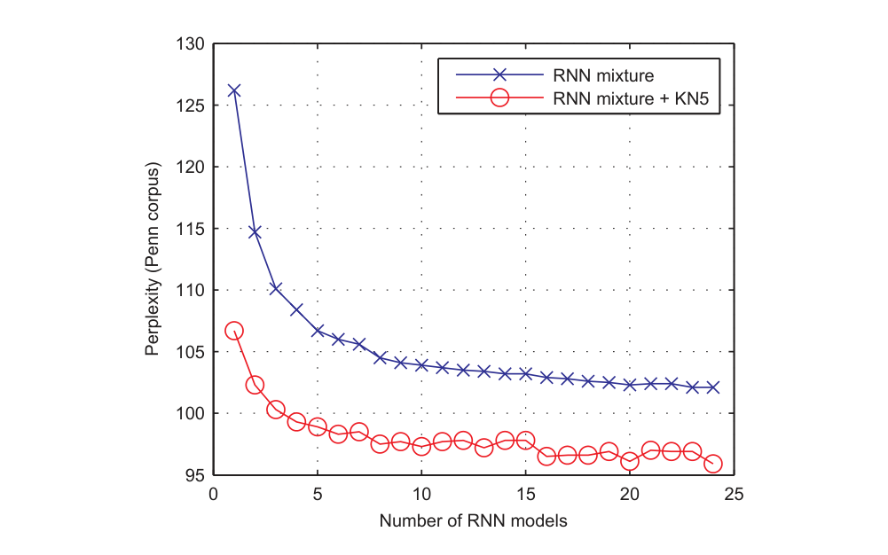
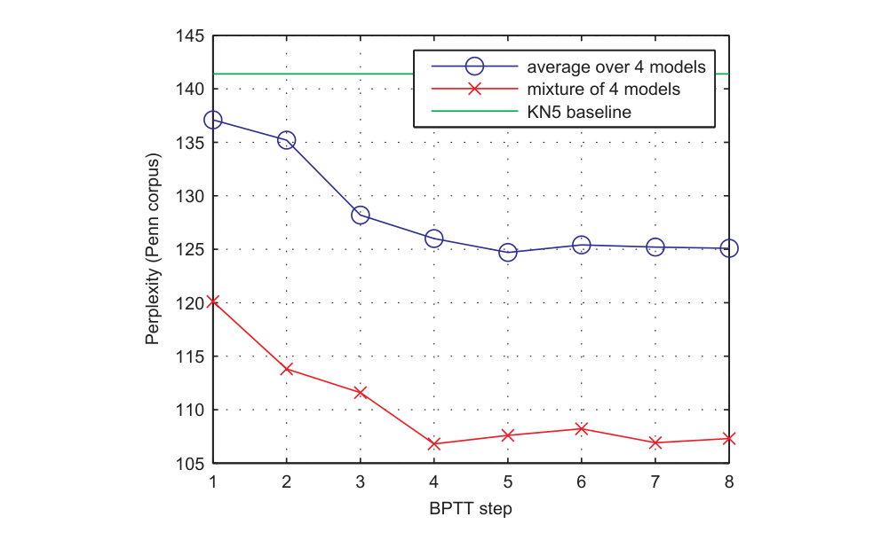
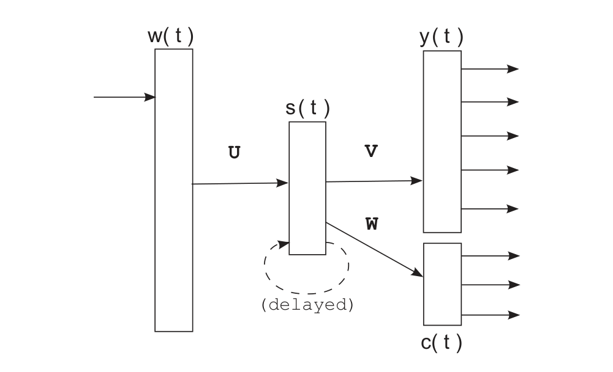

# 循环神经网络语言模型的扩展

> Tomáš Mikolov¹,², Stefan Kombrink¹, Lukáš Burget¹, Jan "Honza" Černocký¹, Sanjeev Khudanpur²
>
> ¹ 布尔诺理工大学（Brno University of Technology）Speech@FIT，捷克共和国
>
> ² 约翰霍普金斯大学（Johns Hopkins University）电气与计算机工程系，美国
>
> {imikolov,kombrink,burget,cernocky}@fit.vutbr.cz, khudanpur@jhu.edu
>
> ICASSP 2011

本文对原始循环神经网络语言模型（RNN LM）提出多项改进，核心发现是——**用时间反向传播（BPTT）训练的 RNN 显著优于普通反向传播训练的版本，输出层按类别分解带来训练与测试 15 倍以上加速，多个 RNN 线性混合在 Penn 语料上困惑度降到 96，刷新该配置下的最好公开结果**。

核心内容：

- 架构：Elman 型 RNN——输入 $x(t) = [w(t)^T\ s(t-1)^T]^T$ ，隐藏层 $s_j(t) = f(\sum_i x_i(t) u_{ji})$ ，输出层 $y_k(t) = g(\sum_j s_j(t) v_{kj})$ ， $f$ 为 sigmoid、 $g$ 为 softmax
- BPTT 实验：在 Penn（930K/74K/82K 词，词表 10K）上，BPTT=4-5 步即可，混合 4 个模型困惑度从 BP 的 113 降到 106，4 模型混合降到 98；Switchboard 上 77.5→72.5
- 加速：一步训练复杂度 $O = (1+H) \times H \times \tau + H \times V$ ，瓶颈在隐藏-输出层；用类别分解 $P(w_i|history) = P(c_i|history)P(w_i|c_i)$ 降到 $H \times C$
- 压缩层：在隐藏层与输出层之间加非线性的低维层，同时降低计算复杂度与参数量，适合大数据训练

关键发现：

- 频率分箱（frequency binning）分 30-4000 类即可：类数 30 时困惑度 134（相对全词表 123），训练快 15 倍（12.8 分/epoch vs 154）
- BPTT 相对 BP 在 Penn 上困惑度从 137 降到 123（+KN5 后 113→106）；测试阶段复杂度不随 BPTT 步数增加
- 混合模型 + KN5 插值：Penn 上 96，超越此前最好公开结果 107（Emami 句法 NN LM）
- 前馈 NN（141/118）< BP 训练 RNN（137/113）< BPTT 训练 RNN（123/106）——循环 + BPTT 两个因素各自带来显著提升

---

## 摘要

我们提出了对 **原始循环神经网络** 语言模型（RNN LM）的几项修改。虽然该模型在准确率方面已被证明显著优于许多有竞争力的语言建模技术，但遗留的问题是**计算复杂度**。在这项工作中，我们展示了在训练和测试阶段都实现超过 15 倍加速的方法。接下来，我们展示了使用 **时间反向传播算法** 的重要性。我们还提供了与 **前馈网络** 的经验比较。最后，我们讨论了减少模型参数量的可能性。由此得到的 RNN 模型可以比基础模型更小、训练和测试更快、也更准确。

**索引词**——语言建模、循环神经网络、语音识别

## 1. 引言

自然语言的统计模型是当今许多系统的关键部分。最广为人知的应用是**自动语音识别**（ASR，Automatic Speech Recognition）、机器翻译（MT，Machine Translation）和光学字符识别（OCR，Optical Character Recognition）。在过去，**追随统计方法的人与主张我们需要采用 语言学和专家知识 来构建自然语言模型的人之间一直存在斗争**。对统计方法最严厉的批评是，这些模型中没有发生真正的理解，它们通常受马尔可夫假设限制，并由 n-gram 模型表示。对下一个词的预测通常只以之前两个词为条件，这显然不足以捕获语义。另一方面，对语言学方法的批评甚至更直截了当：尽管语言学家付出了所有努力，当以实际应用中的性能为衡量标准时，统计方法一直占据主导地位。

> [!NOTE]
>
> 全文重要立论点

因此，统计语言建模领域投入了大量研究努力。在自然语言模型中，基于神经网络的模型似乎优于大多数竞争者 [1] [2]，并且在最先进的语音识别系统中也显示出稳定的改进 [3]。基于神经网络的语言模型的主要优势似乎在于它们的简单性：几乎相同的模型可以用于预测许多类型的信号，而不仅仅是语言。这些模型在低维空间中隐式地执行词的聚类。基于这种紧凑的词表示的预测因此更加稳健。不需要对概率进行额外的平滑。

这项工作部分得到了欧洲项目 DIRAC（FP6-027787）、捷克共和国资助局项目 No. 102/08/0707、捷克教育部项目 No. MSM0021630528 以及 BUT FIT 资助 No. FIT-10-S-2 的支持。

> **图 1：** 简单循环神经网络。

在原始模型的众多后续修改中，基于循环神经网络的语言模型 [4] 提供了进一步的泛化：不是只考虑前几个词，而是假设来自循环连接的输入的神经元表示短期记忆。模型自己从数据中学习如何表示记忆。虽然浅层前馈神经网络（只有一个隐藏层的那些）只能聚类相似的词，但循环神经网络（可以被视为深度架构 [5]）可以执行相似历史的聚类。例如，这允许对可变长度模式进行有效表示。

在这项工作中，我们展示了时间反向传播算法对于学习适当短期记忆的重要性。然后我们展示如何通过降低计算复杂度来进一步改进原始 RNN LM。最后，我们简要讨论减小所得模型大小的可能性。

## 2. 模型描述

[4] 中描述的循环神经网络也被称为 Elman 网络 [6]。其架构如图 1 所示。向量 $x(t)$ 由拼接向量 $w(t)$ （表示当前词，使用 1 of N 编码，因此其大小等于词表大小）和向量 $s(t-1)$ （表示上一时间步隐藏层的输出值）形成。网络使用标准反向传播训练，包含输入层、隐藏层和输出层。这些层中的值计算如下：

$$
x(t) = [w(t)^T\ s(t-1)^T]^T \qquad (1)
$$

$$
s_j(t) = f\left( \sum_i x_i(t) u_{ji} \right) \qquad (2)
$$

$$
y_k(t) = g\left( \sum_j s_j(t) v_{kj} \right) \qquad (3)
$$

其中 $f(z)$ 和 $g(z)$ 是 sigmoid 和 softmax 激活函数（输出层中的 softmax 函数用于确保输出形成有效的概率分布，即所有输出大于 0 且和为 1）：

$$
f(z) = \frac{1}{1 + e^{-z}}, \qquad g(z_m) = \frac{e^{z_m}}{\sum_k e^{z_k}} \qquad (4)
$$

使用交叉熵准则在输出层获得误差向量，然后将其反向传播到隐藏层。训练算法使用验证数据进行早停（early stopping）并控制学习率。训练在几个 epoch 内遍历所有训练数据后才收敛——通常需要 10-20 个 epoch。然而，一个合理的问题是，简单的反向传播（BP，Backpropagation）是否足以正确训练网络——如果我们假设下一个词的预测受到几个时间步之前存在的信息的影响，那么无法保证网络会学习在隐藏层中保留这些信息。虽然网络可以记住这些信息，但这更多是靠运气而不是设计。

## 3. 时间反向传播

时间反向传播（BPTT，Backpropagation Through Time）[11] 可以看作循环网络反向传播算法的扩展。使用截断 BPTT，误差通过循环连接在时间上回溯特定的时间步数（这里记为 $\tau$ ）。因此，当网络用 BPTT 学习时，它学会在隐藏层中记住几个时间步的信息。关于 BPTT 算法实现的额外信息和实用建议在 [7] 中描述。

以下实验中使用的数据来自 Penn Tree Bank：第 0-20 节用作训练数据（约 930K 个 token），第 21-22 节用作验证数据（74K），第 23-24 节用作测试数据（82K）。词表限制为 10K 词。数据的处理方式与 [10] 及其他研究者使用的完全相同。

关于技术的比较，见表 1。KN5 表示基线：带修正 Kneser Ney 平滑、无计数截断的插值 5-gram 模型。

| 模型 | PPL |
| --- | --- |
| KN5 | 141 |
| 随机森林（Peng Xu）[8] | 132 |
| 结构化 LM（Filimonov）[9] | 125 |
| 句法 NN LM（Emami）[10] | 107 |
| BP 训练的 RNN | 113 |
| BPTT 训练的 RNN | 106 |
| 4x BPTT 训练的 RNN（混合） | 98 |

**表 1：** 不同语言建模技术在 Penn 语料库上的比较。模型与 KN 回退模型插值。

为了改进结果，训练几个网络（在权重随机初始化或参数量上不同）通常比拥有一个巨大网络更好。这些网络的组合通过线性插值完成，每个模型分配相等的权重（注意与由不同决策树组成的随机森林的相似性 [8]）。不同数量模型的组合如图 2 所示。

**图 2：** BPTT 训练的不同 RNN 模型的线性插值。

图 3 显示了 BPTT 中时间步数 $\tau$ 的重要性。为了减少噪声，结果以四个不同 RNN 配置（隐藏层 250、300、350 和 400 个神经元）的模型给出的困惑度平均值报告。同时，这些模型的组合也被展示（同样使用线性插值）。可以看出，4-5 步的 BPTT 训练似乎已经足够。注意，虽然训练阶段的复杂度随着误差回溯的时间步数增加而增加，但测试阶段的复杂度是恒定的。

**图 3：** Penn 语料库上 BPTT 训练的效果。BPTT=1 对应于标准反向传播。

表 2 显示了前馈 [12]、简单循环 [4] 和 BPTT 训练的循环神经网络语言模型在两个语料库上的比较。困惑度显示在测试集上，使用在开发集上表现最好的网络配置。我们可以看到，简单的循环神经网络已经优于标准前馈网络，而 BPTT 训练提供了另一项显著改进。

| 模型 | Penn NN | Penn NN+KN | Switchboard NN | Switchboard NN+KN |
| --- | --- | --- | --- | --- |
| KN5（基线） | - | 141 | - | 92.9 |
| 前馈 NN | 141 | 118 | 85.1 | 77.5 |
| BP 训练的 RNN | 137 | 113 | 81.3 | 75.4 |
| BPTT 训练的 RNN | 123 | 106 | 77.5 | 72.5 |

**表 2：** 不同神经网络架构在 Penn 语料库（1M 词）和 Switchboard（4M 词）上的比较。

## 4. 加速技术

一个训练步的时间复杂度正比于

$$
O = (1 + H) \times H \times \tau + H \times V \qquad (5)
$$

其中 $H$ 是隐藏层的大小， $V$ 是词表大小， $\tau$ 是我们将误差回溯的步数¹。通常 $H \ll V$ ，因此计算瓶颈在隐藏层和输出层之间。这促使几位研究者研究如何减少这个巨大的权重矩阵。最初，Bengio [1] 将输出词表中所有低频词合并为一个特殊 token，这通常带来 2-3 倍的加速而没有显著的性能下降。这个想法后来被扩展——Schwenk [3] 没有对属于该特殊 token 的词使用 unigram 分布，而是使用了回退模型给出的罕见词概率。

一个更有前途的方法基于词可以映射到类别的假设 [13] [14]。如果我们假设每个词恰好属于一个类，我们可以首先使用 RNN 估计类别上的概率分布，然后在假设类内词为 unigram 分布的情况下计算期望类中特定词的概率：

$$
P(w_i \mid \text{history}) = P(c_i \mid \text{history}) \, P(w_i \mid c_i) \qquad (6)
$$

这将计算复杂度降低到

$$
O = (1 + H) \times H \times \tau + H \times C, \qquad (7)
$$

其中 $C$ 是类别数。虽然这种架构相对于前述方法有明显优势，因为 $C$ 可以比 $V$ 小一个数量级而不过多牺牲准确率，但性能在很大程度上取决于我们精确估计类别的能力。经典的 Brown 聚类通常不太有用，因为其计算复杂度太高，估计完整的神经网络模型往往更快。

### 4.1 输出层的分解

我们可以更进一步，假设某个类内词的概率不仅依赖于类本身的概率，还依赖于历史——在神经网络的语境中，即隐藏层 $s(t)$ 。我们可以将方程 6 改为

$$
P(w_i \mid \text{history}) = P(c_i \mid s(t)) \, P(w_i \mid c_i, s(t)) \qquad (8)
$$

相应的 RNN 架构如图 4 所示。这个想法已被 Morin [13] 探索过（在最大熵模型的语境下由 Goodman [14] 探索），他们进一步扩展了它，假设词表可以用分层二叉树表示。Morin 方法的缺点是对 WordNet 的依赖，以获取词相似度信息，这对于某些领域或语言可能不可用。

在我们的工作中，我们使用类别实现了简单的输出层分解。词按比例分配到类别，同时尊重它们的频率（这有时被称为"频率分箱"，frequency binning）。类别数是一个参数。例如，如果我们选择 20 个类，对应于 unigram 概率分布前 5% 的词将被映射到类 1（在 Penn 语料库中，这对应于 token 'the'，因为它的 unigram 概率约为 5%），对应于下一个 5% unigram 概率质量的词将被映射到类 2，依此类推。因此，前几个类可以只包含单个词，而最后几个类覆盖数千个低频词²。

**图 4：** 输出层按类别层分解的 RNN。

不是像 (3) 中指定的那样计算所有词上的概率分布，我们首先估计类别上的概率分布，然后估计单个类——包含预测词的那个类——上的词的分布：

$$
c_l(t) = g\left( \sum_j s_j(t) w_{lj} \right) \qquad (9)
$$

$$
y_c(t) = g\left( \sum_j s_j(t) v_{cj} \right) \qquad (10)
$$

这两个分布的激活函数 $g$ 同样是 softmax（方程 4）。因此，我们同时有了类别上的和所关心的类内词上的概率分布，并且我们可以评估方程 8。误差向量对两个分布计算，然后我们遵循反向传播算法，因此在网络基于词的部分和基于类的部分中计算的误差在隐藏层中求和。这种方法的优点是，网络仍然使用整个隐藏层来估计完整词表上的（潜在的）完整概率分布，而分解允许我们在训练和测试阶段都只评估输出层的一个子集。基于表 3 中显示的结果，我们可以得出结论，通过类别的输出层快速评估相对于使用完整词表（10K）的模型带来约 15 倍的加速，而准确率的代价很小。所报告时间复杂度的非线性行为是由常数项 $(1+H) \times H \times \tau$ 以及大矩阵下缓存使用的次优引起的。当 $C = 1$ 和 $C = V$ 时，模型等价于完整 RNN 模型。

| 类数 | RNN | RNN+KN5 | Min/epoch | Sec/test |
| --- | --- | --- | --- | --- |
| 30 | 134 | 112 | 12.8 | 8.8 |
| 50 | 136 | 114 | 9.8 | 6.7 |
| 100 | 136 | 114 | 9.1 | 5.6 |
| 200 | 136 | 113 | 9.5 | 6.0 |
| 400 | 134 | 112 | 10.9 | 8.1 |
| 1000 | 131 | 111 | 16.1 | 15.7 |
| 2000 | 128 | 109 | 25.3 | 28.7 |
| 4000 | 127 | 108 | 44.4 | 57.8 |
| 6000 | 127 | 109 | 70 | 96.5 |
| 8000 | 124 | 107 | 107 | 148 |
| Full | 123 | 106 | 154 | 212 |

**表 3：** Penn 语料库上输出层按类别模型分解的困惑度。所有模型具有相同的基本配置（200 个隐藏单元和 BPTT=5）。Full 模型是基线，不使用类别，而是使用整个 10K 词表。

### 4.2 压缩层

或者，我们可以分开考虑原始循环网络的两个部分：首先，有负责输入和循环连接的矩阵 $U$ ，它维持短期记忆；然后是矩阵 $V$ ，用于在输出层获得概率分布。两个权重矩阵共享同一个隐藏层，然而，矩阵 $U$ 需要这个向量来维持所有短期记忆、为可能几个时间步存储信息，而矩阵 $V$ 只需要隐藏层中包含的计算紧接下一个词的概率分布所需的信息³。为了减少权重矩阵 $V$ 的大小，我们可以在隐藏层和输出层之间使用一个额外的压缩层。我们为压缩层使用了 sigmoid 激活函数，因此这个投影是非线性的。

压缩层不仅降低了计算复杂度，还减少了参数量，从而产生更紧凑的模型。也可以在输入层和隐藏层之间使用类似的压缩层来进一步减小模型的大小（这样的层通常被称为投影层）。经验结果表明，随着训练数据量的增长，隐藏层需要增大以允许模型存储更多信息。因此，使用压缩层的想法在使用大量训练数据时最有用。我们计划在未来报告压缩层的结果。

¹正如 Y. Bengio 向我们建议的，如果权重的更新不是在每个时间步都执行， $\tau$ 项实际上可以从计算复杂度中消失 [11]。

²在本文写完后，我们发现 Emami [18] 提出了一种类似的技术来降低计算复杂度，通过将词分配到统计推导的类别中。因此我们方法的新颖性在于表明简单的频率分箱就足以获得合理的性能。

³或者，我们可以问矩阵 $V$ 的秩是否是满的。

## 5. 结论与未来工作

我们提出了据我们所知在统计语言建模语境中使用 BPTT 训练的 RNN 的首个公开发表结果。与标准前馈神经网络语言模型的比较，以及与 BP 训练的 RNN 模型的比较，清楚地显示了这个模型的潜力。此外，我们展示了如何通过线性组合获得 RNN 模型显著更好的准确率。所得的 RNN 模型混合在著名的 Penn 语料库上达到困惑度 96，这显著优于该配置下此前最好的公开发表结果 [10]。在未来的工作中，我们计划展示如何通过组合静态和动态评估的 RNN 模型 [4]，以及使用互补的语言建模技术来进一步提高准确率，以获得更低的困惑度。在我们正在进行的 ASR 实验中，我们观察到困惑度改进与词错误率降低之间的良好相关性。

接下来，我们展示了使用类别、输出层分解和压缩层来降低计算复杂度和空间复杂度的几种可能性。这些技术的组合导致在超大型语料库上的高效训练——我们计划描述我们当前的实验，涉及在远超 100M 词上训练、使用非截断词表的模型。

最后，我们计划展示所得的模型可以有效地用于最先进的系统，这些系统使用基于大量域内数据的非常好的基线声学模型和语言模型，并且通过利用本文描述的技术，使用 RNN 模型的额外处理成本不需要高得不切实际。为此，我们发布了一个免费可用的 RNN 语言模型训练工具包，可在 http://www.fit.vutbr.cz/~imikolov/rnnlm/ 获取。

## 6. 参考文献

[1] Yoshua Bengio, Rejean Ducharme and Pascal Vincent. 2003. A neural probabilistic language model. Journal of Machine Learning Research, 3:1137-1155

[2] Joshua T. Goodman (2001). A bit of progress in language modeling, extended version. Technical report MSR-TR-2001-72.

[3] Holger Schwenk, Jean-Luc Gauvain. Training Neural Network Language Models On Very Large Corpora. in Proc. Joint Conference HLT/EMNLP, October 2005.

[4] Tomáš Mikolov, Martin Karafiát, Lukáš Burget, Jan Černocký, Sanjeev Khudanpur: Recurrent neural network based language model, In: Proc. INTERSPEECH 2010

[5] Y. Bengio, Y. LeCun. Scaling learning algorithms towards AI. In Large-Scale Kernel Machines, MIT Press, 2007.

[6] Jeffrey L. Elman. **Finding Structure in Time**. 1990. Cognitive Science, 14, 179-211

[7] Mikael Bodén. A Guide to Recurrent Neural Networks and Backpropagation. In the Dallas project, 2002.

[8] Peng Xu. Random forests and the data sparseness problem in language modeling, Ph.D. thesis, Johns Hopkins University, 2005.

[9] Denis Filimonov and Mary Harper. 2009. A joint language model with fine-grain syntactic tags. In EMNLP.

[10] Ahmad Emami, Frederick Jelinek. Exact training of a neural syntactic language model. In ICASSP 2004.

[11] D. E. Rumelhart, G. E. Hinton, R. J. Williams. 1986. Learning internal representations by back-propagating errors. Nature, 323:533.536.

[12] Tomáš Mikolov, Jiří Kopecký, Lukáš Burget, Ondřej Glembek and Jan Černocký: Neural network based language models for highly inflective languages, In: Proc. ICASSP 2009.

[13] F. Morin, Y. Bengio: Hierarchical Probabilistic Neural Network Language Model. AISTATS'2005.

[14] J. Goodman. Classes for fast maximum entropy training. In: Proc. ICASSP 2001.

[15] A. Alexandrescu, K. Kirchhoff. 2006. Factored neural language models. In HLT-NAACL.

[16] Yoshua Bengio and Patrice Simard and Paolo Frasconi. Learning Long-Term Dependencies with Gradient Descent is Difficult. IEEE Transactions on Neural Networks, 5, 157-166.

[17] Y. Bengio, J.-S. Senecal. Adaptive Importance Sampling to Accelerate Training of a Neural Probabilistic Language Model. IEEE Transactions on Neural Networks, 2008.

[18] Ahmad Emami. A Neural Syntactic Language Model. Ph.D. thesis, Johns Hopkins University, 2006.
