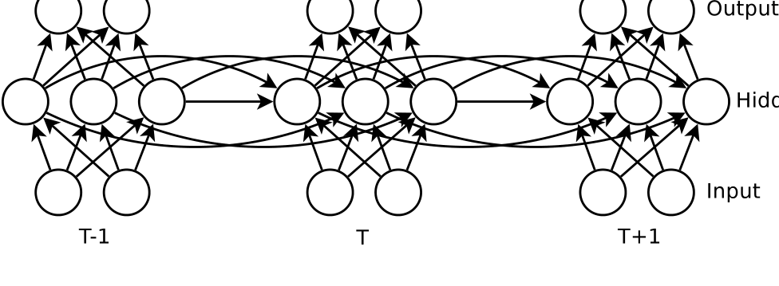
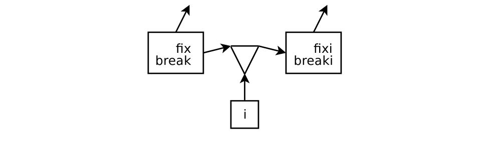
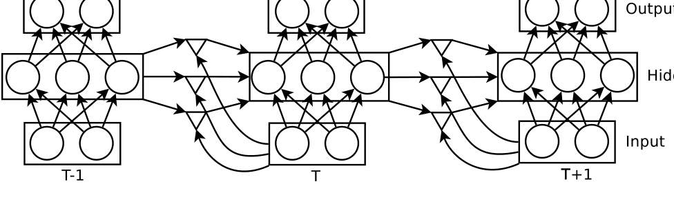

# 用循环神经网络生成文本（Generating Text with Recurrent Neural Networks）

> Ilya Sutskever | ILYA@CS.UTORONTO.CA
>
> James Martens | JMARTENS@CS.TORONTO.EDU
>
> Geoffrey Hinton | HINTON@CS.TORONTO.EDU
>
> 多伦多大学（University of Toronto），6 King's College Rd., Toronto, ON M5S 3G4 CANADA
>
> ICML 2011（第 28 届国际机器学习会议），美国华盛顿州贝尔维尤

本文用新提出的 Hessian-Free（HF）二阶优化器训练 RNN，并引入乘法循环神经网络（MRNN）做字符级语言建模，核心发现是——**用 8 块 GPU 训练 5 天的 1500 隐单元 MRNN 超越了此前最好的单一字符级模型（序列 memoizer），在三个数据集上逼近 PAQ；生成的文本展现出丰富的词汇、语法结构、可信的专有名词，甚至能平衡相隔 30 个字符的括号**。

核心内容：

- MRNN 架构：让当前输入字符决定隐藏层到隐藏层的权重矩阵 $W^{(x_t)}_{hh}$ ，对三阶张量做因子分解 $W^{(x_t)}_{hh} = W_{hf} \cdot \text{diag}(W_{fx}x_t) \cdot W_{fh}$ ，引入因子状态 $f_t$ 实现门控
- 动机：预测 "fix" 和 "break" 后的 "i" → "n" 需要"动词词干表示"与字符 "i" 的合取——乘法交互，而非加法
- 训练：HF 优化器（结构阻尼 μ=0.1、λ 初始 10），8 块 4GB GPU，每步用 48000 条长度 250 的序列算梯度、2400 条算曲率矩阵-向量积，160 步 × 最多 150 次共轭梯度迭代，约 5 天
- 模型：1500 隐单元 + 1500 因子、490 万参数、稀疏初始化（每单元 15 条连接）；时间展开后等价于 500 层 × 1500 宽的深度网络——迄今最深最大的已训练神经网络

关键发现：

- 每字符比特数（bpc）：WIKI 1.60 vs memoizer 1.66、NYT 1.48 vs 1.49、ML 1.31 vs 1.33——三个数据集全面超越 memoizer；仅略高于带词典的 PAQ（1.51/1.38/1.22）
- 相同参数量下 MRNN 优于 RNN：ML 上 1.56 vs 1.65 bpc——乘法交互的意义
- debagging（词袋排序）：Wikipedia 训练 MRNN 正确率 34% vs memoizer 27%（11 词袋、搜索空间 5040）
- 泛化能力：能生成训练集中不存在的可信词（"homosomalist"、"un-ameliary"）、能正确续写 "(ABC et al., 2003)" 的括号——基于精确上下文匹配的 n-gram、memoizer、PAQ 都做不到

---

## 摘要

循环神经网络（RNN，Recurrent Neural Network）是非常强大的序列模型，但由于极难正确训练而未得到广泛使用。幸运的是，Hessian-free 优化的最新进展已经能够克服与训练 RNN 相关的困难，使其能够成功应用于具有挑战性的序列问题。在本文中，我们通过将用新的 Hessian-Free 优化器（HF）训练的 RNN 应用于字符级语言建模任务，来展示其威力。标准 RNN 架构虽然有效，但并不理想地适合此类任务，因此我们引入了一种新的 RNN 变体，它使用乘法（或"门控"）连接，允许当前输入字符决定从一个隐藏状态向量到下一个的转移矩阵。在用 8 块高端图形处理单元（GPU，Graphics Processing Unit）上使用 HF 优化器训练乘法 RNN 五天之后，我们能够超越此前最好的字符级语言建模单一方法——一种分层非参数序列模型。据我们所知，这代表了迄今为止最大规模的循环神经网络应用。

## 1. 引言

循环神经网络（RNN）构成了序列任务的一个表达能力强的模型家族。它们强大是因为它们具有带非线性动力学的高维隐藏状态，使它们能够记忆和处理过去的信息。此外，RNN 的梯度用时间反向传播计算很廉价。尽管它们具有吸引人的品质，由于有效训练它们的困难，RNN 未能成为机器学习中的主流工具。这种困难的原因是参数与隐藏状态动力学之间非常不稳定的关系，这表现为"梯度消失/爆炸问题"（[2]）。结果，在过去 20 年里，对标准 RNN 的研究出奇地少，只有少数使用大型 RNN 的成功应用（[19, 17]），包括最近 RNN 作为词级语言模型的一个显著应用（[13]）。

最近，Martens [11] 开发了一个大大改进的 Hessian-Free 优化（HF）变体，它足够强大，可以从随机初始化训练非常深的神经网络。由于 RNN 可以被视为一个跨时间共享权重的极深神经网络，同样的 HF 优化器应该能够训练 RNN。幸运的是，Martens & Sutskever [12] 能够表明情况确实如此，并且这种非对角的二阶优化为 RNN 中的梯度消失问题提供了有原则的解决方案。此外，通过添加一种新颖的阻尼机制，Martens & Sutskever [12] 表明 HF 优化器足够稳健，可以训练 RNN——既能在已知梯度下降不可能学习的病态合成数据集上，也能在复杂多样的真实世界序列数据集上。

本文的目标是通过将用新 Hessian-Free 优化器训练的大型 RNN 应用于预测文本流中的下一个字符的任务，来展示其威力。这是一个重要的问题，因为更好的字符级语言模型可以改进文本文件的压缩（[18]），并使有身体残疾的人更容易与计算机交互（[24]）。更推测性地，达到文本压缩的渐近极限需要一种"等价于智能"的理解（[7]）。良好的压缩可以通过利用简单的规律性来实现，例如相关语言的词汇和句法，以及由词 "cow" 之后常常很快出现词 "milk" 所体现的浅层关联，但超过某一点，任何性能改进都必须来自对文本含义的更深理解。

**图 1：** 循环神经网络是一个跨时间共享权重的非常深的前馈神经网络。隐藏单元使用的非线性激活函数是 RNN 丰富动力学的来源。

虽然标准 RNN 表达能力很强，但我们发现要在字符级语言建模上取得有竞争力的结果，需要开发一种更适合我们应用的、不同类型的 RNN。这种新的 "MRNN" 架构使用乘法连接，允许当前输入字符决定隐藏层到隐藏层的权重矩阵。我们使用 8 块并行 GPU，在超过一百兆字节的文本上训练 MRNN 数天，显著优于最好的与词无关的单一字符级语言模型之一：序列 memoizer（[26, 3]），这是一种分层非参数贝叶斯方法。它定义了一个在每一个可设想上下文上的预测集的先验过程，其精心选择的细节使近似推断在计算上可处理。memoizer 通过在相似上下文处做出相似预测，诱导其预测之间的依赖关系。虽然智能的边际化技术能够消除除相对少量的随机变量之外的所有变量（因此所使用的数据结构随数据量线性扩展），但其内存需求对于大数据集来说仍然贵得令人望而却步，这是其非参数性质的直接后果。

虽然我们的方法在纯字符级模型中达到了最先进的水平，但其压缩性能不及对词有显式知识的最好模型，其中最强的是 PAQ8hp12（[10]）。PAQ 是大量精心选择的上下文模型的混合模型，其混合比例由一个神经网络计算，该网络的权重是当前上下文的函数，其预测进一步与一个类似神经网络的模型结合。与标准压缩技术不同，PAQ 的一些上下文模型不仅考虑连续上下文，还考虑带"间隙"的上下文，使其能够廉价地捕获某些类型的长程结构。更重要的是，PAQ 不是与词无关的，因为它使用字符级和词级模型的组合。PAQ 还用常见英语词的词典预处理数据，我们禁用了这一点，因为它给了 PAQ 相对于不使用此类任务特定（实际上是英语特定）显式先验知识的模型的不公平优势。PAQ 的众多混合分量之所以被选择，是因为它们改进了开发集上的性能，所以在这方面，PAQ 在模型复杂度上与 Netflix 奖的获胜方案（[1]）相似。

最后，语言模型可以用来"生成"语言，令我们惊讶的是，我们训练的 MRNN 生成的文本展示了大量有趣的高层语言结构，具有丰富的词汇、相当多的语法结构以及各种各样不在训练集中的高度可信的专有名词。掌握英语词汇对 MRNN 来说似乎不是问题：它生成的未大写非词非常少，而且它确实生成的那些词往往非常可信，如 "homosomalist" 或 "un-ameliary"。特别有趣的是，MRNN 学会了在长距离（例如 30 个字符）上平衡括号和引号。字符级 N-gram 语言模型只有通过建模 31-gram 才能做到这一点，而 Memoizer 和 PAQ 由于需要精确的上下文匹配，在表示能力上都无法平衡括号。相比之下，MRNN 的非线性动力学使它能够从文本中提取更高层次的"知识"，而且由于其隐藏状态执行一般计算的能力，其表示能力没有明显的限制。

## 2. 循环神经网络

循环神经网络是标准前馈神经网络的直接改编，使其能够建模序列数据。在每个时间步，RNN 接收一个输入，更新其隐藏状态，并做出预测（图 1）。RNN 的高维隐藏状态和非线性演化赋予了它巨大的表达能力，使 RNN 的隐藏状态能够在许多时间步上整合信息，并用它做出准确的预测。即使每个单元使用的非线性相当简单，在时间上迭代它也会导致非常丰富的动力学。

标准 RNN 形式化如下：给定一个输入向量序列 $(x_1, \ldots, x_T)$ ，RNN 通过迭代以下方程计算隐藏状态序列 $(h_1, \ldots, h_T)$ 和输出序列 $(o_1, \ldots, o_T)$

对 $t = 1$ 到 $T$ ：

$$
h_t = \tanh\left( W_{hx} x_t + W_{hh} h_{t-1} + b_h \right) \qquad (1)
$$

$$
o_t = W_{oh} h_t + b_o \qquad (2)
$$

在这些方程中， $W_{hx}$ 是输入到隐藏层的权重矩阵， $W_{hh}$ 是隐藏层到隐藏层（或循环）权重矩阵， $W_{oh}$ 是隐藏层到输出层的权重矩阵，向量 $b_h$ 和 $b_o$ 是偏置。时间 $t = 1$ 时未定义的表达式 $W_{hh} h_{t-1}$ 被替换为一个特殊的初始偏置向量 $h_{init}$ ，tanh 非线性按坐标应用。

RNN 的梯度很容易通过时间反向传播（[20, 25]）¹计算，所以似乎 RNN 很容易用梯度下降训练。实际上，RNN 的参数与动力学之间的关系高度不稳定，这使得梯度下降无效。这种直觉由 Hochreiter [5] 和 Bengio et al. [2] 形式化，他们证明了梯度在时间上反向传播时指数衰减（或较少见地，爆炸），并用这个结果论证 RNN 在使用梯度下降训练时不能学习长程时间依赖。此外，反向传播梯度偶尔的指数爆炸趋势大大增加了梯度的方差，使学习非常不稳定。由于梯度下降是当时训练神经网络的主要算法，这些理论结果和训练 RNN 的经验困难导致了 RNN 研究的近乎放弃。

处理梯度下降无法在标准 RNN 中学习长程时间结构的一种方法是修改模型，纳入专门设计用于在长时间内存储信息的"记忆"单元。这种方法被称为"长短期记忆"（LSTM，Long-Short Term Memory）（[6]），并已成功应用于复杂的真实世界序列建模任务（例如 [4]）。长短期记忆使得处理需要长期记忆和回忆的数据集成为可能，但即使在这些数据集上，它也被使用 HF 优化器训练的标准 RNN 超越（[12]）。

另一种避免与时间反向传播相关的问题的方法是回声状态网络（ESN，Echo State Network）（[9]），它完全放弃学习循环连接，只训练非循环的输出权重。这是一个容易得多的学习任务，而且只要循环连接被仔细初始化，使网络的内在动力学表现出丰富的时间行为储备（reservoir），可以选择性地耦合到输出，它的效果出奇地好。

¹相比之下，RNN 的概率对应物动态贝叶斯网络（[16]）没有计算其梯度的有效算法。

**图 2：** 乘法连接重要性的说明（乘积用三角形表示）。乘法连接的存在使 RNN 能够对上下文和字符的合取敏感，允许不同的上下文对相同的输入字符以质的不同方式响应。

## 3. 乘法 RNN

在将适度规模的标准 RNN 架构应用于字符级语言建模问题（每个时间步的目标输出定义为下一个时间步的输入字符）之后，我们发现性能有些不令人满意，而且虽然增加隐藏状态的维度确实有帮助，但每参数测试性能的增益不足以使该方法既实用又与最先进的方法有竞争力。我们通过提出一种称为乘法 RNN（MRNN）的新时间架构来解决这个问题，我们将论证它更适合语言建模任务。

### 3.1 张量 RNN

RNN 隐藏状态的动力学取决于隐藏层到隐藏层的矩阵和输入。在标准 RNN 中（如式 1-2 所定义），当前输入 $x_t$ 首先通过可见层到隐藏层的权重矩阵 $W_{hx}$ 变换，然后加性地贡献给当前隐藏状态的输入。当前输入字符影响隐藏状态动力学的更强大方式，是除了提供加性偏置之外，还决定整个隐藏层到隐藏层矩阵（它定义了非线性动力学）。

这种方法的一个动机来自把 RNN 看作无界树的模型，其中每个节点是一个隐藏状态向量，每条边由一个字符标记，该字符决定父节点如何产生子节点。这种观点强调了 RNN 与在树中存储熟悉字符串的马尔可夫模型的相似性，也清楚地表明 RNN 树可能比马尔可夫模型强大得多，因为节点的分布式表示允许不同的节点共享知识。例如，字符串 "ing" 在 "fix" 之后很可能出现，在 "break" 之后也很可能出现。如果表示两个历史 "fix" 和 "break" 的隐藏状态向量共享"这可能是动词词干"这一事实的共同表示，那么这个共同表示可以被字符 "i" 作用，产生一个预测 "n" 的隐藏状态。为了使这是一个好的预测，我们需要前一个隐藏状态中的动词词干表示与字符 "i" 的合取。单独的一个或另一个并不能提供预测 "n" 的一半证据：重要的是它们的合取。这强烈表明我们需要乘法交互。

为了实现这个目标，我们修改 RNN，使其隐藏层到隐藏层的权重矩阵是当前输入 $x_t$ 的（学习到的）函数：

$$
h_t = \tanh\left( W_{hx} x_t + W^{(x_t)}_{hh} h_{t-1} + b_h \right) \qquad (3)
$$

$$
o_t = W_{oh} h_t + b_o \qquad (4)
$$

这些与式 1 和 2 相同，只是 $W_{hh}$ 被替换为 $W^{(x_t)}_{hh}$ ，允许每个字符指定一个不同的隐藏层到隐藏层权重矩阵。

用张量定义 $W^{(x_t)}_{hh}$ 是很自然的。如果我们存储 $M$ 个矩阵 $W^{(1)}_{hh}, \ldots, W^{(M)}_{hh}$ ，其中 $M$ 是 $x_t$ 的维度，我们可以用方程定义 $W^{(x_t)}_{hh}$ ：

$$
W^{(x_t)}_{hh} = \sum_{m=1}^{M} x^{(m)}_t W^{(m)}_{hh} \qquad (5)
$$

其中 $x^{(m)}_t$ 是 $x_t$ 的第 $m$ 个坐标。当输入 $x_t$ 是一个字符的 1-of-M 编码时，很容易看出每个字符都有一个关联的权重矩阵，而 $W^{(x_t)}_{hh}$ 是分配给由 $x_t$ 表示的字符的矩阵。²

²上述模型应用于以 1-of-M 编码表示的离散输入时，是可观测算子模型（OOM，Observable Operator Model）[8] 的非线性版本，其线性性质使它在表达能力上与 HMM 密切相关。

### 3.2 乘法 RNN

上述方案虽然吸引人，但有一个主要缺点：完全一般的三阶张量由于其大小而不实用。特别是，如果我们想使用具有大量隐藏单元的 RNN（比如说 1000 个），并且如果 $x_t$ 的维度甚至中等大小，那么张量 $W^{(x_t)}_{hh}$ 所需的存储就变得令人望而却步。

事实证明，我们可以通过对张量 $W^{(x)}_{hh}$ 进行因子分解来补救上述问题（例如 [22]）。这是通过引入三个矩阵 $W_{fx}$ 、 $W_{hf}$ 和 $W_{fh}$ ，并用方程重新参数化矩阵 $W^{(x_t)}_{hh}$ 来完成的：

$$
W^{(x_t)}_{hh} = W_{hf} \cdot \text{diag}(W_{fx} x_t) \cdot W_{fh} \qquad (6)
$$

**图 3：** 乘法循环神经网络用输入符号"门控"循环权重矩阵。每个三角形符号代表一个因子，它在它的两个输入顶点处各应用一个学到的线性滤波器。这两个线性滤波器输出的乘积随后通过加权连接被发送到与三角形第三个顶点相连的所有单元。因此，每个输入都可以通过确定所有因子上的增益来合成自己的隐藏层到隐藏层权重矩阵，每个因子代表一个由其在隐藏单元上的传入和传出权重向量的外积定义的秩一隐藏层到隐藏层权重矩阵。合成的权重矩阵共享"结构"，因为它们都是通过混合同一组秩一矩阵形成的。相比之下，无约束的张量模型确保每个输入有完全独立的权重矩阵。

如果向量 $W_{fx} x_t$ 的维度（记为 $F$ ）足够大，那么因子分解与原始张量一样有表达力。较小的 $F$ 值需要更少的参数，同时希望保留张量表达能力的相当一部分。

乘法 RNN（MRNN）是在式 3 中展开式 6 来因子分解张量 RNN 的结果。MRNN 通过迭代以下方程计算隐藏状态序列 $(h_1, \ldots, h_T)$ 、一个额外的"因子状态序列" $(f_1, \ldots, f_T)$ 和输出序列 $(o_1, \ldots, o_T)$ ：

$$
f_t = \text{diag}(W_{fx} x_t) \cdot W_{fh} h_{t-1} \qquad (7)
$$

$$
h_t = \tanh\left( W_{hf} f_t + W_{hx} x_t \right) \qquad (8)
$$

$$
o_t = W_{oh} h_t + b_o \qquad (9)
$$

它们实现了图 3 中的神经网络。式 6 的张量因子分解可以解释为在每对连续层之间有一层额外的乘法单元（即图 3 中的三角形），所以 MRNN 实际上在每个输入时间步的隐藏状态中有两步非线性处理。每个乘法单元输出式 7 的值 $f_t$ ，它是连接乘法单元到前一个隐藏状态和输入的两个线性滤波器的输出的乘积。

我们实验验证了在参数量相同时 MRNN 相对于 RNN 的优势。我们在 "machine learning" 数据集（实验部分的第 3 个数据集）上训练了一个 500 隐藏单元的 RNN 和一个 350 隐藏单元加 350 因子的 MRNN（因此 RNN 的参数略多）。经过大量训练后，MRNN 在测试集上达到每字符 1.56 比特，RNN 达到 1.65 比特。

### 3.3 学习乘法单元的困难

在 MRNN 中，由字符 $c$ 贡献的从隐藏单元 $i$ 到隐藏单元 $j$ 的有效权重 $W^{(c)}_{ij}$ ³由下式给出：

$$
W^{(c)}_{ij} = \sum_{f} W_{if} W_{fc} W_{fj} \qquad (10)
$$

这种参数的乘积使梯度下降学习变得困难。例如，如果 $W_{if}$ 非常小而 $W_{fj}$ 非常大，我们对非常小的权重得到非常大的导数，对非常大的权重得到非常小的导数。幸运的是，这种类型的困难正是二阶方法擅长的，所以乘法单元应该被像 HF 优化器这样的二阶方法更好地处理。

³我们稍微滥用符号，用 $W^{(c)}_{ij}$ 表示 $W^{(c)}_{hh\,ij}$ 。

## 4. RNN 作为生成模型

字符级语言建模的目标是预测序列中的下一个字符。更正式地，给定一个训练序列 $(x_1, \ldots, x_T)$ ，RNN 使用其输出向量序列 $(o_1, \ldots, o_T)$ 获得预测分布序列 $P(x_{t+1} \mid x_{\le t}) = \text{softmax}(o_t)$ ，其中 softmax 分布定义为 $P(\text{softmax}(o_t) = j) = \frac{\exp(o^{(j)}_t)}{\sum_k \exp(o^{(k)}_t)}$ 。语言建模目标是最小化……最大化训练序列的总对数概率 $\sum_{t=0}^{T-1} \log P(x_{t+1} \mid x_{\le t})$ ，这意味着 RNN 学习了序列上的概率分布。尽管隐藏单元是确定性的，我们可以随机地从 MRNN 中采样，因为其输出单元的状态定义了条件分布 $P(x_{t+1} \mid x_{\le t})$ 。我们可以从这个条件分布中采样以获得生成字符串中的下一个字符，并将它作为 RNN 的下一个输入。这意味着 RNN 是一个有向非马尔可夫模型，在这方面，它类似于序列 memoizer（[26]）。

## 5. 实验

我们实验的目标是证明由 HF 训练的 MRNN 学习了高质量的语言模型。我们通过在三个真实世界语言数据集上将 MRNN 与序列 memoizer 和 PAQ 进行比较来证明这一点。在将每个数据集分成训练集和测试集之后，我们训练了一个大型 MRNN、一个序列 memoizer⁴和 PAQ，并报告每个模型在测试集上实现的每字符比特数（bpc）。

⁴它没有超参数，严格来说不是被"训练"，而是以训练集为条件。

由于其非参数性质和其所用数据结构的性质，序列 memoizer 非常占用内存，所以在具有 32GB RAM 的机器上它只能应用于大约 130MB 的训练数据集。相比之下，MRNN 可以应用于无限大小的数据集，尽管它通常需要相当多的总 FLOPS 才能实现良好性能（但与 memoizer 不同，它很容易并行化）。然而，为了使实验比较公平，我们在相同大小的数据集上训练 MRNN、memoizer 和 PAQ。

### 5.1 数据集

我们现在描述数据集。每个数据集是一个约 100MB 的、来自 86 字符字母表的字符长串，包括数字和标点，以及一个特殊符号，表示原始文本中的字符不是我们字母表中其他 85 个字符之一。每个数据集的最后 1000 万字符用作测试集。

1. 第一个数据集是英语 Wikipedia 的字符序列。我们移除了 XML 和 Wikipedia 标记来清理数据集。由于 Wikipedia 极不均匀，我们在将其划分为训练集和测试集之前随机排列了它的文章。
2. 第二个数据集是纽约时报的文章集合（[21]）。
3. 第三个数据集是机器学习论文的语料库。我们通过下载每一篇 NIPS 和 JMLR 论文，并使用 pdftotext 工具将它们转换为纯文本来构建这个数据集。然后我们将大量特殊字符转换为它们的 ascii 等价物（包括非 ascii 标点、希腊字母以及 "fi" 和 "fl" 连字符）以清理数据集，并通过只使用由至少 70% 字母数字字符组成的句子来移除大部分非结构化文本。最后，我们随机排列了论文。

前两个语料库是更大语料库（超过 1GB）的子集，但我们优化器的半在线性质使得在任何大小的数据集上训练 MRNN 都很容易。

### 5.2 训练细节

为了计算训练集对数概率的精确梯度（式 4），MRNN 需要顺序处理整个训练集并存储隐藏状态序列以应用时间反向传播。由于训练集的大小，这是不可行的，但也是不必要的：在许多较短的序列上训练 MRNN 同样有效，只要它们有几百个或更多字符长。如果序列太短，我们就无法利用 HF 优化器捕获跨越数百时间步的长程依赖的能力。

使用大量相对短的序列而不是单个长序列的一个优点是，前者更容易并行化。这是必不可少的，因为我们的初步实验表明，应用于 MRNN 的 HF 在使用数百万字符计算梯度、使用数十万字符计算曲率矩阵-向量积时效果最好。使用一个高度并行的系统（由 8 块各带 4GB RAM 的高端 GPU 组成），我们在 160×300 = 48000 条长度 250 的序列上计算梯度，其中 8×300 = 2400 条序列用于计算 HF 优化器所需的曲率矩阵-向量积（[12]）（因此每块 GPU 一次处理 300 条序列）。

任何序列的前几个字符都更难预测，因为它们没有足够大的上下文，所以让 MRNN 花费神经资源来预测这些字符是没有益处的。我们通过让 MRNN 只预测 250 长训练序列的最后 200 个时间步来考虑这种效应，从而为每个预测提供至少 50 个字符的上下文。

Hessian-Free 优化器（[11]）及其 RNN 专用变体（[12]）有少量必须指定的元参数。我们将结构阻尼系数 $\mu$ 设为 0.1，并将 $\lambda$ 初始化为 10（关于这些元参数的描述见 [12]）。我们的 HF 实现在每次迭代使用不同的训练数据子集，因此在粗时间尺度上它本质上是在线的。在这种设置下，每个数据集的训练持续了大约 5 天。

我们发现总共 160×150 次权重更新足以充分训练一个 MRNN。更具体地说，我们使用了 160 步 HF，每一步使用最多 150 次共轭梯度迭代来逼近目标函数的二次 Gauss-Newton 近似的极小值，该近似在共轭梯度迭代期间保持固定。少量的权重更新（每次都需要大量的计算）使 HF 优化器比随机梯度下降容易并行化得多。

在我们所有的实验中，我们使用具有 1500 个隐藏单元和 1500 个因子（ $F$ ）的 MRNN，它有 4,900,000 个参数。MRNN 用稀疏连接初始化：每个单元开始时与其他单元有 15 条非零连接（见 Martens & Sutskever, 2011）。注意，如果我们在时间上展开 MRNN（如图 3），并且把乘法单元 $f_t$ 看作层，我们就得到了一个 500 层、每层大小 1500 的神经网络。这可以说是迄今训练过的最深最大的神经网络。

### 5.3 结果

主要实验结果如表 5.2 所示。我们看到，在三个数据集上，MRNN 比序列 memoizer 更准确地预测测试集，但不如无词典的 PAQ 准确。

| 数据集 | MEMOIZER | PAQ | MRNN | MRNN（全量集） |
| --- | --- | --- | --- | --- |
| WIKI | 1.66 | 1.51 | 1.60 (1.53) | 1.55 (1.54) |
| NYT | 1.49 | 1.38 | 1.48 (1.44) | 1.47 (1.46) |
| ML | 1.33 | 1.22 | 1.31 (1.27) | — |

**表 1：** 该表显示每个实验的测试每字符比特数，括号中为训练比特数（如可得）。MRNN 在三个数据集上都实现了比序列 memoizer 更低的每字符比特数，但高于 PAQ。MRNN（全量集）列指在更大的（1GB）训练语料上训练的 MRNN（ML 数据集除外，它不是更大语料库的子集）。还要注意，更大数据集带来的改进是适度的，这意味着具有 1500 个单元和因子的 MRNN 在 100MB 文本上已经训练得相当好。

### 5.4 Debaging（词袋还原）

把一句话转换成词袋很容易，但把词袋转换成有意义的句子要难得多。我们将后者命名为 debagging 问题。我们执行了一个实验，其中字符级语言模型评估袋中词的每一种可能排序，并返回它认为最好的排序。为了使实验可行，我们只考虑 7 个词的袋，给出大小为 5040 的搜索空间。

对于我们的实验，我们使用 MRNN 和 memoizer⁵对从 "Ana Karenina" 随机选择的 500 个词袋进行 debag。每个袋使用 11 个词，其中前两个和后两个词用作上下文，以帮助对中间七个词进行 debag。

如果正确的排序被赋予最高的对数概率，我们就说模型正确地对句子进行了 debag。我们发现 Wikipedia 训练的 MRNN 在 34% 的情况下恢复了正确的排序，而 Wikipedia 训练的 memoizer 做到了 27%。鉴于这个问题是"词级"的，利用大的字符上下文对于实现良好性能至关重要。

⁵我们无法修改 PAQ 的实现以使其可以执行 debagging。

## 6. 定性实验

在本节中，我们定性研究 MRNN 所学模型的性质。

### 6.1 模型的采样

最简单的定性实验是检查三个 MRNN 生成的样本。样本最显著的特征是其词汇的丰富性。进一步检查表明，文本大部分是符合语法的，括号通常在许多字符上保持平衡。生成文本的伪影，如连续的逗号或引号，是数据预处理的结果，在训练集中经常出现。

#### 6.1.1 来自 Wikipedia 模型的样本

我们现在展示 Wikipedia 模型的一个样本。我们用 ? 表示"未知"字符。下面的样本是通过运行 MRNN 不到 10 次并选择最有趣的样本获得的。段落的开头和接近结尾的括号特别有趣。MRNN 用短语 "The meaning of life is" 初始化：

> The meaning of life is the tradition of the ancient human reproduction: it is less favorable to the good boy for when to remove her bigger. In the show's agreement unanimously resurfaced. The wild pasteured with consistent street forests were incorporated by the 15th century BE. In 1996 the primary rapford undergoes an effort that the reserve conditioning, written into Jewish cities, sleepers to incorporate the .St Eurasia that activates the population. Mar??a Nationale, Kelli, Zedlat-Dukastoe, Florendon, Ptu's thought is. To adapt in most parts of North America, the dynamic fairy Dan please believes, the free speech are much related to the

#### 6.1.2 来自 NYT 模型的样本

下面是来自在完整 NYT 数据集上训练的模型的样本，其中 MRNN 用单个空格初始化。标点周围的空间是预处理的伪影。

> while he was giving attention to the second advantage of school building a 2-for-2 stool killed by the Cultures saddled with a half-suit defending the Bharatiya Fernall 's office . Ms . Claire Parters will also have a history temple for him to raise jobs until naked Prodiena to paint baseball partners , provided people to ride both of Manhattan in 1978 , but what was largely directed to China in 1946 , focusing on the trademark period is the sailboat yesterday and comments on whom they obtain overheard within the 120th anniversary , where many civil rights defined , officials said early that forms , " said Bernard J. Marco Jr. of Pennsylvania , was monitoring New York

#### 6.1.3 来自 ML 模型的样本

最后，我们从以字符串 "Recurrent" 为条件的 ML 语料库训练的 MRNN 生成文本。这个 MRNN 也能够平衡括号（例如样本的第三行）：

> Recurrent network with the Stiefel information for logistic regression methods Along with either of the algorithms previously (two or more skewprecision) is more similar to the model with the same average mismatched graph. Though this task is to be studied under the reward transform, such as (c) and (C) from the training set, based on target activities for articles a ? 2(6) and (4.3). The PHDPic (PDB) matrix of cav'va using the three relevant information contains for tieming measurements. Moreover, because of the therap tor, the aim is to improve the score to the best patch randomly, but for each initially four data sets. As shown in Figure 11, it is more than 100 steps, we used ?? \to \infty with 1000

### 6.2 结构化句子补全

在本节中，我们通过从以某个前缀为条件的 MRNN 分布中采样，来研究 MRNN 在各种情况下的响应。目标是看看 MRNN 是否能够为初始字符串生成"合理"的续写。在我们的第一个实验中，我们使用 Wikipedia MRNN 补全字符串 "England, Spain, France, Germany,"：

> England, Spain, France, Germany, and Massachusetts.
> England, Spain, France, Germany, cars, and direct schools
> England, Spain, France, Germany, , or New Orleans and Uganda.
> England, Spain, France, Germany, , Westchester, Jet State, Springfield, Athleaves and Sorvinhee

在上述补全中，MRNN 正确地理解了字符串是一个地点列表，所以生成的文本也是列表的一部分。

接下来，我们使用 ML 模型和字符串对 "(ABC et al" 与 "ABC et al" 进行了类似的实验。系统在其训练集中从未见过字符串 "(ABC et al"（仅仅因为没有名为 ABC 的机器学习作者，而且其大小写对于引用来说特别不常见），所以 MRNN 需要在一个全新的作者名上泛化：

> (ABC et al., 2003), ?13?, and for a supervised Mann-¡Whitnaguing
> (ABC et al., 2002), based on Lebanon and Haussler, 1995b)
> ABC et al. (2003b), or Penalization of Information
> ABC et al. (2008) can be evaluated and motivated by providing optimal estimate

这个例子表明 MRNN 对 "ABC" 之前的初始括号是敏感的，说明了它的表示能力。

上述效应极其稳健。相比之下，N-gram 模型和序列 memoizer 都无法做出这样的预测，除非这些确切的字符串（例如 "(ABC et al., 2003)"）出现在训练集中，而这不能指望。事实上，任何基于精确上下文匹配的方法从根本上有无法利用长上下文的缺陷，因为一个长上下文出现超过一次的概率小得可以忽略。我们实验验证了序列 memoizer 和 PAQ 都对初始括号不敏感。

## 7. 讨论

在字符级建模语言似乎不必要地困难，因为我们已经知道语素是进行语义和句法预测的适当单元。然而，将大型数据库转换为语素序列相比将其视为字符串是不平凡的。而且，学习哪些字符串构成词，相对于发现语义和句法结构的微妙之处，是相对容易的任务。所以，给定一个像 MRNN 这样强大的学习系统，使用字符的便利性可能超过必须学习词的额外工作。我们所有的实验都表明，MRNN 发现学习词非常容易。除了专有名词，生成的文本包含非常少的非词。同时，MRNN 还为训练集中不出现的可信词分配概率（并偶尔生成它们）（例如 "cryptoliation"、"homosomalist" 或 "un-ameliary"）。这是一个可取的属性，它使 MRNN 能够优雅地处理它虽然在训练集中没有见过但真实的词。通过做出一系列字符预测来预测下一个词，避免了对所有已知词使用巨大的 softmax，这是如此有利，以至于一些词级语言模型实际上编造了词的二进制"拼写"，以便一次一个比特地预测它们（[14]）。

MRNN 仅使用 1500 个隐藏单元就已经学习了出奇好的语言模型，而且与序列 memoizer 和 PAQ 等其他方法不同，它们很容易沿各种维度扩展。如果我们能训练具有数百万单元和数十亿连接的更大的 MRNN，那么仅凭蛮力就可能足以实现更高的性能标准。但这当然需要相当多的计算能力。

## 致谢

这项工作得到了 Google fellowship 和 NSERC 的支持。实验使用 [23] 和 [15] 的软件包实现。

## 参考文献

[1] Bell, R.M., Koren, Y., and Volinsky, C. The BellKor solution to the Netflix prize. KorBell Team's Report to Netflix, 2007.

[2] Bengio, Y., Simard, P., and Frasconi, P. Learning long-term dependencies with gradient descent is difficult. IEEE Transactions on Neural Networks, 5(2):157–166, 1994.

[3] Gasthaus, J., Wood, F., and Teh, Y.W. Lossless compression based on the Sequence Memoizer. In Data Compression Conference (DCC), 2010, pp. 337–345. IEEE, 2010.

[4] Graves, A. and Schmidhuber, J. Offline handwriting recognition with multidimensional recurrent neural networks. Advances in Neural Information Processing Systems, 21, 2009.

[5] Hochreiter, S. Untersuchungen zu dynamischen neuronalen Netzen. Diploma thesis. PhD thesis, Institut fur Informatik, Technische Universitat Munchen, 1991.

[6] Hochreiter, S. and Schmidhuber, J. Long short-term memory. Neural Computation, 9(8):1735–1780, 1997. ISSN 0899-7667.

[7] Hutter, M. The Human knowledge compression prize, 2006.

[8] Jaeger, H. Observable operator models for discrete stochastic time series. Neural Computation, 12(6):1371–1398, 2000.

[9] Jaeger, H. and Haas, H. Harnessing nonlinearity: Predicting chaotic systems and saving energy in wireless communication. Science, 304(5667):78, 2004.

[10] Mahoney, M. Adaptive weighing of context models for lossless data compression. Florida Inst. Technol., Melbourne, FL, Tech. Rep. CS-2005-16, 2005.

[11] Martens, J. Deep learning via Hessian-free optimization. In Proceedings of the 27th International Conference on Machine Learning (ICML). ICML 2010, 2010.

[12] Martens, J. and Sutskever, I. Training Recurrent Neural Networks with Hessian-Free optimizaiton. ICML 2011, 2011.

[13] Mikolov, T., Karafiát, M., Burget, L., Černocký, J., and Khudanpur, S. Recurrent Neural Network Based Language Model. In Eleventh Annual Conference of the International Speech Communication Association, 2010.

[14] Mnih, A. and Hinton, G. A scalable hierarchical distributed language model. Advances in Neural Information Processing Systems, 21:1081–1088, 2009.

[15] Mnih, Volodymyr. Cudamat: a CUDA-based matrix class for python. Technical Report UTML TR 2009-004, Department of Computer Science, University of Toronto, November 2009.

[16] Murphy, K.P. Dynamic bayesian networks: representation, inference and learning. PhD thesis, Citeseer, 2002.

[17] Pollastri, G., Przybylski, D., Rost, B., and Baldi, P. Improving the prediction of protein secondary structure in three and eight classes using recurrent neural networks and profiles. Proteins: Structure, Function, and Bioinformatics, 47(2):228–235, 2002.

[18] Rissanen, J. and Langdon, G.G. Arithmetic coding. IBM Journal of Research and Development, 23(2):149–162, 1979.

[19] Robinson, A.J. An application of recurrent nets to phone probability estimation. Neural Networks, IEEE Transactions on, 5(2):298–305, 2002. ISSN 1045-9227.

[20] Rumelhart, D.E., Hintont, G.E., and Williams, R.J. Learning representations by back-propagating errors. Nature, 323(6088):533–536, 1986.

[21] Sandhaus, E. The new york times annotated corpus. Linguistic Data Consortium, Philadelphia, 2008.

[22] Taylor, G.W. and Hinton, G.E. Factored conditional restricted boltzmann machines for modeling motion style. In Proceedings of the 26th Annual International Conference on Machine Learning, pp. 1025–1032. ACM, 2009.

[23] Tieleman, T. Gnumpy: an easy way to use GPU boards in Python. Technical Report UTML TR 2010-002, University of Toronto, Department of Computer Science, 2010.

[24] Ward, D.J., Blackwell, A.F., and MacKay, D.J.C. Dasher–a data entry interface using continuous gestures and language models. In Proceedings of the 13th annual ACM symposium on User interface software and technology, pp. 129–137. ACM, 2000.

[25] Werbos, P.J. Backpropagation through time: What it is and how to do it. Proceedings of the IEEE, 78(10):1550–1560, 1990.

[26] Wood, F., Archambeau, C., Gasthaus, J., James, L., and Teh, Y.W. A stochastic memoizer for sequence data. In Proceedings of the 26th Annual International Conference on Machine Learning, pp. 1129–1136. ACM, 2009.
