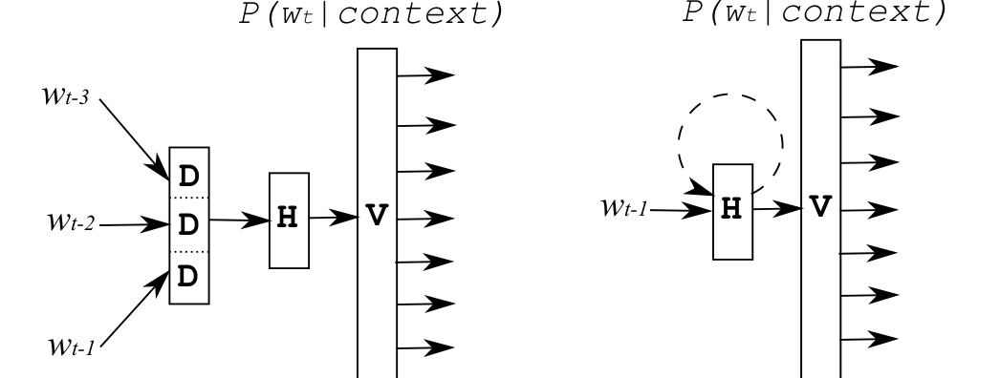
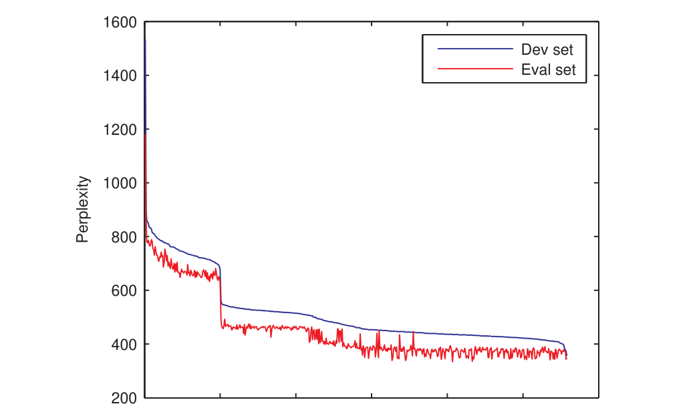
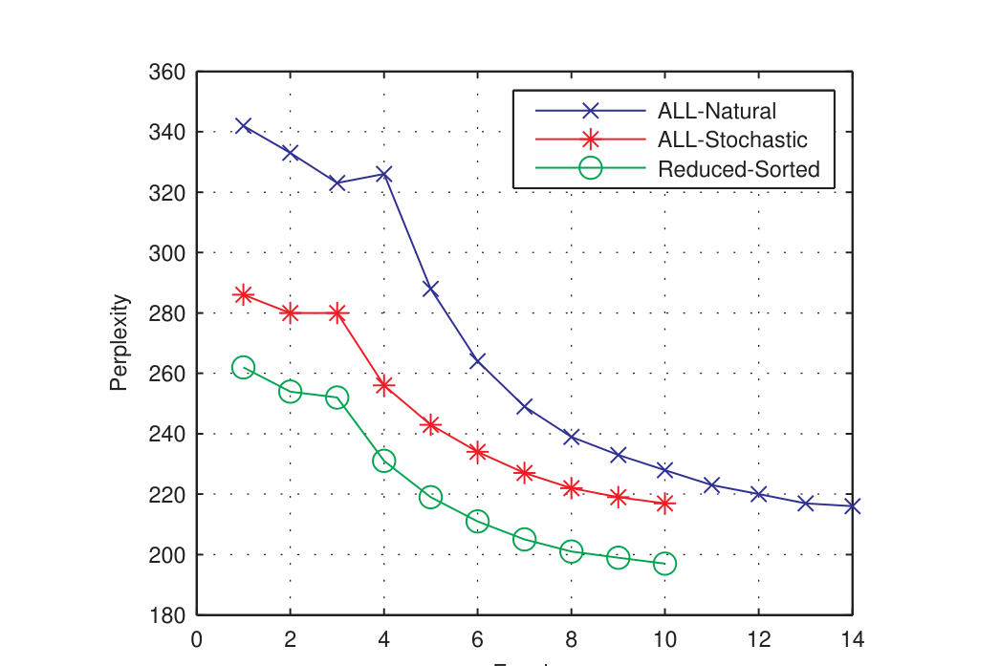
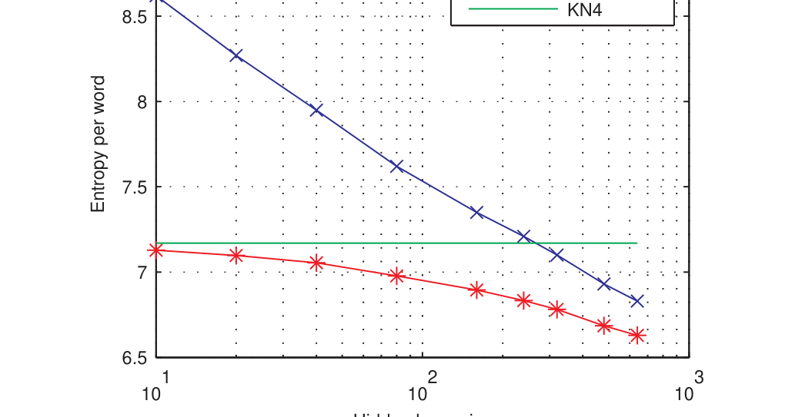
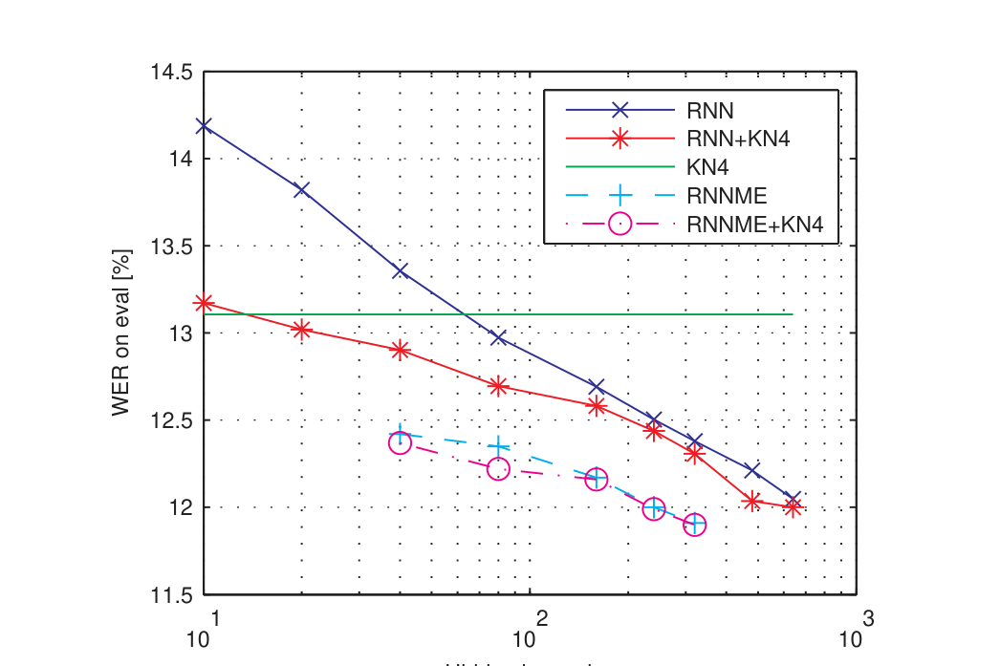

# 训练大规模神经网络语言模型的策略（Strategies for Training Large Scale Neural Network Language Models）

> Tomáš Mikolov #1, Anoop Deoras *2, Daniel Povey †3, Lukáš Burget #4, Jan "Honza" Černocký #5
>
> # 布尔诺理工大学（Brno University of Technology）Speech@FIT，捷克布尔诺：imikolov@fit.vutbr.cz, burget@fit.vutbr.cz, cernocky@fit.vutbr.cz
>
> * 约翰霍普金斯大学（Johns Hopkins University）CLSP HLT-COE，美国马里兰州巴尔的摩：adeoras@jhu.edu
>
> † 微软研究院（Microsoft Research），美国华盛顿州雷德蒙德：dpovey@microsoft.com
>
> ASRU 2011

本文介绍在大数据上高效训练神经语言模型的策略，核心发现是——**训练数据按相关性排序（先域外后域内）可在 7 个 epoch 内收敛并带来约 10% 困惑度降低；把最大熵模型作为"直连参数"与 RNN 联合训练（哈希实现的 RNNME），40 个神经元的模型即可匹敌 320 神经元纯 RNN，在 RT04 广播新闻任务上 WER 从 13.11% 降到 11.70%**。

核心内容：

- 数据排序：把 400M token 训练集切成 560 块，按每块训练的 2-gram 在开发集上的困惑度排序，丢弃困惑度 >600 的噪声块得 318M 的 Reduced-Sorted 集——比标准随机化还低约 10% 困惑度，且仅 7 epoch 收敛
- RNNME 架构：在类别分解 RNN 上加入输入-输出、输入-类别层的直连参数，用二元/三元特征——数学上等价于无隐藏层的最大熵模型，RNN 与 ME 联合在线训练
- 哈希实现：用哈希函数把巨大的稀疏三元特征矩阵映射到一维数组，仅需一个参数（哈希大小）控制内存-性能权衡， $10^9$ 哈希最优
- 计算复杂度对比：前馈 NN LM 为 $I \times W \times ((N-1) \times D \times H + H \times V)$ ，RNN 为 $I \times W \times (H \times H + H \times V)$ ，ME 为 $I \times W \times (N \times V)$

关键发现：

- 困惑度：RNNME-80 达 eval **123**（KN4 基线 140），+KN4 插值后 **113**（纯 RNN-80+KN4 为 127）
- WER：RNN-640 从 13.11% 降到 **12.00%**；RNNME-320 达 11.91%；3 模型组合（RNN-480+RNN-640+RNN-640/58M）达 **11.70%**，相对降低约 11%
- RNNME-40（40 神经元）几乎与 RNN-320（320 神经元）一样好——训练时间从数周缩到数天
- RNN-80 困惑度虽远高于 KN4 但 WER 已更低——小 RNN 也能有效区分正确句与歧义句

---

## 摘要

我们描述了如何在大数据集上有效训练基于神经网络的语言模型。当训练数据按相关性排序时，训练期间收敛更快且整体性能更好。我们引入了最大熵模型的哈希实现，它可以作为神经网络模型的一部分来训练。这导致计算复杂度的显著降低。在英语广播新闻语音识别任务上，我们相对于训练于 400M token 的大型 4-gram 模型，实现了约 10% 的相对词错误率降低。

## I. 引言

统计语言模型是许多处理自然语言的应用的重要组成部分，如机器翻译和自动语音识别。基于 n-gram 统计的回退模型已经主导语言建模领域近三十年，主要是因为它们的简单性和低计算复杂度。

近年来，其他一些类型的语言模型也吸引了大量关注。这类模型最成功的例子是最大熵语言模型 [1]（ME LM）和基于神经网络的语言模型 [2]（NN LM）。它们具有吸引力的主要原因是它们比回退模型更精确地建模自然语言。它们的重要缺点是巨大的计算复杂度。因此，大量研究努力投入到使这些模型计算更高效上。

在本文中，我们简要提及降低 NN LM 计算复杂度的现有方法（其中大多数方法也适用于 ME LM）。我们提出新的简单技术，可以用于降低训练和测试阶段的计算成本。我们表明这些新技术与现有方法是互补的。

最有趣的是，我们表明一个标准的神经网络语言模型可以与一个最大熵模型一起训练，后者可以看作神经网络的一部分。我们引入基于类的最大熵模型的哈希实现，它允许我们轻松控制内存复杂度和计算复杂度之间的权衡。

我们在 NIST RT04 广播新闻语音识别任务上报告结果。我们使用 IBM Attila 解码器 [3] 生成的格，该解码器使用最先进的判别式训练的声学模型。该任务的语言模型训练于约 400M token。这种高度有竞争力的配置已在最近的约翰霍普金斯大学夏季研讨会上使用 [4]。在我们的实验中，我们使用循环神经网络语言模型 [5]（RNN LM），因为我们最近已经表明 RNN LM 可以优于标准前馈 NN LM [6]。

## II. 模型描述

最大熵模型具有以下形式：

$$
P(w|h) = \frac{e^{\sum_{i=1}^{N} \lambda_i f_i(h, w)}}{\sum_w e^{\sum_{i=1}^{N} \lambda_i f_i(h, w)}}, \qquad (1)
$$

其中 $f$ 是一组特征， $\lambda$ 是一组权重， $h$ 是历史。训练最大熵模型包括学习权重集 $\lambda$ 。通常的特征是 n-gram，但很容易整合任何信息源，例如触发词或句法特征 [1]。特征的选择通常是手工完成的，并且显著影响模型的整体性能。

标准神经网络语言模型具有非常相似的形式。主要区别是该模型的特征是作为历史的函数自动学习的。此外，ME 模型的常见特征是二元的，而 NN 模型使用连续值特征。我们可以将 NN LM 描述如下：

$$
P(w|h) = \frac{e^{\sum_{i=1}^{N} \lambda_i f_i(s, w)}}{\sum_w e^{\sum_{i=1}^{N} \lambda_i f_i(s, w)}}, \qquad (2)
$$

其中 $s$ 是隐藏层的状态。对于 Bengio 等人在 [2] 中引入的前馈 NN LM 架构，隐藏层的状态依赖于一个投影层，该投影层由最近 $N-1$ 个词向低维空间的投影形成。模型训练后，相似的词具有相似的低维表示。

或者，隐藏层的状态可以依赖于最近的词和上一个时间步的状态。因此，时间没有被显式表示。这种循环允许隐藏层表示整个历史的低维表示（换句话说，它为模型提供了记忆）。该架构被称为基于循环神经网络的语言模型（RNN LM），我们已经在 [7] 和 [5] 中描述过它。我们最近表明 RNN LM 在著名的 Penn Treebank 语料库上取得了最先进的性能，并且它优于标准前馈 NN LM 架构以及许多其他高级语言建模技术 [6]。

**图 1：** 前馈神经网络 4-gram 模型（左）和循环神经网络语言模型（右）。

有趣的是，只用 n-gram 特征训练的 ME 模型与使用修正 Kneser-Ney 平滑的普通回退模型性能几乎相同 [8]。另一方面，神经网络模型由于它们聚类相似词（或相似历史）的能力，优于最先进的回退模型。此外，NN LM 与回退模型是互补的，通过线性插值它们可以获得进一步的收益。

我们可以把 ME 模型看作没有隐藏层的 NN 模型，输入层直接连接到输出层。这样的模型已经在 [9] 中描述过，其中表明它可以被训练得与 Kneser-Ney 平滑的 n-gram 模型表现相似。

## III. 计算复杂度

神经网络语言模型的计算复杂度高有几个原因，并且已经有尝试处理几乎所有这些原因。N-gram 神经网络 LM 的训练时间正比于

$$
I \times W \times \left( (N-1) \times D \times H + H \times V \right), \qquad (3)
$$

其中 $I$ 是收敛前需要的训练 epoch 数， $W$ 是训练集中的 token 数， $N$ 是 N-gram 阶数， $D$ 是词在低维空间中的维度， $H$ 是隐藏层的大小， $V$ 是词表大小（见图 1）。项 $(N-1) \times D$ 等于投影层的大小。循环 NN LM 的计算复杂度为：

$$
I \times W \times \left( H \times H + H \times V \right). \qquad (4)
$$

可以看出，随着阶数 $N$ 的增加，前馈架构的复杂度线性增加，而循环架构保持恒定（实际上， $N$ 在 RNN LM 中没有意义）。假设最大熵模型使用具有完整 N-gram 特征的特征集 $f$ ，并且它以与神经网络模型相同的方式使用在线随机梯度下降训练，其计算复杂度为

$$
I \times W \times \left( N \times V \right). \qquad (5)
$$

### A. 减少训练 epoch 数

NN LM 的训练通常通过在线更新权重的随机梯度下降执行。通常，有报告称需要 10-50 个训练 epoch 才能收敛，尽管也有例外（在 [9] 中，报告需要数千个 epoch）。在下一节中，我们将表明如果训练数据按其复杂度排序，只需执行少至 7 个训练 epoch 就可以获得良好性能。

### B. 减少训练 token 数

在通常情况下，回退 n-gram 语言模型训练于尽可能多的可用数据。然而，对于常见的语音识别任务，这些数据中只有一小部分是域内的。域外数据通常占据训练语料库 90% 以上的大小，但它们在最终模型中的权重相对较低。因此，NN LM 通常只训练于域内语料库。在 [10] 中，NN LM 训练于域内数据加上一些在每个训练 epoch 开始时随机选择的域外数据的随机子采样部分。

在绝大多数情况下，LVCSR 任务的 NN LM 训练于 5-30M token。虽然子采样技巧可以用来声称神经网络模型至少看过所有训练数据一次，但简单的子采样技术相对于在所有数据上训练的模型会导致严重的性能下降——一种更高级的子采样技术最近在 [11] 中被引入。

### C. 减少词表大小

可以看出，式 3 中 NN LM 的大部分计算复杂度是由巨大的项 $H \times V$ 引起的。对于 LVCSR 任务，隐藏层 $H$ 的大小通常在 100 到 500 个神经元之间，词表 $V$ 的大小在 50k 到 300k 词之间。因此，人们做出了许多尝试来减少词表的大小。最简单的技术是只为神经网络模型中前 $M$ 个词计算概率分布；其余的词使用回退 n-gram 概率。前 $M$ 个词的列表被称为候选列表（shortlist）。然而，[12] 中表明，这种技术对于较小的 $M$ 值会导致严重的性能下降，而且即使在 $M = 2000$ 时， $H \times V$ 项的复杂度仍然显著。

更成功的方法基于 Goodman 加速最大熵模型的技巧 [13]。词表中的每个词被分配到一个类别，只计算类别上的概率分布。在第二步中，我们计算属于特定类别的词上的概率分布（我们从我们试图计算其概率的被预测词知道这个类别）。由于类别数可以非常小（几百个），这比使用候选列表更有效的解决方案，而且性能下降更小。我们最近表明，仅考虑词的 unigram 频率，就可以非常容易地形成有意义的类别 [5]。类似的方法已经在 [12] 和 [14] 中描述。

### D. 减少隐藏层的大小

减少 $H \times V$ 的另一种方法是选择小的 $H$ 值。例如，在 [15] 中，当训练数据量超过 600M 词时使用 $H = 100$ 。然而，我们将表明，只要使用通常的 NN LM 架构，当训练数据量很大时， $H = 100$ 不足以获得良好性能。

在第 VII 节中，我们展示了据我们所知第一种允许在巨大数据量上训练的模型使用小隐藏层同时具有良好最终性能的技术¹：我们将计算复杂的神经网络模型与最大熵模型一起训练。

### E. 并行化

人工神经网络天然易于并行化。可以要么在几个 CPU 之间划分矩阵乘向量计算，要么同时处理几个样本，这允许转向矩阵乘矩阵计算，可以由 BLAS 等现有库优化。在 NN LM 的语境中，Schwenk [16] 报告了并行化带来的几倍加速。

循环网络似乎更难并行化，因为隐藏层的状态依赖于先前的状态。然而，可以只并行化隐藏层和输出层之间的计算。也可以从训练数据中的多个点同时训练来并行化整个网络。然而，并行化是高度架构特定的优化问题，我们在本文中只处理降低计算复杂度的算法方法。

另一种方法是将训练数据分成 $K$ 个子集，并在每个子集上训练一个单独的 NN 模型。然而，神经网络模型受益于相似事件的聚类，因此这种方法会导致次优结果。而且，在测试阶段，我们最终会得到 $K$ 个模型，而不是一个。

¹所谓良好性能，我们指的是所得 NN LM 比普通 n-gram 模型有更好的困惑度。

## IV. 实验设置

我们使用 IBM [17] 提供给我们的、训练于英语广播新闻（BN，Broadcast News）语料库（430 小时音频）的最先进声学模型，在英语广播新闻 NIST RT04 任务上执行识别。IBM 还为我们提供了其最先进的语音识别器 Attila [3] 和两个 Kneser-Ney 平滑的回退 4-gram LM，分别包含 4.7M 个 N-gram 和 54M 个 N-gram，两者都训练于约 400M 词 token。关于识别器和用于训练模型的语料库的更多细节，我们请读者参考 [17]。

我们遵循 IBM 的多遍解码方案，在第一遍中使用 4.7M n-gram LM，然后使用更大的 LM 重打分。开发数据由 DEV04f+RT03 数据（25K token）组成。对于评估，我们使用 RT04 评估集（47K token）。词表大小为 84K 词。

## V. 自动数据选择与排序

通常，随机梯度下降用于训练神经网络。这假设在每个 epoch 开始前对训练数据的顺序进行随机化。在 NN LM 的语境中，随机化通常在句子级别执行。然而，当涉及训练深度神经网络架构（如循环神经网络）时，可以采取另一种观点：我们希望模型能够在数据中找到基于更简单模式的复杂模式。这些简单模式需要在复杂模式被学习之前被学习。这种概念通常被称为"增量学习"。在基于简单 RNN 的语言模型的语境中，它之前已被 Elman [18] 研究。

在 NN LM 的语境中，它在 [15] 中被描述和形式化。假设训练应该从简单模式开始，以便网络可以初始化其内部表示，并且在训练期间，应该以逐渐更复杂模式的形式添加额外的知识。

受这些方法的启发，我们决定改变训练数据的顺序，使训练从域外数据开始，并以最重要的域内数据结束。这种方法的另一个动机甚至更简单：如果最有用的数据在训练结束时被处理，它们将具有更高的权重，因为参数的更新是在线执行的。

我们将完整训练集划分为 560 个等大小的块（每块包含 40K 句子）。接下来，我们计算给定训练于每个块的 2-gram 模型时开发数据上的困惑度。我们按每个块在开发集上的表现对所有块进行排序。我们观察到，虽然我们使用非常标准的 LDC 数据，但一些块包含噪声数据或重复文章，导致基于这些训练数据部分的模型困惑度高。在图 2 中，我们绘制了开发集上的性能以及评估集上的性能，以表明不同但相似的测试集上的性能相关性非常高。

**图 2：** 排序后数据块的困惑度。

我们决定丢弃困惑度高于 600 的数据块，以获得 Reduced-Sorted 训练集，其排序如图 2 所示。这个集合包含约 318M token²。在图 3 中，我们展示了训练 RNN LM 的三种变体：以自然顺序在所有拼接训练语料上训练、使用所有数据的标准随机梯度下降（句子顺序随机化），以及使用缩减和排序后的集合训练。

我们可以得出结论，相对于以自然句子顺序在所有数据上训练，随机梯度下降有助于减少收敛前所需的训练 epoch 数。然而，对数据进行排序导致开发集上的最终困惑度显著降低——我们观察到约 10% 的困惑度降低。在表 I 中，我们表明这些改进延续到了评估集。

| 模型 | 隐藏层大小 10 | 20 | 40 | 80 |
| --- | --- | --- | --- | --- |
| ALL-Natural | 357 | 285 | 237 | 193 |
| ALL-Stochastic | 371 | 297 | 247 | 204 |
| Reduced-Sorted | 347 | 280 | 228 | 183 |

**表 I：** 使用不同排序的训练数据时，各种隐藏层大小的 RNN 模型在评估集上的困惑度。

²在缩减集上训练标准 n-gram 模型，得到的困惑度与在所有数据上训练的 n-gram 模型大致相同。

**图 3：** 使用 80 个神经元的 RNN 模型训练期间，开发集上的困惑度。

## VI. 大型 RNN 模型的实验

带 Kneser-Ney 平滑的大型 4-gram 模型（后面表示为 KN4）的困惑度在开发集上为 144，在评估集上为 140。我们可以在表 I 中看到，80 个神经元的 RNN 模型离这种性能还很远。在进一步的实验中，我们使用了在 Reduced-Sorted 数据集上训练的、隐藏层大小逐渐增加的 RNN 模型。我们只使用了 7 个训练 epoch，因为使用排序数据时收敛很快实现（在前三个 epoch 中，我们使用恒定学习率 0.1，并在每个新 epoch 开始时将其减半）。这些结果总结在表 II 中。我们将 80 个神经元的 RNN 模型表示为 RNN-80 等。

| 模型 | Dev PPL | Dev +KN4 | Eval PPL | Eval +KN4 |
| --- | --- | --- | --- | --- |
| 回退 4-gram | 144 | 144 | 140 | 140 |
| RNN-10 | 394 | 140 | 347 | 140 |
| RNN-20 | 311 | 137 | 280 | 137 |
| RNN-40 | 247 | 133 | 228 | 134 |
| RNN-80 | 197 | 126 | 183 | 127 |
| RNN-160 | 163 | 119 | 160 | 122 |
| RNN-240 | 148 | 114 | 149 | 118 |
| RNN-320 | 138 | 110 | 138 | 113 |
| RNN-480 | 122 | 103 | 125 | 107 |
| RNN-640 | 114 | 99 | 116 | 102 |

**表 II：** 增加隐藏层大小的模型的困惑度。

**图 4：** 隐藏层大小增加时，开发集上的每词熵。

在图 4 中，我们表明 RNN 模型的性能与隐藏层的大小强相关。我们大约需要 320 个神经元才能使 RNN 模型匹配基线回退模型的性能。然而，即使小模型在与基线 KN4 模型线性插值时也是有用的。应该注意，在这个数据集上训练超过 500 个神经元的模型在计算上变得非常复杂：由式 4 给出的 RNN 模型计算复杂度取决于网络的循环部分（复杂度 $H \times H$ ）和输出部分（复杂度 $H \times C + H \times W$ ），其中 $C$ 是类别数（在我们的情况下为 400）， $W$ 是属于特定类别的词数。因此，第一项随隐藏层大小的增加呈二次增长，第二项呈线性增长。

我们使用之前在 [19] 中描述的迭代解码方法对词格重打分，因为它比基本的 N-best 列表重打分计算强度低得多。如图 5 所示，RNN 模型在格重打分中表现非常好；我们可以看到，即使是独立的 RNN-80 模型也比基线 4-gram 模型更好。由于各个模型的权重在开发集上调优，我们观察到 RNN-10 模型与基线 4-gram 模型插值时出现了小的退化。另一方面，RNN-640 模型提供了相当令人印象深刻的 WER 降低，从 13.11% 降到 12.0%。

有趣的是，RNN-80 模型在 WER 方面已经超过了大型回退模型，尽管其困惑度要高得多，如图 4 所示。这表明，即使有限的 RNN 模型也能够很好地判别正确句子和歧义句子。

通过将三个大型 RNN 模型和一个回退模型组合在一起，我们在这个数据集上取得了迄今为止最好的结果——11.70% WER。模型组合使用 [20] 中描述的技术进行。组合中的模型是：RNN-480、RNN-640 和训练于 58M 训练数据子集的 RNN-640 模型。

**图 5：** 隐藏层大小增加时，评估集上的 WER。

## VII. 基于类的最大熵模型的哈希实现

我们已经在引言中提到，最大熵模型非常接近没有隐藏层的神经网络模型。事实上，之前已经表明，没有隐藏层的神经网络模型可以学习二元语言模型 [9]，这与对最大熵模型所示的结果相似。然而，在 [9] 中，二元模型的内存复杂度是 $V^2$ ，其中 $V$ 是词表大小。对于三元模型和大约 100k 的 $V$ ，训练这样的模型将是不可行的。

最大熵模型可以在神经网络模型的语境中看作直接连接输入层和输出层的权重矩阵。投影层和输出层之间的直连之前在 NNLM 的语境中在 [2] 中被研究过，在一个小任务上没有报告改进。

在我们的工作中，我们为我们之前提出的基于类的 RNN 架构 [5] 添加了直连。我们使用连接输入层和输出层、以及输入层和类别层的直连参数。我们将直连参数作为整个网络的一部分来学习——权重的更新在线执行。我们发现，在小数据集上学习直连参数时使用正则化很重要（我们目前使用 L2 正则化）。使用类别也有助于避免过拟合，因为连接输入层和类别层的直连参数已经执行了临时聚类。

我们为 RNN 模型的直连部分使用了二元和三元特征，我们将这种架构表示为 RNNME。由于在任何给定时间输入层中只有两个特征处于活动状态，模型的计算复杂度增加大约与向隐藏层添加两个神经元相同。

然而，在内存中表示直连是一个问题：在我们的设置 $V = 84K$ 下，所有可能三元特征的完整集合将大得不切实际。因此，我们没有使用完整的权重矩阵，而是使用哈希函数将巨大的稀疏矩阵映射到一维数组。这利用了大多数权重几乎从未被使用的事实。这种方法有一个明显的优点：我们可以通过选择一个单一参数——哈希数组的大小——来轻松控制模型的大小。在表 III 中，我们展示了哈希大小如何影响模型的整体性能。在以下实验中，我们使用 $10^9$ 的哈希大小，因为它给出了合理的性能（使用更大的哈希只会带来边际改进，并且会大大增加内存需求）。如果我们只用哈希大小 $10^9$ 训练模型的 ME 部分（RNNME-0），我们在评估集上获得困惑度 157。

RNNME-80 模型在评估集上达到的困惑度 123 显著优于 KN4 模型的基线困惑度 140。两个模型插值后，困惑度进一步降至 113。这显著优于 RNN-80 和 KN4 的插值，后者给出的困惑度为 127。这样的结果已经证明了用直连参数训练 RNN 模型的用处。

| 模型 | Hash 大小 0 | 10^6 | 10^7 | 10^8 | 10^9 |
| --- | --- | --- | --- | --- | --- |
| RNNME-80 | 183 | 176 | 160 | 136 | 123 |
| RNNME-80 + KN4 | 127 | 126 | 125 | 118 | 113 |

**表 III：** 80 个神经元的 RNN 模型在增加哈希数组大小时评估集上的困惑度。

最重要的是，当我们将 RNNME 模型用于重打分实验时，我们观察到了良好的性能。RT04 评估集上的词错误率降低总结在表 IV 中。隐藏层中 40 个神经元的带直连参数模型表现几乎与没有直连参数且使用 320 个神经元的模型一样好。

| 模型 | WER [%] 单独 | WER [%] 插值 |
| --- | --- | --- |
| KN4（基线） | 13.11 | 13.11 |
| RNN-40 | 13.36 | 12.90 |
| RNN-80 | 12.98 | 12.70 |
| RNN-160 | 12.69 | 12.58 |
| RNN-320 | 12.38 | 12.31 |
| RNN-480 | 12.21 | 12.04 |
| RNN-640 | 12.05 | 12.00 |
| RNNME-0 | 13.21 | 12.99 |
| RNNME-40 | 12.42 | 12.37 |
| RNNME-80 | 12.35 | 12.22 |
| RNNME-160 | 12.17 | 12.16 |
| RNNME-320 | 11.91 | 11.90 |
| 3xRNN | - | 11.70 |

**表 IV：** 使用各种模型（有和没有与基线 4-gram 模型插值）对格重打分后，RT04 评估集上的词错误率。

## VIII. 结论与未来工作

我们已经表明，神经网络模型（在我们的情况下使用循环架构）可以在广播新闻语音识别的最先进配置上提供显著改进。我们构建的模型可能是迄今为止训练过的最大的基于神经网络的语言模型。我们使用了约 400M token（缩减版本为 318M）。最大模型的隐藏层大小为 640 个神经元，词表大小为 84K 词。

我们已经表明，通过丢弃部分训练数据并对其进行排序，相对于经典随机梯度下降，我们可以实现约 10% 的困惑度降低。对于只有部分训练语料库可以被视为域内的任务，这种改进可能会更大。相对词错误率降低接近 11%，相对于带 Kneser-Ney 平滑的大型 4-gram 模型——绝对值上，我们将 WER 从 13.11% 降到 11.70%。我们知道这个配置有稍好的基线——在 [17] 中，报告的基线为 13.0%，用"模型 M" [21] 重打分后为 12.3%（而在我们的实验中，用模型 M 重打分得到 12.5% WER）。我们怀疑，如果我们使用更宽的格，我们就能在我们的实验中观察到进一步的改进。

我们已经表明，用直连训练 RNN 模型可以在困惑度和词错误率上都获得良好性能，即使使用非常小的隐藏层。只有 40 个神经元的 RNNME-40 模型取得了与使用 320 个神经元的 RNN-320 模型几乎一样好的性能。我们已经表明，NN 模型中的直连可以看作最大熵模型，并且我们还验证了联合训练 RNN 和 ME 模型是重要的。粗略地说，通过使用新颖的 RNN 架构，我们可以将训练时间从数周减少到数天。我们在之前使用过的华尔街日报配置 [6] 上进行了额外的实验，用单日训练于 36M 训练 token 的 RNNME-100 模型，我们能够将 WER 从 17.2% 降到 14.9%。

在未来，我们计划进一步扩展我们的结果。看看 RNN 模型是否从与更精细的最大熵模型（例如模型 M）一起训练中受益，将会很有趣。

所提出的技术也可以很容易地应用于更传统的前馈 NN LM。我们扩展了我们公开可用的工具包³以支持 RNNME 模型的训练。

³可在 http://www.fit.vutbr.cz/~imikolov/rnnlm/ 获取

## 致谢

我们感谢 Bhuvana Ramabhadran 和 Brian Kingsbury 与我们分享最先进的 IBM 语音识别系统（Attila）和相关统计模型。我们感谢 Karel Veselý 和 Stefan Kombrink 关于神经网络并行训练的讨论。这项工作部分得到了捷克共和国技术局资助 No. TA01011328、捷克教育部项目 No. MSM0021630528、捷克共和国资助局项目 No. 102/08/0707 以及捷克贸易与商务部项目 No. FR-TI1/034 的支持。Anoop Deoras 部分由约翰霍普金斯大学 HLT-COE 资助。

## 参考文献

[1] R. Rosenfeld, "A maximum entropy approach to adaptive statistical language modeling," Computer, Speech and Language, vol. 10, pp. 187–228, 1996.

[2] Y. Bengio, R. Ducharme, P. Vincent et al., "A neural probabilistic language model," Journal of Machine Learning Research, vol. 3, pp. 1137–1155, 2003.

[3] H. Soltau, G. Saon, and B. Kingsbury, "The IBM Attila speech recognition toolkit," in Proc. IEEE Workshop on Spoken Language Technology, 2010.

[4] G. Zweig, P. Nguyen et al., "Speech recognition with segmental conditional random fields: A summary of the JHU CLSP summer workshop," in Proceedings of ICASSP, 2011.

[5] T. Mikolov, S. Kombrink, L. Burget, J. Černocký, and S. Khudanpur, "Extensions of recurrent neural network language model," in Proceedings of ICASSP, 2011.

[6] T. Mikolov, A. Deoras, S. Kombrink, L. Burget, and J. Černocký, "Empirical evaluation and combination of advanced language modeling techniques," in Proceedings of Interspeech, 2011.

[7] T. Mikolov, M. Karafiát, L. Burget, J. Černocký, and S. Khudanpur, "Recurrent neural network based language model," in Proceedings of Interspeech, 2010.

[8] T. Alumae and M. Kurimo, "Efficient estimation of maximum entropy language models with N-gram features: an SRILM extension," in Proceedings of Interspeech, 2010.

[9] W. Xu and A. Rudnicky, "Can artificial neural networks learn language models?" in International Conference on Statistical Language Processing, 2000.

[10] H. Schwenk and J.-L. Gauvain, "Training neural network language models on very large corpora," in Proceedings of EMNLP, 2005.

[11] P. Xu, A. Gunawardana, and S. Khudanpur, "Efficient subsampling for training complex language models," in Proceedings of EMNLP, 2011.

[12] H.-S. Le, I. Oparin, A. Allauzen, J.-L. Gauvain, and F. Yvon, "Structured output layer neural network language model," in Proceedings of ICASSP, 2011.

[13] J. Goodman, "Classes for fast maximum entropy training," in Proceedings of ICASSP, 2001.

[14] F. Morin and Y. Bengio, "Hierarchical probabilistic neural network language model," in AISTATS, 2005, pp. 246–252.

[15] Y. Bengio, J. Louradour, R. Collobert, and J. Weston, "Curriculum learning," in Proceedings of ICML, 2009.

[16] H. Schwenk, "Continuous space language models," Comput. Speech Lang., vol. 21, pp. 492–518, July 2007.

[17] S. F. Chen, L. Mangu, B. Ramabhadran, R. Sarikaya, and A. Sethy, "Scaling shrinkage-based language models," in Proceedings of ASRU, 2009.

[18] J. L. Elman, "Learning and development in neural networks: The importance of starting small," Cognition, vol. 48, pp. 71–99, 1993.

[19] A. Deoras, T. Mikolov, and K. Church, "A fast re-scoring strategy to capture long-distance dependencies," in Proceedings of EMNLP, 2011.

[20] A. Deoras, D. Filimonov, M. Harper, and F. Jelinek, "Model combination for speech recognition using Empirical Bayes risk minimization," in Proc. of IEEE Workshop on Spoken Language Technology (SLT), 2010.

[21] S. F. Chen, "Shrinking exponential language models," in Proc. NAACL HLT, 2009.
