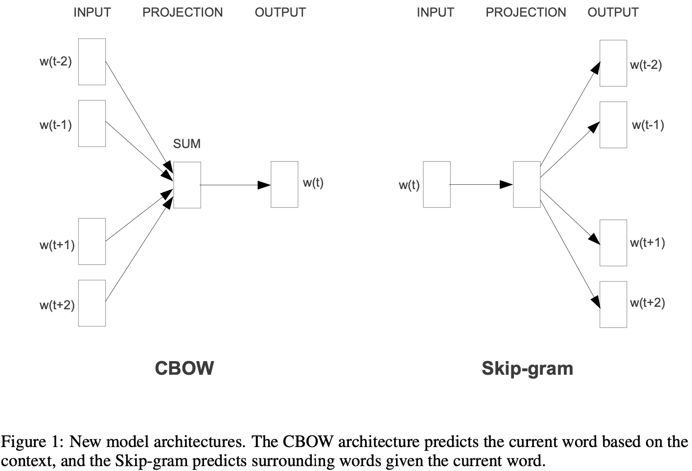
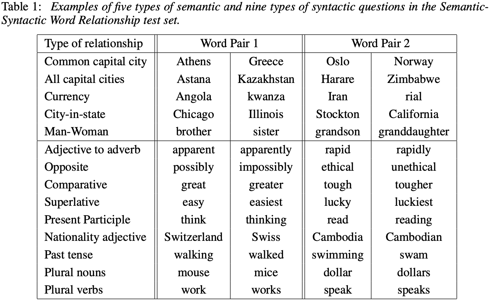
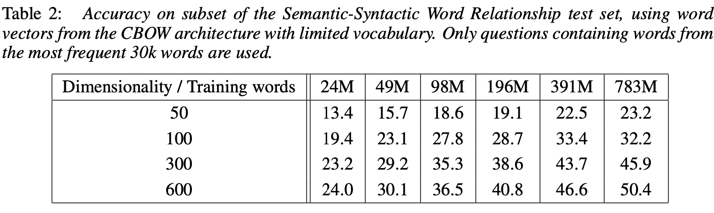
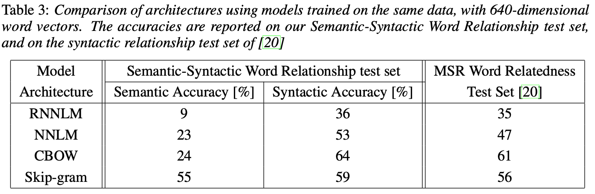
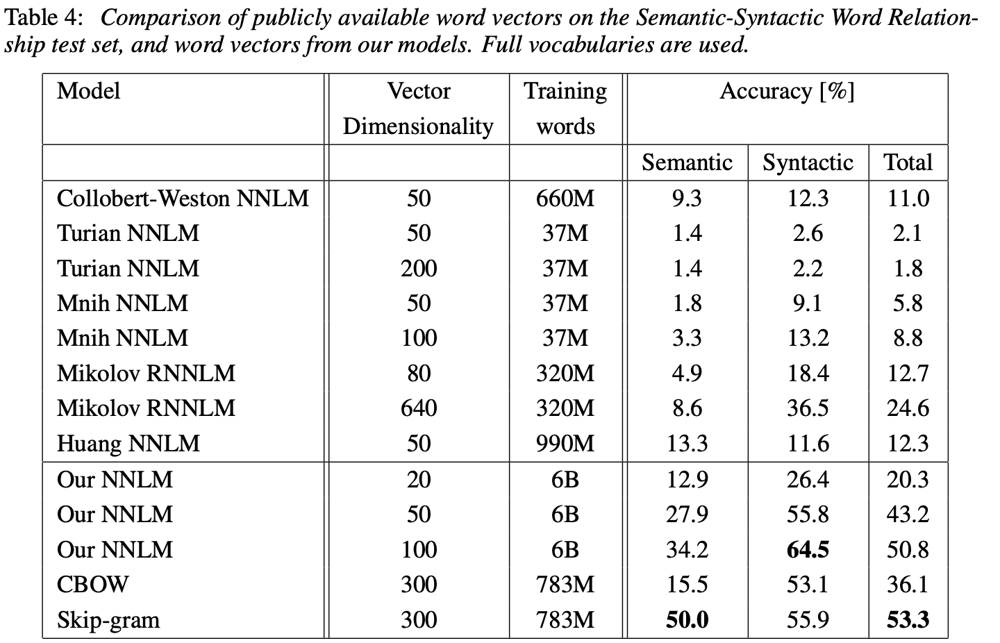
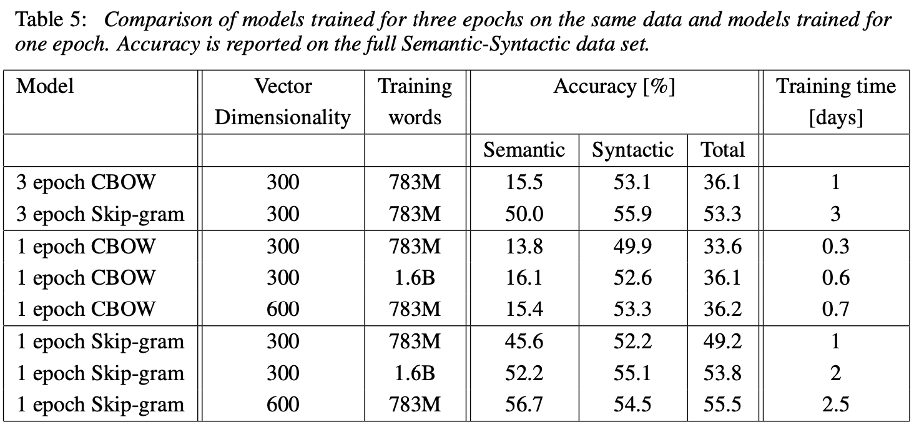
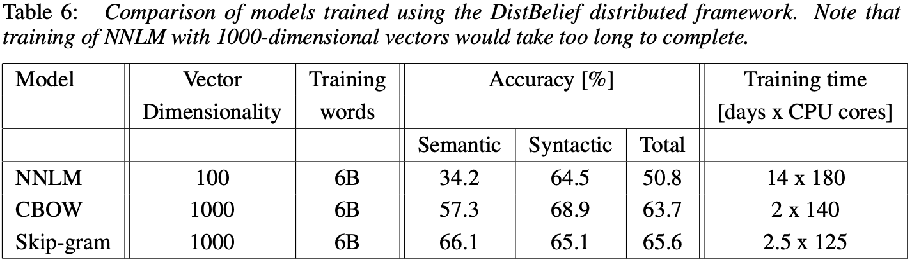
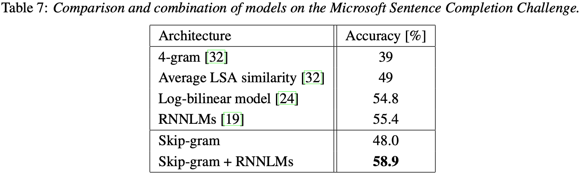
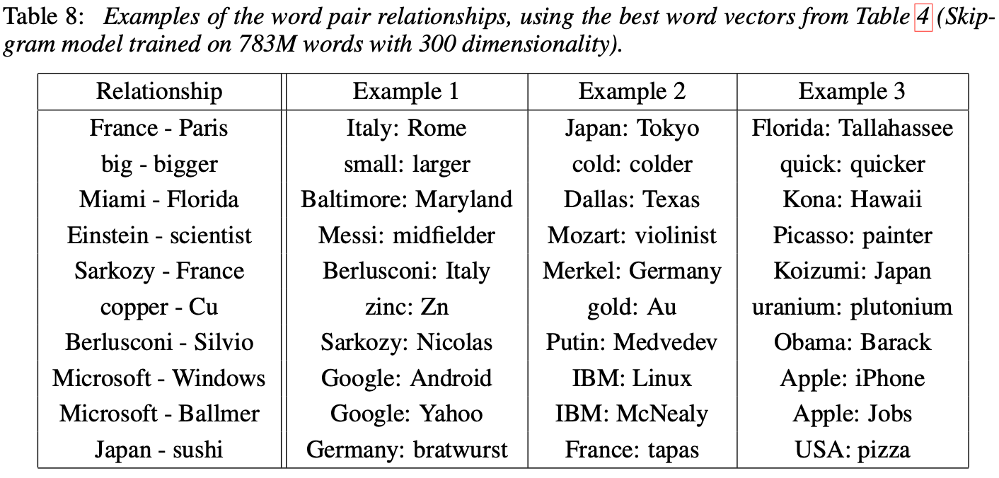

# Efficient Estimation of Word Representations in Vector Space

> Tomas Mikolov, Kai Chen, Greg Corrado, Jeffrey Dean | Google Inc.

本文提出了两种新颖的模型架构，用于从非常大的数据集**中计算词语的连续向量表示**。核心内容：

- 提出 CBOW（Continuous Bag-of-Words）和 Skip-gram 两种新模型架构
- 在**词语相似度任务**上验证了模型质量，结果优于此前基于神经网络的最佳技术
- 展示了这些向量在 句法 和 语义词语相似度 方面达到最先进性能

关键发现：

- 新模型在大幅降低计算成本的同时显著提高了准确性
- 从 16 亿词语数据集中学习高质量词向量所需时间 不到一天
- 词向量能够捕捉词语之间的线性规律，如 $\text{vector}(\text{King}) - \text{vector}(\text{Man}) + \text{vector}(\text{Woman}) \approx \text{vector}(\text{Queen})$

---

## 摘要

我们提出了两种新颖的模型架构，用于从非常大的数据集中计算词语的连续向量表示。这些表示的质量在词语相似度任务中进行衡量，并将结果与此前基于不同类型神经网络的最佳技术进行比较。我们观察到**在大幅降低计算成本的同时准确性显著提**高，即从 16 亿词语数据集中学习高质量词向量所需时间不到一天。此外，我们证明这些向量在我们的 句法和语义词语相似度 测试集上提供了最先进性能。

## 1. 引言

许多当前的 NLP 系统和技术将词语视为 **原子单元**——**词语之间没有相似性的概念，因为它们在词汇表中表示为索引**。这种选择有几个好的理由——简单性、鲁棒性以及在大量数据上训练的简单模型优于在较少数据上训练的复杂系统的观察。一个例子是用于统计语言建模的流行 N-gram 模型——如今，可以在几乎所有可用数据（数万亿词语 [3]）上训练 N-gram。

然而，简单技术在许多任务中已达到极限。例如，自动语音识别的相关领域数据量有限——性能通常由高质量转录语音数据的大小决定（通常只有数百万词语）。在机器翻译中，许多语言的现有语料库仅包含数十亿词语或更少。因此，在某些情况下，简单地扩展基本技术不会带来任何显著进步，我们必须**专注于更先进的技术**。

随着近年来机器学习技术的进步，在更大的数据集上训练更复杂的模型成为可能，并且它们通常优于简单模型。最成功的概念可能是使用词语的分布式表示 [10]。例如，**基于神经网络的语言模型显著优于 N-gram 模型** [1, 27, 17]。

### 1.1 本文目标

本文的主要目标是介绍可用于从包含 数十亿词语、词汇表中有 **数百万词语**的大型数据集学习高质量词向量的技术。据我们所知，此前提出的架构都没有在 **超过数亿词语的数据集** 上成功训练过，词向量的维度适中，在 **50-100 之间**。

我们使用最近提出的技术来衡量所得向量表示的质量，期望不仅相似的词语倾向于彼此接近，而且词语可以**具有多种相似程度** [20]。这在屈折语言的背景下早已被观察到——例如，名词可以有多种词尾，如果我们在原始向量空间的子空间中搜索相似词语，可以找到具有相似词尾的词语 [13, 14]。

有些令人惊讶的是，研究发现词语表示的相似性超越了简单的句法规律性。**使用词语偏移技术，对词向量进行简单的代数运算**，例如 $\text{vector}(\text{King}) - \text{vector}(\text{Man}) + \text{vector}(\text{Woman})$ 的结果最接近词语 Queen 的向量表示 [20]。

在本文中，我们通过开发保留**词语之间线性规律**的新模型架构来最大化这些向量运算的准确性。我们设计了一个新的综合测试集来衡量句法和语义规律性，并证明许多此类规律可以以高精度学习。此外，我们讨论了训练时间和准确性如何取决于词向量的维度和训练数据量。

### 1.2 先前工作

将词语表示为连续向量有着悠久的历史 [10, 26, 8]。一个非常流行的估计神经网络语言模型（NNLM，Neural Network Language Model）的架构在 [1] 中提出，其中使用具有 **线性投影层 和 非线性隐藏层**的前馈神经网络来**联合学习词向量表示和统计语言模型**。这项工作已被许多后续研究跟进。

NNLM 的另一个有趣架构在 [13, 14] 中提出，其中**词向量首先使用具有单个隐藏层的神经网络学习**。**然后将词向量用于训练 NNLM**。因此，**即使不构建完整的 NNLM 也可以学习词向量**。在本文中，我们直接扩展该架构，并专注于使用简单模型学习词向量的第一步。

后来的研究表明，词向量可以用于显著改进和简化许多 NLP 应用 [4, 5, 29]。词向量本身的估计使用不同的模型架构并在各种语料库上训练 [4, 29, 23, 19, 9]，一些所得的词向量已可用于未来研究和比较。然而，据我们所知，这些架构的训练计算成本显著高于 [13] 中提出的架构，除了使用对角权重矩阵的某些版本的对数双线性模型 [23]。

## 2. 模型架构

提出了许多不同类型的模型来估计词语的连续表示，包括著名的潜在语义分析（LSA，Latent Semantic Analysis）和潜在狄利克雷分配（LDA，Latent Dirichlet Allocation）。在本文中，我们**专注于由神经网络学习的词语分布式表示**，因为此前已证明它们在保持词语之间的线性规律性方面显著优于 LSA [20, 31]；此外，LDA 在大数据集上的计算成本非常高。

与 [18] 类似，为了比较不同的模型架构，我们首先**将模型的计算复杂度定义为完全训练模型需要访问的参数数量**。接下来，我们将尝试最大化准确性，同时最小化计算复杂度。

对于以下所有模型，训练复杂度与以下公式成比例：
$$
O = E \times T \times Q
\tag{1}
$$
其中 $E$ 是训练轮数，$T$ 是训练集中的词语数量，$Q$ 在每个模型架构中进一步定义。通常选择 $E = 3-50$，$T$ 最多为十亿。所有模型使用随机梯度下降和反向传播训练 [26]。

### 2.1 前馈神经网络语言模型（NNLM）

概率前馈神经网络语言模型在 [1] 中提出。它由输入层、投影层、隐藏层和输出层组成。在**输入层，$N$ 个先前词语使用 1-of-V 编码进行编码，其中 $V$ 是词汇表大小**。然后使用共享投影矩阵将输入层投影到**维度为 $N \times D$ 的投影层 $P$**。由于在任何给定时间只有 $N$ 个输入是活动的，投影层的组合是一个相对廉价的操作。

NNLM 架构在投影层和隐藏层之间的计算变得复杂，因为投影层中的值是密集的。对于常见的选择 $N = 10$，投影层 $(P)$ 的大小可能为 500 到 2000，而隐藏层大小 $H$ 通常为 500 到 1000 个单元。此外，隐藏层用于计算词汇表中所有词语的概率分布，导致输出层的维度为 $V$。因此，每个训练样本的计算复杂度为：
$$
Q = N \times D + N \times D \times H + H \times V
\tag{2}
$$
其中主导项是 $H \times V$。然而，已经提出了几种实用的解决方案来避免它；要么使用分层版本的 softmax [25, 23, 18]，要么通过在训练期间使用**未归一化的模型完全避免归一化模型** [4, 9]。使用词汇表的二叉树表示，需要评估的输出单元数量可以降至约 $\log_2(V)$。因此，大部分复杂度是由 $N \times D \times H$ 项引起的。

在我们的模型中，我们使用分层 softmax，其中词汇表表示为 Huffman 二叉树。这遵循了先前的观察，即词语频率在神经网络语言模型中用于获取类效果良好 [16]。Huffman 树为频繁词语分配短二进制代码，这进一步减少了需要评估的输出单元数量：平衡二叉树需要评估 $\log_2(V)$ 个输出，而基于 Huffman 树的分层 softmax 只需要约 $\log_2(\text{Unigram perplexity}(V))$ 个输出。例如，当词汇表大小为一百万词语时，这导致评估速度提高约两倍。虽然这对神经网络语言模型来说不是关键加速，因为计算瓶颈在 $N \times D \times H$ 项中，但我们将提出没有隐藏层的架构，因此严重依赖 softmax 归一化的效率。

### 2.2 循环神经网络语言模型（RNNLM）

基于循环神经网络的语言模型被提出以克服前馈 NNLM 的某些局限性，例如需要指定上下文长度（模型的阶数 $N$），以及理论上 RNN 可以比浅层神经网络更有效地表示更复杂的模式 [15, 2]。RNN 模型没有投影层；只有输入层、隐藏层和输出层。这种模型的特殊之处在于将隐藏层连接到自身的循环矩阵，使用延迟连接。这允许循环模型形成某种短期记忆，因为来自过去的信息可以由隐藏层状态表示，该状态根据当前输入和上一时间步的隐藏层状态进行更新。

RNN 模型每个训练样本的复杂度为：
$$
Q = H \times H + H \times V
\tag{3}
$$
其中词向量表示 $D$ 与隐藏层 $H$ 具有相同的维度。同样，$H \times V$ 项可以通过使用分层 softmax 有效地减少到 $H \times \log_2(V)$。因此，大部分复杂度来自 $H \times H$。

### 2.3 神经网络的并行训练

为了在大型数据集上训练模型，我们在名为 DistBelief [6] 的大规模分布式框架上实现了几个模型，包括前馈 NNLM 和本文提出的新模型。**该框架允许我们并行运行同一模型的多个副本，每个副本通过集中式服务器同步其梯度更新，该服务器保存所有参数**。对于这种并行训练，我们使用具有**自适应学习率过程**（称为 Adagrad [7]）的小批量异步梯度下降。在此框架下，通常使用一百个或更多模型副本，每个副本在数据中心的不同机器上使用许多 CPU 核心。

## 3. 新的对数线性模型

在本节中，我们提出了两种新的模型架构来学习词语的分布式表示，试图**最小化计算复杂度**。上一节的主要观察是，模型中的大部分复杂度是由**非线性隐藏层引起的**。虽然这正是神经网络如此吸引人的原因，但我们**决定探索更简单的模型**，这些模型可能无法像神经网络那样精确地表示数据，但可以**更有效地在更多数据上训练**。

新架构直接遵循我们早期工作 [13, 14] 中提出的架构，其中发现神经网络语言模型可以成功地分**两步训练**：**首先，使用简单模型学习连续词向量，然后在这些词语的分布式表示之上训练 N-gram NNLM**。虽然后来有大量工作专注于学习词向量，但我们认为 [13] 中提出的方法是最简单的。请注意，相关的模型也早在 [26, 8] 中提出。

### 3.1 连续词袋模型（CBOW）

第一个提出的架构类似于前馈 NNLM，其中**移除了非线性隐藏层**，并且**投影层在所有词语之间共享（不仅仅是投影矩阵）**；因此，所有词语都投影到相同的位置（**它们的向量被平均**）。我们称这种架构为词袋模型，因为历史中词语的顺序不影响投影。

此外，我们还使用来自未来的词语；我们通过构建一个对数线性分类器，在输入中使用**四个未来词语和四个历史词语**，在下一节介绍的任务上获得了最佳性能，其中训练标准是正确分类当前（中间）词语。训练复杂度为：
$$
Q = N \times D + D \times \log_2(V)
\tag{4}
$$
我们将此模型进一步表示为 CBOW，因为与标准词袋模型不同，它使用上下文的连续分布式表示。模型架构如图 1 所示。请注意，输入层和投影层之间的权重矩阵在 NNLM 中以相同的方式在所有词语位置之间共享。

> [!NOTE]
>
> CBOW样本：一条样本，输入多个词，输出一个词。一个滑动窗口对应一条样本。多个输入的emb通过平均池化再经过线性层。

### 3.2 连续 Skip-gram 模型

第二个架构类似于 CBOW，但它**不是基于上下文预测当前词语**，而是**试图最大化基于同一句子中另一个词语对一个词语的分类**。更准确地说，我们使用每个当前词语作为具有连续投影层的对数线性分类器的输入，并**预测当前词语前后一定范围内的词语**。我们发现增加范围可以提高所得词向量的质量，但它也增加了计算复杂度。由于较远的词语通常与当前词语的相关性较小，我们通过在训练示例中对这些词语**进行较少采样来给予较远词语较少的权重**。

该架构的训练复杂度与以下公式成比例：
$$
Q = C \times (D + D \times \log_2(V))
\tag{5}
$$
**其中 $C$ 是词语的最大距离**。因此，如果我们选择 $C = 5$，对于每个训练词语，我们将随机选择一个范围 $<1; C>$ 中的数字 $R$，然后使用来自**历史的 $R$ 个词语 和 来自当前词语未来的 $R$ 个词语作为正确标签**。这将要求我们**进行 $R \times 2$ 次词语分**类，以当前词语作为输入，$R + R$ 个词语中的每一个作为输出。在以下实验中，我们使用 $C = 10$。

图 1：新模型架构。CBOW 架构基于上下文预测当前词语，Skip-gram 给定当前词语预测周围词语。

> [!NOTE]
>
> **简单说**：Skip-gram 用动态窗口，让离中心词近的词有更多机会被训练，远的词被采样的概率更低，这样更高效也更合理。

## 4. 结果

为了比较不同版本词向量的质量，先前的论文通常使用表格**显示示例词语及其最相似的词语**，并直观地理解它们。虽然很容易证明词语 France 与 Italy 相似，也许还有其他一些国家，但在更复杂的相似度任务中测试这些向量则更具挑战性，如下所示。我们遵循先前的观察，即词语之间可能存在许多不同类型的相似性，例如，词语 big 与 bigger 在相同意义上与 small 与 smaller 相似。另一种关系类型的例子是词语对 big-biggest 和 small-smallest [20]。我们进一步将两对具有相同关系的词语表示为一个问题，因为我们可以问："什么词语与 small 在相同意义上与 biggest 与 big 相似？"

有些令人惊讶的是，这些**问题可以通过对词语的向量表示进行简单的代数运算来回答**。要找到与 small 在相同意义上与 biggest 与 big 相似的词语，我们只需计算向量 $X = \text{vector}(\text{biggest}) - \text{vector}(\text{big}) + \text{vector}(\text{small})$。然后，我们在向量空间中搜索与 $X$ 余弦距离最近的词语，并将其作为问题的答案（在此搜索中我们丢弃输入问题词语）。当词向量训练良好时，可以使用此方法找到正确答案（词语 smallest）。

最后，我们**发现当我们在大量数据上训练高维词向量时，所得向量可用于回答词语之间非常细微的语义关系**，例如城市及其所属国家，例如 France 与 Paris 的关系如同 Germany 与 Berlin 的关系。具有此类语义关系的词向量可用于改进许多现有的 NLP 应用，例如机器翻译、信息检索和问答系统，并可能启用其他尚未发明的未来应用。

### 4.1 任务描述

为了衡量词向量的质量，我们定义了一个综合测试集，包含 **五种类型的语义问题** 和 **九种类型的句法问题**。每个类别的两个示例如表 1 所示。总体而言，有 8869 个语义问题和 10675 个句法问题。每个类别中的问题分两步创建：首先，手动创建相似词语对列表。然后，通过连接两个词语对形成大量问题列表。例如，我们制作了 68 个美国大城市及其所属州的列表，并通过随机选择两个词语对形成约 2500 个问题。我们的测试集中仅包含单标记词语，因此不存在多词实体（如 New York）。

我们评估所有问题类型的总体准确性以及每种问题类型（语义、句法）的准确性。只有使用上述方法计算的向量最接近的词语与问题中的正确词语完全相同时，才认为问题回答正确；同义词因此被视为错误。这也意味着达到 100% 的准确性可能是不可能的，因为当前模型没有任何关于词语形态的输入信息。然而，我们相信词向量对于某些应用的有用性应该与该准确性指标正相关。通过结合关于词语结构的信息可以取得进一步进展，特别是对于句法问题。

表 1：语义-句法词语关系测试集中五种语义和九种句法问题的示例。

### 4.2 准确性最大化

我们使用 **Google 新闻语料库训练 词向量**。该语料库包含约 60 亿标记。我们**将词汇表大小限制为最频繁的 100 万个词语**。显然，我们面临着时间受限的优化问题，因为可以预期使用 更多数据 和 更高维度的词向量 都会提高准确性。**为了估计获得尽可能好结果的最佳模型架构选择**，我们首先评估在**训练数据子集上训练的模型**，词汇表限制为**最频繁的 3 万个词语**。

使用 CBOW 架构、不同词向量维度选择 和 增加训练数据量的结果如表 2 所示。可以看出，在某个点之后，添加更多维度或添加更多训练数据带来的**改进递减**。因此，我们**必须同时增加向量维度和训练数据量**。虽然这种观察可能看起来微不足道，但必须注意，目前流行在相对大量的数据上训练词向量，但维度不足（如 50-100）。给定公式 (4)，将训练数据量增加一倍导致的计算复杂度增加与将向量大小增加一倍大致相同。

表 2：使用有限词汇表的 CBOW 架构词向量在语义-句法词语关系**测试集子集上**的准确性。仅使用包含最频繁 30k 词语的问题。

对于表 2 和表 4 中报告的实验，我们使用随机梯度下降和反向传播进行三个训练轮次。我们选择**起始学习率 0.025 并线性递减**，使其在最后一个训练轮次结束时趋近于零。

### 4.3 模型架构比较

首先，我们比较使用相同训练数据 和 相同词向量维度 640 的不同模型架构。在进一步实验中，我们在新的语义-句法词语关系测试集中使用完整的问题集，即不限制于 30k 词汇表。我们还包括在 [20] 中引入的专注于词语之间句法相似性的测试集上的结果。

训练数据由**几个 LDC 语料库组成**，在 [18] 中有详细描述（3.2 亿词语，82K 词汇表）。我们使用这些数据与先前训练的循环神经网络语言模型进行比较，该模型**在单个 CPU 上**训练了大约 8 周。我们使用 DistBelief 并行训练 [6] 训练了具有相同数量 640 个隐藏单元的前馈 NNLM，使用 8 个先前词语的历史（因此，NNLM 比 RNNLM 具有更多的参数，因为投影层大小为 $640 \times 8$）。

在表 3 中可以看出，来自 RNN 的词向量（如 [20] 中所用）主要在句法问题上表现良好。NNLM 向量的表现显著优于 RNN——这并不奇怪，因为 RNNLM 中的词向量直接连接到非线性隐藏层。CBOW 架构在句法任务上优于 NNLM，在语义任务上大致相同。最后，Skip-gram 架构在句法任务上略逊于 CBOW 模型（但仍优于 NNLM），在测试的语义部分远优于所有其他模型。

表 3：使用相同数据训练的模型比较，词向量维度为 640。准确性在我们的语义-句法词语关系测试集和 [20] 的句法关系测试集上报告。

接下来，我们评估**仅使用一个 CPU** 训练的模型，并将结果与公开可用的词向量进行比较。比较如表 4 所示。**CBOW 模型在大约一天内训练了 Google 新闻数据的子集，而 Skip-gram 模型的训练时间大约为三天。**

表 4：公开可用词向量与我们模型的词向量在语义-句法词语关系测试集上的比较。使用完整词汇表。

对于进一步报告的实验，我们仅使用一个训练轮次（同样，我们**线性递减学习率**，使其**在训练结束时趋近于零**）。**在两倍多数据上使用一个轮次训练模型 与 在相同数据上迭代三个轮次相比，提供相当或更好的结果**，如表 5 所示，并提供额外的小幅加速。

表 5：在相同数据上训练三个轮次的模型 与 训练一个轮次的模型的比较。准确性在完整的语义-句法数据集上报告。

### 4.4 模型的大规模并行训练

如前所述，我们在名为 DistBelief 的分布式框架上实现了各种模型。下面我们报告在 **Google 新闻 6B 数据集**上训练的几个模型的结果，使用**小批量异步梯度下降**和称为 Adagrad [7] 的自适应学习率过程。我们在训练期间使用 50 到 100 个模型副本。CPU 核心数量是估计值，因为数据中心机器与其他生产任务共享，使用情况可能波动很大。请注意，由于分布式框架的开销，CBOW 模型和 Skip-gram 模型的 CPU 使用率 比其单机实现 更接近。结果报告在表 6 中。

表 6：使用 DistBelief 分布式框架训练的模型比较。请注意，使用 1000 维向量训练 NNLM 将耗时过长无法完成。

### 4.5 微软研究院句子完成挑战

微软句子完成挑战最近被引入作为推进语言建模和其他 NLP 技术的任务 [32]。该任务包含 1040 个句子，**每个句子中缺少一个词语**，目标是**从五个合理选项列表中选择与句子其余部分最连贯的词语**。已经报告了该集合上几种技术的性能，包括 N-gram 模型、基于 LSA 的模型 [32]、对数双线性模型 [24] 以及目前在该基准上保持最先进性能 55.4% 准确率的循环神经网络组合 [19]。

我们探索了 Skip-gram 架构在此任务上的性能。首先，我们在 [32] 提供的 5000 万词语上训练 640 维模型。然后，**我们通过在输入中使用未知词语并预测句子中所有周围词语来计算测试集中每个句子的分数。最终句子分数是这些单独预测的总和。**使用句子分数，我们选择最可能的句子。

一些先前结果与新结果的简要总结如表 7 所示。虽然 Skip-gram 模型本身在此任务上的表现不如 LSA 相似度，但**该模型的分数与 RNNLMs 获得的分数互补**，**加权组合**导致新的最先进结果 58.9% 准确率（开发集部分 59.2%，测试集部分 58.7%）。

表 7：微软句子完成挑战上模型的比较和组合。

## 5. 学习到的关系示例

表 8 显示了遵循各种关系的词语。我们遵循上述方法：**关系由两个词向量相减定义，结果加到另一个词语上**。因此例如，Paris - France + Italy = Rome。如表所示，准确性相当好，尽管显然还有很多改进空间（请注意，使用我们的准确性指标假设**精确匹配**，表 8 中的结果只会得到约 60% 的分数）。我们相信，**在更大数据集上以更大维度训练的词向量将表现显著更好，并能够开发新的创新应用**。提高准确性的另一种方法是**提供多个关系示例**。通过**使用十个示例而不是一个来形成关系向量（我们将各个向量平均在一起）**，我们观察到最佳模型在语义-句法测试上的准确性绝对提高了约 10%。

向量运算也可用于解决不同的任务。例如，我们观察到通过计算词语列表的平均向量并找到最远的词向量来选择列表外词语的准确性良好。这是某些人类智能测试中流行的问题类型。显然，使用这些技术还有很多发现要做。

表 8：词语对关系示例，使用表 4 中的最佳词向量（在 783M 词语上训练的 Skip-gram 模型，维度为 300）。

## 6. 结论

在本文中，我们研究了各种模型在一系列 句法和语义语言任务 上得出的词语向量表示的质量。我们观察到，与流行的神经网络模型（前馈和循环）相比，可以**使用非常简单的模型架构训练高质量的词向量**。由于计算复杂度低得多，可以从更大的数据集计算非常准确的高维词向量。使用 DistBelief 分布式框架，应该可以在包含一万亿词语的语料库上训练 CBOW 和 Skip-gram 模型，词汇表大小基本不受限制。这比先前发布的类似模型的最佳结果大几个数量级。

词向量最近被证明显著优于先前最先进水平的一个有趣任务是 SemEval-2012 Task 2 [11]。公开可用的 RNN 向量与其他技术一起使用，在 Spearman 秩相关性上比先前最佳结果提高了 50% 以上 [31]。**基于神经网络的词向量先前已应用于许多其他 NLP 任务，例如情感分析 [12] 和释义检测 [28]。可以预期这些应用可以从本文描述的模型架构中受益。**

我们正在进行的工作表明，词向量可以成功应用于知识库中事实的自动扩展，以及验证现有事实的正确性。机器翻译实验的结果看起来也非常有前途。在未来，将我们的技术与潜在关系分析 [30] 等其他技术进行比较也将很有趣。我们相信，我们的综合测试集将帮助研究社区改进现有的词向量估计技术。我们还**期望高质量词向量将成为未来 NLP 应用的重要构建块**。

## 7. 后续工作

在本文的初始版本撰写之后，我们发布了用于**计算词向量的单机多线程 C++ 代码**，使用连续词袋和 skip-gram 两种架构。训练速度显著高于本文早期报告的速度，即对于典型的超参数选择，每小时可处理数十亿词语。我们还发布了超过 140 万个**表示命名实体的向量**，在超过 1000 亿词语上训练。我们的一些后续工作将在即将发表的 NIPS 2013 论文 [21] 中发表。

## 参考文献

[1] Y. Bengio, R. Ducharme, P. Vincent. A neural probabilistic language model. Journal of Machine Learning Research, 3:1137-1155, 2003.

[2] Y. Bengio, Y. LeCun. Scaling learning algorithms towards AI. In: Large-Scale Kernel Machines, MIT Press, 2007.

[3] T. Brants, A. C. Popat, P. Xu, F. J. Och, and J. Dean. Large language models in machine translation. In Proceedings of the Joint Conference on Empirical Methods in Natural Language Processing and Computational Language Learning, 2007.

[4] R. Collobert and J. Weston. A Unified Architecture for Natural Language Processing: Deep Neural Networks with Multitask Learning. In International Conference on Machine Learning, ICML, 2008.

[5] R. Collobert, J. Weston, L. Bottou, M. Karlen, K. Kavukcuoglu and P. Kuksa. Natural Language Processing (Almost) from Scratch. Journal of Machine Learning Research, 12:2493-2537, 2011.

[6] J. Dean, G.S. Corrado, R. Monga, K. Chen, M. Devin, Q.V. Le, M.Z. Mao, M.A. Ranzato, A. Senior, P. Tucker, K. Yang, A. Y. Ng., Large Scale Distributed Deep Networks, NIPS, 2012.

[7] J.C. Duchi, E. Hazan, and Y. Singer. Adaptive subgradient methods for online learning and stochastic optimization. Journal of Machine Learning Research, 2011.

[8] J. Elman. Finding Structure in Time. Cognitive Science, 14, 179-211, 1990.

[9] Eric H. Huang, R. Socher, C. D. Manning and Andrew Y. Ng. Improving Word Representations via Global Context and Multiple Word Prototypes. In: Proc. Association for Computational Linguistics, 2012.

[10] G.E. Hinton, J.L. McClelland, D.E. Rumelhart. **Distributed representations. In: Parallel distributed processing: Explorations in the microstructure of cognition**. Volume 1: Foundations, MIT Press, 1986.

[11] D.A. Jurgens, S.M. Mohammad, P.D. Turney, K.J. Holyoak. Semeval-2012 task 2: Measuring degrees of relational similarity. In: Proceedings of the 6th International Workshop on Semantic Evaluation (SemEval 2012), 2012.

[12] A.L. Maas, R.E. Daly, P.T. Pham, D. Huang, A.Y. Ng, and C. Potts. Learning word vectors for sentiment analysis. In Proceedings of ACL, 2011.

[13] T. Mikolov. **Language Modeling for Speech Recognition in Czech**, Masters thesis, Brno University of Technology, 2007.

[14] T. Mikolov, J. Kopecký, L. Burget, O. Glembek and J. Černocký. Neural network based language models for higly inflective languages, In: Proc. ICASSP 2009.

[15] T. Mikolov, M. Karafiát, L. Burget, J. Černocký, S. Khudanpur. Recurrent neural network based language model, In: Proceedings of Interspeech, 2010.

[16] T. Mikolov, S. Kombrink, L. Burget, J. Černocký, S. Khudanpur. Extensions of recurrent neural network language model, In: Proceedings of ICASSP 2011.

[17] T. Mikolov, A. Deoras, S. Kombrink, L. Burget, J. Černocký. Empirical Evaluation and Combination of Advanced Language Modeling Techniques, In: Proceedings of Interspeech, 2011.

[18] T. Mikolov, A. Deoras, D. Povey, L. Burget, J. Černocký. Strategies for Training Large Scale Neural Network Language Models, In: Proc. Automatic Speech Recognition and Understanding, 2011.

[19] T. Mikolov**. Statistical Language Models based on Neural Networks**. PhD thesis, Brno University of Technology, 2012.

[20] T. Mikolov, W.T. Yih, G. Zweig. **Linguistic Regularities in Continuous Space Word Representations**. NAACL HLT 2013.

[21] T. Mikolov, I. Sutskever, K. Chen, G. Corrado, and J. Dean. **Distributed Representations of Words and Phrases and their Compositionality**. Accepted to NIPS 2013.

[22] A. Mnih, G. Hinton. Three new graphical models for statistical language modelling. ICML, 2007.

[23] A. Mnih, G. Hinton. A Scalable Hierarchical Distributed Language Model. Advances in Neural Information Processing Systems 21, MIT Press, 2009.

[24] A. Mnih, Y.W. Teh. A fast and simple algorithm for training neural probabilistic language models. ICML, 2012.

[25] F. Morin, Y. Bengio. Hierarchical Probabilistic Neural Network Language Model. AISTATS, 2005.

[26] D. E. Rumelhart, G. E. Hinton, R. J. Williams. Learning internal representations by backpropagating errors. Nature, 323:533.536, 1986.

[27] H. Schwenk. Continuous space language models. Computer Speech and Language, vol. 21, 2007.

[28] R. Socher, E.H. Huang, J. Pennington, A.Y. Ng, and C.D. Manning. Dynamic Pooling and Unfolding Recursive Autoencoders for Paraphrase Detection. In NIPS, 2011.

[29] J. Turian, L. Ratinov, Y. Bengio. Word Representations: A Simple and General Method for Semi-Supervised Learning. In: Proc. Association for Computational Linguistics, 2010.

[30] P. D. Turney. Measuring Semantic Similarity by Latent Relational Analysis. In: Proc. International Joint Conference on Artificial Intelligence, 2005.

[31] A. Zhila, W.T. Yih, C. Meek, G. Zweig, T. Mikolov. Combining Heterogeneous Models for Measuring Relational Similarity. NAACL HLT 2013.

[32] G. Zweig, C.J.C. Burges. The Microsoft Research Sentence Completion Challenge, Microsoft Research Technical Report MSR-TR-2011-129, 2011.
