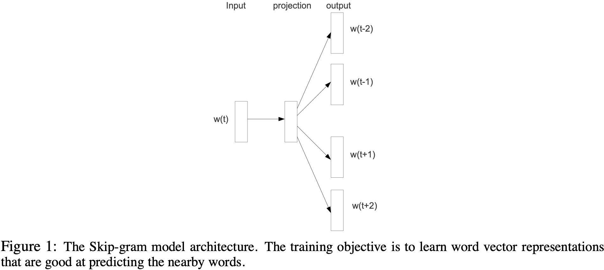
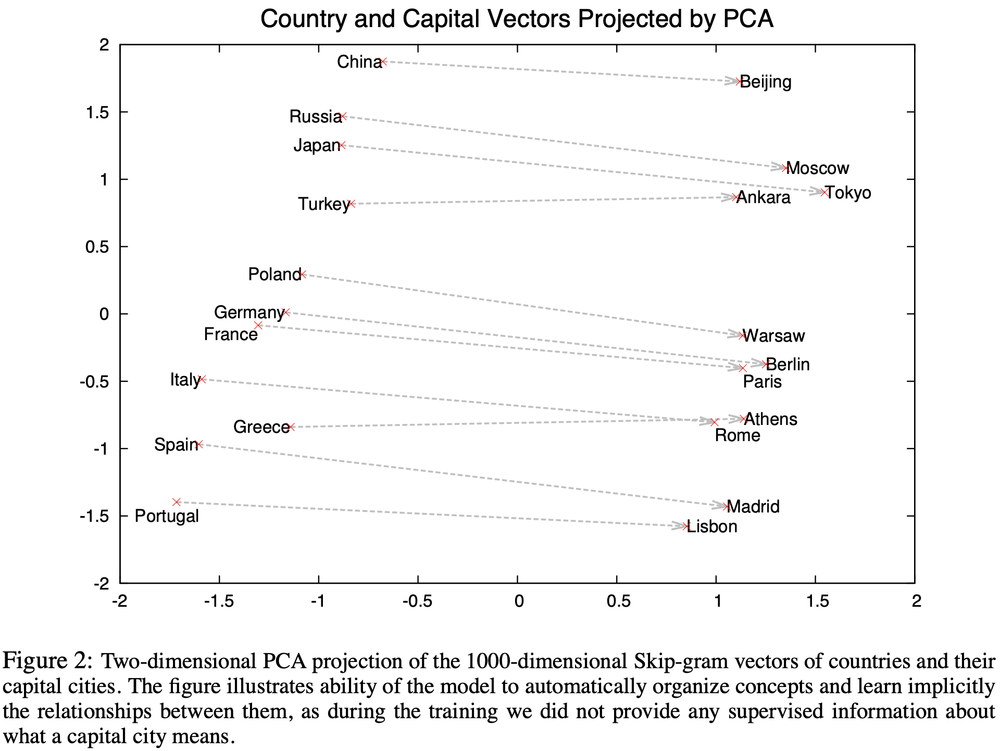
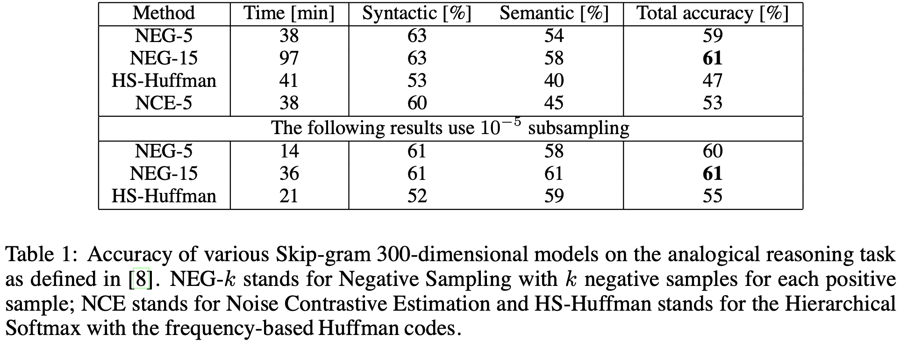
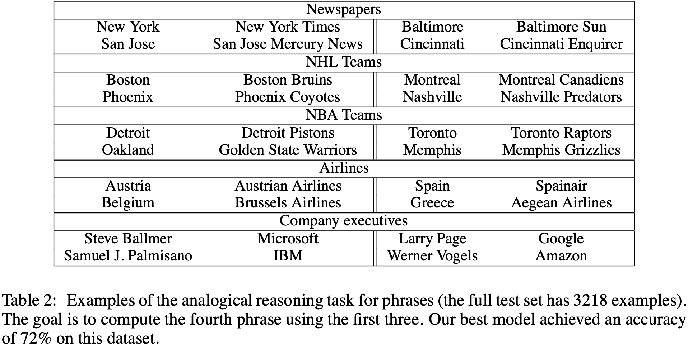
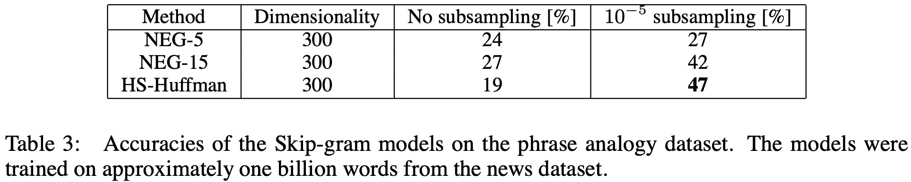
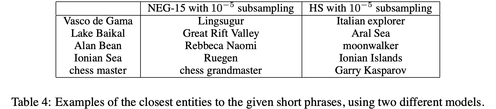
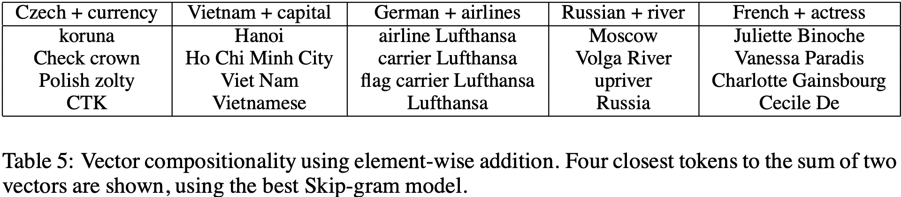
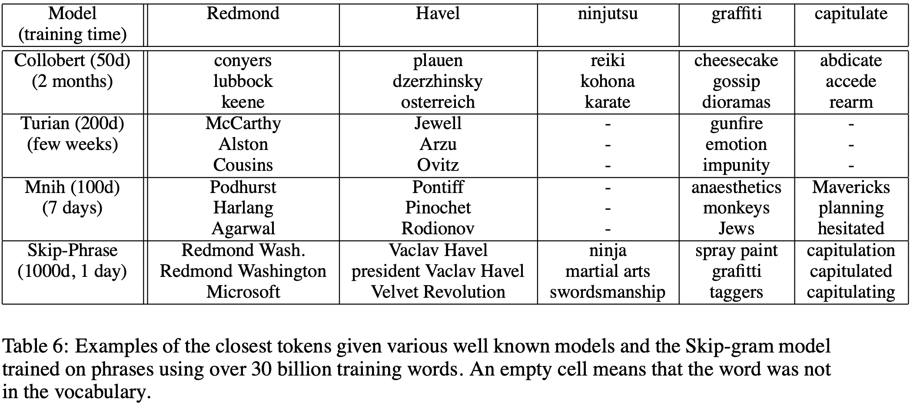

# 词和短语的分布式表示及其组合性

> Tomas Mikolov, Ilya Sutskever, Kai Chen, Greg Corrado, Jeffrey Dean | Google Inc.

本文介绍了 word2vec 的 Skip-gram 模型及其扩展。核心内容：

- **高频词子采样**：对高频词按概率 $P(w_i) = 1 - \sqrt{\frac{t}{f(w_i)}}$ 进行子采样，显著加速训练并学习更规则的词表示
- 负采样：提出一种简单替代分层 softmax 的方法，通过**从噪声分布中采样负样本**进行训练，效果与分层 softmax 相当但更简单高效
- 短语学习：提出基于**点互信息**（PMI，Pointwise Mutual Information）的简单方法识别文本中的短语，为 数百万短语 学习**高质量向量表示**
- 训练规模：优化的单机实现可在一天内训练超过 1000 亿个词，在约 300 亿词的 Google News 语料上训练了 300 维向量

关键发现：

- 负采样与分层 softmax 效果相当：在大规模数据上，负采样（每个正样本 **5-20 个负样本**）与分层 softmax 性能接近，但计算更简单
- 子采样带来显著加速和质量提升：子采样在大规模数据集上比无子采样**快 2-10 倍**，并略微提升了准确率
- Skip-gram 模型在 类比任务 上显著优于其他模型：在词类比任务上，300 维 Skip-gram 模型的语义类比准确率达到 62%，远超循环神经网络语言模型（RNNLM，Recurrent Neural Network Language Model）（11%）和分层Softmax（HSM，Hierarchical Softmax）（9%）
- 短语向量可捕获复杂语义关系：例如 "Microsoft" - "Windows" + "Glass" $\approx$ "Stained glass"，展示了向量的可组合性

---

## 摘要

近期提出的连续Skip-gram模型是一种学习高质量分布式向量表示的高效方法，这些向量能够捕获大量**精确的句法和语义词关系**。本文提出了若干扩展，同时**改进了向量质量和训练速度**。通过对高频词进行子采样，我们获得了显著的加速效果，并学习了更规则的词表示。我们还描述了一种称为 **负采样的简单替代分层softmax的方法**。

词向量的学习方法及其广泛比较详见综述 [18]。词表示的一个固有限制是其 **对词序的不敏感性** 以及 **无法表示习语性短语**。例如，"Canada"和"Air"的含义无法简单组合得到"Air Canada"。受此例启发，我们提出了一种在文本中查找短语的简单方法，并表明为数百万个短语学习良好的向量表示是可行的。

## 关键词

Word2vec, Skip-gram, Negative Sampling, **Subsampling**, Phrase Learning, **Distributed Representations**

## 1 引言

向量空间中词的分布式表示通过将相似词分组，帮助学习算法在自然语言处理任务中取得更好性能。词表示的最早使用可追溯到1986年，由Rumelhart、Hinton和Williams提出[13]。此后，这一思想被成功应用于统计语言建模[1]。后续工作包括应用于自动语音识别和机器翻译[14, 7]，以及广泛的NLP任务[2, 20, 15, 3, 18, 19, 9]。

最近，Mikolov等人[8]引入了Skip-gram模型，这是一种**从大量非结构化文本数据中学习高质量词向量表示的高效方法**。与大多数先前用于学习词向量的神经网络架构 [6]不同，Skip-gram模型（见图1）的训练**不涉及稠密矩阵乘法**。这使得训练极为高效：一个优化的单机实现可以在一天内训练超过1000亿个词。

使用神经网络计算的词表示非常有趣，因为**学习到的向量显式编码了许多语言规律和模式**。有些令人惊讶的是，许多这些模式可以表示为**线性平移**。例如，向量计算 $\text{vec}(\text{Madrid}) - \text{vec}(\text{Spain}) + \text{vec}(\text{France})$ 的结果比任何其他词向量都更接近 $\text{vec}(\text{Paris})$ [9, 8]。

**图1: Skip-gram模型架构。** 训练目标是学习能够**很好预测附近词的词向量表示**。

在本文中，我们提出了原始Skip-gram模型的若干扩展。我们表明，在训练期间对高频词进行子采样可以显著加速（约2倍-10倍），并提高低频词表示的准确性。此外，我们提出了一种用于训练Skip-gram模型的噪声对比估计（NCE）[4]的简化变体，与先前工作中使用的更复杂的分层softmax相比，该变体导致更快的训练和更好的高频词向量表示[8]。

**词表示受限于其无法表示 非单个词简单组合的习语性短语**。例如，"Boston Globe"是一份报纸，因此它不是"Boston"和"Globe"含义的自然组合。因此，**使用 向量表示整个短语 使Skip-gram模型具有更强的表达力**。**其他旨在通过组合词向量来表示句子含义的技术，如递归自编码器[15]，也将从使用短语向量而非词向量中受益。**

从 基于词 的模型扩展到 基于短语的 模型相对简单。首先，我们 **使用数据驱动方法识别大量短语**，然后在训练期间将短语视为单个token。为了评估短语向量的质量，我们开发了一个包含词和短语的 **类比推理任务测试集**。我们测试集中的一个典型类比对是"Montreal":"Montreal Canadiens"::"Toronto":"Toronto Maple Leafs"。如果 $\text{vec}(\text{Montreal Canadiens}) - \text{vec}(\text{Montreal}) + \text{vec}(\text{Toronto})$ 的最近表示是 $\text{vec}(\text{Toronto Maple Leafs})$ ，则认为回答正确。

最后，我们描述了Skip-gram模型的另一个有趣性质。我们发现**简单的向量加法通常能产生有意义的结果**。例如， $\text{vec}(\text{Russia}) + \text{vec}(\text{river})$ 接近 $\text{vec}(\text{Volga River})$ ， $\text{vec}(\text{Germany}) + \text{vec}(\text{capital})$ 接近 $\text{vec}(\text{Berlin})$ 。这种组合性表明，通过对词向量表示使用基本数学运算，可以获得**一定程度的非显而易见的语言理解**。

## 2 Skip-gram模型

Skip-gram模型的训练目标**是找到对预测句子或文档中周围词 有用的词表示**。更正式地说，给定训练词序列 $w_1, w_2, w_3, \ldots, w_T$ ，Skip-gram模型的目标是最大化**平均对数概率**

$$
\frac{1}{T} \sum_{t=1}^{T} \sum_{-c \leq j \leq c, j \neq 0} \log p(w_{t+j}|w_t) \qquad (1)
$$

其中 $c$ 是训练上下文的大小（可以是中心词 $w_t$ 的函数）。较大的 $c$ 会导致更多的训练样本，从而可能带来更高的准确性，但以训练时间为代价。基本的Skip-gram公式使用softmax函数定义 $p(w_{t+j}|w_t)$ ：

$$
p(w_O|w_I) = \frac{\exp\left({{v'}^\top_{w_O} \cdot v_{w_I}}\right)}{\sum_{w=1}^{W} \exp\left({{v'}^\top_{w} \cdot v_{w_I}}\right)} \qquad (2)
$$

其中 $v_w$ 和 $v'_w$ 分别是 $w$ 的"输入"和"输出"向量表示， $W$ 是词汇表中的词数。由于计算 $\nabla \log p(w_O|w_I)$ 的成本与 $W$ 成正比（通常很大，为 $10^5$ - $10^7$ 项），该**公式不实用**。

### 2.1 分层Softmax

全softmax的一种计算高效近似是分层softmax。在神经网络语言模型的背景下，它由Morin和Bengio首次引入[12]。主要优点是，无需评估神经网络中的 $W$ 个输出节点来获得概率分布，只需要评估约 $\log_2(W)$ 个节点。

**分层softmax使用输出层的二叉树表示**，以 $W$ 个词作为叶子节点，并为每个节点显式表示其子节点的相对概率。这些定义了一个为词分配概率的随机游走。

###### 更精确地说，每个词 $w$ 可以通过从树根出发的适当路径到达。设 $n(w, j)$ 为从根到 $w$ 的路径上的第 $j$ 个节点， $L(w)$ 为该路径的长度，因此 $n(w, 1) = \text{root}$ 且 $n(w, L(w)) = w$ 。此外，对于任何内部节点 $n$ ，设 $\text{ch}(n)$ 为 $n$ 的任意固定子节点， $[[x]]$ 在 $x$ 为真时为1，否则为-1。则分层softmax定义 $p(w_O|w_I)$ 如下：

$$
p(w|w_I) = \prod_{j=1}^{L(w)-1} \sigma\left([[n(w, j+1) = \text{ch}(n(w, j))]] \cdot {v'}^\top_{n(w,j)} \cdot v_{w_I}\right) \qquad (3)
$$

其中 $\sigma(x) = 1/(1 + \exp(-x))$ 。可以验证 $\sum_{w=1}^{W} p(w|w_I) = 1$ 。这意味着计算 $\log p(w_O|w_I)$ 和 $\nabla \log p(w_O|w_I)$ 的成本与 $L(w_O)$ 成正比，平均不超过 $\log W$ 。此外，与为标准softmax Skip-gram公式中的每个词 $w$ 分配两个表示 $v_w$ 和 $v'_w$ 不同，分层softmax公式为每个词 $w$ 分配一个表示 $v_w$ ，为二叉树的每个内部节点 $n$ 分配一个表示 $v'_n$ 。

分层softmax使用的树结构对性能有显著影响。Mnih和Hinton探索了构建树结构的多种方法及其对训练时间和最终模型准确性的影响[10]。在我们的工作中，我们**使用二叉Huffman树，因为它为高频词分配短编码，从而加快训练速度**。此前已有研究表明，根据词频将词分组是一种用于基于神经网络的语言模型的非常简单有效的加速技术[5, 8]。

### 2.2 负采样

分层softmax的一种替代方案是噪声对比估计（NCE），由Gutmann和Hyvarinen引入[4]，并由Mnih和Teh应用于语言建模[11]。NCE假定**一个好的模型应该能够通过逻辑回归区分数据与噪声**。这与Collobert和Weston[2]使用的**hinge损失**类似，他们通过对数据高于噪声进行排序来训练模型。

虽然NCE可以近似最大化softmax的对数概率，但Skip-gram模型**只关心学习高质量的向量表**示，因此只要向量表示保持其质量，我们可以自由简化NCE。我们通过目标函数定义负采样（NEG）：

$$
\log \sigma({v'}^\top_{w_O} \cdot v_{w_I}) + \sum_{i=1}^{k} \mathbb{E}_{w_i \sim P_n(w)} \left[ \log \sigma(-{v'}^\top_{w_i} \cdot v_{w_I}) \right] \qquad (4)
$$

该目标用于替换Skip-gram目标中的每个 $\log P(w_O|w_I)$ 项。因此，任务是使用逻辑回归区分目标词 $w_O$ 和来自噪声分布 $P_n(w)$ 的样本，其中每个数据样本有 $k$ 个负样本。我们的实验表明，对于小型训练数据集， $k$ 在5-20范围内有用，而对于大型数据集， $k$ 可以小至2-5。**负采样与NCE的主要区别在于，NCE需要样本和噪声分布的数值概率，而负采样仅使用样本**。此外，虽然NCE近似最大化softmax的对数概率，但这一属性对我们的应用并不重要。

NCE和NEG都将噪声分布 $P_n(w)$ 作为自由参数。我们研究了 $P_n(w)$ 的若干选择，发现将unigram分布 $U(w)$ 提升到 $3/4$ 次幂（即 $U(w)^{3/4}/Z$ ）在每项任务上显**著优于unigram和均匀分布，包括语言建模**（此处未报告）。

### 2.3 高频词子采样

在非常大的语料库中，最高频的词可能轻松出现数亿次（例如"in"、"the"和"a"）。**这些词通常比 稀有词 提供更少的信息价值**。例如，虽然Skip-gram模型从观察"France"和"Paris"的共现中受益，但从观察"France"和"the"的**频繁共现**中受益要少得多，因为几乎每个词在句子中都频繁与"the"共现。这个想法也可以反向应用；**高频词的向量表示在训练数百万个样本后不会发生显著变化**。

**为了应对稀有词与高频词之间的不平衡**，我们使用了一种简单的子采样方法：训练集中的每个词 $w_i$ 以以下公式计算的**概率被丢弃**：
$$
P(w_i) = 1 - \sqrt{\frac{t}{f(w_i)}} \qquad (5)
$$

其中 $f(w_i)$ 是词 $w_i$ 的频率， **$t$ 是选定的阈值**，通常约为 $10^{-5}$ 。我们选择这个子采样公式是因为它会在保留频率排序的同时，对频率大于 $t$ 的词进行激进子采样。虽然这个子采样公式是启发式选择的，但我们发现它在实践中效果良好。它加速了学习，甚至显著提高了学习到的**稀有词向量的准确性**，如下文所示。

## 3 实验结果

在本节中，我们评估分层Softmax（HS）、噪声对比估计、负采样和训练词子采样。我们使用了Mikolov等人[8]引入的类比推理任务¹。该任务包含诸如"Germany":"Berlin"::"France":?的类比，通过寻找向量 $x$ 使得 $\text{vec}(x)$ 在余弦距离下最接近 $\text{vec}("Berlin") - \text{vec}("Germany") + \text{vec}("France")$ 来解决（我们从搜索中排除输入词）。如果 $x$ 是"Paris"，则认为该特定示例回答正确。该任务分为两大类别：句法类比（如"quick":"quickly"::"slow":"slowly"）和语义类比，如国家到首都城市关系。

为训练Skip-gram模型，我们使用了一个包含各种新闻文章的大型数据集（内部Google数据集，含10亿词）。**我们从词汇表中丢弃了训练数据中出现少于5次的所有词，得到词汇表规模为692K。**

各种Skip-gram模型在词类比测试集上的性能报告于表1。该表显示，负采样在类比推理任务上优于分层Softmax，甚至比噪声对比估计略好。**高频词子采样将训练速度提高了数倍，并使词表示显著更准确**。

可以论证，skip-gram模型的线性使其向量更适用于此 类线性类比推理，但Mikolov等人[8]的结果也表明，标准sigmoid循环神经网络（高度非线性）学习到的向量在此任务上随着训练数据量的增加而显著改善，表明 **非线性模型也偏好词表示的线性结构**。

**表1: 各种Skip-gram 300维模型在类比推理任务上的准确性（如[8]定义）。** **NEG-k表示每个正样本使用k个负样本的负采样**；NCE表示噪声对比估计；HS-Huffman表示使用基于频率的Huffman编码的分层Softmax。

## 4 学习短语

如前所述，**许多短语的含义不是其单个词含义的简单组合**。为了学习短语的向量表示，我们首先**找到那些频繁一起出现但在其他上下文中不频繁出现的词**。例如，"New York Times"和"Toronto Maple Leafs"在训练数据中**被替换为唯一token**，而二元组"this is"则保持不变。

通过这种方式，我们可以在**不显著增加词汇表大小的情况下形成许多合理的短语**；理论上，我们可以使用所有n-gram训练Skip-gram模型，但这会占用过多内存。此前已有许多技术用于识别文本中的短语 [19]；然而，比较它们超出了本文范围。我们决定采用一种简单的数据驱动方法，基于unigram和bigram计数形成短语，使用：

$$
score(w_i, w_j) = \frac{count(w_i w_j) - \delta}{count(w_i) \times count(w_j)} \qquad (6)
$$

 $\delta$ 用作折扣系数，防止形成过多包含非常不频繁词的短语。**分数超过选定阈值的bigram被用作短语**。通常，我们在训练数据上运行2-4次迭代，阈值递减，允许形成包含多个词的长短语。我们使用一个涉及短语的新类比推理任务来评估短语表示的质量。表2显示了该任务中使用的五种类比类别示例。该数据集已在网上公开²。

**表2: 短语类比推理任务示例（完整测试集有3218个示例）。** 目标是使用前三个短语计算第四个短语。我们最好的模型在该数据集上达到了72%的准确率。

### 4.1 短语Skip-Gram结果

从与先前实验相同的新闻数据开始，我们首先构建了基于短语的训练语料库，然后训练了几个使用不同超参数的Skip-gram模型。与之前一样，我们使用300维向量和**上下文大小5**。该设置已在短语数据集上取得了良好的性能，并使我们能够快速比较负采样和分层Softmax，包括有和没有高频token子采样的情况。结果总结于表3。

结果表明，虽然负采样即使在 $k=5$ 时也能取得可观的准确率，但使用 $k=15$ 可以获得显著更好的性能。令人惊讶的是，虽然我们发现分层Softmax在没有子采样训练时性能较低，但在我们对高频词进行下采样后，它成为性能最佳的方法。**这表明子采样可以加速训练，并且至少在某种程度上也能提高准确性。**

**表3: Skip-gram模型在短语类比数据集上的准确率。** 模型在约10亿词的新闻数据集上训练。

为了最大化短语类比任务的准确率，我们使用约330亿词的数据集增加了训练数据量。我们使用了分层softmax、1000维度和整句作为上下文。这使模型达到了72%的准确率。当我们将训练数据集大小减少到60亿词时，准确率降至66%，**这表明大量训练数据至关重要**。

为了进一步了解不同模型学到的表示有何不同，我们手动检查了各种模型对不频繁短语的最近邻。在表4中，我们展示了此类比较的样本。与之前的结果一致，不频繁短语的最佳表示似乎由具有分层softmax和子采样的模型学习。

**表4: 使用两种不同模型，给定短短语的最近实体示例。**

## 5 加性组合性

我们证明了Skip-gram模型学习到的词和短语表示呈现线性结构，使得使用简单向量算术进行精确类比推理成为可能。有趣的是，我们发现Skip-gram表示还表现出另一种线性结构，使得**通过词向量的逐元素加法有意义地组合词成为可能**。表5说明了这一现象。

**表5: 使用逐元素加法的向量组合性。** 显示了使用最佳Skip-gram模型时，两个向量之和的四个最接近token。

向量的加性性质可以通过检查训练目标来解释。词向量与softmax非线性函数的输入呈线性关系。由于词向量被训练用于预测句子中的周围词，这些向量可以视为表示词出现上下文的分布。这些值与输出层计算的概率呈对数关系，因此两个词向量的和与两个上下文分布的乘积相关。这里乘积起到AND函数的作用：被两个词向量赋予高概率的词将获得高概率，其他词将获得低概率。因此，如果"Volga River"与"Russian"和"river"频繁出现在同一句子中，这两个词向量的和将产生一个接近"Volga River"向量的特征向量。

## 6 与已发表词表示的比较

许多先前研究基于神经网络词表示的作者已发布其最终模型供进一步使用和比较：其中最著名的作者包括Collobert和Weston[2]、Turian等人[17]、Mnih和Hinton[10]以及Weston等人[20]。我们从网上下载了他们的词向量³。Glorot等人[3]和Mikolov等人[8]已经在词类比任务上评估了这些词表示，其中Skip-gram模型以巨大优势取得了最佳性能。

**表6: 各种知名模型和Skip-gram模型（在超过300亿训练词上训练短语）的最近token示例。** 空单元格表示该词不在词汇表中。

为了更深入了解学习向量质量的差异，我们通过在表6中展示不频繁词的最近邻来提供实证比较。这些示例表明，在大型语料库上训练的大规模Skip-gram模型在学习表示的质量上明显优于所有其他模型。这可以部分归因于该模型在约300亿词上进行了训练，这比先前工作中使用的典型规模大两到三个数量级。有趣的是，尽管训练集大得多，Skip-gram模型的训练时间仅是先前模型架构所需时间的一小部分。

## 7 结论

本工作有几项关键贡献。我们展示了如何使用Skip-gram模型训练词和短语的分布式表示，并证明**这些表示呈现线性结构**，使得精确的**类比推理**成为可能。本文介绍的技术也可用于训练[8]中引入的**连续词袋模型**。

由于计算高效的模型架构，我们成功地在比以前已发表模型多几个数量级的数据上训练了模型。这导致学习到的词和短语表示质量大幅提升，尤其是对于稀有实体。我们还发现，**高频词子采样既加快了训练速度，又显著改善了不常见词的表示**。本文的另一贡献是负采样算法，这是一种极其简单的训练方法，尤其能学习高频词的准确表示。

训练算法和超参数的选择是任务特定的决策，因为我们发现不同问题有不同的最优超参数配置。在我们的实验中，影响性能的最关键决策包括模型架构的选择、向量大小、**子采样率**和**训练窗口大小**。

本文一个非常有趣的结果是，**词向量可以通过简单的向量加法进行有意义的组合**。本文提出**的另一种学习短语表示的方法是简单地将短语表示为单个token**。这两种方法的结合提供了一种强大而简单的方式来表示较长的文本片段，同时具有最小的计算复杂度。因此，我们的工作可以看作是对现有尝试使用递归矩阵-向量操作表示短语的方法的补充[16]。

我们将基于本文描述的技术训练词和短语向量的代码作为开源项目发布⁴。

## 参考文献

[1] Yoshua Bengio, Réjean Ducharme, Pascal Vincent, and Christian Janvin. A neural probabilistic language model. *The Journal of Machine Learning Research*, 3:1137–1155, 2003.

[2] Ronan Collobert and Jason Weston. A unified architecture for natural language processing: deep neural networks with multitask learning. In *Proceedings of the 25th international conference on Machine learning*, pages 160–167. ACM, 2008.

[3] Xavier Glorot, Antoine Bordes, and Yoshua Bengio. Domain adaptation for large-scale sentiment classification: A deep learning approach. In *ICML*, 513–520, 2011.

[4] Michael U Gutmann and Aapo Hyvärinen. Noise-contrastive estimation of unnormalized statistical models, with applications to natural image statistics. *The Journal of Machine Learning Research*, 13:307–361, 2012.

[5] Tomas Mikolov, Stefan Kombrink, Lukas Burget, Jan Cernocky, and Sanjeev Khudanpur. Extensions of recurrent neural network language model. In *Acoustics, Speech and Signal Processing (ICASSP), 2011 IEEE International Conference on*, pages 5528–5531. IEEE, 2011.

[6] Tomas Mikolov, Anoop Deoras, Daniel Povey, Lukas Burget and Jan Cernocky. Strategies for Training Large Scale Neural Network Language Models. In *Proc. Automatic Speech Recognition and Understanding*, 2011.

[7] Tomas Mikolov. Statistical Language Models Based on Neural Networks. PhD thesis, Brno University of Technology, 2012.

[8] Tomas Mikolov, Kai Chen, Greg Corrado, and Jeffrey Dean. **Efficient estimation of word representations in vector space**. *ICLR Workshop*, 2013.

[9] Tomas Mikolov, Wen-tau Yih and Geoffrey Zweig. Linguistic Regularities in Continuous Space Word Representations. In *Proceedings of NAACL HLT*, 2013.

[10] Andriy Mnih and Geoffrey E Hinton. A scalable hierarchical distributed language model. *Advances in neural information processing systems*, 21:1081–1088, 2009.

[11] Andriy Mnih and Yee Whye Teh. A fast and simple algorithm for training neural probabilistic language models. *arXiv preprint arXiv:1206.6426*, 2012.

[12] Frederic Morin and Yoshua Bengio. Hierarchical probabilistic neural network language model. In *Proceedings of the international workshop on artificial intelligence and statistics*, pages 246–252, 2005.

[13] David E Rumelhart, Geoffrey E Hinton, and Ronald J Williams. Learning representations by back-propagating errors. *Nature*, 323(6088):533–536, 1986.

[14] Holger Schwenk. Continuous space language models. *Computer Speech and Language*, vol. 21, 2007.

[15] Richard Socher, Cliff C. Lin, Andrew Y. Ng, and Christopher D. Manning. Parsing natural scenes and natural language with recursive neural networks. In *Proceedings of the 26th International Conference on Machine Learning (ICML)*, volume 2, 2011.

[16] Richard Socher, Brody Huval, Christopher D. Manning, and Andrew Y. Ng. Semantic Compositionality Through Recursive Matrix-Vector Spaces. In *Proceedings of the 2012 Conference on Empirical Methods in Natural Language Processing (EMNLP)*, 2012.

[17] Joseph Turian, Lev Ratinov, and Yoshua Bengio. Word representations: a simple and general method for semi-supervised learning. In *Proceedings of the 48th Annual Meeting of the Association for Computational Linguistics*, pages 384–394. Association for Computational Linguistics, 2010.

[18] Peter D. Turney and Patrick Pantel. From frequency to meaning: Vector space models of semantics. In *Journal of Artificial Intelligence Research*, 37:141-188, 2010.

[19] Peter D. Turney. Distributional semantics beyond words: Supervised learning of analogy and paraphrase. In *Transactions of the Association for Computational Linguistics (TACL)*, 353–366, 2013.

[20] Jason Weston, Samy Bengio, and Nicolas Usunier. Wsabie: Scaling up to large vocabulary image annotation. In *Proceedings of the Twenty-Second international joint conference on Artificial Intelligence-Volume Volume Three*, pages 2764–2770. AAAI Press, 2011.
