# 理解 LSTM 网络（Understanding LSTM Networks）

> Christopher Olah | colah's blog（Google Brain）

本文以清晰直观的方式拆解 LSTM（Long Short-Term Memory，长短期记忆）网络的内部机制，从循环神经网络（RNN）的基本思想出发，逐步讲解细胞状态与三个门控单元（遗忘门、输入门、输出门）的工作原理。核心发现是——**LSTM 的设计初衷就是让"长时间记忆信息"成为默认行为，而非需要费力学习的技能**。

核心内容：

- **RNN 通过循环结构让信息在网络中持续传递**，弥补传统神经网络"每次从零开始思考"的缺陷
- 但标准 RNN 在信息相关性 与 使用位置间隔变大时无法学习连接，即存在**长期依赖问题**
- LSTM 引入细胞状态（传送带式的水平线）与三个门（遗忘门、输入门、输出门）精细控制信息流的增删
- 逐步拆解 LSTM 的四个计算步骤：遗忘、记忆、更新、输出，每个步骤配图讲解
- 介绍主流变体：peephole connections（窥视孔连接）、耦合遗忘与输入门、GRU

关键发现：

- 几乎所有基于 RNN 的激动人心的成果都是用 LSTM 实现的
- 遗忘门输出 $f_t$ 介于 0 与 1 之间，0 表示"完全丢弃"，1 表示"完全保留"
- 输出门先经 sigmoid 决定输出哪些细胞状态分量，再经 $\tanh$ 压缩到 $[-1, 1]$ 后相乘
- Greff 等人（2015）对比各变体后发现它们效果几乎相同；Jozefowicz 等人（2015）测试了上万种 RNN 架构
- 研究者共识：RNN 的下一步大突破是"注意力机制"

---

## 摘要

本文是发表于 2015 年 8 月 27 日的经典博客文章，用大量图示逐步讲解 LSTM 网络的工作机制。文章首先介绍循环神经网络（RNN）的基本思想与长期依赖问题，然后引出 LSTM 的核心创新——细胞状态与三个门控单元，接着按四个步骤（遗忘门、输入门、细胞状态更新、输出门）逐一拆解其计算过程，最后介绍 LSTM 的若干流行变体（窥视孔连接、耦合门、GRU）并展望注意力机制等未来方向。

## 1 循环神经网络

人类不会每秒钟都从零开始思考。当你阅读这篇文章时，你是基于对之前单词的理解来理解每个单词的。你不会抛弃一切、再从零开始思考。你的思想具有**持续性**（persistence）。

传统神经网络做不到这一点，这似乎是一个重大缺陷。例如，想象你想对电影中每一时刻发生的事件类型进行分类。传统神经网络如何使用它**对影片中先前事件的推理来影响后续事件**，目前尚不清楚。

循环神经网络（Recurrent Neural Networks，RNN）解决了这个问题。它们是具有循环的网络，**允许信息持续存在**。

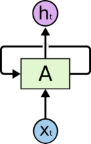

> 图1. 循环神经网络具有循环结构。

在上面的图示中，一块神经网络 $A$ 接收某个输入 $x_t$ 并输出一个值 $h_t$。**循环允许信息从网络的一个步骤传递到下一个步骤**。

这些循环让循环神经网络看起来有些神秘。然而，如果你再仔细想想，就会发现它们与普通神经网络并没有太大区别。**一个循环神经网络可以被看作是同一个网络的多个副本，每个副本向后继副本传递消息**。考虑一下如果我们展开这个循环会发生什么：

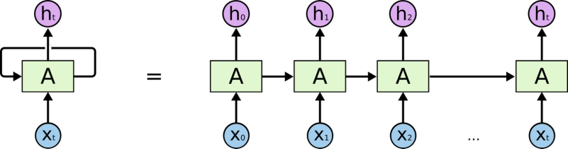

> 图2. 展开的循环神经网络。

这种**链状特性**揭示了**循环神经网络与序列和列表的密切关系**。它们是神经网络处理这类数据的自然架构。

而且它们确实被广泛使用！在过去的几年里，RNN 在各种问题上取得了令人难以置信的成功：语音识别、语言建模、翻译、图像描述……不胜枚举。关于用 RNN 能实现的惊人壮举，我将留给 Andrej Karpathy 的精彩博客文章《循环神经网络的惊人有效性》（The Unreasonable Effectiveness of Recurrent Neural Networks）（http://karpathy.github.io/2015/05/21/rnn-effectiveness/）来讨论。但它们真的非常了不起。

这些成功的关键在于使用了 "LSTMs"——一种非常特殊的循环神经网络，在许多任务上比标准版本表现好得多。几乎所有基于循环神经网络的激动人心的成果都是用它们实现的。本文要探索的正是这些 LSTM。

## 2 长期依赖问题

RNN 的吸引力之一在于它们能够将先前的信息连接到当前任务，例如利用先前的视频帧来帮助理解当前帧。如果 RNN 能做到这一点，它们将极其有用。但它们能做到吗？这取决于情况。

有时，我们只需要查看最近的信息就能完成当前任务。例如，考虑一个试图根据之前的单词预测下一个单词的语言模型。如果我们试图预测 "the clouds are in the sky"（云在天空中）中的最后一个词，我们不需要任何进一步的上下文——很明显下一个词将是 sky（天空）。在这种情况下，相关信息与需要它的位置之间的间隔很小，RNN 可以学会使用过去的信息。

但也有一些情况我们需要更多的上下文。考虑试图预测文本 "I grew up in France… I speak fluent French."（我在法国长大……我说流利的法语。）中的最后一个词。最近的信息表明下一个词很可能是某种语言的名称，但如果我们想缩小是哪种语言，我们需要更早的法国（France）这一上下文。相关信息与需要它的位置之间的间隔完全可能变得非常大。

不幸的是，随着间隔的增大，RNN 变得无法学会连接这些信息。

从理论上讲，RNN 完全有能力处理这种"长期依赖"。人类可以仔细为它们挑选参数来解决这种形式的玩具问题。遗憾的是，在实践中，RNN 似乎无法学会它们。这个问题被 Hochreiter（1991）[8]（德语）和 Bengio 等人（1994）[2]深入探讨过，他们发现了一些相当根本的原因，说明为什么这可能很难。

谢天谢地，LSTM 没有这个问题！

## 3 LSTM 网络

长短期记忆网络（Long Short Term Memory networks）——通常简称为 "LSTMs"——是一种特殊的 RNN，能够学习长期依赖。它们由 Hochreiter & Schmidhuber（1997）[9]提出，并在后续工作中被许多人改进和推广。它们在各种各样的任务上表现得非常好，现在已被广泛使用。

LSTM 被明确设计用来避免长期依赖问题。长时间记住信息实际上是它们的默认行为，而不是它们费力才能学会的东西！

所有循环神经网络都具有重复神经网络模块的链式形式。在标准 RNN 中，这个重复模块将具有非常简单的结构，例如单个 $\tanh$ 层。

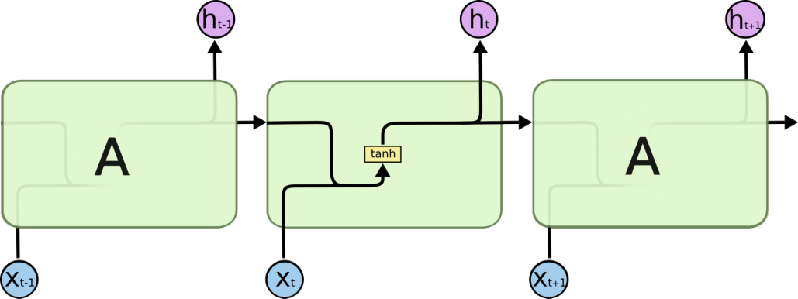

> 图3. 标准 RNN 中的重复模块只包含单个层。

LSTM 也具有这种链式结构，但重复模块具有不同的结构。它不是单个神经网络层，而是四个层，以一种非常特殊的方式相互作用。

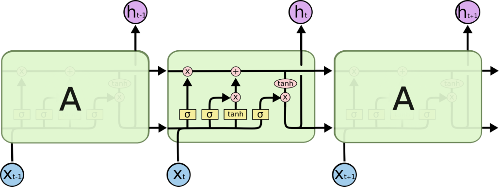

> 图4. LSTM 中的重复模块包含四个相互作用的层。

不要担心具体细节是什么。我们稍后会逐步讲解 LSTM 图示。现在，让我们先熟悉一下我们将使用的符号。

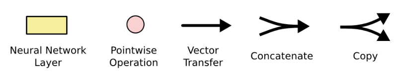

> 图5. 图例：神经网络层、逐点操作、向量传递、拼接、复制。

在上面的图示中，每条线携带一个完整的向量，从一个节点的输出到其他节点的输入。粉红色圆圈代表逐点操作（如向量加法），而黄色方框是学习到的神经网络层。线合并表示拼接（concatenation），而线分叉表示其内容被复制，副本被发送到不同位置。

## 4 LSTM 背后的核心思想

LSTM 的关键是**细胞状态**（cell state），即贯穿图示顶部的那条水平线。

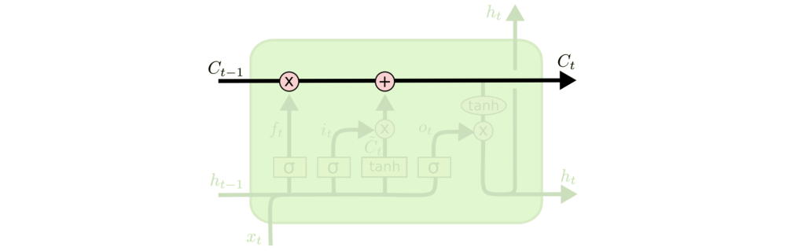

> 图6. 细胞状态就像一条传送带。

细胞状态有点像一条传送带。它径直穿过整个链条，只有一些次要的线性交互。信息很容易就沿着它不变地流动。

LSTM 确实有能力从细胞状态中移除或添加信息，这是由被称为**门**（gates）的结构精心调节的。

门是一种让信息选择性地通过的方式。它们由一个 sigmoid 神经网络层和一个逐点乘法操作组成。

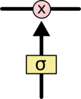

> 图7. 门由 sigmoid 层与逐点乘法构成。

sigmoid 层输出介于 0 和 1 之间的数字，描述每个分量应该让多少通过。值为 0 意味着"什么都不让通过"，而值为 1 意味着"让一切通过！"

一个 LSTM 有三个这样的门，用来保护和控制细胞状态。

## 5 逐步理解 LSTM

我们 LSTM 的第一步是决定要从细胞状态中丢弃哪些信息。这个决定由一个被称为"遗忘门层"（forget gate layer）的 sigmoid 层做出。它查看 $h_{t-1}$ 和 $x_t$，并为细胞状态 $C_{t-1}$ 中的每个数字输出一个介于 0 和 1 之间的数字。1 表示"完全保留这个"，而 0 表示"完全丢弃这个"。

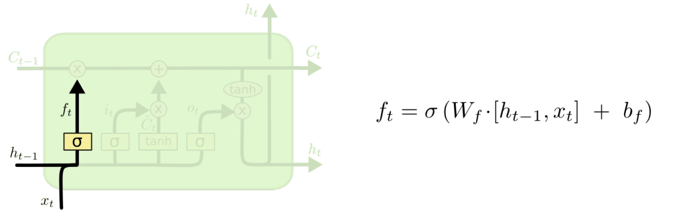

> 图8. 遗忘门层。

让我们回到语言模型的例子，即试图根据所有之前的单词预测下一个单词。在这样的问题中，细胞状态可能包含当前主语的性质（如性别），以便使用正确的代词。当我们看到一个新的主语时，我们希望忘记旧主语的性别信息。

下一步是决定我们将在细胞状态中存储哪些新信息。这有两个部分。首先，一个被称为"输入门层"（input gate layer）的 sigmoid 层决定我们将更新哪些值。接下来，一个 $\tanh$ 层创建新的候选值向量 $\tilde{C}_t$，它可以被添加到状态中。在下一步中，我们将结合这两者来创建对状态的更新。

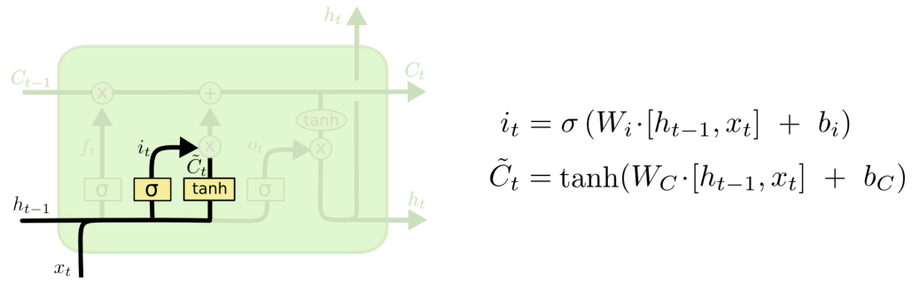

> 图9. 输入门层与候选值生成。

在我们语言模型的例子中，我们希望将新主语的性别信息添加到细胞状态中，以替换我们正在遗忘的旧信息。

现在是时候将旧细胞状态 $C_{t-1}$ 更新为新的细胞状态 $C_t$ 了。前面的步骤已经决定了要做什么，我们只需要实际执行它。

我们将旧状态乘以 $f_t$，遗忘我们之前决定要遗忘的东西。然后我们加上 $i_t \ast \tilde{C}_t$。这是新的候选值，按我们决定更新每个状态值的程度进行缩放。

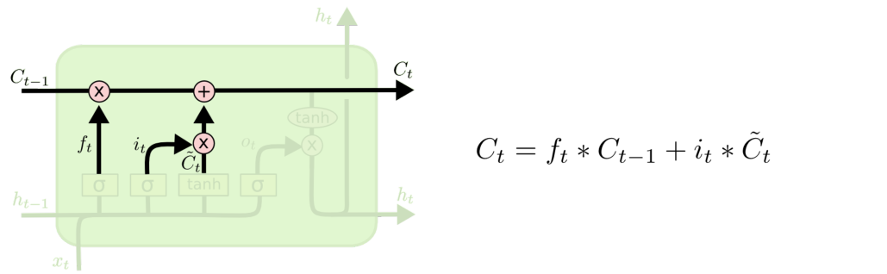

> 图10. 更新细胞状态。

在语言模型的情况下，这正是我们实际丢弃关于旧主语性别的信息并添加新信息的地方，正如我们在前面步骤中决定的那样。

最后，我们需要决定要输出什么。这个输出将基于我们的细胞状态，但会是它的一个过滤版本。首先，我们运行一个 sigmoid 层，决定我们要输出细胞状态的哪些部分。然后，我们把细胞状态通过 $\tanh$（将值压缩到 $-1$ 和 $1$ 之间），并将其乘以 sigmoid 门的输出，这样我们只输出我们决定输出的部分。

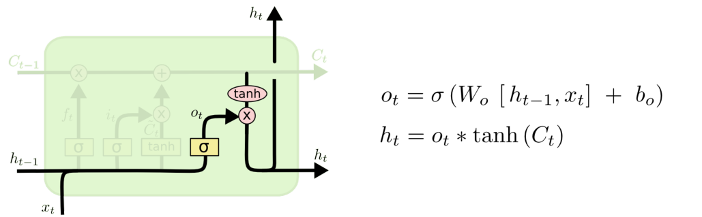

> 图11. 输出门。

对于语言模型的例子，因为它刚刚看到一个主语，它可能想要输出与动词相关的信息，以防接下来出现的是动词。例如，它可能输出主语是单数还是复数，这样我们就知道如果接下来是动词，应该用什么形式进行变位。

## 6 LSTM 变体

到目前为止我描述的是一种相当普通的 LSTM。但并非所有 LSTM 都与上面的一样。事实上，似乎几乎每篇涉及 LSTM 的论文都使用略有不同的版本。差异很小，但值得提一下其中的一些。

一种流行的 LSTM 变体由 Gers & Schmidhuber（2000）[5]提出，即添加"窥视孔连接"（peephole connections）。这意味着我们让门层可以看到细胞状态。

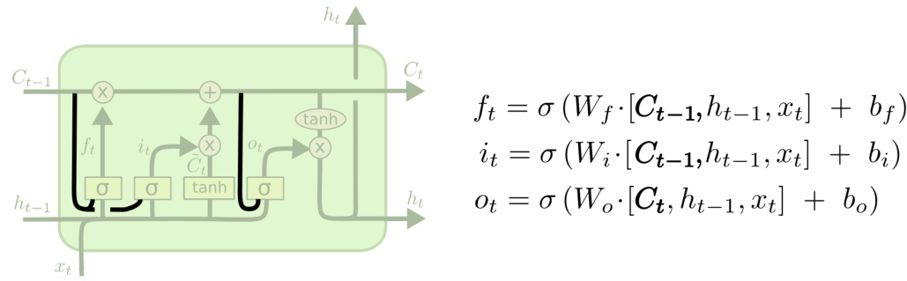

> 图12. 带窥视孔连接的 LSTM。

上面的图示为所有门都添加了窥视孔，但许多论文只会给其中一些门添加。

另一种变体是使用**耦合的遗忘门和输入门**（coupled forget and input gates）。与分别决定要遗忘什么、要添加什么新信息不同，我们同时做出这些决定。我们只在要输入某些内容替代它时才遗忘。我们只在对旧内容遗忘时才向状态输入新值。

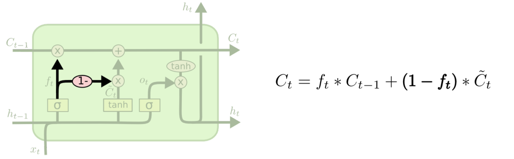

> 图13. 耦合的遗忘门与输入门。

对 LSTM 的一个稍大一些的改变是**门控循环单元**（Gated Recurrent Unit，GRU），由 Cho 等人（2014）[3]提出。它将遗忘门和输入门合并为一个单一的"更新门"（update gate）。它还合并了细胞状态和隐藏状态，并做了一些其他改变。由此产生的模型比标准 LSTM 模型更简单，并且越来越流行。

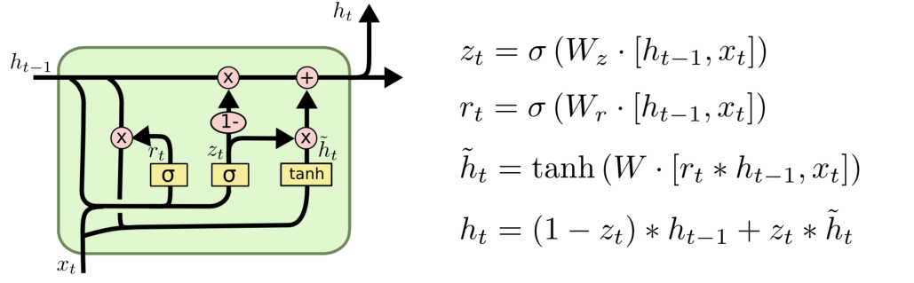

> 图14. 门控循环单元（GRU）。

这些只是最著名的 LSTM 变体中的少数几个。还有很多其他的，比如 Yao 等人（2015）[14]的深度门控 RNN（Depth Gated RNNs）。还有一些完全不同的方法来处理长期依赖，比如 Koutnik 等人（2014）[12]的时钟循环神经网络（Clockwork RNNs）。

这些变体中哪个最好？差异重要吗？Greff 等人（2015）[6]对流行的变体做了很好的比较，发现它们的效果都差不多。Jozefowicz 等人（2015）[10]测试了一万多种 RNN 架构，发现有些架构在某些任务上比 LSTM 表现得更好。

## 7 结论

早些时候，我提到了人们用 RNN 取得的卓越成果。基本上所有这些成果都是使用 LSTM 实现的。它们在大多数任务上确实表现好得多！

写成一组方程式的 LSTM 看起来相当吓人。希望本文中逐步讲解能让它们变得更容易接近一些。

LSTM 是我们用 RNN 所能实现的重大一步。自然要问：还有另一次重大突破吗？研究者中一个常见的观点是："有！下一步就是注意力（attention）！"这个想法是让 RNN 的每一步从更大的信息集合中挑选要查看的信息。例如，如果你用 RNN 来生成描述图像的标题，它可能会为它输出的每个单词挑选图像的一部分来查看。事实上，Xu 等人（2015）[13]正是这样做的——如果你想探索注意力机制，这可能是一个有趣的起点！已经有很多令人兴奋的成果使用了注意力机制，而且似乎更多的成果即将到来……

注意力并不是 RNN 研究中唯一令人兴奋的线索。例如，Kalchbrenner 等人（2015）[11]的网格 LSTM（Grid LSTMs）看起来非常有前景。将 RNN 用于生成模型的工作——比如 Gregor 等人（2015）[7]、Chung 等人（2015）[4]或 Bayer & Osendorfer（2015）[1]——看起来也非常有趣。过去的几年对循环神经网络来说是一个激动人心的时期，而即将到来的几年只会更加激动人心！

## 致谢

我很感激许多人帮助我更好地理解 LSTM、对可视化提供评论，并为这篇文章提供反馈。

我非常感谢我在 Google 的同事们的宝贵反馈，尤其是 Oriol Vinyals、Greg Corrado、Jon Shlens、Luke Vilnis 和 Ilya Sutskever。我也感谢许多其他抽出时间帮助我的朋友和同事，包括 Dario Amodei 和 Jacob Steinhardt。

我特别感谢 **Kyunghyun Cho**，他对我图示的通信非常深思熟虑。

在这篇文章之前，我在两个关于神经网络的研讨会上练习讲解 LSTM。感谢所有参与者的耐心和反馈。

## 参考文献

[1] Justin Bayer and Christian Osendorfer. Learning Stochastic Recurrent Neural Networks. arXiv preprint arXiv:1411.7610, 2015.

[2] Yoshua Bengio, Patrice Simard, and Paolo Frasconi. Learning long-term dependencies with gradient descent is difficult. IEEE Transactions on Neural Networks, 5(2):157-166, 1994.

[3] Kyunghyun Cho, Bart van Merrienboer, Caglar Gulcehre, Dzmitry Bahdanau, Fethi Bougares, Holger Schwenk, and Yoshua Bengio. Learning Phrase Representations using RNN Encoder-Decoder for Statistical Machine Translation. arXiv preprint arXiv:1406.1078, 2014.

[4] Junyoung Chung, Caglar Gulcehre, KyungHyun Cho, and Yoshua Bengio. Gated Feedback Recurrent Neural Networks. arXiv preprint arXiv:1506.02216, 2015.

[5] Felix A. Gers and Jurgen Schmidhuber. Recurrent nets that time and count. In Proceedings of the IEEE-INNS-ENNS International Joint Conference on Neural Networks (IJCNN 2000), volume 3, pages 189-194, 2000.

[6] Klaus Greff, Rupesh Kumar Srivastava, Jan Koutnik, Bas R. Steunebrink, and Jurgen Schmidhuber. LSTM: A Search Space Odyssey. arXiv preprint arXiv:1503.04069, 2015.

[7] Karol Gregor, Ivo Danihelka, Alex Graves, Danilo Jimenez Rezende, and Daan Wierstra. DRAW: A Recurrent Neural Network for Image Generation. arXiv preprint arXiv:1502.04623, 2015.

[8] Sepp Hochreiter. Untersuchungen zu dynamischen neuronalen Netzen. Diploma thesis, Institut fur Informatik, Technische Universitat Munchen, 1991.

[9] Sepp Hochreiter and Jurgen Schmidhuber. Long Short-Term Memory. Neural Computation, 9(8):1735-1780, 1997.

[10] Rafal Jozefowicz, Wojciech Zaremba, and Ilya Sutskever. An Empirical Exploration of Recurrent Network Architectures. In Proceedings of the 32nd International Conference on Machine Learning (ICML 2015), 2015.

[11] Nal Kalchbrenner, Ivo Danihelka, and Alex Graves. Grid Long Short-Term Memory. arXiv preprint arXiv:1507.01526, 2015.

[12] Jan Koutnik, Klaus Greff, Faustino Gomez, and Jurgen Schmidhuber. A Clockwork RNN. arXiv preprint arXiv:1402.3511, 2014.

[13] Kelvin Xu, Jimmy Ba, Ryan Kiros, Kyunghyun Cho, Aaron Courville, Ruslan Salakhutdinov, Richard Zemel, and Yoshua Bengio. Show, Attend and Tell: Neural Image Caption Generation with Visual Attention. arXiv preprint arXiv:1502.03044, 2015.

[14] Kaisheng Yao, Trevor Cohn, Katerina Vylomova, Kevin Duh, and Chris Dyer. Depth-Gated Recurrent Neural Networks. arXiv preprint arXiv:1508.03790, 2015.
