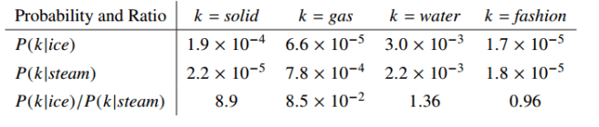
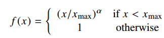
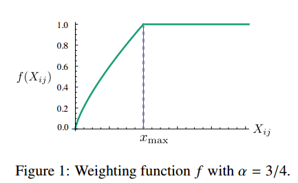
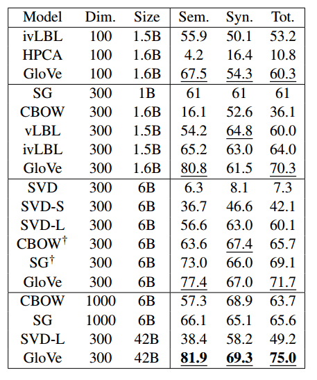
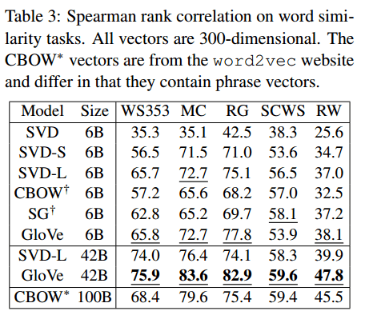
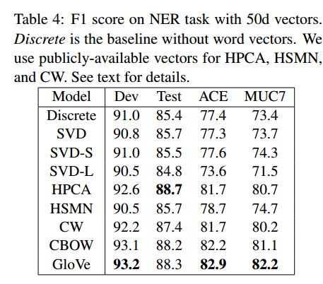
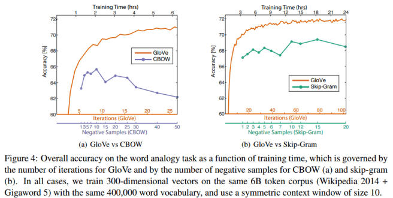

# GloVe：用于词表示的全局向量（GloVe: Global Vectors for Word Representation）

> Adrian Colyer | the morning paper | 2016 年 4 月 22 日

本文解读 Pennington et al. (2014) 提出的 GloVe 模型，核心思路是——**词向量的学习起点应该是共现概率的比值而非概率本身，因为比值能编码语义，而对数比值恰好对应向量空间中的向量差**。

核心内容：

- 动机：word2vec 的在线扫描方式只利用局部上下文窗口，没有充分挖掘词共现的全局统计信息；矩阵分解方法（如 LSA、HAL）能利用全局统计，但类比表现不佳
- 洞见：ice/steam 与探测词 k 的共现概率比值 $P(k|ice)/P(k|steam)$——solid 对应大比值、gas 对应小比值、water 与 fashion 接近 1，说明比值能区分语义
- 目标：学习词向量使点积等于词共现概率的对数，从而把（对数）共现概率比编码为向量差，这正是词类比任务需要的能力
- 细节：用加权最小二乘回归处理罕见共现，权重函数 $f(x) = \min(1, (x/x_{max})^\alpha)$ ，取 $x_{max} = 100$ 、 $\alpha = 3/4$ ；两组词向量求和作为最终向量

关键发现：

- 词类比任务组合准确率 **75%**，达到当时领先水平；词相似度与命名实体识别也优于相关模型
- 相同训练时间内，GloVe 在词类比任务上的准确率优于 word2vec
- 计数型方法高效捕获全局统计的优势与预测型方法的线性子结构优势在 GloVe 中得以结合

---

GloVe：用于词表示的全局向量（GloVe: Global Vectors for Word Representation）—— Pennington et al. 2014

昨天我们通过 [word2vec](https://blog.acolyer.org/2016/04/21/the-amazing-power-of-word-vectors/) 领略了词向量的一些惊人特性。Pennington 等人认为，word2vec 使用的在线扫描方法是次优的，因为它没有充分利用词共现的统计信息。他们展示了*全局向量*（GloVe）模型，该模型结合了 word2vec skip-gram 模型在词类比任务上的优势，以及矩阵分解方法可以利用全局统计信息的优势。GloVe 模型……

> ……产出了一个具有有意义子结构的向量空间，其在一项近期词类比任务上 75% 的表现证明了这一点。它在相似度任务和命名实体识别上也优于相关模型。

模型的源代码以及训练好的词向量可以在 [http://nlp.stanford.edu/projects/glove/](http://nlp.stanford.edu/projects/glove/) 找到。

### 矩阵分解 vs 浅窗口方法

矩阵分解方法，例如潜在语义分析（LSA，Latent Semantic Analysis），使用低秩近似来分解捕获语料库统计信息的大矩阵。在 LSA 中，行对应词或术语，列对应语料库中的不同文档。在语言高维空间类比（HAL，Hyperspace Analogue to Language）及其衍生方法中，使用的是方阵，行和列都对应词，条目对应一个给定词出现在另一个给定词上下文中的次数（*共现矩阵*）。这里必须克服的一个问题是，高频词对相似度度量的贡献不成比例，因此需要某种归一化。

浅窗口方法从局部上下文窗口学习词表示（正如我们昨天在 [word2vec](https://blog.acolyer.org/2016/04/21/the-amazing-power-of-word-vectors/) 中看到的）：

> 与矩阵分解方法不同，浅窗口方法的缺点是它们不直接操作语料库的共现统计信息。相反，这些模型在整个语料库上扫描上下文窗口，未能利用数据中大量重复的信息。

### GloVe 如何从统计中发现含义

> 语料库中词出现的统计信息是所有无监督词表示学习方法可获得的主要信息来源，虽然现在已有许多此类方法，但含义如何从这些统计中产生、生成的词向量又如何表示该含义，仍然是一个问题。

Pennington 等人基于 *ice* 和 *steam* 这两个词给出了一个简单的例子，为这个问题带来一些启发。

> 这两个词的关系可以通过研究它们与各种探测词 *k* 的共现概率比值来考察。

令 $P(k|w)$ 为词 $k$ 出现在词 $w$ 上下文中的概率。考虑一个与 *ice* 强相关但与 *steam* 不相关的词，例如 *solid*。 $P(solid | ice)$ 会相对较高， $P(solid | steam)$ 会相对较低。因此 $P(solid | ice) / P(solid | steam)$ 的**比值**会很大。如果我们取一个与 *steam* 相关但与 *ice* 不相关的词，例如 *gas*，那么 $P(gas | ice) / P(gas | steam)$ 的比值反而会很小。对于同时与 *ice* 和 *steam* 相关的词，例如 *water*，我们预期比值接近 1。对于与 ice 和 steam 都不相关的词，例如 *fashion*，我们也预期比值接近 1。

下表显示实际情况确实如此：

> 上述论证表明，词向量学习的合适起点应该是共现概率的比值，而不是概率本身……由于向量空间本质上是线性结构，[把比值中的信息编码到词向量空间中]最自然的方式是向量差。

来自 [GloVe 项目页面](http://nlp.stanford.edu/projects/glove/)：

> GloVe 的训练目标是学习词向量，使它们的点积等于词共现概率的对数。由于比值的对数等于对数之差，这一目标把（取对数的）共现概率比值与词向量空间中的向量差关联起来。因为这些比值可以编码某种形式的含义，这些信息也以向量差的形式被编码。因此，生成的词向量在词类比任务上表现非常好，例如 word2vec 软件包中考察的那些任务。

为了处理罕见或从未出现的共现——它们噪声更大、携带的信息比高频共现更少——作者使用了加权最小二乘回归模型。一类被证明效果良好的权重函数可以参数化为

> 模型性能对截断值的依赖很弱，在所有实验中我们固定 $x_{max} = 100$ 。我们发现 $\alpha = 3/4$ 相比 $\alpha = 1$ 的线性版本有适度的改进。虽然我们选择 3/4 这个值只给出了经验上的动机，但有趣的是，在 [word2vec] 中也发现了类似的分数次幂缩放能给出最佳性能。

该模型生成*两组*词向量。当共现矩阵对称时，它们的差异仅仅是随机初始化的结果：两组向量的性能应当相当。

> 另一方面，有证据表明，对某些类型的神经网络，训练网络的多个实例然后组合结果，有助于减少过拟合和噪声，通常能改善结果。考虑到这一点，我们选择使用[两组向量的]和作为我们的词向量。这样做通常会带来小幅性能提升，其中语义类比任务的提升最大。

### 结果

模型在五个语料库上进行了训练，包括 2010 年维基百科转储（10 亿个 token）、2014 年维基百科转储（16 亿个 token）、Gigaword 5（43 亿个 token）、Gigaword 5 与 2014 年维基百科转储的组合（共 60 亿个 token），以及来自 Common Crawl 的 420 亿个 token 的网页数据。

> 我们用 Stanford tokenizer 对每个语料库进行分词和小写化，构建 400,000 个最高频词的词表，然后构建共现计数矩阵……我们使用递减的加权函数，使相距 $d$ 个词的词对为总计数贡献 $1/d$ 。

这一遍计算可能很昂贵，但这是一次性的前期成本。GloVe 在词类比任务上表现非常好，组合准确率达到 75%，处于领先水平。它在词相似度和命名实体识别测试中也取得了很好的结果。

词类比任务结果：

词相似度：

命名实体识别：

与 word2vec 相比，在相同的训练时间内，GloVe 在词类比任务上显示出更高的准确率。

作者总结道：

> 在这项工作中，我们论证了两类方法在根本层面上并没有显著差异，因为它们都探测语料库底层的共现统计信息，但计数型方法捕获全局统计信息的效率可能是优势。我们构建了一个模型，利用计数数据的这一主要优势，同时捕获近期基于对数双线性的预测型方法（如 word2vec）中普遍存在的有意义的线性子结构。其成果 GloVe 是一个新的全局对数双线性回归模型，用于词表示的无监督学习，在词类比、词相似度和命名实体识别任务上优于其他模型。
