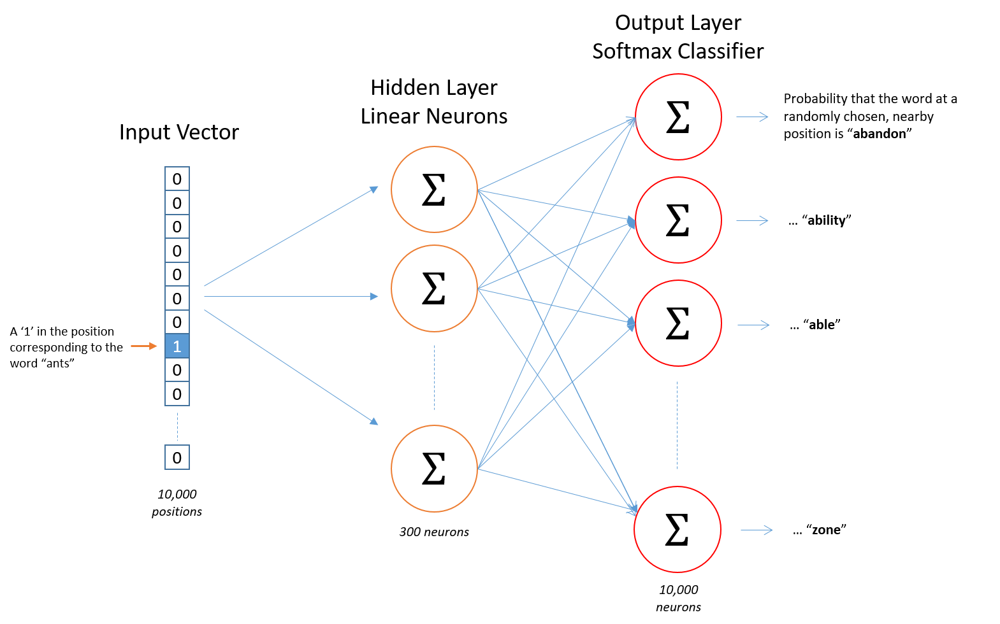
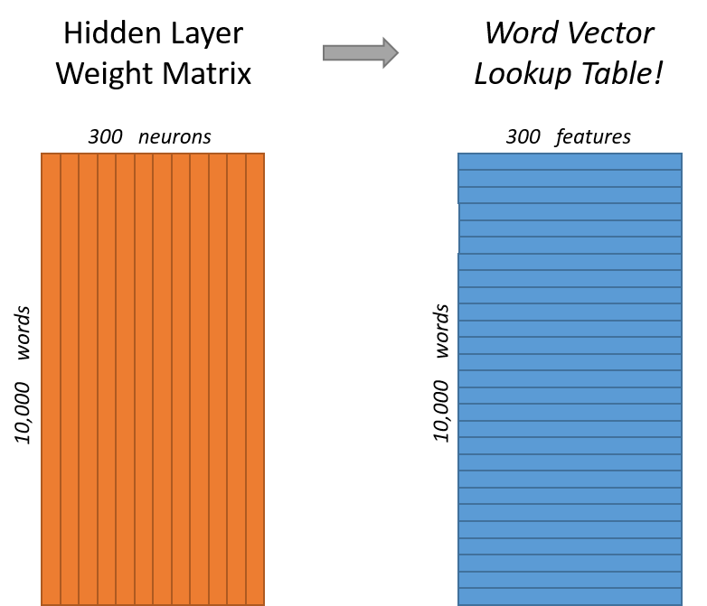
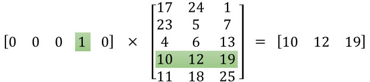
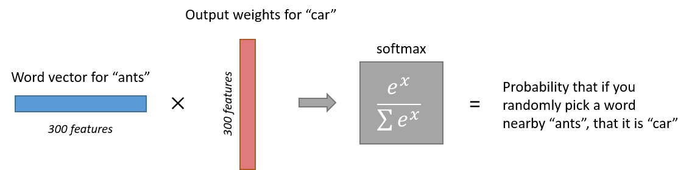

# Word2Vec 教程——Skip-Gram 模型（Word2Vec Tutorial - The Skip-Gram Model）

> Chris McCormick | mccormickml.com | 2016 年 4 月 19 日

本文深入讲解 word2vec 的 skip-gram 神经网络架构细节，核心思路是——**训练一个"假任务"单隐藏层神经网络（根据输入词预测其附近词），训练完成后丢掉输出层，隐藏层权重矩阵的行就是词向量**。

核心内容：

- 模型：输入为 one-hot 编码的词，输出为词表中每个词作为随机选中"邻近词"的概率分布
- 训练数据：按窗口大小（如前后各 2 个词）从句子中采样的词对，网络从词对出现次数中学习统计规律
- 隐藏层： $10{,}000 \times 300$ 权重矩阵；one-hot 向量乘以矩阵等价于"查表"，隐藏层输出即输入词的词向量
- 输出层：softmax 回归分类器，每个输出神经元对应词表中的一个词，输出经 $exp(x)$ 归一化后总和为 1

关键发现：

- 网络对输出词相对输入词的位置偏移一无所知——训练输出是概率分布而非 one-hot 向量
- 上下文相似的词（同义词 intelligent/smart、相关词 engine/transmission）会被迫学到相似的词向量
- 还能自动实现词干提取：ant 和 ants 因上下文相似而得到相似的词向量
- 原始架构权重巨大（300 特征 × 10,000 词 → 隐藏层与输出层各 300 万个权重），实际训练需负采样等优化（见教程第二部分）

---

## 模型

skip-gram 神经网络模型最基本的形式其实出奇地简单；我认为是那些小调整和增强让解释变得混乱了。

我们先从一个关于接下来走向的高层洞见说起。word2vec 用了一个你在机器学习的其他地方可能见过的技巧。我们要训练一个带单隐藏层的简单神经网络来执行某个任务，但我们实际上不会把这个神经网络用于它训练时的任务！相反，目标只是学习隐藏层的权重——我们会看到，这些权重其实就是我们想学的"词向量"。

你可能见过这个技巧的另一个地方是无监督特征学习（unsupervised feature learning）：你训练一个自编码器（auto-encoder），在隐藏层压缩输入向量，再在输出层将其解压回原始向量。训练完成后，你把输出层（解压步骤）剥掉，只用隐藏层——这是一种在没有标注训练数据的情况下学习好的图像特征的技巧。

## 假任务

现在我们需要谈谈这个我们要构建神经网络去执行的"假"任务，之后我们再回来看它如何间接地给我们真正想要的词向量。

我们要训练神经网络做下面这件事。给定句子中间的某个词（输入词），看它附近的词并随机选一个。网络要告诉我们词表中每个词是所选"邻近词"的概率。

当我说"附近"时，算法实际上有一个"窗口大小"（window size）参数。典型的窗口大小可能是 5，即前面 5 个词加后面 5 个词（共 10 个）。

输出概率关系到在输入词附近找到词表中每个词的可能性。例如，如果你给训练好的网络输入词"Soviet"，那么"Union"和"Russia"这类词的输出概率会远高于"watermelon"和"kangaroo"这类无关词。

我们通过向网络喂训练文档中发现的词对来训练它做这件事。下面的例子展示了我们会从句子"The quick brown fox jumps over the lazy dog."中提取的部分训练样本（词对）。为了举例，我用了 2 的小窗口大小。蓝色高亮的词是输入词。

网络会从每个词对出现的次数中学到统计规律。所以，例如，网络很可能得到 ("Soviet", "Union") 的训练样本远多于 ("Soviet", "Sasquatch")。训练完成后，如果你把词"Soviet"作为输入，那么它输出"Union"或"Russia"的概率会远高于"Sasquatch"。

## 模型细节

那么这一切是如何表示的呢？

首先，你知道不能把一个词仅仅作为文本字符串喂给神经网络，所以我们需要一种向网络表示词的方法。为此，我们首先从训练文档构建一个词表（vocabulary）——假设我们有 10,000 个不重复词的词表。

我们要把"ants"这样的输入词表示为一个 one-hot 向量。这个向量有 10,000 个分量（词表中每个词一个），我们在"ants"对应的位置放一个"1"，其他位置全放 0。

网络的输出是单个向量（同样有 10,000 个分量），包含词表中每个词作为随机选中的邻近词的概率。

这是我们的神经网络架构。

隐藏层神经元上没有激活函数，但输出神经元使用 softmax。这个我们稍后回来说。

用词对*训练*这个网络时，输入是表示输入词的 one-hot 向量，训练输出*也是*表示输出词的 one-hot 向量。但当你用训练好的网络评估一个输入词时，输出向量实际上会是一个概率分布（即一堆浮点值，*不是* one-hot 向量）。

## 隐藏层

在我们的例子中，假设我们在学 300 特征的词向量。所以隐藏层将用一个权重矩阵表示，它有 10,000 行（词表中每个词一行）和 300 列（每个隐藏神经元一列）。

300 特征是 Google 在其发布的、在 Google news 数据集上训练的模型中所使用的（你可以从[这里](https://code.google.com/archive/p/word2vec/)下载）。特征数量是一个"超参数"（hyperparameter），你需要针对你的应用调优它（即尝试不同的值，看哪个效果最好）。

如果你看这个权重矩阵的*行*，它们实际上就是我们要的词向量！

所以这一切的最终目标其实就是学习这个隐藏层权重矩阵——输出层完成后直接丢掉！

不过，我们还是回到这个要训练的模型的定义上来。

现在，你可能会问自己——"那个 one-hot 向量几乎全是 0……这会有什么影响？"如果你用一个 $1 \times 10{,}000$ 的 one-hot 向量乘以一个 $10{,}000 \times 300$ 的矩阵，它实际上只是*选中*了"1"所对应的那一行矩阵。这里有个小例子给你直观感受。

这意味着这个模型的隐藏层实际上只是在充当一个查找表（lookup table）。隐藏层的输出就是输入词的"词向量"。

## 输出层

"ants"的 $1 \times 300$ 词向量随后被喂给输出层。输出层是一个 softmax 回归分类器。[这里](http://ufldl.stanford.edu/tutorial/supervised/SoftmaxRegression/)有一篇关于 softmax 回归的深入教程，但其要点是：每个输出神经元（词表中每个词一个！）会产生一个 0 到 1 之间的输出，所有这些输出值的总和为 1。

具体来说，每个输出神经元有一个权重向量，它与来自隐藏层的词向量相乘，然后对结果应用 $exp(x)$ 函数。最后，为了让输出加起来等于 1，我们把这个结果除以*全部* 10,000 个输出节点的结果之和。

下面是对词"car"的输出神经元输出计算的图示。

注意，神经网络对输出词相对输入词的偏移位置一无所知。它*不会*为输入词前面的词和后面的词学习不同的概率集。为了理解这意味着什么，假设在我们的训练语料库中，词'York'的*每一次出现*前面都是词'New'。也就是说，至少根据训练数据，'New'出现在'York'附近是 100% 的概率。然而，如果我们取'York'附近的 10 个词并随机选一个，它是'New'的概率*不是* 100%；你可能选到了附近的其他词。

## 直觉

好了，准备好对这个网络的一点令人兴奋的洞察了吗？

如果两个不同的词有非常相似的"上下文"（即它们周围可能出现的词），那么我们的模型需要为这两个词输出非常相似的结果。而网络为这两个词输出相似上下文预测的一种方式是*词向量相似*。所以，如果两个词有相似的上下文，那么我们的网络就被激励去为这两个词学习相似的词向量！哒哒！

那么两个词有相似上下文意味着什么呢？我想你可以预期"intelligent"和"smart"这样的同义词会有非常相似的上下文。或者相关的词，比如"engine"和"transmission"，也可能有相似的上下文。

这还能帮你处理词干提取（stemming）——网络很可能会为"ant"和"ants"学到相似的词向量，因为它们应该有相似的上下文。

## 接下来

你可能已经注意到 skip-gram 神经网络包含大量权重……在我们的例子中，300 个特征和 10,000 词的词表，隐藏层和输出层各有 300 万个权重！在大数据集上训练这个会非常昂贵，所以 word2vec 的作者引入了一些调整来让训练可行。这些在本教程的[第二部分](http://mccormickml.com/2017/01/11/word2vec-tutorial-part-2-negative-sampling/)中介绍。

## 其他资源

你知道 word2vec 模型也可以应用于推荐系统和广告定向的非文本数据吗？不从词序列学习向量，你可以从用户行为序列学习向量。在我的新文章[这里](http://mccormickml.com/2018/06/15/applying-word2vec-to-recommenders-and-advertising/)阅读更多。

### 引用

McCormick, C. (2016, April 19). *Word2Vec Tutorial - The Skip-Gram Model*. Retrieved from http://www.mccormickml.com
