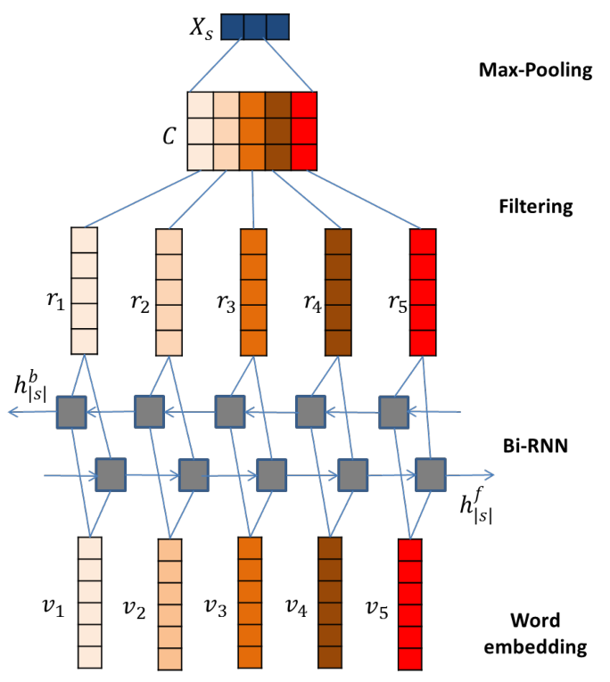
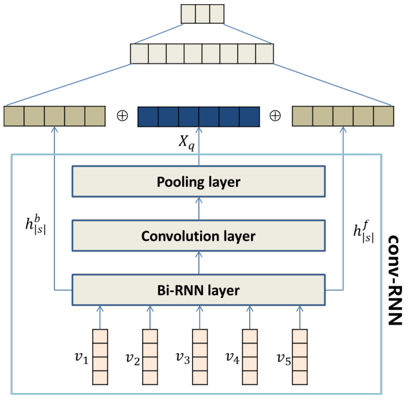
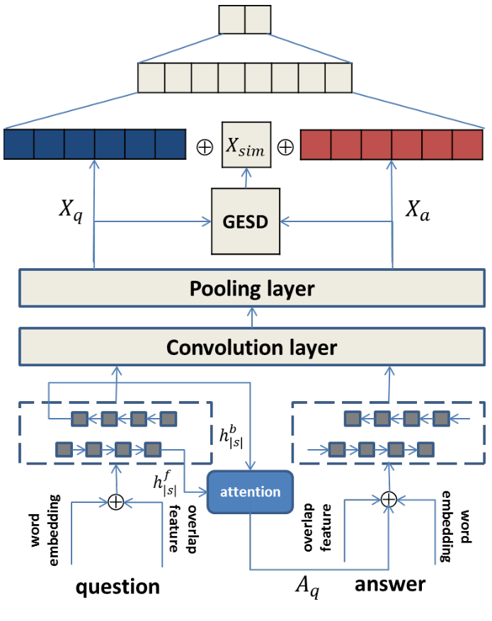

# 基于卷积 RNN 的文本建模混合框架（A Hybrid Framework for Text Modeling with Convolutional RNN）

> Chenglong Wang, Feijun Jiang, Hongxia Yang | 阿里巴巴集团 | KDD 2017 Applied Data Science Paper

本文提出一种通用的卷积循环神经网络（conv −RNN，Convolutional Recurrent Neural Network）推断混合框架，无缝整合 CNN 与 RNN 在提取不同层面语言信息上的优势。核心发现是——**在 WikiQA 与 InsuranceQA 答案选择任务上超越所有现有方法，并在 5 个句子分类基准中的 4 个上取得最佳成绩**。

核心内容：

- conv −RNN 由词嵌入层、BI-RNN 层、卷积层和最大池化层四部分组成，兼顾 CNN 的局部 n-gram 特征与 RNN 的长距离依赖
- 证明用单一向量编码整个序列不足以捕获所有重要信息，混合架构是更优解
- 基于 conv −RNN 提出句子分类模型：联合层拼接 conv −RNN 输出与双向 RNN 最终隐藏状态，配合额外隐藏层与 softmax 分类层
- 提出基于注意力的答案选择模型：问题与答案共享卷积层，注意力向量 $A_q$ 注入答案编码的 GRU 单元，GESD 度量表示相关性
- 在 WikiQA、InsuranceQA 及 MR、SST-1、SST-2、Subj、IMDB 五个 SC 基准上完成迄今最全面的对比实验

关键发现：

- WikiQA 上 MAP 达 **74.27**、MRR 达 75.04，超越 IARNN-Occam（73.41/74.18）与 CubeCNN（70.90/72.34）
- InsuranceQA 上 dev/test1/test2 准确率达 71.7/71.4/68.3，全面超越 IARNN-Gate（70.0/70.1/62.8）
- SC 任务 4/5 领先：MR 81.99、SST-1 51.67、SST-2 88.91、Subj 94.13，仅 IMDB（90.39）低于 SA-LSTM（92.76）
- 提出的注意力机制能为 WikiQA 的 MAP 平均带来 1.0%-2.0% 的提升
- 在数据量不足时 L2 正则与 dropout 有效抑制过拟合，dropout 带来 2%-3% 的相对提升

---

## 摘要

本文介绍了一种用于文本语义建模的卷积循环神经网络（conv −RNN）的通用推断混合框架，无缝整合了卷积与循环神经网络结构在提取不同层面语言信息上的优点，从而增强了新框架的语义理解能力。此外，基于 conv −RNN，我们还提出了一个新颖的句子分类模型和一个基于注意力的答案选择模型，分别增强了句子匹配与分类能力。我们在非常广泛的数据集上验证了所提出的模型，包括答案选择（AS，Answer Selection）的两个挑战性任务和句子分类（SC，Sentence Classification）的五个基准数据集。据我们所知，这是迄今在 AS 和 SC 上最完整的对比结果。我们通过实验证明了 conv −RNN 在这些不同挑战性任务和基准数据集上的优越性能，并总结了其他最先进方法的表现洞见。

CCS 概念：计算方法论 → 信息提取；基于分类的监督学习；神经网络；词汇语义学

关键词：Text Modeling, Recurrent Neural Network, Convolution Neural Network, Answer Selection, Sentence Classification, Hybrid Framework

## 1 引言

将自然语言表示为特征向量的文本建模，是问答、聊天机器人和用户意图识别等自然语言理解任务的关键步骤。传统的文本建模自然语言处理（NLP，Natural Language Processing）方法，如 n-gram，由于语言歧义和可用标注数据的有限性，既面临巨大的内存需求也面临数据稀疏问题。基于深度神经网络的分布式表示，如循环神经网络（RNN，Recurrent Neural Network）或卷积神经网络（CNN，Convolutional Neural Network），最近被广泛用于缓解这种稀疏性 [21, 22, 25]。大多数先前的神经网络方法专注于将每个输入句子映射为固定长度的向量，然后进行句子级比较。[5] 开发了一种编码器-解码器架构，利用 CNN 和 RNN 分别作为句子编码器和解码器，通过重建输入句子或预测未来句子来学习分布式句子表示。[12] 训练了一个编码器-解码器模型，试图利用书籍文本的连续性重建已编码句子的周围句子。[15] 提出了一种名为 Paragraph Vector 的无监督方法，用密集向量表示输入文档，该向量被训练用于预测文档中的词。[29] 在商业网络搜索引擎记录的用户点击数据上以弱监督方式训练长短期记忆（LSTM，Long Short-Term Memory），并进一步使用得到的嵌入向量进行文档检索。

问答（QA）匹配和句子分类（SC）领域已经有了许多发展。[10] 在预训练词向量之上应用 CNN 处理各种句子级分类任务。[16] 使用带多任务学习的 RNN 在多个相关文本分类任务上联合学习。[13] 提出了具有连贯且可重用核的 CNN，可被相关任务共享。[35] 提出了 CNN 来学习问题和答案句子的最优表示，其中两个成员句子中词匹配给出的关系信息也被编码为嵌入。[51] 在一个新的公开 AS 数据集 WikiQA 上比较了几种方法，包括传统词汇语义方法和基于 CNN 的模型，并证明了 CNN 的优越性能。[4] 在一个新的非事实型问答任务 InsuranceQA 上测试了 CNN 的各种架构。

然而，人们发现用单一向量编码整个序列不足以捕获序列中的所有重要信息，因此诸如注意力机制和记忆网络等先进技术已被应用于序列匹配问题。[34, 52] 专注于用于判别模型训练的两两注意力机制，学习如何计算输入 item 对之间的交互。他们首先为句子对构建注意力矩阵，然后直接将注意力矩阵作为 CNN 模型的新通道。[48] 提出以不同的方式使用注意力矩阵，将原始句子矩阵分解为相似分量矩阵和不相似分量矩阵，然后将这两个矩阵馈入双通道 CNN 模型。该模型专注于刻画句子对相似性和不相似性之间的交互。循环神经网络（RNN）是建模序列数据的强大工具，但通过时间反向传播训练它们可能很困难。[43] 提出在计算句子表示之前添加注意力，用于基于注意力的 RNN 模型。[17] 表明，从马尔可夫随机场建立的相关性模型可以通过为概念分配权重而自然地扩展，并证明该相关性模型可以使用现有的学习排序技术以相对较少的训练查询进行训练。[23] 提出了键值记忆网络，这是一种多功能模型，用于阅读文档或知识库并回答相关问题，允许在键值记忆中编码关于当前任务的先验知识。

### 1.1 贡献

本文的主要贡献可以总结如下：

(1) 我们提出了混合 conv −RNN 框架，可以使用卷积和循环神经网络同时处理文本，无缝整合两种结构在提取不同层面语言信息上的优点，从而增强框架的匹配和分类能力。

(2) 我们扩展了基础 conv −RNN，分别为 SC 和 AS 提出了新颖的框架。

(3) 我们在非常广泛的数据集上进行了实证测试，包括 WikiQA [51]、InsuranceQA [4] 以及多个 SC 基准数据集，包括电影评论（MR [31]）、斯坦福情感树库（SST [38]）、IMDB [18] 和 Subj [30]。对于 AS，所提出的模型在两个测试数据集上都优于最先进的方法；对于 SC，我们在 5 个任务中的 4 个上取得了最佳性能。据我们所知，这是迄今在 AS 和 SC 领域最完整的对比结果。

本文其余部分组织如下。在第 2 节中，我们简要回顾 RNN、CNN 及其混合框架的相关工作。然后在第 3 节中，我们介绍 conv −RNN 以及 SC 模型和基于注意力的 AS 模型。第 4 节展示在广泛数据集和应用上的实验结果。最后，我们在第 5 节中总结本文。

## 2 相关工作

### 2.1 循环神经网络（RNN）

长短期记忆（LSTM）是一种流行的 RNN 模型，已被广泛应用于各种 NLP 问题。时间步 $t$ 处 $H$ 维隐藏状态 $h_t$ 的更新如下：

$$
i_t = \sigma(W_i w_t + U_i h_{t-1} + b_i), \qquad (1)
$$

$$
f_t = \sigma(W_f w_t + U_f h_{t-1} + b_f), \qquad (2)
$$

$$
o_t = \sigma(W_o w_t + U_o h_{t-1} + b_o), \qquad (3)
$$

$$
\tilde{C}_t = \tanh(W_c w_t + U_c h_{t-1} + b_c), \qquad (4)
$$

$$
C_t = i_t \ast \tilde{C}_t + f_t \ast C_{t-1}, \qquad (5)
$$

$$
h_t = o_t \ast \tanh(C_t), \qquad (6)
$$

其中有三个门，输入门 $i$、遗忘门 $f$ 和输出门 $o$，以及一个单元记忆向量 $C_t$。$\sigma$ 是 sigmoid 函数，$W \in \mathbb{R}^{H \times d}$，$U \in \mathbb{R}^{H \times H}$，$b \in \mathbb{R}^{H \times 1}$ 是网络参数。

单向 LSTM 有一个弱点：无法利用来自未来 token 的上下文信息。BI-LSTM 通过在两个方向上处理序列来同时利用前向和后向上下文解决此问题，并生成两个输出向量序列。每个 token 的输出是两个方向向量的拼接。

还有另一种流行的 RNN 单元，即门控循环单元（GRU，Gated Recurrent Unit）[1]。GRU 能够自适应地捕获不同时间尺度上的依赖关系。与 LSTM 单元类似，GRU 具有调节单元内部信息流的门控单元，但没有单独的记忆单元。这种对现有状态和新计算状态取线性和的流程与 LSTM 单元类似。然而，GRU 没有任何机制来控制其状态被暴露的程度，而是每次都暴露整个状态。因此，由于 AS 中问题与答案之间长度不平衡，它更适合我们的场景。用于学习句子表示的隐藏状态 $h_t$ 计算如下：

$$
h_t = (1 - z_t) \circ h_{t-1} + z_t \circ \tilde{h}_t, \qquad (7)
$$

$$
\tilde{h}_t = \sigma(W w_t + U [r_t \circ h_{t-1}] + b), \qquad (8)
$$

$$
z_t = \sigma(W_z w_t + U_z h_{t-1} + b_z), \qquad (9)
$$

$$
r_t = \sigma(W_r w_t + U_r h_{t-1} + b_r), \qquad (10)
$$

其中 $W$，$W_z$，$W_r \in \mathbb{R}^{H \times d}$；$U$，$U_z$，$U_r \in \mathbb{R}^{H \times H}$ 和 $b$，$b_z$，$b_r \in \mathbb{R}^{H \times 1}$ 是网络参数。

### 2.2 卷积神经网络（CNN）

CNN 利用三个有助于改进机器学习系统的重要思想：稀疏交互、参数共享和等变表示。稀疏交互与传统神经网络形成对比，在传统神经网络中每个输出与每个输入交互。在 CNN 中，滤波器大小（或核大小）通常远小于输入大小。因此，输出只与输入的窄窗口交互。参数共享是指在卷积操作中重用滤波器参数，而传统神经网络权重矩阵中的元素只被使用一次来计算输出。等变表示与通常与 CNN 结合的 k-MaxPooling 思想相关。因此 CNN 的每个滤波器代表某种特征，在卷积操作之后，1-MaxPooling 值代表输入包含该特征的最高程度。该特征在输入中的位置因卷积而不相关。这个性质对许多 NLP 应用非常有用。下面是一个演示 CNN 实现的例子。

假设 $W \in \mathbb{R}^{n \times d}$ 是输入句子矩阵，每个词由一个 $d$ 维词嵌入向量表示；$f \in \mathbb{R}^{m \times d}$ 表示滑动窗口大小为 $m$ 的滤波器。那么输入 $W$ 与滤波器 $f$ 的卷积输出是一个 $n$ 维向量 $o$：

$$
o_i = \sum_{k=0}^{m-1} \sum_{j=0}^{d-1} f_{m-k-1,j} W_{i-k,j}. \qquad (11)
$$

在 k-MaxPooling 之后，将为滤波器 $f$ 保留 $k$ 个值中的最大值，这表示滤波器 $f$ 匹配输入 $W$ 的 $k$ 个最高程度。

CNN 与 RNN 之间存在一些根本差异，因此可以给我们带来不同的好处。卷积网络可以堆叠以表示大的上下文规模，并在更大的上下文上提取更具抽象特征的分层特征。相反，RNN 将输入视为链式结构，因此需要线性的 $O(N)$ 次操作。然而，后者是为序列建模而设计的。此外，在 RNN 中，下一个输出依赖于前一个隐藏状态，这不适合对序列元素进行并行化。另一方面，CNN 非常适合这种计算范式，因为所有输入词的计算可以同时进行。

### 2.3 混合框架

随着神经网络模型在自然语言处理中的最新进展，序列建模的标准现在是用 CNN 或 RNN 等模型将文本序列编码为嵌入向量。例如，要匹配两个序列，直接的方法是将每个序列编码为向量，然后组合两个向量做出决策。在 CNN 中，滤波器大小（或核大小）通常远小于输入大小。因此，输出只与输入的窄窗口交互，并且通常强调 n-gram 的局部词汇连接。另一方面，RNN 是为序列建模而设计的。特别是长短期记忆（LSTM）模型可以成功保留长距离依赖中的有用信息，但代价是忽略局部 n-gram 连贯性。从根本上说，循环和卷积神经网络各有优缺点，而且人们发现，用来自 CNN 或 RNN 的单一向量编码整个序列不足以捕获序列中的所有重要信息 [8, 9]。

已经有一些尝试设计 CNN 和 RNN 的连贯组合混合框架，并享受两者的优点。[40] 开发了混合模型，使用卷积和循环神经网络处理文本，从两种结构中提取语言信息以解决段落 AS。[6] 提出了一种基于 ConvNet 和 BI-LSTM 混合的新颖神经网络模型用于语义文本相似度测量问题。此外，与之前试图将所有句子信息"塞入"固定长度向量的句子建模方法相比，他们的两两词交互模型和相似度聚焦层可以更好地捕获细粒度语义信息。[44] 提出了一种高效的混合模型来解决该问题，将快速深度模型与初始信息检索模型相结合，以有效且高效地处理 AS。

## 3 模型公式化

### 3.1 conv −RNN

由卷积层和非线性层后跟池化层组成的 CNN 已被广泛用于各种 NLP 任务中文本建模的语义表示，并被证明比传统 NLP 方法获得更好的性能。然而，CNN 强调局部 n-gram 特征，无法捕获长距离交互。另一方面，RNN 可以高效地保留长距离依赖中的有用信息，同时强调每个时间步 $t$ 的局部信息。从根本上说，循环和卷积神经网络各有优缺点，而且人们发现，用来自 CNN 或 RNN 的单一向量编码整个序列不足以捕获序列中的所有重要信息。因此，我们提出了以下混合框架，用于 CNN 和 RNN 的连贯组合并享受两者的优点，即 conv −RNN。我们的模型由以下四种类型的层组成：词嵌入层、BI-RNN 层、卷积层和最大池化层。我们在算法 1 中总结了 conv −RNN（相关符号在表 1 中定义）并详细说明如下：

**表 1：conv −RNN 中使用的符号**

| 符号 | 描述 |
|---|---|
| $w_i$ | 输入句子中的第 $i$ 个词 |
| $|s|$ | 输入句子的长度 |
| $S$ | 输入句子 |
| $V$ | 词汇表 |
| $|V|$ | 词汇表的大小 |
| $\mathbf{W}$ | 词嵌入矩阵 |
| $d_w$, $d_r$ | 词嵌入和 RNN 单元的维度 |
| $v_i$ | 词 $w_i$ 的词嵌入 |
| $r_t^f$, $r_t^b$, $r_t$ | 时间步 $t$ 处前向/后向 RNN 单元和 BI-RNN 层的输出 |
| $h_{|s|}^f$, $h_{|s|}^b$ | 前向/后向 RNN 单元的最终隐藏状态 |
| $n$ | 滤波器向量的数量 |
| $f_i$ | 卷积层中使用的第 $i$ 个滤波器向量 |
| $c_i^t$ | 时间步 $t$ 处使用滤波器向量 $i$ 的卷积层输出 |
| $A_q$ | 基于输入问题 $q$ 的注意力向量 |
| $X_s$ | 输入句子 $S$ 的最终语义表示 |

$$
\begin{aligned}
&\textbf{Algorithm 1: conv −RNN 算法} \\
&\textbf{Input: } \text{输入句子由一系列词组成：} \{w_1, ..., w_{|s|}\}，\text{其中 } w_i \text{ 取自有限大小的词汇表 } V \\
&\textbf{1:} \text{通过查找表操作 } v_i = LT_{\mathbf{W}}(w_i) \text{ 用对应的词嵌入 } v_i \in \mathbb{R}^{d_w} \text{ 表示 } w_i \text{。定义 } S = \{v_1, ..., v_{|s|}\} \text{ 为维度为 } \mathbb{R}^{d_w \times |s|} \text{ 的输入句子嵌入矩阵。} \\
&\textbf{2:} \text{应用 BI-RNN 处理 } S \text{ 得到时间步 } t \text{ 处前向和后向 RNN 的输出 } r_t^f, r_t^b \in \mathbb{R}^{d_r} \text{ 以及最终隐藏状态 } h_{|s|}^f, h_{|s|}^b \text{。拼接 } r_t^f, r_t^b \text{ 得到 } r_t \in \mathbb{R}^{2d_r} \text{，记 } r_t = [r_t^f; r_t^b] \text{。} \\
&\textbf{3:} \text{使用一组 } n \text{ 个滤波器向量 } f_i \in \mathbb{R}^{2d_r} \text{ 处理 } R \text{ 得到 } C \text{，其中 } C_i^t = f_i^{\mathrm{T}} \cdot r_t \\
&\textbf{4:} \text{采用修正线性（ReLU）函数 } \max(0, x) \text{ 处理 } C \text{，输出 } A \text{ 定义为 } A_i^t = \max(0, C_i^t) \\
&\textbf{5:} \text{应用最大池化处理 } A \text{ 得到 } X_s \in \mathbb{R}^n \text{，其中 } X_s[i] = \max(0, A[i, :]) \text{。} \\
&\textbf{Output: } \text{返回 } X_s
\end{aligned}
$$

> 图1. conv −RNN。

**词嵌入层** 原始输入是一个由词序列组成的句子 $S$：$\{w_1, ..., w_{|s|}\}$，其中每个词取自大小为 $|V|$ 的有限词汇表 $V$。在输入下一层之前，每个词通过查找表操作转换为低维密集向量：$v_i = LT_{\mathbf{W}}(w_i)$，其中 $\mathbf{W} \in \mathbb{R}^{d_w \times |V|}$ 是词嵌入矩阵，$d_w$ 是每个词嵌入的维度。因此，输入句子 $S$ 被表示为一个矩阵，其中每列对应一个词嵌入。

**BI-RNN 层** 句子矩阵随后输入维度为 $d_r$ 的 BI-RNN 层。单向 RNN 是不充分的，它因无法利用未来词的上下文信息而受挫。BI-方向 RNN 通过在正向和反向两个方向上处理序列来同时利用前向和后向上下文。在每个时间步 $t$，输出 $r_t$ 是两个方向的输出向量 $r_t^f$ 和 $r_t^b$ 的拼接。此外，来自两个方向的最终隐藏状态 $h_{|s|}^f$，$h_{|s|}^b$ 通常用于表示整个句子。我们将注意力机制应用于 $h_{|s|}^f$，$h_{|s|}^b$ 用于 AS。

**卷积层** 给定 BI-RNN 层的输出 $R \in \mathbb{R}^{|s| \times 2d_r}$，卷积层使用一组滑动窗口大小为 $m$ 的 $n$ 个滤波器向量 $f_i \in \mathbb{R}^{2md_r}$ 通过线性卷积操作处理它。形式上，令 $R_{i:i+j}$ 指 $r_i, r_{i+1}, ..., r_{i+j}$ 的拼接。线性卷积操作取 $f_i$ 与句子 $S$ 中每个 m-gram 的点积，如下所示：

$$
C_i^t = f_i^{\mathrm{T}} \cdot R_{t-m+1:t} \qquad (12)
$$

特别是，conv −RNN 中滤波器映射的宽度 $m$ 被设置为 1，因为 BI-RNN 层已经可以自适应地捕获不同时间尺度上的依赖关系。因此，我们不需要设置固定的滑动窗口大小，这可能是 CNN 的瓶颈 [52]。简化的卷积操作如下所示：

$$
C_i^t = f_i^{\mathrm{T}} \cdot r_t \qquad (13)
$$

其中 $C \in \mathbb{R}^{n \times |s|}$。为了能够学习非线性决策边界，使用非线性激活函数处理 $C$。在本文中，我们使用修正线性（ReLU）函数作为非线性激活函数。

**池化层** 池化，包括最大池化、最小池化和平均池化，通常用于从卷积操作的结果中提取稳健特征。在本文中，我们提出对每个滤波器应用最大池化以捕获最显著的信号。形式上，我们从 $C$ 的每一行提取最大值，这将为输入句子 $S$ 生成最终表示向量 $X_s \in \mathbb{R}^n$。

### 3.2 用于句子分类的 conv −RNN

在本节中，我们基于所提出的 conv −RNN 提供一个简单但非常有效的句子分类模型，如图 2 所示。输入句子的语义表示的有效性对句子分类任务的性能至关重要。conv −RNN 被用于提取输入文本的语义信息，然后用于预测其类别。具体来说，在 conv −RNN 之上有一个联合层。该联合层将 conv −RNN 的输出 $X_q$ 与来自前向和后向 RNN 单元的两个最终隐藏状态拼接为 $X_{join} = [h_{|s|}', X_q', h_{|s|}'']$，用作输入文本的最终表示。该模型在联合层之上包含一个额外的隐藏层，以允许对中间表示的组件之间的交互进行建模。在整个模型的顶部有一个 softmax 分类层，生成类别标签上的分布。

> 图2. 基于 conv −RNN 的句子分类。

### 3.3 用于答案选择的基于注意力的 conv −RNN

我们进一步提出了用于 AS 的基于注意力的 conv −RNN，如图 3 所示。问题表述如下：假设问题 $q$ 与一组候选答案 $\{a_1, ..., a_n\}$ 及其评判 $\{y_1, ..., y_n\}$ 相关联，其中如果答案正确则 $y_i = 1$，否则 $y_i = 0$。为了更好地捕获 QA 关系，我们用额外的维度扩充输入词嵌入，以表示问题和答案句子的词之间的语义相似性。形式上，对于问题 $q$ 中的每个词 $w_i^q$，我们用重叠得分 $o_i^q$ 扩充其词嵌入 $v_i^q$，该得分是 $v_i^q$ 与答案中任何词嵌入的最大内积；类似地，对于答案 $a$ 中的每个词 $w_i^a$，我们用重叠得分 $o_i^a$ 扩充其词嵌入 $v_i^a$，该得分是 $v_i^a$ 与问题中任何词嵌入的最大内积。这个词匹配特征受 [45] 启发。给定一个词 $w_i$，最终词表示通过拼接原始词嵌入和相应的重叠得分获得。

我们使用独立的 BI-RNN 层分别处理问题和答案，但采用共享的卷积层。这是因为问题和答案通常有非常不同的结构，例如答案的长度通常比问题长得多。在嵌入层之上使用权重共享层已显示出在性能和收敛速度上的显著改进 [4]。其背后的直觉是，在共享卷积层中，$q$ 和 $a$ 中对应的元素保证表示相同的主题，而使用独立层则没有这样的约束。

此外，我们开发了一种简单但有效的注意力机制，基于问题改进答案的语义表示。在 QA 对中，答案可能比问题长得多，并包含许多与问题无关的词。因此，完全独立地编码问题和答案可能导致答案句子表示被无关信息干扰。我们将来自问题 BI-RNN 编码器的外部信息添加到用于答案句子编码的 conv −RNN 输入中。在循环神经网络中，最终隐藏状态 $h_{|s|}$ 或所有隐藏状态的平均值 $\frac{1}{|s|} \sum_{t=1}^{|s|} h_t$ 通常被用作问题表示。在本文中，我们将来自前向和后向 RNN 单元的最终隐藏状态 $h_{|s|}^f$，$h_{|s|}^b$ 相加得到注意力向量 $A_q$。我们应用门控循环单元（GRU）[1] 作为 RNN 单元。形式上，给定 $A_q$，用于学习答案表示的隐藏状态 $h_t$ 计算如下：

$$
h_t = (1 - z_t) \circ h_{t-1} + z_t \circ \tilde{h}_t, \qquad (14)
$$

$$
\tilde{h}_t = \sigma(W v_t + U [r_t \circ h_{t-1}] + C A_q + b), \qquad (15)
$$

$$
z_t = \sigma(W_z v_t + U_z h_{t-1} + C_z A_q + b_z), \qquad (16)
$$

$$
r_t = \sigma(W_r v_t + U_r h_{t-1} + C_r A_q + b_r), \qquad (17)
$$

其中 $W$，$W_z$，$W_r \in \mathbb{R}^{d_r \times d_w}$；$U$，$U_z$，$U_r \in \mathbb{R}^{d_r \times d_r}$；$C$，$C_z$，$C_r \in \mathbb{R}^{d_r \times d_r}$ 和 $b$，$b_z$，$b_r \in \mathbb{R}^{d_r}$ 是权重矩阵。$\sigma$ 是非线性激活函数。这种注意力机制旨在聚焦于答案句子中与问题强相关的词。

给定得到的向量表示 $X_q$ 和 $X_a$，欧氏距离与 sigmoid 点积的几何平均（GESD，Geometric mean of Euclidean and Sigmoid Dot）[4] 被用于度量两个表示之间的相关性：

$$
X_{sim} = \frac{1}{1 + \|x - y\|} \times \frac{1}{1 + \exp(-\gamma(x y^{\mathrm{T}} + c))}. \qquad (18)
$$

已经证明 GESD 可以比简单的余弦相似度获得更优越的性能。在 GESD 层和两个块之上，有一个联合层，将 $X_q$、$X_a$ 和 $X_{sim}$ 拼接为单个向量：$X_{join} = [X_q', X_a', X_{sim}']$。然后该向量通过两层全连接神经网络，生成类别标签上的分布。

> 图3. 基于 conv −RNN 的问答匹配网络。

## 4 实验与评估

### 4.1 句子分类

#### 4.1.1 实验数据集

我们在五个广泛使用的数据集上测试了用于 SC 的 conv −RNN（在第 3.2 节中提出），总结如下：

- **MR**：短电影评论数据集，每条评论一个句子。每个评论按其整体情感极性（正面或负面）标注。
- **SST-1**：斯坦福情感树库 1（Stanford Sentiment Treebank 1），电影评论数据集的扩展。它包含 11,855 个句子的解析树中 215,154 个短语的细粒度标签（非常正面、正面、中性、负面、非常负面），这对递归神经网络（RecNN）的应用更方便。
- **SST-2**：与 SST-1 类似，但只有二元标签（正面或负面，中性评论被移除）。
- **Subj**：主观性数据集，包含按其主观性状态（主观或客观）标注的句子。
- **IMDB**：用于二元情感分类的大型互联网电影数据库。它包含 5 万条全长标注评论，并提供训练和测试划分。此外，它还提供 5 万条未标注评论用于无监督学习。

前 4 个任务的样本是平均长度小于 60 的短片段。IMDB 是一个大得多的数据集，包含平均长度超过 250 的评论。这些数据集的汇总统计在表 2 中给出。我们预处理文本，使标点被视为单独的 token，并按空格对文本进行分词。我们没有将句子截断到特定长度。此外，所有字符都被转换为小写。为了与其他已发表结果比较，在可用时使用标准划分；对于 MR 和 Subj，使用 10 折交叉验证进行比较。

**表 2：SC 数据集的汇总统计。**

| 数据 | c | l | N | $|V|$ | $|V_{pre}|$ | Test |
|---|---|---|---|---|---|---|
| MR | 2 | 20 | 10,662 | 18,765 | 16,448 | CV |
| SST-1 | 5 | 53 | 11,855 | 17,836 | 16,262 | 2,210 |
| SST-2 | 2 | 53 | 9,613 | 16,188 | 14,827 | 1,821 |
| Subj | 2 | 23 | 10,000 | 21,323 | 17,913 | CV |
| IMDB | 2 | 251 | 50,000 | 102,896 | 58,962 | 25,000 |

注：c：类别数。l：平均句子长度。N：数据集大小。$|V|$：词汇表大小。$|V_{pre}|$：预训练词嵌入集中存在的词数。Test：测试集大小。CV（交叉验证）：没有标准的训练/测试划分，因此使用 10 折交叉验证。

#### 4.1.2 基线对比方法

我们与最先进的方法进行了非常广泛的比较，大致可以分为以下几类：

**传统机器学习（ML）** [3] 研究了句子级情感分类的统计解析框架；[46] 识别出简单的朴素贝叶斯（NB，Naive Bayes）和支持向量机（SVM，Support Vector Machine）变体在情感分析数据集上优于大多数已发表结果；[47] 展示了如何通过从高斯近似中采样或积分来快速 dropout 训练，这由中心极限定理和经验证据证明是合理的，并带来一个数量级的加速和更高的稳定性；[42] 还表明 dropout 正则化器在按逆对角 Fisher 信息矩阵的估计值缩放特征后，与 L2 正则化器一阶等价；[19] 比较了情感分析领域的几种机器学习方法，并组合它们以获得更好的性能。

**深度学习（DL）** [14] 用称为 Paragraph-Vec 的新方法扩展了 word2vec，这是一种无监督算法，从可变长度的文本片段（如句子、段落和文档）学习固定长度的特征表示。[36-38] 是递归网络的各种扩展；[26] 提出在 CNN 中整合通用和目标领域嵌入用于 SC；[45] 提出了一个通用的"比较-聚合"框架，执行词级匹配后跟 CNN 聚合；[10] 报告了一系列在预训练词向量上训练的 CNN 用于句子级分类任务的实验；[13] 实证研究了 CNN 中语义连贯性、注意力机制和核可重用性等期望性质以学习 SC 任务；[2] 提出了两种使用未标注数据改进循环网络序列学习的方法；[7] 利用组合范畴语法（CCG，Combinatory Categorial Grammar）组合算子指导句子内意义的非线性变换；[27] 提出了新方法，在难以找到足够大的领域语料库来创建有效词嵌入时，同时使用从通用和目标领域语料库创建的词嵌入。

**ML 和 DL 的混合框架** [28] 提出了一种基于依存树的方法，使用带隐变量的条件随机场对日语和英语主观句子进行情感分类。[39] 介绍了 LSTM 对树结构网络拓扑的推广；[16] 使用多任务学习框架基于循环神经网络在多个相关任务上联合学习。

#### 4.1.3 实验设置

**预训练词向量** 对于所有 SC 任务，我们使用在 Google News 数据集的一部分（约 1000 亿词）上训练的公开预训练 word2vec [21, 22] 向量。该词嵌入模型使用连续词袋架构训练，包含 300 万个词和短语的 300 维向量。对于 word2vec 集中不存在的词，使用均匀分布生成向量表示。初步实验表明，随机生成的向量最好与预训练向量具有相同的方差。对于 word2vec 中不存在的词，使用 $[-0.25, 0.25]$ 之间的均匀分布生成随机向量。[35] 表明，如果数据集太小而无法微调词矩阵，最好保持词嵌入静态。另一方面，对较大的数据集，随模型微调词矩阵可以在最终结果中获得改进。因此，我们使用两组词嵌入，静态和微调。两组向量被拼接以表示每个词。在训练期间，梯度只通过一个词矩阵反向传播。因此，模型可以在保持另一个词矩阵静态的同时微调一个词矩阵。两个词矩阵都用 word2vec 初始化，或对 word2vec 中不存在的词用均匀分布初始化。

**训练和超参数设置** 与 [10] 类似，我们在 SST-2 开发集上使用网格搜索确定最佳配置，但对其余任务没有微调。特别是，我们调整了表 3 所示的超参数组合。我们在整个网格上进行了超参数组合实验。结果，我们使用 150 维的 LSTM 作为 RNN 单元。卷积层中的滤波器数量 $n$ 设置为 200。隐藏层的维度为 200。我们还在损失函数中添加了 L2 正则化项，L2 范数的权重设置为 $10^{-3}$。对于 MR 和 Subj，我们还在词嵌入层、BI-RNN 层和最大池化层分别使用 dropout。最优 dropout 率设置为 0.2，从 $\{0.2, 0.4, 0.6, 0.8\}$ 中选择。对于 MR 和 Subj，dropout 率与上面显示的其他超参数一起通过网格搜索优化。整个网络被训练以最小化预测和真实标签的交叉熵。模型使用 Adam 优化方法 [11] 通过反向传播以小批量训练。批量大小设置为 16，从 $\{16, 32, 64, 128\}$ 中测试选择。学习率设置为 $5 \times 10^{-4}$，从 $\{10^{-4}, 5 \times 10^{-4}, 10^{-3}\}$ 中优化。总的来说，除了 dropout 外，我们不执行任何任务特定的调优。

**表 3：网格搜索的超参数配置**

| 超参数 | 取值 |
|---|---|
| RNN 模型 | GRU 或 LSTM |
| RNN 单元维度 $d_r$ | 100, 150, 200 |
| 滤波器数量 $n$ | 150, 200, 300 |
| 隐藏层维度 | 200, 400, 600 |
| L2 范数权重 | $10^{-5}$, $10^{-4}$, $10^{-3}$, $10^{-2}$ |

#### 4.1.4 结果与讨论

表 4 列出了我们的模型与其他已发表方法在 5 个基准数据集上的测试准确率结果。对于 MR/SST-2，最佳性能由基于 CNN 的模型取得；对于 SST-1，基于 LSTM 的模型整体表现更好。有趣的是，对于 Subj 和 IMDB，朴素贝叶斯/SVM 等简单模型配合词袋特征就能获得出色的性能，而没有一个深度学习模型能显著更好。具体来说，IMDB 的最佳结果由 SA-LSTM 使用额外的未标注数据获得。[46] 用后续讨论探索了这种情况[^1]。我们认为 IMDB 是一个更大的数据集，包含平均长度超过 250、最大长度 2,635 的评论。[24] 也表明，"统计方法"对每个样本包含数百个词的数据集效果很好，但它们无法处理只有几个句子的片段。深度神经网络在表示大尺寸文本方面受限，这是一个值得进一步研究的方向。当有足够内容时，词袋（BOW，Bag of Words）等简单方法就足够了。

**表 4：conv −RNN 在句子分类任务上的对比结果。**

| 模型 | MR | SST-1 | SST-2 | Subj | IMDB |
|---|---|---|---|---|---|
| Sent-Parser [3] | 79.5 | - | - | - | - |
| NBSVM [46] | 79.4 | - | - | 93.2 | 91.32 |
| MNB [46] | 79.0 | - | - | 93.6 | 86.59 |
| G-Dropout [47] | 79.0 | - | - | 93.4 | 91.2 |
| F-Dropout [47] | 79.1 | - | - | 93.6 | 91.1 |
| Drop-Bi [42] | - | - | - | - | 91.98 |
| NB-SVM Trigram [19] | - | - | - | - | 91.87 |
| Paragraph-Vec [14] | - | 48.7 | 87.7 | - | 92.58 |
| RAE [37] | 77.7 | 43.2 | 82.4 | - | - |
| MV-RNN [36] | 79.0 | 44.4 | 82.9 | - | - |
| RNTN [38] | - | 45.7 | 85.4 | - | - |
| DCNN [26] | - | 48.5 | 86.8 | - | - |
| CNN-non-static [10] | 81.5 | 48.0 | 87.2 | 93.4 | - |
| CNN-multichannel [10] | 81.1 | 47.4 | 88.1 | 93.2 | - |
| SA-LSTM [2] | - | - | - | - | 92.76 |
| WkA + 25% 灵活滤波器（FF）[13] | 80.02 | 46.11 | 84.29 | 92.68 | 90.16 |
| 全连接层组合 [27] | 81.59 | - | - | - | - |
| Tree-CRF [28] | 77.3 | - | - | - | - |
| Tree-LSTM [39] | - | 50.6 | 86.9 | - | - |
| Multi-Task [16] | - | 49.6 | 87.9 | 94.1 | 91.3 |
| CCAE [7] | 77.8 | - | - | - | - |
| conv −RNN | 81.99 | 51.67 | 88.91 | 94.13 | 90.39 |

我们使用蓝色突出获胜结果，使用 '-' 表示未提供的结果。

正如我们所见，在 5 个任务中的 4 个上，我们几乎不做任务特定超参数调优的模型超过了所有其他最先进的方法。请注意，先前的最先进方法涵盖了不同领域，传统 ML、DL 以及 ML 和 DL 的混合框架。对于 MR/Subj，句子数量比我们模型中的参数量小一个数量级，因此正则化对性能有很大影响。我们使用 L2 范数和 dropout 来控制过拟合。Dropout 已被证明是如此强大的正则化器，使我们能够使用足够大的网络。一致地，dropout 取得了 2%-3% 的相对更好性能，而 L2 范数只能获得略好的结果（通常小于 1%）。对于 SST-1/SST-2，标记标签在短语级别提供，有超过 20 万个样本训练模型，在这种情况下正则化对避免过拟合不太重要。

[^1]: https://github.com/sidaw/nbsvm

### 4.2 答案选择

#### 4.2.1 数据集

为了测试第 3.3 节中提出的基于注意力的 conv −RNN 的性能，我们关注以下两个广泛使用的基准数据集，汇总统计见表 5。

- **WikiQA**：一个开放领域的 AS 数据集，包含最初从 Bing 查询日志采样的 3,047 个问题。候选答案从相关 Wikipedia 页面的摘要段落中提取，由众包工作者提供句子是否是问题的正确答案的标签。WikiQA 数据集中 20.3% 的答案与问题没有共享内容词，并且以自然且现实的方式构建。我们遵循与 [50] 相同的预处理步骤，并采用标准设置，只考虑具有正确答案的问题进行训练和评估。
- **InsuranceQA**：一个大规模的非事实型 QA 数据集。所有对都来自保险领域。它提供了训练集、验证集和两个测试集。对于测试集和开发集中的每个问题，有一组 500 个候选答案，包括真实答案和随机选择的负答案。

**表 5：AS 数据集的汇总统计。**

| | InsuranceQA | | | WikiQA | | |
|---|---|---|---|---|---|---|
| | Train | Dev | Test | Train | Dev | Test |
| #Q | 12,887 | 1,000 | 1,800*2 | 832 | 126 | 243 |
| #C | 50 | 500 | 500 | 10 | 9 | 10 |
| #Q 中词数 | 7.2 | 7.2 | 7.2 | 6.5 | 6.5 | 6.4 |
| #A 中词数 | 92.1 | 92.1 | 92.1 | 25.5 | 24.7 | 25.1 |

注：#Q：问题数量。#C：每个问题的平均答案数。#Q 中词数：每个问题的平均词数。#A 中词数：每个答案的平均词数。

#### 4.2.2 基线对比方法

[51] 发布了 WikiQA 数据集，并比较了取得非常有竞争力结果的方法。其他方法可以分为信息检索、DNN 和最近流行的基于注意力的 DNN，如下所示：

**信息检索** [23] 介绍了一种新方法，键值记忆网络，通过在记忆读取操作的寻址和输出阶段利用不同的编码，使阅读文档更可行；[49] 提出了一种聊天机器人引擎的信息检索方法，可以利用非结构化文档（而非 Q-R 对）来响应话语。[17] 表明，最有效的现有术语依赖模型之一可以通过为概念分配权重而自然扩展，并证明加权依赖模型可以使用现有的学习排序技术训练，即使训练查询相对较少。

**DNN** [6] 提出了一种混合深度学习网络，显式建模两两词交互，并提出了一种新颖的相似度聚焦机制来识别重要对应关系以获得更好的相似度测量；[20] 引入了文本生成和条件模型的通用变分推断框架，并在两个非常不同的文本建模应用（生成文档建模和监督问答）上验证了该框架；[48] 设计了一个模型，通过分解和组合句子的词汇语义来同时考虑相似性和不相似性；[35] 通过 CNN 使用句子对两个成员词之间匹配给出的关系信息。

**基于注意力的 DNN** [34] 提出了注意力池化（AP，Attentive Pooling），一种用于判别模型训练的双向注意力机制；[52] 提出了类似的通用基于注意力的 CNN（ABCNN，Attention Based CNN）来建模句子对。[43] 定量和定性地分析了传统基于注意力的 RNN 模型的缺陷，并提出了三种新的 RNN 模型，在 RNN 隐藏表示之前添加注意力信息。

#### 4.2.3 实验设置

对于 AS 任务，我们使用词表示全局向量（GloVe）[32]。具体来说，我们使用提供的 Common Crawl 模型，包含 300 维向量和 220 万词汇表来初始化词矩阵。对于 InsuranceQA，我们在训练期间使用两组词嵌入：静态和微调。这两组向量被拼接以表示相应的词。对于 WikiQA，我们只使用静态嵌入，因为 WikiQA 是开放领域数据集，其训练/开发/测试集包含来自不同领域的独立问题。因此，训练/开发/测试集之间的重叠词要少得多。此外，WikiQA 比 InsuranceQA 小得多，因此训练期间微调词矩阵很容易导致过拟合，并对最终输出产生负面影响。

与 SC 实验的设置类似，在 WikiQA 上使用网格搜索确定最佳配置，但对 InsuranceQA 不进行调优。特别是，我们调整了 4.1.3 中显示的相同超参数。结果，我们在 BI-RNN 中使用 GRU 作为 RNN 单元分别编码问题和答案。问题和答案共享相同的卷积层和最大池化层。GRU 的维度 $d_r$ 设置为 150，滤波器数量设置为 200。GESD 的参数 $\gamma$ 和 $c$ 都设置为 1.0。预测和真实分布之间的交叉熵是待优化的目标函数。L2 范数也被添加到损失函数中进行正则化，正则化器设置为 $10^{-4}$。我们在 Bi-LSTM 层和联合层上使用 dropout，dropout 率设置为 0.8。我们在 $X_{join}$ 之上使用两层全连接神经网络来预测类别上的概率分布，隐藏大小为 200。训练通过 Adam 更新的打乱小批量的随机梯度下降（SGD，Stochastic Gradient Descent）完成。学习率设置为 $5 \times 10^{-4}$，批量大小设置为 64。我们使用平均精度均值（MAP，Mean Average Precision）和倒数排名均值（MRR，Mean Reciprocal Rank）来衡量 WikiQA 上排名答案集的性能。对于 InsuranceQA，性能使用 top-one 准确率衡量。

#### 4.2.4 结果与讨论

表 6 和 7 总结了所提出的基于注意力的 conv −RNN 的结果。对于 WikiQA，很明显基于深度神经网络（CNN 或 RNN）的句子语义模型显著优于传统信息检索方法，表明超越词汇语义的语义理解对 AS 任务很重要。许多先前工作 [20, 51] 已经证明，将词汇重叠特征与深度语义模型的输出相结合可以获得显著的准确率提升。基于注意力的神经网络模型的结果验证了注意力机制对 AS 任务的有效性。我们的基于注意力的 conv −RNN 也展示了其在此任务中语义表示的有效性。请注意，比较还揭示了注意力对问题和答案的语义匹配很重要。所提出的注意力机制平均能为 WikiQA 的 MAP 度量带来 1.0%-2.0% 的持续提升。

**表 6：conv −RNN 在 WikiQA 上的对比结果。**

| 模型 | MAP | MRR |
|---|---|---|
| Word Cnt [51] | 0.4891 | 0.4924 |
| Wgt Word Cnt [51] | 0.5099 | 0.5132 |
| LCLR [51] | 0.5993 | 0.6086 |
| Key-Value Memory Network [23] | 0.7069 | 0.7265 |
| DocChat+(2) [49] | 0.7008 | 0.7222 |
| Paragraph-Vec [51] | 0.5110 | 0.5160 |
| CNN [51] | 0.6190 | 0.6281 |
| Paragraph-Vec-Cnt [51] | 0.5976 | 0.6058 |
| CNN-Cnt [51] | 0.6520 | 0.6652 |
| CubeCNN [6] | 0.7090 | 0.7234 |
| NASM + Cnt [20] | 0.689 | 0.707 |
| L.D.C [48] | 0.7058 | 0.7226 |
| CNNr [35] | 0.6951 | 0.7107 |
| IARNN-Occam(context) [43] | 0.7341 | 0.7418 |
| PairwiseRank+SentLevel [33] | 0.701 | 0.718 |
| AP-CNN [34] | 0.6886 | 0.6957 |
| ABCNN [52] | 0.6914 | 0.7127 |
| conv −RNN | 0.7427 | 0.7504 |

我们使用蓝色突出获胜结果。

**表 7：conv −RNN 在 InsuranceQA 上的对比结果。**

| 模型 | dev | test1 | test2 |
|---|---|---|---|
| IR model [17] | 52.7 | 55.1 | 50.8 |
| QA-LSTM with attention [41] | 68.4 | 68.1 | 62.2 |
| CNN with GESD [4] | 65.4 | 65.3 | 61.0 |
| Attentive LSTM [40] | 68.9 | 69.0 | 64.8 |
| IARNN-Occam [43] | 69.1 | 68.9 | 65.1 |
| IARNN-Gate [43] | 70.0 | 70.1 | 62.8 |
| AP-BILSTM [34] | 68.4 | 71.7 | 66.4 |
| conv −RNN | 71.7 | 71.4 | 68.3 |

## 5 结论

我们提出了一个通用的文本建模推断混合框架，即 conv −RNN，无缝整合了 CNN 和 RNN 的优点。此外，基于 conv −RNN，我们还提出了一个新颖的句子分类模型和一个基于注意力的答案选择模型，两者都利用 conv −RNN 在语义理解上的有效性分别增强句子分类和匹配能力。我们在非常广泛的句子分类和答案选择数据集上进行了实证测试，并实证证明了 conv −RNN 的有效性。

## 参考文献

[1] K. Cho, B.V. Merrienboer, C. Gulcehre, D. Bahdanau, F. Bourgares, H. Schwenk, and Y. Bengio. 2014. Learning phrase representations using rnn encoder-decoder for statistical machine translation. In arXiv preprint arXiv:1406.1078.

[2] A M Dai and Q V. Le. 2015. Semi-Supervised Sequence Learning. In Advances in Neural Information Processing Systems. 3079–3087.

[3] L. Dong, F. Wei, S. Liu, M. Zhou, and K. Xu. 2015. A Statistical Parsing Framework for Sentiment Classification. Computational Linguistics 41, 2 (2015), 293–336.

[4] M. Feng, B. Xiang, M.R. Glass, L. Wang, and B. Zhou. 2015. Applying deep learning to answer selection: A study and an open task. In IEEE Workshop on Automatic Speech Recognition and Understanding (ASRU).

[5] Zhe Gan, Yunchen Pu, Ricardo Henao, Chunyuan Li, Xiaodong He, and Lawrence Carin. 2016. Unsupervised Learning of Sentence Representations using Convolutional Neural Networks. arXiv preprint arXiv:1611.07897 (2016).

[6] H. He and J. Lin. 2016. Pairwise Word Interaction Modeling with Deep Neural Networks for Semantic Similarity Measurement. In Proceedings of NAACL-HLT.

[7] K.M. Hermann and P. Blunsom. 2013. The Role of Syntax in Vector Space Models of Compositional Semantics. In The 51st Annual Meeting of the Association for Computational Linguistics.

[8] K.M. Hermann, T. Kocisky, E. Grefenstete, L. Espeholt, W. Kay, M. Suleyman, and P. Blunsom. 2015. Teaching machines to read and comprehend. In Proceedings of the Conference on Advances in Neural Information Processing Systems. 1693–1701.

[9] F. Hill, A. Bordes, S. Chopra, and J. Weston. 2016. The Goldilocks Principle: Reading Children's Books with Explicit Memory Representations. In Proceedings of the International Conference on Learning Representations.

[10] Y. Kim. 2014. Convolutional neural networks for sentence classification. In Proceedings of the 2014 Conference on Empirical Methods in Natural Language Processing (EMNLP). 1746–1751.

[11] D.P. Kingma and J. Ba. 2014. Adam: A Method for Stochastic Optimization. CoRR (2014).

[12] Ryan Kiros, Yukun Zhu, Ruslan R Salakhutdinov, Richard Zemel, Raquel Urtasun, Antonio Torralba, and Sanja Fidler. 2015. Skip-thought vectors. In Advances in neural information processing systems. 3294–3302.

[13] M. Lakshmana, S. Sellamanickam, S. Shevade, and K. Selvaraj. 2016. Learning Semantically Coherent and Reusable Kernels in Convolution Neural Nets for Sentence Classification. In arXiv:1608.00466.

[14] Q.V. Le and T. Mikolov. 2014. Distributed Representations of Sentences and Documents. In Proceedings of the 31st International Conference on Machine Learning.

[15] Qoc V Le and Tomas Mikolov. 2014. Distributed Representations of Sentences and Documents.. In ICML, Vol. 14. 1188–1196.

[16] P. Liu, X. Qiu, and X. Huang. 2016. Recurrent neural network for text classification with multi-task learning. In arXiv:1605.05101.

[17] BenderskyT M., D. Metzler, and B.C. Crof. 2010. Learning concept importance using a weighted dependence model. Proceedings of the third ACM international conference on Web Search and Data Mining (WSDM) (2010).

[18] A. L. Maas, R.E. Daly, P.T. Pham, D. Huang, A.Y. Ng, and C. Pots. 2011. Learning Word Vectors for Sentiment Analysis. In Proceedings of the 49th Annual Meeting of the Association for Computational Linguistics: Human Language Technologies - Volume 1. 142–150.

[19] M. Mesnil, T. Mikolov, M. Ranzato, and Y. Bengio. 2015. Ensemble of Generative and Discriminative Techniques for Sentiment Analysis of Movie Reviews. In Accepted as a workshop contribution at ICLR 2015.

[20] Y. Miao, L. Yu, and P. Blunsom. 2016. Neural Variational Inference for Text Processing. In Proceedings of the 33rd International Conference on Machine Learning.

[21] Tomas Mikolov, Kai Chen, Greg Corrado, and Jeffrey Dean. 2013. Efficient Estimation of Word Representations in Vector Space. In Proceedings of Workshop at ICLR.

[22] T. Mikolov, I. Sutskever, K. Chen, G. Corrado, and J. Dean. 2013. Distributed Representations of Words and Phrases and their Compositionality. In Advances in Neural Information Processing Systems 26, C.J.C. Burges, L. Botou, M. Welling, Z. Ghahramani, and K.Q. Weinberger (Eds.). Curran Associates, Inc., 3111–3119.

[23] A. Miller, A. Fisch, J. Dodge, A. H. Karimi, A. Bordes, and J. Weston. 2016. Key-Value Memory Networks for Directly Reading Documents. In arXiv:1602.03126.

[24] K. Moilanen and S. Pulman. 2007. Sentiment Composition. In In Proceedings of RANLP. 378–382.

[25] R.J. Mooney. 2014. Semantic parsing: Past, present, and future. In In Association for Computational Linguistics (ACL) Workshop on Semantic Parsing.

[26] Kalchbrenner N., Grefenstete E., and Blunsom P. 2014. A convolutional neural network for modelling sentences. In Proceedings of the 52nd Annual Meeting of the Association for Computational Linguistics. 655–665.

[27] Limsopatham N. and N. Collier. 2016. Modelling the combination of generic and target domain embeddings in a convolutional neural network for sentence classification. In Proceedings of the 15th Workshop on Biomedical Natural Language Processing. 103–112.

[28] T. Nakagawa, K. Inui, and S. Kurohashi. 2010. Dependency Tree-based Sentiment Classification Using CRFs with Hidden Variables. In Human Language Technologies: The 2010 Annual Conference of the North American Chapter of the Association for Computational Linguistics. Association for Computational Linguistics, 786–794.

[29] Hamid Palangi, Li Deng, Yelong Shen, Jianfeng Gao, Xiaodong He, Jianshu Chen, Xinying Song, and Rabab Ward. 2016. Deep sentence embedding using long short-term memory networks: Analysis and application to information retrieval. IEEE/ACM Transactions on Audio, Speech and Language Processing (TASLP) 24, 4 (2016), 694–707.

[30] B. Pang and L. Lee. 2004. A Sentimental Education: Sentiments Analysis using Subjectivity Summarization based on Minimum Cuts. In Proceedings ACL.

[31] B. Pang and L. Lee. 2005. Seeing Stars: Exploiting Class Relationships for Sentiment Categorization with Respect to Rating Scales. In Proceedings of ACL. 115–124.

[32] J. Pennington, R. Socher, and C.D. Manning. 2014. GloVe: Global Vectors for Word Representation. In Empirical Methods in Natural Language Processing (EMNLP). 1532–1543.

[33] J. Rao, H. He, and J. Lin. 2016. Noise-Contrastive Estimation for Answer Selection with Deep Neural Networks. In Proceedings CIKM' 16.

[34] C. Santos, M. Tan, B. Xiang, and B. Zhou. 2016. Attentive Pooling Networks. In arXiv:1602.03609.

[35] A. Severyn and A. Moschiti. 2016. Modeling Relational Information in Question-Answer Pairs with Convolutional Neural Networks. In arXiv:1602.01178.

[36] R. Socher, B. Huval, C.D. Manning, and A.Y. Ng. 2012. Semantic Compositionality through Recursive Matrix-vector Spaces. In Joint Conference on Empirical Methods in Natural Language Processing and Computational Natural Language Learning. 1201–1211.

[37] R. Socher, J. Pennington, E.H. Huang, A.Y. Ng, and C.D. Manning. 2011. Semi-supervised Recursive Autoencoders for Predicting Sentiment Distributions. In Proceedings of the Conference on Empirical Methods in Natural Language Processing (EMNLP). 151–161.

[38] R. Socher, A. Perelygin, J. Y. Wu, J. Chuang, C.D. Manning, A.Y. Ng, and C. Pots. 2013. Recursive Deep Models for Semantic Compositionality over a Sentiment Treebank. In Proceedings of the Conference on Empirical Methods in Natural Language Processing (EMNLP). 1631–1642.

[39] K.S Tai, R. Socher, and C.D. Manning. 2015. Improved semantic representations from tree-structured long short-term memory networks. In Proceedings of the 53rd Annual Meeting of the Association for Computational Linguistics and the 7th International Joint Conference on Natural Language Processing. 1556–1566.

[40] M. Tan, C. Santos, B. Xiang, and B. Zhou. 2016. Improved Representation Learning for Question Answer Matching. In Proceedings of the 54th Annual Meeting of the Association for Computational Linguistics. 464–473.

[41] M. Tan, B. Xiang, and B. Zhou. 2015. LSTM-based Deep Learning Models for Non-factoid Answer Selection. In arXiv preprint arXiv:1511.04108.

[42] S. Wager, S. Wang, and P.S. Liang. 2013. Dropout training as adaptive regularization. In Advances in neural information processing systems. 351–359.

[43] B. Wang, K. Liu, and J. Zhao. 2016. Inner attention based recurrent neural networks for answer selection. In The Annual Meeting of the Association for Computational Linguistics.

[44] L. Wang, M. Tan, and J. Han. 2016. FastHybrid: A Hybrid Model for Efficient Answer Selection. In Proceedings of COLING 2016, the 26th International Conference on Computational Linguistics: Technical Papers. 2378–2388.

[45] S. Wang and J. Jiang. 2016. A Compare-Aggregate Model for Matching Text Sequences. CoRR abs/1611.01747 (2016).

[46] S. Wang and C.D. Manning. 2012. Baselines and Bigrams: Simple, Good Sentiment and Topic Classification. In Proceedings of the 50th Annual Meeting of the Association for Computational Linguistics. 90–94.

[47] S.I. Wang and C.D. Manning. 2013. Fast dropout training. In Proceedings of the 30th International Conference on Machine Learning.

[48] Z. Wang, H. Mi, and A. Itycheriah. 2016. Sentence Similarity Learning by Lexical Decomposition and Composition. In arXiv:1602.07019.

[49] Z. Yan, N. Duan, J. Bao, P. Chen, M. Zhou, Z. Li, and J. Zhou. 2016. DocChat: an information retrieval approach for chatbot engines using unstructured documents. In The Annual Meeting of the Association for Computational Linguistics.

[50] Y. Yang, W. Yih, and Meek C. 2015. A Challenge Dataset for Open-Domain Question Answering.

[51] Y. Yang, W. Yih, and C. Meek. 2015. WikiQA: A Challenge Dataset for Open-domain Question Answering. In Proceedings of EMNLP. 2013–2018.

[52] W. Yin, H. Schutze, B. Xiang, and B. Zhou. 2016. ABCNN: Attention-Based Convolutional Neural Network for Modeling Sentence Pairs. In Transactions of the Association for Computational Linguistics, Vol. 4. 259–272.
