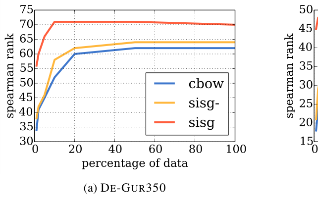
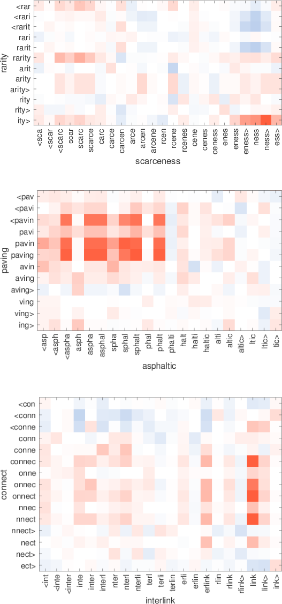

# FastText: Enriching Word Vectors with Subword Information

> Piotr Bojanowski, Edouard Grave, Armand Joulin, Tomas Mikolov | Facebook AI Research

本文提出了一种基于 skip-gram 模型的新方法，**将每个词表示为字符 $n$-gram 的集合**。核心内容：

- **字符 $n$-gram 表示**：为每个字符 $n$-gram 学习向量表示，**词向量为其所有 $n$-gram 向量的总和**
- **子词信息融合**：通过字符级信息丰富词向量，解决形态丰富语言中 **罕见词的表示问题**
- **Out-of-Vocabulary 处理**：能够为训练集中未出现的词计算有效的向量表示
- **多语言验证**：在九种不同语言上评估 **词相似度 和 词类比任务**，达到最优性能

关键发现：

- 使用 **子词信息** 的模型在所有语言的 **词相似度任务** 上均优于基线方法
- 对于 **形态丰富的语言**（如德语、俄语、捷克语），子词信息带来的提升更为显著
- 仅使用 **5% 的训练数据** 即可获得优于 **完整数据集** 上基线模型的性能
- 字符 $n$-gram 的最优长度范围为 3-6，能够有效捕获 **词缀和词根信息**

---

## 摘要

在大规模 无标注语料库 上训练的 **连续词表示** 对许多自然语言处理任务非常有用。学习此类表示的主流模型通过为每个词分配独立向量，**忽略了词的形态结构**，尤其对于具有 大词汇表 和 许多罕见词 的语言而言。在本文中，我们提出了一种基于 skip-gram 模型的新方法，其中**每个词被表示为字符 $n$-gram 的集合**。每个字符 $n$-gram 关联一个向量表示；**词的表示为其所有 $n$-gram 向量表示的总和**。我们的方法速度很快，能够在大规模语料库上快速训练模型，并且能够计算训练数据中未出现的词的表示。我们在九种不同的语言上评估了我们的词表示，包括词相似度和词类比任务。通过与最近提出的**形态词表示方法**进行比较，我们证明了我们的向量在这些任务上达到了最优性能。

## 1 引言

学习词的连续表示在自然语言处理领域有着悠久的历史。这些表示通常从大规模无标注语料库中通过 **共现统计** 推导而来 [12,34,25]。大量被称为分布式语义的研究工作已经研究了这些方法的性质 [37,3]。在神经网络领域，[9] 提出使用前馈神经网络学习词嵌入，通过基于左侧两个词和右侧两个词来预测一个词。最近，Mikolov 等人 [29,30] 提出了简单的对数线性模型，能够在大规模语料库上高效地学习词的连续表示。

这些技术大多为词汇表中的每个词分配一个独立的向量，不进行参数共享。特别是，它们忽略了**词的内部结构**，这**对于形态丰富的语言（如土耳其语 [33] 或芬兰语）是一个重要的局限性**。例如，在法语或西班牙语中，大多数动词有超过四十种不同的屈折形式，而芬兰语的名词有十五种格。**这些语言包含许多在训练语料库中很少出现（或完全不出现）的词形，使得学习良好的词表示变得困难**。因为许多词的构成遵循规则，所以可以通过使用字符级信息来改善 **形态丰富语言的向量表示**。

在本文中，我们提出学习字符 $n$-gram 的表示，并将词表示为 $n$-gram 向量的总和。我们的主要贡献是引入了连续 skip-gram 模型的扩展，该扩展考虑了子词信息。我们在九种**展示不同形态特征的语言上**评估了这个模型，展示了我们方法的优势。

## 2 相关工作

### 形态词表示

近年来，许多方法被提出将 **形态信息融入词表示**。为了**更好地建模罕见词**，Alexandrescu 和 Kirchhoff [1] 引入了**分解神经语言模型**，其中词被表示为特征集合。这些特征可能包括 **形态信息**，该技术已成功应用于**形态丰富的语言**，如土耳其语。最近，多项研究提出了**不同的组合函数来从 语素 推导 词的表示**。这些不同的方法依赖于**词的形态分解**，而我们的方法则不需要。类似地，Chen 等人 [7] 提出了一种**联合学习 中文词 和 字符嵌入 的方法**。Cotterell 和 Schütze [34] 提出 **约束形态相似的词具有相似的表示**。Cui 等人 [11] 描述了一种学习形态变换向量表示的方法，允许通过应用这些规则获得未见词的表示。在形态标注数据上训练的词表示也已被引入。与我们的方法最接近的是，Panchenko 等人 [31] **通过 奇异值分解 学习了 字符四元组 的表示**，**并通过 求和四元组表示 来推导 词的表示**。最近，Köper 等人 [22] 也提出 **使用字符 $n$-gram 计数向量来表示词**。然而，用于学习这些表示的目标函数 **基于释义对**，而我们的模型可以在任何文本语料库上训练。

### 用于自然语言处理的字符级特征

另一个与我们工作密切相关的研究领域是用于自然语言处理的**字符级模型**。这些模型 **放弃了词的分割**，旨在**直接从字符学习语言表示**。第一类此类模型是循环神经网络 [16]，应用于语言建模、文本规范化 [8]、词性标注 [24] 和句法分析 [2]。另一类模型是在字符上训练的卷积神经网络，应用于词性标注 [14]、情感分析 [13]、文本分类 [39] 和语言建模。Kim 等人 [21] 引入了一种基于受限玻尔兹曼机的语言模型，其中词被编码为字符 $n$-gram 的集合。最后，机器翻译的最新工作提出了使用 **子词单元** 来获得 **罕见词** 的表示。

## 3 模型

在本节中，我们提出 **考虑形态的词表示学习模型**。我们 **通过考虑子词单元来建模形态**，并用其字符 $n$-gram 的总和来表示词。我们将首先介绍用于训练词向量的通用框架，然后介绍我们的子词模型，最后描述如何处理字符 $n$-gram 的词典。

### 3.1 通用模型

我们**首先简要回顾由 Mikolov 等人 [29] 引入的连续 skip-gram 模型，我们的模型即由此派生**。给定大小为 $W$ 的词词汇表，其中词由其索引 $w \in \{1, \dots, W\}$ 标识，目标是为每个词 $w$ 学习一个向量表示。**受分布式假设 [18] 启发，词表示被训练来预测在其上下文中出现的词。**更正式地说，给定表示为词序列 $w_1, \dots, w_T$ 的大规模训练语料库，skip-gram 模型的目标是最大化以下对数似然：

$$
\sum_{t=1}^{T} \sum_{c \in \mathcal{C}_t} \log p(w_c | w_t)
$$

其中上下文 $\mathcal{C}_t$ 是词 $w_t$ 周围词的索引集合。给定 $w_t$ 观察到上下文词 $w_c$ 的概率将使用上述词向量进行参数化。目前，让我们考虑给定一个**评分函数 $s$，它将（词，上下文）对映射到 $\mathbb{R}$ 中的分数**。定义上下文词概率的一种可能选择是 softmax：

$$
p(w_c | w_t) = \frac{e^{s(w_t, w_c)}}{\sum_{j=1}^{W} e^{s(w_t, j)}}
$$

然而，**这种模型不适用于我们的情况，因为它意味着给定词 $w_t$，我们只预测一个上下文词 $w_c$。**

预测上下文词的问题可以被**框定为一组独立的二分类任务**。目标是独立地预测上下文词的存在（或不存在）。对于位置 $t$ 的词，我们考虑所有上下文词作为正样本，并从词典中随机采样负样本。对于选定的上下文位置 $c$，使用**二元逻辑损失**，我们得到以下**负对数似然**：

$$
\log(1 + e^{-s(w_t, w_c)}) + \sum_{n \in \mathcal{N}_{t,c}} \log(1 + e^{s(w_t, n)})
$$

其中 $\mathcal{N}_{t,c}$ 是从词汇表中采样的负样本集合。通过将逻辑损失函数记为 $\ell: x \mapsto \log(1 + e^{-x})$，我们可以将目标重写为：

$$
\sum_{t=1}^{T} \left[ \sum_{c \in \mathcal{C}_t} \ell(s(w_t, w_c)) + \sum_{n \in \mathcal{N}_{t,c}} \ell(-s(w_t, n)) \right]
$$

**评分函数 $s$ 在 词 $w_t$  和 上下文词 $w_c$ 之间的一个自然参数化是使用 词向量**。让我们为词汇表中的每个词 $w$ 定义两个向量 $\mathbf{u}_w$ 和 $\mathbf{v}_w$，属于 $\mathbb{R}^d$。这**两个向量在文献中有时被称为 输入 和 输出向量**。特别地，我们有向量 $\mathbf{u}_{w_t}$ 和 $\mathbf{v}_{w_c}$，分别对应词 $w_t$ 和 $w_c$。然后**分数可以计算为词向量和上下文向量之间的标量积**：$s(w_t, w_c) = \mathbf{u}_{w_t}^\top \mathbf{v}_{w_c}$。本节描述的模型是**带有负采样的 skip-gram 模型**，由 Mikolov 等人 [30] 引入。

### 3.2 子词模型

**通过为每个词使用独立的向量表示，skip-gram 模型忽略了词的内部结构**。在本节中，我们提出一个不同的评分函数 $s$，以考虑这种信息。

每个词 $w$ 被**表示为字符 $n$-gram 的集合**。我们**在词的开头和结尾添加特殊边界符号** `<` 和 `>`，以区分前缀和后缀与其他字符序列。我们**还将词 $w$ 本身包含在其 $n$-gram 集合中**，以便为每个词学习表示（除了字符 $n$-gram）。以词 `where` 和 $n=3$ 为例，它将由以下字符 $n$-gram 表示：`<wh`, `whe`, `her`, `ere`, `re>`，以及特殊序列 `<where>`。注意，对应于词 `her` 的序列 `<her>` 与词 `where` 中的三元组 `her` 不同。在实践中，我们**提取所有 $n$ 大于等于 3 且小于等于 6 的 $n$-gram**。这是一个非常简单的方法，可以考虑不同的 $n$-gram 集合，例如取所有前缀和后缀。

假设给定大小为 $G$ 的 $n$-gram 词典。给定词 $w$，让我们用 $\mathcal{G}_w \subset \{1, \dots, G\}$ 表示 $w$ 中出现的 $n$-gram 集合。我们为每个 $n$-gram $g$ 关联一个向量表示 $\mathbf{z}_g$。我们通过其所有 $n$-gram 向量表示的总和来表示一个词。因此我们得到评分函数：

$$
s(w, c) = \sum_{g \in \mathcal{G}_w} \mathbf{z}_g^\top \mathbf{v}_c
$$

这个简单的模型**允许在词之间共享表示**，从而**能够为罕见词学习可靠的表示**。

**为了限制模型的内存需求，我们使用一个哈希函数将 $n$-gram 映射到 1 到 $K$ 的整数**。我们使用 Fowler-Noll-Vo 哈希函数（特别是 FNV-1a 变体）**对字符序列进行哈希**。我们在下文中设置 $K = 2 \cdot 10^6$。最终，**一个词由其在词典中的索引 和 它包含的哈希 $n$-gram 集合来表示。**

> [!NOTE]
>
> TODO：没太懂

## 4 实验设置

### 4.1 基线

在大多数实验中（除第 5.3 节外），我们将我们的模型与 word2vec 包中 skip-gram 和 cbow 模型的 C 实现进行比较。

### 4.2 优化

我们通过在负对数似然上执行随机梯度下降来解决优化问题。与基线 skip-gram 模型一样，我们使用步长的线性衰减。给定包含 $T$ 个词的训练集和等于 $P$ 的数据遍历次数，时间 $t$ 的步长等于 $\gamma_0(1 - \frac{t}{TP})$，其中 $\gamma_0$ 是固定参数。我们通过 Hogwild 并行执行优化。所有线程共享参数并以异步方式更新向量。

### 4.3 实现细节

对于我们的模型和基线实验，我们使用以下参数：词向量维度为 300。对于每个正样本，我们随机采样 5 个负样本，概率与 uni-gram 频率的平方根成正比。我们使用大小为 $c$ 的上下文窗口，并在 1 到 5 之间均匀采样 $c$ 的大小。为了对最高频词进行子采样，我们使用 $10^{-4}$ 的拒绝阈值（更多细节请参见 Mikolov 等人 [30]）。在构建词典时，我们保留训练集中出现至少 5 次的词。步长 $\gamma_0$ 对于 skip-gram 基线设置为 0.025，对于我们的模型和 cbow 基线设置为 0.05。这些是 word2vec 包中的默认值，对我们的模型也适用。

使用此设置在英语数据上，我们的带有字符 $n$-gram 的模型训练速度比 skip-gram 基线慢约 $1.5\times$。实际上，我们处理 105k 词/秒/线程，而基线为 145k 词/秒/线程。我们的模型用 C++ 实现，并已公开发布。

### 4.4 数据集

除与先前工作比较外（第 5.3 节），我们在维基百科数据上训练模型。我们下载了九种语言的维基百科转储：阿拉伯语、捷克语、德语、英语、西班牙语、法语、意大利语、罗马尼亚语和俄语。我们使用 Matt Mahoney 的预处理 perl 脚本对原始维基百科数据进行规范化。所有数据集都经过洗牌，我们通过五次遍历数据来训练模型。

## 5 结果

我们在五个实验中评估了我们的模型：词相似度和词类比评估、与最优方法的比较、训练数据大小的影响分析，以及我们考虑的字符 $n$-gram 大小的影响。我们将在以下各节中详细描述这些实验。

### 5.1 人类相似度判断

我们首先在词相似度/相关性任务上评估我们表示的质量。我们通过计算人类判断和向量表示之间余弦相似度的 Spearman 秩相关系数来进行评估。对于德语，我们在三个数据集上比较不同模型：Gur65、Gur350 和 ZG222。对于英语，我们使用 Finkelstein 等人 [15] 引入的 WS353 数据集和 rare word 数据集（RW）。我们在翻译数据集 RG65 [20] 上评估法语词向量。西班牙语、阿拉伯语和罗马尼亚语词向量使用 Hassan 和 Mihalcea [19] 描述的数据集进行评估。俄语词向量使用 Panchenko 等人 [31] 引入的 HJ 数据集进行评估。

我们在表 1 中报告了所有数据集上我们的方法和基线的结果。这些数据集中的一些词未出现在我们的训练数据中，因此我们无法使用 cbow 和 skipgram 基线为这些词获得词表示。为了提供可比较的结果，我们默认对这些词使用零向量。由于我们的模型利用子词信息，我们也可以通过对其 $n$-gram 向量求和来为词典外词计算有效的表示。当词典外词使用零向量表示时，我们称我们的方法为 sisg-，否则称为 sisg（Subword Information Skip Gram）。

首先，通过查看表 1，我们注意到所提出的模型（sisg）使用子词信息，在所有数据集上都优于基线，除了英语 WS353 数据集。此外，为词典外词计算向量（sisg）总是至少与不计算（sisg-）一样好。这证明了使用字符 $n$-gram 形式的子词信息的优势。

其次，我们观察到使用字符 $n$-gram 的效果对阿拉伯语、德语和俄语比对英语、法语或西班牙语更重要。德语和俄语表现出语法变格，德语有四种格，俄语有六种格。此外，许多德语词是复合词；例如，名词短语 "table tennis" 写成一个词 "Tischtennis"。通过利用 "Tischtennis" 和 "Tennis" 之间的字符级相似性，我们的模型不会将这两个词表示为完全不同的词。

最后，我们观察到在英语 rare words 数据集（RW）上，我们的方法优于基线，而在英语 WS353 数据集上则不然。这是由于英语 WS353 数据集中的词是常用词，可以在不利用子词信息的情况下获得良好的向量。当评估不太常见的词时，我们看到使用词之间的字符级相似性可以帮助学习良好的词向量。

### 5.2 词类比任务

我们现在评估我们的方法在词类比问题上的表现，形式为 $A$ is to $B$ as $C$ is to $D$，其中 $D$ 必须由模型预测。我们使用引入的英语数据集、捷克语数据集、德语数据集和意大利语数据集。一些问题包含未出现在我们训练语料库中的词，因此我们将这些问题从评估中排除。

我们在表 2 中报告不同模型的准确率。我们观察到形态信息显著提高了句法任务；我们的方法优于基线。相反，它对语义问题没有帮助，甚至降低了德语和意大利语的性能。请注意，这与我们考虑的字符 $n$-gram 长度的选择密切相关。我们在第 5.5 节中表明，当 $n$-gram 的大小选择最优时，语义类比的下降较少。另一个有趣的观察是，正如预期的那样，对于形态丰富的语言（如捷克语和德语），相对于基线的改进更为重要。

### 5.3 与形态表示的比较

我们还将我们的方法与先前在词相似度任务上结合子词信息的词向量工作进行比较。使用的方法包括：Luong 等人 [27] 的递归神经网络、Botha 和 Blunsom [6] 的 morpheme cbow 以及 Cotterell 和 Schütze [10] 的形态变换。为了使结果可比较，我们在与比较方法相同的数据集上训练了我们的模型：Berardi 等人 [4] 发布的英语维基百科数据，以及 2013 WMT 共享任务的德语、西班牙语和法语新闻爬取数据。我们还将我们的方法与引入的对数线性语言模型进行比较，该模型在 Europarl 和新闻评论语料库上训练。同样，我们在相同的数据上训练模型以使结果可比较。使用我们的模型，我们通过对字符 $n$-gram 的表示求和来获得词典外词的表示。我们在表 3 中报告结果。我们观察到，与基于形态分割器获得的子词信息的技术相比，我们的简单方法表现良好。我们还观察到，我们的方法优于基于前缀和后缀分析的方法。德语的巨大改进是因为他们的方法没有建模名词复合，而我们的方法则建模了。

### 5.4 训练数据大小的影响

由于我们利用词之间的字符级相似性，我们能够更好地建模不频繁的词。因此，我们应该对训练数据的大小更加稳健。为了评估这一点，我们提出评估我们的词向量在相似度任务上的性能作为训练数据大小的函数。为此，我们在逐渐增大的维基百科部分上训练我们的模型和 cbow 基线。我们使用上述维基百科语料库，并分离出前 1%、2%、5%、10%、20% 和 50% 的数据。由于我们不重新洗牌数据集，它们都是彼此的子集。我们在图 1 中报告结果。

与第 5.1 节中介绍的实验一样，并非所有评估集中的词都出现在维基百科数据中。同样，默认情况下，我们对这些词使用零向量（sisg-）或通过求和 $n$-gram 表示来计算向量（sisg）。随着数据集缩小，词典外词比率增加，因此 sisg- 和 cbow 的性能必然下降。然而，所提出的模型（sisg）为先前未见过的词分配了非平凡的向量。

首先，我们注意到对于所有数据集和所有大小，所提出的方法（sisg）都优于基线。然而，随着更多数据可用，基线 cbow 模型的性能变得更好。另一方面，我们的模型似乎很快饱和，添加更多数据并不总是带来改进的结果。

其次，也是最重要的，我们注意到所提出的方法即使在使用非常小的训练数据集时也能提供非常好的词向量。例如，在德语 Gur350 数据集上，我们的模型（sisg）在 5% 的数据上训练达到了比在完整数据集上训练的 cbow 基线（62）更好的性能（66）。另一方面，在英语 RW 数据集上，使用 1% 的维基百科语料库，我们达到了 45 的相关系数，这优于在完整数据集上训练的 cbow（43）。这具有非常重要的实际意义：性能良好的词向量可以在有限大小的数据集上计算，并且仍然对先前未见过的词有效。通常，当在特定应用中使用向量词表示时，建议在与应用相关的文本数据上重新训练模型。然而，这种相关的任务特定数据通常非常稀缺，从减少的训练数据量中学习是一个巨大的优势。

### 5.5 $n$-gram 大小的影响

所提出的模型依赖于使用字符 $n$-gram 来将词表示为向量。如第 3.2 节所述，我们决定使用从 3 到 6 个字符的 $n$-gram。这个选择是任意的，动机是这些长度的 $n$-gram 将涵盖广泛的信息。它们将包括短后缀（例如对应于变位和变格）以及较长的词根。在本实验中，我们经验性地检查了我们使用的 $n$-gram 范围对性能的影响。我们在表 4 中报告了英语和德语在词相似度和类比数据集上的结果。

我们观察到，对于英语和德语，我们任意选择的 3-6 是一个合理的决定，因为它在不同语言上提供了令人满意的性能。长度范围的最佳选择取决于所考虑的任务和语言，应进行适当调整。然而，由于测试数据稀缺，我们没有实施任何适当的验证程序来自动选择最佳参数。尽管如此，采用较大的范围（如 3-6）提供了合理数量的子词信息。

该实验还表明，包含长 $n$-gram 很重要，因为对应于 $n \leq 5$ 和 $n \leq 6$ 的列效果最好。这对于德语尤其如此，因为许多名词是由多个单元组成的复合词，只能通过较长的字符序列来捕获。在类比任务上，我们观察到使用较大的 $n$-gram 有助于语义类比。然而，使用 $n \geq 3$ 总是比使用 $n \geq 2$ 效果更好，这表明字符 2-gram 对于该任务没有信息量。如第 3.2 节所述，在计算字符 $n$-gram 之前，我们在词的开头和结尾添加特殊位置字符以表示词的开始和结束。因此，2-gram 不足以正确捕获对应于变位或变格的后缀，因为它们由单个适当字符和一个位置字符组成。

### 5.6 语言建模

在本节中，我们描述了在语言建模任务上使用我们方法获得的词向量的评估。我们在五种语言（捷克语、德语、西班牙语、法语、俄语）上评估了我们的语言模型，使用引入的数据集。每个数据集包含大约一百万个训练 token，我们使用与之前相同的预处理和数据划分。

我们的模型是一个具有 650 个 LSTM 单元的循环神经网络，使用 dropout（概率为 0.5）和权重衰减（正则化参数为 $10^{-5}$）进行正则化。我们使用学习率为 0.1 的 Adagrad 算法学习参数，裁剪范数大于 1.0 的梯度。我们将网络权重初始化在 $[-0.05, 0.05]$ 范围内，批量大小为 20。考虑两个基线：我们将我们的方法与对数线性语言模型和字符感知语言模型进行比较。我们在语言建模任务的训练集上训练了带有字符 $n$-gram 的词向量，并使用它们来初始化我们语言模型的查找表。我们在表 5 中报告了不使用预训练词向量（LSTM）、使用无子词信息预训练的词向量（sg）和使用我们的向量（sisg）的模型的测试困惑度。

我们观察到，使用预训练词表示初始化语言模型的查找表可以提高测试困惑度。最重要的观察是，使用带有子词信息训练的词表示优于普通的 skipgram 模型。我们观察到这种改进对于形态丰富的斯拉夫语言（如捷克语，困惑度比 sg 降低 8%；俄语降低 13%）最为显著。对于罗曼语族语言（如西班牙语降低 3% 或法语降低 2%），改进不那么显著。这显示了子词信息在语言建模任务上的重要性，并展示了我们提出的向量对于形态丰富语言的有用性。

## 6 定性分析

### 6.1 最近邻

我们在表 7 中报告了定性结果示例。对于选定的词，我们展示了使用所提出方法训练的向量和 skipgram 基线的余弦相似度最近邻。正如预期的那样，对于复杂、技术性和不频繁的词，使用我们方法的最近邻比使用基线模型获得的更好。

### 6.2 字符 $n$-gram 和语素

我们想定性评估词中最重要的 $n$-gram 是否对应于语素。为此，我们取一个词向量，它构造为 $n$-gram 的总和。如第 3.2 节所述，每个词 $w$ 被表示为其 $n$-gram 的总和：$\mathbf{u}_w = \sum_{g \in \mathcal{G}_w} \mathbf{z}_g$。对于每个 $n$-gram $g$，我们提出通过省略 $g$ 来计算受限表示 $\mathbf{u}_{w \backslash g}$：

$$
\mathbf{u}_{w \backslash g} = \sum_{g' \in \mathcal{G} - \{g\}} \mathbf{z}_{g'}
$$

然后我们按 $\mathbf{u}_w$ 和 $\mathbf{u}_{w \backslash g}$ 之间余弦值的递增顺序对 $n$-gram 进行排序。我们在表 6 中展示了三种语言中选定词的排序 $n$-gram。

对于德语，它有很多复合名词，我们观察到最重要的 $n$-gram 对应于有效的语素。好的例子包括 Autofahrer（司机），其最重要的 $n$-gram 是 Auto（汽车）和 Fahrer（司机）。我们还观察到英语中复合名词分解为语素，例如 lifetime 或 starfish 等词。然而，对于英语，我们也观察到 $n$-gram 可以对应于词缀，如 kindness 或 unlucky 中的词缀。有趣的是，对于法语，我们观察到动词的屈折变化，以 ais>、ent> 或 ions> 等结尾。

### 6.3 词典外词的词相似度

如第 3.2 节所述，我们的模型能够为训练集中未出现的词构建词向量。对于此类词，我们只需对其 $n$-gram 的向量表示求平均。为了评估这些表示的质量，我们通过从英语 RW 相似度数据集中选择几个词对来分析哪些 $n$-gram 最适合词典外词。我们选择其中一个词不在训练词典中，因此仅由其 $n$-gram 表示的词对。对于每对词，我们显示词中出现的每对 $n$-gram 之间的余弦相似度。为了模拟具有更多词典外词的设置，我们使用在 1% 维基百科数据上训练的模型，如第 5.4 节所述。结果在图 2 中展示。

我们观察到有趣的模式，表明子词正确匹配。实际上，对于词 chip，我们清楚地看到 microcircuit 中有两组 $n$-gram 匹配良好。这些大致对应于 micro 和 circuit，而它们之间的 $n$-gram 匹配不好。另一个有趣的例子是 rarity 和 scarceness 这对词。实际上，scarce 大致匹配 rarity，而后缀 -ness 与 -ity 匹配非常好。最后，词 preadolescent 得益于 -adolesc- 子词而与 young 匹配良好。这表明我们构建了健壮的词表示，如果词典中找不到语法形式，可以忽略前缀和后缀。

## 7 结论

在本文中，我们研究了一种通过考虑 子词信息 来学习词表示的简单方法。我们的方法将字符 $n$-gram 融入 skip-gram 模型，与先前引入的想法相关。由于其简单性，我们的模型训练速度快，不需要任何预处理或监督。我们证明了我们的模型优于不考虑子词信息的基线方法，以及**依赖形态分析**的方法。我们将开源我们模型的实现，以促进未来学习子词表示工作的比较。

## 致谢

我们感谢 Marco Baroni、Hinrich Schütze [34] 和匿名审稿人提供的富有洞察力的评论。

## 参考文献

[1] Andrei Alexandrescu and Katrin Kirchhoff. 2006. Factored neural language models. In Proc. NAACL.

[2] Miguel Ballesteros, Chris Dyer, and Noah A. Smith. 2015. Improved transition-based parsing by modeling characters instead of words with LSTMs. In Proc. EMNLP.

[3] Marco Baroni and Alessandro Lenci. 2010. Distributional memory: A general framework for corpus-based semantics. Computational Linguistics, 36(4):673–721.

[4] Giacomo Berardi, Andrea Esuli, and Diego Marcheggiani. 2015. Word embeddings go to Italy: a comparison of models and training datasets. Italian Information Retrieval Workshop.

[5] Piotr Bojanowski, Armand Joulin, and Tomáš Mikolov. 2015. Alternative structures for character-level RNNs. In Proc. ICLR.

[6] Jan A. Botha and Phil Blunsom. 2014. Compositional morphology for word representations and language modelling. In Proc. ICML.

[7] Xinxiong Chen, Lei Xu, Zhiyuan Liu, Maosong Sun, and Huanbo Luan. 2015. Joint learning of character and word embeddings. In Proc. IJCAI.

[8] Grzegorz Chrupała [8]. 2014. Normalizing tweets with edit scripts and recurrent neural embeddings. In Proc. ACL.

[9] Ronan Collobert and Jason Weston. 2008. **A unified architecture for natural language processing: Deep neural networks with multitask learning**. In Proc. ICML.

[10] Ryan Cotterell and Hinrich Schütze [34]. 2015. Morphological word-embeddings. In Proc. NAACL.

[11] Qing Cui, Bin Gao, Jiang Bian, Siyu Qiu, Hanjun Dai, and Tie-Yan Liu. 2015. KNET: A general framework for learning word embedding using morphological knowledge. ACM Transactions on Information Systems, 34(1):4:1–4:25.

[12] Scott Deerwester, Susan T. Dumais, George W. Furnas, Thomas K. Landauer, and Richard Harshman. 1990. Indexing by latent semantic analysis. Journal of the American Society for Information Science, 41(6):391–407.

[13] Cicero Nogueira dos Santos and Maira Gatti. 2014. Deep convolutional neural networks for sentiment analysis of short texts. In Proc. COLING.

[14] Cicero Nogueira dos Santos and Bianca Zadrozny. 2014. Learning character-level representations for part-of-speech tagging. In Proc. ICML.

[15] Lev Finkelstein, Evgeniy Gabrilovich, Yossi Matias, Ehud Rivlin, Zach Solan, Gadi Wolfman, and Eytan Ruppin. 2001. Placing search in context: The concept revisited. In Proc. WWW.

[16] Alex Graves. 2013. Generating sequences with recurrent neural networks. arXiv preprint arXiv:1308.0850.

[17] Iryna Gurevych [17]. 2005. Using the structure of a conceptual network in computing semantic relatedness. In Proc. IJCNLP.

[18] Zellig S Harris. 1954. Distributional structure. Word, 10(2-3):146–162.

[19] Samer Hassan and Rada Mihalcea. 2009. Cross-lingual semantic relatedness using encyclopedic knowledge. In Proc. EMNLP.

[20] Colette Joubarne [20] and Diana Inkpen. 2011. Comparison of semantic similarity for different languages using the google n-gram corpus and second-order co-occurrence measures. In Proc. Canadian Conference on Artificial Intelligence.

[21] Yoon Kim, Yacine Jernite, David Sontag, and Alexander M Rush. 2016. Character-aware neural language models. In Proc. AAAI.

[22] Maximilian Köper, Christian Scheible, and Sabine Schulte im Walde. 2015. Multilingual reliability and "semantic" structure of continuous word spaces. Proc. IWCS 2015.

[23] Angeliki Lazaridou, Marco Marelli, Roberto Zamparelli, and Marco Baroni. 2013. Compositionally derived representations of morphologically complex words in distributional semantics. In Proc. ACL.

[24] Wang Ling, Chris Dyer, Alan W. Black, Isabel Trancoso, Ramon Fermandez, Silvio Amir, Luis Marujo, and Tiago Luis. 2015. Finding function in form: Compositional character models for open vocabulary word representation. In Proc. EMNLP.

[25] Kevin Lund and Curt Burgess. 1996. Producing high-dimensional semantic spaces from lexical co-occurrence. Behavior Research Methods, Instruments, & Computers, 28(2):203–208.

[26] Minh-Thang Luong and Christopher D. Manning. 2016. Achieving open vocabulary neural machine translation with hybrid word-character models. In Proc. ACL.

[27] Thang Luong, Richard Socher, and Christopher D. Manning. 2013. Better word representations with recursive neural networks for morphology. In Proc. CoNLL.

[28] Tomáš Mikolov, Ilya Sutskever [36], Anoop Deoras, Hai-Son Le, Stefan Kombrink, and Jan Černocký. 2012. Subword language modeling with neural networks. Technical report, Faculty of Information Technology, Brno University of Technology.

[29] Tomáš Mikolov, Kai Chen, Greg D. Corrado, and Jeffrey Dean. 2013a. **Efficient estimation of word representations in vector space**. arXiv preprint arXiv:1301.3781.

[30] Tomáš Mikolov, Ilya Sutskever, Kai Chen, Greg S. Corrado, and Jeff Dean. 2013b. **Distributed representations of words and phrases and their compositionality**. In Adv. NIPS.

[31] Alexander Panchenko, Dmitry Ustalov, Nikolay Arefyev, Denis Paperno, Natalia Konstantinova, Natalia Loukachevitch, and Chris Biemann. 2016. Human and machine judgements for russian semantic relatedness. In Proc. AIST.

[32] Siyu Qiu, Qing Cui, Jiang Bian, Bin Gao, and Tie-Yan Liu. 2014. Co-learning of word representations and morpheme representations. In Proc. COLING.

[33] Harri Sak, Antti Puurula, and Alesis de la Higuera. 2010. Improving language models by retrieving from trillions of tokens. In Proc. ICML.

[34] Hinrich Schütze [34]. 1992. Dimensions of meaning. In Proceedings of the 1992 ACM/IEEE conference on Supercomputing, pages 784–793.

[35] Rico Sennrich, Barry Haddow, and Alexandra Birch. 2016. Neural machine translation of rare words with subword units. In Proc. ACL.

[36] Ilya Sutskever, James Martens, and Geoffrey E Hinton. 2011. Generating text with recurrent neural networks. In Proc. ICML.

[37] Peter D. Turney, Patrick Pantel, et al. 2010. From frequency to meaning: Vector space models of semantics. Journal of artificial intelligence research, 37:141–188.

[38] Zesch and Gurevych. 2006. Automated construction of a German-Italian thesaurus using a bilingual dictionary. In Proc. EACL.

[39] Xiang Zhang, Junbo Zhao, and Yann LeCun. 2015. Character-level convolutional networks for text classification. In Proc. NIPS.
