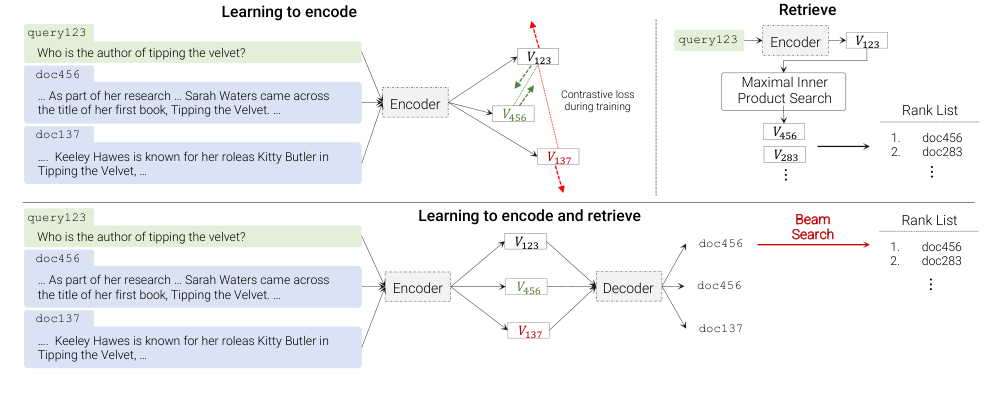
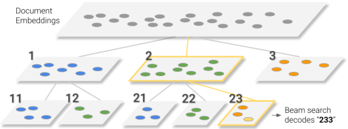
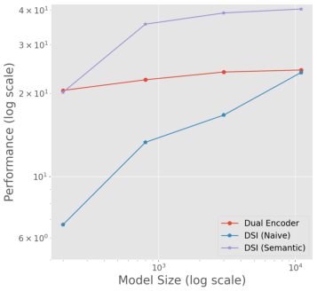
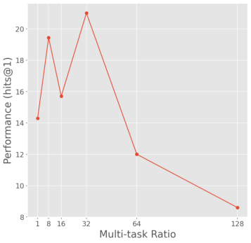
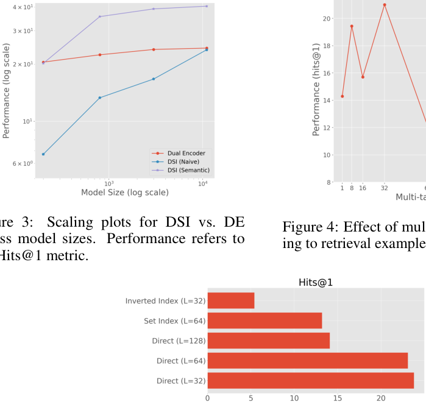

# Transformer Memory as a Differentiable Search Index

> Yi Tay\*, Vinh Q. Tran\*, Mostafa Dehghani, Jianmo Ni, Dara Bahri, Harsh Mehta, Zhen Qin, Kai Hui, Zhe Zhao, Jai Gupta, Tal Schuster, William W. Cohen, Donald Metzler | Google Research

本文证明信息检索可以通过单个Transformer完成，其中关于语料库的所有信息都编码在模型的参数中。为此，我们引入了可微搜索索引（Differentiable Search Index, DSI），这是一种新的范式，学习一个text-to-text模型，将字符串查询直接映射到相关的docid；换句话说，DSI模型仅使用其参数直接回答查询，极大地简化了整个检索过程。我们研究了文档及其标识符表示方式的变化、训练流程的变化以及模型与语料库规模之间的相互作用。实验表明，在适当的设计选择下，DSI显著优于强基线方法（如双编码器模型）。此外，DSI展现出强大的泛化能力，在零样本设置中超越了BM25基线。

---

## 摘要

在本文中，我们证明信息检索可以通过单个Transformer完成，其中关于语料库的所有信息都编码在模型的参数中。为此，我们引入了可微搜索索引（Differentiable Search Index, DSI），这是一种新的范式，学习一个text-to-text模型，将字符串查询直接映射到相关的docid；换句话说，DSI模型仅使用其参数直接回答查询，极大地简化了整个检索过程。我们研究了文档及其标识符表示方式的变化、训练流程的变化以及模型与语料库规模之间的相互作用。实验表明，在适当的设计选择下，DSI显著优于强基线方法（如双编码器模型）。此外，DSI展现出强大的泛化能力，在零样本设置中超越了BM25基线。

## 1 引言

信息检索（IR）系统将用户查询 $q \in Q$ 映射到相关文档 $\{d_1, \ldots, d_n\} \subseteq D$ 的排序列表，这些文档通常由整数或称为文档标识符（docid）的短字符串表示。最广泛使用的IR方法基于流水线的"检索-排序"（retrieve-then-rank）策略。对于检索，基于倒排索引或最近邻搜索的方法很常见，其中基于对比学习的双编码器（DE）[1, 2, 3]是目前的最先进技术。

本文提出了一种替代架构，其中使用序列到序列（seq2seq）学习系统[4]直接将查询 $q$ 映射到相关的docid $j \in Y$ 。该提案如图1下半部分所示，采用序列到序列的编码器-解码器架构。

我们将这种提出的架构称为可微搜索索引（Differentiable Search Index, DSI），并用大型预训练Transformer模型[5]实现，基于大型生成式语言模型（LM）[6, 7, 8, 9, 10]的最新成功。在这种提出的架构中，语料库的所有信息都编码在Transformer语言模型的参数中。

在推理时，训练好的模型以文本查询 $q$ 作为输入，输出一个docid $j$ 。如果需要，可以使用束搜索（beam search）生成潜在相关docid的排序列表。正如我们将展示的，当正确训练时，这一过程可以出人意料地有效。在我们的实验中，它能够持续超越DE基线，有时效果显著：对于base规模的T5模型，最小语料库上的Hits@1提升了超过20个百分点，从DE的12.4%提升到DSI的33.9%；在比其大30倍的语料库上，性能提升了近7个百分点。当使用更大模型时，这些增益进一步增加：对于11B参数的T5模型，Hits@1性能在小语料库上比DE提升超过25个百分点，在大语料库上提升超过15个百分点。DSI在零样本设置中也表现极为出色，例如Hits@1比BM25提升了14个百分点。

除了这些定量增益，DSI架构比DE简单得多（见表1）。DE系统固定了搜索过程（MIPS）并学习为该搜索过程优化性能的内部表示；相比之下，DSI系统不包含专用的固定搜索过程，而是使用标准模型推理将编码映射到docid。

令机器学习社区特别感兴趣的是，如表1所示，DSI将检索的所有方面都映射为易于理解的ML任务。这可能为解决长期存在的IR问题带来新的潜在方法。例如，由于索引现在是模型训练的一个特例，增量更新索引就变成了模型更新的一个特例[11]。

在本文中，DSI应用于中等规模的语料库（从10k到320k个文档），所有这些语料库都源自一个具有挑战性的检索任务，我们将DSI扩展到更大语料库的重要问题留给未来工作。所考虑的任务是从Natural Questions（NQ）数据集中给定问题检索支持段落，这是一个对词项模型具有挑战性的任务。

虽然DSI的想法很简单，但有许多实现方式，其中一些效果出奇地好，而另一些则出奇地差。下面我们探索DSI架构的多种变体。

**文档表示。** 我们探索了几种表示文档的方法，包括使用文档全文的"朴素"方法，以及传统IR引擎使用的词袋（bag-of-words）表示的变体。

**Docid表示。** 我们研究了多种表示docid的方法。除了将整数朴素地表示为文本字符串外，我们还考虑了无结构原子docid（每个文档分配一个唯一的token），以及通过语料库的层次聚类构建结构化语义docid的一些简单基线方法。结构化docid（无论是通过聚类语义结构化，还是作为分词整数朴素结构化）都能更好地扩展到大型语料库，因为解码器中使用的词汇表规模更大。

**索引。** 可训练的IR系统传统上有两个阶段：索引语料库（即记忆每个文档的信息）和学习如何有效地从索引中检索。在DSI中，索引存储在模型参数中，索引只是另一种模型训练。图1提出了一种索引语料库的方法：即，在（1）将文档 $d_j$ 与其docid $j$ 配对的示例 $(d_j, j)$ 以及（2）将查询 $q$ 与相关docid $j$ 配对的示例 $(q, j)$ 上进行训练。在此设置中，类型（1）的示例是"索引"示例。

虽然很明显仅类型（2）的示例不足以让系统泛化到新的检索，但有许多类型（1）的替代方案可能合理地"教会"模型文档与docid之间的关联。我们在下面探索了其中一些方案，并发现一些看似合理的技术表现非常差。我们还探索了多种替代的多任务优化和课程学习方案来组合这些类型的示例。

**模型和语料库规模的影响。** 由于最近的结果表明大型LM的某些属性仅在非常大的模型规模下才出现[6]，我们探索了DSI在一系列模型规模和语料库规模（10k、100k和320k文档）上的性能。

**总结。** 我们表明，即使是文档和docid的朴素表示，配合适当的训练流程来微调现代大型LM，也能表现出奇地好；我们提出了两种改进的docid表示方法——无结构docid和语义结构化docid——它们改进了朴素表示的选择。我们表明索引/训练策略之间存在显著的性能差异，并且DSI的性能随模型规模显著且一致地提升。据我们所知，这是生成式索引首次在well-studied的文档检索任务上超越强基线的案例。

表1：信息检索需要一系列决策，涉及文档表示、索引和检索的子问题。结构化文档变体的DSI还对第四个决策敏感，即docid的表示方式。

| | BM25或TFIDF | 双编码器（DE） | 可微搜索索引（DSI） |
|---|---|---|---|
| 文档/查询表示 | 稀疏 $v_{dj}$ 向量 $\in \mathbb{R}^{|V|}$ | 稠密 $v_{dj}$ 向量 $\in \mathbb{R}^d$ | 多种（见第3.1.2节） |
| docid表示 | — | — | 多种（见第3.2节） |
| 索引 | 构建倒排索引，每个词项 $t \to \{d_{j1}, \ldots, d_{jk}\}$ | 构建表格映射每个文档向量 $v_{dj} \to j$ | 训练模型（见第3.1.1节）映射 $d_j \to j$ |
| 检索 | 近似稀疏矩阵乘法，寻找 $\arg\max_j v_q^T v_{dj}$ | 近似MIPS，寻找 $\arg\max_j v_q^T v_{dj}$ | 运行训练好的模型（top-1），寻找 $\arg\max_j \Pr(j|q)$ |


图1：双编码器（上）与可微搜索索引（下）的对比。

## 2 相关工作

De Cao等人[12]描述了一个相关的序列到序列系统，称为自回归实体链接（autoregressive entity linking），其中提到某个实体（可能隐式地，例如通过提出该实体是答案的问题）的文档被映射到该实体的规范名称。在Wikipedia的情况下，规范实体名称对应页面标题，因此这可以看作是一种文档检索。这种方法已被应用于其他目的，例如生成规范形式的知识库三元组[13]。我们考虑的任务与自回归实体链接中考虑的任务不同：我们的目标是检索包含答案的文档，而不是标题就是答案的文档。更重要的是，在自回归实体链接中，生成目标是一个语义上有意义的名称，而我们允许目标是任意的docid。这使得我们的方法适用于一般的检索任务，但也引发了关于docid表示和索引策略的新问题。

在自回归实体链接中，生成被约束为从固定集合中返回输出。将DSI的生成输出约束为有效的docid是可行的。虽然我们没有使用这种技术，但它在多大程度上可能提高性能是一个值得研究的问题。

关于检索增强生成（retrieval augmented generation）有大量工作，即检索辅助文档来增强语言模型[14, 15]。这些技术对许多任务（包括问答）都有用，但依赖于传统的检索方法（如DE）。在这里，我们使用生成来替代检索过程，而不是使用检索来增强生成过程。

双编码器[16, 1, 17, 3, 2]是一种成熟的检索范式。其关键思想是独立生成查询和文档嵌入，并在所有嵌入对上执行向量空间中的相似性检索。查询和候选文档由序列编码器生成，并使用某种形式的对比损失进行训练。

将大型Transformer模型解释为记忆存储的做法已在先前工作中得到研究。Roberts等人[18]展示了在闭卷问答（closed-book QA）任务上的成功，他们训练T5模型检索在预训练期间编码在模型参数中的事实。然而，与CBQA不同，本文提出的问题是根据docid检索完整文档，而不是生成直接答案。同时，Petroni等人[19]也研究了作为知识库的语言模型，发现预训练LM可能已经包含关系知识。Geva等人[20]分析了Transformer前馈层中编码的知识。也有工作展示了Transformer与联想记忆（associative memory）和Hopfield网络的关系[21]，这强化了Transformer直觉上应能很好地用作联想记忆存储或搜索索引的观点。

## 3 可微搜索索引

提出的可微搜索索引（Differentiable Search Index, DSI）的核心思想是将传统的多阶段检索-排序流水线完全参数化到一个单一神经模型中。为此，DSI模型必须支持两种基本操作模式：

- **索引：** DSI模型应学习将每个文档 $d_j$ 的内容与其对应的docid $j$ 关联起来。本文采用一种直接的序列到序列（seq2seq）方法，以文档token作为输入并生成标识符作为输出。
- **检索：** 给定输入查询，DSI模型应返回候选docid的排序列表。本文通过自回归生成实现这一点。

遵循这两种操作，DSI模型可以训练来索引语料库，并可选地在可用标注数据（查询和标注文档）上进行微调，然后用于检索相关文档——所有这些都在一个统一的模型中完成。与"检索-排序"方法相比，这种模型允许简单的端到端训练，并且可以轻松地用作更大、更复杂的神经模型的可微子组件。

### 3.1 索引策略

我们研究了旨在学习文档与其标识符之间关联的各种索引策略。我们训练模型在给定一系列文档token的情况下预测docid。这使得我们的模型能够学习哪个标识符属于哪个文档，可以被视为传统搜索索引的可微版本。我们考虑了多种替代方案，并在后续章节中消融这些设置。最终采用的策略是带直接索引（direct indexing）的Inputs2Targets。

#### 3.1.1 索引方法

本节讨论我们考虑的索引任务变体。

**Inputs2Target。** 我们将其构建为一个seq2seq任务： $doc\_tokens \to docid$ 。顾名思义，这以直接的输入到目标（inputs-to-targets）方式将docid绑定到文档token。其优势在于标识符是去噪目标，使其更接近损失函数。由于检索任务也涉及预测标识符，这种形式允许网络在序列长度方面遵循相似的输入-目标平衡。一个潜在的弱点是文档token不是去噪目标，因此没有在文档token上进行通用预训练的机会。

**Targets2Inputs。** 这种形式考虑上述方案的相反方向，即从标识符生成文档token： $docid \to doc\_tokens$ 。直观上，这等价于训练一个以docid为条件的自回归语言模型。

**Bidirectional。** 这种形式在同一协同训练（co-training）设置中同时训练Inputs2Targets和Targets2Inputs。添加前缀token让模型知道当前执行的任务方向。

**Span Corruption。** 我们还探索了一种设置，即使用包含docid token的跨度损坏（span corruption）去噪[7]。在这种方法中，我们将标识符作为前缀拼接到文档token上，该前缀可以在跨度损坏目标中被随机遮蔽为跨度。

这种方法具有以下优势：（1）在索引期间也执行通用预训练；（2）实现docid作为去噪目标和输入的良好平衡。

#### 3.1.2 文档表示策略

在前一节中，我们探讨了"如何索引"。本节研究"索引什么？"，即如何最好地表示 $doc\_tokens$ 。我们列出以下选项，并在后续实验中仔细消融它们。最终最佳选项是直接索引方法（direct indexing）。

**Direct Indexing（直接索引）。** 这种策略精确表示文档。我们取文档的前 $L$ 个token，保持顺序不变，并将其与docid关联。

**Set Indexing（集合索引）。** 文档可能包含重复词项和/或无信息量的词（例如停用词）。这种策略使用Python默认的set操作去重，并移除文档中的停用词。过滤后的文档其余部分以与直接索引类似的方式输入模型。

**Inverted Index（倒排索引）。** 这种策略将分块的文档（连续的token块）而不是整个文档直接映射到docid。我们随机子采样一个包含 $k$ 个token的连续块，并将其与docid关联。这种方法的关键优势在于可以查看前 $k$ 个token之外的内容。

### 3.2 用于检索的Docid表示

基于seq2seq的DSI模型通过给定输入查询解码docid来完成检索。如何有效地进行解码很大程度上取决于docid在模型中的表示方式。本节的剩余部分探索了多种可能的docid表示方式以及如何处理每种方式的解码。

**无结构原子标识符（Unstructured Atomic Identifiers）。** 最朴素的文档表示方式是给每个文档分配一个任意（可能随机）的唯一整数标识符。我们称之为无结构原子标识符。

对于这些标识符，一个明显的解码形式是学习标识符上的概率分布。在这种情况下，模型被训练为对每个唯一的docid（ $|N_{documents}|$ ）发射一个logit。这类似于标准语言模型中的输出层，但扩展到了包括docid。为此，我们按如下方式扩展标准语言模型的输出词汇表：

$$
O = \text{Softmax}([W_{tokens}; W_{docs}]^T h_{last})
$$

其中 $[;]$ 是行向拼接操作符， $W_{tokens} \in \mathbb{R}^{d_{model} \times |N_{tokens}|}$ ， $W_{docs} \in \mathbb{R}^{d_{model} \times |N_{documents}|}$ 。 $h_{last}$ 是解码器堆栈最后一层的隐藏状态（ $\in \mathbb{R}^{d_{model}}$ ）。要检索给定查询的top-k个文档，我们只需对输出logit进行排序并返回相应的索引。这也让人联想到标准的listwise学习排序方法，即一次性考虑所有文档。

**朴素结构化字符串标识符（Naively Structured String Identifiers）。** 我们还考虑了一种看似荒谬的方法，即将无结构标识符（即任意的唯一整数）视为可分词化的字符串。我们称之为朴素结构化标识符。

在这种形式中，检索通过一次一个token地顺序解码docid字符串来完成。这消除了无结构原子标识符所需的大规模softmax输出空间，也消除了为每个单独的docid学习嵌入的需要。

在解码时，使用束搜索（beam search）来获得预测的最佳docid。使用这种策略，获得top-k排序不那么直接。一种方法是穷举搜索整个docid空间，计算每个docid在给定查询下的似然。相反，我们使用部分束搜索树来构建top-k检索分数。我们发现这种近似的效率和效果在实践中都很好。

**语义结构化标识符（Semantically Structured Identifiers）。** 迄今为止所有表示docid的方法都假设标识符是以任意方式分配的。虽然探索任意标识符的极限非常有趣，但直觉上，赋予docid空间语义结构可以带来更好的索引和检索能力。因此，本节探索语义结构化标识符。

具体来说，我们旨在自动创建满足以下属性的标识符：
（1）docid应捕获其关联文档的某些语义信息；
（2）docid的结构应使得搜索空间在每个解码步骤后被有效缩小。

这导致语义相似的文档共享标识符前缀。在本文中，我们将其视为一个完全无监督的预处理步骤。然而，作为未来工作的一部分，可能可以以完全端到端的方式集成和自动学习语义标识符。

为了构建具有此属性的标识符，我们采用一个简单的层次聚类过程，基于文档嵌入生成一个十进制树（或更一般地说，一个trie）。给定要索引的语料库，所有文档被聚类为10个簇。每个文档被分配一个以其簇编号（0-9）为标识符。对于每个包含超过 $c$ 个文档的簇，递归地应用该算法，将下一层的结果（标识符的剩余后缀）附加到现有标识符上。

对于包含 $c$ 个或更少文档的簇，每个元素被分配一个从0到至多 $c-1$ 的任意数字，其数字位同样附加到现有标识符上。虽然这一特定过程生成的是一个十进制树，但通过其他多种合理的策略也可以生成类似类型的trie。在实践中，我们简单地对由小型8层BERT模型生成的嵌入应用k-means，设置 $c = 100$ 。我们在算法1中包含此过程的伪代码。


图2：用于分配语义结构化标识符的层次聚类过程的可视化示例。在推理时，束搜索导航此trie以解码正确的docid。

算法1：生成语义结构化标识符。（参见第3.2节。）
```
输入：文档嵌入 X_{1:N}，其中 X_i \in \mathbb{R}^d
输出：对应的docid字符串 J_{1:N}
function GENERATESEMANTICIDS(X_{1:N})
    C_{1:10} \leftarrow Cluster(X_{1:N}, k = 10)
    J \leftarrow 空列表
    for i = 0 to 9 do
        J_{current} \leftarrow [i] * |C_{i+1}|
        if |C_{i+1}| > c then
            J_{rest} \leftarrow GENERATESEMANTICIDS(C_{i+1})
        else
            J_{rest} \leftarrow [0, \ldots, |C_{i+1}| - 1]
        end if
        J_{cluster} \leftarrow elementwiseStrConcat(J_{current}, J_{rest})
        J \leftarrow J.appendElements(J_{cluster})
    end for
    J \leftarrow reorderToOriginal(J, X_{1:N}, C_{1:10})
    return J
end function
```

### 3.3 训练与优化

我们训练的DSI模型针对seq2seq交叉熵损失进行优化，并使用教师强制（teacher forcing）进行训练。我们探索了两种主要的DSI模型训练策略。第一种更直接的策略是首先训练模型执行索引（记忆化），然后是微调阶段，其中训练好的模型用于将查询映射到docid（即检索）。第二种策略是在多任务设置中一起训练它们。为此，我们以类似于T5风格的协同训练方式构建协同训练任务（例如，使用任务提示来区分它们）。后者显著更好，尤其是当索引任务示例与检索任务示例的比例很高时。因此，我们采用多任务学习作为默认策略。

在此，我们注意到我们的设置是独特的，不同于传统的多任务学习或迁移学习。在典型的多任务设置中，两个任务具有共享的共性，如果同时学习，可以提高两个任务的性能。然而，在我们的设置中，检索任务完全依赖于索引任务。具体来说，没有索引任务，检索任务所利用的标识符将完全无意义。因此，为了解决任务B（检索），模型需要足够好地学习任务A（索引）。这种问题设置提出了独特且 largely unexplored 的研究挑战，可能对ML社区具有吸引力。

## 4 实验

在本节中，我们讨论实验设置、所使用的数据集和比较的基线。我们还讨论了实验结果、发现以及本文前面各节讨论的各种策略的效果。由于这是一个相当新的概念，本文旨在提出一个概念验证，并寻求回答研究问题，而不是进行"sota式"的比较。我们将其他设置和基线的广泛比较留给未来工作。

**数据集。** 我们在具有挑战性的Natural Questions（NQ）[22]数据集上进行实验。NQ包含307K个查询-文档训练对和8K个验证对，其中查询是自然语言问题，文档是Wikipedia文章。给定一个问题，检索任务是识别回答该问题的Wikipedia文章。为评估DSI模型在不同规模下的表现，我们从NQ构建三个集合作为测试平台，即NQ10K、NQ100K和NQ320K，分别表示训练和验证组合并中总查询-文档对的不同数量。NQ320K是完整的NQ集，并使用其预定的训练和验证划分进行评估。与NQ320K不同，NQ10K和NQ100K构建随机采样的验证集。对于所有数据集，我们在所有无结构原子和朴素结构化标识符实验中使用相同的docid空间/预算：320K个token。语义结构化标识符为每个数据集单独生成，以防止较大划分中的语义信息泄露到较小划分中。文本被小写化。请注意，这些数据集中唯一文档的数量少于查询-文档对的数量。请参考附录表4，其中报告了这些数据集的统计数据。

**指标。** 我们使用Hits@N（其中 $N = \{1, 10\}$ ）评估模型。该指标报告在top N预测中正确文档排名的比例。

**实现细节。** 所有DSI模型均使用标准预训练T5[7]模型配置初始化。配置名称和相应的模型参数数量为：Base（0.2B）、Large（0.8B）、XL（3B）和XXL（11B）。对于使用无结构原子标识符的实验，我们将标识符初始化为新参数（随机初始化），并仅在索引阶段微调权重。我们使用Jax/T5X实现进行实验。DSI模型最多训练1M步，批大小为128。我们根据检索验证性能选择最佳检查点。我们的训练硬件包括128-256个TPUv4芯片（用于10B以上参数的模型），以及其他情况下使用64-128个TPUv3或TPUv4芯片。据估计，对于NQ320K，10B以上参数的模型通常需要至少一整天才能收敛。我们在 $\{0.001, 0.0005\}$ 中调优学习率，在 $\{10K, 100K, 200K, 300K\}$ 中调优线性预热，或使用无预热。语义结构化标识符使用8层BERT模型[8]和scikit-learn中的默认k-means聚类生成。基于我们对各种DSI设置的早期消融实验，主要结果采用直接索引（ $L = 32$ ）和Inputs2Targets索引策略。我们展示所有docid表示方法的结果。在主要结果之后，我们展示消融研究。

### 4.1 基线

对于基线，我们使用Ni等人[3]实现的基于T5的双编码器。我们使用gensim包计算BM25分数。对于基于T5的双编码器，我们在NQ对上使用对比学习进行训练直到收敛（约10K步），并使用类似于ScaNN[23]的系统获取top-k最近邻。对于零样本检索，我们还与最先进的无监督基线Sentence T5[3]进行比较，该模型经过特殊预训练，带有相似性学习任务。我们选择Ni等人[3]作为本文相关的双编码器基线（而非其他稠密检索工作如DPR[2]）有两个原因。首先，我们使用完全相同的预训练模型，这允许在不混淆其他因素的情况下系统消融所提出的方法。从科学角度看，我们相信与微调T5的比较是我们提供的最佳同类比较。其次，微调T5双编码器在架构和方法论上与DPR非常相似（有一些细微差别，如参数共享，但使用相同的批内负样本概念）。

### 4.2 实验结果

表2报告了NQ10K、NQ100K和NQ320K上微调的检索结果，表3报告了零样本检索结果。对于零样本检索，模型仅在索引任务上训练，而不在检索任务上训练，因此模型没有看到任何标注的查询 $\to$ docid数据点。附录第7.2节报告了关于DSI索引性能和训练动态的扩展结果。

**监督微调结果。** 我们的结果表明DSI在所有数据集规模上均优于DE。在小数据集（NQ10K）上，DSI与DE之间的性能差距很大，例如最佳DSI变体比DE高出2倍。在NQ100K上，差距变得不那么显著，最佳DSI模型（无结构原子标识符）在Hits@1和Hits@10上比DE高出+5%。在大数据集（NQ320K）上，最佳DSI模型（结构化语义标识符）在相对Hits@1上比最佳DE模型高出+66%，在Hits@10上高出+4.5%。

**零样本结果。** 表3报告了零样本检索的结果。回忆一下，零样本检索仅通过执行索引而不执行检索任务来完成。换句话说，模型没有看到任何标注的查询或文档对。总体而言，最佳结果是在NQ100K和NQ320K上通过使用无结构原子标识符的DSI获得的。在所有NQ数据集上的最佳性能都优于成熟的非监督检索基线，如BM25。此外，DSI优于非监督表示学习方法，如SentenceT5[3]（该方法通过对比学习训练具有相似性感知的表示）。我们还注意到，原始T5嵌入在非监督检索任务上表现极差，不能产生合理的结果。鉴于非监督神经方法通常难以超越BM25，我们认为这些早期结果非常鼓舞人心。

表2：NQ文档检索的实验结果。DSI优于BM25和双编码器基线。在所有docid表示方法中，语义字符串docid表现最佳。

| 模型 | 规模 | 参数量 | 方法 | NQ10K Hits@1 | NQ10K Hits@10 | NQ100K Hits@1 | NQ100K Hits@10 | NQ320K Hits@1 | NQ320K Hits@10 |
|---|---|---|---|---|---|---|---|---|---|
| BM25 | — | — | — | 12.4 | 33.5 | 20.9 | 46.4 | 11.6 | 34.4 |
| T5 | Base | 220M | Dual Encoder | 16.2 | 48.6 | 18.7 | 55.2 | 20.5 | 58.3 |
| T5 | Large | 800M | Dual Encoder | 18.8 | 55.7 | 22.3 | 60.5 | 22.4 | 63.3 |
| T5 | XL | 3B | Dual Encoder | 20.8 | 59.6 | 23.3 | 63.2 | 23.9 | 65.8 |
| T5 | XXL | 11B | Dual Encoder | 22.1 | 61.6 | 24.1 | 64.5 | 24.3 | 67.3 |
| DSI | Base | 250M | Atomic Docid | 13.0 | 38.4 | 23.8 | 58.6 | 20.7 | 40.9 |
| DSI | Large | 800M | Atomic Docid | 31.3 | 59.4 | 17.1 | 52.3 | 11.6 | 37.6 |
| DSI | XL | 3B | Atomic Docid | 40.1 | 76.9 | 19.0 | 55.3 | 28.1 | 61.9 |
| DSI | XXL | 11B | Atomic Docid | 39.4 | 77.0 | 25.3 | 67.9 | 24.0 | 55.1 |
| DSI | Base | 250M | Naive String Docid | 28.1 | 48.0 | 18.7 | 44.6 | 6.7 | 21.0 |
| DSI | Large | 800M | Naive String Docid | 34.7 | 60.5 | 21.2 | 50.7 | 13.3 | 33.6 |
| DSI | XL | 3B | Naive String Docid | 44.7 | 66.4 | 24.0 | 55.1 | 16.7 | 58.1 |
| DSI | XXL | 11B | Naive String Docid | 46.7 | 77.9 | 27.5 | 62.4 | 23.8 | 55.9 |
| DSI | Base | 250M | Semantic String Docid | 33.9 | 57.3 | 19.0 | 44.9 | 27.4 | 56.6 |
| DSI | Large | 800M | Semantic String Docid | 37.5 | 65.1 | 20.4 | 50.2 | 35.6 | 62.6 |
| DSI | XL | 3B | Semantic String Docid | 41.9 | 67.1 | 22.4 | 52.2 | 39.1 | 66.8 |
| DSI | XXL | 11B | Semantic String Docid | 48.5 | 72.1 | 26.9 | 59.5 | 40.4 | 70.3 |

表3：NQ文档检索的零样本实验结果。DSI优于BM25、T5嵌入和SentenceT5（非监督相似性建模的最先进技术）。在docid表示方法中，Atomic Docid在零样本学习上表现最佳。

| 模型 | 规模 | 方法 | NQ10K Hits@1 | NQ10K Hits@10 | NQ100K Hits@1 | NQ100K Hits@10 | NQ320K Hits@1 | NQ320K Hits@10 |
|---|---|---|---|---|---|---|---|---|
| BM25 | — | — | 12.4 | 33.5 | 20.9 | 46.4 | 11.6 | 34.4 |
| T5 | XXL | Dual Encoder | 0.3 | 1.3 | 1.9 | 8.0 | 1.1 | 5.9 |
| SentenceT5 | Large | Dual Encoder | 17.6 | 50.7 | 17.4 | 50.8 | 16.9 | 51.0 |
| DSI | XXL | Atomic Docid | 25.7 | 60.1 | 23.0 | 57.3 | 25.1 | 56.6 |
| DSI | XXL | Naive String Docid | 43.4 | 67.4 | 17.4 | 41.5 | 9.2 | 22.6 |
| DSI | XXL | Semantic String Docid | 43.9 | 68.8 | 11.4 | 26.6 | 13.9 | 31.1 |

**文档标识符。** 本文的一个关键研究问题是docid表示方式的关键选择。总体而言，我们发现结构化语义标识符是有帮助的，并改进了无结构标识符。在比较朴素字符串标识符与语义字符串标识符时，尽可能使用语义标识符似乎是必要的。这是直观的，因为赋予目标空间语义结构可以促进更易优化以及作为外部知识的额外非监督表示学习方法。无结构原子标识符的竞争力有些参差不齐，我们在优化这类模型时遇到了一些困难。我们推测这可能是由于新初始化的softmax层，从头开始训练这样的系统可能会缓解这些问题。然而，我们将这一研究方向推迟到未来工作。由于无结构原子标识符的不稳定性和高方差，其性能在不同数据集上不一致。此外，这些docid可能遇到间歇性的不收敛问题，我们将其追溯到与优化相关的怪癖。然而，我们也注意到，无结构原子标识符在零样本检索设置中表现最佳（差距很大），其性能通常比束解码方法高一倍以上。

**索引策略。** 在本节中，我们探讨不同索引方法（第3.1.1节）的效果。我们在NQ100K上使用不同的索引策略进行实验，模型使用Naive Docid方法训练。没有索引时，模型Hits@1为0%。这是直观的，因为没有索引任务，docid是无意义的。其次，Inputs2Targets和Bidirectional形式表现最佳，其中双向方法比前者略差（13.5 vs 13.2）。最后，Targets2Inputs和带docid的Span Corruption方法没有产生有意义的结果（0%准确率）。这表明索引策略之间可能存在巨大差异，一些策略效果相当好，而另一些则完全不起作用。

**文档表示。** 在本节中，我们探索第3.1.2节中描述的不同文档表示策略的性能。图5报告了NQ320K上的结果。总体而言，我们发现直接索引方法效果最佳。我们还发现，倒排索引方法难以训练，因为docid反复暴露于不同的token。我们还发现较短的文档长度似乎效果较好，当超过64个token时性能显著下降，这表明当有更多文档token时，优化或高效记忆可能更加困难。最后，我们还发现应用集合处理或停用词预处理对文档token没有额外优势。

**缩放定律。** 另一个有趣的见解是DSI的缩放定律与双编码器的差异。理解Transformer的缩放行为在近年引起了广泛关注[24, 25, 26]。我们发现通过增加DE中的模型参数量所获得的检索性能增益相对较小。相反，DSI的缩放特性似乎更为乐观。

图3绘制了三种方法（DE以及使用朴素和语义ID的DSI）的缩放行为（对数刻度）。DSI（朴素）从Base到XXL都强烈受益于规模，并且似乎仍有改进空间。同时，DSI（语义）初始时与DE Base竞争力相当，但随着规模增大表现明显更好。不幸的是，DE模型在小参数量下或多或少已经饱和。

**索引与检索之间的相互作用。** 我们的早期实验表明，先学习索引任务，然后按顺序学习检索任务会导致平庸的性能。因此，我们专注于使用多任务学习共同训练索引和检索任务时探索好的比例 $r$ 。图4展示了修改索引与检索样本比例的效果。我们发现优化过程受到索引和检索任务之间相互作用的显著影响。将 $r$ 设置得过高或过低通常会导致性能不佳。我们发现比例为32通常效果良好。


图3：DSI与DE在不同模型规模下的缩放图。性能指标为Hits@1。


图4：索引与检索示例的多任务比例的影响。


图5：不同文档表示的性能。（参见第4.2节。）

## 5 结论

本文提出了可微搜索索引（Differentiable Search Index, DSI），这是一种以统一方式学习端到端搜索系统的新范式，为下一代搜索铺平了道路[27]。我们定义了新颖的索引和检索任务，将词项与docid之间的关系完全编码在Transformer模型的参数中。本文提出了多种不同的文档和docid表示方式，并探索了不同的模型架构和模型训练策略。在Natural Questions数据集上进行的实验表明，DSI在标准微调设置和零样本设置中均优于常见基线，如BM25和双编码器。

尽管本文呈现的模型和结果令人鼓舞，但基于这项工作仍有大量潜在未来研究方向可以改进该方法。例如，探索文档和docid表示的替代策略，以及研究混合专家模型（mixture-of-experts models）[10, 28, 29]来扩展DSI的记忆容量将是有趣的。一个重要方向还将是探索如何为动态语料库更新这些模型，其中文档可能被添加或从系统中移除。最后，进一步研究DSI作为非监督表示学习方法和/或其他语言模型可以利用的记忆存储也是有趣的。

## 6 致谢

作者要感谢Fernando Pereira、Huaixiu Steven Zheng、Sebastian Ruder、Adam D. Lelkes、Ian Wetherbee和Dani Yogatama提供的宝贵反馈和讨论。我们还要特别感谢Sanket Vaibhav Mehta额外的实验贡献。

## 参考文献

[1] Daniel Gillick, Alessandro Presta, and Gaurav Singh Tomar. End-to-end retrieval in continuous space. *arXiv preprint arXiv:1811.08008*, 2018.

[2] Vladimir Karpukhin, Barlas Oğuz, Sewon Min, Patrick Lewis, Ledell Wu, Sergey Edunov, Danqi Chen, and Wen-tau Yih. Dense passage retrieval for open-domain question answering. *arXiv preprint arXiv:2004.04906*, 2020.

[3] Jianmo Ni, Gustavo Hernández Ábrego, Noah Constant, Ji Ma, Keith B Hall, Daniel Cer, and Yinfei Yang. Sentence-t5: Scalable sentence encoders from pre-trained text-to-text models. *arXiv preprint arXiv:2108.08877*, 2021.

[4] Ilya Sutskever, Oriol Vinyals, and Quoc V Le. Sequence to sequence learning with neural networks. *arXiv preprint arXiv:1409.3215*, 2014.

[5] Ashish Vaswani, Noam Shazeer, Niki Parmar, Jakob Uszkoreit, Llion Jones, Aidan N Gomez, Łukasz Kaiser, and Illia Polosukhin. Attention is all you need. In *Advances in neural information processing systems*, pages 5998–6008, 2017.

[6] Tom B Brown, Benjamin Mann, Nick Ryder, Melanie Subbiah, Jared Kaplan, Prafulla Dhariwal, Arvind Neelakantan, Pranav Shyam, Girish Sastry, Amanda Askell, et al. Language models are few-shot learners. *arXiv preprint arXiv:2005.14165*, 2020.

[7] Colin Raffel, Noam Shazeer, Adam Roberts, Katherine Lee, Sharan Narang, Michael Matena, Yanqi Zhou, Wei Li, and Peter J Liu. Exploring the limits of transfer learning with a unified text-to-text transformer. *arXiv preprint arXiv:1910.10683*, 2019.

[8] Jacob Devlin, Ming-Wei Chang, Kenton Lee, and Kristina Toutanova. Bert: Pre-training of deep bidirectional transformers for language understanding. *arXiv preprint arXiv:1810.04805*, 2018.

[9] Romal Thoppilan, Daniel De Freitas, Jamie Hall, Noam Shazeer, Apoorv Kulshreshtha, Heng-Tze Cheng, Alicia Jin, Taylor Bos, Leslie Baker, Yu Du, et al. Lamda: Language models for dialog applications. *arXiv preprint arXiv:2201.08239*, 2022.

[10] Nan Du, Yanping Huang, Andrew M Dai, Simon Tong, Dmitry Lepikhin, Yuanzhong Xu, Maxim Krikun, Yanqi Zhou, Adams Wei Yu, Orhan Firat, et al. Glam: Efficient scaling of language models with mixture-of-experts. *arXiv preprint arXiv:2112.06905*, 2021.

[11] Yu Sun, Xiaolong Wang, Zhuang Liu, John Miller, Alexei Efros, and Moritz Hardt. Test-time training with self-supervision for generalization under distribution shifts. In *Proceedings of the 37th International Conference on Machine Learning*, volume 119, pages 9229–9248, 2020.

[12] Nicola De Cao, Gautier Izacard, Sebastian Riedel, and Fabio Petroni. Autoregressive entity retrieval. *arXiv preprint arXiv:2010.00904*, 2020.

[13] Martin Josifoski, Nicola De Cao, Maxime Peyrard, and Robert West. Genie: Generative information extraction. *arXiv preprint arXiv:2112.08340*, 2021.

[14] Sebastian Borgeaud, Arthur Mensch, Jordan Hoffmann, Trevor Cai, Eliza Rutherford, Katie Millican, George van den Driessche, Jean-Baptiste Lespiau, Bogdan Damoc, Aidan Clark, et al. Improving language models by retrieving from trillions of tokens. *arXiv preprint arXiv:2112.04426*, 2021.

[15] Kelvin Guu, Kenton Lee, Zora Tung, and Panupong Pasupat. REALM: Retrieval-Augmented Language Model Pre-Training. In *Proceedings of ICML 2020*, 2020.

[16] Mostafa Dehghani, Hamed Zamani, Aliaksei Severyn, Jaap Kamps, and W Bruce Croft. Neural ranking models with weak supervision. In *Proceedings of the 40th International ACM SIGIR Conference on Research and Development in Information Retrieval*, pages 65–74, 2017.

[17] Tianyu Gao, Xingcheng Yao, and Danqi Chen. SimCSE: Simple contrastive learning of sentence embeddings. In *Proceedings of the 2021 Conference on Empirical Methods in Natural Language Processing*, pages 6894–6910, 2021.

[18] Adam Roberts, Colin Raffel, and Noam Shazeer. How much knowledge can you pack into the parameters of a language model? *arXiv preprint arXiv:2002.08910*, 2020.

[19] Fabio Petroni, Tim Rocktäschel, Patrick Lewis, Anton Bakhtin, Yuxiang Wu, Alexander H Miller, and Sebastian Riedel. Language models as knowledge bases? *arXiv preprint arXiv:1909.01066*, 2019.

[20] Mor Geva, Roei Schuster, Jonathan Berant, and Omer Levy. Transformer feed-forward layers are key-value memories. *arXiv preprint arXiv:2012.14913*, 2020.

[21] Hubert Ramsauer, Bernhard Schäfl, Johannes Lehner, Philipp Seidl, Michael Widrich, Thomas Adler, Lukas Gruber, Markus Holzleitner, Milena Pavlović, Geir Kjetil Sandve, et al. Hopfield networks is all you need. *arXiv preprint arXiv:2008.02217*, 2020.

[22] Tom Kwiatkowski, Jennimaria Palomaki, Olivia Redfield, Michael Collins, Ankur Parikh, Chris Alberti, Danielle Epstein, Illia Polosukhin, Jacob Devlin Kenton Lee, Kristina Toutanova, Llion Jones Matthew Kelcey, Ming-Wei Chang, Andrew M Dai, Jakob Uszkoreit, Quoc Le, and Slav Petrov. Natural Questions: a Benchmark for Question Answering Research. In *Transactions of the ACL*, 2019.

[23] Ruiqi Guo, Philip Sun, Erik Lindgren, Quan Geng, David Simcha, Felix Chern, and Sanjiv Kumar. Accelerating large-scale inference with anisotropic vector quantization. In *International Conference on Machine Learning*, 2020.

[24] Jared Kaplan, Sam McCandlish, Tom Henighan, Tom B Brown, Benjamin Chess, Rewon Child, Scott Gray, Alec Radford, Jeffrey Wu, and Dario Amodei. Scaling laws for neural language models. *arXiv preprint arXiv:2001.08361*, 2020.

[25] Yi Tay, Mostafa Dehghani, Jinfeng Rao, William Fedus, Samira Abnar, Hyung Won Chung, Sharan Narang, Dani Yogatama, Ashish Vaswani, and Donald Metzler. Scale efficiently: Insights from pre-training and fine-tuning transformers. *arXiv preprint arXiv:2109.10686*, 2021.

[26] Samira Abnar, Mostafa Dehghani, Behnam Neyshabur, and Hanie Sedghi. Exploring the limits of large scale pre-training. *arXiv preprint arXiv:2110.02095*, 2021.

[27] Donald Metzler, Yi Tay, Dara Bahri, and Marc Najork. Rethinking search: making domain experts out of dilettantes. In *ACM SIGIR Forum*, volume 55, pages 1–27, 2021.

[28] William Fedus, Barret Zoph, and Noam Shazeer. Switch transformers: Scaling to trillion parameter models with simple and efficient sparsity. *arXiv preprint arXiv:2101.03961*, 2021.

[29] Dmitry Lepikhin, HyoukJoong Lee, Yuanzhong Xu, Dehao Chen, Orhan Firat, Yanping Huang, Maxim Krikun, Noam Shazeer, and Zhifeng Chen. Gshard: Scaling giant models with conditional computation and automatic sharding. *arXiv preprint arXiv:2006.16668*, 2020.

---

## 附录

### 7.1 数据集统计

表4：实验中使用的NQ数据集统计。（参见第4节。）数据集名称中的数字对应数据集中文档-查询对的总数， $|D|$ 对应基于文档前4000个UTF-8字符的唯一文档数量。

| 数据集 | $|D|$ | 训练对 | 验证对 | $V_{doc\_out}$ |
|---|---|---|---|---|---|
| NQ10K | 10K | 8K | 2K | 320K |
| NQ100K | 86K | 80K | 20K | 320K |
| NQ320K | 228K | 307K | 8K | 320K |

### 7.2 扩展结果

我们在此报告额外的结果和观察。

#### 7.2.1 索引/记忆化性能

表5：通过Inputs2Targets索引目标在NQ文档上的索引性能（记忆化）。所有模型在所有NQ文档（训练和验证）上进行索引，记忆化仅在验证集文档上评估。

| 规模 | 参数量 | 方法 | 索引Hits@1 |
|---|---|---|---|
| Base | 250M | Atomic Docid | 85.4 |
| Large | 800M | Atomic Docid | 84.9 |
| XL | 3B | Atomic Docid | 88.4 |
| XXL | 11B | Atomic Docid | 92.7 |
| Base | 250M | Naive String Docid | 76.3 |
| Large | 800M | Naive String Docid | 92.1 |
| XL | 3B | Naive String Docid | 92.2 |
| XXL | 11B | Naive String Docid | 91.9 |
| Base | 250M | Semantic String Docid | 87.6 |
| Large | 800M | Semantic String Docid | 91.5 |
| XL | 3B | Semantic String Docid | 92.6 |
| XXL | 11B | Semantic String Docid | 92.0 |

我们可以观察到，在NQ上，跨不同方法和模型规模的索引性能相对较强。不过很明显，增加模型规模会提升索引性能。

#### 7.2.2 DSI训练动态讨论

在本文中，所有索引任务均在Natural Questions（NQ）训练和验证划分中所有文档的并集上进行训练。这与索引的传统定义一致，即文档必须在索引中，索引才能检索到它。然后，检索仅在NQ训练划分上训练，检索性能基于最佳检查点在NQ验证集上评估。继原始工作之后的分析表明，在训练时，DSI模型在索引新批次时会经历对先前索引批次的遗忘，直到再次循环到下一个epoch并重新处理相同的样本。本文使用的索引任务是通过将验证文档拼接到训练文档之后，然后在训练模型时应用缓冲洗牌（每步从缓冲区中采样下一个训练批次）构建的。我们使用的洗牌缓冲区大小为5000，小于NQ100K和NQ320K验证划分的大小。

因此，本文中的DSI实验经历了最小和最大遗忘的循环，即更高和更低的验证分数，取决于模型是刚刚索引了验证文档还是在一个epoch前索引了它们，导致验证性能出现规律的峰值和谷值。当选择具有最大验证性能的检查点时（如我们在本文主实验中所做的），我们隐式地选择了具有最小遗忘的检查点。

在表6中，我们旨在通过提供最小遗忘检查点（最高峰）、最大遗忘检查点（最高谷值）的检索验证分数，以及表示如果验证文档均匀分布在索引划分中的平均分数，来为此现象提供更多背景信息。

表6：最小遗忘和最大遗忘检查点下的额外NQ320K结果，及其平均值（min-forget / max-forget / avg），指标为Hits@1, 5, 10, 20。

| 规模 | 参数量 | 方法 | Hits@1 | Hits@5 | Hits@10 | Hits@20 |
|---|---|---|---|---|---|---|
| Base | 250M | Atomic Docid | 20.7 / 2.6 / 11.7 | 40.2 / 8.6 / 24.4 | 50.9 / 13.0 / 31.9 | 59.2 / 18.8 / 39.0 |
| Large | 800M | Atomic Docid | 11.6 / 2.5 / 7.0 | 30.5 / 7.2 / 18.9 | 37.6 / 10.9 / 24.2 | 46.7 / 15.9 / 31.3 |
| XL | 3B | Atomic Docid | 28.1 / 2.7 / 15.4 | 52.7 / 7.2 / 30.0 | 61.9 / 10.4 / 36.1 | 69.2 / 14.4 / 41.8 |
| XXL | 11B | Atomic Docid | 24.0 / 4.5 / 14.2 | 46.7 / 11.9 / 29.3 | 55.1 / 17.3 / 36.2 | 62.8 / 23.6 / 43.2 |
| Base | 250M | Naive String Docid | 6.7 / 1.5 / 4.1 | 12.6 / 4.3 / 8.4 | 21.0 / 6.0 / 13.5 | 25.6 / 8.1 / 16.9 |
| Large | 800M | Naive String Docid | 13.3 / 2.6 / 8.0 | 26.0 / 7.9 / 16.9 | 33.6 / 11.0 / 22.3 | 40.4 / 14.7 / 27.5 |
| XL | 3B | Naive String Docid | 16.7 / 1.2 / 8.9 | 32.8 / 3.1 / 17.9 | 58.1 / 4.1 / 31.1 | 62.5 / 5.6 / 34.0 |
| XXL | 11B | Naive String Docid | 23.8 / 1.3 / 12.6 | 46.3 / 3.2 / 24.8 | 55.9 / 5.9 / 30.9 | 62.2 / 8.0 / 35.1 |
| Base | 250M | Semantic String Docid | 27.4 / 12.0 / 19.7 | 47.8 / 25.4 / 36.6 | 56.6 / 30.6 / 43.6 | 61.3 / 34.9 / 48.1 |
| Large | 800M | Semantic String Docid | 35.6 / 10.2 / 22.9 | 54.3 / 21.6 / 38.0 | 62.6 / 24.5 / 43.5 | 67.3 / 27.8 / 47.5 |
| XL | 3B | Semantic String Docid | 39.1 / 10.6 / 24.9 | 60.2 / 22.8 / 41.5 | 66.8 / 27.3 / 47.0 | 71.3 / 31.2 / 51.2 |
| XXL | 11B | Semantic String Docid | 40.4 / 12.2 / 26.3 | 60.3 / 24.9 / 42.6 | 70.3 / 30.1 / 50.2 | 74.8 / 35.0 / 54.9 |

**结果。** 我们看到，对于DSI的最佳配置（语义docid），即使在经历最大遗忘时，DSI仍然与BM25具有竞争力，在平均情况下DSI仍然优于双编码器基线。
