# Efficient Memory Management for Large Language Model Serving with PagedAttention

> **Woosuk Kwon\***, **Zhuohan Li\***, **Siyuan Zhuang**, **Ying Sheng**, **Lianmin Zheng**, **Cody Hao Yu**, **Joseph E. Gonzalez**, **Hao Zhang**, **Ion Stoica** | UC Berkeley、Stanford University、Independent Researcher、UC San Diego

\* 共同第一作者

本文提出 PagedAttention（分页注意力）——一种受操作系统虚拟内存与分页技术启发的注意力算法，并基于它构建了 vLLM 大语言模型服务系统，将 KV 缓存的内存浪费降到近乎为零，同时实现请求内与请求间的 KV 缓存灵活共享。核心发现是——**vLLM 在保持同等延迟的前提下，将主流大语言模型的推理吞吐量提升了 2–4 倍**。

核心内容：

- 痛点：LLM 服务的 KV 缓存随请求动态增长与收缩且长度不可预知，现有系统按最大序列长度预分配连续内存，碎片化与预留冗余导致内存严重浪费，直接限制批大小、拖垮吞吐
- 方案：借鉴 OS 虚拟内存的分页思想，把 KV 缓存切分成固定大小的 KV 块，允许存放于非连续内存，按需动态分配；用块表（block table）维护逻辑块到物理块的映射
- 技术亮点：以块为粒度引入引用计数与写时复制（copy-on-write），让并行采样、束搜索、共享前缀等复杂解码场景共享 KV 缓存；内存不足时支持将块换出（swap）到 CPU 内存或重计算（recompute）恢复
- 工程实现：与 PagedAttention 联合设计块级内存管理与可抢占调度；8.5K 行 Python + 2K 行 C++/CUDA 代码，支持 GPT、OPT、LLaMA 等主流模型，可跨多 GPU 张量并行部署
- 验证：在 ShareGPT 与 Alpaca 真实负载上，与 FasterTransformer 和 Orca（Max/Pow2/Oracle 三种配置）全面对比

关键发现：

- **现有系统的 KV 缓存内存利用率仅为 20.4%–38.2%，vLLM 将内存浪费限制在一个块以内，几乎零浪费**
- ShareGPT 负载下 vLLM 可承受的请求速率比 Orca (Oracle) 高 1.7×–2.7×，比 Orca (Max) 高 2.7×–8×，比 FasterTransformer 最高高 22×
- 块共享带来显著内存节省：并行采样节省 6.1%–9.8%（ShareGPT 上 16.2%–30.5%），束搜索节省 37.6%–55.2%（ShareGPT 上 44.3%–66.3%）
- 共享前缀场景：1-shot 前缀吞吐提升 1.67×，5-shot 前缀提升 3.58×；聊天机器人负载下可承受的请求速率是 Orca 基线的 2 倍
- PagedAttention 内核比 FasterTransformer 的注意力内核慢 20%–26%，但端到端性能仍大幅胜出；默认 KV 块大小为 16

---

## 摘要

大语言模型（large language models，LLM）的高吞吐服务要求一次批处理足够多的请求。然而，现有系统面临困难，因为每个请求的键值缓存（KV cache）内存占用巨大，且会动态增长和收缩。管理不当时，这些内存会因碎片化和冗余重复而被显著浪费，从而限制批大小。为解决这一问题，我们提出 PagedAttention，一种受操作系统经典虚拟内存与分页技术启发的注意力算法。在此基础上，我们构建了 vLLM，一个 LLM 服务系统，实现了 (1) KV 缓存内存近乎零浪费，以及 (2) 请求内与请求间 KV 缓存的灵活共享，以进一步降低内存使用。我们的评估表明，与 FasterTransformer 和 Orca 等最先进系统相比，vLLM 在延迟相同的情况下将主流 LLM 的吞吐量提升了 2–4 倍。序列越长、模型越大、解码算法越复杂，提升越明显。vLLM 的源代码公开发布于 https://github.com/vllm-project/vllm。

## 1 引言

GPT [5, 37] 和 PaLM [9] 等大语言模型（LLM）的出现催生了编程助手 [6, 18] 和通用聊天机器人 [19, 35] 等新应用，这些应用正开始深刻影响我们的工作和日常生活。许多云公司 [34, 44] 正竞相以托管服务的形式提供这些应用。然而，运行这些应用的代价非常高昂，需要大量的硬件加速器（如 GPU）。根据最近的估算，处理一个 LLM 请求的成本可能比传统关键字查询高出 10 倍 [43]。鉴于如此高昂的成本，提高 LLM 服务系统的吞吐量——从而降低每请求成本——正变得越来越重要。

LLM 的核心是一个自回归 Transformer 模型 [53]。该模型基于输入（提示，prompt）以及迄今为止已生成的输出 token 序列，逐个生成词（token）。对每个请求而言，这一昂贵的过程会一直重复，直到模型输出终止 token。这种串行生成过程使工作负载受内存限制（memory-bound），未能充分利用 GPU 的计算能力，限制了服务吞吐量。

通过将多个请求批处理在一起可以提高吞吐量。然而，要在批处理中处理大量请求，每个请求的内存空间必须得到高效管理。例如，图 1（左）展示了在具有 40GB 内存的 NVIDIA A100 GPU 上服务 13B 参数 LLM 时的内存分布。约 65% 的内存分配给模型权重，这些权重在服务期间保持静态。接近 30% 的内存用于存储请求的动态状态。对于 Transformer 而言，这些状态由与注意力机制关联的键和值张量组成，通常称为 KV 缓存（KV cache）[41]，它表示来自早期 token 的上下文，用于按序生成新的输出 token。剩余的一小部分内存用于其他数据，包括激活（activation）——即评估 LLM 时创建的临时张量。

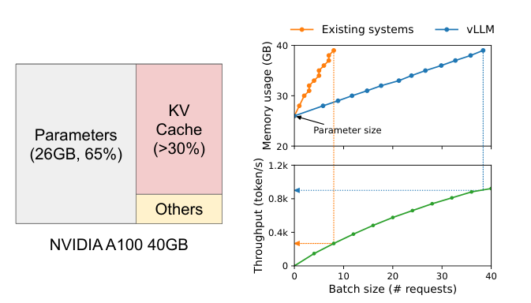

> **图 1：** 左图：在 NVIDIA A100 上服务 13B 参数 LLM 时的内存布局。参数（灰色）在整个服务期间持续驻留在 GPU 内存中。KV 缓存（红色）的内存按服务请求进行分配/释放。少量内存（黄色）被临时用于激活。右图：vLLM 抹平了现有系统 [31, 60] 中 KV 缓存内存的快速增长曲线，从而显著提升服务吞吐量。

由于模型权重恒定且激活仅占用 GPU 内存的一小部分，因此 KV 缓存的管理方式对最大批大小的确定至关重要。管理不当时，KV 缓存内存会显著限制批大小，进而限制 LLM 的吞吐量，如图 1（右）所示。

在本文中，我们观察到现有 LLM 服务系统 [31, 60] 未能高效管理 KV 缓存内存。这主要是因为它们将请求的 KV 缓存存储在连续内存空间中，正如大多数深度学习框架 [33, 39] 要求张量必须存储在连续内存中一样。然而，与传统深度学习工作负载中的张量不同，KV 缓存具有独特的特点：它随着模型生成新 token 而随时间动态增长和收缩，并且其生命周期和长度事先未知。这些特点使现有系统的方法在两个方面效率显著低下：

首先，现有系统 [31, 60] 遭受内部和外部内存碎片化之苦。为了将请求的 KV 缓存存储在连续空间中，它们以请求的最大长度（例如 2048 个 token）预分配一块连续内存块。这可能导致严重的内部分片化，因为请求的实际长度可能远短于其最大长度（例如图 11）。此外，即使实际长度事先已知，预分配仍然低效：由于整个内存块在请求生命周期内都被预留，其他较短的请求无法利用该内存块当前未使用的任何部分。此外，外部内存碎片化也可能很严重，因为每个请求的预分配大小可能不同。事实上，我们在图 2 中的性能分析结果显示，在现有系统中，只有 20.4%–38.2% 的 KV 缓存内存被用于存储实际的 token 状态。

其次，现有系统无法利用内存共享的机会。LLM 服务通常使用高级解码算法，如并行采样（parallel sampling）和束搜索（beam search），这些算法为每个请求生成多个输出。在这些场景中，请求由多个序列组成，这些序列可以部分共享其 KV 缓存。然而，在现有系统中无法实现内存共享，因为各序列的 KV 缓存存储在相互独立的连续空间中。

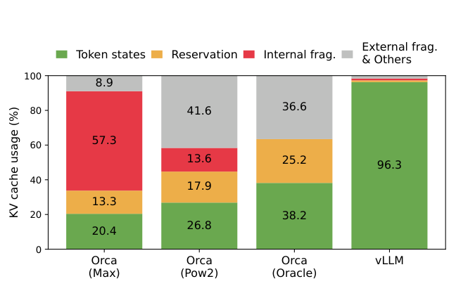

> **图 2：** 第 6.2 节实验中不同 LLM 服务系统内存浪费的平均百分比。

为解决上述限制，我们提出 PagedAttention，一种受操作系统（OS）解决内存碎片化和共享问题的方案——带分页的虚拟内存——启发的注意力算法。PagedAttention 将请求的 KV 缓存划分为多个块，每个块可容纳固定数量 token 的注意力键和值。在 PagedAttention 中，KV 缓存的块不必存储在连续空间中。因此，我们可以像 OS 的虚拟内存那样更灵活地管理 KV 缓存：可以将块视为页（page），token 视为字节（byte），请求视为进程（process）。这种设计通过使用相对较小的块并按需分配来缓解内部碎片化。此外，由于所有块大小相同，它消除了外部碎片化。最后，它支持以块为粒度的内存共享，可跨同一请求关联的不同序列，甚至可跨不同请求共享。

在本工作中，我们在 PagedAttention 之上构建了 vLLM，一个高吞吐的分布式 LLM 服务引擎，实现 KV 缓存内存的近乎零浪费。vLLM 使用与 PagedAttention 协同设计的块级内存管理和可抢占式请求调度。vLLM 支持 GPT [5]、OPT [62] 和 LLaMA [52] 等主流 LLM，支持多种规模，包括超过单个 GPU 内存容量的模型。我们在各种模型和工作负载上的评估表明，与最先进系统 [31, 60] 相比，vLLM 将 LLM 服务吞吐量提升了 2–4 倍，且完全不影响模型精度。序列越长、模型越大、解码算法越复杂（第 4.3 节），提升越明显。

综上所述，我们做出以下贡献：

- 我们识别出 LLM 服务中内存分配面临的挑战，并量化了它们对服务性能的影响。
- 我们提出 PagedAttention，一种在非连续分页内存中存储的 KV 缓存上进行运算的注意力算法，其灵感来自 OS 中的虚拟内存和分页。
- 我们设计并实现了 vLLM，一个构建在 PagedAttention 之上的分布式 LLM 服务引擎。
- 我们在各种场景下评估了 vLLM，证明它大幅优于 FasterTransformer [31] 和 Orca [60] 等先前最先进的解决方案。

## 2 背景

在本节中，我们介绍典型 LLM 的生成与服务流程，以及 LLM 服务中使用的迭代级调度。

### 2.1 Transformer 大语言模型

语言建模的任务是对 token 序列 $(x_1, \ldots, x_n)$ 的概率进行建模。由于语言具有天然的序列顺序，通常将整个序列的联合概率分解为条件概率的乘积（又称自回归分解 [3]）：

$$
P(\mathbf{x}) = P(x_1) \cdot P(x_2 | x_1) \cdots P(x_n | x_1, \ldots, x_{n-1}). \qquad (1)
$$

Transformer [53] 已成为大规模建模上述概率的事实标准架构。基于 Transformer 的语言模型最重要的组成部分是它的自注意力层。对于输入隐藏状态序列 $(x_1, \ldots, x_n) \in \mathbb{R}^{n \times d}$，自注意力层首先对每个位置 $i$ 应用线性变换，得到查询、键和值向量：

$$
q_i = W_q x_i, \quad k_i = W_k x_i, \quad v_i = W_v x_i. \qquad (2)
$$

然后，自注意力层通过将某一位置的查询向量与它之前的所有键向量相乘来计算注意力分数 $a_{ij}$，并将输出 $o_i$ 计算为值向量的加权平均：

$$
a_{ij} = \frac{\exp(q_i^{\top} k_j / \sqrt{d})}{\sum_{t=1}^{i} \exp(q_i^{\top} k_t / \sqrt{d})}, \qquad o_i = \sum_{j=1}^{i} a_{ij} v_j. \qquad (3)
$$

除了式 (4) 中的计算之外，Transformer 模型中的所有其他组件——包括嵌入层、前馈层、层归一化 [2]、残差连接 [22]、输出 logit 计算以及式 (2) 中的查询、键和值变换——都以 $y_i = f(x_i)$ 的形式按位置独立地应用。

### 2.2 LLM 服务与自回归生成

训练完成后，LLM 通常作为条件生成服务部署（例如补全 API [34] 或聊天机器人 [19, 35]）。对 LLM 服务的请求提供输入提示 token 列表 $(x_1, \ldots, x_n)$，LLM 服务根据式 (1) 生成输出 token 列表 $(x_{n+1}, \ldots, x_{n+T})$。我们将提示和输出列表的拼接称为序列。

由于式 (1) 的分解，LLM 只能逐个采样并生成新 token，且每个新 token 的生成过程依赖于该序列中所有之前的 token，具体来说是它们的键和值向量。在这种串行生成过程中，已有 token 的键和值向量通常会被缓存以供生成未来 token 使用，这被称为 KV 缓存。注意，一个 token 的 KV 缓存依赖于它所有的前序 token。这意味着序列中不同位置出现的同一个 token，其 KV 缓存是不同的。

给定请求提示，LLM 服务中的生成计算可分为两个阶段：

**提示阶段（prompt phase）** 将整个用户提示 $(x_1, \ldots, x_n)$ 作为输入，计算第一个新 token 的概率 $P(x_{n+1} | x_1, \ldots, x_n)$。在此过程中，还会生成键向量 $k_1, \ldots, k_n$ 和值向量 $v_1, \ldots, v_n$。由于提示 token $x_1, \ldots, x_n$ 全部已知，提示阶段的计算可以使用矩阵-矩阵乘法运算进行并行化。因此，该阶段可以有效利用 GPU 固有的并行性。

**自回归生成阶段** 顺序生成其余的新 token。在第 $t$ 次迭代时，模型将一个 token $x_{n+t}$ 作为输入，利用键向量 $k_1, \ldots, k_{n+t}$ 和值向量 $v_1, \ldots, v_{n+t}$ 计算概率 $P(x_{n+t+1} | x_1, \ldots, x_{n+t})$。注意，位置 1 到 $n+t-1$ 的键和值向量在上一次迭代中已被缓存，本次迭代只计算新的键和值向量 $k_{n+t}$ 和 $v_{n+t}$。该阶段在序列达到最大长度（由用户指定或受 LLM 限制）或发出序列结束（end-of-sequence，<eos>）token 时结束。由于数据依赖关系，不同迭代的计算无法并行化，通常使用效率较低的矩阵-向量乘法。因此，该阶段严重未充分利用 GPU 计算资源，受内存限制，承担了单个请求延迟的大部分。

### 2.3 LLM 批处理技术

通过批处理多个请求可以提高 LLM 服务中的计算利用率。由于请求共享相同的模型权重，移动权重的开销在批次内的请求之间被摊销，当批大小足够大时，该开销可以被计算开销所掩盖。然而，对 LLM 服务的请求进行批处理并非易事，原因有二。首先，请求可能在不同时间到达。朴素的批处理策略要么让先到的请求等待后来的请求，要么推迟新到的请求直到先前的请求完成，导致显著的排队延迟。其次，请求的输入和输出长度可能差异巨大（图 11）。简单的批处理技术会填充（pad）请求的输入和输出以使它们的长度相等，浪费 GPU 计算和内存。

为解决这一问题，人们提出了细粒度批处理机制，如蜂窝式批处理（cellular batching）[16] 和迭代级调度 [60]。与在请求级别工作的传统方法不同，这些技术在迭代级别工作。每次迭代结束后，已完成的请求从批次中移除，新请求被加入。因此，新请求在等待一次迭代后即可被处理，而不必等待整个批次完成。此外，借助专门的 GPU 内核，这些技术消除了填充输入和输出的需要。通过减少排队延迟和填充带来的低效，细粒度批处理机制显著提高了 LLM 服务的吞吐量。

## 3 LLM 服务中的内存挑战

尽管细粒度批处理减少了计算浪费，并使请求能够以更灵活的方式批处理，但可一起批处理的请求数量仍受 GPU 内存容量约束，尤其是分配给 KV 缓存的空间。换句话说，服务系统的吞吐量受内存限制。克服这种内存限制需要解决内存管理中的以下挑战：

**KV 缓存巨大。** KV 缓存大小随请求数量快速增长。例如，对于 13B 参数 OPT 模型 [62]，单个 token 的 KV 缓存需要 800 KB 空间，计算方式为 2（键和值向量）× 5120（隐藏状态大小）× 40（层数）× 2（每 FP16 字节数）。由于 OPT 可以生成最长 2048 个 token 的序列，存储一个请求的 KV 缓存所需的内存可高达 1.6 GB。目前的 GPU 内存容量在几十 GB 量级。即使将所有可用内存分配给 KV 缓存，也只能容纳几十个请求。此外，低效的内存管理会进一步降低批大小，如图 2 所示。另外，从当前趋势看，GPU 的计算速度增长快于内存容量 [17]。例如，从 NVIDIA A100 到 H100，FLOPS 增加了 2 倍以上，但 GPU 内存最大仍为 80GB。因此，我们相信内存将成为日益显著的瓶颈。

**复杂的解码算法。** LLM 服务为用户提供一系列可选的解码算法，每种算法对内存管理的复杂度都有不同的影响。例如，当用户要求从一个输入提示生成多个随机样本时（这是程序建议 [18] 中的典型用例），提示部分的 KV 缓存（在我们的实验中约占 KV 缓存总内存的 12%，见第 6.3 节）可以被共享以最小化内存使用。另一方面，由于不同的采样结果及其对上下文和位置的依赖性，自回归生成阶段的 KV 缓存应保持不共享。KV 缓存共享的程度取决于所采用的具体解码算法。在束搜索 [49] 等更复杂的算法中，不同请求的束（beam）可以共享其 KV 缓存的更大部分（最多节省 55% 内存，见第 6.3 节），并且共享模式随着解码过程的推进而演变。

**针对未知输入与输出长度的调度。** 对 LLM 服务的请求在输入和输出长度上表现出差异性。这要求内存管理系统能够适应各种提示长度。此外，随着请求的输出长度在解码过程中增长，其 KV 缓存所需的内存也在扩大，可能会耗尽可供新请求或现有提示的进行中生成使用的内存。系统需要做出调度决策，例如删除或将某些请求的 KV 缓存从 GPU 内存中换出。

### 3.1 现有系统中的内存管理

由于当前深度学习框架 [33, 39] 中的大多数算子要求张量存储在连续内存中，先前的 LLM 服务系统 [31, 60] 也将一个请求的 KV 缓存存储为跨不同位置的连续张量。由于 LLM 的输出长度不可预测，它们根据请求的最大可能序列长度静态地为请求分配一块内存，而不考虑请求的实际输入或最终输出长度。

图 3 展示了两个请求：请求 A 的最大可能序列长度为 2048，请求 B 的最大长度为 512。现有系统中的内存块预分配方案有三个主要的内存浪费来源：为未来 token 预留的槽位、因过度配置潜在最大序列长度而导致的内部碎片化，以及来自内存分配器（如伙伴分配器）的外部碎片化。

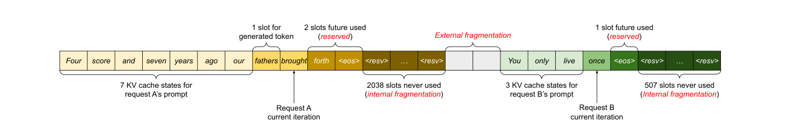

> **图 3：** 现有系统中的 KV 缓存内存管理。存在三种类型的内存浪费——预留、内部碎片化和外部碎片化——它们阻止其他请求装入内存。每个内存槽位中的 token 表示其 KV 缓存。注意，同一个 token 在不同位置可以有不同的 KV 缓存。

外部碎片化永远不会被用于生成的 token，这一点在服务请求之前就已知道。内部碎片化同样未被使用，但只有在请求完成采样之后才能意识到这一点。它们都是纯粹的内存浪费。虽然预留内存最终会被使用，但在整个请求期间预留该空间，尤其是在预留空间较大时，会占用本可用于处理其他请求的空间。我们在图 2 中可视化了实验中内存浪费的平均百分比，揭示出先前系统的实际有效内存可能低至 20.4%。

尽管压缩（compaction）[54] 已被提出作为碎片化的潜在解决方案，但在对性能敏感的 LLM 服务系统中执行压缩是不切实际的，因为 KV 缓存规模巨大。即使有压缩，每个请求预分配的内存块空间也阻止了现有内存管理系统中针对解码算法的内存共享。

## 4 方法

在本工作中，我们开发了一种新的注意力算法 PagedAttention，并构建了一个 LLM 服务引擎 vLLM，以应对第 3 节中概述的挑战。vLLM 的架构如图 4 所示。vLLM 采用集中式调度器来协调分布式 GPU 工作节点（worker）的执行。KV 缓存管理器在 PagedAttention 的支持下，以分页方式有效管理 KV 缓存。具体来说，KV 缓存管理器通过集中式调度器发送的指令来管理 GPU 工作节点上的物理 KV 缓存内存。

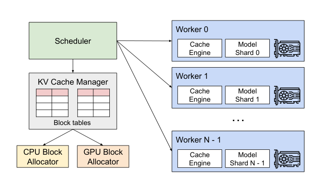

> **图 4：** vLLM 系统总览。

接下来，我们将在第 4.1 节描述 PagedAttention 算法。在此基础上，我们分别在第 4.2 节展示 KV 缓存管理器的设计，以及它如何在第 4.3 节为 PagedAttention 提供支持。然后，我们展示该设计如何为各种解码方法实现有效的内存管理（第 4.4 节），并处理可变长度的输入和输出序列（第 4.5 节）。最后，我们展示 vLLM 的系统设计如何在分布式环境中工作（第 4.6 节）。

### 4.1 PagedAttention

为解决第 3 节中的内存挑战，我们引入 PagedAttention，一种受操作系统中经典分页思想 [25] 启发的注意力算法。与传统注意力算法不同，PagedAttention 允许将连续的键和值存储在非连续的内存空间中。具体来说，PagedAttention 将每个序列的 KV 缓存划分为 KV 块。每个块包含固定数量 token 的键和值向量（注 1），我们将其称为 KV 块大小（$B$）。将键块记为 $K_j = (k_{(j-1)B+1}, \ldots, k_{jB})$，值块记为 $V_j = (v_{(j-1)B+1}, \ldots, v_{jB})$。式 (4) 中的注意力计算可以转化为如下按块进行的计算：

$$
A_{ij} = \frac{\exp(q_i^{\top} K_j / \sqrt{d})}{\sum_{t=1}^{\lceil i/B \rceil} \exp(q_i^{\top} K_t / \sqrt{d})}, \qquad o_i = \sum_{j=1}^{\lceil i/B \rceil} V_j A_{ij}^{\top}, \qquad (4)
$$

其中 $A_{ij} = (a_{i,(j-1)B+1}, \ldots, a_{i,jB})$ 是第 $j$ 个 KV 块上注意力分数的行向量。

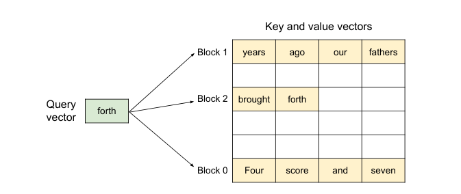

> **图 5：** PagedAttention 算法示意图，其中注意力键和值向量以非连续块的形式存储在内存中。

在注意力计算过程中，PagedAttention 内核分别识别并获取不同的 KV 块。我们在图 5 中展示了 PagedAttention 的一个示例：键和值向量分布在三个块中，且这三个块在物理内存上并不连续。在每一步中，内核将查询 token（"forth"）的查询向量 $q_i$ 与块中的键向量 $K_j$（例如块 0 中 "Four score and seven" 的键向量）相乘，以计算注意力分数 $A_{ij}$，随后将 $A_{ij}$ 与块中的值向量 $V_j$ 相乘，得到最终的注意力输出 $o_i$。

> **注 1：** 在 Transformer 中，每个 token 在多层之间以及层内多个注意力头之间各有一组键和值向量。所有键和值向量可以在单个 KV 块中统一管理，也可以让不同头和层的键、值向量各自拥有独立的块并在独立的块表中管理。这两种设计没有性能差异，我们选择第二种方案以方便实现。

总之，PagedAttention 算法允许 KV 块存储在非连续的物理内存中，这使得 vLLM 中更灵活的分页内存管理成为可能。

### 4.2 KV 缓存管理器

vLLM 内存管理器背后的关键思想类似于操作系统中的虚拟内存 [25]。OS 将内存划分为固定大小的页，并将用户程序的逻辑页映射到物理页。连续的逻辑页可以对应不连续的物理内存页，从而使用户程序能够像内存连续一样访问内存。此外，物理内存空间不必预先全部预留，使 OS 能够按需动态分配物理页。vLLM 利用虚拟内存背后的思想来管理 LLM 服务中的 KV 缓存。在 PagedAttention 的支持下，我们将 KV 缓存组织为固定大小的 KV 块，就像虚拟内存中的页一样。

请求的 KV 缓存表示为一系列逻辑 KV 块，随着新 token 及其 KV 缓存的生成从左到右填充。最后一个 KV 块中未填充的位置为未来的生成而预留。在 GPU 工作节点上，块引擎分配一块连续的 GPU 显存，并将其划分为物理 KV 块（这一操作也在 CPU 内存上执行以支持换出，见第 4.5 节）。KV 块管理器还维护块表——每个请求的逻辑与物理 KV 块之间的映射。每个块表条目记录一个逻辑块对应的物理块以及已填充位置的数量。分离逻辑与物理 KV 块使 vLLM 能够在不预先为所有位置预留内存的情况下动态增长 KV 缓存内存，从而消除了现有系统中的大部分内存浪费，如图 2 所示。

### 4.3 使用 PagedAttention 和 vLLM 进行解码

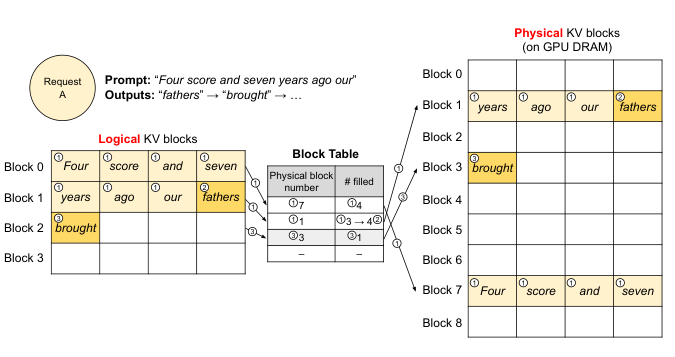

> **图 6：** vLLM 中的块表转换。

接下来，我们通过图 6 中的示例，演示 vLLM 如何在单个输入序列的解码过程中执行 PagedAttention 并管理内存：1○ 与 OS 的虚拟内存一样，vLLM 最初不需要为最大可能的生成序列长度预留内存。相反，它只预留容纳提示计算期间生成的 KV 缓存所必需的 KV 块。在本例中，提示有 7 个 token，因此 vLLM 将前 2 个逻辑 KV 块（0 和 1）映射到 2 个物理 KV 块（分别是 7 和 1）。在预填充（prefill）步骤中，vLLM 使用传统自注意力算法（例如 [13]）生成提示和第一个输出 token 的 KV 缓存。然后 vLLM 将前 4 个 token 的 KV 缓存存储在逻辑块 0 中，将接下来的 3 个 token 存储在逻辑块 1 中。剩余的槽位为后续的自回归生成阶段预留。2○ 在第一次自回归解码步骤中，vLLM 在物理块 7 和 1 上使用 PagedAttention 算法生成新 token。由于最后一个逻辑块中还有一个可用槽位，新生成的 KV 缓存存储在那里，并更新块表中的已填充数量（#filled）记录。3○ 在第二次解码步骤中，由于最后一个逻辑块已满，vLLM 将新生成的 KV 缓存存储在新的逻辑块中；vLLM 为其分配一个新的物理块（物理块 3），并将此映射存储在块表中。

在全局层面，对于每次解码迭代，vLLM 首先选择一组候选序列进行批处理（更多内容见第 4.5 节），并为新需要的逻辑块分配物理块。然后，vLLM 将当前迭代的所有输入 token（即提示阶段请求的所有 token 和生成阶段请求的最新 token）拼接为一个序列，馈送给 LLM。在 LLM 计算过程中，vLLM 使用 PagedAttention 内核访问先前以逻辑 KV 块形式存储的 KV 缓存，并将新生成的 KV 缓存保存到物理 KV 块中。在一个 KV 块内存储多个 token（块大小 > 1）使 PagedAttention 内核能够在更多位置上并行处理 KV 缓存，从而提高硬件利用率并降低延迟。然而，更大的块大小也会增加内存碎片化。我们在第 7.2 节研究块大小的影响。

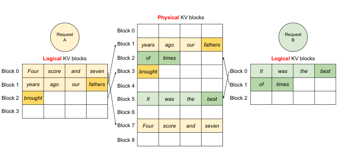

> **图 7：** vLLM 同时存储两个请求的 KV 缓存。

同样，随着更多 token 及其 KV 缓存的生成，vLLM 会动态地将新的物理块分配给逻辑块。由于所有块都从左到右填充，并且只有在所有先前的块都满时才分配新的物理块，vLLM 将请求的所有内存浪费限制在一个块以内，因此可以有效利用所有内存，如图 2 所示。这使得更多请求可以装入内存进行批处理——从而提高了吞吐量。一旦请求完成生成，其 KV 块就可以被释放以存储其他请求的 KV 缓存。在图 7 中，我们展示了 vLLM 为两个序列管理内存的示例。两个序列的逻辑块被映射到 GPU 工作节点上块引擎预留空间内的不同物理块。两个序列相邻的逻辑块不需要在物理 GPU 内存中连续，物理块的空间可以被两个序列有效利用。

### 4.4 应用于其他解码场景

第 4.3 节展示了 PagedAttention 和 vLLM 如何处理基本的解码算法，如贪心解码和采样，这些算法以一个用户提示作为输入，生成单个输出序列。在许多成功的 LLM 应用 [18, 34] 中，LLM 服务必须提供更复杂的解码场景，这些场景展现出复杂的访问模式和更多的内存共享机会。我们在本节展示 vLLM 对它们的普适性。

**并行采样。** 在基于 LLM 的程序助手 [6, 18] 中，LLM 为单个输入提示生成多个采样输出；用户可以从各种候选中选择最喜欢的输出。

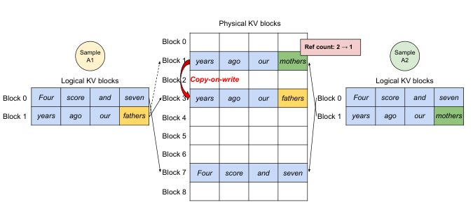

> **图 8：** 并行采样示例。

到目前为止，我们隐含地假设一个请求生成单个序列。在本文其余部分，我们假设更一般的情况：一个请求生成多个序列。在并行采样中，一个请求包含共享同一输入提示的多个样本，因此提示的 KV 缓存也可以被共享。通过其 PagedAttention 和分页内存管理，vLLM 可以轻松实现这种共享并节省内存。

图 8 展示了两个输出的并行解码示例。由于两个输出共享相同的提示，我们只在提示阶段为提示状态预留一份空间；两个序列提示的逻辑块被映射到相同的物理块：两个序列的逻辑块 0 和 1 分别映射到物理块 7 和 1。由于一个物理块可以被映射到多个逻辑块，我们为每个物理块引入一个引用计数（reference count）。在本例中，物理块 7 和 1 的引用计数都为 2。在生成阶段，两个输出采样到不同的输出 token，需要单独的 KV 缓存存储。vLLM 以块为粒度，对需要被多个序列修改的物理块实现写时复制（copy-on-write）机制，类似于 OS 虚拟内存中的写时复制技术（例如 fork 进程时）。具体来说，在图 8 中，当样本 A1 需要写入其最后一个逻辑块（逻辑块 1）时，vLLM 识别出对应物理块（物理块 1）的引用计数大于 1；它分配一个新的物理块（物理块 3），指示块引擎从物理块 1 复制信息，并将引用计数减为 1。接下来，当样本 A2 写入物理块 1 时，引用计数已经减为 1；因此 A2 直接将新生成的 KV 缓存写入物理块 1。

总之，vLLM 使多个输出样本之间能够共享用于存储提示 KV 缓存的大部分空间，唯一的例外是最后一个逻辑块，它由写时复制机制管理。通过跨多个样本共享物理块，内存使用可以大大降低，尤其是对于长输入提示。

**束搜索。** 在机器翻译 [59] 等 LLM 任务中，用户期望 LLM 输出最合适的 top-$k$ 个翻译。

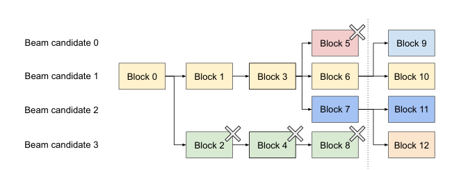

> **图 9：** 束搜索示例。

束搜索 [49] 被广泛用于从 LLM 解码最可能的输出序列，因为它缓解了完全遍历样本空间的计算复杂度。该算法依赖于束宽参数 $k$，它决定了每一步保留的 top 候选数量。在解码过程中，束搜索通过考虑所有可能的 token 来扩展束中的每个候选序列，使用 LLM 计算它们各自的概率，并从 $k \cdot |V|$ 个候选中保留最可能的 top-$k$ 个序列，其中 $|V|$ 是词表大小。

与并行解码不同，束搜索不仅在不同候选之间共享初始提示块，还共享其他块，并且共享模式随着解码过程的推进而动态变化，类似于 OS 中由复合 fork 创建的进程树。图 9 展示了 vLLM 如何管理 $k = 4$ 的束搜索示例的 KV 块。在虚线所示迭代之前，每个候选序列都使用了 4 个满的逻辑块。所有束候选共享第一个块 0（即提示）。候选 3 从第二个块开始与其他候选分道扬镳。候选 0-2 共享前 3 个块，并在第四个块处分叉。在随后的迭代中，top-4 最可能的候选都源自候选 1 和 2。由于原始候选 0 和 3 不再属于 top 候选，它们的逻辑块被释放，对应物理块的引用计数被减少。vLLM 释放所有引用计数达到 0 的物理块（块 2、4、5、8）。然后，vLLM 分配新的物理块（块 9-12）来存储来自新候选的新 KV 缓存。现在，所有候选共享块 0、1、3；候选 0 和 1 共享块 6，候选 2 和 3 进一步共享块 7。

先前的 LLM 服务系统需要在束候选之间频繁复制 KV 缓存。例如，在图 9 所示的情况下，在虚线之后，候选 3 需要复制候选 2 的大部分 KV 缓存才能继续生成。这种频繁的内存复制开销被 vLLM 的物理块共享显著降低。在 vLLM 中，不同束候选的大部分块可以被共享。只有在新生成的 token 位于旧的共享块内时才应用写时复制机制，与并行解码一样。这仅涉及复制一个块的数据。

**共享前缀。** 通常，LLM 用户会提供任务的（长）描述，包括指令以及示例输入和输出，也称为系统提示（system prompt）[36]。

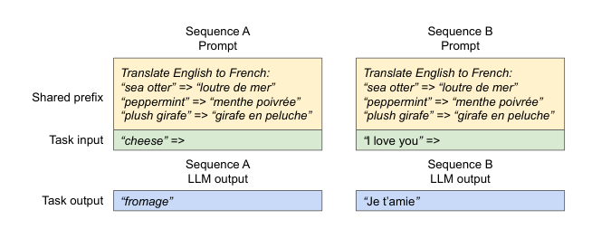

> **图 10：** 机器翻译的共享提示示例。示例摘自 [5]。

该描述与实际任务输入拼接，形成请求的提示。LLM 基于完整提示生成输出。图 10 展示了一个示例。此外，共享前缀可以通过提示工程（prompt engineering）进一步调优，以提高下游任务的精度 [26, 27]。对于这类应用，许多用户提示共享一个前缀，因此 LLM 服务提供商可以预先存储前缀的 KV 缓存，以减少花在前缀上的冗余计算。在 vLLM 中，这可以方便地实现：由 LLM 服务提供商为一组预定义的共享前缀预留一组物理块，就像 OS 跨进程处理共享库一样。带有共享前缀的用户输入提示可以简单地将逻辑块映射到已缓存的物理块（最后一个块标记为写时复制）。提示阶段的计算只需要在用户的任务输入上执行。

**混合解码方法。** 前面讨论的解码方法展现出多样化的内存共享和访问模式。尽管如此，vLLM 支持同时处理具有不同解码偏好的请求，而现有系统无法高效做到这一点。这是因为 vLLM 通过一个将逻辑块转换为物理块的通用映射层，隐藏了不同序列之间复杂的内存共享。LLM 及其执行内核只看到每个序列的物理块 ID 列表，不需要处理跨序列的共享模式。与现有系统相比，这种方法为具有不同采样需求的请求拓宽了批处理机会，最终提高了系统的整体吞吐量。

### 4.5 调度与抢占

当请求流量超过系统容量时，vLLM 必须对一部分请求进行优先排序。在 vLLM 中，我们对所有请求采用先到先服务（first-come-first-serve，FCFS）调度策略，确保公平性并防止饥饿。当 vLLM 需要抢占请求时，它确保最早到达的请求先被服务，最晚的请求先被抢占。

LLM 服务面临一个独特的挑战：LLM 的输入提示长度可能差异很大，而输出长度事先不可知，取决于输入提示和模型。随着请求数量及其输出的增长，vLLM 可能耗尽 GPU 的物理块，无法存储新生成的 KV 缓存。在这种情况下，vLLM 需要回答两个经典问题：(1) 应该驱逐哪些块？(2) 如果再次需要，如何恢复被驱逐的块？通常，驱逐策略使用启发式方法预测哪个块将在未来最远的时刻被访问，并驱逐该块。由于在我们的场景中，我们知道一个序列的所有块会被一起访问，因此我们实现了一个全有或全无（all-or-nothing）的驱逐策略，即要么驱逐一个序列的所有块，要么一个也不驱逐。此外，一个请求内的多个序列（例如一个束搜索请求中的束候选）被作为序列组（sequence group）进行成组调度（gang-scheduled）。由于这些序列之间可能存在内存共享，一个序列组内的序列总是被一起抢占或重新调度。针对如何恢复被驱逐块的第二个问题，我们考虑两种技术：

**换出（Swapping）。** 这是大多数虚拟内存实现使用的经典技术，将被驱逐的页复制到磁盘上的交换空间。在我们的场景中，我们将被驱逐的块复制到 CPU 内存。如图 4 所示，除了 GPU 块分配器，vLLM 还包含一个 CPU 块分配器来管理换出到 CPU 内存的物理块。当 vLLM 为新的 token 耗尽空闲物理块时，它选择一组序列进行驱逐，并将它们的 KV 缓存传输到 CPU。一旦它抢占了一个序列并驱逐了其块，vLLM 将停止接受新请求，直到所有被抢占的序列完成。一旦请求完成，其块从内存中释放，被抢占序列的块被换回以继续处理该序列。注意，通过这种设计，换出到 CPU 内存的块数量永远不会超过 GPU 内存中的物理块总数，因此 CPU 内存上的交换空间受限于分配给 KV 缓存的 GPU 内存。

**重计算（Recomputation）。** 在这种情况下，当被抢占的序列被重新调度时，我们简单地重新计算其 KV 缓存。注意，重计算延迟可以显著低于原始延迟，因为解码过程中生成的 token 可以与原始用户提示拼接为一个新提示——其所有位置的 KV 缓存可以在一次提示阶段迭代中生成。

换出和重计算的性能取决于 CPU 内存与 GPU 内存之间的带宽以及 GPU 的计算能力。我们在第 7.3 节考察换出和重计算的速度。

### 4.6 分布式执行

许多 LLM 的参数规模超过单个 GPU 的容量 [5, 9]。因此，有必要将它们划分到分布式 GPU 上，并以模型并行（model parallel）的方式执行 [28, 63]。这要求内存管理器能够处理分布式内存。vLLM 通过支持 Transformer 上广泛使用的 Megatron-LM 风格张量模型并行（tensor model parallelism）策略 [47]，在分布式环境中非常有效。该策略遵循单程序多数据（Single Program Multiple Data，SPMD）执行调度，其中线性层被划分以执行按块的矩阵乘法，GPU 通过 all-reduce 操作持续同步中间结果。具体来说，注意力算子按注意力头维度拆分，每个 SPMD 进程负责多头注意力中的一部分注意力头。

我们观察到，即使采用模型并行执行，每个模型分片仍处理相同的输入 token 集，因此需要相同位置的 KV 缓存。因此，vLLM 在集中式调度器中设置了一个单一的 KV 缓存管理器，如图 4 所示。不同的 GPU 工作节点共享该管理器，以及逻辑块到物理块的映射。这个通用映射使 GPU 工作节点能够使用调度器为每个输入请求提供的物理块执行模型。虽然每个 GPU 工作节点拥有相同的物理块 ID，但一个工作节点只存储与其对应注意力头相关的部分 KV 缓存。

在每一步中，调度器首先为批次中的每个请求准备包含输入 token ID 的消息，以及每个请求的块表。接下来，调度器将这个控制消息广播给 GPU 工作节点。然后，GPU 工作节点开始使用输入 token ID 执行模型。在注意力层中，GPU 工作节点根据控制消息中的块表读取 KV 缓存。在执行过程中，GPU 工作节点使用 all-reduce 通信原语同步中间结果，无需调度器协调，如 [47] 所述。最后，GPU 工作节点将本次迭代采样的 token 发回调度器。总之，GPU 工作节点不需要在内存管理上进行同步，因为它们只需在每次解码迭代开始时随步骤输入一起接收所有内存管理信息。

## 5 实现

vLLM 是一个端到端服务系统，具有 FastAPI [15] 前端和基于 GPU 的推理引擎。前端扩展了 OpenAI API [34] 接口，允许用户为每个请求定制采样参数，例如最大序列长度和束宽 $k$。vLLM 引擎由 8.5K 行 Python 代码和 2K 行 C++/CUDA 代码编写。我们用 Python 开发调度器和块管理器等控制相关组件，同时为 PagedAttention 等关键操作开发自定义 CUDA 内核。对于模型执行器，我们使用 PyTorch [39] 和 Transformers [58] 实现 GPT [5]、OPT [62] 和 LLaMA [52] 等主流 LLM。我们使用 NCCL [32] 在分布式 GPU 工作节点之间进行张量通信。

| 模型大小 | 13B | 66B | 175B |
| --- | --- | --- | --- |
| GPU | A100 | 4×A100 | 8×A100-80GB |
| GPU 总内存 | 40 GB | 160 GB | 640 GB |
| 参数大小 | 26 GB | 132 GB | 346 GB |
| KV 缓存内存 | 12 GB | 21 GB | 264 GB |
| 最大 KV 缓存槽位数 | 15.7K | 9.7K | 60.1K |

**表 1：模型规模与服务端配置。**

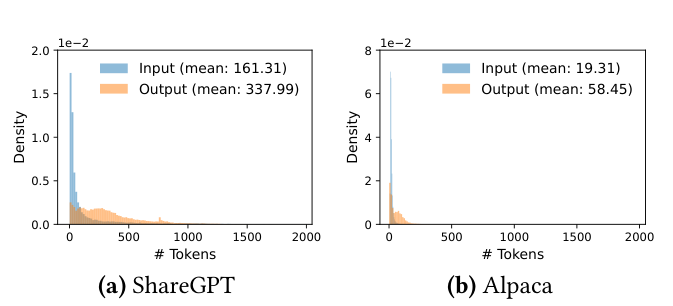

> **图 11：** (a) ShareGPT 和 (b) Alpaca 数据集的输入和输出长度分布。

### 5.1 内核级优化

由于 PagedAttention 引入了现有系统无法高效支持的内存访问模式，我们开发了几个 GPU 内核来优化它。(1) 融合重塑与块写入。在每个 Transformer 层中，新生成的 KV 缓存被分割成块，重塑为针对块读取优化的内存布局，然后保存到块表指定的位置。为最小化内核启动开销，我们将它们融合到单个内核中。(2) 融合块读取与注意力。我们改编了 FasterTransformer [31] 中的注意力内核，使其根据块表读取 KV 缓存并即时执行注意力操作。为确保合并（coalesced）内存访问，我们为每个块分配一个 GPU warp 来读取。此外，我们增加了对请求批次内可变序列长度的支持。(3) 融合块复制。由写时复制机制发起的块复制操作可能作用于不连续的块。如果使用 cudaMemcpyAsync API，这可能导致大量小规模数据移动的调用。为减轻这一开销，我们实现了一个内核，将不同块的复制操作批处理到单次内核启动中。

### 5.2 支持多种解码算法

vLLM 使用三个关键方法实现各种解码算法：fork、append 和 free。fork 方法从现有序列创建新序列。append 方法向序列追加新 token。最后，free 方法删除序列。例如，在并行采样中，vLLM 使用 fork 方法从单个输入序列创建多个输出序列。然后它在每次迭代中使用 append 向这些序列添加新 token，并使用 free 删除满足停止条件的序列。vLLM 在束搜索和前缀共享中也应用相同的策略。我们相信，未来的解码算法也可以通过组合这些方法来支持。

## 6 评估

在本节中，我们在各种工作负载下评估 vLLM 的性能。

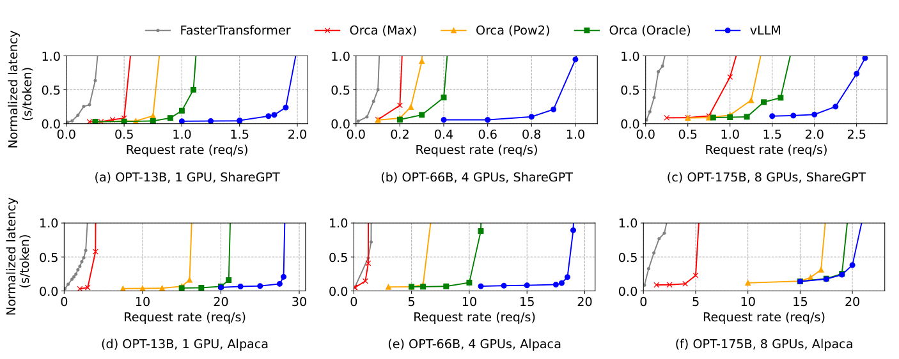

> **图 12：** 使用 OPT 模型在 ShareGPT 和 Alpaca 数据集上的单序列生成。

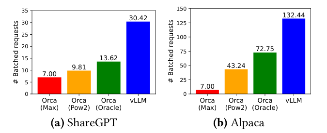

> **图 13：** 服务 OPT-13B 时，ShareGPT（2 reqs/s）和 Alpaca（30 reqs/s）trace 下的平均批处理请求数。

### 6.1 实验设置

**模型与服务端配置。** 我们使用 13B、66B 和 175B 参数的 OPT [62] 模型以及 13B 参数的 LLaMA [52] 进行评估。13B 和 66B 是 LLM 的常见规模，如 LLM 排行榜 [38] 所示，而 175B 是著名的 GPT-3 [5] 模型的规模。对于所有实验，我们使用 Google Cloud Platform 上带 NVIDIA A100 GPU 的 A2 实例。详细的模型规模和服务端配置如表 1 所示。

**工作负载。** 我们基于 ShareGPT [51] 和 Alpaca [50] 数据集合成工作负载，这两个数据集包含真实 LLM 服务的输入和输出文本。ShareGPT 数据集是与 ChatGPT [35] 的用户共享对话的集合。Alpaca 数据集是由 GPT-3.5 使用 self-instruct [57] 生成的指令数据集。我们对数据集进行 token 化，并使用其输入和输出长度合成客户端请求。如图 11 所示，ShareGPT 数据集的输入提示平均比 Alpaca 数据集长 8.4 倍，输出平均长 5.8 倍，且方差更大。由于这些数据集不包含时间戳，我们使用不同请求速率的泊松分布生成请求到达时间。

**基线 1：FasterTransformer。** FasterTransformer [31] 是一个高度针对延迟优化的分布式推理引擎。由于 FasterTransformer 没有自己的调度器，我们实现了一个自定义调度器，其动态批处理机制类似于 Triton [30] 等现有服务系统。具体来说，我们根据 GPU 内存容量为每个实验设置尽可能大的最大批大小 $B$。调度器最多取最早到达的 $B$ 个请求，并将批次发送给 FasterTransformer 处理。

**基线 2：Orca。** Orca [60] 是一个针对吞吐量优化的最先进 LLM 服务系统。由于 Orca 不可公开使用，我们实现自己的 Orca 版本。我们假设 Orca 使用伙伴分配算法确定存储 KV 缓存的内存地址。我们根据 Orca 为请求输出过度预留空间的程度实现了三个版本：

- Orca (Oracle)。我们假设系统事先知道请求实际生成的输出长度。这展示了 Orca 的性能上限，在实践中无法实现。
- Orca (Pow2)。我们假设系统最多为输出过度预留 2 倍空间。例如，如果真实输出长度为 25，它为输出预留 32 个位置。
- Orca (Max)。我们假设系统总是预留到模型的最大序列长度，即 2048 个 token。

**关键指标。** 我们关注服务吞吐量。具体来说，使用不同请求速率的工作负载，我们测量系统的归一化延迟（normalized latency），即每个请求的端到端延迟除以其输出长度的平均值，与 Orca [60] 一致。高吞吐服务系统应该在面对高请求速率时保持低归一化延迟。对于大多数实验，我们使用 1 小时的 trace 评估系统。作为例外，由于成本限制，OPT-175B 模型使用 15 分钟的 trace。

### 6.2 基础采样

我们评估 vLLM 在三个模型和两个数据集上进行基础采样（每请求一个样本）的性能。图 12 的第一行展示了 ShareGPT 数据集上的结果。曲线表明，随着请求速率的增加，延迟起初以平缓的速度增加，但随后突然爆炸。这可以归因于：当请求速率超过服务系统的容量时，队列长度持续无限增长，请求的延迟也随之增长。

在 ShareGPT 数据集上，vLLM 可以承受比 Orca (Oracle) 高 1.7×–2.7× 的请求速率，比 Orca (Max) 高 2.7×–8×，同时保持相似的延迟。这是因为 vLLM 的 PagedAttention 可以有效管理内存使用，从而使比 Orca 更多的请求能够被批处理。例如，如图 13a 所示，对于 OPT-13B，vLLM 同时处理的请求数比 Orca (Oracle) 多 2.2 倍，比 Orca (Max) 多 4.3 倍。与 FasterTransformer 相比，vLLM 可以承受高达 22× 的请求速率，因为 FasterTransformer 没有使用细粒度调度机制，并且像 Orca (Max) 一样低效地管理内存。

图 12 的第二行和图 13b 展示了 Alpaca 数据集上的结果，其趋势与 ShareGPT 数据集类似。一个例外是图 12 (f)，其中 vLLM 相对于 Orca (Oracle) 和 Orca (Pow2) 的优势不那么明显。这是因为 OPT-175B 的模型和服务端配置（表 1）允许有大量可用 GPU 内存空间来存储 KV 缓存，而 Alpaca 数据集的序列较短。在这种设置下，Orca (Oracle) 和 Orca (Pow2) 尽管内存管理效率低下，也能批处理大量请求。因此，系统的性能变成计算受限（compute-bound）而非内存受限。

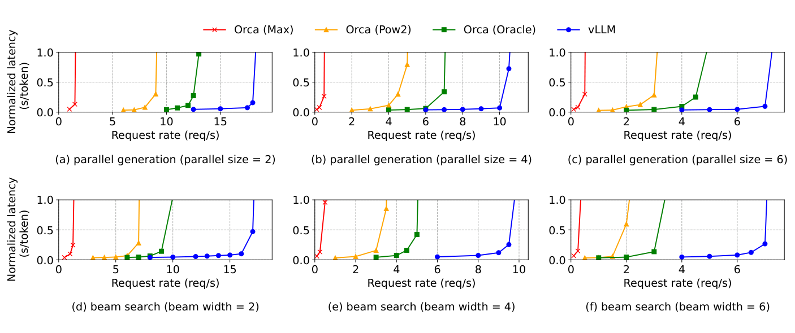

> **图 14：** 使用 OPT-13B 在 Alpaca 数据集上的并行生成和束搜索。

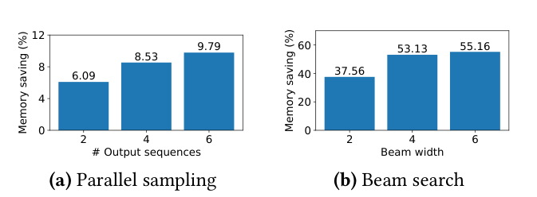

> **图 15：** 服务 OPT-13B 的 Alpaca trace 时，共享 KV 块带来的平均内存节省量。

### 6.3 并行采样与束搜索

我们用两种流行的采样方法评估 PagedAttention 中内存共享的有效性：并行采样和束搜索。在并行采样中，请求中的所有并行序列可以共享提示的 KV 缓存。如图 14 第一行所示，随着采样序列数量的增加，vLLM 相对于 Orca 基线带来更多提升。类似地，图 14 第二行展示了不同束宽的束搜索结果。由于束搜索允许更多共享，vLLM 展现出更大的性能优势。在 OPT-13B 和 Alpaca 数据集上，vLLM 相对于 Orca (Oracle) 的提升从基础采样的 1.3× 增加到束宽为 6 的束搜索的 2.3×。

图 15 绘制了内存节省量，计算方法为通过共享节省的块数除以不共享时的总块数。我们展示了并行采样节省 6.1%–9.8% 内存，束搜索节省 37.6%–55.2% 内存。在相同的 ShareGPT 数据集实验中，我们观察到并行采样节省 16.2%–30.5% 内存，束搜索节省 44.3%–66.3% 内存。

### 6.4 共享前缀

我们探索 vLLM 在如图 10 所示的不同输入提示之间共享前缀的情况下的有效性。对于模型，我们使用多语言的 LLaMA-13B [52]。对于工作负载，我们使用 WMT16 [4] 英德翻译数据集，并合成两个包含指令和几个翻译示例的前缀。第一个前缀包含单个示例（即 one-shot），另一个前缀包含 5 个示例（即 few-shot）。

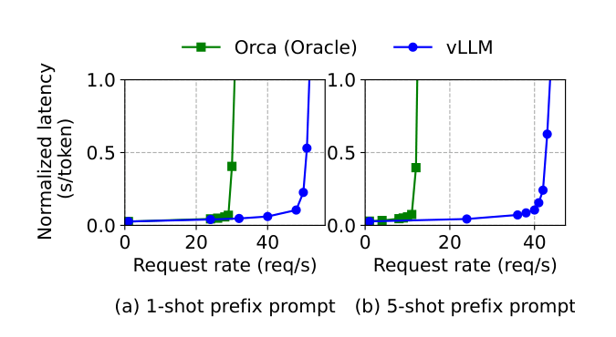

> **图 16：** 输入提示共享公共前缀的翻译工作负载。前缀包含 (a) 80 个 token 的 1 个示例或 (b) 341 个 token 的 5 个示例。

如图 16 (a) 所示，当共享 one-shot 前缀时，vLLM 的吞吐量比 Orca (Oracle) 高 1.67×。此外，当共享更多示例时（图 16 (b)），vLLM 的吞吐量比 Orca (Oracle) 高 3.58×。

### 6.5 聊天机器人

聊天机器人 [8, 19, 35] 是 LLM 最重要的应用之一。为了实现聊天机器人，我们让模型将聊天历史与最后一条用户查询拼接成一个提示来生成回复。我们使用 ShareGPT 数据集合成聊天历史和用户查询。由于 OPT-13B 模型的上下文长度有限，我们将提示截断到最后的 1024 个 token，并让模型最多生成 1024 个 token。我们不在不同对话轮次之间存储 KV 缓存，因为这样做会在对话轮次之间占用其他请求的空间。

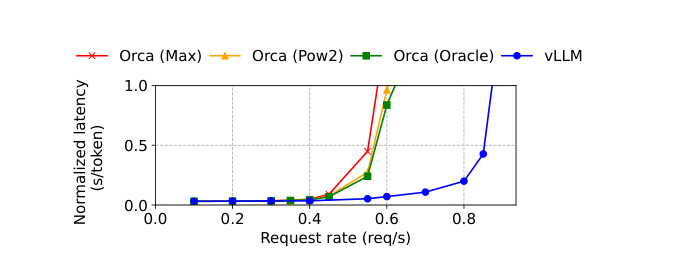

> **图 17：** 聊天机器人工作负载上的性能。

图 17 显示，与三个 Orca 基线相比，vLLM 可以承受 2 倍高的请求速率。由于 ShareGPT 数据集包含许多长对话，大多数请求的输入提示有 1024 个 token。由于伙伴分配算法，Orca 基线无论如何预测输出长度，都为请求输出预留 1024 个 token 的空间。因此，三个 Orca 基线的表现相似。相比之下，vLLM 可以有效处理长提示，因为 PagedAttention 解决了内存碎片化和预留的问题。

## 7 消融研究

在本节中，我们研究 vLLM 的各个方面，并通过消融实验评估我们的设计选择。

### 7.1 内核微基准测试

PagedAttention 中的动态块映射会影响涉及存储 KV 缓存的 GPU 操作（即块读写和注意力）的性能。与现有系统相比，我们的 GPU 内核（第 5 节）涉及访问块表、执行额外分支和处理可变序列长度的额外开销。

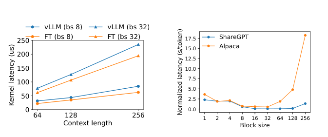

> **图 18：** 消融实验。 (a) 注意力内核延迟。(b) 不同块大小的端到端延迟。

如图 18a 所示，与高度优化的 FasterTransformer 实现相比，这导致注意力内核延迟高出 20%–26%。我们相信这一开销很小，因为它只影响注意力算子，而不影响模型中的其他算子（如 Linear）。尽管存在这一开销，PagedAttention 仍使 vLLM 在端到端性能上显著优于 FasterTransformer（第 6 节）。

### 7.2 块大小的影响

块大小的选择会对 vLLM 的性能产生重大影响。如果块大小太小，vLLM 可能无法充分利用 GPU 的并行性来读取和处理 KV 缓存。如果块大小太大，内部碎片化会增加，共享的概率会降低。

在图 18b 中，我们评估了 vLLM 在不同块大小下的性能，使用 ShareGPT 和 Alpaca trace 在固定请求速率下进行基础采样。在 ShareGPT trace 中，16 到 128 的块大小带来最佳性能。在 Alpaca trace 中，虽然块大小 16 和 32 表现良好，但更大的块大小会显著降低性能，因为序列变得比块大小更短。在实践中，我们发现块大小 16 在大多数工作负载下足够大以有效利用 GPU，也足够小以避免显著的内部碎片化。因此，vLLM 将默认块大小设为 16。

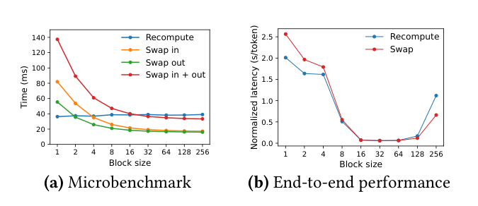

> **图 19：** (a) 不同块大小下重计算和换出的开销。(b) 在相同请求速率下使用 ShareGPT trace 服务 OPT-13B 的性能。

### 7.3 重计算与换出的对比

vLLM 同时支持重计算和换出作为其恢复机制。为理解两种方法之间的权衡，我们评估了它们的端到端性能并对其开销进行了微基准测试，如图 19 所示。我们的结果揭示，换出在小块大小下会带来过高的开销。这是因为小块大小通常导致 CPU 与 GPU 之间大量小块数据的传输，限制了有效的 PCIe 带宽。相比之下，重计算的开销在不同块大小下保持恒定，因为重计算不利用 KV 块。因此，当块大小较小时重计算更高效，而当块大小较大时换出更高效，不过重计算的开销从未超过换出延迟的 20%。对于 16 到 64 的中间块大小，两种方法表现出相当的端到端性能。

## 8 讨论

**将虚拟内存和分页技术应用于其他 GPU 工作负载。** 虚拟内存和分页的思想对于管理 LLM 服务中的 KV 缓存是有效的，因为该工作负载需要动态内存分配（因为输出长度事先未知），且其性能受 GPU 内存容量限制。然而，这并非普遍适用于每个 GPU 工作负载。例如，在 DNN 训练中，张量形状通常是静态的，因此内存分配可以提前优化。再举一个例子，在服务非 LLM 的 DNN 时，内存效率的提高可能不会带来任何性能提升，因为其性能主要受计算限制。在这种情况下，引入 vLLM 的技术反而可能由于内存间接寻址和非连续块内存的额外开销而降低性能。不过，我们很高兴看到 vLLM 的技术被应用于其他与 LLM 服务性质相似的工作负载。

**在应用虚拟内存和分页时的 LLM 特定优化。** vLLM 利用应用特定的语义重新诠释并增强了虚拟内存和分页的思想。一个例子是 vLLM 的全有或全无换出策略，它利用了处理请求需要其所有对应 token 状态都存储在 GPU 内存中的事实。另一个例子是恢复被驱逐块的重计算方法，这在 OS 中是不可行的。此外，vLLM 通过将内存访问操作的 GPU 内核与注意力等其他操作的内核融合，减轻了分页中内存间接寻址的开销。

## 9 相关工作

**通用模型服务系统。** 模型服务近年来一直是一个活跃的研究领域，人们提出了众多系统来应对深度学习模型部署的各个方面。Clipper [11]、TensorFlow Serving [33]、Nexus [45]、InferLine [10] 和 Clockwork [20] 是较早的一些通用模型服务系统。它们研究服务单个或多个模型的批处理、缓存、放置和调度。最近，DVABatch [12] 引入了多入口多出口批处理。REEF [21] 和 Shepherd [61] 提出了服务中的抢占。AlpaServe [28] 利用模型并行实现统计复用。然而，这些通用系统未能考虑 LLM 推理的自回归特性和 token 状态，导致错过优化机会。

**针对 Transformer 的专用服务系统。** 由于 Transformer 架构的重要性，人们开发了众多针对它的专用服务系统。这些系统利用 GPU 内核优化 [1, 29, 31, 56]、高级批处理机制 [14, 60]、模型并行 [1, 41, 60] 和参数共享 [64] 实现高效服务。其中，Orca [60] 与我们的方法最相关。

**与 Orca 的对比。** Orca [60] 中的迭代级调度与 vLLM 中的 PagedAttention 是互补的技术：虽然两个系统都旨在提高 GPU 利用率从而提高 LLM 服务的吞吐量，但 Orca 通过调度和交错请求来实现，使更多请求能够并行处理，而 vLLM 则通过提高内存利用率来实现，使更多请求的工作集能够装入内存。通过减少内存碎片化并支持共享，vLLM 在一批中并行运行更多请求，与 Orca 相比实现了 2–4 倍的加速。事实上，像 Orca 那样的细粒度调度和请求交错使内存管理更具挑战性，使 vLLM 提出的技术更加重要。

**内存优化。** 加速器计算能力与内存容量之间日益扩大的差距使内存成为训练和推理的瓶颈。换出 [23, 42, 55]、重计算 [7, 24] 及其组合 [40] 已被用于降低训练的峰值内存。值得注意的是，FlexGen [46] 研究了在 GPU 内存有限的情况下为 LLM 推理换出权重和 token 状态，但它并不面向在线服务场景。OLLA [48] 优化张量的生命周期和位置以减少碎片化，但它不做细粒度的块级管理或在线服务。FlashAttention [13] 应用分块（tiling）和内核优化来降低注意力计算的峰值内存并减少 I/O 成本。本文在在线服务场景中引入了块级内存管理的新思想。

## 10 结论

本文提出了 PagedAttention，一种允许注意力键和值存储在非连续分页内存中的新注意力算法，并介绍了 vLLM，一个由 PagedAttention 实现高效内存管理的高吞吐 LLM 服务系统。受操作系统的启发，我们展示了虚拟内存和写时复制等成熟技术如何被改造以高效管理 KV 缓存，并处理 LLM 服务中的各种解码算法。我们的实验表明，vLLM 相对于最先进系统实现了 2–4 倍的吞吐量提升。

## 致谢

我们感谢 Xiaoxuan Liu、Zhifeng Chen、Yanping Huang、匿名的 SOSP 审稿人以及我们的 shepherd Lidong Zhou 提供的富有洞察力的反馈。本研究部分得到 Andreessen Horowitz、Anyscale、Astronomer、Google、IBM、Intel、Lacework、Microsoft、Mohamed Bin Zayed University of Artificial Intelligence、Samsung SDS、Uber 和 VMware 的捐赠支持。

## 参考文献

[1] Reza Yazdani Aminabadi, Samyam Rajbhandari, Minjia Zhang, Ammar Ahmad Awan, Cheng Li, Du Li, Elton Zheng, Jeff Rasley, Shaden Smith, Olatunji Ruwase, et al. 2022. DeepSpeed Inference: Enabling Efficient Inference of Transformer Models at Unprecedented Scale. arXiv preprint arXiv:2207.00032 (2022).

[2] Jimmy Lei Ba, Jamie Ryan Kiros, and Geoffrey E Hinton. 2016. Layer normalization. arXiv preprint arXiv:1607.06450 (2016).

[3] Yoshua Bengio, Réjean Ducharme, and Pascal Vincent. 2000. A neural probabilistic language model. Advances in neural information processing systems 13 (2000).

[4] Ondrej Bojar, Rajen Chatterjee, Christian Federmann, Yvette Graham, Barry Haddow, Matthias Huck, Antonio Jimeno Yepes, Philipp Koehn, Varvara Logacheva, Christof Monz, Matteo Negri, Aurelie Neveol, Mariana Neves, Martin Popel, Matt Post, Raphael Rubino, Carolina Scarton, Lucia Specia, Marco Turchi, Karin Verspoor, and Marcos Zampieri. 2016. Findings of the 2016 Conference on Machine Translation. In Proceedings of the First Conference on Machine Translation. Association for Computational Linguistics, Berlin, Germany, 131–198. http://www.aclweb.org/anthology/W/W16/W16-2301

[5] Tom Brown, Benjamin Mann, Nick Ryder, Melanie Subbiah, Jared D Kaplan, Prafulla Dhariwal, Arvind Neelakantan, Pranav Shyam, Girish Sastry, Amanda Askell, et al. 2020. Language models are few-shot learners. Advances in neural information processing systems 33 (2020), 1877–1901.

[6] Mark Chen, Jerry Tworek, Heewoo Jun, Qiming Yuan, Henrique Ponde de Oliveira Pinto, Jared Kaplan, Harri Edwards, Yuri Burda, Nicholas Joseph, Greg Brockman, et al. 2021. Evaluating large language models trained on code. arXiv preprint arXiv:2107.03374 (2021).

[7] Tianqi Chen, Bing Xu, Chiyuan Zhang, and Carlos Guestrin. 2016. Training deep nets with sublinear memory cost. arXiv preprint arXiv:1604.06174 (2016).

[8] Wei-Lin Chiang, Zhuohan Li, Zi Lin, Ying Sheng, Zhanghao Wu, Hao Zhang, Lianmin Zheng, Siyuan Zhuang, Yonghao Zhuang, Joseph E. Gonzalez, Ion Stoica, and Eric P. Xing. 2023. Vicuna: An Open-Source Chatbot Impressing GPT-4 with 90%* ChatGPT Quality. https://lmsys.org/blog/2023-03-30-vicuna/

[9] Aakanksha Chowdhery, Sharan Narang, Jacob Devlin, Maarten Bosma, Gaurav Mishra, Adam Roberts, Paul Barham, Hyung Won Chung, Charles Sutton, Sebastian Gehrmann, et al. 2022. Palm: Scaling language modeling with pathways. arXiv preprint arXiv:2204.02311 (2022).

[10] Daniel Crankshaw, Gur-Eyal Sela, Xiangxi Mo, Corey Zumar, Ion Stoica, Joseph Gonzalez, and Alexey Tumanov. 2020. InferLine: latency-aware provisioning and scaling for prediction serving pipelines. In Proceedings of the 11th ACM Symposium on Cloud Computing. 477–491.

[11] Daniel Crankshaw, Xin Wang, Guilio Zhou, Michael J Franklin, Joseph E Gonzalez, and Ion Stoica. 2017. Clipper: A Low-Latency Online Prediction Serving System. In 14th USENIX Symposium on Networked Systems Design and Implementation (NSDI 17). 613–627.

[12] Weihao Cui, Han Zhao, Quan Chen, Hao Wei, Zirui Li, Deze Zeng, Chao Li, and Minyi Guo. 2022. DVABatch: Diversity-aware Multi-Entry Multi-Exit Batching for Efficient Processing of DNN Services on GPUs. In 2022 USENIX Annual Technical Conference (USENIX ATC 22). 183–198.

[13] Tri Dao, Dan Fu, Stefano Ermon, Atri Rudra, and Christopher Ré. 2022. Flashattention: Fast and memory-efficient exact attention with io-awareness. Advances in Neural Information Processing Systems 35 (2022), 16344–16359.

[14] Jiarui Fang, Yang Yu, Chengduo Zhao, and Jie Zhou. 2021. TurboTransformers: an efficient GPU serving system for transformer models. In Proceedings of the 26th ACM SIGPLAN Symposium on Principles and Practice of Parallel Programming. 389–402.

[15] FastAPI. 2023. FastAPI. https://github.com/tiangolo/fastapi.

[16] Pin Gao, Lingfan Yu, Yongwei Wu, and Jinyang Li. 2018. Low latency rnn inference with cellular batching. In Proceedings of the Thirteenth EuroSys Conference. 1–15.

[17] Amir Gholami, Zhewei Yao, Sehoon Kim, Michael W Mahoney, and Kurt Keutzer. 2021. Ai and memory wall. RiseLab Medium Post 1 (2021), 6.

[18] Github. 2022. https://github.com/features/copilot

[19] Google. 2023. https://bard.google.com/

[20] Arpan Gujarati, Reza Karimi, Safya Alzayat, Wei Hao, Antoine Kaufmann, Ymir Vigfusson, and Jonathan Mace. 2020. Serving {DNNs} like Clockwork: Performance Predictability from the Bottom Up. In 14th USENIX Symposium on Operating Systems Design and Implementation (OSDI 20). 443–462.

[21] Mingcong Han, Hanze Zhang, Rong Chen, and Haibo Chen. 2022. Microsecond-scale Preemption for Concurrent {GPU-accelerated}{DNN} Inferences. In 16th USENIX Symposium on Operating Systems Design and Implementation (OSDI 22). 539–558.

[22] Kaiming He, Xiangyu Zhang, Shaoqing Ren, and Jian Sun. 2016. Deep residual learning for image recognition. In Proceedings of the IEEE conference on computer vision and pattern recognition. 770–778.

[23] Chien-Chin Huang, Gu Jin, and Jinyang Li. 2020. Swapadvisor: Pushing deep learning beyond the gpu memory limit via smart swapping. In Proceedings of the Twenty-Fifth International Conference on Architectural Support for Programming Languages and Operating Systems. 1341–1355.

[24] Paras Jain, Ajay Jain, Aniruddha Nrusimha, Amir Gholami, Pieter Abbeel, Joseph Gonzalez, Kurt Keutzer, and Ion Stoica. 2020. Checkmate: Breaking the memory wall with optimal tensor rematerialization. Proceedings of Machine Learning and Systems 2 (2020), 497–511.

[25] Tom Kilburn, David BG Edwards, Michael J Lanigan, and Frank H Sumner. 1962. One-level storage system. IRE Transactions on Electronic Computers 2 (1962), 223–235.

[26] Brian Lester, Rami Al-Rfou, and Noah Constant. 2021. The power of scale for parameter-efficient prompt tuning. arXiv preprint arXiv:2104.08691 (2021).

[27] Xiang Lisa Li and Percy Liang. 2021. Prefix-tuning: Optimizing continuous prompts for generation. arXiv preprint arXiv:2101.00190 (2021).

[28] Zhuohan Li, Lianmin Zheng, Yinmin Zhong, Vincent Liu, Ying Sheng, Xin Jin, Yanping Huang, Zhifeng Chen, Hao Zhang, Joseph E Gonzalez, et al. 2023. AlpaServe: Statistical Multiplexing with Model Parallelism for Deep Learning Serving. arXiv preprint arXiv:2302.11665 (2023).

[29] Lingxiao Ma, Zhiqiang Xie, Zhi Yang, Jilong Xue, Youshan Miao, Wei Cui, Wenxiang Hu, Fan Yang, Lintao Zhang, and Lidong Zhou. 2020. Rammer: Enabling holistic deep learning compiler optimizations with rtasks. In Proceedings of the 14th USENIX Conference on Operating Systems Design and Implementation. 881–897.

[30] NVIDIA. [n. d.]. Triton Inference Server. https://developer.nvidia.com/nvidia-triton-inference-server.

[31] NVIDIA. 2023. FasterTransformer. https://github.com/NVIDIA/FasterTransformer.

[32] NVIDIA. 2023. NCCL: The NVIDIA Collective Communication Library. https://developer.nvidia.com/nccl.

[33] Christopher Olston, Noah Fiedel, Kiril Gorovoy, Jeremiah Harmsen, Li Lao, Fangwei Li, Vinu Rajashekhar, Sukriti Ramesh, and Jordan Soyke. 2017. Tensorflow-serving: Flexible, high-performance ml serving. arXiv preprint arXiv:1712.06139 (2017).

[34] OpenAI. 2020. https://openai.com/blog/openai-api

[35] OpenAI. 2022. https://openai.com/blog/chatgpt

[36] OpenAI. 2023. https://openai.com/blog/custom-instructions-for-chatgpt

[37] OpenAI. 2023. GPT-4 Technical Report. arXiv:2303.08774 [cs.CL]

[38] LMSYS ORG. 2023. Chatbot Arena Leaderboard Week 8: Introducing MT-Bench and Vicuna-33B. https://lmsys.org/blog/2023-06-22-leaderboard/.

[39] Adam Paszke, Sam Gross, Francisco Massa, Adam Lerer, James Bradbury, Gregory Chanan, Trevor Killeen, Zeming Lin, Natalia Gimelshein, Luca Antiga, et al. 2019. Pytorch: An imperative style, high-performance deep learning library. Advances in neural information processing systems 32 (2019).

[40] Shishir G Patil, Paras Jain, Prabal Dutta, Ion Stoica, and Joseph Gonzalez. 2022. POET: Training Neural Networks on Tiny Devices with Integrated Rematerialization and Paging. In International Conference on Machine Learning. PMLR, 17573–17583.

[41] Reiner Pope, Sholto Douglas, Aakanksha Chowdhery, Jacob Devlin, James Bradbury, Anselm Levskaya, Jonathan Heek, Kefan Xiao, Shivani Agrawal, and Jeff Dean. 2022. Efficiently Scaling Transformer Inference. arXiv preprint arXiv:2211.05102 (2022).

[42] Jie Ren, Samyam Rajbhandari, Reza Yazdani Aminabadi, Olatunji Ruwase, Shuangyan Yang, Minjia Zhang, Dong Li, and Yuxiong He. 2021. ZeRO-Offload: Democratizing Billion-Scale Model Training.. In USENIX Annual Technical Conference. 551–564.

[43] Reuters. 2023. https://www.reuters.com/technology/tech-giants-ai-like-bing-bard-poses-billion-dollar-search-problem-2023-02-22/

[44] Amazon Web Services. 2023. https://aws.amazon.com/bedrock/

[45] Haichen Shen, Lequn Chen, Yuchen Jin, Liangyu Zhao, Bingyu Kong, Matthai Philipose, Arvind Krishnamurthy, and Ravi Sundaram. 2019. Nexus: A GPU cluster engine for accelerating DNN-based video analysis. In Proceedings of the 27th ACM Symposium on Operating Systems Principles. 322–337.

[46] Ying Sheng, Lianmin Zheng, Binhang Yuan, Zhuohan Li, Max Ryabinin, Daniel Y Fu, Zhiqiang Xie, Beidi Chen, Clark Barrett, Joseph E Gonzalez, et al. 2023. High-throughput Generative Inference of Large Language Models with a Single GPU. arXiv preprint arXiv:2303.06865 (2023).

[47] Mohammad Shoeybi, Mostofa Patwary, Raul Puri, Patrick LeGresley, Jared Casper, and Bryan Catanzaro. 2019. Megatron-lm: Training multi-billion parameter language models using model parallelism. arXiv preprint arXiv:1909.08053 (2019).

[48] Benoit Steiner, Mostafa Elhoushi, Jacob Kahn, and James Hegarty. 2022. OLLA: Optimizing the Lifetime and Location of Arrays to Reduce the Memory Usage of Neural Networks. (2022). https://doi.org/10.48550/arXiv.2210.12924

[49] Ilya Sutskever, Oriol Vinyals, and Quoc V Le. 2014. Sequence to sequence learning with neural networks. Advances in neural information processing systems 27 (2014).

[50] Rohan Taori, Ishaan Gulrajani, Tianyi Zhang, Yann Dubois, Xuechen Li, Carlos Guestrin, Percy Liang, and Tatsunori B. Hashimoto. 2023. Stanford Alpaca: An Instruction-following LLaMA model. https://github.com/tatsu-lab/stanford_alpaca.

[51] ShareGPT Team. 2023. https://sharegpt.com/

[52] Hugo Touvron, Thibaut Lavril, Gautier Izacard, Xavier Martinet, Marie-Anne Lachaux, Timothée Lacroix, Baptiste Rozière, Naman Goyal, Eric Hambro, Faisal Azhar, et al. 2023. Llama: Open and efficient foundation language models. arXiv preprint arXiv:2302.13971 (2023).

[53] Ashish Vaswani, Noam Shazeer, Niki Parmar, Jakob Uszkoreit, Llion Jones, Aidan N Gomez, Łukasz Kaiser, and Illia Polosukhin. 2017. Attention is all you need. Advances in neural information processing systems 30 (2017).

[54] Jing Wang, Youyou Lu, Qing Wang, Minhui Xie, Keji Huang, and Jiwu Shu. 2022. Pacman: An Efficient Compaction Approach for {Log-Structured}{Key-Value} Store on Persistent Memory. In 2022 USENIX Annual Technical Conference (USENIX ATC 22). 773–788.

[55] Linnan Wang, Jinmian Ye, Yiyang Zhao, Wei Wu, Ang Li, Shuaiwen Leon Song, Zenglin Xu, and Tim Kraska. 2018. Superneurons: Dynamic GPU memory management for training deep neural networks. In Proceedings of the 23rd ACM SIGPLAN symposium on principles and practice of parallel programming. 41–53.

[56] Xiaohui Wang, Ying Xiong, Yang Wei, Mingxuan Wang, and Lei Li. 2021. LightSeq: A High Performance Inference Library for Transformers. In Proceedings of the 2021 Conference of the North American Chapter of the Association for Computational Linguistics: Human Language Technologies: Industry Papers. 113–120.

[57] Yizhong Wang, Yeganeh Kordi, Swaroop Mishra, Alisa Liu, Noah A Smith, Daniel Khashabi, and Hannaneh Hajishirzi. 2022. Self-Instruct: Aligning Language Model with Self Generated Instructions. arXiv preprint arXiv:2212.10560 (2022).

[58] Thomas Wolf, Lysandre Debut, Victor Sanh, Julien Chaumond, Clement Delangue, Anthony Moi, Pierric Cistac, Tim Rault, Rémi Louf, Morgan Funtowicz, et al. 2020. Transformers: State-of-the-art natural language processing. In Proceedings of the 2020 conference on empirical methods in natural language processing: system demonstrations. 38–45.

[59] Yonghui Wu, Mike Schuster, Zhifeng Chen, Quoc V Le, Mohammad Norouzi, Wolfgang Macherey, Maxim Krikun, Yuan Cao, Qin Gao, Klaus Macherey, et al. 2016. Google's neural machine translation system: Bridging the gap between human and machine translation. arXiv preprint arXiv:1609.08144 (2016).

[60] Gyeong-In Yu, Joo Seong Jeong, Geon-Woo Kim, Soojeong Kim, and Byung-Gon Chun. 2022. Orca: A Distributed Serving System for {Transformer-Based} Generative Models. In 16th USENIX Symposium on Operating Systems Design and Implementation (OSDI 22). 521–538.

[61] Hong Zhang, Yupeng Tang, Anurag Khandelwal, and Ion Stoica. 2023. SHEPHERD: Serving DNNs in the Wild. In 20th USENIX Symposium on Networked Systems Design and Implementation (NSDI 23). USENIX Association, Boston, MA, 787–808. https://www.usenix.org/conference/nsdi23/presentation/zhang-hong

[62] Susan Zhang, Stephen Roller, Naman Goyal, Mikel Artetxe, Moya Chen, Shuohui Chen, Christopher Dewan, Mona Diab, Xian Li, Xi Victoria Lin, et al. 2022. Opt: Open pre-trained transformer language models. arXiv preprint arXiv:2205.01068 (2022).

[63] Lianmin Zheng, Zhuohan Li, Hao Zhang, Yonghao Zhuang, Zhifeng Chen, Yanping Huang, Yida Wang, Yuanzhong Xu, Danyang Zhuo, Eric P Xing, et al. 2022. Alpa: Automating Inter-and Intra-Operator Parallelism for Distributed Deep Learning. In 16th USENIX Symposium on Operating Systems Design and Implementation (OSDI 22). 559–578.

[64] Zhe Zhou, Xuechao Wei, Jiejing Zhang, and Guangyu Sun. 2022. PetS: A Unified Framework for Parameter-Efficient Transformers Serving. In 2022 USENIX Annual Technical Conference (USENIX ATC 22). 489–504.
