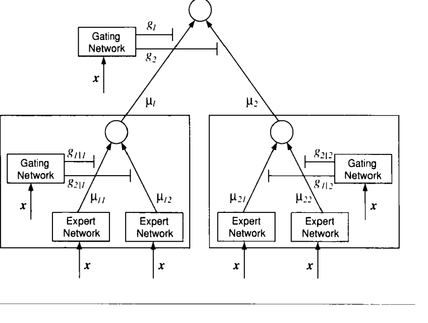
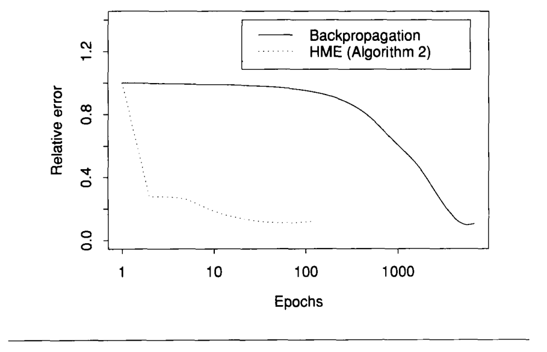
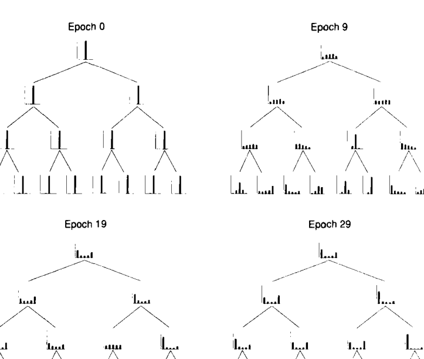
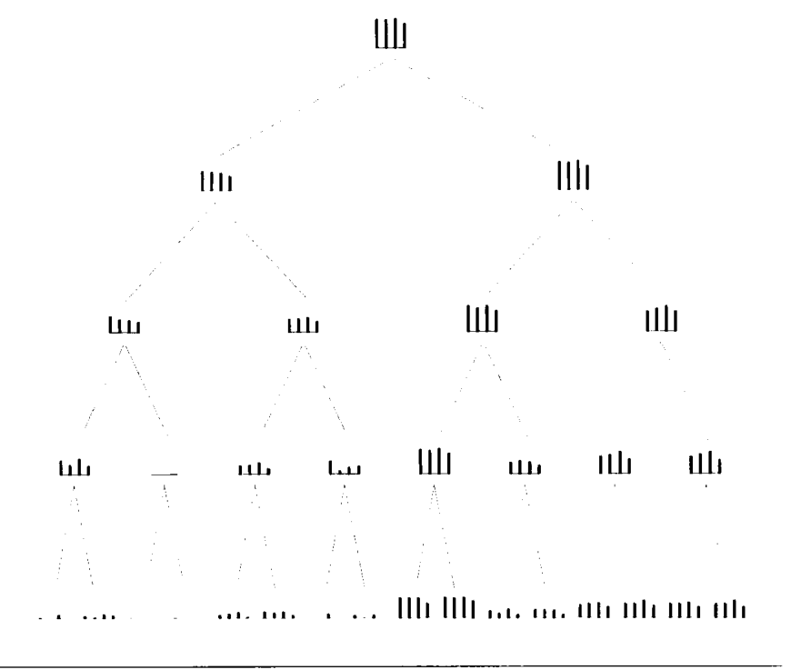
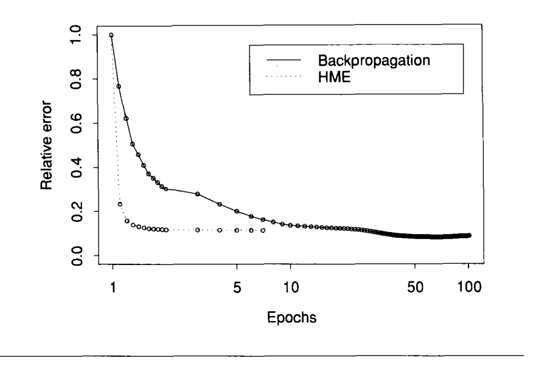
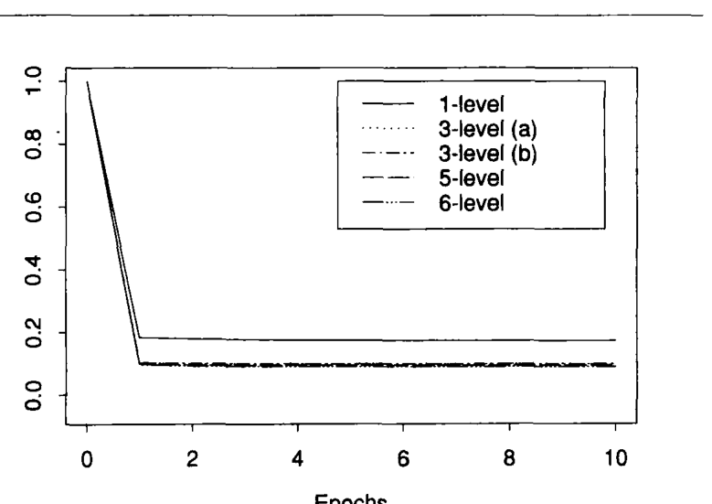

# 分层专家混合与 EM 算法（Hierarchical Mixtures of Experts and the EM Algorithm）

> Michael I. Jordan | Massachusetts Institute of Technology, Department of Brain and Cognitive Sciences, Cambridge, MA 02139, USA
> Robert A. Jacobs | University of Rochester, Department of Psychology, Rochester, NY 14627, USA
> 本文发表于 Neural Computation 6, 181-214 (1994)，审稿人 Steven Nowlan。

本文提出一种用于监督学习的树形结构架构。该架构的统计基础是一类分层混合模型，其中混合系数与混合分量都是广义线性模型（GLIM，Generalized Linear Model）。学习被视为极大似然问题；本文给出了一个期望最大化（EM，Expectation-Maximization）算法来调整架构参数，并进一步提出了参数增量更新的在线学习算法。核心发现是——**在机器人动力学任务上，HME 的收敛速度比多层感知机反向传播快两个数量级以上（HME 35-39 个 epoch 收敛，反向传播需 5,500 个 epoch），同时逼近精度相当（测试集相对误差 0.10 vs 0.09）**。

核心内容：

- 分而治之是广泛适用的数学思想：CART、MARS、ID3 等算法把输入空间硬切分为嵌套区域再拟合简单表面，但硬切分会显著增大估计方差
- HME 以"软切分"替代硬切分——门控网络（gating network）用多项 logit 模型（multinomial logit model）在输入空间产生单位剖分（partition of unity），数据可同时落在多个区域
- 专家网络（expert network）位于树的叶节点，每个专家是一个带输出非线性的一般化线性系统；输出沿树向上逐层加权混合
- 学习建立在混合模型 + GLIM 的极大似然框架上：E 步计算树的节点后验概率，M 步转化为一组迭代重加权最小二乘（IRLS，Iteratively Reweighted Least Squares）问题，并进一步化简为纯最小二乘批量算法与在线算法
- 收敛性有理论保证：EM 框架保证似然单调递增并收敛到局部极大

关键发现：

- HME 批量算法（算法 1 / 算法 2）分别以 **35 / 39 个 epoch 收敛**，反向传播需 5,500 个 epoch，快 **两个数量级以上**；在线版 HME 仅需 2 个 epoch
- 测试集相对误差：反向传播 0.09，HME 0.10（算法 2 为 0.12），优于 CART 0.17、MARS 0.16、线性 0.31；且 HME 无任何自由参数，反向传播需依赖学习率/动量粗搜索
- 批量实验中反向传播 10 次运行有 5 次陷入局部极小（平台），HME 的 10 次运行全部收敛
- 模型选择方面，门控参数小时整个系统退化为单个"平均" GLIM，随训练进行分裂逐渐形成、自由度逐步增加，可用测试集控制有效自由度

---

## 摘要

我们提出一种用于监督学习的树形结构架构。该架构背后的统计模型是一个分层混合模型（hierarchical mixture model），其中混合系数与混合分量都是广义线性模型（GLIM）。学习被当作一个极大似然问题处理；特别地，我们提出了一个用于调整该架构参数的期望最大化（EM）算法。我们还开发了一个在线学习算法，其中参数被增量地更新。我们在机器人动力学领域给出了对比仿真结果。

---

## 1. 引言

分而治之（divide-and-conquer）是一个在整个应用数学领域都具有广泛适用性的原理。分而治之算法通过将一个复杂问题分解为若干更简单的问题来攻克它，而这些简单问题的解可以合成为原复杂问题的解。这种方法往往能产生简单、优雅且高效的算法。在本文中，我们探讨分而治之原理在学习问题的某一个特定应用。我们描述了一个网络架构以及针对该架构的学习算法，二者都受到分而治之哲学的启发。

在统计学文献和机器学习文献中，分而治之方法已变得越来越流行。Breiman 等人（1984）的 CART 算法（Classification and Regression Trees，分类与回归树）、Friedman（1991）的 MARS 算法（Multivariate Adaptive Regression Splines，多元自适应回归样条）以及 Quinlan（1986）的 ID3 算法（Iterative Dichotomiser 3，迭代二分器 3）都是著名的例子。这些算法通过将输入空间显式划分为一组嵌套的区域序列，并在这些区域内拟合简单的表面（例如常数函数）来拟合数据。它们的收敛时间往往比基于梯度的神经网络算法快若干个数量级。

虽然分而治之算法有很多值得推荐之处，但人们应当关注划分输入空间所带来的统计后果。划分数据对估计量的偏差（bias）可能是有利的，但它通常会增大方差（variance）。以线性回归为例，参数斜率与截距估计的方差与数据在 x 轴上的散布程度呈二次方关系。输入空间中最外围的点正是使参数估计方差降低效果最大的那些点。

上述考虑表明，分而治之算法通常倾向于成为方差增大（variance-increasing）的算法。事实的确如此，这一问题在高维空间中尤为严重，因为此时数据变得极其稀疏（Scott 1992）。对这一困境的一种应对方式——CART、MARS 和 ID3 所采用的，本文同样采用的——是使用分段常数或分段线性函数。这些函数以增加偏差为代价最小化方差。我们还使用了第二种降低方差的装置，一种在神经网络文献中常见的装置，即对数据进行"软"切分（soft splits）（Bridle 1989；Nowlan 1991；Wahba et al. 1993），允许数据同时位于多个区域中。这种方法使一个区域中的参数能够受到邻近区域数据的影响。CART、MARS 和 ID3 依赖"硬"切分（hard splits），正如我们上面提到的，硬切分对方差有特别严重的影响。通过允许软切分，砍掉远处数据的严重影响可以得到缓解。我们还试图最小化使用分段线性函数所带来的偏差，方法是允许切分沿输入空间中任意方向的超平面形成。这减轻了由输入之间的高阶交互引起的偏差，并使算法对编码数据所用坐标的具体选择不敏感（这是相对于 MARS 和 ID3 等坐标依赖方法的改进）。

我们在此描述的工作与统计理论的多个分支有联系。首先，与我们先前的相关工作一致（Jacobs et al. 1991），我们将学习问题表述为一个混合估计（mixture estimation）问题（cf. Cheeseman et al. 1988；Duda and Hart 1973；Nowlan 1991；Redner and Walker 1984；Titterington et al. 1985）。我们表明，通常用于混合参数无监督学习的算法——Dempster 等人（1977）的期望最大化（EM，Expectation-Maximization）算法——也可以被用于监督学习。其次，我们利用广义线性模型（GLIM）理论（McCullagh and Nelder 1983）为架构的各分量提供基本的统计结构。特别是，上面提到的"软切分"被建模为多项 logit 模型（multinomial logit model）——GLIM 的一种特定形式。我们还表明，为拟合 GLIM 而开发的算法——迭代重加权最小二乘（IRLS）算法——可以在我们的模型中发挥重要作用，特别是作为 EM 算法的 M 步。最后，我们表明这些思想可以以递归的方式发展，产生一种使人联想到 CART、MARS 和 ID3 的树形结构估计方法。

本文的组织结构如下：第 2 节给出了该架构的统计模型、架构的似然函数以及相应的学习算法。在介绍梯度下降算法之后，我们为该架构开发了一种更强大的学习算法，它是 Dempster 等人（1977）的一般期望最大化（EM）框架的特例。我们还描述了该算法的一个最小二乘版本，它导致了特别高效的实现。后两种算法都是批量学习算法。在最后一节中，我们介绍了最小二乘算法的在线版本，它在实践中似乎是我们研究过的算法中最高效的。

## 2. 分层专家混合（Hierarchical Mixtures of Experts）

我们在本文中讨论的算法是监督学习算法。我们明确讨论回归问题，其中输入向量是 $\mathbb{R}^n$ 的元素，输出向量是 $\mathbb{R}^m$ 的元素。我们还考虑分类模型和输出为整数值的计数模型。数据被假定构成一对对观测的可数集合：$X = \{(x^{(t)}, y^{(t)})\}$。对于下文讨论的批量算法，该集合被假定为有限的；对于在线算法，该集合可能是无限的。

我们提出通过将输入空间划分为一组嵌套区域，并对落入这些区域的数据拟合简单的表面，来解决非线性监督学习问题。区域具有"软"边界，意味着数据点可以同时位于多个区域中。区域之间的边界本身是简单的参数化表面，由学习算法调整。

分层专家混合（HME，Hierarchical Mixture-of-Experts）架构如图 1 所示^1。该架构是一棵树，其中门控网络（gating networks）位于树的非叶节点。这些网络接收向量 $x$ 作为输入，并在输入空间的每个点上产生构成单位剖分（partition of unity）的标量输出。专家网络（expert networks）位于树的叶节点。每个专家对每个输入向量产生一个输出向量 $\mu_{ij}$。这些输出向量沿树向上传播，由门控网络的输出进行混合。

树中的所有专家网络都是线性的，并带有单一的输出非线性。借用统计学中的术语（McCullagh and Nelder 1983），我们将这样的网络称为"一般化线性"（generalized linear）网络。

**图 1:** 两级分层专家混合（HME）。要形成更深的树，每个专家被递归展开为一个门控网络和一组子专家。

专家网络 $(i, j)$ 将输入 $x$ 的一般化线性函数作为其输出 $\mu_{ij}$：

$$
\mu_{ij} = f(U_{ij} x) \qquad (2.1)
$$

其中 $U_{ij}$ 是权重矩阵， $f$ 是固定的连续非线性函数。向量 $x$ 被假定包含一个固定为 1 的分量，以考虑截距项。

对于回归问题， $f(\cdot)$ 通常被选为恒等函数（即专家是线性的）。对于二元分类问题， $f(\cdot)$ 通常取逻辑（logistic）函数，在这种情况下，专家输出被解释为 Bernoulli 概率模型下"成功"的对数几率的估计（见下文）。其他模型（例如多路分类、计数、速率估计和生存估计）通过对 $f(\cdot)$ 做其他选择来处理。这些模型是对应 GLIM 模型的平滑分段模拟（cf. McCullagh and Nelder 1983）。

门控网络也是一般化线性的。定义中间变量 $\xi_i$ 如下：

$$
\xi_i = v_i^\top x \qquad (2.2)
$$

其中 $v_i$ 是权重向量。那么顶层门控网络的第 $i$ 个输出是 $\xi_i$ 的"softmax"函数（Bridle 1989；McCullagh and Nelder 1983）：

$$
g_i = \frac{\exp(\xi_i)}{\sum_k \exp(\xi_k)} \qquad (2.3)
$$

注意，对每个 $x$ ， $g_i$ 都是正的且和为 1。它们可以被解释为提供了输入空间的"软"划分。

类似地，较低层的门控网络也是一般化线性系统。定义 $\xi_{ij}$ 如下：

$$
\xi_{ij} = v_{ij}^\top x \qquad (2.4)
$$

那么

$$
g_{j|i} = \frac{\exp(\xi_{ij})}{\sum_k \exp(\xi_{ik})} \qquad (2.5)
$$

是架构第二层中第 $i$ 个门控网络第 $j$ 个单元的输出。同样地，对每个 $x$ ， $g_{j|i}$ 都是正的且和为 1。它们可以被解释为提供了嵌套在高层门控网络划分之内的输入空间"软"子划分。

树上每个非叶节点的输出向量是其下各专家输出的加权结果。也就是说，在两级树第二层的第 $i$ 个非叶节点的输出为

$$
\mu_i = \sum_j g_{j|i} \mu_{ij}
$$

而树顶层的输出为

$$
\mu = \sum_i g_i \mu_i
$$

注意 $g$ 和 $\mu$ 都依赖于输入 $x$ ，因此总输出是输入的非线性函数。

### 2.1. 回归表面（Regression Surface）

给定专家网络和门控网络的定义，该层级结构所定义的回归表面是各专家所定义回归表面的分段混合。门控网络提供了输入空间的嵌套"软"划分，专家网络在划分的内部提供局部回归表面。相邻区域之间存在重叠。为了理解重叠的本质，考虑一个具有两个专家网络的单层层级结构。在这种情况下，门控网络有两个输出 $g_1$ 和 $g_2$ 。门控输出 $g_1$ 由下式给出：

$$
g_1 = \frac{\exp(\xi_1)}{\exp(\xi_1) + \exp(\xi_2)} = \frac{1}{1 + \exp(-(\xi_1 - \xi_2))} \qquad (2.6)
$$

它是一个逻辑脊函数（logistic ridge function），其朝向由向量 $v_1 - v_2$ 的方向决定。门控输出 $g_2$ 等于 $1 - g_1$ 。对给定的 $x$ ，总输出 $\mu$ 是凸组合 $g_1 \mu_1 + g_2 \mu_2$ 。这是各专家的加权平均，其中权重由脊函数的值决定。沿脊线， $g_1 = g_2 = 1/2$ ，两个专家贡献相等。远离脊线，其中一个专家占主导。跨脊线的平滑程度由向量 $v_2 - v_1$ 的大小决定。如果 $v_2 - v_1$ 很大，那么脊函数变为尖锐的切分，专家的加权输出变为分段（一般化）线性的。如果 $v_2 - v_1$ 很小，那么每个专家在脊线的两侧都有显著贡献，从而平滑了分段映射。在零差向量的极限下，对所有 $x$ 都有 $g_1 = g_2 = 1/2$ ，总输出在虚构"切分"的两侧都是相同的固定专家平均。

一般来说，给定的门控网络在输入空间上诱导一个平滑的平面划分。较低层的门控网络在高层门控网络所诱导的划分内部再诱导一个划分。给定门控网络中的权重决定了该特定分辨率层级上跨划分的平滑程度：大的权重向量意味着跨脊线的回归表面发生急剧变化，小权重则意味着更平滑的表面。在所有门控网络权重为零的极限情况下，整个层级结构退化为一个固定平均（在回归情况下是线性系统）。

### 2.2. 概率模型（A Probability Model）

该层级结构可以被赋予概率解释。我们假设环境生成数据的机制涉及一个嵌套的决策序列，并以一个将 $x$ 映射为 $y$ 的回归过程终止。这些决策被建模为多项随机变量（multinomial random variables）。也就是说，对每个 $x$ ，我们将值 $g_i(x, v_i)$ 解释为与第一个决策相关的多项概率，将 $g_{j|i}(x, v_{ij})$ 解释为与第二个决策相关的（条件）多项概率，其中上标"0"指的是参数的"真"值。这些决策形成一棵决策树。我们用统计模型来建模这棵决策树；特别是，我们参数化的选择（cf. 方程 2.2、2.3、2.4 和 2.5）对应于树上每个非叶节点处的多项 logit 概率模型（见附录 B）。多项 logit 模型是 GLIM 的一个特例，通常用于"软"多路分类（McCullagh and Nelder 1983）。在多项 logit 模型下，我们将门控网络解释为对数据树形结构模型中特定分辨率层级上决策的输入依赖的多项概率进行建模。

一旦做出了特定的决策序列，导致选择了回归过程 $(i, j)$ ，就假定输出 $y$ 根据以下统计模型生成。首先，形成线性预测子（linear predictor） $\eta_{ij}$：

$$
\eta_{ij} = U_{ij} x
$$

通过对线性预测子应用链接函数 $f$ 得到 $y$ 的期望值^2：

$$
\mu_{ij} = f(\eta_{ij})
$$

然后从具有均值 $\mu_{ij}$ 和"散布"（dispersion）参数 $\phi_{ij}$ 的概率密度 $P$ 中选择输出 $y$ 。我们将 $y$ 的密度记为$P(y|x, \theta_{ij})$，其中参数向量 $\theta_{ij}$ 包括权重 $U_{ij}$ 和散布参数 $\phi_{ij}$：

$$
\theta_{ij} = (U_{ij}, \phi_{ij})
$$

我们假定密度 $P$ 是指数族（exponential family）密度的成员（McCullagh and Nelder 1983）^3。散布参数的解释取决于密度的特定选择。例如，在 $n$ 维高斯的情形下，散布参数就是协方差矩阵 $\Sigma_{ij}$。

给定这些假设，从 $x$ 生成 $y$ 的总概率是分别从每个分量密度生成 $y$ 的概率的混合，其中混合比例是多项概率：

$$
P(y|x, \theta) = \sum_i g_i(x, v_i) \sum_j g_{j|i}(x, v_{ij}) P_{ij}(y|x, \theta_{ij}) \qquad (2.8)
$$

注意 $\theta$ 既包括专家网络参数 $\theta_{ij}$，也包括门控网络参数 $v_i$ 和 $v_{ij}$。还要注意，我们已经明确指出了概率 $g_i$ 和 $g_{j|i}$ 对输入 $x$ 和参数的依赖性。在本文余下部分，为了简化记号，我们省略对输入和参数的显式引用：

$$
P^{(0)}(y|x, \theta^{(0)}) = \sum_i g_i^{(0)} \sum_j g_{j|i}^{(0)} P_{ij}^{(0)}(y) \qquad (2.9)
$$

我们还在不带任何上标的情况下使用方程 2.9，以指代由特定 HME 架构定义的概率模型，而不涉及"真"模型。

#### 2.2.1. 例（回归）

在回归的情况下，模型的概率分量通常被假定为高斯分布。假定每个专家具有形式为 $\sigma^2 I$ 的相同协方差矩阵，则产生以下分层概率模型：

$$
P(y|x, \theta) = \sum_i g_i \sum_j g_{j|i} \frac{1}{(2\pi\sigma^2)^{n/2}} \exp \left\{ -\frac{1}{2\sigma^2} (y - \mu_{ij})^\top (y - \mu_{ij}) \right\}
$$

#### 2.2.2. 例（二元分类）

在二元分类问题中，输出 $y$ 是离散随机变量，其可能的结果为"失败"和"成功"。模型的概率分量通常被假定为 Bernoulli 分布（Cox 1970）。在这种情况下，均值 $\pi_{ij}$ 是将输入分类为"成功"的条件概率。由此产生的分层概率模型是 Bernoulli 密度的混合：

$$
P(y|x, \theta) = \sum_i g_i \sum_j g_{j|i} \pi_{ij}^y (1 - \pi_{ij})^{1-y}
$$

### 2.3. 后验概率（Posterior Probabilities）

在开发本文余下部分将要给出的学习算法的过程中，定义与树节点关联的后验概率将是很有用的。在此语境下，"后验"和"先验"这两个术语在系统训练过程中是有意义的。我们称概率 $g_i$ 和 $g_{j|i}$ 为先验概率，因为它们仅基于输入 $x$ 计算，而不知道对应的目标输出 $y$ 。一旦输入和目标输出都已知，就定义了后验概率。使用贝叶斯准则，我们如下定义树节点处的后验概率：

$$
h_i = \frac{g_i \sum_j g_{j|i} P_{ij}(y)}{\sum_i g_i \sum_j g_{j|i} P_{ij}(y)} = \frac{g_i \sum_j g_{j|i} P_{ij}(y)}{P(y|x, \theta)} \qquad (2.10)
$$

以及

$$
h_{j|i} = \frac{g_{j|i} P_{ij}(y)}{\sum_j g_{j|i} P_{ij}(y)} \qquad (2.11)
$$

我们还将发现定义联合后验概率 $h_{ij}$ 很有用，它是 $h_i$ 和 $h_{j|i}$ 的乘积：

$$
h_{ij} = h_i h_{j|i} \qquad (2.12)
$$

该量是专家网络 $(i,j)$ 可以被认为已经生成该数据的概率，基于对输入和输出的了解。再次强调，所有这些量都以输入 $x$ 为条件。

在更深的树中，与专家网络关联的后验概率就是从树根到该专家的路径上各个条件后验概率的乘积。

### 2.4. 似然函数与梯度上升学习算法（The Likelihood and a Gradient Ascent Learning Algorithm）

Jordan 和 Jacobs（1992）提出了针对该层级架构的梯度上升学习算法。该算法基于 Jacobs 等人（1991）的早期工作，他们将混合专家（mixture-of-experts）架构中的学习问题视为极大似然估计问题。数据集 $X = \{(x^{(t)}, y^{(t)})\}_{t=1}^N$ 的对数似然是通过取 $N$ 个方程 2.9 形式密度的乘积的对数得到的，得到如下对数似然：

$$
l(\theta; X) = \sum_t \log \left[ \sum_i g_i^{(t)} \sum_j g_{j|i}^{(t)} P_{ij}^{(t)}(y^{(t)}) \right] \qquad (2.13)
$$

我们假定概率密度 $P$ 是协方差矩阵为单位阵的高斯分布，并且链接函数是恒等函数。在这种情况下，通过对参数微分 $l(\theta; X)$ ，我们得到权重矩阵 $U_{ij}$ 的如下梯度上升学习规则：

$$
\Delta U_{ij} = \rho \sum_t h_{ij}^{(t)} (y^{(t)} - \mu_{ij}^{(t)}) x^{(t)\top} \qquad (2.14)
$$

其中 $\rho$ 是学习率。顶层门控网络第 $i$ 个权重向量的梯度上升学习规则为

$$
\Delta v_i = \rho \sum_t (h_i^{(t)} - g_i^{(t)}) x^{(t)} \qquad (2.15)
$$

第 $i$ 个低层门控网络第 $j$ 个权重向量的梯度上升规则为

$$
\Delta v_{ij} = \rho \sum_t h_i^{(t)} (h_{j|i}^{(t)} - g_{j|i}^{(t)}) x^{(t)} \qquad (2.16)
$$

协方差矩阵的更新也可以获得（Jordan and Jacobs 1992）。

由方程 2.14、2.15 和 2.16 给出的算法是批量学习算法。相应的在线算法通过简单地去掉求和号并在每次刺激呈现后更新参数获得。因此，例如

$$
U_{ij}^{(t+1)} = U_{ij}^{(t)} + \rho h_{ij}^{(t)} (y^{(t)} - \mu_{ij}^{(t)}) x^{(t)\top} \qquad (2.17)
$$

是基于第 $t$ 个刺激模式的 $(i, j)$ 专家网络权重的随机更新规则。

### 2.5. EM 算法（The EM Algorithm）

在接下来的几节中，我们基于 Dempster 等人（1977）的期望最大化（EM）框架为 HME 架构开发学习算法。我们为架构推导了一个 EM 算法，它由迭代求解一组耦合的迭代重加权最小二乘问题组成。

EM 算法是极大似然估计的一般技术。在实践中，EM 几乎完全被应用于无监督学习问题。这在神经网络文献和机器学习文献中都是如此——EM 已出现于聚类（Cheeseman et al. 1988；Nowlan 1991）和密度估计（Specht 1991）的语境中；在统计学文献中也是如此——其应用包括缺失数据问题（Little and Rubin 1987）、混合密度估计（Redner and Walker 1984）和因子分析（Dempster et al. 1977）。另一个无监督学习应用是隐马尔可夫模型（HMM，Hidden Markov Model）的学习问题，其 Baum-Welch 再估计公式是 EM 的一个特例。EM 框架中没有任何东西妨碍其应用于回归或分类问题；然而，这样的应用很少^4。

EM 是极大似然估计的迭代方法。EM 算法的每次迭代由两步组成：估计（E）步和最大化（M）步。M 步涉及最大化一个由 E 步在每次迭代中重新定义的似然函数。如果算法在 M 步仅仅增加函数而不是最大化函数，则该算法被称为广义 EM（GEM，Generalized EM）算法。Boltzmann 学习算法（Hinton and Sejnowski 1986）是 GEM 算法的神经网络例子。GEM 算法的收敛通常比 EM 算法慢得多。

EM 的一个应用通常始于这样的观察：如果只有一组被称为"缺失"或"隐"变量的附加变量已知，那么似然函数 $l(\theta; X)$ 的优化将被简化。在此语境中，我们将可观测数据 $X$ 称为"不完全数据"（incomplete data），并假设存在一个包含缺失变量 $Z$ 的"完全数据"（complete data）集合 $Y$ 。我们指定一个将虚构的缺失变量与实际数据联系起来的概率模型： $P(y, z|x, \theta)$ 。密度 $P$ 的对数定义了"完全数据似然" $l_c(\theta; Y)$ 。原始似然 $l(\theta; X)$ 在此语境中被称为"不完全数据似然"（incomplete-data likelihood）。

正是这两个似然函数之间的关系推动了 EM 算法。注意，完全数据似然是一个随机变量，因为缺失变量 $Z$ 实际上是未知的。EM 算法首先在给定观测数据和当前模型的条件下求完全数据似然的期望值。这就是 E 步：

$$
Q(\theta, \theta^{(p)}) = E[l_c(\theta; Y)|X]
$$

其中 $\theta^{(p)}$ 是第 $p$ 次迭代时参数的值，期望是关于 $\theta^{(p)}$ 取的。这一步产生一个确定性函数 $Q$ 。M 步关于 $\theta$ 最大化这个函数以找到新的参数估计 $\theta^{(p+1)}$：

$$
\theta^{(p+1)} = \arg\max_\theta Q(\theta, \theta^{(p)})
$$

然后重复 E 步以产生完全似然的改进估计，如此迭代。

EM 的一次迭代选择一个能增加 $Q$ （完全似然的期望）值的参数值。这样的迭代对不完全似然有什么影响呢？Dempster 等人证明了 $Q$ 的增加意味着不完全似然的增加：

$$
l(\theta^{(p+1)}; X) \geq l(\theta^{(p)}; X)
$$

等式仅在 $l$ 的驻点成立（Wu 1983）。因此，似然 $l$ 沿着 EM 算法生成的参数估计序列单调递增。在实践中，这意味着收敛到局部极大值。

### 2.6. 将 EM 应用于 HME 架构（Applying EM to the HME Architecture）

要为 HME 架构开发 EM 算法，我们必须定义合适的"缺失数据"以简化似然函数。我们定义指示变量 $z_i$ 和 $z_{j|i}$ ，使得 $z_i$ 中有且仅有一个等于 1，$z_{j|i}$ 中有且仅有一个等于 1。这些指示变量可以被解释为与概率模型中的决策相对应的标签。我们还定义指示变量 $z_{ij}$ ，它是 $z_i$ 和 $z_{j|i}$ 的乘积。该变量可以被解释为在概率模型中指明专家（回归过程）的标签。如果标签 $z_i$ 、 $z_{j|i}$ 和 $z_{ij}$ 已知，那么极大似然问题就会解耦为每个专家网络的一组独立的回归问题，以及门控网络的一组独立的多路分类问题。这些问题可以彼此独立地求解，从而产生一个快速的一遍学习算法。当然，缺失变量是未知的，但我们可以指定一个将它们与可观测数据联系起来的概率模型。该概率模型可以用 $z_{ij}$ 写成如下形式：

$$
P(y^{(t)}, z^{(t)}|x^{(t)}, \theta) = \prod_i \prod_j \left\{ g_i^{(t)} g_{j|i}^{(t)} P_{ij}^{(t)}(y^{(t)}) \right\}^{z_{ij}^{(t)}} \qquad (2.18)
$$

利用 $z^{(t)}$ 是指示变量这一事实：

$$
= \prod_t \prod_i \prod_j \left\{ g_i^{(t)} g_{j|i}^{(t)} P_{ij}^{(t)}(y^{(t)}) \right\}^{z_{ij}^{(t)}} \qquad (2.19)
$$

取该概率模型的对数产生如下完全数据似然：

$$
l_c(\theta; Y) = \sum_t \sum_i \sum_j z_{ij}^{(t)} \left\{ \ln g_i^{(t)} + \ln g_{j|i}^{(t)} + \ln P_{ij}^{(t)}(y^{(t)}) \right\} \qquad (2.20)
$$

注意方程 2.20 中的完全数据似然与方程 2.13 中不完全数据似然的关系。指示变量 $z_{ij}$ 的使用使对数被移入求和号内部，从而显著简化了最大化问题。

我们现在通过取完全数据似然的期望来定义 EM 算法的 E 步：

$$
Q(\theta, \theta^{(p)}) = \sum_t \sum_i \sum_j h_{ij}^{(t)} \left\{ \ln g_i^{(t)} + \ln g_{j|i}^{(t)} + \ln P_{ij}^{(t)}(y^{(t)}) \right\} \qquad (2.21)
$$

其中我们使用了 $E[z_i^{(t)}|X] = h_i^{(t)}$ 、 $E[z_{j|i}^{(t)}|X] = h_{j|i}^{(t)}$ 且 $E[z_{ij}^{(t)}|X] = h_{ij}^{(t)}$ 的事实。（还要注意 $E[z_{ij}^{(t)}|X] = h_{ij}^{(t)}$ 。）

M 步要求关于专家网络参数和门控网络参数最大化 $Q(\theta, \theta^{(p)})$ 。检查方程 2.21，我们看到专家网络参数只通过项 $h_{ij}^{(t)} \ln P_{ij}^{(t)}(y^{(t)})$ 影响 $Q$ 函数，门控网络参数只通过项 $h_i^{(t)} \ln g_i^{(t)}$ 和 $h_{ij}^{(t)} \ln g_{j|i}^{(t)}$ 影响 $Q$ 函数。因此 M 步简化为以下独立的最大化问题：

$$
U_{ij}^{(p+1)} = \arg\max_{U_{ij}} \sum_t h_{ij}^{(t)} \ln P_{ij}^{(t)}(y^{(t)}) \qquad (2.22)
$$

对于顶层门控网络：

$$
v_i^{(p+1)} = \arg\max_{v_i} \sum_t h_i^{(t)} \ln g_i^{(t)} \qquad (2.23)
$$

以及对于低层门控网络：

$$
v_{ij}^{(p+1)} = \arg\max_{v_{ij}} \sum_t h_i^{(t)} \ln g_{j|i}^{(t)} \qquad (2.24)
$$

这些最大化问题中的每一个本身都是一个极大似然问题。这在方程 2.22 的情形下显然成立，它只是一个关于概率密度 $P_{ij}$ 的加权极大似然问题。给定我们对 $P_{ij}$ 的参数化，方程 2.22 的对数似然是一个 GLIM 的加权对数似然。一种称为迭代重加权最小二乘（IRLS）的高效算法可用于求解此类模型的极大似然问题（McCullagh and Nelder 1983）。我们在附录 A 中讨论 IRLS。

方程 2.23 涉及最大化后验概率 $h_i^{(t)}$ 与先验概率 $g_i^{(t)}$ 之间的交叉熵。该交叉熵是与多项 logit 概率模型关联的对数似然，其中 $h_i^{(t)}$ 充当输出观测（见附录 B）。因此方程 2.23 中的最大化也是一个 GLIM 的极大似然问题，可以用 IRLS 求解。方程 2.24 也是如此，它是一个带输出观测 $h_{j|i}^{(t)}$ 和观测权重 $h_i^{(t)}$ 的加权极大似然问题。

总之，我们得到的 EM 算法在外层循环中计算后验概率（E 步），在内层循环中求解一组 IRLS 问题（M 步）。我们将该算法总结如下：

**算法 1**（批处理 EM 算法）

$$
\begin{aligned}
&1. \text{对每个数据对 } (x^{(t)}, y^{(t)}) \text{，使用参数的当前值计算后验概率 } h_i^{(t)} \text{ 和 } h_{j|i}^{(t)}。\\
&2. \text{对每个专家 } (i, j) \text{，求解一个带观测 } \{(x^{(t)}, y^{(t)})\}_{t=1}^N \text{ 和观测权重 } \{h_{ij}^{(t)}\}_{t=1}^N \text{ 的 IRLS 问题}。\\
&3. \text{对每个顶层门控网络，求解一个带观测 } \{(x^{(t)}, h_i^{(t)})\}_{t=1}^N \text{ 的 IRLS 问题}。\\
&4. \text{对每个低层门控网络，求解一个带观测 } \{(x^{(t)}, h_{j|i}^{(t)})\}_{t=1}^N \text{ 和观测权重 } \{h_i^{(t)}\}_{t=1}^N \text{ 的加权 IRLS 问题}。\\
&5. \text{使用更新后的参数值迭代。}
\end{aligned}
$$

### 2.7. 最小二乘算法（A Least-Squares Algorithm）

在回归情况下，即使用高斯概率模型和恒等链接函数时，专家网络的 IRLS 循环退化为加权最小二乘，可以用任何标准的最小二乘算法（一遍）求解（Golub and van Loan 1989）。门控网络仍然需要迭代处理。然而，假设我们用最小二乘而非极大似然来拟合门控网络的参数。在这种情况下，我们可能希望得到一个门控网络参数由一遍算法拟合的算法。为了说明这种方法，注意我们可以按如下方式表述门控网络的 IRLS 问题。关于参数 $v_i$ 对交叉熵（方程 2.23）求微分（利用 $\partial g_i/\partial \xi_j = g_i(\delta_{ij} - g_j)$ 的事实，其中 $\delta_{ij}$ 是 Kronecker delta），并将导数设为零，得到以下方程：

$$
\sum_t (h_i^{(t)} - g_i(x^{(t)}, v_i)) x^{(t)} = 0 \qquad (2.25)
$$

这是一组必须对每个 $i$ 求解的耦合方程。类似地，对于树第二层的每个门控网络，我们得到以下方程：

$$
\sum_t h_i^{(t)} (h_{j|i}^{(t)} - g_{j|i}(x^{(t)}, v_{ij})) x^{(t)} = 0 \qquad (2.26)
$$

必须对每个 $i$ 和 $j$ 求解这些方程。这些方程有一个方面使它们不同寻常。回忆一下，如果标签 $z_i^{(t)}$ 和 $z_{j|i}^{(t)}$ 已知，那么门控网络本质上是在求解一组多路分类问题。监督误差 $(z_i^{(t)} - g_i^{(t)})$ 和 $(z_{j|i}^{(t)} - g_{j|i}^{(t)})$ 将出现在求解这些问题的算法中。注意，这些误差是指示变量与概率之差。另一方面，在方程 2.25 和 2.26 中，驱动算法的误差是 $(h_i^{(t)} - g_i^{(t)})$ 和 $(h_{j|i}^{(t)} - g_{j|i}^{(t)})$ ，它们都是概率之差。EM 算法有效地用估计的概率 $h_i$ 和 $h_{j|i}$ 来"填补"缺失的标签。这些估计的概率可以被认为是 $g_i$ 和 $g_{j|i}$ 的目标。这提示我们可以通过求逆 softmax 函数来计算底层线性预测子 $\xi_i$ 和 $\xi_{ij}$ 的"虚拟目标"（virtual targets）。（注意，即使 $z_i$ 和 $z_{j|i}$ 已知，这一选项对它们也不可用，因为 0 和 1 不在 softmax 函数的值域中。）因此 $\xi_i$ 的目标是如下值：

$$
\ln h_i^{(t)} - \ln C
$$

其中 $C = \sum_k h_k^{(t)}$ 是 softmax 函数中的归一化常数。但注意，对所有 $\xi_i$ 共同的常数可以被省略，因为当 $\xi_i$ 被转换为 $g_i$ 时（cf. 方程 2.3），这样的常数会消失。因此值 $\ln h_i^{(t)}$ 可以用作 $\xi_i$ 的目标。类似的论证表明值 $\ln h_{j|i}^{(t)}$ 可以作为 $\xi_{ij}$ 的目标，观测权重为 $h_i^{(t)}$。

这种方法的实用之处在于，一旦线性预测子 $\xi_i$ 和 $\xi_{ij}$ 有了目标，寻找参数 $v_i$ 和 $v_{ij}$ 的问题就化简为一组耦合的加权最小二乘问题。因此我们得到一个算法，其中层级结构中所有参数——无论是专家网络中的还是门控网络中的——都可以通过求解最小二乘问题获得。这产生了以下学习算法：

**算法 2**（批处理最小二乘算法）

$$
\begin{aligned}
&1. \text{对每个数据对 } (x^{(t)}, y^{(t)}) \text{，使用参数的当前值计算后验概率 } h_i^{(t)} \text{ 和 } h_{j|i}^{(t)}。\\
&2. \text{对每个专家 } (i, j) \text{，求解一个带观测 } \{(x^{(t)}, y^{(t)})\}_{t=1}^N \text{ 和观测权重 } \{h_{ij}^{(t)}\}_{t=1}^N \text{ 的加权最小二乘问题}。\\
&3. \text{对每个顶层门控网络，求解一个带观测 } \{(x^{(t)}, \ln h_i^{(t)})\}_{t=1}^N \text{ 的最小二乘问题}。\\
&4. \text{对每个低层门控网络，求解一个带观测 } \{(x^{(t)}, \ln h_{j|i}^{(t)})\}_{t=1}^N \text{ 和观测权重 } \{h_i^{(t)}\}_{t=1}^N \text{ 的加权最小二乘问题}。\\
&5. \text{使用更新后的参数值迭代。}
\end{aligned}
$$

重要的是要注意，该算法产生的参数估计与算法 1 不同；门控网络的残差（$h_i^{(t)} - g_i^{(t)}$）是用最小二乘而不是极大似然拟合的。该算法可以被认为是对算法 1 的近似，一种基于 $h_i^{(t)}$ 与 $g_i^{(t)}$ 之差很小的假设的近似。该假设等价于架构能拟合底层回归表面的假设（一致性条件）和噪声很小两个假设。在实践中我们发现最小二乘算法运行得很好，即使在拟合早期残差可能很大的阶段也是如此。使用最小二乘的能力在计算角度上无疑是有吸引力的。一种可能的混合算法是使用最小二乘算法快速收敛到解的邻域，然后用 IRLS 精化结果。

### 2.8. 仿真结果（Simulation Results）

我们在一个非线性系统辨识问题上测试了算法 1 和算法 2。数据来自一个在三维空间中运动的四关节机械臂的仿真（Fun and Jordan 1993）。网络必须学习机械臂的正向动力学，即从关节力矩到关节加速度的状态依赖映射。机械臂的状态由八个实值变量编码：四个位置（rad）和四个角速度（rad/sec）。力矩被编码为四个实值变量（N·m）。因此学习系统有 12 个输入。给定这 12 个输入变量，网络必须预测关节处的四个加速度（rad/sec²）。由于旋转坐标系和机械臂连杆之间的交互力矩，这个映射是高度非线性的。

我们生成了 15,000 个训练数据点和 5,000 个测试数据点。对于每个 epoch（即每次遍历训练集），我们计算测试集上的相对误差。相对误差被计算为均方误差与如果学习器对所有数据点都输出加速度均值时将得到的均方误差之比。

我们将一棵二叉层级结构树的性能与一个反向传播网络进行了比较。该层级结构是一棵四层树，有 16 个专家网络和 15 个门控网络。每个专家网络有 4 个输出单元，每个门控网络有 1 个输出单元。反向传播网络有 60 个隐单元，其网络参数数量与层级结构大致相同。

HME 架构由算法 1 和算法 2 训练，利用 Cholesky 分解求解加权最小二乘问题（Golub and van Loan 1989）。注意 HME 算法没有自由参数。反向传播网络的自由参数（学习率和动量项）基于对参数空间的粗略搜索选择。（这些参数选择了 0.00001 和 0.15 两个值。）使用反向传播算法时存在局部极小（或平台）的困难：10 次运行中有 5 次未能收敛到"合理的"误差值。（正如我们在下一节报告的，在线反向传播不存在此类困难。）我们只对那些收敛到"合理"误差值的运行报告平均收敛时间和平均相对误差。两种 HME 算法的 10 次运行全部收敛到"合理"的误差值。

图 2 显示了层级结构和反向传播网络的性能。图中的横轴给出以 epoch 计的训练时间。纵轴给出泛化性能，以测试集上的平均相对误差度量。

**图 2:** 反向传播网络与使用批量算法训练的四层 HME 架构在测试集上的相对误差。曲线最小值处的标准误差分别为 0.013（反向传播）和 0.002（HME）。

表 1 报告了两种架构在相对误差曲线最小值处测得的平均相对误差。（最小值由相对误差连续三次递增的序列定义。）我们还报告了最佳线性近似、CART 算法和 MARS 算法的相对误差值。CART 和 MARS 各运行四次，每个输出变量一次。我们将四次计算的结果组合起来计算总的相对误差。运行了两个版本的 CART；一个版本限制切分与坐标轴平行，另一个版本允许输入变量的线性组合。

**表 1：** 批量算法的平均相对误差与收敛所需 epoch 数

| 架构 | 相对误差 | Epoch 数 |
|------|---------|---------|
| Linear（线性） | 0.31 | 1 |
| Backpropagation（反向传播） | 0.09 | 5,500 |
| HME (Algorithm 1)（算法 1） | 0.10 | 35 |
| HME (Algorithm 2)（算法 2） | 0.12 | 39 |
| CART | 0.17 | NA |
| CART (linear)（线性切分） | 0.13 | NA |
| MARS | 0.16 | NA |

MARS 算法需要为两个结构参数选择值：基函数的最大数量和交互项的最大数量。MARS 中的每个基函数在输入空间的矩形区域上产生一个线性表面，大致对应于 HME 架构中单个专家实现的功能。因此我们选择最多 16 个基函数，以对应四层层级结构中的 16 个专家。为了选择最大交互数（$m_i$），我们比较了 MARS 在 $m_i$ = 1、2、3、6 和 12 时的性能，并选择了产生最佳性能的值（ $m_i$ = 3）。

对于迭代算法，我们还报告了收敛所需的 epoch 数。由于这些算法的学习曲线通常有很长的尾部，我们将收敛定义为相对误差降到最小值的 5% 以内的第一个 epoch。

我们研究的所有架构都显著优于最佳线性近似。正如预期的那样，带线性组合的 CART 架构优于轴平行切分的 CART^5。HME 架构相对于 MARS 和 CART 产生了适度的改进。在所有测试的算法中，反向传播产生了最低的相对误差（忽略收敛方面的困难）。

这些相对误差的差异应该谨慎对待。为某些架构设置自由参数（例如反向传播）的需要以及做出结构选择（例如隐单元数量、基函数数量、专家数量）的需要使得架构之间的匹配很困难。例如，HME 架构涉及反向传播网络不存在的参数依赖。树高层的一个门控网络可以"掐断"（pinch off）树的一个分支，使该分支中的参数失效。因此原始参数计数只是架构容量的一个非常粗略的指标；在进行确定性的定量比较之前，需要更精确的度量（例如 VC 维）。

反向传播与 HME 在收敛时间上的差异则更具确定性。两种 HME 算法都比反向传播可靠地快两个数量级以上地收敛。

如图 3 所示，HME 架构非常适合图形化研究。该图显示了训练集上每个树节点的后验概率分布的时间序列。在 epoch 0，即任何学习发生之前，训练集上每个节点的大多数后验概率约为 0.5。随着训练的进行，直方图逐渐铺开，最终逼近双峰分布，此时大多数训练模式的后验概率要么是 1 要么是 0。这一演变表明门控网络正在拟合越来越尖锐的切分。注意，树中较高层的切分往往比较低层形成得更快。

**图 3:** HME 架构的直方图树序列。每个直方图显示训练集上树中每个节点处后验概率的分布。

图 4 显示了另一种有助于理解 HME 架构拟合数据集方式的图形工具。这个我们称之为"偏差树"（deviance tree）的图显示了如果树在某个层级被剪断（clipped），在该层级的每个节点处将得到的偏差（均方误差）。我们在给定层级构造一棵剪断树，方法是用一个矩阵替换该层级的每个非叶节点，该矩阵是该非叶节点下方各专家的加权平均。权重是训练集上每个专家关联的总先验概率。然后通过将测试集送入剪断树来计算每个输出单元的误差。如图所示，更深的树的偏差显著更小（注意图中纵轴是对数刻度）。树右分支的偏差大于树左分支的偏差。诸如此类的信息对探索性数据分析和模型选择是有用的。

**图 4:** HME 架构的偏差树。每个图显示剪断树四个输出单元的均方误差（MSE，Mean Squared Error）。图为对数刻度，跨越大约三个数量级。

### 2.9. 在线算法（An On-Line Algorithm）

我们描述的批量最小二乘算法（算法 2）可以转化为在线算法，方法是注意到线性最小二乘和加权线性最小二乘问题可以用递归过程求解，这些递归过程随每个连续的数据点更新参数估计（Ljung and Söderström 1986）。我们对这些递归算法的应用是直接的；然而，必须小心正确处理观测权重（后验概率）。这些权重随参数值的变化而变化。这意味着递归最小二乘算法必须包含一个衰减参数，允许系统"遗忘"后验概率的旧值。

在本节中，我们给出在线算法的方程。这些方程不仅涉及每个网络中参数的更新，还涉及每个网络一个逆协方差矩阵的存储和更新。每个矩阵的维度为 $m \times m$ ，其中 $m$ 是输入向量的维度。（注意这些矩阵的大小取决于输入变量数量的平方，而不是参数数量的平方。还要注意，逆协方差矩阵的更新方程直接更新逆矩阵；永不需要求矩阵的逆。）

专家网络参数的在线更新规则由以下递归方程给出：

$$
U_{ij}^{(t+1)} = U_{ij}^{(t)} + R_{ij}^{(t)} h_{ij}^{(t)} (y^{(t)} - \mu_{ij}^{(t)}) x^{(t)\top} \qquad (2.27)
$$

^6 其中 $R_{ij}$ 是专家网络 $(i, j)$ 的逆协方差矩阵。该矩阵通过以下方程更新：

$$
R_{ij}^{(t+1)} = \lambda^{-1} \left[ R_{ij}^{(t)} - \frac{\lambda^{-1} R_{ij}^{(t)} x^{(t)} x^{(t)\top} R_{ij}^{(t)}}{1 + \lambda^{-1} x^{(t)\top} R_{ij}^{(t)} x^{(t)}} \right] \qquad (2.28)
$$

其中 $\lambda$ 是衰减参数。

值得注意的是方程 2.27 中的参数更新规则与早先给出的梯度规则（cf. 方程 2.14）的相似性。这些更新本质上是相同的，只不过标量 $\rho$ 被矩阵 $R_{ij}^{(t)}$ 取代。但可以证明， $R_{ij}^{(t)}$ 是模型的最小二乘代价函数的逆 Hessian 的估计（Ljung and Söderström 1986），因此方程 2.27 实际上是随机逼近的 Newton-Raphson 方法，而不是梯度方法^7。

类似的方程适用于门控网络的更新。顶层门控网络参数的更新规则由以下方程给出（针对门控网络的第 $i$ 个输出）：

$$
v_i^{(t+1)} = v_i^{(t)} + S_i^{(t)} (\ln h_i^{(t)} - \xi_i^{(t)}) x^{(t)} \qquad (2.29)
$$

其中逆协方差矩阵 $S_i$ 通过以下公式更新

$$
S_i^{(t+1)} = \lambda^{-1} \left[ S_i^{(t)} - \frac{\lambda^{-1} S_i^{(t)} x^{(t)} x^{(t)\top} S_i^{(t)}}{1 + \lambda^{-1} x^{(t)\top} S_i^{(t)} x^{(t)}} \right] \qquad (2.30)
$$

最后，低层门控网络参数的更新规则如下：

$$
v_{ij}^{(t+1)} = v_{ij}^{(t)} + S_{ij}^{(t)} h_i^{(t)} (\ln h_{j|i}^{(t)} - \xi_{ij}^{(t)}) x^{(t)} \qquad (2.31)
$$

其中逆协方差矩阵 $S_{ij}$ 通过以下公式更新

$$
S_{ij}^{(t+1)} = \lambda^{-1} \left[ S_{ij}^{(t)} - \frac{\lambda^{-1} S_{ij}^{(t)} x^{(t)} x^{(t)\top} S_{ij}^{(t)}}{1 + \lambda^{-1} x^{(t)\top} S_{ij}^{(t)} x^{(t)}} \right] \qquad (2.32)
$$

### 2.10. 仿真结果（Simulation Results）

在线算法在上一节所述的机器人动力学问题上进行了测试。初步仿真使我们确信衰减参数 $\lambda$ 的必要性。我们还发现该参数应随着训练的进行而缓慢增加——在早期试验中，后验概率变化迅速，因此协方差应该被快速衰减；而在后期试验中，后验概率已经稳定，协方差应该被不那么快地衰减。我们使用了一个简单的固定时间表： $\lambda$ 被初始化为 0.99，并且每 1000 个时间步增加剩余到 1.0 距离的固定比例（0.6）。

在线算法的性能与在线反向传播网络进行了比较。反向传播网络的参数设置通过对参数空间的粗略搜索获得，学习率为 0.15，动量为 0.20。两种架构的结果如图 5 所示。可以看出，反向传播的在线算法比相应的批量算法快得多（cf. 图 2）。在线 HME 算法也是如此，它在第一个 epoch 内就几乎收敛了。

**图 5:** 反向传播网络与使用在线算法训练的四层层级结构的测试集相对误差。曲线最小值处的标准误差分别为 0.008（反向传播）和 0.009（HME）。

两种架构的相对误差最小值和收敛时间在表 2 中给出。我们还提供了 HME 架构的在线梯度算法（方程 2.17）的仿真对应值。

**表 2：** 在线算法的平均相对误差与收敛所需 epoch 数

| 架构 | 相对误差 | Epoch 数 |
|------|---------|---------|
| Linear（线性） | 0.32 | 1 |
| Backpropagation (on-line)（在线反向传播） | 0.08 | 63 |
| HME (on-line)（在线HME） | 0.12 | 2 |
| HME (gradient)（梯度HME） | 0.15 | 104 |

我们还进行了一组测试不同 HME 架构的仿真。我们比较了一个 32 个专家的单层层级结构与五层（32 个专家）和六层（64 个专家）的层级结构。我们还仿真了两个三层层级结构，一个的分支因子为 4、4、2（从树顶向树底），另一个的分支因子为 2、4、4。（每个三层层级结构包含 32 个专家。）结果如图 6 所示。

**图 6:** 不同结构的 HME 层级结构在测试集上的相对误差。"3-level (a)"指分支因子为 4、4、2 的三层层级结构，"3-level (b)"指分支因子为 2、4、4 的三层层级结构。所有曲线在其各自最小值处的标准误差约为 0.009。

可以看出，单层层级结构与其它架构之间存在显著差异。多层层级结构之间的差异较小。两种不同的三层架构之间没有观察到显著差异。

## 3. 模型选择（Model Selection）

使用 HME 方法需要对模型的结构参数做出选择，特别是树的层数和分支因子。与其他灵活估计技术一样，理想情况下应允许这些结构参数至少部分基于数据来选择。这个模型选择问题可以通过多种方式解决。在本文中，我们使用了测试集方法进行模型选择，当测试集误差达到最小值时停止训练。与其他神经网络算法一样，该过程可以被证明是一种复杂度控制措施。正如我们所指出的，当 HME 架构门控网络的参数较小时，整个系统退化为树根处的单个"平均" GLIM。随着训练的进行，门控网络的参数开始增大，形成切分。当切分形成时，树切分两侧分支的参数被解耦，系统的有效自由度数增加。这种复杂度的增加是渐进的，随着参数值的增加和切分的锐化而发生。通过基于测试集性能停止系统训练，我们可以控制架构中的有效自由度数。

也可以考虑其他模型选择方法。一种自然的方法是在每个专家网络和门控网络中使用岭回归（ridge regression）。这种方法以"权重衰减"（weight decay）的形式自然地扩展到在线设置。考虑 Buntine（1991）在决策树文献中考虑的那种贝叶斯技术，以及 Quinlan 和 Rivest（1989）的 MDL（Minimum Description Length，最小描述长度）方法也是值得的。

## 4. 相关工作（Related Work）

HME 架构与统计学、机器学习和神经网络领域中的相关工作之间存在多种联系。在本节中，我们简要提及这些联系中的一些，并作一些比较性的评论。

我们的架构并不是唯一大量使用 GLIM 和 IRLS 算法的非线性逼近器。IRLS 在被称为广义加性模型（GAMs，Generalized Additive Models）的非参数统计学分支中也占有突出地位（Hastie and Tibshirani 1990）。值得注意的是 IRLS 在这两种架构中的互补作用。在 GAM 模型中，IRLS 算法出现在外层循环，提供一个在内层循环由 backfitting 过程拟合的调整后因变量。另一方面，在 HME 方法中，外层循环是 EM 的 E 步，IRLS 在内层循环。这种互补性暗示，考虑 HME 嵌套在 GAM 内部或反之的混合模型可能是有意义的。

我们已经提到过 HME 方法与其他树形结构估计器（如 CART 和 MARS）之间的密切联系。我们的方法与 MARS 以及相关架构——如 Sanger（1991）的基函数树——不同之处在于允许相对于坐标轴倾斜（oblique）的切分。我们还在切分上使用了统计模型——多项 logit 模型——这一点与这些架构不同。我们相信这两个特征都能在提高预测能力方面发挥作用——倾斜切分的使用往往降低偏差，而平滑多项 logit 切分的使用通常降低方差。倾斜切分还使 HME 架构对编码数据所用坐标的特定选择不敏感。最后，值得强调的是这些架构背后的哲学差异。而 CART 和 MARS 完全是非参数的，HME 方法通过使用广义线性模型、混合模型和极大似然，具有浓厚的参数统计学气息。

关于机器学习文献中的决策树方法，也可以提出类似的评论。ID3 等算法构建具有轴平行切分的树，并使用启发式切分算法（Quinlan 1986）。更近的研究研究了具有倾斜切分的决策树（Murthy et al. 1993；Utgoff and Brodley 1990）。然而，这些论文都没有把数据切分问题当作统计问题处理，也没有为其树提供全局的拟合优度度量。

有许多与 HME 架构相关的神经网络架构。HME 的多分辨率方面让人想起 Moody（1989）的多分辨率 CMAC（Cerebellar Model Arithmetic Computer，小脑模型算术计算机）层级结构，不同之处在于 Moody 的分辨率层级由分离的网络显式处理。"神经树"算法（Strömberg et al. 1991）是一棵在非叶节点处具有多层感知机（MLPs，Multilayer Perceptrons）的决策树。该架构可以形成倾斜（或曲线）切分，然而 MLP 是由一种与整体分类性能没有明确关系的启发式训练的。最后，Hinton 和 Nowlan（见 Nowlan 1991）独立地提出了将 Jacobs 等人（1991）的模块化架构扩展到树形结构的系统。然而，他们没有为这个问题开发似然方法，而是提出了一种启发式切分方案。

## 5. 结论（Conclusions）

我们提出了一种用于监督学习的树形结构架构。我们在极大似然估计的框架内开发了该架构的学习算法，利用了混合模型估计和广义线性模型理论的思想。极大似然框架允许统计理论的标准工具为架构开发推断程序和不确定性度量（Cox and Hinkley 1974）。它还打开了贝叶斯方法的大门，这些方法在无监督混合模型估计的语境中已被证明是有用的（Cheeseman et al. 1988）。

虽然我们在本文中没有强调理论问题，但有几点值得一提。首先，我们所利用的指数平滑分段线性函数集合在 $\mathbb{R}^n$ 的紧集上的分段线性函数集合中显然是稠密的，因此很容易证明该层级架构在 $\mathbb{R}^n$ 的紧集上的连续函数集合中是稠密的。也就是说，该架构在 Hornik 等人（1989）的意义上是"通用的"（universal）。从这个结果，为该架构开发一致性结果似乎是直接的（cf. Geman et al. 1992；Stone 1977）。我们目前正在发展这一论证路线，并研究固定层级结构的渐近分布性质。其次，该架构有可用的收敛结果。我们已经证明该算法的收敛速率关于一个矩阵的条件数是线性的，该矩阵是一个逆协方差矩阵与架构对数似然的 Hessian 的乘积（Jordan and Xu 1993）。

最后，值得指出本文报告的几项可能的扩展。我们早期关于分层专家混合的工作使用多层感知机作为专家网络和门控网络的基元函数（Jordan and Jacobs 1992）。这一选项仍然可用，尽管我们失去了 EM 收敛证明（cf. Jordan and Xu 1993），也失去了用 IRLS 高效拟合子网络的能力。这种应用的一个有趣例子的情况是专家是自联想器（autoassociators）（Bourlard and Kamp 1988），此时架构拟合分层嵌套的局部主成分分解。无监督学习中另一个值得探索的领域是该层级架构的非联想（nonassociative）版本。这样的模型将是经典混合似然聚类的递归版本，并且可能与分层聚类模型有有趣的关联。最后，值得注意的是，我们用于获得算法 2 在线变体的递归最小二乘算法并不是唯一可能的在线方法。任何快速滤波算法（Haykin 1991）都可以使用，从而产生一族在线算法。此外，研究递归算法在类 PRESS（Predicted Residual Error Sum of Squares，预测残差平方和）交叉验证计算中的应用以高效计算增删参数或数据点引起的似然变化是值得的。

## 附录 A：迭代重加权最小二乘（Iteratively Reweighted Least Squares）

迭代重加权最小二乘（IRLS）算法是我们为 HME 架构提出的算法的内层循环。在本节中，我们描述 IRLS 算法，将其推导为广义线性模型的 Fisher scoring 方法的一个特例。我们的介绍源自 McCullagh 和 Nelder（1983）。

IRLS 是计算广义线性模型参数极大似然估计的迭代算法。它是被称为 Fisher scoring 方法（Finney 1973）的通用极大似然估计算法的一个特例。设 $l(\beta; X)$ 是对数似然函数——参数向量 $\beta$ 的函数——并设 $(\partial^2 l/\partial\beta\partial\beta^\top)$ 表示对数似然的 Hessian。Fisher scoring 方法按如下方式更新参数估计 $\beta$：

$$
\beta^{(r+1)} = \beta^{(r)} + \left( E \left[ -\frac{\partial^2 l}{\partial \beta \partial \beta^\top} \right] \right)^{-1} \frac{\partial l}{\partial \beta} \qquad (A.1)
$$

其中 $\beta^{(r)}$ 表示第 $r$ 次迭代的参数估计， $\partial l/\partial \beta$ 是梯度向量。注意，Fisher scoring 方法本质上与 Newton-Raphson 算法相同，只是用 Hessian 的期望值替代 Hessian。有统计上的理由偏好 Hessian 的期望值——而且 Hessian 的期望值通常更容易计算——但在许多情况下也可以使用 Newton-Raphson。

广义线性模型理论中的似然是指数族分布密度的乘积。这个族是统计学中一个重要的类，包含许多有用的密度，如正态、泊松、二项和伽马分布。指数族密度的一般形式如下：

$$
P(y; \eta, \phi) = \exp \left\{ \frac{\eta y - b(\eta)}{\phi} + c(y, \phi) \right\} \qquad (A.2)
$$

其中 $\eta$ 被称为"自然参数"， $\phi$ 是散布参数^8。

**例（Bernoulli 密度）。**均值为 $\pi$ 的 Bernoulli 密度具有如下形式：

$$
P(y; \pi) = \pi^y (1 - \pi)^{1-y} = \exp \left\{ \ln \left( \frac{\pi}{1 - \pi} \right) y + \ln(1 - \pi) \right\} = \exp \left\{ \eta y - \ln(1 + e^\eta) \right\} \qquad (A.3)
$$

其中 $\eta = \ln(\pi/(1 - \pi))$ 是 Bernoulli 密度的自然参数。该参数可以被解释为随机 Bernoulli 实验中"成功"的对数几率（log odds）。

在广义线性模型中，参数 $\eta$ 被建模为输入 $x$ 的线性函数：

$$
\eta = \beta^\top x \qquad (A.4)
$$

其中 $\beta$ 是参数向量。将这一表达式代入方程 A.2，并取 $N$ 个这样的密度的乘积，得到数据集 $X = \{(x^{(t)}, y^{(t)})\}_{t=1}^N$ 的如下对数似然：

$$
l(\beta; X) = \sum_t \left\{ \frac{\beta^\top x^{(t)} y^{(t)} - b(\beta^\top x^{(t)})}{\phi} + c(y^{(t)}, \phi) \right\} \qquad (A.5)
$$

观测 $y^{(t)}$ 被假定从密度 $P(y, \pi^{(t)}, \phi)$ 独立采样，其中 $\pi^{(t)} = \beta^\top x^{(t)}$。

我们现在计算对数似然的梯度：

$$
\frac{\partial l}{\partial \beta} = \sum_t \frac{b'(\beta^\top x^{(t)})}{b'(\beta^\top x^{(t)})} \frac{(y^{(t)} - b'(\beta^\top x^{(t)})) x^{(t)}}{\phi} = \sum_t \frac{(y^{(t)} - \mu^{(t)}) x^{(t)}}{\phi} \qquad (A.6)
$$

以及对数似然的 Hessian：

$$
\frac{\partial^2 l}{\partial \beta \partial \beta^\top} = -\sum_t \frac{b''(\beta^\top x^{(t)}) x^{(t)} x^{(t)\top}}{\phi} \qquad (A.7)
$$

这些量可以直接代入方程 A.1，然而还有可以利用的额外数学结构。首先注意以下对任何对数似然都成立的恒等式：

$$
E \left[ \frac{\partial l}{\partial \beta} \right] = 0 \qquad (A.8)
$$

（这个事实可以通过关于 $\beta$ 对恒等式 $\int P(y, \beta, \phi) dy = 1$ 两边求微分来证明。）因为这个恒等式对任何观测数据集成立，包括 $X$ 的所有子集，我们得到：对所有 $t$ ，

$$
E[y^{(t)} - \mu^{(t)}] = 0
$$

该方程意味着 $Y^{(t)}$ 的均值——我们记为 $\mu^{(t)}$ ——是 $\eta^{(t)}$ 的函数。因此我们在广义线性模型中包含了链接函数（link function），它将 $\mu$ 建模为 $\eta$ 的函数：

$$
\mu = f(\eta) \qquad (A.9)
$$

**例（Bernoulli 密度）。**方程 A.3 表明对 Bernoulli 密度有 $b(\eta) = \ln(1 + e^\eta)$ 。因此

$$
\mu = b'(\eta) = \frac{e^\eta}{1 + e^\eta}
$$

这就是逻辑函数。对逻辑函数求逆得到 $\eta = \ln(\mu/(1 - \mu))$；因此 $\eta$ 等于 $\pi$ ，正如必须的那样。

链接函数 $f(\eta) = b'(\eta)$ 在广义线性模型理论中被称为规范链接（canonical link）。通过用 $\eta$ 参数化指数族密度（cf. 方程 A.2），我们强制选择了规范链接。也可以使用其他链接，此时 $\eta$ 不再具有密度自然参数的解释。然而，有统计上的理由偏好规范链接（McCullagh and Nelder 1983）。此外，通过选择规范链接，似然的 Hessian 结果是常数（cf. 方程 A.7），因此 Fisher scoring 方法退化为 Newton-Raphson^9。

为了继续推导，我们需要关于对数似然的另一个事实。通过关于 $\beta$ 对恒等式 $\int P(y, \beta) dy = 1$ 求两次微分，可以建立以下恒等式：

$$
-E \left[ \frac{\partial^2 l}{\partial \beta \partial \beta^\top} \right] = E \left[ \frac{\partial l}{\partial \beta} \frac{\partial l}{\partial \beta^\top} \right] \qquad (A.10)
$$

这个恒等式可以用来获得指数族密度中 $\eta$ 的方差与函数 $b(\eta)$ 之间的关系。从方程 A.7 开始，我们有

$$
-E \left[ \frac{\partial^2 l}{\partial \beta \partial \beta^\top} \right] = \sum_t \frac{b''(\beta^\top x^{(t)}) x^{(t)} x^{(t)\top}}{\phi} = \frac{1}{\phi} \sum_t b''(\beta^\top x^{(t)}) x^{(t)} x^{(t)\top}
$$

其中我们在最后一步使用了独立性假设^10。将方程 A.7 与最后一个方程进行比较，我们得到以下关系：

$$
\text{Var}[y^{(t)}] = \phi b''(\beta^\top x^{(t)}) \qquad (A.11)
$$

此外，因为 $f(\eta) = b'(\eta)$ ，我们有

$$
\text{Var}[y^{(t)}] = \phi f'(\beta^\top x^{(t)}) \qquad (A.12)
$$

我们现在组装各个部分。首先注意，方程 A.12 可以用来将 Hessian（方程 A.7）表示为如下形式：

$$
E \left[ -\frac{\partial^2 l}{\partial \beta \partial \beta^\top} \right] = \frac{1}{\phi} \sum_t f'(\beta^\top x^{(t)}) x^{(t)} x^{(t)\top} \qquad (A.13)
$$

将方程 A.13 与梯度（方程 A.6）代入方程 A.1，我们得到 IRLS 的递推更新；特别是，用矩阵记号，IHLS 更新可以表示为加权最小二乘问题的解：

$$
\beta^{(r+1)} = \left( \sum_t w^{(t)} x^{(t)} x^{(t)\top} \right)^{-1} \sum_t w^{(t)} z^{(t)} x^{(t)} \qquad (A.14)
$$

其中权重 $w^{(t)} = f'(\beta^{(r)\top} x^{(t)})/\phi$ ，调整后的因变量 $z^{(t)} = \beta^{(r)\top} x^{(t)} + (y^{(t)} - \mu^{(t)})/f'(\beta^{(r)\top} x^{(t)})$ 。这完成了 IRLS 算法的推导。我们已经求出了该算法的第 $r$ 次迭代；从某个初始估计 $\beta^{(0)}$ 开始重复迭代，直到收敛，即可得到极大似然估计 $\hat{\beta}$。

## 附录 B：多项 logit 模型（The Multinomial Logit Model）

我们在推导 EM 算法时使用了这样的一个事实——门控网络是一个多项 logit 模型，而多项 logit 模型是 GLIM 的一个特例。在本附录中，我们正式展示这一事实并推导相关公式。

设 $z$ 是一个指示变量向量，其分量 $z_i \in \{0, 1\}$ 中有且仅有一个等于 1。多项 logit 模型给出条件概率：

$$
p_i = P(z_i = 1 | x, V) = \frac{\exp(\eta_i)}{\sum_k \exp(\eta_k)} \qquad (B.1)
$$

其中 $\eta_i = v_i^\top x$ 是线性预测子。注意，$p_i$ 对所有 $i$ 为正且求和为 1。

我们可以将多项概率模型写成指数族的形式。由定义 $z_i$ 是指示变量，密度可以写成：

$$
P(z; \eta) = \prod_i p_i^{z_i} = \exp \left\{ \sum_i z_i \ln p_i \right\} = \exp \left\{ z^\top \eta - \ln \sum_k \exp(\eta_k) \right\} \qquad (B.2)
$$

将方程 B.2 与方程 A.2 进行比较，我们识别出自然参数 $\eta$ 和函数 $b(\eta)$。特别是，将方程 B.2 写成指数族标准形式：

$$
P(z; \eta) = \exp \{ \eta^\top z - b(\eta) \} \qquad (B.3)
$$

因此 $b(\eta)$ 必须定义为（cf. 方程 A.2）

$$
b(\eta) = \ln \sum_k \exp(\eta_k) \qquad (B.4)
$$

我们现在计算链接函数和均值。由方程 A.9，链接函数由下式给出

$$
f_i(\eta) = \frac{\partial b(\eta)}{\partial \eta_i} = \frac{\exp(\eta_i)}{\sum_k \exp(\eta_k)} \qquad (B.5)
$$

并且由方程 A.11，均值由下式给出

$$
\mu_i = \frac{\partial b(\eta)}{\partial \eta_i} = \frac{\exp(\eta_i)}{\sum_k \exp(\eta_k)} = p_i \qquad (B.6)
$$

正如所期望的，均值 $\mu_i$ 等于条件概率 $p_i$。因此，多项 logit 模型的拟合按照附录 A 中描述的 IRLS 进行，分别使用方程 B.5 和 B.6 作为链接函数和均值。

## 致谢（Acknowledgments）

我们要感谢 Geoffrey Hinton、Tony Robinson、Mitsuo Kawato、Carlotta Domeniconi 和 Daniel Wolpert 对手稿的有益评论。本项目部分由 McDonnell-Pew 基金会的一项资助、ATR 人类信息处理研究实验室的一项资助、Siemens 公司的一项资助、国家科学基金会（National Science Foundation）的 IRI-9013991 号资助以及海军研究办公室（Office of Naval Research）的 N00014-90-J-1942 号资助支持。本项目还得到 NSF ASC-9217041 号资助的支持，用于支持麻省理工学院的生物与计算学习中心（Center for Biological and Computational Learning），包括 DARPA 在 HPCC 计划下提供的资金，以及 NSF ECS-9216531 号资助，用于支持麻省理工学院的一项智能控制倡议。Michael I. Jordan 是 NSF 总统青年研究者奖（Presidential Young Investigator）获得者。

## 参考文献（References）

[1] Bourlard, H., and Kamp, Y. 1988. Auto-association by multilayer perceptrons and singular value decomposition. Biol. Cybern. 59, 291-294.

[2] Breiman, L., Friedman, J. H., Olshen, R. A., and Stone, C. J. 1984. Classification and Regression Trees. Wadsworth International Group, Belmont, CA.

[3] Bridle, J. 1989. Probabilistic interpretation of feedforward classification network outputs, with relationships to statistical pattern recognition. In Neurocomputing: Algorithms, Architectures, and Applications, F. Fogelman-Soulie and J. Herault, eds. Springer-Verlag, New York.

[4] Buntine, W. 1991. Learning classification trees. NASA Ames Tech. Rep. FIA-90-12-19-01, Moffett Field, CA.

[5] Cheeseman, P., Kelly, J., Self, M., Stutz, J., Taylor, W., and Freeman, D. 1988. Autoclass: A Bayesian classification system. In Proceedings of the Fifth International Conference on Machine Learning, Ann Arbor, MI.

[6] Cox, D. R. 1970. The Analysis of Binary Data. Chapman-Hall, London.

[7] Cox, D. R., and Hinkley, D. V. 1974. Theoretical Statistics. Chapman-Hall, London.

[8] Dempster, A. P., Laird, N. M., and Rubin, D. B. 1977. Maximum likelihood from incomplete data via the EM algorithm. J. R. Statist. Soc. B 39, 1-38.

[9] Duda, R. O., and Hart, P. E. 1973. Pattern Classification and Scene Analysis. John Wiley, New York.

[10] Finney, D. J. 1973. Statistical Methods in Biological Assay. Hafner, New York.

[11] Friedman, J. H. 1991. Multivariate adaptive regression splines. Ann. Statist. 19, 1-141.

[12] Fun, W., and Jordan, M. I. 1993. The Moving Basin: Effective Action Search in Forward Models. MIT Computational Cognitive Science Tech. Report 9205, Cambridge, MA.

[13] Geman, S., Bienenstock, E., and Doursat, R. 1992. Neural networks and the bias/variance dilemma. Neural Comp. 4, 1-52.

[14] Golub, G. H., and Van Loan, G. F. 1989. Matrix Computations. The Johns Hopkins University Press, Baltimore, MD.

[15] Hastie, T. J., and Tibshirani, R. J. 1990. Generalized Additive Models. Chapman and Hall, London.

[16] Haykin, S. 1991. Adaptive Filter Theory. Prentice-Hall, Englewood Cliffs, NJ.

[17] Hinton, G. E., and Sejnowski, T. J. 1986. Learning and relearning in Boltzmann machines. In Parallel Distributed Processing, D. E. Rumelhart and J. L. McClelland, eds., Vol. 1, pp. 282-317. MIT Press, Cambridge, MA.

[18] Hornik, K., Stinchcombe, M., and White, H. 1989. Multilayer feedforward networks are universal approximators. Neural Networks 2, 359-366.

[19] Jacobs, R. A., Jordan, M. I., Nowlan, S. J., and Hinton, G. E. 1991. Adaptive mixtures of local experts. Neural Comp. 3, 79-87.

[20] Jordan, M. I., and Jacobs, R. A. 1992. Hierarchies of adaptive experts. In Advances in Neural Information Processing Systems 4, J. Moody, S. Hanson, and R. Lippmann, eds., pp. 985-993. Morgan Kaufmann, San Mateo, CA.

[21] Jordan, M. I., and Xu, L. 1993. Convergence Properties of the EM Approach to Learning in Mixture-of-Experts Architectures. Computational Cognitive Science Tech. Rep. 9301, MIT, Cambridge, MA.

[22] Little, R. J. A., and Rubin, D. B. 1987. Statistical Analysis with Missing Data. John Wiley, New York.

[23] Ljung, L., and Soderstrom, T. 1986. Theory and Practice of Recursive Identification. MIT Press, Cambridge.

[24] McCullagh, P., and Nelder, J. A. 1983. Generalized Linear Models. Chapman and Hall, London.

[25] Moody, J. 1989. Fast learning in multi-resolution hierarchies. In Advances in Neural Information Processing Systems, D. S. Touretzky, ed. Morgan Kaufmann, San Mateo, CA.

[26] Murthy, S. K., Kasif, S., and Salzberg, S. 1993. OCI: A Randomized Algorithm for Building Oblique Decision Trees. Tech. Rep., Department of Computer Science, The Johns Hopkins University.

[27] Nowlan, S. J. 1990. Maximum likelihood competitive learning. In Advances in Neural Information Processing Systems 2, D. S. Touretzky, ed. Morgan Kaufmann, San Mateo, CA.

[28] Nowlan, S. J. 1991. Soft Competitive Adaptation: Neural Network Learning Algorithms Based on Fitting Statistical Mixtures. Tech. Rep. CMU-CS-91-126, CMU, Pittsburgh, PA.

[29] Quandt, R. E., and Ramsey, J. B. 1972. A new approach to estimating switching regressions. J. Am. Statist. Soc. 67, 306-310.

[30] Quinlan, J. R. 1986. Induction of decision trees. Machine Learn. 1, 81-106.

[31] Quinlan, J. R., and Rivest, R. L. 1989. Inferring decision trees using the Minimum Description Length Principle. Information and Computation 80, 227-248.

[32] Redner, R. A., and Walker, H. F. 1984. Mixture densities, maximum likelihood and the EM algorithm. SIAM Rev. 26, 195-239.

[33] Sanger, T. D. 1991. A tree-structured adaptive network for function approximation in high dimensional spaces. IEEE Transact. Neural Networks 2, 285-293.

[34] Scott, D. W. 1992. Multivariate Density Estimation. John Wiley, New York.

[35] Specht, D. F. 1991. A general regression neural network. IEEE Transact. Neural Networks 2, 568-576.

[36] Stone, C. J. 1977. Consistent nonparametric regression. Ann. Statist. 5, 595-645.

[37] Stromberg, J. E., Zrida, J., and Isaksson, A. 1991. Neural trees—using neural nets in a tree classifier structure. IEEE International Conference on Acoustics, Speech and Signal Processing, 137-140.

[38] Titterington, D. M., Smith, A. F. M., and Makov, U. E. 1985. Statistical Analysis of Finite Mixture Distributions. John Wiley, New York.

[39] Utgoff, P. E., and Brodley, C. E. 1990. An incremental method for finding multivariate splits for decision trees. In Proceedings of the Seventh International Conference on Machine Learning, Los Altos, CA.

[40] Wahba, G., Gu, C., Wang, Y., and Chappell, R. 1993. Soft Classification, a.k.a. Risk Estimation, via Penalized Log Likelihood and Smoothing Spline Analysis of Variance. Tech. Rep. 899, Department of Statistics, University of Wisconsin, Madison.

[41] Wu, C. F. J. 1983. On the convergence properties of the EM algorithm. Ann. Statist. 11, 95-103.

---

^1 为了简化表述，本文通篇限定于两级层次结构。然而，我们描述的所有算法都可以很方便地推广到任意深度的层次结构。参见 Jordan and Xu (1993)，其中给出了处理任意层次结构的递归形式体系。

^2 在定义链接函数时，我们采用神经网络惯例。在 GLIM 理论中，惯例是链接函数将 $\eta$ 与 $\mu$ 关联起来；因此 $\eta = h(\mu)$ ，其中 $h$ 等价于我们的 $f^{-1}$。

^3 并非所有指数族密度都有散布参数；特别是下文讨论的 Bernoulli 密度没有散布参数。

^4 一个例外是 Quandt 和 Ramsey（1972）的"切换回归"（switching regression）模型。关于切换回归的进一步讨论，参见 Jordan and Xu (1993)。

^5 应当指出，在本次比较中 CART 相对于其他算法处于优势，因为没有为 CART 固定任何结构参数。也就是说，CART 被允许找到任意规模的树来最好地拟合数据。

^6 注意，在本节中，我们对文献中传统上称为"权重"（weights）的变量使用"参数"（parameters）一词。我们把"权重"一词保留给观测权重使用。

^7 这对后验概率的固定值成立。然而，按照 EM 算法的要求，这些后验概率也随时间变化。算法的总体收敛速率由 EM 的收敛速率决定，而不是 Newton-Raphson 的收敛速率。

^8 为简化表述，我们将自己限定于标量值随机变量，并在本节末尾描述向向量值随机变量的（直接的）推广。

^9 无论是否使用规范链接，本节余下部分给出的结果对 Fisher scoring 方法都是正确的。如果使用非规范链接，则 Newton-Raphson 将包含附加项（这些项在期望算子下消失）。

^10 对向量值随机变量的推广是直接的：方差成为协方差矩阵，权重 $w^{(t)}$ 成为矩阵。