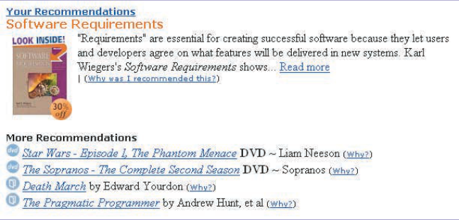
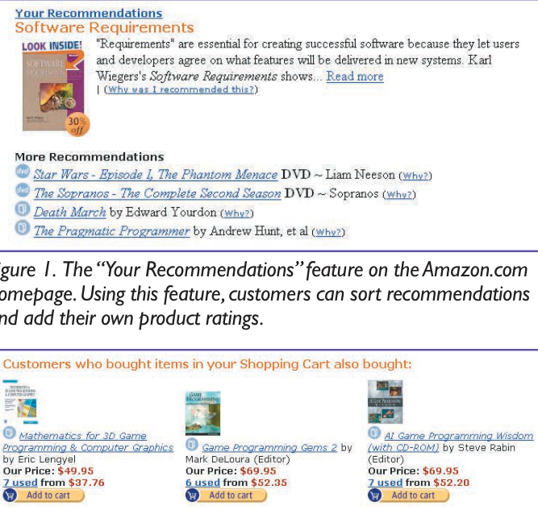

# ItemCF: Amazon.com Recommendations: Item-to-Item Collaborative Filtering

重要意义：亚马逊的ItemCF工业实践

业务场景：图书推荐

业务指标：CTR、CVR

离线指标：无

数据集：自有数据集

模型类型：排序模型

创新点：

- ItemCF的在线计算复杂度和物品规模、用户规模无关，只与用户历史上评论过的物品数有关。可扩展性好
- 无论用户历史交互物品数量多还是少，都可以获得高质量推荐。

个人收获：

