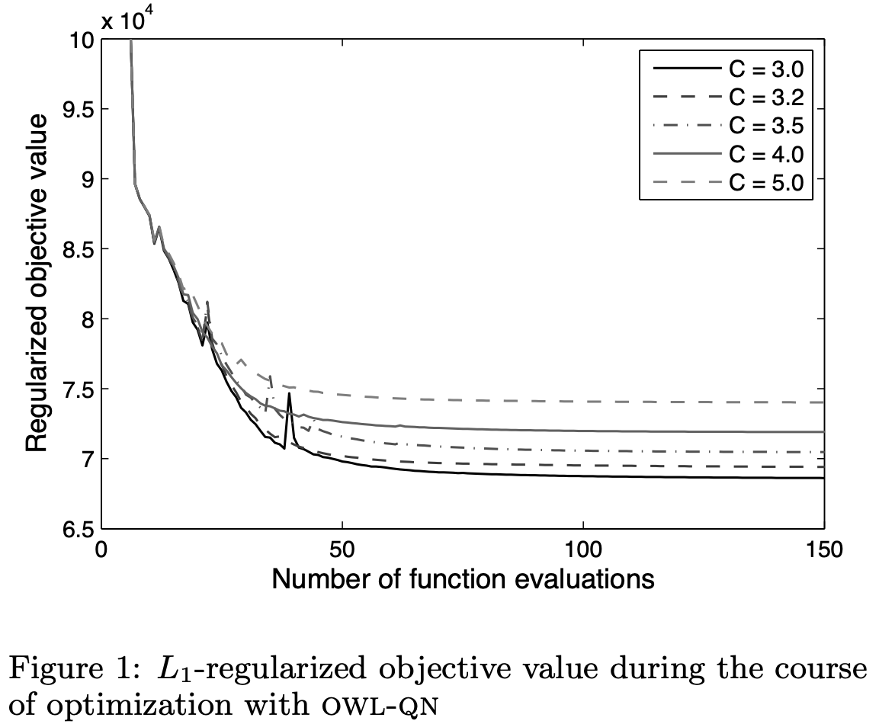
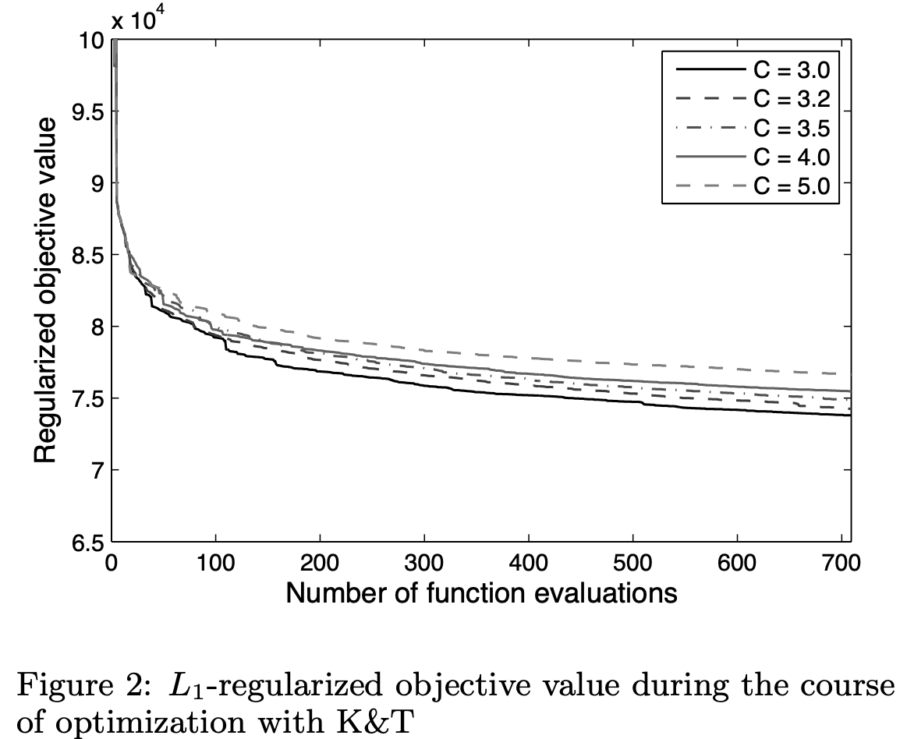

# OWL-QN: L1正则化对数线性模型的可扩展训练（Scalable Training of L1-Regularized Log-Linear Models）

> Galen Andrew, Jianfeng Gao | Microsoft Research, One Microsoft Way, Redmond, WA 98052 USA

L-BFGS （Limited-memory Broyden–Fletcher–Goldfarb–Shanno，有限内存拟牛顿方法）是优化带 L2 正则化的大规模对数线性模型参数的首选算法，但由于 **L1 正则化损失函数在参数为零处不可微**，该方法无法直接用于 L1 正则化问题。虽然已有针对此任务的高效算法被提出，但当参数规模极大时它们并不实用。我们提出了一种基于 L-BFGS 的算法——正交象限有限内存拟牛顿法（OWL-QN），该算法能够高效优化包含数百万参数的 **L1 正则化对数线性模型的对数似然**。在句法重排序任务上的实验中，我们的算法比另一种替代算法快数个数量级，并且显著快于在类似 L2 正则化问题上运行的 L-BFGS。我们还给出了 OWL-QN **保证收敛到全局最优参数向量**的证明。

关键发现：
- OWL-QN 仅需修改约 30 行 L-BFGS 代码即可实现
- 在百万特征规模的句法重排序任务上，OWL-QN 比 K&T 方法快一个数量级以上
- OWL-QN 在 L1 正则化问题上的收敛速度甚至快于 **L-BFGS 在 L2 正则化问题**上的速度
- OWL-QN 能快速产生稀疏参数向量，加速比达 24 倍以上

---

## 摘要

L-BFGS 有限内存拟牛顿方法是优化带 L2 正则化的大规模对数线性模型参数的首选算法，但由于 L1 正则化损失函数在参数为零处不可微，该方法无法直接用于 L1 正则化问题。虽然已有针对此任务的高效算法被提出，但当参数规模极大时它们并不实用。我们提出了一种基于 L-BFGS 的算法——正交象限有限内存拟牛顿法（OWL-QN），该算法能够高效优化包含数百万参数的 L1 正则化对数线性模型的对数似然。在句法重排序任务上的实验中，我们的算法比另一种替代算法快数个数量级，并且显著快于在类似 L2 正则化问题上运行的 L-BFGS。我们还给出了 OWL-QN 保证收敛到全局最优参数向量的证明。

---

## 1. 引言

对数线性模型——包括马尔可夫随机场 和 逻辑回归（LR，Logistics Regression）等特例——以多种形式应用于机器学习。这类模型的参数通常通过最小化目标函数来训练：

$$
f(x) = \ell(x) + r(x), \qquad (1)
$$

其中 $\ell$ 是模型在标注训练集上的**负对数概率**， $r$ 是倾向于"更简单"模型的**正则化项**。众所周知，**使用正则化对于获得能很好泛化到未见数据的模型是必要的，特别是当参数数量相对于训练数据量非常大时**。

近年来受到越来越多关注的一种正则化选择是**参数的加权 L1 范数**：

$$
r(x) = C\|x\|_1 = C \sum_i |x_i|
$$

其中 $C > 0$ 为常数。Tibshirani（1996）在线性回归背景下引入该方法，称为 **lasso 估计量**。与其他正则化器（如 L2）相比，L1 正则化器具有若干有利特性。Ng（2004）通过实验和理论证明，当大多数特征不相关时，L1 正则化能够学习到好的模型。L1 正则化通常还会产生稀疏的参数向量，其中许多参数恰好为零，这使得模型更具可解释性且**计算上更易处理**。

L1 正则化器的后一特性源于以下事实：其对每个变量的偏导数在变量趋近于零时是常数，从而尽可能将值"推"到零。（相比之下，L2 正则化器在值趋近于零时"推"力越来越小，产生的参数接近但不等于零。）不幸的是，L1 的这一特性也意味着它在零处不可微，因此无法使用**通用的基于梯度的优化算法**（如 L-BFGS 拟牛顿法（Nocedal & Wright, 1999））来最小化目标函数。而 Malouf（2002）和 Minka（2003）已证明 L-BFGS 在训练大规模 L2 正则化对数线性模型方面具有优越性。

已有几种专门设计的算法来克服这一困难。Perkins 和 Theiler（2003）提出了一种称为 grafting 的算法，其中变量逐个添加，每次针对当前变量集重新优化权重。Goodman（2004）以及 Kazama 和 Tsujii（2003）（独立地）展示了如何将目标表达为约束优化问题，他们分别使用改进的广义迭代缩放法（GIS）（Darroch & Ratcliff, 1972）和 BLMVM（Benson & More, 2001）（一种用于边界约束问题的拟牛顿算法）来求解。不幸的是，GIS 通常被认为不如 L-BFGS，并且这两种算法在一般情况下都需要将变量数量增加一倍。

Lee 等人（2006）提出了 IRLS-LARS 算法，受牛顿法启发，该算法在线性约束下迭代地最小化函数的二阶泰勒展开。每次迭代的二次规划问题使用 Efron 等人（2004）的 LARS 算法（lasso 变体）高效求解。他们将该方法与前述其他算法（Kazama & Tsujii 的除外）在中小规模逻辑回归问题上进行了比较，并显示在大多数情况下它快得多。不幸的是，IRLS-LARS 无法用于训练包含数百万变量和训练实例的极大规模对数线性模型，例如自然语言处理中常见的情况。尽管最坏情况界尚不清楚，但在有利假设下，LARS 的 lasso 变体可能需要多达 $O(m n^2)$ 次操作，其中 $m$ 是变量数， $n$ 是训练实例数。事实上，Lee 等人的测试问题中，其他算法接近或超越 IRLS-LARS 的也正是最大的那些问题（包含数千个变量）。

在本文中，我们提出了一种基于 L-BFGS 的新算法——正交象限有限内存拟牛顿法（OWL-QN）——用于使用 L1 正则化训练大规模对数线性模型。在每次迭代中，我们的算法通过近似最小化一个在包含前一点的象限上建模目标的二次函数来计算搜索方向。我们在一个包含超过一百万个特征的句法重排序任务上的实验展示了 OWL-QN 扩展到极大规模问题的能力。

### 1.1. 符号说明

让我们建立一些在本文后续部分将使用的符号和定义。假设给定一个凸函数 $f: \mathbb{R}^n \mapsto \mathbb{R}$ 和一个向量 $x \in \mathbb{R}^n$ 。我们用 $\partial_i^+ f(x)$ 表示 $f$ 在 $x$ 处关于 $x_i$ 的**右偏导数**：

$$
\partial_i^+ f(x) = \lim_{\alpha \downarrow 0} \frac{f(x + \alpha e_i) - f(x)}{\alpha},
$$

其中 $e_i$ 是第 $i$ 个标准基向量，类似地定义左变体 $\partial_i^- f(x)$ 。 $f$ 在 $x$ 处沿方向 $d \in \mathbb{R}^n$ 的**方向导数**记为 $f'(x; d)$ ，定义为：

$$
f'(x; d) = \lim_{\alpha \downarrow 0} \frac{f(x + \alpha d) - f(x)}{\alpha}.
$$

如果 $f'(x; d) < 0$ ，则向量 $d$ 称为 $x$ 处的**下降方向**。除非明确写为 $\|\cdot\|_1$ ，否则我们用 $\|\cdot\|$ 表示向量的 L2 范数。

定义几个特殊函数也会很方便。符号函数 $\sigma$ 根据实数值为负、零或正分别取值 $\{-1, 0, 1\}$ 。函数 $\pi: \mathbb{R}^n \mapsto \mathbb{R}^n$ 由 $y \in \mathbb{R}^n$ 参数化，其中

$$
\pi_i(x; y) = \begin{cases} x_i & \text{if } \sigma(x_i) = \sigma(y_i), \\ 0 & \text{otherwise} \end{cases}
$$

可以解释**为 $x$ 在由 $y$ 定义的象限上的投影**。

## 2. 拟牛顿算法与 L-BFGS

我们首先描述 OWL-QN 的基础——用于**光滑函数无约束优化**的 L-BFGS 拟牛顿算法——来开始对 OWL-QN 的讨论。

与牛顿法类似，**拟牛顿算法 迭代地 构建函数的局部二次逼近**，然后在使逼近最小化的点的方向上进行线搜索。设 $B_k$ 是光滑函数 $f$ 在点 $x_k$ 处的（可能是近似的）Hessian 矩阵， $g_k$ 是 $f$ 在 $x_k$ 处的梯度，则**函数局部建模**为：

$$
Q(x) = f(x_k) + (x - x_k)^\top g_k + \frac{1}{2}(x - x_k)^\top B_k (x - x_k). \qquad (2)
$$

如果 $B_k$ 正定，则最小化 $Q$ 的值 $x^*$ 可解析计算为：

$$
x^* = x_k - H_k g_k,
$$

其中 $H_k = B_k^{-1}$ 。拟牛顿方法随后沿射线 $x_k - \alpha H_k g_k$ 对 $\alpha \in (0, \infty)$ 进行探索以获得下一个点 $x_{k+1}$ 。

**纯牛顿法在每个点使用精确的二阶泰勒展开，而拟牛顿算法则利用从之前探索点收集的一阶信息来近似 Hessian 矩阵**。L-BFGS 作为一种有限内存拟牛顿算法，**仅维护最近 $m$ 个点的曲率信息**。具体地，在步骤 $k$ ，它记录位移 $s_k = x_k - x_{k-1}$ 和梯度变化 $y_k = g_k - g_{k-1}$ ，丢弃第 $k-m$ 次迭代的相应向量。然后使用 $\{s_i\}$ 和 $\{y_i\}$ 来估计 $H_k$ ，或者更准确地说，估计搜索方向 $-H_k g_k$ ，因为完整的 Hessian 矩阵（可能大到无法处理）并不被显式计算或求逆。计算的时间和内存需求与变量数量呈线性关系。这些细节对于本文的目的并不重要，感兴趣的读者请参阅 Nocedal 和 Wright（1999）。

## 3. 正交象限有限内存拟牛顿法

在本文的剩余部分，我们假设损失函数 $\ell: \mathbb{R}^n \mapsto \mathbb{R}$ 是凸的、下有界的、连续可微的，并且梯度 $\nabla \ell$ 在集合 $\aleph = \{x : f(x) \leq f(x_0)\}$ 上是 $L$ -Lipschitz 连续的（对某个 $L$ 和某个初始点 $x_0$ ）。我们的目标是对于给定的常数 $C > 0$ 最小化 $f(x) = \ell(x) + C\|x\|_1$ 。

我们的算法受以下关于 L1 范数的观察启发：当限制在任意给定象限（即每个坐标符号不变的点的集合）上时，L1 范数是可微的，实际上是其自变量的线性函数。因此，正则化目标 $f$ 在给定象限上的二阶行为仅由损失分量决定。这一考虑建议了以下策略：使用仅从损失分量估计的逆 Hessian 矩阵，构建一个在包含当前点的某个象限上有效的二次逼近，然后沿二次型最小点的方向进行搜索，并将搜索限制在该逼近有效的象限上。

对于任意符号向量 $\xi \in \{-1, 0, 1\}^n$ ，定义：

$$
\Omega_\xi = \{x \in \mathbb{R}^n : \pi(x; \xi) = x\},
$$

这是一个象限与一个将某些坐标约束为零的平面的交集。显然，对所有 $x \in \Omega_\xi$ ，

$$
f(x) = \ell(x) + C \xi^\top x.
$$

将 $f_\xi$ 定义为此函数在 $\mathbb{R}^n$ 上的延拓，我们得到一个可微函数，其在 $\Omega_\xi$ 上与 $f$ 一致。使用 $H_k$ （L-BFGS 对损失函数的逆 Hessian 的近似）和 $v_k$ （ $f_\xi$ 在 $x_k$ 处的负梯度投影到包含 $\Omega_\xi$ 的子空间上）^1，我们可以如（2）中那样用二次函数 $Q_\xi$ 在 $\Omega_\xi$ 上近似 $f_\xi$ ，并沿 $Q_\xi$ 最小值的方向搜索。出于技术原因，我们将搜索方向约束为与 $v_k$ 的符号模式一致^2：

$$
p_k = \pi(H_k v_k; v_k). \qquad (3)
$$

### 3.1. 选择象限

给定一个点，可能有多个包含或邻接该点的象限，具体取决于其坐标中有多少为零。为了确定探索哪个象限 $\Omega_\xi$ ，我们在 $x$ 处定义 $f$ 的伪梯度 $\diamond f(x)$ ：

$$
\diamond_i f(x) = \begin{cases} \partial_i^- f(x) & \text{if } \partial_i^- f(x) > 0 \\ \partial_i^+ f(x) & \text{if } \partial_i^+ f(x) < 0 \\ 0 & \text{otherwise} \end{cases}, \qquad (4)
$$

其中 $f$ 的左、右偏导数为：

$$
\partial_i^\pm f(x) = \frac{\partial}{\partial x_i} \ell(x) + \begin{cases} C \sigma(x_i) & \text{if } x_i \neq 0 \\ \pm C & \text{if } x_i = 0 \end{cases}.
$$

注意 $\partial_i^- f(x) \leq \partial_i^+ f(x)$ ，因此 $\diamond$ 定义良好。伪梯度推广了梯度的概念：在 $x$ 处方向导数在 $-\diamond f(x)$ 方向上最小（局部下降率最大），且 $x$ 是局部最小值当且仅当 $\diamond f(x) = 0$ 。

一个合理的待探索象限选择是包含 $x_k$ 且 $-\diamond f(x_k)$ 指向的象限：

$$
\xi_i^k = \begin{cases} \sigma(x_i^k) & \text{if } x_i^k \neq 0 \\ \sigma(-\diamond_i f(x_k)) & \text{if } x_i^k = 0 \end{cases}.
$$

这一选择的一个结果是 $-\diamond f(x_k)$ 等于 $v_k$ ，即 $f_\xi$ 在 $x_k$ 处的负梯度在包含 $\Omega_\xi$ 的子空间上的投影。因此，无需显式确定 $\xi_k$ ；只需计算 $-\diamond f(x_k)$ ，这就是在（3）中与 $H_k$ 相乘的量。

### 3.2. 约束线搜索

在线搜索过程中，为了确保不离开 $Q_\xi$ 有效的区域，我们将每个探索点正交投影回 $\Omega_\xi$ ，即我们探索点：

$$
x_{k+1} = \pi(x_k + \alpha p_k; \xi_k)
$$

这相当于将任何从正变为负或从负变为正的坐标设为零。可以使用任意多种方法来选择 $\alpha$ ，但在实验和收敛性证明中，我们使用以下回溯线搜索的变体。选择常数 $\beta, \gamma \in (0, 1)$ ，并对 $n = 0, 1, 2, \dots$ ，接受第一个满足下式的步长 $\alpha = \beta^n$ ：

$$
f(x_{k+1}) \leq f(x_k) - \gamma v^\top (x_{k+1} - x_k).
$$

**算法 1** OWL-QN

$$
\begin{aligned}
&\text{选择初始点 } x_0 \\
&S \Leftarrow \{\}, \quad Y \Leftarrow \{\} \\
&\textbf{for } k = 0 \textbf{ to } \text{MaxIters} \textbf{ do} \\
&\quad \text{计算 } v_k = -\diamond f(x_k) \qquad (1) \\
&\quad \text{使用 } S \text{ 和 } Y \text{ 计算 } d_k \Leftarrow H_k v_k \\
&\quad p_k \Leftarrow \pi(d_k; v_k) \qquad (2) \\
&\quad \text{通过约束线搜索找到 } x_{k+1} \qquad (3) \\
&\quad \textbf{if } \text{满足终止条件} \textbf{ then} \\
&\quad\quad \text{停止并返回 } x_{k+1} \\
&\quad \textbf{end if} \\
&\quad \text{用 } s_k = x_{k+1} - x_k \text{ 更新 } S \\
&\quad \text{用 } y_k = \nabla \ell(x_{k+1}) - \nabla \ell(x_k) \text{ 更新 } Y \qquad (4) \\
&\textbf{end for}
\end{aligned}
$$

OWL-QN 的伪代码如算法 1 所示。实际上，只修改了标准 L-BFGS 算法的几个步骤。图中标记了所有差异：

1. 使用正则化目标的伪梯度 $\diamond f(x_k)$ 代替梯度。
2. 得到的搜索方向被约束为与 $v_k = -\diamond f(x_k)$ 的符号模式匹配。这是公式（3）的投影步骤。
3. 在线搜索期间，每个搜索点被投影到前一点的象限上。
4. 仅使用未正则化损失的梯度来构建用于近似逆 Hessian 的向量 $y_k$ 。

从 L-BFGS 的实现开始，编写 OWL-QN 只需要更改约 30 行代码。

## 4. 实验

我们在训练用于自然语言学**句法重排序**的条件对数线性模型的任务上评估了 OWL-QN 算法。遵循 Collins（2000）的设置如下。我们给定：

- 一个过程，为每个句子 $x \in X$ 生成候选句法分析的 **N-best 列表** $\text{GEN}(x) \subseteq Y$ ；
- 训练样本 $(x_j, y_j)$ ， $j = 1 \ldots M$ ，其中 $x_j \in X$ 是一个句子， $y_j \in \text{GEN}(x_j)$ 是该**句子的标准句法分析**；
- 特征映射 $\Phi: X \times Y \mapsto \mathbb{R}^n$ ，将每对 $(x, y)$ 映射为特征值向量。

对于任意权重向量 $w \in \mathbb{R}^n$ ，我们根据下式为每个句子定义一个在句法分析上的分布：

$$
P_w(y|x) = \frac{\exp w^\top \Phi(x, y)}{\sum_{y' \in \text{GEN}(x)} \exp w^\top \Phi(x, y^{\prime})}.
$$

我们的任务是最小化：

$$
f(w) = \ell(w) + C\|w\|_1,
$$

其中损失项 $\ell(w)$ 是训练数据的负条件对数似然：

$$
\ell(w) = -\sum_{j=1}^M \log P_w(y_j|x_j).
$$

我们遵循 Charniak 和 Johnson（2005）所述的句法重排序实验范式。我们使用相同的生成基线模型来生成候选句法分析，并使用几乎相同的特征集，其中包括根据基线模型的句法分析对数概率加上 1,219,272 个额外特征。我们在 Penn Treebank 的第 2-19 节上训练模型参数，使用第 20-21 节选择正则化权重 $C$ ，然后在第 22 节上评估模型^3。训练集包含 36K 个句子，而验证集和测试集分别有 4K 和 1.7K 个句子。

我们将 OWL-QN 与我们知道的**唯一另一种能够在此规模下可行运行的 L1 专用算法的快速实现**进行了比较：即 Kazama 和 Tsujii（2003）的算法，以下简称"K&T"。在 K&T 中，每个权重 $w_i$ 表示为两个值的差： $w_i = w_i^+ - w_i^-$ ，其中 $w_i^+ \geq 0$ ， $w_i^- \geq 0$ 。L1 惩罚项于是简化为 $\|w\|_1 = \sum_i w_i^+ + w_i^-$ 。这样，**以参数数量翻倍为代价，我们得到了一个具有可微目标的约束优化问题**，可以用通用数值优化软件求解。在我们的实验中，我们使用了 Byrd 等人（1995）的 L-BFGS-B 算法的 AlgLib 实现，这是 Zhu 等人（1997）的 FORTRAN 代码的 C++ 移植^4。我们还对 L2 正则化问题运行了两个 L-BFGS 实现（AlgLib 的实现和我们自己的实现，OWL-QN 基于后者）。

表 1：研究中使用的模型的 C 选择值和 F 分数

我们对所有四种算法使用内存参数 $m = 5$ 。对于计时结果，我们首先运行每个算法直到函数值的相对变化（前五次迭代的平均值）降至 $\tau = 10^{-5}$ 以下。我们报告每个算法达到两种算法中任何一个找到的最小值的 1% 以内所需的 **CPU 时间和函数评估次数**。我们还报告函数评估次数，以便以独立于实现的方式比较算法。

### 4.1. 结果

虽然我们主要关注训练效率，但我们首先报告学习到的句法分析模型的性能。性能使用 PARSEVAL 度量（即带标签括号的 F 分数）衡量。这些结果总结在表 1 中。"Baseline"指的是 GEN 使用的生成模型。"Oracle"显示了如果来自 GEN 的最佳句法分析（根据 F 分数）总是被重排序模型选择时的理想性能。两种模型的表现都显著优于基线，并且确实可以被认为是 state-of-the-art。（作为比较，Charniak 和 Johnson（2005）的模型在同一测试集上也达到了 91.6% 的 F 分数^5。）有趣的是，两种正则化器的表现几乎相同：Wilcoxon 配对符号秩检验未发现差异在统计上显著。

使用相同 $C$ 值的 CPU 计时实验结果如表 2 所示。我们在 946 次迭代后停止了 K&T，此时它已达到值 $7.34 \times 10^4$ ，仍比 OWL-QN 找到的最佳值高 5.7%。K&T 与 OWL-QN 在运行时间和函数评估次数上的差异都相当显著。**令人惊讶的是，OWL-QN 甚至比我们运行在 L2 正则化目标上的 L-BFGS 实现收敛得更快**。还要注意，所有算法的运行时间主要由目标函数评估主导，除此之外，**OWL-QN 最昂贵的步骤是 L-BFGS 方向的计算**。

表 2：达到最佳值 1% 以内所需的时间和函数评估次数。所有时间以秒为单位。括号中数字显示占总时间的百分比。

**图 1:** L1-正则化目标值在 OWL-QN 优化过程中的变化

**图 2:** L1-正则化目标值在 K&T 优化过程中的变化

通过绘制目标值作为函数调用次数的函数（如图 1 至图 4 所示），可以更全面地了解两种模型的训练效率。（注意 x 轴刻度的差异。）

由于学习稀疏参数向量是 L1 正则化器的一个重要优势，我们在图 5 和图 6 中检查了优化过程中非零权重数量的变化。两种算法都从相当大比例的特征（5%-12%）开始，并在算法推进过程中将其剪除，OWL-QN 产生稀疏模型的速度更快。有趣的是，OWL-QN 在第二次迭代开始时（由于线搜索，实际是第六次函数评估）出现了一个尖锐的谷值，打断了这一模式。我们认为其原因在于模型在第一次迭代中赋予了许多特征较大的权重，而在第二次迭代中又将它们中的大多数推回零。在第三次迭代中，其中一些特征获得了相反符号的权重，此后非零权重的集合更加稳定^6。

**图 3:** L2-正则化目标值在 L-BFGS（我们的实现）优化过程中的变化

**图 4:** L2-正则化目标值在 AlgLib 的 L-BFGS 优化过程中的变化

**图 5:** OWL-QN 优化过程中非零权重数量的变化

**图 6:** K&T 优化过程中非零权重数量的变化

尽管本文主要关注 OWL-QN 在单个问题上的运行时行为，但我们也将它用于为 NLP 中的各种其他问题训练包含多达一千万个变量的 L1 正则化模型，包括词性标注、中文分词和语言建模。这项工作在 Gao 等人（2007）中有所描述。

## 5. 结论

我们提出了一种算法 OWL-QN，用于高效训练包含数百万变量的 **L1 正则化对数线性模型**。我们在一项极大规模的 NLP 任务上测试了该算法，发现它比另一种 L1 正则化算法快得多，甚至比在类似 **L2 正则化问题上运行的 L-BFGS** 还要快一些。研究 OWL-QN 是否可用于其他涉及数百万变量的 L1 正则化问题（例如 lasso 回归）将是有趣的。另一个探索方向是使用类似方法优化具有不同类型不可微性的目标，例如 SVM 原始目标。

## 6. 致谢

我们特别感谢 Kristina Toutanova 对收敛性证明的讨论。我们也衷心感谢 Mark Johnson 分享他的句法分析器，以及我们的审稿人帮助我们改进本文。

## 7. 附录：收敛性证明

我们将使用以下关于 L-BFGS 的事实^7：

**定理 1.** 给定正常数 $L_1$ 和 $L_2$ ，以及整数 $m > 0$ ，存在正常数 $M_1$ 和 $M_2$ ，使得对于任意满足 $L_1\|y\|^2 \leq s^\top y \leq L_2\|s\|^2$ 的 $m$ 对向量 $(s, y)$ ，都有 $\forall x : M_1\|x\|^2 \leq x^\top H x \leq M_2\|x\|^2$ ，其中 $H$ 是 L-BFGS 使用这些向量对（隐式）生成的逆 Hessian 近似^8。注意这意味着 $H$ 是正定的。

我们首先建立关于 OWL-QN 的几个不难验证的事实。

**命题 1.** 如果 $p_k$ 是 $x_k$ 处的下降方向，则线搜索将在有限步内终止。直观上，这是因为回溯线搜索最终会尝试一个足够小的 $\alpha$ ，使得没有坐标改变符号。于是我们的终止准则简化为 Armijo 规则，该规则对于足够小的 $\alpha$ 总是满足的。

**命题 2.** 对所有 $v \in \mathbb{R}^n$ ，如果 $v \neq 0$ 且 $H$ 正定，则 $p = \pi(Hv; v) \neq 0$ 。

*证明.* 从 $\pi$ 的定义直接可得 $\pi_i(Hv; v) = 0$ 仅当 $v_i (Hv)_i \leq 0$ 。如果 $p = 0$ ，则 $v^\top Hv = \sum_i v_i (Hv)_i \leq 0$ ，这与 $H$ 正定矛盾。

**命题 3.** 如果 $\{x_k\} \to \bar{x}$ 且 $\diamond f(\bar{x}) \neq 0$ ，则 $\liminf_{k \to \infty} \|\diamond f(x_k)\| > 0$ 。

*证明.* 由于 $\diamond f(\bar{x}) \neq 0$ ，可取 $i$ 使得 $\diamond_i f(\bar{x}) \neq 0$ ，因此要么 $\partial_i^- f(\bar{x}) > 0$ ，要么 $\partial_i^+ f(\bar{x}) < 0$ 。由（4）， $\forall k : \diamond_i f(x_k) \in [\partial_i^- f(x_k), \partial_i^+ f(x_k)]$ 。因此 $\{\diamond_i f(x_k)\}$ 的所有极限点必在区间 $[\partial_i^- f(\bar{x}), \partial_i^+ f(\bar{x})]$ 中，该区间不包含零^9。

**命题 4.** 定义 $q_\alpha^k = \frac{1}{\alpha}(\pi(x_k + \alpha p_k; \xi^k) - x_k)$ 。则对所有 $\alpha \in (0, \infty)$ 和所有 $i$ ，

$$
d_i^k v_i^k \leq p_i^k v_i^k \leq (q_\alpha^k)_i v_i^k \leq 0,
$$

因此

$$
(v^k)^\top q_{\alpha_k}^k \geq (v^k)^\top p_k \geq (v^k)^\top d_k.
$$

**命题 5.** 在任意点 $x$ 处，设最速下降向量 $v = -\diamond f(x)$ ，如果 $p$ 是一个非零方向向量且满足当 $\sigma(p_i) \neq 0$ 时 $\sigma(v_i) = \sigma(p_i)$ ，则 $f'(x; p) = -v^\top p$ ，且 $f'(x; p) < 0$ 。

注意之前定义的 $d_k$ 、 $p_k$ 和 $q_\alpha^k$ 都满足命题 5 的条件。

**定理 2.** OWL-QN 算法在优化过程中探索的值序列 $\{f(x_k)\}$ 收敛到 $f$ 的全局最小值。

*证明.* 序列 $\{x_k\}$ 必有一极限点 $\bar{x}$ ，因为每个 $x_k$ 都在有界集 $\aleph$ 中。由于 $\{f(x_k)\}$ 递减，只需证明 $\bar{x}$ 最小化 $f$ 即可。为简化符号，不妨设 $\{x_k\}$ 收敛到 $\bar{x}$ （必要时用收敛子列替换 $\{x_k\}$ ）。令 $\bar{v} = -\diamond f(\bar{x})$ 。我们将证明 $\|\bar{v}\| = 0$ ，因此 $\{\bar{x}\}$ 达到全局最小的函数值。

为此，反设 $\|\bar{v}\| > 0$ 。由于 $\{f(x_k)\}$ 递减且有界，我们知道 $\lim_{k \to \infty} f(x_k) - f(x_{k+1}) = 0$ 。如命题 4 定义 $q_\alpha^k$ ，线搜索准则可写为：

$$
f(x_{k+1}) = f(x_k + \alpha q_\alpha^k) \leq f(x_k) - \gamma \alpha (v^k)^\top q_\alpha^k.
$$

因此，

$$
\frac{f(x_k) - f(x_{k+1})}{\gamma \alpha_k} \geq (v^k)^\top q_{\alpha_k}^k \geq (v^k)^\top d_k = (v^k)^\top H_k v^k \geq M_1 \|v^k\|^2, \qquad (5)
$$

且命题 3 给出 $\liminf_{k \to \infty} \|v^k\| > 0$ ，我们得出结论 $\{\alpha_k\} \to 0$ 。

因此存在 $\bar{k}$ 使得 $k > \bar{k} \Rightarrow \alpha_k < \beta$ 。根据线搜索的形式，如果对于某个 $k$ 有 $\alpha_k < \beta$ ，则意味着该次迭代中先前尝试的 $\alpha$ 值 $\alpha_k \beta^{-1}$ 不满足准则，即对于 $k > \bar{k}$ ，

$$
f(x_k + (\alpha_k \beta^{-1}) q_{\alpha_k \beta^{-1}}^k) > f(x_k) - \gamma \alpha_k \beta^{-1} (v^k)^\top q_{\alpha_k \beta^{-1}}^k,
$$

可重写为：

$$
\frac{f(x_k + \hat{\alpha}_k \hat{q}^k) - f(x_k)}{\hat{\alpha}_k} > -\gamma (v^k)^\top \hat{q}^k, \qquad (6)
$$

其中定义

$$
\hat{q}^k = \frac{q_{\alpha_k \beta^{-1}}^k}{\|q_{\alpha_k \beta^{-1}}^k\|}, \quad \hat{\alpha}_k = \alpha_k \beta^{-1} \|q_{\alpha_k \beta^{-1}}^k\|.
$$

由于 $\aleph$ 有界， $\{\|v^k\|\}$ 有界，因此由定理 1 可知 $\{\|p_k\|\}$ 有界，从而 $\{\|q_{\alpha_k \beta^{-1}}^k\|\}$ 有界。因此 $\{\hat{\alpha}_k\} \to 0$ 。另外，由于对所有 $k > \bar{k}$ 有 $\|\hat{q}^k\| = 1$ ，存在 $\{\hat{q}^k\}_{k > \bar{k}}$ 的子列 $\{\hat{q}^k\}_\kappa$ 和向量 $\bar{q}$ （ $\|\bar{q}\| = 1$ ）使得 $\{\hat{q}^k\}_\kappa \to \bar{q}$ 。

对（6）应用中值定理，对每个 $k \in \kappa$ ，存在某个 $\tilde{\alpha}_k \in [0, \hat{\alpha}_k]$ 使得

$$
f'(x_k + \tilde{\alpha}_k \hat{q}^k; \hat{q}^k) > -\gamma (v^k)^\top \hat{q}^k = \gamma f'(x_k; \hat{q}^k).
$$

取 $k \in \kappa$ 的极限，我们看到 $f'(\bar{x}; \bar{q}) \geq \gamma f'(\bar{x}; \bar{q})$ ，由于 $\gamma < 1$ ，我们得出结论

$$
f'(\bar{x}; \bar{q}) \geq 0. \qquad (7)
$$

另一方面，

$$
f'(x_k; \hat{q}^k) = \frac{f'(x_k; q_{\alpha_k \beta^{-1}}^k)}{\|q_{\alpha_k \beta^{-1}}^k\|} = \frac{-(v^k)^\top q_{\alpha_k \beta^{-1}}^k}{\|q_{\alpha_k \beta^{-1}}^k\|},
$$

取 $k \in \kappa$ 的极限，得到

$$
f'(\bar{x}; \bar{q}) = \frac{\limsup -(v^k)^\top q_{\alpha_k \beta^{-1}}^k}{\limsup \|q_{\alpha_k \beta^{-1}}^k\|}.
$$

由（5）可知分子严格为负，且分母严格为正（因为如果 $\{\|q_{\alpha_k \beta^{-1}}^k\|\} \to 0$ ，则 $\{\|v^k\|\} \to 0$ ）。因此 $f'(\bar{x}; \bar{q})$ 为负，与（7）矛盾。

## 参考文献

[1] Benson, J. S., & More, J. J. (2001). A limited memory variable metric method for bound constraint minimization.

[2] Bertsekas, D. P. (1999). Nonlinear Programming. Athena Scientific.

[3] Byrd, R. H., Lu, P., Nocedal, J., & Zhu, C. Y. (1995). A limited memory algorithm for bound constrained optimization. *SIAM Journal on Scientific Computing*, 16, 1190–1208.

[4] Charniak, E., & Johnson, M. (2005). Coarse-to-fine n-best parsing and maxent discriminative reranking. *ACL*.

[5] Collins, M. (2000). Discriminative reranking for natural language parsing. *ICML* (pp. 175–182).

[6] Darroch, J., & Ratcliff, D. (1972). Generalised iterative scaling for log-linear models. *Annals of Mathematical Statistics*.

[7] Efron, B., Hastie, T., Johnstone, I., & Tibshirani, R. (2004). Least angle regression. *Annals of Statistics*.

[8] Gao, J., Andrew, G., Johnson, M., & Toutanova, K. (2007). A comparative study of parameter estimation methods for statistical NLP. *ACL*.

[9] Goodman, J. (2004). Exponential priors for maximum entropy models. *ACL*.

[10] Kazama, J., & Tsujii, J. (2003). Evaluation and extension of maximum entropy models with inequality constraints. *EMNLP*.

[11] Lee, S.-I., Lee, H., Abbeel, P., & Ng, A. (2006). Efficient L1 regularized logistic regression. *AAAI-06*.

[12] Malouf, R. (2002). A comparison of algorithms for maximum entropy parameter estimation. *CONLL*.

[13] Minka, T. P. (2003). A comparison of numerical optimizers for logistic regression (Technical Report). Microsoft Research.

[14] Ng, A. Y. (2004). Feature selection, L1 vs. L2 regularization, and rotational invariance. *ICML*.

[15] Nocedal, J., & Wright, S. J. (1999). *Numerical Optimization*. Springer.

[16] Perkins, S., & Theiler, J. (2003). Online feature selection using grafting. *ICML*.

[17] Tibshirani, R. (1996). Regression shrinkage and selection via the lasso. *Journal of the Royal Statistical Society Series B*.

[18] Zhu, C., Byrd, R. H., Lu, P., & Nocedal, J. (1997). Algorithm 778: L-BFGS-B: Fortran subroutines for large-scale bound-constrained optimization. *ACM Trans. Math. Softw.*, 23, 550–560.

---

^1 这个投影仅意味着每当 $\xi_i$ 为零时 $v_i^k$ 被设为零。

^2 这确保线搜索不会偏离最速下降方向太远，并且是保证收敛所必需的。

^3 由于我们并非对句法分析性能本身感兴趣，我们没有使用句法分析文献中使用的标准测试语料库（第 23 节）进行评估。

^4 原始 FORTRAN 实现可在 www.ece.northwestern.edu/~nocedal/lbfgsb.html 找到，而 AlgLib C++ 移植版可在 www.alglib.net 获取。

^5 Mark Johnson，个人通信，2007 年 5 月。

^6 非常感谢 Mark Johnson 提出这一解释。

^7 对于我们的问题，我们知道 $s^\top y / \|s\|^2$ 有界，因为 $\ell$ 的梯度是 Lipschitz 连续的。严格来说，由于 $\ell$ 是凸的但可能不是严格凸的， $y^\top s / \|y\|^2$ 可能任意接近零。仍然可以通过选择一个小的正常数 $\omega$ 并在 $y^\top s < \omega$ 时跳过 L-BFGS 更新来确保定理的条件满足。这是 Byrd 等人（1995）使用的策略。

^8 一个等价的结论是 $H$ 的条件数有界。

^9 我们使用 Bertsekas（1999）的性质 B.24(c)。
