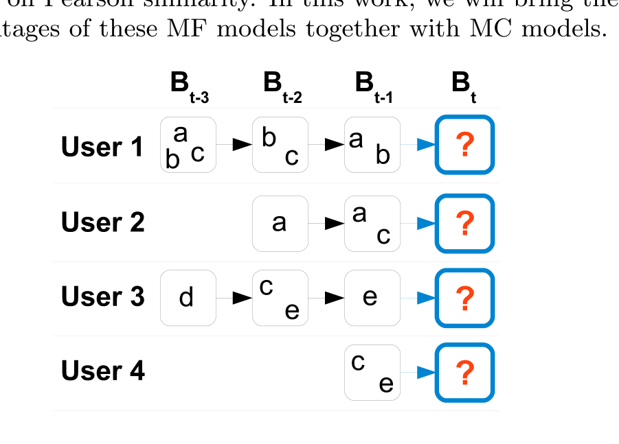
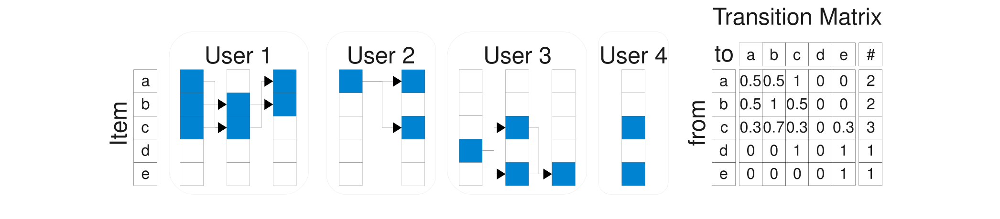
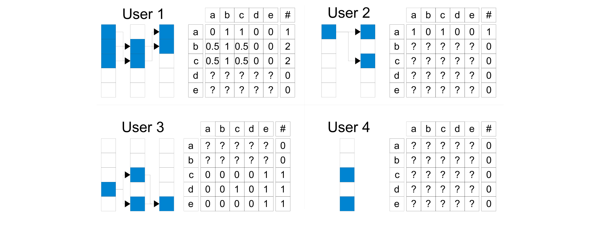
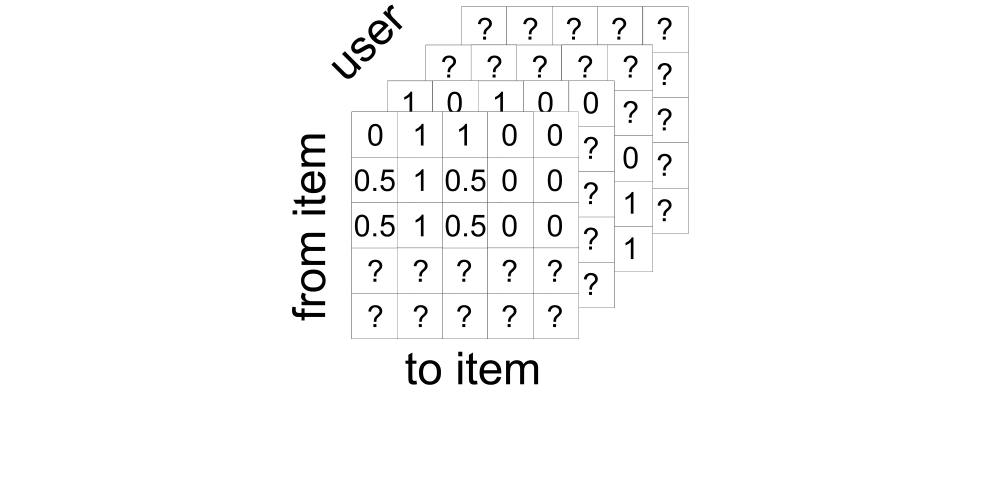
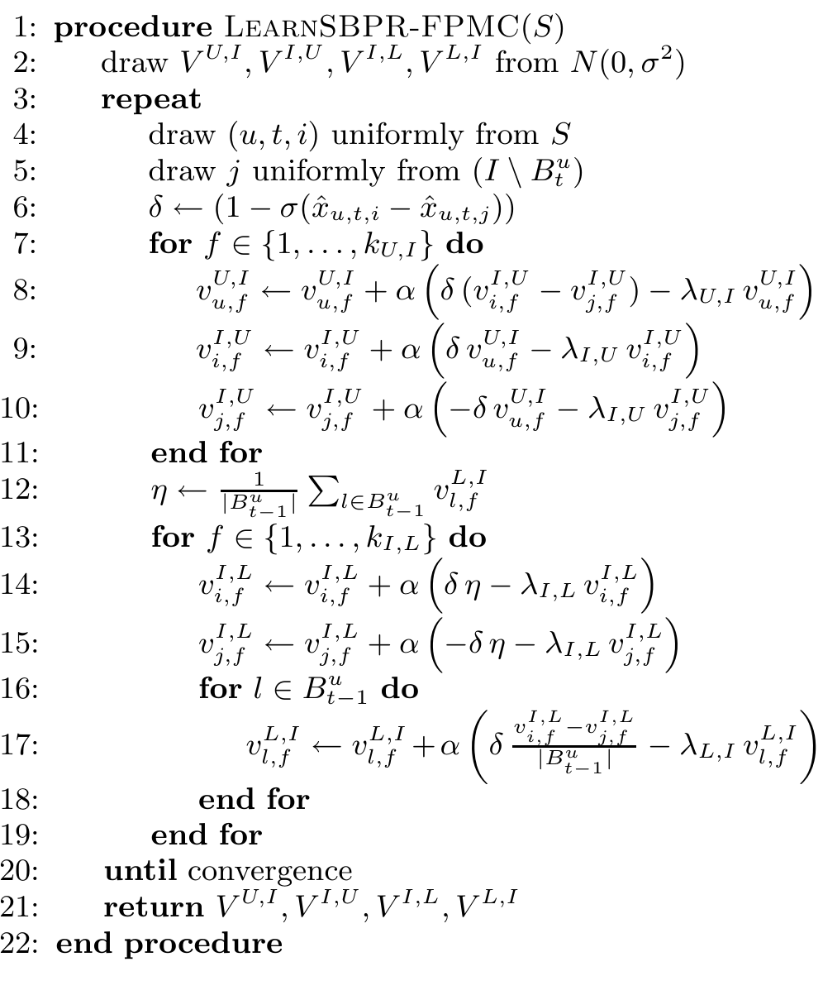
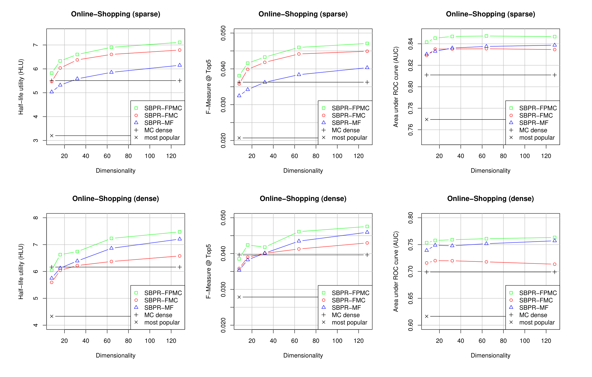

# 因子分解的个性化马尔可夫链用于下一购物篮推荐（Factorizing Personalized Markov Chains for Next-Basket Recommendation）

> 斯特芬·伦德尔（Steffen Rendle）\* | 大阪大学产业科学研究所智能推理系，日本 | rendle@ar.sanken.osaka-u.ac.jp
>
> 克里斯托夫·弗罗伊登塔勒（Christoph Freudenthaler） | 希尔德斯海姆大学计算机科学学院信息系统与机器学习实验室，德国 | freudenthaler@ismll.uni-hildesheim.de
>
> 拉尔斯·施密特-蒂默（Lars Schmidt-Thieme） | 希尔德斯海姆大学计算机科学学院信息系统与机器学习实验室，德国 | schmidt-thieme@ismll.uni-hildesheim.de

本文提出因子分解的个性化马尔可夫链（FPMC）——把矩阵分解（MF）的"长期用户口味"与马尔可夫链（MC）的"序列行为"统一到一张用户专有的转移张量上，并用成对交互分解缓解稀疏性，**在稀疏与稠密在线购物数据上显著优于 MF、MC、FMC 及流行度基线**。

核心内容：

- 痛点：MF 只学用户长期口味、忽略顺序；MC 用一条全局转移矩阵捕捉序列效应，但非个性化、且对每个用户重复应用同一转移
- 方案：为每个用户学习一张个性化转移矩阵（用户×item×item 转移张量），转移不再是"最后一次购买"的函数，而是由用户口味与最近购物篮共同决定
- 稀疏性解法：转移张量不能被标准计数（MLE）直接估计——用成对交互分解模型做低秩近似，信息在相似用户/相似 item/相似转移之间传播，参数从 $|U||I|^2$ 降到 $2k_{I,L}|I|+k_{U,I}(|U|+|I|)$
- 学习算法：把 BPR 扩展到序列购物篮数据得到 S-BPR，用 bootstrap 采样的随机梯度下降（SGD）优化排名目标；证明 FPMC 同时涵盖 MF（ $k_{I,L}=0$ ）与 FMC（ $k_{U,I}=0$ ），且（U,L）分解对排名与 S-BPR 优化不变

关键发现：

- 在 71,602 用户 / 7,180 item / 233,476 购物篮的真实药店数据上，FPMC 全面优于对比方法；稀疏时转移矩阵仅 12% 有值，FMC 相对 MC 的提升尤其显著
- 稠密数据下 MF 优于 MC（每用户信息多），稀疏数据下 MC 占优；**FPMC 取两者之长、在两种设置上都赢**——这正是"个性化+序列"合一的收益
- 最大模型（ $k=128$ ）训练时间：MF 约 4 小时、FMC 约 31 小时、FPMC 约 34 小时
- 未来方向：把分解思想用于更大规模数据与更多类型转移张量（如把 m 阶链也纳入分解框架）

---

## 摘要

推荐系统是许多现代网站的核心技术。最流行的两类方法分别基于矩阵分解（matrix factorization，MF）和马尔可夫链（Markov chain，MC）。MF 方法通过对观测到的用户-偏好矩阵做分解来学习用户的普遍口味。另一方面，MC 方法通过对 item 上的转移图（transition graph）的学习来建模序列行为，并用该转移图根据用户的最近动作来预测下一动作。本文提出一种把两类方法结合到一起的方法。我们的方法建立在底层马尔可夫链之上的个性化转移图之上。这意味着为每个用户学习一张专属的转移矩阵——因此总体上方法使用的是一个转移张量（transition cube）。由于用于估计转移的观测通常非常有限，我们的方法用一个成对交互模型对转移张量做因子分解，该模型是 Tucker 分解的一个特例。我们证明，我们的因子分解个性化 MC（FPMC）模型既包含普通的马尔可夫链，也包含标准的矩阵分解模型。为学习模型参数，我们引入一个对序列购物篮数据的贝叶斯个性化排序（BPR）框架的适配。在实验上，我们证明我们的 FPMC 模型优于普通的矩阵分解和非个性化的 MC 模型——无论后者是否经过分解。

**分类与主题描述符（Categories and Subject Descriptors）**：I.2.6 [人工智能]：学习——参数学习

**通用术语（General Terms）**：算法（Algorithms）、实验（Experimentation）、测量（Measurement）、性能（Performance）

**关键词（Keywords）**：Basket Recommendation, Markov Chain, Matrix Factorization

\*Steffen Rendle 目前暂离德国希尔德斯海姆大学的机器学习实验室。

版权归国际万维网会议委员会（IW3C2）所有。这些论文的分发仅限于课堂使用和个人使用。

WWW 2010，2010 年 4 月 26–30 日，美国北卡罗来纳州罗利市。ACM 978-1-60558-799-8/10/04。

## 1. 引言

推荐系统是许多现代网站的核心技术。例如，它们被用于提高电子商务的销售额、网站的点击率，或普遍地提高访问者的满意度。在本文中，我们处理的是这样一种问题设定：给定每个用户的序列购物篮数据。一个明显的例子是在线商店，用户在商店里购买 item（例如书或 CD）。在这些应用中，通常多个 item 会被同时购买，即在一个时间点上我们得到一个 item 的集合/购物篮。现在的目标是向用户推荐他下次访问时可能想购买的 item。

基于马尔可夫链（MC）模型的推荐系统通过根据最近动作预测用户的下一个动作来利用这类序列数据。因此，会估计一个转移矩阵，给出基于用户上次购买来购买某 item 的概率。MC 模型的转移矩阵被假定为对所有用户都一样。个性化是通过把（全局的）转移矩阵应用到用户的最近动作上来实现的。另一方面，最成功的模型类别之一是基于矩阵或张量分解的因子分解方法（MF）。1M\$ Netflix 挑战赛 ¹ 的最佳方法 [3, 4] 就基于这一模型类别。同样，在 ECML/PKDD 发现挑战赛 ² 的标签推荐任务中，一个基于张量分解的因子分解模型也优于其他方法 [8]。这些模型学习用户的普遍口味，而不考虑序列信息。MF 和 MC 各有优点：MF 使用全部数据来学习用户的普遍口味，而 MC 通过使用一个非个性化的转移矩阵（即转移矩阵是在所有用户的所有数据上学习的）能够捕获时间上的序列效应。

在本文中，我们提出一个建立在底层 MC 之上、但转移是用户专有的模型。我们建模一个转移张量，其中每一层都是用户购物篮历史上一个底层 MC 的用户专有转移矩阵。通过这种个性化，我们把 MC 和 MF 两者的优点汇聚到一起：(1) 序列数据由转移矩阵捕获；以及 (2) 由于所有转移矩阵都是用户专有的，所有数据上的用户口味都被捕获了。除了引入个性化 MC 之外，本工作的核心贡献是对转移张量的估计。由于数据的稀疏性，无法通过对完整参数化使用标准计数方法（即极大似然估计）来获得个性化转移矩阵的良好估计。相反，我们用因子分解模型来建模转移张量。这允许信息在相似用户、相似 item 和相似转移之间传播。通过使用一个基于成对交互的因子分解模型，可以处理高稀疏性。我们证明这个模型同时涵盖 MF 模型和非个性化 MC 模型。为学习因子分解参数，贝叶斯个性化排序（BPR）框架 [7] 被扩展到购物篮数据。

在我们评估章节中，我们把方法应用到一个匿名化的真实世界电子商务网站数据集上。我们证明我们的方法 FPMC 优于 MF 和 MC。

总体而言，本文的贡献如下：

- 我们引入依赖个性化转移矩阵的个性化马尔可夫链。这允许同时捕获序列效应和长期用户口味。我们证明这是标准 MC 和 MF 模型的一个泛化。
- 为处理转移概率估计中的稀疏性，我们引入一个因子分解模型，它既可以应用于个性化转移矩阵，也可以应用于普通转移矩阵。这种因子分解方法参数更少，并且由于泛化能力，质量优于完整参数化模型。
- 我们在实验上证明，我们的模型在序列数据上优于其他 state-of-the-art 方法。

## 2. 相关工作

马尔可夫链与推荐系统已被多位研究者研究过。Zimdars 等人 [10] 描述了一个基于马尔可夫链的序列推荐器。他们研究如何提取序列模式，以便用标准预测器——例如决策树——来学习下一状态。Mobasher 等人 [5] 使用模式挖掘方法来发现用于生成推荐的序列模式。Shani 等人 [9] 引入了一个基于马尔可夫决策过程（MDP）的推荐器，也介绍了一个基于 MC 的推荐器。为改进 MC 转移图的极大似然估计（MLE），他们描述了几种启发式方法，如聚类（clustering）和跳跃（skipping）。我们不使用启发式方法来改进 MLE 估计，而是使用一个为最优排名而学习、而非为转移 MLE 而学习的因子分解模型。总体而言，我们的工作与所有先前方法的主要区别在于使用了个性化转移图，它把序列（即时感知）MC 的收益与时不变的（time-invariant）用户口味结合起来。此外，对转移概率做因子分解并针对排名优化参数也是新的。

另一方面，大多数推荐系统并不考虑序列模式，而是基于完整的用户历史来做推荐。除了一场来自 Netflix 比赛（例如 [3, 4]）的关于评分预测（即回归）的庞大文献之外，基于隐式反馈的 item 推荐已开始受到更多关注 [2, 6, 7]。item 推荐是比评分预测更难的预测问题，因为只有正的观测被记录，而 Netflix 比赛中使用的那些标准稀疏回归和分类方法不能直接应用。三种近期的 item 推荐方法基于对用户-item 相关矩阵做因子分解的矩阵分解模型。Hu 等人 [2] 和 Pan、Scholz [6] 都在用户-item 对 $(u, i)$ 上优化因子分解，其中观测到的对视为正的、未观测到的对视为负的。Hu 等人 [2] 使用最小二乘优化，用案例权重来控制观测的重要性。Pan 和 Scholz [6] 也使用案例权重，但用了几个优化准则，例如 hinge-loss 和最小二乘。因为不观测某 item 并不意味着用户将来不想选择它，Rendle 等人 [7] 采用了另一种优化方法，在观测对 $(u, i, j)$ 上学习，例如，用户 $u$ 更偏好 item $i$ 而非 item $j$ 。所有这些方法都被证明优于基于 Pearson 相似度的 k 近邻等标准方法。在本文中，我们将把这些 MF 模型的优点与 MC 模型结合起来。

**图 1：** 四个用户、五个 item $\{a, b, c, d, e\}$ 的序列购物篮数据。任务是给定购物篮历史 $B_{t-1}, B_{t-2}, \ldots$ ，在时间 $t$ 推荐 item。

## 3. 序列集合数据中的 item 推荐

Item 推荐是向特定用户建议一个个性化 item（例如产品、歌曲）列表的任务。这可以看作是创建 item 之上的个性化排名。通常，推荐系统依赖统计模型，该模型使用用户对 item 的事件历史（例如购买、收听）来生成推荐。时间以及由此产生的序列行为是在几乎所有真实应用中被跟踪的重要附加信息。其次，我们考虑集合数据的设定——例如，在网上购物中，通常一个产品购物篮被同时购买。总体上，我们的设定是序列集合数据中的 item 推荐。这类数据的一个例子可见图 1。

### 3.1 序列推荐器 vs. 通用推荐器

最常见的生成推荐的方法是丢弃任何序列信息，学习用户通常对哪些 item 感兴趣。另一方面，序列方法（大多依赖马尔可夫链）的推荐仅基于用户最近的事件，通过学习任意用户在最近过去购买了某个特定 item 之后接下来会买什么。两种方法各有其优点和缺点。设想一个通常购买《星际迷航》（Star Trek）和《星球大战》（Star Wars）这类电影的用户。与他通常的购买行为相反，他最近购买了《泰坦尼克号》（Titanic）和《风月俏佳人》（Dirty Dancing）来和他的女友一起看。之后，一个长度为 2 的基于 MC 的推荐器只会推荐《诺丁山》（Notting Hill）和类似的其他爱情片。相反，一个全局个性化推荐器会正确地顾及用户的普遍口味，也会推荐《回到未来》（Back To the Future）、《异形》（Alien）或其他的科幻电影。但也有序列推荐器占优势的例子：例如，对一个最近购买了数码相机的用户，好的推荐是其他用户在购买该相机之后购买的那些配件——这正是马尔可夫链模型所做的。全局个性化推荐器不会直接适应最近的购买（数码相机），而会推荐这个用户总体上喜欢的 item。

### 3.2 形式化

在描述我们解决该问题的方法之前，先介绍本文的记号。设 $U = \{u_1, \ldots, u_{|U|}\}$ 是一个用户集合， $I = \{i_1, \ldots, i_{|I|}\}$ 是一个 item 集合。对每个用户 $u$ ，他购物篮的购买历史 $B^u$ 是已知的： $B^u := (B^u_1, \ldots, B^u_{t_u-1})$ ，其中 $B^u_t \subseteq I$ 。所有用户的购买历史记为 $B := \{B^{u_1}, \ldots, B^{u_{|U|}}\}$ 。

给定这段历史，任务是当用户 $u$ 下次（即时间 $t$ ）访问商店时向他推荐 item。注意我们处理的不是绝对时间点（例如 2010 年 1 月 1 日），而是相对于某一个用户的相对时间点，例如用户的第一个、第二个等购物篮。item 推荐任务可以形式化为创建所有 item 对之上的个性化排名 $<_{u,t} \subset I^2$ ，用于用户 $u$ 的第 $t$ 个购物篮。有了这个排名，我们就能向用户推荐 top $n$ 个 item。

## 4. 因子分解的个性化马尔可夫链（FPMC）

首先，我们介绍用于序列集合数据的 MC，并将其扩展到个性化 MC。我们讨论转移张量的极大似然估计的弱点。为解决此问题，我们引入因子分解的转移张量，其中信息在转移之间传播。在这一节结束时，我们把这两个想法结合成 FPMC。

### 4.1 集合的个性化马尔可夫链

首先，我们描述如何用合理的状态空间来建模非个性化的集合 MC。然后展示如何用极大似然估计器（MLE）来估计这个非个性化 MC 的参数。之后，把模型和估计扩展到个性化 MC 是简单的。最后，我们将展示针对个性化马尔可夫链的完整参数化转移图（即每个转移一个参数）和 MLE 方法的局限性。

#### 4.1.1 集合的马尔可夫链

一般来说，m 阶马尔可夫链被定义为

$$
p(X_t = x_t | X_{t-1} = x_{t-1}, \ldots, X_{t-m} = x_{t-m}) \qquad (1)
$$

其中 $X_t, \ldots, X_{t_m}$ 是随机变量， $x_{t-m}$ 是它们的实现。在没有集合的推荐应用中，随机变量定义在 $I$ 上——即实现是单个 item $i \in I$ 。但在我们的情况里，变量定义在 $\mathcal{P}(I)$ 上，因为实现是完整的购物篮 $B$ ，因此状态空间的大小是 $2^{|I|}$ 。显然，在完整状态空间上定义一条长链对集合来说是不可行的。为处理这个巨大的状态空间，我们做两个简化：(1) 我们使用长度为 $m = 1$ 的链，(2) 转移概率被简化。

购物篮问题的一个非个性化 $m = 1$ 阶马尔可夫链是：

$$
p(B_t | B_{t-1}) \qquad (2)
$$

在没有集合的推荐场景中，通常较长的链（例如 $m = 3$ ）更受青睐 [9]，因为大小为 $m = 1$ 的历史只包含一个 item。在我们的集合情况下，即使长度为 $m = 1$ 的链也是合理的，因为它已经依赖于很多 item（购物篮中的所有 item）——例如，在我们评估的应用中，平均约有 10 个 item（见表 1）。

长度 $m = 1$ 的马尔可夫链由其在状态空间上的随机转移矩阵 $A$ 描述。在我们的情况下，集合上的状态空间是 $\mathcal{P}(I)$ ，因此转移矩阵的维度会是 $2^{|I|} \times 2^{|I|}$ 。因此，我们不在购物篮之上建模转移，而是对描述一个集合/购物篮的 $|I|$ 个二元变量建模转移：

$$
a_{l,i} := p(i \in B_t | l \in B_{t-1}) \qquad (3)
$$

使用这种表示有以下含义：

- 状态空间现在是 $I$ ，因此转移矩阵 $A$ 的大小是 $|I|^2$ ——通过因子分解，我们稍后会把表示这个空间所需参数的数量从 $|I|^2$ 减少到 $2k|I|$ ，其中 $k$ 是因子分解模型中使用的 latent 维数。
- 状态空间的元素是 $i \in B$ ，它们是二元变量，因此 $p(i \in B_t | l \in B_{t-1}) + p(i \notin B_t | l \in B_{t-1}) = 1$ 。注意转移矩阵 $A$ 不再是随机的， 因为 $\sum_{i \in I} a_{l,i} \neq 1$ 。

对于 item 推荐，我们感兴趣的是在给定用户最后一个购物篮的情况下购买某 item 的概率。这可以定义为从上一个购物篮的购买到这个 item 的所有转移概率的均值：

$$
p(i \in B_t | B_{t-1}) := \frac{1}{|B_{t-1}|} \sum_{l \in B_{t-1}} p(i \in B_t | l \in B_{t-1}) \qquad (4)
$$

而购物篮之上的完整马尔可夫链可以表示为：

$$
p(B_t | B_{t-1}) \propto \prod_{i \in B_t} p(i | B_{t-1}) \qquad (5)
$$

注意我们寻找的是一个排序好的 item 列表，因此我们对完整的马尔可夫链（式 (5)）不感兴趣，而对可排序的单 item 概率（式 (4)）感兴趣。

#### 4.1.2 转移概率的估计

要用式 (4) 中的马尔可夫链做预测，必须估计转移概率 $a_{l,i}$ 。给定数据 $B$ ， $a_{l,i}$ 的极大似然估计器是：

$$
\hat{a}_{l,i} = \hat{p}(i \in B_t | l \in B_{t-1}) = \frac{\hat{p}(i \in B_t \wedge l \in B_{t-1})}{\hat{p}(l \in B_{t-1})} = \frac{|\{(B_t, B_{t-1}) : i \in B_t \wedge l \in B_{t-1}\}|}{|\{(B_t, B_{t-1}) : l \in B_{t-1}\}|} \qquad (6)
$$

**图 2：** 非个性化马尔可夫链：转移矩阵包含使用图 1 的数据对概率 $p(i \in B_t | l \in B_{t-1})$ 的 MLE 估计。列 # 表示用于估计该转移的观测数。在这个例子中，用户 1 和 2、用户 3 和 4 分别对 item a、c 和 c、e 有相似的口味。因此，人们会期望在用户 4 的推荐列表中发现 d 排在 b 之前，但 MC 会把 b 推荐为最佳未知 item。

非个性化 MLE 的一个例子可见图 2。在这里，图 1 中四个用户的购买历史被转换成式 (4) 的转移 $A$ 。然后，给定最后一个购物篮，该转移矩阵可用于预测应该推荐哪些 item。例如，对用户 4，概率会是：

$p(a \in B_t | \{c, e\}) = 0.5(0.3 + 0.0) = 0.15$

$p(b \in B_t | \{c, e\}) = 0.5(0.7 + 0.0) = 0.35$

$p(c \in B_t | \{c, e\}) = 0.5(0.3 + 0.0) = 0.15$

$p(d \in B_t | \{c, e\}) = 0.5(0.0 + 0.0) = 0.00$

$p(e \in B_t | \{c, e\}) = 0.5(0.3 + 1.0) = 0.65$

由于用户已经购买了 item c 和 e，未知 item 中的最佳推荐会是 b，然后是 a。只看这个用户和相似用户在过去的购买，人们会期望 item d 可能是更好的推荐。

#### 4.1.3 集合的个性化马尔可夫链

到目前为止，MC 被定义为非个性化的，即与用户无关。接下来，我们把它扩展为每个用户的个性化 MC：

$$
p(B^u_t | B^u_{t-1}) \qquad (7)
$$

同样，我们用 item 之上的转移来表示每个 MC，但现在它们是用户专有的：

$$
a_{u,l,i} := p(i \in B^u_t | l \in B^u_{t-1}) \qquad (8)
$$

因此预测也只依赖于用户的转移：

$$
p(i \in B^u_t | B^u_{t-1}) := \frac{1}{|B^u_{t-1}|} \sum_{l \in B^u_{t-1}} p(i \in B^u_t | l \in B^u_{t-1}) \qquad (9)
$$

MLE 也可以类似地应用，但现在用户 $u$ 的转移只从他的历史 $B^u$ 估计——这意味着 u 不再是一个自由变量：

$$
\hat{a}_{u,l,i} = \hat{p}(i \in B^u_t | l \in B^u_{t-1}) = \frac{\hat{p}(i \in B^u_t \wedge l \in B^u_{t-1})}{\hat{p}(l \in B^u_{t-1})} = \frac{|\{(B^u_t, B^u_{t-1}) : i \in B^u_t \wedge l \in B^u_{t-1}\}|}{|\{(B^u_t, B^u_{t-1}) : l \in B^u_{t-1}\}|} \qquad (10)
$$

这意味着每个用户都有一张专属的转移矩阵 $A^u$ ，总体上给出一个转移张量 $A \in [0, 1]^{|U| \times |I| \times |I|}$ 。图 (3) 显示了我们例子的个性化转移矩阵。很多参数无法被估计，因为数据中没有观测。而且被估计出的转移也只基于少量观测，这意味着它们不可靠。乍一看，使用个性化 MC 似乎不合理。我们接下来讨论估计差的几个原因，并展示如何修复它。

**图 3：** 个性化马尔可夫链：每个用户都有一张独立的转移矩阵。转移矩阵包含概率 $p(i \in B^u_t | l \in B^u_{t-1})$ 的 MLE 估计。标有 ? 的项是缺失值，因为没有用于估计这些概率的数据。显然，直接估计个性化转移矩阵会产生非常差的转移，因为每个估计都不可靠。这个问题稍后通过因子分解转移来解决。

**图 4：** 个性化转移张量：把所有用户各自的转移矩阵堆叠起来就得到一个转移张量。相比一个完整参数化的、非常稀疏的张量，使用一个因子分解的张量能够产生更好的转移估计。

#### 4.1.4 MLE 和完整参数化的局限

不可靠转移概率的问题——无论对非个性化还是对个性化 MC——都在于它们使用完整参数化的转移图（例如分别用矩阵和张量）以及参数估计的方式。完整参数化意味着我们分别有 $|I|^2$ 和 $|U||I|^2$ 个用于描述转移的独立参数。注意 MLE 独立于其他转移参数估计每个转移参数 $a_{l,i}$ ，即没有一个共现 $(l, i)$ 会对另一个转移概率估计器 $(l, j)$ 有贡献，而只对 $p(i \in B_t | l \in B_{t-1})$ 有贡献。这对个性化 MC 来说更糟，因为一个三元组 $(u, l, i)$ 不会对 $(u', l, i)$ 的估计有贡献。此外，MLE 的重要性质（例如高斯分布、无偏估计器、在所有无偏估计器中方差最小）只存在于渐近理论中。在数据较少的情况下它们会欠拟合。由于在我们的场景中数据极其稀疏，极大似然估计器很容易失败。

为获得更可靠的转移估计，我们对转移张量做因子分解，这打破了参数和估计的独立性。这样，每个转移都会受到相似用户、相似 item 和相似转移的影响，因为信息通过这个模型传播。在我们的评估中，我们展示这种方式 (1) 能够为无个性设置生成比 MLE 更好的转移图，以及 (2) 个性化 MC 优于非个性化因子分解 MC 和非个性化完整参数化 MLE MC。

### 4.2 因子分解转移图

接下来，我们为转移张量 $A$ 推导一个因子分解模型。也就是说，我们用低秩近似 $\hat{A}$ 来建模未观测的转移张量 $A$ 。这种方法相对完整参数化的优点是它能够处理稀疏性，并泛化到未观测的数据，因为信息通过模型传播——即参数之间相互影响。

#### 4.2.1 转移张量的因子分解

用于估计张量 $A$ 的一般线性因子分解模型是 Tucker 分解（TD）：

$$
\hat{A} := \mathcal{C} \times_U V^U \times_L V^L \times_I V^I \qquad (11)
$$

其中 $\mathcal{C}$ 是一个核心张量（core tensor）， $V^U$ 是用户的特征矩阵 ， $V^L$ 是上一次转移中 item（出向节点，outgoing nodes）的特征矩阵， $V^I$ 是要预测的 item（入向节点，ingoing nodes）的特征矩阵。它们有以下结构：

$$
\mathcal{C} \in \mathbb{R}^{k_U, k_L, k_I}, \quad V^U \in \mathbb{R}^{|U| \times k_U}, \qquad (12)
$$

$$
V^L \in \mathbb{R}^{|I| \times k_L}, \quad V^I \in \mathbb{R}^{|I| \times k_I} \qquad (13)
$$

其中因子分解维数为 $k_U$ 、 $k_L$ 和 $k_I$ 。

Tucker 分解涵盖其他因子分解模型，如规范分解（Canonical Decomposition，CD），又称平行因子分析（parallel factor analysis，PARAFAC）。平行因子模型假设一个对角核心张量，即

$$
c_{f_u, f_i, f_j} = \begin{cases} 1, & \text{if } f_u = f_i = f_j \\ 0, & \text{else} \end{cases} \qquad (14)
$$

且因子分解维数相等： $k_U = k_L = k_I$ 。

由于 $A$ 的观测转移非常稀疏，我们使用 CD 的一个建模成对交互的特殊情形：

$$
\hat{a}_{u,l,i} := \langle v^{U,I}_u, v^{I,U}_i \rangle + \langle v^{I,L}_i, v^{L,I}_l \rangle + \langle v^{U,L}_u, v^{L,U}_l \rangle \qquad (15)
$$

或等价地：

$$
\hat{a}_{u,l,i} := \sum_{f=1}^{k_{U,I}} v^{U,I}_{u,f} v^{I,U}_{i,f} + \sum_{f=1}^{k_{I,L}} v^{I,L}_{i,f} v^{L,I}_{l,f} + \sum_{f=1}^{k_{U,L}} v^{U,L}_{u,f} v^{L,U}_{l,f} \qquad (16)
$$

这个模型直接建模张量所有三个模式之间的成对交互，即 U 与 I、U 与 J 以及 J 与 I 之间。总体上，对每个模式（即用户 U、item I、item J），我们有两个因子分解矩阵：

1. 对 U 与 I 的交互： $V^{U,I} \in \mathbb{R}^{|U| \times k_{U,I}}$ 建模用户特征 ， $V^{I,U} \in \mathbb{R}^{|I| \times k_{U,I}}$ 建模上一个 item $i$ 。
2. 对 I 与 L 的交互： $V^{I,L} \in \mathbb{R}^{|I| \times k_{I,L}}$ 对应下一个 item $i$ ， $V^{L,I} \in \mathbb{R}^{|I| \times k_{I,L}}$ 对应上一个 item $l$ 。
3. 对 U 与 L 的交互： $V^{U,L} \in \mathbb{R}^{|U| \times k_{U,L}}$ 建模用户特征 ， $V^{L,U} \in \mathbb{R}^{|I| \times k_{U,L}}$ 建模上一个 item $l$ 的特征。

这个模型相对 TD 的一个优点是预测和学习复杂度比 TD 低得多 [8]。此外，即使 TD 和 PARAFAC 涵盖成对交互模型，用标准的正则化估计程序也很难识别这样的模型 [8]。

在第 5 节中，我们描述如何为 item 推荐优化模型参数（因子分解矩阵）。

#### 4.2.2 转移矩阵的因子分解

我们提出的因子分解转移张量的模型也可以用于估计转移矩阵 $A$ （见公式 (3)），用于那些不需要转移图个性化的情况。通过跳过式 (15) 中的用户交互，就得到一个用于普通转移图的因子分解模型：

$$
\hat{a}_{l,i} := \langle v^{I,L}_i, v^{L,I}_l \rangle \qquad (17)
$$

第 5 节中的参数估计方法也可以用于优化因子分解矩阵。

### 4.3 FPMC 小结

把个性化集合 MC（式 (9)）与因子分解的转移张量（式 (15)）结合到一起，就得到因子分解的个性化马尔可夫链（FPMC）：

$$
p(i \in B^u_t | B^u_{t-1}) = \frac{1}{|B^u_{t-1}|} \sum_{l \in B^u_{t-1}} p(i \in B^u_t | l \in B^u_{t-1}) \qquad (18)
$$

我们用因子分解张量 $\hat{A}$ 来建模 $p(i \in B^u_t | l \in B^u_{t-1})$ ：

$$
\hat{p}(i \in B^u_t | B^u_{t-1}) = \frac{1}{|B^u_{t-1}|} \sum_{l \in B^u_{t-1}} \hat{a}_{u,l,i} = \frac{1}{|B^u_{t-1}|} \sum_{l \in B^u_{t-1}} \left( \langle v^{U,I}_u, v^{I,U}_i \rangle + \langle v^{I,L}_i, v^{L,I}_l \rangle + \langle v^{U,L}_u, v^{L,U}_l \rangle \right) \qquad (19)
$$

由于因子分解 $(U, I)$ 与 $l$ 无关，我们可以把它从求和里提出来：

$$
\hat{p}(i \in B^u_t | B^u_{t-1}) = \langle v^{U,I}_u, v^{I,U}_i \rangle + \frac{1}{|B^u_{t-1}|} \sum_{l \in B^u_{t-1}} \left( \langle v^{I,L}_i, v^{L,I}_l \rangle + \langle v^{U,L}_u, v^{L,U}_l \rangle \right) \qquad (20)
$$

在下一节，我们把这个模型应用到 item 推荐任务。我们将展示在这种情况下，模型可以简化得更多，因为 U 与 L 之间的交互会消失。

除了相比完整参数化转移张量更好的泛化能力之外，因子分解模型的另一个优点是需要的参数更少。一个完整参数化张量需要 $|U| \cdot |I|^2$ 个参数，一个完整参数化矩阵需要 $|I|^2$ 个参数；而因子分解模型对非个性化模型只需要 $2 \cdot k_{I,L} \cdot |I|$ 个参数，对个性化模型只需要 $2 \cdot k_{I,L} \cdot |I| + k_{U,I} \cdot (|U| + |I|)$ 个参数。这对 item 数量很大的应用尤其重要，因为那里 $|I|^2$ 个参数的完整参数化可能不可行。

## 5. 用 FPMC 从序列集合数据做 item 推荐

到目前为止，我们介绍了用于个性化马尔可夫链的因子分解模型。接下来，我们把这个模型应用到 item 推荐任务。也就是说，模型参数应当针对排名来优化。首先，我们推导 S-BPR，它是从序列集合数据做 item 推荐的一个通用优化准则。这个优化准则不限于我们的 FPMC 模型，也可以应用于 kNN 或标准 MF 等其他模型。其次，我们把 S-BPR 应用到 FPMC，并展示在 item 推荐中使用 S-BPR 时模型如何被简化。之后，我们给出一个基于 bootstrap 采样的随机梯度下降学习算法，用于以 S-BPR 优化模型参数。

### 5.1 优化准则 S-BPR

如第 (3) 节所述，从序列购物篮数据做 item 推荐的目标是推导一个 item 之上的排名 $>_{u,t}$ 。为建模这个排名，我们假设存在一个估计器 $\hat{x} : U \times \mathcal{T} \times I \rightarrow \mathbb{R}$ ——例如个性化马尔可夫链的购买概率——用来定义排名：

$$
i >_{u,t} j :\Leftrightarrow \hat{x}_{u,t,i} >_{\mathbb{R}} \hat{x}_{u,t,j} \qquad (21)
$$

由于 $>_{\mathbb{R}}$ 是实数 $\mathbb{R}$ （的一个闭子集）上的全序 ， $>_{u,t}$ 也会是全序 ³。因此 $\hat{x}_{u,t,i}$ 能够在特定时间 $t$ 在 item $I$ 之上生成个性化排名。

接下来，我们类比一般的 BPR 方法 [7] 推导序列 BPR（S-BPR）优化准则。用户 $u$ 在时间 $t$ 的最佳排名 $>_{u,t} \subset I^2$ 可以形式化为：

$$
p(\Theta | >_{u,t}) \propto p(>_{u,t} | \Theta) \; p(\Theta)
$$

其中 $\Theta$ 是模型参数——在我们的情况下参数是 $\Theta = \{V^{U,I}, V^{I,U}, V^{L,I}, V^{I,L}, V^{U,L}, V^{L,U}\}$ 。

假设购物篮和用户相互独立，这就引出了模型参数的最大后验（MAP）估计器：

$$
\arg\max_{\Theta} \prod_{u \in U} \prod_{B_t \in B^u} p(>_{u,t} | \Theta) \; p(\Theta) \qquad (22)
$$

对所有 item 对 $(i, j) \in I^2$ 展开 $>_{u,t}$ ，并使用与 [7] 中相同的假设 ， $p(>_{u,t} | \Theta)$ 的概率可以改写为：

$$
\prod_{u \in U} \prod_{B_t \in B^u} \prod_{i \in B_t} \prod_{j \notin B_t} p(i >_{u,t} j | \Theta) \qquad (23)
$$

接下来我们用式 (21) 的模型定义来表达 $p(i >_{u,t} j | \Theta)$ ：

$$
p(i >_{u,t} j | \Theta) = p(\hat{x}_{u,t,i} >_{\mathbb{R}} \hat{x}_{u,t,j} | \Theta) \qquad (24)
$$

$$
= p(\hat{x}_{u,t,i} - \hat{x}_{u,t,j} >_{\mathbb{R}} 0 | \Theta) \qquad (25)
$$

$\Theta$ 可以被跳过，因为它们是 $\hat{x}$ 的模型参数——即 $\hat{x} = \hat{x}(\Theta)$ 。我们定义 $p(z > 0) := \sigma(z) = \frac{1}{1 + e^{-z}}$ ，使用 logistic 函数 $\sigma$ ：

$$
p(i >_{u,t} j | \Theta) = \sigma(\hat{x}_{u,t,i} - \hat{x}_{u,t,j}) \qquad (26)
$$

此外，我们假设模型参数上的高斯先验： $\theta \sim \mathcal{N}(0, \frac{1}{\lambda_\theta})$ 。

总体上，这就引出了序列 BPR 的 MAP 估计器：

$$
\arg\max_{\Theta} \ln p(>_{u,t} | \Theta) \; p(\Theta) = \arg\max_{\Theta} \ln \prod_{u \in U} \prod_{B_t \in B^u} \prod_{i \in B_t} \prod_{j \notin B_t} \sigma(\hat{x}_{u,t,i} - \hat{x}_{u,t,j}) \; p(\Theta)
$$

$$
= \arg\max_{\Theta} \sum_{u \in U} \sum_{B_t \in B^u} \sum_{i \in B_t} \sum_{j \notin B_t} \ln \sigma(\hat{x}_{u,t,i} - \hat{x}_{u,t,j}) - \lambda_\Theta ||\Theta||^2_F \qquad (27)
$$

其中 $\lambda_\Theta$ 是对应于 $\sigma_\Theta$ 的正则化常数。

### 5.2 用 FPMC 做 item 推荐

对于用 FPMC 的 item 推荐，我们用 FPMC 模型来表达 $\hat{x}$ 并应用 S-BPR。我们将展示 FPMC 的成对效应之一会消失，从而得到一个更紧凑的模型。

首先，我们使用 FPMC 来表达 $\hat{x}$ ：

$$
\hat{x}'_{u,t,i} := \hat{p}(i \in B^u_t | B^u_{t-1}) = \langle v^{U,I}_u, v^{I,U}_i \rangle + \frac{1}{|B^u_{t-1}|} \sum_{l \in B^u_{t-1}} \left( \langle v^{I,L}_i, v^{L,I}_l \rangle + \langle v^{U,L}_u, v^{L,U}_l \rangle \right)
$$

**引理 1（(U,L) 分解的不变性）**。对于 item 的排名和用 S-BPR 的优化，FPMC 模型对 (U,L) 分解是不变的，即 $\hat{x}'$ 对下面的 $\hat{x}$ 不变：

$$
\hat{x}_{u,t,i} := \langle v^{U,I}_u, v^{I,U}_i \rangle + \frac{1}{|B^u_{t-1}|} \sum_{l \in B^u_{t-1}} \langle v^{I,L}_i, v^{L,I}_l \rangle \qquad (28)
$$

证明。设 $>'$ 是由 $\hat{x}'$ 生成的排名， $>$ 是按式 (21) 的 $\hat{x}$ 的排名。需要证明两点：(1) 两个模型（ $\hat{x}'$ 和 $\hat{x}$ ）产生相同的排名；(2) 用 S-BPR 学习两个模型产生相同的参数 $\Theta$ 。两个证明都依赖于这样一个事实：

$$
\forall u, t, i, j : \hat{x}'_{u,t,i} - \hat{x}'_{u,t,j} = \hat{x}_{u,t,i} - \hat{x}_{u,t,j} \qquad (29)
$$

这成立是因为 $\hat{x}'_{u,t,\cdot}$ 中的附加项 $\sum_{l \in B^u_{t-1}} \langle v^{U,L}_u, v^{L,U}_l \rangle$ 在给定 $u$ 和 $t$ 时与 $i$ 和 $j$ 无关，因此在相减时消失。现在很容易对所有的 $u, t, i, j$ 证明排名的等价性：

$$
(i >'_{u,t} j) \Leftrightarrow (\hat{x}'_{u,t,i} >_{\mathbb{R}} \hat{x}'_{u,t,j}) \Leftrightarrow (\hat{x}'_{u,t,i} - \hat{x}'_{u,t,j} >_{\mathbb{R}} 0) \overset{\text{eq. 29}}{\Leftrightarrow} (\hat{x}_{u,t,i} - \hat{x}_{u,t,j} >_{\mathbb{R}} 0) \Leftrightarrow (\hat{x}_{u,t,i} >_{\mathbb{R}} \hat{x}_{u,t,j} \Leftrightarrow i >_{u,t} j)
$$

(2) 模型参数在 S-BPR 优化（式 (27)）下的等价性直接由式 (29) 得出。

因此，对用 FPMC 的 item 推荐，应该使用式 (28) 中更简单的模型 $\hat{x}$ 。

#### 5.2.1 表达能力

接下来，我们将展示简化 FPMC 模型与标准矩阵分解（MF）和因子分解马尔可夫链（FMC）的类比。首先，我们回顾 MF 和 FMC 的定义。在我们的记号中，用于 item 推荐的标准矩阵分解模型 [2, 6, 7] 是：

$$
\hat{x}^{MF}_{u,t,i} = \langle v^{U,I}_u, v^{I,U}_i \rangle \qquad (30)
$$

其中 $\hat{x}$ 与序列行为无关，即与 $t$ 无关。

用式 (4) 和式 (17) 对非个性化马尔可夫链做因子分解得到：

$$
\hat{x}^{FMC}_{u,t,i} := \frac{1}{|B_{t-1}|} \sum_{l \in B_{t-1}} \langle v^{I,L}_i, v^{L,I}_l \rangle \qquad (31)
$$

因此 FPMC（式 (28)）是两个模型的线性组合：

$$
\hat{x}^{FPMC}_{u,t,i} = \hat{x}^{MF}_{u,t,i} + \hat{x}^{FMC}_{u,t,i} \qquad (32)
$$

这意味着 FPMC 能够泛化这两个模型：通过把 (U,I) 的因子分解维数设为零（ $k_{U,I} = 0$ ），就得到一个纯粹的 FMC；类似地， 设 $k_{I,L} = 0$ 就得到一个纯粹的 MF 模型。

需要着重指出的是，即使在 item 推荐情况下 FPMC 的模型方程可以用一个 MF 和一个 FMC 模型的组合来表达，它也不同于一个单 MF 和单 FMC 模型的简单集成（ensemble），因为在我们的情况下模型参数是联合学习的。因此，学习到的模型参数联合地表示个性化马尔可夫链，而不只是纯粹的用户-item 交互和一个全局 MC。这在 FPMC 的一般情形中更加明显，因为那里的模型方程不能用 MC 和 FMC 的线性组合来表达。例子有：(1) 为另一个目标准则（例如最小二乘）做优化，此时 (U, L) 分解不能去掉，因为这里的对目标的不变性（引理 1）不像在 S-BPR 中那样成立。以及 (2) 在 FPMC 中对 $A$ 使用另一个因子分解模型（例如 PARAFAC 或 TD），即使对用 S-BPR 的 item 推荐，也会导致不同的模型方程。

### 5.3 学习算法

接下来，我们把 BPR 学习算法适配到 S-BPR，并应用到 FPMC。由于 FPMC 涵盖 MF 和 FMC，这两个模型也可以用所提供的算法为 S-BPR 优化。

直接优化 S-BPR 很耗时，因为 $(u, t, i, j)$ 四元组的数量巨大，即 $O(|S| |I|)$ ，其中 $S := \{(u, t, i) | u \in U, B^u_t \in B^u, i \in B^u_t\}$ 。因此，标准梯度下降和购物篮式随机梯度下降方法会收敛得非常慢（详见 [7]），且不适用于规模合理的问题。相反，我们遵循 [7, 8]，通过 bootstrapping 独立地抽取四元组，并在这些 bootstrap 样本上执行随机梯度下降。这种学习方法已被证明对两个相关问题类别是高效的：标准 item 推荐 [7] 和标签推荐 [8]。

完整的算法显示在图 5 中。在每次迭代中，抽取一个四元组 $(u, t, i, j)$ ，其中 $i$ 是用户 $u$ 在时间 $t$ 时购物篮 $B^u_t$ 中的一个 item， $j$ 是不在该购物篮中的一个 item。然后对这个四元组执行 S-BPR 上的梯度下降。S-BPR 对模型参数 $\theta$ 、给定 $(u, t, i, j)$ 的梯度是：

$$
\frac{\partial}{\partial \theta} \left( \ln \sigma(\hat{x}_{u,t,i} - \hat{x}_{u,t,j}) - \lambda_\theta \theta^2 \right) = (1 - \sigma(\hat{x}_{u,t,i} - \hat{x}_{u,t,j})) \frac{\partial}{\partial \theta} (\hat{x}_{u,t,i} - \hat{x}_{u,t,j}) - 2 \lambda_\theta \theta
$$

**图 5：** 用学习率 $\alpha$ 和正则化参数 $\lambda_{U,I}, \lambda_{I,U}, \lambda_{I,L}, \lambda_{L,I}$ 为 S-BPR 优化 FPMC。

其中

$\frac{\partial}{\partial v^{U,I}_{u,f}} (\hat{x}_{u,t,i} - \hat{x}_{u,t,j}) = v^{I,U}_{i,f} - v^{I,U}_{j,f}$

$\frac{\partial}{\partial v^{I,U}_{i,f}} (\hat{x}_{u,t,i} - \hat{x}_{u,t,j}) = v^{U,I}_{u,f}$

$\frac{\partial}{\partial v^{I,U}_{j,f}} (\hat{x}_{u,t,i} - \hat{x}_{u,t,j}) = -v^{U,I}_{u,f}$

$\frac{\partial}{\partial v^{L,I}_{l,f}} (\hat{x}_{u,t,i} - \hat{x}_{u,t,j}) = \frac{1}{|B^u_{t-1}|} (v^{I,L}_{i,f} - v^{I,L}_{j,f})$

$\frac{\partial}{\partial v^{I,L}_{i,f}} (\hat{x}_{u,t,i} - \hat{x}_{u,t,j}) = \frac{1}{|B^u_{t-1}|} \sum_{l \in B^u_{t-1}} v^{L,I}_{l,f}$

$\frac{\partial}{\partial v^{I,L}_{j,f}} (\hat{x}_{u,t,i} - \hat{x}_{u,t,j}) = -\frac{1}{|B^u_{t-1}|} \sum_{l \in B^u_{t-1}} v^{L,I}_{l,f}$

算法的复杂度是 $O(\#it \cdot (k_{U,I} + k_{I,L} |B|))$ ，其中 $|B|$ 是 $B$ 中的平均购物篮大小， $\#it$ 是迭代次数。

## 6. 评估

我们在实验上把我们提出的因子分解 MC 方法（因子分解的个性化马尔可夫链 FPMC 和因子分解马尔可夫链 FMC）与非因子分解的马尔可夫链（"MC dense"）、矩阵分解（MF）和最流行基线（MP）——即按 item 过去被购买的频率对所有 item 排序——进行比较。注意这个比较包含了强基线方法 BPR-MF [7]。由于 MF（ $k_{I,L} = 0$ ）和 FMC（ $k_{U,I} = 0$ ）是 FPMC 的特例，我们对这三种方法都使用 FPMC 学习算法。

### 6.1 数据集

我们在一家在线药店 ⁴ 的匿名化购买数据上评估我们的推荐器。我们使用的数据集是一个 10-core 子集，即每个用户总共购买至少 10 个 item（ $\sum_{B \in B^u} |B| > 10$ ），反过来每个 item 至少被 10 个用户购买。数据集的统计信息可在表 1 中找到。我们还创建了一个 10-core 数据集的稠密子集，以研究稀疏性对方法的影响。

**表 1：** 我们实验中数据集的特征，以用户、item、购物篮和三元组 $(u, i, t)$ 的数量表示，其中 $t$ 是购物篮的序列时间。稠密数据集是稀疏数据集的子集，包含购买最多的 10,000 个用户和最畅销的 1,000 个 item。

| 数据集 | 用户 $\|U\|$ | item $\|I\|$ | 购物篮 | 平均购物篮大小 | 每个用户平均购物篮数 | 三元组 |
| --- | --- | --- | --- | --- | --- | --- |
| 药店 10-core（稀疏） | 71,602 | 7,180 | 233,476 | 11.3 | 3.2 | 2,635,125 |
| 药店（稠密） | 10,000 | 1,002 | 90,655 | 9.2 | 9.0 | 831,442 |

**表 2：** 用计数方案估计的 MC 转移矩阵的性质。对稀疏数据集，转移矩阵只有 12% 的项是非零且非缺失的。对稠密子集，88% 被填充。

| 数据集 | 总计 | 缺失值 | 非零 | 零 |
| --- | --- | --- | --- | --- |
| 药店 10-core（稀疏） | 51,552,400 (100%) | 1,041,100 (2.0%) | 6,234,371 (12.1%) | 44,276,929 (85.9%) |
| 药店（稠密） | 1,004.004 (100%) | 0 (0.0%) | 889,419 (88.6%) | 114,585 (11.4%) |

### 6.2 评估指标

我们通过把数据集 $S$ 分成两个互不重叠的集合来评估：一个训练集 ⁵ $S_{train}$ 和一个测试集 $S_{test}$ 。这种划分通过把每个用户的最后一个购物篮放入 $S_{test}$ 、其余放入 $S_{train}$ 来完成。推荐器在 $S_{train}$ 上训练， 然后在 $S_{test}$ 上测量性能。我们把在过去（即在 $S_{train}$ 中）购买少于 10 个不同 item 的用户从评估中移除。其次，对每个用户，我们从这个用户在过去已买过的测试购物篮（以及相应的预测）中移除所有 item——这是因为我们想向用户推荐对他来说新的/未知的 item。注意这使预测任务困难得多，也解释了图 6 中所有方法低 f-measure 的原因。否则，仅仅重新推荐已购买的 item 对药店中的耐用消费品（如牙刷或清洁剂）会是一个简单但非常成功的策略。然而，这不是推荐系统的任务，因为它们应该帮助用户发现新东西。

质量在测试数据集中每个用户 $u$ 的购物篮 $B^u$ 上衡量。因此我们用我们的方法对所有 item 排序，设 $\hat{r}_u : I \leftrightarrow \{1, \ldots, |I|\}$ 是从 item $i$ 到其（预测的）排名的（双射）映射。我们用以下质量度量来针对实际购买的 item 评估估计出的排名：

- 半衰期效用（half-life-utility，HLU），又称"Breese 分数" [1]：

$$
HLU(B, \hat{r}_u) := 100 \frac{\sum_{r=1}^{|I|} \delta(\hat{r}^{-1}_u (r) \in B) \; 2^{\frac{-r-1}{\alpha - 1}}}{\sum_{r=1}^{|B|} 2^{\frac{-r-1}{\alpha - 1}}}
$$

其中我们把半衰期参数 $\alpha$ 设为 5。我们报告所有测试购物篮上 HLU 的平均值。

- top-N 列表的精确率（precision）和召回率（recall）：

$Top(\hat{r}_u, N) := \{\hat{r}^{-1}_u (1), \ldots, \hat{r}^{-1}_u (N)\}$

$Prec(B, \hat{r}_u, N) := \frac{|Top(\hat{r}_u, N) \cap B|}{N}$

$Rec(B, \hat{r}_u, N) := \frac{|Top(\hat{r}_u, N) \cap B|}{|B|}$

我们报告所有测试购物篮上平均精确率和平均召回率的调和平均值 f-measure，使用 top-5 列表。

- ROC 曲线下面积（AUC）：

$$
AUC(B, \hat{r}_u) := \frac{1}{|B| \cdot |I \backslash B|} \sum_{i \in B} \sum_{j \in I \backslash B} \delta(\hat{r}_u(i) < \hat{r}_u(j))
$$

我们报告所有测试购物篮上 AUC 的平均值。

模型训练的运行时间与特征数量成线性关系。在我们的实现中，在较大的（稀疏）数据集上，最大模型（ $k = 128$ ）的训练耗时大约为：MF 4 小时、FMC 31 小时、FPMC 34 小时。

### 6.3 结果

在图 6 中，你可以看到在稀疏和稠密在线购物数据集上的质量。对因子分解方法，我们用 $k_{U,I} = k_{I,L} \in \{8, 16, 32, 64, 128\}$ 的因子分解维数运行每个方法。图表的 x 轴反映这种增长的维数。如预期的那样，所有方法在两个数据集和所有质量度量上都明显优于最流行基线。其次，在合理的因子分解维数（例如 32）下，所有因子分解方法都优于标准 MC 方法。而总体上，因子分解的个性化 MC（FPMC）优于所有其他方法。

**图 6：** 因子分解个性化马尔可夫链（FPMC）与因子分解马尔可夫链（FMC）、矩阵分解（MF）[7]、用极大似然学习的标准稠密马尔可夫链（MC dense）以及基线"最流行"（most-popular）的比较。因子分解维数从 8 增加到 128。

#### 6.3.1 MC vs. FMC

首先，我们想通过比较 MC 与非个性化 FMC 来讨论因子分解相对稠密转移模型的优势。结果表明，学习一个因子分解的转移矩阵能产生比通常的计数方案更好的估计。因子分解有两个优点：(1) 它可以稠密化一个稀疏的转移矩阵；(2) 它通过使用低秩近似防止估计过拟合。计数方案估计出的转移矩阵的稀疏性可见表 2。在稠密设置中转移矩阵也被填充了 88%，而在稀疏数据集上这个数值降到 12%。比较图 6 中稀疏与稠密设置的质量，可以看到在稀疏设置中 FMC 相对 MC 的优势比在稠密设置中大得多。但即使在 MC 的转移矩阵几乎被完全填充的稠密设置中，FMC 也优于 MC，因为因子分解通过使用更少的参数防止了过拟合。

#### 6.3.2 MF vs. FMC vs. FPMC

比较因子分解马尔可夫链与矩阵分解，可以看到在稠密设置中 MF 似乎优于 MC，而在稀疏设置中 MC 更优。原因可能是稠密设置中每个用户有更多的信息，因此使用用户全部购买信息的 MF 方法比只依赖最近购买的 MC 模型更有优势。反过来，MC 在稀疏数据集上有优势。结合两种方法优点的 FPMC 在两个数据集上都优于它们。

## 7. 结论

在本文中，我们介绍了一个基于序列集合数据之上个性化马尔可夫链的推荐方法。这个方法不是对所有用户使用同一个转移矩阵，而是为每个用户使用一张独立的转移矩阵，总体上形成一个转移张量。由于在完整参数化转移张量上的直接估计（例如通过极大似然）会产生非常差的估计，我们引入一个对转移张量做低秩近似的因子分解模型。这种方法的好处是每个转移都会受到相似用户的转移、相似 item 和相似转移的影响。因此最终转移图的质量远高于完整参数化模型。其次，我们通过扩展 BPR 框架 [7]，把因子分解的个性化马尔可夫链（FPMC）应用到带序列集合数据的 item 推荐任务上。此外，我们证明 FPMC 涵盖流行的矩阵分解模型和非个性化因子分解马尔可夫链。由于 FPMC 的表达能力，它结合了 state-of-the-art 全局个性化方法（MF）和序列 MC 方法两者的优点。在实验上，我们在真实世界数据上证明，FPMC 在稀疏和稠密数据上都优于 MF、FMC 和普通 MC。

## 致谢

我们要感谢 Artus Krohn-Grimberghe 准备数据集。Steffen Rendle 得到日本学术振兴会（JSPS）研究奖学金的资助。本工作部分得到了欧盟委员会 FP7 项目 MyMedia（www.mymediaproject.org），拨款协议号 215006 的共同资助。本工作还得到了欧洲区域发展基金项目 LEFOS（www.ismll.uni-hildesheim.de），拨款协议号 62700 的共同资助。

---

¹ http://www.netflixprize.com/

² http://www.kde.cs.uni-kassel.de/ws/dc09

³ 在 $\hat{x}_{u,t,i} = \hat{x}_{u,t,j}$ 的相同情况下，会在这两个 item 之间随机选择顺序。

⁴ http://www.rossmannversand.de/

⁵ 超参数搜索通过为每个用户移除 $S_{train}$ 的最后一个购物篮，并使用这些购物篮作为验证集来完成。

## 参考文献

[1] J. S. Breese, D. Heckerman, and C. Kadie. Empirical analysis of predictive algorithms for collaborative filtering. In Proceedings of the Fourteenth Conference on Uncertainty in Artificial Intelligence (UAI-98), pages 43–52, San Francisco, 1998. Morgan Kaufmann.

[2] Y. Hu, Y. Koren, and C. Volinsky. Collaborative filtering for implicit feedback datasets. In IEEE International Conference on Data Mining (ICDM 2008), pages 263–272, 2008.

[3] Y. Koren. Factorization meets the neighborhood: a multifaceted collaborative filtering model. In KDD '08: Proceeding of the 14th ACM SIGKDD international conference on Knowledge discovery and data mining, pages 426–434, New York, NY, USA, 2008. ACM.

[4] Y. Koren. Collaborative filtering with temporal dynamics. In KDD '09: Proceedings of the 15th ACM SIGKDD international conference on Knowledge discovery and data mining, pages 447–456, New York, NY, USA, 2009. ACM.

[5] B. Mobasher, H. Dai, T. Luo, and M. Nakagawa. Using sequential and non-sequential patterns in predictive web usage mining tasks. In ICDM '02: Proceedings of the 2002 IEEE International Conference on Data Mining, page 669, Washington, DC, USA, 2002. IEEE Computer Society.

[6] R. Pan and M. Scholz. Mind the gaps: weighting the unknown in large-scale one-class collaborative filtering. In KDD '09: Proceedings of the 15th ACM SIGKDD international conference on Knowledge discovery and data mining, pages 667–676, New York, NY, USA, 2009. ACM.

[7] S. Rendle, C. Freudenthaler, Z. Gantner, and L. Schmidt-Thieme. BPR: Bayesian personalized ranking from implicit feedback. In Proceedings of the 25th Conference on Uncertainty in Artificial Intelligence (UAI 2009), 2009.

[8] S. Rendle and L. Schmidt-Thieme. Pairwise interaction tensor factorization for personalized tag recommendation. In Proceedings of the Third ACM International Conference on Web Search and Data Mining (WSDM 2010). ACM, 2010.

[9] G. Shani, D. Heckerman, and R. I. Brafman. An mdp-based recommender system. Journal of Machine Learning Research, 6:1265–1295, 2005.

[10] A. Zimdars, D. M. Chickering, and C. Meek. Using temporal data for making recommendations. In UAI '01: Proceedings of the 17th Conference in Uncertainty in Artificial Intelligence, pages 580–588, San Francisco, CA, USA, 2001. Morgan Kaufmann Publishers Inc.