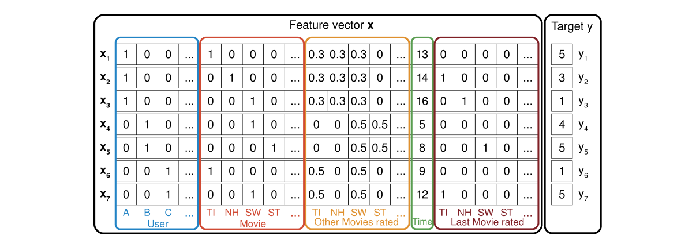
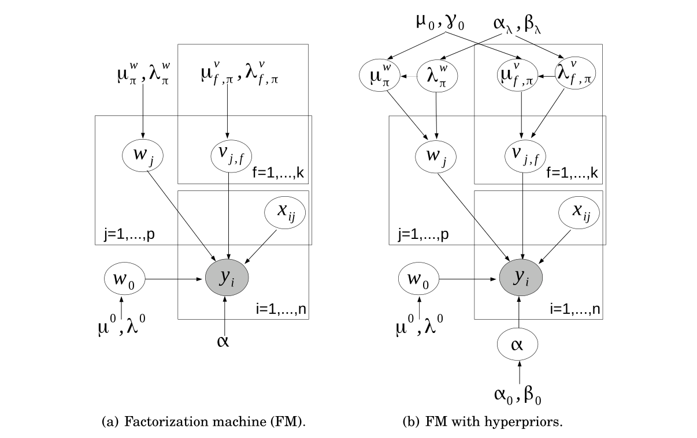
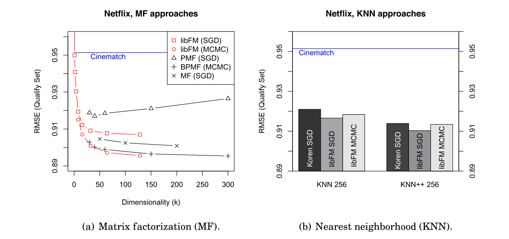
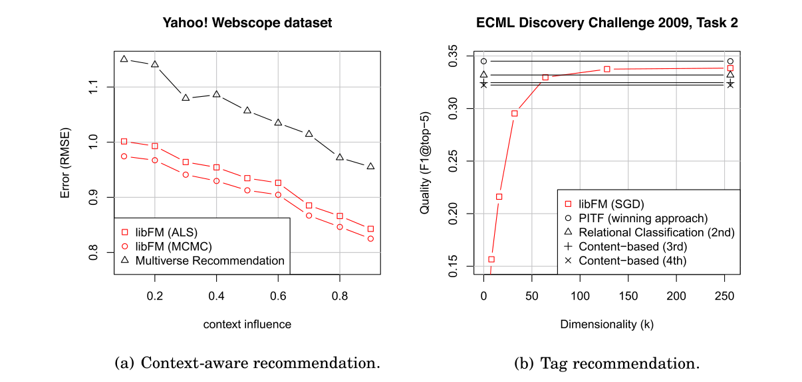

# Factorization Machines with libFM

> Steffen Rendle | University of Konstanz[^1]

[^1]: 作者地址：S. Rendle, Social Network Analysis, University of Konstanz；电子邮件：steffen.rendle@uni-konstanz.de。允许以个人或课堂使用为目的制作本作品的部分或全部数字或硬拷贝，无需付费，前提是复制件不得为盈利或商业目的而制作或分发，并且复制件在显示的第一页或初始屏幕上显示此通知以及完整引用。必须尊重归 ACM 以外的机构所有的本作品组件的版权。允许带有引用的摘要。以其他方式复制、重新发布、上传到服务器、分发给列表、或在本作品中使用任何组件用于其他作品，需要事先获得特定许可和/或支付费用。许可请求可寄往：Publications Dept., ACM, Inc., 2 Penn Plaza, Suite 701, New York, NY 10121-0701, USA，传真 +1 (212) 869-0481，或 permissions@acm.org。c 2012 ACM 2157-6904/2012/05-ART57 \ $10.00，DOI 10.1145/2168752.2168771 http://doi.acm.org/10.1145/2168752.2168771


本文介绍了因子分解机（Factorization Machines, FM）及其软件实现 libFM。核心内容：

- FM 是一种通用预测方法，**仅通过特征工程即可模仿大多数因子分解模型**，将 特征工程的通用性 与 因子分解模型 在估计**大领域类别变量之间交互方面**的优越性结合起来
- 系统总结了 FM 的三种学习算法：随机梯度下降（SGD）、交替最小二乘（ALS）和基于马尔可夫链蒙特卡洛（MCMC）的贝叶斯推断，并给出 ALS 与 MCMC 的扩展（分类能力与变量分组）
- FM 可等价表达矩阵分解、PITF、SVD++、FPMC、BPTF、TimeSVD++、因子化 KNN、属性感知模型等众多**专门化因子分解模型**
- 在 Netflix 评分预测、上下文感知推荐 和 标签推荐任务上对 libFM 进行了实证评估

关键发现：libFM 的 MCMC 推断在 Netflix 上略优于专门的 BPMF 采样器，达到所有对比方法中的最低误差；在上下文感知推荐和标签推荐任务上达到或超越当时最先进的方法，且 MCMC 无需耗时搜索正则化超参数。

---


## 摘要

因子分解方法在几个重要的预测问题中提供了高精度，例如推荐系统。然而，将因子分解方法应用于一个新的预测问题并非易事，需要大量的专家知识。通常，**需要开发一个新模型，推导出一个学习算法，并且必须实现该方法**。

因子分解机（FM）是一种通用方法，因为它们仅通过特征工程就能模仿大多数因子分解模型。通过这种方式，因子分解机将特征工程的通用性与因子分解模型在估计大领域类别变量之间交互方面的优越性结合起来。libFM 是因子分解机的软件实现，具有随机梯度下降（SGD）和交替最小二乘（ALS）优化，以及使用马尔可夫链蒙特卡洛（MCMC）的贝叶斯推断。本文总结了最近在建模和学习方面关于因子分解机的研究，提供了 ALS 和 MCMC 算法的扩展，并描述了软件工具 libFM。

**类别和主题描述符**：I.2.6 [人工智能]：学习——参数学习；I.5.2 [模式识别]：设计方法论——分类器设计与评估；H.3.3 [信息存储与检索]：信息搜索与检索——信息过滤

**通用术语**：算法、实验、测量、性能

**附加关键词和短语**：因子分解模型、矩阵分解、张量分解、推荐系统、协同过滤、因子分解机

**ACM 引用格式**：
Rendle, S. 2012. Factorization machines with libFM. ACM Trans. Intell. Syst. Technol. 3, 3, Article 57 (May 2012), 22 pages.
DOI = 10.1145/2168752.2168771 http://doi.acm.org/10.1145/2168752.2168771


## 1. 引言

最近，因子分解模型在智能信息系统和机器学习领域吸引了大量研究。它们在几个重要应用中展现了出色的预测能力，例如推荐系统。研究最充分的因子分解模型是矩阵分解 [38]，它允许我们**预测 两个类别变量 之间的关系**。张量分解模型是针对**多个类别变量之间**关系的扩展；在已提出的张量分解方法中包括 Tucker 分解 [42]、平行因子分析 [11] 或成对交互张量分解 [33]。针对特定任务，已经提出了考虑非类别变量的专门化因子分解模型，例如 SVD++ [15]、STE [24]、FPMC [31]（针对集合类别变量）、timeSVD++ [17] 和 BPTF [43]（针对附加的数值变量）。对于基本的矩阵分解模型，已经研究了许多学习和推断方法——其中包括（随机）梯度下降、交替最小二乘（例如 [27]）、变分贝叶斯 [19] 和马尔可夫链蒙特卡洛（MCMC）推断 [35]。然而，**对于更复杂的因子分解模型，通常只有最简单的梯度下降学习方法可用。**

尽管因子分解模型在许多应用中具有很高的预测质量，但使用它们并非易事。对于每个**无法用 类别变量 描述的问题**，必须**推导出一个新的专门化模型，并且必须开发和实现一个学习算法**。这非常耗时、容易出错，并且仅适用于因子分解模型的专家。

另一方面，在实践中，机器学习的典型方法是**使用特征向量描述数据**（一个预处理步骤，又名特征工程），并应用标准工具，例如 LIBSVM [4] 用于支持向量机、像 Weka [10] 这样的工具箱，或简单的线性回归工具。这种方法很简单，即使对底层机器学习模型和推断机制没有深入了解的用户也适用。

在本文中，介绍了因子分解机（FM）[28]。**FM 将因子分解模型的高预测精度与特征工程的灵活性结合起来**。FM 的输入数据用实值特征描述，就像其他机器学习方法（如线性回归、支持向量机等）一样。然而，FM 的内部模型使用变量之间的因子化交互，因此，它与其它因子分解模型一样，**在稀疏设置中（如推荐系统）具有高预测质量**。已经证明，FM 仅通过特征工程就可以模仿大多数因子分解模型 [28]。本文总结了关于 FM 的最新研究，包括基于随机梯度下降、交替最小二乘和使用 MCMC 的贝叶斯推断的学习算法。FM 及所有提出的算法都在公开可用的软件工具 libFM 中提供。使用 libFM，应用因子分解模型就像应用标准工具（如 SVM 或线性回归）一样简单。

本文结构如下：（1）介绍了 FM 模型及其在 libFM 中可用的学习算法；（2）给出了输入数据的几个示例，并展示了与专门化因子分解模型的关系；（3）简要介绍了 libFM 软件；（4）进行了实验。


## 2. 因子分解机模型

假设预测问题的数据由一个设计矩阵 $ X \in \mathbb{R}^{n \times p} $ 描述，其中 $ X $ 的第 $ i $ 行 $ \mathbf{x}_i \in \mathbb{R}^p $ 描述了一个具**有 $ p $ 个实值变量的案例**，并且 $ y_i $ 是第 $ i $ 个案例的预测目标（见图 1 的示例）。或者，可以将此设置描述为元组 $ (\mathbf{x}, y) $ 的集合 $ S $，其中（再次）$ \mathbf{x} \in \mathbb{R}^p $ 是一个特征向量，$ y $ 是其对应的目标。这种用数据矩阵和特征向量的表示在许多机器学习方法中很常见，例如线性回归或支持向量机（SVM）。



> 图 1. 示例（来自 Rendle [28]），展示了如何用实值特征向量 $ \mathbf{x} $ 表示推荐问题。每一行表示一个特征向量 $ \mathbf{x}_i $ 及其对应的目标 $ y_i $。为了便于解释，特征被分组为活跃用户（蓝色）、活跃 item（红色）、同一用户评分的其他电影（橙色）、以月为单位的时间（绿色）以及最后评分的电影（棕色）的指示符。

因子分解机（FM）[28] 使用因子化的交互参数**对 $ \mathbf{x} $ 中 $ p $ 个输入变量之间所有最多 $ d $ 阶的嵌套交互**进行建模。阶数 $ d = 2 $ 的因子分解机（FM）模型定义为

$$
\hat{y}(\mathbf{x}) := w_0 + \sum_{j=1}^{p} w_j x_j + \sum_{j=1}^{p} \sum_{j'=j+1}^{p} x_j x_{j'} \sum_{f=1}^{k} v_{j,f} v_{j',f} \qquad (1)
$$

其中 $ k $ 是因子分解的维度，模型参数 $ \Theta = \{w_0, w_1, \ldots, w_p, v_{1,1}, \ldots, v_{p,k}\} $ 为

$$
w_0 \in \mathbb{R}, \quad \mathbf{w} \in \mathbb{R}^p, \quad \mathbf{V} \in \mathbb{R}^{p \times k}. \qquad (2)
$$

FM 模型的第一部分包含每个输入变量 $ x_j $ 与目标的单变量交互——完全如同线性回归模型。第二部分包含两个嵌套求和，包含了输入变量的所有成对交互，即 $ x_j x_{j'} $。与标准多项式回归的重要区别在于，交互的效果不是由独立参数 $ w_{j,j'} $ 建模的，而是通过因子化参数化 $ w_{j,j'} \approx \langle \mathbf{v}_j, \mathbf{v}_{j'} \rangle = \sum_{f=1}^{k} v_{j,f} v_{j',f} $ 来建模，这对应于成对交互的效果具有低秩的假设。这使得 FM 即使在标准模型失败的高度稀疏数据中也能估计可靠的参数。FM 与标准机器学习模型的关系将在第 4.3 节中更详细地讨论。在第 4 节中，还将展示 FM 如何模仿其他著名的因子分解模型，包括矩阵分解、SVD++、FPMC、timeSVD 等。

**复杂度**。令 $ N_Z $ 为矩阵 $ X $ 或向量 $ \mathbf{x} $ 中非零元素的数量。

$$
N_Z(X) := \sum_i \sum_j \delta(x_{i,j} \neq 0), \qquad (3)
$$

其中 $ \delta $ 是指示函数

$$
\delta(b) := \begin{cases} 1, & \text{如果 } b \text{ 为真} \\ 0, & \text{如果 } b \text{ 为假} \end{cases}. \qquad (4)
$$

方程 (1) 中的 FM 模型可以在 $ O(k N_Z(\mathbf{x})) $ 内计算，因为它等价于 [28]

$$
\hat{y}(\mathbf{x}) = w_0 + \sum_{j=1}^{p} w_j x_j + \frac{1}{2} \sum_{f=1}^{k} \left[ \left( \sum_{j=1}^{p} v_{j,f} x_j \right)^2 - \sum_{j=1}^{p} v_{j,f}^2 x_j^2 \right]. \qquad (5)
$$

FM 的模型参数数量 $ |\Theta| $ 为 $ 1 + p + kp $，因此与预测变量的数量（= 输入特征向量的大小）线性相关，并且与因子分解大小 $ k $ 线性相关。

**多线性**。FM 的一个吸引人的特性是多线性，即对于每个模型参数 $ \theta \in \Theta $，FM 是两个函数 $ g_\theta $ 和 $ h_\theta $ 的线性组合，这两个函数独立于 $ \theta $ 的值 [32]。

$$
\hat{y}(\mathbf{x}) = g_\theta(\mathbf{x}) + \theta h_\theta(\mathbf{x}) \quad \forall \theta \in \Theta, \qquad (6)
$$

其中

$$
h_\theta(\mathbf{x}) = \frac{\partial \hat{y}(\mathbf{x})}{\partial \theta} = \begin{cases} 1, & \text{如果 } \theta \text{ 是 } w_0 \\ x_l, & \text{如果 } \theta \text{ 是 } w_l \\ x_l \sum_{j \neq l} v_{j,f} x_j, & \text{如果 } \theta \text{ 是 } v_{l,f} \end{cases}. \qquad (7)
$$

省略了 $ g_\theta $ 的定义，因为在下面的内容中从未直接使用。如果需要计算其值，将使用方程 $ g_\theta(\mathbf{x}) = \hat{y}(\mathbf{x}) - \theta h_\theta(\mathbf{x}) $。

**表达能力**。**只要 $ k $ 选择得足够大，FM 模型可以表达任何成对交互**。这源于以下事实：任何对称半正定矩阵 $ \mathbf{W} $ 都可以分解为 $ \mathbf{V} \mathbf{V}^t $（例如，Cholesky 分解）。设 $ \mathbf{W} $ 是任意成对交互矩阵，应在 FM 中表达两个不同变量之间的交互。$ \mathbf{W} $ 是对称的，并且由于 FM 不使用对角线元素（因为方程 (1) 中 $ j' > j $），对角线元素的任何值——尤其是任意大的值——都是可能的，这将使 $ \mathbf{W} $ 成为半正定矩阵。

请注意，这是关于表达能力的理论说明。在实践中，$ k \ll p $，因为 FM 的优势在于可以使用 $ \mathbf{W} $ 的低秩近似，因此 FM 即使在高度稀疏的数据中也能估计交互参数——参见第 4.3 节与使用完整矩阵 $ \mathbf{W} $ 建模交互的多项式回归的比较。

**高阶 FM**。$ d = 2 $ 阶的 FM 模型（方程 (1)）可以通过因子化三元及更高阶的变量交互来扩展。高阶 FM 模型 [28] 为

$$
\hat{y}(\mathbf{x}) := w_0 + \sum_{j=1}^{p} w_j x_j + \sum_{l=2}^{d} \sum_{j_1=1}^{p} \ldots \sum_{j_d=j_{d-1}+1}^{p} \left( \prod_{i=1}^{l} x_{j_i} \right) \sum_{f=1}^{k_l} \prod_{i=1}^{l} v_{j_i,f}, \qquad (8)
$$

其中模型参数

$$
w_0 \in \mathbb{R}, \quad \mathbf{w} \in \mathbb{R}^p, \quad \forall l \in \{2, \ldots, d\}: \mathbf{V}^l \in \mathbb{R}^{p \times k_l}. \qquad (9)
$$

对于更高阶的交互，方程 (8) 中的嵌套求和也可以分解以实现更高效的计算。在本文的其余部分，我们将只处理二阶 FM，因为在稀疏设置中——因子分解模型尤其具有吸引力——通常高阶交互难以估计 [33]。尽管如此，大多数公式和算法可以直接迁移到高阶 FM，因为它们与二阶 FM 共享多线性的性质。


## 3. 学习因子分解机

已经提出了三种 FM 的学习方法：随机梯度下降（SGD）[28]、交替最小二乘（ALS）[32] 和马尔可夫链蒙特卡洛（MCMC）推断 [6]。所有这三种方法都在 libFM 中可用。

### 3.1. 优化任务

模型参数的最优性通常用损失函数 $ l $ 来定义，其中任务是最小化观测数据 $ S $ 上的损失之和。

$$
OPT(S) := \operatorname*{argmin}_{\Theta} \sum_{(\mathbf{x},y) \in S} l(\hat{y}(\mathbf{x}|\Theta), y). \qquad (10)
$$

注意，我们将模型参数 $ \Theta $ 添加到模型方程中，并写为 $ \hat{y}(\mathbf{x}|\Theta) $，当我们想强调 $ \hat{y} $ 依赖于 $ \Theta $ 的特定选择时。根据任务，可以选择损失函数。例如，对于回归，最小二乘损失：

$$
l_{LS}(y_1, y_2) := (y_1 - y_2)^2, \qquad (11)
$$

或者对于二分类（$ y \in \{-1, 1\} $）：

$$
l_C(y_1, y_2) := -\ln \sigma(y_1 y_2), \qquad (12)
$$

其中 $ \sigma(x) = \frac{1}{1+e^{-x}} $ 是 sigmoid/逻辑函数。

> [!NOTE]
>
> 二分类的损失函数，详见笔记
>
> $ y_1 $ 是真实标签，$ y_2 $ 是模型预测值。损失鼓励模型学习和标签同符号的预测结果。

FM 通常有大量的模型参数 $ \Theta $——特别是当 $ k $ 选择得足够大时。**这使得它们容易过拟合**。为了克服这一点，通常应用 L2 正则化，这可以由最大间隔 [39] 或 Tikhonov 正则化来推动。

$$
OPT_{REG}(S, \lambda) := \operatorname*{argmin}_{\Theta} \left( \sum_{(\mathbf{x},y) \in S} l(\hat{y}(\mathbf{x}|\Theta), y) + \sum_{\theta \in \Theta} \lambda_\theta \theta^2 \right), \qquad (13)
$$

其中 $ \lambda_\theta \in \mathbb{R}^+ $ 是模型参数 $ \theta $ 的正则化值。**对模型的不同部分使用单独的正则化参数是有意义的**。在 libFM 中，模型参数可以被分组——例如，一组用于描述用户的参数，一组用于 item，一组用于时间等（见图 1 的分组示例）——每个组使用一个独立的正则化值。此外，每个因子化层 $ f \in \{1, \ldots, k\} $ 以及单变量回归系数 $ \mathbf{w} $ 和 $ w_0 $ 可以有单独的正则化（同样带有分组）。总的来说，libFM 的正则化结构为

$$
\lambda_0, \quad \lambda_\pi^w, \quad \lambda_{f,\pi}^v, \quad \forall \pi \in \{1, \ldots, \Pi\}, \forall f \in \{1, \ldots, k\}, \qquad (14)
$$

其中 $ \pi: \{1, \ldots, p\} \rightarrow \{1, \ldots, \Pi\} $ 是模型参数的分组。这意味着，例如，$ v_{l,f} $ 的正则化值将是 $ \lambda_{f,\pi(l)}^v $。

**概率解释**。损失和正则化也可以从概率的角度来推动（例如，Salakhutdinov and Mnih [36]）。最小二乘损失对应于假设目标 $ y $ 服从高斯分布，均值为预测值：

$$
y|\mathbf{x}, \Theta \sim \mathcal{N}(\hat{y}(\mathbf{x}, \Theta), 1/\alpha). \qquad (15)
$$

对于二分类，假设服从伯努利分布：

$$
y|\mathbf{x}, \Theta \sim \text{Bernoulli}(b(\hat{y}(\mathbf{x}, \Theta))), \qquad (16)
$$

其中 $ b: \mathbb{R} \rightarrow [0, 1] $ 是一个链接函数，通常是逻辑函数 $ \sigma $ 或标准正态分布的累积分布函数（CDF）$ \Phi $。

L2 正则化对应于模型参数上的高斯先验：

$$
\theta|\mu_\theta, \lambda_\theta \sim \mathcal{N}(\mu_\theta, 1/\lambda_\theta) \qquad (17)
$$



图 2. 标准因子分解机中所涉变量的图形化表示。(a) 变量为目标 $ y $、输入特征 $ \mathbf{x} $、模型参数 $ w_0 $、$ w_j $、$ v_{j,f} $ 以及超参数/先验 $ \mu $、$ \lambda $、$ \alpha $。(b) 先验通过超先验 $ \Theta_0 = \{\alpha_0, \alpha_\lambda, \beta_0, \beta_\lambda, \gamma_0, \mu_0\} $ 进行扩展，这允许 MCMC 算法（算法 3）自动寻找先验参数 [6]。

先验均值 $ \mu_\theta $ 应与正则化值 $ \lambda_\theta $（见方程 (14)）以相同方式分组和组织。

概率视角的图形模型见图 2(a)。该模型的最大后验（MAP）估计器（取 $ \alpha = 1, \mu_\theta = 0 $）与方程 (13) 的优化准则相同。

**梯度**。对于损失函数的直接优化，导数为：

对于最小二乘回归：

$$
\frac{\partial}{\partial \theta} l_{LS}(\hat{y}(\mathbf{x}|\Theta), y) = \frac{\partial}{\partial \theta} (\hat{y}(\mathbf{x}|\Theta) - y)^2 = 2(\hat{y}(\mathbf{x}|\Theta) - y) \frac{\partial}{\partial \theta} \hat{y}(\mathbf{x}|\Theta), \qquad (18)
$$

或者对于分类：

$$
\frac{\partial}{\partial \theta} l_C(\hat{y}(\mathbf{x}|\Theta), y) = \frac{\partial}{\partial \theta} (-\ln \sigma(\hat{y}(\mathbf{x}|\Theta) y)) = (\sigma(\hat{y}(\mathbf{x}|\Theta) y) - 1) y \frac{\partial}{\partial \theta} \hat{y}(\mathbf{x}|\Theta). \qquad (19)
$$

最后，由于 FM 模型的多线性，模型方程关于 $ \theta $ 的偏导数对应于 $ h_\theta $（方程 (7)）。

$$
\frac{\partial}{\partial \theta} \hat{y}(\mathbf{x}|\Theta) = h_\theta(\mathbf{x}). \qquad (20)
$$

### 3.2. 随机梯度下降（SGD）

随机梯度下降（SGD）算法在优化因子分解模型中非常流行，因为它们简单、能很好地处理不同的损失函数，并且具有低计算和存储复杂度。算法 1 展示了如何用 SGD [28] 优化 FM。该算法遍历案例 $ (\mathbf{x}, y) \in S $ 并对模型参数执行更新。

**算法 1：随机梯度下降（SGD）**

**输入**：训练数据 $ S $，正则化参数 $ \lambda $，学习率 $ \eta $，初始化 $ \sigma $
**输出**：模型参数 $ \Theta = (w_0, \mathbf{w}, \mathbf{V}) $

$ w_0 \leftarrow 0 $；$ \mathbf{w} \leftarrow (0, \ldots, 0) $；$ \mathbf{V} \sim \mathcal{N}(0, \sigma) $；

**repeat**

- **for** $ (\mathbf{x}, y) \in S $ **do**
  - $ w_0 \leftarrow w_0 - \eta \left( \frac{\partial}{\partial w_0} l(\hat{y}(\mathbf{x}|\Theta), y) + 2\lambda_0 w_0 \right) $；
  - **for** $ i \in \{1, \ldots, p\} \wedge x_i \neq 0 $ **do**
    - $ w_i \leftarrow w_i - \eta \left( \frac{\partial}{\partial w_i} l(\hat{y}(\mathbf{x}|\Theta), y) + 2\lambda_{\pi(i)}^w w_i \right) $；
    - **for** $ f \in \{1, \ldots, k\} $ **do**
      - $ v_{i,f} \leftarrow v_{i,f} - \eta \left( \frac{\partial}{\partial v_{i,f}} l(\hat{y}(\mathbf{x}|\Theta), y) + 2\lambda_{f,\pi(i)}^v v_{i,f} \right) $；

**until** 满足停止准则；

$$
\theta \leftarrow \theta - \eta \left( \frac{\partial}{\partial \theta} l(\hat{y}(\mathbf{x}), y) + 2\lambda_\theta \theta \right), \qquad (21)
$$

其中 $ \eta \in \mathbb{R}^+ $ 是梯度下降的学习率或步长。

**复杂度**。FM 的 SGD 算法具有线性的计算复杂度和常数的存储复杂度。对于遍历所有训练案例的一次迭代，SGD 的运行时复杂度为 $ O(k N_Z(X)) $，因为对于每个单个案例 $ (\mathbf{x}, y) \in S $，梯度步骤的复杂度为 $ O(k \sum_{i=1}^{p} \delta(x_i \neq 0)) = O(k N_Z(\mathbf{x})) $。

**超参数**。执行 SGD 时，有几个关键的超参数。

— **学习率 $ \eta $**：SGD 的收敛在很大程度上取决于 $ \eta $：如果 $ \eta $ 选择得太高，算法不会收敛，如果选择得太小，收敛速度很慢。通常，$ \eta $ 是应首先确定的第一个超参数。

— **正则化 $ \lambda $**：如第 3.1 节所述，FM 的泛化能力以及因此预测质量在很大程度上取决于正则化 $ \lambda $ 的选择。正则化值通常在单独的保留集上搜索，例如使用网格搜索。由于存在多个正则化参数（见方程 (14)），网格具有指数大小，因此这种搜索非常耗时。为了使搜索更可行，正则化参数的数量通常会减少，例如，放弃分组并且所有因子层使用相同的正则化值。

— **初始化 $ \sigma $**：因子化交互（$ \mathbf{V} $）的参数必须用非常数值初始化。在 libFM 中，值从一个具有标准差 $ \sigma $ 的零均值正态分布中采样。通常 $ \sigma $ 使用较小的值。

**带自适应正则化的 SGD**。在 Rendle [29] 中，展示了在学习模型参数时，如何在 SGD 中自动调整正则化值。libFM 包含那里提出的自适应正则化算法，并用分组对其进行了扩展。

### 3.3. 交替最小二乘/坐标下降

SGD 的优化方法基于遍历训练数据的案例（行）并在损失减小的方向上执行小步长。坐标下降或交替最小二乘（ALS）采用了另一种方法，即最小化每个模型参数的损失。对于带有 L2 正则化的最小二乘回归，给定所有剩余参数 $ \Theta \setminus \{\theta\} $，一个模型参数 $ \theta $ 的最优值 $ \theta^* $ 可以直接计算 [32] 为

$$
\begin{align} \theta^* &= \operatorname*{argmin}_{\theta} \left( \sum_{(\mathbf{x},y) \in S} (\hat{y}(\mathbf{x}|\Theta) - y)^2 + \sum_{\theta \in \Theta} \lambda_\theta \theta^2 \right) \\
&= \operatorname*{argmin}_{\theta} \left( \sum_{(\mathbf{x},y) \in S} (g_\theta(\mathbf{x}|\Theta \setminus \{\theta\}) + \theta h_\theta(\mathbf{x}|\Theta \setminus \{\theta\}) - y)^2 + \sum_{\theta \in \Theta} \lambda_\theta \theta^2 \right) \\
&= \frac{\sum_{i=1}^{n} (y - g_\theta(\mathbf{x}_i|\Theta \setminus \{\theta\})) h_\theta(\mathbf{x}_i|\Theta \setminus \{\theta\})}{\sum_{i=1}^{n} h_\theta(\mathbf{x}_i)^2 + \lambda_\theta} \\
&= \frac{\theta \sum_{i=1}^{n} h_\theta^2(\mathbf{x}_i) + \sum_{i=1}^{n} h_\theta(\mathbf{x}_i) e_i}{\sum_{i=1}^{n} h_\theta(\mathbf{x}_i)^2 + \lambda_\theta}, \end{align} \qquad (22)
$$

其中 $ e_i $ 是第 $ i $ 个案例的"误差"项/残差：

$$
e_i := y_i - \hat{y}(\mathbf{x}_i|\Theta). \qquad (23)
$$

这允许我们推导一个最小二乘学习算法（见算法 2），该算法迭代地为每个模型参数求解一个最小二乘问题，并用最优（局部）解更新每个模型参数：

$$
\theta \leftarrow \theta^*. \qquad (24)
$$

这将对所有参数迭代执行，直到收敛。

**复杂度**。ALS 学习（方程 (22)）的主要工作在于计算以下两个量：

$$
\sum_{i=1}^{n} h_\theta(\mathbf{x}_i)^2, \qquad \sum_{i=1}^{n} h_\theta(\mathbf{x}_i) e_i = \sum_{i=1}^{n} h_\theta(\mathbf{x}_i) (y_i - \hat{y}(\mathbf{x}_i|\Theta)). \qquad (25)
$$

使用简单的实现，更新一个模型参数需要为每个对应列 $ j $ 非零（$ x_{i,j} \neq 0 $）的训练案例 $ \mathbf{x}_i $ 计算模型方程 $ \hat{y}(\mathbf{x}_i) $ 和梯度 $ h_\theta(\mathbf{x}_i) $。例如，对于更新模型参数 $ v_{j,f} $，这将使复杂度为 $ O(\sum_{i=1}^{n} \delta(x_{i,j} \neq 0) k N_Z(\mathbf{x}_i)) $。总的来说，这必须为 $ 1 + p(k + 1) $ 个模型参数中的每一个计算。

在 Rendle et al. [32] 中，展示了如何通过预计算缓存 $ \mathbf{e} \in \mathbb{R}^n $（见方程 (23)）和 $ \mathbf{Q} \in \mathbb{R}^{n \times k} $ 使得在所有模型参数 $ \Theta $ 上的一次完整迭代可以在 $ O(N_Z(X) k) $ 内高效完成，其中

$$
q_{i,f} := \sum_{l=1}^{p} v_{l,f} x_{i,l}, \qquad (26)
$$

这使得我们可以快速计算 $ h $，复杂度 $ O(1) $：

$$
h_{v_{l,f}}(\mathbf{x}_i) = x_{i,l} (q_{i,f} - v_{l,f} x_{i,l}). \qquad (27)
$$

**算法 2：交替最小二乘（ALS）**

**输入**：训练数据 $ S $，正则化参数 $ \lambda $，初始化 $ \sigma $
**输出**：模型参数 $ \Theta = (w_0, \mathbf{w}, \mathbf{V}) $

$ w_0 \leftarrow 0 $；$ \mathbf{w} \leftarrow (0, \ldots, 0) $；$ \mathbf{V} \sim \mathcal{N}(0, \sigma) $；

**repeat**
- $ \hat{\mathbf{y}} \leftarrow $ 预测所有案例 $ S $；
- $ \mathbf{e} \leftarrow \mathbf{y} - \hat{\mathbf{y}} $；
- $ w_0 \leftarrow w_0^* $；
- **for** $ l \in \{1, \ldots, p\} $ **do**
  - $ w_l \leftarrow w_l^* $；
  - 更新 $ e $；
- **for** $ f \in \{1, \ldots, k\} $ **do**
  - 初始化 $ q_{\cdot,f} $；
  - **for** $ l \in \{1, \ldots, p\} $ **do**
    - $ v_{l,f} \leftarrow v_{l,f}^* $；
    - 更新 $ e, q $；

**until** 满足停止准则；

现在，对于第 $ l $ 个参数计算 $ \theta^* $ 的复杂度为 $ O(\sum_{i=1}^{n} \delta(x_{i,l} \neq 0)) $。同时，更新每个缓存值 $ q $ 和 $ e $ 可以在常数额外时间内完成（参见 Rendle et al. [32]）。

然而，加速的代价是缓存的内存消耗更高。Rendle et al. [32] 中提出的方法由于 $ \mathbf{Q} $ 缓存而具有 $ O(nk) $ 的额外内存复杂度。libFM 提供了一种更高效的实现，$ \mathbf{Q} $ 缓存仅需 $ O(n) $ 的内存复杂度（见算法 2）。其思想是模型参数按层 $ f $ 更新（即，首先所有参数 $ v_{1,1}, v_{2,1}, v_{3,1}, \ldots $，然后 $ v_{1,2}, v_{2,2}, v_{3,2}, \ldots $，等等），并且在每一层中，只有同一层的缓存值 $ \mathbf{Q} $ 必须存在。这意味着 libFM 只存储（和更新）一层的 $ \mathbf{Q} $ 缓存（因此存储量为 $ O(n) $），并且当切换层时，新层的 $ \mathbf{Q} $ 值会被计算/初始化。每层 $ \mathbf{Q} $ 值的初始化对整体计算复杂度没有负面影响。

**超参数**。ALS 相对于 SGD 的一个明显优势是 ALS 没有学习率作为超参数。然而，仍然有两个重要的超参数：正则化和初始化。找到好的正则化值尤其计算代价高昂。

**分类**。到目前为止描述的 ALS 算法仅限于最小二乘回归，无法解决分类任务。libFM 包含用于 ALS/坐标下降的分类能力，这基于使用 probit 链接函数。这种方法源于概率解释（第 3.1 节），将在 MCMC 部分的末尾进行描述。

### 3.4. 马尔可夫链蒙特卡洛（MCMC）推断

到目前为止使用的贝叶斯模型可以在图 2 中看到。ALS 和 SGD 都学习用于 $ \hat{y} $ 的点估计的最佳参数 $ \Theta $。MCMC 是一种贝叶斯推断技术，通过采样生成 $ \hat{y} $ 的分布。对于 FM 中使用吉布斯采样的 MCMC 推断，每个模型参数的条件后验分布为 [6]：

$$
\theta | X, \mathbf{y}, \Theta \setminus \{\theta\}, \Theta_H \sim \mathcal{N}(\tilde{\mu}_\theta, \tilde{\sigma}_\theta^2), \qquad (28)
$$

其中

$$
\tilde{\sigma}_\theta^2 := \left( \alpha \sum_{i=1}^{n} h_\theta(\mathbf{x}_i)^2 + \lambda_\theta \right)^{-1}, \qquad (29)
$$

$$
\tilde{\mu}_\theta := \tilde{\sigma}_\theta^2 \left( \alpha \theta \sum_{i=1}^{n} h_\theta^2(\mathbf{x}_i) + \alpha \sum_{i=1}^{n} h_\theta(\mathbf{x}_i) e_i + \mu_\theta \lambda_\theta \right), \qquad (30)
$$

并且 $ \Theta_H $ 是超参数：

$$
\Theta_H := \{(\mu_0, \lambda_0), (\mu_\pi^w, \lambda_\pi^w), (\mu_{f,\pi}^v, \lambda_{f,\pi}^v) : \forall \pi \in \{1, \ldots, \Pi\}, \forall f \in \{1, \ldots, k\}\}. \qquad (31)
$$

当比较 MCMC（方程 (30)）和 ALS 解（方程 (22)）中模型参数的条件后验时，可以看到两者非常相似，即 $ \theta^* = \tilde{\mu}_\theta $ 且 $ \alpha = 1, \mu_{\cdot} = 0 $。区别在于 MCMC 从后验分布中采样，而 ALS 使用期望值。

MCMC 相对于 ALS 和 SGD 的一个主要优势是它允许将正则化参数 $ \Theta_H $ 整合到模型中，从而避免了对这些超参数进行耗时的搜索。为了整合 $ \Theta_H $，贝叶斯 FM 模型通过在先验上放置分布（超先验分布）进行了扩展（图 2）。对于先验参数的每一对 $ (\mu_\theta, \lambda_\theta) \in \Theta_H $，假设 $ \lambda_\theta $ 服从 Gamma 分布，$ \mu_\theta $ 服从正态分布。即：

$$
\mu_\pi^w \sim \mathcal{N}(\mu_0, \gamma_0 \lambda_\pi^w), \quad \lambda_\pi^w \sim \Gamma(\alpha_\lambda, \beta_\lambda), \qquad \mu_{f,\pi}^v \sim \mathcal{N}(\mu_0, \gamma_0 \lambda_{f,\pi}^v), \quad \lambda_{f,\pi}^v \sim \Gamma(\alpha_\lambda, \beta_\lambda), \qquad (32)
$$

其中 $ \mu_0 $、$ \gamma_0 $ 以及 $ \alpha_\lambda $ 和 $ \beta_\lambda $ 描述了超先验分布。最后，在 $ \alpha $ 上也放置一个 Gamma 分布：

$$
\alpha \sim \Gamma(\alpha_0, \beta_0). \qquad (33)
$$

总的来说，超先验导致以下新的参数 $ \Theta_0 $：

$$
\Theta_0 := \{\alpha_0, \beta_0, \alpha_\lambda, \beta_\lambda, \mu_0, \gamma_0\}. \qquad (34)
$$

MCMC 允许将 $ \Theta_H $ 整合到推断过程中，即 $ \Theta_H $ 的值通过从它们对应的条件后验分布中采样而自动找到 [6]。

$$
\alpha | \mathbf{y}, X, \Theta_0, \Theta \sim \Gamma\left( \alpha_0 + \frac{n}{2}, \frac{1}{2} \left[ \sum_{i=1}^{n} (y_i - \hat{y}(\mathbf{x}_i|\Theta))^2 + \beta_0 \right] \right), \qquad (35)
$$

$$
\lambda_\pi^{\cdot} | \Theta_0, \Theta_H \setminus \{\lambda_\pi^{\cdot}\}, \Theta \sim \Gamma\left( \alpha_\lambda + \frac{p_\pi + 1}{2}, \frac{1}{2} \left[ \sum_{j=1}^{p} \delta(\pi(j)=\pi)(\theta_j - \mu_\theta)^2 + \gamma_0(\mu_\pi^{\cdot} - \mu_0)^2 + \beta_\lambda \right] \right), \qquad (36)
$$

$$
\mu_\pi^{\cdot} | \Theta_0, \Theta_H \setminus \{\lambda_\pi^{\cdot}\}, \Theta \sim \mathcal{N}\left( (p_\pi + \gamma_0)^{-1} \left[ \sum_{j=1}^{p} \delta(\pi(j)=\pi) \theta_j + \gamma_0 \mu_0 \right], \frac{1}{(p_\pi + \gamma_0) \lambda_\pi^{\cdot}} \right), \qquad (37)
$$

其中

$$
p_\pi := \sum_{j=1}^{p} \delta(\pi(j) = \pi). \qquad (38)
$$

**复杂度**。用于 MCMC 推断的吉布斯采样器在算法 3 中进行了概述，并且具有与 ALS 算法相同的复杂度。这直接源于观察到，对于这两种算法，在 MCMC 中要计算条件后验分布的和与 ALS 中要计算期望值的和是相同的。MCMC 的开销在于对 $ \Theta_H $ 的推断，即计算后验（方程 (35)、(36) 和 (37)），但即使使用直接实现，这也是 $ O(k N_Z(X)) $。

**超参数**。MCMC 的一个主要优势是正则化值 $ \Theta_H $ 被自动确定。这是以引入超先验 $ \Theta_0 $ 的参数为代价的。然而，（1）超先验的数量 $ |\Theta_H| $ 小于正则化参数的数量 $ |\Theta_0| $，并且（2）更重要的是，MCMC 通常对 $ \Theta_0 $ 的选择不敏感。也就是说，对 $ \Theta_0 $ 值的一个简单选择就能很好地工作。在 libFM 中，使用以下 $ \Theta_0 $ 的简单值：$ \alpha_0 = \beta_0 = \alpha_\lambda = \beta_\lambda = \gamma_0 = 1 $ 且 $ \mu_0 = 0 $。

MCMC 仍然需要设置的唯一超参数是初始化 $ \sigma $。通常在这里，甚至可以使用 0 的值（这对 ALS 和 SGD 是不可能的），因为 MCMC 的后验不确定性将识别出因子分解；然而，选择一个合适的值可以加速采样器。通常可以在前几个样本中看到初始化 $ \sigma $ 是否是一个好的选择。

**分类**。MCMC 算法 3 解决回归任务。它可以通过将正态分布的 $ \hat{y} $ 映射到概率 $ b(\hat{y}) \in [0, 1] $ 来扩展用于二分类，该概率定义了分类的伯努利分布 [8]。这意味着，MCMC 算法将预测一个案例属于正类的概率。libFM 使用正态分布的 CDF 作为映射，即 $ b(z) = \Phi(z) $，因为这样后验很容易采样。

对于分类，必须对算法 3 进行的唯一两个更改是：（1）预测时，$ \hat{y} $ 通过 $ \Phi $ 进行变换；（2）不是直接回归到 $ y $，而是在每次迭代中从其具有截断正态分布的后验中采样回归目标 $ y' $。

$$
y'_i | \mathbf{x}_i, y_i, \Theta \sim \begin{cases} \mathcal{N}(\hat{y}(\mathbf{x}_i, \Theta), 1) \delta(y'_i < 0), & \text{如果 } y_i \text{ 为负类} \\ \mathcal{N}(\hat{y}(\mathbf{x}_i, \Theta), 1) \delta(y'_i \geq 0), & \text{如果 } y_i \text{ 为正类} \end{cases}. \qquad (39)
$$

从这个分布中采样是高效的 [34]。

如前所述，对于回归，ALS 可以看作是 MCMC 的简化，其中模型参数不是被采样，而是在每次更新中取其期望值。libFM 中提供了 ALS 的分类选项，它遵循相同的思路，并且对于使用 ALS 的分类，不是从截断正态中采样（如 MCMC 中所做的那样），而是计算截断正态的期望值。

### 3.5. 总结

libFM 中学习算法属性的概览可以在表 I 中找到。

**算法 3：马尔可夫链蒙特卡洛推断（MCMC）**

**输入**：训练数据 $ S $，测试数据 $ S_{test} $，初始化 $ \sigma $
**输出**：测试案例的预测 $ \hat{\mathbf{y}}_{test} $

$ w_0 \leftarrow 0 $；$ \mathbf{w} \leftarrow (0, \ldots, 0) $；$ \mathbf{V} \sim \mathcal{N}(0, \sigma) $；

$ \#_{samples} \leftarrow 0 $；

**repeat**
- $ \hat{\mathbf{y}} \leftarrow $ 预测所有案例 $ S $；
- $ \mathbf{e} \leftarrow \mathbf{y} - \hat{\mathbf{y}} $；
- 更新超参数：
  - 从方程 (35) 采样 $ \alpha $；
  - **for** $ (\mu_\pi^{\cdot}, \lambda_\pi^{\cdot}) \in \Theta_H $ **do**
    - 从方程 (36) 采样 $ \lambda_\pi^{\cdot} $；
    - 从方程 (37) 采样 $ \mu_\pi^{\cdot} $；
- 更新模型参数：
  - 从 $ \mathcal{N}(\tilde{\mu}_{w_0}, \tilde{\sigma}_{w_0}^2) $ 采样 $ w_0 $；
  - **for** $ l \in \{1, \ldots, p\} $ **do**
    - 从 $ \mathcal{N}(\tilde{\mu}_{w_l}, \tilde{\sigma}_{w_l}^2) $ 采样 $ w_l $；
    - 更新 $ e $；
  - **for** $ f \in \{1, \ldots, k\} $ **do**
    - 初始化 $ q_{\cdot,f} $；
    - **for** $ l \in \{1, \ldots, p\} $ **do**
      - 从 $ \mathcal{N}(\tilde{\mu}_{v_{l,f}}, \tilde{\sigma}_{v_{l,f}}^2) $ 采样 $ v_{l,f} $；
      - 更新 $ e, q $；
- $ \#_{samples} \leftarrow \#_{samples} + 1 $；
- $ \hat{\mathbf{y}}_{test}^* \leftarrow $ 预测所有案例 $ S_{test} $；
- $ \hat{\mathbf{y}}_{test} \leftarrow \hat{\mathbf{y}}_{test} + \hat{\mathbf{y}}_{test}^* $；

**until** 满足停止准则；

$ \hat{\mathbf{y}}_{test} \leftarrow \frac{1}{\#_{samples}} \hat{\mathbf{y}}_{test} $；

**表 I. libFM 中学习算法的属性**

|  | SGD | ALS | MCMC |
|:---|:---|:---|:---|
| 运行时复杂度 | $ O(k N_Z(X)) $ | $ O(k N_Z(X)) $ | $ O(k N_Z(X)) $ |
| 存储复杂度 | $ O(1) $ | $ O(n) $ | $ O(n) $ |
| 回归 | 是 | 是 | 是 |
| 分类 | 是 | 是 | 是 |
| 超参数 | 初始化、正则化值 $ \lambda $、学习率 $ \eta $ | 初始化、正则化值 $ \lambda $ | 初始化、超先验（不敏感） |


## 4. 相关工作与因子分解机的应用

首先，展示了输入数据的示例，包括它们如何与其他专门的因子分解模型相关联。注意，FM 不限于此处呈现的选择。其次，将其他通用因子分解模型与 FM 进行比较。第三，将 FM 与多项式回归进行比较。

### 4.1. 用因子分解机表达因子分解模型

在本节中，将通过与其他专门的最先进因子分解模型进行比较来讨论 FM 的通用性。这也展示了如何通过定义输入数据（即特征）来应用 FM。关键需要注意的是，在实践中，只需要定义特征向量 $ \mathbf{x} $；其余部分由 FM 隐式完成——既不需要显式重新表述模型方程，也不需要开发新的预测或学习算法。本节中对 FM 模型方程的分析只是为了展示与其他模型的理论关系。

#### 4.1.1. 矩阵分解

假设关于两个类别变量 $ U $（例如，用户）和 $ I $（例如，item）的数据应该在 FM 中使用。直接描述一个案例 $ (u, i) \in U \times I $ 的方法是使用具有二元指示变量的特征向量 $ \mathbf{x} \in \mathbb{R}^{|U|+|I|} $，即

$$
(u, i) \rightarrow \mathbf{x} = (\underbrace{0, \ldots, 0, 1, 0, \ldots, 0}_{|U|}, \underbrace{0, \ldots, 0, 1, 0, \ldots, 0}_{|I|}), \qquad (40)
$$

其中 $ \mathbf{x} $ 第一部分的第 $ u $ 个条目为 1，$ \mathbf{x} $ 第二部分的第 $ i $ 个条目为 1，其余为 0（例如，见图 1 的前两组）。在 FM 中使用此数据时，FM 将完全等同于一个（有偏的）矩阵分解模型 [26, 39]：

$$
\hat{y}(\mathbf{x}) = \hat{y}(u, i) = w_0 + w_u + w_i + \sum_{f=1}^{k} v_{u,f} v_{i,f}. \qquad (41)
$$

#### 4.1.2. 成对交互张量分解

如果需要描述三个类别变量，例如 $ U $、$ I $ 和 $ T $（例如，标签），一种直接的特征向量表示是 $ \mathbf{x} \in \mathbb{R}^{|U|+|I|+|T|} $：

$$
(u, i, t) \rightarrow \mathbf{x} = (\underbrace{0, \ldots, 0, 1, 0, \ldots, 0}_{|U|}, \underbrace{0, \ldots, 0, 1, 0, \ldots, 0}_{|I|}, \underbrace{0, \ldots, 0, 1, 0, \ldots, 0}_{|T|}). \qquad (42)
$$

使用此数据表示的 FM 将类似于**成对交互张量分解模型**（PITF）[33]：

$$
\hat{y}(\mathbf{x}) = \hat{y}(u, i, t) = w_0 + w_u + w_i + w_t + \sum_{f=1}^{k} v_{u,f} v_{i,f} + \sum_{f=1}^{k} v_{u,f} v_{t,f} + \sum_{f=1}^{k} v_{i,f} v_{t,f}. \qquad (43)
$$

这个 FM 与原始 PITF 的区别在于，此 FM 包含低阶交互，并在交互之间共享因子 $ \mathbf{V} $。**除此之外，两种方法完全相同**。

#### 4.1.3. SVD++ 和 FPMC

假设存在两个类别变量（例如，$ U $ 和 $ I $）和一个集合类别变量（例如，$ \mathcal{P}(L) $）。此数据的一种简单表示是 $ \mathbf{x} \in \mathbb{R}^{|U|+|I|+|L|} $：

$$
(u, i, \{l_1, \ldots, l_m\}) \rightarrow \mathbf{x} = (\underbrace{0, \ldots, 1, 0, \ldots}_{|U|}, \underbrace{0, \ldots, 1, 0, \ldots}_{|I|}, \underbrace{0, \ldots, 1/m, 0, \ldots, 1/m, 0, \ldots}_{|L|}), \qquad (44)
$$

其中集合 $ \{l_1, \ldots, l_m\} $ 的 $ m $ 个元素中的每一个由一个非零值描述，例如，在相应列中为 $ 1/m $（例如，见图 1 的前三组）。使用此数据，FM 将等价于：

$$
\hat{y}(\mathbf{x}) = \hat{y}(u, i, \{l_1, \ldots, l_m\}) = \overbrace{w_0 + w_u + w_i + \underbrace{\langle \mathbf{v}_u, \mathbf{v}_i \rangle + \frac{1}{m} \sum_{j=1}^{m} \langle \mathbf{v}_i, \mathbf{v}_{l_j} \rangle}_{\text{FPMC}}}^{\text{SVD++} } + \frac{1}{m} \sum_{j=1}^{m} w_{l_j} + \frac{1}{m} \sum_{j=1}^{m} \langle \mathbf{v}_u, \mathbf{v}_{l_j} \rangle + \frac{1}{m^2} \sum_{j=1}^{m} \sum_{j'>j}^{m} \langle \mathbf{v}_{l_j}, \mathbf{v}_{l_{j'}} \rangle. \qquad (45)
$$

如果使用隐式反馈作为 $ \{l_1, \ldots, l_m\} $ 的输入，刚刚勾画的 FM 几乎与 SVD++ 模型相同 [15, 36, 41]。第一部分（标注为 SVD++）与原始 SVD++ [15] 完全相同；第二部分（方程 (45) 的第二行）包含一些额外的交互。如果使用序列信息作为 $ \{l_1, \ldots, l_m\} $ 的输入，FM 与因子化个性化马尔可夫链（FPMC）[31] 非常相似——特别是如果 FM 针对排序进行了优化（如 FPMC），FM 模型中存在但 FPMC 模型中不存在的几乎所有项都将消失（详见 [28]）。如果使用社交信息作为输入（例如，朋友），FM 与社会信任集成（STE）[24] 相似。

#### 4.1.4. BPTF 和 TimeSVD++

如果应该包含时间，最简单的方法是将时间视为一个类别变量（例如，每一天是一个级别）并应用与方程 (42) 相同的编码。使用此数据的 FM 类似于时间感知的 BPTF 模型 [43]。区别在于 BPTF 在三个类别变量（用户、item、时间）上使用三元 PARAFAC 模型，而 FM 使用因子化的成对交互。此外，BPTF 在时间变量上有一个额外的正则化器。在 Freudenthaler et al. [6] 中，已经表明 FM 确实比更复杂的 BPTF 模型效果更好。

另一种方法是每个用户使用一个单独的时间变量（即，使用户-时间交互显式化）。输入数据将是 $ \mathbf{x} \in \mathbb{R}^{|U|+|I|+|U| \cdot |T|} $，带有用户、item 和用户特定日期指示符的二元指示符。使用此数据，FM 模型将等价于：

$$
\begin{align} \hat{y}(\mathbf{x}) = \hat{y}(u, i, t) &= w_0 + w_u + w_i + w_{(u,t)} + \sum_{f=1}^{k} v_{u,f} v_{i,f} + \sum_{f=1}^{k} v_{(u,t),f} v_{i,f} + \sum_{f=1}^{k} v_{(u,t),f} v_{u,f} \\
&= w_0 + \underbrace{w_u + w_{(u,t)}}_{b_u(t)} + w_i + \sum_{f=1}^{k} \underbrace{(v_{u,f} + v_{(u,t),f})}_{v_{u,f}(t)} v_{i,f} + \sum_{f=1}^{k} v_{(u,t),f} v_{u,f}. \end{align} \qquad (46)
$$

该模型捕获了偏置 $ b_u(t) $ 和因子 $ v_{u,f}(t) $ 的"天特定变异性"，正如 Koren [17] 的 TimeSVD 模型一样。将 FM 的特征向量扩展为包含隐式反馈指示符（见第 4.1.3 节）和时间的线性指示符，将产生 TimeSVD++ 模型（图 1 的时间组是线性时间指示符的一个示例）。

#### 4.1.5. 最近邻模型

当有其他数值测量可用时，例如，同一用户对 item $ l_1, l_2, \ldots \in I $ 给出的其他评分 $ r_1, r_2, \ldots $ 等，这可以在特征向量 $ \mathbf{x} \in \mathbb{R}^{|I|+|I|} $ 中编码：

$$
(i, \{(r_1, l_1), \ldots, (r_m, l_m)\}) \rightarrow \mathbf{x} = (\underbrace{0, \ldots, 1, \ldots, 0}_{|I|}, \underbrace{0, \ldots, r_1/m, 0, \ldots, r_m/m, \ldots, 0}_{|I|}). \qquad (47)
$$

使用此数据的 FM 模型将等价于：

$$
\hat{y}(\mathbf{x}) = \hat{y}(i, \{(r_1, l_1), \ldots, (r_m, l_m)\}) = w_0 + w_i + \frac{1}{m} \sum_{j=1}^{m} r_j w_{l_j} + \underbrace{\frac{1}{m} \sum_{j=1}^{m} r_j \langle \mathbf{v}_i, \mathbf{v}_{l_j} \rangle}_{\text{因子化 KNN} } + \frac{1}{m^2} \sum_{j=1}^{m} \sum_{j'>j}^{m} r_j r_{j'} \langle \mathbf{v}_{l_j}, \mathbf{v}_{l_{j'}} \rangle. \qquad (48)
$$

该模型类似于因子化最近邻模型 [18]。

另一种可能的编码方法是对每个 item 使用单独的评分指示符，一个用于用户，即 $ \mathbf{x} \in \mathbb{R}^{|I|+|U|+|I| \cdot |I|} $。这意味着方程 (47) 中的评分指示符将在每个 item 的单独块中。使用此数据的 $ d = 1 $ 阶 FM 将等价于：

$$
\hat{y}(\mathbf{x}) = \hat{y}(i, u, \{(r_1, l_1), \ldots, (r_m, l_m)\}) = w_0 + w_i + w_u + \frac{1}{m} \sum_{j=1}^{m} r_j w_{i,l_j}. \qquad (49)
$$

这种方法与 Koren [15] 的非因子化最近邻模型相同。它可以与隐式反馈思想结合，从而产生 KNN++ 模型 [15]。

#### 4.1.6. 属性感知模型

已有几次将关于用户和 item 的属性信息集成到推荐系统中的尝试。在 FM 中使用这些信息非常简单。一种直接的方法是将 item（或用户）的属性（例如流派、演员等）添加到输入向量 $ \mathbf{x} $ 中。

假设输入向量由这些 item 属性和一个用户指示变量组成：

$$
(u, a_{i_1}, \ldots, a_{i_m}) \rightarrow \mathbf{x} = (\underbrace{0, \ldots, 0, 1, 0, \ldots, 0}_{|U|}, \underbrace{a_{i_1}, \ldots, a_{i_m}}_{\text{item } i \text{ 的属性}}). \qquad (50)
$$

使用此数据，FM 将等价于：

$$
\hat{y}(\mathbf{x}) = \hat{y}(u, a_{i_1}, \ldots, a_{i_m}) = w_0 + w_u + \sum_{j=1}^{m} a_{i_j} w_j + \underbrace{\sum_{j=1}^{m} a_{i_j} \langle \mathbf{v}_u, \mathbf{v}_j \rangle}_{\text{"属性映射"} } + \sum_{j=1}^{m} \sum_{j'>j}^{m} a_{i_j} a_{i_{j'}} \langle \mathbf{v}_j, \mathbf{v}_{j'} \rangle. \qquad (51)
$$

这与 Gantner et al. [7] 中的属性感知方法几乎相同，后者使用线性回归将 item 属性映射到因子（见方程 (51) 中突出显示的"属性映射"部分）——唯一的区别是 FM 包含偏置以及 item 属性之间的额外交互（例如，在流派和演员之间）。

如果将标准矩阵分解（方程 (40)）的输入向量扩展为包含用户的属性信息（例如，人口统计信息）和 item 的属性信息，则 FM 将对应于 Agarwal and Chen [2] 中提出的属性感知模型。同样，区别在于 FM 包含用户和 item 属性内部的额外交互（例如，用户年龄和性别之间的交互）。

### 4.2. 其他通用因子分解模型

还有其他尝试实现更通用的因子分解模型。在 Agarwal and Chen [2] 中，矩阵分解模型通过回归先验进行了扩展。即，正态分布因子先验的均值是一个线性回归模型。FM 可以模仿这种方法，因为对于任何使用正态分布先验的层次模型，先验的均值（因此也包括先验均值的线性回归模型）可以作为协变量添加到特征向量中。另一方面，带回归先验的 MF 比 FM 受限得多，因为 MF 本身仅限于两个类别变量的交互，因此，带回归先验的 MF 模型不适用于涉及两个以上变量交互的任务，例如标签推荐或上下文感知推荐。FM 包含任意数量变量之间的（成对）交互（也不限于类别变量）。

SVDfeature [5] 是另一种通用因子分解模型。与 Agarwal and Chen [2] 类似，在 SVDfeature 中，矩阵分解模型被扩展为包含因子和偏置项的线性回归项。然而，与 FM 相比，它具有与 Agarwal and Chen [2] 相同的缺陷：只有两个类别变量之间的交互可以被因子化。这意味着它无法模仿最先进的上下文感知推荐器、标签推荐器等。此外，对于 SVDfeature，只提出了 SGD 学习，而 libFM 提供 MCMC 推断，后者应用起来更简单，因为没有学习率，并且正则化值被自动确定。SVDfeature 相对于 libFM 的一个优势是，由于其更受限的模型方程，它在因子回归项中有一个改进的学习算法（遵循 Koren [15]）来加速学习。

### 4.3. 与多项式回归的关系

在 Rendle [28] 中，已经证明 FM 可以被视为使用因子化参数矩阵的多项式回归（或具有非齐次多项式核的 SVM）。$ d = 2 $ 阶的多项式回归可以定义为

$$
\hat{y}_{PR}(\mathbf{x}) := w_0 + \sum_{j=1}^{p} w_j x_j + \sum_{j=1}^{p} \sum_{j'=j}^{p} w_{j,j'} x_j x_{j'}, \qquad (52)
$$

其中模型参数

$$
w_0 \in \mathbb{R}, \quad \mathbf{w} \in \mathbb{R}^p, \quad \mathbf{W} \in \mathbb{R}^{p \times p}. \qquad (53)
$$

将此与 FM 模型（方程 (1)）进行比较，可以看到 FM 对成对交互使用因子化，而多项式回归对每个成对交互使用独立参数 $ w_{j,j'} $。这一区别对于 FM 在稀疏设置中的成功至关重要，例如推荐系统或其他涉及大领域类别变量的预测问题。FM 可以估计对 $ (j, j^{\prime}) $ 的成对交互 $ w_{j,j'} $，即使关于该对没有或只有很少的观测存在，因为做了低秩假设（$ w_{j,j'} \approx \langle \mathbf{v}_j, \mathbf{v}_{j'} \rangle $），即假设对 $ (j, j^{\prime}) $ 和 $ (j, j^*) $ 的交互有共同之处。在多项式回归中，两个对是完全独立的（先验地）。


## 5. libFM 软件

libFM[^2] 是因子分解机的一个实现。它包含第 3 节中描述的用于回归和分类任务的 SGD、ALS 和 MCMC 算法。实现了 $ d = 2 $ 阶的 FM。

[^2]: 源代码可从 http://www.libfm.org/ 获取。

### 5.1. 数据格式

libFM 的输入数据格式与 SVMlight [13] 和 LIBSVM [4] 相同。对于不适合主存的大规模数据，libFM 提供了一种二进制数据格式，其中只需要将部分数据保留在主存中。提供了从标准文本格式到**二进制数据格式**的转换器。

### 5.2. 示例

所有主要选项都可以通过易于使用的命令行界面获取。使用 MCMC 推断学习一个数据集的示例调用为：

```
./libFM -method mcmc \
-task r \
-dim '1;1;8' \
-init_stdev 0.1 \
-iter 100 \
-test ml1m-test.libfm \
-train ml1m-train.libfm \
-out ml1m-test.pred,
```

其中 dim 指定因子分解维度：0/1 表示是否包含 $ w_0 $，0/1 表示是否包含 $ \mathbf{w} $，以及 $ k \in \mathbb{N} $（此处 $ k = 8 $）表示 $ \mathbf{V} $ 的维度。init_stdev 是初始化的标准差，即算法 3 中的 $ \sigma $。iter 是抽取的样本数量。

### 5.3. 参数设置

下面给出了一些将 libFM 应用于预测问题的实用提示。

(1) 对于缺乏经验的用户，建议使用 MCMC 推断，因为它是最简单易用的方法。

(2) 当为新的数据集构建预测模型时，应该从较低的因子分解维度（例如，$ k = 8 $）开始，首先确定初始化的标准差（-init_stdev），因为恰当的值会加速 MCMC 采样器。

(3) 应测试几个 init_stdev 的值（例如，0.1、0.2、0.5、1.0）。通过监控训练误差，或者更好的是使用保留集进行验证，可以在前几次迭代中快速看到效果。

(4) 在确定了适当的 init_stdev 之后，可以使用大量的迭代次数和更大的因子分解维度 $ k $ 来运行 MCMC。准确性和收敛性可以在 libFM 的输出上进行监控。

对于 MCMC，不需要指定其他超参数。其他方法（ALS 和 SGD）需要调整更多的超参数（见第 3 节）。

### 5.4. 排序

libFM 还包含基于成对分类 [30] 的针对排序优化 FM 模型的方法 [23]。排序功能不能通过命令行使用，但可以嵌入到现有软件中。软件工具 Tag Recommender（也提供源代码）中提供了一个嵌入 libFM 的示例。


## 6. 评估

在第 4.1 节中，展示了 FM 能够模仿许多因子分解模型。现在将通过将 libFM 实现与几个经过充分研究的因子分解模型进行实证比较来证实这一点。成功将通过回归任务的均方根误差（RMSE）和排序任务的 F1 度量来衡量（参见 Gunawardana and Shani [9] 了解推荐系统评估指标的总结）。



图 3. 使用 MF（见方程 (40)）和 KNN（见方程 (49)）输入数据的 libFM（SGD 和 MCMC 学习）的预测误差。(a) 与 MF 方法 PMF (SGD) [36]、BPMF (MCMC) [35] 和 MF (SGD) [15] 进行比较。(b) 与 Koren [15] 的相应 KNN 方法进行比较。

### 6.1. 评分预测

在推荐系统中，研究最充分的数据集是 Netflix 挑战赛[^3]，其中包含约 480,000 名用户对 17,770 个 item 的大约 100,000,000 个评分。我们报告的所有结果均在 Netflix quiz 集上获得（即与 Netflix 挑战赛公共排行榜上相同的测试集）。

[^3]: http://www.netflixprize.com/

#### 6.1.1. 矩阵分解（MF）

Netflix 上最成功的方法基于矩阵分解（例如 [12, 16, 41]）。对于 MF，已经提出了许多不同的变体和学习方法，例如 ALS [27]、MCMC [35]、变分贝叶斯 [19, 40]，但主要是 SGD 变体（例如 [15, 36]）。因此，即使对于简单的 MF 模型，报告的预测质量也差异很大。我们希望通过使用 MF 指示符（见方程 (40)）设置 FM（这等价于有偏 MF）来研究 libFM 的学习方法有多好。在这种设置下，所有比较的方法共享相同的模型，但在学习算法和实现上有所不同。

图 3(a) 展示了 libFM（使用 SGD 和 MCMC[^4]）与 PMF 的 SGD 方法 [36] 和 [15] 的 MF (SGD) 方法，以及使用 MCMC 推断的 BPMF 方法 [35] 的比较。对于 libFM 的 SGD，我们使用了 Koren [15] 中为相关 SVD++ 模型报告的正则化值（$ \lambda_\theta = 0.04 $）。可以看出 MCMC 方法具有最低的误差，并且 libFM 的 MCMC 采样器略优于 BPMF 模型的采样器。

[^4]: FM (SGD) 结果来自 Rendle [29]，FM (MCMC) 结果来自 Freudenthaler et al. [6]。

#### 6.1.2. 最近邻模型

传统上，最近邻模型在推荐系统社区中吸引了大量研究（例如 [20, 37, 45]）。在 Netflix 挑战赛中，性能最好的邻域方法基于将 item 之间的相似度视为学习的模型参数，即 KNN（方程 (49)）[15] 和因子化 KNN（方程 (48)）[18]。我们再次希望了解 libFM 仅通过特征工程就能在多大程度上模仿这些模型。我们为 libFM 设置输入数据，使得 FM 模型对应于 Koren [15] 中描述的 KNN 和 KNN++（即带有额外的隐式指示符）。我们使用相同的剪枝协议将邻居限制为 256 个，对于 SGD，我们使用与 Koren [15] 中报告相同的正则化（$ \lambda_\theta = 0.002 $）。图 3(b) 显示，使用 MCMC 和 SGD 的 libFM 达到了与 Koren [15] 方法相当的质量。

### 6.2. 上下文感知推荐

其次，libFM 已经在上下文感知推荐问题上进行了研究 [32]。在上下文感知推荐中，除了用户和 item 之外，还有关于评分事件的其他信息可用，例如，用户评分时的位置、心情等。由于 FM 可以处理任意数量的特征，它们可以很容易地应用于此任务。图 4(a)[^5] 展示了使用 ALS 和 MCMC 的 libFM 与最先进方法 Multiverse Recommendation [14] 的比较，后者优于其他上下文感知方法，如 item 分割 [3] 和 Adomavicius et al. [1] 的多维方法。

[^5]: 关于实验设置的详细信息请参见 Karatzoglou et al. [14] 和 Rendle et al. [32]。



图 4. 上下文感知推荐的 libFM 与 Multiverse Recommendation [14] 的比较。并将 libFM 在标签推荐任务上与 ECML/PKDD Discovery Challenge 2009 任务 2 的最佳四种方法进行比较。

### 6.3. 标签推荐

最后一个实验展示了 libFM 对排序的适用性。我们使用方程 (42) 中的输入数据，将 libFM 用于标签推荐任务（例如 Lipczak and Milios [22]）。使用此数据，libFM 模仿了 PITF 模型 [33]，该模型是 ECML/PKDD Discovery Challenge 2009 任务 2 中表现最好的方法[^6]。图 4(b) 展示了 libFM 与 PITF 以及 Discovery Challenge 中排名第二至第四的最佳模型的预测质量比较：关系分类 [25] 以及第三名 [21] 和第四名 [44] 的模型。

[^6]: 获胜模型是几个 PITF 模型和后处理步骤的集成。为了公平比较，这里报告的是没有后处理的单个 PITF 模型的 F1 分数。集成的后处理也可以以相同的方式用于 libFM 的预测。


## 7. 结论与未来工作

因子分解机（FM）将特征工程的灵活性与因子分解模型结合起来。本文总结了关于 FM 的最新研究，并提出了三种基于 SGD、ALS 和 MCMC 的高效推断方法。还介绍了扩展，其中包括 MCMC 和 ALS 的分类，以及变量的分组。

从复杂度和表达能力的理论角度，以及通过实证评估，讨论了 FM 的性质。已经证明 FM 可以模仿几种专门的因子分解模型——当然，FM 并不限于这些示例。实证结果表明，所描述的 FM 推断算法的预测质量可与推荐系统领域中专门模型的最佳推断方法相媲美。总的来说，**这意味着 FM 的通用性并非以低预测精度或高计算复杂度为代价**。所有提出的算法都在公开可用的软件工具 libFM 中实现。

FM 的未来工作有多个方向。首先，由于 FM 的通用性，它们有望对广泛的预测问题感兴趣，特别是涉及大领域类别变量的问题可能受益于 FM。使用 libFM 在这些问题上研究 FM 非常有意义。其次，FM 推断方法的复杂度可以降低，因为迄今为止提出的算法没有利用输入数据中的重复模式，而这些模式可以被利用来进一步加速。第三，软件实现 libFM 可以通过高阶交互（$ d \geq 3$）进行扩展。


## 致谢

我要感谢 Christoph Freudenthaler 的许多富有成果的讨论和他宝贵的意见。


## 参考文献

[1] Adomavicius, G., Sankaranarayanan, R., Sen, S., and Tuzhilin, A. 2005. Incorporating contextual information in recommender systems using a multidimensional approach. ACM Trans. Info. Syst. 23, 1, 103–145.

[2] Agarwal, D. and Chen, B.-C. 2009. Regression-based latent factor models. In Proceedings of the 15th ACM SIGKDD International Conference on Knowledge Discovery and Data Mining (KDD'09). ACM, New York, NY, 19–28.

[3] Baltrunas, L. and Ricci, F. 2009. Context-based splitting of item ratings in collaborative filtering. In Proceedings of the third ACM Conference on Recommender Systems (RecSys'09). ACM, New York, NY, 245–248.

[4] Chang, C.-C. and Lin, C.-J. 2011. Libsvm: A library for support vector machines. ACM Trans. Intell. Syst. Technol. 2, 27:1–27:27.

[5] Chen, T., Zheng, Z., Lu, Q., Zhang, W., and Yu, Y. 2011. Feature-based matrix factorization. Tech. rep. APEX-TR-2011-07-11, Apex Data & Knowledge Management Lab, Shanghai Jiao Tong University.

[6] Freudenthaler, C., Schmidt-Thieme, L., and Rendle, S. 2011. Bayesian factorization machines. In Proceedings of the NIPS Workshop on Sparse Representation and Low-rank Approximation.

[7] Gantner, Z., Drumond, L., Freudenthaler, C., Rendle, S., and Lars, S.-T. 2010. Learning attribute-to-feature mappings for cold-start recommendations. In Proceedings of the IEEE International Conference on Data Mining (ICDM'10). IEEE Computer Society, Los Alamintos, CA, 176–185.

[8] Gelman, A., Carlin, J. B., Stern, H. S., and Rubin, D. B. 2003. Bayesian Data Analysis 2nd Ed. Chapman and Hall/CRC.

[9] Gunawardana, A. and Shani, G. 2009. A survey of accuracy evaluation metrics of recommendation tasks. J. Mach. Learn. Res. 10, 2935–2962.

[10] Hall, M., Frank, E., Holmes, G., Pfahringer, B., Reutemann, P., and Witten, I. H. 2009. The weka data mining software: An update. SIGKDD Explor. Newsl. 11, 10–18.

[11] Harshman, R. A. 1970. Foundations of the parafac procedure: Models and conditions for an 'exploratory' multimodal factor analysis. UCLA Working Papers in Phonetics, 1–84.

[12] Jahrer, M., Töscher, A., and Legenstein, R. 2010. Combining predictions for accurate recommender systems. In Proceedings of the 16th ACM SIGKDD International Conference on Knowledge Discovery and Data Mining (KDD'10). ACM, New York, NY, 693–702.

[13] Joachims, T. 1999. Making Large-Scale Support Vector Machine Learning Practical. MIT Press, Cambridge, MA, 169–184.

[14] Karatzoglou, A., Amatriain, X., Baltrunas, L., and Oliver, N. 2010. Multiverse recommendation: n-dimensional tensor factorization for context-aware collaborative filtering. In Proceedings of the 4th ACM Conference on Recommender Systems (RecSys'10). ACM, New York, NY, 79–86.

[15] Koren, Y. 2008. Factorization meets the neighborhood: A multifaceted collaborative filtering model. In Proceeding of the 14th ACM SIGKDD International Conference on Knowledge Discovery and Data Mining (KDD'08). ACM, New York, NY, 426–434.

[16] Koren, Y. 2009a. The bellkor solution to the Netflix grand prize.

[17] Koren, Y. 2009b. Collaborative filtering with temporal dynamics. In Proceedings of the 15th ACM SIGKDD International Conference on Knowledge Discovery and Data Mining (KDD'09). ACM, New York, NY, 447–456.

[18] Koren, Y. 2010. Factor in the neighbors: Scalable and accurate collaborative filtering. ACM Trans. Knowl. Discov. Data 4, 1:1–1:24.

[19] Lim, Y. J. and Teh, Y. W. 2007. Variational Bayesian approach to movie rating prediction. In Proceedings of the KDD Cup and Workshop.

[20] Linden, G., Smith, B., and York, J. 2003. Amazon.com recommendations: Item-to-item collaborative filtering. Inter. Comput. IEEE 7, 1, 76–80.

[21] Lipczak, M., Hu, Y., Kollet, Y., and Milios, E. 2009. Tag sources for recommendation in collaborative tagging systems. In Proceedings of the ECML-PKDD Discovery Challenge Workshop.

[22] Lipczak, M. and Milios, E. 2011. Efficient tag recommendation for real-life data. ACM Trans. Intell. Syst. Technol. 3, 1, 2:1–2:21.

[23] Liu, N. N. and Yang, Q. 2008. Eigenrank: A ranking-oriented approach to collaborative filtering. In Proceedings of the 31st Annual International ACM SIGIR Conference on Research and Development in Information Retrieval (SIGIR'08). ACM, New York, NY, 83–90.

[24] Ma, H., King, I., and Lyu, M. R. 2011. Learning to recommend with explicit and implicit social relations. ACM Trans. Intell. Syst. Technol. Article 29.

[25] Marinho, L. B., Preisach, C., and Schmidt-Thieme, L. 2009. Relational classification for personalized tag recommendation. In Proceedings of the ECML-PKDD Discovery Challenge Workshop.

[26] Paterek, A. 2007. Improving regularized singular value decomposition for collaborative filtering. In Proceedings of the KDD Cup Workshop 13th ACM International Conference on Knowledge Discovery and Data Mining (SIGKDD'07). 39–42.

[27] Pilászy, I., Zibriczky, D., and Tikk, D. 2010. Fast als-based matrix factorization for explicit and implicit feedback datasets. In Proceedings of the 4th ACM Conference on Recommender Systems (RecSys'10). ACM, New York, NY, 71–78.

[28] Rendle, S. 2010. Factorization machines. In Proceedings of the 10th IEEE International Conference on Data Mining. IEEE Computer Society.

[29] Rendle, S. 2012. Learning recommender systems with adaptive regularization. In Proceedings of the 5th ACM International Conference on Web Search and Data Mining (WSDM'12). ACM, New York, NY, 133–142.

[30] Rendle, S., Freudenthaler, C., Gantner, Z., and Schmidt-Thieme, L. 2009. BPR: Bayesian personalized ranking from implicit feedback. In Proceedings of the 25th Conference on Uncertainty in Artificial Intelligence (UAI09).

[31] Rendle, S., Freudenthaler, C., and Schmidt-Thieme, L. 2010. Factorizing personalized Markov chains for next-basket recommendation. In Proceedings of the 19th International Conference on World Wide Web (WWW'10). ACM, New York, NY, 811–820.

[32] Rendle, S., Gantner, Z., Freudenthaler, C., and Schmidt-Thieme, L. 2011. Fast context-aware recommendations with factorization machines. In Proceedings of the 34th ACM SIGIR Conference on Research and Development in Information Retrieval.

[33] Rendle, S. and Schmidt-Thieme, L. 2010. Pairwise interaction tensor factorization for personalized tag recommendation. In Proceedings of the third ACM International Conference on Web Search and Data Mining (WSDM'10). ACM, New York, NY, 81–90.

[34] Robert, C. P. 1995. Simulation of truncated normal variables. Stat. Comput. 5, 121–125.

[35] Salakhutdinov, R. and Mnih, A. 2008a. Bayesian probabilistic matrix factorization using Markov chain Monte Carlo. In Proceedings of the 25th International Conference on Machine Learning.

[36] Salakhutdinov, R. and Mnih, A. 2008b. Probabilistic matrix factorization. In Advances in Neural Information Processing Systems 20.

[37] Sarwar, B., Karypis, G., Konstan, J., and Riedl, J. 2001. Item-based collaborative filtering recommendation algorithms. In Proceedings of the 10th International Conference on World Wide Web. ACM Press, New York, NY, 285–295.

[38] Srebro, N. and Jaakkola, T. 2003. Weighted low rank approximation. In Proceedings of the 20th International Conference on Machine Learning (ICML'03).

[39] Srebro, N., Rennie, J. D. M., and Jaakola, T. S. 2005. Maximum-margin matrix factorization. In Advances in Neural Information Processing Systems 17, MIT 1329–1336.

[40] Stern, D. H., Herbrich, R., and Graepel, T. 2009. Matchbox: Large-scale online Bayesian recommendations. In Proceedings of the 18th International Conference on World Wide Web (WWW'09). ACM, New York, NY, 111–120.

[41] Takács, G., Pilászy, I., Németh, B., and Tikk, D. 2009. Scalable collaborative filtering approaches for large recommender systems. J. Mach. Learn. Res. 10, 623–656.

[42] Tucker, L. 1966. Some mathematical notes on three-mode factor analysis. Psychometrika 31, 279–311.

[43] Xiong, L., Chen, X., Huang, T.-K., Schneider, J., and Carbonell, J. G. 2010. Temporal collaborative filtering with Bayesian probabilistic tensor factorization. In Proceedings of the SIAM International Conference on Data Mining (SIAM). 211–222.

[44] Zhang, N., Zhang, Y., and Tang, J. 2009. A tag recommendation system based on contents. In Proceedings of the ECML-PKDD Discovery Challenge Workshop.

[45] Zheng, Y. and Xie, X. 2011. Learning travel recommendations from user-generated gps traces. ACM Trans. Intell. Syst. Technol. 2, 2:1–2:29.

2012 年 1 月收到；2012 年 1 月修订；2012 年 2 月接受
