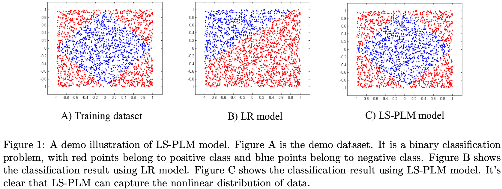
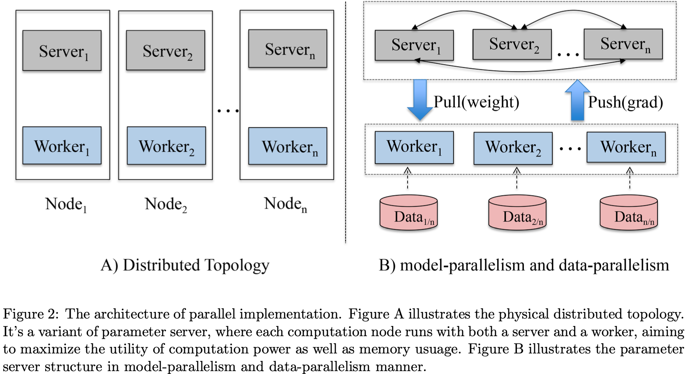
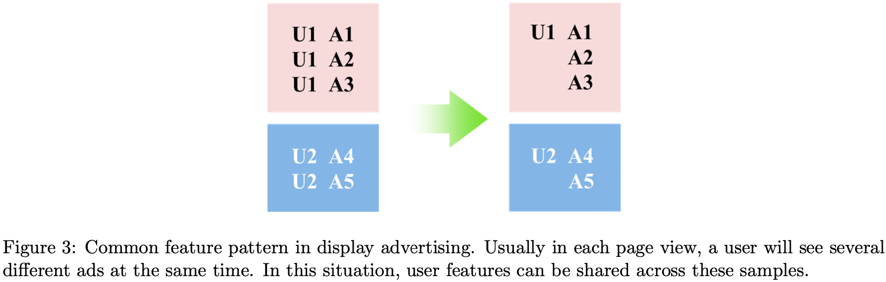
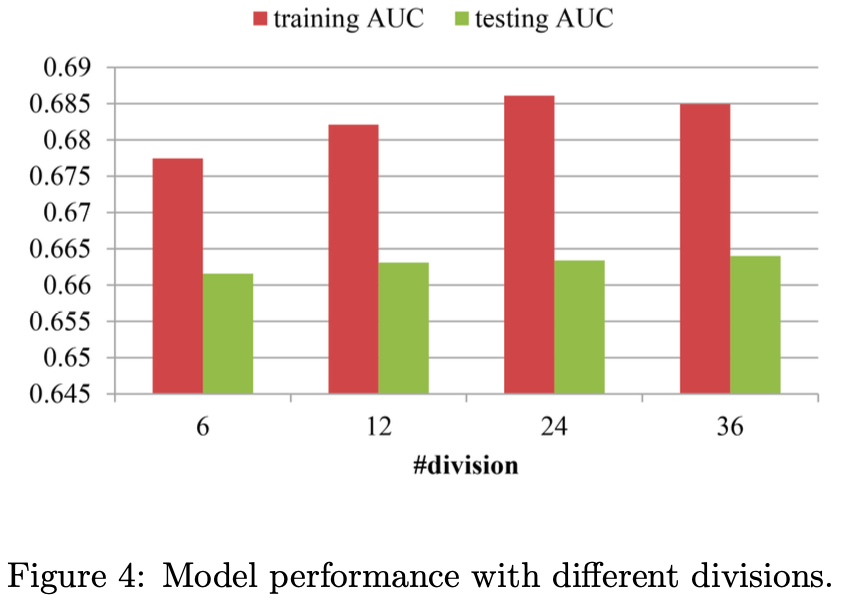
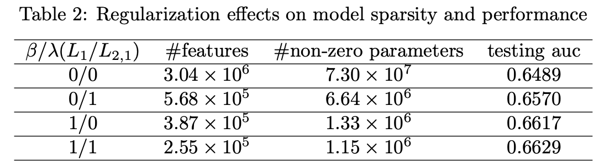
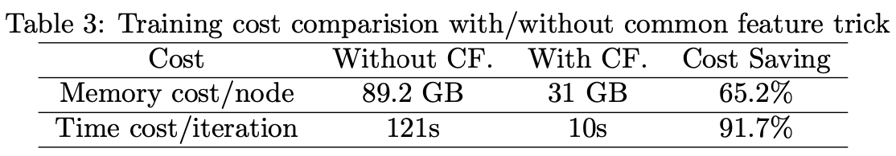
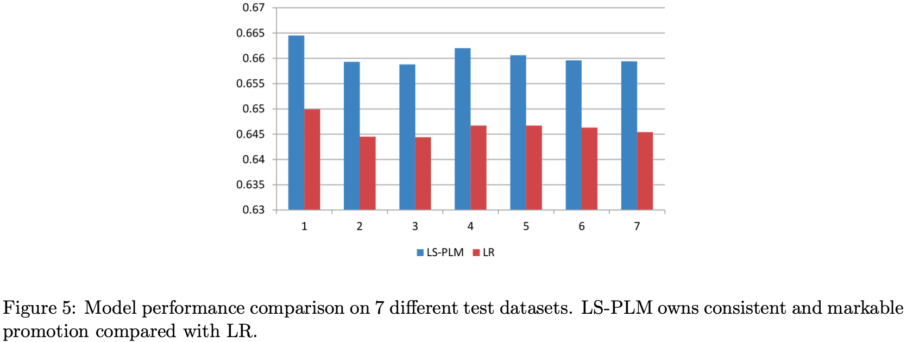

# LS-PLM：从大规模广告点击预测数据中学习分片线性模型（LS-PLM-Learning Piece-wise Linear Models from Large Scale Data for Ad Click Prediction）

> Kun Gai¹, Xiaoqiang Zhu¹, Han Li¹, Kai Liu²†, Zhe Wang³† | ¹ 阿里巴巴集团（† 在阿里巴巴工作期间）

> arXiv:1704.05194v1 [stat.ML] 2017年4月18日

本文提出 **大规模分片线性模型**（LS-PLM），采用 **分而治之策略**，通过将 特征空间 划分为 多个局部区域 并在 **每个区域拟合线性模型** 来捕获 **非线性模式**。针对L1和L2,1正则化导致的**非凸非光滑优化问题**，提出**基于方向导数和拟牛顿法**的高效求解算法，并设计可在数百台机器上并行训练的分布式系统。自2012年起，LS-PLM已成为阿里巴巴在线**展示广告系统**的主要CTR预测模型，每天服务数亿用户。

核心内容：

- 提出LS-PLM分段线性模型，同时学习特征空间的划分和每个区域内的线性预测函数，端到端最小化预测损失
- 针对非凸非光滑目标函数，提出基于方向导数和LBFGS拟牛顿法的高效优化算法
- **设计参数服务器变体的分布式系统**，**融合数据并行与模型并行**，并 **引入公共特征技巧** 大幅降低计算和内存开销

关键发现：

- LS-PLM相比LR在AUC上获得平均1.44%的显著提升，且提升在不同数据集上稳定一致
- L1和L2,1正则化联合使用可获得 **最稀疏的模型结构 和 最佳AUC性能**
- **公共特征技巧** 可减少65.2%内存占用 并 加速91.7%的迭代训练时间

---

## 摘要

真实业务中的CTR预测是一个困难的机器学习问题，涉及大规模非线性稀疏数据。在本文中，我们介绍了一个工业级强度的解决方案，模型名为大规模分段线性模型（LS-PLM）。我们用L1和L2,1正则化项来形式化学习问题，导致了一个非凸且非光滑的优化问题。然后，我们提出了一种新颖的算法，基于方向导数和拟牛顿法来高效求解。此外，我们设计了一个分布式系统，可以在数百台机器上并行运行，为我们提供了工业级的可扩展性。LS-PLM模型可以从海量稀疏数据中捕获非线性模式，使我们 **免于繁重的特征工程工作**。自2012年以来，LS-PLM已成为阿里巴巴在线展示广告系统中的主要CTR预测模型，每天服务数亿用户。

## 1 引言

点击率（CTR）预测是价值数十亿美元的在线广告行业中的核心问题。为了提高CTR预测的准确性，越来越多的数据被引入，使得CTR预测成为一个大规模学习问题，具有海量样本 和 高维特征。

传统解决方案是应用线性逻辑回归（LR）模型，以并行方式进行训练[3, 1]。**带有L1正则化的LR模型可以生成稀疏解，使其 适用于在线快速预测**。不幸的是，CTR预测问题是一个高度非线性问题。特别是，用户点击生成涉及许多复杂因素，如广告质量、上下文信息、用户兴趣，以及这些因素的复杂交互。**为了帮助LR模型捕捉非线性，人们探索了特征工程技术，这既耗时又耗人力**。

另一个方向是通过精心设计的模型来捕捉非线性。Facebook[7]使用了一种混合模型，结合了决策树GBDT 和 逻辑回归LR。决策树扮演**非线性特征变换**的角色，其输出被馈送到LR模型。然而，**基于树的方法不适用于非常稀疏和高维的数据**[12]。文献[10]引入了因子分解机（FM），它使用二阶函数（或使用其他给定阶数的函数）来建模特征之间的交互。然而，FM不能拟合数据中所有一般的非线性模式（如其他高阶模式）。

在本文中，我们提出了一个分段线性模型及其针对大规模数据的训练算法。我们将其命名为大规模分段线性模型（LS-PLM）。LS-PLM遵循分而治之的策略，即首先将特征空间划分为若干局部区域，然后在每个区域中拟合一个线性模型，最终输出为**加权线性预测的组合**。注意，这**两个步骤是以监督方式同时学习**的，旨在最小化预测损失。LS-PLM在以下三个方面对Web规模数据挖掘具有优势：

- **非线性**。通过足够的划分区域，LS-PLM可以拟合任何复杂的非线性函数。
- **可扩展性**。与LR模型类似，LS-PLM对海量样本和高维特征都具有可扩展性。我们设计了一个分布式系统，可以在数百台机器上并行训练模型。在我们的在线产品系统中，每天训练和部署数十个具有数 千万参数 的LS-PLM模型。
- **稀疏性**。如[3]所指出的，模型稀疏性是工业环境中在线服务的一个实际问题。我们展示了带有L1和L2,1正则化器的LS-PLM可以实现良好的稀疏性。

**带有稀疏正则化器的LS-PLM的学习可以转化为一个非凸且非可微的优化问题，这很难求解**。我们提出了一种针对此类问题的高效优化方法，基于方向导数和拟牛顿法。由于能够捕获非线性模式并且可扩展到大规模数据，LS-PLM自2012年初以来已成为阿里巴巴在线展示广告系统中的主要CTR预测模型，每天服务数亿用户。它也被应用于推荐系统、搜索引擎和其他产品系统中。

本文的结构如下。在第2节中，我们详细介绍LS-PLM模型，包括公式化、正则化和优化问题。在第3节中，我们介绍并行实现结构。在第4节中，我们仔细评估模型并展示LS-PLM相比LR的优势。最后在第5节中，我们给出结论。

> **图1：** LS-PLM模型的演示说明。图A是演示数据集。这是一个二分类问题，红点属于正类，蓝点属于负类。图B显示了使用LR模型的分类结果。图C显示了使用LS-PLM模型的分类结果。很明显，LS-PLM可以捕获数据的非线性分布。

## 2 方法

我们关注大规模CTR预测应用。这是一个二分类问题，数据集为 $\{\mathbf{x}_t, y_t\}_{t=1}^n$ 。 $y_t \in \{0, 1\}$ ， $\mathbf{x}_t \in \mathbb{R}^d$ 通常是**高维且稀疏的。**

### 2.1 公式化

为了对大规模数据的非线性进行建模，我们采用了**分而治之的策略**，类似于[8]。我们将整个特征空间划分为一些局部区域。对于每个区域，我们采用一个独立的广义线性分类模型。通过这种方式，我们 **用分段线性模型来处理非线性**。我们的模型如下：

$$
p(y = 1|\mathbf{x}) = g\left(\sum_{j=1}^m \sigma(\mathbf{u}_j^\top \mathbf{x})\eta(\mathbf{w}_j^\top \mathbf{x})\right) \qquad (1)
$$

这里 $\mathbf{\Theta} = \{\mathbf{u}_1, \cdots, \mathbf{u}_m, \mathbf{w}_1, \cdots, \mathbf{w}_m\} \in \mathbb{R}^{d \times 2m}$ 表示模型参数。 $\{\mathbf{u}_1, \cdots, \mathbf{u}_m\}$ 是**划分函数** $\sigma(\cdot)$ 的参数， $\{\mathbf{w}_1, \cdots, \mathbf{w}_m\}$ 是**拟合函数** $\eta(\cdot)$ 的参数。给定实例 $\mathbf{x}$ ，我们的预测模型 $p(y|\mathbf{x})$ 由两部分组成：第一部分 $\sigma(\mathbf{u}_j^\top \mathbf{x})$ 将特征空间划分为 $m$ 个（超参数）不同区域，第二部分 $\eta(\mathbf{w}_j^\top \mathbf{x})$ 在每个区域给出预测。函数 $g(\cdot)$ **确保我们的模型满足概率函数的定义**。

**特例。** 以softmax[9]作为划分函数 $\sigma(x)$ ，sigmoid[6]作为拟合函数 $\eta(x)$ ，且 $g(x) = x$ ，我们得到一个具体的公式：

$$
p(y = 1|\mathbf{x}) = \sum_{i=1}^m \frac{\exp(\mathbf{u}_i^\top \mathbf{x})}{\sum_{j=1}^m \exp(\mathbf{u}_j^\top \mathbf{x})} \cdot \frac{1}{1 + \exp(-\mathbf{w}_i^\top \mathbf{x})} \qquad (2)
$$

在这种情况下，我们的混合模型可以看作是一个FOE模型[8, 13]，如下所示：

$$
p(y = 1|\mathbf{x}) = \sum_{i=1}^m p(z = i|\mathbf{x})p(y|z = i, \mathbf{x}) \qquad (3)
$$

等式(2)是我们实际应用中最常用的公式。在本文的其余部分，除非特别声明，我们采用等式(2)作为我们的预测模型。图1在一个演示数据集中展示了该模型与LR的对比，清楚地显示了LS-PLM可以捕获数据的非线性模式。

LS-PLM模型的目标函数形式化为等式(4)：

$$
\arg\min_{\mathbf{\Theta}} f(\mathbf{\Theta}) = \text{loss}(\mathbf{\Theta}) + \lambda\|\mathbf{\Theta}\|_{2,1} + \beta\|\mathbf{\Theta}\|_1 \qquad (4)
$$

$$
\text{loss}(\mathbf{\Theta}) = -\sum_{t=1}^n \left[ y_t \log(p(y_t = 1|\mathbf{x}_t, \mathbf{\Theta})) + (1 - y_t) \log(p(y_t = 0|\mathbf{x}_t, \mathbf{\Theta})) \right] \qquad (5)
$$

这里 $\text{loss}(\mathbf{\Theta})$ 在等式(5)中定义为**负似然损失函数**，而 $\|\mathbf{\Theta}\|_{2,1}$ 和 $\|\mathbf{\Theta}\|_1$ 是两个提供**不同属性的正则化项**。首先，L2,1正则化（ $\|\mathbf{\Theta}\|_{2,1} = \sum_{i=1}^d \sqrt{\sum_{j=1}^{2m} \theta_{ij}^2}$ ）**用于特征选择**。在我们的模型中，**特征的每个维度与 $2m$ 个参数相关联**。**L2,1正则化期望将特征一个维度的所有 $2m$ 个参数推为零**，即抑制那些不太重要的特征。其次，L1正则化（ $\|\mathbf{\Theta}\|_1 = \sum_{ij} |\theta_{ij}|$ ）用于稀疏性。除特征选择属性外，L1正则化还可以**强制剩余特征的参数尽可能为零**，这有助于提高模型的可解释性和泛化性能。

然而，L1范数和L2,1范数都是**非光滑函数**。这导致等式(4)的目标函数是非凸且非光滑的，使得难以采用那些传统的梯度下降优化方法[1, 14, 2] 或 EM方法[13]。

注意，虽然[13]给出了与等式(3)相同的混合模型公式，但**我们的模型更加通用**，可以采用不同类型的预测函数。此外，我们针对大规模工业数据提出了不同的目标函数，明确考虑了**特征稀疏性**。这对实际应用至关重要，**因为预测速度和内存使用是在线模型服务的两个关键指标**。此外，我们给出了一种更高效的优化方法来解决大规模非凸问题，这将在下一节中描述。

### 2.2 优化

在介绍我们的优化方法之前，我们建立一些将在本文后续部分使用的符号和定义。令 $\partial_{ij}^+ f(\mathbf{\Theta})$ 表示 $f$ 在 $\mathbf{\Theta}$ 处关于 $\Theta_{ij}$ 的右偏导数：

$$
\partial_{ij}^+ f(\mathbf{\Theta}) = \lim_{\alpha \downarrow 0} \frac{f(\mathbf{\Theta} + \alpha \mathbf{e}_{ij}) - f(\mathbf{\Theta})}{\alpha} \qquad (6)
$$

其中 $\mathbf{e}_{ij}$ 是第 $ij$ 个标准基向量。 $f$ 在 $\mathbf{\Theta}$ 处沿方向 $\mathbf{d}$ 的方向导数记为 $f'(\mathbf{\Theta}; \mathbf{d})$ ，定义为：

$$
f'(\mathbf{\Theta}; \mathbf{d}) = \lim_{\alpha \downarrow 0} \frac{f(\mathbf{\Theta} + \alpha \mathbf{d}) - f(\mathbf{\Theta})}{\alpha} \qquad (7)
$$

如果 $f'(\mathbf{\Theta}; \mathbf{d}) < 0$ ，则向量 $\mathbf{d}$ 被视为**下降方向**。 $\text{sign}(\cdot)$ 是符号函数，取值 $\{-1, 0, 1\}$ 。投影函数

$$
\pi_{ij}(\mathbf{\Theta}; \mathbf{\Omega}) = \begin{cases} \Theta_{ij}, & \text{sign}(\Theta_{ij}) = \text{sign}(\Omega_{ij}) \\ 0, & \text{otherwise} \end{cases} \qquad (8)
$$

表示**将 $\mathbf{\Theta}$ 投影到由 $\mathbf{\Omega}$ 定义的正交区域上**。

#### 2.2.1 选择下降方向

如上所述，我们用于大规模CTR预测问题的目标函数既是**非凸的又是非光滑的**。这里我们提出一种通用且高效的优化方法来解决这类非凸问题。**由于目标函数的负梯度并非对所有 $\mathbf{\Theta}$ 都存在，我们取使 $f$ 在 $\mathbf{\Theta}$ 处的方向导数最小的方向 $\mathbf{d}$ 作为替代**。方向导数 $f'(\mathbf{\Theta}; \mathbf{d})$ 对任意 $\mathbf{\Theta}$ 和方向 $\mathbf{d}$ 都存在，如引理1所述。

**引理1.** 当一个目标函数 $f(\mathbf{\Theta})$ 由光滑损失函数与L1和L2,1范数组成时，例如等式(4)中给出的目标函数，方向导数 $f'(\mathbf{\Theta}; \mathbf{d})$ 对任意 $\mathbf{\Theta}$ 和方向 $\mathbf{d}$ 都存在。

我们将证明留在附录A中。由于方向导数 $f'(\mathbf{\Theta}; \mathbf{d})$ 总是存在，当 $f(\mathbf{\Theta})$ 的负梯度不存在时，我们选择使方向导数 $f'(\mathbf{\Theta}; \mathbf{d})$ 最小的方向作为下降方向。以下命题2明确给出了该方向。

**命题2.** 给定光滑损失函数 $\text{loss}(\mathbf{\Theta})$ 和目标函数 $f(\mathbf{\Theta}) = \text{loss}(\mathbf{\Theta}) + \lambda\|\mathbf{\Theta}\|_{2,1} + \beta\|\mathbf{\Theta}\|_1$ ，使方向导数 $f'(\mathbf{\Theta}; \mathbf{d})$ 最小的有界方向 $\mathbf{d}$ 表示如下：

$$
d_{ij} =
\begin{cases}
s - \beta \cdot \text{sign}(\Theta_{ij}), & \Theta_{ij} \neq 0 \\[4pt]
\max\{|s| - \beta, 0\} \cdot \text{sign}(s), & \Theta_{ij} = 0,\ \|\Theta_{i\cdot}\|_{2,1} \neq 0 \\[4pt]
\displaystyle \frac{\max\{\|\mathbf{v}\|_{2,1} - \lambda, 0\}}{\|\mathbf{v}\|_{2,1}} \mathbf{v}, & \|\Theta_{i\cdot}\|_{2,1} = 0
\end{cases} \qquad (9)
$$

其中 $s = -\nabla \text{loss}(\mathbf{\Theta})_{ij} - \lambda \frac{\Theta_{ij}}{\|\Theta_{i\cdot}\|_{2,1}}$ ， $\mathbf{v} = \max\{|-\nabla \text{loss}(\mathbf{\Theta})_{ij}| - \beta, 0\} \cdot \text{sign}(-\nabla \text{loss}(\mathbf{\Theta})_{ij})$ 。

更多关于证明的细节可以在附录B中找到。根据证明，我们可以看到Gao的工作[1]中定义的**负伪梯度是我们下降方向的一个特例**。我们提出的方法对于寻找那些非光滑和非凸目标函数的下降方向**更加通用**。

基于等式(9)中的方向 $\mathbf{d}^{(k)}$ ，我们沿由**有限记忆拟牛顿法**（L-BFGS）[13]计算的下降方向更新模型参数，该方法**在给定的正交区域上近似等式(4)的逆Hessian矩阵**。受OWL-QN方法[1]的启发，我们还限制模型参数的符号在每次迭代中不改变。给定选择的方向 $\mathbf{d}^{(k)}$ 和旧的 $\mathbf{\Theta}^{(k)}$ ，我们将当前迭代的**正交区域约束**如下：

$$
\xi_{ij}^{(k)} =
\begin{cases}
\text{sign}(\Theta_{ij}^{(k)}), & \Theta_{ij}^{(k)} \neq 0 \\
\text{sign}(d_{ij}^{(k)}), & \Theta_{ij}^{(k)} = 0
\end{cases} \qquad (10)
$$

当 $\Theta_{ij}^{(k)} \neq 0$ 时，新的 $\Theta_{ij}$ 在当前迭代中不会改变符号。当 $\Theta_{ij}^{(k)} = 0$ 时，我们为由所选方向 $d_{ij}^{(k)}$ 决定的正交区域选择新 $\Theta_{ij}^{(k)}$ 的符号。

#### 2.2.2 更新方向约束和线搜索

给定下降方向 $\mathbf{d}^{(k)}$ ，我们使用一系列 $\mathbf{y}^{(k)}, \mathbf{s}^{(k)}$ 通过L-BFGS方法近似 逆Hessian矩阵 $\mathbf{H}_k$ 。然后最终的更新方向是 $\mathbf{H}_k \mathbf{d}^{(k)}$ 。这里我们给出两个技巧来调整更新方向。首先，我们将更新方向约束在关于 $\mathbf{d}^{(k)}$ 的正交区域内。其次，由于我们的目标函数是非凸的，我们不能保证 $\mathbf{H}_k$ 是正定的。我们使用 $(\mathbf{y}^{(k)})^\top \mathbf{s}^{(k)} > 0$ 作为条件来确保 $\mathbf{H}_k$ 是正定矩阵。如果 $(\mathbf{y}^{(k)})^\top \mathbf{s}^{(k)} \leq 0$ ，我们切换到 $\mathbf{d}^{(k)}$ 作为更新方向。最终更新方向 $\mathbf{p}^{(k)}$ 定义如下：

$$
\mathbf{p}^{(k)} =
\begin{cases}
\pi(\mathbf{H}_k \mathbf{d}^{(k)}; \mathbf{d}^{(k)}), & (\mathbf{y}^{(k)})^\top \mathbf{s}^{(k)} > 0 \\
\mathbf{d}^{(k)}, & \text{otherwise}
\end{cases} \qquad (11)
$$

给定更新方向，我们使用**回溯线搜索**来找到合适的步长 $\alpha$ 。与OWL-QN相同，我们将新的 $\mathbf{\Theta}^{(k+1)}$ 投影到由等式(10)决定的给定正交区域上。

$$
\mathbf{\Theta}^{(k+1)} = \pi(\mathbf{\Theta}^{(k)} + \alpha \mathbf{p}^{(k)}; \xi^{(k)}) \qquad (12)
$$

### 2.3 算法

优化的伪代码描述在算法1中给出。实际上，**只有标准L-BFGS算法的少数步骤需要更改**。这些修改是：

1. 使用使非凸目标方向导数最小的方向 $\mathbf{d}^{(k)}$ 替代负梯度。
2. 更新方向被约束到由所选方向 $\mathbf{d}^{(k)}$ 定义的给定正交区域。当 $\mathbf{H}_k$ 不是正定时切换到 $\mathbf{d}^{(k)}$ 。
3. 在线搜索期间，每个搜索点被投影到前一个点的正交区域上。

**算法1**：求解优化问题等式(4)
$$
\begin{aligned}
& \textbf{输入：} \text{选择初始点 } \mathbf{\Theta}^{(0)} \\
& \mathbf{S} \leftarrow \{\},\ \mathbf{Y} \leftarrow \{\} \\
& \textbf{for } k = 0 \textbf{ to } MaxIters \textbf{ do} \\
& \quad 1.\ \text{使用等式(9)计算 } \mathbf{d}^{(k)} \\
& \quad 2.\ \text{使用 } \mathbf{S} \text{ 和 } \mathbf{Y} \text{ 通过等式(11)计算 } \mathbf{p}^{(k)} \\
& \quad 3.\ \text{使用约束线搜索(12)找到 } \mathbf{\Theta}^{(k+1)} \\
& \quad 4.\ \textbf{if } \text{满足终止条件} \textbf{ then } \text{停止并返回 } \mathbf{\Theta}^{(k+1)} \\
& \quad 5.\ \text{用 } \mathbf{s}^{(k)} = \mathbf{\Theta}^{(k)} - \mathbf{\Theta}^{(k-1)} \text{ 更新 } \mathbf{S} \\
& \quad 6.\ \text{用 } \mathbf{y}^{(k)} = -\mathbf{d}^{(k)} - (-\mathbf{d}^{(k-1)}) \text{ 更新 } \mathbf{Y} \\
& \textbf{end for}
\end{aligned}
$$

## 3 实现

在本节中，我们首先提供LS-PLM模型**面向大规模数据的并行实现**，然后介绍一个有助于**大幅加速训练过程的重要技巧**。

> **图2：** 并行实现的架构。图A展示了物理分布式拓扑。它是**参数服务器的一个变体**，其中每个计算节点同时运行服务器和工作者，旨在最大化计算能力和内存使用的效用。图B展示了以模型并行和数据并行方式的参数服务器结构。

### 3.1 并行实现

为了在大规模环境中应用算法1，我们使用分布式学习框架实现它，如图2所示。它是参数服务器的一个变体。在我们的实现中，每个计算节点同时运行一个服务器节点和一个工作者节点，旨在：

- **最大化CPU计算能力的效用。** 在传统的参数服务器设置中，ps节点作为分布式KV存储器工作，具有push和pull操作接口，计算成本低。与woerk节点一起运行可以充分利用计算能力。
- **最大化内存的效用。** 今天的机器通常有很大的内存，例如128GB。在同一计算节点上运行，ps节点和worker节点可以更好地共享和利用大内存。

简而言之，框架中有两个角色。第一个角色是worker节点。每个节点存储一部分训练数据和一个本地模型，**该模型仅保存用于本地训练数据的模型参数**。第二个角色是ps节点。每个节点存储**全局模型的一部分**，这些部分是互斥的。在每次迭代中，所有worker节点首先使用本地模型和本地数据并行计算损失和下降方向（数据并行）。然后ps节点聚合损失和方向 $\mathbf{d}^{(k)}$ 以及计算修正梯度所需的 $\mathbf{\Theta}$ 的相应条目（模型并行）。在完成步骤1中最陡下降方向的计算后，worker同步 $\mathbf{\Theta}$ 的相应条目，然后在本地执行步骤2–6。

> [!NOTE]
>
> 没有太看懂

### 3.2 公共特征技巧

> **图3：** 展示广告中的公共特征模式。通常在每次页面浏览中，用户会同时看到几个不同的广告。在这种情况下，用户特征可以在这些样本之间共享。

除了通用的并行实现之外，我们还在在线广告上下文中优化了实现。CTR预测任务中的训练样本通常具有类似的公共特征模式。以展示广告为例，如图3所示，在每次页面浏览期间，用户将同时看到几个不同的广告。例如，图3中的用户U1在一次访问会话中看到三个广告，从而生成三个样本。在这种情况下，用户U1的特征可以在这三个样本之间共享。这些特征包括用户画像（性别、年龄等）以及用户在阿里巴巴电子商务网站**访问期间的行为历史**，例如，他/她的购物商品ID、偏好的品牌或喜欢的店铺ID。

回顾等式2中定义的模型，大部分计算成本集中在 $\mathbf{u}_i^\top \mathbf{x}$ 和 $\mathbf{w}_i^\top \mathbf{x}$ 上。通过采用公共特征技巧，我们可以**将计算分为公共部分和非公共部分**，并将其重写如下：

$$
\mathbf{u}_i^\top \mathbf{x} = \mathbf{u}_{i,c}^\top \mathbf{x}_c + \mathbf{u}_{i,nc}^\top \mathbf{x}_{nc}
$$

$$
\mathbf{w}_i^\top \mathbf{x} = \mathbf{w}_{i,c}^\top \mathbf{x}_c + \mathbf{w}_{i,nc}^\top \mathbf{x}_{nc} \qquad (13)
$$

因此，对于公共特征部分，我们只需要计算一次，然后索引结果，供后续样本使用。

具体来说，我们通过公共特征技巧在以下三个方面优化了并行实现：

- 将具有公共特征的训练样本分组，并确保这些样本存储在同一worker中。
- 通过仅存储一次多个样本共享的公共特征来节省内存。
- 通过对公共特征仅更新一次损失和梯度来加快迭代速度。

由于我们生产数据的公共特征模式，**采用公共特征技巧**极大地提升了训练过程的性能，这将在下面的4.3节中展示。

## 4 实验

在本节中，我们评估LS-PLM的性能。我们的数据集来自阿里巴巴的**移动展示广告产品系统**。如表1所示，我们收集了连续时间段内的七个数据集，**旨在评估所提模型的一致性性能**，这对于在线产品服务非常重要。在每个数据集中，训练/验证/测试样本从不同日期分别收集，比例约为**7:1:1**。使用AUC[4]指标来评估模型性能。

> **表1：** 阿里巴巴移动展示广告CTR预测数据集

### 4.1 划分数量的有效性

LS-PLM是一个分段线性模型，划分数量 $m$ 控制模型容量。我们评估划分对模型性能的有效性。实验在数据集1上执行，结果显示在图4中。

一般来说， $m$ 越大意味着参数越多，从而带来更大的模型容量。但训练成本也会增加，包括时间和内存。因此，在实际应用中，我们必须在模型性能和训练成本之间取得平衡。

> **图4：** 不同划分下的模型性能。

图4显示了不同划分数量 $m$ 下的训练和测试AUC。我们尝试了 $m = 6, 12, 24, 36$ ， $m = 12$ 的测试AUC明显优于 $m = 6$ ，而 $m = 24, 36$ 的改进相对平缓。因此，在所有后续实验中，LS-PLM模型的参数 $m$ 设置为12。

### 4.2 正则化的有效性

如第2节所述，为了使模型更简单且更具泛化能力，我们倾向于通过 $L1$ 和 $L2,1$ 范数来约束模型参数的稀疏性。这里我们评估两个正则化项的强度。

表2给出了结果。如预期，$L1$ 和 $L2,1$范数都能推动我们的模型变得稀疏。使用 $L2,1$范数训练的模型仅剩下9.4%的非零参数，保留了18.7%的特征。而在L1范数的情况下，仅剩下1.9%的非零参数。将两者结合，我们得到最稀疏的结果。同时，使用不同范数训练的模型获得了不同的AUC性能。将两个范数再次结合（1.57%非零参数），模型达到了最佳的AUC性能。

> **表2：** 正则化对模型稀疏性和性能的影响

在这个实验中，超参数 $m$ 设置为12。参数 $\beta$ 和 $\lambda$ 通过网格搜索选择。对两个范数在所有情况下都尝试了 $\{0.01, 0.1, 1, 10\}$ 。 $\beta = 1$ 和 $\lambda = 1$ 的模型表现最好。

### 4.3 公共特征技巧的有效性

我们证明了公共特征技巧的有效性。具体来说，我们用100个worker节点进行实验，每个节点使用**12个CPU核心**，总计最多110 GB内存。如表3所示，使用公共特征技巧压缩实例不会影响特征空间的实际维度。然而，在实践中，与不使用公共特征技巧的训练相比，我们可以显著减少内存使用（减少到约1/3）并加速计算（大约快12倍）。

> **表3：** 有无公共特征技巧的训练成本对比

### 4.4 与LR的对比

我们现在将LS-PLM与LR（产品设置中广泛使用的CTR预测模型）进行比较。这两个模型都使用我们的分布式实现架构进行训练，运行数百台机器以加速。LS-PLM的 $L1$ 和 $L2,1$ 参数以及LR的 $L1$ 参数的选择基于网格搜索。尝试了 $\beta = 0.01, 0.1, 1, 10$ 和 $\lambda = 0.01, 0.1, 1, 10$ 。LS-PLM的最佳参数是 $\beta = 1$ 和 $\lambda = 1$ ，LR的最佳参数是 $\beta = 1$ 。

如图5所示，LS-PLM明显优于LR。相对LR的AUC平均提升为**1.44%**，这对整个在线广告系统的性能有显著影响。此外，该提升是稳定的。这确保了LS-PLM可以安全地部署到日常在线生产系统中。

> **图5：** 在7个不同测试数据集上的模型性能对比。LS-PLM相比LR具有一致且显著的提升。

## 5 结论

在本文中，提出了一种用于CTR预测问题的分段线性模型LS-PLM。它可以**从稀疏数据中捕获非线性模式**，使我们免于繁重的特征工程工作，这对实际工业应用至关重要。此外，通过我们的分布式和优化实现，我们的算法可以处理具有 数千万参数 的 数十亿样本 的问题，这是典型的工业数据量。利用L1和L2,1的正则化项来**保持模型稀疏**。自2012年以来，LS-PLM已成为阿里巴巴在线展示广告系统中的主要CTR预测模型，每天服务数亿用户。

## 致谢

我们感谢 Xingya Dai  和 Yanghui Yan 对本工作的帮助。

## 附录

### A 引理2.1的证明

**证明：** $f'(\mathbf{\Theta}; \mathbf{d})$ 的定义如下：

$$
f'(\mathbf{\Theta}; \mathbf{d}) = \lim_{\alpha \downarrow 0} \frac{f(\mathbf{\Theta} + \alpha \mathbf{d}) - f(\mathbf{\Theta})}{\alpha} \qquad (14)
$$

$$
= \lim_{\alpha \downarrow 0} \frac{\text{loss}(\mathbf{\Theta} + \alpha \mathbf{d}) - \text{loss}(\mathbf{\Theta})}{\alpha} + \lim_{\alpha \downarrow 0} \lambda \frac{\|\mathbf{\Theta} + \alpha \mathbf{d}\|_{2,1} - \|\mathbf{\Theta}\|_{2,1}}{\alpha} + \lim_{\alpha \downarrow 0} \beta \frac{\|\mathbf{\Theta} + \alpha \mathbf{d}\|_1 - \|\mathbf{\Theta}\|_1}{\alpha}
$$

由于损失函数的梯度对任意 $\mathbf{\Theta}$ 存在，第一部分的导数为：

$$
\lim_{\alpha \downarrow 0} \frac{\text{loss}(\mathbf{\Theta} + \alpha \mathbf{d}) - \text{loss}(\mathbf{\Theta})}{\alpha} = \nabla \text{loss}(\mathbf{\Theta})^\top \mathbf{d} \qquad (15)
$$

对于第二部分，我们知道如果 $\|\Theta_{i\cdot}\|_{2,1} \neq 0$ ，L2,1范数的偏导数存在。所以方向导数是：

$$
\lim_{\alpha \downarrow 0} \lambda \frac{\|\Theta_{i\cdot} + \alpha d_{i\cdot}\|_{2,1} - \|\Theta_{i\cdot}\|_{2,1}}{\alpha} = \lambda \frac{\Theta_{i\cdot}^\top d_{i\cdot}}{\|\Theta_{i\cdot}\|_{2,1}} \qquad (16)
$$

然而，当 $\|\Theta_{i\cdot}\|_{2,1} = 0$ 时，意味着 $\Theta_{ij} = 0, 1 \leq j \leq 2m$ 。那么它的方向导数可以表示如下：

$$
\lim_{\alpha \downarrow 0} \lambda \frac{\|\Theta_{i\cdot} + \alpha d_{i\cdot}\|_{2,1} - \|\Theta_{i\cdot}\|_{2,1}}{\alpha} = \lim_{\alpha \downarrow 0} \lambda \frac{\|\alpha d_{i\cdot}\|_{2,1}}{\alpha} = \lambda \|d_{i\cdot}\|_{2,1} \qquad (17)
$$

所以结合上述等式(16)和(17)中的情况，我们得到第二部分的方向导数：

$$
\lim_{\alpha \downarrow 0} \lambda \frac{\|\mathbf{\Theta} + \alpha \mathbf{d}\|_{2,1} - \|\mathbf{\Theta}\|_{2,1}}{\alpha} = \sum_{\|\Theta_{i\cdot}\|_{2,1} \neq 0} \lambda \frac{\Theta_{i\cdot}^\top d_{i\cdot}}{\|\Theta_{i\cdot}\|_{2,1}} + \sum_{\|\Theta_{i\cdot}\|_{2,1} = 0} \lambda \|d_{i\cdot}\|_{2,1} \qquad (18)
$$

与第二部分相同，第三部分的方向导数是：

$$
\lim_{\alpha \downarrow 0} \beta \frac{\|\mathbf{\Theta} + \alpha \mathbf{d}\|_1 - \|\mathbf{\Theta}\|_1}{\alpha} = \sum_{\|\Theta_{ij}\|_1 \neq 0} \beta \cdot \text{sign}(\Theta_{ij}) d_{ij} + \sum_{\|\Theta_{ij}\|_1 = 0} \beta |d_{ij}| \qquad (19)
$$

基于等式(15)、(18)和(19)，我们得到对于任意 $\mathbf{\Theta}$ 和方向 $\mathbf{d}$ ， $f'(\mathbf{\Theta}; \mathbf{d})$ 存在。

### B 命题2.2的证明

**证明：** 寻找期望方向转化为一个优化问题，形式化如下：

$$
\min_{\mathbf{d}} f'(\mathbf{\Theta}; \mathbf{d}) \quad \text{s.t.} \quad \|\mathbf{d}\|_2 \leq C \qquad (20)
$$

这里方向 $\mathbf{d}$ 由常数标量 $C$ 限定。为解决这个问题，我们使用拉格朗日函数将目标函数和不等式函数结合起来：

$$
\mathcal{L}(\mathbf{d}, \mu) = f'(\mathbf{\Theta}; \mathbf{d}) + \mu(\|\mathbf{d}\|_2 - C) \qquad (21)
$$

这里 $\mu \geq 0$ 是拉格朗日乘子。将 $\mathcal{L}(\mathbf{d}, \mu)$ 对 $\mathbf{d}$ 的偏导数设为零，有三种情况。

定义 $s = -\nabla \text{loss}(\mathbf{\Theta})_{ij} - \lambda \frac{\Theta_{ij}}{\|\Theta_{i\cdot}\|_{2,1}}$ 。

**a.** 当 $\Theta_{ij} \neq 0$ 时，意味着

$$
2\mu d_{ij} = s - \beta \cdot \text{sign}(\Theta_{ij})
$$

**b.** 当 $\Theta_{ij} = 0$ 且 $\|\Theta_{i\cdot}\|_{2,1} > 0$ 时，容易得到

$$
2\mu d_{ij} = \max\{|s| - \beta, 0\} \cdot \text{sign}(s)
$$

**c.** 当 $\Theta_{ij} = 0$ 且 $\|\Theta_{i\cdot}\|_{2,1} = 0$ 时，我们给出更多细节。对于 $d_{i\cdot}$ 有

$$
\frac{\partial \mathcal{L}(\mathbf{d}, \mu)}{\partial d_{i\cdot}} = \nabla \text{loss}(\mathbf{\Theta})_{i\cdot} + \beta \cdot \text{sign}(d_{i\cdot}) + \lambda \frac{d_{i\cdot}}{\|d_{i\cdot}\|_{2,1}} + 2\mu d_{i\cdot} = 0
$$

这里我们简单使用 $\text{sign}(d_{i\cdot}) = [\text{sign}(d_{i1}), \ldots, \text{sign}(d_{i,2m})]^\top$ 。然后我们得到

$$
\left(2\mu + \frac{\lambda}{\|d_{i\cdot}\|_{2,1}}\right) d_{i\cdot} = -\nabla \text{loss}(\mathbf{\Theta})_{i\cdot} - \beta \cdot \text{sign}(d_{i\cdot})
$$

这意味着 $\text{sign}(d_{i\cdot}) = \text{sign}(-\nabla \text{loss}(\mathbf{\Theta})_{i\cdot} - \beta \cdot \text{sign}(d_{i\cdot}))$ 。当 $d_{ij} \geq 0$ 时，意味着 $-\nabla \text{loss}(\mathbf{\Theta})_{ij} - \beta \cdot \text{sign}(d_{ij}) \geq 0$ 。反过来，当 $d_{ij} \leq 0$ 时，我们有 $-\nabla \text{loss}(\mathbf{\Theta})_{ij} - \beta \cdot \text{sign}(d_{ij}) \leq 0$ 。所以我们定义 $\mathbf{v} = -\nabla \text{loss}(\mathbf{\Theta})_{i\cdot} - \beta \cdot \text{sign}(d_{i\cdot})$ 且 $v_j = \max\{|-\nabla \text{loss}(\mathbf{\Theta})_{ij}| - \beta, 0\} \cdot \text{sign}(-\nabla \text{loss}(\mathbf{\Theta})_{ij})$ 。所以

$$
\left(2\mu + \frac{\lambda}{\|d_{i\cdot}\|_{2,1}}\right) d_{i\cdot} = \mathbf{v}
$$

$$
\Rightarrow (2\mu \|d_{i\cdot}\| + \lambda) \|d_{i\cdot}\| = \|\mathbf{v}\| \|d_{i\cdot}\|
$$

$$
\Rightarrow 2\mu \|d_{i\cdot}\| + \lambda = \|\mathbf{v}\| \qquad (22)
$$

由于 $\|d_{i\cdot}\| \geq 0$ ，我们有 $2\mu \|d_{i\cdot}\| = \max(\|\mathbf{v}\| - \lambda, 0)$ 。因此

$$
2\mu d_{ij} = \frac{\max(\|\mathbf{v}\| - \lambda, 0)}{\|\mathbf{v}\|} v
$$

拉格朗日乘子 $\mu$ 是一个标量，对所有 $d_{ij}$ 有相同的影响。我们可以看到，由 $C$ 界定的最优方向与我们在等式(9)中定义的、不考虑常数标量 $\mu$ 的方向相同。至此我们完成证明。

## 参考文献

[1] Andrew G. and Gao J. (2007) **Scalable Training of L1-Regularized Log-Linear Models**. *Proceedings of the 24-th International Conference on Machine Learning*.

[2] Bertsekas, D. (2003) Nonlinear Programming. Springer US, 51–88.

**[3] Brendan H., Holt G., Sculley D., Young M., Ebner D., Grady J., Nie L., Phillips T., Davydov E., Golovin D., Chikkerur S., Liu D., Wattenberg M., Hrafnkelsson A., Boulos T., Kubica J. (2013) Ad Click Prediction: a View from the Trenches. *Proceedings of the 19-th KDD*.**

[4] Fawcett T. (2006) An introduction to ROC analysis. *Pattern Recognition Letters*, 27, 861–874.

[5] Friedman J. (1999) Greedy Function Approximation: A Gradient Boosting Machine. Technical Report, Dept. of Statistics, Stanford University.

[6] Hilbe M. (2009) Logistic regression models. CRC Press.

**[7] He X., Pan J., Jin O., Xu T., Liu B., Xu T., Shi Y., Atallah A., Herbrich R., Bowers S., Candela J. (2014) Practical Lessons from Predicting Clicks on Ads at Facebook. *Proceedings of the 20-th KDD*.**

[8] Jordan I., Jacobs A. (1994) **Hierarchical mixtures of experts and the EM algorithm**. *Neural computation*, 6(2): 181-214.

[9] Kivinen J., Warmuth M. K. (1998) Relative Loss Bounds for Multidimensional Regression Problems. *Machine Learning*, 45(3):301-329.

[10] Rendle S. (2010) Factorization Machines. *Proceedings of the 10th IEEE International Conference on Data Mining*.

[11] Roth S., Black M. J. (2009) Fields of experts. *International Journal of Computer Vision*, 82(2): 205–229.

[12] Safavian S. R., Landgrebe D. (1990) A survey of decision tree classifier methodology[J].

[13] Wang P.-M., Puterman M. (1998) **Mixed Logistic Regression Models**. *Journal of Agricultural, Biological, and Environmental Statistics*, 3(2), 175–200.

[14] Zhang T. (2004) **Solving large scale linear prediction problems using stochastic gradient descent algorithms**. *Proceedings of the twenty-first international conference on Machine learning*. ACM, 116.

[15] Gai K. http://club.alibabatech.org/resource_detail.htm?topicId=106
