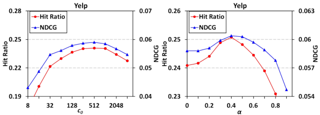
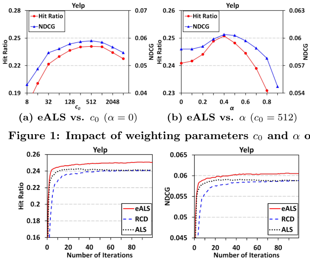
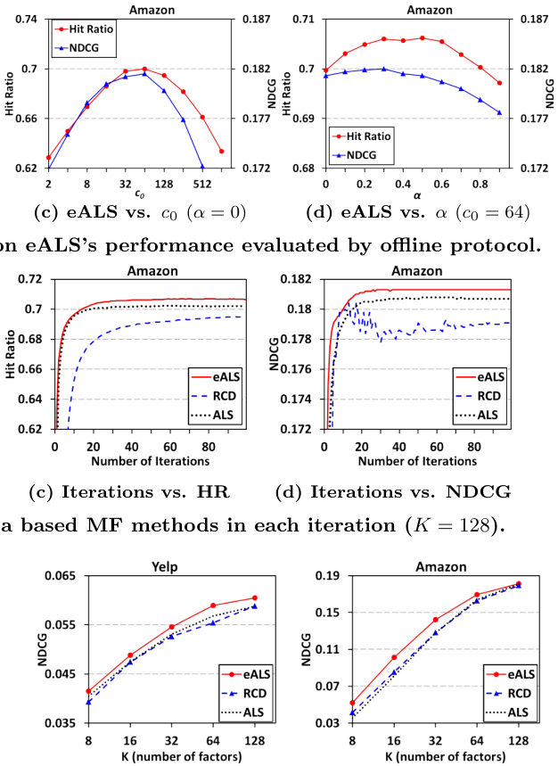
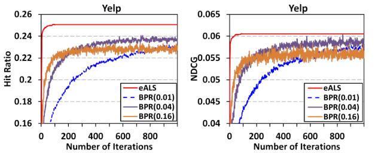
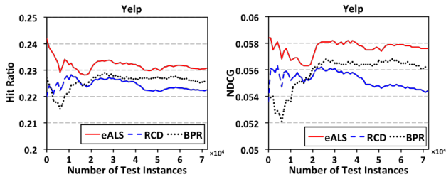
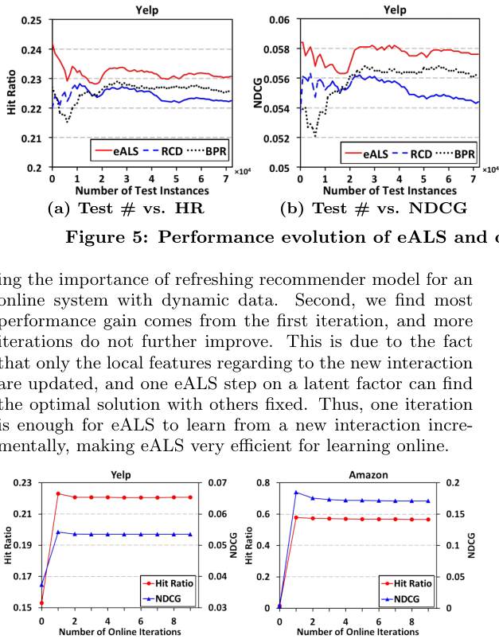
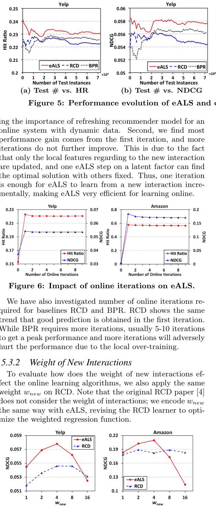
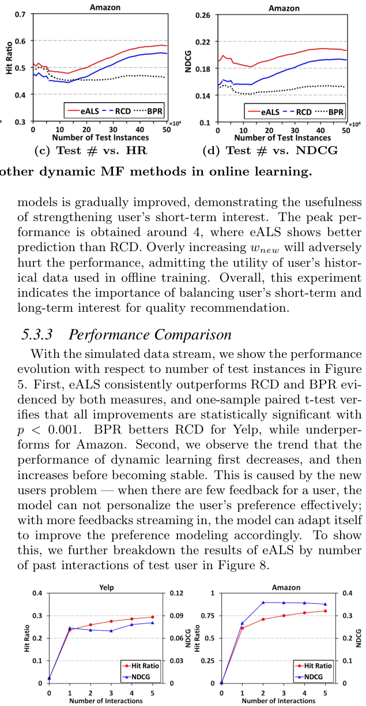

# 面向隐式反馈的在线推荐快速矩阵分解

> Xiangnan He, Hanwang Zhang, Min-Yen Kan, Tat-Seng Chua | 新加坡国立大学计算机学院

本文在矩阵分解（MF）方法处理隐式反馈的有效性和效率两方面都做出了改进。我们指出现有工作的两个关键问题：第一，由于未观测反馈空间巨大，大多数现有方法对缺失数据赋予**统一权重以降低计算复杂度**；然而，这种统一假设在现实场景中不成立。第二，大多数方法也是在离线设置下设计的，无法跟上在线数据的动态特性。我们解决了在隐式反馈中学习MF模型的上述两个问题。我们首先提出**基于物品流行度对缺失数据进行加权**，这比统一权重假设更有效和灵活。然而，这种非统一加权给模型学习带来了效率挑战。为此，我们专门设计了一种新的**基于元素级交替最小二乘**（eALS）技术的学习算法，以高效优化带有可变权重缺失数据的MF模型。利用这种高效性，我们无缝设计了一种增量更新策略，在有新反馈时即时刷新MF模型。通过在两个公开数据集上的离线与在线协议综合实验，我们展示了eALS方法始终优于最先进的隐式MF方法。

- 提出了一种基于物品流行度的缺失数据加权方案，有效调整MF模型以适应隐式反馈学习
- 开发了一种新的高效学习模型参数的算法，并设计了增量更新策略以支持实时在线学习
- 在两个真实世界数据集上使用离线和在线协议进行了广泛实验，证明了方法始终优于最先进的隐式MF方法

---

## 摘要

本文在矩阵分解方法处理隐式反馈的有效性和效率两方面都做出了改进。我们指出现有工作的两个关键问题。第一，由于未观测反馈空间巨大，大多数现有方法对缺失数据赋予统一权重以降低计算复杂度；然而，这种统一假设在现实场景中不成立。第二，大多数方法也是在离线设置下设计的，无法跟上在线数据的动态特性。我们解决了在隐式反馈中学习MF模型的上述两个问题。我们首先提出基于物品流行度对缺失数据进行加权，这比统一权重假设更有效和灵活。然而，这种非统一加权给模型学习带来了效率挑战。为此，我们专门设计了一种新的基于元素级交替最小二乘（eALS）技术的学习算法，以高效优化带有可变权重缺失数据的MF模型。利用这种高效性，我们无缝设计了一种增量更新策略，在有新反馈时即时刷新MF模型。通过在两个公开数据集上的离线与在线协议综合实验，我们展示了eALS方法始终优于最先进的隐式MF方法。我们的实现可在 https://github.com/hexiangnan/sigir16-eals 获取。

## 1. 引言

用户个性化在现代推荐系统中已变得普遍。它有助于捕捉用户的个性化偏好，并已被证明能提高用户满意度和内容提供商的收入。在其各种方法中，矩阵分解（MF）是最流行且最有效的技术，通过潜在因子向量来刻画用户和物品[15, 32]。早期关于推荐MF算法的工作[14, 27]主要集中在显式反馈上，其中用户对物品的评分直接反映了他们的偏好。这些工作将推荐问题表述为评分预测问题，其中大量未观测评分（即缺失数据）被视为对建模用户偏好无关紧要[12]。这大大减少了建模工作量，并设计了许多复杂方法，如SVD++[15]和timeSVD[14]。

然而，在许多应用中并不总是有显式评分；更常见的是，用户通过隐式反馈与物品交互，例如用户的视频观看和产品购买历史。与显式评分相比，隐式反馈对内容提供商来说更容易收集，但由于负反馈的自然稀缺，也更具挑战性。已有研究表明，仅对观测到的正反馈建模会导致用户画像出现偏差[4, 12]；例如，Marlin等人[18]发现用户会听他们期望喜欢的音乐并避开不喜欢的类型，导致观测数据出现严重偏差。

为解决缺乏负反馈的问题（也称为单类问题[21]），一种流行的解决方案是将所有缺失数据建模为负反馈[12]。然而，由于需要全面考虑观测数据和缺失数据，这会导致学习效率降低。更重要的是，低效率使得将隐式MF方法部署到在线环境中更加困难[29]。在实际推荐系统中，新用户、新物品和新交互不断流入，实时刷新底层模型以最好地服务用户至关重要。在这项工作中，我们关注MF方法的上述两个具有挑战性的问题——隐式反馈和在线学习。我们注意到我们不是第一个同时考虑MF这两个方面的工作，因为Devooght等人[4]最近提出了一种高效的隐式MF方法用于动态数据学习。然而，我们认为Devooght的方法[4]以一种不现实、次优的方式建模缺失数据。具体来说，它对缺失数据赋予统一权重，假设缺失条目同样可能是负反馈。然而，这种假设限制了模型在实际应用中的保真度和灵活性。例如，内容提供商通常知道哪些物品已经被频繁展示给用户但很少被点击；这些物品更可能是真正的负面评价，应该比其他物品权重更高。此外，Devooght的方法通过梯度下降学习参数，需要耗时的线性搜索来确定每一步的最佳学习率。

我们提出了一种新的MF方法，旨在有效地从隐式反馈中学习，同时满足在线学习的要求。我们开发了一种新的学习算法，可以在不对缺失数据施加统一权重限制的情况下高效优化隐式MF模型。特别是，我们基于物品流行度对缺失数据赋予权重，这比先前受统一性假设限制的方法[4, 12, 23, 30, 31]更有效。我们的eALS算法在考虑缺失数据方面速度很快——分析上比ALS[12]快 $K$ 倍，其中 $K$ 表示潜在因子数量——与最近的动态MF解决方案[4]复杂度相同。这种高效性使eALS适合在线学习，为此我们开发了一种增量更新策略，在有新数据时即时刷新模型参数。eALS的另一个关键优势是它不需要学习率，避免了调整梯度下降方法（如[4]和随机梯度下降[25]）的众所周知的困难。

我们总结主要贡献如下：
1. 我们提出了一种基于物品流行度感知的完整缺失数据加权方案，有效调整MF模型以适应隐式反馈学习。
2. 我们开发了一种新的高效学习模型参数的算法，并设计了增量更新策略以支持实时在线学习。
3. 我们在两个真实世界数据集上使用离线和在线协议进行了广泛实验，证明我们的方法始终优于最先进的隐式MF方法。

## 2. 相关工作

由于缺乏负反馈，处理缺失数据是隐式数据学习的必要条件。为此，提出了两种策略——基于采样的学习[21, 25]（从缺失数据中采样负样本）和基于全数据的学习[12, 30]（将所有缺失数据视为负样本）。两种方法各有利弊：基于采样的方法通过减少训练中的负样本数量而更高效，但有可能降低模型的预测能力；基于全数据的方法对完整数据建模，具有更高的覆盖范围，但效率可能是个问题。为了保持模型的保真度，我们坚持使用基于全数据的学习，开发了一种快速的基于ALS的算法来解决效率问题。

对于现有的基于全数据的方法[4, 12, 23, 30, 31]，一个主要限制是对缺失条目的统一加权，这有利于算法效率，但限制了模型的灵活性和可扩展性。唯一考虑过非统一加权的工作来自Pan等人[20, 21]；然而，其关于 $K$ 的三次时间复杂度使其不适合在大规模数据上运行[23]，因为需要大量因子才能获得更好的性能[31]。

为了优化MF，研究了各种学习器，包括SGD[14, 25]、坐标下降[4, 32]和马尔可夫链蒙特卡罗[26]。SGD因其易于推导而最受欢迎，但由于训练样本量巨大（完整的用户-物品交互矩阵），不适合基于全数据的MF[12]。ALS可以看作是坐标下降的一个实例，已被广泛用于解决基于全数据的MF[12, 20, 21, 30]；然而，其低效率是实际使用的主要障碍[23, 31]。为了解决这个问题，[23]描述了一种ALS的近似解。最近，[4]采用了随机块坐标下降（RCD）学习器[28]，降低了复杂度并将其应用于动态场景。类似地，[31]通过基于邻居的相似度丰富了隐式反馈矩阵，然后应用未加权的SVD。与先前的工作不同，我们为带有非统一缺失数据的基于全数据的MF提出了一种高效的逐元素ALS解决方案，这在以前从未被研究过。

实际推荐系统的另一个重要方面在于处理传入数据的动态特性，其中时效性是一个关键考虑因素。由于在线重新训练完整模型是不可行的，各种工作已经为基于邻居[13]、基于图[9]、概率[3]和MF[4, 5, 17, 27]方法开发了增量学习策略。对于MF，已经研究了不同的学习器用于在线更新，包括SGD[5, 27]、RCD[4]和对偶平均[17]。据我们所知，本文是首次尝试利用ALS技术进行在线学习。

## 3. 预备知识

我们首先介绍用于隐式数据学习的基于全数据的MF方法，强调传统ALS解决方案[12, 21]的效率问题。然后我们描述eALS，一种可以将时间复杂度降低到与因子数量成线性关系的逐元素ALS学习器[26]。虽然该学习器在优化带有各种加权策略的MF方面是通用的，但所介绍的形式在计算所有缺失数据时成本高昂，因而对实际使用是不现实的。这个缺陷促使我们进一步开发eALS，使其适合从隐式反馈中学习（详见第4.2节）。

### 3.1 面向隐式反馈的MF方法

我们首先介绍一些基本符号。对于一个用户-物品交互矩阵 $R \in \mathbb{R}^{M \times N}$ ， $M$ 和 $N$ 分别表示用户和物品的数量； $R$ 表示值非零的用户-物品对集合。我们保留索引 $u$ 表示用户， $i$ 表示物品。向量 $p_u$ 表示 $u$ 的潜在特征向量，集合 $R_u$ 表示 $u$ 交互过的物品集合； $q_i$ 和 $R_i$ 也类似。矩阵 $P \in \mathbb{R}^{M \times K}$ 和 $Q \in \mathbb{R}^{N \times K}$ 分别表示用户和物品的潜在因子矩阵。

矩阵分解将用户和物品映射到 $K$ 维的联合潜在特征空间中，使得交互被建模为该空间中的内积。数学上， $R$ 的每个条目 $r_{ui}$ 被估计为：

$$
 \hat{r}_{ui} = \langle p_u, q_i \rangle = p_u^\top q_i \qquad (1)
$$

物品推荐问题被表述为估计评分函数 $\hat{r}_{ui}$ ，用于对物品进行排序。注意，这个基本模型包含了常用于建模显式评分的偏置MF[14]：

$$
 \hat{r}_{ui} = b_u + b_i + \langle p_u^B, q_i^B \rangle
$$

其中 $b_u$ （ $b_i$ ）捕捉用户 $u$ （物品 $i$ ）在给出（接收）评分时的偏置。为了恢复它，设置 $p_u \leftarrow [p_u^B, b_u, 1]$ 和 $q_i \leftarrow [q_i^B, 1, b_i]$ 。因此，我们采用基本的MF模型以简化符号，并能够与同样遵循基本模型的基线[4, 12]进行公平比较。

为了学习模型参数，Hu等人[12]引入了加权回归函数，将置信度与隐式反馈矩阵 $R$ 中的每个预测关联起来：

$$
 J = \sum_{u=1}^M \sum_{i=1}^N w_{ui}(r_{ui} - \hat{r}_{ui})^2 + \lambda(\sum_{u=1}^M \|p_u\|^2 + \sum_{i=1}^N \|q_i\|^2) \qquad (2)
$$

其中 $w_{ui}$ 表示条目 $r_{ui}$ 的权重，我们使用 $W = [w_{ui}]_{M \times N}$ 表示权重矩阵。 $\lambda$ 控制正则化的强度，通常是L2范数以防止过拟合。注意，在隐式反馈学习中，缺失条目通常被赋予 $r_{ui} = 0$ 值但非零的 $w_{ui}$ 权重，两者对性能都至关重要。

### 3.2 ALS优化

交替最小二乘（ALS）是一种流行的优化回归模型（如MF和图正则化[10]）的方法。它通过迭代优化一个参数，同时保持其他参数固定来工作。ALS的前提是优化子问题可以解析求解。在这里，我们描述Hu的工作[12]如何解决这个问题。

首先，关于用户潜在向量 $p_u$ 最小化 $J$ 等价于最小化：

$$
 J_u = \|W_u(r_u - Qp_u)\|^2 + \lambda\|p_u\|^2
$$

其中 $W_u$ 是一个 $N \times N$ 的对角矩阵， $W_{ii}^u = w_{ui}$ 。最小值处一阶导数为0：

$$
 \frac{\partial J_u}{\partial p_u} = 2Q^\top W_u Q p_u - 2Q^\top W_u r_u + 2\lambda p_u = 0
$$
$$
 \Rightarrow p_u = (Q^\top W_u Q + \lambda I)^{-1} Q^\top W_u r_u \qquad (3)
$$

其中 $I$ 表示单位矩阵。这个解析解也被称为岭回归[23]。遵循相同的过程，我们可以得到 $q_i$ 的解。

#### 3.2.1 ALS的效率问题

如我们所见，为了更新一个潜在向量，矩阵求逆是不可避免的。矩阵求逆是一个昂贵的操作，通常假设时间复杂度为 $O(K^3)$ [12]。因此，更新一个用户潜在向量需要 $O(K^3 + NK^2)$ 时间。因此，一次更新所有模型参数的迭代的总时间复杂度为 $O((M + N)K^3 + MNK^2)$ 。显然，这种高复杂度使得该算法无法在大规模数据上实际运行——可能有数百万用户和物品以及数十亿次交互。

**使用统一加权加速。** 为了降低高时间复杂度，Hu等人[12]对缺失条目应用了统一权重；即假设 $R$ 中的所有零条目具有相同的权重 $w_0$ 。通过这种简化，他们可以使用记忆化来加速计算：

$$
 Q^\top W_u Q = w_0 Q^\top Q + Q^\top (W_u - W_0) Q \qquad (4)
$$

其中 $W_0$ 是一个对角矩阵，每个对角元素是 $w_0$ 。由于 $Q^\top Q$ 与 $u$ 无关，可以在更新所有用户潜在向量时预先计算。考虑到 $W_u - W_0$ 只有 $|R_u|$ 个非零条目，我们可以在 $O(|R_u|K^2)$ 时间内计算方程(4)。因此，ALS的时间复杂度降低为 $O((M + N)K^3 + |R|K^2)$ 。

即便如此，我们认为当 $(M + N)K \geq |R|$ 时， $O((M + N)K^3)$ 项可能是一个主要开销。此外， $O(|R|K^2)$ 部分仍然比SGD[25]高得多，后者只需要 $O(|R|K)$ 时间。因此，即使有了加速，ALS仍然无法在大数据上运行，而大数据中大的 $K$ 至关重要，因为它可以带来更好的泛化能力和预测性能。此外，统一加权假设在实际应用中通常不成立，并且会降低模型的预测能力。这促使我们设计一种不受统一权重限制的高效隐式MF方法。

### 3.3 通用逐元素ALS学习器

先前ALS解决方案的瓶颈在于矩阵求逆操作，这是由于将用户（物品）的潜在向量作为一个整体更新的设计所致。因此，很自然的做法是在元素级别优化参数——逐个优化潜在向量的每个坐标，同时保持其他固定[26]。为此，我们首先得到目标函数(2)关于 $p_{uf}$ 的导数：

$$
 \frac{\partial J}{\partial p_{uf}} = -2\sum_{i=1}^N (r_{ui} - \hat{r}_{ui}^f) w_{ui} q_{if} + 2p_{uf} \sum_{i=1}^N w_{ui} q_{if}^2 + 2\lambda p_{uf}
$$

其中 $\hat{r}_{ui}^f = \hat{r}_{ui} - p_{uf} q_{if}$ ，即移除第 $f$ 维潜在因子后的预测值。将该导数设为0，得到 $p_{uf}$ 的解：

$$
 p_{uf} = \frac{\sum_{i=1}^N (r_{ui} - \hat{r}_{ui}^f) w_{ui} q_{if}}{\sum_{i=1}^N w_{ui} q_{if}^2 + \lambda} \qquad (5)
$$

类似地，我们可以得到物品潜在因子的解：

$$
 q_{if} = \frac{\sum_{u=1}^M (r_{ui} - \hat{r}_{ui}^f) w_{ui} p_{uf}}{\sum_{i=1}^M w_{ui} p_{uf}^2 + \lambda} \qquad (6)
$$

给定这种优化一个参数而固定其他参数的闭式解，算法对所有模型参数迭代执行直到达到联合最优。由于目标函数的非凸性，梯度消失的临界点可能是局部最小值。

**时间复杂度。** 如我们所见，通过在元素级别进行优化，可以避免昂贵的矩阵求逆操作。原始实现一次迭代需要 $O(MNK^2)$ 时间，通过消除 $O(K^3)$ 项直接加速了ALS。此外，通过预先计算 $\hat{r}_{ui}$ [26]，我们可以在 $O(1)$ 时间内计算 $\hat{r}_{ui}^f$ 而不是 $O(K)$ 。因此，复杂度可以进一步降低到 $O(MNK)$ ，与评估所有用户-物品预测的复杂度相同。

## 4. 我们的隐式MF方法

我们首先提出一种面向物品的缺失数据加权方案，并随之介绍一种基于流行度感知的加权策略，这比统一加权在推荐任务上更有效。然后，我们开发了一种快速的eALS算法来优化目标函数，与传统ALS[12]和通用逐元素ALS学习器[26]相比显著降低了学习复杂度。最后，我们讨论了如何调整学习算法以实现实时在线学习。

### 4.1 面向物品的缺失数据加权

由于物品空间巨大，用户的缺失条目是负反馈和未知反馈的混合。在指定缺失条目的权重 $w_{ui}$ 时，理想情况下应对负反馈赋予更高的权重。然而，区分这两种情况是一个众所周知的困难。此外，由于交互矩阵 $R$ 通常庞大且稀疏，为每个零条目存储个性化权重将过于消耗资源。为此，现有工作[4, 12, 23, 30, 31]对缺失条目应用了简单的统一权重，然而，这对于实际应用是次优且不可扩展的。

考虑到内容提供商在获取物品侧负信息方面的便利性（例如，哪些物品已被推荐给用户但很少被交互），我们认为基于某些物品属性对缺失数据进行加权更现实。为了捕捉这一点，我们设计了更细粒度的目标函数：

$$
 L = \sum_{(u,i) \in R} w_{ui}(r_{ui} - \hat{r}_{ui})^2 + \sum_{u=1}^M \sum_{i \notin R_u} c_i \hat{r}_{ui}^2 + \lambda(\sum_{u=1}^M \|p_u\|^2 + \sum_{i=1}^N \|q_i\|^2) \qquad (7)
$$

其中 $c_i$ 表示物品 $i$ 被用户错过是真正负评估的置信度，可以作为编码实践者领域知识的手段。显然，第一项表示观测条目的预测误差，已被广泛用于建模显式评分[15, 27]。第二项表示缺失数据，起着负样本的作用，对于隐式反馈的推荐至关重要[12, 25]。接下来，我们提出一种领域无关的策略，通过利用现代Web 2.0系统的一个普遍特征来确定 $c_i$ 。

#### 4.1.1 流行度感知的加权策略

许多Web 2.0系统的现有可视化界面会在推荐中展示流行物品。在其他因素相同的情况下，流行物品更可能被用户普遍知晓[10]，因此可以合理地认为，对流行物品的错过更可能是用户真正不感兴趣（而不是未知）。为了考虑这种效应，我们基于物品的流行度参数化 $c_i$ ：

$$
 c_i = c_0 \frac{f_i^\alpha}{\sum_{j=1}^N f_j^\alpha} \qquad (8)
$$

其中 $f_i$ 表示物品 $i$ 的流行度，由其在隐式反馈数据中的频率给出： $|R_i| / \sum_{j=1}^N |R_j|$ ， $c_0$ 决定缺失数据的整体权重。指数 $\alpha$ 控制流行物品相对于非流行物品的显著性水平——当 $\alpha > 1$ 时，流行物品的权重被提升以加强与不流行物品的差异；而当 $\alpha$ 设置在 $(0, 1)$ 的较低范围时，会抑制流行物品的权重并具有平滑效果。我们通过经验发现 $\alpha = 0.5$ 通常能带来好的结果。注意，统一加权是通过将 $\alpha$ 设为0且 $w_0 = c_0/N$ 的特例。

**与负采样的关系。** 我们提出的流行度感知加权策略与Rendle的基于流行度的过采样[24]用于学习BPR具有相同的直觉，后者基本上以更高的概率对流行物品进行负反馈采样。然而，[24]的经验表明过采样方法不如基本统一采样器。我们怀疑原因来自SGD学习器——由于过采样，流行物品会得到更多的梯度步骤。结果，流行物品可能在局部过训练，而不太流行的物品则会欠训练。为了解决这个问题，其他领域已经采用了诸如频繁物品子采样[19]和自适应学习率（如Adagrad[6]）等技巧。由于本文的重点是基于全数据的隐式MF，我们不进一步探索SGD的细节。值得指出的是，我们提出的eALS学习器通过对每个模型参数的精确优化避免了这些学习问题。

### 4.2 快速eALS学习算法

我们可以通过避免由加权缺失数据引入的大量重复计算来加速学习。我们详细推导 $p_{uf}$ 的过程； $q_{if}$ 的对应推导类似地完成。

首先，我们将 $p_{uf}$ 更新规则(5)重写，分离出观测数据部分：

$$
 p_{uf} = \frac{\sum_{i \in R_u} (r_{ui} - \hat{r}_{ui}^f) w_{ui} q_{if} - \sum_{i \notin R_u} \hat{r}_{ui}^f c_i q_{if}}{\sum_{i \in R_u} w_{ui} q_{if}^2 + \sum_{i \notin R_u} c_i q_{if}^2 + \lambda}
$$

显然，计算瓶颈在于对缺失数据部分的求和，这需要遍历整个负空间。我们首先关注分子：

$$
 \sum_{i \notin R_u} \hat{r}_{ui}^f c_i q_{if} = \sum_{i=1}^N c_i q_{if} \sum_{k \neq f} p_{uk} q_{ik} - \sum_{i \in R_u} \hat{r}_{ui}^f c_i q_{if}
$$
$$
 = \sum_{k \neq f} p_{uk} \sum_{i=1}^N c_i q_{if} q_{ik} - \sum_{i \in R_u} \hat{r}_{ui}^f c_i q_{if} \qquad (9)
$$

通过这种重新表述，我们可以看到主要计算——遍历所有物品的 $\sum_{i=1}^N c_i q_{if} q_{ik}$ 项——与 $u$ 无关。然而，在更新不同用户的潜在因子时，朴素实现会不必要地重复计算。显然，通过记忆化可以实现显著的加速。

我们定义 $S^q$ 缓存为 $S^q = \sum_{i=1}^N c_i q_i q_i^\top$ ，可以预先计算并用于更新所有用户的潜在因子。然后，(9)可以计算为：

$$
 \sum_{i \notin R_u} \hat{r}_{ui}^f c_i q_{if} = \sum_{k \neq f} p_{uk} s_{fk}^q - \sum_{i \in R_u} \hat{r}_{ui}^f c_i q_{if} \qquad (10)
$$

这可以在 $O(K + |R_u|)$ 时间内完成。

类似地，我们可以应用缓存来加速分母的计算：

$$
 \sum_{i \notin R_u} c_i q_{if}^2 = \sum_{i=1}^N c_i q_{if}^2 - \sum_{i \in R_u} c_i q_{if}^2 = s_{ff}^q - \sum_{i \in R_u} c_i q_{if}^2 \qquad (11)
$$

总结上述记忆化策略，我们给出使用 $S^q$ 缓存的 $p_{uf}$ 更新规则：

$$
 p_{uf} = \frac{\sum_{i \in R_u} [w_{ui} r_{ui} - (w_{ui} - c_i) \hat{r}_{ui}^f] q_{if} - \sum_{k \neq f} p_{uk} s_{kf}^q}{\sum_{i \in R_u} (w_{ui} - c_i) q_{if}^2 + s_{ff}^q + \lambda} \qquad (12)
$$

**算法1：快速eALS学习算法**

输入： $R$ , $K$ , $\lambda$ , $W$ 和物品置信度向量 $c$
输出：潜在特征矩阵 $P$ 和 $Q$

1. 随机初始化 $P$ 和 $Q$
2. for $(u,i) \in R$ do $\hat{r}_{ui} \leftarrow$ 方程(1)  ▷ $O(|R|K)$
3. while 未达到停止条件 do
4.   $S^q = \sum_{i=1}^N c_i q_i q_i^\top$  ▷ $O(MK^2)$
5.   for $u \leftarrow 1$ to $M$ do  ▷ $O(MK^2 + |R|K)$
6.     for $f \leftarrow 1$ to $K$ do
7.       for $i \in R_u$ do $\hat{r}_{ui}^f \leftarrow \hat{r}_{ui} - p_{uf} q_{if}$
8.       $p_{uf} \leftarrow$ 方程(12)  ▷ $O(K + |R_u|)$
9.       for $i \in R_u$ do $\hat{r}_{ui} \leftarrow \hat{r}_{ui}^f + p_{uf} q_{if}$
10.    end
11.  end
12.  $S^p = P^\top P$  ▷ $O(NK^2)$
13.  for $i \leftarrow 1$ to $N$ do  ▷ $O(NK^2 + |R|K)$
14.    for $f \leftarrow 1$ to $K$ do
15.      for $u \in R_i$ do $\hat{r}_{ui}^f \leftarrow \hat{r}_{ui} - p_{uf} q_{if}$
16.      $q_{if} \leftarrow$ 方程(13)  ▷ $O(K + |R_i|)$
17.      for $u \in R_i$ do $\hat{r}_{ui} \leftarrow \hat{r}_{ui}^f + p_{uf} q_{if}$
18.    end
19.  end
20. end
21. return $P$ 和 $Q$

类似地，我们可以推导 $q_{if}$ 的更新规则：

$$
 q_{if} = \frac{\sum_{u \in R_i} [w_{ui} r_{ui} - (w_{ui} - c_i) \hat{r}_{ui}^f] p_{uf} - c_i \sum_{k \neq f} q_{ik} s_{kf}^p}{\sum_{u \in R_i} (w_{ui} - c_i) p_{uf}^2 + c_i s_{ff}^p + \lambda} \qquad (13)
$$

其中 $s_{kf}^p$ 表示 $S^p$ 缓存的第 $(k,f)$ 个元素， $S^p$ 定义为 $S^p = P^\top P$ 。

算法1总结了我们加速的逐元素ALS学习器eALS。对于收敛，可以监控训练集上目标函数的值，或在保留验证数据上检查预测性能。

#### 4.2.1 讨论

**时间复杂度。** 在算法1中，更新一个用户潜在因子需要 $O(K + |R_u|)$ 时间。因此，一次eALS迭代需要 $O((M + N)K^2 + |R|K)$ 时间。表1总结了其他为隐式反馈设计的MF算法（一次迭代或一个epoch）的时间复杂度。

表1：隐式MF方法的时间复杂度

| 方法 | 时间复杂度 |
|------|-----------|
| ALS (Hu et al.[12]) | $O((M + N)K^3 + |R|K^2)$ |
| BPR (Rendle et al.[25]) | $O(|R|K)$ |
| IALS1 (Pilászy et al.[23]) | $O(K^3 + (M + N)K^2 + |R|K)$ |
| ii-SVD (Volkovs et al.[31]) | $O((M + N)K^2 + MN \log K)$ |
| RCD (Devooght et al.[4]) | $O((M + N)K^2 + |R|K)$ |
| eALS (算法1) | $O((M + N)K^2 + |R|K)$ |

 $|R|$ 表示用户-物品矩阵 $R$ 中非零条目的数量。

与向量级别的ALS[12, 21]相比，我们的逐元素ALS学习器快了 $K$ 倍。此外，我们提出的eALS与RCD[4]具有相同的时间复杂度，比另一个近期解ii-SVD[31]更快。RCD是一种用于基于全数据的MF的最先进学习器，它对一个随机选择的潜在向量执行梯度下降步骤。由于它需要好的学习率，[4]通过在每个梯度步骤中进行线性搜索自适应地确定学习率，这本质上是在预定义的候选中选择导致最陡下降的学习率。eALS相对于RCD的一个主要优势是它通过在每个参数更新中进行精确优化而避免了对学习率的需求，可以说比RCD更有效且更易用。最高效的算法是BPR，它仅在采样的部分缺失数据上应用SGD学习器。

**计算目标函数。** 评估目标函数对于检查迭代收敛性和验证实现的正确性很重要。直接计算需要 $O(MNK)$ 时间，需要对 $R$ 矩阵进行完整估计。幸运的是，通过面向物品的加权，我们可以类似地利用 $R$ 的稀疏性进行加速。为此，我们重新表述导致主要开销的缺失数据部分的损失：

$$
 \sum_{u=1}^M \sum_{i \notin R_u} c_i \hat{r}_{ui}^2 = \sum_{u=1}^M p_u^\top S^q p_u - \sum_{(u,i) \in R} c_i \hat{r}_{ui}^2 \qquad (14)
$$

通过重用 $S^q$ 和预测缓存 $\hat{r}_{ui}$ ，我们可以在 $O(|R| + MK^2)$ 时间内计算目标函数，远比直接计算快。

**并行学习。** eALS的迭代可以很容易地并行化。首先，计算 $S$ 缓存（算法1第4行和第12行）是标准的矩阵乘法运算，现代矩阵工具包提供了非常高效和并行化的实现。其次，在更新不同用户的潜在向量时（第5-11行），共享参数要么相互独立（即 $\hat{r}_{ui}$ ），要么保持不变（即 $S^q$ ）。这个良好的性质意味着可以通过按用户分离更新来获得精确的并行解；即让不同的工作线程更新不相交的用户集合的模型参数。在更新物品潜在向量时也可以实现相同的并行性。这是相对于常用的SGD学习器的一个优势，后者是一种根据训练实例随机更新模型参数的方法。在SGD中，不同的梯度步骤可能相互影响，没有精确的方法来分离工作线程的更新。因此，需要复杂的策略来控制并行引入的可能损失。我们提出的eALS解决方案通过坐标下降进行优化，其中每一步更新一个专用参数，使得算法可以无近似损失地轻松并行化。

### 4.3 在线更新

实际上，在推荐模型对历史数据进行离线训练后，它将被在线使用，并需要适应以最好地服务用户。在这里，我们考虑在线学习场景，即给定新的用户-物品交互时刷新模型参数。

**增量更新。** 令 $\hat{P}$ 和 $\hat{Q}$ 表示从离线训练中学到的模型参数， $(u, i)$ 表示新传入的交互。为了近似考虑新交互的模型参数，我们仅对 $p_u$ 和 $q_i$ 执行优化步骤。其基本假设是，从全局角度看，新交互不应过分改变 $\hat{P}$ 和 $\hat{Q}$ ，同时应显著改变 $u$ 和 $i$ 的局部特征。特别是，当 $u$ 是新用户时，执行局部更新将迫使 $p_u$ 靠近 $q_i$ ，这符合潜在因子模型的期望。新物品的情况类似。

**算法2：eALS的在线增量更新**

输入： $\hat{P}$ , $\hat{Q}$ , 新交互 $(u,i)$ 及其权重 $w^{new}$
输出：刷新后的参数 $P$ 和 $Q$

1. $P \leftarrow \hat{P}$ ; $Q \leftarrow \hat{Q}$
2. 如果 $u$ 是新用户，随机初始化 $p_u$
3. 如果 $i$ 是新物品，随机初始化 $q_i$
4. $r_{ui} \leftarrow 1$ ; $\hat{r}_{ui} \leftarrow$ 方程(1); $w_{ui} \leftarrow w^{new}$
5. while 未达到停止条件 do
6.   // 算法1的第6-10行
7.   update user(u);  ▷ $O(K^2 + |R_u|K)$
8.   update cache(u, $S^p$ );  ▷ $O(K^2)$
9.   // 算法1的第14-18行
10.  update item(i);  ▷ $O(K^2 + |R_i|K)$
11.  update cache(i, $S^q$ );  ▷ $O(K^2)$
12. end
13. return $P$ 和 $Q$

我们的经验研究表明一次迭代通常足以获得好的结果。此外，需要注意的是，在更新潜在向量后，需要相应更新 $S$ 缓存。

**新交互的权重。** 在线系统中，新的交互更能反映用户的短期兴趣。与离线训练中使用的历史交互相比，新鲜数据在预测用户未来行为时应被赋予更高的权重。我们为每个新交互分配一个权重 $w^{new}$ （算法2第4行），作为一个可调参数。我们在第5.3节中研究这一参数的设置如何影响在线学习性能。

**时间复杂度。** 新交互 $(u,i)$ 的增量更新可以在 $O(K^2 + (|R_u| + |R_i|)K)$ 时间内完成。值得注意的是，这个开销取决于 $u$ 和 $i$ 的观测交互数量，而与总交互数量、用户数和物品数无关。这种局部化的复杂度使得在线学习算法适合工业部署，因为可以避免处理数据依赖关系的复杂软件栈[29]。

## 5. 实验

我们首先介绍实验设置。然后我们进行传统离线协议下的实证研究，接着是更真实的在线协议实验。

### 5.1 实验设置

**数据集。** 我们在两个公开可用的数据集上进行评估：Yelp和Amazon Movies。我们将评论数据集转换为隐式数据，其中每个条目标记为0/1，表示用户是否评论了该物品。由于原始数据集的高稀疏性使得评估推荐算法变得困难（例如，超过一半的用户只有一条评论），我们遵循常见做法[25]过滤掉交互少于10次的用户和物品。表2总结了过滤后数据集的统计数据。

表2：评估数据集的统计数据

| 数据集 | 评论数 | 物品数 | 用户数 | 稀疏度 |
|--------|-------|-------|-------|--------|
| Yelp | 731,671 | 25,815 | 25,677 | 99.89% |
| Amazon | 5,020,705 | 75,389 | 117,176 | 99.94% |

**方法论。** 我们使用两种协议进行评估：
- **离线协议：** 我们采用留一法评估，即每个用户的最新交互被保留用于预测，模型在剩余数据上训练。虽然这是文献[9, 25]中广泛使用的评估协议，但我们指出这是一种人为的划分，并不对应真实的推荐场景。此外，在这种评估中避免了新用户问题，因为每个测试用户都有训练历史。因此，该协议仅评估算法利用静态历史数据为现有用户提供一次性推荐的能力。
- **在线协议：** 为了创建更真实的推荐场景，我们模拟动态数据流。我们首先按时间顺序对所有交互进行排序，在前90%的交互上训练模型，保留最后10%用于测试。在测试阶段，给定来自保留数据的一个测试交互（即一个用户-物品对），模型首先向用户推荐一个排序列表；性能根据该排序列表进行评判。然后将测试交互输入模型进行增量更新。注意，通过按时间全局划分，Yelp和Amazon数据集中分别有14%和57%的测试交互来自新用户。总体而言，该协议评估了在线学习算法在处理动态新数据方面的有效性。

为了用用户实际消费的真实值物品评估排序列表，我们采用命中率（HR）和归一化折损累计增益（NDCG）。我们将两个指标的排序列表截断为100。HR衡量真实值物品是否出现在排序列表中，而NDCG考虑了命中的位置[9]。我们报告所有测试交互的平均分数。

**基线方法。** 我们与以下方法进行比较：
- **ALS[12]：** 传统的ALS方法，优化基于全数据的MF。由于时间复杂度高，该方法在实时动态更新场景中不可行，因此我们仅在离线协议中评估它。
- **RCD[4]：** 最先进的隐式MF方法，与eALS具有相同的时间复杂度，适合在线学习。对于线性搜索参数，我们使用作者实现中建议的值。
- **BPR[25]：** 一种基于采样的方法，优化正负样本之间的成对排序。它通过SGD学习，可以通过[27]调整为在线增量学习。我们使用固定学习率，并变化学习率报告最佳性能。

**参数设置。** 对于观测交互的权重，我们统一设置为1，这是先前工作的默认设置[4, 25]。对于正则化，为了公平比较，我们将所有方法的 $\lambda$ 设置为0.01。所有方法都在同一台机器（Intel Xeon 2.67GHz CPU和24GB内存）上以Java实现并单线程运行，以确保效率方面的公平比较。由于发现在不同的因子数 $K$ 下结果一致，没有特别离群值，我们只展示 $K = 128$ 的结果——这是一个能保持良好精度的相对较大的数字。

### 5.2 离线协议

我们首先研究缺失数据的加权方案如何影响eALS的性能。然后我们与基于全数据的隐式MF方法ALS和RCD，以及基于采样的排序方法BPR进行比较。

#### 5.2.1 缺失数据的权重

在第4.1节中，我们提出了一种基于物品流行度感知的加权策略，有两个参数： $c_0$ 决定缺失数据的整体权重， $\alpha$ 控制权重分布。首先，我们设置统一权重分布（即 $\alpha = 0$ ），变化 $c_0$ 来研究缺失数据的权重如何影响性能。对于Yelp（图1a），在 $c_0$ 约为512时达到峰值性能，对应每个零条目的权重为0.02（ $w_0 = c_0/N$ ）；类似地，对于Amazon（图1c），最优 $c_0$ 约为64，对应 $w_0 = 0.0001$ 。当 $c_0$ 变得更小（ $w_0$ 接近0）时，性能显著下降。这突显了在隐式反馈建模中对物品推荐考虑缺失数据的必要性。此外，当 $c_0$ 设置过大时，性能也会受损。基于这一观察，我们认为将所有条目同等加权的传统SVD技术[2]在这里将是次优的。

然后，我们将 $c_0$ 设置为最佳值（在 $\alpha = 0$ 的情况下），变化 $\alpha$ 来检查性能变化。从图1b和1d可以看出，eALS的性能随着 $\alpha$ 的增加而逐渐改善，最佳结果约在0.4左右。我们进一步进行了单样本配对t检验，验证了在两个数据集的两个指标上改进在统计上显著（p值 < 0.01）。这表明了我们流行度偏置加权策略的有效性。此外，当 $\alpha$ 大于0.5时，性能开始显著下降。这揭示了过度加权流行物品作为负样本的弊端，因此以适当权重考虑较不流行物品的重要性。

在以下实验中，我们根据HR评估的最佳性能固定 $c_0$ 和 $\alpha$ ，即Yelp上 $c_0 = 512$ 、 $\alpha = 0.4$ ，Amazon上 $c_0 = 64$ 、 $\alpha = 0.5$ 。

#### 5.2.2 对比基于全数据的MF方法

我们对RCD和ALS进行了相同的 $w_0$ 网格搜索，并报告最佳性能。

**收敛性。** 图2显示了随迭代次数的预测精度。首先，我们看到eALS在收敛后达到最佳性能。所有改进通过单样本配对t检验（p < 0.01）证明具有统计显著性。我们相信这些优势主要来自流行度感知的目标函数，因为ALS和RCD都对未知数据应用了统一加权。其次，eALS和ALS比RCD收敛更快。我们认为原因是(e)ALS将参数更新为最小化当前状态的目标函数，而RCD沿着负梯度方向更新，这可能是次优的。在Amazon上，RCD在早期迭代中显示出高但不稳定的NDCG，而低命中率和后来的迭代表明高NDCG是不稳定的。

最后，我们指出，在优化相同目标函数时，ALS在大多数情况下优于RCD，展示了ALS相对于梯度下降学习器的优势。

**精度与因子数。** 图3显示了随因子数 $K$ 变化的预测精度。我们只展示NDCG评估，因为HR具有相同趋势。首先，eALS在所有 $K$ 值上始终优于ALS和RCD，展示了eALS方法的有效性（注意，尽管三种方法在 $K = 128$ 的Amazon上表现似乎相当，但它们的差异在图2d中可以清晰看到）。其次，所有方法都可以通过更大的 $K$ 得到显著改进。虽然大的 $K$ 可能存在过拟合风险，但它可以增加模型表示能力从而获得更好的预测。特别是对于可能拥有数百万用户和数十亿交互的大型数据集，大的 $K$ 对于MF方法的精度尤为重要。

**效率。** 分析上，ALS的时间复杂度为 $O((M + N)K^3 + |R|K^2)$ ，而eALS和RCD快 $K$ 倍。为了经验性地比较它们的效率，我们在表3中展示了每次迭代的实际训练时间。

表3：不同 $K$ 下不同基于全数据的MF方法每次迭代的训练时间

| $K$ | eALS (Yelp) | RCD (Yelp) | ALS (Yelp) | eALS (Amazon) | RCD (Amazon) | ALS (Amazon) |
|-----|------------|------------|-----------|--------------|--------------|-------------|
| 32 | 1s | 1s | 10s | 9s | 10s | 74s |
| 64 | 4s | 3s | 46s | 23s | 17s | 4.8m |
| 128 | 13s | 10s | 221s | 72s | 42s | 21m |
| 256 | 1m | 0.9m | 23m | 4m | 2.8m | 2h |
| 512 | 2m | 2m | 2.5h | 12m | 9m | 11.6h |
| 1024 | 7m | 11m | 25.4h | 54m | 48m | 74h |

s、m和h分别表示秒、分和小时。

如我们所见，随着 $K$ 的增加，ALS比eALS和RCD花费的时间长得多。具体来说，当 $K$ 为512时，ALS在Amazon上的一次迭代需要11.6小时，而eALS只需12分钟。尽管由于更高效的矩阵求逆实现（我们使用了已知最快的算法[1]，时间复杂度约为 $O(K^{2.376})$ ），eALS在经验上并没有比ALS快 $K$ 倍，但加速已经非常显著。此外，由于RCD和eALS具有相同的分析时间复杂度，它们的实际运行时间在同一量级；细微差异可能由一些实现细节引起，如使用的数据结构和缓存。

#### 5.2.3 eALS vs. BPR（基于采样的）

图4绘制了BPR在不同学习率下每次迭代的性能。注意我们只运行eALS 100次迭代，这足以使eALS收敛。首先，很明显BPR的性能受学习率选择的影响——图4a和4b显示，较高的学习率导致更快的收敛，但最终精度可能受影响。其次，我们看到eALS在Yelp数据集上的两个指标均显著优于BPR（p < 0.001）。对于Amazon，eALS获得了更高的命中率但较低的NDCG分数，表明eALS的大部分命中发生在相对较低的排名位置。与ALS和RCD等其他基于全数据的MF方法的性能（图2）相比，我们得出结论：BPR在预测召回率方面是弱项，而在顶部排名的精度方面是强项。我们认为BPR在排序顶部物品方面的优势归因于其优化目标，这是一个为正确物品排名靠前而量身定制的成对排序函数。相比之下，基于回归的目标函数不是直接针对排序优化的；相反，通过在回归中考虑所有缺失数据，它能更好地预测用户对未消费物品的偏好，从而获得更好的召回率。这与[2]在评估Top-K推荐时的发现一致。

我们注意到BPR在Amazon数据集的早期迭代中出现了异常NDCG尖峰，但性能不稳定并随着更多迭代而下降。在相同数据集上，另一种梯度下降方法RCD也观察到相同现象（见图2d）。我们推测这可能是由数据中的某些规律性引起的。例如，我们发现一些Amazon用户多次评论同一部电影。在早期迭代中，BPR将这些重复物品排名靠前，导致高但不稳定的NDCG分数。可能还有其他原因导致这一现象，我们在此不进一步探讨。

### 5.3 在线协议

在在线协议的评估中，我们保留最新的10%交互作为测试集，在剩余90%数据上使用离线评估表现最佳参数设置训练所有方法。我们首先研究eALS收敛所需的在线迭代次数。然后我们展示新交互权重如何影响性能。最后，我们在在线学习场景中与动态MF方法RCD和BPR进行比较。

#### 5.3.1 在线迭代次数

图6显示了eALS的精度如何随在线迭代次数变化。第0次迭代的结果基准是离线训练模型的性能，因为没有进行增量更新。首先，我们可以看到离线训练的模型表现非常差，突显了在动态数据系统中刷新推荐模型的重要性。其次，我们发现大部分性能提升来自第一次迭代，更多迭代不会进一步改善。这是因为只有与新交互相关的局部特征被更新，eALS在潜在因子上的一步就能在保持其他固定的情况下找到最优解。因此，一次迭代就足够eALS从新交互中增量学习，使eALS非常适合在线学习。

我们还研究了基线方法RCD和BPR所需的在线迭代次数。RCD表现出相同趋势——在第一次迭代中获得良好预测。而BPR需要更多迭代，通常5-10次迭代才能达到峰值性能，更多迭代会因局部过训练而损害性能。

#### 5.3.2 新交互的权重

为了评估新交互的权重如何影响在线学习算法，我们也将相同的权重 $w^{new}$ 应用于RCD。注意原始的RCD论文[4]没有考虑交互权重；我们以与eALS相同的方式编码 $w^{new}$ ，修改RCD学习器以优化加权回归函数。

图7显示了用NDCG评估的性能（HR结果呈现相同趋势，为节省空间省略）。将 $w^{new}$ 设置为1意味着新交互与旧训练交互具有相同的权重。如预期，随着 $w^{new}$ 的适度增加，两个模型的预测逐渐改善，展示了加强用户短期兴趣的有用性。峰值性能约在4左右，其中eALS显示出比RCD更好的预测。过度增加 $w^{new}$ 会损害性能，承认了离线训练中用户历史数据的效用。总体而言，这个实验表明平衡用户短期和长期兴趣对于优质推荐的重要性。

#### 5.3.3 性能比较

通过模拟数据流，我们在图5中展示了随测试实例数量的性能演变。首先，eALS在两个指标上始终优于RCD和BPR，单样本配对t检验验证了所有改进在统计上显著（p < 0.001）。BPR在Yelp上优于RCD，但在Amazon上不如RCD。其次，我们观察到动态学习的性能先下降，然后上升，之后趋于稳定。这是由新用户问题引起的——当用户反馈很少时，模型无法有效个性化用户偏好；随着更多反馈流入，模型可以相应地调整以改进偏好建模。为了展示这一点，我们进一步按测试用户的过去交互次数分解eALS的结果，如图8所示。

很明显，当测试用户没有历史反馈时（即用户冷启动情况），性能非常差——不比随机好。第一个交互流入后，预测显著改善；随着更多交互，性能进一步提升。这突显了将即时用户反馈纳入模型的重要性，特别是对于训练历史很少的冷启动或稀疏用户。

## 6. 结论与未来工作

我们研究了从隐式反馈中学习MF模型的问题。与先前对缺失数据应用统一权重的工作相反，我们提出基于物品流行度对缺失数据进行加权。为了解决优化中的关键效率挑战，我们开发了一种新的学习算法——eALS——**通过带记忆化的坐标下降有效学习参数**。对于在线学习，我们设计了一种eALS的增量更新策略，以实时适应动态数据。离线和在线协议的实验都展示了有希望的结果。重要的是，我们的工作使MF在建模隐式数据方面更实用，沿着两个维度：首先，我们研究了一种处理缺失数据的新范式，可以轻松融入先前的领域知识；其次，eALS非常适合并行化，使其对大规模工业部署具有吸引力。

我们计划研究最优的在线数据加权策略，作为探索用户短期兴趣的一种方式。在技术方面，我们以基本MF形式探索了逐元素ALS学习器，并解决了处理缺失数据的效率挑战。为了使我们的方法更适用于现实场景，我们计划通过将eALS扩展到更通用的模型（如集体分解[11]和因子分解机[26]）来编码诸如用户社交上下文[8]和评论[9]等辅助信息。此外，我们将研究隐式数据MF的二进制编码，因为最近的进展[32]已经显示离散潜在因子对显式评分的协同过滤有益。

eALS的优势可以应用于其他领域，因为分解稀疏数据矩阵具有通用性。例如，自然语言处理的最新进展[16]显示了神经词嵌入与词-上下文矩阵MF之间的联系。这种桥梁很好地激发了使用MF学习词嵌入的若干方案；然而，当涉及处理缺失数据时，它们要么忽略了[22]，要么对缺失条目同等加权，类似于传统SVD[16]。观察eALS是否也会改进这些任务将是很有趣的。

## 致谢

作者感谢Steffen Rendle、Bhargav Kanagal、Immanuel Bayer、Tao Chen、Ming Gao和Jovian Lin的额外讨论和帮助。

## 参考文献

[1] D. Coppersmith and S. Winograd. Matrix multiplication via arithmetic progressions. *J. Symb. Comput.*, 9(3):251–280, 1990.

[2] P. Cremonesi, Y. Koren, and R. Turrin. Performance of recommender algorithms on top-n recommendation tasks. In *RecSys 2010*, pages 39–46.

[3] A. S. Das, M. Datar, A. Garg, and S. Rajaram. Google news personalization: Scalable online collaborative filtering. In *WWW 2007*, pages 271–280.

[4] R. Devooght, N. Kourtellis, and A. Mantrach. Dynamic matrix factorization with priors on unknown values. In *KDD 2015*, pages 189–198.

[5] E. Diaz-Aviles, L. Drumond, L. Schmidt-Thieme, and W. Nejdl. Real-time top-n recommendation in social streams. In *RecSys 2012*, pages 59–66.

[6] J. Duchi, E. Hazan, and Y. Singer. Adaptive subgradient methods for online learning and stochastic optimization. *J. Mach. Learn. Res.*, 12:2121–2159, 2011.

[7] R. Gemulla, E. Nijkamp, P. J. Haas, and Y. Sismanis. Large-scale matrix factorization with distributed stochastic gradient descent. In *KDD 2011*, pages 69–77.

[8] X. Geng, H. Zhang, J. Bian, and T.-S. Chua. Learning image and user features for recommendation in social networks. In *ICCV 2015*, pages 4274–4282.

[9] X. He, T. Chen, M.-Y. Kan, and X. Chen. Trirank: Review-aware explainable recommendation by modeling aspects. In *CIKM 2015*, pages 1661–1670.

[10] X. He, M. Gao, M.-Y. Kan, Y. Liu, and K. Sugiyama. Predicting the popularity of web 2.0 items based on user comments. In *SIGIR 2014*, pages 233–242.

[11] X. He, M.-Y. Kan, P. Xie, and X. Chen. Comment-based multi-view clustering of web 2.0 items. In *Proc. of WWW '14*, pages 771–782, 2014.

[12] Y. Hu, Y. Koren, and C. Volinsky. Collaborative filtering for implicit feedback datasets. In *ICDM 2008*, pages 263–272.

[13] Y. Huang, B. Cui, W. Zhang, J. Jiang, and Y. Xu. Tencentrec: Real-time stream recommendation in practice. In *SIGMOD 2015*, pages 227–238.

[14] Y. Koren. Collaborative filtering with temporal dynamics. In *KDD 2009*, pages 447–456.

[15] Y. Koren and R. Bell. Advances in collaborative filtering. In *Recommender systems handbook*, pages 145–186. Springer, 2011.

[16] O. Levy and Y. Goldberg. Neural word embedding as implicit matrix factorization. In *NIPS 2014*, pages 2177–2185.

[17] G. Ling, H. Yang, I. King, and M. R. Lyu. Online learning for collaborative filtering. In *IJCNN 2012*, pages 1–8.

[18] B. M. Marlin, R. S. Zemel, S. Roweis, and M. Slaney. Collaborative filtering and the missing at random assumption. In *UAI 2007*, pages 267–276.

[19] T. Mikolov, I. Sutskever, K. Chen, G. S. Corrado, and J. Dean. Distributed representations of words and phrases and their compositionality. In *NIPS 2013*, pages 3111–3119.

[20] R. Pan and M. Scholz. Mind the gaps: Weighting the unknown in large-scale one-class collaborative filtering. In *KDD 2009*, pages 667–676.

[21] R. Pan, Y. Zhou, B. Cao, N. Liu, R. Lukose, M. Scholz, and Q. Yang. One-class collaborative filtering. In *ICDM 2008*, pages 502–511.

[22] J. Pennington, R. Socher, and C. D. Manning. Glove: Global vectors for word representation. In *EMNLP 2014*, pages 1532–1543.

[23] I. Pilászy, D. Zibriczky, and D. Tikk. Fast als-based matrix factorization for explicit and implicit feedback datasets. In *RecSys 2010*, pages 71–78.

[24] S. Rendle and C. Freudenthaler. Improving pairwise learning for item recommendation from implicit feedback. In *WSDM 2014*, pages 273–282.

[25] S. Rendle, C. Freudenthaler, Z. Gantner, and L. Schmidt-Thieme. Bpr: Bayesian personalized ranking from implicit feedback. In *UAI 2009*, pages 452–461.

[26] S. Rendle, Z. Gantner, C. Freudenthaler, and L. Schmidt-Thieme. Fast context-aware recommendations with factorization machines. In *SIGIR 2011*, pages 635–644.

[27] S. Rendle and L. Schmidt-Thieme. Online-updating regularized kernel matrix factorization models for large scale recommender systems. In *RecSys 2008*, pages 251–258.

[28] P. Richtárik and M. Takáč. Iteration complexity of randomized block-coordinate descent methods for minimizing a composite function. *Math. Prog.*, 2014.

[29] D. Sculley, G. Holt, D. Golovin, E. Davydov, T. Phillips, D. Ebner, V. Chaudhary, and M. Young. Machine learning: The high interest credit card of technical debt. In *SE4ML (NIPS 2014 Workshop)*, 2014.

[30] H. Steck. Training and testing of recommender systems on data missing not at random. In *KDD 2010*, pages 713–722.

[31] M. Volkovs and G. W. Yu. Effective latent models for binary feedback in recommender systems. In *SIGIR 2015*, pages 313–322.

[32] H. Zhang, F. Shen, W. Liu, X. He, H. Luan, and T.-S. Chua. Discrete collaborative filtering. In *SIGIR 2016*.
