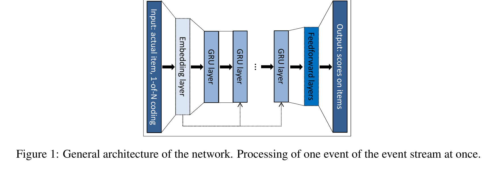
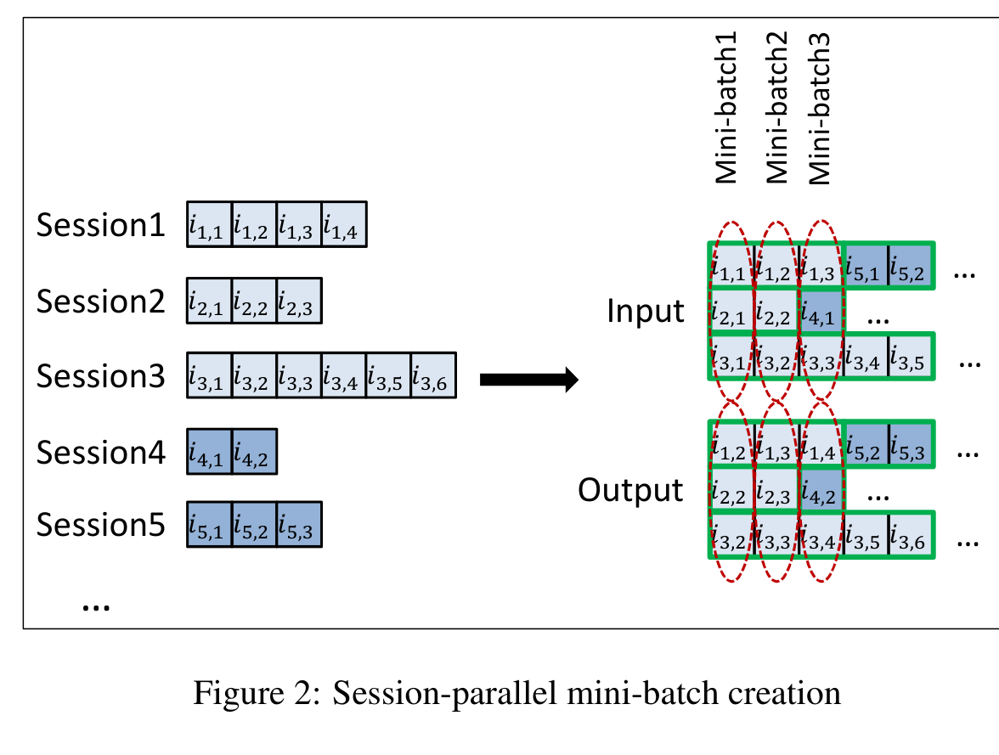

# GRU4Rec: Session-based Recommendations with Recurrent Neural Networks

> 巴拉兹·希达西（Balázs Hidasi）\* | Gravity R&D 公司，匈牙利布达佩斯 | balazs.hidasi@gravityrd.com
>
> 亚历山德罗斯·卡拉佐格卢（Alexandros Karatzoglou） | Telefonica Research，西班牙巴塞罗那 | alexk@tid.es
>
> 利纳斯·巴尔特鲁纳斯（Linas Baltrunas）† | Netflix，美国加州洛杉矶 | lbaltrunas@netflix.com
>
> 多蒙科什·蒂克（Domonkos Tikk） | Gravity R&D 公司，匈牙利布达佩斯 | domonkos.tikk@gravityrd.com
>
> \*作者在研究该主题期间在 Telefonica Research 工作了 3 个月。
>
> †本工作是在该作者作为西班牙巴塞罗那 Telefonica Research 小组成员期间完成的。

本文把循环神经网络（RNN）首次系统地应用于**会话推荐（session-based recommendation）**这一此前被机器学习与推荐系统社区长期忽视的问题，并用"会话并行 mini-batch + 输出负采样 + 排名损失"三处定制改造标准 GRU，**在 RSC15 与 VIDEO 两个数据集上把 Recall@20 较最强基线 Item-KNN 提升约 20%–30%**。

核心内容：

- 电商与新闻/媒体站点普遍缺少长期用户画像，矩阵分解（MF）等经典方法因无用户 ID 而失效，实践中只能退回 item-to-item 相似度，且这类方法只看用户最后一次点击、忽略历史点击信息
- 将每个会话建模为序列：GRU 以当前会话状态为输入，输出每个 item 成为"下一个 item"的偏好分数，隐状态 $h_t$ 按 $h_t = g(Wx_t + Uh_{t-1})$ 更新
- 三项针对性改造：会话并行 mini-batch（把不同会话同时刻事件拼成批、会话结束时重置隐状态）、按流行度采样输出（用批内其他样例当作负样本）、排名损失（BPR 与自研 TOP1）
- 评估协议：以 recall@20 与 MRR@20 为主指标，RSC15 全量 37,483 个 item 排序，VIDEO 与 top-30,000 最流行 item 比对

- 实验两大数据集：RSC15（约 797 万会话、3164 万次点击、37,483 个 item）与 VIDEO（约 300 万会话、1300 万次观看、33 万视频）

关键发现：

- 单层 GRU + 1000 隐单元 + TOP1 损失在 RSC15 上 Recall@20 达 0.6206（较 Item-KNN +22.53%）、MRR@20 达 0.2693（+31.49%）；在 VIDEO 上 Recall@20 达 0.6624（+20.27%）
- 成对排名损失（BPR/TOP1）表现稳定且随单元数增加持续提升；而逐点损失（交叉熵）数值不稳定——RSC15 与 VIDEO 各 100 次随机运行中分别只有 10 个、6 个网络稳定
- 消融结论：单层 GRU 最佳、加层反而更差；1-of-N 编码优于额外嵌入层与"会话全部历史事件"输入；用 tanh 做输出层激活有利
- 1000 隐单元在 GPU 上几小时可训练完，可与 Item-KNN 相比获得约 20%–30% 的准确率增益

---

## 摘要

我们在一新领域——推荐系统——上应用循环神经网络（RNN，Recurrent Neural Network）。真实世界的推荐系统经常面临这样的问题：只能基于简短的会话数据（例如一个小型运动用品网站）做推荐，而不是像 Netflix 那样拥有较长的用户历史。在这种情况下，经常被称赞的矩阵分解（matrix factorization）方法并不准确。实践中通常通过求助于 item-to-item 推荐（即推荐相似 item）来克服这个问题。我们认为，通过对整个会话建模，可以提供更准确的推荐。因此，我们提出一种基于 RNN 的会话推荐方法。我们的方法还考虑了任务的实际方面，并对经典 RNN 做了几处修改，例如引入排名损失函数，使其更适合这一特定问题。在两个数据集上的实验结果表明，与广泛使用的各方法相比有显著改进。

> [!NOTE]
>
> TODO：会话推荐是指什么？

## 1. 引言

会话推荐在机器学习与推荐系统社区中是一个相对未受重视的问题。许多电商推荐系统（尤其是小型零售商的系统）以及大多数新闻与媒体站点，通常不会在较长时间内持续跟踪访问其网站用户的 user-id。虽然 cookie 和浏览器指纹识别（browser fingerprinting）可以提供一定程度的用户可识别性，但这类技术往往不够可靠，而且还会引发隐私担忧。即使可以跟踪，很多用户在一个较小的电商网站上也只有一两次会话；而在某些领域（例如分类信息网站），用户的行为常常表现出会话型（session-based）特征。因此，同一用户的后续会话应当被独立处理。因此，大多数用于电商的会话推荐系统都基于相对简单的方法，这些方法不使用用户画像，例如 item-to-item 相似度、共现（co-occurrence）或转移概率。虽然有效，但这些方法往往只考虑用户的最后一次点击或选择，而忽略了以往点击的信息。

推荐系统中最常用的方法是因子模型（Koren et al., 2009; Weimer et al., 2007; Hidasi & Tikk, 2012）[9,21,5] 和邻域方法（Sarwar et al., 2001; Koren, 2008）[15,8]。因子模型的工作原理是把稀疏的用户-item 交互矩阵分解为一组 $d$ 维向量，数据集中每个 item 和每个用户各对应一个向量。然后，推荐问题被视为一个矩阵补全/重构问题，即用 latent 因子向量来填补缺失项，例如取相应的用户-item latent 因子的点积。由于缺少用户画像，因子模型很难应用于会话推荐。另一方面，邻域方法依赖于计算 item（或用户）之间的相似度，其基础是 item 在会话（或用户画像）中的共现。邻域方法已被广泛应用于会话推荐。

过去几年里，深度神经网络在图像识别和语音识别等许多任务中取得了巨大成功（Russakovsky et al., 2014; Hinton et al., 2012）[13,7]，这些任务中非结构化数据要通过若干卷积层和标准（通常是线性修正的）单元层来处理。序列数据建模最近也吸引了很多关注，各种 RNN 变体成为这类数据的首选模型。序列建模的应用范围从机器翻译到对话建模再到图像描述。

虽然 RNN 已经在上述领域中取得了显著的成功，但推荐系统领域受到的关注很少。在本工作中，我们认为 RNN 可以以显著的效果应用于会话推荐；我们处理这类稀疏序列数据建模时出现的问题，并通过引入一种适用于这些模型训练任务的新型排名损失函数，把 RNN 模型适配到推荐场景。将会话推荐问题与一些 NLP 相关问题进行比较，只要它们都处理序列，在建模方面就存在一些相似之处。在会话推荐中，我们可以把用户进入网站时点击的第一个 item 视为 RNN 的初始输入，然后基于这个初始输入查询模型以获得推荐。用户的每一次连续点击随后都会产生一个输出（一次推荐），该输出依赖于之前的所有点击。通常，推荐系统中可供选择的 item 集可以是数万个甚至数十万个。除了 item 集规模大之外，另一个挑战是点击流（click-stream）数据集通常相当庞大，因此训练时间和可扩展性非常重要。如同大多数信息检索和推荐任务一样，我们感兴趣的是把建模能力集中在用户可能感兴趣的 top items 上；为此，我们使用排名损失函数来训练 RNN。

## 2. 相关工作

### 2.1 会话推荐

推荐系统领域的大量工作都聚焦于这样一种设置下的模型：存在用户标识符且可以构建清晰的用户画像。在这种设置下，矩阵分解方法和邻域模型主导了文献，也被在线使用。会话推荐中使用的主要方法之一、也是用户画像缺失问题的自然解决方案，是 item-to-item 推荐方法（Sarwar et al., 2001; Linden et al., 2003）[15,10]。在这种设置下，从可用的会话数据中预先计算出一个 item 到 item 的相似度矩阵，即在会话中经常一起被点击的 item 被视为相似的。然后在会话期间直接使用这个相似度矩阵，来推荐与用户当前所点击 item 最相似的 item。尽管简单，这种方法已被证明是有效的，并被广泛使用。虽然有效，但这类方法只考虑用户的最后一次点击，实际上忽略了以往点击的信息。

一种稍微不同的会话推荐方法涉及马尔可夫决策过程（MDP，Markov Decision Process）(Shani et al., 2002) [16]。MDP 是顺序随机决策问题的模型。MDP 定义为一个四元组 $\langle S, A, Rwd, tr \rangle$ ，其中 $S$ 是状态集， $A$ 是动作集， $Rwd$ 是奖励函数， $tr$ 是状态转移函数。在推荐系统中，动作可以等同于推荐，最简单的 MDP 本质上就是一阶马尔可夫链，其中下一个推荐可以基于 item 之间的转移概率直接计算。在会话推荐中应用马尔可夫链的主要问题是：当试图包含用户选择的所有可能序列时，状态空间很快就会变得难以管理。

广义因子分解框架（GFF，General Factorization Framework）的扩展版本 (Hidasi & Tikk, 2015) [6] 能够使用会话数据进行推荐。它用事件之和来建模一个会话。它使用两种 item 的 latent 表示，一种表示 item 本身，另一种用于表示作为会话一部分的 item。然后，会话表示为"会话的一部分"这种 item 表示的特征向量的平均值。然而，这种方法不考虑会话内部的任何顺序。

### 2.2 深度学习在推荐系统中的应用

神经网络文献中最早的相关方法之一是在协同过滤（Collaborative Filtering）中使用受限玻尔兹曼机（RBM，Restricted Boltzmann Machine）（Salakhutdinov et al., 2007）[14]。在这项工作中，RBM 被用来建模 user-item 交互并进行推荐。该模型已被证明是最佳表现的协同过滤模型之一。深度模型已被用于从音乐或图像等非结构化内容中提取特征，然后与更传统的协同过滤模型一起使用。在 Van den Oord et al. (2013) [19] 中，一个卷积深度网络被用来从音乐文件中提取特征，然后用于因子模型。最近，Wang et al. (2015) [20] 引入了一种更通用的方法，用一个深度网络从任意类型的 item 中提取通用内容特征，然后将这些特征并入一个标准的协同过滤模型以增强推荐性能。这种方法在 user-item 交互信息不足的设置中似乎特别有用。

## 3. 用 RNN 做推荐

循环神经网络是为建模变长序列数据而设计的。RNN 与常规前馈深度模型的主要区别在于构成网络的单元内部存在一个内部隐状态（hidden state）。标准 RNN 用下面的更新函数更新其隐状态 $h$ ：

$$
h_t = g(Wx_t + Uh_{t-1}) \qquad (1)
$$

其中 $g$ 是一个平滑且有界的函数，例如 logistic sigmoid 函数； $x_t$ 是单元在时间 $t$ 的输入。给定当前状态 $h_t$ ，RNN 输出一个关于序列下一个元素的概率分布。

门控循环单元（GRU，Gated Recurrent Unit）（Cho et al., 2014）[1] 是一种更精细的 RNN 单元模型，旨在解决梯度消失（vanishing gradient）问题。GRU 的门本质上学习何时以及以多大程度更新单元的隐状态。GRU 的激活是先前激活与候选激活 $\hat{h}_t$ 之间的线性插值：

$$
h_t = (1 - z_t) h_{t-1} + z_t \hat{h}_t \qquad (2)
$$

其中更新门（update gate）由下式给出：

$$
z_t = \sigma(W_z x_t + U_z h_{t-1}) \qquad (3)
$$

而候选激活函数 $\hat{h}_t$ 以类似的方式计算：

$$
\hat{h}_t = \tanh \left( Wx_t + U(r_t \odot h_{t-1}) \right) \qquad (4)
$$

最后，重置门（reset gate） $r_t$ 由下式给出：

$$
r_t = \sigma(W_r x_t + U_r h_{t-1}) \qquad (5)
$$

### 3.1 定制 GRU 模型

我们在会话推荐模型中使用基于 GRU 的 RNN。网络的输入是会话的实际状态，而输出是会话中下一个事件的 item。会话的状态既可以是实际事件的 item，也可以是到目前为止会话中的事件。前者使用 1-of-N 编码，即输入向量的长度等于 item 的数量，只有与当前激活 item 对应的那个坐标为 1，其他坐标都是 0。后者使用这些表示的加权和，其中较早发生的事件会被衰减。为了稳定性起见，输入向量随后被归一化。我们预期这会有帮助，因为它强化了记忆效应：强化了那些 RNN 的较长记忆并未很好捕获的、非常局部的排序约束。我们还尝试添加一个额外的嵌入层，但 1-of-N 编码总是表现更好。

网络的核心是一个或多个 GRU 层，可以在最后一层与输出之间添加额外的前馈层。输出是 item 的预测偏好，即每个 item 成为会话中下一个的似然概率。当使用多个 GRU 层时，前一层的隐状态是下一层的输入。输入也可以可选地连接到网络更深的 GRU 层，因为我们发现这可以提高性能。完整的架构见图 1，该图描绘了事件时间序列中单个事件的表示。

**图 1：** 网络的总体架构。一次性处理事件流中的一个事件。

由于推荐系统不是循环神经网络的主要应用领域，我们修改了基础网络以更好地适应这个任务。我们还考虑了实际问题，以便我们的解决方案可以应用于生产环境。

#### 3.1.1 会话并行 mini-batch

自然语言处理任务中的 RNN 通常使用序列内 mini-batch。例如，常见做法是在句子的单词上使用一个滑动窗口，并将这些窗口化的片段并排放置以构成 mini-batch。这不适合我们的任务，原因如下：(1) 会话的长度可能非常不同，甚至比句子还更不同：有些会话只包含 2 个事件，而另一些可能跨越几百个事件；(2) 我们的目标是捕获会话如何随时间演化，因此将其分解成片段没有意义。因此，我们使用会话并行的（session-parallel）mini-batch。首先，我们为会话创建一个顺序。然后，我们用前 $X$ 个会话的第一个事件构成第一个 mini-batch 的输入（期望的输出是我们激活会话的第二个事件）。第二个 mini-batch 由第二个事件构成，依此类推。如果任何会话结束，就把下一个可用的会话放到它的位置。会话被假定为独立的，因此在发生这种切换时我们重置相应的隐状态。更多细节见图 2。

**图 2：** 会话并行 mini-batch 的创建

#### 3.1.2 输出采样

当 item 数量很大时，推荐系统尤其有用。即使对于一个中等规模的网店，这也是数万的范围；但在更大的网站上，拥有几十万甚至几百万个 item 并不罕见。在每个步骤为每个 item 计算分数，将使算法的时间复杂度与 item 数量和事件数量的乘积成正比。这在实践中是不可用的。因此，我们必须对输出进行采样，只为 item 的一个小子集计算分数。这也意味着只有部分权重会被更新。除了期望的输出之外，我们还需要为一些负例计算分数，并修改权重，使期望的输出排得很靠前。

对任意缺失事件的合理解释是：用户不知道 item 的存在，因此没有交互。然而，也存在一种低概率情况：用户知道该 item，但选择不交互，因为她不喜欢该 item。item 越流行，用户知道它的概率越大，因此缺失事件更有可能是表达不喜欢。所以，我们应该按 item 流行度的比例来采样 item。我们并不是为每个训练样例生成单独的样本，而是把 mini-batch 中其他训练样例里的 item 用作负例。这种方法的好处是我们可以跳过采样，从而进一步减少计算时间。此外，实现层面也有好处：从让代码更简单到更快的矩阵运算。同时，这种方法也是一种基于流行度的采样，因为一个 item 出现在 mini-batch 其他训练样例中的可能性与其流行度成正比。

#### 3.1.3 排名损失

推荐系统的核心是基于相关性的 item 排序。虽然这个任务也可以被解释为分类任务，但 learning-to-rank 方法（Rendle et al., 2009; Shi et al., 2012; Steck, 2015）[12,17,18] 通常优于其他方法。排序可以是逐点的（pointwise）、成对的（pairwise）或列表式的（listwise）。逐点排序独立地估计每个 item 的分数或排名，损失的定义使得相关 item 的排名应该低。成对排序比较一个正 item 和一个负 item 的分数或排名，损失强制正 item 的排名应低于负 item。列表式排序使用所有 item 的分数和排名，并与完美排序进行比较。由于它包含排序操作，通常计算代价更高，因此不常使用。而且，如果只有一个相关 item——就像我们的情况——列表式排序可以通过成对排序来解决。

我们为解决方案包含了若干逐点和成对排名损失。我们发现逐点排序在此网络下不稳定（更多评论见第 4 节）。另一方面，成对排名损失表现良好。我们使用以下两种。

- **BPR：** 贝叶斯个性化排序（BPR，Bayesian Personalized Ranking）（Rendle et al., 2009）[12] 是一种使用成对排名损失的矩阵分解方法。它比较一个正 item 和一个采样的负 item 的分数。在这里，我们比较正 item 的分数与几个采样 item 的分数，并把它们的平均值用作损失。会话中给定点的损失定义为 $L_s$ ：

$$
L_s = -\frac{1}{N_S} \cdot \sum_{j=1}^{N_S} \log \left( \sigma \left( \hat{r}_{s,i} - \hat{r}_{s,j} \right) \right)
$$

其中 $N_S$ 是样本大小， $\hat{r}_{s,k}$ 是会话给定点上 item $k$ 的分数， $i$ 是期望的 item（会话中的下一个 item）， $j$ 是负样本。

- **TOP1：** 这个排名损失是我们为此任务设计的。它是相关 item 相对排名的正则化近似。相关 item 的相对排名由 $\frac{1}{N_S} \cdot \sum_{j=1}^{N_S} \mathbb{I}\{ \hat{r}_{s,j} > \hat{r}_{s,i} \}$ 给出。我们用 sigmoid 近似 $\mathbb{I}\{ \cdot \}$ 。针对这个进行优化会修改参数，使得 $i$ 的分数变高。然而这并不稳定，因为某些正 item 也充当负例，导致分数往往会越来越高。为避免这一点，我们希望强制负例的分数在零附近。这是对负 item 分数的自然预期。因此，我们在损失中加入一个正则项。重要的是，这个项要与相对排名在同一量级，并且行为类似。最终的损失函数如下：

$$
L_s = \frac{1}{N_S} \cdot \sum_{j=1}^{N_S} \sigma \left( \hat{r}_{s,j} - \hat{r}_{s,i} \right) + \sigma \left( \hat{r}_{s,j}^2 \right)
$$

## 4. 实验

我们在两个数据集上把所提出的递归神经网络与流行的基线方法进行对比。

第一个数据集是 RecSys Challenge 2015 ¹ 的数据集。该数据集包含一个电商网站的点击流，其中有时会以购买事件结束。我们使用该挑战的训练集，且只保留点击事件。我们过滤掉长度为 1 的会话。网络在约 6 个月的数据上进行训练，包含 7,966,257 个会话、31,637,239 次点击、37,483 个 item。我们使用随后一天（subsequent day）的会话进行测试。每个会话被分配到训练集或测试集，我们不会在会话中途拆分数据。因为协同过滤方法的性质，我们从测试集中过滤掉所点击 item 不在训练集中的点击。长度为 1 的会话也从测试集中移除。预处理之后，测试集剩下 15,324 个会话、71,222 个事件。这个数据集简称为 RSC15。

第二个数据集从一个类似 YouTube 的 OTT 视频服务平台收集。收集那些观看视频达到至少一定时长的事件。只有某些地区被纳入这次收集，持续时间略短于 2 个月。在这段时间内，每段视频之后会在屏幕左侧提供 item-to-item 推荐。这些推荐由一系列不同的算法提供，并影响了用户的行为。预处理步骤与另一个数据集类似，另外还过滤掉了很长的会话，因为它们很可能是由爬虫（bots）产生的。训练数据由上述时期除最后一天外的所有数据组成，约有 300 万会话、1300 万次观看事件、33 万个视频。测试集包含收集期最后一天的会话，约有 3.7 万个会话、18 万次观看事件。这个数据集简称为 VIDEO。

评估方式如下：逐个提供会话的事件，并检查下一个事件的 item 的排名。会话结束后，GRU 的隐状态被重置为零。item 按分数降序排列，它们在该列表中的位置就是它们的排名。对于 RSC15，训练集的全部 37,483 个 item 都被排序。然而，由于 VIDEO 的 item 数量太大，这样做不切实际。在那里，我们把期望 item 与最流行的 30,000 个 item 进行排名对比。这对评估几乎没有影响，因为很少被访问的 item 往往得分很低。而且，基于流行度的预过滤在实用的推荐系统中也很常见。

由于推荐系统一次只能推荐少数几个 item，用户可能实际选择的 item 应该位于列表的最前面几个之中。因此，我们的主要评估指标是 recall@20，即在所有测试案例中，期望 item 出现在 top-20 item 中的案例所占的比例。只要 item 在 top-N 之内，Recall 就不考虑它的实际排名。这很好地模拟了某些实际场景：没有对推荐进行高亮，绝对顺序并不重要。Recall 通常也与重要的在线 KPI（例如点击率（CTR，Click-Through Rate））（Liu et al., 2012; Hidasi & Tikk, 2012）[11,5] 有很好的相关性。实验中使用的第二个指标是 MRR@20（平均倒数排名，Mean Reciprocal Rank）。它是期望 item 的倒数排名的平均值。如果排名超过 20，则倒数排名设为零。MRR 考虑了 item 的排名，这在推荐顺序很重要的场景下是有意义的（例如排名靠后的 item 只有滚动之后才可见）。

### 4.1 基线方法

我们把所提出的网络与一组常用的基线方法进行比较。

- **POP：** 流行度预测器，总是推荐训练集中最流行的 item。尽管很简单，它在某些领域往往是强势基线。
- **S-POP：** 这个基线推荐当前会话中最流行的 item。随着 item 获得更多事件，推荐列表在会话期间会变化。并列名次使用全局流行度值来打破。这个基线在重复性高的领域很强。
- **Item-KNN：** 这个基线推荐与当前 item 相似的 item，相似度定义为它们会话向量的余弦相似度，即两个 item 在会话中共现的次数除以各自出现的会话数的乘积的平方根。还包含正则化，以避免很少被访问的 item 之间偶然的高相似度。这个基线是实际系统中最常见的 item-to-item 解决方案之一，它提供"查看过此 item 的其他用户也查看了这些"设置下的推荐。尽管简单，它通常是一个强势基线（Linden et al., 2003; Davidson et al., 2010）[10,3]。

¹ http://2015.recsyschallenge.com/

**表 1：用各基线方法得到的 Recall@20 和 MRR@20**

| 基线 | RSC15 Recall@20 | RSC15 MRR@20 | VIDEO Recall@20 | VIDEO MRR@20 |
| --- | --- | --- | --- | --- |
| POP | 0.0050 | 0.0012 | 0.0499 | 0.0117 |
| S-POP | 0.2672 | 0.1775 | 0.1301 | 0.0863 |
| Item-KNN | 0.5065 | 0.2048 | 0.5508 | 0.3381 |
| BPR-MF | 0.2574 | 0.0618 | 0.0692 | 0.0374 |

- **BPR-MF：** BPR-MF（Rendle et al., 2009）[12] 是常用的矩阵分解方法之一。它通过 SGD（随机梯度下降，Stochastic Gradient Descent）优化一个成对排名目标函数（见第 3 节）。矩阵分解不能直接应用于会话推荐，因为新的会话没有预先计算好的特征向量。不过，我们可以通过把会话中到目前为止出现过的 item 的 item 特征向量的平均值用作 user 特征向量来克服这一点。换句话说，我们对一个可推荐 item 与到目前为止会话中 item 的特征向量之间的相似度取平均。

表 1 显示了各基线的结果。Item-KNN 方法明显优于其他方法。

### 4.2 参数与结构优化

我们通过在参数空间中随机选取的点上为每个数据集和损失函数运行 100 次实验来优化超参数。最佳参数化还通过对每个参数进行单独优化进一步调优。所有情况下的隐单元数量都设为 100。然后把表现最佳的参数用于不同规模的隐层。优化在一个独立的验证集上进行。然后，网络在训练集加验证集上重新训练，并在最终的测试集上评估。

表现最佳的参数化总结在表 2 中。权重矩阵用从 $[-x, x]$ 均匀抽取的随机数初始化，其中 $x$ 取决于矩阵的行数和列数。我们尝试了 rmsprop（Dauphin et al., 2015）[2] 和 adagrad（Duchi et al., 2011）[4]。我们发现 adagrad 的结果更好。

我们简要尝试了 GRU 之外的其他单元。我们发现经典 RNN 单元和 LSTM（Long Short-Term Memory，长短期记忆网络）都表现更差。

我们尝试了几种损失函数。基于逐点排名的损失，例如交叉熵和 MRR 优化（如 Steck (2015) [18] 中的），通常不稳定，即使加上正则化也是如此。例如，对于 RSC15 和 VIDEO，100 次随机运行中分别只有 10 个和 6 个数值稳定的网络通过交叉熵得到。我们假设这是因为独立地尝试为期望 item 获得高分，而对负样本的负向推动很小。另一方面，基于成对排名的损失表现良好。我们发现第 3 节中引入的损失（BPR 和 TOP1）表现最好。

考察了几种架构，发现单层 GRU 单元是表现最好的。增加更多的层总是导致更差的性能，无论是训练损失还是测试集上测得的 recall 和 MRR 都是如此。我们假设这是因为会话的寿命通常很短，不需要以不同分辨率的多个时间尺度来正确表示。然而，确切的原因目前仍未知，需要进一步研究。

**表 2：各数据集/损失函数的最佳参数化**

| 数据集 | 损失 | Mini-batch | Dropout | 学习率 | 动量（Momentum） |
| --- | --- | --- | --- | --- | --- |
| RSC15 | TOP1 | 50 | 0.5 | 0.01 | 0 |
| RSC15 | BPR | 50 | 0.2 | 0.05 | 0.2 |
| RSC15 | Cross-entropy | 500 | 0 | 0.01 | 0 |
| VIDEO | TOP1 | 50 | 0.4 | 0.05 | 0 |
| VIDEO | BPR | 50 | 0.3 | 0.1 | 0 |
| VIDEO | Cross-entropy | 200 | 0.1 | 0.05 | 0.3 |

使用 item 的嵌入得到的性能略差，因此我们保留了 1-of-N 编码。另外，把会话中之前的所有事件都放到输入上而不是只放前一个事件，并没有带来额外的准确率提升；这并不奇怪，因为 GRU——与 LSTM 一样——同时具有长期和短期记忆。在 GRU 层之后添加额外的前馈层也没有帮助。然而，增大 GRU 层的规模提高了性能。我们还发现，用 tanh 作为输出层的激活函数是有益的。

### 4.3 结果

表 3 显示了表现最佳的网络的结果。VIDEO 数据上用 1000 个隐单元的交叉熵数值上不稳定，因此我们不给出该场景的结果。这些结果与最佳基线（Item-KNN）进行了对比。我们给出了 100 和 1000 个隐单元的结果。运行时间取决于参数和数据集。一般来说，在 GeForce GTX Titan X GPU 上，较小变体与较大变体之间的运行时间差异不是太大，网络的训练可以在几个小时内完成 ²。在 CPU 上，较小的网络可以在实际可接受的时间内训练完成。推荐系统常常需要频繁重新训练，因为新用户和 item 经常被引入。

基于 GRU 的方法在两个数据集、两个评估指标上都比 Item-KNN 有显著的提升，即使单元数为 100 也是如此 ³。进一步增加单元数会改善成对损失的结果，但交叉熵的准确率反而下降。尽管交叉熵在 100 个隐单元时给出更好的结果，但随着单元数增加，成对损失变体超过了这些结果。虽然增加单元数会增加训练时间，但我们发现在 GPU 上从 100 个单元迁移到 1000 个并不算太贵。此外，由于网络单独尝试提高目标 item 的分数，而其他 item 的负向推动相对较小，基于交叉熵的损失被发现数值不稳定。因此，我们建议使用两种成对损失中的任意一种。TOP1 损失在这两个数据集上表现稍好，比表现最佳的基线带来约 20%–30% 的准确率增益。

**表 3：不同类型的单层 GRU 的 Recall@20 和 MRR@20，与最佳基线（Item-KNN）对比。每个数据集的最佳结果以粗体突出显示。**

| 损失 / #单元 | RSC15 Recall@20 | RSC15 MRR@20 | VIDEO Recall@20 | VIDEO MRR@20 |
| --- | --- | --- | --- | --- |
| TOP1 100 | 0.5853 (+15.55%) | 0.2305 (+12.58%) | 0.6141 (+11.50%) | 0.3511 (+3.84%) |
| BPR 100 | 0.6069 (+19.82%) | 0.2407 (+17.54%) | 0.5999 (+8.92%) | 0.3260 (−3.56%) |
| Cross-entropy 100 | 0.6074 (+19.91%) | 0.2430 (+18.65%) | 0.6372 (+15.69%) | 0.3720 (+10.04%) |
| **TOP1 1000** | 0.6206 (+22.53%) | **0.2693 (+31.49%)** | **0.6624 (+20.27%)** | **0.3891 (+15.08%)** |
| BPR 1000 | **0.6322 (+24.82%)** | 0.2467 (+20.47%) | 0.6311 (+14.58%) | 0.3136 (−7.23%) |
| Cross-entropy 1000 | 0.5777 (+14.06%) | 0.2153 (+5.16%) | – | – |

## 5. 结论与未来工作

在本文中，我们把一种现代循环神经网络（GRU）应用到了新的应用领域：推荐系统。我们选择会话推荐作为任务，因为它是一个实际重要但研究不足的领域。我们修改了基本 GRU 以更好地适应任务，引入了会话并行 mini-batch、基于 mini-batch 的输出采样和排名损失函数。我们表明，我们的方法可以显著优于用于该任务的流行基线。我们认为，我们的工作既可以作为深度学习在推荐系统中应用的基础，也可以作为一般的会话推荐的基础。

²使用对 GPU 上的 subtensor 算子进行了修复的 Theano。

³除非在 VIDEO 数据上使用 BPR 损失并评估 MRR。

我们近期的工作将集中在更彻底地考察这个所提出的网络上。我们还计划让网络在一个自动提取的 item 表示上训练，该表示建立在 item 自身内容（例如缩略图、视频、文本）的基础上，而不是当前的输入。

## 致谢

本研究工作获得了欧盟第七框架计划（FP7/2007-2013）在 CrowdRec 拨款协议号 610594 下的资助。

## 参考文献

[1] Cho, Kyunghyun, van Merriënboer, Bart, Bahdanau, Dzmitry, and Bengio, Yoshua. **On the properties of neural machine translation: Encoder-decoder approaches**. arXiv preprint arXiv:1409.1259, 2014.

[2] Dauphin, Yann N, de Vries, Harm, Chung, Junyoung, and Bengio, Yoshua. Rmsprop and equilibrated adaptive learning rates for non-convex optimization. arXiv preprint arXiv:1502.04390, 2015.

[3] Davidson, James, Liebald, Benjamin, Liu, Junning, et al. **The YouTube video recommendation system**. In Recsys'10: ACM Conf. on Recommender Systems, pp. 293–296, 2010. ISBN 978-1-60558-906-0.

[4] Duchi, John, Hazan, Elad, and Singer, Yoram. Adaptive subgradient methods for online learning and stochastic optimization. The Journal of Machine Learning Research, 12:2121–2159, 2011.

[5] Hidasi, B. and Tikk, D. Fast ALS-based tensor factorization for context-aware recommendation from implicit feedback. In ECML-PKDD'12, Part II, number 7524 in LNCS, pp. 67–82. Springer, 2012.

[6] Hidasi, Balázs and Tikk, Domonkos. General factorization framework for context-aware recommendations. Data Mining and Knowledge Discovery, pp. 1–30, 2015. ISSN 1384-5810. doi: 10.1007/s10618-015-0417-y. URL http://dx.doi.org/10.1007/s10618-015-0417-y.

[7] Hinton, Geoffrey, Deng, Li, Yu, Dong, Dahl, George E, Mohamed, Abdel-rahman, Jaitly, Navdeep, Senior, Andrew, Vanhoucke, Vincent, Nguyen, Patrick, Sainath, Tara N, et al. Deep neural networks for acoustic modeling in speech recognition: The shared views of four research groups. Signal Processing Magazine, IEEE, 29(6):82–97, 2012.

[8] Koren, Y. **Factorization meets the neighborhood: a multifaceted collaborative filtering model.** In SIGKDD'08: ACM Int. Conf. on Knowledge Discovery and Data Mining, pp. 426–434, 2008.

[9] Koren, Yehuda, Bell, Robert, and Volinsky, Chris. Matrix factorization techniques for recommender systems. Computer, 42(8):30–37, 2009.

[10] Linden, G., Smith, B., and York, J. **Amazon.com recommendations: Item-to-item collaborative filtering**. Internet Computing, IEEE, 7(1):76–80, 2003.

[11] Liu, Qiwen, Chen, Tianjian, Cai, Jing, and Yu, Dianhai. Enlister: Baidu's recommender system for the biggest Chinese Q&A website. In RecSys-12: Proc. of the 6th ACM Conf. on Recommender Systems, pp. 285–288, 2012.

[12] Rendle, S., Freudenthaler, C., Gantner, Z., and Schmidt-Thieme, L. **BPR: Bayesian personalized ranking from implicit feedback**. In UAI'09: 25th Conf. on Uncertainty in Artificial Intelligence, pp. 452–461, 2009. ISBN 978-0-9749039-5-8.

[13] Russakovsky, Olga, Deng, Jia, Su, Hao, Krause, Jonathan, Satheesh, Sanjeev, Ma, Sean, Huang, Zhiheng, Karpathy, Andrej, Khosla, Aditya, Bernstein, Michael S., Berg, Alexander C., and Li, Fei-Fei. Imagenet large scale visual recognition challenge. CoRR, abs/1409.0575, 2014. URL http://arxiv.org/abs/1409.0575.

[14] Salakhutdinov, Ruslan, Mnih, Andriy, and Hinton, Geoffrey. Restricted boltzmann machines for collaborative filtering. In Proceedings of the 24th international conference on Machine learning, pp. 791–798. ACM, 2007.

[15] Sarwar, Badrul, Karypis, George, Konstan, Joseph, and Riedl, John. **Item-based collaborative filtering recommendation algorithms**. In Proceedings of the 10th international conference on World Wide Web, pp. 285–295. ACM, 2001.

[16] Shani, Guy, Brafman, Ronen I, and Heckerman, David. An mdp-based recommender system. In Proceedings of the Eighteenth conference on Uncertainty in artificial intelligence, pp. 453–460. Morgan Kaufmann Publishers Inc., 2002.

[17] Shi, Yue, Karatzoglou, Alexandros, Baltrunas, Linas, Larson, Martha, Oliver, Nuria, and Hanjalic, Alan. Climf: Learning to maximize reciprocal rank with collaborative less-is-more filtering. In Proceedings of the Sixth ACM Conference on Recommender Systems, RecSys '12, pp. 139–146, New York, NY, USA, 2012. ACM. ISBN 978-1-4503-1270-7. doi: 10.1145/2365952.2365981. URL http://doi.acm.org/10.1145/2365952.2365981.

[18] Steck, Harald. Gaussian ranking by matrix factorization. In Proceedings of the 9th ACM Conference on Recommender Systems, RecSys '15, pp. 115–122, New York, NY, USA, 2015. ACM. ISBN 978-1-4503-3692-5. doi: 10.1145/2792838.2800185. URL http://doi.acm.org/10.1145/2792838.2800185.

[19] Van den Oord, Aaron, Dieleman, Sander, and Schrauwen, Benjamin. Deep content-based music recommendation. In Advances in Neural Information Processing Systems, pp. 2643–2651, 2013.

[20] Wang, Hao, Wang, Naiyan, and Yeung, Dit-Yan. Collaborative deep learning for recommender systems. In Proceedings of the 21th ACM SIGKDD International Conference on Knowledge Discovery and Data Mining, KDD '15, pp. 1235–1244, New York, NY, USA, 2015. ACM.

[21] Weimer, Markus, Karatzoglou, Alexandros, Le, Quoc Viet, and Smola, Alex. Maximum margin matrix factorization for collaborative ranking. Advances in neural information processing systems, 2007.