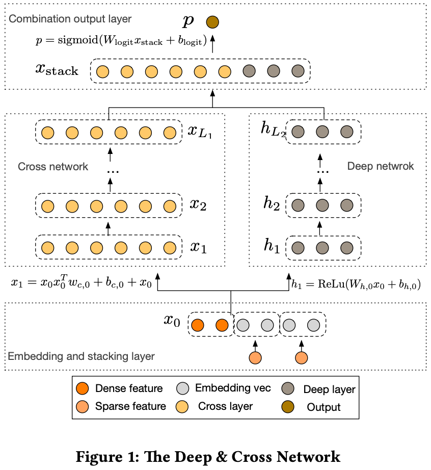

# Deep & Cross Network for Ad Click Predictions (DCN)

> Ruoxi Wang, Gang Fu, Bin Fu, Mingliang Wang | Stanford University & Google Inc., 2017

本文介绍了 Deep & Cross Network for Ad Click Predictions（DCN）。核心内容：

- **DCN** 提出了一种**交叉网络（Cross Network）**，以高效学习 **显式的高阶特征交叉**
- **Cross Network**：每一层计算 $x_{l+1} = x_0 \cdot (w_l^T x_l) + x_l$，自动学习特征交叉
- 与 Deep 网络联合训练，结合交叉网络的显式交叉和 DNN 的隐式交叉
- 参数量与层数**线性增长**，适合处理稀疏特征

关键发现：

- 在 Criteo 等广告数据集上，DCN 以更少的参数量实现了超越 DNN 和 FM 的性能

---

## 摘要

特征工程一直是许多预测模型成功的关键。然而，这一过程并不简单，通常需要手动特征工程或穷举搜索。深度神经网络（DNN）能够自动学习特征交互，但它们隐式地生成所有交互，并且不一定能**高效地学习所有类型的交叉特征**。在本文中，我们提出了 Deep & Cross Network（DCN），它保留了 DNN 模型的优势，除此之外，还引入了一种新颖的交叉网络，能够更高效地学习 **特定有界度的特征交互**。特别地，DCN 在**每一层显式地应用特征交叉**，无需手动特征工程，并且为 DNN 模型增加的**可忽略不计的额外复杂度**。我们的实验结果表明，在点击率预测数据集 和 密集型分类数据集上，DCN 在模型准确性和内存使用方面均优于现有最先进算法。

## 1 引言

点击率（CTR）预测是一个大规模问题，对于价值数十亿美元的在线广告行业至关重要。在广告行业中，广告主向发布商付费，以在发布商的网站上展示广告。一种流行的付费模式是每次点击成本（CPC）模式，即只有**在发生点击时才会向广告主收费**。因此，发布商的收入在很大程度上依赖于准确预测点击率的能力。

识别频繁出现的预测性特征，同时探索未见过的或罕见的交叉特征，是做出良好预测的关键。然而，Web 级推荐系统的数据大多是离散型和类别型的，导致特征空间庞大且稀疏，给特征探索带来了挑战。**这使得大多数大规模系统局限于线性模型**，如逻辑回归。

线性模型 [3] 简单、可解释且易于扩展，但其表达能力有限。另一方面，交叉特征已被证明在提高模型表达能力方面具有重要意义。不幸的是，识别此类特征通常需要手动特征工程或穷举搜索；而且，泛化到未见过的特征交互也很困难。

在本文中，我们旨在通过引入一种新颖的神经网络结构——交叉网络——来避免特定任务的特征工程，该网络以自动化的方式显式地应用特征交叉。

交叉网络由多个层组成，其中**交互的最高阶数 可由 层深度 证明地确定**。每一层基于现有的交互产生更高阶的交互，并保留来自前一层的交互。我们将交叉网络与深度神经网络（DNN）[10, 14] 联合训练。DNN 有潜力捕获特征之间非常复杂的交互；然而，与我们的交叉网络相比，它需要近一个数量级更多的参数，无法显式地形成交叉特征，并且可能无法高效地学习某些类型的特征交互。将交叉网络和 DNN 组件联合训练，能够高效地捕获预测性的特征交互，并在 Criteo CTR 数据集上实现了最先进的性能。

### 1.1 相关工作

由于数据集的规模和维度急剧增加，许多方法被提出以避免大量的特定任务特征工程，这些方法大多基于嵌入技术和神经网络。

分解机（FM）[11, 12] 将稀疏特征投影到低维稠密向量上，并通过向量内积学习特征交互。场感知分解机（FFM）[7, 8] 进一步允许每个特征学习多个向量，其中每个向量与一个场相关联。遗憾的是，FM 和 FFM 的浅层结构限制了它们的表达能力。已有一些工作将 FM 扩展到更高阶 [1, 18]，但一个缺点在于它们参数量庞大，导致计算成本不理想。深度神经网络（DNN）由于嵌入向量和非线性激活函数，能够学习非平凡的(高阶)特征交互。残差网络 [5] 近期取得的成功使得非常深的网络的训练成为可能。Deep Crossing [15] 扩展了残差网络，并通过堆叠所有类型的输入实现了自动特征学习。

深度学习的巨大成功引发了对其表达能力的理论分析。已有研究 [16, 17] 表明，在一定的平滑性假设下，给定足够多的隐藏单元或隐藏层，DNN 能够以任意精度逼近任意函数。此外，在实践中，DNN 在可行的参数量下也表现良好。一个关键原因是，大多数实际感兴趣的函数并非任意的。

然而，一个悬而未决的问题是，DNN 是否真的是表示这些实际感兴趣函数的最有效方式。在 Kaggle1 竞赛中，许多获胜方案中手动构建的特征是低阶的、显式格式的且有效的。而 DNN 学习的特征则是隐式的且高度非线性的。这为设计一个能够比通用 DNN 更高效、更显式地学习有界度特征交互的模型提供了启示。

Wide-and-Deep [4] 是一个符合这一精神的模型。它将交叉特征作为线性模型的输入，并将线性模型与 DNN 模型联合训练。然而，Wide-and-Deep 的成功取决于对交叉特征的恰当选择，这是一个指数级问题，目前尚无明确的解决方法。

### 1.2 主要贡献

在本文中，我们提出了 Deep & Cross Network（DCN）模型，该模型能够对包含稀疏和稠密输入的 Web 级数据进行自动特征学习。DCN 高效地捕获有界度的有效特征交互，学习高度非线性的交互，无需手动特征工程或穷举搜索，并且计算成本低。

本文的主要贡献包括：

- 我们提出了一种新颖的交叉网络，该网络在每一层显式地应用特征交叉，高效地学习有界度的预测性交叉特征，且无需手动特征工程或穷举搜索。
- 交叉网络简单而有效。通过设计，最高多项式度数在每一层增加，并由层深度决定。该网络包含所有度数达到最高值的交叉项，且其系数各不相同。
- 交叉网络内存高效，且易于实现。
- 我们的实验结果表明，使用交叉网络后，DCN 的 logloss 低于参数量少了近一个数量级的 DNN。

本文组织如下：第 2 节描述 Deep & Cross Network 的架构。第 3 节详细分析交叉网络。第 4 节展示实验结果。

## 2 Deep & Cross Network（DCN）

在本节中，我们描述 Deep & Cross Network（DCN）模型的架构。DCN 模型从一个嵌入和堆叠层开始，然后是一个交叉网络和一个深度网络并行。这些之后是一个最终组合层，用于组合两个网络的输出。完整的 DCN 模型如图 1 所示。

### 2.1 嵌入和堆叠层

我们考虑具有稀疏和稠密特征的输入数据。在 Web 级推荐系统（如 CTR 预测）中，输入大多是类别特征，例如 "country=usa"。此类特征通常被编码为独热向量，例如 "[0,1,0]"；然而，对于大型词表，这通常会导致过高的特征空间维度。

为了降低维度，我们采用嵌入过程，将这些二值特征转换为实数值的稠密向量（通常称为嵌入向量）：
$$
x_{embed,i} = W_{embed,i} x_i \qquad (1)
$$

其中 $x_{embed,i}$ 是嵌入向量，$x_i$ 是第 $i$ 个类别中的二值输入，$W_{embed,i} \in \mathbb{R}^{n_e \times n_v}$ 是相应的嵌入矩阵，该矩阵将与网络中的其他参数一起优化，$n_e$ 和 $n_v$ 分别是嵌入大小和词表大小。

最后，我们将嵌入向量与归一化的稠密特征 $x_{dense}$ 堆叠成一个向量：
$$
x_0 = [x_{embed,1}^T, x_{embed,2}^T, \ldots, x_{embed,k}^T, x_{dense}^T]^T \qquad (2)
$$

并将 $x_0$ 馈入网络。

### 2.2 交叉网络

我们新颖交叉网络的关键思想是以高效的方式应用显式特征交叉。交叉网络由交叉层组成，每一层具有以下公式：

$$
x_{l+1} = x_0 x_l^T w_l + b_l + x_l = f(x_l, w_l, b_l) + x_l \qquad (3)
$$

其中 $x_l, x_{l+1} \in \mathbb{R}^d$ 是列向量，分别表示第 $l$ 层和第 $(l+1)$ 层交叉层的输出；$w_l, b_l \in \mathbb{R}^d$ 是第 $l$ 层的权重和偏置参数。每个交叉层在特征交叉 $f$ 之后加回其输入，映射函数 $f : \mathbb{R}^d \rightarrow \mathbb{R}^d$ 拟合 $x_{l+1} - x_l$ 的残差。一个交叉层的可视化如图 2 所示。

**特征间的高阶交互。** 交叉网络的特殊结构导致交叉特征的程度随层深度增长。对于一个 $l$ 层交叉网络，最高多项式度数（就输入 $x_0$ 而言）为 $l+1$。实际上，交叉网络包含了所有度数为 $1$ 到 $l+1$ 的交叉项 $x_1^{\alpha_1} x_2^{\alpha_2} \ldots x_d^{\alpha_d}$。详细分析见第 3 节。

**复杂度分析。** 令 $L_c$ 表示交叉层的数量，$d$ 表示输入维度。那么，交叉网络涉及的参数数量为：

$d \times L_c \times 2$。

交叉网络的时间和空间复杂度与输入维度呈线性关系。因此，交叉网络相比其深度对应部分引入了可忽略的复杂度，使得 DCN 的整体复杂度与传统 DNN 保持在相同水平。这种高效性得益于 $x_0 x_l^T$ 的秩一性质，这使我们能够生成所有交叉项而无需计算或存储整个矩阵。

交叉网络的少量参数限制了模型容量。为了捕获高度非线性的交互，我们并行引入了一个深度网络。

### 2.3 深度网络

深度网络是一个全连接的前馈神经网络，每个深度层具有以下公式：

$$
h_{l+1} = f(W_l h_l + b_l) \qquad (4)
$$

其中 $h_l \in \mathbb{R}^{n_l}$、$h_{l+1} \in \mathbb{R}^{n_{l+1}}$ 分别是第 $l$ 层和第 $(l+1)$ 层隐藏层；$W_l \in \mathbb{R}^{n_{l+1} \times n_l}$、$b_l \in \mathbb{R}^{n_{l+1}}$ 是第 $l$ 个深度层的参数；$f(\cdot)$ 是 ReLU 函数。

**复杂度分析。** 为简单起见，我们假设所有深度层的尺寸相等。令 $L_d$ 表示深度层的数量，$m$ 表示深度层大小。那么，深度网络中的参数数量为：

$d \times m + m + (m^2 + m) \times (L_d - 1)$。

### 2.4 组合层

组合层将两个网络的输出拼接起来，并将拼接后的向量馈入一个标准的 logits 层。

以下是二分类问题的公式：

$$
p = \sigma([x_{L_1}^T, h_{L_2}^T] w_{logits}) \qquad (5)
$$

其中 $x_{L_1} \in \mathbb{R}^d$、$h_{L_2} \in \mathbb{R}^m$ 分别是交叉网络和深度网络的输出，$w_{logits} \in \mathbb{R}^{d+m}$ 是组合层的权重向量，$\sigma(x) = 1/(1 + \exp(-x))$。

损失函数是 log loss 加上一个正则化项：

$$
\text{loss} = -\frac{1}{N} \sum_{i=1}^{N} [y_i \log(p_i) + (1 - y_i) \log(1 - p_i)] + \lambda \sum_{l} \|w_l\|^2 \qquad (6)
$$

其中 $p_i$ 是由公式 5 计算出的概率，$y_i$ 是真实标签，$N$ 是输入总数，$\lambda$ 是 $L_2$ 正则化参数。

我们联合训练两个网络，因为这使得每个独立网络在训练过程中能够感知另一个网络。

## 3 交叉网络分析

在本节中，我们分析 DCN 的交叉网络，以理解其有效性。我们提供三个视角：多项式逼近、对 FM 的泛化、以及高效投影。为简单起见，我们假设 $b_i = 0$。

**符号。** 令 $w_j$ 中的第 $i$ 个元素为 $w_j^{(i)}$。对于多重索引 $\alpha = [\alpha_1, \ldots, \alpha_d] \in \mathbb{N}^d$ 和 $x = [x_1, \ldots, x_d] \in \mathbb{R}^d$，我们定义 $|\alpha| = \sum_{i=1}^{d} \alpha_i$。

**术语。** 交叉项（单项式）$x_1^{\alpha_1} x_2^{\alpha_2} \ldots x_d^{\alpha_d}$ 的度数定义为 $|\alpha|$。多项式的度数由其项的最高度数定义。

### 3.1 多项式逼近

根据 Weierstrass 逼近定理 [13]，任何满足一定平滑性假设的函数都可以用多项式以任意精度逼近。因此，我们从多项式逼近的角度分析交叉网络。特别地，交叉网络以一种高效、表达力强且对真实世界数据集泛化性更好的方式逼近相同度数的多项式类。

我们详细研究交叉网络对相同度数多项式类的逼近。令 $P_n(x)$ 表示 $n$ 次多元多项式类：

$$
P_n(x) = \{ \sum_{\alpha} w_\alpha x_1^{\alpha_1} x_2^{\alpha_2} \ldots x_d^{\alpha_d} \mid 0 \leq |\alpha| \leq n, \alpha \in \mathbb{N}^d \} \qquad (7)
$$

该类中的每个多项式有 $O(d^n)$ 个系数。我们证明，仅用 $O(d)$ 个参数，交叉网络就包含了相同度数多项式中出现的所有交叉项，且每个项的系数各不相同。

**定理 3.1.** 考虑一个 $l$ 层交叉网络，其第 $i+1$ 层定义为 $x_{i+1} = x_0 x_i^T w_i + x_i$。令网络输入为 $x_0 = [x_1, x_2, \ldots, x_d]^T$，输出为 $g_l(x_0) = x_l^T w_l$，参数为 $w_i, b_i \in \mathbb{R}^d$。那么，多元多项式 $g_l(x_0)$ 再现了以下类中的多项式：

$$
\{ \sum_{\alpha} c_\alpha(w_0, \ldots, w_l) x_1^{\alpha_1} x_2^{\alpha_2} \ldots x_d^{\alpha_d} \mid 0 \leq |\alpha| \leq l+1, \alpha \in \mathbb{N}^d \}
$$

其中 $c_\alpha = M_\alpha \sum_{i \in B_\alpha} \sum_{j \in P_\alpha} \prod_{k=1}^{|\alpha|} w_{j_k}^{(i_k)}$，$M_\alpha$ 是一个与 $w_i$ 无关的常数，$i = [i_1, \ldots, i_{|\alpha|}]$ 和 $j = [j_1, \ldots, j_{|\alpha|}]$ 是多索引，$B_\alpha = \{ y \in \{0, 1, \ldots, l\}^{|\alpha|} \mid y_i < y_j \wedge y_{|\alpha|} = l \}$，$P_\alpha$ 是索引 $(1, \ldots, 1, \ldots, d, \ldots, d)$ 的所有排列的集合。

定理 3.1 的证明在附录中。让我们给出一个例子。考虑 $x_1 x_2 x_3$ 的系数 $c_\alpha$，其中 $\alpha = (1, 1, 1, 0, \ldots, 0)$。当 $l=2$ 时，$c_\alpha = \sum_{i,j,k \in P_\alpha} w_0^{(i)} w_1^{(j)} w_2^{(k)} + w_0^{(i)} w_2^{(j)} w_1^{(k)} + w_1^{(i)} w_0^{(j)} w_2^{(k)} + w_1^{(i)} w_2^{(j)} w_0^{(k)} + w_2^{(i)} w_0^{(j)} w_1^{(k)} + w_2^{(i)} w_1^{(j)} w_0^{(k)}$。当 $l=3$ 时，$c_\alpha = \sum_{i,j,k \in P_\alpha} w_0^{(i)} w_1^{(j)} w_2^{(k)} + w_0^{(i)} w_1^{(j)} w_3^{(k)} + w_0^{(i)} w_2^{(j)} w_1^{(k)} + w_0^{(i)} w_2^{(j)} w_3^{(k)} + w_0^{(i)} w_3^{(j)} w_1^{(k)} + w_0^{(i)} w_3^{(j)} w_2^{(k)} + w_1^{(i)} w_0^{(j)} w_2^{(k)} + w_1^{(i)} w_0^{(j)} w_3^{(k)} + w_1^{(i)} w_2^{(j)} w_0^{(k)} + w_1^{(i)} w_2^{(j)} w_3^{(k)} + w_1^{(i)} w_3^{(j)} w_0^{(k)} + w_1^{(i)} w_3^{(j)} w_2^{(k)} + w_2^{(i)} w_0^{(j)} w_1^{(k)} + w_2^{(i)} w_0^{(j)} w_3^{(k)} + w_2^{(i)} w_1^{(j)} w_0^{(k)} + w_2^{(i)} w_1^{(j)} w_3^{(k)} + w_2^{(i)} w_3^{(j)} w_0^{(k)} + w_2^{(i)} w_3^{(j)} w_1^{(k)} + w_3^{(i)} w_0^{(j)} w_1^{(k)} + w_3^{(i)} w_0^{(j)} w_2^{(k)} + w_3^{(i)} w_1^{(j)} w_0^{(k)} + w_3^{(i)} w_1^{(j)} w_2^{(k)} + w_3^{(i)} w_2^{(j)} w_0^{(k)} + w_3^{(i)} w_2^{(j)} w_1^{(k)}$。

### 3.2 对 FM 的泛化

交叉网络与 FM 模型共享参数共享的精神，并进一步将其扩展到更深的结构。

在 FM 模型中，特征 $x_i$ 关联一个权重向量 $v_i$，交叉项 $x_i x_j$ 的权重通过 $\langle v_i, v_j \rangle$ 计算。在 DCN 中，$x_i$ 关联标量 $\{w_k^{(i)}\}_{k=1}^{l}$，$x_i x_j$ 的权重是来自集合 $\{w_k^{(i)}\}_{k=0}^{l}$ 和 $\{w_k^{(j)}\}_{k=0}^{l}$ 的参数的乘积。两个模型都让每个特征学习一些独立于其他特征的参数，并且交叉项的权重是相应参数的某种组合。

参数共享不仅使模型更高效，还使模型能够泛化到未见过的特征交互，并对噪声更加鲁棒。例如，考虑具有稀疏特征的数据集。如果两个二值特征 $x_i$ 和 $x_j$ 在训练数据中很少或从未同时出现，即 $x_i \neq 0 \wedge x_j \neq 0$，那么学习到的 $x_i x_j$ 的权重将不携带任何有意义的预测信息。

FM 是一种浅层结构，仅限于表示 2 阶交叉项。相比之下，DCN 能够构建所有度数 $|\alpha|$ 受限于某个由层深度决定的常数的交叉项 $x_1^{\alpha_1} x_2^{\alpha_2} \ldots x_d^{\alpha_d}$，如定理 3.1 所述。因此，交叉网络将参数共享的思想从单层扩展到了多层和高阶交叉项。注意，与高阶 FM 不同，交叉网络中的参数数量仅随输入维度线性增长。

### 3.3 高效投影

每个交叉层以高效的方式将所有 $x_0$ 和 $x_l$ 之间的两两交互投影回输入的维度。

将 $\tilde{x} \in \mathbb{R}^d$ 视为交叉层的输入。交叉层首先隐式地构造了 $d^2$ 个两两交互 $x_i \tilde{x}_j$，然后以内存高效的方式将它们隐式地投影回维度 $d$。然而，直接方法的代价是立方级的。

我们的交叉层提供了一种高效的解决方案，将代价降低到与维度 $d$ 呈线性关系。考虑 $x_p = x_0 \tilde{x}^T w$。这实际上等价于

$$
x_p^T = [x_1 \tilde{x}_1 \ldots x_1 \tilde{x}_d \ldots x_d \tilde{x}_1 \ldots x_d \tilde{x}_d] \cdot \mathrm{diag\_block}(w) \qquad (8)
$$

其中行向量包含所有 $d^2$ 个两两交互 $x_i \tilde{x}_j$，投影矩阵具有块对角结构，$w \in \mathbb{R}^d$ 是一个列向量。

## 4 实验结果

在本节中，我们评估 DCN 在一些流行分类数据集上的性能。

### 4.1 Criteo 展示广告数据

Criteo 展示广告数据集2 用于预测广告点击率。它有 13 个整数特征和 26 个类别特征，其中每个类别具有高基数。对于该数据集，logloss 改进 0.001 即被视为具有实际意义。当考虑到庞大的用户群时，预测准确性的微小改进也可能导致公司收入的大幅增长。该数据包含 7 天期间（约 4100 万条记录）的 11 GB 用户日志。我们使用前 6 天的数据进行训练，并将第 7 天的数据随机分成相同大小的验证集和测试集。

### 4.2 实现细节

DCN 在 TensorFlow 上实现。我们简要讨论使用 DCN 进行训练的一些实现细节。

**数据处理和嵌入。** 实值特征通过对数变换进行归一化。对于类别特征，我们将其嵌入到维度为 $6 \times (\text{category cardinality})^{1/4}$ 的稠密向量中。拼接所有嵌入向量后得到一个维度为 1026 的向量。

**优化。** 我们使用 Adam 优化器 [9] 应用了小批量随机优化。批量大小设置为 512。对深度网络应用了批归一化 [6]，梯度裁剪范数设置为 100。

**正则化。** 我们使用了早停法，因为我们发现 L2 正则化或 dropout 并不有效。

**超参数。** 我们报告了基于网格搜索的结果，搜索范围包括隐藏层数量、隐藏层大小、初始学习率和交叉层数量。隐藏层数量范围为 2 到 5，隐藏层大小范围为 32 到 1024。对于 DCN，交叉层数量3 从 1 到 6。初始学习率4 从 0.0001 到 0.001 以 0.0001 为增量进行调整。所有实验在训练步数达到 150,000 时应用早停法，超过此步数后开始出现过拟合。

### 4.3 对比模型

我们将 DCN 与五个模型进行比较：不带交叉网络的 DCN 模型（DNN）、逻辑回归（LR）、分解机（FM）、Wide and Deep 模型（W&D）和 Deep Crossing（DC）。

**DNN。** 嵌入层、输出层和超参数调优过程与 DCN 相同。与 DCN 模型的唯一区别是没有交叉层。

**LR。** 我们使用了 Sibyl [2]——一个用于分布式逻辑回归的大规模机器学习系统。整数特征在对数尺度上离散化。交叉特征由一个复杂的特征选择工具选择。所有单一特征都被使用。

**FM。** 我们使用了一个基于专有细节的 FM 模型。

**W&D。** 与 DCN 不同，它的 Wide 组件将原始稀疏特征作为输入，并依赖于穷举搜索和领域知识来选择预测性的交叉特征。由于没有已知的好方法来选择交叉特征，我们跳过了这个比较。

**DC。** 与 DCN 相比，DC 不形成显式的交叉特征。它主要依赖于堆叠和残差单元来创建隐式交叉。我们应用了与 DCN 相同的嵌入（堆叠）层，接着是另一个 ReLU 层来生成输入到一系列残差单元。残差单元的数量从 1 到 5 进行调优，输入维度和交叉维度从 100 到 1026。

### 4.4 模型性能

在本节中，我们首先列出不同模型在 logloss 上的最佳性能，然后详细比较 DCN 和 DNN，即进一步研究交叉网络带来的影响。

**不同模型的性能。** 不同模型的最佳测试 logloss 列于表 1。最优超参数设置为：DCN 模型使用 2 个深度层（大小 1024）和 6 个交叉层；DNN 使用 5 个深度层（大小 1024）；DC 使用 5 个残差单元（输入维度 424，交叉维度 537）；LR 模型使用 42 个交叉特征。最优性能出现在最深的交叉架构上，这表明交叉网络的高阶特征交互是有价值的。可以看出，DCN 大幅优于所有其他模型。特别地，它优于最先进的 DNN 模型，但仅使用了 DNN 所消耗内存的 40%。

**表 1：** 不同模型的最佳测试 logloss。"DC" 是 Deep Crossing，"DNN" 是不带交叉层的 DCN，"FM" 是基于分解机的模型，"LR" 是逻辑回归。

| 模型 | DCN | DC | DNN | FM | LR |
|------|-----|-----|-----|-----|-----|
| Logloss | 0.4419 | 0.4425 | 0.4428 | 0.4464 | 0.4474 |

对于每个模型的最优超参数设置，我们还报告了 10 次独立运行中测试 logloss 的均值和标准差：DCN: $0.4422 \pm 9 \times 10^{-5}$, DNN: $0.4430 \pm 3.7 \times 10^{-4}$, DC: $0.4430 \pm 4.3 \times 10^{-4}$。可以看出，DCN 始终大幅优于其他模型。

**DCN 与 DNN 的比较。** 考虑到交叉网络仅引入 O(d) 的额外参数，我们将 DCN 与其深度网络——传统 DNN——进行比较，并在不同内存预算和损失容限下展示实验结果。

在下文中，特定参数量下的损失报告为所有学习率和模型结构中的最佳验证损失。嵌入层的参数数量在我们的计算中被省略，因为两个模型相同。

表 2 报告了达到所需 logloss 阈值所需的最小参数数量。从表 2 可以看出，得益于交叉网络能够更高效地学习有界度特征交互，DCN 的内存效率比单个 DNN 高出近一个数量级。

**表 2：** 达到所需 logloss 所需的参数数量。

| Logloss | DNN | DCN |
|---------|-----|-----|
| 0.4430  | $3.2 \times 10^{6}$ | $7.9 \times 10^{5}$ |
| 0.4460  | $1.5 \times 10^{5}$ | $7.3 \times 10^{4}$ |
| 0.4470  | $1.5 \times 10^{5}$ | $3.7 \times 10^{4}$ |
| 0.4480  | $7.8 \times 10^{4}$ | $3.7 \times 10^{4}$ |

表 3 比较了在固定内存预算下神经模型的性能。可以看出，DCN 始终优于 DNN。在小参数区域，交叉网络中的参数数量与深度网络中的相当，而明显的改进表明交叉网络在学习有效特征交互方面更高效。在大参数区域，DNN 缩小了一些差距；然而，DCN 仍然大幅优于 DNN，这表明它能够高效地学习某些类型的、即使巨大的 DNN 模型也无法学到的有意义的特征交互。

**表 3：** 不同内存预算下的最佳 logloss。

| #Params | $5 \times 10^{4}$ | $1 \times 10^{5}$ | $4 \times 10^{5}$ | $1.1 \times 10^{6}$ | $2.5 \times 10^{6}$ |
|---------|-------|-------|-------|---------|---------|
| DNN | 0.4480 | 0.4471 | 0.4439 | 0.4433 | 0.4431 |
| DCN | 0.4465 | 0.4453 | 0.4432 | 0.4426 | 0.4423 |

我们通过说明将交叉网络引入给定 DNN 模型的效果，对 DCN 进行更详细的分析。我们首先比较相同层数和层大小下 DNN 的最佳性能与 DCN 的最佳性能，然后对于每种设置，展示验证 logloss 如何随添加更多交叉层而变化。表 4 显示了 DCN 和 DNN 模型在 logloss 上的差异。在相同的实验设置下，DCN 模型的最佳 logloss 始终优于相同结构的单个 DNN 模型。改进对所有超参数都是一致的，这减轻了初始化随机性和随机优化的影响。

**表 4：** DCN 与 DNN 之间的验证 logloss 差异（$ \times 10^{-2}$）。DNN 模型是将交叉层数设为 0 的 DCN 模型。负值表示 DCN 优于 DNN。

| #Nodes | 32 | 64 | 128 | 256 | 512 | 1024 |
|--------|----|----|-----|-----|-----|------|
| 2层 | -0.28 | -0.10 | -0.16 | -0.06 | -0.05 | -0.08 |
| 3层 | -0.19 | -0.10 | -0.13 | -0.18 | -0.07 | -0.05 |
| 4层 | -0.12 | -0.10 | -0.06 | -0.09 | -0.09 | -0.21 |
| 5层 | -0.21 | -0.11 | -0.13 | -0.00 | -0.06 | -0.02 |

图 3 显示了在随机选择的设置上随着交叉层数量的增加而带来的改进。对于图 3 中的深度网络，当向模型添加 1 个交叉层时，有明显的改进。随着引入更多交叉层，对于某些设置，logloss 持续下降，表明引入的交叉项在预测中是有效的；而对于其他设置，logloss 开始波动甚至略有增加，这表明引入的高阶特征交互没有帮助。

**图 3：** 随着交叉层深度增加，验证 logloss 的改进。交叉层数为 0 的情况相当于单个 DNN 模型。图例中，"layers" 是隐藏层数，"nodes" 是隐藏节点数。不同的符号代表深度网络的不同超参数。

### 4.5 非 CTR 数据集

我们展示了 DCN 在非 CTR 预测问题上的良好表现。我们使用了 UCI 仓库中的森林覆盖类型（581012 个样本，54 个特征）和 Higgs（1100 万个样本，28 个特征）数据集。数据集被随机分为训练集（90%）和测试集（10%）。进行了超参数网格搜索。深度层数范围为 1 到 10，层大小范围为 50 到 300。交叉层数范围为 4 到 10。残差单元数量范围为 1 到 5，输入维度和交叉维度从 50 到 300。对于 DCN，输入向量直接馈送到交叉网络。

对于森林覆盖类型数据，DCN 以最少的内存消耗达到了最佳测试准确率 0.9740。DNN 和 DC 都达到了 0.9737。最优超参数设置为：DCN 使用 8 个交叉层（大小 54）和 6 个深度层（大小 292）；DNN 使用 7 个深度层（大小 292）；DC 使用 4 个残差单元（输入维度 271，交叉维度 287）。

对于 Higgs 数据，DCN 达到了最佳测试 logloss 0.4494，而 DNN 达到了 0.4506。最优超参数设置为：DCN 使用 4 个交叉层（大小 28）和 4 个深度层（大小 209）；DNN 使用 10 个深度层（大小 196）。DCN 以 DNN 一半的内存消耗优于 DNN。

## 5 结论与未来方向

识别有效的特征交互一直是许多预测模型成功的关键。遗憾的是，这一过程通常需要手动特征构建和穷举搜索。DNN 因其自动特征学习能力而广受欢迎；然而，学习到的特征是隐式且高度非线性的，并且网络在学习某些特征时可能不必要地庞大且低效。本文提出的 Deep & Cross Network 能够处理大量稀疏和稠密特征，并与传统深度表示联合学习有界度的显式交叉特征。**交叉特征的度数在每个交叉层增加一**。我们的实验结果表明，在稀疏和稠密数据集上，DCN 在模型准确性和内存使用方面均优于现有最先进算法。

我们希望进一步探索将交叉层作为其他模型中的构建模块，实现更深交叉网络的有效训练，研究交叉网络在多项式逼近中的效率，并更好地理解其在优化过程中与深度网络的交互。

## 参考文献

[1] Mathieu Blondel, Akinori Fujino, Naonori Ueda, and Masakazu Ishihata. 2016. Higher-Order Factorization Machines. In *Advances in Neural Information Processing Systems*. 3351–3359.

[2] K. Canini. 2012. Sibyl: A system for large scale supervised machine learning. *Technical Talk* (2012).

[3] Olivier Chapelle, Eren Manavoglu, and Romer Rosales. 2015. Simple and scalable response prediction for display advertising. *ACM Transactions on Intelligent Systems and Technology (TIST)* 5, 4 (2015), 61.

[4] Heng-Tze Cheng, Levent Koc, Jeremiah Harmsen, Tal Shaked, Tushar Chandra, Hrishi Aradhye, Glen Anderson, Greg Corrado, Wei Chai, Mustafa Ispir, and others. 2016. Wide & Deep Learning for Recommender Systems. *arXiv preprint arXiv:1606.07792* (2016).

[5] Kaiming He, Xiangyu Zhang, Shaoqing Ren, and Jian Sun. 2015. Deep residual learning for image recognition. *arXiv preprint arXiv:1512.03385* (2015).

[6] Sergey Ioffe and Christian Szegedy. 2015. Batch normalization: Accelerating deep network training by reducing internal covariate shift. *arXiv preprint arXiv:1502.03167* (2015).

[7] Yuchin Juan, Damien Lefortier, and Olivier Chapelle. 2017. Field-aware factorization machines in a real-world online advertising system. In *Proceedings of the 26th International Conference on World Wide Web Companion*. International World Wide Web Conferences Steering Committee, 680–688.

[8] Yuchin Juan, Yong Zhuang, Wei-Sheng Chin, and Chih-Jen Lin. 2016. Field-aware factorization machines for CTR prediction. In *Proceedings of the 10th ACM Conference on Recommender Systems*. ACM, 43–50.

[9] Diederik Kingma and Jimmy Ba. 2014. Adam: A method for stochastic optimization. *arXiv preprint arXiv:1412.6980* (2014).

[10] Yann LeCun, Yoshua Bengio, and Geoffrey Hinton. 2015. Deep learning. *Nature* 521, 7553 (2015), 436–444.

[11] Steffen Rendle. 2010. Factorization machines. In *2010 IEEE International Conference on Data Mining*. IEEE, 995–1000.

[12] Steffen Rendle. 2012. Factorization Machines with libFM. *ACM Trans. Intell. Syst. Technol.* 3, 3, Article 57 (May 2012), 22 pages.

[13] Walter Rudin and others. 1964. *Principles of mathematical analysis*. Vol. 3. McGraw-Hill New York.

[14] Jürgen Schmidhuber. 2015. Deep learning in neural networks: An overview. *Neural networks* 61 (2015), 85–117.

[15] Ying Shan, T Ryan Hoens, Jian Jiao, Haijing Wang, Dong Yu, and JC Mao. 2016. Deep Crossing: Web-Scale Modeling without Manually Crafted Combinatorial Features. In *Proceedings of the 22nd ACM SIGKDD International Conference on Knowledge Discovery and Data Mining*. ACM, 255–262.

[16] Gregory Valiant. 2014. Learning polynomials with neural networks. (2014).

[17] Andreas Veit, Michael J Wilber, and Serge Belongie. 2016. Residual Networks Behave Like Ensembles of Relatively Shallow Networks. In *Advances in Neural Information Processing Systems 29*, D. D. Lee, M. Sugiyama, U. V. Luxburg, I. Guyon, and R. Garnett (Eds.). Curran Associates, Inc., 550–558.

[18] Jiyan Yang and Alex Gittens. 2015. Tensor machines for learning target-specific polynomial features. *arXiv preprint arXiv:1504.01697* (2015).

---

## 附录：定理 3.1 的证明

**证明。** 符号。令 $i$ 为一个由 0 和 1 组成的多重索引向量，其最后一个条目固定为 1。对于多重索引 $\alpha = [\alpha_1, \ldots, \alpha_d] \in \mathbb{N}^d$ 和 $x = [x_1, \ldots, x_d]^T$，我们定义 $|\alpha| = \sum_{i=1}^{d} \alpha_i$，以及 $x^\alpha = x_1^{\alpha_1} x_2^{\alpha_2} \ldots x_d^{\alpha_d}$。

我们首先通过归纳法证明：

$$
g_l(x_0) = x_l^T w_l = \sum_{p=1}^{l+1} \sum_{|i|=p} \prod_{j=0}^{l} (x_0^T w_j)^{i_j} \qquad (9)
$$

然后重写上述形式以获得所需结论。

**基例。** 当 $l=0$ 时，$g_0(x_0) = x_0^T w_0$。显然公式 9 成立。

**归纳步。** 假设当 $l=k$ 时，

$$
g_k(x_0) = x_k^T w_k = \sum_{p=1}^{k+1} \sum_{|i|=p} \prod_{j=0}^{k} (x_0^T w_j)^{i_j}
$$

当 $l=k+1$ 时，

$$
x_{k+1}^T w_{k+1} = (x_k^T w_k)(x_0^T w_{k+1}) + x_k^T w_{k+1} \qquad (10)
$$

由于 $x_k$ 只包含 $w_0, \ldots, w_{k-1}$，因此 $x_k^T w_{k+1}$ 的公式可以通过将 $x_k^T w_k$ 中出现的所有 $w_k$ 替换为 $w_{k+1}$ 来得到。于是

$$
\begin{aligned}
x_{k+1}^T w_{k+1} &= (\sum_{p=1}^{k+1} \sum_{|i|=p} \prod_{j=0}^{k} (x_0^T w_j)^{i_j}) (x_0^T w_{k+1}) + \sum_{p=1}^{k+1} \sum_{|i|=p, i_k=0} \prod_{j=0}^{k-1} (x_0^T w_j)^{i_j} + (x_0^T w_{k+1}) + \prod_{j=0}^{k} (x_0^T w_j) \\
&= \sum_{p=2}^{k+2} \sum_{|i|=p, i_k=1} \prod_{j=0}^{k+1} (x_0^T w_j)^{i_j} + \sum_{p=1}^{k+1} \sum_{|i|=p, i_k=0} \prod_{j=0}^{k+1} (x_0^T w_j)^{i_j} \\
&= \sum_{p=1}^{k+2} \sum_{|i|=p} \prod_{j=0}^{k+1} (x_0^T w_j)^{i_j} \qquad (11)
\end{aligned}
$$

第一个等式是将 $i$ 的大小从 $k+1$ 增加到 $k+2$ 的结果。第二个等式利用了 $i$ 的最后一个条目总是 1 的定义，最后一个等式也应用了同样的规则。由归纳假设，公式 9 对所有 $l \in \mathbb{Z}$ 成立。

接下来，我们通过重排公式 9 中的项来计算 $x^\alpha$ 的系数 $c_\alpha(w_0, \ldots, w_l)$。注意 $x_1 \ldots x_1 \ldots x_d \ldots x_d$ 的所有不同排列都形如 $x^\alpha$。因此，$c_\alpha$ 是与公式 9 中出现的每个排列相关联的所有权重的总和。排列 $x_{j_1} x_{j_2} \ldots x_{j_p}$ 的权重为：

$$
\sum_{i_1, \ldots, i_p} w_{j_1}^{(i_1)} w_{j_2}^{(i_2)} \ldots w_{j_p}^{(i_p)}
$$

其中 $(i_1, \ldots, i_p)$ 属于所有对应活动索引的集合 $|i|=p$，具体地：

$$
(i_1, \ldots, i_p) \in B_p = \{ y \in \{0, 1, \ldots, l\}^p \mid y_i < y_j \wedge y_p = l \}
$$

因此，如果我们记 $P_\alpha$ 为 $(1 \ldots 1 \ldots d \ldots d)$ 的所有排列的集合，那么我们就得到了我们的结论：

$$
c_\alpha = \sum_{j_1, \ldots, j_p \in P_p} \sum_{i_1, \ldots, i_p \in B_p} \prod_{k=1}^{p} w_{j_k}^{(i_k)} \qquad (12)
$$

□
