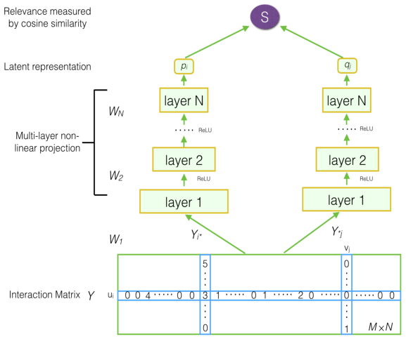
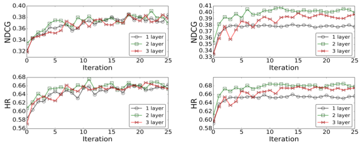

# 面向推荐系统的深度矩阵分解模型

> Xue HJ, Dai XY, Zhang JB, Huang SJ, Chen JJ | Nanjing University | IJCAI-17

本文介绍了面向推荐系统的深度矩阵分解模型（DMF）。核心内容：

- 提出新颖的深度矩阵分解模型，通过神经网络将用户和item以非线性投影映射到一个公共低维空间
- 构建同时包含显式评分和非偏好隐式反馈的用户-item矩阵作为模型输入
- 设计基于二元交叉熵的归一化交叉熵损失函数（nce），同时考虑显式评分和隐式反馈

关键发现：

- 在多个基准数据集上，DMF 在 Top-N 推荐中优于其他最先进方法，且相比 NeuMF-p 在 NDCG 和 HR 上分别获得 2.5–7.4% 和 1.4–6.8% 的相对改进

---

## 摘要

推荐系统通常使用用户-item交互评分、隐式反馈和辅助信息来进行个性化推荐。矩阵分解是通过用户和item之间的相似性来预测单个用户在item集合上的个性化排序的基本思想。在本文中，我们提出了一种具有神经网络架构的新型矩阵分解模型。首先，我们构建了一个包含显式评分和非偏好隐式反馈的用户-item矩阵。以该矩阵作为输入，我们提出了一种深度结构学习架构来学习用户和item表示的公共低维空间。其次，我们设计了一种基于二元交叉熵的新损失函数，其中我们同时考虑了显式评分和隐式反馈以实现更好的优化。实验结果表明了我们提出的模型和损失函数的有效性。在多个基准数据集上，我们的模型优于其他最先进的方法。我们还进行了大量实验来评估不同实验设置下的性能。

## 1 引言

在信息爆炸的时代，信息过载是我们面临的困境之一。推荐系统（RSs）有助于解决这个问题，因为它们帮助确定向个体消费者提供哪些信息，并允许在线用户快速找到适合其需求的个性化信息[23, 14]。如今，推荐系统在电子商务平台中无处不在，例如亚马逊上的图书推荐、Last.com上的音乐推荐、Netflix上的电影推荐以及CiteULike上的参考文献推荐。协同过滤（CF）推荐方法在学术界得到了广泛研究，并在工业界得到了广泛应用。它们基于一个简单的直觉：如果用户过去对item评分相似，那么他们未来也可能对其他item评分相似[23, 14]。戴新宇为通讯作者。本研究得到863计划（2015AA015406）和国家自然科学基金（61472183, 61672277）资助。

作为各种协同过滤技术中最流行的方法，矩阵分解（MF）通过学习潜在空间来表示用户或item，因其可扩展性、简单性和灵活性而成为推荐的标准模型[2, 11]。在潜在空间中，推荐系统通过用户和item之间的相似性来预测每个用户在item集合上的个性化排序。用户-item交互矩阵中的评分是早期推荐方法中深入利用的显式知识。由于用户对item的评分值存在差异，带偏置的矩阵分解[11]被用来增强评分预测。为了克服评分的稀疏性，额外的辅助数据被整合到矩阵分解中，例如带有社交关系的社交矩阵分解[15, 26]，带有item内容或评论文本的主题矩阵分解[16, 1]等等。然而，仅对观察到的评分进行建模不足以做出良好的Top-N推荐[8]。隐式反馈，如购买历史记录和未观察到的评分，被应用于推荐系统[19]。SVD++[12]模型首先利用隐式反馈对评分矩阵进行分解，随后出现了许多用于推荐系统的技术[20, 17, 4]。

近年来，由于强大的表示学习能力，深度学习方法已成功应用于包括计算机视觉、音频识别和自然语言处理在内的各个领域。也有一些工作尝试将深度学习模型应用于推荐系统。受限玻尔兹曼机[22]首次被提出用于对用户对item的显式评分进行建模。自编码器和去噪自编码器也被应用于推荐[13, 24, 25]。这些方法的关键思想是通过利用显式历史评分学习隐藏结构来重构用户的评分。隐式反馈也被应用于这一深度学习推荐的研究方向。一项扩展工作提出了协同去噪自编码器（CDAE）[27]来利用隐式反馈对用户偏好进行建模。另一项工作神经协同过滤（NCF）[7]被提出用于通过多层前馈神经网络对用户-item交互进行建模。上述两项近期工作仅利用隐式反馈进行item推荐，而非显式评分反馈。

在本文中，为了同时利用显式评分和隐式反馈，我们提出了一种新的神经矩阵分解模型用于Top-N推荐。我们首先构建了一个同时包含显式评分和非偏好隐式反馈的用户-item矩阵，这与其他仅使用显式评分或仅使用隐式评分的相关方法不同。以这个完整矩阵（显式评分和隐式反馈的零值）作为输入，我们提出了一种神经网络架构来学习一个公共的潜在低维空间以表示用户和item。该架构受到深度结构化语义模型的启发，该模型已被证明对网络搜索有用[9]，它可以通过多层非线性投影将查询和文档映射到潜在空间中。此外，我们设计了一种基于交叉熵的新损失函数，其中包含了显式评分和隐式反馈的考虑。总之，我们的主要贡献概述如下。
- 我们提出了新颖的深度矩阵分解模型，通过神经网络将用户和item以非线性投影映射到一个公共低维空间中。我们使用包含显式评分和非偏好隐式反馈的矩阵作为我们模型的输入。
- 我们设计了一种新的损失函数，同时考虑显式评分和隐式反馈以实现更好的优化。
- 实验结果表明了我们提出的模型的有效性，在Top-N推荐中优于其他最先进的方法。

本文的组织结构如下。第2节介绍问题陈述。在第3节中，我们介绍所提出模型的架构和细节。在第4节中，我们给出了在多个基准数据集上的实验结果。最后的章节给出了结论性评述并讨论了一些未来工作。

## 2 问题陈述

假设有 $M$ 个用户 $U = \{u_1, \ldots, u_M\}$ ， $N$ 个 item $V = \{v_1, \ldots, v_N\}$ 。令 $R \in \mathbb{R}^{M \times N}$ 表示评分矩阵，其中 $R_{ij}$ 是用户 $i$ 对 item $j$ 的评分，如果未知则标记为 $unk$ 。有两种方法可以从 $R$ 中利用隐式反馈构建用户-item交互矩阵 $Y \in \mathbb{R}^{M \times N}$ ，如下：

$$
Y_{ij} = \begin{cases} 0, & \text{if } R_{ij} = unk \\ 1, & \text{otherwise} \end{cases} \qquad (1)
$$

$$
Y_{ij} = \begin{cases} 0, & \text{if } R_{ij} = unk \\ R_{ij}, & \text{otherwise} \end{cases} \qquad (2)
$$

大多数现有的推荐解决方案应用公式 1 来构建交互矩阵 $Y$ [27, 7]。它们将所有观察到的评分视为相同的 1。在本文中，我们使用公式 2 构建矩阵 $Y$ 。用户 $u_i$ 对 item $v_j$ 的评分 $R_{ij}$ 仍然保留在 $Y$ 中。我们认为公式 2 中的显式评分对推荐并非无关紧要，因为它们指示了用户对 item 的偏好程度。同时，如果评分未知，我们标记为零，这在本文中称为非偏好隐式反馈。

推荐系统通常被表述为估计 $Y$ 中每个未观测条目的评分的问题，这些评分用于对 item 进行排序。基于模型的方法 [12, 21] 假设存在一个可以生成所有评分的基础模型，如下所示：

$$
\hat{Y}_{ij} = F(u_i, v_j | \Theta) \qquad (3)
$$

其中 $\hat{Y}_{ij}$ 表示用户 $u_i$ 和 item $v_j$ 之间交互 $Y_{ij}$ 的预测得分， $\Theta$ 表示模型参数， $F$ 表示将模型参数映射到预测得分的函数。基于这个函数，我们可以实现我们的目标：为个体用户推荐一组 item 以最大化用户的满意度。现在，下一个问题是如何定义这样一个函数 $F$ 。

潜在因子模型（LFM）简单地应用 $p_i$ 和 $q_j$ 的点积来预测 $\hat{Y}_{ij}$ ，如下所示 [11]。这里， $p_i$ 和 $q_j$ 分别表示 $u_i$ 和 $v_j$ 的潜在表示。

$$
\hat{Y}_{ij} = F_{LFM}(u_i, v_j | \Theta) = p_i^T q_j \qquad (4)
$$

最近，神经协同过滤（NCF）[7] 提出了一种使用多层感知机自动学习函数 $F$ 的方法。该方法的动机是学习用户和 item 之间的非线性交互。在本文中，我们遵循使用内积计算用户和 item 之间交互的潜在因子模型。我们不遵循神经协同过滤，因为我们试图通过深度表示学习架构来获取用户和 item 之间的非线性连接。

我们给出以下章节中使用的符号。 $u$ 表示用户， $v$ 表示 item。 $i$ 和 $j$ 分别索引 $u$ 和 $v$ 。 $Y$ 表示由公式 2 转换得到的用户-item交互矩阵， $Y^+$ 表示观察到的交互， $Y^-$ 表示 $Y$ 中的所有零元素， $Y^-_{sampled}$ 表示负实例的集合，可以是所有（或从中采样） $Y^-$ 。那么 $Y^+ \cup Y^-_{sampled}$ 表示所有训练交互。我们用 $Y_{i*}$ 表示矩阵 $Y$ 的第 $i$ 行，用 $Y_{*j}$ 表示第 $j$ 列，用 $Y_{ij}$ 表示其第 $(i,j)$ 个元素。

## 3 我们提出的模型

在本节中，我们首先简要介绍启发我们提出方法的深度结构化语义模型。然后，我们介绍我们提出的架构以在潜在低维空间中表示用户和item。最后，我们给出我们设计的优化损失函数，以及模型训练算法。

### 3.1 深度结构化语义模型
深度结构化语义模型（DSSM）由 [9] 提出，用于网络搜索。它使用深度神经网络对给定查询的一组文档进行排序。DSSM首先通过非线性多层投影将查询和文档映射到一个公共的低维语义空间。然后对于网络搜索排序，查询与每个文档的相关性通过查询和文档的低维向量之间的余弦相似度计算。深度神经网络被判别性地训练以最大化查询和匹配文档的条件似然。DSSM已被应用于用户建模 [3]。与我们的工作不同，它侧重于使用丰富的额外特征（如网络浏览历史和搜索查询）对用户进行建模。我们仅使用观察到的评分和观察到的反馈，因为我们专注于传统的Top-N推荐问题。

### 3.2 深度矩阵分解模型（DMF）
如第2节所述，我们根据公式2形成矩阵 $Y$ 。以该矩阵 $Y$ 作为输入，我们提出了一种深度神经网络架构，将用户和item投影到潜在结构化空间中。图1说明了我们提出的架构。

图1：深度矩阵分解模型的架构

从矩阵 $Y$ 中，每个用户 $u_i$ 被表示为一个高维向量 $Y_{i*}$ ，它表示第 $i$ 个用户对所有 item 的评分。每个 item $v_j$ 被表示为一个高维向量 $Y_{*j}$ ，它表示第 $j$ 个 item 对所有用户的评分。在每一层中，每个输入向量被映射到新空间中的另一个向量。形式上，如果我们用 $x$ 表示输入向量，用 $y$ 表示输出向量，用 $l_i$ 表示中间隐藏层（ $i = 1, \ldots, N-1$ ），用 $W_i$ 表示第 $i$ 个权重矩阵，用 $b_i$ 表示第 $i$ 个偏置项，用 $h$ 表示最终输出潜在表示。我们有

$$
l_1 = W_1 x, \qquad l_i = f(W_{i-1} l_{i-1} + b_i), \; i = 2, \ldots, N-1, \qquad h = f(W_N l_{N-1} + b_N) \qquad (5)
$$

我们在输出层和隐藏层 $l_i$ （ $i = 2, \ldots, N-1$ ）中使用ReLU作为激活函数：

$$
f(x) = \max(0, x) \qquad (6)
$$

在我们的架构中，我们有两个多层网络分别转换 $u$ 和 $v$ 的表示。通过神经网络，用户 $u_i$ 和 item $v_j$ 最终被映射到潜在空间中的一个低维向量，如公式7所示。然后根据公式8度量用户 $u_i$ 和 item $v_j$ 之间的相似度。

$$
p_i = f^U_{\theta_N}( \ldots f^U_{\theta_3}(W_{U2} f^U_{\theta_2}(Y_{i*} W_{U1})) \ldots ), \qquad q_j = f^I_{\theta_N}( \ldots f^I_{\theta_3}(W_{V2} f^I_{\theta_2}(Y_{*j}^T W_{V1})) \ldots ) \qquad (7)
$$

这里 $W_{U1}$ 和 $W_{V1}$ 分别是 $U$ 和 $V$ 的第一层权重矩阵， $W_{U2}$ 和 $W_{V2}$ 是第二层的权重矩阵，以此类推。

$$
\hat{Y}_{ij} = F_{DMF}(u_i, v_j | \Theta) = \text{cosine}(p_i, q_j) = \frac{p_i^T q_j}{\|p_i\| \|q_j\|} \qquad (8)
$$

在我们的架构中，除了多层表示学习之外，我们想再次强调，据我们所知，这是首次直接将交互矩阵作为表示学习的输入。正如我们之前提到的， $Y_{i*}$ 表示一个用户对所有 item 的评分。它可以在一定程度上指示用户的全局偏好。而 $Y_{*j}$ 表示一个 item 被所有用户的评分。它可以在一定程度上指示 item 的画像。我们相信用户和 item 的这些表示对其最终的低维表示非常有用。

### 3.3 损失函数
推荐模型的另一个关键组成部分是根据观察到的数据和未观察到的反馈定义合适的模型优化目标函数。一个通用的目标函数如下所示。

$$
L = \sum_{y \in Y^+ \cup Y^-} l(y, \hat{y}) + \lambda \Omega(\Theta) \qquad (9)
$$

其中 $l(\cdot)$ 表示损失函数， $\Omega(\Theta)$ 是正则化项。对于推荐系统，通常使用两种类型的目标函数：逐点型和成对型。为简单起见，我们在本文中使用逐点型目标函数，并将成对型版本留作未来工作。

损失函数是目标函数中最重要的部分。平方损失在许多现有模型中被广泛使用 [21, 11, 18, 8]。

$$
L_{sqr} = \sum_{(i,j) \in Y^+ \cup Y^-} w_{ij} (Y_{ij} - \hat{Y}_{ij})^2 \qquad (10)
$$

其中 $w_{ij}$ 表示训练实例 $(i,j)$ 的权重。平方损失的使用基于观测值来自高斯分布的假设 [21]。然而，平方损失不能很好地用于隐式反馈，因为对于隐式数据，目标值 $Y_{ij}$ 是二元化的1或0，表示 $i$ 是否与 $j$ 有过交互。接下来，[7] 提出了一种特别关注隐式数据二元特性的损失函数，如下所示。

$$
L = -\sum_{(i,j) \in Y^+ \cup Y^-} [Y_{ij} \log \hat{Y}_{ij} + (1 - Y_{ij}) \log(1 - \hat{Y}_{ij})] \qquad (11)
$$

该损失实际上是二元交叉熵损失（简称ce），将带隐式反馈的推荐视为一个二元分类问题。总之，平方损失关注显式评分，而交叉熵损失关注隐式评分。在本文中，我们设计了一种新的损失函数，将显式评分纳入交叉熵损失中，从而使显式和隐式信息可以一起用于优化。我们将新损失命名为归一化交叉熵损失（简称nce），如公式12所示。

$$
L = -\sum_{(i,j) \in Y^+ \cup Y^-} \left( \frac{Y_{ij}}{\max(R)} \log \hat{Y}_{ij} + \left(1 - \frac{Y_{ij}}{\max(R)}\right) \log(1 - \hat{Y}_{ij}) \right) \qquad (12)
$$

我们使用 $\max(R)$ （5星级系统中为5）进行归一化，它是所有评分中的最高分，从而使 $Y_{ij}$ 的不同值对损失产生不同的影响。

**算法1**：使用归一化交叉熵的DMF训练算法

$$
\begin{aligned}
& \textbf{Input: } Iter \text{ (number of training iterations)}, \; neg\_ratio \text{ (negative sampling ratio)}, \; R \text{ (original rating matrix)} \\
& \textbf{Output: } WU_i \text{ (}i = 1..N-1\text{): weight matrix for user}, \; WV_i \text{ (}i = 1..N-1\text{): weight matrix for item} \\
& 1: \textbf{Initialization:} \\
& 2: \; \text{randomly initialize } WU \text{ and } WV; \\
& 3: \; \text{set } Y \text{ using Equation 2 with } R; \\
& 4: \; \text{set } Y^+ \leftarrow \text{all non-zero interactions in } Y; \\
& 5: \; \text{set } Y^- \leftarrow \text{all zero interactions in } Y; \\
& 6: \; \text{sample } neg\_ratio \times \|Y^+\| \text{ interactions from } Y^- \text{ as } Y^-_{sampled}; \\
& 7: \; \text{set } T \leftarrow Y^+ \cup Y^-_{sampled}; \\
& 8: \; \textbf{for } it = 1 \textbf{ to } Iter \textbf{ do} \\
& 9: \quad \textbf{for } \text{each interaction of user } i \text{ and item } j \text{ in } T \textbf{ do} \\
& 10: \quad\quad \text{set } p_i, q_j \text{ using Equation 7 with input of } Y_{i*}, Y_{*j}; \\
& 11: \quad\quad \text{set } \hat{Y}_{ij}^o \text{ using Equations 8 and 13 with input of } p_i, q_j; \\
& 12: \quad\quad \text{set } L \text{ using Equation 11 with input of } \hat{Y}_{ij}^o, Y_{ij}; \\
& 13: \quad\quad \text{use back propagation to optimize model parameters} \\
& 14: \quad \textbf{end for} \\
& 15: \textbf{end for}
\end{aligned}
$$

### 3.4 训练算法
对于交叉熵损失，由于 $Y_{ij}$ 的预测得分可能为负，我们需要使用公式13来转换原始预测。设 $\mu$ 为一个非常小的数，我们在实验中设置为 $1.0e^{-6}$ 。

$$
\hat{Y}_{ij}^o = \max(\mu, \hat{Y}_{ij}) \qquad (13)
$$

我们在算法1中描述了详细的训练方法。在算法1中，我们展示了DMF模型的高层训练过程。为了训练每层权重矩阵 $WU$ 和 $WV$ 的参数，我们使用反向传播以小批量方式更新模型参数。我们算法的复杂度与矩阵的大小和网络的层数呈线性关系。

## 4 实验

在本节中，我们进行实验以证明我们提出的架构和改进后的损失函数的有效性。我们还进行了一些广泛的实验，以比较不同实验设置（如负采样比例、网络层数等）下的性能。

### 4.1 实验设置
数据集
我们在推荐系统中广泛使用的四个数据集上评估我们的模型：MovieLens 100K（ML100k）、MovieLens 10M（ML1m）、Amazon音乐（Amusic）、Amazon电影（Amovie）。它们在网站上公开可访问。对于MovieLens数据集，我们不需要处理，因为它已经被过滤；对于Amazon数据集，我们进行了过滤，以便与MovieLens数据类似，仅保留那些至少有20次交互的用户和至少有5次交互的item[27, 7]。四个数据集的统计信息如表1所示。

统计信息        ML100k   ML1m     Amusic   Amovie
用户数          944      6,040    844      9,582
item数          1,683    3,706    18,813   92,221
评分数量        100,000  1,000,209 46,468  766,759
评分密度        0.06294  0.04468  0.00292  0.00087
表1：四个数据集的统计信息

推荐评估
为了评估item推荐的性能，我们采用了留一法评估，该方法在文献中被广泛使用[6, 10, 7]。我们为每个用户留出最新的交互作为测试item，并使用剩余数据集进行训练。由于在评估期间为每个用户对所有item进行排序过于耗时，我们遵循 [12, 7] 的方法，随机采样100个用户未交互过的item。在这100个item与测试item一起中，我们根据预测得到排序。我们还使用命中率（HR）和归一化折损累积增益（NDCG）[5]来评估排序性能。在我们的实验中，我们将两个指标的排序列表截断为10。因此，HR直观地衡量测试item是否出现在前10列表中，而NDCG衡量排序质量，对位于顶部位置的命中赋予更高的分数。

详细实现
我们基于Tensorflow实现了我们提出的方法，该方法将在接收后公开发布。为了确定DMF方法的超参数，我们为每个用户随机采样一个交互作为验证数据，并在其上调整超参数。在训练我们的模型时，我们为每个正实例采样七个负实例。对于神经网络，我们使用高斯分布（均值为0，标准差为0.01）随机初始化模型参数，使用小批量Adam优化器优化模型[10]。我们将批量大小设置为256，学习率设置为0.0001。

### 4.2 性能比较
在本小节中，我们将提出的DMF与以下方法进行比较。由于我们提出的方法旨在对用户和item之间的关系进行建模，我们主要与用户-item模型进行比较。我们省略了与item-item模型（如SLIM[18]、CDAE[27]）的比较，因为性能差异可能由用于个性化的用户模型引起。我们还省略了与MV-DSSM[3]的比较，因为它使用了大量的额外辅助数据，并在其自己的数据集上进行评估。

ItemPop：它根据交互次数判断的item流行度对item进行排序。这是一种非个性化方法，其性能通常用作个性化方法的基线。
ItemKNN：这是亚马逊商业使用的一种标准基于item的协同过滤方法[23, 14]。
eALS：这是一种使用平方损失的最新MF推荐方法。它使用所有未观察到的交互作为负实例，并根据item流行度对它们进行非均匀加权。我们以与[6]相同的方式调整其超参数。
NeuMF-p：这是一种使用交叉熵损失的item推荐的最新MF方法。它与我们的工作最为相关。与我们的模型不同，它仅使用隐式反馈，并随机初始化用户和item的表示。之后，它利用多层感知机来学习用户-item交互函数。我们将带有预训练的神经矩阵分解命名为NeuMF-p，它在他们提出的模型中表现最好。我们以与[7]相同的方式调整其超参数。
DMF-2-ce：这是我们提出的深度矩阵分解模型，网络中有2层，使用交叉熵作为损失函数。我们使用包含显式评分和隐式反馈的矩阵作为DMF的输入。我们将此模型命名为DMF-2-ce。
DMF-2-nce：DMF-2-nce在网络中具有与DMF-2-ce相同的2层深度，不同之处在于它使用归一化交叉熵损失。

比较结果总结在表2中。它证明了我们提出的架构和损失函数的有效性。对于提出的架构，在几乎所有数据集上，与其他方法相比，我们的两个模型在NDCG和HR两个指标上都取得了最佳性能。即使与最先进的NeuMF-p方法相比，DMF-2-nce在NDCG和HR指标上分别获得了2.5-7.4%（平均5.1%）和1.4-6.8%（平均3.8%）的相对改进。对于损失函数，我们比较了两个模型的性能。DMF-2-nce取得了比DMF-2-ce更好的结果，但在Amusic数据集上除外。

### 4.3 输入矩阵对DMF的影响
表3：不同输入矩阵的结果。

LFM-nce随机初始化输入矩阵。DMF-1-nce使用矩阵 $Y$ 作为输入。它们都执行1层投影。在DMF中，我们使用交互矩阵 $Y$ 作为输入。如果我们随机初始化每个用户和每个item的表示向量作为单层DMF模型的输入，该模型将是一个标准的潜在因子模型（LFM）。为了测试输入矩阵 $Y$ 的有效性，我们在LFM-nce和DMF-1-nce两个模型上进行了实验。它们的网络都有一层，并使用相同的损失函数。从表3中我们可以观察到，使用输入矩阵后，DMF-1-nce相比于LFM-nce获得了显著的改进。

### 4.4 超参数敏感性
负采样比例
如第3.4节所示的算法1中，我们需要从未观察到的数据中采样负实例用于训练。在这个实验中，我们应用不同的负采样比例来观察性能变化（例如neg-5意味着我们将负采样比例设置为5）。从表4的结果中，我们可以发现更多的负实例似乎有助于提高性能。对于这四个数据集，最优的负采样比例大约为5，这与之前工作的结果一致[7]。

网络层数
在我们提出的模型中，我们通过具有多个隐藏层的神经网络将用户和item映射到低维表示。我们在ML数据集上进行了广泛的实验，以研究我们的模型在不同隐藏层数量下的表现。为了详细比较，图2显示了不同层数下每次迭代的性能。由于空间限制，我们仅展示在ML数据集上的结果。如图2所示，在较大的ML1m数据集上，我们的2层模型显示出最佳性能。而在相对较小的ML100k数据集上，2层模型几乎取得了最佳性能，但不够稳定和显著。更深的层似乎没有帮助，3层模型甚至降低了性能。

最终潜在空间的因子数
除了隐藏层数量之外，每层的因子数可能是我们模型中另一个敏感参数。为简单起见，我们仅比较顶部最终潜在空间上不同因子数下的性能。我们在一个两层模型上进行实验，将顶层的因子数从8设置为128。如表5所示，除Amusic数据集外，具有64个因子的最终层取得了最佳性能。在Amusic数据集上，128个因子时取得最佳性能。当数据集非常稀疏且较小时，具有更多因子的最终表示可能更有用。

## 5 结论与未来工作

在本文中，我们提出了一种具有神经网络架构的新型矩阵分解模型。通过神经网络架构，用户和item被投影到潜在空间中的低维向量。在我们提出的模型中，我们通过两种方式充分利用了显式评分和隐式反馈。我们提出的模型的输入矩阵包含显式评分和非偏好反馈。另一种方式，我们还设计了一种新的损失函数来训练我们的模型，其中同时考虑了显式和隐式反馈。在多个基准数据集上的实验证明了我们提出模型的有效性。

未来，有两个方向可以扩展我们的工作。成对目标函数是推荐系统的另一种可选方式。我们将用成对目标函数验证我们的模型。由于稀疏性和大量缺失的未观测数据，许多工作尝试将额外的辅助数据纳入推荐系统，例如社交关系、评论文本、浏览历史等。这为我们提供了另一个有趣的方向——使用额外数据扩展我们的模型。

## 参考文献

[1] Yang Bao, Hui Fang, and Jie Zhang. Topicmf: Simultaneously exploiting ratings and reviews for recommendation. In AAAI, 2014.

[2] Daniel Billsus and Michael J Pazzani. Learning collaborative information filters. In ICML, 1998.

[3] Ali Mamdouh Elkahky, Yang Song, and Xiaodong He. A multi-view deep learning approach for cross domain user modeling in recommendation systems. In Proceedings of the 24th International Conference on World Wide Web, pages 278–288. ACM, 2015.

[4] Ruining He and Julian McAuley. Vbpr: visual bayesian personalized ranking from implicit feedback. arXiv preprint arXiv:1510.01784, 2015.

[5] Xiangnan He, Tao Chen, Min-Yen Kan, and Xiao Chen. Trirank: Review-aware explainable recommendation by modeling aspects. In Proceedings of the 24th ACM International on Conference on Information and Knowledge Management, pages 1661–1670. ACM, 2015.

[6] Xiangnan He, Hanwang Zhang, Min-Yen Kan, and Tat-Seng Chua. Fast matrix factorization for online recommendation with implicit feedback. In Proceedings of the 39th International ACM SIGIR conference on Research and Development in Information Retrieval, pages 549–558. ACM, 2016.

[7] Xiangnan He, Lizi Liao, Hanwang Zhang, Liqiang Nie, Xia Hu, and Tat-Seng Chua. Neural collaborative filtering. In Proceedings of the 26th International World Wide Web Conference, 2017.

[8] Yifan Hu, Yehuda Koren, and Chris Volinsky. Collaborative filtering for implicit feedback datasets. In Data Mining, 2008. ICDM'08. Eighth IEEE International Conference on, pages 263–272. Ieee, 2008.

[9] Po-Sen Huang, Xiaodong He, Jianfeng Gao, et al. Learning deep structured semantic models for web search using clickthrough data. In Proceedings of the 22nd ACM international conference on Conference on information & knowledge management, pages 2333–2338. ACM, 2013.

[10] Diederik Kingma and Jimmy Ba. Adam: A method for stochastic optimization. In ICLR, pages 1–15, 2014.

[11] Yehuda Koren, Robert Bell, and Chris Volinsky. Matrix factorization techniques for recommender systems. Computer, IEEE, 42(8):30–37, 2009.

[12] Yehuda Koren. Factorization meets the neighborhood: a multifaceted collaborative filtering model. In Proceedings of the 14th ACM SIGKDD international conference on Knowledge discovery and data mining, pages 426–434. ACM, 2008.

[13] Sheng Li, Jaya Kawale, and Yun Fu. Deep collaborative filtering via marginalized denoising auto-encoder. In Proceedings of the 24th ACM International on Conference on Information and Knowledge Management, pages 811–820. ACM, 2015.

[14] Greg Linden, Brent Smith, and Jeremy York. Amazon.com recommendations: Item-to-item collaborative filtering. Internet Computing, IEEE, 2003.

[15] Hao Ma, Haixuan Yang, Michael R Lyu, and Irwin King. Sorec: Social recommendation using probabilistic matrix factorization. In CIKM, 2008.

[16] Julian McAuley and Jure Leskovec. Hidden factors and hidden topics: understanding rating dimensions with review text. In RecSys, 2013.

[17] Andriy Mnih and Yee W Teh. Learning label trees for probabilistic modelling of implicit feedback. In Advances in Neural Information Processing Systems, pages 2816–2824, 2012.

[18] Xia Ning and George Karypis. Slim: Sparse linear methods for top-n recommender systems. In Data Mining (ICDM), 2011 IEEE 11th International Conference on, pages 497–506. IEEE, 2011.

[19] Douglas W Oard, Jinmook Kim, et al. Implicit feedback for recommender systems. In Proceedings of the AAAI workshop on recommender systems, pages 81–83, 1998.

[20] Steffen Rendle, Christoph Freudenthaler, et al. Bpr: Bayesian personalized ranking from implicit feedback. In Proceedings of the twenty-fifth conference on uncertainty in artificial intelligence, pages 452–461. AUAI Press, 2009.

[21] Ruslan Salakhutdinov and Andriy Mnih. Probabilistic matrix factorization. In Nips, volume 1, pages 2–1, 2007.

[22] Ruslan Salakhutdinov, Andriy Mnih, and Geoffrey Hinton. Restricted boltzmann machines for collaborative filtering. In Proceedings of the 24th international conference on Machine learning, pages 791–798. ACM, 2007.

[23] Badrul Sarwar, George Karypis, et al. Item-based collaborative filtering recommendation algorithms. In WWW, 2001.

[24] Suvash Sedhain, Menon, et al. Autorec: Autoencoders meet collaborative filtering. In Proceedings of the 24th International Conference on World Wide Web, pages 111–112. ACM, 2015.

[25] Florian Strub and Jeremie Mary. Collaborative filtering with stacked denoising autoencoders and sparse inputs. In NIPS Workshop on Machine Learning for eCommerce, 2015.

[26] Jiliang Tang, Xia Hu, Huiji Gao, and Huan Liu. Exploiting local and global social context for recommendation. In IJCAI, 2013.

[27] Yao Wu, Christopher DuBois, et al. Collaborative denoising auto-encoders for top-n recommender systems. In Proceedings of the Ninth ACM International Conference on Web Search and Data Mining, pages 153–162. ACM, 2016.
