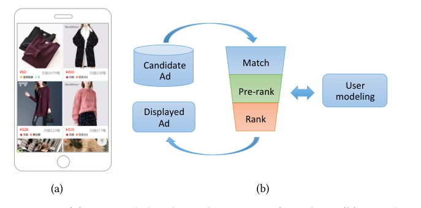
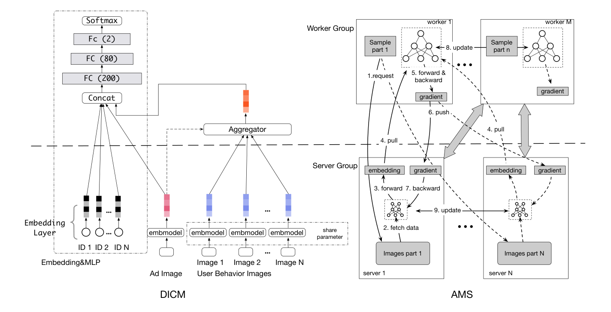
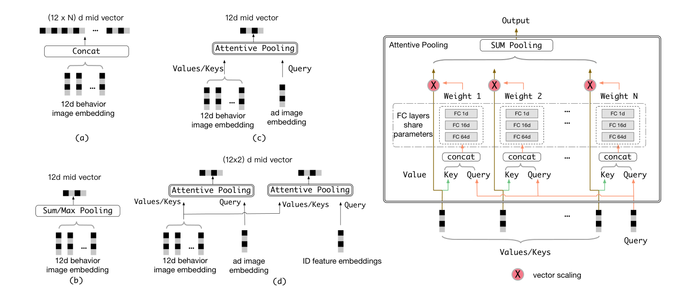
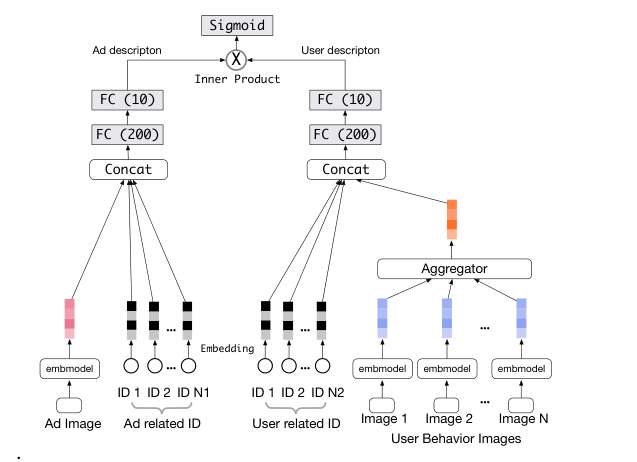
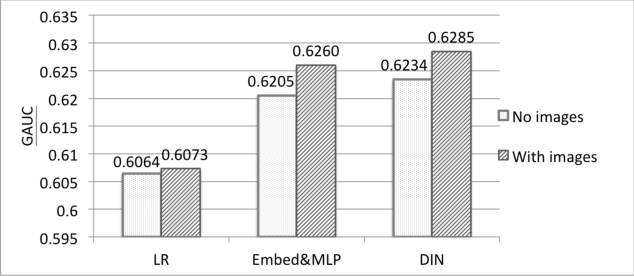
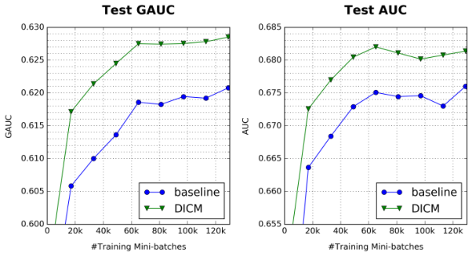

# Image Matters：使用 Advanced Model Server 对用户行为进行视觉建模

> Tiezheng Ge、Liqin Zhao、Guorui Zhou、Keyu Chen、Shuying Liu、Huimin Yi、Zelin Hu、Bochao Liu、Peng Sun、Haoyu Liu、Pengtao Yi、Sui Huang、Zhiqiang Zhang、Xiaoqiang Zhu、Yu Zhang、Kun Gai | 阿里巴巴（Alibaba Inc.）

> KDD 2018（arXiv:1711.06505v3 [cs.CV]，2018 年 9 月 4 日）

本文提出把「用户行为图片」纳入点击率预估建模，并配套设计了一整套可支撑图片级训练的分布式系统 Advanced Model Server（AMS）。核心发现是——**行为图片 + 广告图片联合建模，离线 GAUC +0.0078、线上 CTR +9.2%，训练系统通信量压缩约 32 倍**。

核心内容：

- 痛点：CTR 预估靠稀疏 ID 特征，低频或未见过的 ID 学不好、泛化差；而行为图片是用户直接交互的对象、蕴含视觉兴趣，但一个样本平均 32.6 张行为图，存储、通信、计算全面爆炸
- 方案一（系统）：AMS——突破经典 Parameter Server（PS）"各节点独立管参数"的局限，让所有 server 节点学习并同步一个全局共享的图像描述子模型（嵌入模型），图片只存一份、只传低维向量
- 方案二（模型）：DICM（Deep Image CTR Model）——在 Embedding&MLP 基础上新增广告图、行为图两个特征域，行为图嵌入经注意力聚合器 MultiQueryAttentivePooling 聚合成定长用户表示
- 验证：39 亿样本离线实验 + 线上 7 天 A/B + Pre-rank 场景复现，DICM 已部署服务淘宝主流量

关键发现：

- 行为图 + 广告图联合建模的 GAUC 增益 0.0055，大于两者单独增益之和 0.0044，用视觉信息建模用户与广告存在显著协同效应
- 聚合器消融：MultiQueryAttentivePooling 0.6260 > AttentivePooling 0.6257 > SumPooling 0.6248 > MaxPooling 0.6236 > Concatenation 0.6232
- AMS 对比替代方案：存储从 5.1G 降到 134M（约 31 倍），通信从 5.1G 降到 158M（约 32 倍）；18 天日志 18 小时训练完，20 块 GPU 即可支撑模型日更
- 线上 7 天 A/B：CTR +9.2%、eCPM +5.7%、GPM +5.9%；单次 PV 响应仅从 21ms 增到 24ms

---

## 摘要

在中国最大的电子商务平台淘宝上，提供了数十亿个 item，并且通常用它们的图片来展示。为了更好的用户体验和商业效果，在线广告系统中的点击率（Click Through Rate，CTR）预测利用丰富的用户历史行为来识别用户是否对候选广告感兴趣。用用户行为图片增强行为表示，将有助于理解用户的视觉偏好，并大幅提升 CTR 预测的准确性。因此，我们提出联合使用用户行为 ID 特征与行为图片来对用户偏好建模。然而，用用户行为图片训练会在一个样本中带来几十到上百张图片，给通信和计算都带来了巨大挑战。为应对这些挑战，我们提出了一种新颖且高效的分布式机器学习范式，称为 Advanced Model Server（AMS，高级模型服务器）。在众所周知的 Parameter Server（PS，参数服务器）框架下，每个服务器节点处理参数中独立的一部分并独立更新它们。AMS 超越了这一范式，其设计目标是让所有服务器节点共享的、能够把大图嵌入为低维高层特征、然后再传输给 worker 节点的统一图像描述子模型可以被学习。AMS 由此大幅降低了通信负载，并使这一艰难的联合训练过程成为可能。基于 AMS，我们仔细研究了将图片与 ID 特征有效结合的方法，进而提出了深度图片点击率模型（Deep Image CTR Model，DICM）。我们的方法在线上与离线评估中都取得了显著的提升，并且已部署在淘宝展示广告系统中，服务主要流量。

## 关键词

Online advertising; User modeling; Computer vision

## 1 引言

淘宝是中国最大的电子商务平台，通过移动端 App 和 PC 网站为数亿用户提供数十亿个 item。用户通过搜索或个性化推荐来淘宝浏览这些 item。每个 item 通常由一个 item 图片以及一些描述文字来展示。当对某个 item 感兴趣时，用户会点击该图片查看详情。图 1(a) 展示了淘宝移动端 App 中推荐 item 的一个例子。

淘宝还建立了世界领先的展示广告系统之一，帮助数百万广告主与消费者建立连接。通过识别用户兴趣，展示广告被呈现在"猜你喜欢（Guess What You Like）"等众多位置，并高效地把营销信息传递给正确的用户。系统采用按点击付费（cost-per-click，CPC）的计费方式，并被证明是充分有效的 [32]。在 CPC 模式下，广告发布者按有效千次展示成本（effective cost per mille，eCPM）对候选广告排序，而 eCPM 可以估计为出价与预估点击率（CTR）的乘积。这一策略使 CTR 预测成为广告系统中的核心任务。

CTR 预测对用户对某个 item 的偏好打分，并在很大程度上依赖于从历史行为中理解用户兴趣。用户每天在淘宝浏览和点击 item 数十亿次，这些访问带来了海量的日志数据，这些数据弱弱地反映着用户兴趣。传统的 CTR 预测研究聚焦于精心设计的反馈特征 [1,28] 和浅层模型，例如逻辑回归（Logistic Regression）[23]。近年来，基于深度学习的 CTR 预测系统大量涌现 [30]。这些方法主要涉及稀疏 ID 特征，例如广告 ID、用户交互过的 item ID 等。然而，当一个 ID 在数据中出现频率较低时，其参数可能得不到充分训练。图片能够提供内在的视觉描述，从而为模型带来更好的泛化能力。考虑到 item 图片正是用户直接交互的对象，这些图片可以提供更多关于用户兴趣的视觉信息。我们提出用这样的图片自然地描述每个行为，并在 CTR 预测中与 ID 特征一起联合建模。

用图片数据训练 CTR 模型需要巨大的计算和存储消耗。有一些开创性工作 [3,21] 致力于在 CTR 预测中用图片特征表示广告。这些研究没有探索用户行为图片。对用户行为图片建模有助于理解用户的视觉偏好并提升 CTR 预测的准确性。此外，把用户视觉偏好与广告视觉信息结合起来，可以进一步使 CTR 预测受益。然而，用交互过的图片对用户偏好建模更具挑战性。因为一个典型用户的行为数量从几十到上百不等，这将带来比仅建模广告图片多几十上百倍的消耗，是一个不容小觑的问题。要处理这一真实生产中的大规模问题，一个精心设计的高效训练系统必不可少。

我们提出了 Advanced Model Server（AMS）框架，它超越了众所周知的 Parameter Server（PS）[17,25]，以应对这一大规模训练问题。其核心动机是在所有服务器节点之间学习一个统一的高层图像描述子，在把原始图片传输给 worker 之前将其嵌入为低维特征。这样一来，不仅通信负载可以被大幅降低，描述子的重复计算也可以在服务器中聚合。然而，在传统 PS 框架下，每个服务器节点处理各自独立的一部分参数并独立更新它们。因此 PS 缺乏学习所有服务器节点共享的统一图像描述子的能力。在 AMS 中，服务器被设计为能够转发并全局更新一个共享的可学习子模型，而图片则分布在各个服务器节点上。

借助这一设计，整个 CTR 模型被划分为 worker 模型（在 worker 上聚合所有特征以预测 CTR）和服务器模型（在服务器上学习的高层图像描述子）。然后，原始图像特征数据分布在服务器端，作为无重复的全局共享特征，与样本内存储相比，在我们的应用中存储用量大约减少了 31 倍。而且只需要传输服务器模型输出的图像低维高层语义表示，而非原始图片，这使通信负载在我们的应用中大约减少了 32 倍。此外，梯度从 worker 模型完整地反向传播到服务器模型，这保证了从原始图像特征到最终 CTR 分数的端到端训练。

基于 AMS，我们成功构建了一个高效训练系统，并部署了一个轻量级在线服务，应对了图片特征带来的存储、计算和通信的重负载。具体而言，我们的训练过程在 18 小时内完成数十亿样本的训练，使在线模型的日更成为可能，这是工业生产所必需的特性。

受益于精心优化的基础设施，我们提出了一个统一的网络架构，名为深度图片点击率模型（Deep Image CTR Model，DICM），它用行为图片对用户进行有效建模。DICM 通过一种精选的注意力池化方案实现图像感知的用户建模，该方案在生成注意力权重时同时使用图片和 ID 特征。DICM 还利用了用户偏好与广告之间的视觉联系，显著提升了性能。

总结起来，我们的贡献有三点：

第一，我们提出了新颖的 AMS 框架。它以子模型分布式的方式超越了众所周知的参数分布式风格，并促进了整个模型以分布式方式进行联合学习。这是使深度学习模型能够以可负担的计算和存储资源利用大规模结构化数据的重要一步。

第二，我们提出了 DICM。它不仅用广告图片对广告建模，还利用用户海量的行为图片来更好地对用户偏好建模，这比仅使用广告图片要困难得多。我们证明了广告图片和用户行为图片都能使 CTR 预测受益，且它们的组合会带来进一步的显著提升。

此外，我们通过大量线上和离线实验验证了方法的有效性和效率。它现在已经部署在淘宝的展示广告系统中，为 5 亿用户和数百万广告主服务主要流量。

## 2 相关工作

早期的 CTR 预测专注于精心设计的低维统计特征，通常由用户点击的投票数等定义 [1,28]。LS-PLM [8]、FTRL [20] 和 FM [22] 是对浅层模型的经典探索。最近，随着样本数量和特征维度的不断增大，CTR 模型从浅层演变为深层。特别是受到自然语言处理领域的启发，学习分布式表示的嵌入（embedding）技术被用来处理大规模稀疏数据。NCF [12] 和 Wide&Deep [5] 利用 MLP 网络大幅增强了模型容量。DeepFM [9] 通过在 Wide&Deep 中用因子分解机更新 wide 部分，进一步对特征交互进行建模。最新的工作 DIN [31] 提出将注意力机制应用于用户建模，根据给定 item 自适应地对用户行为建模。这些工作推动了稀疏特征的使用。然而，ID 只能说明对象不同，几乎不揭示语义信息。特别是当一个 ID 在训练数据中出现频率较低时，其参数将得不到充分训练，而训练中未见过的 ID 在预测时也不会生效。具有视觉语义信息的图片将为模型带来更好的泛化能力。此外，训练数据中未出现过的图片，借助训练良好的图像模型，仍然可以帮助 CTR 预测。

近年来，图像表示任务取得了显著进展。深度模型 [11,16,24,26] 学习到的高层语义特征已被证明在大量任务上有效。一些先前的工作试图在 CTR 模型中引入图像信息来描述广告。Cheng 等人 [4] 和 Mo 等人 [21] 通过用人工设计的特征或预训练的 CNN 模型对广告图片建模来解决冷启动问题。Lynch 等人 [19] 在 Esty 的搜索引擎中引入 item 的视觉信息，以克服仅文本表示的误解。Chen 等人 [3] 提出以端到端的方式训练 CNN。所有这些工作都专注于用图片表示广告，这与我们的动机不同。广告图片描述的是广告的视觉特征，而用户行为图片将揭示用户的视觉偏好。将两者结合起来并打通这些视觉信息，会带来比单独使用其中任何一种都更好的性能。在本文中，我们提出用图片增强用户表示，并设计一种新颖高效的分布式机器学习范式来应对随之而来的挑战。

## 3 深度图片 CTR 模型（DICM）

### 3.1 展示广告系统

淘宝的展示广告系统每天响应数十亿次页面浏览量（page view，PV）请求。对于每个请求，系统会向特定场景（浏览时间、广告位等）中的特定用户展示最合适的广告。广告系统在数十毫秒内，从数千万个广告中选出在 eCPM 机制下排名最高的那个。如图 1(b) 所示，在线系统以漏斗（funnel）的方式完成这一任务，大致由三个顺序模块组成。匹配（matching）模块根据从用户行为中推断出的当前用户偏好，从所有候选中粗略检索出约 4k 个广告。随后的预排序（Pre-rank）模块用轻量级 CTR 模型将候选数量进一步缩减到约 400 个。最后，精排序（Rank）模块用复杂的模型精确预测广告的 CTR，并按 eCPM 排序以给出最佳选择。所有这些模块都依赖于对用户兴趣的恰当理解，以提供个性化推荐。图 1(a) 展示了淘宝移动端 App 中的典型广告结果。

**图 1：(a) 淘宝 App 上的典型展示广告。(b) 展示广告流水线（pipeline）。**

在本文中，我们专注于在 CTR 预测中用用户行为图片进行更好的用户建模。在以下各节中，我们以 Rank 为例仔细描述挑战与解决方案。我们同样将其应用于 Pre-rank。Rank 与 Pre-rank 的结果都将在后文给出。我们的方法也可以与匹配（Matching）阶段基于树的深度模型 [33] 一起使用，我们将其留作未来工作。

### 3.2 问题定义

CTR 模型输入关于用户、广告、场景等的特征，输出该广告在该场景下被用户点击的概率。沿用之前的工作 [3,6,21,31]，它被视为一个二分类问题，其标签是弱反馈——是否被点击。训练期间使用交叉熵误差 [7] 作为目标函数。

与像素即可良好表示的图像分类不同，CTR 预测问题需要针对具体应用精心设计特征。通常的做法是在每个样本中用底层 ID 描述用户、item 和场景的各个方面，构成许多稀疏特征域（feature field）。用户历史行为域由用户先前点击过的 item 的 ID 组成，是描述用户最重要的特征域。这种方法带来了大规模但极其稀疏的数据。

嵌入加 MLP 的网络结构（Embedding&MLP）[5,9,12] 现在被广泛用于拟合这种大规模稀疏输入。在淘宝的广告系统中，部署了遵循这一模式的高度优化的 CTR 模型。图 2 中的 Embedding&MLP 部分为清晰起见展示了生产模型的简化版本。最近，生产环境中引入了 DIN [31] 来更好地对稀疏行为特征建模。在与这些复杂模型的配合中，我们在以下各节展示了用图片对用户行为建模仍然能带来显著的提升。

### 3.3 用图片建模

我们用视觉信息扩展 Embedding&MLP 模型，特别是用图片增强用户行为表示。我们将这一结构称为深度图片点击率模型（Deep Image CTR Model，DICM），并将 Embedding&MLP 称为基础网络（basic net）。如图 2 所示，用户行为图片和广告图片作为两个特殊的特征域被纳入。这些图片首先被送入一个可训练的子模型，以获得低维的高层表示。与嵌入类似，这个子模型也是一种把图片嵌入为向量的嵌入操作，因此我们称之为嵌入模型（embedding model）。

**图 2：由 Advanced Model Server 实现的 DICM 网络架构。**

嵌入模型可以被视为传统 key-value 嵌入操作的可泛化扩展，因为它可以为训练期间未见过的图片生成嵌入。由于用户行为数量可变，多个嵌入后的图片需要被聚合为一个定长的用户表示，然后送入 MLP。值得注意的是，该模型中的图像嵌入实际上是独立的，即不依赖于其他特征。因此嵌入模型可以单独进行前向/反向传播。这一观察促使我们设计 Advanced Model Server。此外，利用 AMS 还可以为各种类型的数据（例如文本、视频）设计更多的嵌入模型。

## 4 Advanced Model Server（AMS）

训练的主要挑战是图片的巨大数量。图片本身就是大规模的数据源，而且在提取语义信息时还需要复杂的计算。对于 CTR 预测，每个样本都包含一个带有海量历史行为的用户描述。因此，训练系统不可避免地面临存储、计算和通信的重负载。例如，在我们的统计周期内，一个典型用户会有超过 200 个行为，这意味着单个训练样本将涉及超过 200 张图片，是仅使用广告图片时的数百倍。此外，训练系统需要处理数十亿个训练样本，并每天完成模型更新，这是线上生产所必需的。

Advanced Model Server（AMS）通过在服务器上引入一个共享且可学习的子模型，提供了一种高效的分布式训练范式，显著减小了需要传输的特征规模。AMS 超越了经典的 Parameter Server [17,25]，区别在于 AMS 能够转发并更新这个由所有服务器节点共享的子模型。

### 4.1 从 Parameter Server 到 AMS

参数服务器（Parameter Server，PS）是一种被广泛采用的大规模参数化机器学习问题的分布式架构。它由两类节点组成：worker 组和 server 组。worker 组包含一组 worker，在分配给它们的部分训练样本上进行训练。同时，server 组作为一个分布式数据库，存储模型参数，可以通过 key-value 结构访问。这样，PS 可以在服务器中无冗余地存储和维护大规模参数集。

Embedding&MLP 模型可以在 GPU 集群上以类似 PS 的架构高效实现。嵌入层的参数被放置在 server 组中，因为其规模远远超过每个 worker 的内存容量，并且可以通过 key-value 结构访问（前向）和更新（反向）。

然而，当使用图片特征，尤其是海量的用户行为相关图片时，完成训练过程并非易事。实际上，如果图片与训练样本一起存储在 worker 组中，那么图片特征将大幅增加训练数据规模（在我们的场景中，每个 mini-batch 从 134M Bytes 增加到 5.1G，约增大约 40 倍），这使得 IO 或存储无法承受。而且由于图片特征是高维的（在我们的实验中通常为 4096 维），远远超过 ID 特征（通常为 12 维），如果图片存储在 server 组中并由 worker 在训练期间访问，将会带来沉重的通信压力。为解决这一问题，AMS 的关键动机是：通过在服务器中学习一个统一的嵌入模型，高维原始图片特征可以在被传输到 worker 之前嵌入为低维特征。

### 4.2 AMS 架构

在本节中，我们详细描述 AMS 的架构，如图 2 和算法 1 所示。AMS 包括两类节点，即 servers 和 workers。训练样本分布在所有 worker 中，样本中只包含图片索引作为图片特征。图片数据以 key-value 格式均匀分布在所有 server 中且无重复，其中 key 是图片索引，value 是图片数据。

在每次迭代中，每个 worker 节点首先分别读取一个 mini-batch 的样本，然后用样本中出现的图片索引向 server 节点请求图片数据。注意，图片数据均匀分布在 servers 上，不同 worker 对同一张图片的请求会汇聚到同一个 server，并且只被处理一次。收到请求后，server 首先从本地内存获取图片数据，然后将其送入嵌入模型 $E$ 得到嵌入向量 $e$。随后，每个 worker 从 servers 拉回嵌入向量 $e$ （而非原始图片数据），以完成 worker 模型的计算，并获得关于 worker 模型的梯度 $\delta W_r$ 和关于嵌入 $e$ 的梯度 $\delta e_r$。同样，同一张图片的 $\delta e_r$ 会被同一个 server 收集，然后通过嵌入模型反向传播，计算出关于 server $s$ 处嵌入模型的梯度 $\delta E_s$。最后，workers 和 servers 同步并累积各自的模型梯度 $\delta W_r$ 和 $\delta E_s$，完成模型更新。

$$
\begin{aligned}
&\textbf{Task Scheduler（任务调度器）:} \\
&\text{1: 初始化 worker 模型 W 和嵌入模型 E} \\
&\text{2: for 用 mini-batch } t = 0, \dots, T \text{ 训练 do} \\
&\quad \text{3: 在所有 workers 上执行 WORKERITERATION(}t\text{)} \\
&\text{4: end for} \\
&\textbf{Worker: } r = 1, \dots, M \\
&\text{5: function WORKERITERATION(}t\text{)} \\
&\quad \text{6: 加载 mini-batch } t \text{ 的训练数据：} X_r^t \text{、} Y_r^t \\
&\quad \text{7: 用 } X_r^t \text{ 中的图片索引请求 SERVEREMBED} \\
&\quad \text{8: 从 servers 拉取所有嵌入 } e_r^t \\
&\quad \text{9: 用 } e_r^t \text{ 对 } W \text{ 进行前向与反向传播} \\
&\quad\quad \text{关于 worker 参数的梯度 } \delta W_r^t = \nabla_w \ell(X_r^t, Y_r^t, e_r^t) \\
&\quad\quad \text{关于嵌入的梯度 } \delta e_r^t = \nabla_e \ell(X_r^t, Y_r^t, e_r^t) \\
&\quad \text{10: 将 } \delta e_r^t \text{ 推送到 servers 的 SERVERUPDATE} \\
&\quad \text{11: 与所有 workers 同步 } \delta W_r^t \text{ 并更新 } W \\
&\text{12: end function} \\
&\textbf{Server: } s = 1, \dots, N \\
&\text{13: function SERVEREMBED(}t\text{)} \\
&\quad \text{14: 从本地获取图片数据 } I \\
&\quad \text{15: 计算嵌入 } e = E(I) \\
&\text{16: end function} \\
&\text{17: function SERVERUPDATE(}t\text{)} \\
&\quad \text{18: 在 server } s \text{ 处计算关于嵌入模型的梯度} \\
&\quad\quad \delta E_s^t = \nabla_E(I) \cdot \delta e_s^t \\
&\quad \text{19: 与所有 servers 同步 } \delta E_s^t \text{ 并更新 } E \\
&\text{20: end function}
\end{aligned}
$$

**算法 1：Advanced Model Server。**

我们的 AMS 应与 PS 区分开来。按照 PS 的设计，参数分布存储在 server 组中，servers 之间相互独立、没有通信。而在 AMS 中，图片数据分布式存储，嵌入模型的参数是全局共享的。换句话说，服务器中的参数模型本质上是统一的，由所有 servers 分布式训练。在每次训练迭代中，servers 之间的梯度同步在 AMS 中至关重要。注意，虽然 PS 支持服务器中的用户自定义函数 [17]，但这些函数是固定的，不可训练。

AMS 带来了几个好处。首先，图片的存储被显著减少，因为图片在 servers 中只存储一次。其次，通信被减少，因为嵌入向量比原始数据小得多（通常从 4096 维到 12 维，压缩比超过 340 倍）。另一个好处是，某张图片在一次训练迭代中出现多次时的计算可以自然地由 servers 合并，从而降低计算负载。同样值得注意的是，servers 和 workers 实际上物理部署在同一个 GPU 机器上，因此 worker 与 server 计算的交替进行可以最大化 GPU 的使用率。

### 4.3 用 AMS 实现 DICM

如图 2 所示，DICM 可以用 AMS 高效训练。按照设计，稀疏 ID 特征的嵌入和嵌入模型在 servers 上运行。MLP 和聚合器（Aggregator，详见下一节）在 workers 上运行。

配备 AMS 的分布式 GPU 训练架构使得用数十天日志数据日更模型成为现实，这对真实的广告系统至关重要。表 1 展示了我们最佳配置的模型用 18 天数据在不同 GPU 数量下的训练时间。值得注意的是，我们的系统随着 GPU 数量增加呈现出近乎线性的良好可扩展性。我们在效率与经济性之间权衡后，使用了 20 块 GPU。

| #GPU | 5 | 10 | 20 | 40 |
| --- | --- | --- | --- | --- |
| 时间（小时） | 62.9 | 32.0 | 17.4 | 10.2 |

**表 1：不同 GPU 数量下的训练时间。**

### 4.4 推理与线上部署

效率对于大型工业广告系统中 CTR 模型的线上部署至关重要。对于具有稀疏 ID 特征的 CTR 模型，例如 Embedding&MLP，ID 嵌入被全局放置在 key-value 存储中，而 MLP 部分的参数存储在排序服务器本地。对于每个请求，排序服务器拉取 ID 嵌入并将其送入 MLP，以获得预测的 CTR。这一方案在生产环境中被证明具有高吞吐量和低延迟。

当涉及图片，尤其是大量行为图片时，提取图片特征可能带来沉重的计算和通信负载。嵌入模型与基础网络是分离的。得益于这一点，图像嵌入可以预先计算。因此排序服务器可以在几乎不做修改的情况下高效预测 DICM。注意，新涉及的图片可以由嵌入模型嵌入，这缓解了 ID 特征的冷启动问题。与基线相比，DICM 仅在可容忍的程度上增加了响应时间，每次 PV 请求从 21 毫秒增加到 24 毫秒。

## 5 基于图片的用户建模

### 5.1 图像嵌入模型

嵌入模型旨在提取像素级的视觉信息，并将其转化为语义嵌入向量。计算机视觉领域最近的进展表明，为分类任务学习到的语义特征具有良好的泛化能力 [10,24]。我们的经验研究表明，在我们的应用中，VGG16 [24] 比从头开始训练平凡的端到端模型效果更好。但由于 VGG16 的复杂度不尽人意，我们采用了混合训练：将整个网络拆分为一个固定部分，后接一个可训练部分，可训练部分与 CTR 模型端到端联合训练。

对于固定部分，我们采用预训练 VGG16 网络 [24] 的前 14 层，具体是从 Conv1 到 FC6，它生成一个 4096 维向量。这是实际应用中功效与效率之间的谨慎权衡。例如，把固定部分中输出 4096 维向量的 FC6 替换为输出 1000 维向量的 VGG16 FC8，在我们的实验中会导致 3% 的相对性能损失。这表明固定部分的信息压缩需要被控制，而输入尺寸和与整个网络联合学习的可训练部分至关重要。然而，当我们使用 VGG16 中更低的层作为固定部分时，训练中的计算负载会变高，而且我们发现提升并不显著。最终，我们选择输出 4096 维向量的 VGG16 FC6 作为固定部分。对于可训练部分，我们使用一个 3 层全连接网络（4096-256-64-12），输出 12 维向量。

### 5.2 用户行为图像聚合器

对于使用 Embedding&MLP 模型的 CTR 预测，用户的紧凑表示至关重要。我们需要把各种用户数据，尤其是数量可变的历史行为，聚合成一个定长向量。因此，我们设计了一个聚合器（aggregator）模块，将大量的行为图像嵌入聚合起来。

事实上，许多经典问题都涉及类似的任务。对于传统的图像检索/分类，图像中的局部特征（例如 SIFT [18]）需要被聚合。经典方法包括 VLAD [14] 和稀疏编码 [29]，它们通过求和或取最大（sum or max）操作完成这一任务。对于神经机器翻译，不同长度句子的上下文向量用最近的注意力方法 [2,27] 抽象出来。我们遵循这些思路，探索了各种设计，尤其是注意力方法。此外，我们还关注 ID 特征信息，提出了多查询注意力池化（Multiple Query Attentive Pooling）。

最直接的方法是把所有行为图像嵌入拼接（concatenate）在一起，并填充或截断到指定长度。但当行为数量很大或行为顺序发生变化时，这种方法会遭受损失。最大池化和求和池化是另外两种直接的方法，它们无法针对多样化的用户行为进行恰当的聚焦。最近，DIN [31] 将注意力机制引入用户建模。它根据当前考虑的广告，自适应地捕获最相关的行为。我们也采用了这种方法，并且考虑到视觉相关性，我们在注意力中使用广告图片作为查询（query）。我们将这种方法称为注意力池化（AttentivePooling）。这些方法如图 3 所示。

**图 3：聚合器架构。(a) 拼接（Concatenate）(b) 求和/最大池化（Sum/Max Pooling）(c) 注意力池化（Attentive Pooling）(d) 多查询注意力池化（MultiQuery-AttentivePooling）。**

不同类型特征之间的交互很重要。例如，广告的类别 ID "T 恤"可以与用户行为中的"T 恤"图片联系起来，从而更好地捕捉用户对此类 item 的偏好。因此，我们提出了多查询注意力池化（MultiQueryAttentivePooling，图 3d），它在生成注意力权重时同时结合图片和 ID。具体来说，我们设计了两个注意力通道，分别以广告图片特征和 ID 特征作为查询。两个注意力通道分别生成各自的权重以及加权求和向量，然后将它们拼接起来。注意，与多头（multi-head）技术 [27] 不同，MultiQueryAttentivePooling 为每个注意力通道使用不同的查询，从而探索具有互补性的不同相关性。我们在 7.4 节中经验性地比较了这些聚合器设计。

## 6 用于 Pre-rank 的 DICM

DICM 框架可以平滑地应用到 3.1 节中介绍的 Pre-rank 阶段。为了加速在线服务，我们设计了类似 DSSM [13] 结构的架构，该结构被广泛用于对效率敏感的跨域搜索/推荐任务。如图 4 所示，等长的广告和用户表示首先用各自的特征分别建模。与 Rank 阶段一样，采用 ID 特征和图片，并用嵌入模型进行嵌入。为避免广告与用户特征的过早融合，使用求和池化（sum pooling）作为行为图片的聚合器。最终的 CTR 由它们的内积（inner product）预测。

**图 4：用于 Pre-rank 的 DICM 网络架构。**

## 7 实验

### 7.1 数据集与评估指标

实验数据来自淘宝的展示广告系统。具体来说，我们用 2017 年 7 月任意连续 19 天的日志数据构建了一个封闭数据集。我们使用前 18 天的数据作为训练集，后一天的数据作为测试集。数据集总共包含 39 亿个训练样本和 2.19 亿个测试样本。所有离线实验都在该数据集上进行。我们使用 27 类 ID 特征，包括用户画像、用户行为、广告描述和场景描述，这些是从高度优化的线上配置简化而来的。唯一用户数量约为 13 亿。每天约有 1% 的广告是新上传或更新的。

对于离线评估指标，我们采用 AUC（Area Under ROC Curve，ROC 曲线下面积），这是广告/推荐系统中常用的指标 [3,5,21]。此外，我们还使用 [31,32] 中引入的 Group AUC（GAUC，分组 AUC）。GAUC 是所有用户上 AUC 的加权平均。GAUC 的公式为：

$$
GAUC = \frac{\sum_i \#impression_i \times AUC_i}{\sum_i \#impression_i}
$$

其中 $\#impression_i$ 和 $AUC_i$ 分别是第 $i$ 个用户的曝光次数和 AUC。在真实的广告系统中，GAUC 被证明比 AUC 或交叉熵损失 [32] 更能有效地衡量性能，因为系统是个性化的，关注对每个用户的预测。

### 7.2 训练细节

为了加速训练并降低存储成本，我们采用了常见的公共特征（common-feature）技术 [3,8,31]。具体来说，我们把属于同一用户的样本放在一起形成样本组，样本组共享与用户相关的特征作为公共特征，遵循 [8]。

为了描述用户行为，我们选择某个特定用户在过去 14 天的点击行为。由于真实系统的原始数据是嘈杂的，我们选择具有合理长停留时间的典型点击行为。我们凭经验发现，这种过滤策略能获得更好的性能。用户的平均行为数从 200 多个被过滤到 32.6 个。

我们对每一层使用 PReLU [10] 作为激活函数，因为我们凭经验发现它的优越性。我们采用 Adam [15] 作为参数优化器，学习率初始化为 0.001，每 24,000 个样本 batch 后衰减 0.9。模型在 2 个 epoch（在我们的场景中为 128K 次迭代）后收敛。

**部分热启动。** 参数初始化被广泛使用。得益于我们系统的日更机制，我们可以用前一天训练好的模型作为初始化，而无需任何额外成本。观察到 DICM 的每个部分以不同的速度收敛。由于 ID 的稀疏性和参数规模庞大，ID 嵌入容易过拟合，而图像嵌入模型需要充分训练以捕捉视觉信息与用户意图之间高度非线性的关系。因此我们提出了部分热启动（partial warm-up）技术。具体来说，我们使用预训练的（但训练数据日期不同）模型作为除 ID 嵌入外所有部分（即图像嵌入模型、特征提取器和 MLP 部分）的初始化，而 ID 嵌入部分随机初始化。

### 7.3 AMS 效率研究

我们首先研究 AMS 在我们的应用中的效率优势。具体来说，我们与以下两种可能的存储相关图片的方式进行比较：

- **store-in-worker**。将图片与训练数据一起存储在 worker 节点中。
- **store-in-server**。将图片作为全局数据集存储在 server 节点中，并以 key-value 格式获取（服务器中无子模型）。

为了给出量化结果，我们总结一下典型场景。总共有 39 亿个训练样本由一个 20 节点的 GPU 集群处理。对于每次训练迭代，mini-batch 设置为每节点 3000，因此有效 mini-batch 大小为 60,000。在每个样本中，用户平均关联 32.6 张行为图片。得益于公共特征技术（见 7.2），根据统计，每个有效 mini-batch 涉及约 32 万张图片以及 140 万个 ID（不含图片 ID）。训练中共涉及 1.2 亿张唯一图片，每张都被预处理为 4096 维浮点特征作为训练输入。

我们在表 2 中将 AMS 与两种替代方案进行了比较。可以看到，AMS 实现了良好的系统效率，而 store-in-worker 和 store-in-server 策略在存储或通信负载方面都有严重缺陷。具体来说，store-in-worker 所需的存储量是 AMS 的 31 倍（5.1G 对 164M）；而 store-in-server 的通信量是 AMS 的 32 倍（5.1G 对 158M）。

| 策略 | 存储 | 通信 |
| --- | --- | --- |
| | Worker | Server | All | Image |
| store-in-worker | 5.1G(332T) | 0 | 128M | 0 |
| store-in-server | 134M(8.8T) | 30.3M(2T) | 5.1G | 5.0G |
| AMS | 134M(8.8T) | 30.3M(2T) | 158M | 30M |

**表 2：AMS 效率研究。"Storage" 表示 worker 或 server 组保存图片和 ID 数据所需的存储量。"Communication" 表示 worker 与 server 节点之间通信所有数据（记为 "All"）与仅图片数据（记为 "Image"）的通信负载。所列数字是整个集群每个 mini-batch 的平均数据量（单位：Bytes），括号内为整个训练的总和。**

### 7.4 消融实验

在本节中，我们首先用离线实验分别研究我们方法的各种设计细节。为了公平比较，除非另有说明，所有消融实验都禁用部分热启动策略。

**基线。** 我们为所有离线实验设定的基线模型是只含稀疏 ID 特征的 Embedding&MLP 模型，如图 2 所示，它是淘宝展示广告系统中生产模型为清晰起见简化的版本。注意，基线中也使用了两个特殊的 ID 域作为稀疏特征：广告图片的 ID 和用户行为图片的 ID。这两个 ID 域对于公平比较至关重要，因为图片特征实际上可以部分扮演 ID 的角色，我们应该为两个模型保持共同的基础，以展示图片语义信息带来的干净提升。此外，我们采用自适应正则化 [31] 来解决 ID 特征的过拟合问题。

**图像信息研究。** DICM 同时整合了用户行为图片和广告图片。在本节中，我们对它们的有效性进行消融研究。为此，我们从基线出发，分别使用广告图片、行为图片以及两者。表 3 展示了离线数据集上的结果。可以观察到，行为图片或广告图片都会提升基线，这表明在用户和广告建模中引入视觉特征有积极作用。此外，同时用行为图片和广告图片进行联合建模会显著提升性能。值得注意的是，联合增益远大于两者各自带来的增益之和，即 GAUC 上 0.0055 对 0.0044、AUC 上 0.0037 对 0.0024。这一结果强烈表明用视觉信息对用户和广告建模的协同效应，这正是 DICM 带来的理想效果。

| 方法 | GAUC | GAUC 增益 | AUC | AUC 增益 |
| --- | --- | --- | --- | --- |
| baseline | 0.6205 | - | 0.6758 | - |
| ad image（广告图片） | 0.6235 | 0.0030 | 0.6772 | 0.0014 |
| behavior images（行为图片） | 0.6219 | 0.0014 | 0.6768 | 0.0010 |
| joint（联合） | 0.6260 | 0.0055 | 0.6795 | 0.0037 |

**表 3：行为图片与广告图片及其在 DICM 中的组合的对比。**

**行为图片聚合器研究。** 我们详细研究了 5.2 节中描述的不同聚合器在模型中利用行为图像嵌入的效果。结果如表 4 所示。观察结果有三点：i) 拼接不适合行为聚合，性能较差；求和/最大池化带来合理的提升。ii) 以广告图片作为注意力查询的 AttentivePooling 显示出显著的增益。iii) MultiQueryAttentivePooling 带来最好的结果，这得益于稀疏 ID 与图片语义信息之间的交互。

| 聚合器 | GAUC |
| --- | --- |
| baseline | 0.6205 |
| Only ad images（仅广告图片） | 0.6235 |
| Concatenation（拼接） | 0.6232 |
| MaxPooling（最大池化） | 0.6236 |
| SumPooling（求和池化） | 0.6248 |
| AttentivePooling（注意力池化） | 0.6257 |
| MultiQueryAttentivePooling（多查询注意力池化） | 0.6260 |

**表 4：不同聚合器的结果。聚合器与广告图片联合研究。**

**不同基础结构研究。** 我们的工作专注于联合引入用户行为和广告的视觉信息来增强 CTR 预测模型。传统稀疏特征的基础网络结构设计不是本文的中心主题。我们假设 DICM 可以应用于不同的基础网络，并借助图片特征带来一致的提升。为验证这一点，我们用经典的逻辑回归（Logistic Regression，LR）模型和最近提出的 DIN [31] 模型测试 DICM，以基线 Embedding&MLP 作为基础模型。图 5 比较了这些模型的离线指标 GAUC。可以看出，带图片的模型始终优于只含 ID 特征的对应模型，这符合预期。带图片特征的 DIN 表现最好，大幅超越了经典 DIN。LR 在加入图片后提升不如其他模型大，这是因为 LR 无法充分利用图片的高层语义信息。

**图 5：不同基础结构模型的 GAUC。**

**部分热启动研究。** 我们通过比较无热启动、部分热启动和全量热启动策略，对热启动策略进行了实证研究。如表 5 所示，部分热启动表现最好。全量热启动导致的结果最差，原因在于 ID 嵌入参数严重过拟合。

| 热启动策略 | Non（无） | Partial（部分） | Full（全量） |
| --- | --- | --- | --- |
| GAUC | 0.6260 | 0.6283 | 0.6230 |

**表 5：热启动策略对比。**

### 7.5 DICM 的结果

在本节中，我们将使用部分热启动策略和 MultiQueryAttentivePooling 的最佳配置 DICM 与基线进行离线指标比较。同时进行了线上 A/B 测试，结果显示相比生产环境中的现有最优方法有显著提升。

**离线结果。** 我们首先用离线数据集评估 DICM 模型。采用部分热启动策略和 MultiQueryAttentivePooling。表 6 和图 6 展示了基线与最佳配置 DICM 之间的 AUC/GAUC 对比。DICM 在 GAUC 上超过基线 0.0078、在 AUC 上超过 0.0055，这在真实系统中实际上是显著的提升。此外，从图 6 可以注意到，基线与 DICM 之间的差距在训练过程中保持一致，这表明我们方法的鲁棒性。

| 方法 | GAUC | AUC |
| --- | --- | --- |
| baseline | 0.6205(±0.0002) | 0.6758(±0.0003) |
| DICM | 0.6283(±0.0002) | 0.6814(±0.0003) |
| Absolute gain（绝对增益） | 0.0078 | 0.0055 |

**表 6：离线结果，5 次运行取平均。**

**图 6：离线结果。**

**线上 A/B 测试。** 在线上 A/B 测试中，我们将基线设为生产模型，它是我们生产环境中现有最优的模型。生产模型是在基础网络的基础上，通过添加复杂的交叉乘积特征（例如用户年龄 $\times$ 广告类别、用户性别 $\times$ 星期几等）扩展而来的。为了公平，我们用相同的特征扩展 DICM，得到 DICM 的线上版本。比较在 DICM 线上版本与生产模型之间进行。我们考虑广告系统的三个关键指标：CTR、eCPM 和每千次展示的成交总额（gross merchandise value per mile，GPM）。如表 7 所示，在 7 天的统计周期内，DICM 在线上 A/B 测试中取得了一致的增益。这些提升同样引人注目，因为它们表明 DICM 为广告主带来了 9.2% 更多的商品曝光和 5.9% 更多的销售额，为平台带来了 5.7% 更多的收入。考虑到淘宝巨大的流量和商品规模，DICM 的商业价值是显著的。DICM 现已部署在淘宝的展示广告系统中，为 5 亿用户和数百万广告主服务主要流量。

| 日期 | CTR | eCPM | GPM |
| --- | --- | --- | --- |
| Day1 | +10.0% | +5.5% | +3.3% |
| Day2 | +10.0% | +6.8% | +8.0% |
| Day3 | +9.1% | +6.6% | +1.8% |
| Day4 | +9.9% | +4.8% | +7.9% |
| Day5 | +8.2% | +5.0% | +2.7% |
| Day6 | +8.2% | +5.4% | +9.9% |
| Day7 | +9.0% | +5.7% | +8.0% |
| Average（平均） | 9.2(±0.7)% | 5.7(±0.7)% | 5.9(±4.0)% |

**表 7：DICM 在线上 A/B 测试中的相对提升，统计 7 个连续自然日（2017 年 11 月 21 日—27 日）。**

### 7.6 应用于 Pre-rank

最后，我们评估 DICM 应用于 Pre-rank 阶段的性能。图 4 中描述的网络在离线数据集上训练。如表 8 所示，我们的 DICM 在 GAUC 和 AUC 两个指标下都再次显著优于基线。这样的结果表明，我们的框架有望推广到广告/推荐系统的其他 CTR 预测任务中。

| 方法 | GAUC | GAUC 增益 | AUC | AUC 增益 |
| --- | --- | --- | --- | --- |
| baseline | 0.6165 | - | 0.6730 | - |
| DICM | 0.6225 | 0.0060 | 0.6771 | 0.0041 |

**表 8：DICM 用于 Pre-rank 的结果。**

## 8 结论

在本文中，我们提出了一种新颖且高效的分布式机器学习范式，称为 AMS。得益于它，我们成功地在展示广告的 CTR 预测中利用海量行为图片来捕捉用户兴趣。我们设计了名为 DICM 的完整架构，联合学习用户与广告描述中的 ID 和视觉信息，并通过离线与在线实验展示了它的优越性。由于用户行为通常包含丰富的跨媒体信息，例如评论文字、详细描述、图片和视频，我们相信我们提出的 AMS 和模型研究也能惠及这一方向的未来工作。

## 参考文献

[1] Deepak Agarwal, Bee-Chung Chen, and Pradheep Elango. 2009. Spatio-temporal models for estimating click-through rate. In Proceedings of the 18th international conference on World wide web. ACM, 21–30.

[2] Dzmitry Bahdanau, Kyunghyun Cho, and Yoshua Bengio. 2014. Neural machine translation by jointly learning to align and translate. arXiv preprint arXiv:1409.0473 (2014).

[3] Junxuan Chen, Baigui Sun, Hao Li, Hongtao Lu, and Xian-Sheng Hua. 2016. Deep ctr prediction in display advertising. In Proceedings of the 2016 ACM on Multimedia Conference. ACM, 811–820.

[4] Haibin Cheng, Roelof van Zwol, Javad Azimi, et al. 2012. Multimedia features for click prediction of new ads in display advertising. In Proceedings of the 18th ACM SIGKDD. ACM, 777–785.

[5] Heng-Tze Cheng, Levent Koc, Jeremiah Harmsen, Tal Shaked, Tushar Chandra, et al. 2016. Wide & deep learning for recommender systems. In Proceedings of the 1st Workshop on Deep Learning for Recommender Systems. ACM, 7–10.

[6] Paul Covington, Jay Adams, and Emre Sargin. 2016. Deep neural networks for youtube recommendations. In Proceedings of the 10th ACM Conference on Recommender Systems. ACM, 191–198.

[7] Pieter-Tjerk De Boer, Dirk P Kroese, Shie Mannor, and Reuven Y Rubinstein. 2005. A tutorial on the cross-entropy method. Annals of operations research 134, 1 (2005), 19–67.

[8] Kun Gai, Xiaoqiang Zhu, Han Li, Kai Liu, and Zhe Wang. 2017. Learning Piecewise Linear Models from Large Scale Data for Ad Click Prediction. arXiv preprint arXiv:1704.05194 (2017).

[9] Huifeng Guo, Ruiming Tang, Yunming Ye, Zhenguo Li, and Xiuqiang He. 2017. DeepFM: A Factorization-Machine based Neural Network for CTR Prediction. arXiv preprint arXiv:1703.04247 (2017).

[10] Kaiming He, Xiangyu Zhang, Shaoqing Ren, and Jian Sun. 2015. Delving deep into rectifiers: Surpassing human-level performance on imagenet classification. In Proceedings of the IEEE international conference on computer vision. 1026–1034.

[11] Kaiming He, Xiangyu Zhang, Shaoqing Ren, and Jian Sun. 2016. Deep residual learning for image recognition. In Proceedings of the IEEE conference on computer vision and pattern recognition. 770–778.

[12] Xiangnan He, Lizi Liao, Hanwang Zhang, Liqiang Nie, Xia Hu, and Tat-Seng Chua. 2017. Neural Collaborative Filtering. In Proceedings of the 26th International Conference on World Wide Web (WWW '17). 173–182.

[13] Po-Sen Huang, Xiaodong He, Jianfeng Gao, Li Deng, Alex Acero, and Larry Heck. 2013. Learning deep structured semantic models for web search using clickthrough data. In Proceedings of the 22nd ACM CIKM. ACM, 2333–2338.

[14] Hervé Jégou, Matthijs Douze, Cordelia Schmid, and Patrick Pérez. 2010. Aggregating local descriptors into a compact image representation. In Computer Vision and Pattern Recognition (CVPR), 2010 IEEE Conference on. IEEE, 3304–3311.

[15] Diederik Kingma and Jimmy Ba. 2014. Adam: A method for stochastic optimization. arXiv preprint arXiv:1412.6980 (2014).

[16] Alex Krizhevsky, Ilya Sutskever, and Geoffrey E Hinton. 2012. Imagenet classification with deep convolutional neural networks. In Advances in neural information processing systems. 1097–1105.

[17] Mu Li, David G Andersen, Jun Woo Park, Alexander J Smola, Amr Ahmed, Vanja Josifovski, James Long, Eugene J Shekita, and Bor-Yiing Su. 2014. Scaling Distributed Machine Learning with the Parameter Server.. In OSDI, Vol. 1. 3.

[18] David G Lowe. 1999. Object recognition from local scale-invariant features. In Computer vision, 1999. The proceedings of the seventh IEEE international conference on, Vol. 2. Ieee, 1150–1157.

[19] Corey Lynch, Kamelia Aryafar, and Josh Attenberg. 2016. Images don't lie: Transferring deep visual semantic features to large-scale multimodal learning to rank. In Proceedings of the 22nd ACM SIGKDD. ACM, 541–548.

[20] H Brendan McMahan, Gary Holt, David Sculley, Michael Young, Dietmar Ebner, Julian Grady, et al. 2013. Ad click prediction: a view from the trenches. In Proceedings of the 19th ACM SIGKDD. ACM, 1222–1230.

[21] Kaixiang Mo, Bo Liu, Lei Xiao, Yong Li, and Jie Jiang. 2015. Image Feature Learning for Cold Start Problem in Display Advertising.. In IJCAI. 3728–3734.

[22] Steffen Rendle. 2010. Factorization machines. In Data Mining (ICDM), 2010 IEEE 10th International Conference on. IEEE, 995–1000.

[23] Matthew Richardson, Ewa Dominowska, and Robert Ragno. 2007. Predicting clicks: estimating the click-through rate for new ads. In Proceedings of the 16th international conference on World Wide Web. ACM, 521–530.

[24] Karen Simonyan and Andrew Zisserman. 2014. Very deep convolutional networks for large-scale image recognition. arXiv preprint arXiv:1409.1556 (2014).

[25] Alexander Smola and Shravan Narayanamurthy. 2010. An architecture for parallel topic models. Proceedings of the VLDB Endowment 3, 1-2 (2010), 703–710.

[26] Christian Szegedy, Wei Liu, Yangqing Jia, Pierre Sermanet, Scott Reed, Dragomir Anguelov, et al. 2015. Going deeper with convolutions. In Proceedings of the IEEE conference on computer vision and pattern recognition. 1–9.

[27] Ashish Vaswani, Noam Shazeer, Niki Parmar, Jakob Uszkoreit, Llion Jones, Aidan N. Gomez, Lukasz Kaiser, and Illia Polosukhin. 2017. Attention Is All You Need. CoRR abs/1706.03762 (2017). arXiv:1706.03762

[28] Xuerui Wang, Wei Li, Ying Cui, Ruofei Zhang, and Jianchang Mao. 2010. Click-through rate estimation for rare events in online advertising. Online Multimedia Advertising: Techniques and Technologies (2010), 1–12.

[29] Jianchao Yang, Kai Yu, Yihong Gong, and Thomas Huang. 2009. Linear spatial pyramid matching using sparse coding for image classification. In Computer Vision and Pattern Recognition, 2009. IEEE Conference on. IEEE, 1794–1801.

[30] Shuai Zhang, Lina Yao, and Aixin Sun. 2017. Deep learning based recommender system: A survey and new perspectives. arXiv preprint arXiv:1707.07435 (2017).

[31] Guorui Zhou, Chengru Song, Xiaoqiang Zhu, Xiao Ma, Yanghui Yan, Xingya Dai, Han Zhu, Junqi Jin, Han Li, and Kun Gai. 2017. Deep Interest Network for Click-Through Rate Prediction. arXiv preprint arXiv:1706.06978 (2017).

[32] Han Zhu, Junqi Jin, Chang Tan, Fei Pan, Yifan Zeng, Han Li, and Kun Gai. 2017. Optimized Cost per Click in Taobao Display Advertising. In ACM SIGKDD International Conference on Knowledge Discovery and Data Mining. 2191–2200.

[33] Han Zhu, Pengye Zhang, Guozheng Li, Jie He, Han Li, and Kun Gai. 2018. Learning Tree-based Deep Model for Recommender Systems. arXiv preprint arXiv:1801.02294 (2018).
