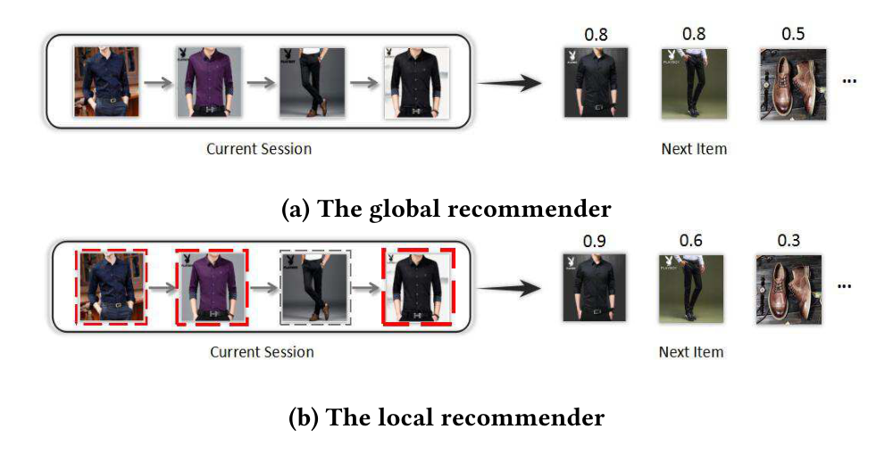
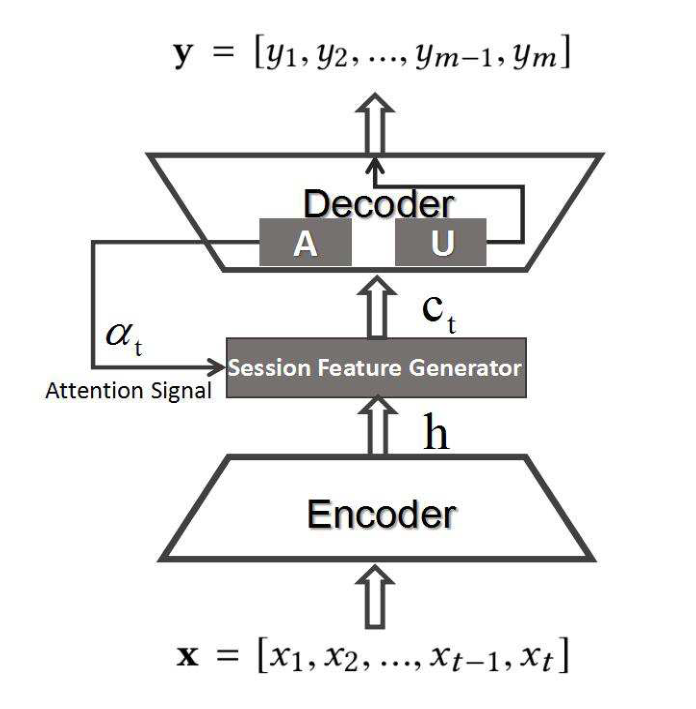
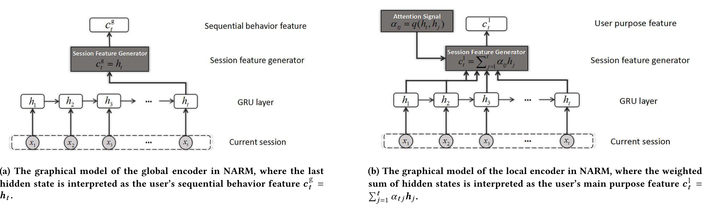
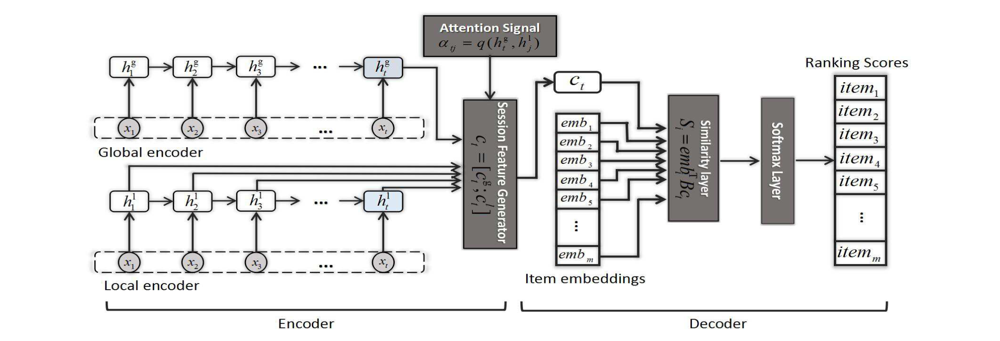
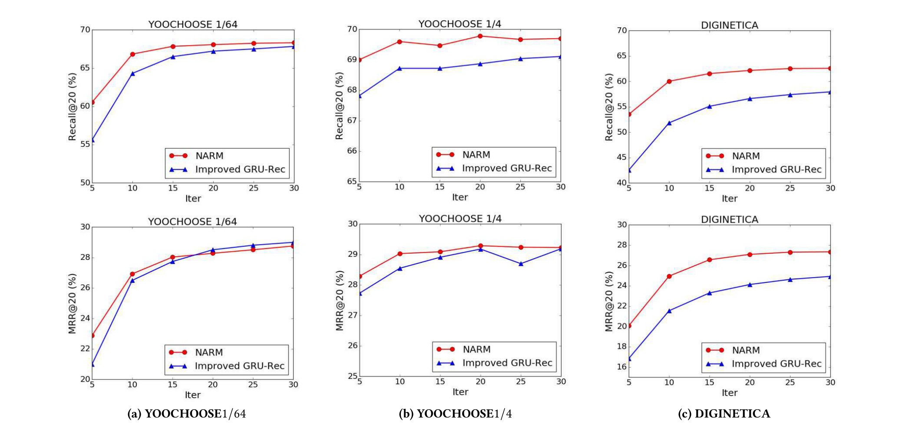
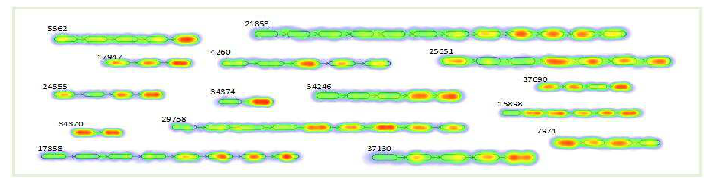

# 神经注意力会话推荐（Neural Attentive Session-based Recommendation）

> 李靖（Jing Li） | 山东大学，中国济南 | jingli.sdu@gmail.com
>
> 任鹏杰（Pengjie Ren） | 山东大学，中国济南 | jay.ren@outlook.com
>
> 陈竹敏（Zhumin Chen） | 山东大学，中国济南 | chenzhumin@sdu.edu.cn
>
> 任昭春（Zhaochun Ren） | JD.com 数据科学实验室，中国北京 | renzhaochun@jd.com
>
> 连涛（Tao Lian） | 山东大学，中国济南 | liantao1988@gmail.com
>
> 马军（Jun Ma） | 山东大学，中国济南 | majun@sdu.edu.cn

本文提出神经注意力推荐机（NARM，Neural Attentive Recommendation Machine）——用"全局编码器建模用户的序列行为 + 局部编码器通过 item 级注意力捕获用户在当前会话中的主要意图"的混合编码结构，把两者拼接为统一会话表示后，再以双线性匹配（bi-linear matching）方案计算每个候选 item 的推荐分数，**在两个基准数据集上全面超越当时的 state-of-the-art 基线，并在长会话上提升尤为显著**。

核心内容：

- 痛点：此前基于 RNN 的会话推荐只考虑用户在当前会话中的序列行为，不强调用户的主要意图；当用户误点击无关 item 时，仅靠序列行为做推荐很危险
- 方案：NARM 用注意力机制从当前会话中提取用户主要意图，与序列行为特征共同组成统一会话表示，再计算推荐分数
- 技术细节：全局编码器（GRU，末隐藏状态 $c^g_t = h_t$ ）建模序列行为；局部编码器（GRU + item 级注意力 $c^l_t = \sum_{j=1}^{t} \alpha_{tj} h_j$ ）捕获主要意图；两者拼接成 $c_t = [c^g_t ; c^l_t]$
- 解码方案：用双线性相似度函数 $S_i = \text{emb}_i^T B c_t$ 替代全连接层，把参数从 $|N|*|H|$ 降到 $|D|*|H|$
- 训练：对每条序列单独处理（非会话并行），用 mini-batch 梯度下降优化交叉熵损失 + 固定步数 BPTT

关键发现：

- 三个数据集上 NARM 的 Recall@20 全部超过所有基线；以 DIGINETICA 为例，相对最佳基线 Improved GRU-Rec 的 Recall@20 提升约 **7.98%**、MRR@20 提升约 **9.70%**
- 双线性解码器相对全连接解码器，三个数据集上 Recall@20 分别提升约 0.65%、0.24%、4.74%
- 同时使用两种特征的 NARMhybrid 相对只用单一特征的 NARMglobal/NARMlocal，在 DIGINETICA（ $d=50$ ）上 Recall@20 提升约 3.52% 与 5.09%
- NARM 在长度 4–17 的会话上表现更好，长度 11 时相对基线提升最高达 +15.32%；会话过长时用户易漫无目的地点击，提升会回落

---

## 摘要

在用户画像不可见的电子商务场景下，会话推荐（session-based recommendation）被提出，用于从短会话中生成推荐结果。此前的工作只考虑用户在当前会话中的序列行为，而不强调用户在当前会话中的主要意图。本文提出一种新颖的神经网络框架，即神经注意力推荐机（NARM），来解决这一问题。具体而言，我们探索一种带注意力机制的混合编码器，对用户的序列行为建模，并捕获用户在当前会话中的主要意图，两者随后组合成一个统一的会话表示。接着我们基于这个统一的会话表示，用双线性匹配方案为每个候选 item 计算推荐分数。我们通过联合学习 item 与会话表示以及它们的匹配关系来训练 NARM。我们在两个基准数据集上开展了大量实验。实验结果表明，NARM 在两个数据集上都优于 state-of-the-art 基线。此外，我们还发现 NARM 在长会话上取得了显著的提升，这证明了它在同时建模用户序列行为与主要意图方面的优势。

**关键词（Keywords）**：Session-based recommendation, sequential behavior, recurrent neural networks, attention mechanism

允许出于个人或课堂使用目的，免费制作本工作的全部或部分内容的数字或硬拷贝，前提是这些拷贝不得以营利或商业优势为目的进行制作或分发，且拷贝首页须带有本声明和完整的引用信息。对本工作中由 ACM 以外的组织拥有的组件的版权必须予以尊重。允许在注明出处的前提下进行摘要转载。如需以其他方式复制、再版、发布到服务器或分发给列表，须事先获得特定许可并/或支付相应费用。请向 permissions@acm.org 申请许可。

CIKM'17，2017 年 11 月 6–10 日，新加坡。© 2017 ACM。ISBN 978-1-4503-4918-5/17/11...\$15.00

DOI: https://doi.org/10.1145/3132847.3132926

## 1. 引言

当用户点击某个 item 时，一个用户会话（user session）就开始了；在一个用户会话内，用户点击感兴趣的 item，并花更多时间浏览它。之后，用户点击另一个感兴趣的 item，重新开始浏览。这个迭代过程会一直持续，直到用户的需求得到满足。当推荐仅仅来自这些用户会话时，当前推荐研究会面临挑战，因为已有的推荐方法 [1, 16, 39, 42] 无法很好地表现。为解决这个问题，人们提出了会话推荐 [33]，它仅基于当前会话中的隐式反馈（即用户点击）来预测用户可能感兴趣的下一 item。

Hidasi 等人 [12] 把带门控循环单元（GRU，Gated Recurrent Unit）的循环神经网络（RNN，Recurrent Neural Network）应用于会话推荐。该模型把用户点击的第一个 item 视为 RNN 的初始输入，并基于它生成推荐。之后，用户可能会点击其中一个推荐，该点击随后被输入 RNN，接着的推荐会基于此前所有的点击产生。Tan 等人 [40] 通过利用两个关键技术进一步改进了这个基于 RNN 的模型，即数据增强（data augmentation）和一种处理输入数据分布偏移的方法。尽管上述所有基于 RNN 的方法相比传统推荐方法都显示出可喜的提升，但它们只考虑用户在当前会话中的序列行为，而不强调用户在当前会话中的主要意图。当用户不小心点击了错误的 item，或者用户出于好奇而被一些无关的 item 吸引时，只依赖用户的序列行为是危险的。因此，我们认为，在会话推荐中，用户在当前会话中的序列行为与主要意图都应该被考虑。

假设一个用户想在网上买一件衬衫。如图 1 所示，在浏览过程中，他/她倾向于点击一些风格相似的衬衫来做比较，同时他/她可能因为意外或出于好奇而点击一条西装裤。之后，他/她继续寻找合适的衬衫。在这种情况下，如果我们只考虑他/她的序列行为，那么很可能会推荐另一件衬衫，甚至是西装裤或一双鞋，因为许多用户在点击了一些衬衫和西装裤之后会点击它们，如图 1(a) 所示。假设推荐器是一位经验丰富的人类购物向导，这位向导可以推测出，这个用户此时很可能要买一件短袖衬衫，因为他/她点击的大多数 item 都与它相关。因此，向导会对用户点击过的短袖衬衫投入更多的注意力，并推荐另一件相似的衬衫，如图 1(b) 所示。理想情况下，除了考虑用户的整个序列行为之外，一个更好的推荐器还应该考虑用户的主要意图，而这一意图由当前会话中一些相对重要的 item 所反映。请注意，一个会话中的序列行为与主要意图是互补的，因为我们并不能总是从一个会话中推测出用户的主要意图，例如，当会话太短，或者用户只是漫无目的地点击了一些东西时。

为解决上述问题，我们提出一种新颖的神经网络框架，即神经注意力推荐机（NARM）。具体而言，我们探索一种带注意力机制的混合编码器，对用户的序列行为建模，并捕获用户在当前会话中的主要意图，两者随后组合成一个统一的会话表示。借助这种 item 级注意力机制，NARM 学会对不同权重的 item 予以不同的关注。接着我们基于这个统一的会话表示，用双线性匹配方案为每个候选 item 计算推荐分数。NARM 通过联合学习 item 与会话表示以及它们的匹配关系来训练。

本工作的主要贡献总结如下：

- 我们提出一种新颖的 NARM 模型，同时考虑用户在当前会话中的序列行为与主要意图，并使用双线性匹配方案计算推荐分数。
- 我们应用注意力机制来提取用户在当前会话中的主要意图。
- 我们在两个基准数据集上开展了大量实验。结果表明，在两个数据集上，NARM 在召回率（recall）和 MRR 指标上都优于 state-of-the-art 基线。此外，我们发现 NARM 在长会话上取得了更好的表现，这证明了它在同时建模用户序列行为与主要意图方面的优势。

**图 1：** 两种不同的推荐器。全局推荐器（global recommender）对用户的整个序列行为建模来做出推荐，而局部推荐器（local recommender）捕获用户的主要意图来做出推荐。item 上方的数字表示每个推荐器产生的推荐分数。在 (b) 中，红色虚线框中的 item 与当前用户意图更相关。当 item 越重要时，红色线条越粗。

## 2. 相关工作

会话推荐是基于隐式反馈的推荐系统的一个典型应用，其中没有显式偏好（例如评分），而只有正例观测（例如点击）[10, 23, 27]。这些正例观测通常以序列数据的形式出现，是通过在一段时间序列上被动地跟踪用户行为得到的。在本节中，我们从以下两个方面简要回顾会话推荐的相关工作，即传统方法和基于深度学习的方法。

### 2.1 传统方法

通常，有两种传统的建模范式，即通用推荐器（general recommender）和序列推荐器（sequential recommender）。

通用推荐器主要基于 item-to-item 推荐方法。在这种设定下，从可用的会话数据中预先计算一个 item-to-item 相似度矩阵。在会话中经常被一起点击（即共现）的 item 被视为相似的。Linden 等人 [20] 提出一种 item-to-item 协同过滤方法，为每个顾客个性化在线商店。Sarwar 等人 [32] 分析不同的基于 item 的推荐生成算法，并把它们的结果与基本的 k 近邻方法进行比较。尽管这些方法已被证明是有效的并被广泛采用，但它们只考虑会话的最后一次点击，忽略了整个点击序列的信息。

序列推荐器基于马尔可夫链（Markov chain），它通过给定最后一次动作来预测用户的下一个动作，从而利用序列数据 [36, 46]。Zimdars 等人 [46] 提出一种基于马尔可夫链的序列推荐器，研究如何提取序列模式，以使用概率决策树模型学习下一个状态。Shani 等人 [36] 提出一种马尔可夫决策过程（MDP，Markov Decision Process），旨在以基于会话的方式提供推荐，最简单的 MDP 归结为一阶马尔可夫链，其中下一个推荐可以简单地通过 item 之间的转移概率计算得到。Mobasher 等人 [25] 研究不同的序列模式来做推荐，并发现对于序列预测任务，连续序列模式比一般序列模式更合适。Yap 等人 [44] 在用于下一 item 推荐的个性化序列模式挖掘中引入一种新的能力分数（Competence Score）度量。Chen 等人 [3] 把播放列表建模为马尔可夫链，并提出 logistic 马尔可夫嵌入（logistic Markov Embeddings）来学习歌曲的表示以用于播放列表预测。把马尔可夫链应用于会话推荐任务的一个主要问题是：当试图包含用户在所有 item 上可能做出的所有选择序列时，状态空间会迅速变得难以管理。

### 2.2 基于深度学习的方法

深度学习近年来在图像识别 [8, 17]、语音识别 [2, 7, 13] 和神经语言处理 [5, 18, 30, 37, 38] 等领域取得了非常成功的应用。深度模型可以被训练来从非结构化数据中学习判别性表示 [9, 11, 19]。在这里，我们重点关注使用深度学习模型来解决推荐任务的相关工作。

神经网络推荐器（neural network recommender）大多聚焦于经典的协同过滤（CF，Collaborative Filtering）用户-item 设定。Salakhutdinov 等人 [31] 首先提出把受限玻尔兹曼机（RBM，Restricted Boltzmann Machine）用于协同过滤（CF）。在他们的工作中，RBM 被用于建模用户-item 交互并执行推荐。近年来，去噪自编码器也以类似的方式被用于执行 CF [34, 43]。Wang 等人 [41] 为下一购物篮推荐引入一种基于编码器-解码器机制的分层表示模型。深度神经网络也被用于跨域推荐，其中 item 被映射到一个联合 latent 空间 [6]。循环神经网络（RNN）被设计用于建模变长序列数据。最近，Hidasi 等人 [12] 把 RNN 应用于会话推荐，并相比传统方法取得了显著的提升。该模型利用会话并行（session-parallel）的 mini-batch 训练，并采用基于排名的损失函数来学习模型。Tan 等人 [40] 进一步研究了 RNN 在会话推荐中的应用。他们提出两种技术来提升其模型的表现，即数据增强和一种处理输入数据分布偏移的方法。Zhang 等人 [45] 也使用 RNN 做点击序列预测，他们既考虑历史用户行为，也考虑为每个用户和 item 手工构造的特征。

尽管关于会话推荐的出版物越来越多地聚焦于基于 RNN 的方法，但与已有研究不同，我们提出一种新颖的神经注意力推荐模型，它把用户在当前会话中的序列行为与主要意图结合起来，据我们所知，这是已有研究没有考虑过的。而且，我们是首次把注意力机制应用到会话推荐中。

## 3. 方法

在本节中，我们首先介绍会话推荐任务。然后详细描述所提出的 NARM。

### 3.1 会话推荐

会话推荐是这样一项任务：当给定用户当前序列化的事务数据时，预测用户接下来会点击什么。这里我们给出会话推荐问题的形式化。

设 $[x_1, x_2, \ldots, x_{n-1}, x_n]$ 是一个点击会话，其中 $x_i \in I$ （ $1 \leq i \leq n$ ）是从总共 $m$ 个 item 中点击的某个 item 的索引。我们构建一个模型 $M$ ，使得对于会话中点击序列的任意给定前缀 $x = [x_1, x_2, \ldots, x_{t-1}, x_t]$ （ $1 \leq t \leq n$ ），我们都能得到输出 $y = M(x)$ ，其中 $y = [y_1, y_2, \ldots, y_{m-1}, y_m]$ 。我们把 $y$ 看作对该会话中可能出现的所有下一 item 的一个排名列表，其中 $y_j$ （ $1 \leq j \leq m$ ）对应于 item $j$ 的推荐分数。由于推荐器通常需要为用户做出不止一条推荐，因此 $y$ 中的 top-$k$ （ $1 \leq k \leq m$ ）个 item 会被推荐。

### 3.2 概述

在本文中，我们提出一种改进的神经编码器-解码器架构 [26, 35] 来解决会话推荐问题，命名为神经注意力推荐机（NARM）。NARM 的基本思想是为当前会话构建一个隐藏表示，然后基于它生成预测。如图 2 所示，编码器把输入点击序列 $x = [x_1, x_2, \ldots, x_{t-1}, x_t]$ 转换为一组高维隐藏表示 $h = [h_1, h_2, \ldots, h_{t-1}, h_t]$ ，这些表示连同时间 $t$ 的注意力信号（记为 $\alpha_t$ ）一起被送入会话特征生成器，以构建当前会话的表示，用于在时间 $t$ 解码（记为 $c_t$ ）。最后， $c_t$ 被一个矩阵 $U$ （作为解码器的一部分）变换，并输入一个激活函数，从而产生一个关于当前会话中可能出现的所有 item 的排名列表 $y = [y_1, y_2, \ldots, y_{m-1}, y_m]$ 。

**图 2：** 基于编码器-解码器的 NARM 的总体框架与数据流。

$\alpha_t$ 的作用是决定在时间 $t$ 应该强调还是忽略隐藏表示的哪一部分。应当指出， $\alpha_t$ 可以随时间固定，也可以在预测过程中动态变化。在动态设定下， $\alpha_t$ 可以是隐藏状态表示或输入 item 嵌入的函数。我们在模型中采用动态设定，更多细节将在第 3.4 节描述。

我们工作的基本思想是学习一个同时考虑用户在当前会话中的序列行为与主要意图的推荐模型。在本节的以下部分，我们首先描述 NARM 中用于建模用户序列行为的全局编码器（第 3.3 节）。然后介绍用于捕获用户在当前会话中主要意图的局部编码器（第 3.4 节）。最后展示我们的 NARM，它把两者结合起来，并使用双线性匹配方案为每个候选 item 计算推荐分数（第 3.5 节）。

### 3.3 NARM 中的全局编码器

在全局编码器中，输入是全部的历史点击，而输出是用户在当前会话中的序列行为特征。输入和输出都由高维向量统一表示。

图 3(a) 展示了 NARM 中全局编码器的图模型。我们使用带门控循环单元（GRU）的 RNN，而不是标准 RNN，因为 Hidasi 等人 [12] 证明，对于会话推荐任务，GRU 可以胜过长短期记忆（LSTM，Long Short-Term Memory）[14] 单元。GRU 是一种更精细的 RNN 单元，旨在处理梯度消失（vanishing gradient）问题。GRU 的激活是先前激活 $h_{t-1}$ 与候选激活 $\hat{h}_t$ 之间的线性插值：

$$
h_t = (1 - z_t) h_{t-1} + z_t \hat{h}_t \qquad (1)
$$

其中更新门（update gate） $z_t$ 由下式给出：

$$
z_t = \sigma(W_z x_t + U_z h_{t-1}) \qquad (2)
$$

候选激活函数 $\hat{h}_t$ 计算如下：

$$
\hat{h}_t = \tanh[Wx_t + U(r_t \odot h_{t-1})] \qquad (3)
$$

其中重置门（reset gate） $r_t$ 由下式给出：

$$
r_t = \sigma(W^r x_t + U^r h_{t-1}) \qquad (4)
$$

通过一个平凡的会话特征生成器，我们本质上使用最后的隐藏状态 $h_t$ 作为用户序列行为的表示：

$$
c^g_t = h_t \qquad (5)
$$

然而，这个全局编码器有其缺点，例如对整段序列行为的向量化总结往往难以捕获当前用户更精确的意图。

### 3.4 NARM 中的局部编码器

如图 3(b) 所示，局部编码器的架构与全局编码器类似。在这种编码方案中，我们也使用带 GRU 的 RNN 作为基本组件。为捕获用户在当前会话中的主要意图，我们引入一种 item 级注意力机制，它允许解码器动态地选择并线性组合输入序列的不同部分：

$$
c^l_t = \sum_{j=1}^{t} \alpha_{tj} h_j \qquad (6)
$$

其中加权因子 $\alpha$ 决定做出预测时应强调还是忽略输入序列的哪一部分，而它反过来又是隐藏状态的函数：

$$
\alpha_{tj} = q(h_t, h_j) \qquad (7)
$$

基本上，加权因子 $\alpha_{tj}$ 对位置 $j$ 附近的输入与位置 $t$ 处的输出之间的对齐进行建模，因此它可以被视为一个特定的匹配模型。在局部编码器中，函数 $q$ 具体计算最终隐藏状态 $h_t$ 与先前点击 item 的表示 $h_j$ 之间的相似度：

$$
q(h_t, h_j) = v^T \sigma(A_1 h_t + A_2 h_j) \qquad (8)
$$

其中 $\sigma$ 是一个激活函数，例如 sigmoid 函数；矩阵 $A_1$ 用于把 $h_t$ 变换到一个 latent 空间， $A_2$ 对 $h_j$ 起同样的作用。

**图 3：** NARM 中的全局编码器与局部编码器。(a) NARM 中全局编码器的图模型，其中最后的隐藏状态被解释为用户序列行为特征 $c^g_t = h_t$ 。(b) NARM 中局部编码器的图模型，其中隐藏状态的加权和被解释为用户主要意图特征 $c^l_t = \sum_{j=1}^{t} \alpha_{tj} h_j$ 。

这个局部编码器享有自适应地聚焦于更重要的 item、从而捕获用户在当前会话中主要意图的优势。

### 3.5 NARM 模型

对于会话推荐任务，全局编码器拥有整个序列行为的总结，而局部编码器可以自适应地选择当前会话中重要的 item，以捕获用户的主要意图。我们推测，序列行为的表示可能为捕获用户在当前会话中的主要意图提供有用的信息。因此，我们使用序列行为的表示与先前的隐藏状态来计算每个被点击 item 的注意力权重。然后，一个自然的扩展是，通过拼接序列行为特征与用户意图特征，为每个时间戳形成一个扩展的表示。

**图 4：** NARM 的图模型，其中会话特征 $c_t$ 由向量 $c^g_t$ 与 $c^l_t$ 的拼接表示（按公式 (5) 和 (6) 计算）。请注意， $h^g_t$ 与 $h^l_t$ 扮演不同的角色，但它们的值相同。全局编码器的最后隐藏状态 $h^g_t$ 的作用是编码全部输入点击，而局部编码器的最后隐藏状态 $h^l_t$ 用于与先前的隐藏状态计算注意力权重。

如图 4 所示，我们可以看到总结 $h^g_t$ 被并入 $c_t$ ，为 NARM 提供序列行为表示。应当注意，NARM 中的会话特征生成器会在全局编码器和局部编码器中唤起不同的编码机制，尽管它们之后会被组合起来形成一个统一表示。更具体地说，全局编码器的最后隐藏状态 $h^g_t$ 扮演的角色与局部编码器的 $h^l_t$ 不同。前者负责编码整个序列行为。后者用于与先前的隐藏状态计算注意力权重。通过这种混合编码方案，用户在当前会话中的序列行为与主要意图都可以被建模到统一的表示 $c_t$ 中，它是向量 $c^g_t$ 与 $c^l_t$ 的拼接：

$$
c_t = [c^g_t ; c^l_t] = [h^g_t ; \sum_{j=1}^{t} \alpha_{tj} h^l_j] \qquad (9)
$$

图 4 还给出了 NARM 所采用的解码机制的图形化说明。一般来说，标准 RNN 使用全连接层来解码。但使用全连接层意味着该层需要学习的参数数量为 $|H|*|N|$ ，其中 $|H|$ 是会话表示的维度， $|N|$ 是用于预测的候选 item 数量。因此我们必须预留很大的空间来存储这些参数。虽然有一些方法可以减少参数，例如使用分层 softmax 层 [24] 和随机负采样 [22]，但它们不是我们模型的最佳选择。

我们提出一种替代的双线性解码方案，它既减少了参数数量，又提升了 NARM 的表现。具体而言，使用当前会话表示与每个候选 item 表示之间的双线性相似度函数来计算相似度分数 $S_i$ ：

$$
S_i = \text{emb}_i^T B c_t \qquad (10)
$$

其中 $B$ 是一个 $|D|*|H|$ 矩阵， $|D|$ 是每个 item 嵌入的维度。然后把每个 item 的相似度分数输入一个 softmax 层，以获得该 item 将出现的概率。通过使用这种双线性解码器，我们把参数数量从 $|N|*|H|$ 减少到 $|D|*|H|$ ，其中 $|D|$ 通常小于 $|N|$ 。此外，实验结果证明，使用这种双线性解码器可以提升 NARM 的表现（如第 4.4 节所示）。

为学习模型参数，我们不使用 [12] 中提出的训练过程，即模型以会话并行、序列到序列（sequence-to-sequence）的方式训练。相反，为适配局部编码器中的注意力机制，NARM 单独处理每条序列 $[x_1, x_2, \ldots, x_{t-1}, x_t]$ 。我们的模型可以使用标准的 mini-batch 梯度下降在交叉熵损失上训练：

$$
L(p,q) = -\sum_{i=1}^{m} p_i \log(q_i) \qquad (11)
$$

其中 $q$ 是预测概率分布， $p$ 是真实分布。最后，采用一种固定时间步数的时间反向传播（BPTT，Back-Propagation Through Time）方法来训练 NARM。

## 4. 实验设置

在本节中，我们首先描述实验中使用的数据集、state-of-the-art 方法和评估指标。然后比较采用不同解码方案的 NARM。最后，把 NARM 与 state-of-the-art 方法进行比较。

### 4.1 数据集

我们在两个标准的交易数据集上评估不同的推荐器，即 YOOCHOOSE 数据集和 DIGINETICA 数据集。

- YOOCHOOSE¹ 是由 RecSys Challenge 2015 发布的公开数据集。该数据集包含一个电子商务网站上的点击流。过滤掉长度为 1 的会话和出现次数少于 5 次的 item 之后，剩下 7981580 个会话和 37483 个 item。
- DIGINETICA² 来自 CIKM Cup 2016。我们只使用已发布的事务数据，同样过滤掉长度为 1 的会话和出现次数少于 5 次的 item。最终该数据集包含 204771 个会话和 43097 个 item。

我们首先对两个数据集进行一些预处理。对于 YOOCHOOSE，我们使用随后一天的会话进行测试，并从测试集中过滤掉点击的 item 没有出现在训练集中的点击。对于 DIGINETICA，唯一的区别是我们使用随后一周的会话进行测试。由于我们没有以会话并行的方式训练 NARM [12]，因此序列切分预处理是必要的。对于输入会话 $[x_1, x_2, \ldots, x_{n-1}, x_n]$ ，我们在 YOOCHOOSE 和 DIGINETICA 上都生成了用于训练的序列和对应标签： $([x_1], V(x_2))$ 、 $([x_1, x_2], V(x_3))$ 、…、 $([x_1, x_2, \ldots, x_{n-1}], V(x_n))$ 。对应标签 $V(x_i)$ 是当前会话中的最后一次点击。

基于以下原因：(1) YOOCHOOSE 相当大；(2) Tan 等人 [40] 验证了推荐模型确实需要考虑用户行为随时间的改变；(3) 他们的实验结果表明，在完整数据集上训练产生的结果比在数据集较新的分块上训练的结果略差。因此，我们按时间对 YOOCHOOSE 的训练序列进行排序，并报告在训练序列最近的分块 1/64 和 1/4 上训练的模型的结果。请注意，由于我们只在较新的分块上训练模型，一些在测试集中出现的 item 不会出现在训练集中。这三个数据集（即 YOOCHOOSE 1/64、YOOCHOOSE 1/4 和 DIGINETICA）的统计信息如表 1 所示。

**表 1：** 实验中使用的数据集的统计信息。（avg.length 表示完整数据集的平均长度。）

| 数据集 | 全部点击 | 训练会话 | 测试会话 | 全部 item | 平均长度 |
| --- | --- | --- | --- | --- | --- |
| YOOCHOOSE 1/64 | 557248 | 369859 | 55898 | 16766 | 6.16 |
| YOOCHOOSE 1/4 | 8326407 | 5917746 | 55898 | 29618 | 5.71 |
| DIGINETICA | 982961 | 719470 | 60858 | 43097 | 5.12 |

### 4.2 基线方法

我们把所提出的 NARM 与五种传统方法（即 POP、S-POP、Item-KNN、BPR-MF 和 FPMC）以及两个基于 RNN 的模型（即 GRU-Rec 和 Improved GRU-Rec）进行比较。

- **POP：** 流行度预测器总是推荐训练集中最流行的 item。尽管它很简单，但在某些领域往往是一个很强的基线。
- **S-POP：** 该基线为当前会话推荐最流行的 item。随着会话获得更多 item，推荐列表会发生变化。平局（tie）用全局流行度值来打破。
- **Item-KNN：** 在该基线中，相似度定义为两个 item 在会话中的共现次数，除以任一 item 出现的会话数乘积的平方根。还包含正则化，以避免罕见 item 之间偶然的高相似度 [4, 20]。
- **BPR-MF：** BPR-MF [28] 通过随机梯度下降（SGD，Stochastic Gradient Descent）优化一个成对排名目标函数。矩阵分解不能直接应用于会话推荐，因为新会话没有预先计算好的 latent 表示。然而，我们可以通过用会话中到目前为止出现的 item 的平均 latent 因子来表示新会话，从而使其可用。换句话说，推荐分数可以计算为候选 item 的 latent 因子与会话中到目前为止的 item 的 latent 因子之间相似度的平均值。
- **FPMC：** FPMC [29] 是下一购物篮推荐中一个 state-of-the-art 的混合模型。为使其适用于会话推荐，我们在计算推荐分数时不考虑用户 latent 表示。
- **GRU-Rec：** 我们把 [12] 中提出的模型记为 GRU-Rec，它利用会话并行的 mini-batch 训练过程，并采用基于排名的损失函数来学习模型。
- **Improved GRU-Rec：** 我们把 [40] 中提出的模型记为 Improved GRU-Rec。Improved GRU-Rec 采用两种技术来提升 GRU-Rec 的表现，包括数据增强和一种处理输入数据分布偏移的方法。

### 4.3 评估指标与实验设置

#### 4.3.1 评估指标

由于推荐系统每次只能推荐少量 item，用户可能选择的实际 item 应该在列表的最前几个之中。因此，我们使用以下指标来评估推荐列表的质量。

- **Recall@20：** 主要评估指标是 Recall@20，即目标 item 出现在所有测试用例的前 20 个 item 之中的案例比例。只要 item 位于 top-$N$ 之中，Recall@N 就不考虑 item 的实际排名，而且它通常与其他指标（如点击率（CTR，Click-Through Rate）[21]）有很好的相关性。
- **MRR@20：** 另一个使用的指标是 MRR@20（平均倒数排名，Mean Reciprocal Rank），它是目标 item 倒数排名的平均值。如果排名大于 20，则倒数排名设为零。MRR 考虑 item 的排名，这在推荐的顺序很重要的情况下很关键。

#### 4.3.2 实验设置

所提出的 NARM 模型为 item 使用 50 维嵌入。优化使用 Adam [15]，初始学习率设为 0.001，mini-batch 大小固定为 512。NARM 中使用两个 dropout 层：第一个 dropout 层位于 item 嵌入层与 GRU 层之间，dropout 比例为 25%；第二个位于 GRU 层与双线性相似度层之间，dropout 比例为 50%。我们还将 BPTT 截断在 19 个时间步，与 state-of-the-art 方法 [40] 的设置一致，epoch 数设为 30，同时使用 10% 的训练数据作为验证集。我们在模型中使用一个 GRU 层，GRU 设置为 100 个隐藏单元。模型在 Theano 中定义并训练，运行在一张 GeForce GTX TitanX GPU 上。我们模型的源代码可在网上获取³。

### 4.4 不同解码器之间的比较

我们首先在经验上比较采用不同解码器（即全连接解码器与双线性相似度解码器）的 NARM。三个数据集上的结果如表 2 所示。这里我们只展示 100 维隐藏状态下的结果，因为我们在其他维度设定下也得到相同的结论。

**表 2：** NARM 中不同解码器的比较。

| 解码器 | YOOCHOOSE 1/64 Recall@20(%) | YOOCHOOSE 1/64 MRR@20(%) | YOOCHOOSE 1/4 Recall@20(%) | YOOCHOOSE 1/4 MRR@20(%) | DIGINETICA Recall@20(%) | DIGINETICA MRR@20(%) |
| --- | --- | --- | --- | --- | --- | --- |
| 全连接解码器 | 67.67 | 29.17 | 69.49 | 29.54 | 57.84 | 24.77 |
| 双线性相似度解码器 | 68.32 | 28.76 | 69.73 | 29.23 | 62.58 | 27.35 |

从表 2 中我们得到以下观察：(1) 就 Recall@20 而言，使用双线性相似度解码器时表现有所提升，三个数据集上的提升分别约为 0.65%、0.24% 和 4.74%。(2) 就 MRR@20 而言，在 YOOCHOOSE 1/64 和 1/4 上，使用双线性解码器的模型的表现变得略差。但在 DIGINETICA 上，使用双线性解码器的模型仍然明显优于使用全连接解码器的模型。

对于会话推荐任务，由于在我们的设定下推荐系统一次推荐 top-20 个 item，用户可能选择的实际 item 应该在这 20 个 item 的列表中。因此，我们认为在此任务中召回率指标比 MRR 指标更重要，NARM 在后续实验中采用双线性解码器。

### 4.5 与基线的比较

接下来我们把 NARM 模型与 state-of-the-art 方法进行比较。所有方法在三个数据集上的结果如表 3 所示。NARM 与最佳基线（即 Improved GRU-Rec）在三个数据集上的更具体的比较如图 5 所示。

**表 3：** NARM 与基线方法在三个数据集上的表现比较。

| 方法 | YOOCHOOSE 1/64 Recall@20(%) | YOOCHOOSE 1/64 MRR@20(%) | YOOCHOOSE 1/4 Recall@20(%) | YOOCHOOSE 1/4 MRR@20(%) | DIGINETICA Recall@20(%) | DIGINETICA MRR@20(%) |
| --- | --- | --- | --- | --- | --- | --- |
| POP | 6.71 | 1.65 | 1.33 | 0.30 | 0.91 | 0.23 |
| S-POP | 30.44 | 18.35 | 27.08 | 17.75 | 21.07 | 14.69 |
| Item-KNN | 51.60 | 21.81 | 52.31 | 21.70 | 28.35 | 9.45 |
| BPR-MF | 31.31 | 12.08 | 3.40 | 1.57 | 15.19 | 8.63 |
| FPMC* | 45.62 | 15.01 | - | - | 31.55 | 8.92 |
| GRU-Rec | 60.64 | 22.89 | 59.53 | 22.60 | 43.82 | 15.46 |
| Improved GRU-Rec | 67.84 | 29.00 | 69.11 | 29.22 | 57.95 | 24.93 |
| NARM | 68.32 | 28.76 | 69.73 | 29.23 | 62.58 | 27.35 |

* 在 YOOCHOOSE 1/4 上，我们没有足够的内存来初始化 FPMC。我们可用的内存为 120G。

从结果中我们得到以下观察：(1) 对于 YOOCHOOSE 1/4 数据集，当我们使用会话中出现的 item 因子的平均值来替代用户因子时，BPR-MF 无法工作。此外，由于我们把每个会话视为 FPMC 中的一个用户，我们没有足够的内存来初始化它。这些问题表明，传统的基于用户的方法已不再适合会话推荐。(2) 总体而言，三个基于 RNN 的方法一致地优于传统基线，这证明基于 RNN 的模型擅长处理会话中的序列信息。(3) 通过同时考虑用户的序列行为与主要意图，所提出的 NARM 在三个数据集上的 recall@20 方面可以优于所有基线，在 MRR@20 方面可以优于大部分基线。以 DIGINETICA 数据集为例，与最佳基线（即 Improved GRU-Rec）相比，NARM 在 recall@20 和 MRR@20 上的相对性能提升分别约为 7.98% 和 9.70%。(4) 如我们所见，两个 YOOCHOOSE 数据集上的召回率值不如 DIGINETICA 上的结果显著，且获得的 MRR 值彼此非常接近。我们认为一个重要的原因是：当我们把 YOOCHOOSE 数据集切分为 1/64 和 1/4 时，为了与 Improved GRU-Rec [40] 的设定保持一致，我们没有从测试集中过滤掉点击的 item 不在训练集中的点击。而在 DIGINETICA 上，我们从测试集中过滤了这些点击，因此 NARM 在 Recall@20 和 MRR@20 上都显著优于基线。

**图 5：** NARM 与最佳基线（即 Improved GRU-Rec）在三个数据集上的表现比较。(a) YOOCHOOSE 1/64；(b) YOOCHOOSE 1/4；(c) DIGINETICA。

## 5. 分析

在本节中，我们进一步探索在 NARM 中使用不同会话特征的影响，并分析所采用的注意力机制的有效性。

### 5.1 使用不同特征的影响

在本部分，我们把只使用序列行为特征的 NARM、只使用用户意图特征的 NARM、以及同时使用两种特征的 NARM 分别记为 NARMglobal、NARMlocal 和 NARMhybrid。如表 4 所示，(1) 只使用单一特征的 NARMglobal 和 NARMlocal 在三个数据集上表现不佳。此外，它们在两个指标上的表现彼此非常接近。这表明，仅考虑当前会话中的序列行为或用户意图，可能无法学习到一个好的推荐模型。(2) 当我们同时考虑用户的序列行为与主要意图时，在三个数据集上不同隐藏状态维度下，NARMhybrid 在 Recall@20 和 MRR@20 上都优于 NARMglobal 和 NARMlocal。以 DIGINETICA 数据集为例，当与隐藏状态维度设为 50 的 NARMglobal 和 NARMlocal 相比时，NARMhybrid 在 Recall@20 上的相对性能提升分别约为 3.52% 和 5.09%。这些结果证明了在会话推荐中同时考虑当前用户的序列行为与主要意图的优势。

**表 4：** NARM 的三种版本在三个数据集上的表现比较。

**(a) YOOCHOOSE 1/64 上的表现比较**

| 模型 | $d=50$ Recall@20 | $d=50$ MRR@20 | $d=100$ Recall@20 | $d=100$ MRR@20 |
| --- | --- | --- | --- | --- |
| NARMglobal | 67.26 | 26.95 | 68.15 | 28.37 |
| NARMlocal | 67.07 | 26.79 | 68.10 | 28.38 |
| NARMhybrid | 68.28 | 28.10 | 68.32 | 28.76 |

**(b) YOOCHOOSE 1/4 上的表现比较**

| 模型 | $d=50$ Recall@20 | $d=50$ MRR@20 | $d=100$ Recall@20 | $d=100$ MRR@20 |
| --- | --- | --- | --- | --- |
| NARMglobal | 67.67 | 27.10 | 68.91 | 28.48 |
| NARMlocal | 67.50 | 27.21 | 68.01 | 27.36 |
| NARMhybrid | 69.17 | 28.67 | 69.73 | 29.23 |

**(c) DIGINETICA 上的表现比较**

| 模型 | $d=50$ Recall@20 | $d=50$ MRR@20 | $d=100$ Recall@20 | $d=100$ MRR@20 |
| --- | --- | --- | --- | --- |
| NARMglobal | 59.63 | 23.52 | 61.88 | 26.51 |
| NARMlocal | 58.74 | 22.91 | 61.71 | 26.04 |
| NARMhybrid | 61.73 | 26.25 | 62.58 | 27.35 |

### 5.2 不同会话长度的影响

我们的 NARM 模型基于这样一个假设：当用户在线浏览时，其点击行为经常围绕他/她在当前会话中的主要意图展开。然而，当用户只点击少量 item 时，我们很难捕获用户的主要意图。因此，我们的 NARM 模型应该擅长建模长会话。为验证这一点，我们在 DIGINETICA 上对不同长度的会话进行比较。如表 5 所示，(1) 总体而言，当会话长度在 4 到 17 之间时，NARM 表现更好。这表明 NARM 在长会话上确实更准确地捕获了用户的主要意图。换句话说，如果 NARM 在已有序列行为特征的基础上捕获到更多的用户意图特征，它就能做出更好的预测。(2) 当会话过长时，NARM 的性能提升会下降。我们认为原因是：当会话过长时，用户很可能漫无目的地点击一些 item，因此 NARM 中的局部编码器无法捕获用户在当前会话中的主要意图。

**表 5：** DIGINETICA 数据集上不同会话长度的表现比较。（基线方法为 Improved GRU-Rec [40]。）

| 长度 | 基线正确 | NARM 正确 | 性能 |
| --- | --- | --- | --- |
| 1 | 8747 | 9358 | +6.98% |
| 2 | 6601 | 7084 | +7.31% |
| 3 | 4923 | 5299 | +7.63% |
| 4 | 3625 | 3958 | +9.18% |
| 5 | 2789 | 3019 | +8.24% |
| 6 | 2029 | 2202 | +8.52% |
| 7 | 1520 | 1656 | +8.94% |
| 8 | 1198 | 1295 | +8.09% |
| 9 | 915 | 996 | +8.85% |
| 10 | 690 | 753 | +9.13% |
| 11 | 509 | 587 | +15.32% |
| 12 | 411 | 459 | +11.67% |
| 13 | 304 | 323 | +6.25% |
| 14 | 243 | 260 | +6.99% |
| 15 | 199 | 219 | +10.05% |
| 16 | 149 | 165 | +10.73% |
| 17 | 98 | 112 | +14.28% |
| 18 | 88 | 93 | +5.68% |
| 19 | 70 | 75 | +7.14% |

### 5.3 可视化注意力权重

为直观地说明注意力机制的作用，我们在图 6 中展示一个例子。会话实例从 DIGINETICA 中随机选取。颜色的深浅对应于公式 (7) 给出的 item 的重要性。我们从该例子中得出以下观察：(1) 总体而言，很明显并非所有 item 都与下一次点击相关，而且当前会话中几乎所有重要的 item 都是连续的。这意味着会话中用户的意图确实是局部的，这也是 NARM 能够优于一般基于 RNN 的模型的原因之一。(2) 最重要的 item 往往出现在会话的末尾附近。这与人们的浏览行为一致：用户很可能点击与他/她刚刚点击的内容相关的其他 item。回想一下，一般的基于 RNN 的模型能够建模这一事实，因此它们在会话推荐中能取得相当好的表现。(3) 在某些情况下，最重要的 item 出现在会话的开头或中间（例如，在会话 7974 或 4260 中）。在这种情况下，我们相信我们的 NARM 可以比一般基于 RNN 的模型表现更好，因为注意力机制可以学会对更重要的 item 投入更多关注，而不管它在会话中的位置如何。

**图 6：** item 权重的可视化。颜色的深浅对应于公式 (7) 给出的 item 的重要性。会话上方是会话 ID。（最佳彩色浏览。）

## 6. 结论与未来工作

我们提出了带编码器-解码器架构的神经注意力推荐机（NARM），以解决会话推荐问题。通过把注意力机制并入 RNN，我们提出的方法可以捕获用户在当前会话中的序列行为与主要意图。基于序列行为特征与用户意图特征，我们应用 NARM 来预测用户在当前会话中的下一次点击。我们在两个基准数据集上开展了大量实验，并证明我们的方法在各种评估指标上都优于 state-of-the-art 方法。此外，我们对用户点击行为进行了分析，发现用户的意图在大多数会话中是局部的，这证明了我们模型的合理性。

至于未来工作，更多的 item 属性，例如价格和类别，可能会提升我们的方法在会话推荐中的表现。同时，最近邻会话以及不同邻居的重要性都应带来新的见解。最后，注意力机制可以用来探索当前会话中属性的重要性。

## 致谢

作者要感谢匿名审稿人的有益评论。本工作得到了国家自然科学基金（61672322、61672324）、山东省自然科学基金（2016ZRE27468）以及山东大学基本科研业务费（Fundamental Research Funds of Shandong University）的支持。

---

¹ http://2015.recsyschallenge.com/challenge.html

² http://cikm2016.cs.iupui.edu/cikm-cup

³ https://github.com/lijingsdu/sessionRec_NARM

## 参考文献

[1] G. Adomavicius and A. Tuzhilin. Toward the next generation of recommender systems: a survey of the state-of-the-art and possible extensions. IEEE Transactions on Knowledge and Data Engineering, 17(6):734–749, 2005.

[2] D. Amodei, R. Anubhai, E. Battenberg, C. Case, J. Casper, B. Catanzaro, J. Chen, M. Chrzanowski, A. Coates, G. Diamos, et al. Deep speech 2: end-to-end speech recognition in english and mandarin. In Proceedings of the 33rd. International Conference on Machine Learning, pages 173–182, 2016.

[3] S. Chen, J. L. Moore, D. Turnbull, and T. Joachims. Playlist prediction via metric embedding. In Proceedings of the 18th. ACM SIGKDD International Conference on Knowledge Discovery and Data Mining, pages 714–722, 2012.

[4] J. Davidson, B. Liebald, J. Liu, P. Nandy, T. Van Vleet, U. Gargi, S. Gupta, Y. He, M. Lambert, B. Livingston, et al. The youtube video recommendation system. In Proceedings of the 4th. ACM Conference on Recommender Systems, pages 293–296, 2010.

[5] L. De Vine, G. Zuccon, B. Koopman, L. Sitbon, and P. Bruza. Medical semantic similarity with a neural language model. In Proceedings of the 23rd. ACM International Conference on Conference on Information and Knowledge Management, pages 1819–1822, 2014.

[6] A. M. Elkahky, Y. Song, and X. He. A multi-view deep learning approach for cross domain user modeling in recommendation systems. In Proceedings of the 24th. International Conference on World Wide Web, pages 278–288, 2015.

[7] A. Graves, A.-r. Mohamed, and G. Hinton. Speech recognition with deep recurrent neural networks. In Proceedings of the IEEE International Conference on Acoustics, Speech and Signal Processing, pages 6645–6649, 2013.

[8] K. He, X. Zhang, S. Ren, and J. Sun. Deep residual learning for image recognition. In Proceedings of the IEEE Conference on Computer Vision and Pattern Recognition, pages 770–778, 2016.

[9] X. He and T.-S. Chua. Neural factorization machines for sparse predictive analytics. In Proceedings of the 40th. International ACM SIGIR conference on Research and Development in Information Retrieval, pages 355–364, 2017.

[10] X. He, H. Zhang, M.-Y. Kan, and T.-S. Chua. Fast matrix factorization for online recommendation with implicit feedback. In Proceedings of the 39th. International ACM SIGIR conference on Research and Development in Information Retrieval, pages 549–558, 2016.

[11] X. He, L. Liao, H. Zhang, L. Nie, X. Hu, and T.-S. Chua. Neural collaborative filtering. In Proceedings of the 26th. International Conference on World Wide Web, pages 173–182, 2017.

[12] B. Hidasi, A. Karatzoglou, L. Baltrunas, and D. Tikk. Session-based recommendations with recurrent neural networks. In Proceedings of the 4th. International Conference on Learning Representations, 2016.

[13] G. Hinton, L. Deng, D. Yu, G. E. Dahl, A. R. Mohamed, N. Jaitly, A. Senior, V. Vanhoucke, P. Nguyen, and T. N. Sainath. Deep neural networks for acoustic modeling in speech recognition: the shared views of four research groups. IEEE Signal Processing Magazine, 29(6):82–97, 2012.

[14] S. Hochreiter and J. Schmidhuber. Long short-term memory. Neural computation, 9(8):1735–1780, 1997.

[15] D. Kingma and J. Ba. Adam: a method for stochastic optimization. In Proceedings of the 4th. International Conference on Learning Representations, 2015.

[16] Y. Koren, R. Bell, and C. Volinsky. Matrix factorization techniques for recommender systems. Computer, 42(8):30–37, 2009.

[17] A. Krizhevsky, I. Sutskever, and G. E. Hinton. Imagenet classification with deep convolutional neural networks. In Proceedings of the 25th. International Conference on Neural Information Processing Systems, pages 1097–1105, 2012.

[18] P. Li, Z. Wang, W. Lam, Z. Ren, and L. Bing. Salience estimation via variational auto-encoders for multi-document summarization. In Proceedings of the 31st. AAAI Conference on Artificial Intelligence, pages 3497–3503, 2017.

[19] P. Li, Z. Wang, Z. Ren, L. Bing, and W. Lam. Neural rating regression with abstractive tips generation for recommendation. In Proceedings of the 40th. International ACM SIGIR conference on Research and Development in Information Retrieval, pages 345–354, 2017.

[20] G. Linden, B. Smith, and J. York. Amazon.com recommendations: item-to-item collaborative filtering. IEEE Internet Computing, 7(1):76–80, 2003.

[21] Q. Liu, T. Chen, J. Cai, and D. Yu. Enlister: baidu's recommender system for the biggest chinese q&a website. In Proceedings of the 6th. ACM Conference on Recommender Systems, pages 285–288, 2012.

[22] T. Mikolov, I. Sutskever, K. Chen, G. Corrado, and J. Dean. Distributed representations of words and phrases and their compositionality. In Proceedings of the 26th. International Conference on Neural Information Processing Systems, pages 3111–3119, 2013.

[23] A. Mild and T. Reutterer. An improved collaborative filtering approach for predicting cross-category purchases based on binary market basket data. Journal of Retailing and Consumer Services, 10(3):123–133, 2003.

[24] A. Mnih and G. Hinton. A scalable hierarchical distributed language model. In Proceedings of the 21st. International Conference on Neural Information Processing Systems, pages 1081–1088, 2008.

[25] B. Mobasher, H. Dai, T. Luo, and M. Nakagawa. Using sequential and non-sequential patterns in predictive web usage mining tasks. In Proceedings of the IEEE International Conference on Data Mining, pages 669–672, 2002.

[26] P. Ren, Z. Chen, Z. Ren, F. Wei, J. Ma, and M. de Rijke. Leveraging contextual sentence relations for extractive summarization using a neural attention model. In Proceedings of the 40th. International ACM SIGIR conference on Research and Development in Information Retrieval, pages 95–104, 2017.

[27] Z. Ren, S. Liang, P. Li, S. Wang, and M. de Rijke. Social collaborative viewpoint regression with explainable recommendations. In Proceedings of the 10th. ACM International Conference on Web Search and Data Mining, pages 485–494, 2017.

[28] S. Rendle, C. Freudenthaler, Z. Gantner, and L. Schmidt-Thieme. Bpr: bayesian personalized ranking from implicit feedback. In Proceedings of the 25th. Conference on Uncertainty in Artificial Intelligence, pages 452–461, 2009.

[29] S. Rendle, C. Freudenthaler, and L. Schmidt-Thieme. Factorizing personalized markov chains for next-basket recommendation. In Proceedings of the 19th. International Conference on World Wide Web, pages 811–820, 2010.

[30] O. Rsoy and C. Cardie. Deep recursive neural networks for compositionality in language. In Proceedings of the 27th. International Conference on Neural Information Processing Systems, pages 2096–2104, 2014.

[31] R. Salakhutdinov, A. Mnih, and G. Hinton. Restricted boltzmann machines for collaborative filtering. In Proceedings of the 24th. International Conference on Machine Learning, pages 791–798, 2007.

[32] B. Sarwar, G. Karypis, J. Konstan, and J. Riedl. Item-based collaborative filtering recommendation algorithms. In Proceedings of the 10th. International Conference on World Wide Web, pages 285–295, 2001.

[33] J. B. Schafer, J. Konstan, and J. Riedl. Recommender systems in e-commerce. In Proceedings of the 1st. ACM Conference on Electronic Commerce, pages 158–166, 1999.

[34] S. Sedhain, A. K. Menon, S. Sanner, and L. Xie. Autorec: autoencoders meet collaborative filtering. In Proceedings of the 24th. International Conference on World Wide Web, pages 111–112, 2015.

[35] L. Shang, Z. Lu, and H. Li. Neural responding machine for short-text conversation. In Proceedings of the 53rd. Annual Meeting of the Association for Computational Linguistics, pages 1577–1586, 2015.

[36] G. Shani, D. Heckerman, and R. I. Brafman. An mdp-based recommender system. Journal of Machine Learning Research, 6(1):1265–1295, 2005.

[37] R. Socher, C. Y. Lin, A. Y. Ng, and C. D. Manning. Parsing natural scenes and natural language with recursive neural networks. In Proceedings of the 28th. International Conference on Machine Learning, pages 129–136, 2011.

[38] H. Song, Z. Ren, S. Liang, P. Li, J. Ma, and M. de Rijke. Summarizing answers in non-factoid community question-answering. In Proceedings of the 10th. ACM International Conference on Web Search and Data Mining, pages 405–414, 2017.

[39] X. Su and T. M. Khoshgoftaar. A survey of collaborative filtering techniques. Advances in Artificial Intelligence, 2009.

[40] Y. K. Tan, X. Xu, and Y. Liu. Improved recurrent neural networks for session-based recommendations. In Proceedings of the 1st. Workshop on Deep Learning for Recommender Systems, pages 17–22, 2016.

[41] P. Wang, J. Guo, Y. Lan, J. Xu, S. Wan, and X. Cheng. Learning hierarchical representation model for next basket recommendation. In Proceedings of the 38th. International ACM SIGIR conference on Research and Development in Information Retrieval, pages 403–412, 2015.

[42] M. Weimer, A. Karatzoglou, Q. V. Le, and A. Smola. Maximum margin matrix factorization for collaborative ranking. In Proceedings of the 20th. International Conference on Neural Information Processing Systems, pages 1–8, 2007.

[43] Y. Wu, C. Dubois, A. X. Zheng, and M. Ester. Collaborative denoising auto-encoders for top-n recommender systems. In Proceedings of the 9th. ACM International Conference on Web Search and Data Mining, pages 153–162, 2016.

[44] G. E. Yap, X. L. Li, and P. S. Yu. Effective next-items recommendation via personalized sequential pattern mining. In Proceedings of the 17th. International Conference on Database Systems for Advanced Applications, pages 48–64, 2012.

[45] Y. Zhang, H. Dai, C. Xu, J. Feng, T. Wang, J. Bian, B. Wang, and T.-Y. Liu. Sequential click prediction for sponsored search with recurrent neural networks. In Proceedings of the 28th. AAAI Conference on Artificial Intelligence, pages 1369–1375, 2014.

[46] A. Zimdars, D. M. Chickering, and C. Meek. Using temporal data for making recommendations. In Proceedings of the 17th. Conference on Uncertainty in Artificial Intelligence, pages 580–588, 2001.
