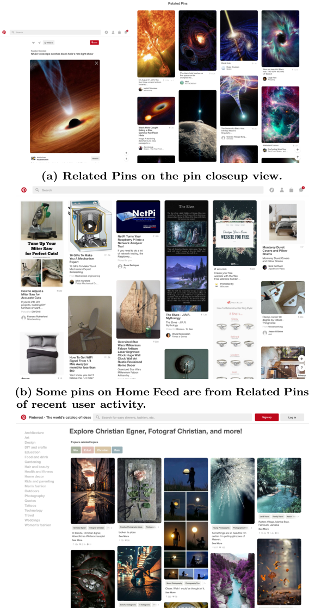
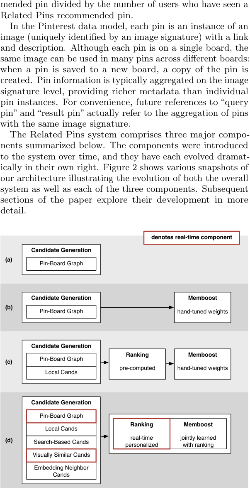
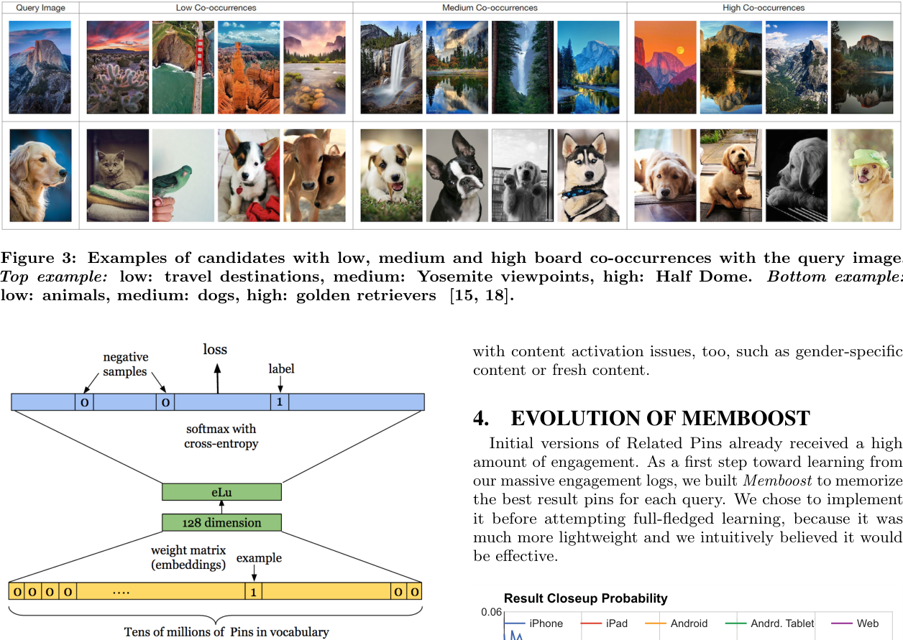
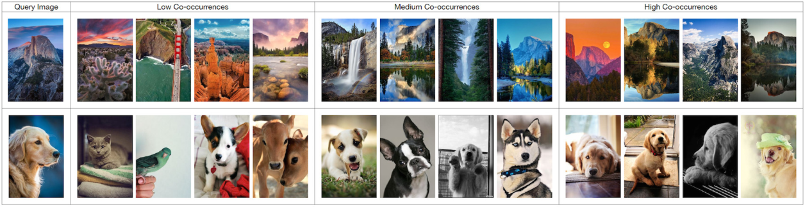
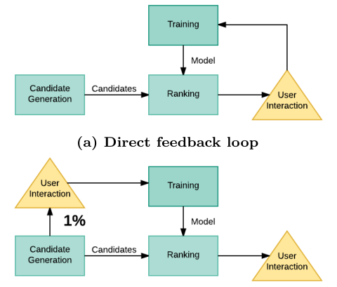
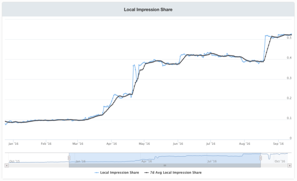

# Related Pins at Pinterest: The Evolution of a Real-World Recommender System

> Chen Zhuang, Lucas Zemel, Rakesh Shivanna, Greg Corrado | Pinterest

本文介绍 Pinterest 的 Related Pins 推荐系统从初始原型到实时生产系统的演进过程。系统采用基于图的候选生成、结合内容理解与协同信号的实时排序，以及通过 Memboost 方法进行在线-离线联合训练来解决模型偏差问题。

Pinterest 是一个视觉发现平台，用户在上面发现、保存并购买创意内容。Related Pins 功能在用户查看特定 Pin 时，提供与该 Pin 相关的推荐内容。本文详细描述了该系统从简单的离线候选生成，到结合实时候选和深度学习排序模型的复杂系统的演进过程。

**关键发现**：
- 基于图的随机游走（Random Walk）方法在相关性上优于基于内容的候选项，但基于内容的候选项在覆盖率和多样性上更有优势
- 将候选生成和排序系统从离线迁移至在线架构，显著提升了实验迭代速度和用户体验
- Memboost 方法通过联合训练排序权重，有效解决了在线-离线数据分布不一致导致的模型偏差问题
- 通过内容激活策略，本地化相关推荐的占比从 9% 提升至 54%

Random Walk, Graph-based Recommendation, Collaborative Filtering, Memboost, Real-time Ranking, Content Activation

---

## 摘要

我们介绍了 Pinterest 的 Related Pins 推荐系统从初始原型到服务百万用户的实时生产系统的演进过程。我们使用基于图的候选生成方法，结合内容理解和协同信号进行实时排序。我们通过 Memboost 方法解决了反馈循环（Feedback Loop）的挑战，这是一种联合在线-离线训练的方法，用于缓解模型偏差（Model Bias）。

## 1. 引言

推荐系统在在线服务中无处不在，帮助用户从海量目录中发现相关内容。Pinterest 是一个视觉发现平台，用户在上面收集并组织图片（Pin）到主题画板（Board）中。Related Pins 功能为用户推荐与当前 Pin 在主题或视觉上相似的 Pin，驱动了平台上很大一部分用户互动。

在 Pinterest 的规模下构建推荐系统面临独特挑战。系统必须在保持相关性和多样性的同时，每秒处理数万次查询。内容以视觉为主，需要超越传统协同过滤（Collaborative Filtering）的专业理解。此外，随着系统的演进，组件之间的交互会产生复杂的反馈循环（Feedback Loop），如果管理不当会导致性能下降。

本文描述了从简单的离线流水线到复杂的实时系统的演进过程。我们讨论了候选生成方法（第3节）、一种称为 Memboost 的新型在线-离线联合训练方法（第4节）以及我们的排序系统（第5节）。我们还分享了关于真实世界推荐系统中系统级挑战的经验教训（第6节）。

## 2. 系统概述

Related Pins 系统由三个主要组件组成：候选生成（Candidate Generation）、排序（Ranking）和后处理（Post-Processing）。

**候选生成。** 候选生成阶段从数十亿可用 Pin 中产生一组候选 Pin。我们采用两种方法：基于图的候选项源自用户互动模式，基于内容的候选项利用视觉相似性。每种方法具有互补优势：图候选项在相关性方面表现出色，而内容候选项提供更好的覆盖率和新鲜度。

**排序。** 排序阶段对每个候选项进行评分，以确定其在最终推荐中的位置。我们的排序模型考虑了丰富的特征集，包括 Pin 属性、用户历史和交叉特征交互。我们使用梯度提升决策树（GBDT，Gradient Boosted Decision Tree）进行排序，它在预测质量和服务延迟之间提供了良好的平衡。

**Memboost。** 我们系统中的一个关键创新是 Memboost，一种联合训练在线和离线组件的方法。这解决了反馈循环（Feedback Loop）问题，即当前部署的模型会偏向未来模型的训练数据。我们在第4节详细描述 Memboost。

## 3. 候选生成

从数十亿 Pin 中生成高质量候选是一个关键挑战。我们描述两种互补的方法：基于图的候选生成和基于内容的候选生成。

### 3.1 基于图的候选生成

我们将用户-Pin 交互建模为二部图（Bipartite Graph），其中边代表保存、点击或放大操作。该图包含数亿节点和数十亿边，捕获了用户行为中丰富的协同信号。

为了生成候选，我们从种子 Pin 开始执行随机游走（Random Walk）。在每一步中，游走沿着边到达相邻节点，转移概率与边权重成正比。游走长度和游走次数是平衡探索与利用的超参数。在这些随机游走中频繁访问的 Pin 被作为候选返回。

基于图的方法在捕获协同过滤信号方面非常有效——保存相似 Pin 的用户往往具有相似的偏好。然而，它有局限性：互动较少的新 Pin 信号较弱，图结构可能产生流行度偏差（Popularity Bias），使已经流行的 Pin 被不成比例地推荐。

### 3.2 基于内容的候选生成

为了补充基于图的候选项，我们使用视觉相似性来查找相关 Pin。我们使用在 ImageNet 上预训练的卷积神经网络（CNN，Convolutional Neural Network）从 Pin 图像中提取深度视觉特征。每个 Pin 在特征空间中被表示为稠密向量，我们使用近似最近邻（ANN，Approximate Nearest Neighbor）搜索来查找最近邻。

基于内容的候选项提供了几个优势。它们能够发现没有互动历史的 Pin，支持冷启动（Cold-start）场景。它们还通过呈现可能无法通过协同路径到达的视觉相关内容来引入多样性。然而，基于内容的候选项可能缺乏主题相关性——视觉相似的 Pin 可能在语义上不相关。

### 3.3 候选融合

我们将两种方法的候选项结合使用，比例可按请求类型配置。在生产中，我们通常将 80% 的候选项槽位分配给基于图的候选项，20% 分配给基于内容的候选项，尽管这些比例会根据在线实验进行调整。

## 4. Memboost: 在线-离线联合训练

已部署排序系统中的一个基本挑战是反馈循环（Feedback Loop）问题：当前在生产中的模型决定了向用户展示哪些项目，这又决定了下一个模型迭代的训练数据。这在训练数据和服务数据之间产生了分布偏移（Distributional Shift），导致模型性能随时间下降。

### 4.1 问题形式化

设 $\pi_0$ 表示当前部署的排序策略。训练数据通过记录用户与由 $\pi_0$ 排序的项目的交互来收集。新模型 $f$ 在此记录数据上训练。当 $f$ 被部署时，它生成反映其自身排序行为的新训练数据，而非 $\pi_0$ 的行为。

这造成了不匹配：模型在一个分布的数据上训练，但服务于另一个分布的请求。这种不匹配的严重程度取决于模型改变排序分布的程度。

### 4.2 Memboost 方法

Memboost 通过显式地将先前模型的偏差纳入训练过程来解决反馈循环问题。关键洞察是，我们可以使用一个轻量级的"记忆"组件（Memory Component）来近似先前模型的排序行为，该组件与完整模型并行运行。

记忆组件存储先前模型评分行为的紧凑表示。在训练过程中，损失函数被增强以考虑先前模型的排序与新模型预测之间的差异：

$$L(f) = \sum_{i} \ell(y_i, f(x_i)) + \lambda \cdot \text{KL}(f(x_i) \| \pi_0(x_i))$$

其中 $\ell$ 是标准排序损失，$\lambda$ 控制正则化强度，KL 表示新旧模型预测分布之间的 KL 散度（KL Divergence）。

### 4.3 实现细节

在实践中，我们将记忆组件实现为一个简单的查找表（Lookup Table），以输入特征的哈希值为索引。这提供了先前模型行为的计算高效近似。记忆表定期使用最新模型的预测进行更新，创建最近模型行为的滑动窗口。

正则化参数 $\lambda$ 通过在线 A/B 测试来调整。值太小无法纠正分布偏移，而值太大又会过度约束新模型。我们发现 $\lambda$ 在 0.1 到 1.0 的范围内在实践中效果良好。

## 5. 排序

我们的排序系统从简单的逻辑回归（Logistic Regression）模型发展为复杂的深度学习架构。我们描述所使用的特征和模型架构。

### 5.1 特征

我们使用丰富的特征集进行排序，分为几个类别：

**Pin 特征**：包括 Pin 的年龄、保存次数、图像嵌入向量（通过 CNN 提取）、描述文本嵌入等。

**用户特征**：包括用户的活动历史、偏好嵌入、在平台上的活跃度等。

**上下文特征**：包括请求时间、设备类型、用户当前查看的 Pin 等。

**交叉特征**：用户特征与 Pin 特征的交互，用于捕获个性化信号。

所有特征都经过归一化，必要时进行离散化，以提高模型训练的稳定性。

### 5.2 模型架构

我们采用两阶段排序架构：一个轻量级的一阶模型对所有候选项进行评分，随后一个更复杂的二阶模型对顶级候选项进行重排序。

一阶模型使用梯度提升决策树（GBDT），以低延迟提供出色的性能。模型在展示的子样本上训练，以平衡训练速度和模型质量。

二阶模型使用深度神经网络（Deep Neural Network），能够捕获复杂的特征交互。架构包括分类特征的嵌入层（Embedding Layer），随后是带有 ReLU 激活的全连接层。我们使用 Dropout 正则化来防止过拟合。

### 5.3 训练目标

我们训练排序模型以优化保存倾向（Save Propensity）——用户保存推荐 Pin 的可能性。该指标直接衡量为用户提供的价值，因为保存表示对内容的真实兴趣和重新访问的意图。

我们尝试了成对排序损失（Pairwise Ranking Loss），但发现带有样本权重的点式训练（Pointwise Training）提供了更稳定的训练和更好的在线性能。损失函数对负样本（未保存）分配更高的权重，以处理推荐场景中典型的极端类别不平衡。

## 6. 挑战

### 6.1 改变任何东西都会改变一切

我们系统演进中一个反复出现的主题是 CACE（Changing Anything Changes Everything，改变任何东西都会改变一切）原则。各个组件针对当前系统状态进行了优化，因此改进一个组件可能会无意中损害另一个组件。

例如，改进候选生成器会改变排序器看到的候选分布，可能降低排序性能。类似地，改变排序模型会改变哪些项目获得互动，影响未来的训练数据。这需要跨系统的变更协调和稳健的在线实验。

### 6.2 内容激活

一个重大挑战是确保新鲜和小众内容的覆盖。新上传的 Pin 通常互动很少，使其不太可能通过协同过滤作为候选出现。我们通过内容激活（Content Activation）策略来解决这个问题，这些策略有意增加对代表性不足内容的曝光。

我们的方法包括以高于其互动应得的速率采样新鲜内容，以及使用基于内容的候选项来呈现可能还没有协同信号的 Pin。我们还实现了探索机制（Exploration Mechanism），定期向推荐中注入多样化内容，以衡量用户兴趣。

## 7. 结论

Pinterest 的 Related Pins 系统已从简单的离线流水线发展为复杂的实时系统。主要贡献包括基于图和基于内容的候选生成的结合、解决反馈循环的 Memboost 方法，以及考虑组件交互的精心系统设计。

经验教训包括将推荐系统作为一个整体来对待而非孤立优化组件的重要性、稳健在线实验的价值，以及需要内容激活策略来确保多样化覆盖。这些见解适用于 Pinterest 之外的任何处理复杂反馈循环和不断演变内容的大型推荐系统。

---

[1] M. Abadi, A. Agarwal, P. Barham, et al. TensorFlow: Large-scale machine learning on heterogeneous distributed systems. 2015.
[2] S. Baluja, R. Seth, D. Sivakumar, et al. Video suggestion and discovery for YouTube: Taking random walks through the view graph. WWW, 2008.
[3] C. Burges, T. Shaked, E. Renshaw, et al. Learning to rank using gradient descent. ICML, 2005.
[4] R. Cai, C. Zhang, L. Zhang, et al. Scalable music recommendation by search. ACM MM, 2007.
[5] H.-T. Cheng, L. Koc, J. Harmsen, et al. Wide & deep learning for recommender systems. DLRS, 2016.
[6] P. Covington, J. Adams, E. Sargin. Deep neural networks for YouTube recommendations. RecSys, 2016.
[7] J. Davidson, B. Liebald, J. Liu, et al. The YouTube video recommendation system. RecSys, 2010.
[8] C. Eksombatchai, P. Jindal, J. Z. Liu, et al. Pixie: A system for recommending 1+ billion items to 150+ million Pinterest users in real-time. 2017.
[9] C. A. Gomez-Uribe, N. Hunt. The Netflix recommender system: Algorithms, business value, and innovation. ACM TMIS, 2015.
[10] P. Gupta, A. Goel, J. Lin, et al. WTF: The who to follow service at Twitter. WWW, 2013.
[11] Y. Hu, Y. Koren, C. Volinsky. Collaborative filtering for implicit feedback datasets. ICDM, 2008.
[12] Y. Jing, S. Baluja. PageRank for product image search. WWW, 2008.
[13] Y. Jing, D. Liu, D. Kislyuk, et al. Visual search at Pinterest. KDD, 2015.
[14] T. Joachims. Optimizing search engines using clickthrough data. KDD, 2002.
[15] D. Kislyuk, Y. Liu, D. Liu, et al. Human curation and convnets: Powering item-to-item recommendations on Pinterest. arXiv, 2015.
[16] B. Liu. RealPin: A highly customizable object retrieval system. RocksDB meetup, 2015.
[17] T.-Y. Liu. Learning to rank for information retrieval. FnTIR, 2009.
[18] Y. Liu, D. Chechik, J. Cho. Power of human curation in recommendation system. WWW Companion, 2016.
[19] K. Ma. Applying deep learning to related pins. Pinterest Engineering Blog, 2017.
[20] J. Mao, J. Xu, K. Jing, et al. Training and evaluating multimodal word embeddings with large-scale web annotated images. NIPS, 2016.
[21] T. Mikolov, K. Chen, G. Corrado, et al. Efficient estimation of word representations in vector space. CoRR, 2013.
[22] D. Sculley, G. Holt, D. Golovin, et al. Hidden technical debt in machine learning systems. NIPS, 2015.
[23] V. Sharma. Open-sourcing Terrapin: A serving system for batch generated data. Pinterest Engineering Blog, 2015.
[24] E. Sharp. Search outside the box with new Pinterest visual discovery tools. Pinterest Blog, 2017.
[25] A. Zhai, D. Kislyuk, Y. Jing, et al. Visual discovery at Pinterest. WWW, 2017.
[26] W. V. Zhang, R. Jones. Comparing click logs and editorial labels for training query rewriting. WWW Workshop, 2007.

