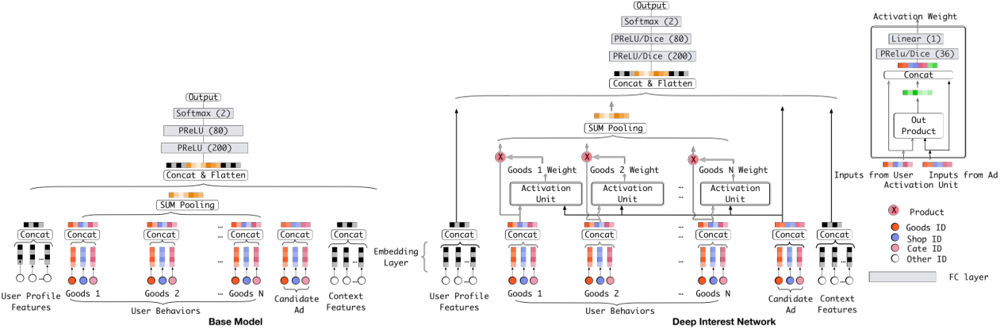

# DIN: Deep Interest Network for Click-Through Rate Prediction

> Guorui Zhou, Chengru Song, Xiaoqiang Zhu, Ying Fan, Han Zhu, Xiao Ma, Yanghui Yan, Junqi Jin, Han Li, Kun Gai 
>
> 阿里巴巴集团

本文介绍了深度兴趣网络（DIN），该模型通过引入**局部激活单元**，根据给定 候选广告 自适应地从 历史行为中 学习**用户兴趣的表示向量**。核心内容：

- 指出现有 Embedding&MLP 方法中 **使用固定长度向量表达用户多样化兴趣的局限性**
- 提出 DIN 模型，通过局部激活单元实现 **自适应变化** 的用户兴趣表示
- 开发 **小批量感知正则化**（MBA） 和 **数据自适应激活函数**（Dice）两种训练技术

关键发现：

- 局部激活单元使表示向量随不同广告变化，**大幅提高模型表达能力**
- 小批量感知正则化 有效防止**大规模稀疏特征下的过拟合**，在阿里巴巴数据集上带来 9.68% RelaImpr 提升
- 在线 A/B 测试中 DIN 贡献高达 10.0% CTR 和 3.8% RPM 提升

---

## 摘要

点击率预测是工业应用中的一项基本任务，如在线广告。近年来，基于深度学习的方法被提出，这些方法遵循类似的Embedding&MLP范式。在这些方法中，**大规模稀疏输入特征首先映射到 低维嵌入向量，然后以分组方式转换为固定长度向量，最后拼接在一起输入多层感知机以学习特征之间的 非线性关系。**这样一来，用户特征被压缩成一个固定长度的表示向量，而**与候选广告无关**。固定长度向量的使用将成为一个瓶颈，给Embedding&MLP方法从丰富的历史行为中有效捕获用户多样化兴趣带来困难。本文提出了一种新颖的模型：深度兴趣网络，通过设计一个局部激活单元来根据特定广告自适应地从历史行为中学习用户兴趣的表示。**该表示向量随不同广告而变化，大大提高了模型的表达能力**。此外，我们开发了两种技术：**小批量感知正则化** 和 **数据自适应激活函数**，它们有助于训练具有数亿参数的工业深度网络。在两个公开数据集 以及 一个包含超过20亿样本 的阿里巴巴真实生产数据集上的实验证明了所提方法的有效性，其性能优于最先进的方法。DIN现已成功部署在阿里巴巴的在线展示广告系统中，服务于主要流量。

**CCS概念：** 信息系统 $\rightarrow$ 展示广告；推荐系统；

**关键词：** 点击率预测，展示广告，电子商务

## 1 引言

在**按点击付费**的广告系统中，广告按eCPM（有效每千次展示成本）排序，**eCPM是出价与CTR（点击率）的乘积**，而CTR需要由系统预测。因此，CTR预测模型的性能直接影响最终收入，并在广告系统中扮演关键角色。CTR预测建模已受到研究和工业界的广泛关注。

近年来，受深度学习在计算机视觉和自然语言处理领域成功应用的启发，基于深度学习的方法已被提出用于CTR预测任务。这些方法遵循类似的Embedding&MLP范式：大规模稀疏输入特征首先映射到低维嵌入向量，然后以分组方式转换为固定长度向量，最后拼接在一起输入全连接层（也称为多层感知机）以学习特征之间的非线性关系。与常用的逻辑回归模型（LR，Logistics Regression）相比，这些深度学习方法可以**大大减少特征工程工作**，并极大地增强模型能力。为简洁起见，本文将这些方法称为Embedding&MLP，它们现已在CTR预测任务中变得流行。

然而，Embedding&MLP方法中有限维度的用户表示向量将成为表达用户多样化兴趣的瓶颈。以电子商务网站的展示广告为例，用户在访问电子商务网站时可能**同时对不同种类的商品感兴趣**。也就是说，**用户兴趣是多样化的**。在CTR预测任务中，用户兴趣通常从用户行为数据中捕获。Embedding&MLP方法通过将用户行为的嵌入向量转换为固定长度向量来学习某个用户所有兴趣的表示，该固定长度向量位于一个欧几里得空间中，所有用户的表示向量都在其中。换句话说，用户的多样化兴趣被压缩成一个固定长度向量，这限制了Embedding&MLP方法的表达能力。**为了使表示足够表达用户的多样化兴趣，需要大幅扩展固定长度向量的维度**。不幸的是，这将显著增大学习参数的规模，并在有限数据下加剧过拟合风险。此外，它还**增加了计算和存储的负担，这对于工业在线系统可能是不可容忍的**。另一方面，在预测候选广告时，没有必要将某个用户的所有多样化兴趣压缩到同一个向量中，因为只有部分用户兴趣会影响其行为（点击或不点击）。例如，一位女性游泳者点击推荐泳镜的主要原因是她上周购物清单中购买了泳衣，而不是鞋子。受此启发，我们提出了一种新颖的模型：深度兴趣网络，它通过考虑给定候选广告的历史行为相关性，**自适应地计算用户兴趣的表示向量**。通过引入局部激活单元，DIN通过 **软搜索** 历史行为的相关部分来关注相关的用户兴趣，并采用 **加权和池化** 来获得相对于候选广告的用户兴趣表示。**与候选广告相关性更高的行为获得更高的激活权重，并主导用户兴趣的表示**。我们在实验部分可视化了这一现象。通过这种方式，用户兴趣的表示向量随不同广告而变化，这在有限维度下提高了模型的表达能力，并使DIN能够更好地捕获用户的多样化兴趣。

训练具有大规模稀疏特征的工业深度网络是一个巨大挑战。例如，基于SGD的优化方法只更新每个小批量中出现的稀疏特征的参数。然而，加上**传统的 $\ell_2$ 正则化**，计算量变得不可接受，因为每个小批量都需要计算**整个参数**（在我们的场景中规模高达数十亿）的 $L_2$ 范数。本文开发了一种新颖的 小批量感知正则化方法，其中**只有每个小批量中出现的非零特征的参数参与 $L_2$ 范数的计算**，从而使计算变得可接受。此外，我们设计了一种数据自适应激活函数，它通过自适应地调整相对于输入分布的修正点来推广常用的PReLU，并证明对**训练具有稀疏特征的工业网络**有帮助。

本文的贡献总结如下：

- 我们指出了使用固定长度向量表达用户多样化兴趣的局限性，并设计了一种新颖的深度兴趣网络，该网络引入局部激活单元，根据给定广告从历史行为中自适应地学习用户兴趣的表示。DIN可以大大提高模型的表达能力，更好地捕获用户兴趣的多样性特征。

- 我们开发了两种帮助训练工业深度网络的新技术：i）小批量感知正则化器，它**节省了具有大量参数的深度网络上的繁重正则化计算**，有助于避免过拟合；ii）数据自适应激活函数，它通过**考虑输入分布** 推广了PReLU，并显示出良好性能。

- 我们在公开数据集和阿里巴巴数据集上进行了大量实验。结果验证了所提出的DIN和训练技术的有效性。我们的代码已公开。所提出的方法已部署在阿里巴巴的商业展示广告系统中，该系统是全球最大的广告平台之一，为业务带来了显著改进。

本文聚焦于电子商务行业展示广告场景中的CTR预测建模。这里讨论的方法可以应用于具有丰富用户行为的类似场景，例如电子商务网站中的个性化推荐、社交网络中的信息流排序等。

本文其余部分组织如下。第2节讨论相关工作，第3节介绍电子商务网站展示广告系统中用户行为数据的特征背景。第4节和第5节详细描述了DIN模型以及两种提出的训练技术。我们在第6节展示实验，并在第7节总结。

## 2 相关工作

CTR预测模型的结构已从浅层演变为深层。同时，CTR模型中使用的样本数量和特征维度变得越来越大。为了更好地提取特征关系以提升性能，一些工作关注于模型结构的设计。

**作为一项开创性工作，NNLM为每个词学习分布式表示，旨在避免语言建模中的维度灾难**。这种方法通常被称为嵌入，启发了许多需要处理大规模稀疏输入的自然语言模型和CTR预测模型。

LS-PLM和FM模型可以被视为一类具有一个隐藏层的网络，它们首先对稀疏输入使用嵌入层，然后施加**专门设计的变换函数**以进行目标拟合，旨在捕获特征之间的组合关系。

Deep Crossing、Wide&Deep学习和YouTube推荐CTR模型通过将变换函数替换为复杂的MLP网络扩展了LS-PLM和FM，大大增强了模型能力。**PNN尝试通过在嵌入层之后引入乘积层来捕获高阶特征交互**。DeepFM在Wide&Deep中施加因子分解机作为"wide"模块，无需特征工程。总体而言，这些方法遵循类似的模型结构，结合了嵌入层（用于**学习稀疏特征的稠密表示**）和MLP（用于**自动学习特征的组合关系**）。这种CTR预测模型大大减少了人工特征工程工作。我们的基础模型遵循这种模型结构。然而在具有丰富用户行为的应用中，特征通常包含**可变长度的ID列表**，例如YouTube推荐系统中的搜索词或观看视频。这些模型**通常通过求和/平均池化将相应的嵌入向量列表转换为固定长度向量，这会导致信息损失**。提出的DIN通过自适应地学习相对于给定广告的表示向量来解决这一问题，提高了模型的表达能力。

注意力机制起源于神经机器翻译领域。NMT对所有注释进行加权求和以得到期望的注释，并只关注与生成下一个目标词相关的信息。最近的工作DeepIntent在搜索广告的背景下应用了注意力。类似于NMT，他们使用RNN对文本进行建模，然后学习一个全局隐藏向量来帮助关注每个查询中的关键词。结果表明，使用注意力有助于捕获查询或广告的主要意图。**DIN设计了一个局部激活单元来软搜索相关的用户行为，并采用加权和池化来获得相对于给定广告的自适应用户兴趣表示**。用户表示向量随不同广告而变化，这与DeepIntent不同，后者在广告和用户之间没有交互。

我们公开了代码^1^，并进一步展示了如何在全球最大的广告系统之一中成功部署DIN，以及为训练具有数亿参数的大规模深度网络而开发的新技术。

[^1]: Experiment code on two public datasets is available on GitHub: https://github.com/zhougr1993/DeepInterestNetwork

## 3 背景

在电子商务网站（如阿里巴巴）中，**广告本身就是商品**。在本文的其余部分，除非特别声明，我们将广告视为商品。图1简要说明了阿里巴巴展示广告系统的运行流程，该系统包括两个主要阶段：i）匹配阶段，通过协同过滤等方法生成与访问用户相关的候选广告列表；ii）排序阶段，预测每个给定广告的CTR，然后选择排名靠前的广告。每天，数以亿计的用户访问电子商务网站，为我们留下大量用户行为数据，这些数据对构建匹配和排序模型至关重要。值得一提的是，具有丰富历史行为的用户包含多样化的兴趣。例如，一位年轻母亲最近浏览了包括羊毛外套、T恤、耳环、托特包、皮手提包和儿童外套在内的商品。这些行为数据为我们提供了她购物兴趣的线索。当她访问电子商务网站时，系统向她展示合适的广告，例如一个新款手提包。显然，展示的广告只匹配或激活了这位母亲的部分兴趣。总之，**具有丰富行为的用户的兴趣是多样化的，并且可以在给定某些广告时被局部激活**。我们在本文后面表明，利用这些特征对于构建CTR预测模型起着重要作用。

图1：阿里巴巴展示广告系统运行流程示意图，其中用户行为数据起重要作用。

## 4 深度兴趣网络

与付费搜索不同，用户进入展示广告系统时**没有明确表达的意图**。在构建CTR预测模型时，需要有效的方法从丰富的历史行为中提取用户兴趣。描述用户和广告的特征是广告系统CTR建模中的基本元素。合理利用这些特征并从中挖掘信息至关重要。

### 4.1 特征表示

工业CTR预测任务中的数据主要以**多组分类形式存在**，例如[weekday=Friday, gender=Female, visited_cate_ids={Bag,Book}, ad_cate_id=Book]，这通常通过编码转换为**高维稀疏二值特征**。数学上，第 $i$ 个特征组的编码向量公式化为 $\mathbf{t}_i \in \mathbb{R}^{K_i}$ 。 $K_i$ 表示特征组 $i$ 的维度，即特征组 $i$ 包含 $K_i$ 个唯一 ID。 $\mathbf{t}_i[j]$ 是 $\mathbf{t}_i$ 的第 $j$ 个元素， $\mathbf{t}_i[j] \in \{0, 1\}$ 。 $\sum_{j=1}^{K_i} \mathbf{t}_i[j] = k$ 。 $k = 1$ 的向量 $\mathbf{t}_i$ 指 one-hot 编码， $k > 1$ 指 multi-hot 编码。然后一个实例可以按分组方式表示为 $\mathbf{x} = [\mathbf{t}_1^\top, \mathbf{t}_2^\top, \dots, \mathbf{t}_M^\top]^\top$ ，其中 $M$ 是特征组数量， $\sum_{i=1}^{M} K_i = K$ ， $K$ 是整个特征空间的维度。通过这种方式，上述包含[weekday=Friday, gender=Female, visited_cate_ids={Bag,Book}, ad_cate_id=Book]的实例被编码为**四个二值向量**。

四个特征组示例如下：

$$
\begin{aligned}
&[0, 0, 0, 0, 1, 0, 0] \rightarrow \text{weekday=Friday} \\
&[0, 1] \rightarrow \text{gender=Female} \\
&[0, \dots, 1, \dots, 1, \dots, 0] \rightarrow \text{visited\_cate\_ids=\{Bag,Book\}} \\
&[0, \dots, 1, \dots, 0] \rightarrow \text{ad\_cate\_id=Book}
\end{aligned}
$$

系统中使用的整个特征集在表1中描述。它由四个类别组成，其中**用户行为特征典型地为multi-hot编码向量**，包含丰富的用户兴趣信息。注意，在我们的设置中，**没有组合特征**。我们通过深度神经网络捕获特征的交互。

**表1：阿里巴巴展示广告系统中使用的特征集统计。特征按分组方式由稀疏二值向量组成。**

### 4.2 基线模型（Embedding&MLP）

大多数流行的模型结构共享类似的Embedding&MLP范式，我们称之为基线模型，如图2左侧所示。它由几个部分组成：

**嵌入层。** 由于输入是 **高维系数二值向量**，嵌入层用于将它们**转换为低维稠密表示**。对于第 $i$ 个特征组 $\mathbf{t}_i$ ，令 $\mathbf{W}_i = [\mathbf{w}_1^i, \mathbf{w}_2^i, \dots, \mathbf{w}_{K_i}^i] \in \mathbb{R}^{D \times K_i}$ 表示第 $i$ 个嵌入字典，其中 $\mathbf{w}_j^i \in \mathbb{R}^D$ 是维度为 $D$ 的嵌入向量。嵌入操作遵循表查找机制，如图2所示。

- 如果 $\mathbf{t}_i$ 是 one-hot 向量，第 $j$ 个元素 $\mathbf{t}_i[j] = 1$ ，则 $\mathbf{t}_i$ 的嵌入表示是一个**单一的嵌入向量** $\mathbf{e}_i = \mathbf{w}_j^i$ 。
- 如果 $\mathbf{t}_i$ 是 multi-hot 向量， $\mathbf{t}_i[j] = 1$ ， $j \in \{i_1, i_2, \dots, i_k\}$ ，则 $\mathbf{t}_i$ 的嵌入表示是一个**嵌入向量列表**： $\{\mathbf{e}_{i_1}, \mathbf{e}_{i_2}, \dots, \mathbf{e}_{i_k}\} = \{\mathbf{w}_{i_1}^i, \mathbf{w}_{i_2}^i, \dots, \mathbf{w}_{i_k}^i\}$ 。

**池化层和拼接层。** 注意，**不同用户具有不同数量的行为**。因此，multi-hot 行为特征向量 $\mathbf{t}_i$ 的**非零值数量在不同实例间变化**，导致相应**嵌入向量列表的长度可变**。由于全连接网络只能处理固定长度的输入，通常的做法是通过池化层将嵌入向量列表转换为固定长度向量：
$$
\mathbf{e}_i = \text{pooling}(\mathbf{e}_{i1}, \mathbf{e}_{i2}, \dots, \mathbf{e}_{ik}) \qquad (1)
$$

两种最常用的池化层是 **求和池化** 和 **平均池化**，它们对嵌入向量列表应用逐元素求和/平均操作。

嵌入层和池化层都以分组方式操作，将原始稀疏特征映射为多个固定长度的表示向量。然后将所有向量拼接在一起，获得实例的整体表示向量。

**MLP。** 给定拼接的稠密表示向量，使用全连接层**自动学习特征的组合**。最近开发的方法侧重于设计MLP的结构以更好地提取信息。

**损失函数。** 基础模型中使用的目标函数是**负对数似然函数**，定义为：
$$
\mathcal{L} = - \frac{1}{N} \sum_{(\mathbf{x},y) \in \mathcal{S}} \big( y \log p(\mathbf{x}) + (1 - y) \log(1 - p(\mathbf{x})) \big) \qquad (2)
$$

其中 $\mathcal{S}$ 是大小为 $N$ 的训练集， $\mathbf{x}$ 是网络的输入， $y \in \{0, 1\}$ 是标签， $p(\mathbf{x})$ 是网络经过 softmax 层后的输出，表示样本 $\mathbf{x}$ 被点击的预测概率。

### 4.3 深度兴趣网络的结构

在表1的所有特征中，用户行为特征至关重要，在电子商务应用场景中对**用户兴趣建模**起关键作用。

基线模型通过对用户行为特征组上的所有嵌入向量进行池化，获得**用户兴趣的固定长度表示向量**，如公式(1)所示。对于给定用户，该表示向量保持不变，而与候选广告无关。这样一来，**有限维度的用户表示向量将成为表达用户多样化兴趣的瓶颈**。为了使它足够表达，一个简单的方法是扩展嵌入向量的维度，但这将大大增加学习参数的规模。它会导致在有限训练数据下过拟合，并增加计算和存储的负担，这对于工业在线系统可能是不可容忍的。

是否存在一种优雅的方式在有限维度下用一个向量表示用户的多样化兴趣？**用户兴趣的局部激活特性**启发我们设计一种名为深度兴趣网络的新颖模型。想象当第3节中提到的年轻母亲访问电子商务网站时，她发现展示的新款手提包很可爱并点击了它。**让我们剖析点击行为的驱动力**。展示的广告通过软搜索她的历史行为，发现她最近浏览了类似的托特包和皮手提包，从而击中了这位年轻妈妈的相关兴趣。换句话说，**与展示广告相关的行为极大地促成了点击行为**。DIN通过关注相对于给定广告的局部激活兴趣的表示来模拟这一过程。DIN不是用相同的向量表达所有用户的多样化兴趣，而是通过考虑历史行为与候选广告的相关性，自适应地计算用户兴趣的表示向量。该表示向量随不同广告而变化。

图2右侧展示了DIN的架构。与基础模型相比，DIN引入了一个新颖设计的局部激活单元，并保持其他结构相同。具体来说，激活单元应用于用户行为特征，执行加权和池化以自适应地计算给定候选广告 $A$ 的用户表示 $\mathbf{v}_U$ ，如公式(3)所示：

$$
\mathbf{v}_U(A) = f(\mathbf{v}_A, \mathbf{e}_1, \mathbf{e}_2, \dots, \mathbf{e}_H) = \sum_{j=1}^{H} a(\mathbf{e}_j, \mathbf{v}_A) \mathbf{e}_j = \sum_{j=1}^{H} w_j \mathbf{e}_j \qquad (3)
$$

其中 $\{\mathbf{e}_1, \mathbf{e}_2, \dots, \mathbf{e}_H\}$ 是长度为 $H$ 的用户 $U$ 行为的嵌入向量列表， $\mathbf{v}_A$ 是广告 $A$ 的嵌入向量。通过这种方式， $\mathbf{v}_U(A)$ 随不同广告而变化。 $a(\cdot)$ 是一个前馈网络，输出为激活权重，如图2所示。除了两个输入嵌入向量外， $a(\cdot)$ 还将它们的**外积添加到后续网络中，这是帮助相关性建模的显式知识**。

**图2：网络架构。左侧为基础模型（Embedding&MLP）的网络。属于同一商品的cate_id、shop_id和goods_id的嵌入向量被拼接起来，以表示用户行为中一个访问过的商品。右侧为我们提出的DIN模型。它引入了一个局部激活单元，通过该单元，用户兴趣的表示随不同候选广告自适应地变化。**

公式(3)的局部激活单元与NMT任务中开发的注意力方法共享类似的思想。然而，与传统的注意力方法不同，公式(3)放松了 $\sum_i w_i = 1$ 的约束，**旨在保留用户兴趣的强度**。也就是说，放弃了对 $a(\cdot)$ 输出进行 softmax 归一化。相反， $\sum_i w_i$ 的值被视为某种程度上的激活用户兴趣强度的近似。例如，如果一个用户的历史行为包含 $90\%$ 的衣服和 $10\%$ 的电子产品。给定 T 恤和手机两个候选广告，T 恤激活了大部分属于衣服的历史行为，可能比手机获得更大的 $\mathbf{v}_U$ 值（更高的兴趣强度）。传统的注意力方法通过对 $a(\cdot)$ 的输出进行归一化，失去了对 $\mathbf{v}_U$ **数值尺度的分辨率**。

**我们尝试了LSTM以顺序方式对用户历史行为数据进行建模，但没有显示出改进**。与**受语法约束的NLP任务**中的文本不同，用户历史行为的序列可能包含多个并发的兴趣。**这些兴趣之间的 快速跳跃 和 突然结束 使得用户行为的序列数据看起来很嘈杂**。一个可能的方向是设计特殊结构以序列方式对这类数据进行建模。我们将其留给未来的研究。

## 5 训练技术

在阿里巴巴的广告系统中，商品和用户的数量规模达到数亿。实际上，训练具有大规模稀疏输入特征的工业深度网络是一个巨大挑战。在本节中，我们介绍两种在实践中被证明有帮助的重要技术。

### 5.1 小批量感知正则化

过拟合是训练工业网络的一个关键挑战。例如，在添加细粒度特征（如维度为6亿的goods_id特征，包括表1中描述的用户的visited_goods_ids和广告的goods_id）时，**如果没有正则化，模型性能在第一个epoch后会迅速下降**，如图4中深绿色线所示。直接在具有稀疏输入和数亿参数的训练网络上应用传统的正则化方法（如 $\ell_2$ 和 $\ell_1$ 正则化）是不实际的。以 $\ell_2$ 正则化为例。在没有正则化的基于SGD的优化方法中，**只需要更新每个小批量中出现的非零稀疏特征的参数**。然而，当添加 $\ell_2$ 正则化时，需要对每个小批量计算**整个参数的 $L_2$ 范数**，这导致极其繁重的计算，对于规模达数亿的参数是不可接受的。

本文介绍了一种高效的小批量感知正则化器，它**只计算每个小批量中出现的稀疏特征的参数的 $L_2$ 范数**，使计算成为可能。实际上，嵌入字典贡献了CTR网络的大部分参数，并导致了计算困难。令 $\mathbf{W} \in \mathbb{R}^{D \times K}$ 表示整个嵌入字典的参数，其中 $D$ 是嵌入向量的维度， $K$ 是特征空间的维度。将 $\mathbf{W}$ 上的 $\ell_2$ 正则化对样本展开：

$$
L_2(\mathbf{W}) = \|\mathbf{W}\|_2^2 = \sum_{j=1}^{K} \|\mathbf{w}_j\|_2^2 = \sum_{j=1}^{K} \sum_{(\mathbf{x},y) \in \mathcal{S}} \frac{\mathbb{I}(x_j \neq 0)}{n_j} \|\mathbf{w}_j\|_2^2 \qquad (4)
$$

其中 $\mathbf{w}_j \in \mathbb{R}^D$ 是第 $j$ 个嵌入向量， $\mathbb{I}(x_j \neq 0)$ 表示实例 $\mathbf{x}$ 是否具有特征 ID $j$ ， $n_j$ 表示特征 ID $j$ 在所有样本中出现的次数。公式(4)可以以小批量感知方式转换为公式(5)：

$$
L_2(\mathbf{W}) = \sum_{j=1}^{K} \sum_{m=1}^{B} \sum_{(\mathbf{x},y) \in \mathcal{B}_m} \frac{\mathbb{I}(x_j \neq 0)}{n_j} \|\mathbf{w}_j\|_2^2 \qquad (5)
$$

其中 $B$ 表示小批量的数量， $\mathcal{B}_m$ 表示第 $m$ 个小批量。令 $\alpha_{mj} = \max_{(\mathbf{x},y) \in \mathcal{B}_m} \mathbb{I}(x_j \neq 0)$ 表示小批量 $\mathcal{B}_m$ 中是否至少有一个实例具有特征 ID $j$ 。则公式(5)可以近似为：

$$
L_2(\mathbf{W}) \approx \sum_{j=1}^{K} \sum_{m=1}^{B} \frac{\alpha_{mj}}{n_j} \|\mathbf{w}_j\|_2^2 \qquad (6)
$$

通过这种方式，我们推导出了 $\ell_2$ 正则化的近似小批量感知版本。对于第 $m$ 个小批量，特征 $j$ 的嵌入权重的梯度为：

$$
\mathbf{w}_j \leftarrow \mathbf{w}_j - \eta \left[ \frac{1}{|\mathcal{B}_m|} \left( \sum_{(\mathbf{x},y) \in \mathcal{B}_m} \frac{\partial \mathcal{L}(p(\mathbf{x}), y)}{\partial \mathbf{w}_j} + \lambda \frac{\alpha_{mj}}{n_j} \mathbf{w}_j \right) \right] \qquad (7)
$$

其中只有出现在第 $m$ 个小批量中的特征的参数参与正则化的计算。

### 5.2 数据自适应激活函数

PReLU是一种常用的激活函数：

$$
f(s) = \begin{cases} s, & \text{if } s > 0 \\ \alpha s, & \text{if } s \leq 0 \end{cases} = p(s) \cdot s + (1 - p(s)) \cdot \alpha s \qquad (8)
$$

其中 $s$ 是激活函数 $f(\cdot)$ 输入的一个维度， $p(s) = \mathbb{I}(s > 0)$ 是**指示函数**，控制 $f(s)$ 在 $f(s) = s$ 和 $f(s) = \alpha s$ 两个通道之间切换。第二个通道中的 $\alpha$ 是可学习参数。这里我们将 $p(s)$ 称为**控制函数**。图3左侧绘制了PReLU的控制函数。**PReLU采用值为0的硬修正点，当每一层的输入遵循不同分布时可能不合适**。考虑到这一点，我们设计了一种新颖的数据自适应激活函数，名为Dice：

$$
f(s) = p(s) \cdot s + (1 - p(s)) \cdot \alpha s, \qquad p(s) = \frac{1}{1 + e^{-(s - \mathbb{E}[s]) / \sqrt{\text{Var}[s] + \epsilon}}} \qquad (9)
$$

其控制函数如图3右侧所示。在训练阶段， $\mathbb{E}[s]$ 和 $\text{Var}[s]$ 是**每个小批量中输入的平均值和方差**。在测试阶段， $\mathbb{E}[s]$ 和 $\text{Var}[s]$ 通过数据的移动平均值 $\mathbb{E}[s]$ 和 $\text{Var}[s]$ 计算。 $\epsilon$ 是一个小常数，在我们的实践中设置为 $10^{-8}$ 。

> 图3：PReLU和Dice的控制函数

Dice可以视为PReLU的推广。**Dice的关键思想是根据输入数据的分布自适应地调整 修正点，其值设置为 输入的均值**。此外，Dice在两个通道之间平滑地切换控制。当 $\mathbb{E}(s) = 0$ 且 $\text{Var}[s] = 0$ 时，Dice退化为PReLU。

> [!NOTE]
>
> TODO：分母的作用是什么？

## 6 实验

在本节中，我们详细呈现实验，包括数据集、评估指标、实验设置、模型比较和相应的分析。在两个具有用户行为的公开数据集以及从阿里巴巴展示广告系统收集的数据集上的实验证明了所提出方法的有效性，该方法在CTR预测任务上优于最先进的方法。两个公开数据集和实验代码均已公开。

### 6.1 数据集与实验设置

**Amazon数据集。** Amazon数据集包含来自**Amazon的产品评论和元数据**，被用作基准数据集。我们在名为**Electronics的子集**上进行实验，该子集包含192,403个用户、63,001个商品、801个类别和1,689,188个样本。该数据集中的用户行为丰富，每个用户和商品有超过5条评论。特征包括goods_id、cate_id、用户评论的goods_id_list和cate_id_list。令用户的所有行为为 $(b_1, b_2, \dots, b_k, \dots, b_n)$ ，任务是利用前 $k$ 个评论商品预测第 $(k + 1)$ 个评论商品。对每个用户以 $k = 1, 2, \dots, n - 2$ 生成训练数据集。在测试集中，给定前 $n - 1$ 个评论商品预测最后一个。对于所有模型，我们使用带有**指数衰减的SGD**作为优化器，初始学习率为1，衰减率设置为0.1。小批量大小设置为32。

> [!NOTE]
>
> TODO：这个优化器没有介绍清楚

**MovieLens数据集。** MovieLens数据包含138,493个用户、27,278部电影、21个类别和20,000,263个样本。**为使其适用于CTR预测任务，我们将其转换为二分类数据**。原始用户对电影的评分为0到5之间的连续值。我们**将评分为4和5的样本标记为正样本，其余为负样本**。我们基于用户ID将数据分割为训练集和测试集。在全部138,493个用户中，随机选择100,000个进入训练集（约14,470,000个样本），其余38,493个进入测试集（约5,530,000个样本）。任务是基于历史行为预测用户是否会对给定电影评分为3以上（正标签）。特征包括movie_id、movie_cate_id以及用户评分的movie_id_list、movie_cate_id_list。我们使用与Amazon数据集相同的优化器、学习率和小批量大小。

> [!NOTE]
>
> 随机选取，是否会发生特征穿越？

**Alibaba数据集。** 我们从阿里巴巴在线展示广告系统收集流量日志，使用两周的样本进行训练，之后一天的样本进行测试。训练集和测试集的大小分别约为20亿和1.4亿。对于所有深度模型，全部16组特征的嵌入向量维度为12。MLP层设置为 $192 \times 200 \times 80 \times 2$ 。由于数据量巨大，我们将小批量大小设置为5000，并使用Adam作为优化器。我们应用指数衰减，初始学习率为0.001，衰减率设置为0.9。

以上所有数据集的统计信息如表2所示。Alibaba数据集的规模远大于Amazon和MovieLens，带来了更多挑战。

**表2：本文使用的数据集统计。**

a 对于MovieLens数据集，商品指电影。

### 6.2 对比方法

- **LR。** 逻辑回归是深度网络之前CTR预测任务中广泛使用的浅层模型。我们将其作为弱基线。

- **BaseModel。** 如4.2节所介绍，BaseModel遵循Embedding&MLP架构，是大多数后续开发的CTR建模深度网络的基础。它作为我们模型比较的强基线。

- **Wide&Deep。** 在实际工业应用中，Wide&Deep模型已被广泛接受。它由两部分组成：i）wide模型，处理**人工设计的交叉乘积特征**；ii）deep模型，自动提取特征间的非线性关系，等同于BaseModel。Wide&Deep需要对"wide"模块的输入进行专业的特征工程。我们遵循[10]中的做法，**将用户行为与候选广告的交叉乘积作为wide输入**。例如，在MovieLens数据集中，指用户评分的电影与候选电影的交叉乘积。

- **PNN。** PNN可以视为BaseModel的改进版本，通过在**嵌入层之后引入乘积层**来捕获高阶特征交互。

- **DeepFM。** 它将因子分解机作为Wide&Deep中的"wide"模块，**节省了特征工程工作**。

### 6.3 评估指标

在CTR预测领域，AUC是广泛使用的指标。它通过按预测CTR对所有广告排序来衡量排序质量，包括**用户内和用户间排序**。文献[7,13]引入了**用户加权AUC的变体**，通过对 **用户平均AUC** 来衡量 **用户内排序**的质量，并显示**出在展示广告系统中与在线性能更相关**。我们在实验中采用这一指标。为简洁起见，我们仍称之为AUC。其计算如下：

$$
\text{AUC} = \frac{\sum_{i=1}^{n} \#\text{impression}_i \times \text{AUC}_i}{\sum_{i=1}^{n} \#\text{impression}_i} \qquad (10)
$$

其中 $n$ 是用户数， $\#\text{impression}_i$ 和 $\text{AUC}_i$ 分别是第 $i$ 个用户的展示数和AUC。

此外，我们遵循[25]**引入RelaImpr指标来衡量模型的相对改进**。对于随机猜测，AUC值为0.5。因此RelaImpr定义如下：

$$
\text{RelaImpr} = \frac{\text{AUC}(\text{measured\_model}) - 0.5}{\text{AUC}(\text{base\_model}) - 0.5} - 1 \times 100\% \qquad (11)
$$

### 6.4 Amazon数据集和MovieLens数据集上的模型比较结果

表3显示了Amazon数据集和MovieLens数据集上的结果。**所有实验重复5次，报告平均结果**。随机初始化对AUC的影响小于0.0002。显然，所有深度网络都显著优于LR模型，这确实证明了深度学习的强大。具有特殊设计结构的PNN和DeepFM表现优于Wide&Deep。DIN在所有对比方法中表现最佳。特别是在**具有丰富用户行为的Amazon数据集上**，DIN显著突出。我们将此归功于DIN中局部激活单元结构的设计。**DIN通过软搜索与候选广告相关的部分用户行为来关注 局部相关的用户兴趣**。凭借这一机制，**DIN获得了自适应变化的用户兴趣表示，与其他深度网络相比大大提高了模型的表达能力**。此外，带有Dice的DIN比DIN带来了进一步改进，验证了所提出的数据自适应激活函数Dice的有效性。

**表3：Amazon数据集和MovieLens数据集上的模型比较。所有行分别与每个数据集上的BaseModel计算RelaImpr。**

### 6.5 正则化性能

由于Amazon数据集和MovieLens数据集中特征的维度不高（约10万），所有深度模型包括我们提出的DIN都没有遇到严重的过拟合问题。然而，当涉及到来自在线广告系统的Alibaba数据集时，**其包含更高维度的稀疏特征，过拟合变成了一个大挑战**。例如，在使用细粒度特征（如表1中维度为6亿的goods_id特征）训练深度模型时，如果没有正则化，第一个epoch后就会发生严重的过拟合，导致模型性能迅速下降，如图4中深绿色线所示。为此，我们进行了仔细的实验来检查几种**常用正则化的性能**。

- **Dropout。** 在每个样本中随机丢弃50%的特征ID。
- **Filter。** 按样本中出现频率过滤访问过的goods_id，只保留最频繁的。在我们的设置中，保留前2000万个goods_id。
- **DiFacto正则化。** 频繁特征的参数受到较少的过度正则化。
- **MBA。** 我们提出的小批量感知正则化方法（公式4）。DiFacto和MBA的正则化参数 $\lambda$ 都经过搜索并设置为 $0.01$ 。

> [!NOTE]
>
> TODO：为什么是过拟合，而不是欠拟合？
>
> Filter是一种什么方法？

图4和表4给出了比较结果。关注图4的细节，与不使用细粒度goods_id特征相比，使用该特征训练的模型在第一个epoch中在测试AUC性能上带来了很大提升。然而，在没有正则化训练的情况下（深绿色线），过拟合迅速发生。Dropout防止了快速过拟合，但导致收敛较慢。频率过滤器在一定程度上缓解了过拟合。DiFacto中的正则化对高频率的goods_id设置了更大的惩罚，表现不如频率过滤器。我们提出的小批量感知正则化与其他所有方法相比表现最佳，显著防止了过拟合。

**此外，使用goods_id特征的良好训练模型比不使用它们的模型显示出更好的AUC性能。这是由于细粒度特征包含更丰富的信息**。考虑到这一点，虽然频率过滤器比dropout稍好，但它丢弃了大多数低频ID，可能失去了模型更好地利用细粒度特征的空间。

>  表4：BaseModel在Alibaba数据集上使用不同正则化的最佳AUC，对应图4。其他行均与第一行比较计算RelaImpr。

> 图4：BaseModel在Alibaba数据集上使用不同正则化的性能。使用细粒度goods_id特征且无正则化训练在第一个epoch后遇到严重的过拟合。所有正则化都显示出改进，其中我们提出的小批量感知正则化表现最佳。此外，使用goods_id特征的训练良好模型比不使用它们获得更高的AUC。这是由于细粒度特征包含更丰富的信息。

### 6.6 Alibaba数据集上的模型比较结果

表5显示了在Alibaba数据集上使用完整特征集（如表1所示）的实验结果。正如预期，LR被证明远弱于深度模型。在深度模型之间进行比较，我们报告几个结论。首先，在相同的激活函数和正则化下，DIN本身相比所有其他深度网络（包括BaseModel、Wide&Deep、PNN和DeepFM）已取得了优越的性能。DIN相比BaseModel取得了0.0059的绝对AUC提升和6.08%的RelaImpr。这再次验证了局部激活单元结构的有用设计。其次，基于DIN的消融研究证明了我们提出的训练技术的有效性。使用小批量感知正则化器训练的DIN相比dropout带来了额外的0.0031绝对AUC提升。此外，带有Dice的DIN相比PReLU带来了额外的0.0015绝对AUC提升。

综合来看，带有MBA正则化和Dice的DIN相比BaseModel实现了总计11.65%的RelaImpr和0.0113的绝对AUC提升。即使与在该数据集上表现最佳的DeepFM相比，DIN仍然取得了0.009的绝对AUC提升。值得注意的是，**在拥有数亿流量的商业广告系统中，0.001的绝对AUC提升是显著的，并且在经验上值得模型部署**。DIN在更好地理解并利用用户行为数据的特征方面显示出巨大优势。此外，两种提出的技术进一步提升了模型性能，并为训练大规模工业深度网络提供了强大帮助。

**表5：Alibaba数据集上使用完整特征集的模型比较。所有行与BaseModel比较计算RelaImpr。DIN显著优于所有其他对比方法。此外，使用我们提出的小批量感知正则化器和Dice激活函数训练DIN带来了进一步改进。**

### 6.7 在线A/B测试结果

2017年5月至2017年6月在阿里巴巴展示广告系统中进行了仔细的在线A/B测试。在近一个月的测试中，使用所提出正则化器和激活函数训练的DIN相比引入的BaseModel（我们在线服务模型的上一个版本）贡献了高达10.0%的CTR和3.8%的RPM提升。这是一个显著的改进，证明了我们提出方法的有效性。现在DIN已在线部署并服务于主要流量。

值得一提的是，工业深度网络的在线服务并非易事，每天有数亿用户访问我们的系统。更甚者，在流量高峰期，我们的系统每秒服务超过100万用户。**需要以高吞吐量和低延迟进行实时CTR预测**。例如，在我们的实际系统中，我们需要在**不到10毫秒内为每个访问者预测数百个广告**。在我们的实践中，部署了几项重要技术来加速CPU-GPU架构下工业深度网络的在线服务：i）请求批处理，合并来自CPU的相邻请求以利用GPU能力；ii）GPU内存优化，改善访问模式以减少GPU内存中的浪费事务；iii）并发内核计算，允许多个CUDA内核并发执行矩阵计算。总之，这些技术的优化在实践中将单台机器的QPS能力翻倍。DIN的在线服务也受益于此。

### 6.8 DIN可视化

最后，我们进行案例研究以揭示DIN在Alibaba数据集上的内部结构。我们首先检查局部激活单元的有效性。图5展示了用户行为相对于候选广告的激活强度。正如预期，**与候选广告相关性高的行为获得了高权重**。

**图5：DIN中自适应激活的示意图。与候选广告相关性高的行为获得高激活权重。**

然后我们可视化学习到的嵌入向量。以前面提到的年轻母亲为例，我们随机选择9个类别（连衣裙、运动鞋、包等）以及每个类别100个商品作为她的候选广告。图6展示了DIN学习到的**商品嵌入向量**的 **t-SNE可视化**，其中相同形状的点对应相同类别。我们可以看到，相同类别的商品几乎属于同一个聚类，这清楚地展示了**DIN嵌入的聚类特性**。此外，我们根据预测值为表示候选广告的点着色。图6也是该母亲在嵌入空间中潜在候选商品的兴趣密度分布热力图。它显示DIN可以在特定用户的候选商品嵌入空间中形成多模态兴趣密度分布，以捕获其多样化兴趣。

**图6：DIN中商品嵌入向量的可视化。点的形状表示商品类别。点的颜色对应CTR预测值。**

## 7 结论

本文聚焦于电子商务行业展示广告场景中的CTR预测建模任务，涉及丰富的用户行为数据。传统深度CTR模型中使用固定长度表示是捕获用户兴趣多样性的瓶颈。为了提高模型的表达能力，设计了一种名为DIN的新方法，用于激活相关的用户行为并获得随不同广告而变化的用户兴趣自适应表示向量。此外，引入了两种新技术来帮助训练工业深度网络并进一步提高DIN的性能。它们可以轻松推广到其他工业深度学习任务。DIN现已部署在阿里巴巴的在线展示广告系统中。

## 参考文献

[1] Dzmitry Bahdanau, Kyunghyun Cho, and Yoshua Bengio. 2015. **Neural Machine Translation by Jointly Learning to Align and Translate**. In Proceedings of the 3rd International Conference on Learning Representations.

[2] Ducharme Réjean Bengio Yoshua et al. 2003. **A neural probabilistic language model**. Journal of Machine Learning Research (2003), 1137–1155.

[3] Paul Covington, Jay Adams, and Emre Sargin. 2016. Deep neural networks for youtube recommendations. In Proceedings of the 10th ACM Conference on Recommender Systems. ACM, 191–198.

[4] Cheng H. et al. 2016. Wide & deep learning for recommender systems. In Proceedings of the 1st Workshop on Deep Learning for Recommender Systems. ACM.

[5] Qu Y. et al. 2016. Product-Based Neural Networks for User Response Prediction. In Proceedings of the 16th International Conference on Data Mining.

[6] Wang H. et al. 2018. DKN: Deep Knowledge-Aware Network for News Recommendation. In Proceedings of 26th International World Wide Web Conference.

[7] Zhu H. et al. 2017. **Optimized Cost per Click in Taobao Display Advertising**. In Proceedings of the 23rd International Conference on Knowledge Discovery and Data Mining. ACM, 2191–2200.

[8] Tom Fawcett. 2006. An introduction to ROC analysis. Pattern recognition letters 27, 8 (2006), 861–874.

[9] Kun Gai, Xiaoqiang Zhu, et al. 2017. **Learning Piece-wise Linear Models from Large Scale Data for Ad Click Prediction**. arXiv preprint arXiv:1704.05194 (2017).

[10] Huifeng Guo, Ruiming Tang, et al. 2017. DeepFM: A Factorization-Machine based Neural Network for CTR Prediction. In Proceedings of the 26th International Joint Conference on Artificial Intelligence. 1725–1731.

[11] F. Maxwell Harper and Joseph A. Konstan. 2015. The MovieLens Datasets: History and Context. ACM Transactions on Interactive Intelligent Systems 5, 4 (2015).

[12] Kaiming He, Xiangyu Zhang, Shaoqing Ren, and Jian Sun. 2015. Delving deep into rectifiers: Surpassing human-level performance on imagenet classification. In Proceedings of the IEEE International Conference on Computer Vision. 1026–1034.

[13] Ruining He and Julian McAuley. 2016. Ups and Downs: Modeling the Visual Evolution of Fashion Trends with One-Class Collaborative Filtering. In Proceedings of the 25th International Conference on World Wide Web. 507–517.

[14] Gao Huang, Zhuang Liu, Laurens van der Maaten, and Kilian Q. Weinberger. Densely connected convolutional networks.

[15] Diederik Kingma and Jimmy Ba. 2015. Adam: A Method for Stochastic Optimization. In Proceedings of the 3rd International Conference on Learning Representations.

[16] Mu Li, Ziqi Liu, Alexander J Smola, and Yu-Xiang Wang. 2016. DiFacto: Distributed factorization machines. In Proceedings of the 9th ACM International Conference on Web Search and Data Mining. 377–386.

[17] Laurens van der Maaten and Geoffrey Hinton. 2008. **Visualizing data using t-SNE**. Journal of Machine Learning Research 9, Nov (2008), 2579–2605.

[18] Julian Mcauley, Christopher Targett, Qinfeng Shi, and Van Den Hengel Anton. Image-Based Recommendations on Styles and Substitutes. In Proceedings of the 38th International ACM SIGIR Conference on Research and Development in Information Retrieval. 43–52.

[19] H. Brendan Mcmahan, H. Brendan Holt, et al. 2014. Ad Click Prediction: a View from the Trenches. In Proceedings of the 19th ACM SIGKDD International Conference on Knowledge Discovery and Data Mining. 1222–1230.

[20] Steffen Rendle. 2010. Factorization machines. In Proceedings of the 10th International Conference on Data Mining. IEEE, 995–1000.

[21] Ying Shan, T Ryan Hoens, Jian Jiao, Haijing Wang, Dong Yu, and JC Mao. **Deep Crossing: Web-scale modeling without manually crafted combinatorial features**.

[22] Nitish Srivastava, Geoffrey E Hinton, Alex Krizhevsky, Ilya Sutskever, and Ruslan Salakhutdinov. 2014. Dropout: a simple way to prevent neural networks from overfitting. Journal of Machine Learning Research 15, 1 (2014), 1929–1958.

[23] Andreas Veit, Balazs Kovacs, et al. 2015. Learning Visual Clothing Style With Heterogeneous Dyadic Co-Occurrences. In Proceedings of the IEEE International Conference on Computer Vision.

[24] Ronald J Williams and David Zipser. 1989. A learning algorithm for continually running fully recurrent neural networks. Neural computation (1989), 270–280.

[25] Ling Yan, Wu-jun Li, Gui-Rong Xue, and Dingyi Han. 2014. **Coupled group lasso for web-scale ctr prediction in display advertising**. In Proceedings of the 31th International Conference on Machine Learning. 802–810.

[26] Shuangfei Zhai, Keng-hao Chang, Ruofei Zhang, and Zhongfei Mark Zhang. 2016. Deepintent: Learning attentions for online advertising with recurrent neural networks. In Proceedings of the 22nd ACM SIGKDD International Conference on Knowledge Discovery and Data Mining. ACM, 1295–1304.

[27] Song J et al. Zhou C, Bai J. 2018. **ATRank: An Attention-Based User Behavior Modeling Framework for Recommendation**. In Proceedings of 32th AAAI Conference on Artificial Intelligence.
