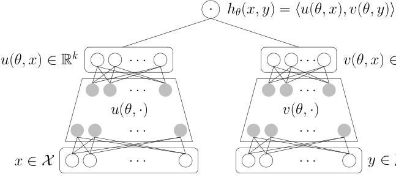
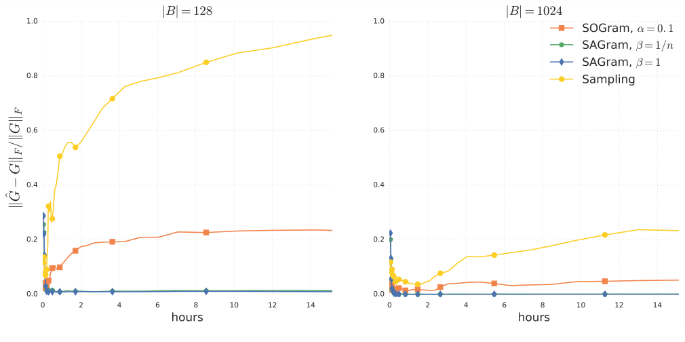
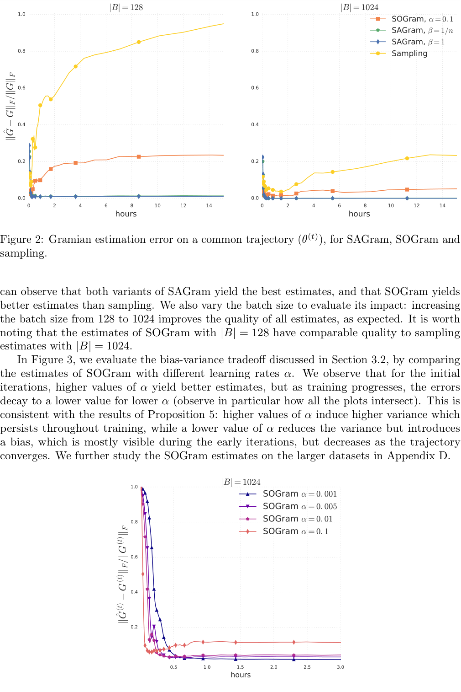
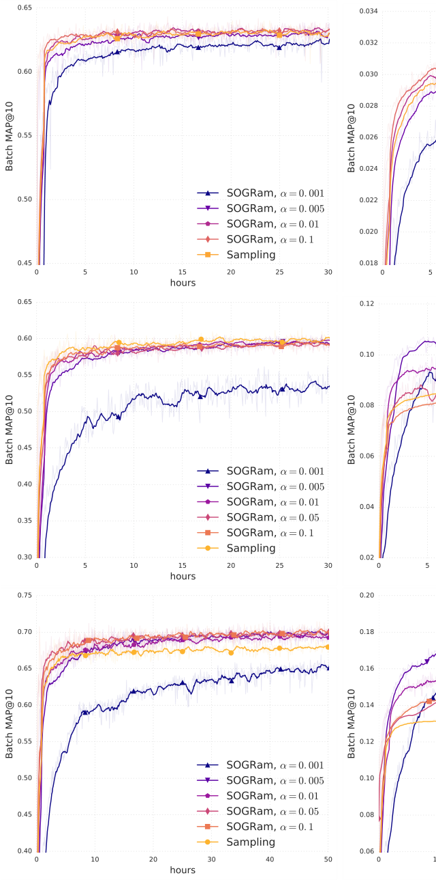
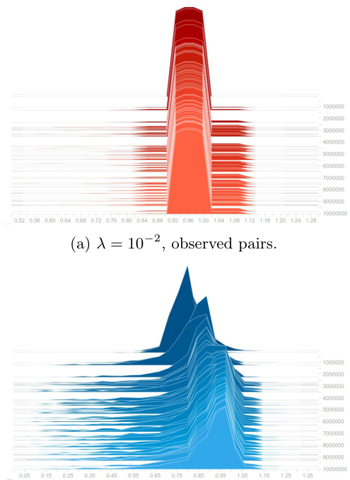
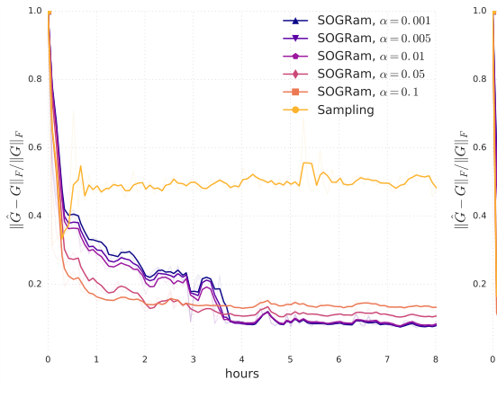
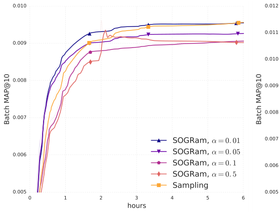

# 2018-Efficient Training on Very Large Corpora via Gramian Estimation

> Walid Krichene, Nicolas Mayoraz, **Steffen Rendle**, Li Zhang, Xinyang Yi, Lichan Hong, **Ed Chi**, John Anderson | Google Research

本文提出了一种在大规模语料库上**高效训练嵌入模型**的新方法。核心内容：

- 传统方法通过 **采样未观察到的配对** 来训练嵌入模型，**采样数量随语料库大小呈二次方增长**，难以扩展到极大规模语料库
- 本文提出将惩罚项表示为两个广义 Gram 矩阵的矩阵内积，从而避免对未观察配对的采样
- 通过维护 Gram 矩阵的估计值并使用方差缩减方案提高 梯度估计质量，训练时间显著缩短，泛化性能提升

关键发现：
- SAGram（Stochastic Average Gramian，随机平均 Gramian）通过维护嵌入缓存来估计 Gram 矩阵，具有无偏性但需要 $O(nk)$ 内存
- SOGram（Stochastic Online Gramian，随机在线 Gramian）通过指数加权平均更新估计，内存开销仅 $O(k^2)$，且估计值自然保持半正定性
- 在 Wikipedia 数据集上，SOGram 相比传统采样方法在大规模语料库（fr: 5.3M 页）上验证 MAP 提升 33.2%
- 训练速度方面，SOGram 在 2 小时内达到传统采样方法 50 小时才能达到的性能

## 关键词

Embedding, Gramian, Variance Reduction, Negative Sampling, Matrix Factorization, Large-scale Training

---

## 摘要

我们研究了使用神经网络嵌入模型在大规模语料库上学习相似度函数的问题。这些模型通常使用随机梯度下降（SGD，Stochastic Gradient Descent）训练，采样随机观察到的和未观察到的配对，样本数量随语料库大小呈二次方增长，使其难以扩展到极大规模语料库。我们提出了新的高效方法来训练这些模型，而无需采样未观察到的配对。受矩阵分解（Matrix Factorization）启发，我们的方法依赖于对所有样本对添加全局二次惩罚项，并将该项表示为两个广义 Gram 矩阵的矩阵内积。我们证明了该惩罚项的梯度可以通过维护 Gram 矩阵的估计来高效计算，并开发了方差缩减（Variance Reduction）方案来提高估计质量。大规模实验表明，与传统采样方法相比，训练时间和泛化质量均有显著提升。

## 1. 引言

我们考虑学习相似度函数 $h : \mathcal{X} \times \mathcal{Y} \rightarrow \mathbb{R}$ 的问题，该函数将由特征向量 $(x, y) \in \mathcal{X} \times \mathcal{Y}$ 表示的每个 item 对映射到表示其相似度的实数 $h(x, y)$。我们将 $x$ 和 $y$ 分别称为左特征向量和右特征向量。许多问题可以表示为这种形式：在自然语言处理中，$x$ 表示上下文（如词袋），$y$ 表示候选词，目标相似度衡量在上下文 $x$ 中观察到 $y$ 的可能性 [18, 20, 16]。在推荐系统中，$x$ 表示用户查询（用户 ID 和任何可用的上下文信息），$y$ 表示要推荐的候选 item，目标相似度是 item $y$ 与查询 $x$ 相关性的度量，例如电影评分 [1]，或观看给定电影的可能性 [15, 22]。其他应用包括图像相似度（其中 $x$ 和 $y$ 是一对图像的像素表示）[6, 7, 24]，以及网络嵌入模型 [12, 21]，其中 $x$ 和 $y$ 是网络中的节点，目标相似度是它们之间是否存在边连接。

学习相似度函数的一种流行方法是训练每个 item 的嵌入表示，使得高相似度的 item 被映射到嵌入空间中接近的向量。此类问题的一个共同属性是，只有所有可能对 $\mathcal{X} \times \mathcal{Y}$ 的极小子集出现在训练集中，且这些样本通常具有高相似度。仅在观察到的样本上训练已被证明会导致泛化性能差。直观地说，当仅在观察到的配对上训练时，模型将给定 item 的嵌入放置在相似 item 附近，但不会学习将其放置在不相似 item 远处 [25, 29]。

考虑未观察到的配对已知可以提高许多应用中的嵌入质量，包括推荐 [15, 30] 和词语类比任务 [25]。这通常通过对所有对添加低相似度先验来实现，该先验作为所有嵌入之间的排斥力。但由于它涉及语料库大小二次方数量的项，该项在计算上是不可处理的（线性情况除外），通常使用采样来优化：对于训练集中的每个观察到的配对，采样一组随机未观察到的配对来计算排斥项的估计。但随着语料库大小的增加，除非增加样本量，否则估计质量会下降，这限制了可扩展性。在本文中，我们通过开发新的方法来高效估计排斥项，而无需采样大量未观察到的配对，从而解决了这个问题。

### 相关工作

我们的方法受矩阵分解模型启发，它们对应于线性嵌入函数的特殊情况。它们通常使用交替最小二乘法（Alternating Least Squares）[15] 或坐标下降法（Coordinate Descent）[3] 训练，这些方法通过将排斥项写成两个 Gram 矩阵的矩阵内积来规避计算负担，在优化右侧嵌入之前计算左侧 Gram 矩阵，反之亦然。

遗憾的是，在非线性嵌入模型中，每次模型参数更新都会同时改变所有嵌入，使得在每次迭代时重新计算 Gram 矩阵变得不切实际。因此，Gram 矩阵公式在非线性设置中基本上被忽略了。相反，非线性嵌入模型使用带有未观察配对采样的随机梯度方法训练，参见 Chen et al. [8]。在其最简单的变体中，采样对均匀随机选取，但已经提出了更复杂的方案，如自适应采样 [5, 2] 和重要性采样 [4, 18] 来考虑 item 频率。我们还参考 Yu et al. [30] 对推荐系统中采样方法的比较研究。据我们所知，Vincent et al. [27] 是第一个尝试在非线性情况下利用 Gram 矩阵公式的。他们考虑了一种只有其中一个嵌入函数是非线性的模型，并证明在该情况下可以高效计算梯度。他们的结果非常显著，因为它允许精确的梯度计算，但遗憾的是这不能推广到两个嵌入函数都是非线性的情况。

### 我们的贡献

我们提出了在非线性情况下利用 Gram 矩阵公式的新方法，与以往方法不同，即使左右嵌入都是非线性的，这些方法也是高效的。我们的方法通过维护 Gram 矩阵的随机估计并使用不同的方差缩减方案来提高估计质量来运作。也许最重要的是，它们不需要采样大量未观察到的配对，实验表明当语料库非常大时，它们的扩展性远优于传统采样方法。

我们首先在第 2 节回顾预备知识，然后在第 3 节推导方法并进行分析。最后，我们在第 4 节进行大规模实验，在 Wikipedia 数据集上的分类任务和 MovieLens 数据集上的回归任务上进行验证。所有证明推迟到附录。

<!-- 图1：内积嵌入模型，用于在 $\mathcal{X} \times \mathcal{Y}$ 上学习相似度函数 -->

## 2. 预备知识

### 2.1 符号与问题形式化

我们考虑由两个嵌入函数 $u : \mathbb{R}^d \times \mathcal{X} \rightarrow \mathbb{R}^k$ 和 $v : \mathbb{R}^d \times \mathcal{Y} \rightarrow \mathbb{R}^k$ 组成的嵌入模型，它们将参数向量 $\theta \in \mathbb{R}^d$ 和特征向量 $x, y$ 映射到嵌入 $u(\theta, x), v(\theta, y) \in \mathbb{R}^k$。模型的输出是嵌入的内积：

$$
h_\theta(x, y) = \langle u(\theta, x), v(\theta, y) \rangle \qquad (1)
$$

其中 $\langle \cdot, \cdot \rangle$ 表示 $\mathbb{R}^k$ 上的通常内积。低秩矩阵分解（Low-rank Matrix Factorization）是 (1) 的特殊情况，其中左右嵌入函数在 $x$ 和 $y$ 中是线性的。图 1 说明了一个非线性模型，其中每个嵌入函数由一个前馈神经网络给出。我们将训练集表示为：

$$
\mathcal{T} = \{(x_i, y_i, s_i) \in \mathcal{X} \times \mathcal{Y} \times \mathbb{R}\}_{i \in \{1, \ldots, n\}}
$$

其中 $x_i, y_i$ 是特征向量，$s_i$ 是样本 $i$ 的目标相似度。为使符号更紧凑，我们使用 $u_i(\theta), v_i(\theta)$ 作为 $u(\theta, x_i), v(\theta, y_i)$ 的简写。如引言中所述，我们还假设给定所有对 $(i, j) \in \{1, \ldots, n\}^2$ 的低相似度先验 $p_{ij} \in \mathbb{R}$。给定标量损失函数 $\ell : \mathbb{R} \times \mathbb{R} \rightarrow \mathbb{R}$，目标函数为：

$$
\min_{\theta \in \mathbb{R}^d} \frac{1}{n} \sum_{i=1}^n \ell\left(\langle u_i(\theta), v_i(\theta) \rangle, s_i\right) + \frac{\lambda}{2} \sum_{i=1}^n \sum_{j=1}^n \left(\langle u_i(\theta), v_j(\theta) \rangle - p_{ij}\right)^2 \qquad (2)
$$

其中 $\lambda$ 是正超参数。为简化讨论，我们假设均匀零先验 $p_{ij} = 0$，如 [15] 中所示，但我们在附录 C 中放宽了此假设。

(2) 中的最后一项是训练集上的双重求和，可能难以高效优化。我们将其表示为：

$$
g(\theta) := \frac{1}{n^2} \sum_{i=1}^n \sum_{j=1}^n \langle u_i(\theta), v_j(\theta) \rangle^2
$$

现有方法通常依赖于采样来近似 $g(\theta)$，通常称为负采样（Negative Sampling）或候选采样（Candidate Sampling），参见 Chen et al. [8], Yu et al. [30] 的最新综述。由于双重求和，采样估计的质量随着语料库大小的增加而下降，这会显著增加训练时间。这可以通过增加样本来缓解，但无法扩展到极大规模语料库。

### 2.2 Gram 矩阵公式

优化 (2) 的另一种方法在矩阵分解中广泛流行，即将 $g(\theta)$ 重写为两个 Gram 矩阵的内积。设 $U_\theta \in \mathbb{R}^{n \times k}$ 为所有左嵌入的矩阵，其中 $u_i(\theta)$ 是 $U_\theta$ 的第 $i$ 行，类似地 $V_\theta \in \mathbb{R}^{n \times k}$ 为右嵌入矩阵。设矩阵内积为 $\langle A, B \rangle = \sum_{i,j} A_{ij} B_{ij}$，我们可以将 $g(\theta)$ 重写为：

$$
g(\theta) = \frac{1}{n^2} \sum_{i=1}^n \sum_{j=1}^n \langle u_i(\theta), v_j(\theta) \rangle^2 = \frac{1}{n^2} \sum_{i=1}^n \sum_{j=1}^n (U_\theta V_\theta^\top)_{ij}^2 = \frac{1}{n^2} \langle U_\theta V_\theta^\top, U_\theta V_\theta^\top \rangle \qquad (3)
$$

现在，利用内积的伴随性质，我们有 $\langle U_\theta V_\theta^\top, U_\theta V_\theta^\top \rangle = \langle U_\theta^\top U_\theta, V_\theta^\top V_\theta \rangle$。如果我们用 $u \otimes u$ 表示向量 $u$ 与其自身的外积，并定义 Gram 矩阵：

$$
G_u(\theta) := \frac{1}{n} U_\theta^\top U_\theta = \frac{1}{n} \sum_{i=1}^n u_i(\theta) \otimes u_i(\theta)
$$
$$
G_v(\theta) := \frac{1}{n} V_\theta^\top V_\theta = \frac{1}{n} \sum_{i=1}^n v_i(\theta) \otimes v_i(\theta) \qquad (4)
$$

我们有：

$$
g(\theta) = \langle G_u(\theta), G_v(\theta) \rangle \qquad (5)
$$

Gram 矩阵是 $k \times k$ 的半正定（PSD，Positive Semi-Definite）矩阵，其中 $k$ 是嵌入空间的维度，远小于 $n$——通常 $k$ 小于 1000，而 $n$ 可以任意大。因此，Gram 矩阵公式 (5) 比双重求和公式 (3) 具有低得多的计算复杂度，这种变换是交替最小二乘法和坐标下降法 [15, 3] 的核心，它们通过计算一侧的精确 Gram 矩阵并求解另一侧的嵌入来运作。然而，这些方法在非线性设置中不适用，因为 $\theta$ 的依赖性，模型参数的改变同时改变所有嵌入，使得在每次迭代时重新计算 Gram 矩阵不可行，因此在训练非线性模型时 Gram 矩阵公式未被使用。在下一节中，我们将展示它实际上可以在非线性情况下被利用，并在数值实验中带来显著的加速。

## 3. 使用 Gram 矩阵估计训练嵌入模型

利用 (4) 中定义的 Gram 矩阵，目标函数 (2) 可以重写为样本上的求和 $\frac{1}{n} \sum_{i=1}^n [f_i(\theta) + \lambda g_i(\theta)]$，其中：

$$
f_i(\theta) := \ell\left(\langle u_i(\theta), v_i(\theta) \rangle, s_i\right) \qquad (6)
$$
$$
g_i(\theta) := \frac{1}{2n} \sum_{j=1}^n \left[\langle u_i(\theta), v_j(\theta) \rangle^2 + \langle u_j(\theta), v_i(\theta) \rangle^2\right] = \frac{1}{2}\left[\langle u_i(\theta), G_v(\theta) u_i(\theta) \rangle + \langle v_i(\theta), G_u(\theta) v_i(\theta) \rangle\right] \qquad (7)
$$

直观地，对于每个样本 $i$，$-\nabla f_i(\theta)$ 将嵌入 $u_i$ 和 $v_i$ 拉近（假设高相似度 $s_i$），而 $-\nabla g_i(\theta)$ 在 $u_i$ 和所有嵌入 $\{v_j\}_{j \in \{1, \ldots, n\}}$ 之间，以及 $v_i$ 和所有嵌入 $\{u_j\}_{j \in \{1, \ldots, n\}}$ 之间产生排斥力。由于这种解释，我们将 $g(\theta) = \sum_{i=1}^n g_i(\theta)$ 称为引力项（Gravity Term），因为它将嵌入拉向嵌入空间的某些区域。我们在附录 B 中进一步讨论其性质和解释。

我们从以下观察开始：虽然 Gram 矩阵在每次迭代时重新计算成本很高，但我们可以维护真实 Gram 矩阵 $G_u(\theta), G_v(\theta)$ 的半正定估计 $\hat{G}_u, \hat{G}_v$。那么 $g(\theta)$ 的梯度（公式 (3)）可以用以下梯度近似（关于 $\theta$）：

$$
\hat{g}_i(\theta, \hat{G}_u, \hat{G}_v) := \langle u_i(\theta), \hat{G}_v u_i(\theta) \rangle + \langle v_i(\theta), \hat{G}_u v_i(\theta) \rangle \qquad (8)
$$

如下命题所述。

**命题 1.** 如果 $i$ 从 $\{1, \ldots, n\}$ 中均匀抽取，且 $\hat{G}_u, \hat{G}_v$ 是 $G_u(\theta), G_v(\theta)$ 的无偏估计且与 $i$ 独立，则 $\nabla_\theta \hat{g}_i(\theta, \hat{G}_u, \hat{G}_v)$ 是 $\nabla g(\theta)$ 的无偏估计。

在小批量设置中，这些估计可以在样本批量 $i \in B$ 上进一步平均（我们在实验中这样做），但为保持符号简洁，我们将省略批量。

接下来，我们提出几种维护 Gram 矩阵估计 $\hat{G}_u, \hat{G}_v$ 的方法，并讨论其权衡。

### 3.1 随机平均 Gramian（SAGram）

受蒙特卡洛积分方差缩减 [13, 11] 启发，许多方差缩减方法已被开发用于随机优化。特别是，随机平均梯度方法 [23, 10] 通过维护单个梯度的缓存并使用该缓存估计全梯度来工作。由于每个 Gram 矩阵是外积的和（见公式 (4)），我们可以应用相同的技术来估计 Gram 矩阵。对于所有 $i \in \{1, \ldots, n\}$，设 $\hat{u}_i, \hat{v}_i$ 分别是左右嵌入的缓存。我们将用上标 $(t)$ 表示变量在迭代 $t$ 的值。设 $\hat{S}_u = \frac{1}{n} \sum_{i=1}^n \hat{u}_i \otimes \hat{u}_i$，对应于基于当前缓存的 Gram 矩阵。在每次迭代 $t$，均匀随机抽取一个样本 $i$，Gram 矩阵的估计为：

$$
\hat{G}_u^{(t)} = \hat{S}_u^{(t)} + \beta \left[u_i(\theta^{(t)}) \otimes u_i(\theta^{(t)}) - \hat{u}_i \otimes \hat{u}_i\right] \qquad (9)
$$

类似地 $\hat{G}_v$。这在算法 1 中总结，其中模型参数使用 SGD 更新（第 10 行），但可以替换为任何一阶方法。注意，为了高效实现，和 $\hat{S}_u, \hat{S}_v$ 不会在每一步重新计算，它们以在线方式更新（第 11 行）。这里 $\beta$ 可以取以下值之一：
1. $\beta = \frac{1}{n}$，遵循 SAG [23]，或

2. $\beta = 1$，遵循 SAGA [10]。

$\beta$ 的选择存在权衡，我们下面简要讨论。我们将正半定 $k \times k$ 矩阵的锥体表示为 $S_+^k$。

**命题 2.** 假设 (9) 中 $\beta = \frac{1}{n}$。则对于所有 $t$，$\hat{G}_u^{(t)}, \hat{G}_v^{(t)}$ 保持在 $S_+^k$ 中。

**命题 3.** 假设 (9) 中 $\beta = 1$。则对于所有 $t$，$\hat{G}_u^{(t)}$ 是 $G_u(\theta^{(t)})$ 的无偏估计。

虽然取 $\beta = 1$ 给出无偏估计，但注意它不保证估计保持在 $S_+^k$ 中。在实践中，这可能导致数值问题，但可以通过将估计 (9) 投影到 $S_+^k$ 上来避免，使用每个估计的特征值分解。维护 Gram 矩阵估计的每次迭代计算成本为：更新缓存 $O(k)$，更新估计 $\hat{S}_u, \hat{S}_v, \hat{G}_u, \hat{G}_v$ 为 $O(k^2)$，投影到 $S_+^k$ 为 $O(k^3)$。给定 $k$ 的小尺寸，$O(k^3)$ 仍然可处理。内存成本为 $O(nk)$，因为每个嵌入都需要缓存（加上存储 Gram 矩阵估计的可忽略的 $O(k^2)$）。注意，这使得 SAGram 比应用原始 SAG(A) 方法便宜得多，后者需要维护梯度缓存，这将产生 $O(nd)$ 的内存成本，其中 $d$ 是模型参数的数量，可能比嵌入维度 $k$ 大几个数量级。然而，当 $n$ 非常大时，$O(nk)$ 仍然可能过高。在下一节中，我们提出一种不产生此额外内存成本且不需要投影的不同方法。

### 3.2 随机在线 Gramian（SOGram）

为推导第二种方法，我们将问题 (2) 重新表述为一个双人博弈。第一个玩家优化模型参数 $\theta$，第二个玩家优化 Gram 矩阵估计 $\hat{G}_u, \hat{G}_v \in S_+^k$，它们分别寻求最小化各自的损失：

$$
L_{\hat{G}_u, \hat{G}_v}^{(1)}(\theta) = \frac{1}{n} \sum_{i=1}^n \left[f_i(\theta) + \lambda \hat{g}_i(\theta, \hat{G}_u, \hat{G}_v)\right]
$$
$$
L_\theta^{(2)}(\hat{G}_u, \hat{G}_v) = \frac{1}{2} \|\hat{G}_u - G_u(\theta)\|_F^2 + \frac{1}{2} \|\hat{G}_v - G_v(\theta)\|_F^2 \qquad (10)
$$

其中 $\hat{g}_i$ 在 (8) 中定义，$\|\cdot\|_F$ 表示 Frobenius 范数（Frobenius Norm）。为简化讨论，本节假设 $f_i$ 是可微的。然后可以通过刻画其一阶驻点来证明此重新表述的合理性，如下所述。

**命题 4.** $(\theta, \hat{G}_u, \hat{G}_v) \in \mathbb{R}^d \times S_+^k \times S_+^k$ 是 (10) 的一阶驻点，当且仅当 $\theta$ 是问题 (2) 的一阶驻点且 $\hat{G}_u = G_u(\theta), \hat{G}_v = G_v(\theta)$。

几种随机一阶动力学可以应用于该问题，算法 2 给出了一个简单实例，其中每个玩家实现具有常数学习率的 SGD，玩家 1 为 $\eta$，玩家 2 为 $\alpha$。在这种情况下，Gram 矩阵估计的更新（第 7 行）具有特别简单的形式，因为 $\nabla_{\hat{G}_u} L_\theta^{(2)}(\hat{G}_u, \hat{G}_v) = \hat{G}_u - G_u(\theta)$，可以用 $\hat{G}_u - u_i(\theta) \otimes u_i(\theta)$ 估计，产生更新：

$$
\hat{G}_u^{(t)} = (1 - \alpha) \hat{G}_u^{(t-1)} + \alpha u_i(\theta^{(t)}) \otimes u_i(\theta^{(t)}) \qquad (11)
$$

类似地 $\hat{G}_v$。这种形式的一个优点是每次更新执行当前估计和秩 1 半正定矩阵之间的凸组合，从而保证估计保持在 $S_+^k$ 中，无需投影。更新估计的每次迭代成本为 $O(k^2)$，存储 Gram 矩阵的内存成本为 $O(k^2)$，两者都可忽略。

更新 (11) 也可以解释为通过具有衰减权重的秩 1 项的平均来计算 Gram 矩阵的在线估计，因此我们称该方法为随机在线 Gramian。确实，通过对 $t$ 的归纳，我们有：

$$
\hat{G}_u^{(t)} = \sum_{\tau=1}^t \alpha(1-\alpha)^{t-\tau} u_{i_\tau}(\theta^{(\tau)}) \otimes u_{i_\tau}(\theta^{(\tau)})
$$

直观地，平均减少了估计器的方差，但引入了偏差，超参数 $\alpha \in (0, 1)$ 的选择权衡了偏差和方差。类似的平滑估计器在其他上下文中已被观察到可以经验性地改善收敛，例如 [Mandt and Blei, 2014]。我们在下一个命题中在温和假设下给出此权衡的粗略估计。

**命题 5.** 设 $\bar{G}_u^{(t)} = \sum_{\tau=1}^t \alpha(1-\alpha)^{t-\tau} G_u(\theta^{(\tau)})$。假设存在 $\sigma, \delta > 0$ 使得对于所有 $t$，$\mathbb{E}_{i \sim \text{Uniform}} \|u_i(\theta^{(t)}) \otimes u_i(\theta^{(t)}) - G_u(\theta^{(t)})\|_F^2 \leq \sigma^2$ 且 $\|G_u(\theta^{(t+1)}) - G_u(\theta^{(t)})\|_F \leq \delta$。则 $\forall t$：

$$
\mathbb{E} \|\hat{G}_u^{(t)} - \bar{G}_u^{(t)}\|_F^2 \leq \sigma^2 \frac{2\alpha}{2-\alpha} \qquad (12)
$$
$$
\|\bar{G}_u^{(t)} - G_u^{(t)}\|_F \leq \delta(1/\alpha - 1) + (1-\alpha)^t \|G_u^{(t)}\|_F \qquad (13)
$$

第一个假设简单地界定了单点估计的方差，而第二个界定了两个连续 Gram 矩阵之间的距离（合理的假设，因为在实践中 Gram 矩阵的变化随着轨迹 $\theta^{(\tau)}$ 的收敛而消失）。在极限情况 $\alpha = 1$ 下，$\hat{G}_u^{(t)}$ 退化为单点估计，此时偏差 (13) 消失且方差 (12) 最大，而较小的 $\alpha$ 值减少方差并增加偏差。这在我们的实验中得到证实，如第 4 节所述。

### 3.3 与采样方法的比较

我们通过观察传统采样方法可以用 Gram 矩阵公式 (5) 重新表述来结束本节，并且在大批量情况下以这种形式实现它们可以降低其计算复杂度。确实，假设采样了一个批量 $B \subset \{1, \ldots, n\}$，引力项 $g(\theta)$ 被近似为：

$$
\tilde{g}(\theta) = \frac{1}{|B|^2} \sum_{i \in B} \sum_{j \in B} \langle u_i(\theta), v_j(\theta) \rangle^2 \qquad (14)
$$

那么应用类似于 2.2 节的变换，可以证明：

$$
\tilde{g}(\theta) = \left\langle \frac{1}{|B|} \sum_{i \in B} u_i(\theta) \otimes u_i(\theta), \frac{1}{|B|} \sum_{j \in B} v_j(\theta) \otimes v_j(\theta) \right\rangle \qquad (15)
$$

双重求和公式 (14) 涉及 $\mathbb{R}^k$ 中向量的 $|B|^2$ 个内积的和，因此计算其梯度成本为 $O(k|B|^2)$。另一方面，Gram 矩阵公式 (15) 是两个 $k \times k$ 矩阵的内积，每个涉及 $|B|$ 项的和，因此以这种形式计算梯度成本为 $O(k^2|B|)$，当 $|B|$ 大于嵌入维度 $k$ 时（这在实践中很常见），可以带来显著的计算节省。顺便说一句，给定表达式 (15)，采样方法可以解释为隐式计算 Gram 矩阵估计，使用批量上秩 1 项的和。直观地说，SOGram 和 SAGram 的一个优点是它们考虑了比普通采样可能的更多的嵌入（通过缓存或在线平均）。

## 4. 实验

在本节中，我们在 Wikipedia 数据集 [Wikimedia Foundation] 上进行大规模实验。在 MovieLens 数据集 [Harper and Konstan, 2015] 上的额外实验在附录 E 中给出。

### 4.1 实验设置

**数据集** 我们考虑学习 Wikipedia 页面之间站点内链接的问题。给定一对页面 $(x, y) \in \mathcal{X} \times \mathcal{X}$，如果存在从 $x$ 到 $y$ 的链接，则目标相似度为 1，否则为 0。这里页面由特征向量 $x = (x_{\text{id}}, x_{\text{ngrams}}, x_{\text{cats}})$ 表示，其中 $x_{\text{id}}$ 是页面 URL 的独热编码，$x_{\text{ngrams}}$ 是页面标题 n-gram 集合的词袋表示，$x_{\text{cats}}$ 是页面所属类别的词袋表示。注意，在这种情况下左右特征空间重合，但目标相似度不一定对称（链接是有向边）。我们在对应三种语言的 Wikipedia 图子集上进行实验：Simple English、French 和 English，分别用 simple、fr 和 en 表示。这些子图大小不同，表 1 显示了每个集合的一些基本统计信息。每个集合按 (90%, 10%) 分割为训练集和验证集。

| 语言 | 页数 | 链接数 | n-gram 数 | 类别数 |
|------|------|--------|-----------|--------|
| simple | 85K | 4.6M | 8.3K | 6.1K |
| fr | 1.8M | 142M | 167.4K | 125.3K |
| en | 5.3M | 490M | 501.0K | 403.4K |

表 1：每个训练集的语料库大小。

**模型** 我们训练一个由双塔神经网络组成的非线性嵌入模型，如图 1 所示，其中左右嵌入函数分别映射源页面和目标页面特征。两个网络具有相同的结构：输入特征嵌入被连接，然后通过两个具有 ReLU 激活的隐藏层映射。输入特征嵌入在两个网络之间共享，其维度分别为 simple 为 50、fr 为 100、en 为 120。隐藏层大小为 simple 的 $[256, 64]$ 和 fr 和 en 的 $[512, 128]$。

**训练** 模型使用 SAGram、SOGram 和批量负采样作为基线进行训练。我们使用学习率 $\eta = 0.01$ 和引力系数 $\lambda = 10$（交叉验证）。所有方法使用批量大小 1024。对于 SAGram 和 SOGram，一个批量 $B$ 用于 Gram 矩阵更新（算法 1 的第 8 行和算法 2 的第 7 行，我们在批量上使用秩 1 项的和），另一个批量 $B'$ 用于梯度计算。对于采样方法，引力项通过所有交叉对 $(i, j) \in B \times B'$ 近似，为高效起见，我们使用 3.3 节讨论的 Gram 矩阵公式实现它，因为我们操作的批量大小比嵌入维度 $k$ 大一个数量级（simple 为 64，fr 和 en 为 128）。

### 4.2 Gram 矩阵估计的质量

在第一组实验中，我们评估每种方法的 Gram 矩阵估计质量。为了进行有意义的比较，我们固定模型参数的轨迹 $(\theta^{(t)})_{t \in \{1, \ldots, T\}}$，并评估每种方法在该共同轨迹上跟踪真实 Gram 矩阵 $G_u(\theta^{(t)}), G_v(\theta^{(t)})$ 的程度。该实验在 simple（最小的数据集）上进行，以便我们可以定期计算完整训练集上的嵌入 $u_i(\theta^{(t)}), v_i(\theta^{(t)})$ 来获得精确的 Gram 矩阵。我们报告每种方法的估计误差，通过归一化 Frobenius 距离衡量：

$$
\frac{\|\hat{G}_u^{(t)} - G_u(\theta^{(t)})\|_F}{\|G_u(\theta^{(t)})\|_F}
$$

如图 2 所示。我们可以观察到 SAGram 的两个变体产生最好的估计，SOGram 产生比采样更好的估计。我们还改变批量大小以评估其影响：将批量大小从 128 增加到 1024 改善了所有估计的质量，正如预期的那样。值得注意的是，$|B| = 128$ 的 SOGram 估计与 $|B| = 1024$ 的采样估计质量相当。

<!-- 图2：SAGram、SOGram 和采样在共同轨迹 $(\theta^{(t)})$ 上的 Gram 矩阵估计误差 -->

在图 3 中，我们通过比较不同学习率 $\alpha$ 的 SOGram 估计来评估 3.2 节讨论的偏差-方差权衡。我们观察到，对于初始迭代，较高的 $\alpha$ 值产生更好的估计，但随着训练的进行，较低的 $\alpha$ 的误差衰减到较低的值（特别注意所有图的交叉点）。这与命题 5 的结果一致：较高的 $\alpha$ 值诱导较高的方差，这在整个训练过程中持续存在，而较低的 $\alpha$ 值减少方差但引入偏差，这在早期迭代中最为明显，但随着轨迹收敛而减小。我们在附录 D 中进一步研究了较大数据集上的 SOGram 估计。

<!-- 图3：不同 $\alpha$ 值下 SOGram 的 Gram 矩阵估计误差 -->

### 4.3 对训练速度和泛化质量的影响

为了评估 Gram 矩阵估计质量对训练速度和泛化质量的影响，我们比较了批量采样和具有不同 Gram 矩阵学习率 $\alpha$ 的 SOGram 在每个数据集上的验证性能（我们不使用 SAGram，因为对于 1M 或更多语料库大小其内存成本过高）。我们估计 MAP@10，定期（每 5 分钟）对验证集中的左 item 与 50K 随机候选进行评分——在这个规模上详尽地评分所有候选成本过高，但这给出了合理的近似。

结果报告在图 4 中。虽然 SOGram 在训练集上没有比基线采样方法提高 MAP，但它在较大集合上一致性地实现了最佳验证性能，且差距很大。训练和验证之间的这种差异可以解释为引力项 $g(\theta)$ 具有正则化效果，通过更好地估计该项，SOGram 改善了泛化。表 2 总结了最终验证 MAP 的相对改进。

| 语言 | 采样 | SOGram (0.001) | SOGram (0.005) | SOGram (0.01) | SOGram (0.1) |
|------|------|----------------|----------------|---------------|--------------|
| simple | 0.0319 | 0.0306 (-4.0%) | 0.0317 (-0.6%) | 0.0325 (+1.8%) | 0.0324 (+1.5%) |
| fr | 0.0886 | 0.1158 (+30.7%) | 0.1049 (+18.4%) | 0.0983 (+10.9%) | 0.0857 (-3.3%) |
| en | 0.1352 | 0.1801 (+33.2%) | 0.1725 (+27.6%) | 0.1593 (+17.8%) | 0.1509 (+11.6%) |

表 2：每个数据集的最终验证 MAP，以及与批量采样的相对改进。

simple 上的改进是适度的（1.8%），这可以由相对较小的语料库大小（85K 个唯一页面）来解释，在这种情况下基线采样已经产生不错的估计。在较大的语料库上，我们在 fr 上获得 30.7% 的显著改进，在 en 上获得 33.2% 的改进。en 和 fr 的图也反映了命题 5 中讨论的偏差-方差权衡：具有较低的 $\alpha$，初始进展较慢（由于 Gram 矩阵估计中引入的偏差），但最终性能更好。给定有限的训练时间预算，人们可能更喜欢较高的 $\alpha$，值得注意的是，在 en 上 $\alpha = 0.01$ 的 SOGram 在 2 小时训练内达到比批量采样 50 小时更好的性能。这种权衡也激励了使用衰减的 Gram 矩阵学习率，我们将其留待未来实验。

<!-- 图4：不同方法在 simple（上）、fr（中）和 en（下）训练集（左）和验证集（右）上的 MAP@10 -->

## 5. 结论

我们证明了低秩矩阵分解中常用的 Gram 矩阵公式可以用于训练非线性嵌入模型，通过维护 Gram 矩阵的估计并使用它们估计梯度。通过将方差缩减技术应用于 Gram 矩阵，可以改善梯度估计的质量，而无需像传统采样方法那样依赖大样本量。正如我们的实验所示，这对训练时间和泛化质量有显著影响。未来工作的一个重要方向是将此公式扩展到更大的惩罚函数族，例如 [27, 9] 中研究的球面损失族（Spherical Loss Family）。

---

## 附录

### A. 证明

**命题 1 的证明.** 从 $g(\theta) = \langle G_u(\theta), G_v(\theta) \rangle$ 的表达式 (7) 出发，应用链式法则，我们有：

$$
\nabla g(\theta) = \nabla \langle G_u(\theta), G_v(\theta) \rangle = J_u(\theta)[G_v(\theta)] + J_v(\theta)[G_u(\theta)] \qquad (16)
$$

其中 $J_u(\theta)$ 表示 $G_u(\theta)$ 的雅可比矩阵（Jacobian），这是一个三阶张量，由 $J_u(\theta)_{l,i,j} = \frac{\partial G_u(\theta)_{i,j}}{\partial \theta_l}$ 给出，$l \in \{1, \ldots, d\}$，$i, j \in \{1, \ldots, n\}$，而 $J_u(\theta)[G_v(\theta)]$ 表示向量 $[\sum_{i,j} J_u(\theta)_{l,i,j} G_v(\theta)_{i,j}]_{l \in \{1, \ldots, d\}}$。

观察到 $\hat{g}_i(\theta, \hat{G}_u, \hat{G}_v) = \langle \hat{G}_u, u_i(\theta) \otimes u_i(\theta) \rangle + \langle \hat{G}_v, v_i(\theta) \otimes v_i(\theta) \rangle$，并应用链式法则，我们有：

$$
\nabla_\theta \hat{g}_i(\theta, \hat{G}_u, \hat{G}_v) = J_{u,i}(\theta)[\hat{G}_v] + J_{v,i}(\theta)[\hat{G}_u] \qquad (17)
$$

其中 $J_{u,i}(\theta)$ 是 $u_i(\theta) \otimes u_i(\theta)$ 的雅可比矩阵，且 $\mathbb{E}_{i \sim \text{Uniform}}[J_{u,i}(\theta)] = \frac{1}{n} \sum_{i=1}^n J_{u,i}(\theta) = J_u(\theta)$，类似地 $J_{v,i}$。我们在 (17) 中取期望并使用 $\hat{G}_u, \hat{G}_v$ 与 $i$ 独立的假设来得出结论。

**命题 2 的证明.** 从 (9) 和 $\hat{S}_u$ 的定义，我们有 $\hat{G}_u^{(t)} = \frac{1}{n} \sum_{j \neq i} \hat{u}_j \otimes \hat{u}_j + \frac{1}{n} u_i(\theta^{(t)}) \otimes u_i(\theta^{(t)})$，这是 $S_+^k$ 中矩阵的和。

**命题 3 的证明.** 设 $(\mathcal{F}_t)_{t \geq 0}$ 为序列 $(\theta^{(t)})_{t \geq 0}$ 生成的滤波，在 (9) 中取条件期望，我们有 $\mathbb{E}[\hat{G}_u^{(t)} | \mathcal{F}_t] = \hat{S}_u^{(t)} + \frac{1}{n} \sum_{i=1}^n [u_i(\theta^{(t)}) \otimes u_i(\theta^{(t)}) - \hat{u}_i \otimes \hat{u}_i] = G_u(\theta^{(t)})$。

**命题 4 的证明.** $(\theta, \hat{G}_u, \hat{G}_v) \in \mathbb{R}^d \times S_+^k \times S_+^k$ 是博弈的一阶驻点，当且仅当：

$$
\nabla f(\theta) + \lambda(J_u(\theta)[\hat{G}_v] + J_v(\theta)[\hat{G}_u]) = 0 \qquad (18)
$$
$$
\langle \hat{G}_u - G_u(\theta), G' - \hat{G}_u \rangle \geq 0, \quad \forall G' \in S_+^k \qquad (19)
$$
$$
\langle \hat{G}_v - G_v(\theta), G' - \hat{G}_v \rangle \geq 0, \quad \forall G' \in S_+^k \qquad (20)
$$

第二和第三个条件简单地表明 $\nabla_{\hat{G}_u} L_\theta^{(2)}$ 和 $\nabla_{\hat{G}_v} L_\theta^{(2)}$ 分别定义了 $S_+^k$ 在 $\hat{G}_u, \hat{G}_v$ 处的支撑超平面。由于 $G_u(\theta) \in S_+^k$，条件 (19) 等价于 $\hat{G}_u = G_u(\theta)$（类似地，(20) 等价于 $\hat{G}_v = G_v(\theta)$）。使用 $\nabla g$ 的表达式 (16)，我们得到 (18-20) 等价于 $\nabla f(\theta) + \lambda \nabla g(\theta) = 0$。

**命题 5 的证明.** 通过对 $t$ 的归纳，我们有 $\hat{G}_u^{(t)} = \sum_{\tau=1}^t a_{t-\tau} u_{i_\tau}(\theta^{(\tau)}) \otimes u_{i_\tau}(\theta^{(\tau)})$，其中 $a_\tau = \alpha(1-\alpha)^\tau$。且由 $\bar{G}_u^{(t)}$ 的定义，我们有 $\bar{G}_u^{(t)} = \sum_{\tau=1}^t a_{t-\tau} G_u(\theta^{(\tau)})$。因此 $\hat{G}_u^{(t)} - \bar{G}_u^{(t)} = \sum_{\tau=1}^t a_{t-\tau} \Delta_u^{(\tau)}$，其中 $\Delta_u^{(\tau)} = u_{i_\tau}(\theta^{(\tau)}) \otimes u_{i_\tau}(\theta^{(\tau)}) - G_u(\theta^{(\tau)})$ 是零均值随机变量。因此，取二阶矩并使用第一个假设（简单地表明 $\Delta_u^{(\tau)}$ 的方差由 $\sigma^2$ 界定），我们有：

$$
\mathbb{E} \|\hat{G}_u^{(t)} - \bar{G}_u^{(t)}\|_F^2 = \sum_{\tau=1}^t a_{t-\tau}^2 \mathbb{E} \|\Delta_u^{(\tau)}\|_F^2 \leq \sigma^2 \alpha^2 \sum_{\tau=0}^{t-1} (1-\alpha)^{2\tau} = \sigma^2 \alpha^2 \frac{1-(1-\alpha)^{2t}}{1-(1-\alpha)^2} \leq \sigma^2 \frac{\alpha}{2-\alpha}
$$

这证明了第一个不等式 (21)。

为证明第二个不等式，我们从 $\bar{G}_u^{(t)}$ 的定义出发：

$$
\|\bar{G}_u^{(t)} - G_u^{(t)}\|_F = \left\|\sum_{\tau=1}^t a_{t-\tau}(G_u^{(\tau)} - G_u^{(t)}) - (1-\alpha)^t G_u^{(t)}\right\|_F \leq \sum_{\tau=1}^t a_{t-\tau} \|G_u^{(\tau)} - G_u^{(t)}\|_F + (1-\alpha)^t \|G_u^{(t)}\|_F
$$

其中第一个等式使用了 $\sum_{\tau=1}^t a_{t-\tau} = 1-(1-\alpha)^t$ 的事实。聚焦于第一项，并通过三角不等式界定 $\|G_u^{(\tau)} - G_u^{(t)}\|_F \leq (t-\tau)\delta$，我们得到：

$$
\sum_{\tau=1}^t a_{t-\tau} \|G_u^{(\tau)} - G_u^{(t)}\|_F \leq \delta \alpha(1-\alpha) \frac{d}{d\alpha} \left[\frac{1-(1-\alpha)^t}{\alpha}\right] \leq \delta \alpha(1-\alpha) \frac{1}{\alpha^2} = \delta(1/\alpha - 1)
$$

结合 (23) 和 (24)，我们得到所需的不等式 (22)。

### B. 引力项的解释

在本节中，我们简要讨论引力项的不同解释。从 $g(\theta)$ 的表达式 (5) 和 Gram 矩阵的定义 (4) 出发，我们有：

$$
g(\theta) = \langle G_u(\theta), G_v(\theta) \rangle = \left\langle \frac{1}{n} \sum_{i=1}^n u_i(\theta) \otimes u_i(\theta), G_v(\theta) \right\rangle = \frac{1}{n} \sum_{i=1}^n \langle u_i(\theta), G_v(\theta) u_i(\theta) \rangle \qquad (25)
$$

这是左嵌入 $u_i$ 上的二次型（类似地，由对称性，$v_j$ 也是如此）。特别地，引力项对嵌入 $u_i$ 的偏导数为：

$$
\frac{\partial g(\theta)}{\partial u_i} = G_v(\theta) u_i(\theta) = \frac{2}{n} \left[\frac{1}{n} \sum_{j=1}^n v_j(\theta) \otimes v_j(\theta)\right] u_i(\theta)
$$

每项 $(v_j \otimes v_j) u_i = v_j \langle v_j, u_i \rangle$ 仅仅是 $u_i$ 在 $v_j$ 上的投影（缩放 $\|v_j\|^2$）。因此 $g(\theta)$ 对 $u_i$ 的梯度是 $u_i$ 在每个右嵌入 $v_j$ 上的缩放投影的平均值，沿着负梯度方向移动简单地将 $u_i$ 移出具有高密度左嵌入的嵌入空间区域。这对应于引言中讨论的直觉：引力项 $g(\theta)$ 的目的正是将左右嵌入相互推开，以避免将不相似 item 的嵌入放置在彼此附近，这种现象称为嵌入空间的折叠（Folding）[29]。

为了说明引力项对嵌入的这种效果，我们在图 5 中可视化了内积 $\langle u_i(\theta^{(t)}), v_j(\theta^{(t)}) \rangle$ 的分布，对于随机对 $(i, j)$ 和观察到的对 $(i = j)$，以及这些分布如何随着 $t$ 的增加而变化。图是针对第 4 节中描述的 Wikipedia en 模型生成的，使用 SOGram ($\alpha = 0.01$) 训练，引力系数 $\lambda = 10^{-2}$ 和 $\lambda = 10$。在两种情况下，观察到的对的分布保持集中在接近 1 的值附近，正如预期的那样（回想一下观察到的对的目标相似度为 1，即 Wikipedia 图中连接的页面对）。然而，随机对的分布非常不同：$\lambda = 10$ 时，分布迅速集中在接近 0 的值附近，而 $\lambda = 10^{-2}$ 时，分布更平坦，很大比例的对具有高内积。这表明较低的 $\lambda$，模型更可能折叠，即将不相关 item 的嵌入放置在彼此附近。这与图 6 中报告的验证 MAP 一致。$\lambda = 10^{-2}$ 时，验证 MAP 增长非常缓慢，并且比使用 $\lambda = 10$ 训练的模型小两个数量级。该图还表明当引力系数太大时，模型过度正则化，MAP 下降。

<!-- 图5：使用不同引力系数 $\lambda$ 训练的 Wikipedia en 模型中，观察到的对（左）和随机对（右）的内积分布演变 -->

<!-- 图6：使用不同引力系数 $\lambda$ 训练的 Wikipedia en 模型的 MAP@10 -->

### C. 推广到低秩先验

到目前为止，我们假设均匀零先验以简化符号。在本节中，我们放宽此假设。假设先验由低秩矩阵 $P = QR^\top$ 给出，其中 $Q, R \in \mathbb{R}^{n \times k_P}$。换句话说，给定对 $(i, j)$ 的先验由两个向量的点积 $p_{ij} = \langle q_i, r_j \rangle$ 给出。在实践中，这种低秩先验可以通过首先训练相似度矩阵 $S$ 的简单低秩矩阵近似来获得。

给定此低秩先验，惩罚项 (3) 变为：

$$
g^P(\theta) = \frac{1}{n^2} \sum_{i=1}^n \sum_{j=1}^n [U_\theta V_\theta^\top - QR^\top]_{ij}^2 = \frac{1}{n^2} \langle U_\theta V_\theta^\top - QR^\top, U_\theta V_\theta^\top - QR^\top \rangle = \langle G_u(\theta), G_v(\theta) \rangle - 2\langle H_u(\theta), H_v(\theta) \rangle + c
$$

其中 $c = \langle Q^\top Q, R^\top R \rangle$ 是不依赖于 $\theta$ 的常数。这里，我们使用上标 $P$ 来区分零先验情况。

现在，如果我们定义加权嵌入矩阵：

$$
H_u(\theta) := \frac{1}{n} U_\theta Q = \frac{1}{n} \sum_{i=1}^n u_i(\theta) \otimes q_i
$$
$$
H_v(\theta) := \frac{1}{n} V_\theta R = \frac{1}{n} \sum_{i=1}^n v_i(\theta) \otimes r_i
$$

惩罚项变为：

$$
g^P(\theta) = \langle G_u(\theta), G_v(\theta) \rangle - 2\langle H_u(\theta), H_v(\theta) \rangle + c
$$

最后，如果我们维护 $H_u(\theta), H_v(\theta)$ 的估计 $\hat{H}_u, \hat{H}_v$（使用第 3 节中提出的方法），我们可以通过以下梯度的梯度来近似 $\nabla g^P(\theta)$：

$$
\hat{g}_i^P(\theta, \hat{G}_u, \hat{G}_v, \hat{H}_u, \hat{H}_v) := \langle u_i(\theta), \hat{G}_v u_i(\theta) \rangle + \langle v_i(\theta), \hat{G}_u v_i(\theta) \rangle - 2\langle u_i(\theta), \hat{H}_v q_i \rangle - 2\langle v_i(\theta), \hat{H}_u r_i \rangle \qquad (26)
$$

命题 1 和算法 1、2 可以通过添加 $\hat{H}_u, \hat{H}_v$ 的更新并使用 $\hat{g}_i^P$ 的表达式 (26) 来推广到低秩先验情况。

**命题 6.** 如果 $i$ 从 $\{1, \ldots, n\}$ 中均匀抽取，且 $\hat{G}_u, \hat{G}_v, \hat{H}_u, \hat{H}_v$ 分别是 $G_u(\theta), G_v(\theta), H_u(\theta), H_v(\theta)$ 的无偏估计，则 $\nabla_\theta \hat{g}_i^P(\theta, \hat{G}_u, \hat{G}_v, \hat{H}_u, \hat{H}_v)$ 是 $\nabla g^P(\theta)$ 的无偏估计。

证明类似于命题 1 的证明。

### D. Gram 矩阵估计质量的进一步实验

除了在 Wikipedia simple 上报告的实验（第 4 节），我们还在 Wikipedia en 上评估了 Gram 矩阵估计的质量。由于嵌入数量庞大，计算精确的 Gram 矩阵不再可行，因此我们使用 1M 嵌入的大样本来近似它。结果报告在图 7 中，显示了 Gram 矩阵估计 $\hat{G}_u$ 和真实 Gram 矩阵 $G_u$ 的大样本近似之间的归一化 Frobenius 距离。结果与 simple 上的实验相似：$\alpha$ 较低时，估计误差最初较高，但随着训练的进行衰减到较低的值，这可以用命题 5 中讨论的偏差-方差权衡来解释。

权衡受真实 Gram 矩阵轨迹的影响：Gram 矩阵中较小的变化（由命题 5 中的参数 $\delta$ 捕获）诱导较小的偏差。特别地，改变主算法的学习率 $\eta$ 可以通过影响真实 Gram 矩阵的变化率来影响 Gram 矩阵估计的性能。为研究此效应，我们使用两个不同的学习率运行了相同的实验，$\eta = 0.01$（如第 4 节）和较低的学习率 $\eta = 0.002$。误差在两种情况下收敛到相似的值，但误差衰减在较小的 $\eta$ 时发生得更快，这与我们的分析一致。

<!-- 图7：en 上 SOGram 的 Gram 矩阵估计误差，不同 $\alpha$ 值和不同学习率 -->

### E. MovieLens 数据实验

在本节中，我们报告 MovieLens 上的回归任务实验。

**数据集** MovieLens 数据集由一组用户给出的电影评分组成。在我们的符号中，左特征 $x$ 表示用户，右特征 $y$ 表示 item，目标相似度是用户 $x$ 对电影 $y$ 的评分。数据按 (80%-20%) 分割为训练集和验证集。表 3 给出了数据大小的基本描述。注意它与 Wikipedia 实验中的 simple 数据集相当。

| 数据集 | 用户数 | 电影数 | 评分数 |
|--------|--------|--------|--------|
| MovieLens | 72K | 10K | 10M |

表 3：MovieLens 数据集的语料库大小。

**模型** 我们训练一个双塔神经网络模型，如图 1 所述，其中每个塔由一个输入层、一个隐藏层和输出嵌入维度 $k = 35$ 组成。左塔以唯一用户 ID 的独热编码作为输入，右塔以唯一电影 ID、电影发行年份和电影类型的词袋表示的独热编码作为输入。这些输入嵌入被连接并用作右塔的输入。

**方法** 模型使用具有不同 $\alpha$ 值的 SOGram 和作为基线的采样进行训练。我们使用学习率 $\eta = 0.05$ 和引力系数 $\lambda = 1$。我们按照第 4 节中描述的相同程序测量训练集和验证集上的平均精度。结果在图 8 中给出。

<!-- 图8：不同方法在 MovieLens 数据集上训练集（左）和验证集（右）上的 MAP@10 -->

**结果** 结果与在 Wikipedia simple 数据集上报告的相似，后者在语料库大小和观察数量上与 MovieLens 相当。最佳验证平均精度由 $\alpha = 0.1$ 的 SOGram 实现（与采样基线相比改进 2.9%），尽管它在训练集上的性能较差，这表明更好地估计引力项 $g(\theta)$ 诱导了更好的正则化。对训练速度的影响在这种情况下也很显著，$\alpha = 0.1$ 的 SOGram 在不到 1 小时的训练内达到了比采样基线 6 小时更好的验证性能。

---

## 参考文献

[1] D. Agarwal and B.-C. Chen. Regression-based latent factor models. In Proceedings of the 15th ACM SIGKDD International Conference on Knowledge Discovery and Data Mining, KDD '09, pages 19–28, New York, NY, USA, 2009. ACM.

[2] Y. Bai, S. Goldman, and L. Zhang. Tapas: Two-pass approximate adaptive sampling for softmax. CoRR, abs/1707.03073, 2017.

[3] I. Bayer, X. He, B. Kanagal, and S. Rendle. A generic coordinate descent framework for learning from implicit feedback. In Proceedings of the 26th International Conference on World Wide Web, WWW '17, pages 1341–1350, 2017.

[4] Y. Bengio and J. Senecal. Quick training of probabilistic neural nets by importance sampling. In Proceedings of the Ninth International Workshop on Artificial Intelligence and Statistics, AISTATS 2003, Key West, Florida, USA, January 3-6, 2003, 2003.

[5] Y. Bengio and J. Senecal. Adaptive importance sampling to accelerate training of a neural probabilistic language model. IEEE Trans. Neural Networks, 19(4):713–722, 2008.

[6] J. Bromley, J. W. Bentz, L. Bottou, I. Guyon, Y. LeCun, C. Moore, E. Säckinger, and R. Shah. Signature verification using a "siamese" time delay neural network. International Journal of Pattern Recognition and Artificial Intelligence, 7(4):669–688, 1993.

[7] G. Chechik, V. Sharma, U. Shalit, and S. Bengio. Large scale online learning of image similarity through ranking. J. Mach. Learn. Res., 11:1109–1135, Mar. 2010.

[8] W. Chen, D. Grangier, and M. Auli. Strategies for training large vocabulary neural language models. In Proceedings of the 54th Annual Meeting of the Association for Computational Linguistics, ACL 2016, 2016.

[9] A. de Brébisson and P. Vincent. An exploration of softmax alternatives belonging to the spherical loss family. CoRR, abs/1511.05042, 2016.

[10] A. Defazio, F. Bach, and S. Lacoste-Julien. Saga: A fast incremental gradient method with support for non-strongly convex composite objectives. In Z. Ghahramani, M. Welling, C. Cortes, N. D. Lawrence, and K. Q. Weinberger, editors, Advances in Neural Information Processing Systems 27, pages 1646–1654. Curran Associates, Inc., 2014.

[11] M. Evans and T. Swartz. Approximating Integrals via Monte Carlo and Deterministic Methods. Oxford Statistical Science Series. Oxford University Press, Oxford, 2000.

[12] A. Grover and J. Leskovec. Node2vec: Scalable feature learning for networks. In Proceedings of the 22nd ACM SIGKDD International Conference on Knowledge Discovery and Data Mining, KDD '16, pages 855–864, New York, NY, USA, 2016. ACM.

[13] J. Hammersley and D. Handscomb. Monte Carlo Methods. Monographs on Applied Probability and Statistics Series. John Wiley & Sons, Incorporated, 1964.

[14] F. M. Harper and J. A. Konstan. The movielens datasets: History and context. ACM Transactions on Interactive Intelligent Systems, 2015.

[15] Y. Hu, Y. Koren, and C. Volinsky. Collaborative filtering for implicit feedback datasets. In Proceedings of the 2008 Eighth IEEE International Conference on Data Mining, ICDM '08, pages 263–272, 2008.

[16] O. Levy and Y. Goldberg. Neural word embedding as implicit matrix factorization. In Z. Ghahramani, M. Welling, C. Cortes, N. D. Lawrence, and K. Q. Weinberger, editors, Advances in Neural Information Processing Systems 27, pages 2177–2185. Curran Associates, Inc., 2014.

[17] S. Mandt and D. Blei. Smoothed gradients for stochastic variational inference. In Z. Ghahramani, M. Welling, C. Cortes, N. D. Lawrence, and K. Q. Weinberger, editors, Advances in Neural Information Processing Systems 27, pages 2438–2446. Curran Associates, Inc., 2014.

[18] T. Mikolov, K. Chen, G. Corrado, and J. Dean. Efficient estimation of word representations in vector space. CoRR, abs/1301.3781, 2013.

[19] B. Neyshabur and N. Srebro. On symmetric and asymmetric lshs for inner product search. In Proceedings of the 32nd International Conference on International Conference on Machine Learning - Volume 37, ICML'15, pages 1926–1934. JMLR.org, 2015.

[20] J. Pennington, R. Socher, and C. D. Manning. Glove: Global vectors for word representation. In Empirical Methods in Natural Language Processing (EMNLP), pages 1532–1543, 2014.

[21] J. Qiu, Y. Dong, H. Ma, J. Li, K. Wang, and J. Tang. Network embedding as matrix factorization: Unifying deepwalk, line, pte, and node2vec. In Proceedings of the Eleventh ACM International Conference on Web Search and Data Mining, WSDM '18, pages 459–467, New York, NY, USA, 2018. ACM.

[22] S. Rendle. Factorization machines. In Proceedings of the 2010 IEEE International Conference on Data Mining, ICDM '10, pages 995–1000, Washington, DC, USA, 2010. IEEE Computer Society.

[23] M. Schmidt, N. Le Roux, and F. Bach. Minimizing finite sums with the stochastic average gradient. Math. Program., 162(1-2):83–112, Mar. 2017.

[24] F. Schroff, D. Kalenichenko, and J. Philbin. Facenet: A unified embedding for face recognition and clustering. In 2015 IEEE Conference on Computer Vision and Pattern Recognition (CVPR), pages 815–823, June 2015.

[25] N. Shazeer, R. Doherty, C. Evans, and C. Waterson. Swivel: Improving embeddings by noticing what's missing. CoRR, abs/1602.02215, 2016.

[26] A. Shrivastava and P. Li. Asymmetric lsh (alsh) for sublinear time maximum inner product search (mips). In Proceedings of the 27th International Conference on Neural Information Processing Systems - Volume 2, NIPS'14, pages 2321–2329, Cambridge, MA, USA, 2014. MIT Press.

[27] P. Vincent, A. de Brébisson, and X. Bouthillier. Efficient exact gradient update for training deep networks with very large sparse targets. In C. Cortes, N. D. Lawrence, D. D. Lee, M. Sugiyama, and R. Garnett, editors, Advances in Neural Information Processing Systems 28, pages 1108–1116. Curran Associates, Inc., 2015.

[28] Wikimedia Foundation. Wikimedia downloads. https://dumps.wikimedia.org/.

[29] D. Xin, N. Mayoraz, H. Pham, K. Lakshmanan, and J. R. Anderson. Folding: Why good models sometimes make spurious recommendations. In Proceedings of the Eleventh ACM Conference on Recommender Systems, RecSys '17, pages 201–209, New York, NY, USA, 2017. ACM.

[30] H.-F. Yu, M. Bilenko, and C.-J. Lin. Selection of negative samples for one-class matrix factorization. In Proceedings of the 2017 SIAM International Conference on Data Mining, pages 363–371, 2017.
