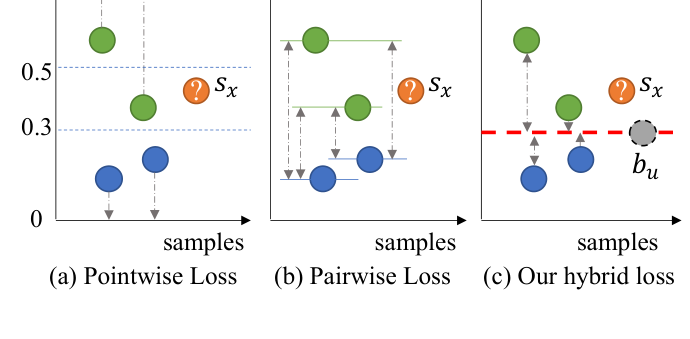
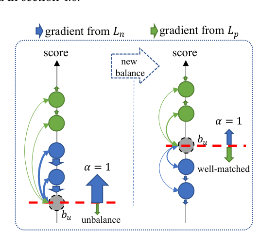
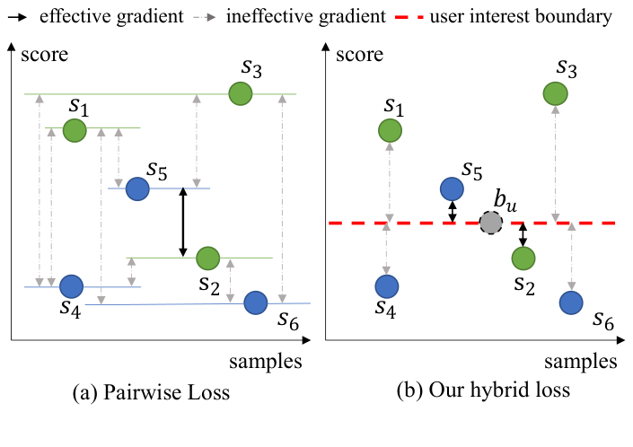
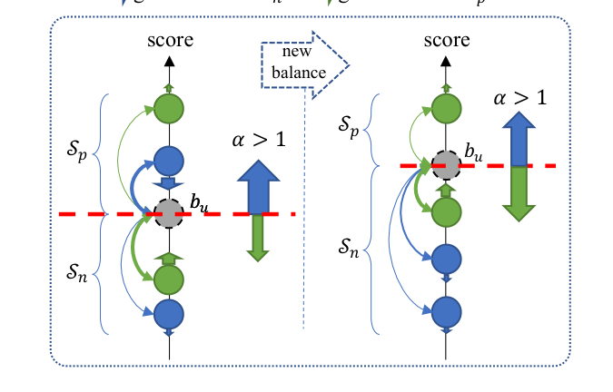
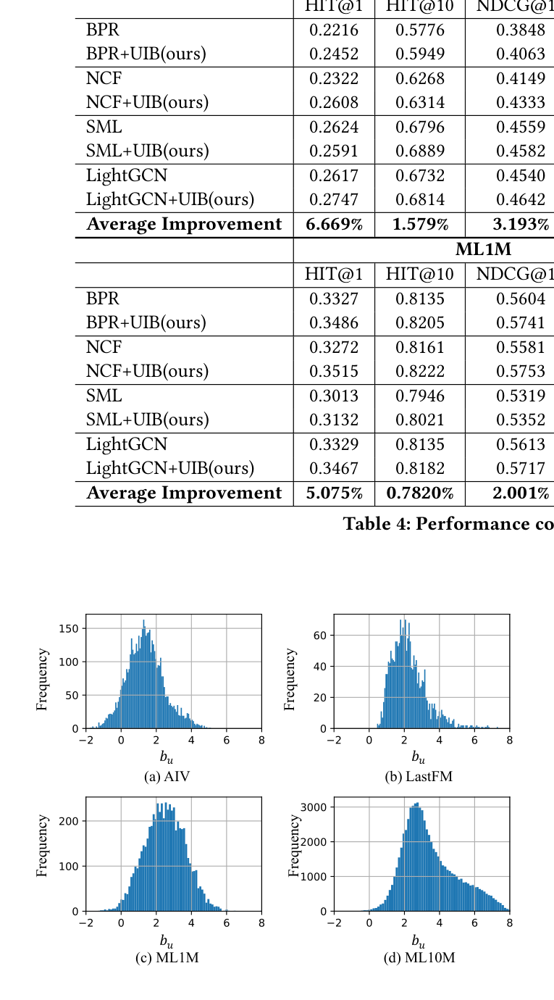
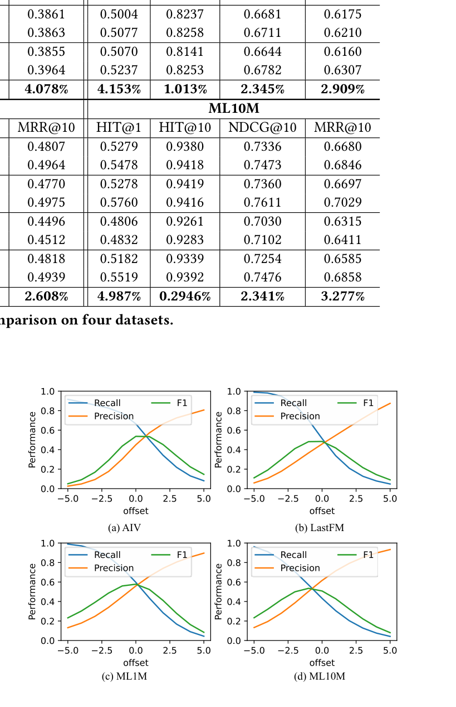
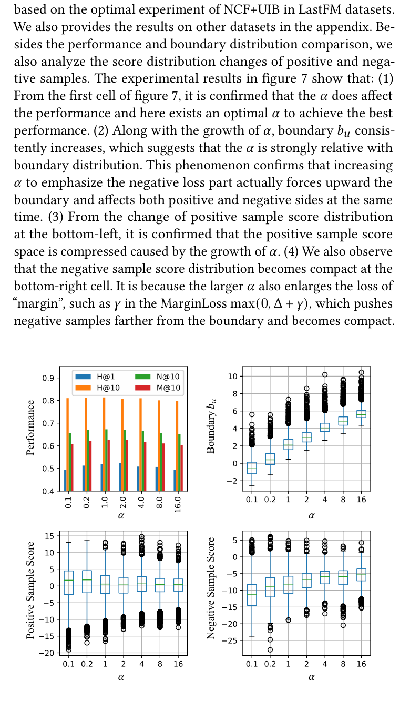
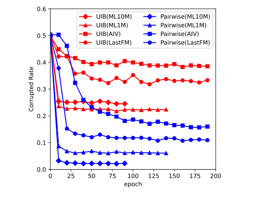
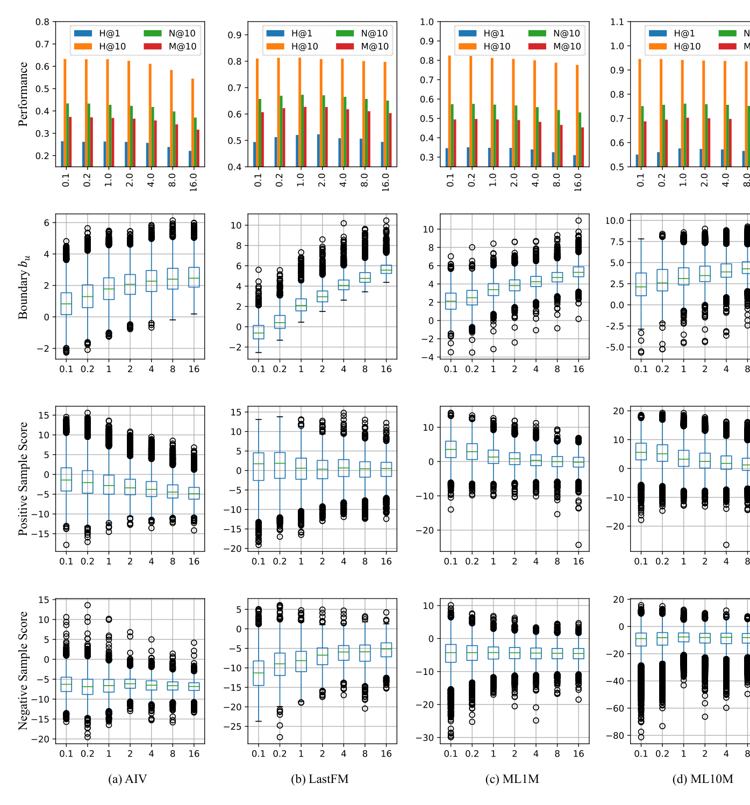

# 为推荐学习显式用户兴趣边界

> Jianhuan Zhuo（中国科学院信息工程研究所；中国科学院大学网络空间安全学院）、Qiannan Zhu（中国人民大学高瓴人工智能学院，大数据管理与分析方法北京市重点实验室）、Yinliang Yue（中国科学院信息工程研究所；中国科学院大学网络空间安全学院）、Yuhong Zhao（中国科学院信息工程研究所；中国科学院大学网络空间安全学院）

本文提出了 UIB（User Interest Boundary，用户兴趣边界）：为每个用户引入一个辅助分数 $b_u$ 作为"个性化决策边界"，用成对范式单独惩罚越界样本——正样本分数低于 $b_u$、负样本分数高于 $b_u$ 都要受罚。核心发现是——**UIB 把逐点式与成对式两种主流损失范式融合成混合损失，在四个公开数据集上对 BPR、NCF、SML、LightGCN 四类基线平均提升 HIT@1 达 5.22%（最高提升 9.18%），且无需任何特殊采样策略**。

核心内容：

- 痛点：逐点式损失灵活但忽略了排序性质、且用固定硬阈值（如 0.5）分类导致误判；成对式损失天然学习排序却饱受梯度消失（训练后期大量样本已分类正确、梯度为零）之苦，两者都无法给出显式的个性化决策边界
- 方案：为每个用户 $u$ 学习辅助分数 $b_u = W^T P_u$（UIB），正样本损失 $L_p = \phi(b_u - s(u,p))$、负样本损失 $L_n = \alpha \phi(s(u,n) - b_u)$，整体表达式"外部逐点、内部成对"，一举融合两大范式优势
- 边界机制的三大红利：$b_u$ 天然充当难样本（难负样本/难正样本）分数，成对训练有效梯度概率从 $M/N^2$ 提升到 $M/N$；边界可当硬阈值直接用于推断阶段和粗排过滤；调节 $\alpha$ 即可加减权正负样本、压缩或放大评分空间实现类别平衡
- 验证：在 AIV、LastFM、ML1M、ML10M 四个数据集上把四类基线（BPR、NCF、SML、LightGCN）改造成 UIB 增强版，统一网格搜索超参数

关键发现：

- 全数据集一致提升：AIV 平均提升 HIT@1 +6.669%、HIT@10 +1.579%、NDCG@10 +3.193%、MRR@10 +4.078%；ML1M 上 HIT@1 +5.075%；**最大的 HIT@1 平均提升达 5.22%**，逐点式模型上的 HIT@1 平均提升更达 9.18%
- 学到的边界与用户兴趣范围精确匹配：边界偏移量为 0 时 F1 最优（AIV 54%、LastFM 48%、ML1M 58%、ML10M 51%），任何方向偏移都会精度换召回
- 训练效率大幅提升：例子中成对式 9 对训练样本仅 1 对有效（1/9），UIB 用 6 对其中 2 对有效（1/3）；BPR 在 ML10M/ML1M 上 10 个 epoch 后有效梯度样本比例骤降，BPR+UIB 全训练过程保持稳定
- $\alpha$ 直接调控边界：$\alpha$ 增大把边界上推、压缩正样本评分空间并让负样本分布更紧凑，也验证了边界是正负样本博弈的均衡结果

---

## 摘要

从隐式反馈建模推荐系统的核心目标是最大化正样本分数 $s_p$ 并最小化负样本分数 $s_n$，这通常可以概括为两种范式：逐点式（pointwise）和成对式（pairwise）。逐点式方法逐样本地将每个样本与标签拟合，在实例级别的加权和采样上灵活，但忽略了内在的排序性质。成对式方法通过定性最小化相对分数 $s_n - s_p$，自然地捕捉样本的排序，但遭受训练效率低下的问题。此外，两种方法都很难显式地提供一个个性化决策边界来判断用户是否对未见过的 item 感兴趣。为了解决这些问题，我们创新性地为每个用户引入了一个辅助分数 $b_u$ 来表示用户兴趣边界（UIB，User Interest Boundary），并用成对范式单独惩罚越过边界的样本，即分数低于 $b_u$ 的正样本和分数高于 $b_u$ 的负样本。通过这种方式，我们的方法成功地实现了逐点式与成对式的混合损失，结合了两者的优势。分析上，我们证明我们的方法可以提供个性化决策边界，并且无需任何特殊的采样策略即可显著提高训练效率。大量实验结果表明，我们的方法不仅在经典的逐点式或成对式模型上取得了显著改进，而且在具有复杂损失函数和复杂特征编码的最先进模型上也取得了显著改进。

关键词：Recommender System（推荐系统），Loss Function（损失函数），User Interest Boundary（用户兴趣边界）

## 1 引言

面对信息过载的问题，推荐系统在为用户高效提供有用信息方面扮演着重要角色。作为推荐系统广泛使用的技术，基于协同过滤（CF，Collaborative Filtering）的方法通常利用用户的交互行为来建模用户的潜在偏好，并根据他们的偏好向用户推荐 item [14]。一般来说，给定用户-item 交互数据，一个典型的 CF 方法通常由两个步骤组成：(i) 定义一个评分函数来计算用户与候选 item 之间的相关性分数，(ii) 定义一个损失函数来优化所有已观测用户-item 交互的总相关性分数。从损失定义的角度看，CF 方法通常通过损失函数优化，该损失函数为已观测交互（即正样本实例）分配更高的分数 $s_p$，为未观测交互（即负样本实例）分配更低的分数 $s_n$。

在以往的工作中，为推荐系统设计了两种类型的损失函数，即逐点式和成对式。如图 1(a) 所示，基于逐点式的方法通常将排序任务表述为回归或分类任务，其中损失函数 $\psi(x, l)$ 直接将样本 $x$ 的归一化相关性分数 $s_x$ 优化到其标签 $l \in \{0, 1\}$。样本 $x = (u, i)$ 是用户 $u$ 和 item $i$ 的已观测或未观测对。通常，基于逐点式的损失函数使用像 0.5 这样的固定硬线作为指标来区分样本为正或负，即在排序阶段，对所有用户而言，分数高于 0.5 的样本被视为正样本，此时用户 $u$ 会对 item $i$ 感兴趣。相应地，图 1(b) 所示的成对式方法将正负样本对 $(x_n, x_p)$ 作为输入，并试图通过损失函数 $\phi(x_n, x_p)$ 最小化相对分数 $s_n - s_p$。成对式损失侧重于使正样本的分数 $s_p$ 大于负样本的分数 $s_n$，从而得到样本 $x = (u, i)$ 在排序阶段被使用的合理性。

图 1：损失范式比较。

近来，这两类损失函数范式被广泛应用于各种推荐方法中，并有助于取得有前景的推荐性能。然而，它们仍然有缺点。它们难以学习显式的用户个性化兴趣边界，而该边界可以直接推断用户是否喜欢给定的未见 item [5, 16]。事实上，用户有自己的兴趣边界，是从他们的交互中学习而来的，用于确定样本在排序阶段是否为正样本。如上所述，逐点式损失函数是非个性化的，并且容易将所有用户的全局兴趣边界确定为固定硬线，这可能会对真实兴趣边界低于该固定硬线的用户做出错误分类。例如，在图 1(a) 中，尽管样本 $x$ 的分数 $S_x$ 高于用户的真实兴趣边界，正样本 $x$ 仍然被归类为负组，因为其分数 $S_x$ 低于固定硬线。而成对式方法无法为未见候选样本 $x$ 提供显式的个性化边界，如图 1(b) 所示，因为它由相对分数学到的分数 $S_x$ 只能反映样本 $x$ 的合理性，不能作为样本在排序阶段是否为正样本的显式用户特定指标。

此外，我们也对另一个问题感兴趣——阻碍成对式模型获得最优性能的较低训练效率问题。对于成对式方法，随着训练后期模型的收敛，大多数负样本已被正确分类。在这种情况下，大多数随机生成的训练样本的损失为零，即这些样本"太容易"被正确分类，无法产生有效的梯度来更新模型，这也被称为梯度消失问题。为了缓解这个问题，以往的工作采用难负样本挖掘策略来提高有效样本实例的采样概率 [6, 7, 24, 32, 35]。尽管这些方法是成功的，它们忽略了导致梯度消失问题的基本机制。直观地说，难样本通常是那些靠近边界的样本，模型很难很好地区分这些样本。与其改进采样策略来挖掘难样本，为什么不直接用边界来表示难样本分数呢？

为了解决上述问题，我们创新性地为每个用户引入了一个辅助分数 $b_u$，并用成对范式单独惩罚越过边界的样本，即分数低于 $b_u$ 的正样本和分数高于 $b_u$ 的负样本。边界 $b_u$ 被有意义地用作表示用户兴趣边界（UIB），可以用来显式地确定一个未见的 item 是否值得推荐给用户。我们可以从图 1(c) 中看到，候选样本 $s_x$ 很容易被用户 $u$ 的 UIB $b_u$ 预测为正样本。通过这种方式，我们的方法成功地实现了逐点式和成对式的混合损失，结合了两者的优势。具体来说，它在整个损失表达式中遵循逐点式，而在每个样本内部遵循成对式。在理想状态下，正负样本应该被边界 $b_u$ 分开，即正样本的分数高于 $b_u$，负样本的分数低于 $b_u$，如图 1 所示。学到的边界可以为每个用户提供个性化的兴趣边界，以预测未见 item。此外，与以往试图挖掘难样本的工作不同，边界 $b_u$ 可以直接解释为难样本的分数，这显著提高了训练效率，而无需任何特殊的采样策略。大量实验结果表明，我们的方法不仅在逐点式或成对式方法的经典模型上取得了显著改进，而且在具有复杂损失函数和复杂特征编码的最先进模型上也取得了显著改进。

本文的主要贡献可以总结如下：

- 我们提出了一种新颖的混合损失，结合并互补了逐点式和成对式方法。据我们所知，这是首次尝试引入辅助分数来融合逐点式和成对式。
- 我们提供了一个高效且有效的边界来匹配用户的兴趣范围。由此，每个用户都学习到一个个性化兴趣边界，可用于粗排（pre-ranking）阶段过滤掉大量明显无价值的 item。
- 我们定性分析了成对式训练效率低下的原因，并通过引入辅助分数表示难样本，从根源上进一步缓解梯度消失问题。
- 我们在四个公开可用的数据集上进行了大量实验来证明 UIB 的有效性，其中多个基线模型在 UIB 的加持下取得了显著的性能提升。

## 2 预备知识

对于隐式 CF 方法，用户-item 交互是推动推荐系统发展的重要资源。为了方便起见，我们在本文中使用以下一致的符号：用户集合为 $U$，item 集合为 $X$。它们可能的交互集合记为 $T = U \times X$，其中已观测部分被视为用户的真实交互历史 $I \subset T$。形式上，标记函数 $l : T \rightarrow \{0, 1\}$ 用于指示一个样本是否被观测，值为 1 表示交互是正的（即 $(u, p) \in I$），值为 0 表示交互是负的（即 $(u, n) \notin I$）。

在隐式协同过滤中，模型的目标是学习一个评分函数 $s : T \rightarrow \mathbb{R}$，以反映 item 与用户之间的相关性。损失函数用于指示评分函数拟合得好坏，通常可以概括为两种范式：逐点式和成对式。

表 1：损失范式之间的特征比较。

| 特征 | 逐点式 (Pointwise) | 成对式 (Pairwise) | 我们的 (Ours) |
| --- | --- | --- | --- |
| 学习排序 (learn ranking) | × | √ | √ |
| 灵活采样 (flexible sampling) | √ | × | √ |
| 灵活加权 (flexible weighting) | √ | × | √ |
| 个性化边界 (personalized boundary) | × | × | √ |

### 2.1 逐点式损失

逐点式方法将任务表述为单个样本的分类任务，其损失函数 $\psi$ 直接将用户 $u$ 与 item $x$ 之间的归一化相关性分数 $s(u, x)$ 优化到其标签 $l(u, x)$：

$$
L = \sum_{(u,x) \in T} \psi(s(u, x), l(u, x)) \qquad (1)
$$

其中 $\psi$ 可以是交叉熵（CrossEntropy）[14] 或均方误差（Mean-Sum-Error）[4] 等。由于逐点式方法逐个优化每个样本，它在实例级别的采样和加权上是灵活的。然而，由于这些分数依赖于观测上下文，将样本拟合到固定分数难以反映内在的排序性质 [22]。

### 2.2 成对式损失

与将样本拟合到固定分数不同，成对式方法试图将正样本分配比负样本更高的分数 [2]。成对式方法的损失函数可以重写为：

$$
L = \sum_{(u,p) \in I} \sum_{(u,n) \notin I} \phi(s(u, n) - s(u, p)) \qquad (2)
$$

其中 $\phi$ 可以是边际损失（MarginLoss）[15, 18] 或 LnSigmoid [12, 14] 等。尽管成对式方法可以通过学习正负样本之间的定性分数来提高泛化性能，但它难以在推断阶段提供有效的排序信息，并且遭受梯度消失问题的困扰。

逐点式和成对式方法各有利弊，如表 1 所示。直观地说，通过充分结合两者的优势可以进一步改进推荐性能，从而获得更好的损失函数。因此，我们寻求一种混合损失来结合并互补两者。

## 3 方法

### 3.1 一种混合损失

我们提出了一种新的损失范式来结合两种主流方法的优势，并自适应地匹配用户的兴趣。我们的方法高效且有效。如公式 (4) 所示，我们创新性地为每个用户 $u$ 引入了一个辅助分数 $b_u \in \mathbb{R}^1$ 来表示用户兴趣边界（UIB）：

$$
b_u = W^\top P_u \qquad (3)
$$

其中 $P_u \in \mathbb{R}^d$ 是用户 $u$ 的嵌入向量，$W \in \mathbb{R}^d$ 是一个可学习的向量。我们的损失来自两个部分的加权和：正样本损失部分 $L_p$ 和负样本损失部分 $L_n$。在 $L_p$ 和 $L_n$ 内部，使用成对式损失来惩罚越过决策边界 $b_u$ 的样本，即 $s(u, p)$ 低于 $b_u$ 的正样本和 $s(u, n)$ 高于 $b_u$ 的负样本。形式上，我们方法的损失函数可以重写为：

$$
L = \underbrace{\sum_{(u,p) \in I} \phi(b_u - s(u, p))}_{L_p} + \alpha \underbrace{\sum_{(u,n) \notin I} \phi(s(u, n) - b_u)}_{L_n} \qquad (4)
$$

其中 $\alpha$ 是一个超参数，用于平衡正负样本的贡献权重。

我们的方法可以看作逐点式和成对式的混合损失，这与以往的工作显著不同。一方面，逐点式损失通常优化每个样本以匹配其标签，这很灵活但不适合排序相关任务。另一方面，成对式损失取一对正负样本，然后优化模型使它们的分数有序，这是巨大的成功，但遭受梯度消失问题。我们的方法通过引入辅助分数 $b_u$ 成功地结合并互补了彼此。具体来说，在整个损失表达式中，它遵循逐点式损失，因为正样本和负样本在 $L_p$ 和 $L_n$ 中分别计算。在 $L_p$ 和 $L_n$ 内部，每个样本都应用成对式损失（例如边际损失）与辅助分数 $b_u$。换句话说，成对式损失分别应用于 $(b_u - s(u, p))$ 和 $(s(u, n) - b_u)$，而不是传统的 $(s(u, n) - s(u, p))$。通过这种方式，我们的方法可以提供一种灵活高效的损失函数。

### 3.2 用户兴趣边界

学到的 $b_u$ 可以提供个性化的决策边界，以在推断阶段确定用户是否喜欢该 item。显式边界对许多应用都很有用，例如在粗排阶段过滤掉大量明显无价值的 item。

为什么它是个性化的？从梯度方向的角度看，用户 $u$ 的理想边界在正负样本之间的平衡下被自适应地匹配，这为不同用户提供了个性化的决策边界。具体来说，为了优化我们提出的损失函数公式 (4)，优化器必须同时惩罚两个部分：正样本部分 $L_p$ 和负样本部分 $L_n$。在这个过程中，$L_p$ 向上推动正样本的分数并向下推动边界 $b_u$，就像图 2 中的绿色箭头，而 $L_n$ 向上推动边界 $b_u$ 并向下推动负样本，就像蓝色箭头。如果边界偏离其合理范围，不平衡的梯度会将其推回，直到它在正负样本之间良好匹配。以图 2 中的边界 $b_u$ 为例。边界被错误地初始化为一个非常低的分数，以至于所有负样本都被错误地分类为正样本。因此，边界被向上推动，以平衡较低的 $L_p$ 和较大的 $L_n$。作为正负样本之间平衡的结果，边界可以自适应地匹配用户的兴趣范围。此外，我们还进行了实验来验证这一说法，详见 4.6 节。

图 2：边界的自适应匹配。

由于我们的方法在训练阶段显式地学习用户兴趣边界，学到的边界可以直接用于确定用户是否在推断阶段喜欢该 item。它易于使用，例如将与边界相比分数更高的候选视为正样本，否则视为负样本，如图 1(c) 所示。

### 3.3 训练效率

我们的方法可以显著提高训练效率，而无需任何特殊的采样策略。传统成对式损失函数遭受梯度消失问题的困扰，尤其是在训练的后期阶段。由于成对式损失是最小化相对分数 $\Delta = (s_n - s_p)$，用 $\Delta$ 作为解释训练效率的指标是合理的。例如，如图 3 所示，由正样本分数 $\{s_1, s_2, s_3\}$ 和负样本分数 $\{s_4, s_5, s_6\}$ 组合生成 9 对训练实例，但只有对 $(s_2, s_5)$ 能提供有效的梯度信息来更新模型，即未被正确分类或"损坏" [13]，因为 $\Delta = (s_5 - s_2)$ 大于零。这是 1/9 的概率。通过引入边界设置，我们的方法仅用简单的均匀采样策略就显著提高了训练效率。从负采样的角度看，边界 $b_u$ 可以自然地解释为正样本的难负样本和负样本的难正样本。具体来说，正样本和负样本都与边界 $b_u$ 配对，产生 6 对训练实例，其中两对是有效的，即 $(s_5 - b_u)$ 和 $(b_u - s_2)$。这是 1/3 的概率。形式上，设一个数据集包含 $N$ 个正样本、$N$ 个负样本，以及所有可能组合结果中的 $M$ 个有效对。每次通过随机采样生成训练实例 $(s_p, s_n)$，只有 $M/N^2$ 的概率成对式损失能提供有效的梯度信息。而在我们的方法中，可以实现 $M/N$ 的概率。因此，与传统的成对式损失相比，我们的方法更高效，并显著缓解了梯度消失问题。此外，我们方法的优势在 4.8 节中通过实验得到了证明。

图 3：训练效率比较。

### 3.4 类别平衡

我们的方法可以提供一种灵活的方式来平衡负样本和正样本。一般来说，正样本是从用户交互历史中收集到的已观测实例，而负样本是不在交互历史中的实例。由于获取正样本和负样本的方法不同，用相同的权重和采样策略对待两者是不合理的。由于我们的方法在整个表达式中单独优化 $L_n$ 和 $L_p$，我们可以分配一个合适的 $\alpha$，并开发不同的采样策略来平衡类别。对于采样策略，由于负样本空间远大于正样本空间，我们在每个 batch 采样中使用负样本数为正样本的 $M$ 倍来平衡类别。值得注意的是，这里我们仍然使用最简单的均匀采样策略，而不是其他高级方法 [6, 7, 24, 32, 35]。对于加权，辅助分数机制的引入使另一种方式成为可能：调整 $\alpha$ 来扩大或缩小正负样本的评分空间。这里，我们将正样本评分空间 $S_p$ 表示为边界与正样本最大分数之间的范围，而负样本评分空间 $S_n$ 表示为边界与负样本最小分数之间的范围，如图 4 所示。直观地说，评分空间对应候选样本被确定为正样本或负样本的分数范围。通过增加 $\alpha$ 放大 $L_n$，将推动边界向上并压缩正样本评分空间 $S_p$，如图 4 右侧所示。随着边界 $b_u$ 被推高，所有正样本通过更大的 $L_p$ 获得更大的向上梯度，并聚集到一个更紧凑的空间。通过这种方式，正样本和负样本的期望分数被限制在一个合适的范围内。我们的方法可以调整 $\alpha$ 来平衡负样本和正样本。相反，减少 $\alpha$ 也是如此。这种现象也在 4.7 节中不同 $\alpha$ 设置的实验中观察到。

图 4：使用更大 $\alpha$ 设置的边界重新平衡。

## 4 实验

在本节中，我们首先介绍基线（包括通过我们的方法增强的版本）、数据集、评估协议和详细的实验设置。进一步地，我们展示实验结果并对其进行分析。特别是，我们的实验主要回答以下研究问题：

- RQ1 UIB 能在多大程度上提升现有模型？
- RQ2 边界与用户兴趣范围的匹配程度如何？
- RQ3 $\alpha$ 如何影响边界的行为？
- RQ4 所提出的 UIB 如何提高训练效率？

### 4.1 基线

为了验证我们方法的通用性和有效性，我们进行了有针对性的实验。具体来说，我们复现了以下四类最先进（S.O.T.A.）模型作为基线，并用我们的 UIB 损失实现了增强版本。为了比较这些架构之间的差异，表 2 列出了基线和增强模型使用的所有评分函数和损失函数。

- 成对式模型，即 BPR [28]，它对用户和 item 的潜在特征应用内积，并使用成对式损失 LnSigmoid（也称为软合页损失）来优化模型，如下所示：

$$
L = -\sum_{(u,p) \in I} \sum_{(u,n) \notin I} \ln \sigma(s(u, p) - s(u, n)) \qquad (5)
$$

在增强版本中，损失函数被改造成 UIB 风格：

$$
L' = -\sum_{(u,p) \in I} \ln \sigma(s(u, p) - b_u) - \alpha \sum_{(u,n) \notin I} \ln \sigma(b_u - s(u, n)) \qquad (6)
$$

- 逐点式模型，即 NCF [14]，它是一个经典的神经协同过滤模型。NCF 使用交叉熵损失（逐点式方法）按公式 (7) 优化模型。这里，我们只使用 NCF 的 MLP 版本作为基线，并用 UIB 损失替换交叉熵损失来构建我们的增强模型。具体来说，我们直接用公式 (6) 的损失函数替换 NCF 增强版本中的公式 (7)：

$$
L = -\sum_{(u,x) \in T} l(u, x)\ln(s(u, p)) + (1 - l(u, x))\ln(1 - s(u, n)) \qquad (7)
$$

- 具有复杂损失函数的模型，即 SML [18]，它是一个最先进的度量学习模型。SML 的损失函数不仅确保正 item 的分数高于负 item，即 $L_A$，而且使正 item 远离负 item，即 $L_B$。此外，它用动态自适应边界扩展了传统的边际损失，以减轻偏差的影响。SML 的损失可以描述为：

$$
L_A = |s(u, n) - s(u, p) + m_u|_+ \qquad (8)
$$

$$
L_B = |s(n, p) - s(u, p) + n_u|_+ \qquad (9)
$$

$$
L = \sum_{(u,p) \in I} \sum_{(u,n) \notin I} L_A + \lambda L_B + \gamma L_{AM} \qquad (10)
$$

其中 $m_u$ 和 $n_u$ 是可学习的边界参数，$\lambda$ 和 $\gamma$ 是超参数，$L_{AM}$ 是动态边界的正则化项。

由于 SML 的损失包含多个成对式项，可以选择多种对 SML 的 UIB 适配，这也显示了我们的方法增强具有复杂损失函数的模型的灵活性。这里，我们只通过替换主要部分 $L_A$ 来增强 SML：

$$
L_A' = |s(u, n) - b_u + m_u|_+ + \alpha|b_u - s(u, p) + m_u|_+ \qquad (11)
$$

- 具有复杂特征编码的模型，即 LightGCN [12]，用于确保我们的方法能工作在先进的模型上。LightGCN [12] 是一个用于推荐任务的最先进的图卷积网络。这里，我们只关注损失部分，并使用简化的 $G(\cdot)$ 来表示图卷积网络复杂的特征编码过程。LightGCN 使用与 BPR [28] 相同的损失函数，如公式 (5)。为了增强 LightGCN，我们保留评分函数 $s(u, x) = G(u)^\top G(x)$，只把损失函数替换为公式 (6)。

表 2：基线和我们的增强模型之间的架构比较。

| 方法 | 评分函数 $s(u, x)$ | 损失函数 $L$ |
| --- | --- | --- |
| BPR [28] | $P_u^\top Q_x$ | $-\sum_{(u,p) \in I} \sum_{(u,n) \notin I} \ln \sigma(s(u, p) - s(u, n))$ |
| BPR+UIB（我们的） | $P_u^\top Q_x$ | $-\sum_{(u,p) \in I} \ln \sigma(s(u, p) - b_u) - \alpha \sum_{(u,n) \notin I} \ln \sigma(b_u - s(u, n))$ |
| NCF [14] | $f(P_u, Q_x)$ | $-\sum_{(u,x) \in T} l(u, x)\ln(s(u, p)) + (1 - l(u, x))\ln(1 - s(u, n))$ |
| NCF+UIB（我们的） | $f(P_u, Q_x)$ | $-\sum_{(u,p) \in I} \ln \sigma(s(u, p) - b_u) - \alpha \sum_{(u,n) \notin I} \ln \sigma(b_u - s(u, n))$ |
| SML [18] | $\|P_u - Q_x\|_2^2$ | $\sum_{(u,p) \in I} \sum_{(u,n) \notin I} |s(u, n) - s(u, p) + m_u|_+ + \lambda|s(n, p) - s(u, p) + n_u|_+ + \gamma L_{AM}$ |
| SML+UIB（我们的） | $\|P_u - Q_x\|_2^2$ | $\sum_{(u,p) \in I} \sum_{(u,n) \notin I} |s(u, n) - b_u + m_u|_+ + \alpha|b_u - s(u, p) + m_u|_+ + \lambda|s(n, p) - s(u, p) + n_u|_+ + \gamma L_{AM}$ |
| LightGCN [12] | $G(u)^\top G(x)$ | $-\sum_{(u,p) \in I} \sum_{(u,n) \notin I} \ln \sigma(s(u, p) - s(u, n))$ |
| LightGCN+UIB（我们的） | $G(u)^\top G(x)$ | $-\sum_{(u,p) \in I} \ln \sigma(s(u, p) - b_u) - \alpha \sum_{(u,n) \notin I} \ln \sigma(b_u - s(u, n))$ |

### 4.2 数据集

为了全面评估每个模型的性能，我们选择了四个公开可用的数据集，包含不同的类型和大小。数据集的详细统计信息如表 3 所示。

- Amazon Instant Video（AIV）是 Amazon 数据集基准的一个视频子集，包含来自 Amazon 的产品评论和元数据 [11]。我们遵循 5-core，它保证每个用户和 item 至少有 5 条评论。
- LastFM 数据集 [3] 包含来自 Last.fm 在线音乐系统的音乐艺人收听信息。
- Movielens-1M（ML1M）数据集 [10] 包含 100 万条匿名电影评分，用来描述用户对电影的偏好。
- Movielens-10M（ML10M）数据集是 ML1M 的大版本，包含 72,000 名用户对 10,677 部电影的 1000 万条评分。我们用这个数据集来检查我们的方法是否在大数据集上也能良好工作。

表 3：数据集统计信息。

| 数据集 | AIV | LastFM | ML1M | ML10M |
| --- | --- | --- | --- | --- |
| #用户 (#User) | 5,130 | 1,877 | 6,028 | 69,878 |
| #item (#Item) | 1,685 | 17,617 | 3,706 | 10,677 |
| #训练 (#Train) | 26,866 | 89,047 | 988,129 | 9,860,298 |
| #验证 (#Valid) | 5,130 | 1,877 | 6,028 | 69,878 |
| #测试 (#Test) | 5,130 | 1,877 | 6,028 | 69,878 |

数据集链接：
1. https://jmcauley.ucsd.edu/data/amazon/
2. https://grouplens.org/datasets/hetrec-2011/
3. https://grouplens.org/datasets/movielens/

### 4.3 评估协议

我们使用命中率（Hit Ratio，Hit@K）、归一化折损累积增益（NDCG@K）和平均倒数排名（MRR@K）来评估模型，其中 K 从经典设置 {1, 10} 中选择。所有指标的值越高表示性能越好。由于 Hit@1、NDCG@1 和 MRR@1 在数学上是等价的，我们只报告 Hit@1、Hit@10、NDCG@10 和 MRR@10。

所有数据集都按照流行的 Leave-One-Out（留一法）策略划分 [14, 28]，如表 3 所示。在测试阶段，学到的模型被要求为每个用户对给定的 item 列表进行排序。由于真实世界中负采样的空间极其巨大或未知，对于测试集中的每个正样本，我们将其相关负 item 的数量固定为 100 个负样本 [18]。每个实验在相同的候选项上独立重复 5 次，并报告平均性能。

### 4.4 设置

我们使用 PyTorch [25] 实现所有模型，并使用 Adagrad [8] 优化器学习所有模型。为了公平比较，所有实验的维度 $d$ 和 batch 大小分别设置为 32 和 1024。对于所有增强版本，$M = 32$ 用于按 3.4 节讨论的平衡类别。采用验证数据集上 NDCG@10 的网格搜索与早停策略来确定最佳超参数配置。除 ML10M 由于其规模大被限制为 100 个 epoch 外，每个实验在所有数据集上运行 500 个 epoch。详细的超参数配置表在附录中报告。

### 4.5 性能提升（RQ1）

从表 4 所示的结果中，我们有三点观察：(1) 比较所有数据集上我们的增强版本与基线，我们的方法在所有数据集上都能很好地提升模型，即使在大型 ML10M 数据集上也是如此。这证实了我们的模型成功地使用 UIB 提高了推荐任务上的预测性能。具体来说，与基线相比，我们的模型在 AIV 数据集上平均提升 HIT@1 6.669%、HIT@10 1.579%、NDCG@10 3.193%、MRR@10 4.078%，在 LastFM 数据集上为 4.153%、1.013%、2.345%、2.909%，在 ML1M 数据集上为 5.075%、0.782%、2.001%、2.608%，在 ML10M 数据集上为 4.987%、0.2946%、2.341%、3.277%。其中，HIT@1 上的提升最为亮眼，在所有数据集上平均达到 5.22%。(2) 比较逐点式和成对式模型，我们的方法取得了更高的性能，具体来说，逐点式方法平均提升 9.18%、0.68%、3.83%、5.34%，成对式方法平均提升 5.81%、1.36%、3.10%、3.94%。这证实了 UIB 损失可用于提升推荐系统中占主导地位的逐点式或成对式模型。这是因为我们的方法可以帮助学习内在的排序性质从而提升逐点式，并通过提高训练效率来提升成对式。(3) 与具有复杂特征编码的最先进模型 LightGCN [12] 相比，我们的增强模型 LightGCN+UIB 在 HIT@1 上平均增益 4.73%、HIT@10 0.93%、NDCG@10 2.30%、MRR@10 2.97%，这表明我们的方法也适用于深度学习模型。

表 4：四个数据集上的性能比较。

| AIV | HIT@1 | HIT@10 | NDCG@10 | MRR@10 | LastFM | HIT@1 | HIT@10 | NDCG@10 | MRR@10 |
| --- | --- | --- | --- | --- | --- | --- | --- | --- | --- |
| BPR | 0.2216 | 0.5776 | 0.3848 | 0.3250 | BPR | 0.4717 | 0.7903 | 0.6336 | 0.5830 |
| BPR+UIB（我们的） | 0.2452 | 0.5949 | 0.4063 | 0.3477 | BPR+UIB（我们的） | 0.4907 | 0.7995 | 0.6493 | 0.6006 |
| NCF | 0.2322 | 0.6268 | 0.4149 | 0.3489 | NCF | 0.4827 | 0.8034 | 0.6445 | 0.5934 |
| NCF+UIB（我们的） | 0.2608 | 0.6314 | 0.4333 | 0.3714 | NCF+UIB（我们的） | 0.5205 | 0.8135 | 0.6727 | 0.6270 |
| SML | 0.2624 | 0.6796 | 0.4559 | 0.3861 | SML | 0.5004 | 0.8237 | 0.6681 | 0.6175 |
| SML+UIB（我们的） | 0.2591 | 0.6889 | 0.4582 | 0.3863 | SML+UIB（我们的） | 0.5077 | 0.8258 | 0.6711 | 0.6210 |
| LightGCN | 0.2617 | 0.6732 | 0.4540 | 0.3855 | LightGCN | 0.5070 | 0.8141 | 0.6644 | 0.6160 |
| LightGCN+UIB（我们的） | 0.2747 | 0.6814 | 0.4642 | 0.3964 | LightGCN+UIB（我们的） | 0.5237 | 0.8253 | 0.6782 | 0.6307 |
| 平均提升 | 6.669% | 1.579% | 3.193% | 4.078% | 平均提升 | 4.153% | 1.013% | 2.345% | 2.909% |

| ML1M | HIT@1 | HIT@10 | NDCG@10 | MRR@10 | ML10M | HIT@1 | HIT@10 | NDCG@10 | MRR@10 |
| --- | --- | --- | --- | --- | --- | --- | --- | --- | --- |
| BPR | 0.3327 | 0.8135 | 0.5604 | 0.4807 | BPR | 0.5279 | 0.9380 | 0.7336 | 0.6680 |
| BPR+UIB（我们的） | 0.3486 | 0.8205 | 0.5741 | 0.4964 | BPR+UIB（我们的） | 0.5478 | 0.9418 | 0.7473 | 0.6846 |
| NCF | 0.3272 | 0.8161 | 0.5581 | 0.4770 | NCF | 0.5278 | 0.9419 | 0.7360 | 0.6697 |
| NCF+UIB（我们的） | 0.3515 | 0.8222 | 0.5753 | 0.4975 | NCF+UIB（我们的） | 0.5760 | 0.9416 | 0.7611 | 0.7029 |
| SML | 0.3013 | 0.7946 | 0.5319 | 0.4496 | SML | 0.4806 | 0.9261 | 0.7030 | 0.6315 |
| SML+UIB（我们的） | 0.3132 | 0.8021 | 0.5352 | 0.4512 | SML+UIB（我们的） | 0.4832 | 0.9283 | 0.7102 | 0.6411 |
| LightGCN | 0.3329 | 0.8135 | 0.5613 | 0.4818 | LightGCN | 0.5182 | 0.9339 | 0.7254 | 0.6585 |
| LightGCN+UIB（我们的） | 0.3467 | 0.8182 | 0.5717 | 0.4939 | LightGCN+UIB（我们的） | 0.5519 | 0.9392 | 0.7476 | 0.6858 |
| 平均提升 | 5.075% | 0.7820% | 2.001% | 2.608% | 平均提升 | 4.987% | 0.2946% | 2.341% | 3.277% |

### 4.6 用户兴趣边界（RQ2）

为了确定边界与用户兴趣范围的匹配程度，我们本质上需要回答两个子问题：(1) 模型是否为不同用户匹配不同的边界？(2) 匹配的边界是否是最佳值？为了回答第一个问题，四个数据集上 NCF+UIB 学到的边界分布被可视化在图 5 中。它证实了我们的模型以不同的正态分布形式为不同用户匹配不同的边界。为了回答第二个问题，我们在 $b_u$ 上添加额外的偏移量 {-5, -4 … 4, 5}，并对用户的所有 item 进行预测。然后报告精度（precision）、召回率（recall）和 F1 指标，以判断学到的边界是否最佳。如图 6 所示的结果，(1) 学到的边界取得了具有竞争力的性能。具体来说，AIV 中 F1 指标为 54%、LastFM 为 48%、ML1M 为 58%、ML10M 为 51%，这表明边界足以匹配用户的兴趣范围。(2) 从所有数据集来看，减小偏移量会不断提高召回率并降低精度，反之亦然。当偏移量为零时，同时考虑精度和召回率的 F1 表现最好，这表明我们的方法可以学习到匹配用户兴趣范围的最佳边界。如 3.2 节所讨论的，边界是正负样本之间博弈的最佳结果，可以通过过滤掉大量明显无价值的 item 来节省计算，比如 AIV 的 1685 个 item 中有 1674 个（99.37%）、LastFM 的 17617 个中有 17562 个（99.69%）、ML1M 的 3706 个中有 3529 个（95.24%）、ML10M 的 10677 个中有 10576 个（99.06%）可以在粗排阶段被过滤掉。

图 5：不同数据集上的边界分布。

图 6：边界上不同偏移量的指标。

### 4.7 超参数研究（RQ3）

在我们的方法中，只引入了一个超参数 $\alpha$ 来平衡正样本和负样本的贡献。为了研究 $\alpha$ 如何影响我们方法的行为，我们在 LastFM 数据集上基于 NCF+UIB 的最优实验进行了各种 $\alpha \in \{0.1, 0.2, 1, 2, 4, 8, 16\}$ 设置的实验。我们也在附录中提供了其他数据集上的结果。除了性能和边界分布的比较，我们还分析了正负样本分数分布的变化。图 7 中的实验结果表明：(1) 从图 7 的第一个格子可以确认，$\alpha$ 确实影响性能，并且存在一个最优的 $\alpha$ 来实现最佳性能。(2) 随着 $\alpha$ 的增长，边界 $b_u$ 持续增加，这表明 $\alpha$ 与边界分布有很强的相关性。这一现象证实了增加 $\alpha$ 来强调负样本损失部分实际上会向上推动边界，并同时影响正负两侧。(3) 从左下方的正样本分数分布变化可以确认，正样本分数空间因 $\alpha$ 的增长而被压缩。(4) 我们还观察到右下角格子中负样本分数分布变得更加紧凑。这是因为更大的 $\alpha$ 也放大了"边界"的损失，例如 MarginLoss 中的 $\max(0, \Delta + \gamma)$ 中的 $\gamma$，这推动负样本远离边界并变得紧凑。

图 7：不同 $\alpha$ 设置下的模型比较。

### 4.8 训练效率（RQ4）

为了展示我们的方法提高训练效率和缓解困扰传统成对式方法的梯度消失问题的能力，我们进行了 BPR（成对式方法）和 BPR+UIB（我们的）的实验，比较训练各 epoch 的"损坏"样本率，即模型错误分类的训练样本比例。通常，高损坏率意味着更高比例的训练样本可以为优化模型提供梯度信息。

如图 8 所示，x 轴是训练经过的 epoch，y 轴是损坏率。红色由我们的方法计算，蓝色由传统的成对式方法计算。从图 8 我们可以观察到，我们模型中的损坏率在所有数据集上都高于 BPR 损失中的损坏率。与以往文献一致，传统成对式模型的训练效率随收敛明显下降，即梯度消失。这导致训练效率低下。特别是在 ML10M 和 ML1M 数据集上，10 个 epoch 后能提供有效梯度的训练样本比例很低。而我们的方法在所有数据集上都保持了一定的有效梯度，尤其是在 AIV 数据集上。如 3.3 节所讨论的，这是因为边界本身就是一个很好的难样本，可以指导训练。

图 8：随 epoch 的训练效率。

## 5 相关工作

本文试图结合并互补推荐任务中两种主流的损失范式。由于逐点式和成对式方法各有其优势和局限 [22]，已有若干方法被提出用于改进损失函数 [9, 33]。Bellogin 等人 [1] 基于用户邻域的形成改进了推荐。Liu 等人 [19] 提出了 Wasserstein 自动编码框架来改善数据稀疏性并优化不确定性。成对式方法擅长建模内在的排序性质，但遭受不灵活的优化 [31]。Lo 和 Ishigaki [20] 为 BPR 损失函数提出了一个个性化的成对加权框架，使模型克服 BPR 在 item 冷启动上的局限性。Sidana 等人 [29] 提出了一个模型，可以在嵌入空间中联合学习用户和 item 的新表示，以及用户对 item 对的偏好。Mao 等人 [21] 认为损失函数和负采样率是等价的，并提出了一个统一的 CF 模型来同时纳入两者。Zhou 等人 [36] 引入了一个限制，以确保正确实例的评分必须足够低才能完成平移。受度量学习 [31] 的启发，一些研究者试图采用度量学习来优化推荐模型 [15, 17, 18, 23, 30]。此外，成对方法训练效率低下的问题也引起了广泛关注。均匀采样方法因其简单性和可扩展性而被广泛用于协同过滤训练 [14]。高级方法试图挖掘难负样本来提高训练效率，包括基于属性的 [26, 27]、基于 GAN 的 [6, 24, 32]、基于缓存的 [7, 35] 和基于随机游走的方法 [34]。Chen 等人 [4] 通过直接使用负样本空间中的所有样本提供了另一种方式。

## 6 结论

在这项工作中，我们创新性地为每个用户引入了一个辅助分数 $b_u$ 来表示用户兴趣边界（UIB），并用成对范式单独惩罚越过边界的样本。通过这种方式，我们的方法成功地实现了逐点式和成对式的混合损失，结合了两者的优势。具体来说，它在整个损失表达式中遵循逐点式，而在每个样本内部遵循成对式。分析上，我们证明我们的方法可以提供个性化决策边界，并且无需任何特殊的采样策略即可显著提高训练效率。大量实验结果表明，我们的方法不仅在逐点式或成对式方法的经典模型上取得了显著改进，而且在具有复杂损失函数和复杂特征编码的最先进模型上也取得了显著改进。

## 参考文献

[1] Alejandro Bellogin, Javier Parapar, and Pablo Castells. 2013. Probabilistic collaborative filtering with negative cross entropy. In Proceedings of the 7th ACM conference on Recommender systems (RecSys '13). Association for Computing Machinery, 387–390. https://doi.org/10.1145/2507157.2507191

[2] Chris J.C. Burges, Tal Shaked, Erin Renshaw, Ari Lazier, Matt Deeds, Nicole Hamilton, and Greg Hullender. 2005. Learning to Rank using Gradient Descent. Technical Report MSR-TR-2005-06. https://www.microsoft.com/en-us/research/publication/learning-to-rank-using-gradient-descent/

[3] Iván Cantador, Peter Brusilovsky, and Tsvi Kuflik. 2011. 2nd Workshop on Information Heterogeneity and Fusion in Recommender Systems (HetRec 2011). In Proceedings of the 5th ACM conference on Recommender systems (RecSys 2011). ACM, New York, NY, USA.

[4] Chong Chen, Min Zhang, Yongfeng Zhang, Yiqun Liu, and Shaoping Ma. 2020. Efficient Neural Matrix Factorization without Sampling for Recommendation. ACM Trans. Inf. Syst. 38, 2, Article Article 14 (Jan. 2020), 28 pages. https://doi.org/10.1145/3373807

[5] Paul Covington, Jay Adams, and Emre Sargin. 2016. Deep Neural Networks for YouTube Recommendations. In Proceedings of the 10th ACM Conference on Recommender Systems (RecSys '16). Association for Computing Machinery, 191–198. https://doi.org/10.1145/2959100.2959190

[6] Jingtao Ding, Yuhan Quan, Xiangnan He, Yong Li, and Depeng Jin. 2019. Reinforced Negative Sampling for Recommendation with Exposure Data. (2019), 2230–2236.

[7] Jingtao Ding, Yuhan Quan, Quanming Yao, Yong Li, and Depeng Jin. 2020. Simplify and Robustify Negative Sampling for Implicit Collaborative Filtering. In NeurIPS. https://proceedings.neurips.cc/paper/2020/hash/0c7119e3a6a2209da6a5b90e5b5b75bd-Abstract.html

[8] John Duchi, Elad Hazan, and Yoram Singer. 2011. Adaptive Subgradient Methods for Online Learning and Stochastic Optimization. Journal of Machine Learning Research 12, 61 (2011), 2121–2159.

[9] Huifeng Guo, Ruiming Tang, Yunming Ye, Zhenguo Li, Xiuqiang He, and Zhenhua Dong. 2018. DeepFM: An End-to-End Wide & Deep Learning Framework for CTR Prediction. CoRR abs/1804.04950 (2018). arXiv:1804.04950 http://arxiv.org/abs/1804.04950

[10] F Maxwell Harper and Joseph A Konstan. 2015. The movielens datasets: History and context. Acm transactions on interactive intelligent systems (tiis) 5, 4 (2015), 1–19.

[11] Ruining He and Julian McAuley. 2016. Ups and Downs: Modeling the Visual Evolution of Fashion Trends with One-Class Collaborative Filtering. In Proceedings of the 25th International Conference on World Wide Web (WWW '16). International World Wide Web Conferences Steering Committee, 507–517. https://doi.org/10.1145/2872427.2883037

[12] Xiangnan He, Kuan Deng, Xiang Wang, Yan Li, YongDong Zhang, and Meng Wang. 2020. LightGCN: Simplifying and Powering Graph Convolution Network for Recommendation. In Proceedings of the 43rd International ACM SIGIR Conference on Research and Development in Information Retrieval (SIGIR '20). Association for Computing Machinery, 639–648. https://doi.org/10.1145/3397271.3401063

[13] Xiangnan He, Zhankui He, Xiaoyu Du, and Tat-Seng Chua. 2018. Adversarial Personalized Ranking for Recommendation. In The 41st International ACM SIGIR Conference on Research & Development in Information Retrieval (SIGIR '18). Association for Computing Machinery, 355–364. https://doi.org/10.1145/3209978.3209981

[14] Xiangnan He, Lizi Liao, Hanwang Zhang, Liqiang Nie, Xia Hu, and Tat-Seng Chua. 2017. Neural Collaborative Filtering. In Proceedings of the 26th International Conference on World Wide Web (WWW '17). International World Wide Web Conferences Steering Committee, 173–182. https://doi.org/10.1145/3038912.3052569

[15] Cheng-Kang Hsieh, Longqi Yang, Yin Cui, Tsung-Yi Lin, Serge Belongie, and Deborah Estrin. 2017. Collaborative Metric Learning. In Proceedings of the 26th International Conference on World Wide Web. International World Wide Web Conferences Steering Committee, 193–201. https://doi.org/10.1145/3038912.3052639

[16] Jae Kyeong Kim, Moon Kyoung Jang, Hyea Kyeong Kim, and Yoon Ho Cho. 2009. A hybrid recommendation procedure for new items using preference boundary. In Proceedings of the 11th International Conference on Electronic Commerce (ICEC '09). Association for Computing Machinery, 289–295. https://doi.org/10.1145/1593254.1593298

[17] Brian Kulis et al. 2013. Metric learning: A survey. Foundations and Trends® in Machine Learning 5, 4 (2013), 287–364.

[18] Mingming Li, Shuai Zhang, Fuqing Zhu, Wanhui Qian, Liangjun Zang, Jizhong Han, and Songlin Hu. 2020. Symmetric Metric Learning with Adaptive Margin for Recommendation. Proceedings of the AAAI Conference on Artificial Intelligence 34, 0404 (Apr 2020), 4634–4641. https://doi.org/10.1609/aaai.v34i04.5894

[19] Huafeng Liu, Jingxuan Wen, Liping Jing, and Jian Yu. 2019. Deep generative ranking for personalized recommendation. In Proceedings of the 13th ACM Conference on Recommender Systems (RecSys '19). Association for Computing Machinery, 34–42. https://doi.org/10.1145/3298689.3347012

[20] Kachun Lo and Tsukasa Ishigaki. 2021. PPNW: personalized pairwise novelty loss weighting for novel recommendation. Knowledge and Information Systems 63, 5 (May 2021), 1117–1148. https://doi.org/10.1007/s10115-021-01546-8

[21] Kelong Mao, Jieming Zhu, Jinpeng Wang, Quanyu Dai, Zhenhua Dong, Xi Xiao, and Xiuqiang He. 2021. SimpleX: A Simple and Strong Baseline for Collaborative Filtering. arXiv:2109.12613 [cs] (Sep 2021). http://arxiv.org/abs/2109.12613 arXiv:2109.12613.

[22] Vitalik Melnikov, Eyke Hüllermeier, Daniel Kaimann, Bernd Frick, and Pritha Gupta. 2017. Pairwise versus Pointwise Ranking: A Case Study. Schedae Informaticae 1/2016 (2017). https://doi.org/10.4467/20838476SI.16.006.6187

[23] Chanyoung Park, Donghyun Kim, Xing Xie, and Hwanjo Yu. 2018. Collaborative Translational Metric Learning. In 2018 IEEE International Conference on Data Mining (ICDM). 367–376. https://doi.org/10.1109/ICDM.2018.00052

[24] Dae Hoon Park and Yi Chang. 2019. Adversarial Sampling and Training for Semi-Supervised Information Retrieval. In The World Wide Web Conference (WWW '19). Association for Computing Machinery, 1443–1453. https://doi.org/10.1145/3308558.3313416

[25] Adam Paszke, Sam Gross, Francisco Massa, Adam Lerer, James Bradbury, Gregory Chanan, Trevor Killeen, Zeming Lin, Natalia Gimelshein, Luca Antiga, and et al. 2019. PyTorch: An Imperative Style, High-Performance Deep Learning Library. In Advances in Neural Information Processing Systems, Vol. 32. Curran Associates, Inc. https://proceedings.neurips.cc/paper/2019/hash/bdbca288fee7f92f2bfa9f7012727740-Abstract.html

[26] Steffen Rendle and Christoph Freudenthaler. 2014. Improving pairwise learning for item recommendation from implicit feedback. In Proceedings of the 7th ACM international conference on Web search and data mining (WSDM '14). Association for Computing Machinery, 273–282. https://doi.org/10.1145/2556195.2556248

[27] Steffen Rendle and Christoph Freudenthaler. 2014. Improving pairwise learning for item recommendation from implicit feedback. In Proceedings of the 7th ACM international conference on Web search and data mining (WSDM '14). Association for Computing Machinery, 273–282. https://doi.org/10.1145/2556195.2556248

[28] Steffen Rendle, Christoph Freudenthaler, Zeno Gantner, and Lars Schmidt-Thieme. 2009. BPR: Bayesian personalized ranking from implicit feedback. In Proceedings of the Twenty-Fifth Conference on Uncertainty in Artificial Intelligence (UAI'09). AUAI Press, 452–461.

[29] Sumit Sidana, Mikhail Trofimov, Oleg Horodnitskii, Charlotte Laclau, Yury Maximov, and Massih-Reza Amini. 2021. Representation Learning and Pairwise Ranking for Implicit Feedback in Recommendation Systems. Data Mining and Knowledge Discovery 35, 2 (Mar 2021), 568–592. https://doi.org/10.1007/s10618-020-00730-8 arXiv: 1705.00105.

[30] Kun Song, Feiping Nie, Junwei Han, and Xuelong Li. 2017. Parameter Free Large Margin Nearest Neighbor for Distance Metric Learning. Proceedings of the AAAI Conference on Artificial Intelligence 31, 11 (Feb 2017). https://ojs.aaai.org/index.php/AAAI/article/view/10861

[31] Yifan Sun, Changmao Cheng, Yuhan Zhang, Chi Zhang, Liang Zheng, Zhongdao Wang, and Yichen Wei. 2020. Circle Loss: A Unified Perspective of Pair Similarity Optimization. arXiv:2002.10857 [cs] (Jun 2020). http://arxiv.org/abs/2002.10857 arXiv: 2002.10857.

[32] Jun Wang, Lantao Yu, Weinan Zhang, Yu Gong, Yinghui Xu, Benyou Wang, Peng Zhang, and Dell Zhang. 2017. IRGAN: A Minimax Game for Unifying Generative and Discriminative Information Retrieval Models. In Proceedings of the 40th International ACM SIGIR Conference on Research and Development in Information Retrieval (SIGIR '17). Association for Computing Machinery, 515–524. https://doi.org/10.1145/3077136.3080786

[33] Mengyue Yang, Quanyu Dai, Zhenhua Dong, Xu Chen, Xiuqiang He, and Jun Wang. 2021. Top-N Recommendation with Counterfactual User Preference Simulation. arXiv preprint arXiv:2109.02444 (2021).

[34] Lu Yu, Chuxu Zhang, Shichao Pei, Guolei Sun, and Xiangliang Zhang. 2018. WalkRanker: A Unified Pairwise Ranking Model With Multiple Relations for Item Recommendation. Proceedings of the AAAI Conference on Artificial Intelligence 32, 11 (Apr 2018). https://ojs.aaai.org/index.php/AAAI/article/view/11866

[35] Yongqi Zhang, Quanming Yao, Yingxia Shao, and Lei Chen. 2019. NSCaching: Simple and Efficient Negative Sampling for Knowledge Graph Embedding. In 2019 IEEE 35th International Conference on Data Engineering (ICDE). 614–625. https://doi.org/10.1109/ICDE.2019.00061

[36] Xiaofei Zhou, Qiannan Zhu, Ping Liu, and Li Guo. 2017. Learning knowledge embeddings by combining limit-based scoring loss. In Proceedings of the 2017 ACM on Conference on Information and Knowledge Management. 1009–1018.

## 附录

### A 不同 α 设置下的模型行为

图 9 展示了在四个数据集上不同 $\alpha$ 设置下的模型行为，包括 NCF+UIB 的性能、边界 $b_u$、正样本分数分布和负样本分数分布随 $\alpha$ 的变化。

图 9：不同 $\alpha$ 设置下的模型行为。

表 5：模型超参数设置。

| 模型 | 超参数 | ML10M | ML1M | AIV | LastFM |
| --- | --- | --- | --- | --- | --- |
| BPR | $\eta$ | 1.0 | 1.0 | 3.0 | 1.0 |
|  | $\tau$ | 0.0 | 0.1 | 0.3 | 0.2 |
| BPR+UIB | $\eta$ | 3.0 | 1.0 | 3.0 | 3.0 |
|  | $\tau$ | 0.1 | 0.1 | 0.2 | 0.2 |
|  | $\alpha$ | 8.0 | 8.0 | 1.0 | 2.0 |
| NCF | $\eta$ | 1.0 | 1.0 | 1.0 | 1.0 |
|  | $\tau$ | 0.1 | 0.1 | 0.4 | 0.3 |
| NCF+UIB | $\eta$ | 1.0 | 1.0 | 1.0 | 1.0 |
|  | $\tau$ | 0.1 | 0.1 | 0.4 | 0.4 |
|  | $\alpha$ | 8.0 | 8.0 | 0.1 | 8.0 |
| SML | $\eta$ | 0.1 | 1.0 | 1.0 | 1.0 |
|  | $\tau$ | 0.0 | 0.0 | 0.0 | 0.0 |
|  | $\lambda$ | 0.3 | 0.3 | 0.3 | 0.3 |
|  | $\gamma$ | 64 | 128 | 256 | 128 |
| SML+UIB | $\eta$ | 0.1 | 1.0 | 0.3 | 0.3 |
|  | $\tau$ | 0.0 | 0.0 | 0.0 | 0.0 |
|  | $\lambda$ | 0.3 | 0.3 | 0.3 | 0.3 |
|  | $\gamma$ | 64 | 128 | 256 | 256 |
|  | $\alpha$ | 0.2 | 0.2 | 0.2 | 2.0 |
| LightGCN | $\eta$ | 0.1 | 0.1 | 0.03 | 0.1 |
|  | $\tau$ | 0.0 | 0.0 | 0.0 | 0.0 |
|  | $\upsilon$ | 1e-4 | 1e-4 | 1e-4 | 1e-4 |
| LightGCN+UIB | $\eta$ | 0.3 | 0.3 | 0.03 | 0.1 |
|  | $\tau$ | 0.0 | 0.0 | 0.0 | 0.0 |
|  | $\upsilon$ | 1e-4 | 1e-4 | 1e-4 | 1e-4 |
|  | $\alpha$ | 8.0 | 8.0 | 8.0 | 0.2 |