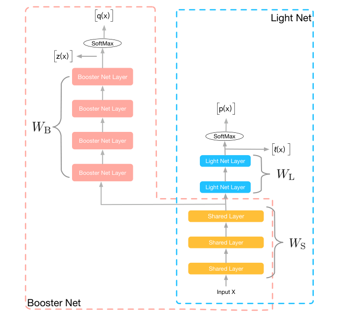
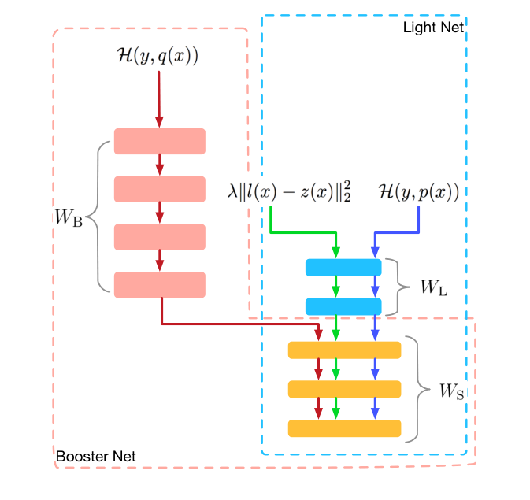
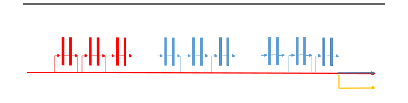
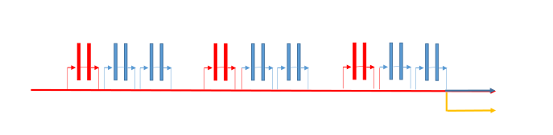
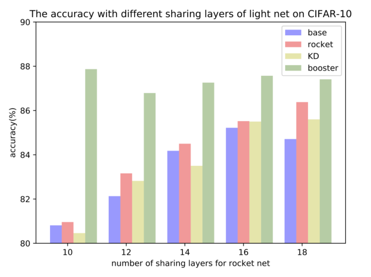
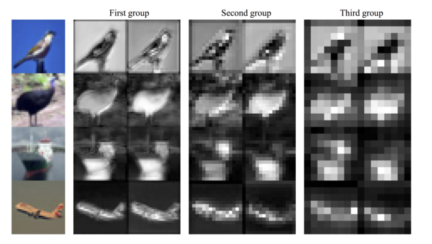
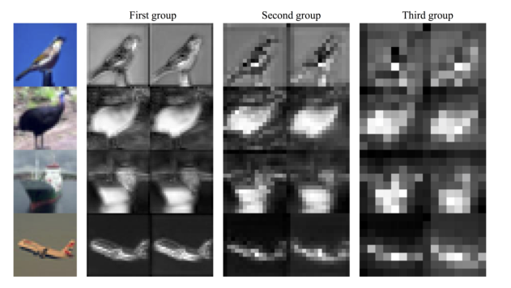

# Rocket Launching：训练高性能轻量网络的通用且高效框架

> Guorui Zhou¹、Ying Fan¹、Runpeng Cui²、Weijie Bian¹、Xiaoqiang Zhu¹、Kun Gai¹ | ¹阿里巴巴（Alibaba Inc.），北京，中国；²清华大学自动化系

> AAAI 2018（arXiv:1708.04106v3 [stat.ML]，2018 年 3 月 15 日）· 通讯作者 Guorui Zhou，源码 https://github.com/zhougr1993/Rocket-Launching

本文提出火箭发射（rocket launching）训练框架：用一个大而深的助推器网络（booster net）在训练全程监督轻量网络（light net）的学习，推理时只留下轻量网络。核心发现是——**CIFAR-10 上轻量网错误率从 8.77% 降到 7.87%（AT 8.25%、KD 8.39%），真实广告数据 GAUC +0.3%，且训练总时长反而比分开训练两个网络更短**。

核心内容：

- 痛点：CTR 预测等实时响应任务对推理时延有硬约束，深而宽的高性能模型无法上线；传统压缩要么靠矩阵分解/剪枝简化计算，要么走"教师先训好再蒸馏"的两步式
- 方案：light net 与 booster net 共享低层参数、在同一任务上同步训练，booster 全程通过提示损失（hint loss）引导 light net 学习，推理阶段只保留 light net
- 技术细节：比较三种 hint loss（logits 的 MSE、softmax 的 MSE、知识蒸馏），并发明梯度阻断（gradient block）——阻断 hint loss 对 booster 特定参数的梯度，让 booster 只按真实标签更新、避免被弱学生拖垮
- 验证：CIFAR-10、SVHN、CIFAR-100 公开基准 + 阿里真实广告数据集（40 亿训练样本），且可与 KD 叠加进一步提升

关键发现：

- CIFAR-10 上 rocket（7.87%）显著优于 base（8.77%）、AT（8.25%）、KD（8.39%），叠加 KD 进一步降到 7.52%，逼近单独训练的 40 层 booster（6.64%）
- 组件消融：gradient block 贡献 0.63%、参数共享贡献 0.19%；联合训练优于"先训 booster 再初始化 light net"
- 训练总时长 6153s（180 个 epoch）vs 分开训练 7275s；40 层 booster 单次推理 23.2ms 无法上线，light net 保持与基线相同的 7.6ms
- 广告数据集 GAUC 0.632 → 0.635（+0.3%），与基线时延相同；booster only 达 0.637 但时延不可接受

---

## 摘要

应用于实时响应任务的模型，例如点击率（CTR）预测模型，需要高精度和严格的响应时间。因此，深度深、复杂度高的顶级深度学习模型，由于推理时间的限制，并不适合这些应用。为了在时间限制下获得性能更好的神经网络，我们提出了一个通用框架，利用助推器网络（booster net）帮助训练用于预测的轻量级网络。我们将整个过程称为火箭发射（rocket launching），在整个训练过程中，booster net 被用来引导 light net 的学习。我们分析了不同的损失函数，目标是推动 light net 表现得与 booster net 相似。此外，我们使用一种称为梯度阻断（gradient block）的技术来进一步提升 light net 和 booster net 的性能。在基准数据集和真实工业广告数据上的实验证明了我们方法的有效性。

## 1 引言

深度网络在许多领域取得了最先进的结果，例如计算机视觉（Huang et al. 2016）[12] 和自然语言处理（Bahdanau, Cho, and Bengio 2014）[3]。从 AlexNet（Krizhevsky, Sutskever, and Hinton 2012）[16] 到最近提出的 DenseNet（Huang et al. 2016）[12]，更好的性能总是伴随着更深、更宽的网络以及更复杂、更可适应的结构。神经网络的结构越复杂，意味着推理时间越长，这在工业环境中是不被容忍的。上述网络只考虑了准确率这一评价标准，而忽视了工业应用中实时响应的必要性。

与此同时，一些网络如 DIN（Zhou et al. 2017）[27] 和 wide & deep 模型（Cheng et al. 2016）[6] 受到越来越多的关注。这些网络有一些共同特征：网络较浅、层非常简单且计算成本较低。在工业应用（例如在线广告系统）中，模型必须在几毫秒内为一位用户预测数百个广告，这限制了模型的复杂度。只有简单和浅层的结构才能满足工业上严苛的响应时间要求。

准确率和时延是我们关注的两个点。一般来说，在保持良好性能的同时降低运行时复杂度有两种解决方案。一些工作利用因式分解或压缩来直接简化计算，例如矩阵 SVD（Denton et al. 2014）[7]、MobileNet（Howard et al. 2017）[11] 和 ShuffleNet（Zhang et al. 2017）[26]。另一些方法采用教师-学生（teacher-student）策略。它们使用层数和参数更少的轻量网络来缩短推理时间，而轻量网络由一个预先训练好的复杂教师网络辅助训练，例如知识蒸馏（knowledge distillation）（Hinton, Vinyals, and Dean 2015）[10] 和 FitNet（Romero et al. 2014）[20]。这些教师-学生方法降低了运行时复杂度，并且可以进一步与第一类方法结合。在这项工作中，受教师-学生方法潜力的启发，我们提出了一种训练优秀小网络的新颖通用框架。

在这项工作中，我们开发了一种新颖的网络训练过程，称为火箭发射（rocket launching）。light net 是用于推理的目标网络，booster 则是与架构上更深、更复杂的网络相关的部分。light net 和 booster net 共同构成 rocket network（火箭网络）的架构。在训练阶段，light 和 booster 网络在同一任务上同步训练。此外，通过优化提示损失（hint loss），light net 还持续获取 booster 学到的知识，提示损失被包含在目标函数中，使两个网络在训练过程中行为相似。booster 在训练全程引导目标轻量网络的优化。在推理阶段，只使用训练好的轻量网络。与之前的教师-学生方法（Hinton, Vinyals, and Dean 2015; Romero et al. 2014）[10,20] 不同，我们让轻量模型与笨重模型共享一些较低层，并同时训练它们。

在本文中，我们提出了一种通用方法，目标是在推理时间受限的情况下获得表现良好的轻量网络。我们的方法适用于许多不同的网络结构。简而言之，我们的贡献可以总结如下：

- 我们提出了一种新颖的通用训练过程，称为火箭发射，它利用 booster net 在训练全程监督轻量网络的学习。在实验中我们证明，轻量模型可以被训练到接近更深、更复杂的模型的表现。
- 我们分析了不同的提示损失函数，以将信息从 booster 转移到 light net。
- 为了推动 light net 接近 booster net，我们使用梯度阻断（gradient block）技术来消除提示损失在 booster 各层上的反向传播效应，这让 booster net 有更多自由来基于真实标签更新其参数，从而进一步提升性能。

我们的方法在公开可用的基准测试以及工业数据集上都取得了最先进的结果。值得注意的是，我们的方法优于其他教师-学生方法。实验结果表明，当将其他教师-学生方法与我们的框架结合时，性能可以进一步提升。

本文的其余部分从相关工作摘要开始。然后我们介绍我们的方法，随后是实验和结论。

## 相关工作

近年来，深度神经网络由于在许多研究领域压倒性的性能而受到越来越多的关注。网络结构设计的一个主要趋势是开发具有更大深度、更多参数和更高复杂度的神经网络以获得更好的性能（Simonyan and Zisserman 2015; Szegedy et al. 2015; He et al. 2016; Zagoruyko and Nikos 2016）[22,23,8,25]。然而，这些高复杂度的顶级网络在推理阶段会导致耗时系统。因此，它们不适合有推理时间限制的应用。

有一些通过直接简化计算或剪枝原始神经操作来进行模型压缩的探索。Denton 等人（Denton et al. 2014）[7] 使用 SVD 来近似深度 CNN 中的卷积操作。MobileNets（Howard et al. 2017）[11] 基于流线型架构，使用深度可分离卷积（depthwise separable convolution）来构建轻量级深度神经网络。ShuffleNet（Zhang et al. 2017）[26] 使用逐点分组卷积和通道混洗（channel shuffle）来降低计算成本。ThiNet（Luo, Wu, and Lin 2017）[18] 利用下一层的统计信息来剪枝滤波器，在保持准确率的同时加速 CNN 模型。

除了设计精巧的网络结构，轻量网络还可以在训练阶段从额外的预训练模型中获得更多信息。这一思想在 Learnware（Zhou 2016）[28] 中被强调。已经有一些尝试采用教师-学生策略，即用更复杂的教师网络在给定任务上教导一个轻量级学生网络。教师网络帮助学生网络在推理阶段获得良好的性能。Buciluˇa 等人（Buciluˇa, Caruana, and Niculescu-Mizil 2006）[5] 改进了压缩模型，开创了这类学习过程。他们阐述了一个大型模型集成的知识可以转移到一个单一的小模型中，他们使用一个大型模型集成来标注大量无标签数据，然后用集成模型标注的数据来训练小模型。此外，Ba 等人（Ba and Caruana 2014）[2] 训练一个更宽更浅的网络（称为学生网络）来模仿被称为教师网络的大模型，通过用 $\ell_2$ 损失对 softmax 层之前的 logits 进行回归来实现。他们认为匹配 logits 比笨重模型提供的硬标签能获得更多信息。Hinton 等人（Hinton, Vinyals, and Dean 2015）[10] 指出，用学习到的参数值来识别已训练模型中的知识是困难的。相反，他们利用知识的一种抽象视图，即从输入向量到输出向量的学习映射，他们提出了知识蒸馏策略，将笨重模型产生的类概率作为训练小模型的"软目标"（soft targets）。他们证明了这是 Ba 和 Caruana（2014）[2] 使用的匹配 logits 的通用版本。

除了使用教师网络的输出，人们还尝试从教师那里获得更多监督信息。FitNets（Romero et al. 2014）[20] 不仅使用输出，还使用笨重模型学到的中间表示作为提示（hint）来监督训练过程。Zagoruyko 等人（Zagoruyko and Komodakis 2016）[24] 使用注意力作为将知识从一个网络转移到另一个网络的机制。通过为卷积神经网络恰当地定义注意力，他们通过强迫学生 CNN 模仿强大教师网络的注意力图，提升了学生 CNN 的性能。

在之前的教师-学生方法中，笨重的教师网络是预先训练的。在 rocket launching 中，我们不只转移预训练模型最终的静态输出，而是让 booster 模型引导 light net 的整个训练过程。我们认为笨重模型学到的知识不仅存在于最终输出中，也存在于完整的学习过程中。轻量模型不仅获得目标输出与临时输出之间的差异，还获得学习能力更强的复杂模型提供的通往最终目标的可能路径。我们方法的另一个不同之处在于，我们的框架中轻量模型与 booster 的部分参数是共享的。我们采用参数共享方案，因为同一任务的低层表示应该是通用的。在所提出的架构中，booster 有更深的特定层，以确保有能力更好地引导轻量模型学习任务。

将多个网络一起训练经常应用于多输入场景（Andrew et al. 2013; Bromley et al. 1994）[1,4] 或半监督任务（Laine and Aila 2016）[17]。参数共享也被用于多任务（He et al. 2017）[9]。然而，据我们所知，还没有人尝试用这些技术来训练小网络以获得更好的性能。我们是第一个在模型压缩尝试中利用这些方案的人，实验结果表明了我们方法的有效性。

## 我们的方法（Our Approach）

在本节中，我们将详细描述我们提出的 rocket net 训练过程。我们将进一步分析我们方法的亮点，并比较不同的提示损失函数。

### 方法概要（The sketch of our method）

图 1 展示我们架构的总体结构，它由两部分组成：light net 和 booster net。这两个网络共享一些较低层（用黄色标注），并且它们都有自己的特定层，用于在同一任务上的学习和预测。

**图 1：整体网络结构，蓝色虚线圆圈表示 light net，粉色虚线圆圈表示 booster net。黄色层由 light net 和 booster net 共享。**

我们令 $x$ 和 $y$ 分别表示我们神经架构的输入和 one-hot 真实标签。令 $L$ 为 light net，其输出 softmax 为 $p(x) = \text{softmax}(l(x))$，其中 $l(x)$ 是 softmax 激活之前的加权和。light net 的参数由两部分组成：共享层中的参数 $W_S$ 和用于预测的轻量特定层中的参数 $W_L$。我们令 $B$ 表示 booster 网络，它共享参数 $W_S$，并有自己的特定权重 $W_B$ 来获得最终输出。与 light net 类似，我们有 $q(x) = \text{softmax}(z(x))$ 作为 booster 的输出 softmax，其中 $z(x)$ 是 softmax 激活之前的加权和。我们期望 light net 被训练得与真实标签 $y$ 相似，同时也接近具有更强表示能力的 booster net 学到的知识。为解决这个问题，我们在训练目标中引入提示损失（hint loss），以将知识从 booster net 传达到 light net。rocket launching 的目标函数定义如下：

$$
L(x; W_S, W_L, W_B) = H(y, p(x)) + H(y, q(x)) + \lambda \| l(x) - z(x) \|_2^2 \qquad (1)
$$

其中最后一项是提示损失函数，即 logits $z(x)$ 与 $l(x)$ 之间的均方误差（mean square error，MSE），$H(p, q) = -\sum_i p_i \log q_i$ 是交叉熵，$\lambda$ 是平衡交叉熵与提示损失的参数。这里我们使用交叉熵项让 booster 和 light net 学习真实标签，并使用提示损失函数利用 booster 学到的知识来引导轻量网络的学习过程。

### 我们方法的特色（Characters of our method）

我们的方法有一些亮点，它们对训练过程有显著影响，并将我们的方法与其他教师-学生方法区分开来。

**参数共享（Parameter sharing）。** 在我们的方法中，light net 与 booster net 共享参数。这一方案帮助 light net 从 booster 获得直接的推力，推动它获得更好的性能。参数共享技术在深度学习中并不新鲜。在计算机视觉领域，以多任务方式训练深度卷积神经网络是一种常见方案。我们假设这些任务可以建立在图像的一些共享低层表示之上。基于这一假设，我们可以减少神经网络中的参数并提高其泛化能力。值得注意的是，在工业应用中，例如 CTR 预测，复用其他任务的嵌入层有助于新任务更容易收敛并获得更好的性能。

**同步训练（Simultaneous training）。** 在大多数教师-学生方法中，教师网络在目标数据库上预先训练，并且在引导学生网络训练过程时其参数是固定的。与这些方法不同，我们让 light net 和 booster net 同步训练，目标轻量网络的整个学习过程由 booster net 引导。轻量模型不仅可以从目标输出与其临时输出之间的差异中学习，还可以从具有更强学习能力的复杂模型提供的通往最终目标的可能路径中学习。注意，与分开训练教师和学生网络相比，我们提出架构的整个训练时间缩短了。因此，压缩模型可以被更高效地训练，以满足工业应用中推理模型需要频繁更新的要求。

**提示损失函数（Hint loss functions）。** 在我们的方法中，我们通过最小化提示损失将 booster net 的知识转移到 light net。本工作考虑了以下几种不同的提示损失函数：

- 最终 softmax 的 MSE：$L_{MSE}(x) = \| p(x) - q(x) \|_2^2$，
- softmax 激活之前 logits 的 MSE，SNN-MIMIC（Ba and Caruana 2014）[2] 也采用了这一形式：$L_{mimic}(x) = \| l(x) - z(x) \|_2^2$，
- 知识蒸馏（Hinton, Vinyals, and Dean 2015）[10]：$L_{KD}(x) = H(p(x)/T, q(x)/T)$，其中 $T$ 是温度。

对于最终 softmax 的 MSE $L_{MSE}$，我们有提示损失关于 $l_i(x)$ 的导数：

$$
\frac{\partial L_{MSE}(x)}{\partial l_i(x)} = 2p_i(x) \left[ p_i(x) - q_i(x) + \sum_k p_k(x)(q_k(x) - p_k(x)) \right] \qquad (2)
$$

注意，梯度与 light net 的预测输出成正比。如果 $l_i(x)$ 非常负，导致 $p_i(x)$ 接近零且梯度消失，那么即使 light net 的输出与 booster net 截然不同，最终 softmax 的 MSE 也可能无法学习到输出中的差异。

SNN-MIMIC 学习（Ba and Caruana 2014）[2] 使用教师网络和学生网络之间 $L_{mimic}$ 的公式。我们有关于 $l_i(x)$ 的导数：

$$
\frac{\partial L_{mimic}(x)}{\partial l_i(x)} = l_i(x) - z_i(x) \qquad (3)
$$

我们观察到，该更新直接减小 softmax 之前 logits 之间的差异，这避免了 $L_{MSE}$ 的梯度消失问题。实验结果也表明，在这些不同的提示损失公式中，用 $L_{mimic}$ 训练取得了最好的性能。

知识蒸馏（Hinton, Vinyals, and Dean 2015）[10] 使用交叉熵来约束两个模型的概率输出。在他们的工作中，引入了温度 $T$ 来在类别之间产生更柔和的概率分布。他们认为知识蒸馏是匹配 logits 的通用情形。他们证明了在高温下，关于 $l_i(x)$ 的梯度为：

$$
\frac{\partial L_{KD}(x)}{\partial l_i(x)} \approx \frac{1}{NT^2} (l_i(x) - z_i(x)) \qquad (4)
$$

其中 $N$ 是类别数，并使用了近似 $e^{l_i(x)/T} \approx 1 + l_i(x)/T$。他们的近似在温度相对 logits 幅值足够高时忽略了泰勒级数中的 $(l_i(x)/T)^2$ 项。注意，近似梯度 $\frac{1}{NT^2}(l_i(x) - z_i(x))$ 与被忽略项 $(l_i(x)/T)^2$ 是同阶无穷小，这个近似也可能导致可忽略的梯度。但我们认可温度的作用：它可以使类概率变柔和，让蒸馏更关注匹配低于平均值的负 logits。在实践中，Hinton 等人（Hinton, Vinyals, and Dean 2015）[10] 建议中间温度效果最好，这忽略掉了可能含有噪声的非常负的 logits。而在这项工作中，我们发现优化我们框架中所有 logits 差异的表现优于使用 $L_{KD}$ 的公式。我们认为一些非常负的 logits 可能传达了笨重网络获得的、有助于学生网络取得更好性能的有用知识。

**梯度阻断（Gradient block）。** 在我们提出的训练过程中，light net 与 booster net 共享参数并一起训练。这种同步训练方案对 booster 网络的性能有不可避免的影响。同时使用交叉熵 $H(y, q(x))$ 和提示损失作为更新 booster 参数的目标，将使 booster 的类别输出受到 light net 输出的强烈影响，并阻碍 booster 直接在该任务上学习。由于轻量模型的学习能力有限，booster net 的性能将不可避免地下降。注意，轻量模型在训练过程中学习的是 booster net 传达的知识，booster 模型学习的这种退化将进一步削弱轻量网络的学习潜力。

**图 2：梯度阻断（gradient block）方案下的梯度反向传播。**

为了解决这个问题，在训练过程中，我们开发了梯度阻断方案，防止 booster 模型最小化提示损失目标。从图 2 可以看出，在提示损失项的反向传播过程中，我们固定 booster net 特定参数（$W_B$）的梯度，并用此刻 booster net 的概率作为目标来监督 light net 的学习。这一操作使 booster net 中的特定参数 $W_B$ 不受轻量模型的影响，因此 booster 可以直接从真实标签学习以达到其最佳性能。对于 light net，参数照常更新以优化式 (1) 中的目标函数。监督信息和 booster 的知识都是轻量模型要学习的目标。

## 实验

在本节中，我们在几个分类数据集和一个来自中国领先电商网站的真实广告数据库上评估我们的 rocket launching。实验结果表明，我们提出的方法在 light net 的性能上取得了显著的提升，并且优于其他教师-学生方法。在公开基准实验上，我们将我们的方法与知识蒸馏（KD）（Hinton, Vinyals, and Dean 2015）[10] 和注意力迁移（attention transfer，AT）（Zagoruyko and Komodakis 2016）[24] 进行了比较。

### CIFAR-10 上的实验

CIFAR-10 数据集（Krizhevsky and Hinton 2009）[15] 由 10 个类别的 32 $\times$ 32 彩色图像组成。这些图像被分为 50,000 个训练样本和 10,000 个测试样本。我们用与 Zagoruyko and Komodakis (2016) [24] 相同的操作对数据进行预处理。所有实验用不同随机种子重复 3 次，我们取错误率的中位数作为最终结果。所有实验我们使用与 Zagoruyko and Komodakis (2016) [24] 相同的学习率调整方式和 epoch 数。我们将初始学习率设为 0.1，动量设为 0.9，在 60、120、160 个 epoch 处将学习率衰减 0.2，总共训练 200 个 epoch。

我们在 CIFAR-10 数据集上使用宽残差网络（wide residual net，WRN）（Zagoruyko and Nikos 2016）[25] 作为 rocket launching 的实例化。宽残差网络（WRN）有三组 block，每个 block 有两个卷积层，与原始 ResNet 相比宽度更大。更宽的层伴随更多参数，可以提供更强的表示能力。图 3(a) 展示了基于宽残差网络的 rocket net 结构示意图。红色层由 light net 和 booster 共享。可以看到，共享层（红色层）位于宽残差网络的较低组中。黄色部分是为 light net 设计用于预测的特定结构。蓝色部分是 booster 的特定层，在推理阶段被移除。注意力迁移（AT）使用教师网络每组残差 block 的输出激活来监督学生网络每组的激活。为了与 AT 公平比较，我们设计了另一种共享方式。如图 3(b) 所示，light net 在每组中与 booster 共享一些较低层的 block。

**图 3：rocket net 的两种网络结构。(a) 宽残差网络上的底部（bottom）rocket net；(b) 宽残差网络上的间隔（interval）rocket net。**

我们在不同深度和宽度的 light 和 booster 网络上探索 rocket launching（例如 WRN-16-1(a), 0.2M 表示深度为 16、加宽因子为 1 的宽残差网络，使用图 3(a) 所示的层共享方式，其参数规模为 0.2M）。如表 1 所示，在不同的实验设置下，我们的方法与基础轻量网络相比都取得了一致的显著提升。以表 1 的第一行为例，使用相同的 WRN-16-1(b) 网络结构，我们的 rocket launching 与单独训练的网络相比获得了 0.9% 的提升。我们还观察到，我们的方法优于其他教师-学生方法，例如知识蒸馏（KD）（Hinton, Vinyals, and Dean 2015）[10] 和注意力迁移（Zagoruyko and Komodakis 2016）[24]。值得注意的是，得益于残差网络的结构特性，图 3(b) 所示的共享方式仍然获得了不错的结果。

| light | booster | base¹ | AT | KD | rocket² | rocket+KD³ | booster⁴ | booster only⁵ |
| --- | --- | --- | --- | --- | --- | --- | --- | --- |
| WRN-16-1, 0.2M(b) | WRN-40-1, 0.6M | 8.77 | 8.25 | 8.39 | 7.87 | 7.52 | 6.64 | 6.58 |
| WRN-16-2, 0.7M(b) | WRN-40-2, 2.2M | 6.31 | 5.85 | 6.08 | 5.67 | 5.64 | 5.20 | 5.23 |
| WRN-16-1, 0.2M(a) | WRN-40-1, 0.6M | 8.69 | -⁶ | 8.34 | 7.85 | 7.51 | 7.27 | 6.58 |

**表 1：CIFAR-10 上的分类性能（测试错误率）对比。** ¹ base 表示 WRN-16 单独训练。² rocket 表示 rocket launching 中 light net 的结果。³ rocket+KD 表示使用 rocket launching 结合 KD 的 light net 的结果。⁴ booster 表示 rocket launching 中 booster net 的结果。⁵ booster only 表示 WRN-40 单独训练。⁶ WRN-16-1, 0.2M(b) 无法直接应用于 AT，因此我们没有报告这一结果。

除了与其他方法比较，我们还尝试通过向式 (1) 的目标函数中加入 $L_{KD}$ 将 KD 与我们的方法结合。值得注意的是，我们在 $L_{KD}$ 中使用 booster net 预训练得到的概率，这意味着 light net 还可以从预训练的 booster 网络获得额外的引导。从表 1 可以看出，应用 KD 后性能可以进一步提升，这意味着我们的 rocket launching 对 light net 的作用与 KD 不同。light net 同时受益于预训练教师网络带来的监督信息，以及训练过程中 booster 网络传达的知识。

我们还研究了我们的框架使用不同提示损失公式的情况。从表 3 可以看出，采用的匹配 logits 的提示损失在不同目标中取得了最好的性能。而匹配概率的提示损失表现最差，这意味着梯度消失影响了训练过程。实验结果与我们之前的分析一致。

### 我们框架各部分的表现

我们还进行了实验来评估我们的框架设计（见图 3）。我们观察到，同步训练、层共享和梯度阻断都对我们的方法有贡献。对于 WRN-16-1(b)，与 rocket (no GB) 相比，梯度阻断（GB）获得了 0.63% 的提升；与 rocket (no sharing) 相比，参数共享获得了 0.19% 的提升。使用 booster 的部分参数初始化 light net，并用学习真实标签的交叉熵和 light net logits 与 booster 固定 logits 之间的 $L_{mimic}$ 一起单独训练 light net，我们得到的结果比 rocket 差，这显示了同步训练的有效性。

| light | booster | base | rocket (no GB)¹ | rocket (no sharing)² | rocket (no joint training)³ | rocket |
| --- | --- | --- | --- | --- | --- | --- | --- |
| WRN-16-1(b) | WRN-40-1 | 8.77 | 8.50 | 8.06 | 8.04 | 7.87 |
| WRN-16-1(a) | WRN-40-1 | 8.69 | 8.30 | 8.23 | 8.23 | 7.85 |

**表 2：不同框架设计的实验结果（测试错误率）对比（CIFAR-10）。** ¹ rocket (no GB) 表示不使用 gradient block 的 rocket launching。² rocket (no sharing) 表示不使用参数共享的 rocket launching。³ rocket (no joint training) 表示 booster net 先训练，然后 light net 用 booster 的部分层进行初始化，并用提示损失学习 booster net 的 logits。

| light | booster | Lmimic | LMSE | LKD |
| --- | --- | --- | --- | --- |
| WRN-16-1 (b) | WRN-40-1 | 7.87 | 8.32 | 7.98 |
| WRN-16-1 (a) | WER-40-1 | 7.85 | 8.36 | 8.26 |

**表 3：CIFAR-10 上不同提示损失函数的结果。**

此外，我们的 rocket launching 联合训练可以缩短整个训练时间。在 CIFAR-10 数据集上，40 层 booster 的训练过程需要 173 个 epoch 收敛，平均每个 epoch 24.6 秒，16 层 light net 的训练需要 165 个 epoch，每个 epoch 18.3 秒。总时间为 7275.3 秒。相比之下，我们的 rocket launching 过程需要 180 个 epoch 收敛，每个 epoch 34.2 秒，总时间 6153.0 秒。我们看到，与分开训练两个网络相比，rocket launching 确实缩短了训练该架构的时间。

### 不同深度的表现

在这一部分，我们研究不同深度和参数规模下轻量模型的学习能力。与之前的网络结构不同，为了使参数规模与层数成正比，我们使用从底部到顶部宽度固定的残差网络。light net 与 booster net 共享底部 $n_s$ 个卷积层。我们将 $n_s$ 从 10 调到 18，而 booster net 的层数为 40（为了使 booster 比 light net 具有显著更强的学习能力，我们设置 $n_s$ 小于 booster 深度的一半）。

**图 4：CIFAR-10 上 light net 不同共享层数的准确率。**

从图 4 可以看出，轻量模型的表现稳定优于 base 和 KD，这意味着不同深度的 light net 都能在笨重 booster 的帮助下获得额外信息。值得注意的是，base 与 rocket 之间的差距并不与 light net 的深度成正比，这一现象可能是由轻量网络学习能力与来自 booster net 的额外信息之间的平衡造成的。

### rocket launching 与注意力迁移的可视化

为了直观地解释我们的方法，我们分别可视化了 light net 和 booster net 每组的输出。为了与前面部分保持一致，我们使用图 3(b) 作为基础网络。为了比较，我们可视化了空间注意力映射的对应结果。从图 5 可以看出，对于 rocket launching 和注意力迁移（AT）两者，较低组生成的 feature map 在 light 和 booster net 之间是相似的。这表明参数共享和注意力在较低层上有类似的效果。它还可以表明，这些方法可以从低层的 booster net 学习特征表示。

**图 5：rocket launching 与 attention transfer 的可视化结果，每组中第一张和第二张图片分别代表 booster net 和 light net。**

### SVHN 与 CIFAR-100 上的实验

为了进一步验证 rocket launching 的有效性，我们分别将我们的方法应用于 CIFAR-100 和 SVHN。为了与 AT（基于 WRN）比较，我们仍然使用 WRN 作为基础网络结构，共享方式如图 3(b) 所示。

CIFAR-100 数据集（Krizhevsky and Hinton 2009）[15] 由 100 个类别的 32 $\times$ 32 彩色图像组成。与 CIFAR-10 一样，这些图像仍被分为 50,000 个训练样本和 10,000 个测试样本。CIFAR-100 的实验设置与 CIFAR-10 相同。

SVHN 数据库（Netzer et al. 2011）[19] 来自 Google 街景图像中的门牌号。它包含 10 个类别的 32 $\times$ 32 RGB 彩色图像。训练集有 73,257 张图像，测试集有 26,032 张图像，额外集有 531,131 个样本。我们遵循与 Sermanet 等人（Sermanet, Chintala, and LeCun 2012）[21] 相同的评估流程来组成我们的训练集、验证集和测试集。对于这个数据集，我们使用验证集来选择最终模型。在我们的实验中，我们使用 Adam（Kingma and Ba 2014）[14]，初始学习率为 0.001，在 20、40、60 个 epoch 处将学习率衰减 0.2。由于这个数据集容易学习，我们在 booster net 的每个特定层后添加 dropout，dropout 率为 20%，以防止过拟合。对于单独训练的 booster，添加相同的 dropout 层以保持一致性。

| dataset（数据集） | light | booster | base | AT | KD | rocket | rocket+KD |
| --- | --- | --- | --- | --- | --- | --- | --- |
| SVHN | WRN-16-1, 0.2M(b) | WRN-40-1, 0.6M | 3.58 | 2.99 | 2.31 | 2.29 | 2.20 |
| CIFAR-100 | WRN-16-1, 0.2M(b) | WRN-40-1, 0.6M | 43.7 | 34.1 | 36.4 | 33.3 | 33.0 |

**表 4：CIFAR-100 和 SVHN 上的分类性能（测试错误率）对比。**

上述两个数据集上的错误率如表 4 所示。我们观察到，与基础模型相比，我们的方法在 SVHN 上获得了 1.29% 的提升，在 CIFAR-100 上获得了 10.4% 的提升。更重要的是，rocket launching 在所有设置上都优于其他教师-学生方法。

### 真实广告数据集上的实验

为了进一步验证 rocket launching 的有效性，我们在一个巨大的真实工业数据集上测试我们的方法。该数据集¹来自阿里巴巴的生产展示广告系统，我们用 rocket launching 来预测用户是否会在给定商品上点击。训练集规模为 40 亿，测试集为 2.85 亿。

¹ https://tianchi.aliyun.com/datalab/dataSet.htm?spm=5176100073.888.26.70c5adaeMeJQpW&id=19

我们使用的网络如 DIN（Zhou et al. 2017）[27] 所示。在在线系统中，大部分计算集中在嵌入层之后的全连接层。因此，我们尝试使用具有更复杂全连接层的 booster net 来引导我们的 light net。light net 与 booster net 共享嵌入层。booster net 有七个宽的隐藏层，使用了批归一化（batch normalization）（Ioffe and Szegedy 2015）[13] 等复杂操作，light net 的特定层隐藏单元更少，且只有全连接层。

| model（模型） | # params in FC layers（FC 层参数量） | # multiplications in FC layers（FC 层乘法次数） | # inference time of FC Layers（FC 层推理时间） | GAUC |
| --- | --- | --- | --- | --- |
| base | 576 $\times$ 200 $\times$ 80 $\times$ 2 | 131360 | 7.6 ms | 0.632 |
| rocket | 576 $\times$ 200 $\times$ 80 $\times$ 2 | 131360 | 7.6 ms | 0.635 |
| booster only | 576 $\times$ 720 $\times$ 360 $\times$ 240 $\times$ 180 $\times$ 90 $\times$ 2 | 837900 | 23.2 ms | 0.637 |

**表 5：真实广告数据集上的实验。**

light net 在巨大的真实数据上，在与基础模型相同的时延下，GAUC（AUC 的泛化，the generalization of AUC）（Zhou et al. 2017）[27] 获得了 0.3% 的提升。booster net 在离线指标上取得了最好的性能，但它单次请求推理数百个候选广告需要 23.2 ms，这对在线系统来说是不可接受的。我们的方法可以在结构和参数量相同的模型上获得提升。这个实验证明，人们可以用我们的方法在某种程度上打破时延限制带来的边界。

## 结论

我们提出了一个名为 rocket launching 的通用框架，在笨重 booster net 的帮助下获得高效且性能良好的轻量模型。为了从 booster 模型获得尽可能多的信息，我们让 booster 和 light net 在同一个任务上一起训练，并加入提示损失目标，推动 booster 模型监督轻量模型的整个训练过程。此外，轻量模型与 booster 共享参数，使 light net 直接从 booster 获得低层表示。我们还分析了可以将知识从 booster 传达给轻量模型的不同提示损失函数。此外，我们开发了梯度阻断方案，防止 booster 网络退化。对于未来工作，我们希望探索训练不仅深度更小、而且每一层神经元更少的网络，以进一步提高推理效率。

## 参考文献

[1] Andrew, G.; Arora, R.; Bilmes, J.; and Livescu, K. 2013. Deep canonical correlation analysis. In Proceedings of the 30th International Conference on Machine Learning, 1247–1255.

[2] Ba, J., and Caruana, R. 2014. Do deep nets really need to be deep? In Advances in Neural Information Processing Systems 27, 2654–2662.

[3] Bahdanau, D.; Cho, K.; and Bengio, Y. 2014. Neural machine translation by jointly learning to align and translate. arXiv preprint arXiv:1409.0473.

[4] Bromley, J.; Guyon, I.; LeCun, Y.; Säckinger, E.; and Shah, R. 1994. Signature verification using a siamese time delay neural network. In Advances in Neural Information Processing Systems 12, 737–744.

[5] Buciluˇa, C.; Caruana, R.; and Niculescu-Mizil, A. 2006. Model compression. In Proceedings of the 12th ACM SIGKDD international conference on Knowledge discovery and data mining, 535–541.

[6] Cheng, H.-T.; Koc, L.; Harmsen, J.; Shaked, T.; Chandra, T.; Aradhye, H.; Anderson, G.; Corrado, G.; Chai, W.; Ispir, M.; et al. 2016. Wide & deep learning for recommender systems. In Proceedings of the 1st Workshop on Deep Learning for Recommender Systems, 7–10. Boston, USA: ACM.

[7] Denton, E. L.; Zaremba, W.; Bruna, J.; LeCun, Y.; and Fergus, R. 2014. Exploiting linear structure within convolutional networks for efficient evaluation. In Advances in Neural Information Processing Systems 27, 1269–1277.

[8] He, K.; Zhang, X.; Ren, S.; and Sun, J. 2016. Deep residual learning for image recognition. In Proceedings of the IEEE conference on Computer Vision and Pattern Recognition, 770–778.

[9] He, K.; Gkioxari, G.; Dollar, P.; and Girshick, R. 2017. Mask R-CNN. arXiv preprint arXiv:1703.06870.

[10] Hinton, G.; Vinyals, O.; and Dean, J. 2015. Distilling the knowledge in a neural network. arXiv preprint arXiv:1503.02531.

[11] Howard, A. G.; Zhu, M.; Chen, B.; Kalenichenko, D.; Wang, W.; Weyand, T.; Andreetto, M.; and Adam, H. 2017. Mobilenets: Efficient convolutional neural networks for mobile vision applications. arXiv preprint arXiv:1704.04861.

[12] Huang, G.; Liu, Z.; Weinberger, K. Q.; and van der Maaten, L. 2016. Densely connected convolutional networks. arXiv preprint arXiv:1608.06993.

[13] Ioffe, S., and Szegedy, C. 2015. Batch normalization: Accelerating deep network training by reducing internal covariate shift. In Proceedings of the 32nd International Conference on Machine Learning.

[14] Kingma, D., and Ba, J. 2014. Adam: A method for stochastic optimization. arXiv preprint arXiv:1412.6980.

[15] Krizhevsky, A., and Hinton, G. 2009. Learning multiple layers of features from tiny images.

[16] Krizhevsky, A.; Sutskever, I.; and Hinton, G. E. 2012. Imagenet classification with deep convolutional neural networks. In Advances in Neural Information Processing Systems 25, 1097–1105.

[17] Laine, S., and Aila, T. 2016. Temporal ensembling for semi-supervised learning. arXiv preprint arXiv:1610.02242.

[18] Luo, J.-H.; Wu, J.; and Lin, W. 2017. Thinet: A filter level pruning method for deep neural network compression. arXiv preprint arXiv:1707.06342.

[19] Netzer, Y.; Wang, T.; Coates, A.; Bissacco, A.; Wu, B.; and Ng, A. Y. 2011. Reading digits in natural images with unsupervised feature learning. In NIPS workshop on deep learning and unsupervised feature learning, volume 2011, 5.

[20] Romero, A.; Ballas, N.; Kahou, S. E.; and Chassang, A. 2014. Fitnets: Hints for thin deep nets. arXiv preprint arXiv:1412.655d0.

[21] Sermanet, P.; Chintala, S.; and LeCun, Y. 2012. Convolutional neural networks applied to house numbers digit classification. In Proceedings of the 21st International Conference on Pattern Recognition, 3288–3291. IEEE.

[22] Simonyan, K., and Zisserman, A. 2015. Very deep convolutional networks for large-scale image recognition. In Proceedings of the 3th International Conference on Learning Representations, 621–630.

[23] Szegedy, C.; Liu, W.; Jia, Y.; Sermanet, P.; Reed, S.; Anguelov, D.; Erhan, D.; Vanhoucke, V.; and Rabinovich, A. 2015. Going deeper with convolutions. In Proceedings of the IEEE conference on Computer Vision and Pattern Recognition, 1–9.

[24] Zagoruyko, Z., and Komodakis, K. 2016. Paying more attention to attention: Improving the performance of convolutional neural networks via attention transfer. arXiv preprint arXiv:1612.03928.

[25] Zagoruyko, S., and Nikos, K. 2016. Wide residual networks. arXiv preprint arXiv:1605.07146.

[26] Zhang, X.; Zhou, X.; Lin, M.; and Sun, J. 2017. Shufflenet: An extremely efficient convolutional neural network for mobile devices. arXiv preprint arXiv:1707.01083.

[27] Zhou, G.; Song, C.; Zhu, X.; Ma, X.; Yan, Y.; Dai, X.; Zhu, H.; Jin, J.; Li, H.; and Gai, K. 2017. Deep interest network for click-through rate prediction. arXiv preprint arXiv:1706.06978.

[28] Zhou, Z.-H. 2016. Learnware: on the future of machine learning. Frontiers of Computer Science 10(4):589–590.
