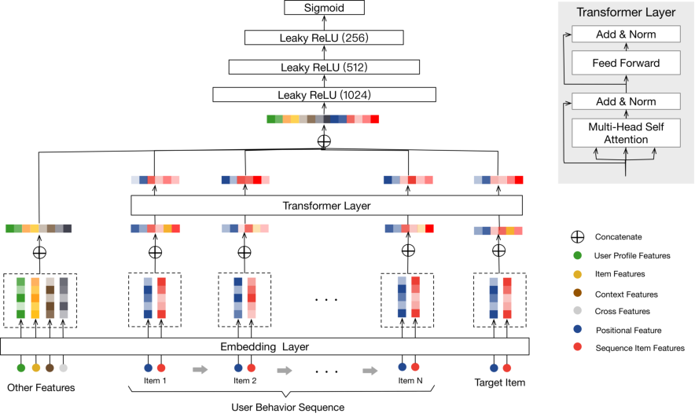

# Behavior Sequence Transformer for E-commerce Recommendation in Alibaba

> Qiwei Chen, Huan Zhao, Wei Li, Pipei Huang, Wenwu Ou | Alibaba Group

本文提出了行为序列Transformer（BST，Behavior Sequence Transformer）模型，用于在阿里巴巴的电子商务推荐中捕获用户行为序列背后的序列信号。核心内容：

- **Transformer建模序列**：在Embedding&MLP范式基础上引入Transformer层，通过自注意力机制捕获用户行为序列中的顺序信息，学习序列中每个item的更深层表示
- **序列信息引入方式**：在WDL[2]基础上添加Transformer层，区别于DIN[17]仅用注意力捕获item间相似性，BST更能捕获序列信号的时序性质
- **实际部署验证**：离线实验中BST的AUC从WDL的0.7734和DIN的0.7866提升到0.7894，在线A/B测试中CTR与时延均表现良好，BST已部署在淘宝推荐的排序阶段

关键发现：Transformer能通过自注意力机制捕获用户行为序列中item之间更复杂的"依赖关系"，从而显著提升点击率（CTR）预测性能，且其平均响应时间与WDL、DIN接近，保证了大规模推荐系统中复杂模型的部署可行性。

---

## 摘要

基于深度学习的方法已广泛应用于工业推荐系统（RSs，Recommendation Systems）。以往的工作采用Embedding&MLP范式（MLP，Multi-Layer Perceptron，多层感知器）：原始特征被嵌入到低维向量中，然后输入到MLP进行最终推荐。然而，大多数这些工作只是简单地拼接不同的特征，忽略了用户行为的序列性质。在本文中，我们提出使用强大的Transformer模型来捕获用户行为序列背后的序列信号，用于阿里巴巴的推荐。实验结果证明了所提模型的优越性，该模型随后在淘宝上线，与两个基线相比，在线点击率（CTR，Click-Through Rate）获得了显著提升。

## 1 引言

在过去十年中，推荐系统（RSs，Recommendation Systems）一直是工业界最流行的应用，而在过去五年中，基于深度学习的方法已广泛应用于工业RSs，例如Google[2,3]和Airbnb[5]。在阿里巴巴，中国最大的电子商务平台，RSs是其商品交易总额（GMV，Gross Merchandise Volume）和收入的关键引擎，各种基于深度学习的推荐方法已部署在丰富的电子商务场景中[1,8,10,11,14,15,17,18]。如[15]所述，阿里巴巴的RSs是一个两阶段流水线：匹配和排序。在匹配阶段，根据用户交互过的item选择一组相似item，然后学习一个精细调整的预测模型来预测用户点击给定候选item集的概率。

在本文中，我们聚焦于阿里巴巴旗下淘宝的排序阶段。淘宝是中国最大的个人对个人（C2C，Customer to Customer）平台，拥有阿里巴巴。我们有数百万个候选item，需要根据用户的历史行为预测用户点击候选item的概率。在深度学习时代，嵌入和MLP已成为工业RSs的标准范式：大量原始特征被嵌入到低维空间中作为向量，然后输入到全连接层（即多层感知器，MLP）来预测用户是否会点击某个item。代表性的工作包括Google的宽深学习网络（WDL，Wide & Deep Learning）[2]和阿里巴巴的深度兴趣网络（DIN，Deep Interest Network）[17]。

在淘宝，我们在WDL基础上构建排序模型，其中各种特征被用于Embedding&MLP范式，例如item的类别和品牌、item的统计数字或用户画像特征。尽管该框架取得了成功，但它本质上远不能令人满意，因为它忽略了实践中一类非常重要的信号，即用户行为序列背后的序列信号，也就是用户按顺序点击的item。在现实中，顺序对于预测用户未来的点击至关重要。例如，用户在淘宝购买iPhone后倾向于点击手机壳，或者在购买一条裤子后试图找到合适的鞋子。从这个意义上说，在淘宝排序阶段部署预测模型时不考虑这个因素是有问题的。在WDL[2]中，他们简单地拼接所有特征，没有捕获用户行为序列中的顺序信息。在DIN[17]中，他们提出使用注意力机制来捕获候选item与用户先前点击item之间的相似性，但没有考虑用户行为序列背后的序列性质。

因此，在这项工作中，为了解决WDL和DIN面临的上述问题，我们尝试将用户行为序列的序列信号纳入淘宝的RS中。受Transformer在自然语言处理（NLP，Natural Language Processing）中机器翻译任务上的巨大成功[4,13]的启发，我们应用自注意力机制，通过在嵌入阶段考虑序列信息来学习用户行为序列中每个item的更好表示，然后将它们输入MLP以预测用户对候选item的响应。Transformer的关键优势在于它可以通过自注意力机制更好地捕获句子中单词之间的依赖关系，直观地说，用户行为序列中item之间的"依赖关系"也可以通过Transformer提取。因此，我们提出了用户行为序列Transformer（BST，Behavior Sequence Transformer）用于淘宝的电子商务推荐。离线实验和在线A/B测试显示了BST相对于现有方法的优越性。BST已部署在淘宝推荐的排序阶段，为每天数亿消费者提供推荐服务。

本文的其余部分组织如下：第2节详细阐述架构，然后在第3节中介绍包括离线和在线在内的实验结果。第4节回顾相关工作，最后在第5节总结我们的工作。

## 2 架构

在排序阶段，我们将推荐任务建模为点击率（CTR，Click-Through Rate）预测问题，其可以定义如下：给定用户 $u$ 点击的行为序列 $S(u) = \{v_1, v_2, \ldots, v_n\}$ ，我们需要学习一个函数 $F$ 来预测 $u$ 点击目标item $v_t$ （即候选item）的概率。其他特征包括用户画像、上下文、item和交叉特征。

**图1：所提出的BST的总体架构。** BST将用户行为序列（包括目标item）和"其他特征"作为输入。它首先将这些输入特征嵌入为低维向量。为了更好地捕获行为序列中item之间的关系，使用Transformer层来学习序列中每个item的更深层表示。然后，通过拼接其他特征的嵌入和Transformer层的输出，使用三层MLP来学习隐藏特征的交互，并使用sigmoid函数生成最终输出。注意，"位置特征"被纳入"序列item特征"中。

我们在WDL[2]的基础上构建BST，总体架构如图1所示。从图1可以看出，它遵循流行的Embedding&MLP范式，其中先前点击的item和相关特征首先被嵌入到低维向量中，然后输入到MLP。BST和WDL之间的关键区别在于，我们添加了Transformer层，通过捕获底层的序列信号来学习用户点击item的更好表示。在以下部分中，我们以自底向上的方式介绍BST的关键组件：嵌入层、Transformer层和MLP。

### 2.1 嵌入层

第一个组件是嵌入层，它将所有输入特征嵌入到固定大小的低维向量中。在我们的场景中，有各种特征，如用户画像特征、item特征、上下文特征以及不同特征的组合，即交叉特征1。由于本文专注于使用Transformer对行为序列进行建模，为简单起见，我们将所有这些特征统称为"其他特征"，并在表1中给出一些示例。如图1所示，我们在左侧部分拼接"其他特征"并将它们嵌入到低维向量中。对于这些特征，我们创建一个嵌入矩阵 $W_O \in \mathbb{R}^{|D| \times d_o}$ ，其中 $d_o$ 是维度大小。

**表1：图1左侧所示的"其他特征"。我们在实践中使用了更多特征，为简洁起见，仅展示一些有效特征。**

| 类型 | 特征 |
|------|------|
| 用户 | 性别，年龄，城市，... |
| item | category_id, shop_id, tag, ... |
| 上下文 | match_type, 展示位置, 页面编号, ... |
| 交叉 | age $\times$ item_id, os $\times$ item_id, gender $\times$ category_id, ... |

此外，我们还获得行为序列中每个item（包括目标item）的嵌入。如图1所示，我们使用两种类型的特征来表示item："序列item特征"（红色）和"位置特征"（深蓝色），其中"序列item特征"包括item_id和category_id。注意，一个item可能有数百个特征，但选择所有特征来表示行为序列中的item代价过高。正如我们在之前的工作[15]中介绍的，item_id和category_id对于性能来说已经足够好，我们选择这两个稀疏特征来表示嵌入用户行为序列时的每个item。"位置特征"对应下面的"位置嵌入"。然后，对于每个item，我们拼接序列item特征和位置特征，并创建一个嵌入矩阵 $W_V \in \mathbb{R}^{|V| \times d_V}$ ，其中 $d_V$ 是嵌入的维度大小， $|V|$ 是item的数量。我们使用 $e_i \in \mathbb{R}^{d_V}$ 来表示给定行为序列中第 $i$ 个item的嵌入。

**位置嵌入**。在[13]中，作者提出了一种位置嵌入来捕获句子中的顺序信息。同样，顺序也存在于用户的行为序列中。因此，我们将"位置"作为每个item在底层的输入特征，然后将其投影为低维向量。注意，item $v_i$ 的位置值计算为 $pos(v_i) = t(v_t) - t(v_i)$ ，其中 $t(v_t)$ 表示推荐时间， $t(v_i)$ 表示用户点击item $v_i$ 时的时间戳。我们采用这种方法是因为在我们的场景中，它优于[13]中使用的sin和cos函数。

### 2.2 Transformer层

在这一部分，我们介绍Transformer层，它通过捕获行为序列中item与其他item的关系来学习每个item的更深层表示。

**自注意力层**。缩放点积注意力[13]定义如下：

$$
\text{Attention}(Q, K, V) = \text{softmax}\left( \frac{QK^{T}}{\sqrt{d_k}} \right) V \qquad (1)
$$

其中 $Q$ 表示查询， $K$ 表示键， $V$ 表示值。在我们的场景中，自注意力操作将item的嵌入作为输入，通过线性投影将它们转换为三个矩阵，并将它们输入到一个注意力层。根据[13]，我们使用多头注意力：

$$
S = \text{MH}(E) = \text{Concat}(\text{head}_1, \text{head}_2, \ldots, \text{head}_h) W^{H} \qquad (2)
$$

$$
\text{head}_i = \text{Attention}(E W^{Q}, E W^{K}, E W^{V}) \qquad (3)
$$

其中投影矩阵 $W^{Q}, W^{K}, W^{V} \in \mathbb{R}^{d \times d}$ ， $E$ 是所有item的嵌入矩阵， $h$ 是头的数量。

**逐点前馈网络**。根据[13]，我们添加逐点前馈网络（FFN，Feed-Forward Network）以通过非线性进一步增强模型，其定义如下：

$$
F = \text{FFN}(S) \qquad (4)
$$

为了避免过拟合并分层学习有意义的特征，我们在自注意力和FFN中都使用了dropout和LeakyReLU。然后自注意力和FFN层的整体输出如下：

$$
S^{\prime} = \text{LayerNorm}(S + \text{Dropout}(\text{MH}(S))) \qquad (5)
$$

$$
F = \text{LayerNorm}\left( S^{\prime} + \text{Dropout}\left( \text{LeakyReLU}\left( S^{\prime} W^{(1)} + b^{(1)} \right) W^{(2)} + b^{(2)} \right) \right) \qquad (6)
$$

其中 $W^{(1)}, b^{(1)}, W^{(2)}, b^{(2)}$ 是可学习参数，LayerNorm是标准归一化层。

**堆叠自注意力块**。在第一个自注意力块之后，它会聚合所有先前item的嵌入，为了进一步建模item序列背后的复杂关系，我们堆叠自构建块，第 $b$ 个块定义如下：

$$
S_b = \text{SA}(F_{b-1}) \qquad (7)
$$

$$
F_b = \text{FFN}(S_b), \quad \forall i \in 1, 2, \ldots, n \qquad (8)
$$

在实践中，我们在实验中观察到 $b = 1$ 比 $b = 2, 3$ 获得了更好的性能（见表4）。出于效率考虑，我们没有尝试更大的 $b$ ，将这个问题留给未来的工作。

### 2.3 MLP层和损失函数

通过拼接其他特征的嵌入以及应用于目标item的Transformer层输出，我们使用三个全连接层来进一步学习稠密特征之间的交互，这是工业RS中的标准做法。

为了预测用户是否会点击目标item $v_t$ ，我们将其建模为一个二分类问题，因此我们使用sigmoid函数作为输出单元。为了训练模型，我们使用交叉熵损失：

$$
L = -\frac{1}{N} \sum_{(x,y) \in D} \left( y \log p(x) + (1 - y) \log (1 - p(x)) \right) \qquad (9)
$$

其中 $D$ 代表所有样本， $y \in \{0, 1\}$ 是表示用户是否点击了item的标签， $p(x)$ 是sigmoid单元后网络的输出，表示样本 $x$ 被点击的预测概率。

## 3 实验

在本节中，我们展示实验结果。

### 3.1 设置

**数据集**。数据集来自淘宝App2的日志。我们基于用户八天的行为构建了一个离线数据集。我们使用前七天作为训练数据，最后一天作为测试数据。数据集的统计数据如表2所示。可以看出，该数据集极大且稀疏。

**表2：所构建的淘宝数据集统计信息**

| 数据集 | #用户 | #item | #样本 |
|--------|-------|-------|-------|
| 淘宝 | 298,349,235 | 12,166,060 | 47,556,271,927 |

**基线**。为了展示BST的有效性，我们将其与两个模型进行比较：WDL[2]和DIN[17]。此外，我们创建了一个基线方法，通过将序列信息纳入WDL中，记为WDL(+Seq)，它对先前点击的item的嵌入进行平均。我们的框架在WDL的基础上添加了使用Transformer的序列建模，而DIN则旨在通过注意力机制捕获目标item和先前点击item之间的相似性。

**评估指标**。对于离线结果，我们使用曲线下面积（AUC，Area Under the Curve）分数来评估不同模型的性能。对于在线A/B测试，我们使用CTR和平均RT（RT，Response Time，响应时间）来评估所有模型。RT是响应时间的缩写，即对于给定查询（即淘宝用户的一次请求）生成推荐结果的时间成本。我们使用平均RT作为指标来评估不同模型在在线生产环境中的效率。

**设置**。我们的模型使用Python 2.7和TensorFlow 1.4实现，选择"Adagrad（Adaptive Gradient，自适应梯度）"作为优化器。此外，我们在表3中给出了模型参数的详细信息。

**表3：BST的配置，参数含义可从名称推断**

| 配置 | 值 |
|------|-----|
| 嵌入大小 | 4~64 |
| 头数 | 8 |
| 序列长度 | 20 |
| Transformer块数 | 1 |
| MLP形状 | 1024 $\times$ 512 $\times$ 256 |
| 批大小 | 256 |
| Dropout | 0.2 |
| 轮数 | 1 |
| 队列容量 | 1024 |
| 学习率 | 0.01 |

### 3.2 结果分析

结果如表4所示，从中我们可以看到BST相对于基线的优越性。具体来说，离线实验的AUC从0.7734（WDL）和0.7866（DIN）提高到0.7894（BST）。当比较WDL和WDL(+Seq)时，我们可以看到以简单平均方式纳入序列信息的有效性。这意味着借助自注意力机制，BST提供了强大的能力来捕获用户行为序列背后的序列信号。注意，根据我们的实际经验，即使是离线AUC的微小提升也可以带来在线CTR的巨大提升。Google的研究人员在WDL[2]中报告了类似的现象。

**表4：不同方法的离线AUC和在线CTR提升。在线CTR提升是相对于对照组而言的。**

| 方法 | 离线AUC | 在线CTR提升 | 平均RT(ms) |
|------|---------|-------------|-------------|
| WDL | 0.7734 | - | 13 |
| WDL(+Seq) | 0.7846 | +3.03% | 14 |
| DIN | 0.7866 | +4.55% | 16 |
| BST（ $b=1$ ） | 0.7894 | +7.57% | 20 |
| BST（ $b=2$ ） | 0.7885 | - | - |
| BST（ $b=3$ ） | 0.7823 | - | - |

此外，在效率方面，BST的平均RT与WDL和DIN接近，这保证了在实际大规模RS中部署像Transformer这样的复杂模型的可行性。

最后，我们还展示了第2.2节中堆叠自注意力层的影响。从表4中可以看出， $b = 1$ 获得了最佳的离线AUC。这可能是由于用户行为序列中的序列依赖关系不像机器翻译任务中句子那样复杂，因此较少数量的块就足以获得良好的性能。在[7]中报告了类似的观察结果。因此，我们选择 $b = 1$ 在生产环境中部署BST，并在表4中仅报告 $b = 1$ 的在线CTR提升。

## 4 相关工作

在本节中，我们简要回顾一下基于深度学习的CTR预测方法的相关工作。自WDL[2]提出以来，一系列工作被提出来通过基于深度学习的方法改进CTR，例如DeepFM（Deep Factorization Machine）[6]、XDeepFM（eXtreme Deep Factorization Machine）[9]、Deep和Cross网络[16]等。然而，所有这些先前的工作都专注于特征组合或不同的神经网络架构，忽略了真实世界推荐场景中用户行为序列的序列性质。最近，DIN[17]被提出来通过注意力机制处理用户行为序列。我们的模型和DIN之间的关键区别在于，我们提出使用Transformer[13]来学习用户行为序列中每个item的更深层表示，而DIN试图捕获先前点击item和目标item之间的不同相似性。换句话说，我们的使用Transformer的模型更适合捕获序列信号。在[7,12]中，Transformer模型被提出来以序列到序列的方式解决序列推荐问题，而这些架构在CTR预测方面与我们的模型不同。

## 5 结论

在本文中，我们介绍了如何将Transformer[13]应用于淘宝推荐的技术细节。通过利用捕获序列关系的强大能力，我们通过大量实验展示了Transformer在建模用户行为序列用于推荐方面的优越性。此外，我们还展示了在中国淘宝的生产环境中部署所提出模型的细节，该模型为全国数亿用户提供推荐服务。

## 6 致谢

我们要感谢团队同事王继哲、李超、刘志远、许宇驰和吴萌萌在这项工作中的有益讨论和支持。我们非常感谢来自阿里巴巴分布式计算团队的刘金斌、郝姗姗和杨延春，以及来自阿里巴巴在线推理团队的刘侃和兰涛，他们帮助将模型部署到生产中。我们也感谢匿名审稿人的宝贵意见和建议，帮助提高了本文的质量。

## 参考文献

[1] Wen Chen, Pipei Huang, Jiaming Xu, Xin Guo, Cheng Guo, Fei Sun, Chao Li, Andreas Pfadler, Huan Zhao, and Binqiang Zhao. 2019. POG: Personalized Outfit Generation for Fashion Recommendation at Alibaba iFashion.

[2] Heng-Tze Cheng, Levent Koc, Jeremiah Harmsen, Tal Shaked, Tushar Chandra, Hrishi Aradhye, Glen Anderson, Greg Corrado, Wei Chai, Mustafa Ispir, et al. 2016. Wide & deep learning for recommender systems. 7–10 pages.

[3] Paul Covington, Jay Adams, and Emre Sargin. 2016. Deep neural networks for youtube recommendations. In RecSys. 191–198.

[4] Jacob Devlin, Ming-Wei Chang, Kenton Lee, and Kristina Toutanova. 2018. Bert: Pre-training of deep bidirectional transformers for language understanding. arXiv preprint arXiv:1810.04805 (2018).

[5] Mihajlo Grbovic and Haibin Cheng. 2018. Real-time personalization using embeddings for search ranking at Airbnb. In KDD. 311–320.

[6] Huifeng Guo, Ruiming Tang, Yunming Ye, Zhenguo Li, and Xiuqiang He. 2017. DeepFM: a factorization-machine based neural network for CTR prediction. In IJCAI. 1725–1731.

[7] Wang-Cheng Kang and Julian McAuley. 2018. Self-attentive sequential recommendation. In ICDM. 197–206.

[8] Chao Li, Zhiyuan Liu, Mengmeng Wu, Yuchi Xu, Pipei Huang, Huan Zhao, Guoliang Kang, Qiwei Chen, Wei Li, and Dik Lun Lee. 2019. Multi-Interest Network with Dynamic Routing for Recommendation at Tmall.

[9] Jianxun Lian, Xiaohuan Zhou, Fuzheng Zhang, Zhongxia Chen, Xing Xie, and Guangzhong Sun. 2018. xDeepFM: Combining explicit and implicit feature interactions for recommender systems. In KDD. 1754–1763.

[10] Yabo Ni, Dan Ou, Shichen Liu, Xiang Li, Wenwu Ou, Anxiang Zeng, and Luo Si. 2018. Perceive Your Users in Depth: Learning Universal User Representations from Multiple E-commerce Tasks. In KDD. 596–605.

[11] Changhua Pei, Yi Zhang, Yongfeng Zhang, Fei Sun, Xiao Lin, Hanxiao Sun, Jian Wu, Peng Jiang, Wenwu Ou, and Dan Pei. 2019. Personalized Context-aware Re-ranking for E-commerce Recommender Systems. arXiv preprint arXiv:1904.06813 (2019).

[12] Fei Sun, Jun Liu, Jian Wu, Changhua Pei, Xiao Lin, Wenwu Ou, and Peng Jiang. 2019. BERT4Rec: Sequential Recommendation with Bidirectional Encoder Representations from Transformer.

[13] Ashish Vaswani, Noam Shazeer, Niki Parmar, Jakob Uszkoreit, Llion Jones, Aidan N Gomez, Łukasz Kaiser, and Illia Polosukhin. 2017. Attention is all you need. In NIPS. 5998–6008.

[14] Chenglong Wang, Feijun Jiang, and Hongxia Yang. 2017. A hybrid framework for text modeling with convolutional rnn. In KDD. 2061–2069.

[15] Jizhe Wang, Pipei Huang, Huan Zhao, Zhibo Zhang, Binqiang Zhao, and Dik Lun Lee. 2018. Billion-scale commodity embedding for e-commerce recommendation in alibaba. In KDD. 839–848.

[16] Ruoxi Wang, Bin Fu, Gang Fu, and Mingliang Wang. 2017. Deep & Cross Network for Ad Click Predictions. In Proceedings of the ADKDD'17 (ADKDD'17).

[17] Guorui Zhou, Xiaoqiang Zhu, Chenru Song, Ying Fan, Han Zhu, Xiao Ma, Yanghui Yan, Junqi Jin, Han Li, and Kun Gai. 2018. Deep interest network for click-through rate prediction. In KDD. 1059–1068.

[18] Han Zhu, Xiang Li, Pengye Zhang, Guozheng Li, Jie He, Han Li, and Kun Gai. 2018. Learning Tree-based Deep Model for Recommender Systems. In KDD. 1079–1088.
