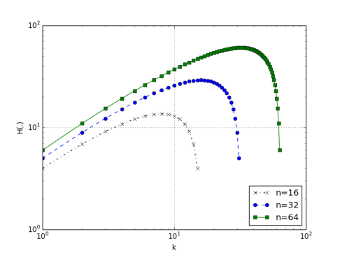

# On the Dimensionality of Embeddings for Sparse Features and Data

> Maxim Naumov | Facebook

Summary: 本文讨论了关于嵌入的一个常见误解，即嵌入总是用于降低item空间的维度。本文通过信息熵来衡量维度，证明了用于表示稀疏特征或数据的稀疏概率分布的嵌入，不一定能降低item空间的维度。然而，嵌入确实为特定任务提供了不同且通常更有意义的item表示。此外，本文给出了选择嵌入维度的上界和更精确的指导原则。

核心内容：
- 将item查找的熵与嵌入的熵进行比较，衡量两者在信息表示能力上的维度
- 推导了单item查找、多item查找、加权多item查找的熵公式及近似值
- 给出了不同查找签名下的嵌入维度上界（roofline）及查表指南

关键发现：
- 嵌入并不必然降低输入查找的维度，其降维效果取决于嵌入向量大小和输入查找向量的具体签名
- 在信息论度量下，item空间的维度可以与嵌入空间的维度直接比较
- 选择嵌入维度时，应基于输入数据集的真实组合数量和信息熵，而非经验试错

---

## 摘要

在本文中，我们讨论了一个常见的误解，即嵌入总是用于降低item空间的维度。我们证明，当我们用信息熵来衡量维度时，用于表示稀疏特征或数据的稀疏概率分布的嵌入，可能降低也可能不降低item空间的维度。然而，嵌入确实为特定任务提供了不同且通常更有意义的item表示。此外，我们给出了选择嵌入维度的上界和更精确的指导原则。

## 1 背景

将概念、对象或item映射到向量空间称为嵌入（embedding）。将 $n$ 个item表示为 $d$ 维向量空间中的向量，广泛应用于许多应用中，这些应用可以大致分为两类。

第一类以生成嵌入的模型为特征。在这种情况下，嵌入表示模型获取的关于item空间的信息。如果模型表示数据集中item上的概率分布，那么我们可以将输出解释为该概率分布的嵌入。

例如，奇异值分解（SVD）Golub & Van Loan (2012) 被用于潜在语义分析/索引（LSA/LSI）Dumais (2005) 来生成原始数据的低秩近似。在这种情况下，词-文档矩阵 $C \in \mathbb{R}^{m \times n}$ （其中 $m$ 个词和 $n$ 个文档，每行对应一个词，每列对应一个文档，非零条目表示词在文档中的出现）的低秩近似可以写为

$$
C \approx W V^T
$$

其中矩阵 $W \in \mathbb{R}^{m \times d}$ 和 $V \in \mathbb{R}^{n \times d}$ 可以解释为词和文档在 $d$ 维空间中的嵌入。类似的解释也可以用于协同过滤中的矩阵分解，但需要注意的是空矩阵条目是未知的（而不是 0.0）Koren et al. (2009); Frolov & Oseledets (2017)。

此外，基于自编码器的深度学习模型 Sedhain et al. (2015)、多标签分类 Bengio et al. (2010) 和神经机器翻译（NMT）Neubig (2017) 可以看作是在一组类别/对象上生成概率分布。设该概率分布表示为向量 $p \in \mathbb{R}^n$ 。注意，模型生成的嵌入，例如 NMT 中目标语言词的嵌入，表示该概率分布在 $n$ 个item上的嵌入，映射到 $d$ 维空间：

$$
v = V^T p
$$

对于某个嵌入矩阵 $V \in \mathbb{R}^{n \times d}$ 。注意，在训练过程中，我们通常从一个任意的概率分布开始，因此向量 $p$ 是稠密的。然而，当训练收敛到后期时，概率分布通常会更集中在特定item上，因此向量 $p$ 变得稀疏（如果需要，可以进行量化以消除小值的长尾分布）。在本文中将清楚地看到，嵌入 $V$ 需要表示的信息将根据向量 $p$ 的签名而有很大变化。特别地，当 $p$ 非常稀疏且其元素可以量化为少数几个值时，表示其中信息所需的嵌入维度 $d$ 可以相对较小。

第二类以消费嵌入的模型为特征。在这种情况下，嵌入表示从输入特征或数据中获得的信息。这些输入特征通常是稀疏的，例如用户在网页上的点击历史或帖子中出现的词。稀疏特征通常由一个整数索引列表表示，这些索引从更大的序列/集合中选择item（与由单个浮点数表示的稠密特征形成对比）。它们也可以表示为稀疏向量 $p$ ，如下一节所示。

例如，神经协同过滤 He et al. (2017)、wide & deep Cheng et al. (2016) 和 deep & cross 推荐系统 Wang et al. (2017) 都使用嵌入来处理稀疏输入特征。使用嵌入而不是稀疏item列表的优势在于，我们可以以更有意义的方式度量它们之间的距离。此外，注意嵌入元素在某种与当前模型相关的抽象空间中表示稀疏特征，而整数仅表示输入数据的排序。

自然语言处理模型 Kalchbrenner & Blunsom (2013); Sutskever et al. (2014) 可能介于这两类之间。特别地，NMT 模型 Neubig (2017) 通常使用两个嵌入，一个表示源语言中的词，另一个表示目标语言中的词。一方面，源嵌入可以看作是模型消费的稀疏特征，其特点是一个索引列表，用于选择输入句子中使用的词。另一方面，目标嵌入可以看作是目标语言中词的概率分布的表示。

在本文中，我们专注于稀疏向量 $p$ 的嵌入，这些向量可用于表示属于第二类的稀疏特征和数据。我们指出，选择超参数 $d$ 的特定值的含义在理论上尚未得到很好的理解。该选择通常基于经验实验或资源限制，例如硬件平台上的计算和内存可用性 Park et al. (2018)。最近的一项工作试图基于成对内积不相似度度量来解释嵌入向量的大小选择 Yin & Shen (2018)。

我们提出了一种基于信息熵度量的替代方法。我们借鉴了 Tishby et al. (1999); Shwartz-Ziv & Tishby (2017) 以及 Traub & Woziakowski (1980); Pinkus (1985); Donoho (2006) 的思想，但与它们不同，我们并不试图解释神经网络的行为或寻找压缩参数/数据的方法。我们使用信息度量来讨论维度问题，并提供嵌入向量大小的选择指南，即我们为选择维度 $d$ 提供了上界（roofline）和更精确的模型。

## 2 嵌入简介

设 $n$ 个item被映射到 $d$ 维向量空间。对应于 $n$ 个item的向量通常组织成一个嵌入表，可以看作是一个高矩阵 $V \in \mathbb{R}^{n \times d}$ ，其中 $n \gg d$ ，可以写为

$$
V^T = [v_1, \ldots, v_n]
$$

其中向量 $v_i$ 对应于第 $i$ 个item。

稀疏特征由一个整数索引列表表征，这些索引可以表示为嵌入表中具有不同签名的item查找。

具有单个索引的item查找通常编码为稠密矩阵-向量乘法

$$
v = V^T e_i
$$

其中向量 $e_i \in \mathbb{R}^n$ 且

$$
e_i^T = [0, \ldots, 1, \ldots, 0]
$$

在第 $i$ 个位置为 1，其余位置为 0。这通常称为独热编码向量。

注意，我们可以在单次查找中以一定的权重选择多个item，并将其表示为

$$
u = V^T a = a_{i_1} v_{i_1} + \ldots + a_{i_k} v_{i_k}
$$

其中向量 $a \in \mathbb{R}^n$ 且

$$
a^T = [0, \ldots, a_{i_1}, \ldots, a_{i_k}, \ldots, 0]
$$

在 $i = i_1, \ldots i_k$ 处有权重 $a_i \neq 0$ ，其余位置为 0 Jia et al. (2014); Paszke et al. (2017)。

进一步，我们可以将其推广到多次查找，每次查找选择多个item并带有权重，并将其编码为稠密矩阵-稀疏矩阵乘法

$$
U^T = V^T A
$$

其中稀疏矩阵 $A \in \mathbb{R}^{n \times r}$ 且

$$
A = [a_1, \ldots, a_r]
$$

由多个向量 $a_j$ 组成，每个向量对应一次查找¹，其中非零元素对应于被选择的item。输出矩阵 $U \in \mathbb{R}^{r \times d}$ 是 $r$ 次查找的结果。

这种设置常用于说明嵌入向量将 $n$ 维item空间投影到 $d$ 维嵌入向量。在下一节中，我们将更详细地检验这一说法，并证明它可能具有误导性，从而导致错误的结论。

¹注意，这里的向量下标与之前含义不同。在 (9) 中它表示第 $j$ 次查找，而在 (5) 中它表示第 $j$ 个被选择的item。

## 3 嵌入的维度

注意，当我们在前一节讨论空间维度时，从未考虑过向量元素的具体类型以及我们可以用它表示多少信息。现在让我们将其纳入分析，通过度量它可以描述的集合的基数及其关联的信息量。

回顾一下，信息源的熵由下式给出

$$
H(s) = -\sum_{i=1}^{n} p_i \log_2 p_i
$$

其中 $p_i$ 是第 $i$ 个符号被传送的概率 Shannon & Weaver (1949)。

注意，嵌入向量有 $d$ 个元素，每个元素有 $s$ 比特。因此，它可以表示

$$
g = 2^{ds}
$$

个值，如果将其解释为信息源 $v$ ，其熵为

$$
H(v) = -\sum_{i=1}^{g} p_i \log_2 p_i
$$

其中 $p_i$ 表示第 $i$ 个值被选择的概率。因此，如果 $p_i = 1/g$ 均匀分布，则

$$
H(v) = ds
$$

### 3.1 单item的単次查找

设单次查找选择单个item，如 (4) 所示。在这种情况下，第 $i$ 个嵌入向量表示item空间中的第 $i$ 个item。

注意，因为我们将此查找表示为 $n$ 维空间中的二进制向量 $e_i$ ，如 (5) 所示，它只能描述 $n$ 个item，如果将其解释为信息源 $e_i$ ，其熵为

$$
H(e_i) = -\sum_{i=1}^{n} p_i \log_2 p_i
$$

其中 $p_i$ 表示第 $i$ 个item被选择的概率。注意，如果 $p_i = 1/n$ 均匀分布，则

$$
H(e_i) = \log_2 n
$$

因此，item空间和嵌入空间的维度（通过它们可以表示的信息来衡量）可以通过比较 (12) 和 (14) 来对比。例如，在item/值选择概率均匀的假设下，如果 $n = 20M$ ，使用 (15) 我们有 $H(e_i) \approx 24.3$ ，那么单个32比特元素就足以表示item空间中的信息。

### 3.2 多item的単次查找

设单次查找选择多个item，如 (6) 所示。在这种情况下，第 $i$ 个嵌入向量表示来自item空间的第 $i$ 个item与其他item的组合。

首先考虑当此查找是 $n$ 维空间中的二进制向量时的情形，即 (7) 中 $a_i \in \{0, 1\}$ ， $i = 1, \ldots, k$ 。在这种情况下，该向量可以描述 $h$ 个item，其中

$$
h = \binom{n}{k} = \frac{n!}{k!(n-k)!}
$$

如果将其解释为信息源，其熵为

$$
H(a) = -\sum_{i=1}^{h} p_i \log_2 p_i
$$

其中 $p_i$ 是组合被选择的概率。注意，如果 $p_i = 1/h$ 均匀分布，则

$$
\begin{aligned}
H(a) &= \log_2 h \\[2pt]
&\approx n\log_2\frac{n}{n-k} + k\log_2\frac{n-k}{k} \\
&\quad + \frac{1}{6}\log_2\frac{n + 4n^2 + 8n^3}{((n-k) + 4(n-k)^2 + 8(n-k)^3)(k + 4k^2 + 8k^3)} \\
&\quad - \frac{1}{2}\log_2 \pi
\end{aligned}
$$

其中我们使用了对数的性质和 Ramanujan 近似 Ramanujan (1988)

$$
\ln n! \approx n\ln n - n + \frac{1}{6}\ln(n + 4n^2 + 8n^3) + \frac{1}{2}\ln\pi
$$

在附录中有更详细的描述。

因此，item空间和嵌入空间的维度（通过它们可以表示的信息来衡量）可以通过比较 (12) 和 (17) 来对比。例如，在item/值选择概率均匀的假设下，如果 $n = 20M$ ， $k = 100$ ，使用 (19) 我们有 $H(a) \approx 1756.3$ ，那么一个具有64个元素、每个元素32比特的向量就足以表示item空间中的信息。

### 3.3 带权重的多item单次查找

现在考虑当此查找是 $n$ 维空间中的向量时的情形，其中每个 $a_i$ 由 $t$ 比特表示， $i = 1, \ldots, k$ ，如 (7) 所示。注意，在这种情况下，前一节的分析保持不变，但我们现在可以为查找中的每个位置选择 $2^t$ 个值。因此，该向量可以描述 $h'$ 个item，其中

$$
h' = 2^{tk} h
$$

注意，如果将其解释为信息源，在 $p_i = 1/h'$ 均匀分布的假设下，其熵为

$$
\begin{aligned}
H(a) &= \log_2 h' = tk + \log_2 h \\[2pt]
&\approx tk + n\log_2\frac{n}{n-k} + k\log_2\frac{n-k}{k} \\
&\quad + \frac{1}{6}\log_2\frac{n + 4n^2 + 8n^3}{((n-k) + 4(n-k)^2 + 8(n-k)^3)(k + 4k^2 + 8k^3)} \\
&\quad - \frac{1}{2}\log_2 \pi
\end{aligned}
$$

因此，item空间和嵌入空间的维度（通过它们可以表示的信息来衡量）可以通过比较 (12) 和 (21) 来对比。例如，在item/值选择概率相等的假设下，如果 $n = 20M$ ， $k = 100$ ， $t = 16$ ，使用 (23) 我们有 $H(a) \approx 3356.3$ ，那么一个具有128个元素、每个元素32比特的向量就足以表示item空间中的信息。

### 3.4 Mini-Batch 的影响

我们指出，使用大小为 $r$ 的 mini-batch 不会影响维度，因为 mini-batch 中的每个向量是独立处理的。这在 (8) 中可以观察到，其中来自嵌入 $V$ 的矩阵 $A$ 的 $r$ 次查找在矩阵 $U$ 中生成 $r$ 个结果。

## 4 嵌入的上界和大小选择指南

注意，对应于稀疏特征的嵌入并不必然降低数据的维度（通过它们可以表示的信息来衡量）。维度降低取决于嵌入向量的大小和输入查找向量的具体签名。

不同类型查找的上界（roofline）维度在 (15)、(19) 和 (23) 中给出，可以与 (13) 中给出的嵌入维度进行比较。我们在表 1 中列出了一些示例查找签名和嵌入维度的比较。

**表 1：示例查找签名集的熵与嵌入维度**

| 输入查找签名 |  |  | 嵌入维度 |  |  |  |
|:---:|:---:|:---:|:---:|:---:|:---:|:---:|
| $n$ | $k$ | $H(\cdot)$ | $d\ (s=8)$ | $d\ (s=16)$ | $d\ (s=32)$ | $H(\cdot)$ |
| 1M | 1 | 19.9 | 4 | 2 | 1 | 32 |
| 10M | 1 | 23.2 | 4 | 2 | 1 | 32 |
| 100M | 1 | 26.5 | 4 | 2 | 1 | 32 |
| 1M | 10 | 163.0 | 24 | 12 | 6 | 192 |
| 10M | 10 | 196.3 | 28 | 14 | 7 | 224 |
| 100M | 10 | 229.5 | 32 | 16 | 8 | 256 |
| 1M | 100 | 1324.1 | 168 | 84 | 42 | 1344 |
| 10M | 100 | 1656.3 | 208 | 104 | 52 | 1664 |
| 100M | 100 | 1988.5 | 252 | 126 | 63 | 2016 |
| 1M | 1000 | 9958.0 | 1248 | 624 | 312 | 9984 |
| 10M | 1000 | 13281.2 | 1664 | 832 | 416 | 13312 |
| 100M | 1000 | 16603.3 | 2076 | 1038 | 519 | 16608 |

虽然函数 (18) 在 $n$ 较大时达到最大值，如图 1a 所示，但注意，对于表 1 中的示例查找签名， $k$ 的选择对熵函数的影响要大得多，如图 1b 所示。我们指出，这两个图中的函数都是以对数刻度绘制的。

**(a) 熵 (18)， $n=64$ ， $k=1,\ldots,63$ **

**(b) 熵 (18)，示例查找签名**

**图 1：示例查找签名集的熵（对数刻度）**

在实践中，并非所有组合都会由item查找实际使用。我们可以遍历输入数据集，以发现实际出现了多少种组合以及相同组合重复的频率。然后，我们可以使用公式 (14) 和 (17) 从信息角度估计输入数据集的维度。最终，对输入数据集维度的更精确度量可以指导模型中嵌入向量大小和元素类型的更好选择。

我们再次指出，虽然嵌入并不必然降低查找的维度，但它们确实提供了不同且非常有用的表示。注意，嵌入值是在训练过程中学习得到的。因此，嵌入是基于查找在某种与当前模型相关的抽象空间中所代表/表示的含义而找到的。

## 5 结论

我们讨论了对应于稠密和稀疏概率分布的嵌入。我们分析了与稀疏特征和数据对应的item查找和嵌入的维度。我们证明了使用嵌入并不必然降低查找的维度（通过它们可以表示的信息来衡量）。我们还为当前数据集和模型选择嵌入大小提供了上界（roofline）和更精确的指导原则。

## 致谢

作者感谢 Aleksandr Ulanov、Dheevatsa Mudigere、Satish Nadathur 和 Misha Smelyanskiy 提出的深思熟虑的评论，以及 Mark Tygert 和 Juan Miguel Pino 关于嵌入在不同应用和 NMT 模型中的使用的富有洞察力的讨论。

## 参考文献

Samy Bengio, Jason Weston, and David Grangier. Label embedding trees for large multi-class tasks. In *Proc. Advances in Neural Information Processing Systems*, 2010.

Heng-Tze Cheng, Levent Koc, Jeremiah Harmsen, Tal Shaked, Tushar Chandra, Hrishi Aradhye, Glen Anderson, Greg Corrado, Wei Chai, Mustafa Ispir, Rohan Anil, Zakaria Haque, Lichan Hong, Vihan Jain, Xiaobing Liu, and Hemal Shah. Wide & deep learning for recommender systems. In *Proc. 1st Workshop on Deep Learning for Recommender Systems*, pp. 7–10, 2016.

Thomas H. Cormen, Charles E. Leiserson, Ronald L. Rivest, and Clifford Stein. *Introduction to Algorithms*. MIT Press, 3rd edition, 2009.

David L. Donoho. Compressed sensing. *IEEE Transactions on Information Theory*, 52:1289–1306, 2006.

Susan T. Dumais. Latent semantic analysis. *Annual Review of Information Science and Technology*, 38:188–230, 2005.

Evgeny Frolov and Ivan Oseledets. Tensor methods and recommender systems. *Wiley Interdisciplinary Reviews: Data Mining and Knowledge Discovery*, 7(3):e1201, 2017.

Gene H. Golub and Charles F. Van Loan. *Matrix Computations*. Johns Hopkins University Press, 4th edition, 2012.

Xiangnan He, Lizi Liao, Hanwang Zhang, Liqiang Nie, Xia Hu, and Tat-Seng Chua. Neural collaborative filtering. In *Proc. 26th Int. Conf. World Wide Web*, pp. 173–182, 2017.

Yangqing Jia, Evan Shelhamer, Jeff Donahue, Sergey Karayev, Jonathan Long, Ross Girshick, Sergio Guadarrama, and Trevor Darrell. Caffe: Convolutional architecture for fast feature embedding. *CoRR*, 2014. URL https://arxiv.org/abs/1408.5093.

Nal Kalchbrenner and Phil Blunsom. Recurrent continuous translation models. In *Proc. 2013 Conf. Empirical Methods in Natural Language Processing*, pp. 1700–1709, 2013.

Ekatherina Karatsuba. On the asymptotic representation of the Euler gamma function by Ramanujan. *Journal of Computational and Applied Mathematics*, 135:225–240, 2001.

Yehuda Koren, Robert Bell, and Chris Volinsky. Matrix factorization techniques for recommender systems. *Computer*, 8:30–37, 2009.

Lucien LeCam. The central limit theorem around 1935. *Statistical Science*, 1:78–96, 1986.

Graham Neubig. Neural machine translation and sequence-to-sequence models: a tutorial. *CoRR*, 2017. URL https://arxiv.org/abs/1703.01619.

Jongsoo Park, Maxim Naumov, Protonu Basu, Summer Deng, Aravind Kalaiah, Daya Khudia, James Law, Parth Malani, Andrey Malevich, Satish Nadathur, Juan Pino, Martin Schatz, Alexander Sidorov, Viswanath Sivakumar, Andrew Tulloch, Xiaodong Wang, Yiming Wu, Hector Yuen, Utku Diril, Dmytro Dzhulgakov, Kim Hazelwood, Bill Jia, Yangqing Jia, Lin Qiao, Vijay Rao, Nadav Rotem, Sungjoo Yoo, and Mikhail Smelyanskiy. Deep learning inference in facebook data centers: Characterization, performance optimizations and hardware implications. *CoRR*, 2018. URL https://arxiv.org/abs/1811.09886.

Adam Paszke, Sam Gross, Soumith Chintala, Gregory Chanan, Edward Yang, Zachary DeVito, Zeming Lin, Alban Desmaison, Luca Antiga, and Adam Lerer. Automatic differentiation in PyTorch. *Proc. Advances in Neural Information Processing Systems*, 2017.

Alan Pinkus. *n-widths in Approximation Theory*. Springer-Verlag, Berlin, 1985.

Srinivasa Ramanujan. *The Lost Notebook and Other Unpublished Papers*. Springer, Berlin, 1988.

Dan Romik. Stirling's approximation for $n!$ : The ultimate short proof? *The American Mathematical Monthly*, 107:556–557, 2000.

Suvash Sedhain, Aditya K. Menon, Scott Sanner, and Lexing Xie. Autorec: Autoencoders meet collaborative filtering. In *Proc. 24th Int. Conf. World Wide Web*, 2015.

Claude Shannon and Warren Weaver. *The Mathematical Theory of Communication*. University of Illinois Press, 1949.

Ravid Shwartz-Ziv and Naftali Tishby. Opening the black box of deep neural networks via information. *CoRR*, 2017. URL https://arxiv.org/abs/1703.00810.

Ilya Sutskever, Oriol Vinyals, and Quoc V. Le. Sequence to sequence learning with neural networks. In *Proc. Advances in Neural Information Processing Systems*, pp. 3104–3112, 2014.

Naftali Tishby, Fernando C. Pereira, and William Bialek. The information bottleneck method. In *Proc. 37th Allerton Conference on Communication, Control and Computing*, pp. 368–377, 1999.

Joe F. Traub and Henryk Woziakowski. *A general theory of optimal algorithms*. Academic, New York, 1980.

Ruoxi Wang, Bin Fu, Gang Fu, and Mingliang Wang. Deep & cross network for ad click predictions. In *Proc. ADKDD*, pp. 12, 2017.

Zi Yin and Yuanyuan Shen. On the dimensionality of word embeddings. In *Proc. Neural Information Processing Systems*, 2018.

## 6 附录

### 6.1 对数恒等式

在本节中，我们列出一些方便的对数恒等式 Cormen et al. (2009)。乘法和除法运算对应于

$$
\log_b xy = \log_b x + \log_b y
$$

和

$$
\log_b x/y = \log_b x - \log_b y
$$

此外，我们可以使用以下公式将对数从底 $b$ 转换为底 $c$ ：

$$
\log_b x = \log_c x / \log_c b
$$

### 6.2 近似理论

存在许多阶乘函数的近似，包括 Stirling 近似 LeCam (1986); Romik (2000)

$$
n! \sim \sqrt{2\pi n}\left(\frac{n}{e}\right)^n
$$

和更精确的 Ramanujan 近似 Ramanujan (1988); Karatsuba (2001)

$$
n! \sim \sqrt{2\pi n}\left(\frac{n}{e}\right)^n\left(1 + \frac{1}{2n} + \frac{1}{8n^2}\right)^{1/6}
$$

然后，使用 (28) 可得

$$
\ln n! \sim n\ln n - n + \frac{1}{6}\ln(n + 4n^2 + 8n^3) + \frac{1}{2}\ln\pi
$$

最后，注意利用对数性质和 (29) 我们可以写出

$$
\begin{aligned}
\log_2 \frac{n!}{k!(n-k)!} &= \log_2 n! - \log_2 (n-k)! - \log_2 k! \\[2pt]
&\approx \frac{1}{\ln 2}\left(n\ln n - n + \frac{1}{6}\ln(n + 4n^2 + 8n^3) + \frac{1}{2}\ln\pi\right) \\
&\quad - \frac{1}{\ln 2}\left((n-k)\ln(n-k) - (n-k) + \frac{1}{6}\ln((n-k) + 4(n-k)^2 + 8(n-k)^3) + \frac{1}{2}\ln\pi\right) \\
&\quad - \frac{1}{\ln 2}\left(k\ln k - k + \frac{1}{6}\ln(k + 4k^2 + 8k^3) + \frac{1}{2}\ln\pi\right) \\[2pt]
&= n\log_2\frac{n}{n-k} + k\log_2\frac{n-k}{k} \\
&\quad + \frac{1}{6}\log_2\frac{n + 4n^2 + 8n^3}{((n-k) + 4(n-k)^2 + 8(n-k)^3)(k + 4k^2 + 8k^3)} \\
&\quad - \frac{1}{2}\log_2 \pi
\end{aligned}
$$

我们在本文中将利用这一表达式。
