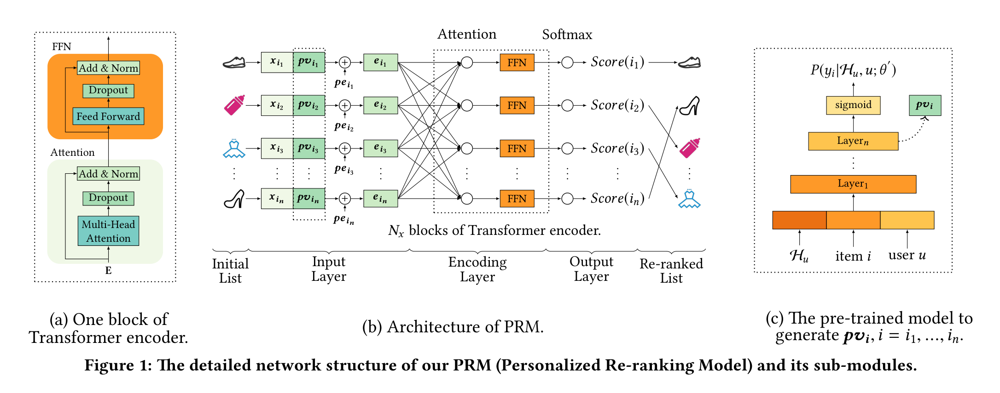
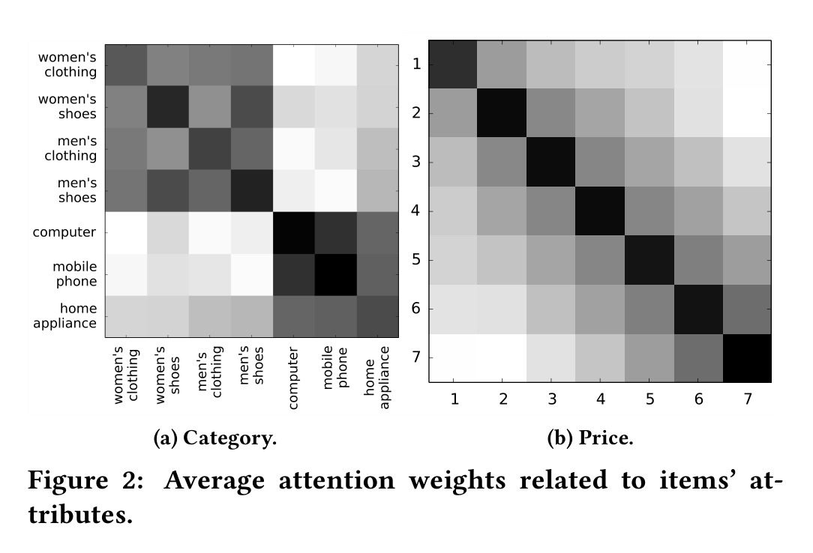
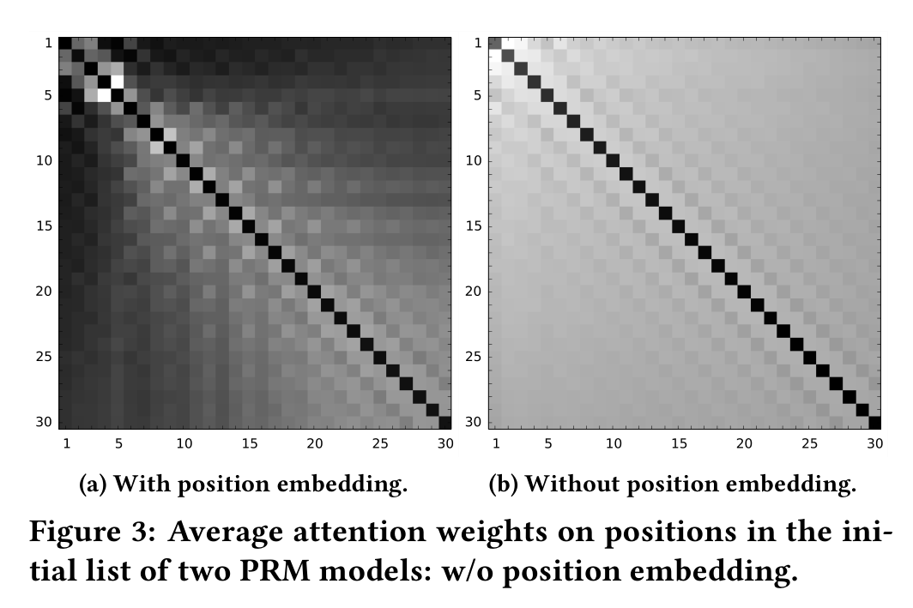

# 面向推荐的个性化重排序（Personalized Re-ranking for Recommendation）

> 常华培（Changhua Pei）¹\*、张毅（Yi Zhang）¹\*、张永峰（Yongfeng Zhang）²\*、孙飞（Fei Sun）¹、林潇（Xiao Lin）¹、孙涵啸（Hanxiao Sun）¹、吴坚（Jian Wu）¹、江鹏（Peng Jiang）³、葛俊峰（Junfeng Ge）¹、欧文武（Wenwu Ou）¹ | ¹阿里巴巴集团（Alibaba Group）、²罗格斯大学（Rutgers University）、³快手（Kwai Inc.）
>
> \*常华培（Changhua Pei）与张毅（Yi Zhang）贡献相同。张永峰（Yongfeng Zhang）为通讯作者。

本文提出并实现了一款可即插即用地挂载在任何排序算法之后、**直接用 Transformer 自注意力建模列表中任意两个 item 之间的相互影响，并通过预训练个性化向量为用户量身定制重排序打分**的个性化重排序模型（PRM）。核心发现是——**同时引入个性化模块后，在线 A/B 测试中商品交易总额（GMV）相比基线 PRM-BASE 再涨 6.65%，且排序任务越难、改进幅度越大**。

核心内容：

- 传统排序只对单个 user-item 对打分，忽略列表中 item 之间的相互影响；RNN 类重排序（如 DLCM、GlobalRerank）虽编码列表，但交互能力受编码距离限制
- 提出 PRM（Personalized Re-ranking Model，个性化重排序模型）：输入层拼接原始特征与个性化向量并注入位置嵌入，编码层堆叠 $N_x$ 个 Transformer 编码器块，输出层一步重排整个列表，可并行化、满足在线严格时延要求
- 引入个性化模块：用覆盖全平台点击日志的预训练网络生成用户个性化向量 $pv_i$ ，捕获"用户-列表"交互；FM、FFM、DeepFM、DCN、FNN、PNN 等均可作为该预训练模型的替代
- 开源了从真实电商推荐系统构建的大规模 E-commerce Re-ranking 数据集（743,720 用户、724 万 item、1,435 万条记录）

关键发现：

- Yahoo Letor 数据集上（SVMRank 初始列表），PRM-BASE 比 DLCM MAP 提升 1.7%、Precision@5 提升 1.4%；E-commerce 数据集上优势扩大到 MAP 提升 2.3%、Precision@5 提升 4.1%，**任务越难改进越大**
- E-commerce 离线实验：PRM-Personalized-Pretrain 比 PRM-BASE 在 MAP 上提升 4.5%、Precision@5 上提升 6.8%，证明个性化向量 PV 是关键增益来源
- 在线 A/B 测试：相比无重排序基线，DLCM 使浏览量 PV 提升 0.77%（对应数十亿额外曝光），PRM 进一步超越 DLCM 0.50%（PV）；PRM-Personalized-Pretrain 将 GMV 绝对提升 6.29%、点击率 CTR 提升 2.6%
- 消融实验证实位置嵌入贡献最大（移除后性能大幅下降）；而多头数 $h$ 对不同区间的改进不明显，建议仅用 1 个头以节省计算

---

## 摘要

排序（Ranking）是推荐系统中的核心任务，其目标是为用户提供有序的 item 列表。通常，排序函数从带标签的数据集上学习，以优化全局性能，并为每个单独的 item 生成一个排序分数。然而，这种方式可能是次优的，因为该打分函数逐个应用于每个 item，没有显式考虑 item 之间的相互影响，也没有考虑用户偏好或意图的差异。因此，我们为推荐系统提出了一种个性化重排序（personalized re-ranking）模型。所提出的重排序模型可以轻松地作为任意排序算法之后的一个后续模块部署，直接使用已有的排序特征向量即可。它利用 Transformer 结构高效地编码列表中所有 item 的信息，直接优化整个推荐列表。具体而言，Transformer 采用自注意力（self-attention）机制，在整张列表中直接建模任意两个 item 之间的全局关系。我们确认，通过引入预训练嵌入来为不同用户学习个性化编码函数，性能可以进一步提升。在离线基准和真实在线电商系统上的实验结果表明，所提出的重排序模型带来了显著的提升。

**CCS 概念**：• 信息系统 → 推荐系统；

**关键词**：Learning to rank; Re-ranking; Recommendation

**ACM 引用格式**：常华培（Changhua Pei）¹\*、张毅（Yi Zhang）¹\*、张永峰（Yongfeng Zhang）²、孙飞（Fei Sun）¹、林潇（Xiao Lin）¹、孙涵啸（Hanxiao Sun）¹、吴坚（Jian Wu）¹、江鹏（Peng Jiang）³、葛俊峰（Junfeng Ge）¹、欧文武（Wenwu Ou）¹。2019. 面向推荐的个性化重排序（Personalized Re-ranking for Recommendation）。载于第十三届 ACM 推荐系统会议论文集（Proceedings of Thirteenth ACM Conference on Recommender Systems），丹麦哥本哈根，2019 年 9 月 16–20 日（RecSys '19），9 页。DOI: 10.1145/3298689.3347000。

\*常华培（Changhua Pei）与张毅（Yi Zhang）贡献相同。张永峰（Yongfeng Zhang）为通讯作者。

允许在免费的情况下将本作品的部分或全部数字化（digital）或纸质副本用于个人或课堂使用，前提是副本不以盈利或商业利益为目的制作或分发，且副本首页带有本通知和完整的引用信息。归本作品中 ACM 之外其他方所有的组件版权须予尊重。允许带署名的摘录。如需以其他方式复制、再版、发布到服务器或再分发到列表，须事先获得特定许可并/或支付费用。请向 permissions@acm.org 申请许可。

RecSys '19，丹麦哥本哈根。© 2019 ACM。978-1-4503-6243-6/19/09……US\$15.00。DOI: 10.1145/3298689.3347000

## 1. 引言

排序在推荐系统中至关重要。排序算法给出的有序列表的质量对用户的满意度以及推荐系统的收益都有很大的影响。已有大量排序算法 [4,5,7,15,19,27,32] 被提出以优化排序性能。通常，推荐系统中的排序只考虑 user-item 对的特征，而不考虑列表中其他 item 的影响，尤其是那些与目标 item 并列放置的 item 的影响 [8,35]。尽管成对（pairwise）和列表式（listwise）学习排序方法试图通过将 item 对或 item 列表作为输入来解决这个问题，但它们只专注于优化损失函数，以更好地利用标签（例如点击数据）。它们并没有在特征空间中显式建模 item 之间的相互影响。

一些工作 [1,34,37] 倾向于显式建模 item 之间的相互影响，以精化（refine）先前排序算法给出的初始列表，这被称为重排序（re-ranking）。其主要思想是通过将 item 内（intra-item）的模式编码到特征空间中来构建打分函数。编码特征向量的最先进方法是基于 RNN（Recurrent Neural Network，循环神经网络）的，例如 GlobalRerank [37] 和 DLCM [1]。它们将初始列表按顺序送入基于 RNN 的结构中，并在每个时间步输出编码向量。然而，基于 RNN 的方法建模列表中 item 之间交互的能力有限。先前被编码的 item 的特征信息会随着编码距离的增大而衰减。受机器翻译中使用的 Transformer 架构 [20] 的启发，我们提出使用 Transformer 来建模 item 之间的相互影响。Transformer 结构采用自注意力机制，任意两个 item 都可以直接相互交互，而不会随着编码距离增大而衰减。同时，由于可以并行化，Transformer 的编码过程比基于 RNN 的方法更高效。

除了 item 之间的交互，推荐系统重排序还应考虑交互的个性化编码函数。推荐系统的重排序是用户特定的（user-specific），取决于用户的偏好和意图。对于对价格敏感的用户，"价格"特征之间的交互在重排序模型中应当更重要。典型的全局编码函数可能不是最优的，因为它忽略了每个用户特征分布之间的差异。例如，当用户专注于价格比较时，列表中价格不同但相似的 item 往往更聚集。而当用户没有明显购买意图时，推荐列表中的 item 往往更多样化。因此，我们在 Transformer 结构中引入一个个性化模块，用来表示用户对 item 交互的偏好和意图。在我们的个性化重排序模型中，列表中 item 与用户之间的交互可以被同时捕获。

本文的主要贡献如下：

- **问题（Problem）**。我们提出推荐系统中的个性化重排序问题，据我们所知，这是首次在大规模在线系统中显式地将个性化信息引入重排序任务。实验结果证明了将用户表示引入列表表示（list representation）以进行重排序的有效性。
- **模型（Model）**。我们采用配备个性化嵌入（personalized embedding）的 Transformer 来计算初始输入排序列表的表示，并输出重排序分数。与基于 RNN 的方法相比，自注意力机制使我们能够以更有效、更高效的方式建模任意两个 item 之间用户特定的相互影响。
- **数据（Data）**。我们发布了本文中使用的大规模数据集（E-commerce Re-ranking dataset，电商重排序数据集）。该数据集由真实的电商推荐系统构建而来。数据集中的记录包含面向用户的推荐列表，以及点击标签和用于排序的特征。
- **评估（Evaluation）**。我们进行了离线和在线实验，结果表明我们的方法显著优于最先进的方法。在线 A/B 测试表明，我们的方法为真实系统带来了更高的点击率和更多的收益。

## 2. 相关工作

我们的工作旨在精化由基础排序器（base ranker）给出的初始排序列表。在这些基础排序器中，学习排序（learning to rank，LTR）是广泛使用的方法之一。根据所用的损失函数，LTR 方法可以分为三类：逐点式（pointwise）[12,21]、成对式（pairwise）[6,18,19] 和列表式（listwise）[5,7,14,19,27,32,33]。所有这些方法都学习一个全局打分函数，其中某一特定特征的权重是全局学习的。然而，特征的权重应当能够感知不仅 item 之间、而且用户与 item 之间的交互。

与我们的工作最接近的是 [1-3,37]，它们都是重排序方法。它们将整个初始列表作为输入，并以不同的方式建模 item 之间的复杂依赖关系。[1] 使用单向 GRU [10]（Gated Recurrent Unit，门控循环单元）将整个列表的信息编码进每个 item 的表示中。[37] 使用 LSTM [17]（Long Short-Term Memory，长短期记忆网络），而 [3] 使用指针网络（pointer network）[29]，不仅编码整个列表的信息，还通过一个解码器生成有序列表。对于那些使用 GRU 或 LSTM 编码 item 依赖关系的方法，编码器的能力受限于编码距离。在本文中，我们使用类 Transformer 编码器，基于自注意力机制在 $O(1)$ 的距离上建模任意两个 item 的交互。此外，对于使用解码器顺序生成有序列表的方法，它们不适合需要严格时延标准（latency criterion）的在线排序系统。因为顺序解码器使用在时间 $t-1$ 步选出的 item 作为输入来选择时间 $t$ 步的 item，它无法并行化，需要进行 $n$ 次推理，其中 $n$ 是输出列表的长度。[2] 提出了一种可分组的（groupwise）打分函数，它在给 item 打分时可以并行化，但其计算成本很高，因为它枚举了列表中 item 的每一种可能组合。

**表 1：本文使用的符号。** 表 1 列出了本文使用的符号。

| 符号 | 描述 |
| --- | --- |
| $X$ | 特征矩阵。 |
| $PV$ | 个性化向量矩阵。 |
| $PE$ | 位置嵌入矩阵。 |
| $E$ | 输入层的输出矩阵。 |
| $R$ | 所有用户请求（requests）的集合。 |
| $I_r$ | 每个用户请求 $r \in R$ 的候选 item 集合。 |
| $S_r$ | 排序方法为每个用户请求 $r$ 生成的初始 item 列表。 |
| $H_u$ | 用户 $u$ 点击的 item 序列。 |
| $\theta, \hat{\theta}, \theta^{\prime}$ | 分别为排序、重排序和预训练模型的参数矩阵。 |
| $y_i$ | item $i$ 的点击标签。 |
| $P(y_i \mid \cdot)$ | 模型预测的 item $i$ 的点击概率。 |

（注：上述表 1 内容为对原文表 1 的中文对照译文，供读者参考。）

## 3. 重排序模型建模（RE-RANKING MODEL FORMULATION）

在本节中，我们首先给出推荐系统中学习排序和重排序方法的一些预备知识。然后，我们正式定义本文要解决的问题。本文使用的符号见表 1。

学习排序（learning to rank，常缩写为 LTR）方法被广泛用于真实系统中的排序，以为信息检索 [18,22] 和推荐 [14] 生成有序列表。LTR 方法基于 item 的特征向量学习一个全局打分函数。有了这个全局函数，LTR 方法通过对候选集中的每个 item 打分来输出一个有序列表。这个全局打分函数通常通过最小化下面这个损失函数 $L$ 来学习：

$$
L = \sum_{r \in R} \ell \left\{ y_i, P(y_i \mid x_i; \theta) \mid i \in I_r \right\} \qquad (1)
$$

其中 $R$ 是推荐所有用户请求的集合。 $I_r$ 是请求 $r \in R$ 的候选 item 集合。 $x_i$ 表示 item $i$ 的特征空间。 $y_i$ 是 item $i$ 上的标签，即是否点击。 $P(y_i \mid x_i; \theta)$ 是参数为 $\theta$ 的排序模型给出的 item $i$ 的预测点击概率。 $\ell$ 是用 $y_i$ 和 $P(y_i \mid x_i; \theta)$ 计算的损失。

然而，仅靠 $x_i$ 不足以学习一个好的打分函数。我们发现，推荐系统的排序还应考虑以下额外信息：(a) item 对之间的相互影响 [8,35]；(b) 用户与 item 之间的交互。item 对之间的相互影响可以直接从请求 $r$ 的现有 LTR 模型给出的初始列表 $S_r = [i_1, i_2, \ldots, i_n]$ 中学习。工作 [1][37][2][3] 提出了更好地利用 item 对相互信息的方法。然而，很少有工作考虑用户与 item 之间的交互。item 对相互影响的程度因用户而异。在本文中，我们引入一个个性化矩阵 $PV$ 来学习用户特定的编码函数，该函数能够建模 item 对之间个性化的相互影响。该模型的损失函数可以表示为式 (2)：

$$
L = \sum_{r \in R} \ell \left\{ y_i, P(y_i \mid X, PV; \hat{\theta}) \mid i \in S_r \right\} \qquad (2)
$$

其中 $S_r$ 是先前排序模型给出的初始列表。 $\hat{\theta}$ 是我们重排序模型的参数。 $X$ 是列表中所有 item 的特征矩阵。

## 4. 个性化重排序模型（PERSONALIZED RE-RANKING MODEL）

在本节中，我们首先概述我们提出的个性化重排序模型（PRM，Personalized Re-ranking Model，个性化重排序模型）。然后，我们详细介绍模型的每个组成部分。

### 4.1 模型架构（Model Architecture）

PRM 模型的架构如图 1 所示。该模型由三部分组成：输入层（input layer）、编码层（encoding layer）和输出层（output layer）。它以先前排序方法生成的初始 item 列表作为输入，并输出一个重排序后的列表。详细的网络结构将在以下各小节中分别介绍。

**图 1：** 我们的 PRM（个性化重排序模型）及其子模块的详细网络结构。(a) 一个 Transformer 编码器块；(b) PRM 的架构；(c) 用于生成 $pv_i$ （ $i = i_1, \ldots, i_n$ ）的预训练模型。

### 4.2 输入层（Input Layer）

输入层的目标是为初始列表中的所有 item 准备全面的表示，并将其送入编码层。首先，我们有一个由先前排序方法给定的固定长度的初始序列列表 $S = [i_1, i_2, \ldots, i_n]$ 。与先前排序方法一样，我们有一个原始特征矩阵 $X \in \mathbb{R}^{n \times d_{feature}}$ 。 $X$ 中的每一行表示每个 item $i \in S$ 的原始特征向量 $x_i$ 。

**个性化向量（Personalized Vector，PV）**。编码两个 item 的特征向量可以建模它们之间的相互影响，但这些影响在多大程度上作用于用户是未知的。因此需要学习一个用户特定的编码函数。虽然整个初始列表的表示可以部分反映用户的偏好，但对于一个强大的个性化编码函数来说，这还不够。如图 1(b) 所示，我们将原始特征矩阵 $X \in \mathbb{R}^{n \times d_{feature}}$ 与个性化矩阵 $PV \in \mathbb{R}^{n \times d_{pv}}$ 拼接起来，得到中间嵌入矩阵 $E^{\prime} \in \mathbb{R}^{n \times (d_{feature}+d_{pv})}$ ，如式 (3) 所示。 $PV$ 由一个预训练模型产生，该模型将在下面一节介绍。 $PV$ 带来的性能增益将在评估部分介绍。

$$
E^{\prime} =
\begin{bmatrix}
x_{i_1} ; pv_{i_1} \\
x_{i_2} ; pv_{i_2} \\
\vdots \\
x_{i_n} ; pv_{i_n}
\end{bmatrix}
\qquad (3)
$$

**位置嵌入（Position Embedding，PE）**。为了利用初始列表中的序列信息，我们向输入嵌入中注入一个位置嵌入 $PE \in \mathbb{R}^{n \times (d_{feature}+d_{pv})}$ 。然后，编码层的嵌入矩阵可以用式 (4) 计算。在本文中，我们使用一个可学习的（learnable） $PE$ ，我们发现它略优于 [28] 中使用的固定位置嵌入。

$$
E^{\prime\prime} =
\begin{bmatrix}
x_{i_1} ; pv_{i_1} \\
x_{i_2} ; pv_{i_2} \\
\vdots \\
x_{i_n} ; pv_{i_n}
\end{bmatrix}
+
\begin{bmatrix}
pe_{i_1} \\
pe_{i_2} \\
\vdots \\
pe_{i_n}
\end{bmatrix}
\qquad (4)
$$

最后，我们用一个简单的前馈网络将特征矩阵 $E^{\prime\prime} \in \mathbb{R}^{n \times (d_{feature}+d_{pv})}$ 转换为 $E \in \mathbb{R}^{n \times d}$ ，其中 $d$ 是编码层每个输入向量的 latent 维度。 $E$ 可以表示为式 (5)：

$$
E = E^{\prime\prime} W^{E} + b^{E} \qquad (5)
$$

其中 $W^{E} \in \mathbb{R}^{(d_{feature}+d_{pv}) \times d}$ 是投影矩阵， $b^{E}$ 是 $d$ 维向量。

### 4.3 编码层（Encoding Layer）

图 1(a) 中编码层的目标是整合 item 对的相互影响和其他额外信息，包括用户偏好和初始列表 $S$ 的排序顺序。为了实现这个目标，我们采用类 Transformer 编码器，因为 Transformer [28] 已被证明在许多 NLP（Natural Language Processing，自然语言处理）任务中很有效，尤其是与基于 RNN 的方法 [10,11,17] 相比，机器翻译因其强大的编码和解码能力而获益更多。Transformer 中的自注意力机制特别适合我们的重排序任务，因为它直接建模任意两个 item 的相互影响，而不管它们之间的距离有多远。没有距离衰减，Transformer 可以捕获初始列表中相距较远的 item 之间更多的交互。如图 1(b) 所示，我们的编码模块由 $N_x$ 个 Transformer 编码器块组成。每个块（图 1(a)）包含一个注意力层和一个前馈网络（FFN，Feed-Forward Network，前馈网络）层。

**注意力层（Attention Layer）**。我们在本文中使用的注意力函数定义为式 (6)：

$$
\text{Attention}(Q, K, V) = \text{softmax}\left( \frac{Q K^{T}}{\sqrt{d}} \right) V , \qquad (6)
$$

其中矩阵 $Q$ 、 $K$ 、 $V$ 分别表示查询（queries）、键（keys）和值（values）。 $d$ 是矩阵 $K$ 的维度，以避免内积值过大。 $\text{softmax}$ 用于将内积的值转换为值向量 $V$ 的加权权重。在本文中，我们使用自注意力，即 $Q$ 、 $K$ 和 $V$ 由相同的矩阵投影而来。

为了建模更复杂的相互影响，我们使用如式 (7) 所示的多头注意力（multi-head attention）：

$$
S^{\prime} = \text{MH}(E) = \text{Concat}(head_1, \ldots, head_h) W^{O}
$$
$$
head_i = \text{Attention}(E W^{Q}, E W^{K}, E W^{V}) , \qquad (7)
$$

其中 $W^{Q}, W^{K}, W^{V} \in \mathbb{R}^{d \times d}$ 。 $W^{O} \in \mathbb{R}^{h d \times d_{model}}$ 是投影矩阵。 $h$ 是头（header）的数量。不同 $h$ 值的影响将在下一节的消融研究中讨论。

**前馈网络（Feed-Forward Network）**。这个逐位置（position-wise）前馈网络（FFN）的功能主要是通过非线性以及输入向量不同维度之间的交互来增强模型。

**堆叠编码层（Stacking the Encoding Layer）**。这里我们使用注意力模块后接逐位置 FFN 作为 Transformer [28] 编码器的一个块。通过堆叠多个块，我们可以获得更复杂、更高阶的相互信息。

### 4.4 输出层（Output Layer）

输出层的功能主要是为每个 item $i = i_1, \ldots, i_n$ 生成一个分数（在图 1(b) 中标记为 Score(i)）。我们使用一个线性层后接一个 $\text{softmax}$ 层。 $\text{softmax}$ 层的输出是每个 item 的点击概率，标记为 $P(y_i \mid X, PV; \hat{\theta})$ 。我们使用 $P(y_i \mid X, PV; \hat{\theta})$ 作为 Score(i)，以一步（one-step）重排序这些 item。Score(i) 的公式为：

$$
\text{Score}(i) = P(y_i \mid X, PV; \hat{\theta}) = \text{softmax}\left( F^{(N_x)} W^{F} + b^{F} \right) , i \in S_r \qquad (8)
$$

其中 $F^{(N_x)}$ 是 $N_x$ 个 Transformer 编码器块的输出。 $W^{F}$ 是可学习的投影矩阵， $b^{F}$ 是偏置项。 $n$ 是初始列表中的 item 数量。

在训练过程中，我们使用点击数据作为标签，并最小化式 (9) 所示的损失函数：

$$
L = -\sum_{r \in R} \sum_{i \in S_r} y_i \log \left( P(y_i \mid X, PV; \hat{\theta}) \right) \qquad (9)
$$

### 4.5 个性化模块（Personalized Module）

在本节中，我们介绍计算个性化矩阵 $PV$ 的方法，它表示用户与 item 之间的交互。最直接的方法是让 $PV$ 与 PRM 模型一起通过重排序损失以端到端（end-to-end）的方式联合学习。然而，如第 3 节所述，重排序任务是精化先前排序方法的输出。在重排序任务上学习的任务特定表示缺乏用户的通用偏好。因此，我们利用一个预训练的神经网络来产生用户的个性化嵌入 $PV$ ，然后将其用作 PRM 模型的额外特征。这个预训练的神经网络从平台的全部点击日志中学习。图 1(c) 展示了本文使用的预训练模型的结构。这个 sigmoid 层在给定用户的全部行为历史（ $H_u$ ）和用户的侧信息（side information）的情况下，输出用户 $u$ 对 item $i$ 的点击概率（ $P(y_i \mid H_u, u; \theta^{\prime})$ ）。用户的侧信息包括性别、年龄和购买力等。该模型的损失通过一个逐点（point-wise）交叉熵函数计算，如式 (10) 所示：

$$
L = \sum_{i \in D} \left( y_i \log \left( P(y_i \mid H_u, u; \theta^{\prime}) \right) + (1 - y_i) \log \left( 1 - P(y_i \mid H_u, u; \theta^{\prime}) \right) \right) , \qquad (10)
$$

其中 $D$ 是平台上展示给用户 $u$ 的 item 集合。 $\theta^{\prime}$ 是预训练模型的参数矩阵。 $y_i$ 是 item $i$ 上的标签（是否点击）。受工作 [13] 的启发，我们采用 sigmoid 层之前的隐藏向量作为个性化向量 $pv_i$ （图 1(c)），将其输入到我们的 PRM 模型中。

图 1(c) 展示了预训练模型的一种可能架构，其他通用模型，如 FM [25]（Factorization Machines，因子分解机）、FFM [23]（Field-aware Factorization Machines，场感知因子分解机）、DeepFM [16]、DCN [30]（Deep & Cross Network，深度交叉网络）、FNN [36]（Factorization-machine supported Neural Network，因子分解机支持的神经网络）和 PNN [24]（Product-based Neural Networks，基于乘积的神经网络），也可以作为生成 $PV$ 的替代方案。

## 5. 实验结果（EXPERIMENTAL RESULTS）

在本节中，我们首先介绍用于评估的数据集和基线方法。然后，我们在这两个数据集上将我们的方法与基线方法进行比较，以评估 PRM 模型的有效性。同时，我们还进行了消融研究（ablation study），帮助理解我们模型中的哪一部分对整体性能贡献最大。

### 5.1 数据集（Datasets）

我们基于两个数据集评估我们的方法：Yahoo! Webscope v2.0 set 11（缩写为 Yahoo Letor 数据集）² 和 E-commerce Re-ranking 数据集。据我们所知，目前还没有公开可用的、带上下文信息的推荐重排序数据集。因此，我们从流行的电商平台构建了 E-commerce Re-ranking 数据集。两个数据集的概览如表 2 所示。

**Yahoo Letor 数据集**。我们采用与 Seq2Slate [3] 相同的方法，将 Yahoo Letor 数据集处理成适合推荐排序模型的形式。首先，我们用一个阈值 $T_b$ 将评分（0 到 4）转换为二值标签。其次，我们用一个衰减因子 $\eta$ 来模拟 item 的曝光概率（impression probabilities）。Yahoo Letor 数据集中的所有文档都由专家在假设每个查询下的所有文档都能被用户完整查看的前提下进行评分。然而，在真实世界的推荐场景中，用户是以自上而下的方式查看 item 的。由于移动 App 的屏幕只能显示有限数量的 item，一个 item 的排序位置越高，其被用户查看的概率就越小。在本文中，我们使用 $1 / pos(i)^{\eta}$ 作为衰减概率，其中 $pos(i)$ 是 item $i$ 在初始列表中的排序位置。

**E-commerce Re-ranking 数据集**。该数据集包含来自真实世界推荐系统的大规模点击流数据形式的记录。数据集中的每条记录都包含面向每个用户的推荐列表，包括用户的基本信息、点击标签和用于排序的原始特征。

¹ http://webscope.sandbox.yahoo.com

² 我们的数据集可在 https://github.com/rank2rec/rerank 获取。

**表 2：数据集概览。** 表 2 展示了两个数据集的概览。

| | Yahoo Letor 数据集 | E-commerce Re-ranking 数据集 |
| --- | --- | --- |
| #Users（用户数） | - | 743,720 |
| #Docs/Items（文档/item 数） | 709,877 | 7,246,323 |
| #Records（记录数） | 29,921 | 14,350,968 |
| Relevance/Feedback（相关性/反馈） | {0,1,2,3,4} | {0,1} |

### 5.2 基线方法（Baselines）

学习排序（LTR）方法和重排序方法都可以作为我们的基线。

**LTR**。LTR 方法用于两个任务。首先，LTR 方法可以为每个用户请求 $r$ 从候选集 $I_r$ 生成重排序模型的初始列表 $S_r$ 。其次，那些使用成对或列表式损失函数的 LTR 方法可以将初始列表 $S_r$ 作为输入并再次执行排序算法，从而充当重排序方法。本文使用的代表性 LTR 方法包括：

- **SVMRank [19]**：这是一种代表性的学习排序方法，它使用成对损失来建模打分函数。
- **LambdaMart [5]**：这是一种代表性的学习排序方法，它使用列表式损失来建模打分函数。根据 [31] 的评估，在那些配备列表式损失函数的 LTR 方法中，LambdaMart 是最先进的 LTR 方法。
- **基于 DNN 的 LTR**：这是部署在我们的在线推荐系统中的学习排序方法。它使用标准的 Wide&Deep 网络结构 [9]，通过逐点损失函数来建模打分函数。

**重排序（Re-ranking）**。如相关工作部分所述，现有的重排序方法包括 DLCM [1]、Seq2Slate [3] 和 GlobalRerank [37]。DLCM [1] 和 GlobalRerank [37] 专注于信息检索中的重排序。Seq2Slate [3] 专注于推荐和信息检索中的重排序。在本文中，我们只选择 DLCM 作为基线方法。Seq2Slate 和 GlobalRerank 未被选为基线，因为它们都使用解码器结构来生成重排序列表。Seq2Slate 使用指针网络顺序生成重排序列表。GlobalRerank 使用配备注意力机制的 RNN 作为解码器。解码器结构逐个输出 item。一个 item 是否被选中取决于在它之前被选中的 item。因此，Seq2Slate 和 GlobalRerank 都无法在在线推理中并行化。Seq2Slate 和 GlobalRerank 在推理阶段的时间复杂度为 $O(n) \times RT$ ，其中 $n$ 是初始列表的长度， $RT$ 是单个排序或重排序请求的时间。由于在线推荐服务具有严格的时延标准，用 Seq2Slate 和 GlobalRerank 进行重排序的时延是不可接受的。

- **DLCM [1]**：这是一种用于信息检索的重排序模型，基于 LTR 方法生成的初始列表。它使用 GRU 将局部上下文信息编码成一个全局向量。结合全局向量和每个特征向量，它学习到的打分函数比 LTR 的全局排序函数更强大。

### 5.3 评估指标（Evaluation Metrics）

对于离线评估，我们使用精确率（Precision）和 MAP（Mean Average Precision，平均精度均值）来比较不同的方法。更具体地说，精确率使用 Precision@5、Precision@10，MAP 使用 MAP@5、MAP@10 和 MAP@30。由于我们实验中初始列表的最大长度是 30，MAP@30 表示总的 MAP，在本文中记为 MAP。各指标的定义如下。

Precision@k 定义为所有测试样本中，top-k 推荐 item 中被点击 item 所占的比例，如式 (11) 所示：

$$
\text{Precision@}k = \frac{1}{|R|} \sum_{r \in R} \frac{\sum_{i=1}^{k} \mathbb{1}\left( S_r(i) \right)}{k} \qquad (11)
$$

其中 $R$ 是测试数据集中所有用户请求的集合。 $S_r$ 是重排序模型为每个请求 $r \in R$ 给出的有序 item 列表， $S_r(i)$ 是其中的第 $i$ 个 item。 $\mathbb{1}$ 是指示函数，表示 item $i$ 是否被点击。

MAP@k 是测试数据集中所有排名列表在截断（cut off）到 $k$ 时的平均精度均值（mean average precision）的缩写。其定义如下：

$$
\text{MAP@}k = \frac{1}{|R|} \sum_{r \in R} \frac{\sum_{i=1}^{k} \text{Precision@}i \cdot \mathbb{1}\left( S_r(i) \right)}{k} \qquad (12)
$$

对于在线 A/B 测试，我们使用 PV（Page View，页面浏览量）、IPV（Item Page View，item 页面浏览量）、CTR（Click-Through Rate，点击率）和 GMV（Gross Merchandise Value，商品交易总额）作为指标。PV 和 IPV 定义为用户查看和点击的 item 总数。CTR 是点击率，可通过 IPV/PV 计算。GMV 是用户在推荐 item 上花费的总金额（收益）。

### 5.4 实验设置（Experimental Settings）

对于基线和我们的 PRM 模型，我们对那些关键的超参数使用相同的取值。隐藏维度 $d_{model}$ 在 Yahoo Letor 数据集上设置为 1024，在 E-commerce Re-ranking 数据集上设置为 64。我们 PRM 模型中 Adam 优化器的学习率与 [28] 相同。如式 (9) 所示，使用负对数似然（Negative Log Likelihood，NLL）损失函数。 $p_{dropout}$ 设置为 0.1。批大小（batch size）在 Yahoo Letor 数据集上设置为 256，在 E-commerce Re-ranking 数据集上设置为 512。这些设置是通过对基线进行微调以获得更好性能而得到的。我们还尝试了不同的实验设置，结果与当前设置一致，故此处省略。其余属于我们模型定制部分的设置，将在评估部分的相应位置列出。

### 5.5 离线实验（Offline Experiments）

在本节中，我们首先在 Yahoo Letor 数据集和 E-commerce Re-ranking 数据集上进行离线评估。然后，我们展示在线 A/B 测试的结果。我们还进行消融研究，以帮助找出我们 PRM 模型中的哪一部分对性能贡献最大。

#### 5.5.1 Yahoo Letor 数据集上的离线评估

在本节中，我们在 Yahoo Letor 数据集上进行评估，讨论以下问题：

- RQ0：我们的 PRM 模型是否优于最先进的方法？为什么？
- RQ1：性能是否会根据不同 LTR 方法生成的初始列表而变化？

评估结果如表 3 所示。基于分别由 LambdaMART 和 SVMRank 生成的两种不同初始列表，我们比较了各种基线和我们的 PRM-BASE 模型。PRM-BASE 是我们 PRM 模型去掉个性化模块后的变体。注意，Yahoo Letor 数据集不包含与用户相关的信息，因此我们只进行 PRM-BASE 的比较。SVMRank 和 LambdaMart 也被用作重排序方法。对于 SVMRank，我们使用 [19] 中的实现。对于 LambdaMart，我们使用 RankLib ³ 的实现。

**表 3：Yahoo Letor 数据集上的离线评估结果。** 表 3 展示了在 Yahoo Letor 数据集上、分别以 SVMRank 和 LambdaMART 生成的初始列表为基础进行重排序的结果。

| 初始列表 | 重排序 | Precision@5(%) | Precision@10(%) | MAP@5(%) | MAP@10(%) | MAP(%) |
| --- | --- | --- | --- | --- | --- | --- |
| SVMRank | SVMRank | 50.42 | 42.25 | 73.71 | 68.28 | 62.14 |
| SVMRank | LambdaMART | 51.35 | 43.08 | 74.94 | 69.54 | 63.38 |
| SVMRank | DLCM | 52.54 | 43.26 | 76.52 | 70.86 | 64.50 |
| SVMRank | PRM-BASE | 53.29 | 43.66 | 77.62 | 72.02 | 65.60 |
| LambdaMART | SVMRank | 50.41 | 42.34 | 73.82 | 68.27 | 62.13 |
| LambdaMART | LambdaMART | 52.04 | 43.00 | 75.77 | 70.49 | 64.04 |
| LambdaMART | DLCM | 52.54 | 43.16 | 77.81 | 71.88 | 65.24 |
| LambdaMART | PRM-BASE | 53.63 | 43.41 | 78.62 | 72.67 | 65.72 |

表 3 表明，与所有基线相比，我们的 PRM-BASE 取得了稳定且显著的性能提升。当基于 SVMRank 生成的初始列表时，PRM-BASE 在 MAP 上比 DLCM 提升 1.7%，在 Precision@5 上提升 1.4%。与 SVMRank 相比，差距更大，MAP 提升 5.6%，Precision@5 提升 5.7%。当基于 LambdaMART 生成的初始列表时，PRM-BASE 在 MAP 上比 DLCM 提升 0.7%，在 Precision@5 上提升 2.1%。与 LambdaMART 相比，PRM-BASE 在 MAP 上取得 2.6% 的提升，在 Precision@5 上取得 3.1% 的提升。

PRM-BASE 使用与 DLCM 相同的训练数据，并且不包含个性化模块。其相对于 DLCM 的性能增益主要来自 Transformer 强大的编码能力。多头注意力机制在建模两个 item 之间的相互影响方面表现更好，尤其是当编码列表的长度变长时 [20]。在我们的模型中，注意力机制可以在 $O(1)$ 的编码距离内建模任意 item 对的交互。

由于 PRM-BASE 使用类 Transformer 结构，有许多子模块可能对性能有所贡献。我们进行消融研究，以帮助我们理解哪个子设计在击败基线方面帮助最大。消融研究在 SVMRank 生成的初始列表上进行。使用 LambdaMART 生成的初始列表时也发现了类似的结果，由于篇幅有限，我们在本文中省略这些结果。表 4 展示了三个部分的消融结果：第一部分（第一行）显示基线 DLCM 的性能。第二部分（第二行）"Default" 是我们的 PRM-BASE 模型的最佳性能。第三部分（其余行）展示了我们 PRM 模型不同的消融变体，包括：移除位置嵌入（PE）、移除残差连接（RC）、移除 dropout 层、使用不同数量的块以及使用不同头数量的多头注意力。注意，我们在 "Default" PRM 模型中设置 $b=4$ ， $h=3$ 。

**表 4：在 Yahoo Letor 数据集上、以 SVMRank 生成的初始列表进行的 PRM-BASE 消融研究。** 表中所有数字均已乘以 100。

| 变体 | P@5 | P@10 | MAP@5 | MAP@10 | MAP |
| --- | --- | --- | --- | --- | --- |
| DLCM | 52.54 | 43.26 | 76.52 | 70.86 | 64.50 |
| Default(b=4, h=3) | 53.29 | 43.66 | 77.62 | 72.02 | 65.60 |
| Remove PE | 52.55 | 43.56 | 76.11 | 70.74 | 64.73 |
| Remove RC | 53.24 | 43.63 | 77.52 | 71.92 | 65.52 |
| Remove Dropout | 53.17 | 43.42 | 77.41 | 71.80 | 65.17 |
| Block(b=1) | 53.12 | 43.59 | 77.58 | 71.91 | 65.49 |
| Block(b=2) | 53.19 | 43.58 | 77.51 | 71.86 | 65.49 |
| Block(b=6) | 53.22 | 43.63 | 77.64 | 72.02 | 65.61 |
| Block(b=8) | 52.85 | 43.32 | 77.43 | 71.65 | 65.14 |
| Multiheads(h=1) | 53.17 | 43.67 | 77.65 | 71.96 | 65.55 |
| Multiheads(h=2) | 53.29 | 43.60 | 77.68 | 72.00 | 65.57 |
| Multiheads(h=4) | 53.20 | 43.61 | 77.72 | 72.00 | 65.58 |

如表 4 所示，移除位置嵌入后，我们模型的性能大幅下降。这证实了初始列表给出的序列信息的重要性。移除位置嵌入后，我们的模型是从候选集而不是有序列表学习打分函数的。注意，即使没有位置嵌入，我们的 PRM-BASE 仍然取得与 DLCM 相当的性能，这进一步证实我们的 PRM-BASE 模型比 DLCM 能更有效地编码初始列表。

移除残差连接和 dropout 层时，我们模型的 MAP 分别略微下降 0.1% 和 0.7%，这表明我们的模型对梯度消失（gradients vanishing）和过拟合（overfitting）等问题的敏感性较低。我们模型的性能首先随块数量的增加（1→2→4）而上升，之后（4→6→8）又下降，因为堆叠 8 个编码块时发生了过拟合。

我们还尝试了多头注意力层的不同设置（ $h = 1, 2, 3, 4$ ）。在表 4 中未观察到显著的改善，这与从 NLP 任务 [26] 中得出的结论不同。NLP 中的实验表明，在使用多头注意力机制时，使用更多的头通常是有帮助的，因为可以捕获更多的信息，原因如下。(1) 从式 (7) 中我们发现，每个头的功能是将原始特征向量映射到一个不同的子空间。因此，使用更多的头，我们可以在不同的子空间中建模更多的 item 交互。(2) [26] 指出，使用更多的头有助于编码长序列的信息。这是合理的，因为某个 item 的输出向量是列表中所有 item 向量的加权和。当序列变长时，列表中的每个 item 对输出向量的贡献变小。然而，在我们的重排序设置中，初始列表中的所有 item 都是高度同质的。将原始特征向量映射到更多不同的子空间中，只有微小的改进。因此，我们建议只使用一个头以节省计算成本，因为性能改进并不明显。

#### 5.5.2 E-commerce Re-ranking 数据集上的离线评估

我们在 E-commerce Re-ranking 数据集上进行离线评估，以回答以下问题。

- RQ2：配备个性化模块的 PRM 模型的性能如何？

评估结果如表 5 所示。对于我们的 PRM 模型，我们不仅评估了 PRM-BASE 的性能，还评估了配备预训练个性化向量 $PV$ 的模型变体的性能，标记为 PRM-Personalized-Pretrain。由于我们在 Yahoo Letor 数据集上的先前评估已经确认我们的模型和 DLCM 在所有指标上都取得更好的性能，并且 DLCM [1] 也有一致的结果，因此我们省略了在 E-commerce Re-ranking 数据集上与 SVMRank 和 LambdaMART 的比较。初始列表由一个部署在我们的真实世界推荐系统中的基于 DNN 的 LTR 方法生成。

**表 5：E-commerce Re-ranking 数据集上的离线评估结果。** 表 5 展示了在 E-commerce Re-ranking 数据集上、以 DNN-based LTR 生成的初始列表为基础进行重排序的结果。

| 初始列表 | 重排序 | Precision@5 | Precision@10 | MAP@5(%) | MAP@10(%) | MAP(%) |
| --- | --- | --- | --- | --- | --- | --- |
| DNN-based LTR | DLCM | 12.21 | 9.73 | 29.32 | 30.28 | 28.19 |
| DNN-based LTR | PRM-BASE | 12.71 | 9.99 | 29.80 | 30.83 | 28.85 |
| DNN-based LTR | PRM-Personalized-Pretrain | 13.58 | 10.52 | 31.18 | 32.12 | 30.15 |

表 5 在比较 PRM-BASE 与 DLCM 时显示了与表 3 一致的结果。我们的 PRM-BASE 在 MAP 上比 DLCM 提升 2.3%，在 Precision@5 上提升 4.1%。回想在 Yahoo Letor 数据集上，PRM-BASE 在 MAP 上取得 1.7% 的提升，在 Precision@5 上取得 1.4% 的提升。我们在 E-commerce Re-ranking 数据集上的性能增益远大于在 Yahoo Letor 数据集上的。这跟 Yahoo Letor 数据集的性质高度相关。我们对 Yahoo Letor 数据集的统计显示，平均点击率为 30%，这意味着对于每个有 30 个推荐文档的查询，大约有 9 个文档被用户点击。然而，我们真实世界的 E-commerce Re-ranking 数据集中的平均点击率不超过 5%。这意味着在 Yahoo Letor 数据集上的排序比在 E-commerce Re-ranking 数据集上容易得多。这一点也被相同排序方法在两个数据集上取得的 MAP 值所证实：DLCM 在 Yahoo Letor 数据集上可以达到 0.64 的 MAP，但在 E-commerce Re-ranking 数据集上只能达到 0.28 的 MAP。结合表 5 和表 3，我们发现排序任务越难，我们 PRM 模型的改进就越大。

表 5 表明，与 PRM-BASE 相比，我们的 PRM-Personalized-Pretrain 取得了显著的性能提升。PRM-Personalized-Pretrain 在 MAP 上比 PRM-BASE 提升 4.5%，在 Precision@5 上提升 6.8%。这主要来自个性化向量 $PV$ ，它由图 1(c) 所示架构的预训练模型学习得到。PRM-Personalized-Pretrain 有两个优点：(1) 预训练模型可以充分利用更长时期的用户日志，以提供更通用、更具代表性的用户偏好嵌入。(2) 配备长期且通用的用户嵌入后，我们的 PRM 模型能够学习更好的用户特定编码函数，它可以更精确地捕获每个用户的 item 对相互影响。注意，预训练模型的架构与我们的 PRM 模型耦合度不高，其他通用模型 [16,23,24,30,36] 也可以用作生成 $PV$ 的替代方案。

### 5.6 在线实验（Online Experiments）

我们还在一个真实世界的电商推荐系统上，针对在线指标（包括 PV、IPV、CTR 和 GMV）进行了在线 A/B 测试。这些指标的含义在前面的"评估指标"一节中已经解释过。这些指标评估的是用户在推荐系统中查看（PV）、点击（IPV、CTR）和购买（GMV）的意愿。对于每个算法，在线测试都有数十万用户和数百万个请求。

表 6 展示了三种方法相对于一个在线基础排序器（基于 DNN 的 LTR）的相对提升。首先，在线 A/B 测试表明，无论使用哪种重排序方法，重排序都有助于提升在线指标。我们可以再次得出结论：重排序通过考虑初始列表中 item 的相互影响来帮助提升性能。值得注意的是，PV 上 0.77% 的提升（DLCM 对比无重排序）在我们的在线系统中是显著的，因为它意味着使用重排序方法后，用户会多查看大约数十亿个额外的 item。其次，我们可以得出结论，与 DLCM 相比，我们的 PRM-BASE 模型在查看的 item 上带来了额外的 0.50% 的绝对提升，在点击的 item 上带来了额外的 0.69% 的绝对提升。最后，通过使用个性化模块，我们的 PRM-Personalized-Pretrain 模型相比 PRM-BASE 可以将 GMV 进一步绝对提升 6.29%。回想在 E-commerce Re-ranking 数据集上的离线实验，PRM-Personalized-Pretrain 相比 PRM-BASE 在 MAP 上有 4.5% 的提升。该结果表明，带有预训练用户表示的个性化编码函数可以帮助捕获更精确的 item 对交互，并为重排序方法带来显著的性能增益。

**表 6：在在线 A/B 测试中，与不含重排序方法的基于 DNN 的 LTR 相比的性能提升。** 表 6 展示了三种方法相对在线基础排序器（不含重排序的基于 DNN 的 LTR）的性能提升。

| 重排序 | PV | IPV | CTR | GMV |
| --- | --- | --- | --- | --- |
| DLCM | 0.77% | 1.75% | 0.97% | 0.13% |
| PRM-BASE | 1.27% | 2.44% | 1.16% | 0.36% |
| PRM-Personalized-Pretrain | 3.01% | 5.69% | 2.6% | 6.65% |

### 5.7 可视化注意力权重（Visualizing Attention Weights）

我们可视化我们的模型学习到的注意力权重，以回答以下问题。

- RQ3：自注意力机制能否学习到关于不同方面（例如 item 的位置和特征）的有意义信息？

**关于特征的注意力（Attention on Characteristics）**。我们首先可视化两个特征（类别和价格）上 item 之间的平均注意力权重。在测试数据集上计算的结果如图 2 所示。热力图（heatmap）中的每个块代表属于七个主要类别的 item 之间的平均注意力权重。块的颜色越深，权重越大。从图 2(a) 我们可以得出结论，注意力机制可以成功捕获不同类别中的相互影响。类别相似的 item 往往具有更大的注意力权重，表示它们之间的相互影响更大。例如，"男鞋"（men's shoes）对"女鞋"（women's shoes）的影响大于对"电脑"（computer）的影响。同样容易理解，"电脑"、"手机"（mobile phone）和"家用电器"（home appliance）彼此之间具有很大的注意力权重，因为它们都是电子产品。在图 2(b) 中可以观察到类似的情况。在图 2(b) 中，我们根据 item 的价格将其分为 7 个等级。item 之间的价格越接近，相互影响就越大。

**图 2：** 与 item 属性相关的平均注意力权重。(a) 类别；(b) 价格。

**关于位置的注意力（Attention on Positions）**。初始列表中不同位置上的平均注意力权重的可视化如图 3 所示。首先，图 3(a) 显示，我们模型中的自注意力机制可以捕获相互影响，而不管编码距离以及推荐列表中的位置偏差如何。列表中排名靠前的 item 通常更可能被点击，因此对列表尾部的 item 有更大的影响。例如，我们观察到，第一个位置的 item 对第 30 个位置 item 的影响大于对第 26 个位置 item 的影响，尽管后者更接近它。与图 3(b) 相比，位置嵌入的效果也很明显，图 3(b) 中每个位置之间的注意力权重分布得更均匀。

**图 3：** 两个 PRM 模型（有/无位置嵌入）在初始列表中的位置上的平均注意力权重。(a) 有位置嵌入；(b) 无位置嵌入。

## 6. 结论与未来工作（CONCLUSION AND FUTURE WORK）

在本文中，我们提出了一个个性化重排序模型（PRM），用以精化由最先进的学习排序方法给出的初始列表。在重排序模型中，我们使用 Transformer 网络来编码 item 之间的依赖关系以及用户与 item 之间的交互。个性化向量可以为重排序模型带来进一步的性能提升。在线和离线实验都表明，我们的 PRM 模型可以大大提升在公开基准数据集和我们发布的真实世界数据集上的排序性能。我们发布的真实世界数据集可以使研究者能够研究推荐系统的排序/重排序算法。

我们的工作显式地在特征空间中建模复杂的 item-item 关系。我们相信，在标签空间中的优化也会有所帮助。另一个未来方向是通过重排序学习多样化（to diversify）。尽管在实践中，我们的模型并不伤害排序的多样性。但值得尝试将多样化的目标引入我们的重排序模型中。我们将在未来的工作中进一步探索这个方向。

## 参考文献（REFERENCES）

[1] Qingyao Ai, Keping Bi, Jiafeng Guo, and W Bruce Croft. 2018. Learning a Deep Listwise Context Model for Ranking Refinement. arXiv preprint arXiv:1804.05936 (2018).

[2] Qingyao Ai, Xuanhui Wang, Nadav Golbandi, Michael Bendersky, and Marc Najork. 2018. Learning groupwise scoring functions using deep neural networks. arXiv preprint arXiv:1811.04415 (2018).

[3] Irwan Bello, Sayali Kulkarni, Sagar Jain, Craig Boutilier, Ed Chi, Elad Eban, Xiyang Luo, Alan Mackey, and Ofer Meshi. 2018. Seq2Slate: Re-ranking and Slate Optimization with RNNs. arXiv preprint arXiv:1810.02019 (2018).

[4] Chris Burges, Tal Shaked, Erin Renshaw, Ari Lazier, Mat Deeds, Nicole Hamilton, and Greg Hullender. 2005. Learning to rank using gradient descent. In Proceedings of the 22nd international conference on Machine learning. ACM, 89–96.

[5] Christopher JC Burges. 2010. From ranknet to lambdarank to lambdamart: An overview. Learning 11, 23-581 (2010), 81.

[6] Christopher J Burges, Robert Ragno, and Quoc V Le. 2007. Learning to rank with nonsmooth cost functions. In Advances in neural information processing systems. 193–200.

[7] Zhe Cao, Tao Qin, Tie-Yan Liu, Ming-Feng Tsai, and Hang Li. 2007. Learning to rank: from pairwise approach to listwise approach. In Proceedings of the 24th international conference on Machine learning. ACM, 129–136.

[8] Jaime Carbonell and Jade Goldstein. 1998. The use of MMR, diversity-based reranking for reordering documents and producing summaries. In Proceedings of the 21st annual international ACM SIGIR conference on Research and development in information retrieval. ACM, 335–336.

[9] Heng-Tze Cheng, Levent Koc, Jeremiah Harmsen, Tal Shaked, Tushar Chandra, Hrishi Aradhye, Glen Anderson, Greg Corrado, Wei Chai, Mustafa Ispir, Rohan Anil, Zakaria Haque, Lichan Hong, Vihan Jain, Xiaobing Liu, and Hemal Shah. 2016. Wide & Deep Learning for Recommender Systems. In Proceedings of the 1st Workshop on Deep Learning for Recommender Systems (DLRS 2016). ACM, New York, NY, USA, 7–10. https://doi.org/10.1145/2988450.2988454

[10] Kyunghyun Cho, Bart Van Merriënboer, Dzmitry Bahdanau, and Yoshua Bengio. 2014. On the properties of neural machine translation: Encoder-decoder approaches. arXiv preprint arXiv:1409.1259 (2014).

[11] Kyunghyun Cho, Bart Van Merriënboer, Caglar Gulcehre, Dzmitry Bahdanau, Fethi Bougares, Holger Schwenk, and Yoshua Bengio. 2014. Learning phrase representations using RNN encoder-decoder for statistical machine translation. arXiv preprint arXiv:1406.1078 (2014).

[12] David Cossock and Tong Zhang. 2008. Statistical analysis of Bayes optimal subset ranking. IEEE Transactions on Information Theory 54, 11 (2008), 5140–5154.

[13] Paul Covington, Jay Adams, and Emre Sargin. 2016. Deep neural networks for youtube recommendations. In Proceedings of the 10th ACM Conference on Recommender Systems. ACM, 191–198.

[14] Yajuan Duan, Long Jiang, Tao Qin, Ming Zhou, and Heung-Yeung Shum. 2010. An empirical study on learning to rank of tweets. In Proceedings of the 23rd International Conference on Computational Linguistics. Association for Computational Linguistics, 295–303.

[15] Jerome H Friedman. 2001. Greedy function approximation: a gradient boosting machine. Annals of statistics (2001), 1189–1232.

[16] Huifeng Guo, Ruiming Tang, Yunming Ye, Zhenguo Li, and Xiuqiang He. 2017. DeepFM: A Factorization-machine Based Neural Network for CTR Prediction. In Proceedings of the 26th International Joint Conference on Artificial Intelligence (IJCAI'17). AAAI Press, 1725–1731. http://dl.acm.org/citation.cfm?id=3172077.3172127

[17] Sepp Hochreiter and Jürgen Schmidhuber. 1997. Long Short-Term Memory. Neural Computation 9, 8 (Nov. 1997), 1735–1780.

[18] Torsten Joachims. 2002. Optimizing search engines using clickthrough data. In Proceedings of the eighth ACM SIGKDD international conference on Knowledge discovery and data mining. ACM, 133–142.

[19] Torsten Joachims. 2006. Training linear SVMs in linear time. In Proceedings of the 12th ACM SIGKDD international conference on Knowledge discovery and data mining. ACM, 217–226.

[20] Wang-Cheng Kang and Julian McAuley. 2018. Self-Attentive Sequential Recommendation. arXiv preprint arXiv:1808.09781 (2018).

[21] Ping Li, Qiang Wu, and Christopher J Burges. 2008. Mcrank: Learning to rank using multiple classification and gradient boosting. In Advances in neural information processing systems. 897–904.

[22] Tie-Yan Liu et al. 2009. Learning to rank for information retrieval. Foundations and Trends® in Information Retrieval 3, 3 (2009), 225–331.

[23] Weiwen Liu, Ruiming Tang, Jiajin Li, Jinkai Yu, Huifeng Guo, Xiuqiang He, and Shengyu Zhang. 2018. Field-aware Probabilistic Embedding Neural Network for CTR Prediction. In Proceedings of the 12th ACM Conference on Recommender Systems (RecSys '18). ACM, New York, NY, USA, 412–416. https://doi.org/10.1145/3240323.3240396

[24] Yanru Qu, Bohui Fang, Weinan Zhang, Ruiming Tang, Minzhe Niu, Huifeng Guo, Yong Yu, and Xiuqiang He. 2018. Product-Based Neural Networks for User Response Prediction over Multi-Field Categorical Data. ACM Trans. Inf. Syst. 37, 1, Article 5 (Oct. 2018), 35 pages. https://doi.org/10.1145/3233770

[25] Steffen Rendle. 2010. Factorization Machines. In Proceedings of the 2010 IEEE International Conference on Data Mining (ICDM '10). IEEE Computer Society, Washington, DC, USA, 995–1000. https://doi.org/10.1109/ICDM.2010.127

[26] Gongbo Tang, Mathias Müller, Annette Rios, and Rico Sennrich. 2018. Why self-attention? a targeted evaluation of neural machine translation architectures. arXiv preprint arXiv:1808.08946 (2018).

[27] Michael Taylor, John Guiver, Stephen Robertson, and Tom Minka. 2008. Softrank: optimizing non-smooth rank metrics. In Proceedings of the 2008 International Conference on Web Search and Data Mining. ACM, 77–86.

[28] Ashish Vaswani, Noam Shazeer, Niki Parmar, Jakob Uszkoreit, Llion Jones, Aidan N Gomez, Lukasz Kaiser, and Illia Polosukhin. 2017. Attention is all you need. In Advances in Neural Information Processing Systems. 5998–6008.

[29] Oriol Vinyals, Meire Fortunato, and Navdeep Jaitly. 2015. Pointer networks. In Advances in Neural Information Processing Systems. 2692–2700.

[30] Ruoxi Wang, Bin Fu, Gang Fu, and Mingliang Wang. 2017. Deep & Cross Network for Ad Click Predictions. In Proceedings of the ADKDD'17 (ADKDD'17). ACM, New York, NY, USA, Article 12, 7 pages. https://doi.org/10.1145/3124749.3124754

[31] Liang Wu, Diane Hu, Liangjie Hong, and Huan Liu. 2018. Turning Clicks into Purchases: Revenue Optimization for Product Search in E-Commerce. In The 41st International ACM SIGIR Conference on Research & Development in Information Retrieval (SIGIR '18). ACM, New York, NY, USA, 365–374. https://doi.org/10.1145/3209978.3209993

[32] Fen Xia, Tie-Yan Liu, Jue Wang, Wensheng Zhang, and Hang Li. 2008. Listwise approach to learning to rank: theory and algorithm. In Proceedings of the 25th international conference on Machine learning. ACM, 1192–1199.

[33] Jun Xu and Hang Li. 2007. Adarank: a boosting algorithm for information retrieval. In Proceedings of the 30th annual international ACM SIGIR conference on Research and development in information retrieval. ACM, 391–398.

[34] Dawei Yin, Yuening Hu, Jiliang Tang, Tim Daly, Mianwei Zhou, Hua Ouyang, Jianhui Chen, Changsung Kang, Hongbo Deng, Chikashi Nobata, Jean-Marc Langlois, and Yi Chang. 2016. Ranking Relevance in Yahoo Search. In Proceedings of the 22Nd ACM SIGKDD International Conference on Knowledge Discovery and Data Mining (KDD '16). ACM, New York, NY, USA, 323–332. https://doi.org/10.1145/2939672.2939677

[35] ChengXiang Zhai, William W Cohen, and John Lafferty. 2015. Beyond independent relevance: methods and evaluation metrics for subtopic retrieval. In ACM SIGIR Forum, Vol. 49. ACM, 2–9.

[36] Jie Zhou, Ying Cao, Xuguang Wang, Peng Li, and Wei Xu. 2016. Deep recurrent models with fast-forward connections for neural machine translation. arXiv preprint arXiv:1606.04199 (2016).

[37] Tao Zhuang, Wenwu Ou, and Zhirong Wang. 2018. Globally Optimized Mutual Influence Aware Ranking in E-Commerce Search. arXiv preprint arXiv:1805.08524 (2018).