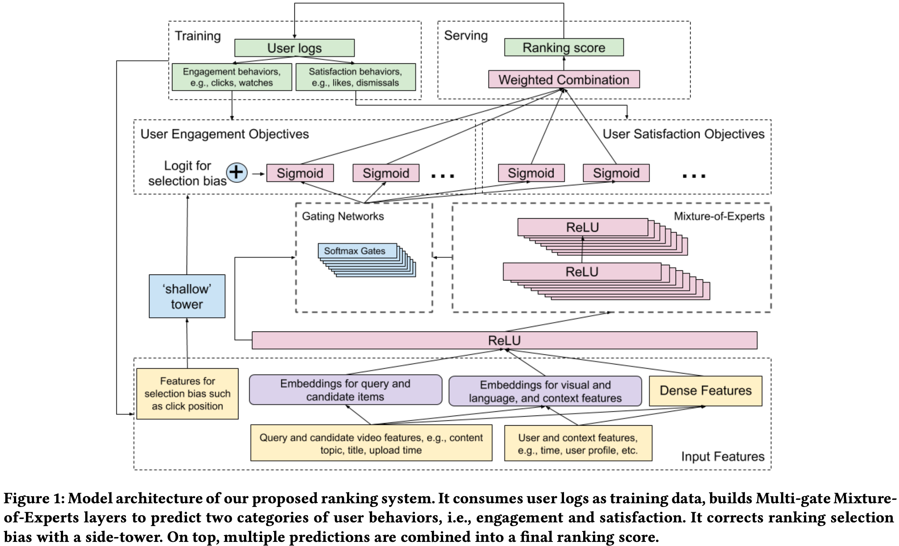
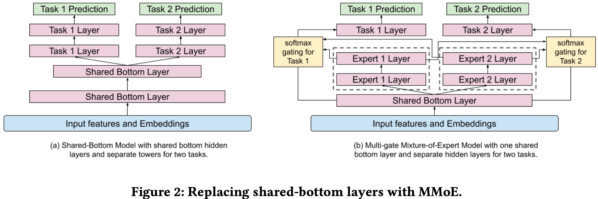
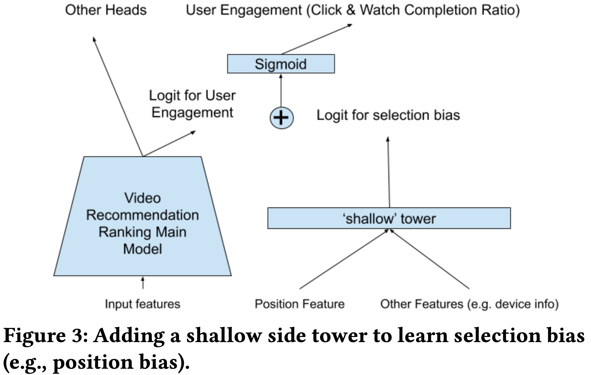
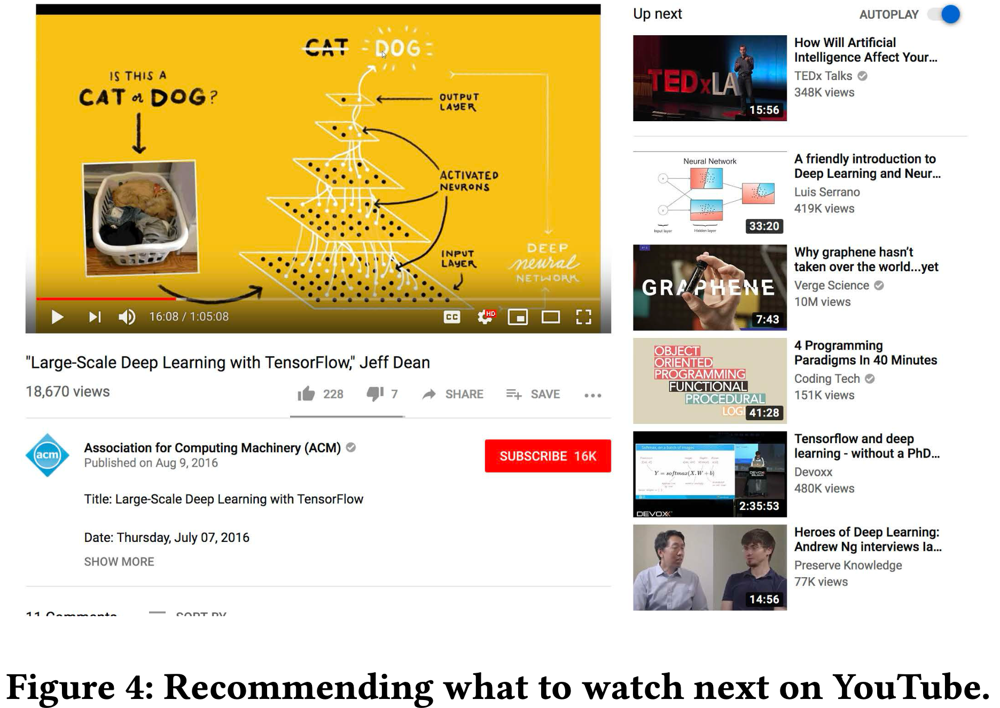
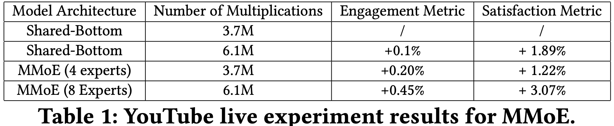
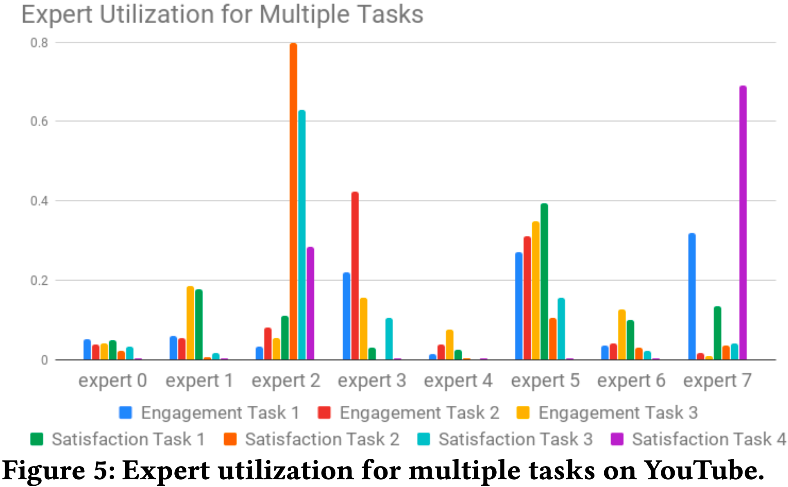
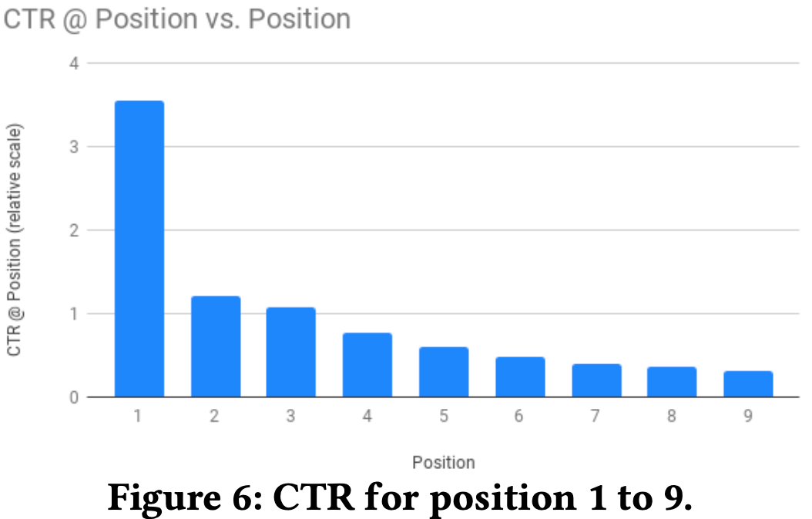
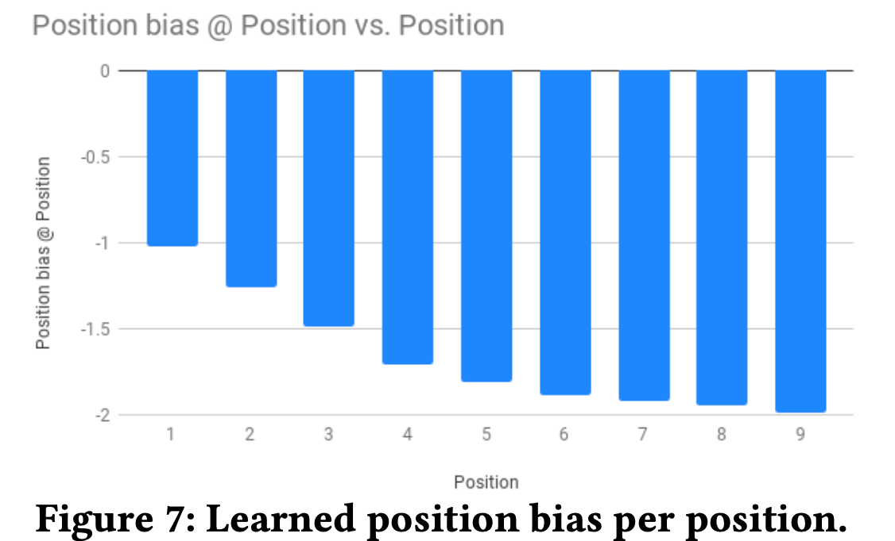
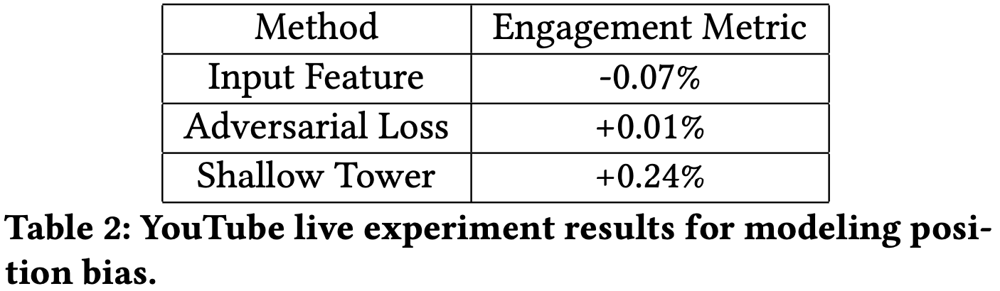

# 推荐接下来观看什么视频：一个多任务排序系统

> Zhe Zhao, Lichan Hong, Li Wei, Jilin Chen, Aniruddh Nath, Shawn Andrews, Aditee Kumthekar, Maheswaran Sathiamoorthy, Xinyang Yi, Ed Chi | Google

本文介绍了在工业级视频分享平台上推荐接下来观看什么视频的**大规模多目标排序系统**。核心内容：

- 面临多个**竞争性排序目标** 以及 用户反馈中的**隐式选择偏差** 两大挑战
- 探索多门混合专家（MMoE，Multi-gate Mixture-of-Experts）等**软参数共享技术**，高效优化多个排序目标
- 采用宽度与深度（Wide & Deep）框架缓解**选择偏差**，在全球最大视频分享平台YouTube上验证了显著改进

关键发现：

- MMoE在相同模型复杂度下显著提升 参与度 和 满意度指标（8专家时参与度+0.45%，满意度+3.07%）
- 浅层塔（Shallow Tower）方法在建模和减少位置偏差方面优于对抗学习 和 **直接输入特征方法**（参与度+0.24%）
- **学习到的位置偏差随位置降低而减小**，验证了模型能有效分离用户效用和位置偏差

---

## 摘要

在本文中，我们介绍了一个大规模多目标排序系统，用于在工业级视频分享平台上推荐接下来观看什么视频。该系统面临许多现实挑战，包括多个竞争性排序目标的存在，以及用户反馈中的隐式选择偏差。为应对这些挑战，我们探索了多种**软参数共享技术**，如多门混合专家（MMoE），以高效优化多个排序目标。此外，我们采用宽度与深度（Wide & Deep）框架来缓解选择偏差。我们证明了所提技术能在全球最大视频分享平台之一上带来推荐质量的显著提升。

## CCS 概念

- 信息系统 $\rightarrow$ 检索模型与排序；推荐系统
- 计算方法学 $\rightarrow$ 排序；多任务学习；从隐式反馈中学习

## 关键词

Recommendation and Ranking, Multitask Learning, **Selection Bias**

## ACM 引用格式

Zhe Zhao, Lichan Hong, Li Wei, Jilin Chen, Aniruddh Nath, Shawn Andrews, Aditee Kumthekar, Maheswaran Sathiamoorthy, Xinyang Yi, Ed Chi. 2019. Recommending What Video to Watch Next: A Multitask Ranking System. In Thirteenth ACM Conference on Recommender Systems (RecSys '19), September 16–20, 2019, Copenhagen, Denmark. ACM, New York, NY, USA, 9 pages. https://doi.org/10.1145/3298689.3346997

允许以个人或课堂使用为目的制作或分发本作品的部分或全部数字或硬拷贝，前提是未以盈利或商业优势为目的进行分发，且副本承载本声明和首页的完整引用。本作品中第三方组件的版权必须予以尊重。如需所有其他用途，请联系所有者/作者。

ACM ISBN 978-1-4503-6243-6/19/09.

https://doi.org/10.1145/3298689.3346997

## 1 引言

在本文中，我们描述了一个用于视频推荐的大规模排序系统。**即根据用户当前正在观看的视频，推荐下一个可能观看并喜欢的视频**。典型的推荐系统遵循候选生成和排序的两阶段设计[10, 20]。本文聚焦于排序阶段。在该阶段，推荐器拥有从**候选生成**（如矩阵分解[45]或神经模型[25]）检索到的几百个候选，并应用一个复杂的大容量模型对最有前景的item进行排序。我们展示了在大规模工业视频发布和共享平台上构建此类排序系统的**实验和经验教训**。

设计和开发现实世界的大规模视频推荐系统充满挑战，包括：

- 通常存在**不同且有时相互冲突的目标需要优化**。例如，除了希望用户观看外，我们可能还想推荐用户评价较高并与朋友分享的视频。
- 系统中通常存在隐式偏差。例如，用户可能仅仅因为某个视频被排在较高位置而点击观看了它，而非因为它真正符合用户偏好。因此，使用当前系统生成的数据训练的模型将存在偏差，导致**反馈循环效应**[33]。如何有效且高效地学习减少此类偏差是一个开放性问题。

为应对这些挑战，我们提出了一个**高效的多任务神经网络排序系统架构，如图1所示。它通过采用多门混合专家（MMoE）[30]进行多任务学习，扩展了宽度与深度（Wide & Deep）[9]模型架构**。此外，它**引入了一个浅层塔来建模和消除选择偏差**。我们将该架构应用于视频推荐作为案例研究：**给定用户当前正在观看的内容，推荐下一个要观看的视频**。我们在工业级大规模视频发布和共享平台上展示了所提排序系统的实验。实验结果表明所提系统有显著改进。

具体而言，我们首先将多个目标分为两类：(1) 参与度目标，如**用户点击和与推荐视频的互动程度**；(2) 满意度目标，如用户**在YouTube上点赞视频以及对推荐留下评分**。为学习和估计多种类型的用户行为，我们使用MMoE来自动学习参数，以在潜在冲突的目标之间共享。混合专家（MoE，Mixture-of-Experts）[21] 架构**将输入层模块化为多个专家，每个专家专注于输入的不同方面**。从而改进了从多模态复杂特征空间中学到的表示。然后通过利用多个门控网络，每个目标可以选择与其他目标 **共享或不共享的专家**。

**为从有偏的训练数据中建模和减少选择偏差（如位置偏差），我们提出在主模型上添加一个浅层塔**，如图1左侧所示。浅层塔接收与选择偏差相关的输入，如当前系统决定的**排序顺序**，并输出一个**标量**作为主模型最终预测的偏差项。该架构将训练数据中的标签分解为两部分：从主模型学习到的无偏用户效用，以及从浅层塔学习到的估计倾向得分。我们提出的模型架构可以被视为宽度与深度模型的扩展，其中**浅层塔代表宽度部分**。通过将浅层塔与主模型一起直接学习，我们获得了**无需借助随机实验即可获得倾向得分的优势**[41]。

**图1：我们提出的排序系统的模型架构。它以用户日志为训练数据，构建多门混合专家层来预测两类用户行为，即参与度和满意度。它通过侧塔纠正排序选择偏差。在顶部，多个预测被组合成最终排序分数。**

为评估所提排序系统，我们设计并进行了离线和在线实验，以验证以下方面的有效性：(1) 多任务学习；(2) 消除一种常见的选择偏差，即位置偏差。与最先进的基线方法相比，我们展示了所提框架的显著改进。我们使用YouTube——最大的视频分享平台之一——来进行实验。

总之，我们的贡献如下：

- 我们介绍了一个端到端的视频推荐排序系统。
- 我们**将排序问题表述为多目标学习问题，**并扩展多门混合专家架构以提升所有目标的性能。
- 我们提出**应用宽度与深度模型架构来建模和缓解位置偏差**。
- 我们在现实世界的大规模视频推荐系统上评估了所提方法，并展示了显著改进。

本文其余部分组织如下：在第2节中，我们描述了构建现实世界推荐排序系统的相关工作。在第3节中，我们提供了候选生成和排序的问题描述。接下来，我们从两个方面讨论所提方法：多任务学习和消除选择偏差。在第5节中，我们描述了如何设计离线和在线实验来评估所提框架。最后，我们在第6节中总结了我们的发现。

## 2 相关工作

推荐问题可以表述为：给定一个查询、一个上下文和一个item列表，返回若干**高效用item**。例如，个性化电影推荐系统可以将**用户的观看历史作为查询**，将周五晚上在家用平板电脑等作为上下文，**将电影列表作为输入**，返回该用户可能观看并喜欢的电影子集。在本节中，我们从三个类别讨论相关工作：推荐系统的工业案例研究、多目标推荐系统，以及**理解训练数据中的偏差**。

### 2.1 工业推荐系统

为设计和开发一个由机器学习模型赋能的成功排序系统，我们需要大量训练数据。最近的工业推荐系统严重依赖大量用户日志来构建模型。一种选择是直接向用户获取关于item效用的显式反馈。然而，由于其成本，显式反馈的数量难以扩展。因此，排序系统通常利用隐式反馈，如点击和与推荐item的互动。

大多数推荐系统[10, 20, 42]包含两个阶段：候选生成和排序。对于候选生成，使用多种信号源和模型。例如，[26]使用item共现来生成候选，[11]采用基于协同过滤的方法，[14]和[19]在（共现）图上应用随机游走，[42]学习内容表示来将item过滤为候选，[10]描述了一种使用特征混合的混合方法。

对于排序，使用学习排序（learning-to-rank）框架的机器学习算法被广泛采用。例如，[26]探索了使用**线性模型和基于树的方法**的逐点和配对学习排序框架。[16]使用线性评分函数和配对排序目标。[20]将梯度提升决策树（GBDT，Gradient Boosted Decision Tree）[24]应用于逐点排序目标。[10]使用使用神经网络，以逐点排序目标来预测加权点击。

这些工业推荐系统的一个主要挑战是**可扩展性**。因此，它们通常采用基础设施改进[11, 14, 19, 26]和高效机器学习算法[14, 16, 17, 42]的组合。为了在模型质量和效率之间取得权衡，一种流行的选择是使用 **基于深度神经网络的逐点排序模型**[10]。

在本文中，我们首先识别了工业排序系统中的一个关键问题：**用户隐式反馈与推荐item的真实用户效用之间的不一致**。随后，我们介绍了一种基于深度神经网络的排序模型，该模型使用多任务学习技术支持多个排序目标，每个目标对应一种类型的用户反馈。

### 2.2 推荐系统的多目标学习

从训练数据中学习和预测用户行为具有挑战性。存在不同类型的用户行为，如点击[22]、评分和评论等。然而，每一种都不能独立反映真实的用户效用。例如，用户可以点击一个item但最终不喜欢它；用户只能对已点击和互动过的item提供评分。我们的排序系统需要能够有效学习和估计多种类型的用户行为和效用，并随后将这些估计组合起来计算最终的效用分数用于排序。

关于行为感知和多目标推荐的现有工作要么只能应用于候选生成阶段[3, 28, 31, 40, 45]，要么不适合大规模在线排序[13, 15, 38, 44]。

例如，一些推荐系统[31, 45]扩展协同过滤 或 基于内容的系统，**从多个用户信号中学习用户-item相似度**。这些系统被高效地用于生成候选。但与基于深度神经网络的排序模型相比，其推荐效果不如基于深度神经网络的排序模型[10]。

另一方面，许多现有的多目标排序系统是为特定类型的特征和应用设计的，如文本[38]和视觉[13]。将这些系统扩展到支持多模态特征空间将具有挑战性，如来自 **视频标题的文本** 和 **来自缩略图的视觉特征**。同时，其他考虑多模态输入特征的多目标排序系统由于在高效共享多个目标的模型参数方面的局限性而无法扩展[15, 44]。

在推荐系统研究领域之外，基于深度神经网络的多任务学习已在许多传统机器学习应用中被广泛研究和探索，用于表示学习，如自然语言处理（NLP，Natural Language Processing）[12]和计算机视觉（CV，Computer Vision）[27]。虽然许多为表示学习提出的多任务学习技术不适用于构建排序系统，但它们的一些构建模块启发了我们的设计。在本文中，我们描述了一个为现实世界推荐设计的基于DNN（Deep Neural Network，深度神经网络）的排序系统，并应用混合专家层[21]的扩展来支持多任务学习[30]。

### 2.3 理解和建模训练数据中的偏差

用作我们训练数据的用户日志捕获了用户对当前生产系统推荐的行为和响应。用户与当前系统之间的交互导致了反馈中的选择偏差。例如，用户可能点击了一个item是因为它被当前系统选中，尽管它不是整个语料库中最有用的。因此，**在当前系统生成的数据上训练的新模型将偏向当前系统，导致反馈循环效应**。如何有效且高效地学习减少排序系统的此类偏差是一个开放性问题。

Joachims等人[22]首先分析了用于训练学习排序模型的隐式反馈数据中的位置偏差和展示偏差。通过将点击数据与显式相关性反馈进行比较，他们发现位置偏差存在于点击数据中，并且会显著影响学习排序模型对查询和文档之间相关性的估计。在这一发现之后，许多方法被提出用于消除此类选择偏差，特别是位置偏差[23, 34, 41]。

一种常用的做法是在模型训练中将位置作为输入特征注入，然后在服务时通过消融来消除偏差。在概率点击模型中，位置被用来学习 $P(\text{relevance} \mid \text{pos})$。一种受[8]启发的消除位置偏差方法：Chapelle等人使用 $P(\text{relevance} \mid \text{pos} = 1)$ 评估CTR（Click-Through Rate，点击率）模型，假设在位置1评估时不存在位置偏差效应。随后，为消除位置偏差，我们可以使用位置作为输入特征训练模型，并通过将位置特征设置为1（或其他固定值如缺失值）来服务。

其他方法尝试从位置学习偏差项并将其作为归一化器或正则化器应用[23, 34, 41]。通常，为学习偏差项，需要使用一些随机数据来推断偏差项（称为"全局偏差"、"倾向"等）而不考虑相关性[34, 41]。在[23]中，使用反事实模型学习逆倾向得分（IPS，Inverse Propensity Score），无需随机数据。它被用作训练Rank-SVM的正则化项。

在现实世界的推荐系统中，特别是社交媒体平台如Twitter [19]和YouTube [10]，用户行为和item流行度每天都会发生显著变化。因此，与基于IPS的方法相比，我们需要一种高效的方法，在训练主排序模型的同时，适应因选择偏差建模而导致的训练数据分布变化，同时训练主排序模型。

## 3 问题描述

在本节中，我们首先描述推荐接下来观看什么视频的问题，然后介绍候选生成和排序的两阶段设置。本文其余部分将聚焦于排序系统。

除了上述**使用隐式反馈训练排序系统**的挑战外，对于现实世界的大规模视频推荐问题，我们还需要考虑以下额外因素：

- **多模态特征空间**。在上下文感知的个性化推荐系统中，我们需要学习用户对候选视频的效用，**其特征空间由多种模态生成**，如视频内容、缩略图、音频、标题和描述、用户人口统计信息。从多模态特征空间学习推荐表示面临独特挑战，涉及两个难题：(1) 弥合从低级内容特征到内容过滤的语义鸿沟；(2) 从item的稀疏分布中学习协同过滤。

- **可扩展性**。可扩展性极其重要，因为我们正在为数十亿用户和视频构建推荐系统。模型必须在训练时有效且在服务时高效。尽管排序系统每次查询只对几百个候选进行评分，但现实场景要求评分实时完成，**因为某些查询和上下文信息仅在线可用**。因此，排序系统不仅需要学习数十亿item和用户的表示，还需要在服务时高效。

回想一下，我们推荐系统的目标是提供一个排序后的视频列表，给定当前观看的视频和上下文。为处理多模态特征空间，对于每个视频，我们提取视频元数据和视频内容信号等特征作为其表示。对于上下文，我们使用用户人口统计信息、设备、时间和位置等特征。

为处理可扩展性，类似于[10]中描述的，我们的推荐系统有两个阶段，即候选生成和排序。在候选生成阶段，我们从巨大的语料库中检索几百个候选。我们的排序系统为每个候选提供分数并生成最终的排序列表。

### 3.1 候选生成

我们的视频推荐系统使用多种候选生成算法，每种算法捕捉查询视频和候选视频之间的一个方面相似性。例如，一种算法通过匹配查询视频的主题来生成候选。另一种算法根据视频与查询视频一起被观看的频率来检索候选视频。**我们构建了一个类似于[10]的序列模型，用于根据用户历史生成个性化候选**。我们还使用[25]中提到的技术来生成上下文感知的高召回率相关候选。最后，所有候选被汇总到一个集合中，随后由排序系统评分。

### 3.2 排序

我们的排序系统从几百个候选中生成排序列表。与候选生成阶段过滤掉大多数不相关item不同，排序系统旨在提供排序列表，使对用户最高效用的item显示在顶部。因此，我们在排序系统中应用最先进的使用神经网络架构的机器学习技术，以获得足够的模型表达能力来学习特征关联及其与效用的关系。

## 4 模型架构

在本节中，我们详细描述所提排序系统。我们首先提供系统概述，包括其问题表述、目标和特征。然后讨论用于学习多种用户行为的多目标设置。我们讨论如何应用并扩展MMoE（Multi-gate Mixture-of-Experts）这一最先进的多任务学习架构，以学习多个排序目标。最后，我们讨论如何 **将MMoE** 与 **浅层塔结合** 来学习和减少训练数据中的选择偏差，特别是位置偏差。

### 4.1 系统概述

我们的排序系统从两种类型的用户反馈中学习：(1) 参与度行为，如点击和观看；(2) 满意度行为，如点赞和取消。给定每个候选，排序系统使用候选、查询和上下文的特征作为输入，并学习预测多种用户行为。

对于问题表述，我们采用学习排序框架[6]。我们将排序问题建模为具有多个目标的分类问题和回归问题的组合。给定查询、候选和上下文，排序模型预测用户采取行动的概率，如点击、观看、点赞和取消。

这种为每个候选进行预测的方法是逐点方法[6]。相比之下，配对或列表方法学习对两个或多个候选的排序进行预测。配对或列表方法可用于潜在地提高推荐的多样性。然而，我们选择使用逐点排序主要基于服务考虑。在服务时，逐点排序简单且能高效扩展到大量候选。相比之下，配对或列表方法需要对配对或列表多次评分以找到给定候选集的最优排序列表，从而限制了其可扩展性。

### 4.2 排序目标

我们使用用户行为作为训练标签。由于用户可以对推荐item有不同的行为类型，我们设计排序系统以支持多个目标。每个目标是预测与用户效用相关的一种用户行为。为描述目的，以下我们将目标分为两类：参与度目标和满意度目标。

>  图2：用MMoE替换共享底层层。

参与度目标捕获用户行为如点击和观看。我们将这些行为的预测表述为两种类型的任务：用于点击等行为的二分类任务，以及与花费时间相关的行为的回归任务。类似地，对于满意度目标，我们将与用户满意度相关的行为预测表述为二分类任务或回归任务。例如，为视频点赞的行为被表述为二分类任务，评分行为被表述为回归任务。对于二分类任务，我们计算 **交叉熵损失**。对于回归任务，我们计算 **平方损失**。

一旦确定了多个排序目标及其问题类型，我们为这些预测任务训练多任务排序模型。对于每个候选，我们以这些多个预测为输入，使用加权乘法形式的组合函数输出组合分数。**权重经过手动调整以在用户参与度和满意度上都获得最佳性能**。

### 4.3 使用多门混合专家建模任务关系和冲突

具有多个目标的排序系统通常使用共享底层模型架构[7, 10]。然而，**当任务之间的相关性较低时，这种硬参数共享技术有时会损害多个目标的学习[30]**。为缓解多个目标的冲突，我们采用并扩展了一种最近发布的模型架构——多门混合专家（MMoE）[30]。

MMoE是一种软参数共享模型结构，旨在**建模任务冲突和关系**。它通过让专家在所有任务之间共享，同时为每个任务训练一个门控网络，将混合专家（MoE）结构适配到多任务学习。MMoE层旨在捕获任务差异，而不需要比共享底层模型显著更多的模型参数。关键思想是用MoE层替换共享ReLU（Rectified Linear Unit，修正线性单元）层，并为每个任务添加单独的门控网络。

对于我们的排序系统，我们提出在共享隐藏层之上添加专家，如图2b所示。这是因为**混合专家层可以帮助从其输入中学习模块化信息**[21]。**当直接在输入层或较低隐藏层之上使用时，它可以更好地建模多模态特征空间**。然而，直接在输入层上应用MoE层将显著增加模型训练和服务成本。这是因为通常输入层的维度远高于隐藏层。

我们对专家网络的实现与使用ReLU激活的多层感知机相同[30]。给定任务 $k$、预测 $y_k$ 和最后一个隐藏层 $h_k$，具有 $n$ 个专家的MMoE层对任务 $k$ 的输出 $f^k(x)$ 可以表示为以下方程：

$$
y_k = h_k(f^k(x)),
$$

$$
f^k(x) = \sum_{i=1}^{n} g_{(i)}^k(x) f_i(x) \qquad (1)
$$

其中 $x \in \mathbb{R}^d$ 是低级共享隐藏嵌入，$g^k$ 是任务 $k$ 的门控网络，$g^k(x) \in \mathbb{R}^n$，$g_{(i)}^k(x)$ 是第 $i$ 个条目，$f_i(x)$ 是第 $i$ 个专家。门控网络只是带有softmax层的输入线性变换。

$$
g^k(x) = \text{softmax}(W_{g^k} x), \qquad (2)
$$

其中 $W_{g^k} \in \mathbb{R}^{n \times d}$ 是线性变换的自由参数。与[32]中提到的稀疏门控网络（专家数量可以很大且每个训练样本仅利用顶级专家）相比，我们使用相对较少数量的专家。这是为了鼓励多个门控网络共享专家以及训练效率。

### 4.4 建模和消除位置与选择偏差

> 图3：添加浅层侧塔来学习选择偏差（如位置偏差）。

隐式反馈已被广泛用于训练学习排序模型。通过从用户日志中提取的大量隐式反馈，可以训练复杂的基于深度神经网络的模型。然而，隐式反馈存在偏差，因为它是从现有排序系统生成的。位置偏差和许多其他类型的选择偏差已在不同的排序问题中被研究和验证存在[2, 23, 41]。

在我们的排序系统中，查询是当前正在观看的视频，候选是相关视频，用户倾向于点击和观看显示在列表顶部附近的视频，无论其实际用户效用如何——无论是在与观看视频的相关性方面还是用户偏好方面。我们的目标是从排序模型中消除此类位置偏差。在训练数据中或模型训练过程中建模和减少选择偏差可以带来模型质量提升，并**打破由选择偏差导致的反馈循环**。

我们提出的模型架构类似于宽度与深度模型架构。**我们将模型预测分解为两个组件：来自主塔的用户效用组件和来自浅层塔的偏差组件**。具体而言，我们训练一个浅层塔，使用导致选择偏差的特征，如用于位置偏差的位置特征，然后将其添加到主模型的最终logit中，如图3所示。在训练中，**使用所有展示的位置，具有10%的特征丢弃率以防止模型过度依赖位置特征**。**在服务时，位置特征被视为缺失**。我们将位置特征与设备特征交叉的原因是，在不同类型的设备上观察到不同的位置偏差。

> [!NOTE]
>
> 这里没太懂。在不同类型的设备上观察到不同的位置偏差，如何影响线上的偏差影响呢？

## 5 实验结果

在本节中，我们描述如何在最大视频分享平台之一YouTube上进行所提排序系统的实验，推荐接下来观看什么视频。使用YouTube提供的用户隐式反馈，我们训练排序模型并进行离线和在线实验。

YouTube的规模和复杂性使其成为我们排序系统的完美测试平台。YouTube是最大的视频分享平台，拥有19亿月活跃用户¹。该网站每天产生数千亿条用户与推荐结果交互的日志。YouTube的一个关键产品提供了给定正在观看的视频推荐接下来观看什么的功能，如图4所示。其用户界面为用户提供了多种与推荐视频交互的方式，如点击、观看、点赞和取消。

### 5.1 实验设置

如第3.1节所述，我们的排序系统从多个候选生成算法中接收几百个候选。我们使用TensorFlow²构建模型的训练和服务。具体而言，我们使用张量处理单元（TPU，Tensor Processing Unit）训练模型，并使用TFX Servo [4]³进行服务。

¹ https://www.youtube.com/yt/about/press
² https://www.tensorflow.org
³ https://www.tensorflow.org/tfx/guide/serving

>  图4：在YouTube上推荐接下来观看什么。

我们按顺序训练所提模型和基线模型。这意味着我们通过按时间顺序遍历过去几天的训练数据来训练模型，并持续运行训练器以消费新到达的训练数据。这样做使模型适应最新数据。这对于许多现实世界的推荐应用至关重要，其中数据分布和用户模式随时间动态变化。

对于离线实验，我们监控分类任务的AUC（Area Under the Curve，曲线下面积）和回归任务的平方误差。对于在线实验，我们进行与生产系统的A/B测试。我们使用离线和在线指标来调整超参数（如学习率）。我们检查多个参与度指标如在YouTube上花费的时间，以及满意度指标如取消率、用户调查回复等。除了在线指标外，我们还关心模型在服务时的计算成本，因为YouTube每秒需要响应大量的查询。

### 5.2 使用MMoE的多任务排序

为评估采用MMoE进行多任务排序的性能，我们与基线方法进行比较并在YouTube上进行在线实验。

#### 5.2.1 基线方法

我们的基线方法使用图2a中提到的共享底层模型架构。作为代理，我们通过每个模型架构内的**乘法次数**来衡量模型复杂度，因为这是服务模型的主要计算成本。当比较MMoE模型和基线模型时，我们使用相同的模型复杂度。由于效率考虑，我们的MMoE层共享一个底层隐藏层（如图2b所示），其维度低于输入层。

#### 5.2.2 在线实验结果

YouTube上的在线实验结果如表1所示。我们报告了参与度指标（用户观看推荐视频的时长）和满意度指标（用户带评分的调查回复）。我们将共享底层模型与MMoE模型进行比较，使用4个或8个专家。从表中我们看到，使用相同的模型复杂度，MMoE显著提升了参与度和满意度指标。

**表1：MMoE的YouTube在线实验结果。**

> [!NOTE]
>
> 这个乘法次数具体是怎么算出来的？

#### 5.2.3 门控网络分布

为进一步**理解MMoE如何帮助多目标优化**，我们绘制了每个任务的softmax门控网络在各专家上的累积概率分布，如图5所示。我们看到一些 参与度任务 与 其他参与度任务共享多个专家。满意度任务倾向于共享一小部分专家，且利用率较高（以使用这些专家的概率来衡量）。

如上所述，我们的MMoE层共享一个底层隐藏层，其门控网络从共享隐藏层获取输入。这可能使MMoE层比直接从输入层构建MMoE层更难模块化输入信息。或者，我们让门控网络直接从输入层而非共享隐藏层获取输入，以便输入特征可以直接用于选择专家。然而，在线实验结果与图2b的MMoE层相比没有实质性差异。这表明图2b的MMoE门控网络可以有效地将输入信息模块化到专家中，用于**任务关系和冲突建模**。

> 图5：YouTube上多个任务的专家利用率。

#### 5.2.4 门控网络稳定性

使用多台机器训练神经网络模型时，分布式训练策略可能导致模型频繁发散。发散的一个例子是ReLU死亡[1]。在MMoE中，softmax门控网络已被报告[32]存在专家分布不平衡问题，即**门控网络收敛为在大多数专家上零利用率**。在分布式训练中，我们观察到模型中20%的门控网络极化问题。门控网络极化会损害相关任务的模型性能。为解决此问题，我们在门控网络上应用丢弃。通过**应用10%的概率将专家利用率设置为0并重新归一化softmax输出**，我们消除了所有门控网络的门控网络极化。

> [!NOTE]
>
> 门控网络极化问题。

### 5.3 建模和减少位置偏差

使用用户隐式反馈作为训练数据的一个主要挑战是难以建模隐式反馈与真实用户效用之间的差距。使用多种类型的隐式信号和多个排序目标，我们**在服务时有更多旋钮来调整以捕获从模型预测到item推荐中用户效用的转换**。然而，我们仍然需要建模和减少普遍存在于隐式反馈中的偏差，如由用户与当前推荐系统交互导致的选择偏差。

在此我们评估如何使用所提轻量级模型架构建模和减少一种选择偏差，即位置偏差。我们的解决方案避免了支付随机实验或复杂计算的成本[41]。

#### 5.3.1 用户隐式反馈分析

为验证位置偏差存在于我们的训练数据中，我们对不同位置的点击率（CTR）进行了分析。图6显示了位置1到9的CTR相对比例分布。如预期，我们看到随着位置越来越低，CTR显著降低。较高位置的较高CTR是推荐更相关item和位置偏差共同作用的结果。使用我们提出的采用浅层塔的方法，我们在下文中展示它**可以将用户效用和位置偏差的学习分离开来**。

**图6：位置1到9的CTR。**

**图7：每个位置的学习到的位置偏差。**

> [!NOTE]
>
> 这个位置偏差如何理解？

#### 5.3.2 基线方法

为评估所提模型架构，我们将其与以下基线方法进行比较。

- **直接使用位置特征作为输入特征**：这种简单方法在工业推荐系统中已被广泛采用，以消除位置偏差，主要用于线性学习排序模型。

- **对抗学习**：受对抗学习在域适应[37]和机器学习公平性[5]中广泛采用的启发，我们使用类似技术引入一个辅助任务来预测训练数据中显示的位置。随后，在反向传播阶段，我们对传入主模型的梯度取反，以确保主模型的预测不依赖位置特征。

#### 5.3.3 在线实验结果

表2显示了所提方法和基线方法的在线实验结果。我们看到所提方法通过建模和减少位置偏差显著提升了参与度指标。

**表2：建模位置偏差的YouTube在线实验结果。**

#### 5.3.4 学习到的位置偏差

图7显示了每个位置的位置偏差学习结果。从图中我们看到，**较低位置的偏差较小**。**该偏差基于有偏的隐式反馈来估计倾向得分。充足的训练数据使模型能够有效学习并降低位置偏差。**

### 5.4 讨论

在本节中，我们讨论从开发和实验排序系统的过程中学到的一些见解和局限性。

#### 5.4.1 用于推荐和排序的神经网络模型架构

许多推荐系统研究论文[18, 43]扩展了最初为传统机器学习应用设计的模型架构，如用于**自然语言处理的多头注意力** 和 **用于计算机视觉的CNN**（Convolutional Neural Network，卷积神经网络）。然而，**我们发现许多这些适合特定领域表示学习的模型架构并不直接适用于我们的需求**。这是由于：

- **多模态特征空间**。我们的排序系统依赖于多个特征源，如来自查询和item的内容特征以及上下文特征。这些特征跨越稀疏分类空间到自然语言和图像等。**从混合特征空间中学习具有挑战性**。

- **可扩展性和多个排序目标**。许多模型架构旨在捕获一种信息，如特征交叉[39]或序列信息[35]。它们通常改进一个排序目标但可能损害其他目标。此外，在我们系统中应用复杂模型架构的组合难以扩展。

- **噪声和局部稀疏的训练数据**。我们的系统需要训练item和查询的嵌入向量。然而，**大多数稀疏特征遵循幂律分布**，且用户反馈的方差很高。例如，对于同一个查询，用户可能因为上下文的细微差异（系统无法捕获）而对推荐的item给出不同的点击行为。这使得尾部item的嵌入空间优化极为困难。

- **使用小批量随机梯度下降（SGD，Stochastic Gradient Descent）的分布式训练**。我们依赖具有强大表达能力的大型神经网络模型来发现特征关联。由于模型消费大量训练数据，我们不得不使用分布式训练，其本身带有固有挑战。

#### 5.4.2 有效性和效率之间的折衷

对于现实世界的排序系统，效率不仅影响服务成本，还影响用户体验。一个过于复杂的模型，显著增加生成推荐item的延迟，可能降低用户满意度和在线指标。因此，我们通常偏好更简单和更直接的模型架构。

#### 5.4.3 训练数据中的偏差

除了位置偏差外，还有许多其他类型的偏差。其中一些偏差可能是未知和不可预测的，例如由于系统在提取训练数据方面的局限性。如何自动学习和捕获训练数据中已知和未知的偏差是一个需要更多研究的长期挑战。

#### 5.4.4 评估挑战

由于我们的排序系统主要使用用户隐式反馈，表明针对每个预测任务的离线评估不一定能反映在线性能。事实上，我们经常观察到离线和在线指标之间的不一致。因此，最好选择整体更简单的模型，以便更好地泛化到在线性能。

#### 5.4.5 未来方向

除了上述MMoE和消除选择偏差外，我们正在以下方向改进排序系统：

- **探索新的多目标排序模型架构**，平衡稳定性、可训练性和表达能力。我们观察到MMoE通过灵活选择共享哪些专家来提升多任务排序性能。最近有更多工作在不损害预测性能的前提下进一步提升了模型稳定性[29]。

- **理解和学习分解**。为建模已知和未知偏差，我们希望探索能够自动从训练数据中识别潜在偏差并学习减少它们的模型架构和目标。

- **模型压缩**。受减少服务成本需求的驱动，我们正在探索用于排序和推荐模型的不同类型模型压缩技术[36]。

## 6 结论

在本文中，我们从描述设计和开发工业推荐系统的几个现实挑战开始，特别是排序系统。这些挑战包括多个竞争性排序目标的存在，以及用户反馈中的隐式选择偏差。为应对这些挑战，我们提出了一个多目标排序系统，并将其应用于推荐接下来观看什么视频的问题。为高效优化多个排序目标，我们扩展了多门混合专家模型架构以利用软参数共享。我们提出了一种轻量级且有效的方法来建模和减少选择偏差，特别是位置偏差。此外，通过在YouTube（世界最大视频分享平台之一）上的在线实验，我们展示了所提技术在参与度和满意度指标上都带来了显著改进。

## 参考文献

[1] Abien Fred Agarap. 2018. **Deep learning using rectified linear units** (relu). arXiv preprint arXiv:1803.08375 (2018).

[2] Aman Agarwal, Ivan Zaitsev, Xuanhui Wang, Cheng Li, Marc Najork, and Thorsten Joachims. 2019. **Estimating Position Bias without Intrusive Interventions**. In Proceedings of the Twelfth ACM International Conference on Web Search and Data Mining. ACM, 474–482.

[3] Deepak Agarwal, Bee-Chung Chen, and Bo Long. 2011. Localized factor models for multi-context recommendation. In Proceedings of the 17th ACM SIGKDD international conference on Knowledge discovery and data mining. ACM, 609–617.

[4] Denis Baylor, Eric Breck, Heng-Tze Cheng, Noah Fiedel, Chuan Yu Foo, Zakaria Haque, Salem Haykal, Mustafa Ispir, Vihan Jain, Levent Koc, et al. 2017. Tfx: A tensorflow-based production-scale machine learning platform. In Proceedings of the 23rd ACM SIGKDD International Conference on Knowledge Discovery and Data Mining. ACM, 1387–1395.

[5] Alex Beutel, Jilin Chen, Zhe Zhao, and Ed H Chi. 2017. Data decisions and theoretical implications when adversarially learning fair representations. arXiv preprint arXiv:1707.00075 (2017).

[6] Christopher Burges, Tal Shaked, Erin Renshaw, Ari Lazier, Matt Deeds, Nicole Hamilton, and Gregory N Hullender. 2005. **Learning to rank using gradient descent**. In Proceedings of the 22nd International Conference on Machine learning (ICML-05). 89–96.

[7] Rich Caruana. 1997. Multitask learning. Machine learning 28, 1 (1997), 41–75.

[8] Olivier Chapelle and Ya Zhang. 2009. A dynamic bayesian network click model for web search ranking. In Proceedings of the 18th international conference on World wide web. ACM, 1–10.

[9] Heng-Tze Cheng, Levent Koc, Jeremiah Harmsen, Tal Shaked, Tushar Chandra, Hrishi Aradhye, Glen Anderson, Greg Corrado, Wei Chai, Mustafa Ispir, et al. 2016. Wide & deep learning for recommender systems. In Proceedings of the 1st workshop on deep learning for recommender systems. ACM, 7–10.

[10] Paul Covington, Jay Adams, and Emre Sargin. 2016. Deep neural networks for YouTube Recommendations. In Proceedings of the 10th ACM conference on recommender systems. ACM, 191–198.

[11] James Davidson, Benjamin Liebald, Junning Liu, Palash Nandy, Taylor Van Vleet, Ullas Gargi, Sujoy Gupta, Yu He, Mike Lambert, Blake Livingston, et al. 2010. **The YouTube video recommendation system**. In Proceedings of the fourth ACM conference on Recommender systems. ACM, 293–296.

[12] Jacob Devlin, Ming-Wei Chang, Kenton Lee, and Kristina Toutanova. 2018. **Bert: Pre-training of deep bidirectional transformers for language understanding**. arXiv preprint arXiv:1810.04805 (2018).

[13] Humaira Ehsan, Mohamed A Sharaf, and Panos K Chrysanthis. 2016. Muve: Efficient multi-objective view recommendation for visual data exploration. In 2016 IEEE 32nd International Conference on Data Engineering (ICDE). IEEE, 731–742.

[14] Chantat Eksombatchai, Pranav Jindal, Jerry Zitao Liu, Yuchen Liu, Rahul Sharma, Charles Sugnet, Mark Ulrich, and Jure Leskovec. 2018. **Pixie: A system for recommending 3+ billion items to 200+ million users in real-time**. In Proceedings of the 2018 World Wide Web Conference on World Wide Web. International World Wide Web Conferences Steering Committee, 1775–1784.

[15] Ali Mamdouh Elkahky, Yang Song, and Xiaodong He. 2015. A multi-view deep learning approach for cross domain user modeling in recommendation systems. In Proceedings of the 24th International Conference on World Wide Web. International World Wide Web Conferences Steering Committee, 278–288.

[16] Antonino Freno. 2017. **Practical Lessons from Developing a Large-Scale Recommender System at Zalando**. In Proceedings of the Eleventh ACM Conference on Recommender Systems. ACM, 251–259.

[17] Florent Garcin, Boi Faltings, Olivier Donatsch, Ayar Alazzawi, Christophe Bruttin, and Amr Huber. 2014. **Offline and online evaluation of news recommender systems at swissinfo.ch**. In Proceedings of the 8th ACM Conference on Recommender systems. ACM, 169–176.

[18] Qi Gu, Ting Bai, Wayne Xin Zhao, and Ji-Rong Wen. 2018. A Neural Labeled Network Embedding Approach to Product Adopter Prediction. In Asia Information Retrieval Symposium. Springer, 77–89.

[19] Pankaj Gupta, Ashish Goel, Jimmy Lin, Aneesh Sharma, Dong Wang, and Reza Zadeh. 2013. **Wtf: The who to follow service at twitter**. In Proceedings of the 22nd international conference on World Wide Web. ACM, 505–514.

[20] Xinran He, Junfeng Pan, Ou Jin, Tianbing Xu, Bo Liu, Tao Xu, Yanxin Shi, Antoine Atallah, Ralf Herbrich, Stuart Bowers, et al. 2014. Practical lessons from predicting clicks on ads at facebook. In Proceedings of the Eighth International Workshop on Data Mining for Online Advertising. ACM, 1–9.

[21] Robert A Jacobs, Michael I Jordan, Steven J Nowlan, Geoffrey E Hinton, et al. 1991. Adaptive mixtures of local experts. Neural computation 3, 1 (1991), 79–87.

[22] Thorsten Joachims, Laura Granka, Bing Pan, Helene Hembrooke, Filip Radlinski, and Geri Gay. 2007. Evaluating the accuracy of implicit feedback from clicks and query reformulations in web search. ACM Transactions on Information Systems (TOIS) 25, 2 (2007), 7.

[23] Thorsten Joachims, Adith Swaminathan, and Tobias Schnabel. 2017. **Unbiased learning-to-rank with biased feedback**. In Proceedings of the Tenth ACM International Conference on Web Search and Data Mining. ACM, 781–789.

[24] Guolin Ke, Qi Meng, Thomas Finley, Taifeng Wang, Wei Chen, Weidong Ma, Qiwei Ye, and Tie-Yan Liu. 2017. **Lightgbm: A highly efficient gradient boosting decision tree**. In Advances in Neural Information Processing Systems. 3146–3154.

[25] Walid Krichene, Nicolas Mayoraz, Stefen Rendle, Li Zhang, Xinyang Yi, Lichan Hong, Ed Chi, and John Anderson. 2018. Efficient training on very large corpora via gramian estimation. arXiv preprint arXiv:1807.07187 (2018).

[26] David C Liu, Stephanie Rogers, Raymond Shiau, Dmitry Kislyuk, Kevin C Ma, Zhigang Zhong, Jenny Liu, and Yushi Jing. 2017. **Related pins at pinterest: The evolution of a real-world recommender system**. In Proceedings of the 26th International Conference on World Wide Web Companion. International World Wide Web Conferences Steering Committee, 583–592.

[27] Mingsheng Long and Jianmin Wang. 2015. Learning multiple tasks with deep relationship networks. arXiv preprint arXiv:1506.02117 2 (2015).

[28] Yichao Lu, Ruihai Dong, and Barry Smyth. 2018. **Why I like it: multi-task learning for recommendation and explanation.** In Proceedings of the 12th ACM Conference on Recommender Systems. ACM, 4–12.

[29] Jiaqi Ma, Zhe Zhao, Jilin Chen, Ang Li, Lichan Hong, and Ed Chi. 2019. **SNR: Sub-Network Routing for Flexible Parameter Sharing in Multi-task Learning**. AAAI (2019).

[30] Jiaqi Ma, Zhe Zhao, Xinyang Yi, Jilin Chen, Lichan Hong, and Ed H Chi. 2018. Modeling task relationships in multi-task learning with multi-gate mixture-of-experts. In Proceedings of the 24th ACM SIGKDD International Conference on Knowledge Discovery & Data Mining. ACM, 1930–1939.

[31] Xia Ning and George Karypis. 2010. **Multi-task learning for recommender system**. In Proceedings of 2nd Asian Conference on Machine Learning. 269–284.

[32] Noam Shazeer, Azalia Mirhoseini, Krzysztof Maziarz, Andy Davis, Quoc Le, Geoffrey Hinton, and Jeff Dean. 2017. Outrageously large neural networks: The sparsely-gated mixture-of-experts layer. arXiv preprint arXiv:1701.06538 (2017).

[33] Ayan Sinha, David F Gleich, and Karthik Ramani. 2016. Deconvolving feedback loops in recommender systems. In Advances in Neural Information Processing Systems. 3243–3251.

[34] Adith Swaminathan and Thorsten Joachims. 2015. Batch learning from logged bandit feedback through counterfactual risk minimization. Journal of Machine Learning Research 16, 1 (2015), 1731–1755.

[35] Jiaxi Tang, Francois Belletti, Sagar Jain, Minmin Chen, Alex Beutel, Can Xu, and Ed H Chi. 2019. Towards Neural Mixture Recommender for Long Range Dependent User Sequences. arXiv preprint arXiv:1902.08588 (2019).

[36] Jiaxi Tang and Ke Wang. 2018. **Ranking distillation: Learning compact ranking models with high performance for recommender system**. In Proceedings of the 24th ACM SIGKDD International Conference on Knowledge Discovery & Data Mining. ACM, 2289–2298.

[37] Eric Tzeng, Judy Hoffman, Kate Saenko, and Trevor Darrell. 2017. Adversarial discriminative domain adaptation. In Proceedings of the IEEE Conference on Computer Vision and Pattern Recognition. 7167–7176.

[38] Nan Wang, Hongning Wang, Yiling Jia, and Yue Yin. 2018. Explainable recommendation via multi-task learning in opinionated text data. In The 41st International ACM SIGIR Conference on Research & Development in Information Retrieval. ACM, 165–174.

[39] Ruoxi Wang, Bin Fu, Gang Fu, and Mingliang Wang. 2017. Deep & cross network for ad click predictions. In Proceedings of the ADKDD'17. ACM, 12.

[40] Shanfeng Wang, Maoguo Gong, Haoliang Li, and Junwei Yang. 2016. **Multi-objective optimization for long tail recommendation**. Knowledge-Based Systems 104 (2016), 145–155.

[41] Xuanhui Wang, Michael Bendersky, Donald Metzler, and Marc Najork. 2016. **Learning to rank with selection bias in personal search**. In Proceedings of the 39th International ACM SIGIR conference on Research and Development in Information Retrieval. ACM, 115–124.

[42] Andrew Zhai, Dmitry Kislyuk, Yushi Jing, Michael Feng, Eric Tzeng, Jeff Donahue, Yue Li Du, and Trevor Darrell. 2017. **Visual discovery at pinterest**. In Proceedings of the 26th International Conference on World Wide Web Companion. International World Wide Web Conferences Steering Committee, 515–524.

[43] Shuai Zhang, Lina Yao, Aixin Sun, and Yi Tay. 2019. **Deep learning based recommender system: A survey and new perspectives**. ACM Computing Surveys (CSUR) 52, 1 (2019), 5.

[44] Xiaojian Zhao, Guangda Li, Meng Wang, Jin Yuan, Zheng-Jun Zha, Zhoujun Li, and Tat-Seng Chua. 2011. Integrating rich information for video recommendation with multi-task rank aggregation. In Proceedings of the 19th ACM international conference on Multimedia. ACM, 1521–1524.

[45] Zhe Zhao, Zhiyuan Cheng, Lichan Hong, and Ed H Chi. 2015. Improving user topic interest profiles by behavior factorization. In Proceedings of the 24th International Conference on World Wide Web. International World Wide Web Conferences Steering Committee, 1406–1416.
