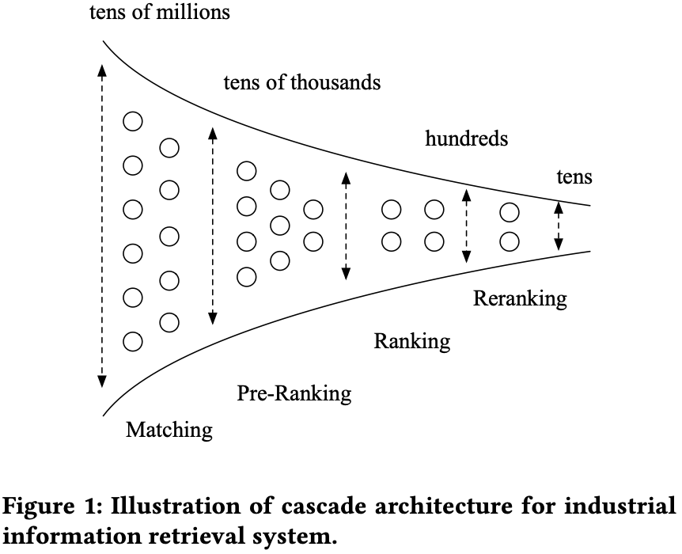
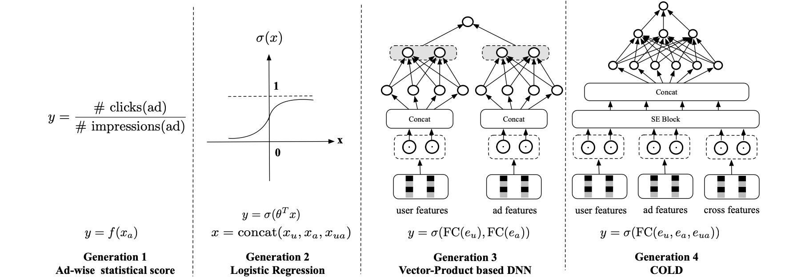
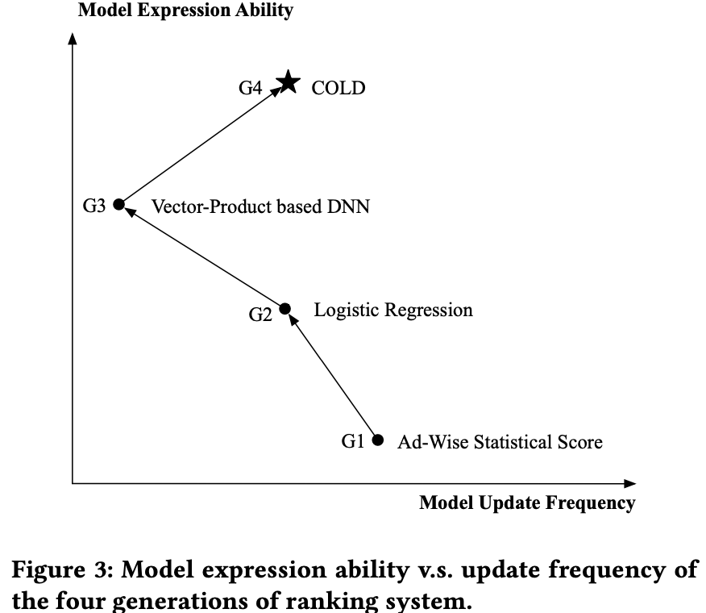
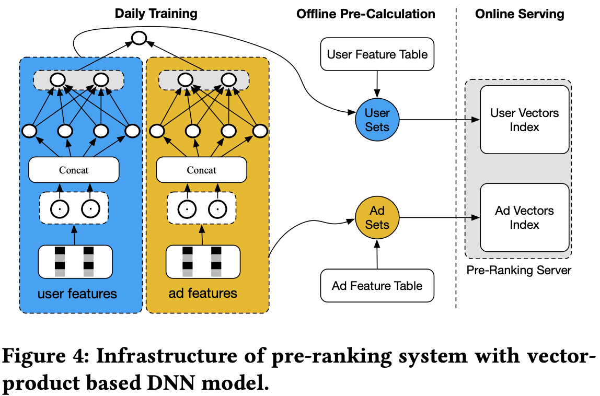

# COLD：迈向下一代预排序系统

> Zhe Wang, Liqin Zhao, Biye Jiang, Guorui Zhou, Xiaoqiang Zhu, Kun Gai | Alibaba Group

本文介绍了 COLD：迈向下一代预排序系统。核心内容：

- 从算法-系统协同设计的角度重新思考预排序系统的挑战，将计算能力成本视为可与模型性能联合优化的变量
- 提出COLD（Computing power cost-aware Online and Lightweight Deep pre-ranking system，计算能力成本感知的在线轻量级深度预排序系统），任意带交叉特征的深度模型都可在可控计算能力成本约束下应用
- 通过全层级并行化、基于列的计算、低精度GPU计算（Float16 + MPS）等工程优化技巧显式降低计算能力成本
- COLD以 **在线学习和在线服务** 方式运行，具备出色的处理数据分布漂移的能力，支持高效的新模型开发和在线A/B测试

关键发现：

- 相比**基于向量积的DNN模型**，COLD在常规天数实现6.1%的CTR提升和6.5%的RPM提升，在双十一活动期间提升达9.1%的CTR和10.8%的RPM
- COLD与排序模型DIEN的GAUC相当，在GAUC和召回率上均显著优于基于向量积的模型
- 结合Float16与CUDA MPS可将可用QPS相比Float32翻倍（2800提升至6700）
- 自2019年以来，COLD已部署在阿里巴巴**展示广告系统**中几乎所有涉及预排序模块的产品中

---

## 摘要

多级级联架构广泛存在于许多工业系统中，如推荐系统和在线广告，这些系统通常由包括匹配、预排序、排序等在内的顺序模块组成。长期以来，人们认为预排序只是排序模块的一个简化版本，因为需要排序的候选集规模更大。因此，大部分工作集中在简化排序模型，以应对在线推理的计算能力爆炸问题。例如，展示广告系统中最先进的预排序方案是将预排序模型限制为基于向量积的深度学习架构：用户侧和广告侧向量以离线方式预先计算，**不涉及用户-广告交叉特征**，然后在线计算两个向量的内积以获取预排序分数。显然，这种模型限制导致了次优的性能。

在本文中，我们从**算法-系统协同设计**的角度重新思考预排序系统的挑战。我们**不再通过对模型架构施加限制来节省计算能力**（这会导致模型性能损失），而是通过 **联合优化预排序模型及其计算成本** 来设计一种新的预排序系统。我们将其命名为COLD（计算能力成本感知的在线轻量级深度预排序系统）。COLD在以下三个方面超越了现有最先进技术：（i）在可控计算能力成本的约束下，任意带有交叉特征的深度模型都可以应用于COLD；（ii）通过应用推理加速的优化技巧显式降低计算能力成本，这为进一步应用更复杂的深度模型以获得更好性能创造了空间；（iii）COLD模型以在线学习和在线服务方式运行，使其具备出色的处理数据分布漂移挑战的能力。同时，COLD的完全在线预排序系统为我们提供了灵活的基础设施，支持高效的新模型开发和在线A/B测试。自2019年以来，COLD已部署在阿里巴巴展示广告系统中几乎所有涉及预排序模块的产品中，带来了显著的改进。

**关键词**：Pre-ranking system, **algorithm-system co-design**, computing power

## 1 引言

近年来，由于互联网服务的快速增长，用户一直遭受信息过载的困扰。搜索引擎、推荐系统和在线广告已成为基础的信息检索应用，每天服务数十亿用户。这些系统大多 [1-3, 9, 13-16] 采用多级级联架构，即通过匹配、预排序、排序、重排序等顺序模块来提取候选。图1给出了简要说明。

**图1：工业信息检索系统级联架构的示意图。**

已有大量论文讨论如何构建有效且高效的排序系统 [1-5, 10, 13-16]。然而，很少有工作关注预排序系统 [9, 14]。为简单起见，在本文的其余部分，我们将仅限于讨论展示广告系统中的预排序系统设计。此处讨论的技术可以轻松应用于推荐系统、搜索引擎等。

**长期以来，人们认为预排序只是排序系统的简化版本**，因为在线服务中需要排序的候选集规模更大，带来了计算能力成本的挑战。以阿里巴巴的展示广告系统为例，传统上，预排序系统需要评分的候选集规模可达数万，而后续排序系统则降为数百。另一方面，排序和预排序系统都有严格的延迟限制，例如**10~20毫秒**。在这种情况下，预排序系统通常被设计为轻量级排序系统，通过简化排序模型来处理在线推理的计算能力爆炸问题。

### 1.1 预排序系统发展简史

回顾工业界预排序系统的发展历史，我们可以从模型角度将其**大致分为四代**，如图2所示。第一代是非个性化的广告侧统计分数，它通过计算每个广告近期的点击率（CTR，Click-Through Rate）平均值来得到预排序分数，该分数可以高频更新。逻辑回归（LR，Logistic Regression）模型是第二代，它是浅层机器学习时代大规模排序模型的轻量级版本，可以以在线学习和在线服务的方式部署 [11]。基于向量积的深度学习模型 [2] 是第三代，也是当前最先进的预排序模型。在这种方法中，用户侧和广告侧的嵌入向量以离线方式分别预计算，不涉及用户-广告交叉特征，然后在线计算两个向量的内积以获得预排序分数。尽管基于向量积的DNN显著提升了前两代的模型性能，但它仍面临两个挑战，留有进一步改进的空间：（i）模型表达能力。如文献 [17] 所示，将深度模型限制为向量积形式会限制其表达能力；（ii）模型更新频率。基于向量积的DNN的嵌入向量需要离线预计算，然后加载到服务器内存中进行在线计算。这意味着**基于向量积的DNN模型只能以低频方式更新，难以适应最新的数据分布漂移**，尤其是在数据剧烈变化时（例如中国的双十一活动）。

**图2：图2从模型视角展示了预排序系统的发展历史。$x_u$、$x_a$、$x_{ua}$ 是用户、广告和交叉特征的原始特征。$e_u$、$e_a$、$e_{ua}$ 是用户、广告和交叉特征的嵌入。第一代是非个性化的广告侧统计模型。逻辑回归（LR）模型是第二代，它是浅层机器学习时代大规模排序模型的轻量级版本 [9]，可以以在线学习和在线服务的方式部署。基于向量积的深度学习架构是第三代，也是当前最先进的预排序模型，它显著提升了相比前一代的模型性能。COLD是我们提出的新一代预排序模型。**

总之，上述三代预排序系统都遵循相同的范式：**将计算能力视为恒定约束，在此约束下开发与之对应的预排序模型以及训练和服务系统。也就是说，模型的设计和计算能力的优化是解耦的，这通常导致模型被简化以适应计算能力的要求，从而产生次优的性能。**

### 1.2 COLD：新一代预排序系统

在本文中，我们从算法-系统协同设计的角度重新思考预排序系统的挑战。我们不再通过对模型架构施加限制（这限制了性能）来节省计算能力，而是通过联合优化预排序模型及其计算成本来设计一种新的预排序系统。我们将其命名为COLD（计算能力成本感知的在线轻量级深度预排序系统），如图2所示。我们将COLD视为第四代预排序系统。**COLD同时考虑了模型设计和系统设计**。**在COLD中，计算能力成本也是一个可以与模型性能联合优化的变量。换句话说，COLD是一个灵活的预排序系统，模型性能和计算能力成本之间的权衡是可控制的。**

COLD的主要特点总结如下：

- 在可控计算能力成本的约束下，任意带有交叉特征的深度模型都可以应用于COLD。在我们的实际系统中，COLD模型是一个带有SE（Squeeze-and-Excitation）块 [6] 的七层全连接深度神经网络。SE块帮助我们进行特征组选择，从复杂排序模型中获取轻量级版本。这种选择通过同时考虑模型性能和计算能力成本来执行。也就是说，COLD模型的计算能力成本是可控的。
- 通过应用并行计算和半精度计算等优化技巧进行推理加速，显式降低计算能力成本。这进一步为COLD应用更复杂的深度模型以获得更好性能创造了空间。
- COLD模型以在线学习和在线服务方式运行，使系统具备出色的处理数据分布漂移挑战的能力。COLD的完全在线预排序系统为我们提供了灵活的基础设施，支持新模型开发和快速在线A/B测试，这也是目前排序系统拥有的最佳系统实践。

图3从模型表达能力和更新频率两方面对所有四代排序系统进行了比较。COLD实现了最佳的权衡。自2019年以来，COLD已部署在阿里巴巴展示广告系统中几乎所有涉及预排序模块的产品中，每天服务数亿用户的高并发请求。与基于向量积的DNN（我们上一版本的在线预排序模型）相比，COLD为我们带来了超过6%的RPM提升，这对业务而言是一个显著的改进。

**图3：四代排序系统在模型表达能力与更新频率上的对比。**

本文其余部分组织如下：第2节将概述工业预排序系统，第3节将详细介绍COLD，包括模型设计、计算能力成本优化 和 **整体基础设施**等问题，第4节和第5节将给出实验比较和结论。

## 2 预排序系统概述

如图1所示，预排序可视为匹配模块和排序模块之间的连接纽带。它接收匹配的结果，进行粗略筛选，以减少后续排序模块的候选集规模。以阿里巴巴的展示广告系统为例，输入预排序系统的候选集规模 $M$ 通常达到数万。然后预排序模型根据某些指标（例如广告系统的eCPM（expected Cost Per Mille，千次展示期望成本）[^1]）选择前 $N$ 个候选。$N$ 的数量级通常为数百。这些胜出的 $N$ 个候选再由复杂排序模型进一步排序，得到最终展示给用户的结果。

一般来说，预排序的功能与排序类似。最大的区别在于问题的规模。显然，预排序系统需要排序的候选数量比排序系统大10倍或更多。直接将排序模型应用于预排序系统似乎是不可能的，这将面临巨大的计算能力成本挑战。如何平衡模型性能及其计算成本是设计预排序系统的关键考量。

### 2.1 基于向量积的DNN模型

受深度学习成功的驱动，基于向量积的DNN模型 [2] 已在预排序系统中得到广泛应用，并取得了最先进的性能。如图2所示，基于向量积的DNN模型架构由两个并行的子神经网络组成。用户特征输入左侧子网络，广告特征输入右侧子网络。对于每个子网络，特征首先输入嵌入层，然后拼接在一起，之后是全连接（FC，Fully Connected）层。通过这种方式，我们得到两个固定大小的向量 $v_u$ 和 $v_a$，分别表示用户和广告信息。最后，预排序分数 $p$ 计算如下：

$$
p = \sigma(v_u^T v_a), \text{where } \sigma(x) = \frac{1}{1 + e^{-x}} \qquad (1)
$$

基于向量积的DNN模型的训练方式与传统排序模型相同。为了聚焦预排序模型的关键部分，我们省略了训练细节。读者可参考之前的工作如 [15, 16] 了解详细介绍。

### 2.2 基于向量积的DNN模型的预排序系统的不足

基于向量积的DNN模型在延迟和计算资源方面是高效的。$v_u$ 和 $v_a$ 的向量可以离线分别预计算，分数 $p$ 可以在线计算。这使得它足够友好地应对计算能力成本的挑战。图4说明了经典的基础设施实现。与之前的预排序模型相比，基于向量积的DNN模型实现了显著的性能提升。

**图4：基于向量积的DNN模型的预排序系统的基础设施。**

然而，基于向量积的DNN模型过于关注降低计算能力成本，将模型限制为向量积形式，这导致了次优的性能。我们将其不足总结如下：

- 模型表达能力受到向量积形式的限制，无法利用用户-广告交叉特征。之前的工作 [17] 已经表明，结合复杂深度模型相比向量积形式的网络具有明显的优越性。
- $v_u$ 和 $v_a$ 的用户和广告向量需要通过枚举所有用户和广告离线预计算，以减少计算资源并优化延迟。对于拥有数亿用户和数千万广告的业务，预计算通常需要数小时，使其难以适应数据分布漂移。当数据剧烈变化时（例如中国的双十一活动），这将严重损害模型性能。
- 模型更新频率也受到系统实现的影响。对于基于向量积的DNN模型，用户/广告向量索引版本的日常切换需要同时执行，而两个索引存储在不同的在线系统中时很难满足这一要求。根据我们的经验，延迟切换也会损害模型性能。

基于向量积的DNN模型的预排序系统的这些不足源于对降低计算能力的过度追求，且难以完全解决。在接下来的章节中，我们将介绍我们的新解决方案，它打破了预排序系统的经典设计方法。

## 3 COLD：计算能力成本感知的在线轻量级深度预排序系统

在本节中，我们将详细介绍我们新设计的预排序系统COLD。COLD背后的核心思想是同时考虑模型设计和系统设计。在COLD中，计算能力成本也是一个可以与模型性能联合优化的变量。换句话说，COLD是一个灵活的预排序系统，模型性能和计算能力成本之间的权衡是可控制的。

### 3.1 COLD中的深度预排序模型

与通过限制模型架构来降低计算能力成本从而导致模型性能损失的基于向量积的DNN模型不同，COLD允许应用任意复杂架构的深度模型以确保最佳的模型性能。换句话说，最先进的深度排序模型可以在COLD中使用。例如，在我们的实际系统中，我们采用GwEN（分组嵌入网络，在 [16] 中称为baseModel）作为初始模型架构，它是我们排序系统中在线模型的早期版本。图2展示了GwEN，它是一个全连接层，以特征组分组的嵌入拼接作为输入。注意，GwEN网络中也包含交叉特征。

当然，在预排序系统中需要排序的候选集规模更大的情况下，直接应用具有复杂架构的深度排序模型进行在线推理的计算能力成本是不可接受的。为了应对这一关键挑战，我们采用了两种优化策略：一种是设计灵活的网络架构，可以在模型性能和计算能力成本之间进行权衡；另一种是通过应用工程化的推理加速优化技巧来显式降低计算能力成本。

### 3.2 灵活网络架构的设计

总体来说，我们需要引入合适的网络架构设计，从初始GwEN模型的完整版本获得深度模型的轻量级版本。网络剪枝、特征选择和神经架构搜索等技术都可以应用于此任务。在我们的实际实践中，我们选择了特征选择方法，便于在模型性能和计算能力成本之间进行可控权衡。其他技术也同样适用，留给读者进一步尝试 [7, 8]。

具体来说，我们应用SE（Squeeze-and-Excitation）块 [6] 进行特征选择。SE块最初用于计算机视觉（CV，Computer Vision）领域，用于显式建模通道间的内部依赖关系。在这里，我们使用SE块来获取分组特征的重要性权重，并通过衡量模型性能和计算能力成本来选择COLD中最合适的分组特征。

**重要性权重计算。** 令 $e_i$ 表示第 $i$ 个输入特征组的嵌入。特征组总数为 $M$。SE块将输入 $e_i$ 压缩为标量权重值 $s_i$，计算如下：

$$
s = \sigma(W[e_1, ..., e_m] + b) \qquad (2)
$$

其中 $s \in \mathbb{R}^M$ 是一个向量，$W \in \mathbb{R}^{k \times M}$，$b \in \mathbb{R}^M$。$W$ 和 $b$ 是可学习参数。然后，新的加权嵌入 $v_i$ 通过在嵌入 $e_i$ 和重要性权重 $s_i$ 之间进行逐域乘法来计算。

**特征组选择。** 权重向量 $s$ 表示每个特征组的重要性。我们使用权重对所有特征组进行排序，并选择权重最高的 $K$ 组特征。然后进行离线测试，评估使用选定的 $K$ 组特征的候选轻量级版本模型的模型性能和系统性能。指标包括 GAUC [16]、QPS（每秒查询数，衡量模型吞吐量）和 RT（返回时间，衡量模型延迟）。通过对数量 $K$（即特征组数）进行若干次启发式尝试，我们最终在给定的系统性能约束下选择具有最佳 GAUC 的版本作为最终模型。通过这种方式，可以在模型性能和计算能力成本之间灵活地进行权衡。

### 3.3 工程化优化技巧

除了通过灵活的网络架构设计来降低计算能力成本（这在某种程度上难以避免对模型性能的损害）之外，我们还从工程角度应用了各种优化技巧，以进一步为COLD应用更复杂的深度模型以获得更好性能创造空间。

这里我们介绍在阿里巴巴展示广告系统案例中的实践经验。不同系统的情况可能有所不同，读者可以根据实际情况做出选择。在我们的展示广告系统中，预排序模块的在线推理引擎主要包括两部分：特征计算和稠密网络计算。在特征计算中，引擎从索引系统中拉取用户和广告特征，然后计算交叉特征。在稠密网络计算中，引擎首先将特征转换为嵌入向量，并将它们拼接作为网络的输入。

**全层级并行化。** 为了实现低延迟和高吞吐量的推理以及低计算能力成本，利用并行计算非常重要。因此，我们的系统在可能的情况下都会应用并行化。幸运的是，不同广告的预排序分数是相互独立的。这意味着它们可以并行计算，代价是可能存在一些与用户特征相关的重复计算。

在高层级上，一个前端用户查询将被拆分为多个推理查询。每个查询处理部分广告，所有查询返回后合并结果。因此，在决定拆分为多少个查询时存在权衡。更多的查询意味着每个查询处理的广告更少，因此单个查询的延迟更低。但过多的查询也会导致大量的重复计算和系统开销。此外，由于查询在我们的系统中是使用RPC（远程过程调用）实现的，更多的查询意味着更多的网络流量，并且可能导致更高的延迟或失败概率。

在处理每个查询时，使用多线程处理进行特征计算。同样，每个线程处理部分广告以减少延迟。最后，在执行稠密网络推理时，我们使用GPU来加速计算。

**基于列的计算。** 传统上，特征计算以基于行的方式进行：广告逐个被处理。然而，这种基于行的方法对缓存不友好。相反，我们使用基于列的方法将一个特征列的计算放在一起。图5说明了这两种计算模式。通过这样做，我们可以使用SIMD（单指令多数据流）等技术来加速特征计算。

**图5：基于行的计算与基于列的计算。基于列的方法对缓存友好，并能够实现进一步的加速。**

**低精度GPU计算。** 对于COLD模型，大部分计算是稠密矩阵乘法，这留下了优化空间。在NVIDIA的图灵架构中，T4 GPU为Float16和Int8矩阵乘法提供了极致的性能，完美契合我们的场景。Float16的理论峰值FLOPS可以是Float32的8倍。然而，Float16会损失一些精度。在实践中，我们发现对于某些场景，由于我们对某些特征组使用了求和池化，稠密网络的输入可能是一个非常庞大的数字，超出Float16的表示范围。为了解决这个问题，一种解决方案是使用归一化层，如批归一化层。然而，BN层本身包含移动方差参数，其规模可能更大。这意味着计算图需要采用混合精度 [12]，即全连接层使用Float16，批归一化层使用Float32。另一种方法是使用无参数归一化层。例如，对数函数可以轻松地将大数转换到合理范围内。然而，log()函数无法处理负值，并且当输入接近零时结果可能非常大。因此，我们设计了一个分段平滑函数，称为linear-log算子，来处理这种不良行为，如公式3所示。

$$
\text{linear\_log}(x) = \begin{cases} -\log(-x) - 1, & x < -1 \\ x, & -1 \leq x \leq 1 \\ \log(x) + 1, & x > 1 \end{cases} \qquad (3)
$$

linear_log()函数的图形如图6所示。它将Float32数转换到合理范围内。因此，如果我们把linear_log算子放在第一层，就能保证网络的输入很小。此外，linear_log()函数是 $C^1$ 连续的，所以不会使网络训练变得更难。在实践中，我们发现添加这一层后，网络仍然可以达到与原始COLD模型相同的精度。

**图6：linear_log函数。**

在使用Float16进行推理后，我们发现CUDA内核的运行时间大幅下降，内核启动时间成为瓶颈。为了提升实际的每秒查询数（QPS），我们进一步使用MPS（多进程服务）来减少启动内核时的开销。结合Float16和MPS，引擎的吞吐量是之前的两倍。

### 3.4 COLD预排序系统的完全在线基础设施

得益于不受限制的模型架构，COLD可以在完全在线的基础设施下实现：训练和服务均以在线方式执行，如图7所示。从工业角度来看，这是目前排序系统拥有的最佳系统实践。这种基础设施使COLD在两个方面受益：

- COLD模型的在线学习使其具备出色的处理数据分布漂移挑战的能力。根据我们的经验，如下文的实验部分所示，当数据剧烈变化时（例如中国的双十一活动），COLD模型相对于基于向量积的DNN模型的模型性能提升更为显著。此外，COLD模型通过在线学习对新广告更加友好。
- COLD的完全在线预排序系统为我们提供了灵活的基础设施，支持高效的新模型开发和在线A/B测试。回想一下，对于基于向量积的DNN模型，用户侧和广告侧的向量需要离线预计算并通过索引加载到推理引擎中。因此，对两个版本的基于向量积的DNN模型进行A/B测试需要涉及多个系统的开发。根据我们的经验，获得可靠的A/B测试结果通常需要几天时间，而COLD只需几个小时。此外，完全在线服务还有助于COLD避免基于向量积的DNN模型所遭受的延迟切换问题。

**图7：COLD预排序系统的完全在线基础设施。**

## 4 实验

我们进行了仔细的对比实验来评估所提出的预排序系统COLD的性能。作为一个工业系统，我们在模型性能和系统性能两方面都进行了比较。据我们所知，目前几乎没有用于此任务的公开数据集或预排序系统。以下实验在阿里巴巴的在线展示广告系统中执行。

### 4.1 实验设置

COLD模型的最强基线是最先进的基于向量积的DNN模型，它是我们展示广告系统中最新版本的在线预排序模型。

COLD模型和基于向量积的DNN模型均使用超过900亿个样本进行训练，这些样本来自真实系统的日志。注意，基于向量积的DNN模型与COLD模型使用相同的用户和广告特征。基于向量积的DNN模型无法引入任何用户-广告交叉特征，而COLD模型则使用用户-广告交叉特征。为了公平比较，我们还评估了COLD模型在不同交叉特征组下的性能。对于COLD模型，特征嵌入向量拼接在一起后输入全连接网络（FCN）。该FCN的结构为 $D_{in} \times 1024 \times 512 \times 256 \times 128 \times 64 \times 2$，其中 $D_{in}$ 表示所选特征的拼接嵌入向量的维度。对于基于向量积的模型，全连接层设置为 $200 \times 200 \times 10$。两种模型的输入特征嵌入维度均设为16。我们使用Adam优化器更新模型参数。使用 GAUC [16] 作为评估模型离线性能的指标。此外，我们引入了新的top-k召回率指标，用于衡量预排序模型与后续排序模型之间的一致性程度。top-k召回率定义如下：

$$
\text{recall} = \frac{|\{\text{top } k \text{ ad candidates}\} \cap \{\text{top } m \text{ ad candidates}\}|}{|\{\text{top } m \text{ ad candidates}\}|} \qquad (4)
$$

其中top $k$ 候选和top $m$ 候选来自同一个候选集，即预排序模块的输入。top $k$ 广告候选由预排序模型排序，top $m$ 广告候选由排序模型排序。排序指标是eCPM（expected Cost Per Mille，千次展示期望成本），即 $eCPM = pCTR \times bid$。在我们的实验中，排序模型使用 DIEN [15]，这是在线排序系统的早期版本。

对于系统性能的评估，我们使用的指标包括QPS（每秒查询数，衡量模型吞吐量）和RT（返回时间，衡量模型延迟）。这些指标反映了在相同大小的预排序候选集下模型的计算能力成本。粗略来说，在更低RT下更高的QPS意味着给定模型的计算能力成本更低。

### 4.2 模型性能评估

表1显示了不同模型的离线评估结果。我们可以看到，COLD与我们之前版本的排序模型DIEN保持了可比的GAUC，并且与基于向量积的模型相比，在GAUC和召回率方面都取得了显著的提升。

**表1：离线评估结果。**

| 方法 | GAUC | 召回率 |
|------|------|--------|
| 基于向量积的DNN模型 | 0.6232 | 88% |
| COLD | 0.6391 | 96% |
| DIEN | 0.6511 | 100% |

我们还进行了仔细的在线A/B测试。表2显示了COLD模型相对于基于向量积的DNN模型的提升。在常规天数中，COLD模型实现了6.1%的CTR提升和6.5%的RPM（千次展示收入）提升，这对我们的业务意义重大。此外，在双十一活动期间，提升幅度达到9.1%的CTR和10.8%的RPM。这证明了COLD完全在线基础设施的价值，它使模型能够在数据剧烈变化时适应最新的数据分布。

**表2：将COLD模型与基于向量积的DNN模型进行比较的在线A/B测试结果。**

| 时间 | CTR提升 | RPM提升 |
|------|---------|---------|
| 常规天数 | +6.1% | +6.5% |
| 双十一活动 | +9.1% | +10.8% |

### 4.3 系统性能评估

我们评估了使用不同模型服务的预排序系统的QPS和RT。表3给出了结果。基于向量积的模型运行在配备2颗Intel(R) Xeon(R) Platinum 8163 CPU @ 2.50GHz（96核）和512GB RAM的CPU机器上。COLD模型和DIEN运行在配备NVIDIA T4的GPU机器上。在此次测试中，基于向量积的DNN模型取得了最佳的系统性能，这是符合预期的。DIEN的计算能力成本最高。COLD实现了平衡。

**表3：使用不同模型服务的预排序系统的系统性能对比。**

| 模型 | QPS | RT |
|------|-----|-----|
| 基于向量积的DNN模型 | 60000+ | 2ms |
| COLD | 6700 | 9.3ms |
| DIEN | 629 | 16.9ms |

### 4.4 COLD的消融研究

为了进一步理解COLD的性能，我们在模型设计视角和工程优化技术视角两方面进行了实验。对于后者，由于很难将所有优化技术从集成系统中解耦并逐一比较，我们在此对GPU低精度计算这一最重要因素进行评估。

**不同版本COLD模型的预排序系统权衡性能。** 在模型设计阶段，我们使用SE块获取特征重要性权重，选择不同组的特征作为候选模型版本。然后进行离线实验，评估模型的QPS、RT和GAUC。表4显示了结果。显然，COLD模型的计算能力成本随不同特征而变化。这符合我们灵活网络架构的设计理念。具有更多交叉特征的COLD模型实现了更好的性能，但也相应地增加了在线服务的负担。通过这种方式，我们可以在模型性能和计算能力成本之间进行权衡。在我们的实际系统中，我们根据经验手动选择了平衡版本。

**表4：不同版本COLD模型的预排序系统的权衡性能。**

| 模型 | QPS | RT | GAUC |
|------|-----|-----|------|
| COLD（无交叉特征） | 6860 | 8.6ms | 0.6281 |
| COLD * | 6700 | 9.3ms | 0.6391 |
| COLD（全部特征） | 2570 | 10.6ms | 0.6467 |

* 这是我们作为产品版本使用的COLD模型平衡版本，它使用了部分交叉特征。

**不同GPU精度计算比较。** 实验在配备NVIDIA T4的GPU机器上运行。运行实验时，我们逐渐增加客户端的QPS，直到超过1%的服务器响应时间开始超过延迟限制。然后我们将当前的QPS记录为可用QPS。如表5所示，Float32版本的可用QPS最低。单独使用Float16可以将可用QPS提高约21%。结合Float16和CUDA MPS，与Float32相比，我们可以将可用QPS翻倍，并在不超过延迟限制的情况下充分利用GPU。

**表5：使用不同GPU精度计算时的系统性能对比。**

| 精度 | QPS |
|------|-----|
| COLD (Float32) | 2800 |
| COLD (Float16) | 3400 |
| COLD (Float16+MPS) | 6700 |

## 5 结论

在本文中，我们详细介绍了新一代预排序系统COLD。它从一个全新的视角设计。COLD不是通过对模型架构施加严格限制（导致模型性能损失）来节省计算能力，而是同时考虑模型设计和系统设计。在COLD中，计算能力成本也是一个可以与模型性能联合优化的变量。通过模型架构和计算能力成本的协同设计，COLD成为一个灵活的预排序系统，模型性能和计算能力成本之间的权衡是可控的。这种新的预排序系统能够更好地追求模型性能。实验表明，COLD模型相比基于向量积的DNN模型（我们上一版本的在线预排序模型）实现了超过6%的RPM提升，这对业务意义重大。此外，COLD可以以完全在线的基础设施实现训练和服务，达到了当前排序系统拥有的最佳系统实践。自2019年以来，COLD已部署在阿里巴巴的展示广告系统中，服务几乎所有产品的主要流量，为业务收入增长做出了显著贡献。

## 参考文献

[1] Qiwei Chen, Huan Zhao, Wei Li, Pipei Huang, and Wenwu Ou. 2019. **Behavior Sequence Transformer for E-commerce Recommendation in Alibaba**. (May 2019). arXiv:1905.06874

[2] Paul Covington, Jay Adams, and Emre Sargin. 2016. Deep neural networks for youtube recommendations. In Proceedings of the 10th ACM Conference on Recommender Systems. ACM, 191–198.

[3] Miao Fan, Jiacheng Guo, Shuai Zhu, Shuo Miao, Mingming Sun, and Ping Li. 2019. **MOBIUS**. In KDD '19: The 25th ACM SIGKDD Conference on Knowledge Discovery and Data Mining. ACM, New York, NY, USA, 2509–2517.

[4] Kun Gai, Xiaoqiang Zhu, Han Li, Kai Liu, and Zhe Wang. 2017. Learning Piece-wise Linear Models from Large Scale Data for Ad Click Prediction. arXiv preprint arXiv:1704.05194 (2017).

[5] Mihajlo Grbovic and Haibin Cheng. 2018. **Real-time Personalization using Embeddings for Search Ranking at Airbnb**. KDD (2018), 311–320.

[6] Jie Hu, Li Shen, and Gang Sun. 2018. Squeeze-and-excitation networks. In Proceedings of the IEEE conference on computer vision and pattern recognition. 7132–7141.

[7] Tongwen Huang, Zhiqi Zhang, and Junlin Zhang. 2019. **FiBiNET: Combining Feature Importance and Bilinear feature Interaction for Click-Through Rate Prediction**. arXiv.org (May 2019), 169–177. arXiv:1905.09433v1 [cs.LG]

[8] Bin Liu, Chenxu Zhu, Guilin Li, Weinan Zhang, Jincai Lai, Ruiming Tang, Xiuqiang He, Zhenguo Li, and Yong Yu. **2020. AutoFIS: Automatic Feature Interaction Selection in Factorization Models for Click-Through Rate Prediction**. (March 2020). arXiv:2003.11235

[9] Shichen Liu, Fei Xiao, Wenwu Ou, and Luo Si. 2017. **Cascade ranking for operational e-commerce search**. In Proceedings of the 23rd ACM SIGKDD International Conference on Knowledge Discovery and Data Mining.

[10] Zequn Lyu, Yu Dong, Chengfu Huo, and Weijun Ren. 2020. Deep Match to Rank Model for Personalized Click-Through Rate Prediction. AAAI (2020).

[11] H Brendan McMahan, Gary Holt, David Sculley, Michael Young, Dietmar Ebner, Julian Grady, Lan Nie, Todd Phillips, Eugene Davydov, Daniel Golovin, Sharat Chikkerur, Dan Liu, Martin Wattenberg, Arnar Mar Hrafnkelsson, Tom Boulos, and Jeremy Kubica. 2013. **Ad click prediction - a view from the trenches**. KDD (2013), 1222.

[12] Paulius Micikevicius, Sharan Narang, Jonah Alben, Gregory Diamos, Erich Elsen, David García, Boris Ginsburg, Michael Houston, Oleksii Kuchaiev, Ganesh Venkatesh, and Hao Wu. 2017. Mixed Precision Training. arXiv.org (Oct. 2017). arXiv:1710.03740v3 [cs.AI]

[13] Qi Pi, Weijie Bian, Guorui Zhou, Xiaoqiang Zhu, and Kun Gai. 2019. Practice on Long Sequential User Behavior Modeling for Click-through Rate Prediction. In Proceedings of the 25th ACM SIGKDD International Conference on Knowledge Discovery & Data Mining. ACM, 1059–1068.

[14] Wenjin Wu, Guojun Liu, Hui Ye, Chenshuang Zhang, Tianshu Wu, Daorui Xiao, Wei Lin, and Xiaoyu Zhu. 2018. EENMF: An End-to-End Neural Matching Framework for E-Commerce Sponsored Search. (Dec. 2018). arXiv:1812.01190

[15] Guorui Zhou, Na Mou, Ying Fan, Qi Pi, Weijie Bian, Chang Zhou, Xiaoqiang Zhu, and Kun Gai. 2019. Deep interest evolution network for click-through rate prediction. In Proceedings of the 33nd AAAI Conference on Artificial Intelligence. Honolulu, USA.

[16] Guorui Zhou, Xiaoqiang Zhu, Chenru Song, Ying Fan, Han Zhu, Xiao Ma, Yanghui Yan, Junqi Jin, Han Li, and Kun Gai. 2018. Deep interest network for click-through rate prediction. In Proceedings of the 24th ACM SIGKDD International Conference on Knowledge Discovery & Data Mining. ACM, 1059–1068.

[17] Han Zhu, Xiang Li, Pengye Zhang, Guozheng Li, Jie He, Han Li, and Kun Gai. 2018. **Learning Tree-based Deep Model for Recommender Systems**. COLING stat.ML (2018), 1079–1088.

[^1]: eCPM = pCTR * bid，适用于基于CPC（Cost Per Click，按点击付费）竞价的广告系统。
