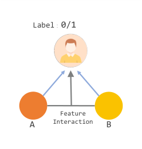
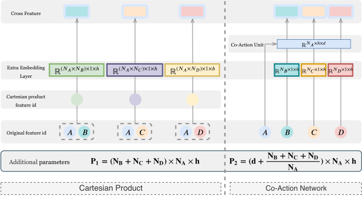
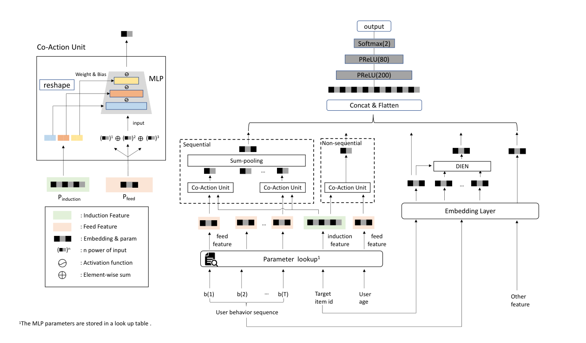
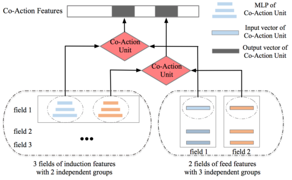
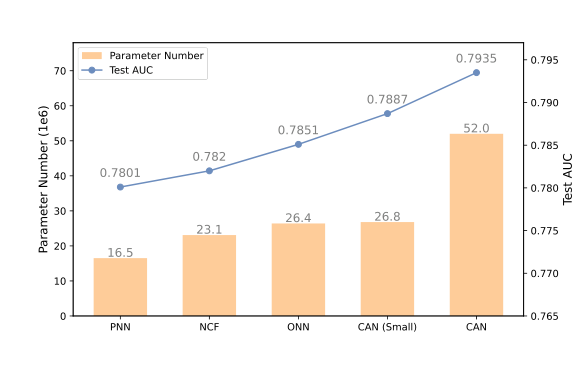

# CAN：面向点击率预测的特征协同

> Weijie Bian, Kailun Wu, Lejian Ren, Qi Pi, Yujing Zhang, Can Xiao, Xiang-Rong Sheng, Yong-Nan Zhu, Zhangming Chan, Na Mou, Xinchen Luo, Shiming Xiang, Guorui Zhou, Xiaoqiang Zhu, Hongbo Deng | Alibaba Group; Institute of Automation, Chinese Academy of Sciences
>
> {weijie.bwj, kailun.wukailun, lejian.rlj, dhb167148}@alibaba-inc.com
>
> † 阿里巴巴集团；‡ 中国科学院自动化研究所，中国
>
> ∗ 洪波邓为通讯作者（dhb167148@alibaba-inc.com）。

本文介绍了 CAN（Co-Action Network，协同网络），一种面向点击率（CTR，Click-Through Rate）预测的特征协同模型。CAN 通过学习特征 A 的嵌入和表示特征 B 的多层感知机（MLP，Multi-Layer Perceptron）来近似显式的成对特征交互，无需引入过多额外参数。核心内容：

- 提出协同网络（CAN），将特征交互建模为将一侧特征的嵌入传递经过另一侧特征的微 MLP，从而在有限参数下拟合复杂的特征交互
- 通过多阶增强（Multi-order Enhancement）和多级独立性（Multi-level Independence）进一步丰富 CAN 的表达能力
- 在公共与工业数据集上的实验表明，CAN 优于最先进的 CTR 模型与笛卡尔积方法

关键发现：

- 当微 MLP 为单层时，因子分解机（FM，Factorization Machine）可以视为 CAN 单元的一个特例
- CAN 已部署在阿里巴巴展示广告系统中，CTR 提升 12%，千次展示收入（RPM，Revenue Per Mille）提升 8%

---

## 摘要

特征交互已被认为是机器学习中的一个重要问题，对于点击率（CTR，Click-Through Rate）预测任务也至关重要。近年来，深度神经网络（DNN，Deep Neural Network）能够从原始稀疏特征中自动学习隐式非线性交互，因此已广泛用于工业 CTR 预测任务。然而，DNN 中学习的隐式特征交互无法无损失地完全保留原始和经验特征交互（例如笛卡尔积）的完整表示能力。例如，一个简单的尝试——学习特征 A 和特征 B 的组合 $<A, B>$ 作为新特征的显式笛卡尔积表示——可以胜过先前的隐式特征交互模型，包括因子分解机（FM，Factorization Machine）模型及其变体。这表明显式和隐式特征交互模型之间仍然存在很大差距。然而，学习所有显式特征交互（笛卡尔积）表示需要非常大的样本量以及原始参数空间的 $N$ 倍大小（在大多数工业应用中 $N$ 相当大）。在本文中，我们提出了一个协同网络（CAN，Co-Action Network）来近似显式的成对特征交互，而无需引入太多额外参数。更具体地说，给定特征 A 及其关联特征 B，它们的特征交互通过学习两组参数来建模：1）特征 A 的嵌入，和 2）表示特征 B 的多层感知机（MLP，Multi-Layer Perceptron）。近似特征交互可以通过将特征 A 的嵌入传递经过特征 B 的 MLP 网络来获得。我们将这种成对特征交互称为特征协同，这样的协同网络单元可以提供非常强大的能力来拟合复杂的特征交互。此外，当 MLP 是只有一个输出的单层时，FM 可以视为 CAN 单元的一个特例。在公共和工业数据集上的实验结果表明，CAN 优于最先进的 CTR 模型和笛卡尔积方法。此外，CAN 已部署在阿里巴巴的展示广告系统中，在 CTR 上获得了 12% 的提升，在千次展示收入（RPM，Revenue Per Mille）上获得了 8% 的提升，这对业务来说是一个巨大的改进。本文实验的代码已开源 1。

允许为个人或课堂教学目的制作本作品的部分或全部数字或硬拷贝，无需付费，前提是副本不被制作或分发用于盈利或商业优势，并且副本在第一页上带有此声明和完整引用。必须尊重本作品第三方组件的版权。对于所有其他用途，请联系所有者/作者。

WSDM '22，2022年2月21–25日，美国亚利桑那州坦佩。
© 2022 版权归所有者/作者所有。
ACM ISBN 978-1-4503-9132-0/22/02。
https://doi.org/10.1145/3488560.3498435

## CCS概念
• 信息系统 $\rightarrow$ 计算广告。

## 关键词
CTR Prediction; Neural Networks; Feature Interaction

## ACM引用格式：
Weijie Bian†, Kailun Wu†, Lejian Ren†, Qi Pi†, Yujing Zhang†, Can Xiao†, Xiang-Rong Sheng†, Yong-Nan Zhu†, Zhangming Chan†, Na Mou†, Xinchen Luo†, and Shiming Xiang‡, Guorui Zhou†, Xiaoqiang Zhu†, Hongbo Deng†. 2022. CAN: Feature Co-Action for Click-Through Rate Prediction. In Proceedings of the Fifteenth ACM International Conference on Web Search and Data Mining (WSDM '22), February 21–25, 2022, Tempe, AZ, USA. ACM, New York, NY, USA, 9 pages. https://doi.org/10.1145/3488560.3498435

## 1 引言

随着机器学习模型复杂度的不断增长，尤其是推荐系统中的模型，如何有效且高效地处理丰富的输入特征成为一个关键问题。对于工业环境中的在线推荐系统，模型通常基于数十亿规模的稀疏特征进行训练，采用独热编码[3, 17, 28]。每个特征也可以看作一个唯一 ID，在输入模型之前通常映射为低维嵌入。处理大规模输入的一个简单方法是独立考虑每个特征。在这种策略下，可以直接训练 DNN 基于特征的组合（例如拼接）来估计 CTR，其中特征交互依赖于全连接层的隐式建模。

然而，推荐系统中的特征如“候选 item”和“用户点击历史”高度相关[27, 28]，即存在共现信息。另一个典型例子是“啤酒与尿布”的故事。这种特征交互有助于更准确地估计 CTR。如图 1 所示，如果不考虑特征交互，特征 A 和 B 对最终标签（CTR 预测中的点击或不点击）的影响是独立建模的，如蓝线所示。灰色线所示的特征交互显式地将特征对 $(A, B)$ 的相关性与目标标签联系起来，并为学习目标带来更多有用信息。我们将在第 3 节更深入地讨论。

为了建模特征交互，最简单的方法是使用笛卡尔积。给定两个特征 A 和 B，一旦选择了特征 A 和 B，共现 $<A, B>$ 被视为一个新特征并输入模型。由于共现信息以额外输入的形式直接提供，训练过程变得更加容易。虽然笛卡尔积简单有效，但它有一些严重缺陷，例如参数量和特征空间巨大，泛化能力差。

1 https://github.com/CAN-Paper/Co-Action-Network

与引入额外输入信息的笛卡尔积不同，一些研究工作致力于通过输入特征的精心组合来建模特征交互。典型的例子是基于因子分解的方法[12, 14, 16, 19, 23, 24]，这些方法通过直接在潜在向量空间中使用各种算子组合特征嵌入，强调低阶和/或高阶特征交互。由于这些方法从模型角度考虑特征交互且算子设计良好，与笛卡尔积相比通常更易于部署。然而，它们仍有一些不可忽视的缺点。遗憾的是，一些基于因子分解的方法[9, 23]的浅层结构限制了它们的表示能力。更关键的是，其算子生成的嵌入同时承担了表示学习和特征交互建模的责任，这可能阻碍训练过程。这种组合方式降低了特征交互的记忆能力，从而削弱了模型容量。

为了解决这些问题，我们提出了协同网络（CAN，Co-Action Network），它能够捕获特征交互并有效利用不同特征对的相互和共同信息。具体来说，对于每个特征对，一侧（归纳特征）的嵌入用于构造一个 MLP，应用于协同单元中的另一侧（馈入特征）。这种特征交互建模范式将额外参数从 $O(N^2 \times D)$ 减少到 $O(N \times (D^{\prime} + D))$ （ $N$ 是特征数量， $D$ 和 $D^{\prime}$ 是协同单元中使用参数的维度， $D < D^{\prime} \ll N$ ），与笛卡尔积相比。此外，CAN 在协同单元中使用 MLP 提供了更强大的拟合能力和更好的非线性，优于传统的基于因子分解的方法。此外，CAN 区分了表示学习和特征交互建模的参数空间，以避免训练中的相互干扰。进一步利用多阶增强和多级独立性来丰富 CAN 的表达能力。

本文的主要贡献总结如下：
• 我们研究了笛卡尔积的有效性，并指出了隐式特征交互建模的潜力。受笛卡尔积独立编码的启发，我们设计了一种新的特征交互范式，与笛卡尔积相比具有相当的性能，但资源消耗少得多。
• 我们提出了协同网络（CAN，Co-Action Network）来在输入阶段对原始特征之间的特征交互进行建模。CAN 中的每个特征 ID 将分配给一个独立的微 MLP 来建模与其他特征的交互。通过这种方式，CAN 在有限参数下提高了建模特征交互的表达能力。独立的微 MLP 比基于因子分解的方法中使用的普通算子具有更强大的表达能力。
• 我们在公共和工业数据集上进行了大量实验。一致的优越性验证了 CAN 与其他最先进的竞争对手相比在建模特征交互方面的有效性。CAN 的部署在阿里巴巴的展示广告系统中带来了 12% 的 CTR 和 8% 的 RPM 提升。

## 2 相关工作

多项研究工作致力于建模 CTR 预测中的特征交互。这些方法可以分为几类：基于聚合、基于图和基于因子分解的方法。我们简要介绍和讨论如下。

深度 CTR 预测模型通常遵循嵌入和 MLP 范式。大规模稀疏输入特征或 ID 首先被映射为低维嵌入向量，然后以分组方式聚合成固定长度的向量。最终拼接后的向量作为输入馈入多层感知机（MLP，Multi-Layer Perceptron）。一系列研究工作专注于学习如何聚合特征以获得用于 CTR 预测的判别性表示。DIN（Deep Interest Network，深度兴趣网络）和 DIEN（Deep Interest Evolution Network，深度兴趣演化网络）[27, 28] 使用注意力机制针对给定目标 item 局部地激活历史行为，并成功捕获了用户兴趣的多样性特征。MIND（Multi-Interest Network with Dynamic Routing，多兴趣网络）[11] 使用充分的多向量来捕获用户和 item 中的复杂模式。此外，受自注意力架构在序列学习任务中成功应用的启发[2, 21]，Feng 等人[4] 将 Transformer 引入特征聚合。MIMN（Multi-channel user Interest Memory Network，多通道用户兴趣记忆网络）[13] 提出了一种基于记忆的架构来聚合特征并应对长期用户兴趣建模的挑战。这些基于聚合的方法仅将特征交互作为每个用户行为的权重来表示用户兴趣。

基于图的方法如图神经网络（GNN，Graph Neural Network）[5, 8] 对每个节点进行特征传播，其中聚合邻域信息。[1, 10, 22] 提出了一种基于谱图的卷积网络扩展，将自注意力机制引入图以进行特征传播。还有一些工作[18, 20, 26] 利用不同节点之间的元路径进行嵌入学习。尽管基于图的方法在图数据上取得了巨大成功，但特征交互仅通过一维权重（表示连接强度）来建模，导致交互的表达不充分。

因子分解机（FM，Factorization Machine）[16] 是浅层模型时代的代表性方法。在 FM 中，特征交互被建模为特征潜在向量的内积。然而，FM 在不同类型的场间交互中使用相同的潜在向量。DeepFM（Deep Factorization Machine，深度因子分解机）[6] 将因子分解机作为 Wide&Deep[3] 中的“wide”模块，无需手动构造笛卡尔积特征。在基于乘积的神经网络（PNN，Product-based Neural Network）[14, 15] 中，引入了乘积层来捕获场间类别之间的特征交互。深度交叉网络（DCN，Deep & Cross Network）[23] 在每一层应用特征交叉。操作感知神经网络（ONN，Operation-aware Neural Network）[25] 通过一些不同的操作来学习特征交互。尽管上述方法与普通 DNN 相比取得了一定的性能提升，但每个 ID 的嵌入同时承担了表示学习和交互建模的责任，它们之间的相互干扰可能会损害性能。

图 1：特征交互示意图。蓝线表示两个特征 A 和 B 对最终标签的影响是分别建模的，而灰线中的特征交互将它们桥接在一起。

## 3 重新审视 CTR 预测的特征交互

在广告系统中，用户 $u$ 点击广告 $m$ 的预测 CTR $\hat{y}$ 通过以下方式计算：

$$
\hat{y} = \mathrm{DNN}\left(E(u_1), \cdots, E(u_I), E(m_1), \cdots, E(m_J)\right) \qquad (1)
$$

其中 $U = \{u_1, \cdots, u_I\}$ 是用户特征集合，包括浏览和点击历史、用户画像特征等， $M = \{m_1, \cdots, m_J\}$ 是 item 特征集合。用户和 item 特征通常是唯一 ID。 $E(\cdot) \in \mathbb{R}^d$ 表示大小为 $d$ 的嵌入，将稀疏 ID 映射为可学习的稠密向量作为 DNN 的输入。除了这些一元项，先前的工作将特征交互建模为二元项：

$$
\hat{y} = \mathrm{DNN}\left(E(u_1), \cdots, E(u_I), E(m_1), \cdots, E(m_J), \{F(u_i, m_j)\}_{i \in [1, \cdots, I], j \in [1, \cdots, J]}\right) \qquad (2)
$$

其中 $F(u_i, m_j) \in \mathbb{R}^d$ 表示用户特征 $u_i$ 和 item 特征 $m_j$ 之间的交互。由于特征共现的存在（如前节“啤酒与尿布”的例子所示），模型可以从特征交互中受益。因此，如何有效建模特征交互对于提升性能至关重要。

在仔细回顾之前的方法后，可以发现它们要么将特征交互作为权重，要么与其他目标一起隐式地学习相关性，这可能产生不令人满意的结果。学习特征交互最直接的方式是将特征组合视为新特征，并为每个特征组合直接学习嵌入向量，例如笛卡尔积。笛卡尔积提供了独立的参数空间，因此具有足够的灵活性来学习协同信息，以提高预测能力。

然而，存在一些严重缺陷。首先是参数爆炸问题。大小为 $N$ 的两个特征的笛卡尔积的参数空间将从 $O(N \times D)$ 扩展到 $O(N^2 \times D)$ ，其中 $D$ 是嵌入维度，这将给在线系统带来巨大负担。此外，由于笛卡尔积将 $<A, B>$ 和 $<A, C>$ 视为完全不同的特征，组合之间没有信息共享，这也限制了表示能力。

综合考虑笛卡尔积的优势和计算的服务效率，我们引入了一种新的方式来建模特征交互。如图 2(a) 所示，对于每个特征对，其笛卡尔积产生一个新特征和对应的嵌入。由于不同的特征对可能共享相同的特征，任意两个特征对之间存在隐式相似性，而笛卡尔积忽略了这一点。如果能够有效处理这种隐式相似性，这些对之间的特征交互就可以用比笛卡尔积更小的参数量更有效且更高效地建模。在本文中，受笛卡尔积独立编码的启发，我们首先区分了嵌入和特征交互的参数，从而避免相互干扰。考虑到 DNN 具有强大的拟合能力，我们设计了一个协同单元，以微网络的形式参数化特征嵌入。由于不同的特征对可以共享相同的微网络，相似性信息自然地在该微网络中被学习和存储，如图 2(b) 所示。

图 2：从笛卡尔积到我们的特征协同网络的演进示意图，其中 $A$ 、 $B$ 、 $C$ 和 $D$ 表示四种特征。 $N_A$ 、 $N_B$ 、 $N_C$ 和 $N_D$ 分别表示特征 $A$ 、 $B$ 、 $C$ 和 $D$ 的数量。 $h$ 是特征嵌入的维度， $d$ 是协同单元输出的维度。在该图中，我们使用特征 $A$ 与其他三个特征进行交互。

## 4 协同网络

在本节中，我们提出协同网络（CAN，Co-Action Network）来高效捕获特征交互，它首先引入了一个可插拔模块——协同单元。该单元区分了嵌入学习和特征交互学习的参数。具体来说，它由来自原始特征的两侧信息组成，即归纳侧和馈入侧。归纳侧用于构造一个微 MLP，而馈入侧为其提供输入。此外，为了促进更多非线性和深入挖掘特征交互，引入了多阶增强和多级独立性。

### 4.1 整体架构

CAN 的整体架构如图 3 所示。用户和目标 item 的特征 $U$ 和 $M$ 以两种方式输入 CAN。在第一种方式中，它们使用嵌入层编码为稠密向量 $\{E(u_1), \cdots, E(u_I)\}$ 和 $\{E(m_1), \cdots, E(m_J)\}$ ，并进一步分别拼接为 $e_{\mathrm{item}}$ 和 $e_{\mathrm{user}}$ 。在第二种方式中，我们从 $U$ 和 $M$ 中选择子集 $U_{\mathrm{feed}}$ 和 $M_{\mathrm{induction}}$ ，使用我们提出的协同单元来建模特征交互 $\{F(u_i, m_j)\}_{u_i \in U_{\mathrm{feed}}, m_j \in M_{\mathrm{induction}}}$ 。协同单元的详细解释和实现将在下一子节中阐述。CAN 的公式为：

$$
\hat{y} = \mathrm{DNN}\left(e_{\mathrm{item}}, e_{\mathrm{user}}, \{F(u_i, m_j)\}_{u_i \in U_{\mathrm{feed}}, m_j \in M_{\mathrm{induction}}} \mid \Theta\right) \qquad (3)
$$

其中 $\Theta$ 表示模型中的参数， $\hat{y} \in [0, 1]$ 是点击行为的预测概率。真实点击信息记为 $y \in \{0, 1\}$ 。我们最终最小化预测 $\hat{y}$ 和标签 $y$ 之间的交叉熵损失函数：

$$
\min_{\Theta}\left[-y\log(\hat{y}) - (1 - y)\log(1 - \hat{y})\right] \qquad (4)
$$

图 3：我们的协同网络的整体框架。给定目标 item 和用户特征，嵌入层将稀疏特征编码为稠密嵌入。一些选定的特征被分为两侧 $P_{\mathrm{induction}}$ 和 $P_{\mathrm{feed}}$ ，它们是协同单元的组成部分。 $P_{\mathrm{induction}}$ 参数化微 MLP， $P_{\mathrm{feed}}$ 作为输入。协同单元的输出与公共特征嵌入一起用于最终 CTR 预测。

### 4.2 协同单元

一般来说，协同单元是每个特征对的一个独立 MLP，即微 MLP，其权重、偏置和 MLP 输入由特征对提供。对于特定用户特征 ID $u_o^{\prime} \in U_{\mathrm{feed}}$ ，我们使用参数查找来获得可学习参数 $P_{\mathrm{induction}} \in \mathbb{R}^{D^{\prime}}$ ，而 item 特征 ID $m_o \in M_{\mathrm{induction}}$ 用于 $P_{\mathrm{feed}} \in \mathbb{R}^{D}$ （ $D < D^{\prime}$ ）。接下来， $P_{\mathrm{induction}}$ 被重塑并拆分为微 MLP 的权重矩阵和偏置向量。该过程可以公式化为：

$$
(w_i \parallel b_i) = P_{\mathrm{induction}} \qquad (5)
$$

$$
\sum_{i=0}^{L-1} (|w_i| + |b_i|) = |P_{\mathrm{induction}}| = D^{\prime} \qquad (6)
$$

其中 $w_i$ 和 $b_i$ 表示微 MLP 第 $i$ 层的权重和偏置， $\parallel$ 表示拼接操作， $L$ 决定微 MLP 的深度， $|\cdot|$ 获取变量的大小。该过程的可视化如图 3 左侧所示。

然后将 $P_{\mathrm{feed}}$ 输入微 MLP，通过各层输出的拼接来实现特征交互：

$$
h_0 = P_{\mathrm{feed}} \qquad (7)
$$

$$
h_i = \sigma(w_{i-1} \otimes h_{i-1} + b_{i-1}), \quad i = 1, 2, \cdots, L \qquad (8)
$$

$$
F(u_o^{\prime}, m_o) = H(P_{\mathrm{induction}}, P_{\mathrm{feed}}) = \big\Vert_{i=1}^{L} h_i \qquad (9)
$$

其中 $\otimes$ 表示矩阵乘法， $\sigma$ 表示激活函数， $H$ 表示以向量 $P_{\mathrm{induction}}$ 和 $P_{\mathrm{feed}}$ 为输入的协同单元，而非原始符号 $F$ （其输入为特征 $u_o^{\prime}$ 和 $m_o$ ）。

对于序列特征如用户行为历史 $P_{\mathrm{seq}} = \{P_b^{(t)}\}_{t=1}^{T}$ ，协同单元应用于每个点击行为，然后对序列进行求和池化：

$$
H(P_{\mathrm{induction}}, P_{\mathrm{seq}}) = H\left(P_{\mathrm{induction}}, \sum_{t=1}^{T} P_b^{(t)}\right) \qquad (10)
$$

在我们的实现中， $P_{\mathrm{induction}}$ 从 item 特征获取信息，而 $P_{\mathrm{feed}}$ 来自用户特征。然而， $P_{\mathrm{feed}}$ 也可以作为微 MLP 的参数，反之亦然。经验上，在广告系统中，候选 item 只占所有 item 的一小部分，因此其数量少于用户点击历史中的 item 数量。因此我们选择 $P_{\mathrm{induction}}$ 作为微 MLP 参数以减少总参数量，这使得学习过程更加容易和稳定。

注意，微 MLP 的层数取决于学习的难度。经验上，较大的特征尺寸通常需要更深的 MLP。实际上，当微 MLP 是单层 $1 \times D$ 矩阵且无偏置和激活函数时，FM[6, 16] 也可以视为 CAN 的一个特例。

所提出的协同单元与其他方法相比至少有三个优点。第一，与先前工作中在不同类型的场间交互中使用相同潜在向量不同，协同单元利用微 MLP 的计算能力，并动态耦合两个组分特征 $P_{\mathrm{induction}}$ 和 $P_{\mathrm{feed}}$ ，而不是固定模型，这提供了更多能力来保证两个场特征的解耦更新。第二，需要学习的参数规模更小。例如，考虑两个特征都具有 $N$ 个 ID，其笛卡尔积的参数规模应为 $O(N^2 \times D)$ ，其中 $D$ 是嵌入维度。然而，通过使用协同单元，该规模将减少到 $O(N \times (D^{\prime} + D))$ ，其中 $D^{\prime}$ 是协同单元中 $P_{\mathrm{induction}}$ 的维度。更少的参数不仅有利于学习，而且可以有效减轻在线系统的负担。第三，与笛卡尔积相比，协同单元对新特征组合具有更好的泛化能力。给定一个新的特征组合，只要两侧的嵌入之前训练过，协同单元仍然可以工作。

### 4.3 多阶增强

前述特征是基于一阶特征形成的。然而，特征交互可以在高阶上进行估计。尽管考虑到微 MLP 的非线性，协同单元可以隐式学习高阶特征交互，但由于特征交互的稀疏性，学习过程应该很困难。为此，我们显式引入多阶信息以获得多项式输入。这通过将微 MLP 应用于不同阶的 $P_{\mathrm{feed}}$ 来实现：

$$
H_{\mathrm{Multi-order}}(P_{\mathrm{induction}}, P_{\mathrm{feed}}) = \sum_{c=1}^{C} H\left(P_{\mathrm{induction}}, (P_{\mathrm{feed}})^c\right) \qquad (11)
$$

其中 $C$ 是阶数。我们使用 Tanh 来避免高阶项引起的数值问题。多阶增强在不带来额外计算和存储成本的情况下有效提升了模型的非线性拟合能力。

### 4.4 多级独立性

学习独立性是特征交互建模的主要关注点之一。为了确保学习独立性，我们从不同角度提出了一个三级策略。

第一级，参数独立性，这是必要的。如第 4.2 节所述，我们的方法解耦了表示学习和特征交互建模的更新。参数独立性是 CAN 的基础。

第二级，组合独立性，这是推荐的。特征交互随着特征组合数量的增加而线性增长。经验上，目标 item 特征如“item_id”和“category_id”被选为归纳侧，而用户特征作为馈入侧。由于一个归纳侧微 MLP 可以与多个馈入侧组合，反之亦然，我们的方法可以轻松指数级地扩大模型的表达能力。我们在图 4 中展示了这一想法。形式上，如果归纳侧和馈入侧分别有 $Q$ 和 $S$ 组，则特征交互的组合应满足：

$$
|P_{\mathrm{induction}}| = \sum_{s=1}^{S} \sum_{i=0}^{L_s - 1} \left(|w_i^{(s)}| + |b_i^{(s)}|\right) \qquad (12)
$$

$$
|P_{\mathrm{feed}}| = \sum_{q=1}^{Q} |x^{(q)}| \qquad (13)
$$

其中 $|x^{(q)}|$ 是第 $q$ 个微 MLP 的输入维度。在前向传播中，馈入特征被分成若干部分以满足每个微 MLP。

第三级，阶独立性，这是可选的。为了进一步提高多阶输入中特征交互建模的灵活性，我们的方法为不同阶使用不同的归纳侧嵌入。然而，这些嵌入的维度相应地增加了 $C$ 倍，类似于公式 12。

图 4：组合独立性示意图。

多级独立性有助于特征交互建模，但同时带来了额外的内存访问和计算。独立级别和部署成本之间存在权衡。经验上，模型使用的独立性级别越高，需要的训练数据越多。在我们的实际系统中，使用了三级独立性，但在公共数据集中仅使用参数独立性，因为缺乏训练样本。

## 5 实验

在本节中，我们详细介绍实证研究。在第 5.1 节中，我们首先介绍通用实验设置。结果和讨论在第 5.2 节中阐述。第 5.3 节通过消融研究评估每个组件的效果。

### 5.1 实验设置

数据集。我们在三个公开可访问的 CTR 预测任务数据集上进行实验：Amazon、Taobao 和 Avazu，其统计数据汇总于表 1。

表 1：本文使用的数据集统计。

| 数据集 | 训练 | 验证 | 特征数量 |
|--------|------|------|----------|
| Amazon (book) | 1086120 | 121216 | 912642 |
| Taobao | 691456 | 296192 | 5159463 |
| Avazu | 36387240 | 403793 | 6763060 |

• Amazon 数据集 2 包含来自 Amazon 的产品评论和元数据。在 24 个产品类别中，我们在实验中选择 Books 子集。遵循先前工作[13, 27, 28]，我们随机选择未被特定用户评价的产品作为负样本，并创建相应的用户行为序列。
• Taobao 数据集 3 是一组来自淘宝推荐系统的用户行为数据。该数据集包含约 100 万用户，其行为包括点击、购买、添加 item 到购物车等。每个用户的点击行为被提取并按时间戳排序以构建行为序列。
• Avazu 数据集 4 是一个移动广告数据集，包含 11 天（10 天训练，1 天测试）的真实工业数据，由 Avazu 提供。与 Amazon 和 Taobao 数据集不同，我们使用离散特征建模特征交互，因为该数据集包含各种数据字段，适合验证（非）序列对特征交互建模的效果。在训练期间，第 10 天的数据作为验证集。

2 http://jmcauley.ucsd.edu/data/amazon/
3 https://tianchi.aliyun.com/dataset/dataDetail?dataId=649
4 https://www.kaggle.com/c/avazu-ctr-prediction

竞争对手。为了验证我们方法的有效性，我们将 CAN 与最先进的专注于特征交互建模的 CTR 预测模型进行比较。
• 笛卡尔积是两个集合的乘法，形成所有有序对的集合。生成对的前者属于第一个集合，后者来自第二个集合。
• DeepFM[6] 基于 DNN，采用乘积层结合因子分解机的能力进行推荐。
• xDeepFM[12] 旨在以显式方式和向量级别使用提出的压缩交互网络（CIN，Compressed Interaction Network）生成特征交互。
• FFM 和 DeepFFM[9] 是因子分解机（FM，Factorization Machine）的变体，具有场感知能力，可以对大规模稀疏数据进行分类。DeepFFM 附加一个 DNN 项以隐式融合高阶组合信息。
• PNN[14] 使用乘积层后接全连接层来探索高阶特征交互。
• NCF[7] 提出了一种神经网络架构来建模潜在向量之间的协同过滤。
• ONN[25] 提出了操作感知神经网络，为不同操作学习不同的表示。
• DIEN[27] 设计了一个兴趣提取器层从用户行为序列中捕获用户兴趣。进一步使用兴趣演化层来建模兴趣演化过程。

为了公平比较，DNN 被用作基础模型（CAN-DNN），以便这些方法（除了 DIEN）的差异在于特征交互建模。同时，我们基于 DIEN（CAN-DIEN）进行了额外实验，DIEN 是一种专注于用户兴趣的最先进方法，以评估 CAN 在面向序列建模方面的提升。

实现细节。我们使用 Tensorflow 实现 CAN。具体来说，对于 $P_{\mathrm{induction}}$ ，使用两层 MLP，输入/输出维度设置为 16/8 和 8/4。 $P_{\mathrm{feed}}$ 的阶数设置为 3。模型参数使用高斯分布初始化（均值为 0，标准差为 0.01）。我们使用 Adam 优化训练过程，批量大小设置为 128，学习率设置为 0.001。使用三层 MLP（层大小 $200 \times 80 \times 2$ ）进行最终 CTR 预测。采用常用的指标 AUC 来评估模型性能。注意，所有实验独立进行 5 次，使用随机的训练和验证划分。

### 5.2 结果

整体性能。我们在表 3 和表 4 中报告了我们提出的 CAN 和基线方法在三个数据集上的性能。

表 3 显示了在 Amazon(book) 和 Taobao 数据集上的实验结果。如表 3 所示，CAN-DNN 在两个数据集上均优于其他最先进的方法，与基础模型 DNN 相比，AUC 分别提升了 3.86% 和 4.23%。同时，CAN-DNN 以较大幅度超过了其他特征交互方法，在两个数据集上都优于最强的特征交互（非序列）基线 ONN。因此，它验证了我们的方法在交互建模上的有效性。由于这两个数据集包含丰富的用户序列数据，面向序列的方法（更适合实际工业系统）如 DIEN 表现优于 DNN。因此，我们也使用 DIEN 作为基础模型来评估 CAN 的效果（CAN-DIEN）。结果表明，DIEN 仍然可以从 CAN 中受益，AUC 分别提升了 1.46% 和 1.36%。

表 4 显示了在 Avazu 数据集上的实验结果。尽管 CAN 主要针对包含大量行为序列的真实工业数据设计，但它仍然能够处理非序列输入。Avazu 数据集包含 24 个数据字段，我们选择其中 9 个字段构建 16 种特征组合。经验结果表明，CAN 优于所有其他方法。

与笛卡尔积的比较。首先，值得注意的是，作为一种纯表示学习方法，笛卡尔积方法可以比其他嵌入组合方法获得更好的性能。这表明尽管那些组合方法可以提取特征交互的某些信息，但与直接组合编码（即笛卡尔积）之间仍有很大差距。如表 2 所示，CAN 仅用 1/6 的参数就达到了与笛卡尔积相当的结果。

表 2：基于 DNN 的笛卡尔积和 CAN 在 Amazon (book)、Taobao 和 Avazu 数据集上的 AUC 性能。

| 模型 | Amazon (book) AUC（均值 $\pm$ 标准差） | 参数 | Taobao AUC（均值 $\pm$ 标准差） | 参数 | Avazu AUC（均值 $\pm$ 标准差） | 参数 |
|------|--------------------------------|------|---------------------------|------|--------------------------|------|
| DNN | 0.7640 $\pm$ 0.0007 | 1.0x | 0.8470 $\pm$ 0.0011 | 1.0x | 0.7624 $\pm$ 0.0008 | 1.0x |
| + Cartesian | 0.7891 $\pm$ 0.0007 (3.29% $\uparrow$ ) | 17.0x | 0.8863 $\pm$ 0.0012 (4.64% $\uparrow$ ) | 16.5x | 0.8041 $\pm$ 0.0014 (5.47% $\uparrow$ ) | 21.0x |
| + CAN | 0.7935 $\pm$ 0.0007 (3.86% $\uparrow$ ) | 3.3x | 0.8828 $\pm$ 0.0016 (4.23% $\uparrow$ ) | 2.6x | 0.8037 $\pm$ 0.0013 (5.42% $\uparrow$ ) | 3.3x |
| + CAN + Cartesian | 0.8054 $\pm$ 0.0007 (5.42% $\uparrow$ ) | 18.8x | 0.8967 $\pm$ 0.0017 (5.87% $\uparrow$ ) | 15.3x | 0.8120 $\pm$ 0.0014 (6.51% $\uparrow$ ) | 23.4x |

表 3：在 Amazon (book) 和 Taobao 数据集（序列）上的 AUC 性能。

| 模型 | Amazon (book) AUC（均值 $\pm$ 标准差） | Taobao AUC（均值 $\pm$ 标准差） |
|------|--------------------------------|--------------------------|
| FFM | 0.7523 $\pm$ 0.0004 | 0.7918 $\pm$ 0.0016 |
| DNN | 0.7640 $\pm$ 0.0007 | 0.8470 $\pm$ 0.0011 |
| DeepFM | 0.7682 $\pm$ 0.0005 | 0.8500 $\pm$ 0.0012 |
| DeepFFM | 0.7711 $\pm$ 0.0004 | 0.8545 $\pm$ 0.0016 |
| xDeepFM | 0.7697 $\pm$ 0.0005 | 0.8573 $\pm$ 0.0012 |
| PNN | 0.7801 $\pm$ 0.0002 | 0.8649 $\pm$ 0.0014 |
| NCF | 0.7820 $\pm$ 0.0005 | 0.8717 $\pm$ 0.0023 |
| ONN | 0.7851 $\pm$ 0.0007 | 0.8752 $\pm$ 0.0011 |
| DIEN | 0.8346 $\pm$ 0.0007 | 0.9262 $\pm$ 0.0011 |
| CAN-DNN | 0.7935 $\pm$ 0.0007 | 0.8828 $\pm$ 0.0016 |
| CAN-DIEN | 0.8468 $\pm$ 0.0008 | 0.9388 $\pm$ 0.0013 |

表 4：Avazu 数据集（非序列）上的结果。

| 模型 | AUC（均值 $\pm$ 标准差） |
|------|-------------------|
| FFM | 0.7580 $\pm$ 0.0014 |
| DNN | 0.7624 $\pm$ 0.0008 |
| DeepFM | 0.7712 $\pm$ 0.0015 |
| DeepFFM | 0.7746 $\pm$ 0.0013 |
| xDeepFM | 0.7664 $\pm$ 0.0014 |
| PNN | 0.7871 $\pm$ 0.0011 |
| NCF | 0.7865 $\pm$ 0.0012 |
| ONN | 0.7902 $\pm$ 0.0014 |
| CAN-DNN | 0.8037 $\pm$ 0.0013 |

同时，我们发现 CAN 和笛卡尔积在特征交互方面有很强的重叠，例如，CAN（+3.86%）和笛卡尔积（+3.28%）在 Amazon(book) 数据集上仅带来 5.42% 的提升。在 Taobao 数据集和 Avazu 数据集上的实验结果显示了类似的结果，这表明 CAN 可以有效建模特征共现。

参数数量分析。图 5 显示了不同方法在 Amazon book 数据集上的参数数量和相应的测试 AUC。在 CAN（Small）模型中，我们将协同单元中的张量和额外嵌入层的维度设置为较小值，以保持与其他方法相似的参数数量。如图 5 所示，CAN（Small）显著优于其他具有相似参数数量的基线方法，例如 ONN。这证明 CAN 的提升并非来自增大的参数数量，而是来自协同单元对特征交互的建模。此外，通过增加 CAN 的参数可以进一步提升性能，因为特征交互建模与微 MLP 的学习密切相关。

图 5：不同方法的参数数量（橙色柱）和相应测试 AUC（蓝色线）。

### 5.3 消融研究

为了研究每个组件的效果，我们进行了多项消融研究，如表 5 所示。

表 5：Amazon(book) 数据集上的消融研究。

| 组件 | AUC（均值 $\pm$ 标准差） |
|------|-------------------|
| 协同单元中的 MLP | |
| 1 层 | 0.7889 $\pm$ 0.0007 |
| 2 层 | 0.7935 $\pm$ 0.0007 |
| 3 层 | 0.7913 $\pm$ 0.0013 |
| 激活函数 | |
| 无激活 | 0.7917 $\pm$ 0.0008 |
| 使用 Tanh | 0.7935 $\pm$ 0.0007 |
| 多阶增强 | |
| order=1 | 0.7902 $\pm$ 0.0008 |
| order=2 | 0.7921 $\pm$ 0.0012 |
| order=3 | 0.7935 $\pm$ 0.0007 |
| order=4 | 0.7934 $\pm$ 0.0014 |

MLP 层数。（在第 4.2 节中提及。）首先，我们展示 $MLP_{\mathrm{can}}$ 架构对特征交互建模的影响。具体来说，我们训练不同 MLP 层数的模型：1 层、2 层和 3 层。每层的输入/输出维度分别设置为 16/8、8/4 和 4/4。总体而言，更深的 MLP 带来更高的性能。然而，当层数增加到 3 时，AUC 出现了下降。主要原因可能是网络没有得到很好的训练，因为更复杂的网络架构通常需要更多的训练数据才能收敛。

激活函数。其次，我们研究激活函数的影响。从表 5 可以看出，非线性使 AUC 提升了 0.23%。Tanh 激活函数起到了归一化的作用，避免高阶中的数值问题，并帮助模型稳定训练。

多阶增强。（在第 4.3 节中提及。）第三，我们评估多阶的影响。基于一阶项，逐步添加二阶、三阶和四阶项。从一阶到三阶，AUC 提升很大。之后，随着阶数增长，差距开始缩小甚至产生负面影响。多阶对性能提升的影响边际递减，因此现实中使用 2 或 3 次幂项是合适的。

## 6 工业实践经验

在本节中，我们分享在我们的展示广告系统中特征交互建模的工业实践经验。

笛卡尔积是特征交互建模中最直接的方式，如前几节所述。然而，笛卡尔积通常导致严重的资源消耗。一方面，模型规模将以极快的速度膨胀。过大的模型给存储和网络传输带来巨大挑战，进一步影响模型的实时更新。另一方面，它增加了应用程序请求中的嵌入查找操作，因为特征在输入阶段增加了，这导致系统响应延迟。

现有方法在工业部署中更加友好。然而，我们也注意到在数十亿数据规模下，与笛卡尔积相比，其提升非常有限。同时，简单增加参数空间（如扩大嵌入尺寸）并没有带来额外的改进。

CAN 正是针对这种情况而设计的一种新的特征交互建模方案。在我们的广告系统中，选择了 21 种特征（包括 6 个广告特征（如 ad_id、item_id、shop_id 等）和 15 种用户特征（如 item_history、shop_history 等））来构建特征交互。我们注意到，CAN 仅用十分之一的模型大小就能达到与笛卡尔积相当的性能。

如第 4 节所述，给定 21 种特征，CAN 由于特征交互独立性额外分配了 21 个嵌入。由于用户特征大多是长度超过 100 的行为序列，需要额外的内存访问，这导致较大的响应延迟。此外，特征交互的计算成本根据特征组合的数量线性增长，这也给我们的系统带来了相当的响应延迟。为了充分发挥 CAN 的能力，我们投入了大量努力来减少响应延迟。在工业部署中，我们从三个方面优化 CAN：

• 序列截断。16 种用户特征的长度范围为 50 到 200。我们巧妙地应用序列截断来减少内存成本，例如，所有长度为 200 的用户行为序列被截断为长度 50。保留最近的行为。序列截断使 QPS（每秒查询数）提升了 20%，但导致 AUC 下降 0.1%，这是可以接受的。
• 组合减少。6 个广告特征和 15 个用户特征可以获得多达 90 个组合，这是一个沉重的负担。经验上，相同类型的广告和用户特征的组合可以更好地建模共现。根据这一原则，我们保留诸如“item_id”、“item_click_history”、“category_id”、“category_click_history”等组合，并移除一些不相关的组合。通过这种方式，特征组合的数量从 90 个减少到 48 个，带来了 30% 的 QPS 提升。
• 计算内核优化。特征交互计算涉及 $P_{\mathrm{induction}}$ 和 $P_{\mathrm{feed}}$ 之间耗时的矩阵乘法，形状分别为 $[\mathrm{batch\_size} \times M \times \mathrm{dim\_in} \times \mathrm{dim\_out}] \times [\mathrm{batch\_size} \times M \times T \times \mathrm{dim\_in}]$ ，其中 $M$ 、 $T$ 、 $\mathrm{dim\_in}$ 和 $\mathrm{dim\_out}$ 分别表示特征交互数量、用户行为序列长度、MLP 输入和输出维度。在我们的案例中， $\mathrm{dim\_in}$ 和 $\mathrm{dim\_out}$ 不是常用形状，因此这种矩阵乘法没有被 BLAS（Basic Linear Algebra Subprograms，基本线性代数子程序）很好地优化。为了解决这个问题，我们重写了内部计算逻辑，带来了 60% 的 QPS 提升。此外，我们进行了内核融合，将多个操作（如 Matmul 和 Tanh）合并为一个，以减少 GPU 内存 I/O 消耗。这样做避免了矩阵乘法输出的中间 GPU 内存写入，又带来了 47% 的 QPS 提升。

这一系列优化使 CAN 能够在线稳定服务于我们广告系统的主流量。在我们的实践中，CAN 的 CTR 预测步骤大约需要 10 毫秒，系统每块 Tesla T4 GPU 可以处理近 1.3K QPS。

表 6：真实在线广告系统中的性能。

| 场景 | CTR | RPM |
|------|-----|-----|
| 首页广告 | +11.4% | +8.8% |
| 购后广告 | +12.5% | +7.5% |

### 6.1 离线与在线结果

在所有公共数据集中，与 DIEN 相比，CAN 的 AUC 绝对提升约 1.2%，如表 3 所示。同时，与我们的在线服务模型相比，CAN 在我们的 30 天工业数据上还带来了额外的 1.2% GAUC（Group AUC，分组曲线下面积）提升。表 6 显示了 2020 年 7 月至 2020 年 10 月期间 CAN 在我们的两个主要场景（首页广告和购后广告）上的在线 A/B 测试结果。CAN 分别实现了 11.4%/12.5% 的 CTR 和 8.8%/7.5% 的 RPM 提升，这在工业实践中是相当可观的。

## 7 结论

在本文中，我们强调了特征交互建模的重要性，而先前的工作尚未充分探索这一点。受笛卡尔积启发，我们提出了一种使用专门设计的网络——协同网络（CAN，Co-Action Network）的新特征交互范式。CAN 通过一个灵活的模块——协同单元——解耦了表示学习和特征交互建模。此外，在协同单元中引入了多阶增强和多级独立性，以进一步提升特征交互建模的能力。实验表明，CAN 优于先前的工作。CAN 已在阿里巴巴的展示广告系统中部署并服务于主干流量。我们相信这项工作已将特征交互学习向前推进了一步，未来将进一步探索多特征和轻量级交互建模。

## 参考文献

[1] Joan Bruna, Wojciech Zaremba, Arthur Szlam, and Yann LeCun. 2014. Spectral Networks and Locally Connected Networks on Graphs. In ICLR.

[2] Zhangming Chan, Yuchi Zhang, Xiuying Chen, Shen Gao, Zhiqiang Zhang, Dongyan Zhao, and Rui Yan. 2020. Selection and Generation: Learning towards Multi-Product Advertisement Post Generation. In EMNLP. 3818–3829.

[3] Heng-Tze Cheng, Levent Koc, Jeremiah Harmsen, Tal Shaked, Tushar Chandra, Hrishi Aradhye, Glen Anderson, Greg Corrado, Wei Chai, Mustafa Ispir, et al. 2016. Wide & deep learning for recommender systems. In DLRS. 7–10.

[4] Yufei Feng, Fuyu Lv, Weichen Shen, Menghan Wang, Fei Sun, Yu Zhu, and Keping Yang. 2019. Deep Session Interest Network for Click-Through Rate Prediction. In IJCAI. 2301–2307.

[5] Marco Gori, Gabriele Monfardini, and Franco Scarselli. 2005. A new model for learning in graph domains. In IJCNN, Vol. 2. 729–734.

[6] Huifeng Guo, Ruiming Tang, Yunming Ye, Zhenguo Li, and Xiuqiang He. 2017. Deepfm: a factorization-machine based neural network for ctr prediction. In IJCAI. 2782–2788.

[7] Xiangnan He, Lizi Liao, Hanwang Zhang, Liqiang Nie, Xia Hu, and Tat-Seng Chua. 2017. Neural collaborative filtering. In WWW. 173–182.

[8] Wenpeng Hu, Zhangming Chan, Bing Liu, Dongyan Zhao, Jinwen Ma, and Rui Yan. 2019. GSN: A graph-structured network for multi-party dialogues. IJCAI (2019), 5010–5016.

[9] Yuchin Juan, Yong Zhuang, Wei-Sheng Chin, and Chih-Jen Lin. 2016. Field-aware factorization machines for CTR prediction. In RecSys. 43–50.

[10] Thomas N. Kipf and Max Welling. 2017. Semi-Supervised Classification with Graph Convolutional Networks. In ICLR.

[11] Chao Li, Zhiyuan Liu, Mengmeng Wu, Yuchi Xu, Huan Zhao, Pipei Huang, Guoliang Kang, Qiwei Chen, Wei Li, and Dik Lun Lee. 2019. Multi-Interest Network with Dynamic Routing for Recommendation at Tmall. In CIKM. 2615–2623.

[12] Jianxun Lian, Xiaohuan Zhou, Fuzheng Zhang, Zhongxia Chen, Xing Xie, and Guangzhong Sun. 2018. xdeepfm: Combining explicit and implicit feature interactions for recommender systems. In SIGKDD. 1754–1763.

[13] Qi Pi, Weijie Bian, Guorui Zhou, Xiaoqiang Zhu, and Kun Gai. 2019. Practice on Long Sequential User Behavior Modeling for Click-through Rate Prediction. In SIGKDD. 1059–1068.

[14] Yanru Qu, Han Cai, Kan Ren, Weinan Zhang, Yong Yu, Ying Wen, and Jun Wang. 2016. Product-based neural networks for user response prediction. In ICDM. 1149–1154.

[15] Yanru Qu, Bohui Fang, Weinan Zhang, Ruiming Tang, Minzhe Niu, Huifeng Guo, Yong Yu, and Xiuqiang He. 2018. Product-based neural networks for user response prediction over multi-field categorical data. ACM Transactions on Information Systems (TOIS) 37, 1 (2018), 1–35.

[16] Steffen Rendle. 2010. Factorization machines. In ICDM. 995–1000.

[17] Xiang-Rong Sheng, Liqin Zhao, Guorui Zhou, Xinyao Ding, Binding Dai, Qiang Luo, Siran Yang, Jingshan Lv, Chi Zhang, Hongbo Deng, and Xiaoqiang Zhu. 2021. One Model to Serve All: Star Topology Adaptive Recommender for Multi-Domain CTR Prediction. In CIKM. 4104–4113.

[18] Chuan Shi, Binbin Hu, Wayne Xin Zhao, and Philip S. Yu. 2019. Heterogeneous Information Network Embedding for Recommendation. IEEE TKDE 31, 2 (2019), 357–370.

[19] Weiping Song, Chence Shi, Zhiping Xiao, Zhijian Duan, Yewen Xu, Ming Zhang, and Jian Tang. 2019. Autoint: Automatic feature interaction learning via self-attentive neural networks. In CIKM. 1161–1170.

[20] Yizhou Sun, Jiawei Han, Xifeng Yan, Philip S. Yu, and Tianyi Wu. 2011. PathSim: Meta Path-Based Top-K Similarity Search in Heterogeneous Information Networks. Proc. VLDB Endow. 4, 11 (2011), 992–1003.

[21] Ashish Vaswani, Noam Shazeer, Niki Parmar, Jakob Uszkoreit, Llion Jones, Aidan N. Gomez, Lukasz Kaiser, and Illia Polosukhin. 2017. Attention is All you Need. In NIPS. 5998–6008.

[22] Petar Velickovic, Guillem Cucurull, Arantxa Casanova, Adriana Romero, Pietro Liò, and Yoshua Bengio. 2018. Graph Attention Networks. In ICLR.

[23] Ruoxi Wang, Bin Fu, Gang Fu, and Mingliang Wang. 2017. Deep & Cross Network for Ad Click Predictions. In ADKDD'17. 12:1–12:7.

[24] Jun Xiao, Hao Ye, Xiangnan He, Hanwang Zhang, Fei Wu, and Tat-Seng Chua. 2017. Attentional factorization machines: Learning the weight of feature interactions via attention networks. arXiv preprint arXiv:1708.04617 (2017).

[25] Yi Yang, Baile Xu, Shaofeng Shen, Furao Shen, and Jian Zhao. 2020. Operation-aware Neural Networks for user response prediction. Neural Networks 121 (2020), 161–168.

[26] Huan Zhao, Quanming Yao, Jianda Li, Yangqiu Song, and Dik Lun Lee. 2017. Meta-Graph Based Recommendation Fusion over Heterogeneous Information Networks. In SIGKDD. 635–644.

[27] Guorui Zhou, Na Mou, Ying Fan, Qi Pi, Weijie Bian, Chang Zhou, Xiaoqiang Zhu, and Kun Gai. 2019. Deep Interest Evolution Network for Click-Through Rate Prediction. In AAAI. 5941–5948.

[28] Guorui Zhou, Xiaoqiang Zhu, Chenru Song, Ying Fan, Han Zhu, Xiao Ma, Yanghui Yan, Junqi Jin, Han Li, and Kun Gai. 2018. Deep interest network for click-through rate prediction. In SIGKDD. 1059–1068.
