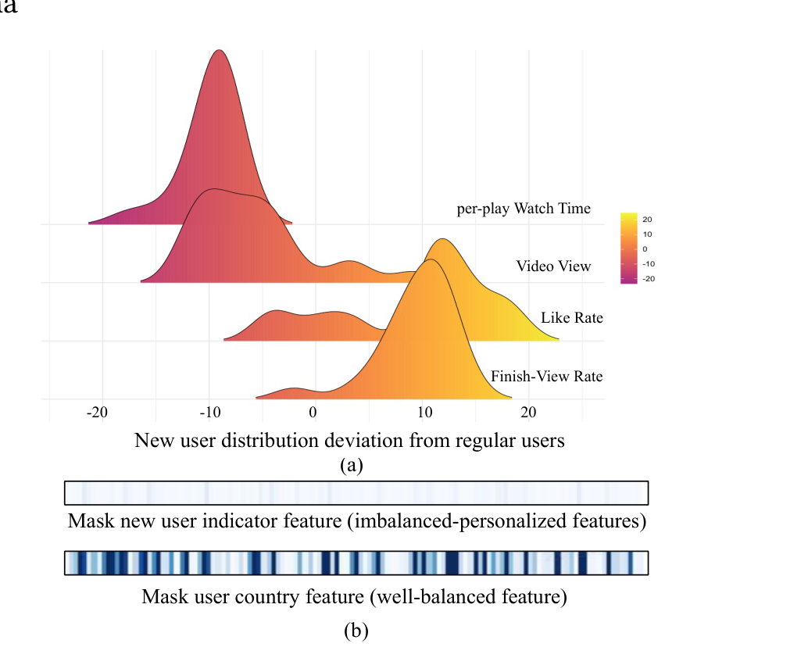
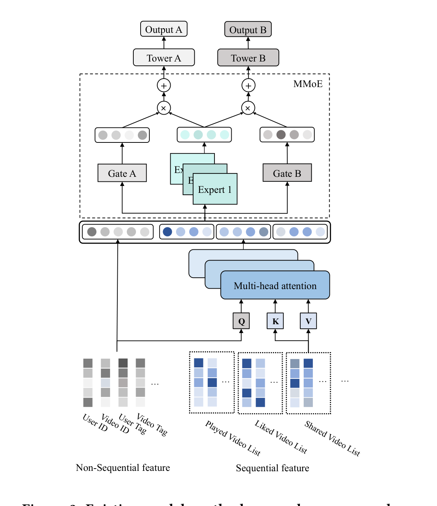
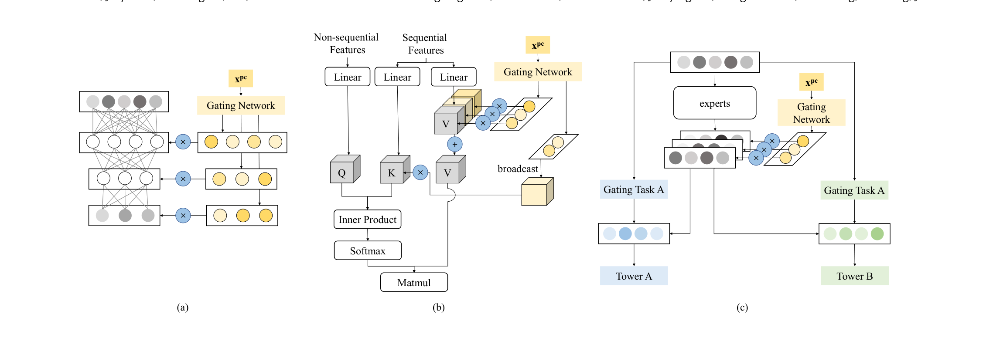
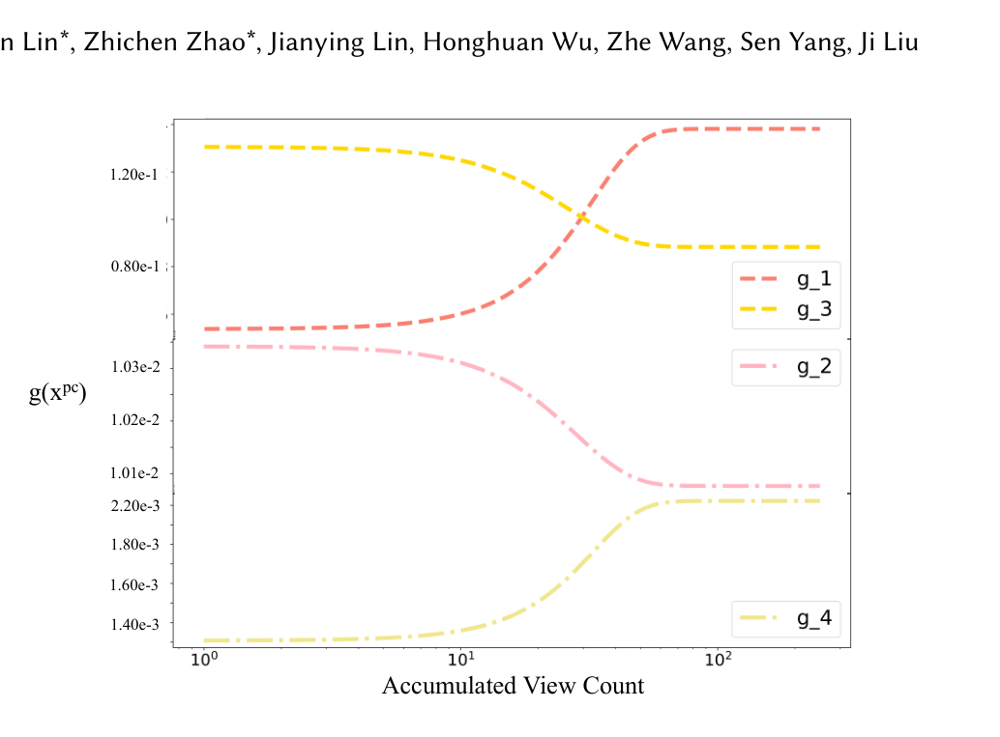

# POSO：大规模推荐系统的个性化冷启动模块

> Shangfeng Dai\*、Haobin Lin\*、Zhichen Zhao\*、Jianying Lin、Honghuan Wu、Zhe Wang、Sen Yang、Ji Liu | 快手科技（Kuaishou Technology），北京，中国

> arXiv:2108.04690v4 [cs.IR]（2021 年 8 月 24 日）· \* 为同等贡献

本文提出个性化冷启动模块（POSO）：当样本严重不均衡导致个性化特征被"淹没"时，用"用户分组专属子模块 + 个性化门控"重建个性化。核心发现是——**线上部署后新用户观看时长 +7.75%、关注率 +11.56%、留存率 +1.52%，而计算开销几乎可以忽略**。

核心内容：

- 痛点：业界把新用户冷启动归因于"初始数据太少"，但作者发现真正被忽视的问题是"个性化的淹没"——新用户样本占比不足 5%，个性化特征在训练中被海量常规样本压垮，掩蔽新用户指示特征对网络激活几乎毫无影响
- 方案：POSO 用个性化编码（PC）驱动门控网络，把样本均衡地分配给多组专属子模块，再将子模块输出按个性化门控加权融合，形成更全面的表示
- 技术细节：把"每个用户一个专属模型"（不可行）分解为"中间模块的加权组合"（可行），并给出 MLP、MHA、MMoE 三个模块的个性化推导与轻量化简化（Q 不个性化、K 轻量个性化、V 完全个性化）
- 验证：快手大规模工业系统离线 + 在线 A/B + MovieLens 20M 公开数据集，并泛化到 item 冷启动、不活跃用户与回归用户

关键发现：

- **新用户观看时长 +7.75%、关注率 +11.56%、留存率 +1.52%（统计显著）**，常规用户观看时长也提升 +1.99%
- 用户越"沉默"收益越大：不活跃用户观看时长 +1.50%/+1.98%，回归用户 +3.01%
- 新视频观看时长 +3.81%、成熟率 +0.58%；MovieLens 20M 上 Favorite 与 Satisfied 双双最优（76.89/75.29）
- 计算开销可忽略：POSO (MMoE) 与 MMoE 参数量、FLOPs 完全相同（13.20M/40.10M），全部组合后仅从 23.15M/69.46M 微增至 23.51M/70.54M
- 个性化编码（PC）的选择是关键：全部特征作输入会退化为 MoE 且效果更差（-0.274），分桶的累计浏览数（AVC）最优（+0.442）

---

## 摘要

对新用户的推荐，也称为用户冷启动，一直是线上推荐系统公认的挑战。现有方法大多将症结归因于初始数据的缺乏。然而，在本文中，我们认为存在被忽视的问题：1) 新用户的行为与常规用户遵循不同的分布。2) 尽管使用了个性化特征，严重不均衡的样本使模型无法平衡新用户/常规用户的分布，个性化特征仿佛被压垮。我们将这一问题命名为"个性化的淹没"（submergence of personalization）。为解决该问题，我们提出一种新方法：个性化冷启动模块（POSO，Personalized COld Start MOdules）。从模型架构的角度看，POSO 引入用户分组专属子模块来强化现有模块的个性化；随后，通过个性化门控融合其输出，得到更全面的表示。通过这种方式，POSO 通过为样本分配个性化的模块组合来均衡不均衡的特征。POSO 可以灵活地集成到许多现有模块中，例如多层感知机（MLP，Multi-layer Perceptron）、多头注意力（MHA，Multi-head Attention）和多门控混合专家（MMoE，Multi-gated Mixture of Experts），并以可忽略的计算开销有效提升它们的性能。所提出的 POSO 在大规模工业推荐场景中展现出显著优势。它已部署在 Kwai（快手海外版）上，将新用户观看时长大幅提升了 +7.75%。此外，POSO 还可以进一步推广到常规用户、不活跃用户和回归用户（观看时长 +2%–3%），以及 item 冷启动（观看时长 +3.8%）。其有效性也在公开数据集（MovieLens 20M）上得到验证。我们相信所提出的 POSO 可以很好地推广到其他场景。

## 关键词

cold start problem, personalized modules

## 1 引言

大规模推荐系统（RS，Recommender Systems）每天面临大量新访客。一个具有挑战性且重要的问题是如何为这些未曾见过的用户做出准确推荐。一方面，这些用户几乎没有历史描述或初始数据。另一方面，他们比常规用户更敏感、更没有耐心。不准确的推荐无法吸引他们的注意力，导致他们不再返回平台。那么我们可能会失去新用户的潜在价值。

该问题被称为"用户冷启动问题"[7, 15]。与可以利用内容特征的 item 冷启动问题[25]不同，内容特征见文献[6, 21, 22]，用户冷启动几乎无法提供替代描述，要求系统快速捕捉用户兴趣。基于元学习（meta-learning）的方法[10, 12]通过产生泛化良好的初始化来缓解该问题。此外，其他工作[14, 26]尝试用其余特征生成 ID 嵌入，从而补充缺失的线索。

然而，我们认为还存在另一个被忽视的问题：个性化的淹没。该问题描述了一种现象：即使使用个性化特征来平衡各种用户组（其分布差异很大），这些特征也会因为样本的严重不均衡而被压垮。

如图 1 (a) 所示，我们将常规用户的后验行为（观看时长/视频观看次数/点赞率/完整观看率）取平均作为基准点，并展示新用户的分布。可以看出，新用户遵循与常规用户非常不同的分布。理论上，我们期望个性化特征能够区分不同的用户组。这些特征在实践中能否帮助模型平衡各种分布？答案是否定的。我们发现个性化输入被压垮了，如图 1 (b) 所示。两种情形下我们都使用同一个训练良好的模型，并在某些特征被掩蔽为 0 时可视化激活差异（网络末端附近、跨多个 batch 取平均）。在前一种情形中，我们掩蔽新用户指示特征（常规用户为 0，新用户为 1）。令人惊讶的是，激活几乎保持不变。原因是这类特征严重不均衡：新用户样本在全部样本中占比不到 5%。在训练过程中，该指示特征大多数时候保持不变，因此这个特征变得可有可无。相反，在后一种情形中，掩蔽了一个均衡良好的特征（用户国家）。与前一种情形不同，激活发生了显著变化。上述观察表明，朴素的模型架构不足以维持个性化。

图 1：(a) 新用户后验行为可视化（基于与常规用户的动作次数/率的相对差异）。可以看出，新用户遵循与常规用户非常不同的分布。(b) 不均衡特征与均衡特征的敏感性，用两个大小为 128 的向量可视化。每个向量中的柱状块表示在掩蔽不均衡/均衡特征时的激活差异。颜色越深表示差异越显著。

在本文中，我们提出一个有效模块来解决上述问题：个性化冷启动模块（POSO）。首先，POSO 通过为样本分配个性化的模块组合来均衡不均衡的样本，每个模块只专注于被分配的用户组。然后，POSO 生成随原始个性化特征变化的个性化门控。最后，将门控与模块输出组合，形成全面的表示。其有效性体现在两方面：1) 无论多数还是少数，样本都被均匀地分配给专门化的子模块。2) 门控网络完全由选定的个性化特征（称为"个性化编码"，Personalization Code）决定，从而避免其"被淹没"。POSO 强化个性化，平衡各种分布并缓解冷启动问题。POSO 不是独立的方法。它可以集成到许多现有模块中，例如多层感知机（MLP）、多头注意力（MHA）和多门控混合专家（MMoE）。通过恰当的近似和详细的分析，我们推导出它们的个性化版本，带来一致且显著的收益，而计算开销可忽略不计。

POSO 的优点之一是它非常适合大规模系统：1) 它遵循标准训练流程，不同于基于元学习的方法需要手动将训练数据划分为 support/query 集合，并可能拖慢训练速度。2) 计算开销可忽略。3) 它可以应用于其他数据不均衡问题，这些问题在用户/item/国家/地区中广泛存在。

我们在快手的大规模推荐系统以及公开数据集上进行了大量实验。在真实场景中，POSO (MLP)/POSO (MHA)/POSO (MMoE) 一致地提升了性能，并优于现有方法。部署到线上系统后，为新用户带来了 +7.75% 的观看时长和 +1.52% 的留存率。同时，常规/不活跃/回归用户也受益（观看时长 +2%–3%）。除了用户冷启动场景，所提出的架构还改善了 item 冷启动（新视频观看时长 +3.8%），并在 MovieLens 20M 数据集[8]上优于现有方法。

本文的贡献总结如下：

(1) 我们揭示了"个性化的淹没"问题。在没有定制化架构的情况下，个性化特征可能被压垮，最终损害性能。

(2) 我们提出一种名为 POSO 的新方法，它在不均衡数据下强化个性化，并显著缓解冷启动问题。

(3) 我们给出了详细的推导，并展示了 POSO 可以以可忽略的计算开销集成到许多现有模块中。个性化模块大幅推进了大规模推荐系统。

## 2 相关工作

关于用户冷启动问题的相关研究可以概括为两个流派：元学习（meta-learning）与嵌入生成。元学习指一系列旨在训练泛化网络、使其对全新任务也能给出良好预测的方法[9, 19]。MAML（Model-Agnostic Meta-Learning，模型无关元学习）[5]在小样本学习（few-shot learning）上展现出令人鼓舞的结果，但主要关注分类任务。借鉴其思想，基于元学习的方法被引入推荐系统：MeLU [10]将每个用户的推荐视为一个独立任务。在局部更新步骤中，嵌入不接收梯度，以保证网络的稳定性。类似地，Du 和 Wang 等人[3]使用元学习在场景之间迁移知识，例如从旅行任务到保姆任务。文献[17]成功地在生产数据上实现了元学习策略。它有两种架构来调整矩阵分解（Matrix Factorization）方法中的权重。DropoutNet [20]可以看作生成方面的类似尝试。它随机掩蔽用户输入以模拟新用户。

另一个流派尝试用其他特征生成有意义的 ID 嵌入。Meta-E [12]学习从其他嵌入生成用户 ID 嵌入。学习过程分别由冷启动阶段和预热阶段监督。MAMO [2]提出多种记忆：画像记忆（profile memory）、用户记忆（user memory）和任务特定记忆（task-specific memory）。这样的记忆可以看作特征基（feature bases），用于将冷用户分解为暖特征。MWUF [26]认为，对于 item 嵌入，常规 item 与新 item 之间存在缩放差异，对用户则存在平移差异。最终嵌入由缩放与平移网络形成。

## 3 现有生产模型

在本节中，我们简要描述快手大规模推荐系统上现有生产模型的结构。如图 2 所示，该模型遵循经典的 Embedding&MLP 范式[23]。此外，还引入了 MHA、MMoE 等先进模块以获得更好的性能。

输入由非序列特征（例如用户 ID）和序列特征（例如用户过去观看过的视频）组成。在嵌入生成阶段，所有特征首先通过嵌入查找表映射为低维向量。对于每个序列特征，应用多头注意力（MHA）模块[18]将嵌入序列融合为单个向量，这一做法由文献[1]引入推荐系统。在现有实现中，键（$\mathbf{K}$）和值（$\mathbf{V}$）由序列嵌入 $X_{seq}$ 的线性投影产生。即 $\mathbf{K} = \mathbf{W}_K X_{seq}$，$\mathbf{V} = \mathbf{W}_V X_{seq}$（$\mathbf{W}_Q$、$\mathbf{W}_K$ 和 $\mathbf{W}_V$ 是可训练矩阵）[^1]。不同的是，查询 $\mathbf{Q}$ 接收拼接后的非序列嵌入 $x_{non}$ 作为输入：$\mathbf{Q} = \mathbf{W}_Q x_{non}$。对于单个头，$\mathrm{head}(\mathbf{Q}, \mathbf{K}, \mathbf{V}) = \mathrm{softmax}\left(\frac{\mathbf{Q}\mathbf{K}^{\top}}{\sqrt{d_h}}\right)\mathbf{V}$，其中 $d_h$ 表示投影特征的维度。MHA 的结果就是每个头输出的拼接。

[^1]: 在本文中，上标命名特定的模块。形如 $(i)$ 的符号用于索引模块，而 $[\cdot]_i$ 索引向量的第 $i$ 个元素。

在下一阶段，所有非序列嵌入与变换后的序列嵌入拼接为中间激活 $x$。生产模型需要同时预测 $T$ 个目标，例如长观看率（Long-View Rate）和点赞率（Like Rate），定义见 5.1 节。为了建模任务间关系，引入多门控混合专家（MMoE）模块[11]，以 $N_e$ 个 MLP $\{e^{(i)}\}_{i=1}^{N_e}$ 作为专家。为任务 $t$ 训练一个门控网络 $g_t$，将专家输出集成到 $\hat{x}_t$ 中。最后，任务特定 MLP $h_t$ 接收 $\hat{x}_t$ 并给出预测 $y_t$。MMoE 模块的公式如下：

$$
g_t(x) = \mathrm{softmax}\left(\mathbf{W}_t x\right), \qquad (1)
$$

$$
\hat{x}_t = \sum_{i=1}^{N_e} \left(g_t(x)\right)_i e^{(i)}(x), \qquad (2)
$$

$$
y_t = h_t\left(\hat{x}_t\right), \qquad (3)
$$

其中 $t = 1, 2, ..., T$，$\mathbf{W}_t$ 是门控网络的可训练矩阵。

图 2：快手大规模推荐系统上的现有模型。包含 3 个阶段：嵌入生成、序列特征建模（由 MHA 完成）与多任务优化（由 MMoE 完成）。

表 1：生产模型的参数量与 FLOPs 对比

| 方法 | 参数量 | FLOPs |
| --- | --- | --- |
| MLP | 2.48M | 1.50M |
| POSO (MLP) | 2.59M | 1.85M |
| MHA | 2.91M | 7.82M |
| POSO (MHA) | 3.15M | 8.55M |
| MMoE | 13.20M | 40.10M |
| POSO (MMoE) | 13.20M | 40.10M |
| 基线（Baseline） | 23.15M | 69.46M |
| 整体（全部组合） | 23.51M | 70.54M |

## 4 个性化冷启动模块

众所周知，系统在新用户的初始数据方面存在不足。然而，我们认为有一个问题被忽视了："个性化的淹没"，即即使提供了个性化特征，系统也会因为数据不均衡而无法平衡各种分布。

首先，我们展示新用户的行为与常规用户分布不同。在图 1 (a) 中，我们可视化了新/常规用户的后验行为。常规用户的指标取平均作为基准点。我们展示新用户指标的相对差异。我们观察到：1) 新用户的视频观看次数（Video View，VV）更低，表明系统很难捕捉他们的兴趣。2) 新用户的完整观看率（Finish-View Rate）更高，但单次播放观看时长（per-play Watch Time）更低。他们可能喜欢短视频，但对长视频缺乏耐心。3) 新用户倾向于更频繁地"点赞"，似乎对大量视频都感到新鲜。所有观察都表明，新用户的行为与常规用户遵循非常不同的分布。

人们可能认为，现有模型理所当然地利用个性化特征（例如区分新/常规用户的指示特征）隐式平衡了各种分布。然而，由于数据不均衡，此类特征被压垮。在图 1 (b) 中，我们使用一个训练良好的模型，掩蔽个性化特征并可视化激活差异。令人惊讶的是，掩蔽严重不均衡的新用户指示特征对激活几乎没有影响。相反，当掩蔽均衡良好的用户国家特征时，激活发生显著变化。由于新用户仅占 5% 的样本，大多数时候该指示特征保持不变。模型很容易专注于其他特征来寻找解决方案，并"遗忘"对冷启动问题至关重要的新用户指示特征。我们将这一问题称为"个性化的淹没"。

在本文中，我们从模型架构的角度强化个性化特征。我们通过为样本分配个性化的模型组合来均衡不均衡的个性化特征，以解决淹没问题。理想情况下，可以为特定用户构建一个专属模型：

$$
y_u = f_u\left(x_u\right), \qquad (4)
$$

其中 $x$、$y$、$f$ 分别表示输入、输出与模型。下标 $u$ 指特定用户。在这种方案中，个性化被完整保留在相应模型中。不幸的是，由于用户数量庞大，上述方案不可行。一个可能的解决方案是为每种用户组建立若干独立模型，例如新用户、回归用户等。一个特定用户可以被视为各种用户组的组合（例如，一个人可以是一半不活跃用户、一半常规用户）。随后，我们可以将特定用户的预测分解为用户组预测的组合：

$$
y_u = \sum_{i=1}^{N} w_i f^{(i)}(x), \qquad (5)
$$

其中 $i$ 表示模型索引，我们共有 $N$ 个模型。在实践中，生成 $w_i$ 是困难的。取而代之，我们使用门控网络从个性化特征生成 $w_i$：$w_i = \left[g(x_{pc})\right]_i$，其中 pc 指个性化编码（Personalization Code，PC），即识别用户组的关键特征。到目前为止，我们仍需准备 $N$ 个独立模型来捕捉用户组兴趣，这计算开销很大。我们方法的一个关键点是：在中间模块上应用分解，并保持其余模块不变：

$$
\hat{x} = \mathbf{C} \sum_{i}^{N} \left(g\left(x_{pc}\right)\right)_i f^{(i)}(x), \qquad (6)
$$

其中 $f$ 从现在起表示模块，$\hat{x}$ 和 $x$ 是两个相邻层的激活。注意对 $g(x)$ 的和没有约束，为避免整体尺度漂移，应用了一个修正因子 $\mathbf{C}$。

式 (6) 展示了所提方法的原型。由于它将个性化引入中间模块，我们将其命名为"个性化冷启动模块（POSO，Personalized COld Start MOdules）"。

POSO 的设计遵循以下原则：

**个性化（Personalization）。** POSO 从两个方面解决淹没问题：1) 通过分配多个模块和门控来均衡特征。即使常规用户数据占主导，新用户样本也不会被忽视，因为 POSO 利用另一组模块和门控来做预测。2) 无论应用于哪一层，POSO 都通过原始特征而非二手激活来突出个性化，这是自学习技术（如混合专家（MoE，Mixture of Experts），见 5.4 节）难以实现的。

**灵活性（Flexibility）。** 注意 POSO 不是独立模块，而是个性化现有模块的通用方法。POSO 可以集成到许多现有方法中，并赋予它们个性化能力。接下来，我们推导 MLP、MHA 和 MMoE 的个性化版本。我们也相信，当应用于其他未探索的模块时，它具有良好的前景。

**无后效性（Non-aftereffect）。** POSO 的子模块共享相同的输入，其输出最终融合为单一综合结果。这保证了结构独立性。上下游模块之间不引入任何依赖。

### 4.1 线性变换的 POSO

我们从最基本的模块开始：线性变换，其公式为 $f(x) = \mathbf{W}x$，其中 $x \in \mathbb{R}^{d_{in}}$，$\hat{x} \in \mathbb{R}^{d_{out}}$。将其公式代入式 (6) 得：

$$
\hat{x} = \mathbf{C} \sum_{i=1}^{N} \left(g\left(x_{pc}\right)\right)_i \mathbf{W}^{(i)} x. \qquad (7)
$$

具体地，$\hat{x}$ 的第 $p$ 个分量由下式给出：

$$
\hat{x}_p = \mathbf{C} \sum_{i=1}^{N} \sum_{q=1}^{d_{in}} \left(g\left(x_{pc}\right)\right)_i W^{(i)}_{p,q} x_q, \qquad (8)
$$

其中 $W^{(i)}_{p,q}$ 指 $\mathbf{W}^{(i)}$ 在位置 $(p, q)$ 处的元素。虽然式 (8) 引入了 $N$ 倍的复杂度，但充足的自由参数允许我们以灵活的方式应用简化。这里我们给出一个简单而有效的特例。令 $N = d_{out}$，当 $i = p$ 时 $W^{(i)}_{p,q} = W_{p,q}\ \forall p, q$，且对于任意 $i \neq p$，$W^{(i)}_{p,q} \equiv 0$。我们有：

$$
\hat{x}_p = \mathbf{C} \cdot \left(g\left(x_{pc}\right)\right)_p \sum_{q=1}^{d_{in}} W_{p,q} x_q, \qquad (9)
$$

或者等价地：

$$
\hat{x} = \mathbf{C} \cdot g\left(x_{pc}\right) \odot \mathbf{W}x, \qquad (10)
$$

其中 $\odot$ 表示逐元素乘法。这种简化带来一种计算高效的操作：只需在原始输出上应用个性化门控的逐元素乘法。

### 4.2 多层感知机的 POSO

沿用 4.1 节的类似推导，带激活函数的全连接层（Fully-Connected，FC）的个性化版本设计如下：

$$
\hat{x} = \mathbf{C} \cdot g\left(x_{pc}\right) \odot \sigma\left(\mathbf{W}x\right), \qquad (11)
$$

其中 $\sigma$ 表示激活函数。它与 LHUC [16]（Learning Hidden Unit Contributions，学习隐藏单元贡献）形式相似，后者中的隐藏单元贡献在此被替换为个性化门控。

自然，MLP 的个性化版本（称为 POSO (MLP)）由堆叠的个性化 FC 层构成。其框架如图 3 (a) 所示。在表 1 中，我们详细列出了每个模块的参数与 FLOPs，并表明所提出的模块计算高效。

图 3：POSO 的个性化模块：(a) POSO (MLP) 分别掩蔽每一层的每个激活。(b) 在 POSO (MHA) 中，$\mathbf{Q}$ 不个性化，$\mathbf{K}$ 轻量个性化，$\mathbf{V}$ 完全个性化。(c) 在 POSO (MMoE) 中，先应用个性化，然后将输出送入特定任务。POSO 的所有模块均以黄色标出。

### 4.3 多头注意力的 POSO

在本部分，我们推导多头注意力（MHA）模块的 POSO 版本。为清晰起见，先考虑单头的情形：

$$
\hat{x} = \mathrm{softmax}\left(\frac{\mathbf{Q}\mathbf{K}^{\top}}{\sqrt{d_h}}\right)\mathbf{V}. \qquad (12)
$$

将式 (12) 作为 $f^{(i)}$ 代入式 (6) 得：

$$
\hat{x} = \mathbf{C} \sum_{i=1}^{N} \left(g\left(x_{pc}\right)\right)_i \mathrm{softmax}\left(\frac{\mathbf{Q}^{(i)} \left(\mathbf{K}^{(i)}\right)^{\top}}{\sqrt{d_h}}\right) \mathbf{V}^{(i)}. \qquad (13)
$$

这种朴素实现引入了多份 $\mathbf{Q}$、$\mathbf{K}$ 和 $\mathbf{V}$。尽管提升了性能（见 5.5 节），但计算开销很大。为了降低开销，我们重新思考 $\mathbf{Q}$、$\mathbf{K}$ 和 $\mathbf{V}$ 的角色。首先，$\mathbf{Q}$ 包含除历史行为外的所有用户特征，因此它已经高度个性化。因此，我们只需令 $\mathbf{Q}^{(i)} = \mathbf{Q}, \forall i$。相反，$\mathbf{V}^{(i)}$ 涉及很少的用户信息。考虑到 $\mathbf{V}$ 直接决定输出，我们对多份 $\mathbf{V}^{(i)}$ 不做简化。我们注意到，使用多份 $\mathbf{K}$ 会引入冗余的自由参数，因为由 $\mathbf{K}$ 和 $\mathbf{Q}$ 产生的注意力权重维度远低于 $\mathbf{K}$ 本身。或者，如 4.1 节所述，一个用于逐元素乘法的个性化门控 $\mathbf{G}_k$ 就足以调整注意力权重，即 $\mathbf{K}^{(i)} = \mathbf{G}_k\left(x_{pc}\right) \odot \mathbf{K}$ [^2]。至此，$\mathbf{Q}$ 和 $\mathbf{K}$ 都与 $i$ 无关，因此可以从求和号中移出。式 (13) 随后简化为：

$$
\hat{x} = \mathbf{C} \cdot \mathrm{softmax}\left(\frac{\mathbf{Q} \cdot \left(\mathbf{G}_k\left(x_{pc}\right) \odot \mathbf{K}\right)^{\top}}{\sqrt{d_h}}\right) \sum_{i=1}^{N} \left(g\left(x_{pc}\right)\right)_i \mathbf{V}^{(i)}. \qquad (14)
$$

[^2]: 事实上 $\mathbf{G}_k\left(x_{pc}\right)$ 是二维张量，而 $\mathbf{K}$ 是三维张量（包含 batch 维度），因此逐元素操作会在 $\mathbf{K}$ 的最后一维上进行广播。

综上所述，我们分别在 3 个层级上对组件进行个性化：$\mathbf{Q}$ 不个性化，$\mathbf{K}$ 轻量个性化，$\mathbf{V}$ 完全个性化。这三个张量的个性化程度也与它们在 MHA 中的角色一致，如上所述。最后，对于多头情形，每个头的输出拼接起来形成表示。

所提出的模块命名为"POSO (MHA)"，其框架如图 3 (b) 所示。在我们的场景中，与 MHA 原始版本相比，POSO (MHA) 具有相当的复杂度（见表 1），但性能显著更优（见 5.5 节）。

### 4.4 多门控混合专家的 POSO

在本部分，我们给出 MMoE 的 POSO 版本。将式 (2) 作为 $f^{(i)}$ 代入式 (6) 得：

$$
\hat{x}_t = \mathbf{C} \sum_{i=1}^{N} \left(g\left(x_{pc}\right)\right)_i \left( \sum_{j}^{N_e} \left(g_t(x)\right)_j e^{(j)}(x) \right), \qquad (15)
$$

其中 $i$、$j$、$t$ 分别索引个性化门控、专家与任务。在式 (15) 中有两个隐含约束：每组专家共享同一个个性化门控 $g^{(i)}$，每组 $g_t$ 由 Softmax 归一化。我们放宽约束以简化实现。首先，我们允许每个专家拥有自己的个性化门控。然后，我们对所有任务门控实施归一化。由此得到：

$$
\hat{x}_t = \mathbf{C} \sum_{i=1}^{N} \sum_{j=1}^{N_e} \left(g\left(x_{pc}\right)\right)_{ij} \left(g_t(x)\right)_{ij} e^{(ij)}(x), \qquad (16)
$$

其中 $g_t$ 在所有的 $(i, j)$ 对上归一化。注意在式 (16) 中，索引 $i$ 和 $j$ 联合索引专家。令 $\hat{N} = N N_e$，我们可以重新索引模块并将上式重写为：

$$
\hat{x}_t = \mathbf{C} \sum_{i=1}^{\hat{N}} \left(g\left(x_{pc}\right)\right)_i \left(g_t(x)\right)_i e^{(i)}(x), \qquad (17)
$$

$$
g_t(x) = \mathrm{softmax}\left(\mathbf{W}_t x\right). \qquad (18)
$$

总单元数 $\hat{N}$ 实际上是一个可以手动调整的超参数。在我们的实现中，为了节省计算复杂度，直接令 $\hat{N} = N$。

在式 (17) 中，我们得到了个性化 MMoE 的最终版本，即 POSO (MMoE)。其实现极其轻量（另见表 1）：可以保留 MMoE 的全部结构，只需用个性化门控掩蔽每个专家，如图 3 (c) 所示。

POSO (MMoE) 如何提升专家性能？在 MMoE 中，专家只感知任务，对样本缺乏明确的知识。在 POSO (MMoE) 中，专家被个性化激活：如果属于新用户的样本在 $g[\cdot]_i$ 中产生更高的权重，对应的第 $i$ 个专家获得更高的学习权重，从而对新用户更加敏感，反之亦然。通过这种方式，专家变得专门化。我们可以说，专家不仅感知任务，还感知用户组这一"领域"（field）。在 5.6 节中，我们可视化了 MHA 中值矩阵（value matrix）的门控网络输出，它们同样实现了专门化。

### 4.5 用于冷启动的 POSO

现在，我们利用 POSO 的知识来展示如何缓解冷启动问题。

**用户冷启动。** 新用户定义为首次启动发生在 $T_{du}$ 小时内。对于用户冷启动，我们利用一个细粒度特征来揭示该用户已被展示过多少 item，即分桶的累计浏览数（Accumulated View Count，AVC）。该特征作为 PC 送入门控网络 $g$。在每个模块中，我们保持门控网络的输入一致并强化个性化。

**item 冷启动。** 新 item（视频）的定义有两方面：1) 在 $T_{dv}$ 天内上传；2) 其总展示次数小于 $T_s$。类似地，我们利用视频年龄（video age）来区分常规/新视频。它同样产生个性化，但是从视频的角度。

在本文中，门控网络由两层 MLP 组成，其输出由 Sigmoid 函数激活。

## 5 实验

在本节中，我们展示 POSO 在快手大规模推荐场景中的性能。我们进行了离线与在线实验。我们还在公开数据集上验证了 POSO 的泛化性。此外，我们演示了如何选择 PC，并展示个性化模块的可视化启发。

### 5.1 离线实验

**数据集设置。** 对于离线实验，样本来自我们的大规模推荐系统。我们用连续 7 天的记录构建训练集，用其后一天的数据构建测试集。

**任务。** 在视频推荐系统中，用户可能有两种反馈。显式反馈可以是点赞（下文用 "Like" 表示）和决定关注某个作者（记为 "Follow"）。隐式反馈主要指用户是否观看了足够长的视频（Long-View，长观看）或完整观看了视频（Finish-View，完整观看）。我们采用多任务框架，同时优化长观看率/完整观看率/点赞率/关注率。经验上，Long-View 和 Finish-View 是决定线上表现的更权威的指标。在本文中，当观看时长超过视频长度的 $T_{lv}$ 百分比时，观看事件被定义为 "Long-View"，因此它被建模为类点击率（CTR，Click-Through Rate）任务。

**指标。** 在我们的实验中，我们采用 GAUC（Group AUC，分组 AUC）[24]来衡量模型性能，即先计算每个用户样本内的 AUC，再按样本数加权平均。

为了验证所提方法的有效性，我们将各种 POSO 与同样聚焦冷启动问题的现有方法进行比较。MeLU [10]在推荐系统中利用元学习，将冷启动问题表述为小样本学习。Meta-E [12]和 MWUF [26]考虑生成 ID 嵌入以补充缺失线索。这些方法涵盖了从优化到嵌入初始化的各个方面。

结果如表 2 所示，其中 "Rate" 被省略。由于隐私政策，我们只展示基线与各方法之间的绝对差异，记为百分点（percent point，pp）。MeLU 适度提升了点赞率和关注率，但在观看任务上失败。看起来 MeLU 在正样本稀疏的任务上表现良好。在 Meta-E 中，交互任务依次下降。MWUF 对常规用户以及新用户的交互任务提供了改进。其嵌入可能对 ID 嵌入（例如用户 ID 嵌入、用户标签嵌入）具有补充作用。然而，在工业场景中，大量特征提供了 ID 嵌入，其改进大部分被覆盖。

表 2：离线实验结果（百分点），与基线对比。彩色标注的任务更重要。

| 方法 | 新用户 Long-View | 新用户 Finish-View | 新用户 Like | 新用户 Follow | 常规用户 Long-View | 常规用户 Finish-View | 常规用户 Like | 常规用户 Follow |
| --- | --- | --- | --- | --- | --- | --- | --- | --- |
| MeLU [10] | -0.135 | -0.099 | +0.124 | +0.160 | -0.068 | -0.038 | +0.028 | -0.093 |
| Meta-E [12] | -0.024 | +0.024 | -0.260 | -0.338 | -0.038 | +0.005 | -0.283 | -0.345 |
| MWUF [26] | +0.023 | -0.002 | +0.392 | +0.123 | +0.072 | +0.032 | +0.212 | +0.136 |
| POSO (MLP) | +0.188 | +0.121 | +0.314 | 0.761 | +0.277 | +0.173 | +0.095 | +0.775 |
| POSO (MHA) | +0.279 | +0.190 | +0.089 | +0.529 | +0.251 | +0.150 | -0.008 | +0.892 |
| POSO (MMoE) | +0.223 | +0.132 | +0.428 | +0.388 | +0.295 | +0.162 | +0.184 | +0.726 |
| POSO（全部组合） | +0.442 | +0.248 | +0.344 | +0.211 | +0.339 | +0.171 | +0.329 | +0.492 |

POSO (MLP)、POSO (MHA) 和 POSO (MMoE) 的对比很有意思：它们都提升了观看任务。POSO (MHA) 在新用户上表现更好，而 POSO (MMoE) 更偏好常规用户。同时，POSO (MLP) 也更关注常规用户。这意味着 MHA 的主要头冗余地关注常规用户，而 MMoE 中的专家专注于新用户。这实际上造成了冗余。相反，POSO 通过分配个性化模块解决了该问题。有了我们的 POSO，激活、头与专家在不同的用户上实现专门化，它们变得"领域感知"（field-aware，见 5.6 节）。组合后的 POSO 在两个用户组和所有任务上都带来了显著改进，这种改进进一步大幅赋能线上收益。

此外，我们验证了所提方法是否可以应用于其他任务，例如 item 冷启动（新视频的定义见 4.5 节）。为此，我们将 PC 替换为视频年龄（自视频上传以来的时间）。在表 3 中，我们展示了与基线的对比结果。有两个有趣的结果：1) 新视频 POSO 在常规评估中表现更好。2) 它在常规视频样本上产生的改进大于新视频样本。我们分析结果后认为原因有两方面：一方面，系统一直在努力确保新视频能获得展示，这本质上牺牲了其他视频的性能。另一方面，现有模块过度倾向新视频。所提出的 POSO 用专属模块解耦新/常规视频，从而一致地提升了两组。POSO (MLP) 提升了点赞率/关注率，但在观看任务上结果相当。这表明值矩阵/专家比激活更能平衡各种用户组。

表 3：视频冷启动的离线实验结果，与基线对比。

| 方法 | 新视频 Long View | 新视频 Finish View | 新视频 Like | 新视频 Follow | 常规视频 Long View | 常规视频 Finish View | 常规视频 Like | 常规视频 Follow |
| --- | --- | --- | --- | --- | --- | --- | --- | --- |
| POSO (MLP) | -0.042 | +0.003 | +0.292 | +0.388 | +0.022 | -0.001 | +0.019 | +0.003 |
| POSO (MHA) | +0.256 | +0.211 | +0.520 | +0.428 | +0.460 | +0.288 | +0.046 | +0.442 |
| POSO (MMoE) | +0.163 | +0.164 | +0.518 | +1.456 | -0.059 | -0.009 | +0.218 | +0.053 |
| POSO（全部组合） | +0.269 | +0.211 | +0.727 | +0.430 | +0.466 | +0.298 | +0.399 | +0.503 |

### 5.2 在线实验

在本节中，我们进行在线 A/B 实验，并展示大规模工业推荐系统的结果。我们关注以下指标（按重要性从高到低）：观看时长（Watch Time）、留存率（Retention Rate）和点赞率/关注率。观看时长反映用户被推荐视频吸引的程度，留存率衡量用户是否会在接下来的日子里继续使用该应用。

我们在表 4 中展示了各类用户群的在线结果。不活跃用户指一周内只活跃几天的用户，回归用户的最近一次启动至少在 7 天前。红色结果表示统计显著，由平台识别。我们将基线和实验视为独立的分布。在自然日上累积的性能形成一个样本。然后我们对样本应用 Student t 检验。如果实验样本不能被基线分布以超过 95% 的概率解释，则该实验被标记为显著。

表 4：各类用户群的在线 A/B 结果：新用户、不活跃用户、回归用户、常规用户与新视频。我们省略部分结果，因为它们未定义或过于稀疏而无法给出统计结论。红色结果表示统计显著（详见正文）。除新视频外，所有用户群共享同一个 PC（AVC）。

| 指标 | 留存率 | 观看时长 | 点赞率 | 关注率 | 成熟率 |
| --- | --- | --- | --- | --- | --- |
| 新用户 | +1.52% | +7.75% | +2.09% | +11.56% | - |
| 不活跃用户（过去 7 天活跃 2 天） | - | +1.50% | - | - | - |
| 不活跃用户（过去 7 天活跃 1 天） | - | +1.98% | - | - | - |
| 回归用户 | - | +3.01% | - | - | - |
| 常规用户 | +0.15% | +1.99% | +0.05% | +1.42% | - |
| 新视频 | - | +3.81% | - | - | +0.58% |

首先，我们讨论新用户的性能。他们的观看时长显著提升了 7.75%。这种改进不仅验证了所提方法的有效性，还给整个系统带来了进一步的正反馈：新用户观看更多视频，同时他们的特征和训练样本也得到丰富。关注率提升了 11.56%，意味着模型在用户-作者关系上做出了更准确的预测。所有这些改进都对留存率产生了积极影响。我们可以确认，新用户比以往对推荐视频更感兴趣，我们更有可能提升 DAU（Daily Active Users，日活跃用户）。对于常规用户，我们的方法也在观看时长上取得了一致改进（+1.99%），同时保持了有竞争力的留存率和交互指标。

一个有趣的观察是，不活跃/回归用户即使已经深度沉默，也获得了显著改进。随着沉默的加深，我们的模型产生更大的改进：从 +1.50%、+1.98% 到 +3.01%。将这些结果与常规用户和新用户的结果结合，我们可以得出结论：当用户趋于不活跃时，他们的分布发生偏离，个性化变得至关重要。

我们还展示了视频冷启动的结果。指标是"成熟率"（Maturing Rate）和单次播放观看时长。前者描述新视频按 4.5 节定义变为常规视频的速度，后者对视频上的观看时长取平均。POSO 显著提升了主要指标：成熟率。

总之，POSO 被验证是有效的，并且可推广到大规模工业推荐系统。它强化了个性化，并显著改善了冷启动问题。

### 5.3 公开数据集

我们在公开数据集 MovieLens 20M [8]上验证我们的方法，该数据集收集用户对电影的评分。它包含超过 130k 用户和超过 2000 万样本。由于新用户任务没有现成的设置，我们基于用户 ID 划分数据集。100k 用户划分为训练集，其余为测试集。我们设置了两个任务：1) 用户是否以分数 5 对电影评分（Favorite，收藏）；2) 评分是否不低于 4（Satisfied，满意）。我们使用两种列表特征：用户过去评分的电影 ID 列表和用户过去评分的标签列表，其长度限制为 30。PC 为 AVC。两个任务我们都使用 GAUC 作为指标。

结果如表 5 所示，现有方法大多在性能上有所取舍。Favorite 可以提升，然而 Satisfied 下降。似乎元学习方法适合正样本更密集的任务。所提出的 POSO 在两个任务上都达到最佳结果。有趣的是，在更困难的任务（Favorite）上，它带来了更大的改进（0.81pp vs 0.72pp）。

表 5：MovieLens 20M 数据集上的结果。

| 方法 | Favorite | Satisfied |
| --- | --- | --- |
| 基线（Baseline） | 76.08 | 74.57 |
| MeLU [10] | 76.16 | 74.51 |
| Meta-E [12] | 76.13 | 74.53 |
| MWUF [26] | 76.20 | 74.51 |
| POSO | 76.89 | 75.29 |

### 5.4 个性化编码的演化

在 POSO 中，个性化源于个性化编码（即门控网络的输入特征）的使用。对于 PC 的具体设计与公式，可以有多种选择。在本节中，我们研究用户冷启动场景中 PC 的演化。

对比见表 6（在新用户上测量）。第一个认知是：突出个性化特征才能实现 POSO 的有效性。当使用所有特征作为输入时，会退化为 MoE [4, 13]，我们得到较差的结果。也就是说，在门控网络中纳入全部特征甚至会使淹没问题恶化。至于个性化特征，最朴素的选择是指示特征 $\mathbb{1}_{is-new-user}$，其值在新访客时为 1，否则为 0。这样的 PC 已经提供了大幅改进。由于 ID 嵌入隐式编码了个性化线索，我们将其用作 PC。用户 ID 提供了适度的改进。然而，其个性化对于冷启动任务是异质的，因此结果劣于之前的 PC。类似地，加入视频 ID 嵌入进一步拉低了性能。最佳结果由分桶的累计浏览数产生，它从用户首次启动开始统计每次展示，精细地描述了用户活跃度和生命周期阶段。它的改进甚至超过了有无 PC 之间的差异。

表 6：不同个性化编码的对比。所有结果均为与基线之差。

| 个性化编码 | Long-View | Finish-View |
| --- | --- | --- |
| 所有特征（MoE） | -0.274 | -0.501 |
| 是否新用户（is-new-user） | +0.240 | +0.145 |
| 用户 ID 嵌入 | +0.154 | +0.007 |
| 用户 ID + 视频 ID 嵌入 | +0.235 | +0.117 |
| 累计浏览数（AVC） | +0.442 | +0.248 |

### 5.5 个性化到什么程度？

在 POSO 的推导中，我们其实有很多选择来简化或保留原始公式。这里以 MHA 为例，详细说明每个版本的性能，并解释我们为何选择第 4 节所述的形式。

如表 7 所示，POSO 的原始版本（式 (6)）已经能带来更好的结果。然而，由于未做任何简化，其开销巨大。有趣的是，固定 $\mathbf{Q}$ 带来更大的改进，这也验证了 $\mathbf{Q}$ 已经高度个性化。冗余地对它进行个性化反而拉低了性能。用逐元素乘法掩蔽 $\mathbf{K}$ 在 Long-View 率和 Finish-View 率之间做了权衡。考虑到该设置显著节省了计算开销，同时提供了可观的结果，我们将其作为标准 POSO (MHA)。进一步简化 $\mathbf{V}^{(i)}$ 会减少改进，将个性化的 $\mathbf{V}^{(i)}$ 退化为个性化的激活。如上所述，$\mathbf{V}^{(i)}$ 和专家比激活更有能力。

表 7：POSO (MHA) 在从完全个性化到最轻量实现的各种设置下的结果。为简化，我们只展示新用户指标。

| 设置 | Long-View | Finish-View |
| --- | --- | --- |
| $\mathbf{Q}^{(i)}$，$\mathbf{K}^{(i)}$，$\mathbf{V}^{(i)}$，$N = 4$ | +0.130 | +0.131 |
| $\mathbf{Q}^{(i)} = \mathbf{Q}$，$\mathbf{K}^{(i)}$，$\mathbf{V}^{(i)}$，$N = 4$ | +0.157 | +0.296 |
| $\mathbf{Q}^{(i)} = \mathbf{Q}$，$\mathbf{K}^{(i)} = \mathbf{G}_k \odot \mathbf{K}$，$\mathbf{V}^{(i)}$，$N = 4$ | +0.279 | +0.190 |
| $\mathbf{Q}^{(i)} = \mathbf{Q}$，$\mathbf{K}^{(i)} = \mathbf{G}_k \odot \mathbf{K}$，$\mathbf{V}^{(i)} = \mathbf{G}_v \odot \mathbf{V}$ | +0.044 | +0.119 |

### 5.6 模块的专门化

总的来说，POSO 强化了个性化。具体而言，子模块实现了专门化。在图 4 中，我们可视化了 POSO (MHA) 中 $\mathbf{V}^{(i)}$ 的门控网络输出，它由输入（分桶的累计浏览数）决定。对于新用户（较低的 AVC），门控 #3 起决定作用。随着 AVC 的增加，门控 #3 逐渐失势，门控 #1 占据主导。这意味着 #3 专门负责管理新用户，#1 专注于常规用户。#2 和 #4 表现类似，但它们的工作方式不同，并精细地调整最终结果。

图 4：门控网络输出随分桶累计浏览数（AVC）增加而变化。#2 与 #3 专门负责新用户，其余负责常规用户。#1 与 #3 在组合中占主导，而 #2 与 #4 负责微调。

## 6 结论

个性化对于推荐系统中的排序模型至关重要。在本文中，我们发现现有模型架构中，不均衡的个性化特征容易被压垮。为了平衡各种用户组，我们提出个性化冷启动模块方法，它灵活地采用现有方法，并推导出它们的个性化版本，计算开销可忽略。该方法被验证可以大幅提升新用户、新 item 以及回归/不活跃用户的性能。我们还讨论了个性化编码的选择以及如何高效地对特定模块进行个性化。我们相信这些实践经验可以很好地推广到许多其他场景。

## 参考文献

[1] Qiwei Chen, Huan Zhao, Wei Li, Pipei Huang, and Wenwu Ou. 2019. Behavior Sequence Transformer for E-Commerce Recommendation in Alibaba. In Proceedings of the 1st International Workshop on Deep Learning Practice for High-Dimensional Sparse Data (Anchorage, Alaska) (DLP-KDD '19). Association for Computing Machinery, New York, NY, USA, Article 12, 4 pages. https://doi.org/10.1145/3326937.3341261

[2] Manqing Dong, Feng Yuan, Lina Yao, Xiwei Xu, and Liming Zhu. 2020. MAMO: Memory-Augmented Meta-Optimization for Cold-Start Recommendation. In Proceedings of the 26th ACM SIGKDD International Conference on Knowledge Discovery & Data Mining (Virtual Event, CA, USA) (KDD '20). Association for Computing Machinery, New York, NY, USA, 688–697. https://doi.org/10.1145/3394486.3403113

[3] Zhengxiao Du, Xiaowei Wang, Hongxia Yang, Jingren Zhou, and Jie Tang. 2019. Sequential Scenario-Specific Meta Learner for Online Recommendation. In Proceedings of the 25th ACM SIGKDD International Conference on Knowledge Discovery & Data Mining (Anchorage, AK, USA) (KDD '19). Association for Computing Machinery, New York, NY, USA, 2895–2904. https://doi.org/10.1145/3292500.3330726

[4] David Eigen, Marc'Aurelio Ranzato, and Ilya Sutskever. 2014. Learning Factored Representations in a Deep Mixture of Experts. arXiv:1312.4314 [cs.LG]

[5] Chelsea Finn, Pieter Abbeel, and Sergey Levine. 2017. Model-Agnostic Meta-Learning for Fast Adaptation of Deep Networks. In Proceedings of the 34th International Conference on Machine Learning (Proceedings of Machine Learning Research, Vol. 70), Doina Precup and Yee Whye Teh (Eds.). PMLR, 1126–1135. http://proceedings.mlr.press/v70/finn17a.html

[6] Tiezheng Ge, Liqin Zhao, Guorui Zhou, Keyu Chen, Shuying Liu, Huimin Yi, Zelin Hu, Bochao Liu, Peng Sun, Haoyu Liu, Pengtao Yi, Sui Huang, Zhiqiang Zhang, Xiaoqiang Zhu, Yu Zhang, and Kun Gai. 2018. Image Matters: Visually Modeling User Behaviors Using Advanced Model Server. In Proceedings of the 27th ACM International Conference on Information and Knowledge Management (Torino, Italy) (CIKM '18). Association for Computing Machinery, New York, NY, USA, 2087–2095. https://doi.org/10.1145/3269206.3272007

[7] Sugandha Gupta and Shivani Goel. 2018. Handling User Cold Start Problem in Recommender Systems Using Fuzzy Clustering. In Information and Communication Technology for Sustainable Development, Durgesh Kumar Mishra, Malaya Kumar Nayak, and Amit Joshi (Eds.). Springer Singapore, Singapore, 143–151.

[8] F. Maxwell Harper and Joseph A. Konstan. 2015. The MovieLens Datasets: History and Context. ACM Trans. Interact. Intell. Syst. 5, 4, Article 19 (Dec. 2015), 19 pages. https://doi.org/10.1145/2827872

[9] T. M. Hospedales, A. Antoniou, P. Micaelli, and A. J. Storkey. 5555. Meta-Learning in Neural Networks: A Survey. IEEE Transactions on Pattern Analysis & Machine Intelligence 01 (may 5555), 1–1. https://doi.org/10.1109/TPAMI.2021.3079209

[10] Hoyeop Lee, Jinbae Im, Seongwon Jang, Hyunsouk Cho, and Sehee Chung. 2019. MeLU: Meta-Learned User Preference Estimator for Cold-Start Recommendation. In Proceedings of the 25th ACM SIGKDD International Conference on Knowledge Discovery & Data Mining. ACM, 1073–1082.

[11] Jiaqi Ma, Zhe Zhao, Xinyang Yi, Jilin Chen, Lichan Hong, and Ed H. Chi. 2018. Modeling Task Relationships in Multi-Task Learning with Multi-Gate Mixture-of-Experts. In Proceedings of the 24th ACM SIGKDD International Conference on Knowledge Discovery & Data Mining (London, United Kingdom) (KDD '18). Association for Computing Machinery, New York, NY, USA, 1930–1939. https://doi.org/10.1145/3219819.3220007

[12] Feiyang Pan, Shuokai Li, Xiang Ao, Pingzhong Tang, and Qing He. 2019. Warm Up Cold-Start Advertisements: Improving CTR Predictions via Learning to Learn ID Embeddings. In Proceedings of the 42nd International ACM SIGIR Conference on Research and Development in Information Retrieval (Paris, France) (SIGIR'19). Association for Computing Machinery, New York, NY, USA, 695–704. https://doi.org/10.1145/3331184.3331268

[13] Noam Shazeer, Azalia Mirhoseini, Krzysztof Maziarz, Andy Davis, Quoc V. Le, Geoffrey E. Hinton, and Jeff Dean. 2017. Outrageously Large Neural Networks: The Sparsely-Gated Mixture-of-Experts Layer. CoRR abs/1701.06538 (2017). arXiv:1701.06538 http://arxiv.org/abs/1701.06538

[14] Shaoyun Shi, Weizhi Ma, Min Zhang, Yongfeng Zhang, Xinxing Yu, Houzhi Shan, Yiqun Liu, and Shaoping Ma. 2020. Beyond User Embedding Matrix: Learning to Hash for Modeling Large-Scale Users in Recommendation. In Proceedings of the 43rd International ACM SIGIR Conference on Research and Development in Information Retrieval (Virtual Event, China) (SIGIR '20). Association for Computing Machinery, New York, NY, USA, 319–328. https://doi.org/10.1145/3397271.3401119

[15] Le Hoang Son. 2016. Dealing with the new user cold-start problem in recommender systems: A comparative review. Information Systems 58 (2016), 87–104. https://doi.org/10.1016/j.is.2014.10.001

[16] Pawel Swietojanski and Steve Renals. 2014. Learning hidden unit contributions for unsupervised speaker adaptation of neural network acoustic models. In 2014 IEEE Spoken Language Technology Workshop (SLT). 171–176. https://doi.org/10.1109/SLT.2014.7078569

[17] Manasi Vartak, Arvind Thiagarajan, Conrado Miranda, Jeshua Bratman, and Hugo Larochelle. 2017. A Meta-Learning Perspective on Cold-Start Recommendations for Items. In Advances in Neural Information Processing Systems, I. Guyon, U. V. Luxburg, S. Bengio, H. Wallach, R. Fergus, S. Vishwanathan, and R. Garnett (Eds.), Vol. 30. Curran Associates, Inc. https://proceedings.neurips.cc/paper/2017/file/51e6d6e679953c6311757004d8cbbba9-Paper.pdf

[18] Ashish Vaswani, Noam Shazeer, Niki Parmar, Jakob Uszkoreit, Llion Jones, Aidan N Gomez, Ł ukasz Kaiser, and Illia Polosukhin. 2017. Attention is All you Need. In Advances in Neural Information Processing Systems, I. Guyon, U. V. Luxburg, S. Bengio, H. Wallach, R. Fergus, S. Vishwanathan, and R. Garnett (Eds.), Vol. 30. Curran Associates, Inc. https://proceedings.neurips.cc/paper/2017/file/3f5ee243547dee91fbd053c1c4a845aa-Paper.pdf

[19] Ricardo Vilalta and Youssef Drissi. 2002. A Perspective View and Survey of Meta-Learning. Artif. Intell. Rev. 18, 2 (Oct. 2002), 77–95. https://doi.org/10.1023/A:1019956318069

[20] Maksims Volkovs, Guangwei Yu, and Tomi Poutanen. 2017. DropoutNet: Addressing Cold Start in Recommender Systems. In Advances in Neural Information Processing Systems, I. Guyon, U. V. Luxburg, S. Bengio, H. Wallach, R. Fergus, S. Vishwanathan, and R. Garnett (Eds.), Vol. 30. Curran Associates, Inc. https://proceedings.neurips.cc/paper/2017/file/dbd22ba3bd0df8f385bdac3e9f8be207-Paper.pdf

[21] Yu Wang, Jixing Xu, Aohan Wu, Mantian Li, Yang He, Jinghe Hu, and Weipeng Yan. 2018. Telepath: Understanding Users from a Human Vision Perspective in Large-Scale Recommender Systems. https://www.aaai.org/ocs/index.php/AAAI/AAAI18/paper/view/16066

[22] Zhichen Zhao, Lei Li, Bowen Zhang, Meng Wang, Yuning Jiang, Li Xu, Fengkun Wang, and Weiying Ma. 2019. What You Look Matters? Offline Evaluation of Advertising Creatives for Cold-Start Problem. In Proceedings of the 28th ACM International Conference on Information and Knowledge Management (Beijing, China) (CIKM '19). Association for Computing Machinery, New York, NY, USA, 2605–2613. https://doi.org/10.1145/3357384.3357813

[23] Guorui Zhou, Kailun Wu, Weijie Bian, Zhao Yang, Xiaoqiang Zhu, and Kun Gai. 2019. Res-embedding for Deep Learning Based Click-Through Rate Prediction Modeling. arXiv:1906.10304 [stat.ML]

[24] Han Zhu, Junqi Jin, Chang Tan, Fei Pan, Yifan Zeng, Han Li, and Kun Gai. 2017. Optimized Cost per Click in Taobao Display Advertising. In Proceedings of the 23rd ACM SIGKDD International Conference on Knowledge Discovery and Data Mining (Halifax, NS, Canada) (KDD '17). Association for Computing Machinery, New York, NY, USA, 2191–2200. https://doi.org/10.1145/3097983.3098134

[25] Yu Zhu, Jinhao Lin, Shibi He, Beidou Wang, Ziyu Guan, Haifeng Liu, and Deng Cai. 2018. Addressing the Item Cold-start Problem by Attribute-driven Active Learning. arXiv:1805.09023 [cs.IR]

[26] Yongchun Zhu, Ruobing Xie, Fuzhen Zhuang, Kaikai Ge, Ying Sun, Xu Zhang, Leyu Lin, and Juan Cao. 2021. Learning to Warm Up Cold Item Embeddings for Cold-Start Recommendation with Meta Scaling and Shifting Networks. In Proceedings of the 44th International ACM SIGIR Conference on Research and Development in Information Retrieval (Virtual Event, Canada) (SIGIR '21). Association for Computing Machinery, New York, NY, USA, 1167–1176. https://doi.org/10.1145/3404835.3462843
